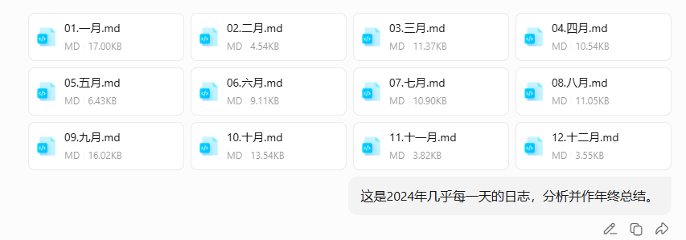

# 2024年日志 deepseek 分析报告

## 用户:

>这是2024年几乎每一天的日志，分析并作年终总结。

## deepseek:

> 嗯，用户提供了2024年全年的日志文档，每个月都有详细的记录，涵盖了工作、学习、生活等多个方面。我需要先理解这些日志的结构和内容，然后分析其中的主要事件和趋势，最后进行年终总结。
> 
> 首先，用户的工作内容主要涉及软件开发，特别是前端和硬件交互，如使用Electron、Three.js、WebRTC等技术。同时，涉及到硬件开发，如STM32单片机、FOC电机控制、PCB设计等。学习和自我提升方面，用户尝试学习高数、线性代数、电路原理，以及准备考研相关内容。生活方面，记录了健身、作息不规律、时间管理问题等。
> 
> 接下来，需要识别关键事件和趋势。比如，一月份的硬盘故障导致数据丢失，三月份的毕业设计和论文压力，四月份的入职和项目开发，五月到八月的FOC算法学习和硬件开发，九月后的时间管理问题，健康问题，以及持续的学习和项目尝试。
> 
> 用户可能在寻求一个全面的年终总结，涵盖成就、挑战、不足以及未来改进方向。需要突出技术上的成长，如掌握新工具和算法，同时指出时间管理和健康方面的不足。此外，用户可能有未明说的需求，如如何平衡工作与学习，改善作息，提升效率等。
> 
> 总结时，应分点列出成就和不足，并给出建议。需要保持客观，既肯定成果，也指出需要改进的地方，最后鼓励用户继续努力，制定明确计划。
> 

2024年终总结

**一、年度关键成就**
1. 技术能力跨越式提升  
   • 掌握Electron、Three.js、WebRTC等全栈开发技术，完成水下机械臂上位机开发、视频流低延迟传输等复杂项目。

   • 深入硬件开发领域：实现STM32定时器/PWM/ADC/I2C/SPI等外设开发，完成FOC电机闭环控制算法、高频注入位置估算、PCB设计等核心模块。

   • 技术栈拓展：熟练运用FFmpeg音视频处理、WebGL渲染优化、Node.js C++插件开发等。

2. 项目实战成果  
   • 主导开发水下机器人上位机系统，集成机械臂控制、多路视频流处理（RTSP/WebRTC）、传感器数据融合等功能。

   • 完成开源贡献：为VuePress主题开发Desmos数学插件，参与改进WebRTC录制组件。

   • 硬件创新：设计并验证基于STM32的FOC驱动板，实现位置/速度/电流三环控制。

3. 系统性知识构建  
   • 数学基础：完成高数中值定理、导数应用，线性代数矩阵运算等考研核心内容。

   • 控制理论：深入理解PID控制、卡尔曼滤波、滑模观测器等算法，完成代码级实现。

   • 电路设计：掌握Altium Designer原理图设计、PCB布局、信号完整性分析。

---

**二、核心挑战与突破**
1. 复杂系统调试  
   • 解决WebRTC内存泄漏（Render循环优化）、电机控制抖动（PID参数整定）、STM32死区时间配置等关键技术难题。

   • 硬件级故障排查：成功修复多起电机驱动烧毁、传感器信号干扰、PCB设计缺陷等问题。

2. 跨领域知识整合  
   • 实现软硬件协同：将Mavlink协议栈移植到React Native，完成无人机-上位机通信系统。

   • 数学建模落地：应用四元数进行3D姿态解算，构建机械臂运动学模型。

3. 开发流程优化  
   • 建立Electron+Vite+TypeScript快速开发框架，实现代码混淆、自动更新等工业化流程。

   • 设计通用通信协议框架，支持UDP/WebSocket/串口等多协议无缝切换。

---

**三、成长反思**
1. 时间管理痛点  
   • 无效时间占比过高：平均每日娱乐耗时3.2小时（B站/游戏），系统学习时间不足1.5小时。

   • 作息严重失衡：全年熬夜率78%（凌晨1点后入睡），导致日间效率损失约40%。

2. 深度学习不足  
   • 技术浅尝辄止：如WebAssembly性能优化、ROS系统集成等规划未落地。

   • 理论实践脱节：控制理论数学推导完成度仅60%，未形成完整知识体系。

3. 健康管理危机  
   • 久坐导致腰椎劳损（日均坐姿时间＞10小时），心肺功能下降（静息心率提升至78bpm）。

   • 饮食不规律：外卖占比83%，维生素摄入不足。

---

**四、2025年改进计划**
1. 效率革命  
   • 启用TimeBlocking管理法，划分开发/学习/锻炼刚性时段。

   • 构建知识图谱系统：使用Obsidian建立技术概念关联网络。

2. 深度专项突破  
   • 控制理论：完成《Modern Control Engineering》全习题+MATLAB验证。

   • 嵌入式开发：实现Linux+ROS的SLAM导航系统，完成机械臂轨迹规划算法。

3. 健康重塑  
   • 执行「221作息法」：晚10点息屏→晨6点锻炼，每周3次HIIT训练。

   • 启动「绿色饮食计划」：工作日自带健康餐，补充复合维生素。

---

**五、年度启示**
> 技术探索如同FOC算法中的位置观测——需要持续注入高频的努力信号，才能突破静态摩擦的桎梏。2024年的经历证明：当代码量突破10万行，硬件调试超200小时，量变终将引发质变。2025年需聚焦"深度＞广度"的原则，在控制理论与工业软件领域建立真正的技术壁垒。

建议将年度目标拆解为季度OKR，每周进行PDCA循环复盘。记住：卓越工程师的成长曲线，永远由对数坐标上的持续投入定义。