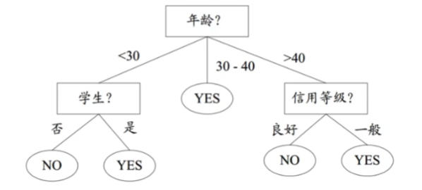
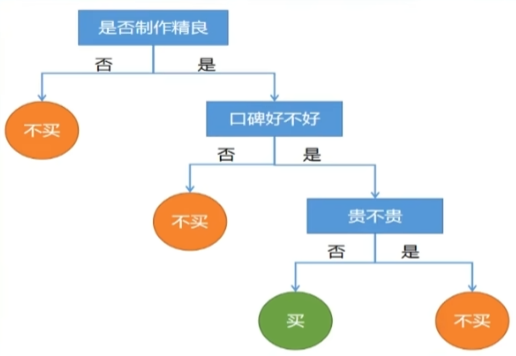
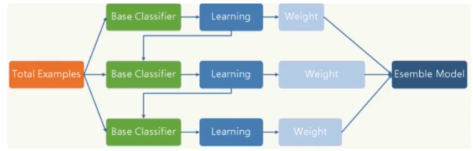
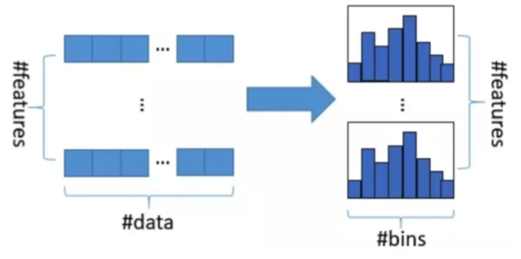

## lightGBM学习笔记

### 决策树

**决策树算法简介**
- 很多集成学习算法，如随机森林、XGBOOST、lightGBM底层实现都是决策树算法。
- 类似于流程图的树形结构
- 树的结点代表对特征的测试评估
- 树的分支代表对特征的测试评估结果
- 树的叶子节点代表类别
- 树的最高层是根节点
- 案例
  - 银行信贷资质评估
  - 
  - 购买游戏决策过程
  - 


**决策树分类**

- 分类树：分类标签值
- 回归树：预测实数值

**决策树特点**

- 从根节点开始走向叶节点。所有数据最终都会落到叶子节点，既可以做分类也可以做回归。
- 非参数的递归学习、可解释性强
- 决策树的生成是递归过程

### GBDT

**GBDT概念**

- GBDT(Gradient Boosting Decision Tree)梯度提升决策树
- 通过加法模型（基函数线性组合），不断减少训练过程产生的**残差（误差）**来达到数据分类或回归的算法
- 

**为什么GBDT选择决策树作为基学习器？**

- 决策树可看作是if-then的规则集合，**好理解、可解释**
- 决策树相比其他算法需要更少的特征工程。
  - **不需要特征标准化、归一化**！
  - 可以很好的处理字段缺失的数据
  - 不用关心特征间的相互依赖
- 决策树能自动组合多个特征


**GBDT优点**

- 可灵活处理各种数据类型、连续或离散
- 较少的调参时间就能获得较高的准确率
- 使用的损失函数健壮、对异常值鲁棒性强。

**GBDT缺点**

- 弱学习器间存在依赖关系、难以并行训练数据
- 但可通过自采样SGBT达到部分并行

### LightGBM

**概述**
- LightGBM是微软推出的梯度boosting框架
- 使用基于学习算法的决策树、与XGBoost有相同特征
  - 都基于分布式学习框架
  - 都支持大规模数据处理和计算
  - 都有更高的准确率

**算法原理（简要版）**

- 1 对所有特征按照特征的数值预排序
- 2 在遍历分割点的时候用O(#Data)的代价找到特征上最好的分割点
- 3 将数据分割成左右子节点、
- 4 不断循环


**算法核心**

- 基于Histogram（直方图）的决策树算法
- 直方图做差加速
- 带深度限制的leaf-wise的叶子生长策略
  - XGBoost是level-wise
  - LightGBM是leaf-wise
- 单边梯度采样GOSS(gradient-based One-Side Sampling)
- 互斥特征绑定EFB（Exclusive Feature Bundling）
- 支持类别特征Categorical Feature
- 多线程优化


####  基于Histogram（直方图）的决策树算法

**原理**

- 将连续的浮点特征离散成K个整数，
- 并构造宽度为K的Histogram(直方图)，
- 然后遍历训练数据，统计每个离散值在直方图中的累计统计量。
- 在进行特征选择时，只需要根据直方图的离散值，遍历寻找最优分割点。
- 
- 如
  ```python
  features[0]=[1.0, 2.0, 3.0, 4.0, 5.0, 6.0, ..., 100.0]
  hist[0] = {
    '1~10':10,
    '11~20':10,
    ......,
    '范围':'频次'
    }
  ```

**优点**

- 占用内存更低，数据分割的复杂度更低。
- 用8位整型存储，内存消耗为原来的1/8
- 时间开销由原来的O(data*features)降到O(k*features)

####  直方图做差加速

**原理**
- 一个叶子节点的Histogram可以直接由父节点的Histogram和兄弟节点的Histogram做差得到。
- 
- 如
    ```python
    features['age']=[1, 2, 3, 4, 5, 6, ..., 100]
    hist['age'] = {
        '1~10':10,
        '11~20':10,
        ......,
        '范围':'频次'
        }
    # 做差快速计算！
    # [50~100]岁频次 = [1~100]岁频次 - [1~50]岁频次 
    hist['age']['50~100'] = hist['age']['1~100'] - hist['age']['1~50']
    ```
- 通常构造直方图需要遍历该叶子上的所有数据，但直方图做差仅需遍历直方图的k个桶。

####  带深度限制的leaf-wiise的叶子生长策略


**原理**

- 每次从当前所有叶子节点中找到分裂增益（信息增益）最大的一个节点（特征）分裂成叶子、如此循环
- 

**优点**

- 在分裂次数相同的情况下，leaf-wiise相比level-wise可以降低更多误差，得到更好的精度。

**缺点**

- 可能会长出较深的决策树，导致过拟合。