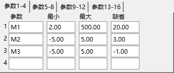
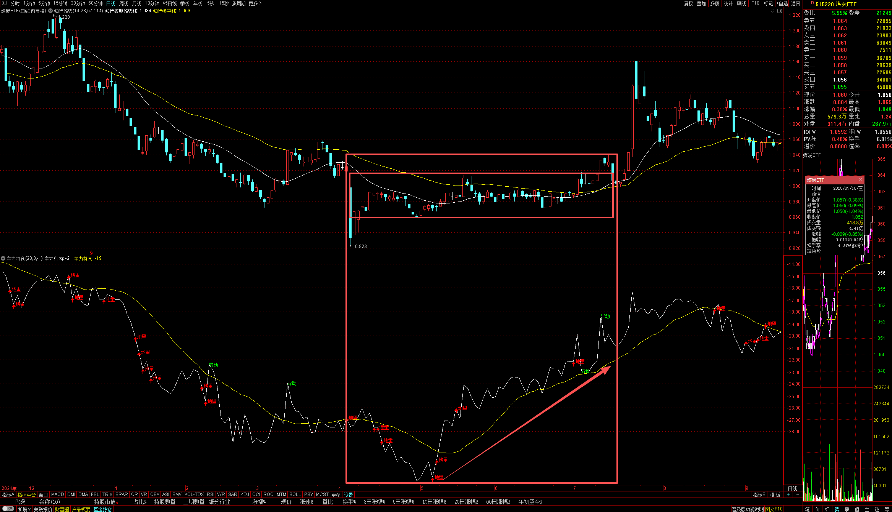
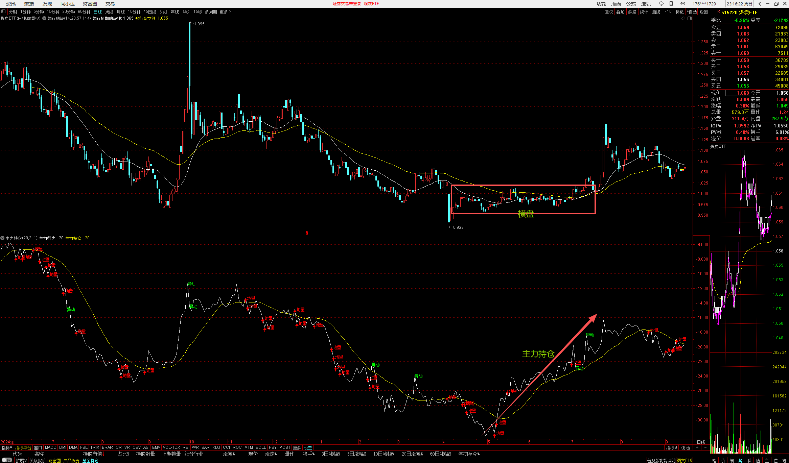
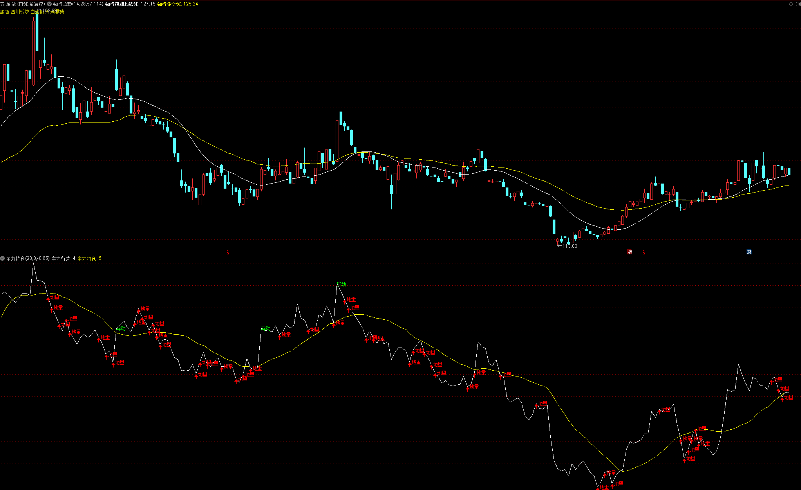

# 主力持仓指标

## V1


```bash
VOL_MEAN:=EMA(VOL,M1);
VOL_STD:=STD(VOL,M1);
VOL_ZSCORE:=(VOL-VOL_MEAN)/VOL_STD,STICK;

EQ:=CLOSE=REF(CLOSE,1);
UP:=CLOSE>REF(CLOSE,1);
AB:=ABS(VOL_ZSCORE);

主力行为:SUM(IF(EQ,0,IF(UP,AB,-AB)),0);
主力持仓:MA(主力行为,M1);

DRAWTEXT( VOL_ZSCORE > M2, 主力行为, '异动'), COLORGREEN;
DRAWTEXT( VOL_ZSCORE < M3, 主力行为, '  地量'), COLORRED;
DRAWICON( VOL_ZSCORE < M3, 主力行为, 1);
DRAWKLINE(主力持仓,REF(主力持仓,1),主力持仓,主力持仓);
```






```bash
VOL_MEAN:=MA(VOL,M1);
VOL_STD:=STD(VOL,M1);
VOL_ZSCORE:=(VOL-VOL_MEAN)/VOL_STD,STICK;

UP:=CLOSE>REF(CLOSE,1);
AB:=ABS(VOL_ZSCORE);
主力行为:SUM(IF(UP,AB,-AB),0);
主力持仓:MA(主力行为,M2);
DRAWKLINE(主力持仓,REF(主力持仓,1),主力持仓,主力持仓);
```


```bash
VOL_MEAN:=EMA(VOL,M0);
VOL_STD:=STD(VOL,M0);
VOL_ZSCORE:=(VOL-VOL_MEAN)/VOL_MEAN,STICK;

MIN_VOL:=LLV(VOL,60);
MA_VOL:=MA(VOL,5);
CLV:=((CLOSE-LOW)-(HIGH-CLOSE))/(HIGH-LOW);

EQ:=CLOSE=REF(CLOSE,1);
UP:=CLOSE>REF(CLOSE,1);

{AB:=ABS(VOL_ZSCORE);}
{主力行为:SUM(IF(EQ,0,IF(UP,AB,-AB)),0);}

{AB:=IF(VOL_ZSCORE>0.5,RADIO*(VOL-MIN_VOL),0);}
{AB:=IF(VOL_ZSCORE>0.1,RADIO*(VOL-MA_VOL),0);}
AB:=IF(VOL_ZSCORE>0,CLV * (VOL-MIN_VOL),0);


主力行为:SUM(AB,0);
主力持仓:EMA(EMA(主力行为,10),10);
```


```bash
VOL_MEAN:=MA(VOL,M1);
VOL_STD:=STD(VOL,M1);
VOL_ZSCORE:=(VOL-VOL_MEAN)/VOL_STD;

VZ_RADIO:=IF(VOL_ZSCORE>M2,1,IF(VOL_ZSCORE<M3,0,(VOL_ZSCORE+(-M3))/(M2+M3)));
CLV:=(IF(CLOSE>REF(CLOSE,1),(CLOSE-LOW),(HIGH-CLOSE)))/(HIGH-LOW);
SN:=IF(CLOSE>REF(CLOSE,1),1,-1);

主力行为:=SUM(SN*(0.25*CLV+0.75*VZ_RADIO)*VOL,0);
主力持仓:EMA(EMA(主力行为,M4),M4);

STICKLINE(主力持仓>REF(主力持仓,1),主力持仓,REF(主力持仓,1),3,0),COLORRED;
STICKLINE(主力持仓<REF(主力持仓,1),主力持仓,REF(主力持仓,1),3,0),COLORGREEN;
```