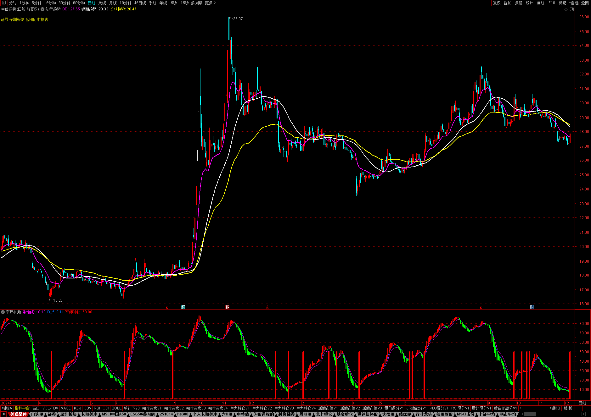
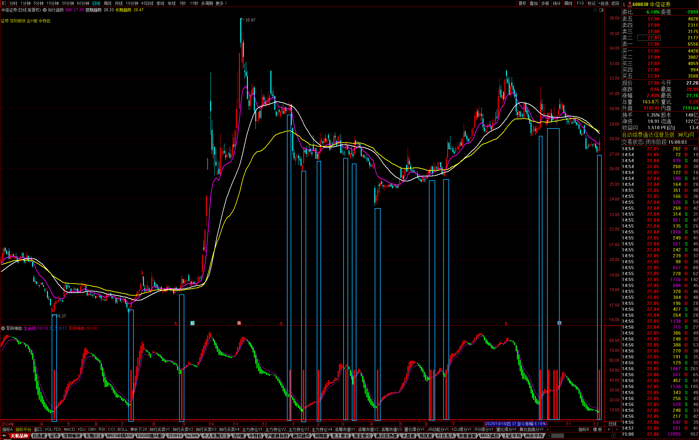

## 军师神助指标源码分析

好几次在B站刷到这个指标的视频，单纯好奇副图这根线的意义是什么，如何计算的，搞了份源代码准备研究下。


**源代码**

```vba
VA1:=HHV(HIGH,12)-LLV(LOW,26);
VA2:=HHV(HIGH,9)-CLOSE;
VA3:=CLOSE-LLV(LOW,9);
VA4:=VA2/VA1*100-70;
VA5:=(CLOSE-LLV(LOW,60))/(HHV(HIGH,60)-LLV(LOW,60))*100;
VA6:=(2*CLOSE+HIGH+LOW)/4;
VA7:=SMA(VA3/VA1*100,3,1);
VA8:=LLV(LOW,34);
VA9:=SMA(VA7,3,1)-SMA(VA4,9,1);
VARA:=IF(VA9>100,VA9-100,0);
VARB:=HHV(HIGH,34);
VARC:=EMA((VA6-VA8)/(VARB-VA8)*100,13);
VARD:=EMA(0.667*REF(VARC,1)+0.333*VARC,2);
VARE:=SMA(MAX(CLOSE-REF(CLOSE,1),0)/CLOSE,8,1)/SMA(ABS(INDEXC-REF(INDEXC,1))/INDEXC,8,1)*100-25;
VARF:=MA(VARE,3);
生命线:EMA(VARD,1),COLORFF00FF;
VAR1:=HHV(HIGH,9)-LLV(LOW,9);
VAR2:=HHV(HIGH,9)-CLOSE;
VAR3:=CLOSE-LLV(LOW,9);
VAR4:=((VAR2)/(VAR1))*(100)-70;
VAR5:=((CLOSE-LLV(LOW,60))/(HHV(HIGH,60)-LLV(LOW,60)))*(100);
VAR6:=((2)*(CLOSE)+HIGH+LOW)/(4);
VAR7:=SMA(((VAR3)/(VAR1))*(100),3,1);
VAR8:=LLV(LOW,34);
VAR9:=SMA(VAR7,3,1)-SMA(VAR4,9,1);
VAR10:=IF((VAR9>100),VAR9-100,0);
VAR11:=HHV(HIGH,34);
B1:=EMA(((VAR6-VAR8)/(VAR11-VAR8))*(100),8);
B2:EMA(B1,5),COLORFF7000;
STICKLINE(B1-B2>0,B1,B2,2,0),COLORRED;
STICKLINE(B1-B2<0,B1,B2,2,0),COLORGREEN;
V1:=MA(C,5)=HHV(MA(C,5),20);
V2:=MA(C,5)>MA(C,10);
V3:=MA(V,5)>MA(V,40)*1.01;
V4:=COUNT(MA(C,1)>REF(C,1),2)=2;
VV:=V1 AND V2 AND V3 AND V4;
A1:=EMA(CLOSE,8);
A2:=EMA(A1,20);
A3:=CROSS(A1,A2);
A4:=A1<EMA(CLOSE,120);
A5:=3*SMA((CLOSE-LLV(LOW,18))/(HHV(HIGH,18)-LLV(LOW,18))*100,21,1)-2*SMA(SMA((CLOSE-LLV(LOW,18))/(HHV(HIGH,18)-LLV(LOW,18))*100,20,1),8,1);
军师神助 :IF(CROSS(VARC,生命线) AND VARC>VARD AND VARC<55 AND C>O,50,0),COLORRED,STICK,LINETHICK4;
```


**分析和重写**

> 最后发现算法其实基本上就是KDJ

```vba
{ 生命线算法的本质类似于KDJ.D(34,13,2) }
RSV_34:=((2*CLOSE+HIGH+LOW)/4-LLV(LOW,34))/(HHV(HIGH,34)-LLV(LOW,34))*100; { 典型价的34日相对强弱 }
K_13:=EMA(RSV_34,13); { 快线：相对强弱的13日均线 }
D_2:=EMA(0.667*REF(K_13,1)+0.333*K_13,2); { 慢线: 对快线进行一阶滤波(α=0.333)+2日指数平滑 }
生命线:D_2,COLORFF00FF; { 生命线：本质就是慢线 }

K_8:=EMA(RSV_34,8); { 快线：相对强弱的13日均线 }
D_5:EMA(K_8,5),COLORFF7000; { 慢线: 对快线进行5日指数平滑 }
STICKLINE(K_8>D_5,K_8,D_5,2,0),COLORRED; { 用快慢线的差值来绘制不同高度的柱状图，表示趋势的强弱 }
STICKLINE(K_8<D_5,K_8,D_5,2,0),COLORGREEN;

{ 买入信号 本质就是K在中位之下的金叉信号 同时要求收阳线 }
买入信号:=CROSS(K_13,D_2) AND K_13>D_2 AND K_13<55 AND C>O;
军师神助 : IF(买入信号,50,0),COLORRED,STICK,LINETHICK4;
```

重写代码的最终效果和源代码效果一致


