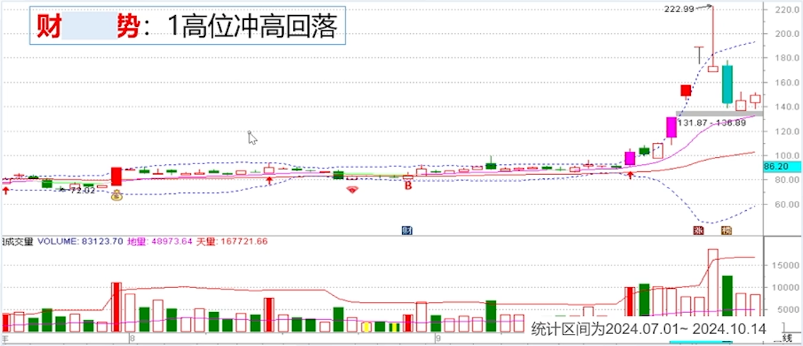
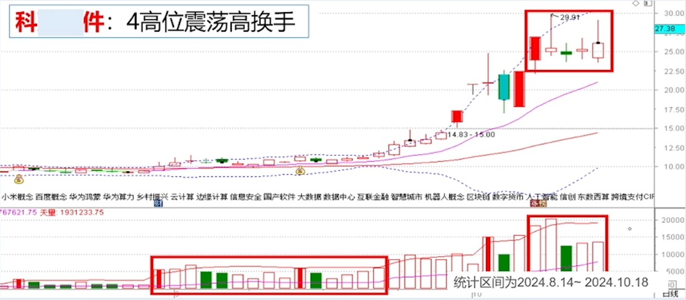
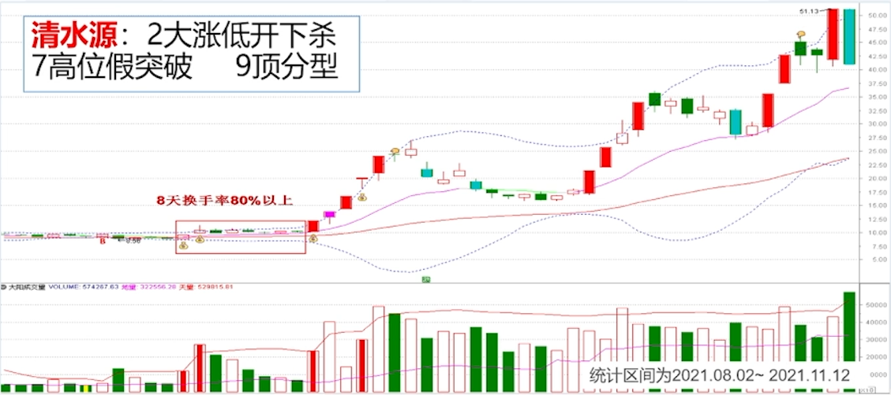
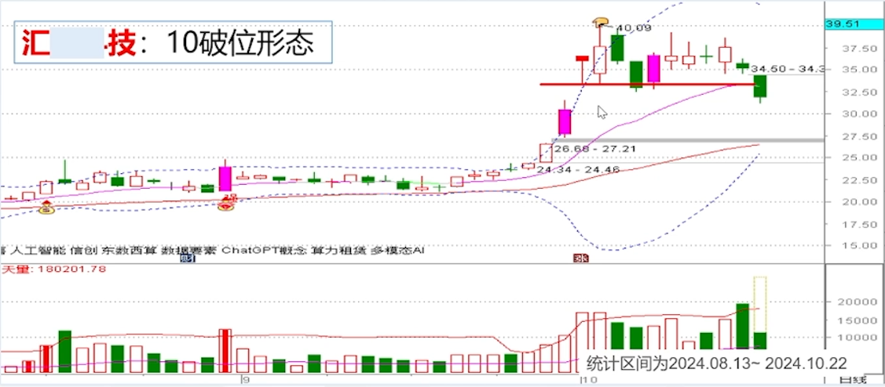
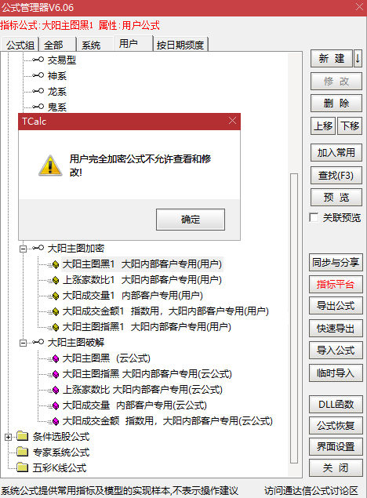

> 说明：
>
> - 指标作者是我的券商投顾（华兴证券），
> - 开始并不太信，但通过长期观察发现其推荐的股票后续涨幅确实可观，
> - 所以在此对其发布课程内容做个学习笔记，
> - 同时尝试研究和逐行分析其编写的指标。

# 大阳主图交易体系学习笔记和通达信代码破解分析

## 大阳主图作者（张向阳）简介


## 主图标识和应用

### 标识

**注册制涨停标识**

- 红色柱子：涨停（10cm 20cm 30cm）
- 粉(紫)色柱子：大于10cm上涨
- 青色柱子：跌停 及 超过 10cm下跌
- 

**主板涨停标识**

- 粉红色：涨停(10cm)
- 淡粉红色：一字涨停
- 蓝色：10cm跌停
- 淡青色：一字跌停
- 

**四条线**

- 上下轨（蓝色）
- 主力操作线（中轨，下跌绿色，上涨红色）
- 主力成本线（红）

**买卖信号**

- 地量突破信号（B）
  - 出现地量+突破
- 量价突破信号 (↑)
  - 量价齐升的突破
  - 上涨趋势非常有效
  - 下跌趋势慎用
- 超买超卖信号（手指）
- 底分型
  - 强势底分型
  - 弱势不显示
- 图穷匕见
- 黄金柱
  - 比量价齐升更强势


### 应用

#### 主力操作线（中轨）应用

**上涨趋势**

- 主力操作线（中轨）是趋势线
- **向上突破主力操盘线进入可买入区**
- 中轨之上持股待涨，若出现顶部形态可减仓
- 中轨之上是低吸高抛的机会
- 调整到中轨构成支撑，回踩向上买入，向下跌破离场。
- 防止骗线，当日跌破>2%才算有效跌破
- 跌破少于2%，看第二天收盘能否收回，否则离场。

**案例**

- 联创股份
  - 大阳主图视角
  - 
  - Z哥三线视角
  - 
- 亚光科技
  - 大阳主图视角
  - 
  - Z哥三线视角
  - 

**下跌趋势**

- 下跌趋势，股价在中轨以下不买；（例外：格兰维尔八法则上涨趋势的买点3）
- 上涨趋势，股价在中轨以下，大多数情况不可买入，但符合战法、k线形态、量能结构可买入。
- 如果趋势向下，每次反弹都受到中轨压制，一定要等待中轨走平以及股价站上才有买入价值。
- 在中轨之下的抄底都要当成短线交易。
- 格兰维尔八法则
  - 上涨趋势：3买1卖
  - 下跌趋势：3卖1买
  - 
- 

#### 主力成本线应用

**上涨趋势**

- 主力成本线是生命线，也是牛熊转折线。
  - 站上为牛，跌破为熊。
- 低位站上主力成本线，走强。
- 中轨和主力成本线低位金叉，买入信号。
- 中轨高于主力成本线是强势区。
- 最后的防守线，不跌破生息尚存，受到支撑作用向上反弹可买入，跌破一定要离场。
- 

**下跌趋势**

- 下跌趋势，主力成本线下不买；（例外：格兰维尔八法则上涨趋势的买点3）
- 主力成本线和中轨死叉是卖出信号；进入弱势区，尽量不买入。
- 如果中长线的股价走势一直在主力成本线之下受到压制，要等待主力成本线走平，以及股价站上才可买入。
- 在主力成本线之下的抄底都必须按短线做。
- 

##### 主力操作线/主力成本线规律总结

**上涨趋势规律：**

- 股价站上中轨，可操作，
- 再站上主力成本线，可加仓；
- 随后主力成本线金叉中轨，形成多头排列，可持股待涨。

**下跌趋势规律：**

- 股价跌破中轨，减仓，
- 再跌破主力成本线，离场；
- 随后主力成本线死叉中轨，形成空头排列，等待下个周期。

#### 超买超卖信号应用

**超买超卖信号**

- 
- 属于技术上的信号
  - 如：macd,kdj等的超买超卖信号
  - 任何指标不能指导买卖，连续大涨就会超买，连续大跌就会超卖。
  - 超卖存在技术修复的可能，超买也存在调整的可能。
  - 超卖超卖信号是MACD、KDJ技术指标的反应，技术指标是K线形态的反应，K线形态才是最重要的。
- 只代表技术上的超买超买信号，未必是大顶或大低。
- 需结合趋势、形态应用。
- 可用于做t,或者波段的加仓/减仓操作。
  - 越大涨，越降低仓位。
  - 否则一个回撤所有利润消失。
- 单边行情出现信号无效。
  - 单边一字板的上涨/下跌
  - 单边沿着上轨/下轨的下跌
- 
  - 做股票的习惯，抄底不重要，而是一只好票能一直拿住，吃到整个鱼身更重要。从鱼头吃到鱼尾难度极大，多数情况靠猜。
- 

## 堆量爆发买入形态

**堆量爆发形态**

- 堆量爆发是最重要，也是最常见的好形态之一是大资金常用的建仓或洗盘模式，会伴随其他好形态。是很重要的买入好形态。
- 堆量: 指成交量的堆积，阶段成交量大幅增加；
- 形态: 大多是诸如红箭头突破后的放量区间震荡；
- 特点: 多出现在建仓或出货阶段;属于主动做盘;
  - 主动做盘：有意识的主动收集筹码和震荡洗盘
- 位置: 中低位是好机会; 高位大多是对倒出货，有风险；
- 买入时机：突破是好买点，可潜伏，特别是热点题材；
- 止损设置: 震荡区间的下沿或大阳主图的中轨、下轨等。

**堆量的本质**

- 堆量是资金建仓的好形态，出现在高位就不符合逻辑
- 堆量也是高位出货最常见的形态
- 低位才是博弈的机会;
- 高位极具风险；
- 结合下一节很重要的课---高风险形态
- 高 位 不 信故事
- 低 位 不 惧 利 空

**低位堆量案例**

- 健康元 
- 双成药业 
- 清水源 
- 引力传媒 
- 天风证券 
- 财富趋势 
- 软通动力 
- 凯胜科技 
- 天利科技 
- 赢时胜 

**高位堆量案例**

- 宏业期货 
- 科蓝软件 
- 常山北明 

**总结**

- 常见的形态，长短期皆可，短期易识别，中长期不易识别;
- 突破买入很直观;止损容易设置;性价比合理;
- 中低位多是资金建仓;往往能抓住大牛股，
- 一般是价格先出现突破，再出现堆量；
- 中低位才是博弈的好位置:高位常用于震荡出货，务必小心;
- 前期有过大幅拉升（翻倍以上），则难以判断（老庄出货？新庄入场？），尽量找确定性;
- 叠加热点题材成功率高

## 高风险卖出形态

> 高位不信故事、低位不惧利空

**高位高风险形态**

- **高位**是指游资或资金抱团使得股价短期翻倍及以上的位置。
- 资金把股价短期炒到**高位**，一定不是为了当股东，而是为了出货；
- 会做出各种**假象**，吸引投资者接盘，一旦买入往往深度套牢；这些形态就是高风险形态。
- 识别这些高位高风险形态，有助于规避风险，避免接盘。

**常见高位高风险形态**

- 1、高位冲高回落；
- 2、高位高开回落；
- 3、大涨低开下杀;
- 4、高位震荡高换手；
- 5、高位M头;
- 6、一字板加速；
- 7、高位假突破;
- 8、高位首次跌停;
- 9、顶分型;
- 10、破位形态;
- 11、高位长下影线；
  - 低位说明有支撑；
  - 高位说明出货没出完，拉起来继续出货；
- 12、最阴险的形态；

**高风险形态的判断**

- 很少单独一种高风险形态，往往是多种高风险形态结合;
- 判断要结合位置高低;
- 结合炒作情绪;
- 结合指数形态;
- 结合热点题材;
- 结合同板块龙头表现;

**高位各种风险形态的应对方法**

- 减仓:
  - 有高位风险形态，减仓总不会错，只可能早了点
  - 两手准备，如果继续向上，还有部分仓位；
- 离场:
  - 高位风险形态保住收益很重要;
  - 一旦离场就不再恋战，寻找新的机会；

**高风险形态走势实例**

- 财富趋势
  - **T字板长下引线**和次日的**大幅低开**都是加速上涨后**动能衰竭**信号
  - 
- 软通动力
  - 
- 天风证券
  - 
- 赢时胜
  - 从一字板到下引线T字板，到小幅低开的光头实体阳线，已经能够充分说明主升浪上涨动能的衰竭，需要引起警惕，因为可以明显看出主力的筹码在低位，次日的大幅低开需毫不犹豫减仓。
  - 
- 科蓝软件
  - 
- 引力传媒
  - 
- 清水源
  - 
- 天利科技
  - 
- 弘业期货
  - 
- 汇纳科技
  - 
- 常山北明
  - 
- 双成药业
  - 

## 代码解析

真正的源代码为完全加密，此处展示的源代码为通过特殊方式提取，仅供个人学习研究。



### 大阳主图

**反编译源代码**

> 注：其中的中文字符提取后变成了数字，如DRAWTEXT_FIX中3、4、5、6、7，以及CODELIKE(8),需猜测修改。

```vba
{公式名称: 大阳主图黑1
公式描述: 大阳内部客户专用
无参数
公式类型: 技术指标公式-其他类型
画线方法: 主图叠加
公式版本: 0
显示小数: 缺省位数
坐标线位置: 自动
额外Y轴分界: 无

参数精灵:无
用法注释:无
公式源码:}
DRAWTEXT_FIX(ISLASTBAR,0,0,0,HYBLOCK);
DRAWTEXT_FIX(ISLASTBAR,1,0,0,DYBLOCK);
DRAWTEXT_FIX(ISLASTBAR,0,2,0,GNBLOCK);
DRAWTEXT_FIX(ISLASTBAR,0,0,3,FGBLOCK);
X_1:=IF(DATE<=1291231,1,0);
PE:DYNAINFO(39),NODRAW;
X_2:=FINANCE(43);
PEG:DYNAINFO(39)/FINANCE(43),NODRAW;
DRAWTEXT_FIX(ISLASTBAR,0.05,0,0,3),COLORRED;
DRAWTEXT_FIX(ISLASTBAR,0.05,0.06,0,CON2STR(FINANCE(20)/100000000,2)),COLORRED;
DRAWTEXT_FIX(ISLASTBAR,0.125,0,0,4),COLORMAGENTA;
DRAWTEXT_FIX(ISLASTBAR,0.125,0.06,0,CON2STR((FINANCE(20)-FINANCE(21))/FINANCE(20)*100,2)),COLORMAGENTA;
DRAWTEXT_FIX(ISLASTBAR,0.2,0,0,5),COLORBLUE;
DRAWTEXT_FIX(ISLASTBAR,0.2,0.06,0,CON2STR(FINANCE(44),2)),COLORBLUE;
DRAWTEXT_FIX(ISLASTBAR,0.275,0,0,6),COLORGREEN;
DRAWTEXT_FIX(ISLASTBAR,0.275,0.06,0,CON2STR(CLOSE*FINANCE(1)/FINANCE(20),2)),COLORGREEN;
DRAWTEXT_FIX(ISLASTBAR,0.325,0,0,7),COLORRED;
DRAWTEXT_FIX(ISLASTBAR,0.325,0.06,0,CON2STR(FINANCE(43),2)),COLORRED;
X_3:=MA(CLOSE,5);
主力操作线:EMA(CLOSE,14)*X_1,COLORLIGRAY;
X_4:=主力操作线;
X_5:=MA(CLOSE,25)*X_1;
X_6:=MA(CLOSE,30)*X_1;
X_7:=EMA(CLOSE,204)*X_1;
主力成本线:EMA(CLOSE,55)*X_1,COLORRED;
X_8:=MA(CLOSE,14);
压力:X_8+2*STD(CLOSE,14),DOTLINE,COLORYELLOW;
支撑:X_8-2*STD(CLOSE,14),DOTLINE,COLORYELLOW;
IF(X_4>REF(X_4,1),X_4,DRAWNULL),COLORMAGENTA;
IF(X_4<REF(X_4,1),X_4,DRAWNULL),COLORGREEN;
STICKLINE(CLOSE/REF(CLOSE,1)<1.105 AND CLOSE/REF(CLOSE,1)>1.095 AND CLOSE=HIGH,CLOSE,OPEN,2,0),COLORLIMAGENTA;
STICKLINE(CLOSE/REF(CLOSE,1)>1.105 AND OPEN<CLOSE,CLOSE,OPEN,2,0),COLORMAGENTA;
STICKLINE(CLOSE/REF(CLOSE,1)>1.095 AND LOW=HIGH AND CLOSE=HIGH,CLOSE,OPEN*0.97,2,0),COLORLIRED;
STICKLINE(CLOSE/REF(CLOSE,1)>1.19 AND CLOSE=HIGH,CLOSE,OPEN,2,0),COLORRED;
STICKLINE(CLOSE/REF(CLOSE,1)>0.895 AND CLOSE/REF(CLOSE,1)<0.905 AND CLOSE=LOW,CLOSE,OPEN,2,0),COLORBLUE;
STICKLINE(CLOSE/REF(CLOSE,1)<0.895,CLOSE,OPEN,2,0),COLORLIBLUE;
STICKLINE(CLOSE/REF(CLOSE,1)<0.905 AND LOW=HIGH AND CLOSE=HIGH,CLOSE,OPEN*0.97,2,0),COLORCYAN;
X_9:=REF(CLOSE,1)/REF(CLOSE,2)>1.045 AND REF(LOW,1)=REF(HIGH,1) AND REF(CLOSE,1)=REF(HIGH,1);
X_10:=CLOSE/REF(CLOSE,1)>1.045 AND CLOSE=HIGH;
DRAWICON(CLOSE=HHV(CLOSE,10) AND HIGH=HHV(HIGH,10) AND NOT(CLOSE=HIGH AND CLOSE=LOW) AND (CLOSE>OPEN*1.015 OR CLOSE>MAX(REF(CLOSE,1),REF(OPEN,1))*1.03) AND VOL>=HHV(VOL,5) AND VOL>REF(VOL,1)*1.8,LOW*0.975,1);
X_11:=3*SMA((CLOSE-LLV(LOW,14))/(HHV(HIGH,14)-LLV(LOW,14))*100,5,1)-2*SMA(SMA((CLOSE-LLV(LOW,14))/(HHV(HIGH,14)-LLV(LOW,14))*100,5,1),3,1);
DRAWICON(X_11>90 AND BARSCOUNT(CLOSE)>30 AND REF(X_11,2)<REF(X_11,1) AND X_11<REF(X_11,1),HIGH*1.02,12);
DRAWICON(X_11<10 AND BARSCOUNT(CLOSE)>30 AND REF(X_11,2)>REF(X_11,1) AND X_11>REF(X_11,1) AND CLOSE>REF(CLOSE,1) AND CLOSE>OPEN,LOW*0.99,11);
X_12:=MIN(CLOSE,OPEN)>MAX(REF(CLOSE,1),REF(OPEN,1));
DRAWICON(DYNAINFO(8)>0 AND BARSCOUNT(CLOSE)>30 AND HIGH>REF(HIGH,1) AND (CLOSE>=OPEN OR X_12) AND CLOSE>REF(CLOSE,1) AND NOT(REF(CLOSE,1)=REF(HIGH,1) OR REF(CLOSE,1)=REF(LOW,1)) AND NOT(REF(LOW,1)=REF(CLOSE,1) AND REF(CLOSE,1)<REF(CLOSE,2)*0.95) AND EXIST(VOL<REF(LLV(VOL,21),1),2) AND VOL>REF(VOL,1),LOW*0.985,7);
DRAWTEXT(DYNAINFO(8)>0 AND BARSCOUNT(CLOSE)>30 AND REF(LOW,1)=LLV(LOW,10) AND REF(HIGH,2)>REF(HIGH,1) AND HIGH>REF(HIGH,1) AND CLOSE>=REF(HIGH,2)*1.01 AND CLOSE>OPEN AND FINANCE(7)<24999999488,LOW*0.96,2),COLORRED;
X_13:=IF(CODELIKE(8),1.4,1.2);
X_14:=IF(CODELIKE(8),0.95,0.97);
DRAWICON(DYNAINFO(8)>1 AND BARSCOUNT(CLOSE)>30 AND CLOSE>2 AND IF(NAMELIKE(9),0,1) AND IF(NAMELIKE(10),0,1) AND VOL>=REF(VOL,1)*1.8 AND CLOSE>=REF(CLOSE,1)*1.05 AND CLOSE>OPEN AND CLOSE>HIGH*X_14 AND CLOSE=HHV(CLOSE,3) AND HIGH<REF(HIGH,2)*X_13 AND FINANCE(7)<24999999488,LOW*0.95,9);
DRAWICON(DYNAINFO(8)>1 AND BARSCOUNT(CLOSE)>30 AND CLOSE>2 AND IF(NAMELIKE(9),0,1) AND IF(NAMELIKE(10),0,1) AND (REF(LOW,1)=LLV(LOW,10) OR LOW=LLV(LOW,10)) AND REF(CLOSE,1)<REF(OPEN,1)*0.97 AND CLOSE>OPEN AND CLOSE>REF(CLOSE,1)*1.03 AND FINANCE(7)<24999999488,LOW*0.95,25);
```

**重写并添加个人理解和注释**

```vba
{ =======================四根线======================= }
主力成本线:EMA(CLOSE,55),COLORRED;

主力操盘线:EMA(CLOSE,14),COLORLIGRAY;
IF(主力操盘线>REF(主力操盘线,1),主力操盘线,DRAWNULL),COLORMAGENTA;
IF(主力操盘线<REF(主力操盘线,1),主力操盘线,DRAWNULL),COLORGREEN;

压力:MA(CLOSE,14)+2*STD(CLOSE,14),DOTLINE,COLORYELLOW;
支撑:MA(CLOSE,14)-2*STD(CLOSE,14),DOTLINE,COLORYELLOW;

{ =======================行业板块======================= }
{ 板块 := 行业 + 地域 + 概念 + 风格}
HY:=STRCAT(' 行业：',HYBLOCK);
DY:=STRCAT(' 地域：',DYBLOCK);
GN:=STRCAT(' 概念：',GNBLOCK);
FG:=STRCAT(' 风格：',FGBLOCK);
BK:=STRCAT(HY,STRCAT(DY,STRCAT(GN,FG)));
DRAWTEXT_FIX(ISLASTBAR,0,0,0,BK),COLOR00C0C0;

{ =======================基本面======================= }
PE:DYNAINFO(39),NODRAW,COLORRED; { 市盈(动) }
PEG:DYNAINFO(39)/FINANCE(43),NODRAW,COLORMAGENTA; { 市盈(动)/利润同比% }
营收（亿）:CON2STR(FINANCE(20)/100000000,2),NODRAW,COLORRED;
主营毛利率:CON2STR((FINANCE(20)-FINANCE(21))/FINANCE(20)*100,2),NODRAW,COLORMAGENTA; { 营业收入-营业成本/营业收入 }
收入同比增长率:CON2STR(FINANCE(44),2),NODRAW,COLORRED;
市销率:CON2STR(CLOSE*FINANCE(1)/FINANCE(20),2),NODRAW,COLORMAGENTA; {收盘价 * 总股本 / 营业收入}
净利同比增长率:CON2STR(FINANCE(43),2),NODRAW,COLORRED;

{ =======================K线颜色======================= }
{ 当日涨幅∈(9.5%,10.5%) 的 收盘为最高价的光头阳线 COLORLIMAGENTA }
{ 当日涨幅>10.5% 的 收盘价大于开盘价的阳线 COLORMAGENTA }
{ 当日涨幅>10.5% 的 最高价等于最高价 且 收盘价等于最高价的 一字板 COLORLIRED }
{ 当日涨幅>19.0% 的 收盘价等于最高价的 光头阳 COLORRED }
{ 当日涨幅∈(-10.5%,-9.5%) 的 收盘价等于最低价的 光头阴 COLORBLUE }
{ 当日涨幅<-10.5% 的 阴线 COLORLIBLUE }
{ 当日涨幅<-10.5% 的 最低价等于最高价 且 收盘价等于最高价 一字跌停 COLORCYAN }
STICKLINE(CLOSE/REF(CLOSE,1) < 1.105 AND CLOSE/REF(CLOSE,1) > 1.095 AND CLOSE=HIGH,CLOSE,OPEN,2,0),COLORLIMAGENTA;
STICKLINE(CLOSE/REF(CLOSE,1) > 1.105 AND OPEN<CLOSE,CLOSE,OPEN,2,0),COLORMAGENTA;
STICKLINE(CLOSE/REF(CLOSE,1) > 1.095 AND LOW=HIGH AND CLOSE=HIGH,CLOSE,OPEN*0.97,2,0),COLORLIRED;
STICKLINE(CLOSE/REF(CLOSE,1) > 1.19 AND CLOSE=HIGH,CLOSE,OPEN,2,0),COLORRED;
STICKLINE(CLOSE/REF(CLOSE,1) > 0.895 AND CLOSE/REF(CLOSE,1) < 0.905 AND CLOSE=LOW,CLOSE,OPEN,2,0),COLORBLUE;
STICKLINE(CLOSE/REF(CLOSE,1) < 0.895,CLOSE,OPEN,2,0),COLORLIBLUE;
STICKLINE(CLOSE/REF(CLOSE,1) < 0.905 AND LOW=HIGH AND CLOSE=HIGH,CLOSE,OPEN*0.97,2,0),COLORCYAN;

{ =======================主图标识======================= }

{ 量价突破信号 ↑ }
DRAWICON(
    CLOSE=HHV(CLOSE,10) AND HIGH=HHV(HIGH,10) { 收盘价和最高价均为10日最高价 }
    AND VOL>=HHV(VOL,5) { 成交量是5日最高 }
    AND VOL>REF(VOL,1)*1.8 { 成交量是昨日1.8倍以上 }
    AND NOT(CLOSE=HIGH AND CLOSE=LOW) { 不是一字板 NOT(收盘价=最高价=最低价) }
    AND (CLOSE>OPEN*1.015 OR CLOSE>MAX(REF(CLOSE,1),REF(OPEN,1))*1.03), { 当日实体涨幅>1.5% 或 两日累计实体涨幅超过昨日K线实体最大值的3% }
    LOW*0.975,
    1
);

{
  X_11:=3*SMA((CLOSE-LLV(LOW,14))/(HHV(HIGH,14)-LLV(LOW,14))*100,5,1)-2*SMA(SMA((CLOSE-LLV(LOW,14))/(HHV(HIGH,14)-LLV(LOW,14))*100,5,1),3,1);
  X_11的本质为J:=KDJ.J(14,5,3);
  即：
  RSV_14 := (CLOSE-LLV(LOW,14))/(HHV(HIGH,14)-LLV(LOW,14))*100;
  K_5 := SMA(RSV_14,5,1);
  D_3 := SMA(K_5,3,1);
  X_11 := 3 * K_5 - 2 * D_3;
}
J:=KDJ.J(14,5,3);
{ 超买信号 👇 }
DRAWICON(
    J>90 { 超买区 }
    AND REF(J,2)<REF(J,1) AND REF(J,1)>J { J顶部拐头：前天 < 昨天 > 今天 }
    { 过滤股票 }
    AND BARSCOUNT(CLOSE)>30, { 有至少30根K线收盘数据 }
    HIGH*1.02,
    12
);

{ 超卖信号👆 }
DRAWICON(
    J<10  { 超卖区 }
    AND REF(J,2)>REF(J,1) AND REF(J,1) < J { J底部拐头：前天 > 昨天 < 今天 }
    AND CLOSE>REF(CLOSE,1) AND OPEN<CLOSE { 收出真阳线：收盘价大于开盘价 大于昨天收盘价 }
    { 过滤股票 }
    AND BARSCOUNT(CLOSE)>30, { 有至少30根K线收盘数据 }
    LOW*0.99,
    11
);

{ 
  实体向上跳空缺口：今日K线实体完全在昨日K线实体上方
  忽略两天盘中波动造成的上下引线，只看开盘价和收盘价
  因为，开盘价是集合竞价资金博弈的结果，收盘价是日内资金博弈的结果
  上下影线都看作是噪音
}

{ 地量启动信号B }
实体跳空:=MIN(CLOSE,OPEN)>MAX(REF(CLOSE,1),REF(OPEN,1));
DRAWICON(
    CLOSE>REF(CLOSE,1)    { 真阳线：收盘价上涨 }
    AND (CLOSE>=OPEN OR 实体跳空 )   { 阳线 或 有实体向上跳空缺口 }
    AND HIGH>REF(HIGH,1)    { 最高价创昨日新高：最高价突破昨日最高价 }
    AND NOT(REF(CLOSE,1)=REF(HIGH,1) OR REF(CLOSE,1)=REF(LOW,1))   { 昨日不是光头光脚K线 }
    AND REF(NOT(LOW=CLOSE AND CLOSE<REF(CLOSE,1)*0.95),1)   { 昨日不是光头阴线且跌幅<5% }
    AND VOL>REF(VOL,1)    { 相比昨天放量 }
    AND EXIST(VOL<REF(LLV(VOL,21),1),2)   { 近2日内出现过地量：量能小于近21日最低量 }
    { 过滤股票 }
    AND DYNAINFO(8)>0   { 没有停牌：最新成交量>0手 }
    AND BARSCOUNT(CLOSE)>30,    { 有至少30根K线收盘数据 }
    LOW*0.985,
    7
);

{ 强势的底分型 }
DRAWTEXT(
    CLOSE>OPEN   { 收阳线 }
    { 近3日的最高点V型走势且收盘价有效突破：前日高点 > 昨日高点 < 今日高点 且 收盘价有效突破前日高点1% }
    AND REF(HIGH,2)>REF(HIGH,1) AND REF(HIGH,1)<HIGH AND CLOSE>=REF(HIGH,2)*1.01
    AND REF(LOW,1)=LLV(LOW,10)   { 昨日是10日低点 }
    { 过滤股票 }
    AND DYNAINFO(8)>0  { 没有停牌：最新成交量>0手 }
    AND BARSCOUNT(CLOSE)>30   { 有至少30根K线收盘数据 }
    AND FINANCE(7)<24999999488,  { 小盘股：流通股本（股）< 25亿股 }
    LOW*0.96,
    '强'
),COLORRED;

{ 黄金柱💰 比量价齐升更强势的信号 }
DRAWICON(
    CLOSE>OPEN   { 收阳线 }
    AND CLOSE>=REF(CLOSE,1)*1.05   { 实际涨幅≥5% }
    AND CLOSE=HHV(CLOSE,3)   { 收盘价是3日最高 }
    AND VOL>=REF(VOL,1)*1.8   { 成交量相比昨天放大1.8倍 }
    AND CLOSE>HIGH*(IF(CODELIKE('300') OR CODELIKE('688'),0.95,0.97))   { 上影线短：从最高点回落到收盘跌幅不超过5%/3%  创业科创板/其他 }
    AND HIGH<REF(HIGH,2)*(IF(CODELIKE('300') OR CODELIKE('688'),1.4,1.2))   { 没有主升：最高价未突破前日最高价的40%/20% 创业科创板/其他 }
    { 过滤股票 }
    AND IF(NAMELIKE('ST'),0,1)   { 排除ST股 }
    AND IF(NAMELIKE('*ST'),0,1)   { 排除*ST股 }
    AND DYNAINFO(8)>0  { 没有停牌：最新成交量>0手 }
    AND BARSCOUNT(CLOSE)>30   { 有至少30根K线收盘数据 }
    AND FINANCE(7)<24999999488  { 流通股本（股）< 25亿股 }
    AND CLOSE>2,  { 股价>2元 (流通市值>50亿) }
    LOW*0.95,
    9
);

{ 图穷匕见💎 }
DRAWICON(
    CLOSE>OPEN { 收阳 }
    AND CLOSE>REF(CLOSE,1)*1.03 { 今日涨幅>3% }
    AND (REF(LOW,1)=LLV(LOW,10) OR LOW=LLV(LOW,10)) { 昨日或今日是10日低点 }
    AND REF(CLOSE,1)<REF(OPEN,1)*0.97 { 昨日阴线跌幅>3% }
    { 过滤股票 }
    AND IF(NAMELIKE('ST'),0,1)   { 排除ST股 }
    AND IF(NAMELIKE('*ST'),0,1)   { 排除*ST股 }
    AND DYNAINFO(8)>0  { 没有停牌：最新成交量>0手 }
    AND BARSCOUNT(CLOSE)>30   { 有至少30根K线收盘数据 }
    AND FINANCE(7)<24999999488  { 流通股本（股）< 25亿股 }
    AND CLOSE>2,  { 股价>2元 (流通市值>50亿) }
    LOW*0.95,
    25
);
```

### 大阳成交量

**反编译源代码**

```vba
{公式名称: 大阳成交量1
公式描述: 内部客户专用
无参数
公式类型: 技术指标公式-其他类型
画线方法: 副图
公式版本: 0
显示小数: 缺省位数
坐标线位置: 自动
额外Y轴分界: 无

参数精灵:无
用法注释:无
公式源码:}
X_1:=IF(CURRBARSCOUNT=1 AND PERIOD=5,VOL*240/FROMOPEN,DRAWNULL);
STICKLINE(CURRBARSCOUNT=1 AND PERIOD=5,X_1,0,(-1),(-1)),COLOR00C0C0;
VOLUME:VOL,VOLSTICK;
X_2:=VOL>=REF(VOL,1)*1.91 AND CLOSE>REF(CLOSE,1);
X_3:=VOL<REF(LLV(VOL,21),1);
X_4:=VOL<REF(LLV(VOL,55),1);
X_5:=ABS(VOL-REF(VOL,1))/REF(VOL,1)<=0.05;
STICKLINE(X_2,0,VOL,1,0),COLORRED;
STICKLINE(X_3,0,VOL,0.7,0),COLORYELLOW;
STICKLINE(X_4,0,VOL,0.7,0),COLORMAGENTA;
X_6:=MA(VOL,5);
X_7:=IF(WINNER(CLOSE),WINNER(CLOSE)*100,20);
X_8:=VOL;
X_9:=MIN(REF(X_8,1),REF(X_8,2));
X_10:=MIN(REF(X_8,3),REF(X_8,4));
X_11:=MIN(REF(X_8,5),REF(X_8,6));
X_12:=MIN(REF(X_8,7),REF(X_8,8));
X_13:=MIN(REF(X_8,9),REF(X_8,10));
X_14:=MIN(REF(X_8,11),REF(X_8,12));
X_15:=MIN(REF(X_8,13),REF(X_8,14));
X_16:=MIN(REF(X_8,15),REF(X_8,16));
X_17:=MIN(MIN(X_9,X_10),MIN(X_11,X_12));
X_18:=MIN(MIN(X_13,X_14),MIN(X_15,X_16));
X_19:=LLV(VOL,16);
X_20:=HHV(VOL,16);
X_21:=REF(MA(VOL,5),1);
地量:(X_19*3+X_21)/4,COLORMAGENTA;
天量:(X_20*3+X_21)/4,COLORRED;
```

**重写并添加个人理解和注释**

```vba
VOLUME:VOL,VOLSTICK;
地量:(3*LLV(VOL,16)+REF(MA(VOL,5),1))/4,COLORMAGENTA; { 地量=(3倍的16日最低量+5日均量前值)/4 }
天量:(3*HHV(VOL,16)+REF(MA(VOL,5),1))/4,COLORRED;{ 天量=(3倍的16日最高量+5日均量前值)/4 }

{ 在 日线 最后一根位置  预估当日收盘成交量  宽度默认 画虚线空心柱  }
STICKLINE(PERIOD=5 AND CURRBARSCOUNT=1,VOL*240/FROMOPEN,0,(-1),(-1)),COLOR00C0C0;

{ 放量(+91%) 上涨(收盘价) 宽度1 实心 COLORRED  }
STICKLINE(VOL>=REF(VOL,1)*1.91 AND CLOSE>REF(CLOSE,1),0,VOL,1,0),COLORRED;
{ 地量(低于21日最低量) 宽度0.7 实心 COLORYELLOW  }
STICKLINE(VOL<REF(LLV(VOL,21),1),0,VOL,0.7,0),COLORYELLOW;
{ 地量(低于55日最低量) 宽度0.7 实心 COLORMAGENTA  }
STICKLINE(VOL<REF(LLV(VOL,55),1),0,VOL,0.7,0),COLORMAGENTA;
```

### 堆量爆发选股

**反编译源代码**

```vba
{公式名称: 堆量爆发
公式描述: 大阳内部客户战法专用
无参数
公式类型: 条件选股公式-其他类型
公式版本: 0

参数精灵:无
用法注释:无
公式源码:}
X_1:=COUNT(DYNAINFO(37)>0.02,5)>=2 AND SUM(DYNAINFO(37),5)>0.2 AND (MA(VOL,10)*10-MA(VOL,5)*5)/(MA(VOL,5)*5)<0.5 AND EXIST(HIGH>REF(CLOSE,1)*1.05,5);
X_2:=COUNT(DYNAINFO(37)>0.02,10)>=3 AND SUM(DYNAINFO(37),10)>0.3 AND (MA(VOL,20)*20-MA(VOL,10)*10)/(MA(VOL,10)*10)<0.5 AND EXIST(HIGH>REF(CLOSE,1)*1.05,10);
XG:DYNAINFO(8)>10 AND BARSCOUNT(CLOSE)>30 AND CLOSE>2 AND FINANCE(34)>1 AND IF(NAMELIKE(10),0,1) AND IF(NAMELIKE(9),0,1) AND IF(CODELIKE(11),0,1) AND IF(CODELIKE(12),0,1) AND (X_1 OR X_2) AND FINANCE(7)<24999999488;
```

**重写并添加个人理解和注释**

```vba
{
  关于堆量表达式 (MA(VOL,10)*10-MA(VOL,5)*5)/(MA(VOL,5)*5)<0.5 的理解

  理解方式1：近5日成交总量 是 前5日的成交总量 的 2倍
  近10日成交总量 = 10*MA(VOL,10)
  近5日成交总量 = 5*MA(VOL,5)
  前5日的成交总量 = 近10日成交总量 - 近5日成交总量 = 10*MA(VOL,10) - 5*MA(VOL,5)
  原式：(MA(VOL,10)*10-MA(VOL,5)*5)/(MA(VOL,5)*5)<0.5
  => 前5日的成交总量/近5日成交总量 < 1/2
  => 近5日成交总量/前5日的成交总量 > 2倍
  即: (5*MA(VOL,5))/(10*MA(VOL,10) - 5*MA(VOL,5)) > 2
  => 近5日成交总量 > 2倍 前5日的成交总量
  即: (5*MA(VOL,5)) > 2 * (10*MA(VOL,10) - 5*MA(VOL,5))

  理解方式2： 近5日成交总量 占 近10日成交总量 2/3（66%）以上 
  原式：(MA(VOL,10)*10-MA(VOL,5)*5)/(MA(VOL,5)*5)<0.5
  => (MA(VOL,10)*10)/(MA(VOL,5)*5)<1.5
  => (MA(VOL,10)*10)<1.5*(MA(VOL,5)*5)
  => 1<1.5*(MA(VOL,5)*5)/(MA(VOL,10)*10)
  => 1/1.5<(MA(VOL,5)*5)/(MA(VOL,10)*10)
  即: 0.6667 < (MA(VOL,5)*5)/(MA(VOL,10)*10)
  即: (MA(VOL,5)*5) > 0.6667 * (MA(VOL,10)*10)
}

DLBF_05:=
  COUNT(DYNAINFO(37)>0.02,5)>=2  { 近5日至少2天单日换手率>2% }
  AND SUM(DYNAINFO(37),5)>0.2 { 近5日累计换手率>20% }
  AND ((5*MA(VOL,5))/(10*MA(VOL,10)-5*MA(VOL,5))>2 ) { 堆量异动 }
  AND EXIST(HIGH>REF(CLOSE,1)*1.05,5) { 建仓分时图：最近5天存在大于5%拉升（昨日收盘价到今日最高价） }
;

DLBF_10:=
  COUNT(DYNAINFO(37)>0.02,10)>=3 { 近10日至少3天单日换手率>2% }
  AND SUM(DYNAINFO(37),10)>0.3 { 近10日累计换手率>10% }
  AND ((10*MA(VOL,10))/(20*MA(VOL,20)-10*MA(VOL,10))>2) { 堆量异动 }
  AND EXIST(HIGH>REF(CLOSE,1)*1.05,10) { 建仓分时图：最近10天存在大于5%拉升（昨日收盘价到今日最高价） }
;

XG:
  ( DLBF_05 OR DLBF_10 )
  { 过滤股票 }
  AND DYNAINFO(8)>10 { 没有停牌：最新成交量>10手 }
  AND IF(NAMELIKE('ST'),0,1) 
  AND IF(NAMELIKE('*ST'),0,1) 
  AND IF(CODELIKE('300'),0,1) 
  AND IF(CODELIKE('688'),0,1) 
  AND FINANCE(34)>1 { 每股净资产>1 }
  AND FINANCE(7)<24999999488 { 流通股>25亿 }
  AND CLOSE>2 { 股价>2元 流通市值>50亿 }
  AND BARSCOUNT(CLOSE)>30 { 上市至少30天 }
;
```

### 上涨家数比

**反编译源代码**

```vba
{公式名称: 上涨家数比1
公式描述: 大阳内部客户专用
无参数
公式类型: 技术指标公式-其他类型
画线方法: 副图
公式版本: 0
显示小数: 缺省位数
坐标线位置: 自动
额外Y轴分界: 无

参数精灵:无
用法注释7无
公式源码:}
极端下跌:0.2,DOTLINE,COLORMAGENTA;
极端上涨:0.8,DOTLINE,COLORBLUE;
上涨家数比:INDEXADV/(INDEXDEC+INDEXADV),COLORMAGENTA;
IF(上涨家数比<0.2,上涨家数比,DRAWNULL),COLORRED,LINETHICK2;
IF(上涨家数比>0.8,上涨家数比,DRAWNULL),COLORGREEN,LINETHICK2;
X_1:=HIGH<FINANCE(34);
```

**重写并添加个人理解和注释**

```vba
略
```

### 大阳主图-指数

**反编译源代码**

```vba
{公式名称: 大阳主图指黑1
公式描述: 大阳内部客户专用
无参数
公式类型: 技术指标公式-其他类型
画线方法: 主图叠加
公式版本: 0
显示小数: 缺省位数
坐标线位置: 自动
额外Y轴分界: 无

参数精灵:无
用法7⑹�:无
公式源码:}
X_1:=MA(CLOSE,5);
主力操作线:EMA(CLOSE,14),COLORLIGRAY;
X_2:=主力操作线;
X_3:=MA(CLOSE,25);
X_4:=MA(CLOSE,30);
X_5:=EMA(CLOSE,204);
主力成本线:EMA(CLOSE,55),COLORRED;
X_6:=MA(CLOSE,14);
压力:X_6+2*STD(CLOSE,14),DOTLINE,COLORYELLOW;
支撑:X_6-2*STD(CLOSE,14),DOTLINE,COLORYELLOW;
IF(X_2>REF(X_2,1),X_2,DRAWNULL),COLORMAGENTA;
IF(X_2<REF(X_2,1),X_2,DRAWNULL),COLORGREEN;
STICKLINE(CLOSE/REF(CLOSE,1)<1.105 AND CLOSE/REF(CLOSE,1)>1.095 AND CLOSE=HIGH,CLOSE,OPEN,2,0),COLORLIMAGENTA;
STICKLINE(CLOSE/REF(CLOSE,1)>1.105 AND OPEN<CLOSE,CLOSE,OPEN,2,0),COLORMAGENTA;
STICKLINE(CLOSE/REF(CLOSE,1)>1.095 AND LOW=HIGH AND CLOSE=HIGH,CLOSE,OPEN*0.97,2,0),COLORLIRED;
STICKLINE(CLOSE/REF(CLOSE,1)>1.19 AND CLOSE=HIGH,CLOSE,OPEN,2,0),COLORRED;
STICKLINE(CLOSE/REF(CLOSE,1)>0.895 AND CLOSE/REF(CLOSE,1)<0.905 AND CLOSE=LOW,CLOSE,OPEN,2,0),COLORBLUE;
STICKLINE(CLOSE/REF(CLOSE,1)<0.895,CLOSE,OPEN,2,0),COLORLIBLUE;
STICKLINE(CLOSE/REF(CLOSE,1)<0.905 AND LOW=HIGH AND CLOSE=HIGH,CLOSE,OPEN*0.97,2,0),COLORCYAN;
X_7:=REF(CLOSE,1)/REF(CLOSE,2)>1.045 AND REF(LOW,1)=REF(HIGH,1) AND REF(CLOSE,1)=REF(HIGH,1);
X_8:=CLOSE/REF(CLOSE,1)>1.045 AND CLOSE=HIGH;
X_9:=3*SMA((CLOSE-LLV(LOW,14))/(HHV(HIGH,14)-LLV(LOW,14))*100,5,1)-2*SMA(SMA((CLOSE-LLV(LOW,14))/(HHV(HIGH,14)-LLV(LOW,14))*100,5,1),3,1);
X_10:=X_6+2*STD(CLOSE,14);
X_11:=X_6-2*STD(CLOSE,14);
X_12:=X_10/X_11;
X_13:=MIN(CLOSE,OPEN)>MAX(REF(CLOSE,1),REF(OPEN,1));
DRAWICON(DYNAINFO(8)>0 AND BARSCOUNT(CLOSE)>30 AND HIGH>REF(HIGH,1) AND (CLOSE>=OPEN OR X_13) AND CLOSE>REF(CLOSE,1) AND NOT(REF(CLOSE,1)=REF(HIGH,1) AND REF(CLOSE,1)=REF(LOW,1)) AND REF(CLOSE,1)<REF(OPEN,1)*1.03 AND NOT(REF(LOW,1)=REF(CLOSE,1) AND REF(CLOSE,1)<REF(CLOSE,2)*0.95) AND EXIST(VOL<REF(LLV(VOL,21),1),2) AND VOL>REF(VOL,1),LOW*0.995,7);

```

**重写并添加个人理解和注释**

```vba
略
```

### 大阳成交额-指数

**反编译源代码**

```vba
{公式名称: 大阳成交金额1
公式描述: 指数用，大阳内部客户专用
无参数
公式类型: 技术指标公式-其他类型
画线方法: 副图
公式版本: 0
显示小数: 缺省位数
坐标线位置: 自动
额外Y轴分界: 无

参数精灵:无
用法注释:无
公式源码:}
X_1:=IF(CURRBARSCOUNT=1 AND PERIOD=5,AMOUNT*240/FROMOPEN,DRAWNULL);
STICKLINE(CURRBARSCOUNT=1 AND PERIOD=5,X_1,0,(-1),(-1)),COLOR00C0C0;
成交金额:AMOUNT,VOLSTICK;
X_2:=AMOUNT>=REF(AMOUNT,1)*1.91 AND CLOSE>REF(CLOSE,1);
X_3:=AMOUNT<REF(LLV(AMOUNT,21),1);
X_4:=AMOUNT<REF(LLV(AMOUNT,55),1);
X_5:=ABS(AMOUNT-REF(AMOUNT,1))/REF(AMOUNT,1)<=0.05;
STICKLINE(X_2,0,AMOUNT,0.8,0),COLORRED;
STICKLINE(X_3,0,AMOUNT,0.8,0),COLORYELLOW;
STICKLINE(X_4,0,AMOUNT,0.8,0),COLORMAGENTA;
X_6:=LLV(AMOUNT,16);
X_7:=HHV(AMOUNT,16);
X_8:=REF(MA(AMOUNT,5),1);
地量:(X_6*3+X_8)/4,COLORMAGENTA;
天量:(X_7*3+X_8)/4,COLORRED;
```

**重写并添加个人理解和注释**

```vba
略
```
