# 大阳主图交易体系学习笔记和通达信代码破解分析

## 大阳主图作者（张向阳）简介

## 主图

### 标识

**注册制涨停标识**

- 红色柱子：涨停（10cm 20cm 30cm）
- 粉(紫)色柱子：大于10cm上涨
- 青色柱子：跌停 及 超过 10cm下跌
- 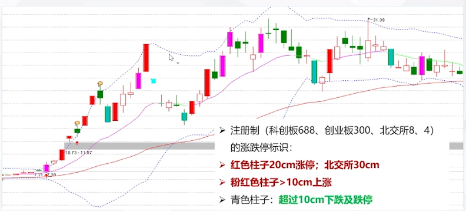

**主板涨停标识**

- 粉红色：涨停(10cm)
- 淡粉红色：一字涨停
- 蓝色：10cm跌停
- 淡青色：一字跌停
- 

**四条线**

- 上下轨（蓝色）
- 主力操作线（中轨，下跌绿色，上涨红色）
- 主力成本线（红）

**买卖信号**

- 地量突破信号（B）
  - 出现地量+突破
- 量价突破信号 (↑)
  - 量价齐升的突破
  - 上涨趋势非常有效
  - 下跌趋势慎用
- 超买超卖信号（手指）
- 底分型
  - 强势底分型
  - 弱势不显示
- 图穷匕见
- 黄金柱
  - 比量价齐升更强势

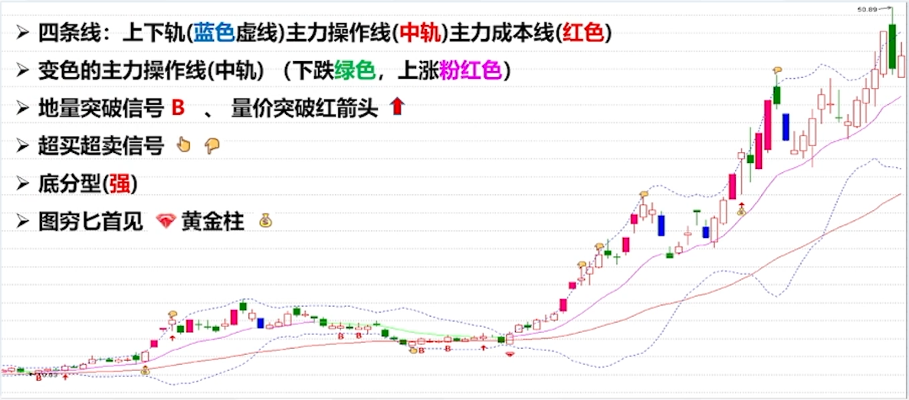
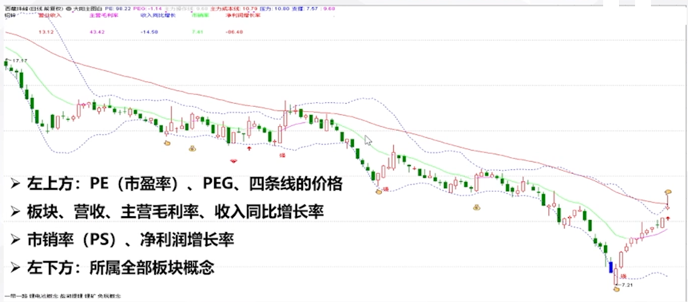

### 应用

#### 主力操作线（中轨）应用

**上涨趋势**

- 主力操作线（中轨）是趋势线
- **向上突破主力操盘线进入可买入区**
- 中轨之上持股待涨，若出现顶部形态可减仓
- 中轨之上是低吸高抛的机会
- 调整到中轨构成支撑，回踩向上买入，向下跌破离场。
- 防止骗线，当日跌破>2%才算有效跌破
- 跌破少于2%，看第二天收盘能否收回，否则离场。

**案例**

- 联创股份
  - 大阳主图视角
  - 
  - Z哥三线视角
  - 
- 亚光科技
  - 大阳主图视角
  - 
  - Z哥三线视角
  - 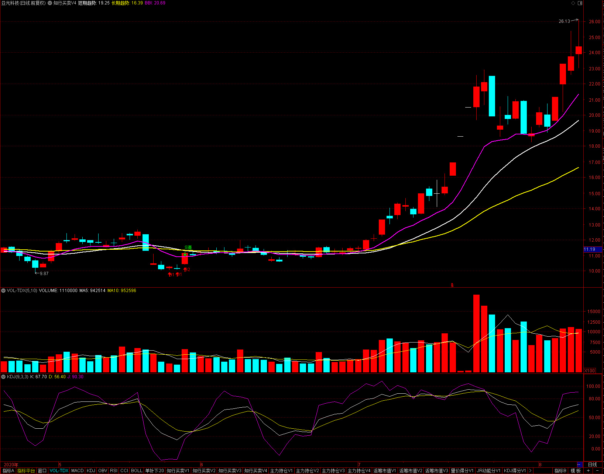

**下跌趋势**

- 下跌趋势，股价在中轨以下不买；（例外：格兰维尔八法则上涨趋势的买点3）
- 上涨趋势，股价在中轨以下，大多数情况不可买入，但符合战法、k线形态、量能结构可买入。
- 如果趋势向下，每次反弹都受到中轨压制，一定要等待中轨走平以及股价站上才有买入价值。
- 在中轨之下的抄底都要当成短线交易。
- 格兰维尔八法则
  - 上涨趋势：3买1卖
  - 下跌趋势：3卖1买
  - 
- 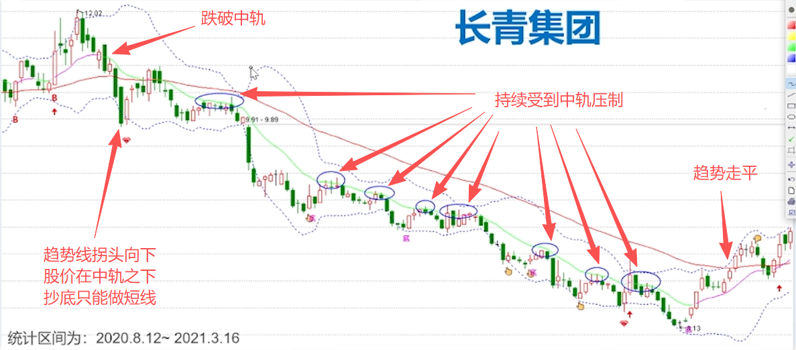

#### 主力成本线应用

**上涨趋势**

- 主力成本线是生命线，也是牛熊转折线。
  - 站上为牛，跌破为熊。
- 低位站上主力成本线，走强。
- 中轨和主力成本线低位金叉，买入信号。
- 中轨高于主力成本线是强势区。
- 最后的防守线，不跌破生息尚存，受到支撑作用向上反弹可买入，跌破一定要离场。
- 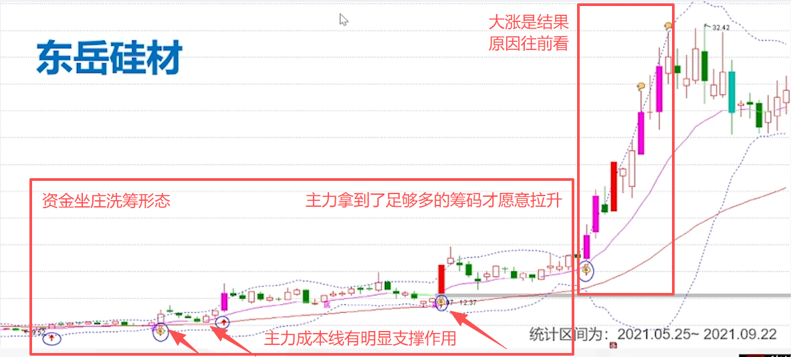

**下跌趋势**

- 下跌趋势，主力成本线下不买；（例外：格兰维尔八法则上涨趋势的买点3）
- 主力成本线和中轨死叉是卖出信号；进入弱势区，尽量不买入。
- 如果中长线的股价走势一直在主力成本线之下受到压制，要等待主力成本线走平，以及股价站上才可买入。
- 在主力成本线之下的抄底都必须按短线做。
- 

##### 主力操作线/主力成本线规律总结

**上涨趋势规律：**

- 股价站上中轨，可操作，
- 再站上主力成本线，可加仓；
- 随后主力成本线金叉中轨，形成多头排列，可持股待涨。

**下跌趋势规律：**

- 股价跌破中轨，减仓，
- 再跌破主力成本线，离场；
- 随后主力成本线死叉中轨，形成空头排列，等待下个周期。

#### 超买超卖信号应用

**超买超卖信号**

- 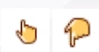
- 属于技术上的信号
  - 如：macd,kdj等的超买超卖信号
  - 任何指标不能指导买卖，连续大涨就会超买，连续大跌就会超卖。
  - 超卖存在技术修复的可能，超买也存在调整的可能。
  - 超卖超卖信号是MACD、KDJ技术指标的反应，技术指标是K线形态的反应，K线形态才是最重要的。
- 只代表技术上的超买超买信号，未必是大顶或大低。
- 需结合趋势、形态应用。
- 可用于做t,或者波段的加仓/减仓操作。
  - 越大涨，越降低仓位。
  - 否则一个回撤所有利润消失。
- 单边行情出现信号无效。
  - 单边一字板的上涨/下跌
  - 单边沿着上轨/下轨的下跌
- 
  - 做股票的习惯，抄底不重要，而是一只好票能一直拿住，吃到整个鱼身更重要。从鱼头吃到鱼尾难度极大，多数情况靠猜。
- 

## 堆量爆发买入形态

**堆量爆发形态**

- 堆量爆发是最重要，也是最常见的好形态之一是大资金常用的建仓或洗盘模式，会伴随其他好形态。是很重要的买入好形态。
- 堆量: 指成交量的堆积，阶段成交量大幅增加；
- 形态: 大多是诸如红箭头突破后的放量区间震荡；
- 特点: 多出现在建仓或出货阶段;属于主动做盘;
  - 主动做盘：有意识的主动收集筹码和震荡洗盘
- 位置: 中低位是好机会; 高位大多是对倒出货，有风险；
- 买入时机：突破是好买点，可潜伏，特别是热点题材；
- 止损设置: 震荡区间的下沿或大阳主图的中轨、下轨等。

**堆量的本质**

- 堆量是资金建仓的好形态，出现在高位就不符合逻辑
- 堆量也是高位出货最常见的形态
- 低位才是博弈的机会;
- 高位极具风险；
- 结合下一节很重要的课---高风险形态
- 高 位 不 信故事
- 低 位 不 惧 利 空

**低位堆量案例**

- 健康元 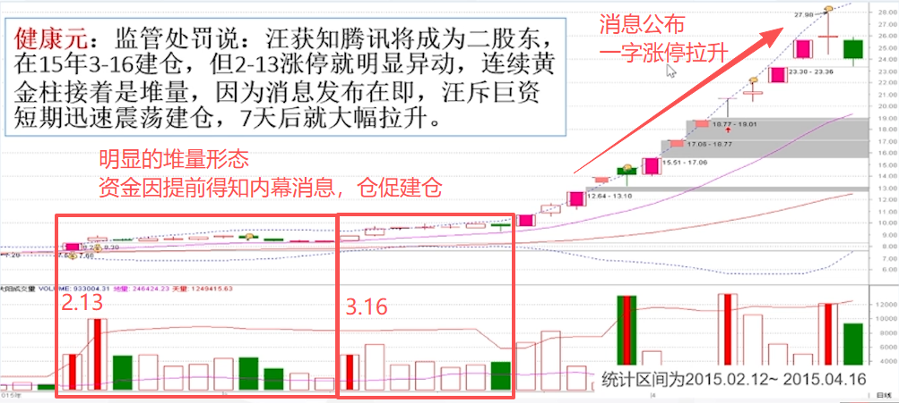
- 双成药业 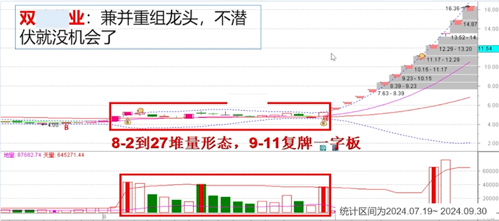
- 清水源 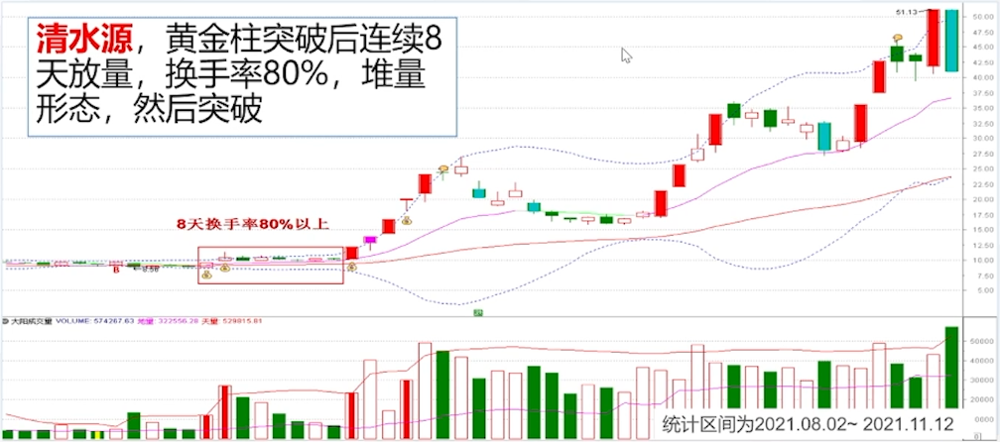
- 引力传媒 
- 天风证券 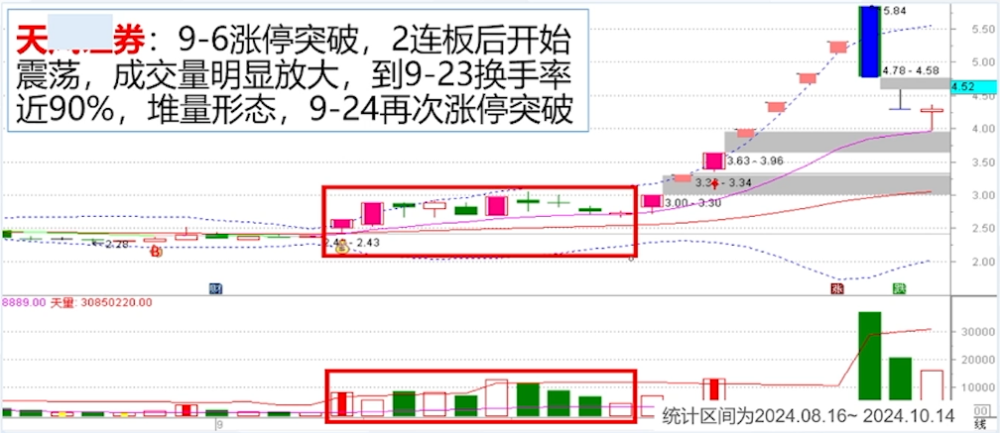
- 财富趋势 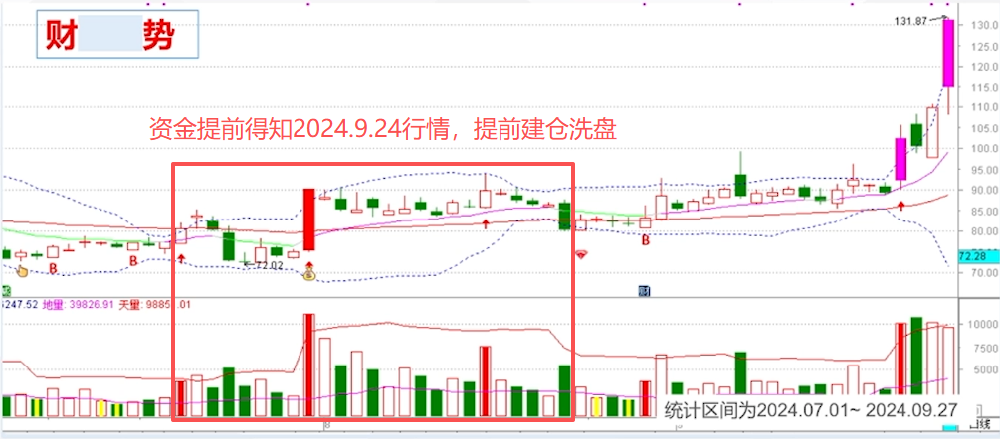
- 软通动力 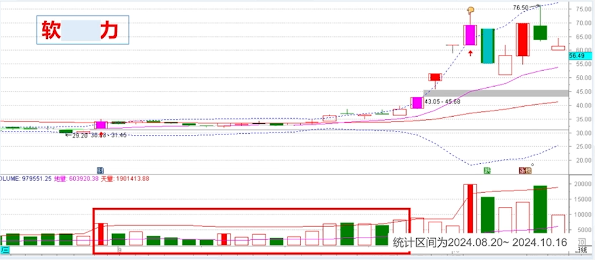
- 凯胜科技 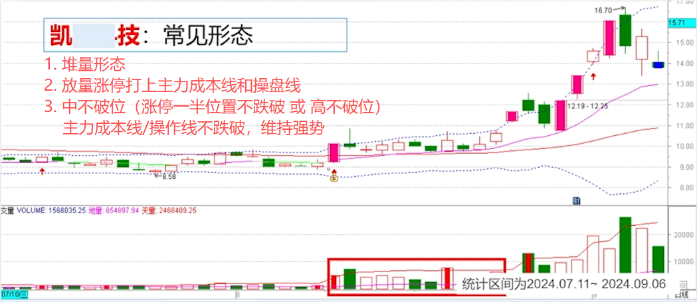
- 天利科技 
- 赢时胜 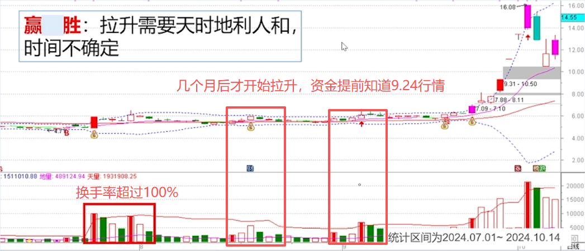

**高位堆量案例**

- 宏业期货 
- 科蓝软件 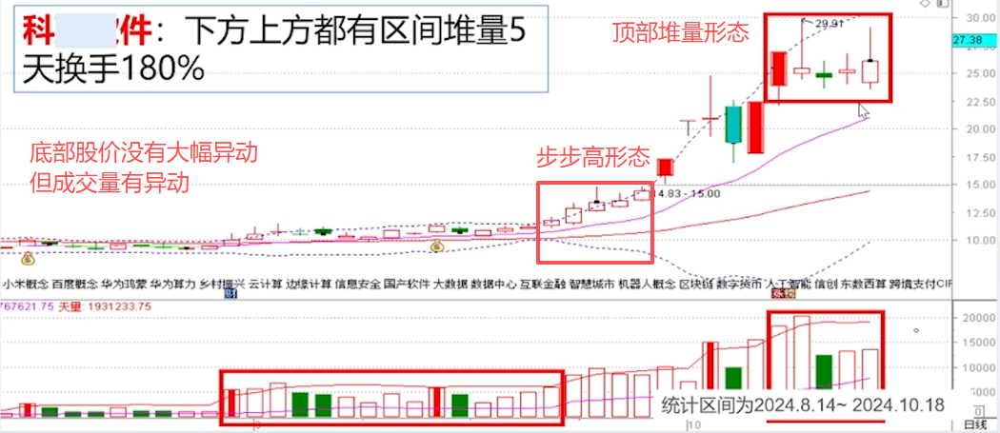
- 常山北明 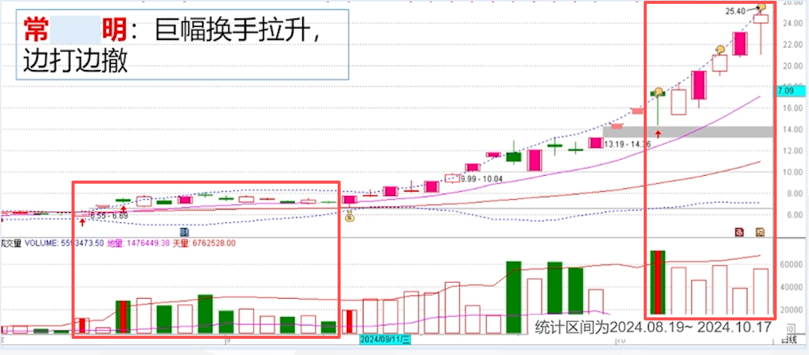

**总结**

- 常见的形态，长短期皆可，短期易识别，中长期不易识别;
- 突破买入很直观;止损容易设置;性价比合理;
- 中低位多是资金建仓;往往能抓住大牛股，
- 一般是价格先出现突破，再出现堆量；
- 中低位才是博弈的好位置:高位常用于震荡出货，务必小心;
- 前期有过大幅拉升（翻倍以上），则难以判断（老庄出货？新庄入场？），尽量找确定性;
- 叠加热点题材成功率高
