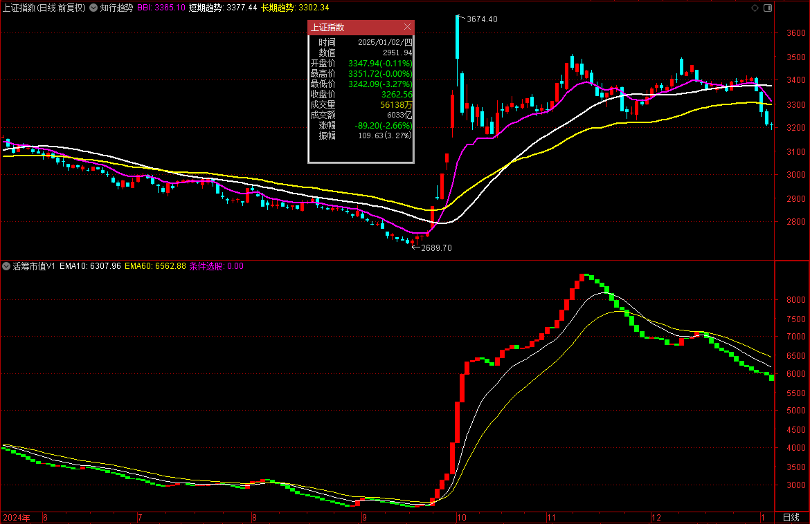

## 活跃市值V1

> 这个版本的代码来自[微信公众号文章](https://mp.weixin.qq.com/s/6TJFjU5zvW06K1f_8VDbpw)

**指标原理**

- 把10日成交额均线看作是活跃筹码市值
  - 每日成交金额，主力进出必留痕
  - 均线过滤散户噪音
- 红柱看作是资金流入
- 绿柱看作是资金流出
- 用法
  1. 选股阶段 只做红柱股
  2. 买入时机 底部红柱首现+股价站上5日线（双重保险）
  3. 止损信号 绿柱出现且破10日线，立马撤退！

**原版代码**

```vba
VAR1:=AMOUNT;
VAR2:=SMA(VAR1,10,1);
VAR3:=REF(VAR2,1);
STICKLINE(VAR2>VAR3,VAR2,VAR3,3,0),COLORRED;
STICKLINE(VAR2<VAR3,VAR2,VAR3,3,0),COLORGREEN;

{ 红柱启动:=VAR2>VAR3 AND REF(VAR2<=VAR3,1) AND CROSS(收盘价,MA(C,5)),NODRAW; }
```

**个人修改版**

```vba
活筹市值:=SMA(AMOUNT/100000000,10,1); { 把成交额(亿)的十日均线当作活跃市值 }

活筹下跌:=REF(活筹市值,1)>活筹市值;
活筹上涨:=REF(活筹市值,1)<活筹市值;

STICKLINE(活筹上涨,活筹市值,REF(活筹市值,1),3,0),COLORRED;
STICKLINE(活筹下跌,活筹市值,REF(活筹市值,1),3,0),COLORGREEN;

EMA10:EMA(活筹市值,10);
EMA60:EMA(活筹市值,20);

{-----条件选股-----}

条件选股:REF(活筹下跌,1) AND 活筹上涨 AND CROSS(C,MA(C,5)),NODRAW;

{-----交易系统-----}

{
入场信号:=REF(活筹下跌,1) AND 活筹上涨 AND CROSS(C,MA(C,5));
离场信号:=活筹下跌 AND CROSS(MA(C,10),C);

DRAWICON(入场信号, 活筹市值*0.90, 1);
DRAWICON(离场信号, 活筹市值*1.10, 2);

BUY(入场信号,活筹市值*0.90);
SELL(离场信号,活筹市值*1.10);
AUTOFILTER;
};

{
    ©Copyright 2025.09.19-now YiguiDing. All Right Reserved.
    Author: TinyRick_0729(YiguiDing)
    Email: 2449695354@qq.com
}
```

**上证指数**



**中信证券**


**广发证券**


**东方财富**


