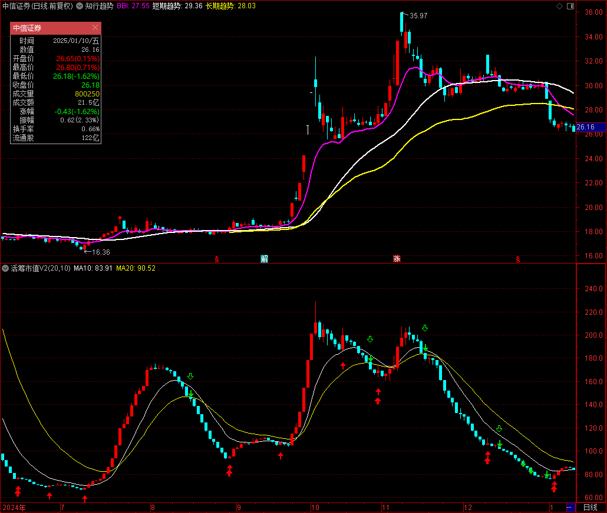
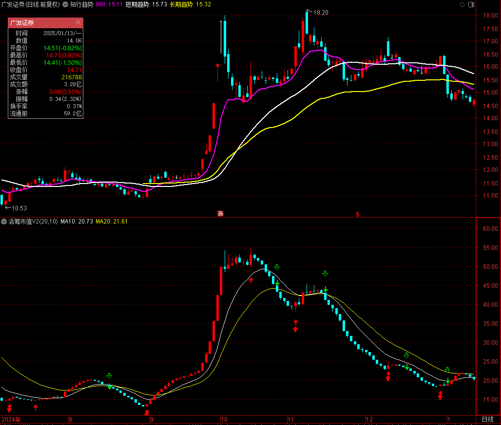
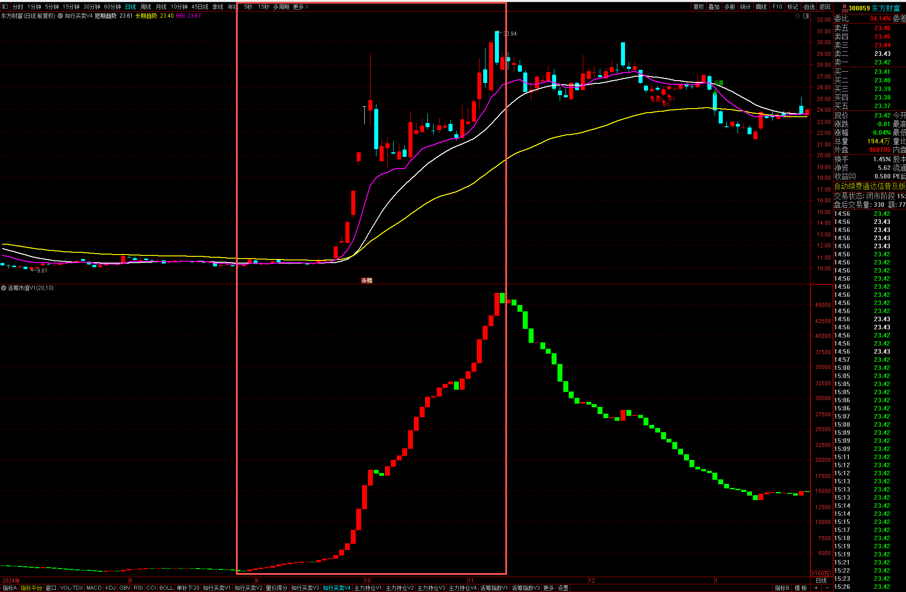
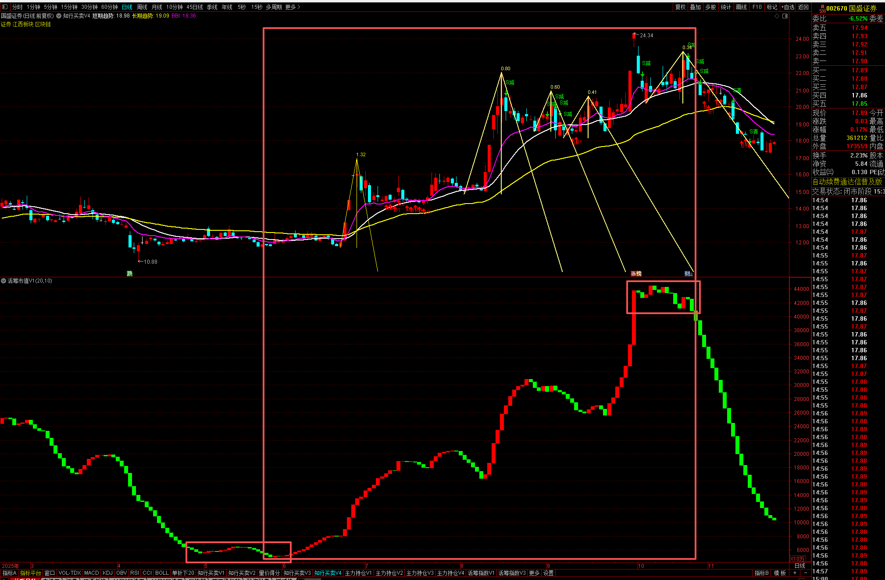

## 活跃市值V2

**指标原理**

- 将每日k线的最高价到最低价的获利比例看成是活跃筹码
- 计算成交量的量能在过去一个周期内的百分位作为活跃系数
- 定义：
  - `活跃筹码 = 流通筹码 * 活跃系数 * 活筹占比`
  - `活筹市值:=活跃筹码 * 股价`


**源代码**

```vba
{ ######## 参数配置 ######## }
N1:=20;
N2:=10;
{ ######## 活筹市值 ######## }
流通筹码:=CAPITAL * 100;
活筹占比:=SMA(EMA(WINNER(H) - WINNER(L),N1),N2,1);
活跃系数:=SMA(EMA((V-LLV(V,N1))/(HHV(V,N1)-LLV(V,N1)),N1),N2,1);
单位亿元:=1/100000000;
活跃筹码:=活跃系数 * 流通筹码 * 活筹占比 * 单位亿元;
平均价格:=(2*C+H+L)/4;
活筹市值:=活跃筹码 * 平均价格;

{ ######## K线绘制 ######## }
MA10:EMA(活筹市值,10);
MA20:EMA(活筹市值,20);
{
STICKLINE(活筹市值>REF(活筹市值,1),活筹市值,REF(活筹市值,1),3,0),COLORRED;
STICKLINE(活筹市值<REF(活筹市值,1),活筹市值,REF(活筹市值,1),3,0),COLORGREEN;
}

{ ######## K线绘制 ######## }
活筹市值O:=活跃筹码 * O;
活筹市值C:=活跃筹码 * C;
活筹市值H:=活跃筹码 * H;
活筹市值L:=活跃筹码 * L;
{DRAWKLINE(活筹市值H,活筹市值O,活筹市值L,活筹市值C);}
DRAWKLINE(活筹市值H,REF(活筹市值C,1),活筹市值L,活筹市值C);

{ ######## 交易系统 ######## }
活筹下跌:=REF(活筹市值,1)>活筹市值;
活筹上涨:=REF(活筹市值,1)<活筹市值;
入场信号:=COUNT(活筹下跌,4)=3 AND 活筹上涨;
离场信号:=CROSS(MA20,活筹市值);
多头持仓:=BARSLAST(入场信号) < BARSLAST(离场信号);
止损信号:=多头持仓 AND CROSS(0.97*REF(L,BARSLAST(入场信号)),C);

DRAWICON(入场信号, 活筹市值L*0.95, 1);
DRAWICON(离场信号 OR 止损信号, 活筹市值H*1.05, 2);

BUY(入场信号,活筹市值L*0.90);
SELL(离场信号 OR 止损信号,活筹市值H*1.10);
AUTOFILTER;

{
    ©Copyright 2025-now YiguiDing. All Right Reserved.
    Author: TinyRick_0729(YiguiDing)
    Email: 2449695354@qq.com
    Date: 2025-09-19
}
```

**中信证券**



**广发证券**



**东方财富**




**国盛证券**



**中芯国际**


**古井贡酒**


**山西焦煤**


