## 活跃市值V3

**指标原理**

- 把10日成交量均线看作是活跃筹码
- 把10日收盘价均线看作是筹码市值
- 定义：
  - `活筹市值 := 活跃筹码 * 筹码市值`

**源代码**

```vba
{ ######## 参数配置 ######## }
N1:=20;
{ ######## 活筹市值 ######## }
活筹:=SMA(V,N1,1);
均价:=SMA(C,N1,1);
活筹市值:=活筹*均价;
{
STICKLINE(活筹市值>REF(活筹市值,1),活筹市值,REF(活筹市值,1),3,0),COLORRED;
STICKLINE(活筹市值<REF(活筹市值,1),活筹市值,REF(活筹市值,1),3,0),COLORGREEN;
}

{ ######## 均线 ######## }
MA5:MA(活筹市值,5);
MA10:MA(活筹市值,10);
MA20:MA(活筹市值,20);
MA60:MA(活筹市值,60);

{ ######## K线 ######## }
活筹市值O:=活筹 * O;
活筹市值C:=活筹 * C;
活筹市值H:=活筹 * H;
活筹市值L:=活筹 * L;
{DRAWKLINE(活筹市值H,活筹市值O,活筹市值L,活筹市值C);}
DRAWKLINE(活筹市值H,REF(活筹市值C,1),活筹市值L,活筹市值C);

{ ######## 交易系统 ######## }

{
短期趋势:=MA(活筹市值,5);
长期趋势:=MA(活筹市值,10);
入场信号:=CROSS(短期趋势,长期趋势);
离场信号:=CROSS(长期趋势,短期趋势);

多头持仓:=BARSLAST(入场信号)<BARSLAST(离场信号);
止损信号:=多头持仓 AND CROSS(C,0.95*REF(L,BARSLAST(入场信号)));

DRAWICON(入场信号, 活筹市值L*0.95, 1);
DRAWICON(离场信号 OR 止损信号, 活筹市值H*1.05, 2);

BUY(入场信号,活筹市值L*0.90);
SELL(离场信号 OR 止损信号,活筹市值H*1.10);
AUTOFILTER;
}

{ ######## 版权声明 ######## }
{
    ©Copyright 2025.09.19-now YiguiDing. All Right Reserved.
    Author: TinyRick_0729(YiguiDing)
    Email: 2449695354@qq.com
}
```

`上证指数活跃市值` 和 `指南针活跃市值` 对比

**基本相识**

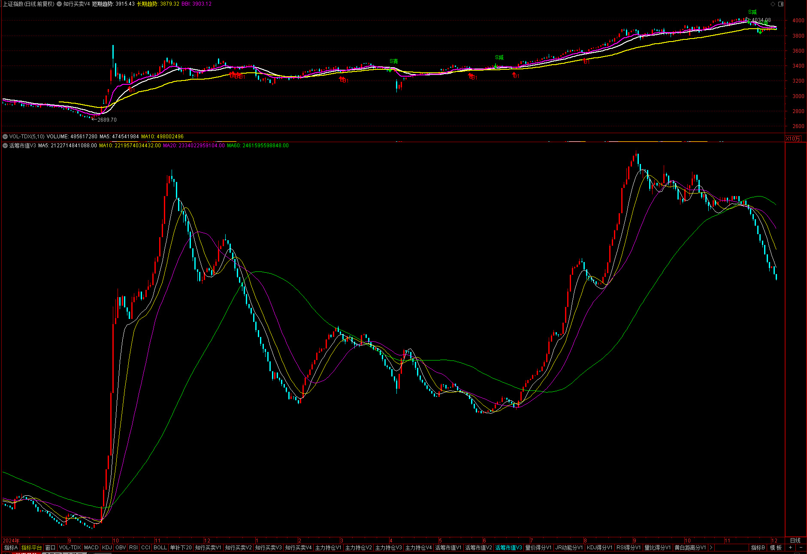


**中信证券**


**广发证券**

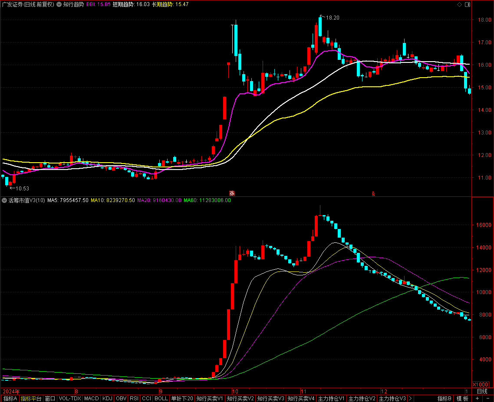
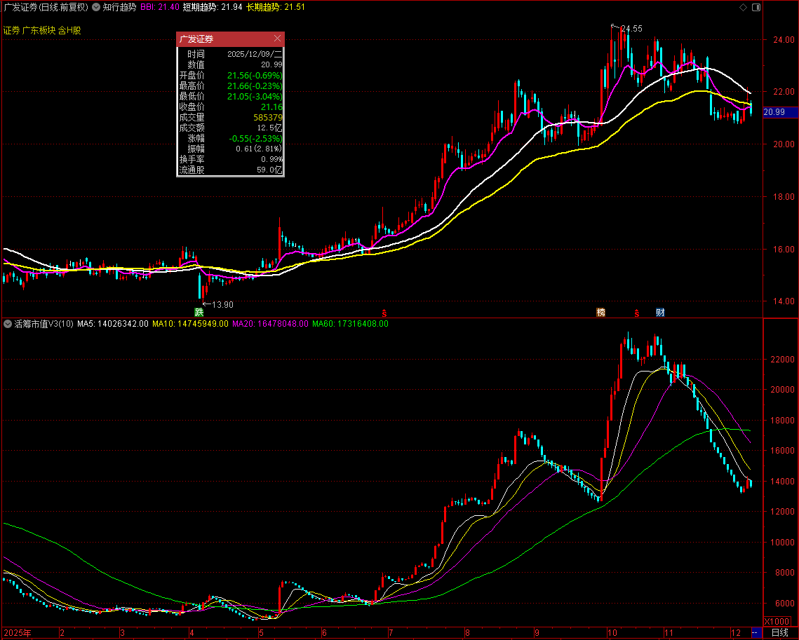

**东方财富**

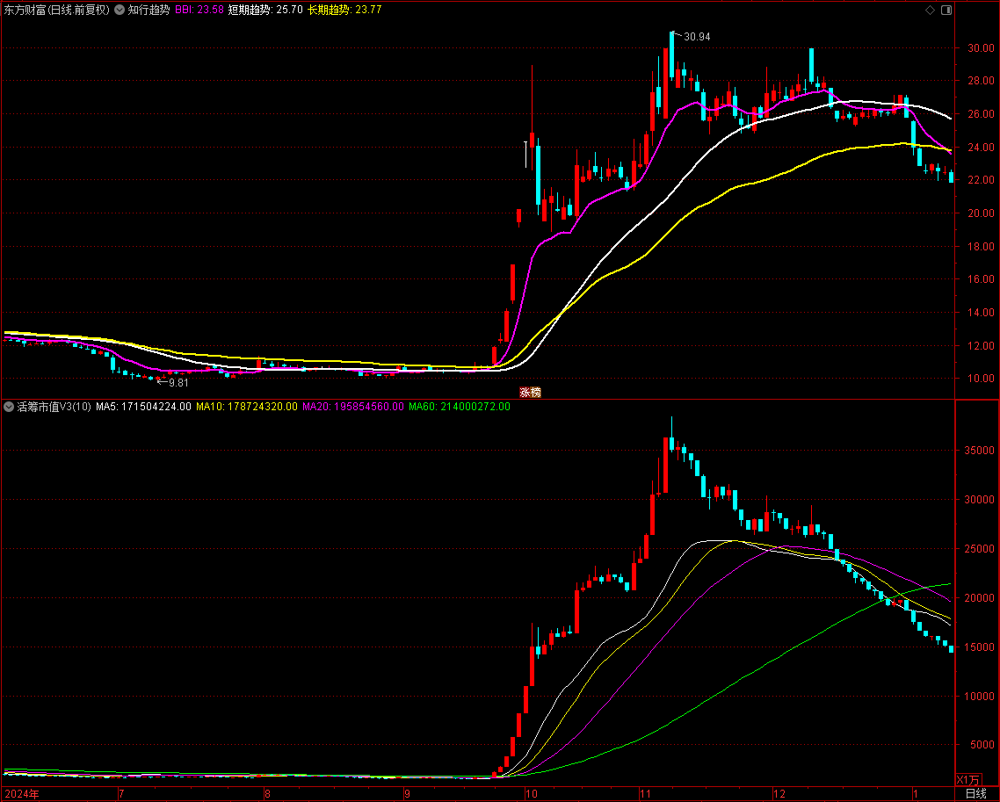


**国盛证券**

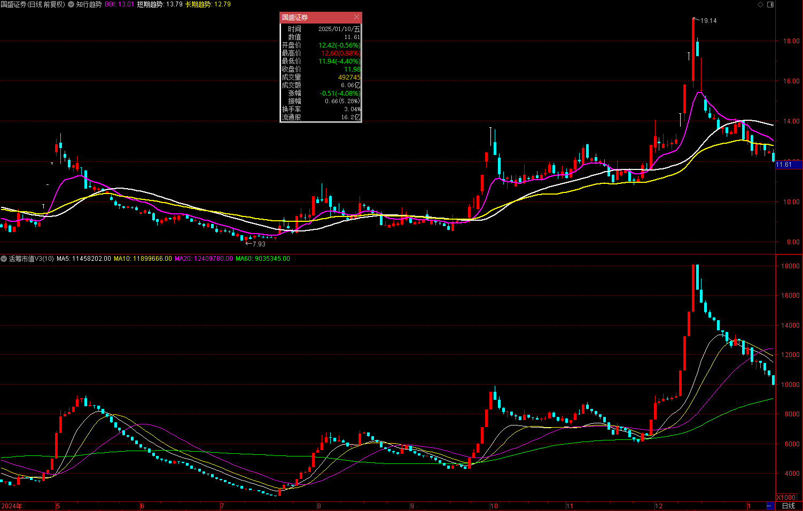


**中芯国际**

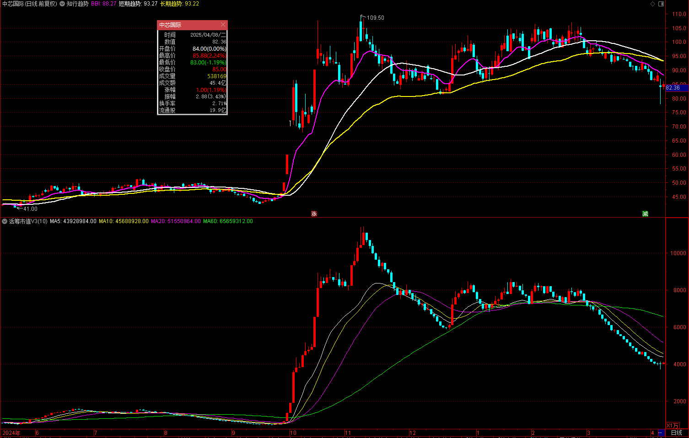


**寒武纪**


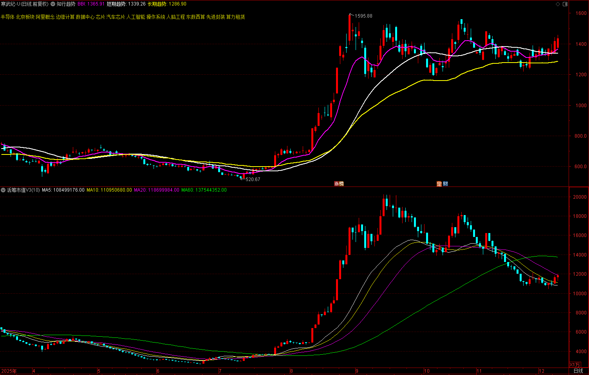

**海光信息**

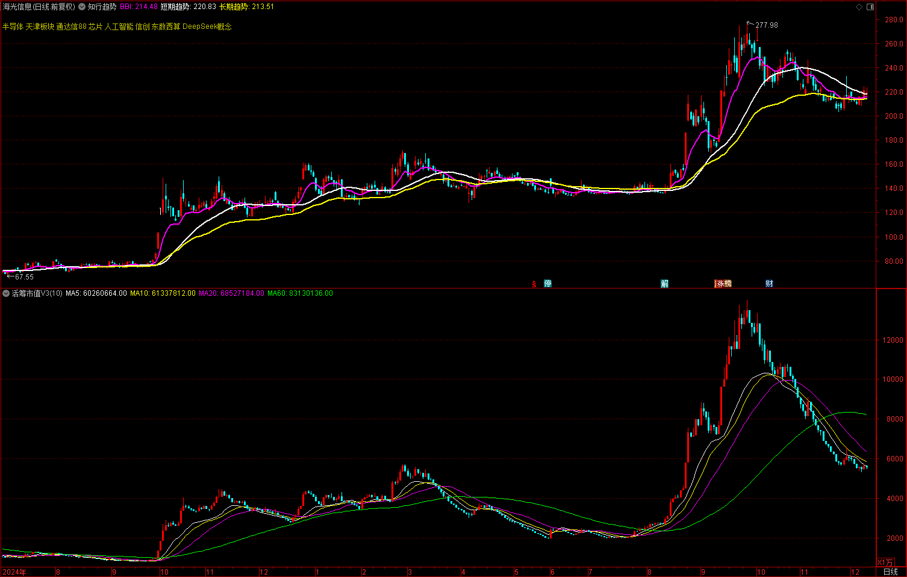
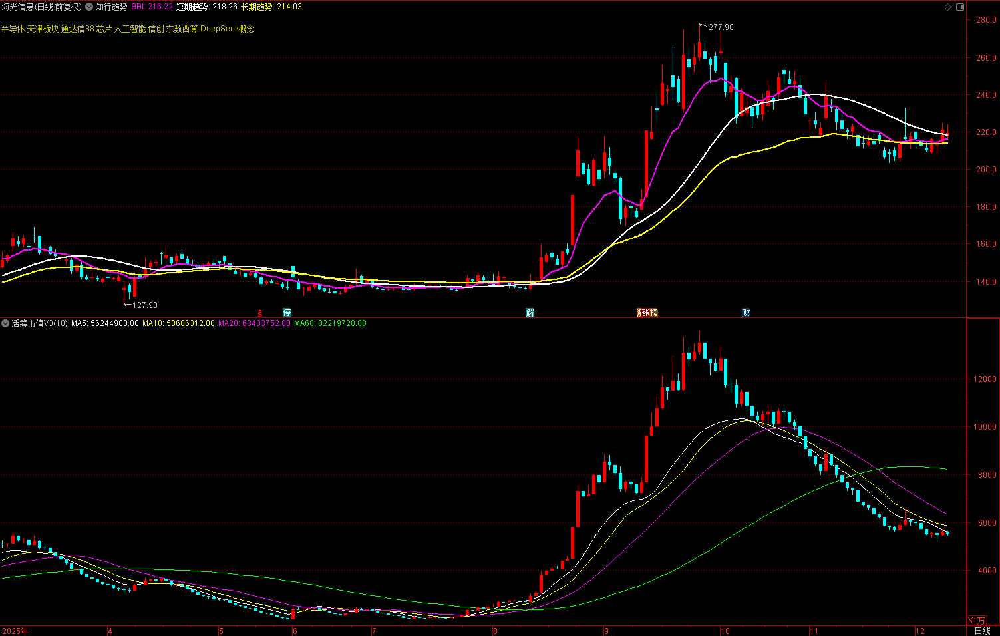

**古井贡酒**

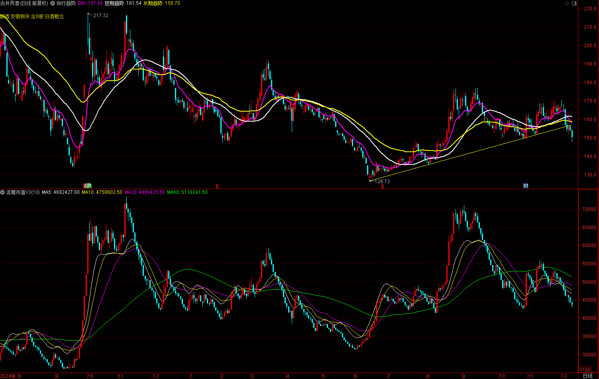

**山西焦煤**

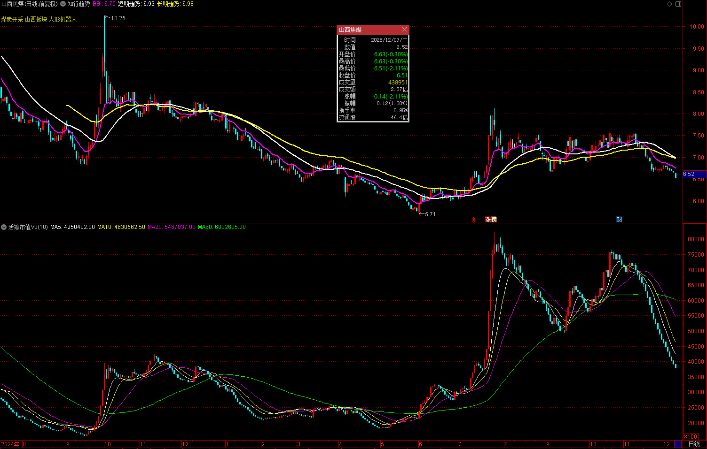
