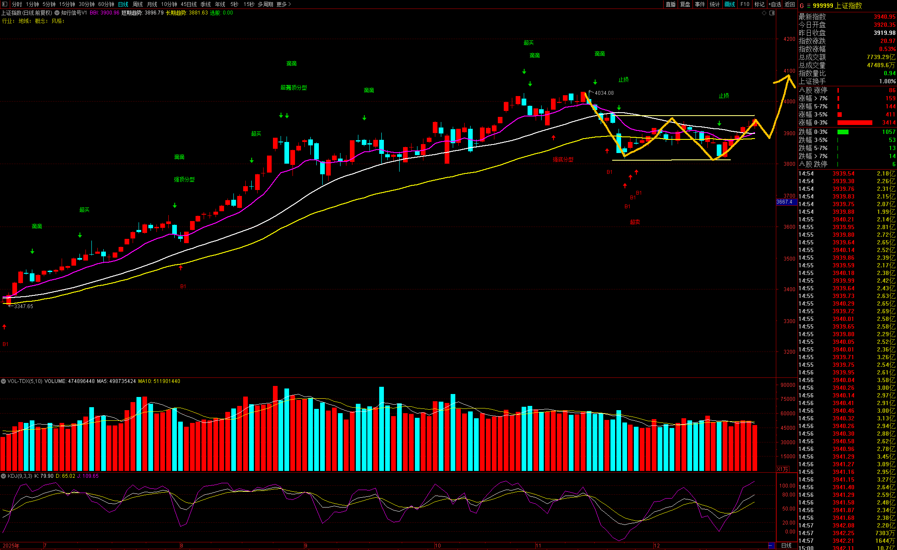
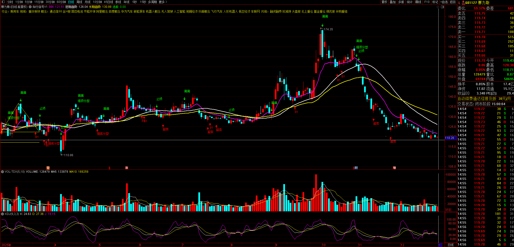
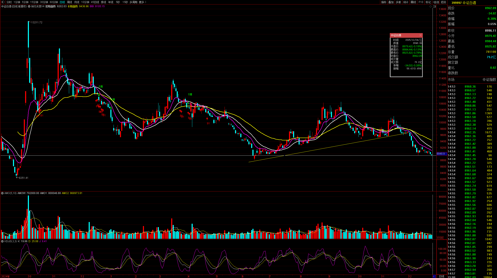
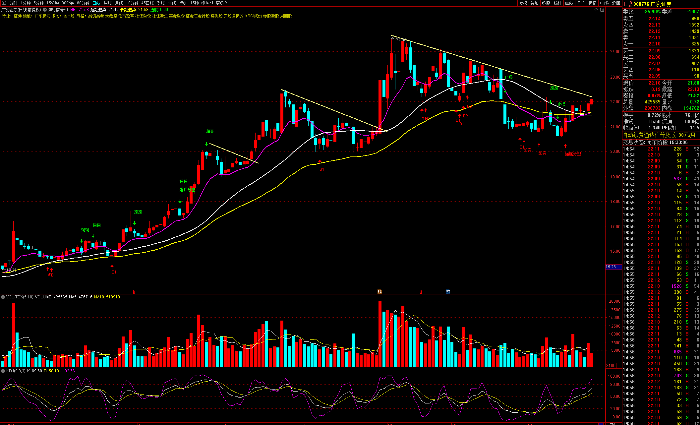
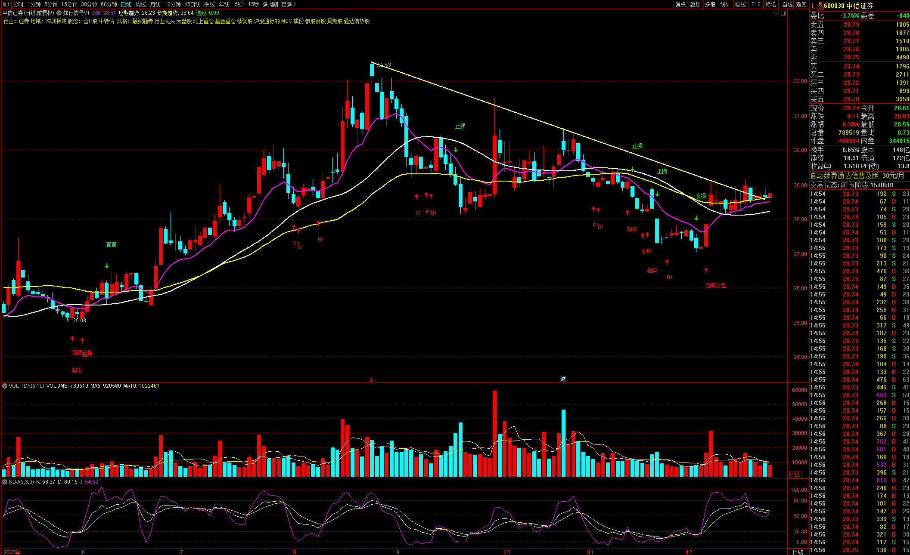
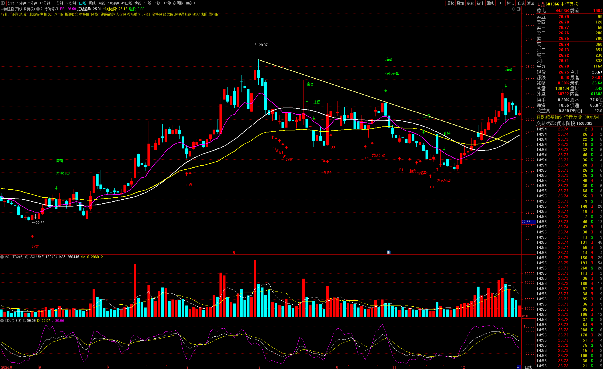
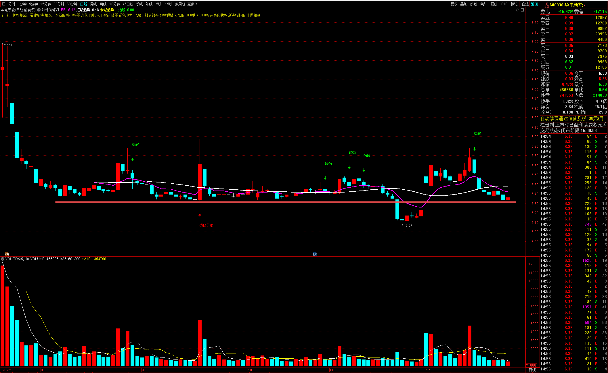

**上证指数**

- 双底构筑完成，六连阳，压力位，有回踩可能
- 

**赛力斯**

- 短期趋势的底部区间 支撑118
- 长期趋势为横盘区间震荡下沿 支撑110
- 

**中证白酒**

- 底部区间 
- 不排除继续探底测试前期低点的可能
- 短线没有入场依据 长线闭眼买入
- 

**广发证券**

- 压力位 蓄势突破
- 

**中信证券**

- 压力位 堆量蓄势向上突破
- 

**中信建投**

- 温和放量14连阳 等缩量回调
- 

**华电新能**

- 主力成本线 6.30 支撑位
- 
