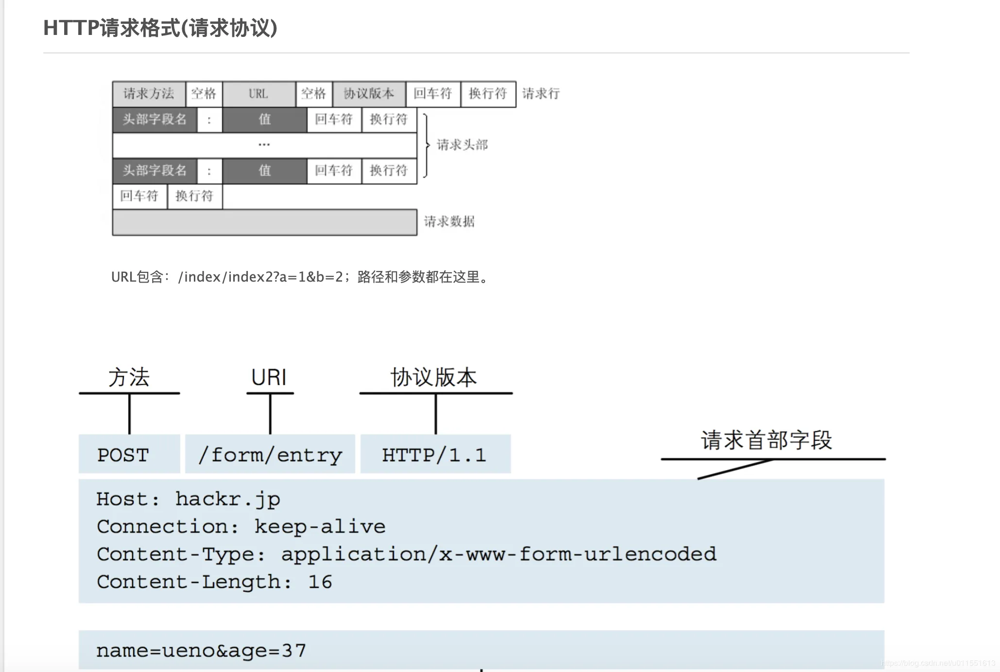
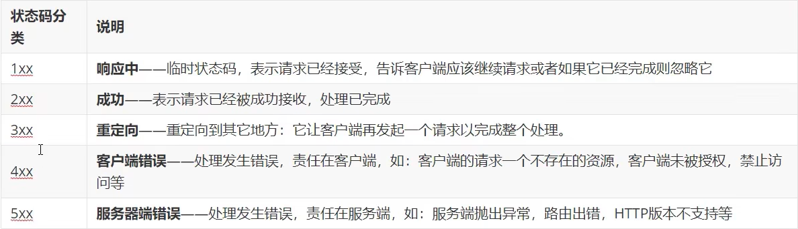
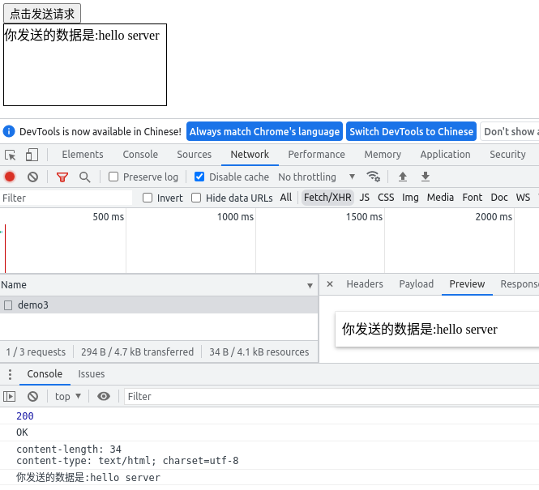
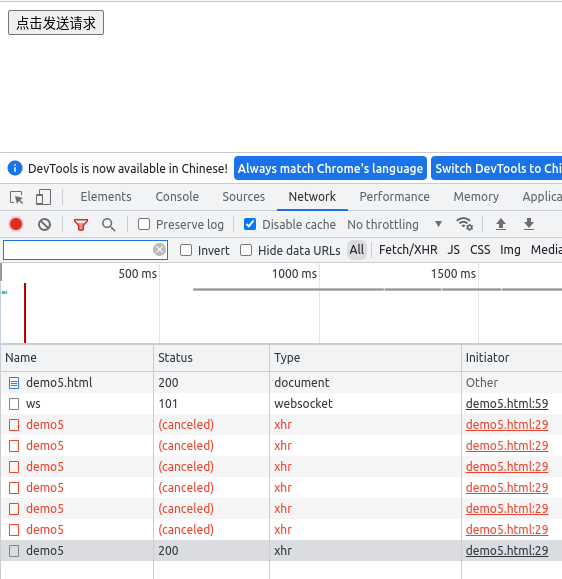

# Ajax学习笔记

## 目录

- [Ajax学习笔记](#ajax学习笔记)
  - [目录](#目录)
  - [尝试封装AJAX](#尝试封装ajax)
  - [HTTP协议](#http协议)
    - [请求报文格式](#请求报文格式)
    - [响应报文格式](#响应报文格式)
  - [AJAX](#ajax)
    - [XMLHttpRequest对象](#xmlhttprequest对象)
    - [核心API](#核心api)
  - [通过express框架启动一个后端服务](#通过express框架启动一个后端服务)
  - [ajax请求基本流程\_demo1](#ajax请求基本流程_demo1)
  - [GET请求中通过URL传递参数\_demo2](#get请求中通过url传递参数_demo2)
    - [方法1](#方法1)
    - [方法2](#方法2)
  - [POST请求中通过传递参数\_demo3](#post请求中通过传递参数_demo3)
    - [解析发送的文本](#解析发送的文本)
    - [解析url格式数据(a=123\&b=321)](#解析url格式数据a123b321)
  - [ajax设置请求头](#ajax设置请求头)
  - [ajax设置响应体数据类型](#ajax设置响应体数据类型)
  - [nodemon](#nodemon)
  - [ie缓存问题的解决](#ie缓存问题的解决)
  - [处理超时和网络异常](#处理超时和网络异常)
  - [中途手动取消请求](#中途手动取消请求)
  - [防止用户多次点击导致频繁发送相同请求](#防止用户多次点击导致频繁发送相同请求)
  - [jquery中的ajax](#jquery中的ajax)
  - [ajax工具库:axios](#ajax工具库axios)
  - [window.fetch()原生ajax接口](#windowfetch原生ajax接口)

## 尝试封装AJAX

```js
function Ajax(method,url,headers,data,callBack){
    const xhr = new XMLHttpRequest();
    xhr.open(method,url,true);
    for(keyName in headers){
        xhr.response.setRequestHeader(keyName,headers[keyName]);
    }
    xhr.send(data);
    xhr.onreadystatechange = function(){
        if(xhr.readyState==4){
            if(xhr.status>=200 && xhr.status<300){
                callBack(xhr.response);
            }
        }
    }
}

Ajax("GET","http://127.0.0.1:8000/demo1",null,null,result=>{
    console.log("接受到的响应体内容为："+result);
})
```

**测试**

  

## HTTP协议

HTTP(**H**yper **T**ext **T**ransport **P**rotocol),超文本传输协议,请求-响应协议,通常运行在TCP上

### 请求报文格式

1. 请求行
   - **请求方法**+**空格**+**URL**+**空格**+**协议版本**+**回车换行(CRLF)**
   - 示例:

      ```
      GET /index.html HTTP/1.1\r\n
      ```

2. 请求头
   - **键名**+**冒号**+**空格**+**键值**+**回车换行**
   - 示例:

      ```
      host:baidu.com\r\n
      user-Agent:chrome\r\n
      ```

   - 

3. 空行(CRLF)
   - `CR`: `Carriage Return`,回车符号,`0x0d`,`\r`
   - `LF`: `Line Feed`,换行符,`0x0a`,`\n`
   - 示例:

        ```
        \r\n
        ```

4. 报文主体
   - 数据部分
   - 示例:

        ```
        hello world!
        ```

**完整示例**

```
GET /index.html HTTP/1.1
host: baidu.com
user-Agent: chrome

hello world!
```

  

### 响应报文格式

1. 响应行
   - **协议版本**+空格+**状态码**+空格+**状态字符串**+回车换行(CRLF)
   - 示例:

        ```
        HTTP/1.1 200 OK\r\n
        ```

    - 状态码 
   - 
2. 响应头
   - **键名**+**冒号**+**空格**+**键值**+回车换行
   - 示例:

        ```
        host:baidu.com\r\n
        user-Agent:chrome\r\n
        ```

    - 

3. 空行(CRLF)
   - `CR`: `Carriage Return`,回车符号,`0x0d`,`\r`
   - `LF`: `Line Feed`,换行符,`0x0a`,`\n`
   - 示例:

        ```
        \r\n
        ```

4. 报文主体
   - 数据部分
   - 示例:

        ```
        hello world!
        ```

**完整示例**

```
HTTP/1.1 200 OK
host: baidu.com
user-Agent: chrome

<html>
   <head>
   </head>
   <body>
        hello world!
   </body>
</html>
```

  

## AJAX

**Ajax**即`Asynchronous Javascript And XML`（异步JavaScript和XML）

### XMLHttpRequest对象

使用 JavaScript 向服务器提出请求并处理响应而不阻塞用户核心对象是**XMLHttpRequest**。
通过这个对象， JavaScript 可在不重载页面的情况与 Web 服务器交换数据，即在不需要刷新页面的情况下，就可以产生局部刷新的效果。

[完整API: https://developer.mozilla.org/zh-CN/docs/Web/API/XMLHttpRequest](https://developer.mozilla.org/zh-CN/docs/Web/API/XMLHttpRequest)

### 核心API

- `xhr=new XMLHttpRequest();` 创建 XMLHttpRequest 对象

- `xhr.open(method,url,async)`  规定请求的类型、URL 以及是否异步处理请求。
  - **method** ： 请求的类型；GET 或 POST
  - **url** ： 文件在服务器上的位置
  - **async** ： true（用于**异步**的**AJAX**）或 false（同步）
- `setRequestHeader(header,value)` 向请求添加 HTTP 头。
  - **header** : 规定头的名称
  - **value** : 规定头的值
- `xhr.send(string)` 将请求发送到服务器。
  - **string** ： 仅用于 POST 请求
- `xhr.readyState` 存有 **XMLHttpRequest** 的状态。从 0 到 4 发生变化。
  - **0**: 请求未初始化
  - **1**: 服务器连接已建立
  - **2**: 请求已接收
  - **3**: 请求处理中
  - **4**: 请求已完成，且响应已就绪
- `xhr.status` 响应报文的状态码
  - **2XX**: 成功
  - **4XX**: 失败
- `xhr.onreadystatechange=function(){}`  每当 readyState 属性改变时，就会调用该函数。
  - onreadystatechange 事件被触发 4 次（0 - 4）, 分别是： 0-1、1-2、2-3、3-4，对应着 readyState 的每个变化。

## 通过express框架启动一个后端服务

**安装node,npm express**

```
# 安装nodejs npm
apt-get install nodejs npm
# 初始化
npm init --yes
# 安装express
npm install express
# 编辑testExpress.js
# 执行testExpress.js
node testExpress.js
```

**testExpress.js**

```js
//引入express
const express = require('express');

//创建应用对象
const app = express();

//创建路由
app.get("/",(request,response)=>{
    //设置响应
    response.send("Hello Express!!");
})

//监听端口
app.listen(8000,()=>{
    console.log("服务已启动,8000端口监听中...")
})
```

## ajax请求基本流程_demo1

**效果**
  

**前端代码**

```html
<!DOCTYPE html>
<html lang="en">
<head>
    <meta charset="UTF-8">
    <meta http-equiv="X-UA-Compatible" content="IE=edge">
    <meta name="viewport" content="width=device-width, initial-scale=1.0">
    <title>Document</title>
    <style>
        #result1{
            width: 200px;
            height: 100px;
            border: 1px solid black;
        }
    </style>
</head>
<body>
    <button id="btn1">点击发送请求</button>
    <div id="result1"></div>
    <scriptis>
        var btn1 = document.getElementById("btn1")
        var result1 = document.getElementById("result1")
        btn1.onclick=function(){
            //ajax部分
            //1. 创建xhr对象
            const xhr = new XMLHttpRequest();
            //2. 初始化:设置请求方法和url
            xhr.open("GET","http://127.0.0.1:8000/demo1")
            //3. 发送
            xhr.send();
            //4. 事件绑定:绑定处理返回结果的函数
            xhr.onreadystatechange = function(){
                // 4.1 判断readyState状态
                if(xhr.readyState==4){
                    //onreadystatechange事件会在readyState值改变后触发
                    //xhr.readyState
                        // 0 初始值 
                        // 1 open方法调用完毕 
                        // 2 send方法调用完毕 
                        // 3 接收到服务端返回的部分结果 
                        // 4 接收到服务端返回的所有结果

                        //4.2 判断响应报文头状态码
                        if(xhr.status>=200 && xhr.status<300){
                            //xhr.status
                                // 2xx 成功
                                // 4xx 失败
                                // 5xx
                            //获取响应头的数据
                            console.log(xhr.status);//状态码 
                            console.log(xhr.statusText);//状态字符串 
                            console.log(xhr.getAllResponseHeaders());//所有响应头
                            console.log(xhr.response);//响应体 
                            //将响应体内容写入页面
                            result1.innerHTML=xhr.response;
                        }
                }
            }
        }
    </script>
</body>
</html>
```

**后端代码**

```js
//引入express
const express = require('express');

//创建应用对象
const app = express();

//创建路由
app.get("/demo1",(request,response)=>{
    //设置响应头
    response.setHeader("access-control-allow-origin","*");//允许跨域,若没有,则当以文件方式打开前端页面或访问前端页面的域名或端口与服务端不一致时,响应报文会被浏览器拦截
    //设置响应体
    response.send("Hello Express!!");
})

//监听端口
app.listen(8000,()=>{
    console.log("服务已启动,8000端口监听中...")
})
```

## GET请求中通过URL传递参数_demo2

### 方法1

**效果**
  

**前端关键代码**

```js
xhr.open("GET","http://127.0.0.1:8000/demo2?a=1&b=2&c=3")
```

**后端关键代码**

```js
app.get("/demo2",(request,response)=>{
    response.send(request.query);//request.query 中存放着传递过来的键值对
})
```

### 方法2

**效果**
  

**前端关键代码**

```js
xhr.open("GET","http://127.0.0.1:8000/demo2/1/2/3")
```

**后端关键代码**

```js
app.get("/demo2/:a/:b/:c",(request,response)=>{
    response.send(request.params);//request.params 中存放着传递过来的键值对
})
```

## POST请求中通过传递参数_demo3

### 解析发送的文本

  

**前端关键代码**

```js
xhr.open("POST","http://127.0.0.1:8000/demo3")
xhr.send("hello server")
```

**后端关键代码**

```js
//引入中间件,用于获取request.body内容
const bodyParser = require('body-parser');
// 解析 text
app.use(bodyParser.text());

//创建路由
app.post("/demo3",(request,response)=>{
    //设置响应头
    response.setHeader("access-control-allow-origin","*");
    //设置响应体
    response.send("你发送的数据是:" + request.body);
})
```

### 解析url格式数据(a=123&b=321)

  

**前端关键代码**

```js
xhr.open("POST","http://127.0.0.1:8000/demo3")
//设置请求头
xhr.setRequestHeader("Content-Type","application/x-www-form-urlencoded")
xhr.send("a=123&b=321")
```

**后端关键代码**

```js
//引入中间件,用于获取request.body内容
const bodyParser = require('body-parser');
// 解析 application/x-www-form-urlencoded //也就是解析a=1&b=2 这种url格式的数据
app.use(bodyParser.urlencoded({ extended: false })) 
        // extended: false 方法内部使用querystring模块处理请求参数的格式
        // extended: true 方法内部使用第三方模块qs模块请求参数的格式

//创建路由
app.post("/demo3",(request,response)=>{
    //设置响应头
    response.setHeader("access-control-allow-origin","*");//允许跨域
    //设置响应体
    response.send("你发送的数据是:" + JSON.stringify(request.body));
})
```

## ajax设置请求头

- `xhr.setRequestHeader("Content-Type","application/x-www-form-urlencoded")`// for A=123&B=321

- `xhr.setRequestHeader("Name","dyg")`// **自定义请求头**
  - `response.setHeader("Access-Control-Allow-Headers","*")` 发送带有自定义请求头的请求需要在服务端设置响应头为允许自定义响应头
  - 发送带有自定义请求头的请求报文时,会先发送一个`OPTIONS`类型的请求验证自定义请求头是否可用,服务器需要
需要处理该`OPTIONS`类型的请求

## ajax设置响应体数据类型

**手动数据类型转换**

- `jsOBJ = JSON.parse(xhr.response)` 实现手动数据类型转换 `string->obj`

**自动数据类型转换**

- `xhr.responseType = "json"` 实现自动数据类型转换 一般写在`xhr`对象创建之后

## nodemon

**用于实现服务端代码改变后自动重启**

```bash
npm i nodemon -g
```

## ie缓存问题的解决

ie浏览器会将相同地址的服务端响应报文存入缓存,在第二次客户端发送同样的请求时,ie浏览器会将缓存中的数据作为第二次的响应报文,带来的问题是不能获取服务端相同地址上的最新数据.

**前端关键代码**

```js
xhr.open("POST","http://127.0.0.1:8000/demo3&date="+Date.now() )
```

## 处理超时和网络异常

```js
const xhr = new XMLHttpRequest();
//当请求超时后,会将请求的status状态由pending改为canceled
xhr.timeout =  2000;
// 设置超时的回调函数
xhr.ontimeout = function(){
    alert("网络超时,请稍后重试")
}
xhr.onterror = function(){//网络异常时status状态为failed
    alert("网络异常,请稍后重试")
}
xhr.open("GET","http://127.0.0.1:8000/demo1")

```

## 中途手动取消请求

**取消请求**

```js
xhr.abort   ();
```

**客户端**

```html
  <button id="btn4_1">点击发送请求</button>
  <button id="btn4_2">点击取消请求</button>
  <script>
      var btn4_1 = document.getElementById("btn4_1")
      var btn4_2 = document.getElementById("btn4_2")
      let xhr = null;
      btn4_1.onclick=function(){
          xhr = new XMLHttpRequest();
          xhr.open("POST","http://127.0.0.1:8000/demo4")
          xhr.send("hello server");
      }
      btn4_2.onclick = function(){
          xhr.abort();
      }
  </script>
```

**服务端**

```js
//引入express
const express = require('express');

//创建应用对象
const app = express();

//创建路由
app.post("/demo4",(request,response)=>{
    response.setHeader("access-control-allow-origin","*");
    setTimeout(()=>{
        response.send("你发送的数据是:" + request.body);
    },3000)

})

//监听端口
app.listen(8000,()=>{
    console.log("服务已启动,8000端口监听中...")
})
```

## 防止用户多次点击导致频繁发送相同请求

  

**客户端**

```html
  <button id="btn5">点击发送请求</button>
  <scriptis>
      var btn5 = document.getElementById("btn5")
      btn5.onclick=function(){
          var self = this
          if(self.isSending == true)//判断是否正在发送请求
          {
              self.xhr.abort();//取消正在发送的请求
          }
          self.xhr = new XMLHttpRequest();
          self.isSending = true;//创建标志为,记录为正在发送请求
          self.xhr.open("POST","http://127.0.0.1:8000/demo5")
          self.xhr.send("hello server");
          self.xhr.onreadystatechange = function(){
              if(self.xhr.readyState==4){
                  self.isSending = false;//改变标志位
              }
          }
      }
  </script>
```

**服务端**

```js
//引入express
const express = require('express');

//创建应用对象
const app = express();

//创建路由
app.post("/demo5",(request,response)=>{
    response.setHeader("access-control-allow-origin","*");//允许跨域,若没有,则当以文件方式打开前端页面或访问前端页面的域名或端口与服务端不一致时,响应报文会被浏览器拦截
    setTimeout(()=>{
        response.send("你发送的数据是:" + request.body);
    },3000)

})

//监听端口
app.listen(8000,()=>{
    console.log("服务已启动,8000端口监听中...")
})
```

## jquery中的ajax

- `$.get(url,{a:1,b:2},function(data){},"json")`

- `$.post(url,{a:1,b:2},function(data){},"json")`

```html
    <!-- jquery库 ,crossorigin="anonymous"表示不携带当前页面的cookie -->
    <script crossorigin="anonymous" src="https://cdn.bootcdn.net/ajax/libs/jquery/3.6.0/jquery.min.js"></script>
    <button id="btn6-1">点击发送GET请求</button>
    <button id="btn6-2">点击发送POST请求</button>
    <button id="btn6-3">通用方法</button>
    <scriptis>
        $("#btn6-1").click(function(){
            // $.get(url,data,function(data){
            $.get("http://127.0.0.1:8000/demo6",{a:1,b:2},function(data){
                console.log(data)
            })
        })
        $("#btn6-2").click(function(){
            $.post("http://127.0.0.1:8000/demo6",{a:1,b:2},function(data){
                console.log(data)
            })
        })
        $("#btn6-3").click(function(){
            $.ajax({
                type: "GET",
                url: "http://127.0.0.1:8000/demo6",
                headers: {
                    a:100,
                    b:200,
                },
                data: {a:1,b:2},
                dataType: "json",//可将字符串类型的data自动转换为json
                success: function(data){ console.log(data) },
                timeout: 2000,
                error: function(){ console.log("出错了") },//超时或网络异常的错误回调函数
            })
        })
```

```js
//引入express
const express = require('express');

//创建应用对象
const app = express();

//创建路由
app.all("/demo6",(request,response)=>{
    response.setHeader("access-control-allow-origin","*");
    response.setHeader("access-control-allow-headers","*");
    response.send("hello client");
})

//监听端口
app.listen(8000,()=>{
    console.log("服务已启动,8000端口监听中...")
})
```

## ajax工具库:axios

**get**

```js
axios.get('http://127.0.0.1:8000/demo7',{
    params: {
        name:"DingYigui",
        id:123
    },
    headers:{
        test:321
    }
})
.then(function (response) {
    console.log(response);
})
.catch(function (error) {
    console.log(error);
})
.then(function () {
    // always executed
});
```

**post**

```html
<!-- jquery库 ,crossorigin="anonymous"表示不携带当前页面的cookie -->
<script crossorigin="anonymous" src="https://cdn.bootcdn.net/ajax/libs/jquery/3.6.0/jquery.min.js"></script>
<!-- axios 库 ,crossorigin="anonymous"表示不携带当前页面的cookie -->
<script crossorigin="anonymous" src="https://cdn.bootcdn.net/ajax/libs/axios/0.27.2/axios.min.js"></script>
<button id="btn7-1">点击使用axios(config)发送请求</button>
<button id="btn7-2">点击使用axios.get(url[, config])发送请求</button>
<button id="btn7-3">点击使用axios.post(url[, data[, config]])发送请求</button>
<scriptis>
    $("#btn7-1").click(function(){
        //axios(config)
        axios({
            method: 'get',
            url:"http://127.0.0.1:8000/demo7",
            params: {//url格式数据
                name:"DingYigui",
                id:123
            },
            headers:{//报头
                test:321
            },
            data:{
                a:123,
                b:321
            }
        })
        .then(function (response) {
            console.log(response);
        })
        .catch(function (error) {
            console.log(error);
        })
        .then(function () {
            // always executed
        });
    })
    $("#btn7-2").click(function(){
        // axios.get(url[, config])
        axios.get('http://127.0.0.1:8000/demo7',{
            params: {
                name:"DingYigui",
                id:123
            },
            headers:{
                test:321
            }
        })
        .then(function (response) {
            console.log(response);
        })
        .catch(function (error) {
            console.log(error);
        })
        .then(function () {
            // always executed
        });
    })
    $("#btn7-3").click(function(){
        // axios.post(url[, data[, config]])
        axios.post('http://127.0.0.1:8000/demo7',{a:123,b:321},{
            params: {//url格式数据
                name:"DingYigui",
                id:123
            },
            headers:{//报头
                test:321
            }
        })
        .then(function (response) {
            console.log(response);
        })
        .catch(function (error) {
            console.log(error);
        })
        .then(function () {
            // always executed
        });
    })
</script>
```

## window.fetch()原生ajax接口

```html
  <!-- jquery库 ,crossorigin="anonymous"表示不携带当前页面的cookie -->
  <script crossorigin="anonymous" src="https://cdn.bootcdn.net/ajax/libs/jquery/3.6.0/jquery.min.js"></script>
  <!-- axios 库 ,crossorigin="anonymous"表示不携带当前页面的cookie -->
  <script crossorigin="anonymous" src="https://cdn.bootcdn.net/ajax/libs/axios/0.27.2/axios.min.js"></script>
  <button id="btn8">点击使用fetch(url,config)发送请求</button>
  <scriptis>
      $("#btn8").click(function(){
          url = "http://127.0.0.1:8000/demo8"
          config = {
              method:"POST",
              headers: {
                  name: "DYG"
              },
              body: "username=admin&passwd=admin"
          }
          fetch(url,config)
          .then(response=>{
              console.log(response)
            //   return response.json() //可以解析为json对象
              return response.text()
          })
          .then(body=>{
              console.log(body)
          })
      })
```

```js
//引入express
const express = require('express');

//创建应用对象
const app = express();

//创建路由
app.post("/demo4",(request,response)=>{
    response.setHeader("access-control-allow-origin","*");//允许跨域,若没有,则当以文件方式打开前端页面或访问前端页面的域名或端口与服务端不一致时,响应报文会被浏览器拦截
    setTimeout(()=>{
        response.send("你发送的数据是:" + request.body);
    },3000)

})

//监听端口
app.listen(8000,()=>{
    console.log("服务已启动,8000端口监听中...")
})
```
