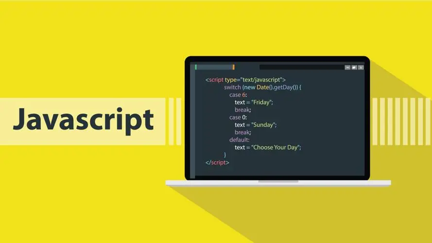

# JavaScript基础知识复习笔记



## 目录

- [JavaScript基础知识复习笔记](#javascript基础知识复习笔记)
  - [目录](#目录)
  - [简介](#简介)
    - [用处](#用处)
    - [浏览器组成](#浏览器组成)
    - [js组成](#js组成)
      - [ECMAScript](#ecmascript)
      - [DOM](#dom)
      - [BOM](#bom)
  - [书写位置](#书写位置)
    - [行内式](#行内式)
    - [内嵌式](#内嵌式)
    - [外链式](#外链式)
  - [注释](#注释)
  - [输入输出](#输入输出)
  - [变量](#变量)
    - [特殊情况](#特殊情况)
    - [命名规范](#命名规范)
  - [数据类型](#数据类型)
    - [数据类型分类](#数据类型分类)
      - [数字型Number](#数字型number)
      - [字符串型String](#字符串型string)
        - [转义字符](#转义字符)
        - [长度](#长度)
        - [拼接](#拼接)
      - [布尔型Boolean](#布尔型boolean)
      - [未定义Undefined](#未定义undefined)
      - [空值Null](#空值null)
    - [数据类型检测](#数据类型检测)
    - [通过控制台颜色判断类型](#通过控制台颜色判断类型)
    - [字面量](#字面量)
    - [数据类型转换](#数据类型转换)
      - [转为字符串](#转为字符串)
      - [转为数值型](#转为数值型)
      - [转为布尔型](#转为布尔型)
  - [标识符、关键字、保留字](#标识符关键字保留字)
  - [运算符](#运算符)
    - [逻辑与的逻辑中断](#逻辑与的逻辑中断)
    - [逻辑或的逻辑中断](#逻辑或的逻辑中断)
  - [运算符优先级](#运算符优先级)
  - [流程控制](#流程控制)
    - [分支](#分支)
    - [循环](#循环)
    - [相关关键字](#相关关键字)
  - [数组Arrary](#数组arrary)
    - [创建](#创建)
    - [遍历](#遍历)
    - [新增元素](#新增元素)
  - [函数](#函数)
    - [先声明后使用](#先声明后使用)
    - [形参和实参个数问题](#形参和实参个数问题)
    - [arguments](#arguments)
  - [立即执行函数](#立即执行函数)
    - [写法](#写法)
  - [作用域](#作用域)
    - [作用域链](#作用域链)
  - [预解析](#预解析)
    - [案例1](#案例1)
    - [案例2](#案例2)
    - [案例3](#案例3)
    - [案例4（经典面试题）](#案例4经典面试题)
  - [自定义对象](#自定义对象)
    - [创建对象](#创建对象)
    - [new关键字](#new关键字)
    - [遍历对象](#遍历对象)
  - [内置对象](#内置对象)
    - [Math对象](#math对象)
    - [Date对象](#date对象)
      - [网页倒计时效果例程](#网页倒计时效果例程)
    - [Array对象](#array对象)
    - [String对象](#string对象)
      - [基本包装类型](#基本包装类型)
      - [字符串不可变性](#字符串不可变性)
    - [String对象的常用方法](#string对象的常用方法)
    - [试写相关算法](#试写相关算法)
  - [数据类型总结](#数据类型总结)
    - [分类](#分类)
    - [堆和栈](#堆和栈)
    - [函数的值传递：类似c语言](#函数的值传递类似c语言)

## 简介

- 布兰登艾奇（Brendan Eich 1961~）在1995年10天时间设计出了JavaScript  

- 网景公司最初命名为LiveScript 后与sun公司（Java由Sun公司发明）合作改名为JavaScript
- JavaScript是运行在客户端的脚本（script）语言  
- 脚本语言 ：不需要编译，运行过程有js解释器逐行解释并执行  
- 现在也可以基于nodejs进行服务端编程  

### 用处

- 表单动态校验 ：密码强度检测（js产生的最初目的）

- 网页特效
- 服务端开发（nodejs）
- 桌面程序（Electron）
- App（Cordova）
- 硬件控制-物联网（Ruff）
- 游戏开发（cocos2d-js）

### 浏览器组成

- 渲染引擎 ：解析html css 俗称内核，Chrome的blink 老版本的webkit

- js引擎 ：**解释执行**网页的JavaScript代码，Chrome的v8
  - 浏览器本身并不会执行js代码，而是通过内置引擎来执行
  - **其它的JavaScript的引擎**转换成**字节码**或JavaScript，**V8使用c++开发**，**V8将JavaScript编译成原生机器码**，使用了如内联缓存（inline caching）等方法来提高性能。有了这些功能，**JavaScript程序在V8引擎下的运行速度媲美二进制程序。**

### js组成

- ECMAScript ：JavaScript语法

- DOM ：页面文档对象模型
- BOM ：浏览器对象模型

#### ECMAScript

- ECMAScript 国际标准 由ECMA国际组织进行标准化 规定了JS的编程语法和基础核心知识

- JavaScript 工业标准 网景公司
- JScript 工业标准 微软公司

#### DOM

- （Document Object Model）页面文档对象模型

- 是W3C组织推荐的处理可扩展标记语言的标准编程接口
- 通过DOM提供的接口可对页面元素进行操作（大小、位置、颜色...）

#### BOM

- （Browser Object Model）浏览器对象模型

- 通过BOM可操作浏览器窗口，如弹出框，控制跳转，获取分辨率

## 书写位置

### 行内式

直接写在html元素标签内部
因为html标签属性值使用双引号，js字符串应当使用单引号

```html
<input type="button" value="这是一个按钮" onclick="alert('提示框内容')">
```

### 内嵌式

```html
<!DOCTYPE html>
<html lang="en">
<head>
    <meta charset="UTF-8">
    <meta http-equiv="X-UA-Compatible" content="IE=edge">
    <meta name="viewport" content="width=device-width, initial-scale=1.0">
    <title>Document</title>
    <script>
        alert('提示框内容');
    </script>
</head>
<body>
    
</body>
</html>
```

### 外链式

```html
<!DOCTYPE html>
<html lang="en">
<head>
    <meta charset="UTF-8">
    <meta http-equiv="X-UA-Compatible" content="IE=edge">
    <meta name="viewport" content="width=device-width, initial-scale=1.0">
    <title>Document</title>
    <script src="./js/index.js"></script>
</head>
<body>
    
</body>
</html>
```

## 注释

- 单行注释

- 多行注释

```js

//单行注释

/*
多行注释
多行注释
*/

```

## 输入输出

- 弹出输入框 `prompt("字符串")` 返回值类型：`string`

- 弹出提示框 `alert("字符串")`
- 控制台打印信息 `console.log("字符串")`

## 变量

- 使用var关键字声明变量：`var num;`

- 赋值 `num=1;`
- 声明并赋值 `var myname="DingYigui";`

### 特殊情况

- 只声明不赋值，直接使用，变量为`undefined`

- 不声明不赋值，直接使用，程序会报错：变量未定义；**报错之后，后续代码不再执行**
- 不声明直接赋值，可以直接使用，成为全局变量

### 命名规范

- 有字母数字下划线及$组成  

- 区分大小写  
- 不能以数字开头  
- 不能是关键字、保留字  

- 其他
  - **建议**变量名、函数名有意义  
  - **建议**遵循驼峰命名法thisIsAVar  
  - 变量名一般用名词
  - 函数名一般用动词
  - name不是关键字也不是保留字，但在一些浏览器中有其他含义，最好不要用作变量名
  -

## 数据类型

JavaScript是**弱类型语言**，或者说**动态语言**。
不用提前声明变量的类型，**在程序运行过程中类型会自动被确定**  
数字型变量在被赋值为字符串后自动变为字符串型

### 数据类型分类

- 简单数据类型 ： **Number** **String** **Boolean** **Undefined** **Null**

- 复杂数据类型：object


#### 数字型Number

- 整数：`var a=0;`

- 小数：`var a=1.5;`
- 八进制：`var a=07;//八进制`
- 十六进制：`var a=0xff;//十六进制`

范围

```js
alert(Number.MAX_VALUE);//最大值 
alert(Number.MIN_VALUE);//最小值 
```

特殊值

```js
alert(Infinity);//无穷大
alert(-Infinity);//无穷小 
alert(NaN);//Not a Number 不是一个数

alert(Number.MAX_VALUE*2);//将会输出Infinity
alert("字符串"-100);//将会输出NaN
```

函数

```js
isNaN() //判断是否是NaN
```

#### 字符串型String

加了引号或双引号就是字符串  
字符串中需要包含单引号时外部用双引号  
字符串中需要包含双引号时外部用单引号  

##### 转义字符

- \t

- \n newline换行
- \\\
- \'
- \"
- \b blank空格

##### 长度  

```js
var str="123"  
alert(str.length)
```

##### 拼接  

```js
"123"+"456"  
str1 + str2
```

字符串和其他类型拼接，先会把其他类型自动转为字符串，结果为字符串

```js
"123"+ 456
"123"+ true
```

#### 布尔型Boolean

- 取值为 **true** 或 **false**  

- 在餐饮数值运算时被当做1或0  

#### 未定义Undefined

- 变量声明不赋值时，变量的默认值

    ```js
    var i;
    ```

- 也可以直接赋值为undefined

    ```js
    var i=undefined;
    ```

- 和字符串相连会被转换成字符串"undefined"  

- 和数值运算结果为NaN

#### 空值Null

```js
var i=null
```

- 空值和字符串相连被当做字符串"undefined"  

- 空值和数字相加被当做0

### 数据类型检测

- 语法：`typeof 变量名`

- 结果为"number" 、 "string" 、 "boolean" 、 "undefined" 、 "object"(var a=null;a是对象)

```js
var x= prompt("请输入数字")
console.log(typeof x);//输出string
```

### 通过控制台颜色判断类型

- 蓝色为数值

- 深蓝色为布尔值
- 灰色为字符串


### 字面量

数字字面量1，2，3 1.5
字符串字面量 "123" '123'
布尔字面量 true false

### 数据类型转换

- 表单、prompt()获取到的数据默认是字符串类型，不能进行加减运算

- 三种转换
  - 转换成字符串
  - 转换成数字
  - 转换成布尔型

#### 转为字符串

- `XXX.toString()`

- `String(XXX)`强制转换
- `XXX+""`拼接字符串 利用+运算转换为字符串

```js
// toString()
var num=1;
var str=num.toString();
console.log(typeof str)

// String()强制转换
console.log(typeof String(123))


// 加号拼接字符串
123+""
console.log(typeof (123+""))
```

#### 转为数值型

- `parseInt(string)` 获取整数部分

- `parseFloat(string)` 获取整数及小数部分
- `Number()` 强制转换为数值型 获取整数及小数部分
- js隐式转换（`- * /`）利用算术运算转换为数值型

```js
parseInt("1.5px")//结果：1
parseInt("width:1.5px")//结果：NaN

parseFloat("1.5px")//结果：1.5
parseFloat("width:1.5px")//结果：NaN

Number("1.")//结果：1
Number("1.5")//结果：1.5

"1.5"+1.5 //结果为字符串拼接效果："1.51.5"
"1.5"-1.5 //结果为数值相相减效果：0
"1.5"*1.5 //结果为数值相乘效果：2.25
"1.5"/1.5 //结果为数值相除效果：1

```

#### 转为布尔型

- Boolean()

- 代表空的否定的值都会转换成`false`：0 、 "" 、null 、NaN 、undefined
- 其余都会被转换成`true`

```js
Boolean(null)//false
Boolean(0)//false
Boolean(NaN)//false
Boolean("")//false
Boolean(undefined)//false

```

## 标识符、关键字、保留字

- **标识(zhi)符**:变量名、函数名、参数名...
  - 不能是关键字或保留字

- **关键字**：编程语言中已经使用的字，for break case...
- **保留字**：预留的关键字byte char const double

## 运算符

- 算数：+ - * %
  - 由于表示精度问题，浮点数0.1+0.2不一定等于0.3

- 自增自减：++i --i i++ i--
- 比较运算符（关系运算符）
  - <
  - \>
  - \<=
  - \>=
  - == 会自动类型转换：1=="1"为真
  - != 不等
  - === 全等，要求值相同，类型也相同，才为真
  - !== 不等

- 逻辑运算符:
  - 与&&
  - 或||
  - 非!

- 赋值运算符
  - =
  - += -=
  - *= /= %=

### 逻辑与的逻辑中断

表达式1&&表达式2  

- 当表达式1的值为真，整个表达式的返回值为表达式2
- 当表达式1的值为假，整个表达式的返回值为表达式1

```js
123 && 321 //返回321

0 && 321 //返回0
'' && 321 //返回''
false && 321 //返回false
undefined && 321 //返回undefined
```

### 逻辑或的逻辑中断

表达式1||表达式2  

- 如果表达式1的值为真，则整个表达式的值为表达式1
- 如果表达式1的值为假，则整个表达式的值为表达式2

```js
123 || 321 //返回123

0 || 321 //返回321
'' || 321 //返回321
false || 321 //返回321
undefined || 321 //返回321
```

## 运算符优先级


## 流程控制

### 分支

if分支:和c语言语法一致

```js
if(表达式){
    语句;
}

if(表达式){
    语句;
}else{
    语句2;
}

if(表达式){
    语句;
}
else if(表达式2){
    语句2;
}else{
    语句3;
}
```

三元表达式

```js
result=表达式1? 表达式2:表达式3;
```

多分支语句：也是和c语言类似

```js
switch(变量 或 表达式){
    case 变量值1:  //要求 switch中的值 和 case 的值 是全等的关系
        语句1;
        break;
    case 变量值2:
        语句2;
        break;
    case 变量值3:
        语句3;
        break;
    default:
        语句4;
        break; //default如果没有写在所有case的最后，则break不能省略，
}
```

### 循环

for

```js
for(var i=1;i<=100;i++){
    语句1;
}
```

while

```js
while(表达式){
    语句1;
}
```

do

```js
do{
    语句1;
}while(表达式);
```

```js
//语法
for(变量名 in 对象或数组){
    //
}
```

### 相关关键字

- continue 立即结束本次循环，进入下一次循环

- break 立即跳出整个循环

## 数组Arrary

- 数组中可以存放**任意类型**的数据

### 创建

- 利用字面量创建数组

```js
var arr=[];//创建空数组
var arr=[1,2.5,"3",ture];
arr[2]//"3"
```

- new创建数组

```js
    var arr=new Array();//创建空数组
```

### 遍历

```js
var arr=[1,2,3,4,5];
for(var i=0;i<arr.length;i++){
    console.log(arr[i]);
}
```

### 新增元素

方法1

- XXX.length是可修改的
- XXX.length+=2后，会新增两个undefined的元素
- 在这个位置赋值就好了

方法2

- 直接索引到元素然后赋值

```js
var arr=[];
for(var i=0;i<100;i++)
{
    arr[i]=i;
}
console.log(arr);
```

## 函数

### 先声明后使用

- 声明方法1：

    ```js
    // 声明方法1：
    function 函数名(形式参数1,形式参数2,....){
        语句;
        //利用return返回值：
        return 需要返回的结果 ;
        //利用return返回多个结果
        return [result1,result2];
        //利用return终止函数：
        return;//没有返回值的函数 或返回值为return; 其返回值的值为undefined
    }
    //调用：
    var y = 函数名(实际参数1,实际参数2,....);
    ```

- 声明方法2（匿名函数）：

    ```js
    // 声明方法2（匿名函数）：
    var 变量名 = function(形式参数1,形式参数2,....){
        // 语句;
    }
    // 调用：
    变量名(实际参数1,实际参数2,....);
    ```

### 形参和实参个数问题

```js
function A(x1,x2){
    console.log(x1+x2);
}

A(1);// 形参x1被赋值为1 x2没有被赋值 结果为undefined 于是x1+x2结果为NaN
A(1,2);//结果为3
A(1,2,3);//形参x1被赋值为1 x2被赋值为2 实参3被忽略

```

### arguments

- arguments是所有函数都具有的**内置对象**

- 可以通过该对象获取函数传入的所有实参、和实参的具体个数
- arguments是一个**伪数组**
  - 具有length属性
  - 按索引获取元素
  - 没有pop push 等方法

```js
function A(){
    console.log(arguments)
}

A();
A(1,2,3,4,5);
```

## 立即执行函数

- 不需要先声明后调用，声明后立马就能执行的函数

- 立即函数的最大作用就是创建了一个独立的作用域，其中创建的所有变量都是局部变量
- 两个不同的立即函数直接需用分号隔开

### 写法

```js
//写法1：相当于 var fun = function(形参列表){}; (fun)(实参列表);
(function(形参列表){})(实参列表);

//写法2: 相当于 var fun = function(形参列表){}; fun(实参列表);
(function(形参列表){}(实参列表));
```

## 作用域

- 全局变量：
  - 作用域：作用于整个js文件或整个script标签
  - 全局变量在作用域中的任何位置都可以使用
  - 若在局部使用的一个未声明的变量，则该变量自动变为全局变量

- 局部变量
  - 形参、函数内部变量
  -
- 块级作用域（ es6新增）
  - {}
  - if(){}
  - for(){} while(){} do{}while()
  - 大括号里面声明的变量不能在之外声明

### 作用域链

内部函数访问外部变量时，按嵌套的深度查找，深度优先

```js
var num=1;
function a(){
    var num=2;
    function b(){
        console.log(num);//2
    }
}
```

## 预解析

js引擎在执行js脚本时分为两步

- 预解析：将所有 var声明的全局变量 和 函数 提升到**当前**作用域之前
  - 变量预解析（变量提升）：仅仅是将var变量的声明提前，**赋初值的操作不会提前。**
  - 函数预解析（函数提升）：把函数声明提升到最前
- 执行代码：按书写顺序执行

变量预解析导致undefined的示例：

```js
console.log(y);//undefined
var y=123;
//相当于：
var y;
console.log(y);//undefined
y=123;
```

```js
a();// 返回：1
function a(){
    return 1;
}
// 相当于：
function a(){
    return 1;
}
a();// 返回：1

//所以非匿名函数的声明写在使用语句之前不会有什么问题
```

```js
f();//undefined
var f=function(){return 123;}

// 相当于：
var f;
f();//undefined
f=function(){return 123;}
```

### 案例1  

输出结果是undefined而不是10

```js
var num=10;
fun();
function fun(){
    console.log(num);
    var num = 20;
}
```

相当于：

```js
var num=10;
function fun(){
    var num;
    console.log(num);
    num = 20;
}
fun();
```

### 案例2  

结果：  
undefined  
20  


### 案例3  

结果：  
undefined  
9


### 案例4（经典面试题）  

结果：  
9  
9  
9  
9  
9  
报错：undefined  


## 自定义对象

- js中对象有三种
  - 自定义对象
  - 内置对象
  - 浏览器对象

- 对象由**属性**和**方法**组成
- 对象是**复杂数据类型**object
- 对象是无序的相关属性和方法的集合
- 构造函数抽象出了对象的公共部分，封装到了函数中，泛指了某一大类
- 利用构造函数创建对象的过程也称为**对象实例化**

### 创建对象

- **字面量**创建对象,大括号{}

    ```js
    //创建
    var obj={
        //键值对
        name:"dyg",
        age:18,
        sayHi:function(){
                ;
            }
        }
    //使用
    obj.name
    obj["name"]
    obj.age
    obj.sayHi();
    ```

- **new**创建对象

    ```js
    var obj=new Object();//创建空对象
    obj.name="DingYigui" //追加属性
    obj.age=18;
    obj.sayHi=function(){};//追加方法
    ```

- **构造函数**创建对象  
    构造函数是特殊的函数，用来初始化对象，为对象初始化值，与new一起使用  
  - **构造函数首字母必须大写**
  - **构造函数不需要返回值就能返回对象**  
  - **调用构造函数必须使用new**  

    ```js
    function 构造函数名(形式参数1,形式参数2,...){
        this.属性名=形式参数1;
        this.方法名=function (){};
    }

    var obj=new 构造函数名(实际参数1,形式参数2,...);
    ```

### new关键字

new关键字创建对象的过程  

1. new 构造函数(); 会在内存中创建一个空对象。
2. this会指向创建的空对象。
3. 执行构造函数内的语句，给空对象添加属性和方法
4. 返回这个对象

### 遍历对象

```js
//语法
for(变量 in 对象){
    //
}

//示例
var obj = {name:"dingYigui",age:"18"}
for(key in obj){
    console.log(key);//属性名
    console.log(obj[key]);//属性值
}
```

## 内置对象

- **一般查文档**[**MDN**](https://developer.mozilla.org/)

### Math对象

- Math不是一个构造函数名，而是一个静态的对象（就是字面量创建的对象{}）

- 常用属性
  - `Math.PI`
  - `Math.E`
- 常用方法
  - `Math.sqrt()`
  - `Math.max()`
    - 正常返回实参数组的最大值
    - 有非数返回NaN
    - 没有实参返回负无穷
  - `Math.min()`
  - `Math.floor()` 向下取整
  - `Math.ceil()` 向上取整
  - `Math.round()` 四舍五入
    - **3.5结果为4**
    - 但：**-3.5结果为-3**
  - `Math.abs()` 绝对值 "-1"能隐式转换
  - `Math.random()`  `[0,1)`

### Date对象

- Date不是静态对象，而是一个构造函数名 只能通过new实例化日期对象

- 常用声明写法
  - `new Date();` 默认传入值为当前时间
  - `new Date(value);` value是毫秒数
  - `new Date(dateString);`
    - `new Date("1995-12-17 03:24:00");`
  - `new Date(year, monthIndex [, day [, hours [, minutes [, seconds [, milliseconds]]]]]);`
    - `new Date(2022,6,27)`
- 常用方法
  - `obj.getFullYear()` 年
  - `obj.getMonth()` 月，0-11
  - `obj.getDate()` 日
  - `obj.getDay()` 星期日->六 0->6
  - `obj.getHours()` 时
  - `obj.getMinutes()` 分
  - `obj.getSeconds()` 秒
  - `obj.valueOf()` 获取毫秒数（自1970.1.1）
  - `obj.getTime()` 获取毫秒数（自1970.1.1）
  - `var date = + new Date();` 获取毫秒数（自1970.1.1）
  - `Date.now()` 获取毫秒数（自1970.1.1） **H5新增的方法，不用new**
- 由于不同时刻获取到的毫秒数不会重复，所以毫秒数也叫**时间戳**

#### 网页倒计时效果例程

```js
function getLast(targetTime){
    var target=+new Date(targetTime);
    var now=+new Date();

    var last=(target-now)/1000;//剩余总毫秒数
    last=last<=0? 0:last;

    var d=parseInt(last/60/60/24);
    var h=parseInt(last/60/60%24);
    var m=parseInt(last/60%60);
    var s=parseInt(last%60);

    d=d<10? "0"+d:d;
    h=h<10? "0"+h:h;
    m=m<10? "0"+m:m;
    s=s<10? "0"+s:s;

    return d+" "+h+":"+m+":"+s;
}

console.log(getLast("2022-6-28 12:24:00"));
console.log(getLast(0));
```

### Array对象

- 常用字面量`[]`声明，或用`new Array()`声明空数组

- 检测是否为数组：
  - `instanceof` **运算符** 返回布尔值 `obj instanceof Array` 判断x是否为Array
  - `Array.isArray(obj)` 检测是否为数组 Array内置方法
- 常用方法
  - `new Array(2)` 表示声明一个长度为2的空数组
  - `new Array(2,3)` 表示声明一个数组`[2,3]`
  - `Array.isArray(obj)` 检测是否为数组 Array内置方法
  - `obj.push(x[,y,z])` 数组**末尾**添加一个或多个元素 **返回新数组长度**
  - `obj.unshift(x[,y,z])` 数组**开头**添加一个或多个元素 **返回新数组长度**
  - `obj.pop()` **弹出（删除）**数组中**最后一个**元素，**返回值为弹出的这个元素**
  - `obj.shift()` **弹出（删除）**数组中**第一个**元素，**返回值为弹出的这个元素**
  - `obj.reverse()` 翻转原数组 返回该数组
  - `obj.sort()` 字典序排序 只能对0-9的数字完美排序
  - `obj.sort(function(a,b){return a-b;})` 能对数字大小排序 a-b升序 b-a降序
  - `obj.indexOf(x)` 返回数组中**第一个**元素x的索引  查找不到返回-1
  - `obj.indexOf(x)` 返回数组中**最后一个**元素x的索引  查找不到返回-1
  - `obj.indexOf(x,startIndex)` 同上，从某个位置开始查找
  - `obj.toString()` 数组转字符串,逗号分隔 返回值字符串，不修改原数组
  - `obj.join("分隔符 无实参默认逗号")` 数组转字符串,自定义分隔符分隔 返回值字符串，不修改原数组
  - `obj.concat()` 连接两个或多个数组，应该不影响原数组
  - `obj.slice(beginIndex,endIndex)` 数组截取，返回被截取出的新数组 不会影响原数组
  - `obj.splice(beginIndex,要删除个数)` 数组删除，返回被删除的数组，会影响原数组
  - `obj.splice(obj.findIndex( (item)=> item.id == targetId),1)` 删除符合条件的指定元素
  - `obj.filter( (item,index,arr) => return item > 10 )` filter过滤器,不会对空数组进行检测；不会改变原始数组
  - `obj.includes(item)` 判断数组中是否包含某元素

去重

```js
//遍历旧数组
//如果旧数字的元素在新数组中查找不到，则插入新数组
//否则进入下一次循环

var oldArray=[123,123,123,456,456,789,789]
var newArray=[];
for(index in oldArray){
    if(newArray.indexOf(oldArray[index])==-1)
        newArray.push(oldArray[index])
}
console.log(newArray);
```

### String对象

#### 基本包装类型

基本包装类型：js会把基本数据类型包装成复杂数据类型，这样基本数据类型就有了属性和方法

js提供了三个特殊的引用类型：

- String
- Number
- Boolean  

```js
//基本数据类型是没有属性和方法的，但是一下代码能正常执行
var str="DingYigui"
console.log(str.length);

//上述代码的执行过程为
// 1、生成临时变量，把简单类型保证成复杂数据类型
var temp = new String("DingYigui")
//2.赋值
str=temp;
// 3. 销毁
temp=null;

```

#### 字符串不可变性

字符串内的值不可变，虽看上去内容可以改变，实际是在内存中开辟了新的空间，地址变了  
不要频繁拼接字符串：

```js
// 不要频繁拼接字符串，因为该过程会不断申请新内存
var str="123"
str="456"//重新给字符串赋值会在内存中重新开辟空间，这个特点就是字符串不可变

//由于字符串不可变，频繁拼接字符串就会有效率问题，因为开辟空间需要时间

for(var i=0;i<10000000;i++)
{
    str+=i;
}
console.log(str)//非常耗时

```

### String对象的常用方法

由于字符串的不可变性，字符串的所有方法不会修改字符串本身，只会返回一个新的字符串

- `str.indexOf("查找字符")`
- `str.indexOf("查找字符",startIndex)`
- `str.charAt(index)` 返回指定位置字符
- `str[index]` 返回指定位置字符 (html5 IE8+)
- `str.charCodeAt(index)` 返回指定位置字符的ASCII码
- `str.concat(str1,str2,str3)` 拼接两个多多个字符串 等效+运算符
- `str.substr(starIndex,length)` 返回从某位置开始指定长度的字符串
- `str.slice(start,end)` 截取下标(start,end] 的字符串，可以理解为切片
- `str.substring(start,end)` 截取下标(start,end] 的字符串，同上，但是不接受负数
- `str.replace("被替换的字符","替换为字符")`  只替换第一个字符  
- `str.split("根据字符串中的什么字符作为分隔符")` 字符转数组
  - `arr.join("分隔符")` 是数组转字符串
- `str.toUpperCase()` 转大写
- `str.toLowerCase()` 转小写
-

### 试写相关算法

查找字符串中所有z出现的位置及次数

```js
var str="abcdzqwezxqwezgeflz"
var list=[];

list.push(str.indexOf("z"));//查找第一个z的位置
while(true)
{
    var temp=str.indexOf("z",list[list.length-1]+1)//从上一个位置之后开始查找
    if(temp==-1)
        break;
    list.push(temp);
}
console.log(list)
console.log("z出现了" + list.length + "次")
```

统计每个字符出现的次数

```js
var str="abcdzqwezxqwezgeflz"
var obj={};

for(i in str)//统计每个字符出现的次数
{
    if(obj[str[i]])
    {
        obj[str[i]]++
    }else{
        obj[str[i]]=1;
    }
}
console.log(obj)
```

统计每个字符出现的次数和具体位置

```js
var str="abcdzqwezxqwezgeflz"
var obj={};

for(i in str)//统计每个字符出现的次数
{
    if(obj[str[i]])
    {
        obj[str[i]].count++;
        obj[str[i]].position.push(i);
    }else{
        obj[str[i]]={count:1,position:[i]}
    }
}
console.log(obj)
```


## 数据类型总结

### 分类

- **简单数据类型** 也叫基本数据类型、值类型
  - 存储时，存储的是值本身，因此也叫值类型
  - number string boolean undefined null(空对象，设计遗留问题)

- **复杂数据类型** 也叫 引用类型
  - Object Array Date等

### 堆和栈

- JavaScript中没有堆和栈的概念，下面的概念只是为了理解。

- 一般是局部变量、函数形参、返回值
  - 简单数据类型放入栈
- 有程序员分配和释放，若程序员不释放，由垃圾回收机制回收
  - 复杂数据类型放入堆

- 简单数据类型存放在栈，直接在栈中存储值
- 复杂数据类型存放在堆，在栈中存放地址


### 函数的值传递：类似c语言

- 简单数据类型，实参传给形参的是值，对形参的操作不会影响原值

- 复杂数据类型，实参传给形参的是地址，对形参的操作会印象原值
