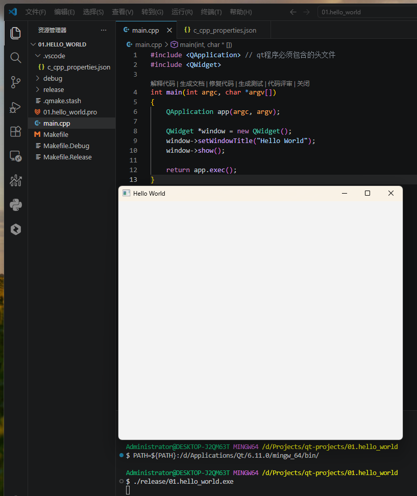
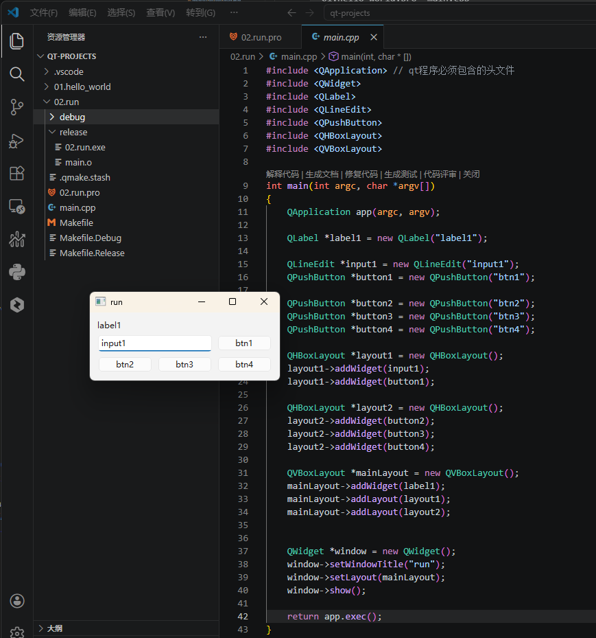

## Qt应用的手动编译流程：不使用Qt Creator如何编写QT代码并编译运行？

> 本文介绍如何在不依赖 Qt Creator 的情况下，手动使用命令行编译 Qt 程序。掌握这个流程有助于理解 Qt 项目的构建原理。

### 案例一：Hello World项目

#### **1.编写`main.cpp`文件**

```bash
$ cd 01.hello_world/
$ cat main.cpp 
```

```cpp
#include <QApplication>    // Qt应用程序必须包含的头文件，管理全局应用行为
#include <QWidget>         // 基础窗口部件，所有UI组件的基类

int main(int argc, char *argv[])
{
    QApplication app(argc, argv);      // 创建应用程序对象，初始化Qt环境

    QWidget *window = new QWidget();    // 创建窗口实例（堆上分配）
    window->setWindowTitle("Hello World");  // 设置窗口标题
    window->show();                     // 显示窗口

    return app.exec();                  // 进入事件循环，等待用户交互
}
```

#### **2.使用`qmake -project`生成工程文件**

`qmake` 是 Qt 提供的项目管理工具，`-project` 参数会根据源码自动生成 `.pro` 工程文件。

```bash

```bash
$ /d/Applications/Qt/6.11.0/mingw_64/bin/qmake -project
$ ls
01.hello_world.pro  main.cpp
```

#### **3.修改`.pro`工程文件**

`.pro` 文件是 qmake 的配置文件，声明项目源文件和依赖的 Qt 模块。

```makefile
SOURCES += main.cpp           # 指定源文件
QT += gui widgets              # 声明依赖的Qt模块：gui（图形界面）和widgets（控件库）
```

> **说明**：Qt6 中 widgets 模块需要显式声明，Qt5 中默认包含。

#### **4.使用`qmake`生成 Makefile**

运行 qmake 会根据 `.pro` 文件生成跨平台的 Makefile（Windows 下是 MinGW Makefiles）。

```bash
$ /d/Applications/Qt/6.11.0/mingw_64/bin/qmake
Info: creating stash file D:\Projects\qt-projects\01.hello_world\.qmake.stash

$ ls
01.hello_world.pro  debug/  main.cpp  Makefile  Makefile.Debug  Makefile.Release  release/
```

#### **5.使用`mingw32-make`编译项目**

调用 MinGW 的 make 工具，根据 Makefile 调用 g++ 编译源码，生成可执行文件。

```bash
$ /d/Applications/Qt/Tools/mingw1310_64/bin/mingw32-make.exe
# 编译输出说明：
# 第一行：g++ 编译 main.cpp 为目标文件 main.o（包含大量 -I 参数指定头文件路径）
# 第二行：g++ 链接生成可执行文件 01.hello_world.exe（链接 Qt 动态库）
```

> **关于 Qt6 路径**：Qt6 将 qmake 从 `/mingw_64/bin/` 移到了主目录，上例中使用的 Qt6.11.0 版本路径有所不同。

```bash
$ /d/Applications/Qt/Tools/mingw1310_64/bin/mingw32-make.exe 
D:/Applications/Qt/Tools/mingw1310_64/bin/mingw32-make -f Makefile.Release
mingw32-make[1]: Entering directory 'D:/Projects/qt-projects/01.hello_world'
g++ -c -fno-keep-inline-dllexport -O2 -Wall -Wextra -Wextra -fexceptions -mthreads -DUNICODE -D_UNICODE -DWIN32 -DMINGW_HAS_SECURE_API=1 -DQT_NO_DEBUG -DQT_WIDGETS_LIB -DQT_GUI_LIB -DQT_CORE_LIB -DQT_NEEDS_QMAIN -I. -I. -I../../../Applications/Qt/6.11.0/mingw_64/include -I../../../Applications/Qt/6.11.0/mingw_64/include/QtWidgets -I../../../Applications/Qt/6.11.0/mingw_64/include/QtGui -I../../../Applications/Qt/6.11.0/mingw_64/include/QtCore -Irelease -I/include -I../../../Applications/Qt/6.11.0/mingw_64/mkspecs/win32-g++  -o release/main.o main.cpp
g++ -Wl,-s -Wl,-subsystem,windows -mthreads -o release/01.hello_world.exe release/main.o D:/Applications/Qt/6.11.0/mingw_64/lib/libQt6Widgets.a D:/Applications/Qt/6.11.0/mingw_64/lib/libQt6Gui.a D:/Applications/Qt/6.11.0/mingw_64/lib/libQt6Core.a -lmingw32 D:/Applications/Qt/6.11.0/mingw_64/lib/libQt6EntryPoint.a -lshell32  
mingw32-make[1]: Leaving directory 'D:/Projects/qt-projects/01.hello_world'
```

#### **6.运行**

程序编译完成后会生成在 `release/` 目录下。如果运行时提示缺少 DLL 文件，需要将 Qt 的 bin 目录添加到 PATH 环境变量。

```bash
# 临时添加 Qt 动态库路径到 PATH
$ PATH=${PATH}:/d/Applications/Qt/6.11.0/mingw_64/bin/
$ ./release/01.hello_world.exe
```

> **注意**：Qt6 的 DLL 文件在 `mingw_64/bin` 目录下，而 Qt5 可能在 `bin` 目录下。



### 案例二：布局对象

这个例子展示了如何使用 Qt 的布局管理器来组织界面控件，避免手动设置坐标。

```cpp
#include <QApplication>
#include <QWidget>
#include <QLabel>
#include <QLineEdit>
#include <QPushButton>
#include <QHBoxLayout>   // 水平布局：子控件从左到右排列
#include <QVBoxLayout>  // 垂直布局：子控件从上到下排列

int main(int argc, char *argv[])
{
    QApplication app(argc, argv);

    // 创建控件
    QLabel *label1 = new QLabel("label1");
    QLineEdit *input1 = new QLineEdit("input1");
    QPushButton *button1 = new QPushButton("btn1");
    QPushButton *button2 = new QPushButton("btn2");
    QPushButton *button3 = new QPushButton("btn3");
    QPushButton *button4 = new QPushButton("btn4");

    // 第一行：输入框 + 按钮1（水平布局）
    QHBoxLayout *layout1 = new QHBoxLayout();
    layout1->addWidget(input1);   // 添加输入框
    layout1->addWidget(button1);  // 添加按钮

    // 第二行：按钮2、3、4（水平布局）
    QHBoxLayout *layout2 = new QHBoxLayout();
    layout2->addWidget(button2);
    layout2->addWidget(button3);
    layout2->addWidget(button4);

    // 主布局：标签 + 两行（垂直布局）
    QVBoxLayout *mainLayout = new QVBoxLayout();
    mainLayout->addWidget(label1);    // 添加标签
    mainLayout->addLayout(layout1);   // addLayout 用于添加子布局
    mainLayout->addLayout(layout2);

    // 创建窗口并应用布局
    QWidget *window = new QWidget();
    window->setWindowTitle("run");
    window->setLayout(mainLayout);    // 将布局设置给窗口
    window->show();

    return app.exec();
}
```

**布局嵌套示意**：

```
QVBoxLayout（主布局）
├── QLabel（标签）
├── QHBoxLayout（第一行）
│   ├── QLineEdit（输入框）
│   └── QPushButton（按钮1）
└── QHBoxLayout（第二行）
    ├── QPushButton（按钮2）
    ├── QPushButton（按钮3）
    └── QPushButton（按钮4）
```




## vscode代码提示配置

在使用 VSCode 开发 Qt 项目时，需要配置 C/C++ 扩展的智能提示，使其能正确识别 Qt 的头文件。

**1. 配置 Windows 系统环境变量**

```bash
QT_HOME=D:\Applications\Qt
```

**2. 修改 `.vscode/c_cpp_properties.json`**

```json
{
    "configurations": [
        {
            "name": "Win32",
            "includePath": [
                "${QT_HOME}/6.11.0/mingw_64/include/**",  // Qt 头文件路径
                "${workspaceFolder}/**"                    // 项目源码路径
            ],
            "defines": [
                "_DEBUG",
                "UNICODE",
                "_UNICODE"
            ],
            "compilerPath": "${QT_HOME}/Tools/mingw1310_64/bin/g++.exe",  // 编译器路径
            "cStandard": "c17",
            "cppStandard": "gnu++17",
            "intelliSenseMode": "windows-gcc-x64"
        }
    ],
    "version": 4
}
```

> **提示**：配置完成后，按 `Ctrl+Shift+P` 输入 `C/C++: Reset IntelliSense Database` 重新加载，使配置生效。

