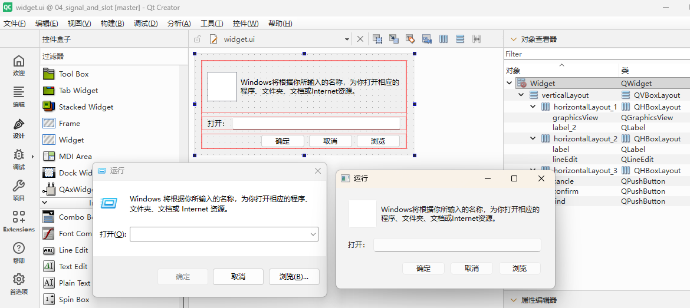
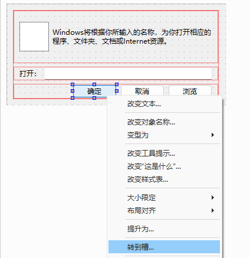
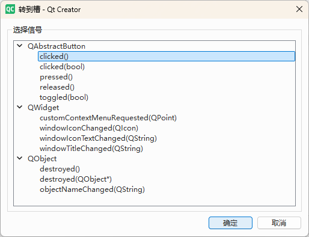
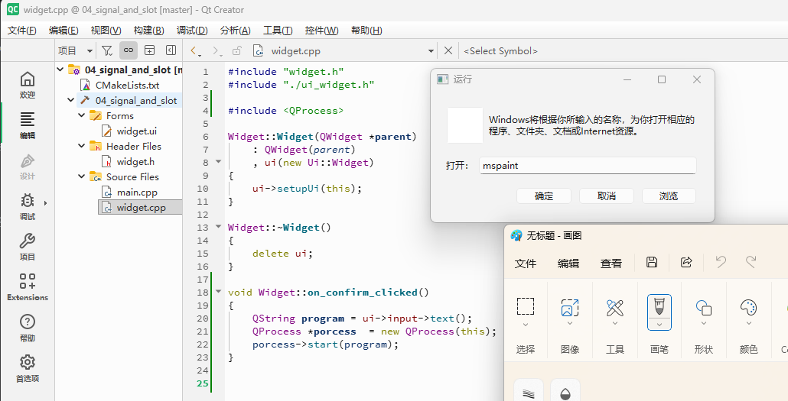

## 什么是信号与槽？

信号与槽（Signal & Slot）是 Qt 独有的对象间通信机制，用于替代传统的回调函数。当某个事件发生时（比如按钮被点击），对象会发出一个**信号**，而槽函数就像一个**插槽**，用来接收并处理这个信号。

相比回调函数，信号与槽的优势在于：
- 类型安全，由 moc 编译期检查
- 可以一对多、多对一连接
- 解耦发送者和接收者

## 示例界面

本例实现一个简易的程序启动器：在输入框输入程序名（如 `mspaint`），点击确认后启动对应程序。



## 第一种写法：使用 Qt Designer 自动生成槽

最简单的方式是通过 Qt Designer 的"转到槽"功能自动生成槽函数。

### 操作步骤

1. 右键点击 `confirm` 按钮，选择"转到槽"  
   

2. 选择要处理的信号（如 `clicked()`）  
   

Qt Creator 会自动在 `widget.h` 和 `widget.cpp` 中添加槽函数。

### 自动生成的代码

**widget.h**
```cpp
class Widget : public QWidget
{
private slots:
    void on_confirm_clicked();  // 命名规则：on_<objectName>_<signal>
};
```

**widget.cpp**
```cpp
#include <QProcess>  // 用于启动外部进程

void Widget::on_confirm_clicked()
{
    QString program = ui->input->text();      // 获取输入框的文本
    QProcess *process = new QProcess(this);   // 创建进程对象，this 作为父对象
    process->start(program);                   // 启动外部程序
}
```

> **命名约定**：使用"转到槽"生成的槽函数必须遵循 `on_<控件名>_<信号>` 的命名规则，这样 Qt 才能自动建立连接。这也是为什么第一种写法不需要手动调用 `connect()`。

### 运行效果

输入 `mspaint`，点击确认，即可打开画图程序。



## 第二种写法：手动 connect（旧语法）

手动编写槽函数，然后在构造函数中使用 `connect()` 建立连接。

### 1. 声明槽函数

**widget.h**
```cpp
class Widget : public QWidget
{
private slots:
    void start_process();  // 槽函数声明
};
```

### 2. 实现槽函数

**widget.cpp**
```cpp
void Widget::start_process()
{
    QString program = ui->input->text();
    QProcess *process = new QProcess(this);
    process->start(program);
}
```

### 3. 建立连接

**widget.cpp - 构造函数**
```cpp
Widget::Widget(QWidget *parent)
    : QWidget(parent)
    , ui(new Ui::Widget)
{
    ui->setupUi(this);

    // connect(信号发送者, SIGNAL(信号), 信号接收者, SLOT(槽函数))
    connect(
        ui->input, SIGNAL(returnPressed()),   // 输入框的回车信号
        this, SLOT(start_process())            // 连接到 start_process 槽
    );
}
```

> **旧语法说明**：使用 `SIGNAL()` 和 `SLOT()` 宏将信号和槽转换为字符串，由 moc 在运行时检查类型是否匹配。这种写法在 Qt5 之前常用，缺点是编译期不检查类型。

## 第三种写法：手动 connect（新语法）

Qt5 引入了函数指针语法，编译期即可检查类型安全。

```cpp
Widget::Widget(QWidget *parent)
    : QWidget(parent)
    , ui(new Ui::Widget)
{
    ui->setupUi(this);

    // 新语法：connect(信号发送者, &发送者类::信号, 信号接收者, &接收者类::槽函数)
    connect(
        ui->cancle, &QPushButton::clicked,   // 按钮的 clicked 信号
        this, &Widget::cancle                 // 连接到本类的 cancle 槽
    );
}
```

> **推荐使用新语法**，原因：
> - 编译期类型检查，出错更早发现
> - 支持 lambda 表达式
> - 性能略高（无需字符串转换）

## 第四种写法：使用 Lambda 表达式

对于简单的逻辑，可以直接使用 lambda 作为槽函数，无需单独定义槽函数。

```cpp
#include <QMessageBox>

Widget::Widget(QWidget *parent)
    : QWidget(parent)
    , ui(new Ui::Widget)
{
    ui->setupUi(this);

    // 使用 lambda 作为槽，代码更简洁
    connect(
        ui->find, &QPushButton::clicked,
        [this](){
            QMessageBox::information(this, "提示", "功能暂未实现");
        }
    );
}
```

> **注意**：lambda 中使用 `this` 指针需要捕获，以便访问类的成员变量和函数。

## 四种写法对比

| 写法 | 优点 | 缺点 | 适用场景 |
|------|------|------|----------|
| 自动生成 | 简单快捷 | 命名受限 | 简单响应事件 |
| 旧语法 connect | 灵活 | 无编译期检查 | 兼容旧代码 |
| 新语法 connect | 类型安全 | 需要函数指针 | 推荐方式 |
| Lambda 槽 | 代码简洁 | 复杂逻辑不推荐 | 简单回调 |

> **建议**：优先使用第三种或第四种写法，保持代码简洁且类型安全。
