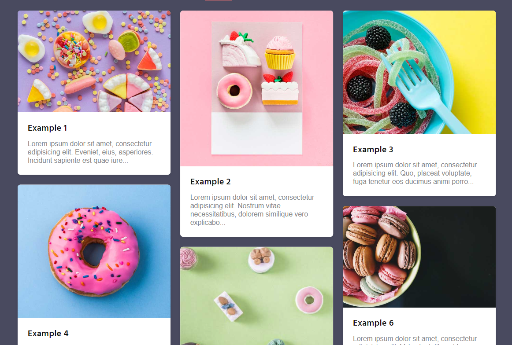

# jQuery学习笔记


## 目录

- [jQuery学习笔记](#jquery学习笔记)
  - [目录](#目录)
  - [概述](#概述)
  - [jQuery基本使用](#jquery基本使用)
    - [版本区别](#版本区别)
    - [$符号](#符号)
    - [JQuery对象和DOM对象](#jquery对象和dom对象)
    - [入口函数](#入口函数)
  - [jQuery选择器](#jquery选择器)
    - [隐式迭代](#隐式迭代)
    - [链式编程](#链式编程)
    - [项目练习](#项目练习)
      - [测试](#测试)
      - [下拉菜单](#下拉菜单)
      - [排他思想](#排他思想)
      - [简易轮播图](#简易轮播图)
  - [jQuery样式操作](#jquery样式操作)
    - [案例练习](#案例练习)
      - [tab栏切换](#tab栏切换)
  - [jQuery效果](#jquery效果)
    - [显示隐藏](#显示隐藏)
    - [滑动](#滑动)
    - [淡入淡出](#淡入淡出)
    - [自定义动画](#自定义动画)
    - [测试使用效果](#测试使用效果)
      - [显示/隐藏测试](#显示隐藏测试)
      - [滑动测试](#滑动测试)
      - [淡入淡出测试1](#淡入淡出测试1)
      - [淡入淡出测试2](#淡入淡出测试2)
      - [动画测试](#动画测试)
    - [案例练习](#案例练习-1)
  - [hover事件切换](#hover事件切换)
  - [动画：stop()停止排队](#动画stop停止排队)
  - [Jquery内容操作](#jquery内容操作)
    - [案例练习](#案例练习-2)
  - [Jquery属性操作](#jquery属性操作)
  - [元素操作](#元素操作)
    - [遍历](#遍历)
      - [each()遍历](#each遍历)
      - [$.each()遍历](#each遍历-1)
    - [创建、添加、删除元素](#创建添加删除元素)
  - [jQuery尺寸及位置](#jquery尺寸及位置)
    - [jQuery尺寸](#jquery尺寸)
    - [jQuery位置](#jquery位置)
  - [JQuery事件](#jquery事件)
    - [事件注册](#事件注册)
    - [事件解绑](#事件解绑)
    - [事件处理](#事件处理)
    - [触发事件](#触发事件)
    - [事件对象](#事件对象)
    - [案例测试](#案例测试)
  - [jQuery拷贝](#jquery拷贝)
  - [多库共存](#多库共存)
  - [jquery插件](#jquery插件)
  - [元素的缓存数据](#元素的缓存数据)

## 概述

- jQuery是一个用原生js写成的库，用于方便的操作DOM
- j就是js，query就是查询，jQuery就是把原生js中的DOM操作做了封装
- 其设计宗旨是“write less，do more”，倡导写更少的代码做更多的事
- jQuery封装了js常用功能，优化了DOM操作、事件处理，动画设计，Ajax交互
- 学习jQuery就是学习使用这些函数

## jQuery基本使用

### 版本区别

- 1.X 支持ie678,不再更新维护
- 2.X 不支持ie678,不再更新维护
- 3.X 不支持ie678,官网更新维护
  - production 版本，用于生产环境，代码经过压缩，jQuery.mini.js
  - development 版本，开发版本，代码保留了注释和缩进格式

### $符号

`$`符号是jQuery的**别称**

```js
//两种写法等效
$("div").hide();
jQuery("div").hide();
```

:::
`$`符号、或者说`jQuery`，是jQuery的**顶级对象**

- jQuery对象以**伪数组**形式存储，数组的**每个元素为DOM对象**
- jQuery对象本质就是对DOM对象进行了封装，增添了一些属性和方法

```js
//$("div") 和 jQuery("div") 等效，
//是一个jQuery对象，能够调用在jQuery中定义的属性和方法
$("div").hide();
jQuery("div").hide();
```

:::

### JQuery对象和DOM对象

- DOM对象:
  - `document.querySelector("#DEMOwoejwe")`
  - 获取DOM对象的方法不止这一种
- JQuery对象:
  - 几种不同的写法：
    - `jQuery(document.querySelector("#DEMOwoejwe"))`
    - `$(document.querySelector("#DEMOwoejwe"))`
    - `$("#DEMOwoejwe")`
- 相互转换
  - DOM对象->Jquery对象: `$(DOM对象)`
  - Jquery对象->DOM对象：
    - `Jquery对象[0]`
    - `Jquery对象.get(0)`

```js
// 以下写法是等效的

// 通过Jquery对象操作元素:
$(document.querySelector("div")).hide();
$("div").hide();

//通过DOM对象操作元素:
document.querySelector("div").style.display = "none";
$("div")[0].style.display = "none";
$("div").get(0).style.display = "none";
```

:::

### 入口函数

```js
//隐藏元素，但只能操作已经加载完毕的DOM元素
$("div").hide();

//等到dom结构加载完毕后再执行回调函数，相当于DOMContentLoaded事件,不是load事件
$(document).ready(function () {
  $("div").hide();
});

//更简洁的写法，功能同上，等待dom结构加载完毕后再执行回调函数
$(function () {
  $("div").hide();
});
```

:::

## jQuery选择器

原生js获取元素的方式多而杂，jQuery对此做了封装，通过css选择器的语法格式来选中元素

```js
$("css选择器格式");
```

:::
普通选择器

- `$("div")` 标签选择器
- `$("*")` 全选选择器
- `$("#id")` id选择器
- `$(".class")` 类名选择器
- `$("div.class#id")` 交集选择器
- `$("div,class,id")` 并集选择器

层级选择器

- `$("ul>li>a")` 子代选择器
- `$("ul li a")` 后代选择器

筛选选择器

- `$(选择器:first)` 获取第一个元素
- `$(选择器:last)` 获取最后一个元素
- `$(选择器:eq(index))` 获取第Index个元素(第一个为0)
- `$(选择器:obb)` 获取索引号为奇数的选择器
- `$(选择器:even)` 获取索引号为偶数的选择器

筛选函数

- ★`jQueryObj.parent()` 查找直系父级
- ★`jQueryObj.parents()` 获取所有父级，伪数组，第0个元素为直系父级
- ★`jQueryObj.parents("css格式选择器")` 获取所有满足条件的父级，伪数组，下标越大，辈分越高。
- ★`jQueryObj.children("css格式选择器")` 查找子元素，子代选择器
- `jQueryObj.find("css格式选择器")` 查找后代元素，后代选择器
- ★`jQueryObj.siblings("css格式选择器")` 查找兄弟元素，不包括自身
- `jQueryObj.nextAll([expr])` 查找之后的所有兄弟节点
- `jQueryObj.prevAll([expr])` 查找之前的所有兄弟节点
- ★`jQueryObj.hasClass("类名")` 检测当前元素是否有某类名
- ★`jQueryObj.eq(index)` 获取当前元素中第Index个元素

### 隐式迭代

- 遍历jQuery对象内部存储的DOM元素的过程就称为**隐式迭代**
- 如：`$("div a")` 是一个JQuery对象，其存储形式是一个伪数组，该数组中的每一个元素都是一个DOM对象，隐式迭代就是遍历该JQuery伪数组中的每一个DOM对象，对其执行相同的操作，省去了手动写for循环的过程

```js
//div中的所有a的背景色都会改变
$("div a").css("background-color", "skyblue");
```

:::

### 链式编程

```js
//这种写法，需要将选择器$("#demoBoxj02r002 .right li")写两遍，会使得代码变得冗长
$("#demoBoxj02r002 .right li").css("background-color", "red");
$("#demoBoxj02r002 .right li").show();
//上面两句话可以合并写成一句
$("#demoBoxj02r002 .right li").css("background-color", "red").show();
```

:::

### 项目练习

#### 测试

::: normal-demo

```html
<script src="./_js/jQuery.js"></script>
<div id="test">已引入jQuery库</div>
<style>
  #test {
    display: none;
    min-width: 100px;
    height: 100px;
    background-color: green;
    line-height: 100px;
    text-align: center;
    color: white;
  }
</style>
<script>
  $("#test").css("display", "inline-block");
</script>
```

:::

#### 下拉菜单

::: normal-demo

```html
<script>
  $(function () {
    //DOMContentLoaded
    $("ul#demoXLCD>li").mouseenter(function () {
      //应当注册给不支持冒泡的mouseenter事件
      $(this).children("ul").show();
    });
    $("ul#demoXLCD>li").mouseleave(function () {
      //应当注册给不支持冒泡的mouseleave事件
      $(this).children("ul").hide();
    });
  });
</script>
<ul id="demoXLCD">
  <li>
    <a href="javascript:;">目录1</a>
    <ul>
      <li><a href="JavaScript:;">选项1</a></li>
      <li><a href="JavaScript:;">选项2</a></li>
      <li><a href="JavaScript:;">选项4</a></li>
      <li><a href="JavaScript:;">选项5</a></li>
      <li><a href="JavaScript:;">选项5</a></li>
    </ul>
  </li>
  <li>
    <a href="javascript:;">目录2</a>
    <ul>
      <li><a href="JavaScript:;">选项1</a></li>
      <li><a href="JavaScript:;">选项2</a></li>
      <li><a href="JavaScript:;">选项4</a></li>
      <li><a href="JavaScript:;">选项5</a></li>
      <li><a href="JavaScript:;">选项5</a></li>
    </ul>
  </li>
  <li>
    <a href="javascript:;">目录3</a>
    <ul>
      <li><a href="JavaScript:;">选项1</a></li>
      <li><a href="JavaScript:;">选项2</a></li>
      <li><a href="JavaScript:;">选项4</a></li>
      <li><a href="JavaScript:;">选项5</a></li>
      <li><a href="JavaScript:;">选项5</a></li>
    </ul>
  </li>
  <li>
    <a href="javascript:;">目录4</a>
    <ul>
      <li><a href="JavaScript:;">选项1</a></li>
      <li><a href="JavaScript:;">选项2</a></li>
      <li><a href="JavaScript:;">选项4</a></li>
      <li><a href="JavaScript:;">选项5</a></li>
      <li><a href="JavaScript:;">选项5</a></li>
    </ul>
  </li>
</ul>
<style>
  ul#demoXLCD,
  ul#demoXLCD * {
    padding: 0;
    margin: 0;
    list-style: none;
  }
  ul#demoXLCD *::before,
  ul#demoXLCD *::after {
    content: none;
  }
  ul#demoXLCD {
    display: inline-block;
    height: 30px;
    background-color: white;
  }
  ul#demoXLCD > li {
    position: relative;
    float: left;
    height: 100%;
    /* background-color: red; */
  }
  ul#demoXLCD > li:hover {
    background-color: gray;
  }
  ul#demoXLCD > li > a {
    display: inline-block;
    padding: 0 25px;
    height: 100%;
    /* background-color: purple; */
    text-align: center;
    line-height: 30px;
    font-size: 15px;
    color: black;
    text-decoration: none;
    font-weight: bold;
  }
  ul#demoXLCD > li > ul {
    display: none;
    position: absolute;
    top: 0;
    left: 0;
    transform: translate(0, 30px);
    z-index: 999;
    min-width: 200%;
    background-color: white;
  }
  ul#demoXLCD > li > ul > li {
    width: 100%;
  }
  ul#demoXLCD > li > ul > li:hover {
    background-color: gray;
  }
  ul#demoXLCD > li > ul > li > a {
    /* display: none; */
    display: inline-block;
    width: 100%;
    height: 30px;
    line-height: 30px;
    text-align: center;
    text-decoration: none;
    color: black;
    font-size: 15px;
  }
</style>
```

:::

#### 排他思想

::: normal-demo

```html
<script src="./_js/jQuery.js"></script>
<div id="DemoTEST123">
  <button>测试1</button>
  <button>测试2</button>
  <button>测试3</button>
  <button>测试4</button>
  <button>测试5</button>
</div>
<script>
  $(document).ready(function () {
    $("#DemoTEST123>button").click(function () {
      $(this).siblings().css("color", "red");
      $(this).css("color", "green");
    });
  });
</script>
```

:::

#### 简易轮播图

注意：

- 可以通过`$(this).index()`函数获取当前元素的索引号
- 需通过`jQueryObj.eq(index)`获取jQuery元素，`jQueryObj[index]`获取到的是DOM元素
  ::: normal-demo

```html
<script>
  $(document).ready(function () {
    $("#demoBoxj02r002 .left li").mouseenter(function () {
      $("#demoBoxj02r002 .right li").hide();
      $("#demoBoxj02r002 .right li").eq($(this).index()).show();
    });
  });
</script>
<div id="demoBoxj02r002">
  <ul class="left">
    <li>测试</li>
    <li>测试</li>
    <li>测试</li>
    <li>测试</li>
    <li>测试</li>
    <li>测试</li>
    <li>测试</li>
  </ul>
  <ul class="right">
    <li style="background-color:skyblue;">图片切换区</li>
    <li style="background-color:pink;display: block;">图片切换区</li>
    <li style="background-color:green;">图片切换区</li>
    <li style="background-color:greenyellow;">图片切换区</li>
    <li style="background-color:yellow;">图片切换区</li>
    <li style="background-color:gold;">图片切换区</li>
    <li style="background-color:red;">图片切换区</li>
  </ul>
</div>
<style>
  #demoBoxj02r002 *,
  #demoBoxj02r002 *::after,
  #demoBoxj02r002 *::before {
    content: none;
    padding: 0;
    margin: 0;
    list-style: none;
  }
  #demoBoxj02r002 {
    display: flex;
    justify-content: space-between;
    align-items: flex-start;
    width: 400px;
    height: 400px;
    background-color: #fff;
  }
  #demoBoxj02r002 .left {
    display: flex;
    flex-direction: column;
    justify-content: space-evenly;
    width: 100px;
    height: 100%;
    background-color: green;
  }
  #demoBoxj02r002 .left li {
    flex: 1;
    width: 100%;
    background-color: white;
    /* border: 5px solid gray; */
    box-sizing: border-box;
    color: black;
    display: flex;
    justify-content: center;
    align-items: center;
  }
  #demoBoxj02r002 .left li:hover {
    background-color: gray;
  }
  #demoBoxj02r002 .right {
    flex: 1;
    height: 100%;
    /* background-color: blue; */
  }
  #demoBoxj02r002 .right li {
    display: none;
    width: 100%;
    height: 100%;
    color: black;
  }
</style>
```

:::

## jQuery样式操作

- 对于**简单的样式**修改，可用css()方法实现
  - **修改**css属性值：
    - 方法1：`jQueryObj.css("属性名"，属性值);`
      - 属性名必须加双引号
      - 属性名属性格式和css一致
      - 属性值若是数字可以不加单位，不加双引号
    - 方法2：`jQueryObj.css({"属性名1":属性值1,"属性名2":属性值2});`
      - css(参数)；参数是一个对象
      - 属性名可以不加双引号，若不加双引号则遵循驼峰命名法
      - 属性名加双引号时，属性名书写和css属性名一致
      - 属性值若是数字可以不加单位，不加引号
  - **获取**css属性值：`jQueryObj.css("属性名");`
- 对**于复杂的样式**修改，可通过附加类名的方式实现
  - 添加类名：`jQueryObj.addClass("类名");`
  - 移除类名：`jQueryObj.removeClass("类名");`
  - 切换类名：`jQueryObj.toggleClass("类名");` 如果没有该类名，则附加，若有则移除

### 案例练习

#### tab栏切换

::: normal-demo

```html
<script src="./_js/jQuery.js"></script>
<script>
  $(document).ready(function () {
    $("#demo234r034930>ul>li").click(function () {
      $(this).addClass("actived").siblings().removeClass("actived");
      $("#demo234r034930>ol>li")
        .eq($(this).index())
        .addClass("actived")
        .siblings()
        .removeClass("actived");
    });
  });
</script>
<div id="demo234r034930">
  <ul>
    <li class="actived">栏目1</li>
    <li>栏目2</li>
    <li>栏目3</li>
    <li>栏目4</li>
  </ul>
  <ol>
    <li class="actived">测试内容1</li>
    <li>测试内容2</li>
    <li>测试内容3</li>
    <li>测试内容4</li>
  </ol>
</div>
<style>
  #demo234r034930 *,
  #demo234r034930 *::after,
  #demo234r034930 *::before {
    content: none;
    padding: 0;
    margin: 0;
    list-style: none;
  }
  #demo234r034930 {
    display: flex;
    flex-direction: column;
    justify-content: flex-start;
    align-self: start;
    width: 100%;
    min-height: 500px;
    background-color: #fff;
  }
  #demo234r034930 > ul {
    display: flex;
    justify-content: flex-start;
    align-items: center;
    height: 50px;
    /* background-color: gray; */
  }
  #demo234r034930 > ul > li {
    display: flex;
    justify-content: center;
    align-items: center;
    height: 100%;
    font-size: 15px;
    font-weight: bold;
    padding: 0 20px;
    color: black;
  }
  #demo234r034930 > ul > li:hover {
    background-color: red;
    color: white;
  }
  #demo234r034930 > ul > li.actived {
    background-color: red;
    color: white;
  }
  #demo234r034930 > ol {
    flex: 1;
    background-color: skyblue;
  }
  #demo234r034930 > ol > li {
    display: none;
    color: white;
  }
  #demo234r034930 > ol > li.actived {
    display: block;
  }
</style>
```

:::

## jQuery效果

### 显示隐藏

- `jQueryObj.hide([speed,[easing],[callback]])`
- `jQueryObj.show()`
- `jQueryObj.toggle()` 显示隐藏效果的切换

### 滑动

- `jQueryObj.slideDown([speed,[easing],[callback]])`
- `jQueryObj.slideUp([speed,[easing],[callback]])`
- `jQueryObj.slideToggle([speed,[easing],[callback]])`

### 淡入淡出

- `jQueryObj.fadeIn([speed,[easing],[callback]])`
- `jQueryObj.fadeOut([speed,[easing],[callback]])`
- `jQueryObj.fadeToggle([speed,[easing],[callback]])`
- `jQueryObj.fadeTo()`

### 自定义动画

- `jQueryObj.animate()`

### 测试使用效果

#### 显示/隐藏测试

- `jQueryObj.show([speed,[easing],[callback]])`
- `jQueryObj.toggle([speed,[easing],[callback]])`
- `jQueryObj.hide([speed,[easing],[callback]])`

这几个函数的参数取值一致

- **speed**取值: "slow"、"normal"、"fast"、或 毫秒数1000
- **easing**取值:
  - "swing" 慢-快-慢；默认取值
  - "linear" 线性匀速
- **callback** 回调函数

::: normal-demo

```html
<button id="demoTesthide_btn1">不带参数show/hide：显示/隐藏测试</button>
<button id="demoTesthide_btn2">带参数的show/hide：显示/隐藏测试</button>
<div
  id="demoTesthide"
  style="width: 100px;height: 100px;background-color: skyblue;"
>
  显示/隐藏测试
</div>
<script src="./_js/jQuery.js"></script>
<script>
  $(document).ready(function () {
    $("#demoTesthide_btn1").click(function () {
      $("#demoTesthide").toggle();
    });
    $("#demoTesthide_btn2").click(function () {
      $("#demoTesthide").toggle("fast", "swing");
    });
  });
</script>
```

:::

#### 滑动测试

- `jQueryObj.slideDown([speed,[easing],[callback]])`
- `jQueryObj.slideUp([speed,[easing],[callback]])`
- `jQueryObj.slideToggle([speed,[easing],[callback]])`

这几个函数的参数取值一致

- **speed**取值: "slow"、"normal"、"fast"、或 毫秒数1000
- **easing**取值:
  - "swing" 慢-快-慢；默认取值
  - "linear" 线性匀速
- **callback** 回调函数  
  ::: normal-demo

```html
<button id="demoTowweijfwe1">不带参数slide：下滑动、上滑动测试</button>
<button id="demoTowweijfwe2">带参数的slide：下滑动、上滑动测试</button>
<div
  id="demoTowweijfwe3"
  style="width: 100px;height: 100px;background-color: skyblue;"
>
  下滑动、上滑动测试
</div>
<script src="./_js/jQuery.js"></script>
<script>
  $(document).ready(function () {
    $("#demoTowweijfwe1").click(function () {
      $("#demoTowweijfwe3").slideToggle();
    });
    $("#demoTowweijfwe2").click(function () {
      $("#demoTowweijfwe3").slideToggle("fast", "swing");
    });
  });
</script>
```

:::

#### 淡入淡出测试1

- `jQueryObj.fadeIn([speed,[easing],[callback]])`
- `jQueryObj.fadeOut([speed,[easing],[callback]])`
- `jQueryObj.fadeToggle([speed,[easing],[callback]])`

这几个函数的参数取值一致

- **speed**取值: "slow"、"normal"、"fast"、或 毫秒数1000
- **easing**取值:
  - "swing" 慢-快-慢；默认取值
  - "linear" 线性匀速
- **callback** 回调函数

::: normal-demo

```html
<button id="demofnwfo">不带参数fadeToggle：淡入淡出测试</button>
<button id="demofwioefog">带参数的fadeToggle：淡入淡出测试</button>
<div
  id="demoTowwedfwofwfp"
  style="width: 100px;height: 100px;background-color: skyblue;"
>
  淡入淡出测试
</div>
<script src="./_js/jQuery.js"></script>
<script>
  $(document).ready(function () {
    $("#demofnwfo").click(function () {
      $("#demoTowwedfwofwfp").fadeToggle();
    });
    $("#demofwioefog").click(function () {
      $("#demoTowwedfwofwfp").fadeToggle("fast", "swing");
    });
  });
</script>
```

:::

#### 淡入淡出测试2

- `jQueryObj.fadeTo( speed ,  opacity  [,[easing],[callback]])`

- **speed**取值: "slow"、"normal"、"fast"、或 毫秒数1000
- **opacity**取值： 透明度，小数
- **easing**取值:
  - "swing" 慢-快-慢；默认取值
  - "linear" 线性匀速
- **callback** 回调函数

::: normal-demo

```html
<button id="demofnwfo123">fadeTo测试</button>
<div
  id="demoTowwedfwofwfp111"
  style="width: 100px;height: 100px;background-color: skyblue;"
>
  fadeTo测试
</div>
<script src="./_js/jQuery.js"></script>
<script>
  $(document).ready(function () {
    $("#demofnwfo123").click(function () {
      $("#demoTowwedfwofwfp111").fadeTo("fast", 0.5);
    });
  });
</script>
```

:::

#### 动画测试

- `jQueryObj.animate(params  [,speed,[easing],[callback]])`
  - params是一个对象，其中属性名可以不带引号，复合属性需要驼峰命名法或者带引号
  - 其他参数都可以省略
  - **speed**取值: "slow"、"normal"、"fast"、或 毫秒数1000
  - **easing**取值:
    - "swing" 慢-快-慢；默认取值
    - "linear" 线性匀速
  - **callback** 回调函数

::: normal-demo

```html
<button id="demofnfwef">动画测试</button>
<div style="position:relative;width: 100px;height: 100px;">
  <div
    id="demoToww3432"
    style="position: absolute; width: 100px;height: 100px;background-color: skyblue;"
  >
    动画测试
  </div>
</div>
<script src="./_js/jQuery.js"></script>
<script>
  $(document).ready(function () {
    $("#demofnfwef").click(function () {
      $("#demoToww3432").animate(
        {
          top: 50,
          left: 100,
          opacity: 0.5,
          width: 50,
          height: 50,
        },
        1000, //速度 1s
        "swing"
      );
    });
  });
</script>
```

:::

### 案例练习

王者荣耀手风琴效果

主要思路：

- 动画调整大盒子li的宽度
- fadeIn、fadeOUt


::: normal-demo

```html
<script src="./_js/jQuery.js"></script>
<script>
  $(document).ready(function () {
    $("#wzryBox ul li").mouseenter(function () {
      //
      $(this).siblings().stop().animate({ width: 50 });
      $(this).siblings().find(".small").stop().fadeIn();
      $(this).siblings().find(".big").stop().fadeOut();
      //
      $(this).stop().animate({ width: 150 });
      $(this).find(".small").stop().fadeOut();
      $(this).find(".big").stop().fadeIn();
    });
  });
</script>
<div id="wzryBox">
  <h2>文字介绍</h2>
  <ul>
    <li>
      <a href="void;">
        <div class="big"></div>
        <div class="small"></div>
      </a>
    </li>
    <li>
      <a href="void;">
        <div class="big"></div>
        <div class="small"></div>
      </a>
    </li>
    <li>
      <a href="void;">
        <div class="big"></div>
        <div class="small"></div>
      </a>
    </li>
    <li>
      <a href="void;">
        <div class="big"></div>
        <div class="small"></div>
      </a>
    </li>
    <li>
      <a href="void;">
        <div class="big"></div>
        <div class="small"></div>
      </a>
    </li>
    <li>
      <a href="void;">
        <div class="big"></div>
        <div class="small"></div>
      </a>
    </li>
    <li>
      <a href="void;">
        <div class="big"></div>
        <div class="small"></div>
      </a>
    </li>
    <li>
      <a href="void;">
        <div class="big"></div>
        <div class="small"></div>
      </a>
    </li>
    <li>
      <a href="void;">
        <div class="big"></div>
        <div class="small"></div>
      </a>
    </li>
    <li>
      <a href="void;">
        <div class="big"></div>
        <div class="small"></div>
      </a>
    </li>
  </ul>
</div>
<style>
  #wzryBox *,
  #wzryBox *::after,
  #wzryBox *::before {
    padding: 0;
    margin: 0;
    list-style: none;
    content: none;
  }
  #wzryBox {
    padding: 0 5px;
    width: 650px;
    height: 85px;
    background-color: skyblue;
  }
  #wzryBox h2 {
    display: inline-block;
    height: 30px;
    line-height: 30px;
    font-size: 10px;
    color: gray;
  }
  #wzryBox ul {
    display: flex;
  }
  #wzryBox ul li {
    margin: 0 2.5px;
    height: 50px;
    width: 50px;
    border-radius: 5px;
    /* background-color: white; */
  }
  #wzryBox ul li a {
    position: relative;
    display: block;
    height: 50px;
    min-width: 50px;
  }
  #wzryBox ul li a .small {
    display: block;
    position: absolute;
    top: 0;
    left: 0;
    width: 50px;
    height: 50px;
    background-color: red;
    border-radius: 5px;
  }
  #wzryBox ul li a .big {
    display: none;
    position: absolute;
    top: 0;
    left: 0;
    width: 150px;
    height: 50px;
    background-color: green;
    border-radius: 5px;
  }
  #wzryBox ul li:nth-child(1) {
    width: 150px;
  }
  #wzryBox ul li:nth-child(1) a .big {
    display: block;
  }
  #wzryBox ul li:nth-child(1) a .small {
    display: none;
  }
</style>
```

:::

## hover事件切换

`jQueryObj.hover([over,]out)`

- over:回调函数，mouseenter事件触发后调用
- out：回调函数，mouseleaver事件触发后调用
- 只写一个回调函数时表示，mouseenter事件和mouseleaver事件触发均调用该函数

::: normal-demo

```html
<script>
  $(function () {
    //DOMContentLoaded
    //原先写法：
    // $("ul#demofiwuwhfi>li").mouseenter(function () { //应当注册给不支持冒泡的mouseenter事件
    //     $(this).children("ul").show()
    // });
    // $("ul#demofiwuwhfi>li").mouseleave(function () { //应当注册给不支持冒泡的mouseleave事件
    //     $(this).children("ul").hide()
    // });
    //hover写法：
    //hover的两个实参均为回调函数，分别对应mouseenter和mouseleave事件
    // $("ul#demofiwuwhfi>li").hover(
    //     function () {
    //         $(this).children("ul").slideDown(200)
    //     },
    //     function(){
    //         $(this).children("ul").slideUp(100)
    //     }
    // );
    //hover只写一个参数时，表示两个事件均触发该事件
    $("ul#demofiwuwhfi>li").hover(function () {
      $(this).children("ul").slideToggle(200);
    });
  });
</script>
<ul id="demofiwuwhfi">
  <li>
    <a href="javascript:;">目录1</a>
    <ul>
      <li><a href="JavaScript:;">选项1</a></li>
      <li><a href="JavaScript:;">选项2</a></li>
      <li><a href="JavaScript:;">选项4</a></li>
      <li><a href="JavaScript:;">选项5</a></li>
      <li><a href="JavaScript:;">选项5</a></li>
    </ul>
  </li>
  <li>
    <a href="javascript:;">目录2</a>
    <ul>
      <li><a href="JavaScript:;">选项1</a></li>
      <li><a href="JavaScript:;">选项2</a></li>
      <li><a href="JavaScript:;">选项4</a></li>
      <li><a href="JavaScript:;">选项5</a></li>
      <li><a href="JavaScript:;">选项5</a></li>
    </ul>
  </li>
  <li>
    <a href="javascript:;">目录3</a>
    <ul>
      <li><a href="JavaScript:;">选项1</a></li>
      <li><a href="JavaScript:;">选项2</a></li>
      <li><a href="JavaScript:;">选项4</a></li>
      <li><a href="JavaScript:;">选项5</a></li>
      <li><a href="JavaScript:;">选项5</a></li>
    </ul>
  </li>
  <li>
    <a href="javascript:;">目录4</a>
    <ul>
      <li><a href="JavaScript:;">选项1</a></li>
      <li><a href="JavaScript:;">选项2</a></li>
      <li><a href="JavaScript:;">选项4</a></li>
      <li><a href="JavaScript:;">选项5</a></li>
      <li><a href="JavaScript:;">选项5</a></li>
    </ul>
  </li>
</ul>
<style>
  ul#demofiwuwhfi,
  ul#demofiwuwhfi * {
    padding: 0;
    margin: 0;
    list-style: none;
  }
  ul#demofiwuwhfi *::before,
  ul#demofiwuwhfi *::after {
    content: none;
  }
  ul#demofiwuwhfi {
    display: inline-block;
    height: 30px;
    background-color: white;
  }
  ul#demofiwuwhfi > li {
    position: relative;
    float: left;
    height: 100%;
    /* background-color: red; */
  }
  ul#demofiwuwhfi > li:hover {
    background-color: gray;
  }
  ul#demofiwuwhfi > li > a {
    display: inline-block;
    padding: 0 25px;
    height: 100%;
    /* background-color: purple; */
    text-align: center;
    line-height: 30px;
    font-size: 15px;
    color: black;
    text-decoration: none;
    font-weight: bold;
  }
  ul#demofiwuwhfi > li > ul {
    display: none;
    position: absolute;
    top: 0;
    left: 0;
    transform: translate(0, 30px);
    z-index: 999;
    min-width: 200%;
    background-color: white;
  }
  ul#demofiwuwhfi > li > ul > li {
    width: 100%;
  }
  ul#demofiwuwhfi > li > ul > li:hover {
    background-color: gray;
  }
  ul#demofiwuwhfi > li > ul > li > a {
    /* display: none; */
    display: inline-block;
    width: 100%;
    height: 30px;
    line-height: 30px;
    text-align: center;
    text-decoration: none;
    color: black;
    font-size: 15px;
  }
</style>
```

:::

## 动画：stop()停止排队

- stop()函数可以停止排队,必须写在动画之前
- 用来暂停队列中未播放完毕的动画
  ::: normal-demo

```html
<script>
  $(function () {
    //DOMContentLoaded
    //原先写法： 当鼠标在li之间快速移动时，由于动画是被丢入了队列，动画会排队播放完毕后再播放下一个动画
    // $("ul#demonwoefh945fj0e>li").hover(function () {
    // $(this).children("ul").slideToggle(200)
    // });
    // stop()函数可以停止排队
    $("ul#demonwoefh945fj0e>li").hover(function () {
      $(this).children("ul").stop();
      $(this).children("ul").slideToggle(200);
      // $(this).children("ul").stop().slideToggle(200) //链式写法
    });
  });
</script>
<ul id="demonwoefh945fj0e">
  <li>
    <a href="javascript:;">目录1</a>
    <ul>
      <li><a href="JavaScript:;">选项1</a></li>
      <li><a href="JavaScript:;">选项2</a></li>
      <li><a href="JavaScript:;">选项4</a></li>
      <li><a href="JavaScript:;">选项5</a></li>
      <li><a href="JavaScript:;">选项5</a></li>
    </ul>
  </li>
  <li>
    <a href="javascript:;">目录2</a>
    <ul>
      <li><a href="JavaScript:;">选项1</a></li>
      <li><a href="JavaScript:;">选项2</a></li>
      <li><a href="JavaScript:;">选项4</a></li>
      <li><a href="JavaScript:;">选项5</a></li>
      <li><a href="JavaScript:;">选项5</a></li>
    </ul>
  </li>
  <li>
    <a href="javascript:;">目录3</a>
    <ul>
      <li><a href="JavaScript:;">选项1</a></li>
      <li><a href="JavaScript:;">选项2</a></li>
      <li><a href="JavaScript:;">选项4</a></li>
      <li><a href="JavaScript:;">选项5</a></li>
      <li><a href="JavaScript:;">选项5</a></li>
    </ul>
  </li>
  <li>
    <a href="javascript:;">目录4</a>
    <ul>
      <li><a href="JavaScript:;">选项1</a></li>
      <li><a href="JavaScript:;">选项2</a></li>
      <li><a href="JavaScript:;">选项4</a></li>
      <li><a href="JavaScript:;">选项5</a></li>
      <li><a href="JavaScript:;">选项5</a></li>
    </ul>
  </li>
</ul>
<style>
  ul#demonwoefh945fj0e,
  ul#demonwoefh945fj0e * {
    padding: 0;
    margin: 0;
    list-style: none;
  }
  ul#demonwoefh945fj0e *::before,
  ul#demonwoefh945fj0e *::after {
    content: none;
  }
  ul#demonwoefh945fj0e {
    display: inline-block;
    height: 30px;
    background-color: white;
  }
  ul#demonwoefh945fj0e > li {
    position: relative;
    float: left;
    height: 100%;
    /* background-color: red; */
  }
  ul#demonwoefh945fj0e > li:hover {
    background-color: gray;
  }
  ul#demonwoefh945fj0e > li > a {
    display: inline-block;
    padding: 0 25px;
    height: 100%;
    /* background-color: purple; */
    text-align: center;
    line-height: 30px;
    font-size: 15px;
    color: black;
    text-decoration: none;
    font-weight: bold;
  }
  ul#demonwoefh945fj0e > li > ul {
    display: none;
    position: absolute;
    top: 0;
    left: 0;
    transform: translate(0, 30px);
    z-index: 999;
    min-width: 200%;
    background-color: white;
  }
  ul#demonwoefh945fj0e > li > ul > li {
    width: 100%;
  }
  ul#demonwoefh945fj0e > li > ul > li:hover {
    background-color: gray;
  }
  ul#demonwoefh945fj0e > li > ul > li > a {
    /* display: none; */
    display: inline-block;
    width: 100%;
    height: 30px;
    line-height: 30px;
    text-align: center;
    text-decoration: none;
    color: black;
    font-size: 15px;
  }
</style>
```

:::

## Jquery内容操作

**设置/获取元素内容**

- `jQueryObj.html()` 获取内容，相当于`element.innerHTML`
- `jQueryObj.html(value)` 写入内容，相当于`element.innerHTML=value`

**设置/获取元素文本**

- `jQueryObj.text()` 获取内容，相当于`element.innerText`
- `jQueryObj.text(value)` 写入内容，相当于`element.innerText=value`

**设置/获取表单值**

- `jQueryObj.val()` 获取内容，相当于`element.value`
- `jQueryObj.val(value)` 写入内容，相当于`element.value=value`

### 案例练习

**增减商品数量**

- 若要根据单价计算总价，如要保留两位小数，使用`value.toFixed(2)`函数

::: normal-demo

```html
<script>
  $(document).ready(function () {
    $("#demo2j4r20> .box >.add").click(function () {
      var value = $(this).siblings(".count").val();
      value++;
      $(this).siblings(".count").val(value);
      $(this).siblings(".count").text(value);
      $(this).siblings("span").text(value.toFixed(2)); //测试
    });
    $("#demo2j4r20> .box>.min").click(function () {
      var value = $(this).siblings(".count").val();
      if (value > 1) {
        value--;
        $(this).siblings(".count").val(value);
      }
      $(this).siblings(".count").text(value);
      $(this).siblings("span").text(value); //测试
    });
    $("#demo2j4r20>.count").keyup(function () {
      var value = $(this).val();
      $(this).val(value);
      $(this).siblings("span").text(value); //测试
    });
  });
</script>
<div id="demo2j4r20">
  <div class="box">
    <button class="min">-</button
    ><input class="count" type="text" value="1" /><button class="add">+</button>
    <br />当前值（保留两位小数测试）：<span>1.00</span>
  </div>
  <div class="box">
    <button class="min">-</button
    ><input class="count" type="text" value="1" /><button class="add">+</button>
    <br />当前值（保留两位小数测试）：<span>1.00</span>
  </div>
</div>
<style>
  #demo2j4r20 .box button,
  #demo2j4r20 .box .count {
    display: inline-block;
    padding: 0;
    margin: 0;
    height: 25px;
    line-height: 25px;
    border: 1px solid gray;
    box-sizing: border-box;
    outline: none;
    text-align: center;
    vertical-align: middle;
    background-color: white;
    color: black;
  }
  #demo2j4r20 .box button {
    width: 25px;
    cursor: pointer;
  }
  #demo2j4r20 .box .count {
    width: 40px;
    background-color: whitesmoke;
  }
  #demo2j4r20 .box p {
    width: 40px;
  }
</style>
```

:::

## Jquery属性操作

- `jQueryObj.prop("固有属性名")` 获取属性值 类似原生js的 `element.内置属性名`
- `jQueryObj.prop("固有属性名",value)` 设置属性值 类似原生js的 `element.内置属性名=属性值`
- `jQueryObj.attr("自定义属性名")` 获取属性值 类似原生js的`getAttribute()`
- `jQueryObj.attr("自定义属性名",value)` 设置属性值 类似原生js的`setAttribute()`
- `jQueryObj.data("键名")` **数据缓存** 获取存放在dom对象中的键值
- `jQueryObj.data("键名",键值)` **数据缓存** 设置存放在dom对象中的键值对
  - 注意这种方式的键值对不是存放在html标签中的，而是存储在标签的dom对象中的，且经测试，可以包含中划线，甚至是中文，
  - 经测试data()无法获取到html标签的属性data-yearlyPlan,似乎不能支持大小写
  - 这种方式也能获取data-index的属性值，data("index")，且相比于getAttribute有一点不同，该函数能获取到数字的值
  - `element.dataset["index"]`这种方式获取到的是html标签中的data-index属性
  - `jQueryObj.data("index")` 这种方式获取到的是html标签的DOM对象中的data-index属性,也可以获取html标签中data-开头的属性

**属性操作测试**

::: normal-demo

```html
<div id="demofwuf210">
  <a href="https://test1.com">这里有一个固有属性href，其值为: </a>
  <br />
  <a index="测试2">这里有一个自定义属性index，其值为: </a>
  <br />
  <a>该标签的DOM对象中存储了一个属性，其值为: </a>
</div>
<script>
  $("#demofwuf210>a:eq(0)")[0].innerText += $("#demofwuf210>a:eq(0)").prop(
    "href"
  );
  $("#demofwuf210>a:eq(1)")[0].innerText += $("#demofwuf210>a:eq(1)").attr(
    "index"
  );
  $("#demofwuf210>a:eq(2)").data("test3-中文", "测试3");
  $("#demofwuf210>a:eq(2)")[0].innerText += $("#demofwuf210>a:eq(2)").data(
    "test3-中文"
  );
</script>
```

:::
案例练习

::: normal-demo

```html
<script>
  $(document).ready(function () {
    $("#demo2j3r0924>.checkAll").change(function () {
      //单选框的状态由全选框的状态决定
      $("#demo2j3r0924>input").prop("checked", $(this).prop("checked"));
    });
    $("#demo2j3r0924>.items").change(function () {
      //功能：所以单选框打钩后，将全选框也打钩，若有任何单选框为打钩，则全选框不打勾
      //判断是否全部打钩
      if (
        $("#demo2j3r0924>.items:checked").length ==
        $("#demo2j3r0924>.items").length
      ) {
        //给全选框打钩
        $(this).siblings(".checkAll").prop("checked", true);
      } else {
        //给全选框取消打钩
        $(this).siblings(".checkAll").prop("checked", false);
      }
    });
  });
</script>
<div id="demo2j3r0924">
  全选：<input type="checkbox" name="" id="" class="checkAll" /><br />
  单选：<input type="checkbox" name="" id="" class="items" /><br />
  单选：<input type="checkbox" name="" id="" class="items" /><br />
  单选：<input type="checkbox" name="" id="" class="items" /><br />
  单选：<input type="checkbox" name="" id="" class="items" /><br />
  全选：<input type="checkbox" name="" id="" class="checkAll" /><br />
</div>
```

:::

## 元素操作

### 遍历

#### each()遍历

- each遍历操作用于针对同一类元素做不同操作，类似for但又比for强大
- each()的回调函数的**第一个参数是索引**，**第二个参数是元素的DOM对象**

**例程**
::: normal-demo

```html
<div id="demownefu02">
  <div>1</div>
  <div>2</div>
  <div>3</div>
  <div>4</div>
  <div>5</div>
  <div>6</div>
  <div>7</div>
  <div>8</div>
  <div>9</div>
  <div>10</div>
</div>
<script>
  $(document).ready(function () {
    function getColor(r, g, b) {
      return "rgb(" + r + "," + g + "," + b + ")";
    }
    $("#demownefu02>div").each(function (index, DOMElementObj) {
      if (index % 3 == 0)
        $(DOMElementObj).css("background-color", getColor(index * 30, 0, 0));
      else if (index % 3 == 1)
        $(DOMElementObj).css("background-color", getColor(0, index * 30, 0));
      else $(DOMElementObj).css("background-color", getColor(0, 0, index * 30));
    });
  });
</script>
```

:::

#### $.each()遍历

- $.each()主要用于数据处理,遍历数组，对象
- each()的第一个参数是待遍历的数据对象，第二个参数是回调函数，回调函数的**第一个参数是数据的索引**，**第二个参数数据的值**
- 格式：$.each(遍历数据,function(index,DOMElementObj){})
- 用处：可以用来遍历表单，获取关键值，做数据处理工作

**遍历数据：遍历数组测试**
::: normal-demo

```html
<div id="demojfi02rjf0"></div>
<script>
  var list = ["DingYigui", "HaHaHa", "男"];
  $.each(list, function (index, value) {
    $("#demojfi02rjf0").html(
      $("#demojfi02rjf0").html() + index + ":" + value + "<br>"
    );
  });
</script>
```

:::
**遍历数据：遍历对象测试**
::: normal-demo

```html
<div id="demojfi0123123dfw"></div>
<script>
  var list = {
    键1: "值1",
    键2: "值2",
    "键3（数组）": [0, 1, 2],
    "键4（对象）": {
      1: 1,
      2: 2,
    },
  };
  $.each(list, function (index, value) {
    $("#demojfi0123123dfw").html(
      $("#demojfi0123123dfw").html() + index + ":" + value + "<br>"
    );
  });
</script>
```

:::

### 创建、添加、删除元素

- 创建元素： `var newjQueryObj = $("<div></div>");`
- 添加元素：
  - 内部末尾附加：`jQueryObj.append(newjQueryObj);`
  - 内部开头附加：`jQueryObj.prepend(newjQueryObj);`
  - 外部之后附加：`jQueryObj.after(newjQueryObj);`
  - 外部之前附加：`jQueryObj.before(newjQueryObj);`
- 删除元素：
  - 删除元素本身：`jQueryObj.remove();`
  - 删除元素子集：`jQueryObj.remove(选择器表达式);`
  - 删除元素内容：`jQueryObj.empty();`
  - 删除元素内容：`jQueryObj.html("");`
    ::: normal-demo

```html
<div id="demo3je02"></div>
<script>
  var newDiv = $("<div>1</div>");
  $("#demo3je02").append(newDiv);
  $("#demo3je02").prepend(newDiv);
  $("#demo3je02").after(newDiv);
  $("#demo3je02").before(newDiv);
  $("#demo3je02").remove();
</script>
<style>
  #demo3je02,
  #demo3je02 * {
    width: 50px;
    height: 50px;
    background-color: skyblue;
  }
</style>
```

:::

## jQuery尺寸及位置

### jQuery尺寸

**设置或获取jQuery尺寸：**

- 参数为空时，作用为获取相应值，返回数字型，无单位
- 参数为数时，作用为设置相应值，实参数字型，无单位
- 方法
  - `jQweryObj.width()` content
  - `jQweryObj.height()` content
  - `jQweryObj.innerWidth()` content+padding
  - `jQweryObj.innerHeight()` content+padding
  - `jQweryObj.outerWidth()` content+padding+border
  - `jQweryObj.outerHeight()` content+padding+border
  - `jQweryObj.outerWidth(true)` content+padding+border+margin
  - `jQweryObj.outerHeight(true)` content+padding+border+margin


### jQuery位置

- `jQweryObj.offset()` 相对于**文档**的位置；
  - 无参数返回的是对象，拥有top，left属性，数值型，无单位
  - 有参数是设置,传入的是对象，`jQweryObj.offset({top:100,left:100})`
- `jQweryObj.position()` 相对于有定位的父级，没有定位则相对于文档
  - 该方法只能获取偏移值，不能设置
- `jQweryObj.scrollTop()` 被卷去的顶部的高度
  - 可以传入参数，设置被卷去的高度
- `jQweryObj.scrollLeft()` 被卷去的左侧的宽度

**页面滚动到指定位置后显示某元素**
::: normal-demo

```html
<div
  id="demofwuf0h9"
  style="width: 100px; height: 100px; background-color: skyblue; line-height: 100px; text-align: center; color: black;"
>
  返回顶部
</div>
<script>
  $(window).scroll(function () {
    if ($(this).scrollTop() > 100) $("#demofwuf0h9").fadeIn();
    else $("#demofwuf0h9").fadeOut();
  });
</script>
```

:::
**动态返回顶部按钮测试**

- 利用animate方法中的scrollTop
- 注意事件添加给body,html

::: normal-demo

```html
<div
  id="demofi2f0"
  style="width: 100px; height: 100px; background-color: skyblue; line-height: 100px; text-align: center; color: black;"
>
  动态返回顶部
</div>
<script>
  $("#demofi2f0").click(function () {
    // $(document).scrollTop(0) //返回顶部无动画版
    $("html,body").animate({ scrollTop: 0 });
  });
</script>
```

:::

<!-- **电梯导航** -->
<!-- <div id="demof82040"></div>
<script>
    function getItems(selector){
        var ul = $("<ul></ul>" )
        $(selector).each(function(index,DOMelement){
            var li = $("<li></li>" )
            ul.append( $(DOMelement).text() )
        });
        return ul;
    }
    var ul = $("<ul></ul>" )
    // var currentTagName =
        $("h1,h2,h3,h4,h5,h6").each(function(index,DOMelement){
            if(DOMelement.tagName<=currentTagName)
            {
                var li = $("<li></li>" )
            }

            ul.append( $(DOMelement).text() )
        });
    $("#demof82040").append(ul)
</script> -->

## JQuery事件

### 事件注册

```js
jQueryObj.事件名(function () {
  事件处理程序;
});
```

:::

### 事件解绑

- `jQueryObj.off()` 解绑所有事件处理程序
- `jQueryObj.off("click")` 解绑所有click事件处理程序
- `jQueryObj.off("click","li")` 解绑对li的click事件委托
- 对于想只触发一次的事件后就解绑的事件，可用one()方法来绑定

### 事件处理

- `on()`方法可在元素上为**多个事件**绑定事件处理处理函数
- 优点

  - 多个事件可共用一个事件处理函数
  - 可分别为不同事件指定事件处理函数
  - 该方法对于绑定事件之后动态创建的元素仍然生效

- 语法： `jQueryObj.on(events,[selector],callback)`
  - `events` 一个或多个用空格分隔的事件类型
  - `selector` 元素的子元素选择器
  - `callback` 回调函数
- `on()`方法 对应老版本的`bind()` `live()` `delegate()`方法

**多个事件共用一个事件处理函数**

```js
jQueryObj.on("mouseenter click mouseleave", function () {
  //do someting
});
```

:::
**分别为不同事件指定事件处理函数**

```js
jQueryObj.on({
    mouseenter:function(){
        //do someting
    }
    mouseleave:function(){
        //do someting
    }
})
```

:::
**事件委派**

```js
$("ul").on("click", "li", function () {
  // do someting
});
```

:::

### 触发事件

- `jQueryObj.事件名()`
  - 会触发元素的默认行为
  - 默认行为：如表单获取焦点后会有光标闪烁
- `jQueryObj.trigger("事件名")`
  - 会触发元素的默认行为
- `jQueryObj.triggerHandler("事件名")`
  - 不会触发元素的默认行为

### 事件对象

- event就是事件对象
- 阻止默认行为：
  - event.preventDefault()
  - return false
- 阻止冒泡：
  - event.stopPropagation()

```js
$("ul").on("click", "li", function (event) {
  // do someting
});
```

:::

### 案例测试

**事件委派测试：留言板删除键**

::: normal-demo

```html
<script>
  $(document).ready(function () {
    $("#demov92wufh9>div>button").click(function () {
      var text = $(this).siblings("textarea").val();
      if (text != "") {
        var newLi = $("<li></li>");
        newLi.html(text + "<button>删除</button>");
        newLi.hide();
        $("#demov92wufh9 > ul").prepend(newLi);
        newLi.slideDown();
        $(this).siblings("textarea").val("");
      }
    });
    $("#demov92wufh9>ul").on("click", "button", function () {
      $(this)
        .parent()
        .slideUp(function () {
          $(this).remove();
        });
    });
  });
</script>
<div id="demov92wufh9">
  <div>
    <textarea name="" id="" cols="30" rows="10"></textarea><button>发布</button>
  </div>
  <ul>
    <li>测试文字1<button>删除</button></li>
    <li>测试文字2<button>删除</button></li>
    <li>测试文字3<button>删除</button></li>
    <li>测试文字4<button>删除</button></li>
  </ul>
</div>
<style>
  #demov92wufh9 *::after,
  #demov92wufh9 *::before {
    content: none;
    display: none;
  }
  #demov92wufh9 * {
    border: none;
    padding: 0;
    margin: 0;
    list-style: none;
    box-sizing: border-box;
    color: black;
    font-size: 15px;
  }
  #demov92wufh9 {
    width: 100%;
    height: 500px;
    background-color: skyblue;
  }
  #demov92wufh9 textarea {
    margin: 0 auto;
    width: 90%;
    height: 50px;
    outline: none; /*边线不显示*/
    resize: none; /*禁止拉伸*/
    border: none;
    vertical-align: top;
  }
  #demov92wufh9 > div > button {
    display: inline-block;
    width: 10%;
    height: 50px;
    vertical-align: top;
    border: none;
    background-color: whitesmoke;
    font-size: 15px;
  }
  #demov92wufh9 ul {
    width: 100%;
  }
  #demov92wufh9 li {
    position: relative;
    margin: 10px;
    margin-bottom: 0;
    padding-bottom: 20px;
    /* min-height: 50px; */
    background-color: white;
  }
  #demov92wufh9 > ul > li > button {
    display: inline-block;
    position: absolute;
    bottom: 0;
    right: 0;
    width: 40px;
    height: 20px;
    font-size: 10px;
    background-color: whitesmoke;
  }
</style>
```

:::

## jQuery拷贝

- 语法：`$.extend([deep],target,object1,[objectN])`
- extend有合并的意思
- deep: true or false是否为深拷贝
- target：要拷贝到的目标对象
- object1：待拷贝的对象1

```js
var tempA = {
  id: 0, //浅拷贝时将被覆盖
  msg: {
    //浅拷贝时整个对象将被覆盖
    index: 20, //深拷贝时，index将被保留 表现为合并对象
  },
};
var tempB = {
  id: 1,
  name: "string", //name是简单数据类型
  msg: {
    //msg是一个复杂数据类型，浅拷贝时仅拷贝地址
    age: 18,
  },
};
$.extend(tempA, tempB);
console.log(tempA);
```

:::

## 多库共存

当使用的其他js库中也使用了$符号时，就会造成标识符的冲突

**解决方案**

- 若是因为`$`符号导致的冲突，则可以使用标识符`jQuery`来代替
- 若标识符`JQuery`仍然冲突，则可使用`var 自定义标识符 = jQuery.noConflict()` 来定义

## jquery插件

[jQuery插件库](http://www.jq22.com)  
[jQuery之家](http://www.htmleaf.com)

- 瀑布流
- 懒惰加载EasyLazyload
- 全屏滚动fullpage.js

瀑布流


::: normal-demo

```html
<script src="_js/jQuery.js"></script>
<script src="_PinterestGrid/js/pinterest_grid.js"></script>
<script>
  $(document).ready(function () {
    $("#gallery-wrapper").pinterest_grid({
      no_columns: 4,
      padding_x: 10,
      padding_y: 10,
      margin_bottom: 50,
      single_column_breakpoint: 700,
    });
  });
</script>
<section id="gallery-wrapper">
  <article class="white-panel">
    
    <h1><a href="#">Title 1</a></h1>
    <p>Description 1</p>
  </article>
  <article class="white-panel">
    
    <h1><a href="#">Title 2</a></h1>
    <p>Description 2</p>
  </article>
  <article class="white-panel">
    
    <h1><a href="#">Title 3</a></h1>
    <p>Description 3</p>
  </article>
  <article class="white-panel">
    
    <h1><a href="#">Title 3</a></h1>
    <p>Description 3</p>
  </article>
  <article class="white-panel">
    
    <h1><a href="#">Title 3</a></h1>
    <p>Description 3</p>
  </article>
  <article class="white-panel">
    
    <h1><a href="#">Title 3</a></h1>
    <p>Description 3</p>
  </article>
</section>
<style>
  #gallery-wrapper {
    position: relative;
    max-width: 100%;
    width: 100%;
  }
  img.thumb {
    width: 100%;
    max-width: 100%;
    height: auto;
  }
  .white-panel {
    position: absolute;
    background: white;
    border-radius: 5px;
    box-shadow: 0px 1px 2px rgba(0, 0, 0, 0.3);
    padding: 10px;
  }
  .white-panel h1 {
    font-size: 1em;
  }
  .white-panel h1 a {
    color: #a92733;
  }
  .white-panel:hover {
    box-shadow: 1px 1px 10px rgba(0, 0, 0, 0.5);
    margin-top: -5px;
    -webkit-transition: all 0.3s ease-in-out;
    -moz-transition: all 0.3s ease-in-out;
    -o-transition: all 0.3s ease-in-out;
    transition: all 0.3s ease-in-out;
  }
</style>
```

:::


::: normal-demo

```html


<script src="./_EasyLazyload/EasyLazyload.js"></script>
<script>
  lazyLoadInit({
    coverColor: "white",
    coverDiv: "<h1>test</h1>",
    offsetBottom: 0,
    offsetTopm: 0,
    showTime: 1100,
    onLoadBackEnd: function (i, e) {
      console.log("onLoadBackEnd:" + i);
    },
    onLoadBackStart: function (i, e) {
      console.log("onLoadBackStart:" + i);
    },
  });
</script>
```

:::

## 元素的缓存数据

实际使用过程中碰到的问题，这里记录一下

- 键名相同会覆盖，以下两个元素对象不同，但其键名相同，键值会覆盖
  - jQueryElementObj1.data("键名",键值)
  - jQueryElementObj2.data("键名",键值2)
- 键名相同不覆盖，以下两个元素对象不同，但其键名相同，键值不会覆盖
  - $.data(element,"键名",键值)
  - $.data(element,"键名",键值2)
- 使用深拷贝$.extend()函数时，由于克隆的整个元素，所以也能够访问键值，但拷贝前的元素remove()后，深拷贝的元素也将不存在
- jquery.clone() 函数无法克隆元素的缓存数据

克隆元素同时克隆缓存数据的方法：

```js
// 方法1：
newObj.data(oldObj.data()); //这种方式对于ele.data("key",value) 或 ele.data({"key":value}) 方式设置的数据生效

//方法2：
// $.data(DOMelement,key,value) // 设置键值
// $.data(DOMelement,key) // 获取键值
// $.data(DOMelement) // 获取一个包含所有键值对的js对象,jQuery内部自身使用这个方法来绑定数据,所以这类数据也包含在其中，

// 所以这种方法只能使用指定键名的方式重新设置值，因为键名是不可省略的参数
$.data(oldObj, key, $.data(oldObj, key));
```

:::
