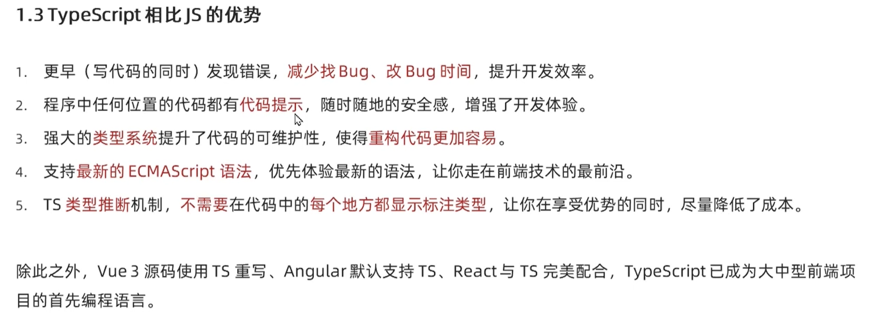
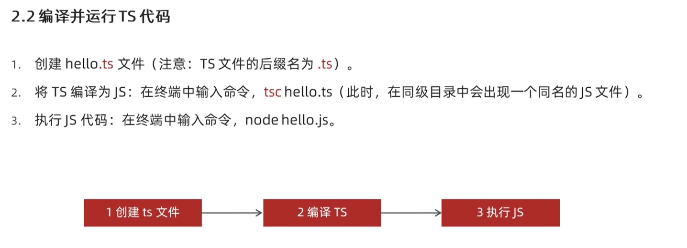

# TypeScript学习笔记


## 目录

- [TypeScript学习笔记](#typescript学习笔记)
  - [目录](#目录)
  - [什么是TypeScript](#什么是typescript)
  - [基本使用](#基本使用)
    - [安装Typescript编译器tsc](#安装typescript编译器tsc)
    - [编写代码、编译、执行](#编写代码编译执行)
    - [使用ts-node简化ts执行步骤](#使用ts-node简化ts执行步骤)
  - [js原生类型注解](#js原生类型注解)
    - [**数组类型的两种特有写法**](#数组类型的两种特有写法)
    - [**函数形参、返回值的类型、void类型**](#函数形参返回值的类型void类型)
    - [**函数类型**](#函数类型)
    - [**函数形参的可选参数**](#函数形参的可选参数)
    - [**对象类型**](#对象类型)
  - [ts新增类型](#ts新增类型)
    - [**联合类型**](#联合类型)
    - [**类型别名**](#类型别名)
    - [**接口**](#接口)
    - [**元组**](#元组)
    - [**字面量类型**](#字面量类型)
    - [**枚举类型**](#枚举类型)
    - [**类型推论**](#类型推论)
    - [**类型断言**](#类型断言)
    - [**any类型**](#any类型)
    - [**ts的typeof运算符**](#ts的typeof运算符)
  - [ts高级类型](#ts高级类型)
    - [**class类**](#class类)
    - [**类-extends继承**](#类-extends继承)
    - [**类-implements实现接口**](#类-implements实现接口)
    - [**类的访问修饰符public protected private**](#类的访问修饰符public-protected-private)
    - [**readonly只读属性**](#readonly只读属性)
    - [**类型兼容性**](#类型兼容性)
      - [**类的类型兼容性**](#类的类型兼容性)
      - [**接口的类型兼容性**](#接口的类型兼容性)
      - [**函数的类型兼容性**](#函数的类型兼容性)
    - [**交叉类型**](#交叉类型)
    - [**交叉类型和继承的区别**](#交叉类型和继承的区别)
    - [**泛型函数**](#泛型函数)
    - [**泛型类型收缩**](#泛型类型收缩)
    - [**多个泛型类型的支持和keyof的使用**](#多个泛型类型的支持和keyof的使用)
    - [**泛型接口**](#泛型接口)
    - [**类的泛型**](#类的泛型)
    - [**泛型工具类型 `Partial` `Readonly` `Pick` `Record`**](#泛型工具类型-partial-readonly-pick-record)
    - [**索引签名类型**](#索引签名类型)
    - [**映射类型**](#映射类型)
    - [**利用映射类型实现Partial**](#利用映射类型实现partial)
    - [**索引查询类型**](#索引查询类型)
  - [**类型声明文件**](#类型声明文件)
    - [**第三方库的类型声明文件的使用**](#第三方库的类型声明文件的使用)
    - [**自定义类型声明文件的使用**](#自定义类型声明文件的使用)
    - [**给已有js文件编写类型声明文件**](#给已有js文件编写类型声明文件)

## 什么是TypeScript

- TypeScript是JavaScript的超集

- `TypeScript = Type + JavaScript` 即在js的基础上增加了类型支持
- TypeScript由微软开发，是开源的


**为什么要为js添加类型支持**

- 原生js是动态类型编程语言，
  - 执行期间做类型检查，
  - 类型错误只有在代码运行时才能发现（bug晚发现），
  - bug难找，难改，开发效率低。
- typescript是静态类型编程语言，
  - 编译期间做类型检查，
  - 类型错误在代码编写时(配合开发工具)，编译时就能发现（bug早发现），
  - bug好找，好改，开发效率高。

**ts优势**


**类型注解**

- 为变量添加类型约束，约束变量age类型为number，
- 若赋值为非number类型则报错

## 基本使用

### 安装Typescript编译器tsc


```bash
npm i -g typescript
tsc -v
```


### 编写代码、编译、执行



### 使用ts-node简化ts执行步骤
>
> 注意：需要package.json文件 否则报错


## js原生类型注解

**js原生类型:`number string boolean null undefined symbol`**

```ts
var a:number=1;
var b:string="1";
var c:boolean=true;
var d:null=null;
var e:undefined=undefined;
var f:symbol=Symbol(1);

console.log(a);
console.log(b);
console.log(c);
console.log(d);
console.log(e);
console.log(f);
// output:
1
1        
true     
null     
undefined
Symbol(1)
```

**js原生对象类型:`object`**

```ts
var g:object=[];
var h:object={};
var i:object=function a(){};
var j:object=function (){};
var k:object=()=>{};

console.log(g);
console.log(h);
console.log(i);
console.log(j);
console.log(k);
// output
[]
{}
[Function: a]
[Function: j]
[Function: k]
```

### **数组类型的两种特有写法**

```ts
// 数组类型的两种写法
var l:number[] = [1,2,3]
var m:Array<number> = [1,2,3]
console.log(l);
console.log(m);
// output
[ 1, 2, 3 ]
[ 1, 2, 3 ]
```

### **函数形参、返回值的类型、void类型**

```ts
function funA(a:number,b:number):number{
    return a+b;
}

var funB = (a:number,b:number):number =>{// 箭头函数的返回值类型的写法
    return a+b;
}

var funC = (a:number,b:number):void =>{//void无返回值类型
  console.log(a+b)
}
```

### **函数类型**

```ts
var funC: (a:number,b:number)=>number = (a,b)=>a+b;
var funC: (a:number,b:number)=>number = function fun(a,b){return a+b};
```

### **函数形参的可选参数**

```ts
function mySlice(start?:number,end?:number):void{

}
```

### **对象类型**

```ts
var obj:{
    name:string;  // ;号可以去掉
    age:number; isUser?:boolean; // 中间的分号不能去掉
    sayHi():void;
    greet?:(name:string)=>void // ?号 表示可选参数
} = {
    name:"hahahah",
    age:18,
    sayHi(){}
}
```

## ts新增类型

**ts新增类型**

- 联合类型 `|`
- 自定义类型（类型别名）
- 接口
- 元祖
- 字面量类型
- 枚举类型
- void
- any

### **联合类型**

```ts
// 联合类型
var a: number|string;
```

### **类型别名**

```ts
// 类型别名
type myType = Arrary<number|string>;
```

### **接口**

```ts
// 接口
interface IPerson {
    name:string;
    age:number;
    sayHi():void;
}
var personA:IPerson;
// 接口继承接口
interface Point2D{x:number;y:number;}
interface Point3D extends Point2D {z:number}
```

### **元组**

```ts
// 元组
var position:[number,number] = [0.5,1.4];
var position:[number,number,string] = [0.5,1.4,"2d"];
```

### **字面量类型**

```ts
// 字面量类型
var aaa = "stringA";   // aaa 的 类型 为 string 即 字符串类型
const bbb = "stringB"; // bbb 的 类型 为 "stringB" 即 字面量类型
var ccc:"stringC"|"stringD" = "stringC" // ccc 的 类型为 两个字面量类型之一
function changeDirection(direction:"up"|"down"|"left"|"right"){ // 字面量类型的应用
    switch(direction){
        case "up":
            ;
        case "down":
            ;
        case "left":
            ;
        case "right":
            ;
    }
}
changeDirection("down");
```

### **枚举类型**

```ts
// 枚举类型
// enum Direction{Up="up",Down="down",Left="left",Right="right"};// 字符串枚举，没有自增长行为，需依次赋值
enum Direction{Up=0,Down,Left,Right};// 数字枚举，有自增长行为，第一个为0后续依次+1
function changeDirection(direction:Direction){// 作用
    switch(direction){
        case Direction.Up:
        case Direction.Down:
        case Direction.Left:
        case Direction.Right:
    }
    console.log(direction);
}
changeDirection(Direction.Down);
// 枚举原理1
enum Direction{Up=0,Down,Left,Right};// 数字枚举，有自增长行为，第一个为0后续依次+1
// 编译后：
var Direction;
(function (Direction) {
    Direction[Direction["Up"] = 0] = "Up";
    Direction[Direction["Down"] = 1] = "Down";
    Direction[Direction["Left"] = 2] = "Left";
    Direction[Direction["Right"] = 3] = "Right";
})(Direction || (Direction = {}));
// 输出
console.log(Direction);
// output
{
    '0': 'Up',
    '1': 'Down',
    '2': 'Left',
    '3': 'Right',
    Up: 0,
    Down: 1,
    Left: 2,
    Right: 3
}
// 编译原理2
// 编译前：
enum Direction{Up="up",Down="down",Left="left",Right="right"};// 字符串枚举，没有自增长行为，需依次赋值
// 编译后：
var Direction;
(function (Direction) {
    Direction["Up"] = "up";
    Direction["Down"] = "down";
    Direction["Left"] = "left";
    Direction["Right"] = "right";
})(Direction || (Direction = {}));
// 输出
console.log(Direction);
// output:
// { Up: 'up', Down: 'down', Left: 'left', Right: 'right' }
```

### **类型推论**

```ts
let a=123;//声明变量时赋初值，变量a将自带类型
a="123"; // 报错
let b;b=1;
b="1" // 不报错


//----------------------------------------
function funA(a:number,b:number){
  return a+b; //函数返回值将自动推断为number
}
let c:string = funA(1,2); // 报错 
```

### **类型断言**

```ts
var alink = document.querySelector("a") as HTMLAnchorElement // 写法1
var alink = <HTMLAnchorElement> document.querySelector("a")  // 写法2

alink.href = "https://baidu.com"
```

### **any类型**

```ts
var a: any ={kkk:123}; // a是any类型
var b;              // b是any类型
function c(d){      // d是any类型
    return d;
}
```

### **ts的typeof运算符**

```ts
    interface Person{name:string,age:number};
    var personA:Person;
    var personB: typeof personA; // typeof支持变量        personB 的 类型 和 personA 一致
    var age: typeof personA.age; // typeof支持对象的属性  
    var result: typeof funA(a,b);// typeof不支持上述两种之外的其他形式的类型
```

## ts高级类型

- class类

- 类型兼容性
- 交叉类型
- 泛型和keyof
- 索引签名类型和索引查询类型
- 映射类型

### **class类**

```ts
class Person{
    name:string;  // 未初始化,有类型
    age=0; // 初始化，有类型
    gender // any类型
    constructor(name:string,age:number,gender){// 构造函数不需要返回值类型
        this.name=name;
        this.age=age;
        this.gender=gender;
    }
    getName():string{
        return this.name
    }
    setName(name:string):void{
        this.name=name
    }
}
const person = new Person("dyg",18,"男");
person.name
```

### **类-extends继承**

```ts
(()=>{
    
    class Animal{
        name:string;
        age:number;
        constructor(name:string,age:number){
            this.name = name
            this.age = age
        }
    }

    class Dog extends Animal{ // extends是js自带的关键字
        constructor(name:string,age:number){
            super(name,age);
        }
        bark(){
            console.log("汪汪汪");
        }
    }

    const dog = new Dog("??",12);
    dog.bark();

})();
```

### **类-implements实现接口**

```ts
(()=>{
    interface Animal{
        name:string
        age:number
        gender:'雌'|"雄"
        bark():void
    }
    class Dog implements Animal{
        name: string;
        age: number;
        gender: "雌" | "雄";
        constructor(name:string,age:number,gender:"雌" | "雄"){
            this.name = name;
            this.age = age;
            this.gender = gender;
        }
        bark(): void {
            console.log("汪汪汪");
        }
    }

    const dog = new Dog("xxx",10,'雄');
})();
```

### **类的访问修饰符public protected private**

```ts
(()=>{
    class Example{
        public name:string; // 在类的外部可见 （实例对象可以访问到）。此外，public是默认的 也可以省略
        protected age:number; // 在本类、子类的内部可见（实例对象无法访问到）
        private gender:string; // 在本类的内部可见 （实例对象无法访问到，子类无法访问到）
        constructor(name:string,age:number,gender:string){
            this.name=name;
            this.age=age;
            this.gender=gender;
        }
        private __myFun__() {// 私有函数
            console.log("这是一个内部辅助函数");
        }
    }
})();
```

### **readonly只读属性**

```ts
(()=>{
    class Example{
      readonly age:number = 0; // 1. 经 readonly 修饰的属性，有注解，只能在 变量赋初始值 和 constructor中 赋值
        readonly height = 170; // 2. 经 readonly 修饰的属性 ，不加注解，则为字面量类型
        // 3. 接口 和 对象 中都可以使用readonly关键字修饰
        constructor(age:number) {
            this.age = age
            this.height = 171 // 报错
        }
        fun(){
            this.age = 123; // 报错
        }
    }

    const example = new Example(1);
    example.age = 1;// 报错，无法修改

})();
```

### **类型兼容性**

**两种类型系统**

- 结构化类型系统(structural type system)
  - 也叫鸭子类型(duck typing)
  - 对于对象类型来说：如果y的成员至少与x相同，则x兼容y（成员多的可以赋值给成员少的）
  - typescript
- 标明类型系统(Nominal Type System)
  - c# java

#### **类的类型兼容性**

```ts
(()=>{
    class Point{x:number;y:number};
    class Point2D{x:number;y:number};
    class Point3D{x:number;y:number;z:number};

    const point1:Point = new Point2D(); // Point2D 向下兼容 Point
    const point2:Point = new Point3D(); // Point3D 向下兼容 Point
})();
```

#### **接口的类型兼容性**

```ts
(()=>{
    interface Animal{type:string;age:number;gender:string};
    interface Human extends Animal{name:string};

    let humanA:Human = {
        name: "",
        type: "",
        age: 0,
        gender: ""
    }

    let animalA:Animal = humanA; // Human 向下兼容 Animal
})();


(()=>{
    interface Point1D{x:number}
    interface Point2D{x:number;y:number;}
    interface Point3D{x:number;y:number;z:number}

    let p3:Point3D = {x:1,y:2,z:3}; // 
    let p2:Point2D = p3;            // Point3D 向下兼容 Point2D
    let p1:Point1D = p3;            // Point2D 向下兼容 Point1D
})();
```

#### **函数的类型兼容性**

- 形式参数少的可以赋值给形式参数多的

```ts
(()=>{
    function SumA(numA:number,numB:number,numC:number){
        return numA+numB+numC;
    }
    function SumB(numA:number,numB:number){
        return numA+numB;
    }
    var funA:(numA:number,numB:number,numC:number)=>number;
    funA=SumA;// funA 兼容 SumA
    funA=SumB;// funA 兼容 SumB
})();
```

- 函数形式参数相同位置的参数类型要相同或兼容

```ts
// 要相同
(()=>{
    type fun1 = (num:number)=>void;   
    type fun2 = (num:number)=>void;   

    var f1:fun1;
    var f2:fun2;
    f1 = f2;        // 形式参数相同位置的参数类型要相同
    f2 = f1;
})();

// 要兼容
(()=>{
    interface Point2D{x:number;y:number};
    interface Point3D{x:number;y:number;z:number};
    type fun2 = (position:Point2D)=>void;   
    type fun3 = (position:Point3D)=>void;   

    var f2:fun2=(pos:Point2D)=>{return};
    var f3:fun3=(pos:Point3D)=>{return};

    // f3 = f2; // fun3 兼容 fun2 类型，可理解为将对象属性展开为函数形式参数，形式参数少的可以赋值给形式参数多的
    f2 = f3; // 严格模式会报错，同上，理解为将对象属性拆开为函数形式参数，有3个形式参数的函数不能赋值给有2个的
})();
```

- 函数的返回值类型：遵循一般类型的规则

```ts

(()=>{
    interface Point2D{x:number;y:number};
    interface Point3D{x:number;y:number;z:number};
    
    type fun2 = (position:Point2D)=>Point2D;   
    type fun3 = (position:Point2D)=>Point3D;   
    
    var f2:fun2=(pos:Point2D)=>{return pos};
    var f3:fun3=(pos:Point2D)=>{return {...pos,z:100}};

    f2 = f3; // 兼容   对象元素多的可以赋值给少的
    f3 = f2; // 不兼容 对象元素少的不能赋值给多的

})();
```

### **交叉类型**

```ts
(()=>{
    interface Person{name:string};
    interface Contact{phone:string};

    type PersonDetail = Person & Contact; // 交叉类型就是将两个类型复合

    var personDetail: PersonDetail = {
        name:"dyg",
        phone:"123"
    }

})();
```

### **交叉类型和继承的区别**

```ts
// 1.
(()=>{
    interface A{a:number};
    interface B extends A{
        a:string // 报错
    }
})();

// 2.
(()=>{
    interface A{a:number};
    interface B{a:string};
    type C = A & B; // a 将变为 never类型 表示永远不存在的值的类型
    var a:A = {a:1}
    var b:B = {a:"1"}
    var c:C = {a:1}  // 报错
})();

// 3.
(()=>{
    interface A{fun:()=>void};
    interface B{fun:(num:number)=>void};
    type C = A & B; // fun的类型将变为： (()=>void) && ((num:number)=>void) 类型
    var c:C = {fun:()=>{return}}
    c.fun() // 方法的重载
    c.fun(123) // 方法的重载
})();
```

### **泛型函数**

```ts
(()=>{
    // 泛型函数
    function echo<voiceType>(voice:voiceType):voiceType{
        return voice
    }

    // 泛型函数的调用
    echo<string>("你好!");
    echo<number>(12345);

    // 简化版的泛型函数调用
    echo("你好！"); // 简化后 voiceType 将被自动推断为字面量类型
    echo(12345);

})();
```

### **泛型类型收缩**

```ts
(()=>{
    // 泛型类型的收缩
    // 1.指定更加明确的类型
        // function myEcho<voiceType>(voice:voiceType[]):voiceType[]{
        //     console.log(voice.length);
        //     return voice
        // }
    // 2.添加类型收缩约束
    interface LengthAble{length:number}
    function echo<voiceType extends LengthAble>(voice:voiceType):voiceType{
        console.log(voice.length);
        return voice
    }

    // 泛型函数的调用
    echo<string>("你好!");
    echo<number[]>([1,2,3,4,5]);

    // 简化版的泛型函数调用
    echo("你好！"); // 简化后 voiceType 将被自动推断为字面量类型
    echo([1,2,3,4,5]); // 
    echo({length:1,msg:"hahahah"});

})();
```

### **多个泛型类型的支持和keyof的使用**

```ts
(()=>{
    // 多个泛型类型
    function hash<typeKey,typeValue>(key:typeKey,value:typeValue):typeValue{
        return value
    }
    // keyof 
    function getValue<typeObj,typeKey extends keyof typeObj>(obj:typeObj,key:typeKey):any{
        return obj[key]
    }
})();
```

### **泛型接口**

```ts
(()=>{
    // 接口泛型,注意接口没有类型推断机制,使用泛型接口需显式指定类型
    interface IdFuncs<IdType>{
        id:(value:IdType)=>IdType;
        ids:()=>IdType[];
    }
    var obj:IdFuncs<number> = {
        id(value:number) {return value },
        ids():number[] { return [1,2,3] }
    }
})();

(()=>{
    interface MapItem<keyType,ValueType>{
        key:keyType;
        value:ValueType;
    }
    var item:MapItem<string,number[]> = {
        key: "123",
        value: [1,2,3]
    }
})();
```

### **类的泛型**

```ts
(()=>{

    class ExampleClass<Type>{
        default:Type;
        constructor(value:Type){
            this.default = value
        }
        set(value:Type):void{
            this.default = this.default
        }
        get(){
            return this.default;
        }
    }

    var ex = new ExampleClass(123); // 类的泛型支持类型推断,在构造函数的形式参数使用了泛型类的所有类型变量的情况下可以省略类型推断
    ex.set(321)
    ex.get()

})();
```

### **泛型工具类型 `Partial` `Readonly` `Pick` `Record`**

```ts
(()=>{

    // 泛型工具类型 : Partial Readonly 
    interface Props{
        id:string;
        title:string;
        children:number[];
    }
    type PartialProps = Partial<Props>; // 创建新类型 使得所有属性变成可选类型，即不是必须的
    type ReadonlyProps = Readonly<Props>; // 创建新类型 使得所有属性变成只读类型
    type PickProps = Pick<Props,"id"|"title"> // 创建新类型 从原类型中选择一组属性构造新类型
    type RecordObj = Record<"id"|"hash",string[]>; // 创建记录类型 键名不同，键值相同

    var p1:Props = {
        id: "",
        title: "",
        children: [],
    }
    var p2:PartialProps = {
        // 可以没有
    }
    var p3:ReadonlyProps = {
        id: "",
        title: "",
        children: [],
    }
    // p3.id = "123" // 报错
    var  p4:PickProps = {
        id: "",
        title: ""
    }
    var p5:RecordObj = {
        id: ["123","1111"],
        hash: ["12132","11211"]
    }

})();

```

### **索引签名类型**

```ts
(()=>{
    // 索引签名类型：用于无法确定对象中具体的属性名或者说属性个数任意的场景
    interface AnyObj {
        [key:string]:number;// 类型为字符串的键 的值 为number类型
    }
    var obj1:AnyObj = {
        a:1,
        ab:12,
        abc:123,
    }

    interface myArray<T>{
        [index:number]:T// 类型为number的键 的值为 T类型
    }
    var myarry:myArray<number> = [1,2,3];
    myarry[0]

})();
```

### **映射类型**

```ts
(() => {
    // 映射类型：
    // + 映射类型基于索引签名，所以也使用了[]符号
    // + key in PropKeys 表示 key可以是联合类型中的任意一个
    // + 映射类型只能在类型别名中使用，不能在接口中使用
    // + type1 和 type2 type3 等效
    type Type1 = { a: number; b: number; c: number }
    type PropKeys = "a" | "b" | "c";
    type Type2 = { [key in PropKeys]: number }
    type Type3 = { [key in keyof Type1]: number }
})();
```

### **利用映射类型实现Partial**

```ts
(() => {
    // Partial实现原理
    type Partial<T> = {
        [Key in keyof T]?: T[Key]
    }
})();
```

### **索引查询类型**

```ts
(() => {
    // 索引查询类型
    type Parps = { a: number; b: string; c: boolean };
    type TypeA = Parps["a"] // 查询Parps中a属性的类型 即number类型
    type TypeAB = Parps["a" | "b"] // 即为 number | string 类型
    type TypeABC = Parps[keyof Parps] // 即为 number | string | boolean 类型
})();
```

## **类型声明文件**

TS中有两种文件类型:

- 1.ts文件
  - 1.既包含类型信息又可执行代码。
  - 2.可以被编译为.js文件，然后，执行代码。3.用途:编写程序代码的地方。
- 2.d.ts文件。
  - 1．只包含类型信息的类型声明文件。
  - 2．不会生成.js 文件，仅用于提供类型信息。3.用途:为JS提供类型信愈。
- 总结:
  - .ts是 implementation(代码实现文件）;
  - .d.ts是declaration(类型声明文件)。如果要为JS库提供类型信息，要使用.d.ts 文件。

### **第三方库的类型声明文件的使用**

- 第三方库会自带 index.d.ts 文件 文件的路径由 package.json 的typing或types字段给出

- 第三库如果没有自带类型声明文件，可以使用由DefinitelyTyped提供的类型声明文件，
  - 下载方式为 `npm i --save-dev @types/第三方库名`

### **自定义类型声明文件的使用**

```ts
// 文件mytypes.d.ts
type A = string | number;
export { A }//导出声明的类型

// 文件index.ts
import {A} from "./myTypes" // 导入声明的类型
var a:A = "123"
```

### **给已有js文件编写类型声明文件**

- ts引入js文件时，会引入同名的.d.ts文件

- declare关键字：用于类型声明，声明一个已经存在的变量的类型
- 对于type interface等的ts独有的类型，声明可以省略declare关键字
- 对于let function等的类型 声明不能省略declare关键字

```ts
declare let count:number;// 为已有全局变量做类型声明
declare function add(a:number,b:number):number;// 为已有函数做类型声明
declare type A = string | number
declare interface OBJ{};
export {count,OBJ,add,A}
```

<style>
    gold{
        color:black;
        background-color:gold;
    }
    green{
        color:white;
        background-color:green;
    }
    warn{
        color:white;
        background-color:red;
    }
</style>
