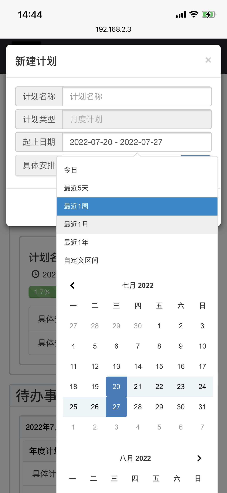

# 记录前端实现的简易待办任务管理工具

**简记**

- 使用js在客户端动态渲染页面
- 为了实现数据的大容量持久存储，使用IndexedDB数据库，数据存储在客户端
- 实现了在客户端对本地数据库的增删改查
- 响应式；对移动端，pc端，ipad做了兼容性适配
- 使用到的技术: indexedDB JQuery bootstrap promsie LESS
- 代码量：总共约2000行代码

## [-->测试<--](./demos/tools/demo/index.html)

## 当前实现效果

### 移动端效果

### PC端效果

