# JavaWeb学习笔记


<details>
<summary>
显示/隐藏

## 目录

</summary>

- [JavaWeb学习笔记](#javaweb学习笔记)
  - [目录](#目录)
  - [概念](#概念)
  - [数据库:mySql](#数据库mysql)
    - [mySql安装配置](#mysql安装配置)
    - [SQL基础语法](#sql基础语法)
    - [MySql数据类型](#mysql数据类型)
    - [SQL语句的分类](#sql语句的分类)
    - [DDL(Data Definition Language)数据定义语言](#ddldata-definition-language数据定义语言)
      - [DDL——\>`操作数据库`](#ddl操作数据库)
        - [查询数据库](#查询数据库)
        - [创建数据库](#创建数据库)
        - [删除数据库](#删除数据库)
        - [使用（切换）数据库](#使用切换数据库)
        - [查看当前使用的数据库](#查看当前使用的数据库)
      - [DDL——\>`操作表`](#ddl操作表)
        - [创建表](#创建表)
        - [查询所有表](#查询所有表)
        - [查询表结构](#查询表结构)
        - [删除表](#删除表)
        - [修改表](#修改表)
          - [修改表名](#修改表名)
          - [添加列](#添加列)
          - [修改列的数据类型](#修改列的数据类型)
          - [修改列名和数据类型](#修改列名和数据类型)
          - [删除列](#删除列)
        - [案例](#案例)
    - [DML(Data Manipulation Language)数据操作语言](#dmldata-manipulation-language数据操作语言)
      - [DML——\>`添加数据`](#dml添加数据)
        - [添加数据到指定列](#添加数据到指定列)
        - [给所有列添加数据](#给所有列添加数据)
        - [批量添加数据](#批量添加数据)
      - [DML——\>`修改数据`](#dml修改数据)
      - [DML——\>`删除表数据`](#dml删除表数据)
    - [DQL(Data Query Language)数据查询语言](#dqldata-query-language数据查询语言)
      - [DQL——\>`基础查询`](#dql基础查询)
      - [DQL——\>`条件查询`](#dql条件查询)
      - [DQL——\>`排序查询`](#dql排序查询)
      - [DQL——\>`聚合查询`](#dql聚合查询)
      - [DQL——\>`分组查询`](#dql分组查询)
      - [DQL——\>`分页查询`](#dql分页查询)
    - [DCL(Data Control Language)数据控制语言](#dcldata-control-language数据控制语言)
      - [??](#)
    - [约束](#约束)
      - [非空约束](#非空约束)
      - [唯一约束](#唯一约束)
      - [主键约束](#主键约束)
      - [检查约束](#检查约束)
      - [默认约束](#默认约束)
      - [外键约束](#外键约束)
      - [额](#额)
    - [数据库设计](#数据库设计)
      - [一对一](#一对一)
      - [一对多](#一对多)
      - [多对多](#多对多)
    - [多表查询](#多表查询)
      - [笛卡尔积](#笛卡尔积)
      - [内连接](#内连接)
      - [外连接](#外连接)
      - [子查询](#子查询)
      - [案例：子查询](#案例子查询)
    - [事务](#事务)
  - [JDBC](#jdbc)
    - [DriverManager工具类](#drivermanager工具类)
    - [Connection数据库连接对象](#connection数据库连接对象)
    - [`Statement` sql执行器对象](#statement-sql执行器对象)
    - [`PreparedStatement` 预编译sql执行器对象:防止sql注入](#preparedstatement-预编译sql执行器对象防止sql注入)
    - [ResultSet 结果集合对象](#resultset-结果集合对象)
    - [数据库连接池](#数据库连接池)
      - [Druid德鲁伊数据库连接池](#druid德鲁伊数据库连接池)
    - [JDBC练习](#jdbc练习)
      - [查询数据](#查询数据)
      - [插入数据](#插入数据)
      - [更新数据](#更新数据)
      - [删除数据](#删除数据)
  - [Maven](#maven)
  - [myBatis](#mybatis)
    - [myBatis简单示例](#mybatis简单示例)
      - [使用示例1:myBatis简单示例](#使用示例1mybatis简单示例)
      - [使用示例2:使用Mapper代理方式](#使用示例2使用mapper代理方式)
    - [核心配置文件](#核心配置文件)
    - [查询数据](#查询数据-1)
      - [多查询selectAll](#多查询selectall)
      - [单查询selectById](#单查询selectbyid)
      - [多条件查询：散装参数](#多条件查询散装参数)
      - [多条件查询：对象参数](#多条件查询对象参数)
      - [多条件查询：集合参数](#多条件查询集合参数)
      - [多条件-动态条件查询`where标签或1=1恒等式`](#多条件-动态条件查询where标签或11恒等式)
      - [单条件-动态条件查询`:when:choose:otherwise`](#单条件-动态条件查询whenchooseotherwise)
    - [增添数据](#增添数据)
      - [插入单条数据](#插入单条数据)
      - [插入单条数据：返回主键](#插入单条数据返回主键)
    - [修改数据](#修改数据)
      - [修改全部字段](#修改全部字段)
      - [修改任意字段`set:if`](#修改任意字段setif)
    - [删除数据](#删除数据-1)
      - [删除单个deleteById](#删除单个deletebyid)
      - [删除多个`deleteById`:`不使用注解版`](#删除多个deletebyid不使用注解版)
      - [删除多个`deleteById`:`使用注解版`](#删除多个deletebyid使用注解版)
    - [myBatis对参数的封装](#mybatis对参数的封装)
    - [使用注解完成简单sql操作](#使用注解完成简单sql操作)
  - [Tomcat](#tomcat)
  - [Servlet](#servlet)
    - [什么是Servlet](#什么是servlet)
    - [实现最简Servlet程序](#实现最简servlet程序)
    - [servlet生命周期](#servlet生命周期)
    - [HTTPServlet](#httpservlet)
    - [urlPattern配置](#urlpattern配置)
    - [xml方式配置Servlet](#xml方式配置servlet)
    - [Request对象](#request对象)
      - [Request继承体系](#request继承体系)
      - [Request常用方法](#request常用方法)
      - [通用的获取参数的方法](#通用的获取参数的方法)
      - [解决Request输入流中文乱码的问题](#解决request输入流中文乱码的问题)
    - [Request内部请求转发转发流转给jsp页面Forward](#request内部请求转发转发流转给jsp页面forward)
    - [Response对象](#response对象)
      - [Response设置响应数据功能介绍](#response设置响应数据功能介绍)
      - [Response完成重定向](#response完成重定向)
      - [Response响应字符数据](#response响应字符数据)
      - [Response响应字节数据](#response响应字节数据)
    - [案例：实现登录注册案例](#案例实现登录注册案例)
    - [优化：把SqlSessionFactory优化为工具类](#优化把sqlsessionfactory优化为工具类)
  - [JSP(Java Server Pages)Java服务端页面](#jspjava-server-pagesjava服务端页面)
    - [servlet+jsp](#servletjsp)
    - [JSTF标签](#jstf标签)
  - [MVC模式与三层架构](#mvc模式与三层架构)
    - [MVC模式](#mvc模式)
    - [三层架构](#三层架构)
    - [SSM三大框架](#ssm三大框架)
    - [MVC三层模式与三层架构的区别](#mvc三层模式与三层架构的区别)
    - [案例业务逻辑](#案例业务逻辑)
  - [使用`三层架构`重写登录注册案例](#使用三层架构重写登录注册案例)
    - [项目目录结构](#项目目录结构)
    - [database数据访问层](#database数据访问层)
    - [service业务逻辑层](#service业务逻辑层)
    - [web表现层（控制器+视图）](#web表现层控制器视图)
    - [maven配置](#maven配置)
    - [结合反射对web表现层的进一步优化并实现验证码和JSON响应](#结合反射对web表现层的进一步优化并实现验证码和json响应)
  - [Fastjson：JSON 数据和 Java 对象转换](#fastjsonjson-数据和-java-对象转换)
  - [Cookie、Session会话跟踪技术](#cookiesession会话跟踪技术)
    - [Cookie](#cookie)
      - [Cookie基本使用和原理](#cookie基本使用和原理)
      - [Cookie存活时间](#cookie存活时间)
      - [Cookie发送中文](#cookie发送中文)
    - [Session](#session)
      - [Session的钝化与活化](#session的钝化与活化)
      - [Session在浏览器的生命周期](#session在浏览器的生命周期)
      - [Session在服务端的生命周期](#session在服务端的生命周期)
    - [实现登录记住我功能:通过Cookie实现](#实现登录记住我功能通过cookie实现)
    - [实现登录记住我功能:通过Session实现](#实现登录记住我功能通过session实现)
    - [实现注册用户验证码的案例](#实现注册用户验证码的案例)
  - [Filter](#filter)
  - [Listener](#listener)
  - [补充：文件上传](#补充文件上传)
    - [本地存储](#本地存储)
    - [远程存储](#远程存储)
  - [补充：HttpClient](#补充httpclient)

</details>

## 概念

JavaWeb：用java技术解决Web互联网领域问题的技术栈

**内容**


## 数据库:mySql

**DBMS**

- `Oracle`: 收费的大型数据库，Oracle 公司的产品
- `MySQL`: 开源免费的中小型数据库。后来Sun公司收购了MySQL，而Sun公司又被Oracle 收购.
- `MariaDB` :开源免费中小型的数据库,<green>**在MySQL被收购后,由MySql的原开发人员开发的开源版**</green>
- `SQL Server`: MicroSoft公司收费的中型的数据库。C#、.net等语言常使用
- `SQLite` :嵌入式的微型数据库。如:作为Android内置数据库

### mySql安装配置

1. 下载解压版`mysql-5.7`
3. 配置环境变量

   ```text
   JAVA_HOME = D:\Program Files\mysql-5.7.38-winx64
   PATH += %MYSQL_HOME%\bin
   ```

1. 编写配置文件`my.ini`,放到根目录

   ```ini
    [mysql]
    default-character-set=utf8
    
    [mysqld]
    skip-grant-tables # 跳过权限表认证，用于解决登录sql的报错：ERROR 1045 (28000): Access denied for user 'root'@'localhost' (using password: NO)
    port=3306
    character-set-server=utf8
    default-storage-engine=INNODB
    sql-mode="STRICT_TRANS_TABLES,NO_ZERO_IN_DATE,NO_ZERO_DATE,ERROR_FOR_DIVISION_BY_ZERO,NO_AUTO_CREATE_USER,NO_ENGINE_SUBSTITUTION"
   ```

4. 初始化数据库

   ```bash
   #以管理员方式执行，效果为在mysql根目录生成data文件夹
   mysqld --initialize-insecure
   ```

5. 注册mysql为系统服务

   ```bash
   mysqld -install #注册服务
   mysqld -remove #删除服务
   ```

   **问题**
   若注册服务提示找不到文件，则修改注册表，将路径改为正确路径
   
6. 启动mysql服务

   ```bash
   # 方法1
   net start mysql #启动服务 
   net stop mysql # 停止服务
   # 方法2
   services.msc # 通过windows的services图形界面启动
   ```

7. 修改密码

   ```bash
   mysqld --skip-grant-tables # --skip-grant-tables 的意思是跳过权限表认证。
   mysqld -u root -p root  # 修改密码
   ```

8. 登录

   ```bash
   mysql -u root -p # 默认密码为空
   mysql -u 用户名 -p 密码 -h 主机 -P 端口
   ```

### SQL基础语法

**规范**

- 关键字不区分大小写，建议大写

**注释**

```sql
-- 这是单行注释，必须要有空格
/* 
   这是多行注释
*/
```

### MySql数据类型

**分类**

- 数值类型
- 日期时间类型
- 字符串类型

**数值类型**
| 数据类型     | 大小    | 描述           | 说明                                                                             |
| ------------ | ------- | -------------- | -------------------------------------------------------------------------------- |
| TINYINT      | 1 byte  | 小整数值       |
| SMALLINT     | 2 bytes | 大整数值       |
| MEDIUMINT    | 3 bytes | 大整数值       |
| INT或INTEGER | 4 bytes | 大整数值       |
| BIGINT       | 8 bytes | 极大整数值     |
| FLOAT        | 4 bytes | 单精度浮点数值 |
| DOUBLE       | 8 bytes | 双精度浮点数值 | `字段名1 double(总长度,保留小数位数)` <br> 如分数[0.00-100.00]：分数 double(5,2) |
| DECIMAL      |         | 小数值         |

**日期时间类型**
| 数据类型  | 大小 | 描述                        | 说明                                          |
| --------- | ---- | --------------------------- | --------------------------------------------- |
| DATE      | 3    | 日期值                      |
| TIME      | 3    | 时间值或持续时间            |
| YEAR      | 1    | 年份值                      |
| DATETIME  | 8    | 混合日期和时间值            |
| TIMESTAMP | 4    | 混合日期和时间值,**时间戳** | 若该字段不给数值，则mysql会默认给一个当前时间 |

**字符串类型**
| 数据类型   | 大小                  | 描述                          | 说明                                                                    |
| ---------- | --------------------- | ----------------------------- | ----------------------------------------------------------------------- |
| CHAR       | 0-255 bytes           | 定长字符串                    | "abc" 在 `name char(10)` 中占10个字符 浪费空间节约时间 **空间换时间**   |
| VARCHAR    | 0-65535 bytes         | 变长字符串                    | "abc" 在 `name varchar(10)` 中占3个字符 浪费时间节约空间 **时间换空间** |
| TINYBLOB   | 0-255 bytes           | 不超过255个字符的二进制字符串 |
| TINYTEXT   | 0-255 bytes           | 短文本字符串                  |
| BLOB       | 0-65535 bytes         | 二进制形式的长文本数据        |
| TEXT       | 0-65535 bytes         | 长文本数据                    |
| MEDIUMBLOB | 0-16 777215 bytes     | 二进制形式的中等长度文本数据  |
| MEDIUMTEXT | 0-16777 215 bytes     | 中等长度文本数据              |
| LONGBLOB   | 0-4 294 967 295 bytes | 进制形式的极大文本数据        |
| LONGTEXT   | 0-4 294 967 295 bytes | 极大文本数据                  |

### SQL语句的分类

- `DDL(Data Definition Language)`数据`定义`语言，用来定义数据库对象:`数据库，表，列`等

- `DML(Data Manipulation Language)`数据`操作`语言，用来对数据库中表的数据进行`增删改`
- `DQL(Data Query Language)`数据`查询`语言，用来`查`询数据库中表的记录(数据)
- `DCL(Data Control Language)`数据`控制`语言，用来`定义数据库的访问权限和安全级别`，及`创建用户`

### DDL(Data Definition Language)数据定义语言

#### DDL——>`操作数据库`

##### 查询数据库

**查询数据库**

```sql
show databases;
```

**查询数据库测试**

```bash
mysql> show databases;
+--------------------+
| Database           | # mysql自带的四个数据库：
+--------------------+
| information_schema | # 不在硬盘中，是一个视图，记录了mysql中的库、表
| mysql              | # 存储了权限等的信息
| performance_schema | # 存储了性能相关的信息
| sys                | # 存储了系统相关的信息
+--------------------+
4 rows in set (0.00 sec)

```

-------------------------------------------------------------------

##### 创建数据库

**创建数据库**

```sql
create database 数据库名;
```

**创建数据库测试**

```bash
mysql> create database db1;
Query OK, 1 row affected (0.09 sec)
```

**创建数据库（若不存在）**

```sql
create database if not exists 数据库名;
```

-------------------------------------------------------------------

##### 删除数据库

**删除数据库**

```sql
drop database 数据库名;
```

**删除数据库测试**

```bash
mysql> drop database db1;
Query OK, 0 rows affected (0.00 sec)
```

**删除数据库（若存在）**

```sql
drop database if not exists 数据库名;
```

-------------------------------------------------------------------

##### 使用（切换）数据库

**使用数据库**

```sql
use 数据库名;
```

**使用数据库测试**

```bash
mysql> use db1;
Database changed
```

-------------------------------------------------------------------

##### 查看当前使用的数据库

**查看当前使用的数据库**

```sql
select Database();
```

**查看当前使用的数据库测试**

```bash
mysql> select Database();
+------------+
| Database() |
+------------+
| db1        |
+------------+
1 row in set (0.00 sec)
```

-------------------------------------------------------------------

#### DDL——>`操作表`

**CRUB**

- 创建(Create)
- 查询(Retrieve)
- 修改(Update)
- 删除(Delete)

-------------------------------------------------------------------

##### 创建表

**创建表**

```sql
create table 表名(
   字段名1 数据类型1,
   字段名2 数据类型2 -- 最后一行无逗号
);
```

**创建表测试**

```bash
mysql> 
create table user(
   id int,
   username varchar(20),
   password varchar(32)
);
Query OK, 0 rows affected (0.65 sec)
mysql> desc user;
+----------+-------------+------+-----+---------+-------+
| Field    | Type        | Null | Key | Default | Extra |
+----------+-------------+------+-----+---------+-------+
| id       | int(11)     | YES  |     | NULL    |       |
| username | varchar(20) | YES  |     | NULL    |       |
| password | varchar(32) | YES  |     | NULL    |       |
+----------+-------------+------+-----+---------+-------+
3 rows in set (0.00 sec)
```

-------------------------------------------------------------------

##### 查询所有表

**查询所有表**

```sql
show tables;
```

**查询所有表测试**

```bash
mysql> show tables;
+---------------+
| Tables_in_db1 |
+---------------+
| user          |
+---------------+
1 row in set (0.00 sec)
```

-------------------------------------------------------------------

##### 查询表结构

**查询表结构**

```sql
desc 表名;
```

**查询表结构测试**

```bash
mysql> desc user;
+----------+-------------+------+-----+---------+-------+
| Field    | Type        | Null | Key | Default | Extra |
+----------+-------------+------+-----+---------+-------+
| id       | int(11)     | YES  |     | NULL    |       |
| username | varchar(20) | YES  |     | NULL    |       |
| password | varchar(32) | YES  |     | NULL    |       |
+----------+-------------+------+-----+---------+-------+
3 rows in set (0.01 sec)
```

-------------------------------------------------------------------

##### 删除表

**删除表**

```sql
drop table 表名;
```

**删除表(判断是否存在)**

```sql
drop table if exists 表名;
```

**删除表(判断是否存在)测试**

```bash
mysql>  show tables;
+---------------+
| Tables_in_db1 |
+---------------+
| student       |
| user          |
+---------------+
2 rows in set (0.00 sec)

mysql> drop table if exists user;
Query OK, 0 rows affected (0.24 sec)
mysql> show tables;
+---------------+
| Tables_in_db1 |
+---------------+
| student       |
+---------------+
1 row in set (0.00 sec)
```

-------------------------------------------------------------------

##### 修改表

###### 修改表名

**修改表名**

```sql
alter table 旧表名 rename to 新表名; 
```

**修改表名测试**

```bash
mysql> show tables;
+---------------+
| Tables_in_db1 |
+---------------+
| student       |
+---------------+
1 row in set (0.00 sec)

mysql> alter table student rename to student_new;
Query OK, 0 rows affected (0.43 sec)

mysql> show tables;
+---------------+
| Tables_in_db1 |
+---------------+
| student_new   |
+---------------+
1 row in set (0.00 sec)
```

###### 添加列

**添加列**

```sql
alter table 表名 add 列名 数据类型; 
```

**添加列测试**

```bash
mysql> desc student_new;
+----------+-------------+------+-----+---------+-------+
| Field    | Type        | Null | Key | Default | Extra |
+----------+-------------+------+-----+---------+-------+
| id       | int(11)     | YES  |     | NULL    |       |
| name     | char(10)    | YES  |     | NULL    |       |
| sex      | char(1)     | YES  |     | NULL    |       |
| birthday | date        | YES  |     | NULL    |       |
| score    | double(5,2) | YES  |     | NULL    |       |
| email    | varchar(64) | YES  |     | NULL    |       |
| telnum   | char(20)    | YES  |     | NULL    |       |
| status   | tinyint(4)  | YES  |     | NULL    |       |
+----------+-------------+------+-----+---------+-------+
8 rows in set (0.00 sec)

mysql> alter table student_new add new_attribute int; # 新增字段
Query OK, 0 rows affected (0.56 sec)
Records: 0  Duplicates: 0  Warnings: 0

mysql> desc student_new;
+---------------+-------------+------+-----+---------+-------+
| Field         | Type        | Null | Key | Default | Extra |
+---------------+-------------+------+-----+---------+-------+
| id            | int(11)     | YES  |     | NULL    |       |
| name          | char(10)    | YES  |     | NULL    |       |
| sex           | char(1)     | YES  |     | NULL    |       |
| birthday      | date        | YES  |     | NULL    |       |
| score         | double(5,2) | YES  |     | NULL    |       |
| email         | varchar(64) | YES  |     | NULL    |       |
| telnum        | char(20)    | YES  |     | NULL    |       |
| status        | tinyint(4)  | YES  |     | NULL    |       |
| new_attribute | int(11)     | YES  |     | NULL    |       | # 新增的字段
+---------------+-------------+------+-----+---------+-------+
9 rows in set (0.00 sec)
```

###### 修改列的数据类型

**修改列的数据类型**

```sql
alter table 表名 modify 列名 新数据类型; 
```

**修改数据类型测试**

```bash
mysql> desc student_new;
+---------------+-------------+------+-----+---------+-------+
| Field         | Type        | Null | Key | Default | Extra |
+---------------+-------------+------+-----+---------+-------+
| id            | int(11)     | YES  |     | NULL    |       |
| name          | char(10)    | YES  |     | NULL    |       |
| sex           | char(1)     | YES  |     | NULL    |       |
| birthday      | date        | YES  |     | NULL    |       |
| score         | double(5,2) | YES  |     | NULL    |       |
| email         | varchar(64) | YES  |     | NULL    |       |
| telnum        | char(20)    | YES  |     | NULL    |       |
| status        | tinyint(4)  | YES  |     | NULL    |       |
| new_attribute | int(11)     | YES  |     | NULL    |       | # new_attribute int(11)
+---------------+-------------+------+-----+---------+-------+
9 rows in set (0.00 sec)

mysql> alter table student_new modify new_attribute char(1);   # 修改字段的数据类型
Query OK, 0 rows affected (0.63 sec)
Records: 0  Duplicates: 0  Warnings: 0

mysql> desc student_new;
+---------------+-------------+------+-----+---------+-------+
| Field         | Type        | Null | Key | Default | Extra |
+---------------+-------------+------+-----+---------+-------+
| id            | int(11)     | YES  |     | NULL    |       |
| name          | char(10)    | YES  |     | NULL    |       |
| sex           | char(1)     | YES  |     | NULL    |       |
| birthday      | date        | YES  |     | NULL    |       |
| score         | double(5,2) | YES  |     | NULL    |       |
| email         | varchar(64) | YES  |     | NULL    |       |
| telnum        | char(20)    | YES  |     | NULL    |       |
| status        | tinyint(4)  | YES  |     | NULL    |       |
| new_attribute | char(1)     | YES  |     | NULL    |       | # new_attribute char(1)
+---------------+-------------+------+-----+---------+-------+
9 rows in set (0.00 sec)
```

###### 修改列名和数据类型

**修改列名和数据类型**

```sql
alter table 表名 change 列名 新列名 新数据类型; 
```

**修改列名和数据类型测试**

```bash
mysql> desc student_new;
+---------------+-------------+------+-----+---------+-------+
| Field         | Type        | Null | Key | Default | Extra |
+---------------+-------------+------+-----+---------+-------+
| id            | int(11)     | YES  |     | NULL    |       |
| name          | char(10)    | YES  |     | NULL    |       |
| sex           | char(1)     | YES  |     | NULL    |       |
| birthday      | date        | YES  |     | NULL    |       |
| score         | double(5,2) | YES  |     | NULL    |       |
| email         | varchar(64) | YES  |     | NULL    |       |
| telnum        | char(20)    | YES  |     | NULL    |       |
| status        | tinyint(4)  | YES  |     | NULL    |       |
| new_attribute | char(1)     | YES  |     | NULL    |       | # 待修改列名和类型
+---------------+-------------+------+-----+---------+-------+
9 rows in set (0.00 sec)
mysql> alter table student_new change new_attribute new_attr  int; # 修改字段的名字和数据类型
Query OK, 0 rows affected (0.72 sec)
Records: 0  Duplicates: 0  Warnings: 0

mysql> desc student_new;
+----------+-------------+------+-----+---------+-------+
| Field    | Type        | Null | Key | Default | Extra |
+----------+-------------+------+-----+---------+-------+
| id       | int(11)     | YES  |     | NULL    |       |
| name     | char(10)    | YES  |     | NULL    |       |
| sex      | char(1)     | YES  |     | NULL    |       |
| birthday | date        | YES  |     | NULL    |       |
| score    | double(5,2) | YES  |     | NULL    |       |
| email    | varchar(64) | YES  |     | NULL    |       |
| telnum   | char(20)    | YES  |     | NULL    |       |
| status   | tinyint(4)  | YES  |     | NULL    |       |
| new_attr | int(11)     | YES  |     | NULL    |       | # 修改列名和类型
+----------+-------------+------+-----+---------+-------+
9 rows in set (0.00 sec)
```

###### 删除列

**删除列**

```sql
alter table 表名 drop 列名; 
```

**删除列测试**

```bash
mysql> desc student_new;
+----------+-------------+------+-----+---------+-------+
| Field    | Type        | Null | Key | Default | Extra |
+----------+-------------+------+-----+---------+-------+
| id       | int(11)     | YES  |     | NULL    |       |
| name     | char(10)    | YES  |     | NULL    |       |
| sex      | char(1)     | YES  |     | NULL    |       |
| birthday | date        | YES  |     | NULL    |       |
| score    | double(5,2) | YES  |     | NULL    |       |
| email    | varchar(64) | YES  |     | NULL    |       |
| telnum   | char(20)    | YES  |     | NULL    |       |
| status   | tinyint(4)  | YES  |     | NULL    |       |
| new_attr | int(11)     | YES  |     | NULL    |       | # 待删除列
+----------+-------------+------+-----+---------+-------+
9 rows in set (0.00 sec)

mysql> alter table student_new drop new_attr;             # 删除字段
Query OK, 0 rows affected (0.74 sec)
Records: 0  Duplicates: 0  Warnings: 0

mysql> desc student_new;
+----------+-------------+------+-----+---------+-------+
| Field    | Type        | Null | Key | Default | Extra |
+----------+-------------+------+-----+---------+-------+
| id       | int(11)     | YES  |     | NULL    |       |
| name     | char(10)    | YES  |     | NULL    |       |
| sex      | char(1)     | YES  |     | NULL    |       |
| birthday | date        | YES  |     | NULL    |       |
| score    | double(5,2) | YES  |     | NULL    |       |
| email    | varchar(64) | YES  |     | NULL    |       |
| telnum   | char(20)    | YES  |     | NULL    |       |
| status   | tinyint(4)  | YES  |     | NULL    |       | # 删除了一个字段
+----------+-------------+------+-----+---------+-------+
8 rows in set (0.00 sec)
```

##### 案例

**案例1**


```sql
create table student(
   id int,
   name char(10),
   sex char(1),
   birthday date,
   score double(5,2),
   email varchar(64),
   telnum char(20),
   status tinyint
);
```

**案例1执行结果**

```bash
mysql> create table student(
   id int,
   name char(10),
   sex char(1),
   birthday date,
   score double(5,2),
   email varchar(64),
   telnum char(20),
   status tinyint
);
Query OK, 0 rows affected (0.34 sec)

mysql> desc student;
+----------+-------------+------+-----+---------+-------+
| Field    | Type        | Null | Key | Default | Extra |
+----------+-------------+------+-----+---------+-------+
| id       | int(11)     | YES  |     | NULL    |       |
| name     | char(10)    | YES  |     | NULL    |       |
| sex      | char(1)     | YES  |     | NULL    |       |
| birthday | date        | YES  |     | NULL    |       |
| score    | double(5,2) | YES  |     | NULL    |       |
| email    | varchar(64) | YES  |     | NULL    |       |
| telnum   | char(20)    | YES  |     | NULL    |       |
| status   | tinyint(4)  | YES  |     | NULL    |       |
+----------+-------------+------+-----+---------+-------+
8 rows in set (0.00 sec)
```

### DML(Data Manipulation Language)数据操作语言

#### DML——>`添加数据`

##### 添加数据到指定列

**添加数据到指定列**

```sql
insert into 表名(列名1,列名2,列名3,...) values(值1,值2,值3,...);
```

**添加数据到指定列测试**

```sql
use db1;
desc student;
insert into 
student(id,name,sex,birthday,score,email,telnum,status)
values(0,"test1",'男',"2022-1-1",99.99,"244@qq.com","0519-110",1);
select * from student;
```

```bash
mysql> select * from student;
+------+-------+------+------------+-------+------------+----------+--------+------+
| id   | name  | sex  | birthday   | score | email      | telnum   | status | age  |
+------+-------+------+------------+-------+------------+----------+--------+------+
|    0 | test1 | 男   | 2022-01-01 | 99.99 | 244@qq.com | 0519-110 |      1 | NULL |
+------+-------+------+------------+-------+------------+----------+--------+------+
3 rows in set (0.00 sec)
```

##### 给所有列添加数据

```sql
insert into 表名 values(值1,值2,值3,...); -- 不建议使用，值的顺序错误将导致赋值错误
```

##### 批量添加数据

```sql
insert into 表名(列名1,列名2,列名3,...) values(值1,值2,值3,...),(值1,值2,值3,...),(值1,值2,值3,...),(值1,值2,值3,...),...;
insert into 表名 values(值1,值2,值3,...),(值1,值2,值3,...),(值1,值2,值3,...),(值1,值2,值3,...),...;
```

#### DML——>`修改数据`

**修改表数据**

```sql
update 表名 set 列名1=值1,列名2=值2,列名3=值3,... [where 条件];
```

<warn>不写条件会导致所有行被修改</warn>

#### DML——>`删除表数据`

**删除表数据**

```sql
delete from 表名 [where 条件];
delete from 表名 [where 属性名=属性值];
```

<warn>不写条件会导致所有行被删除</warn>

### DQL(Data Query Language)数据查询语言

**数据查询语法**

```sql
select
   字段列表
from
   表名列表
where
   条件列表
group by
   分组列表
having
   分组后条件
order by
   排序字段
limit
   分页限定
;
```

#### DQL——>`基础查询`

**查询多个字段**

```sql
select 字段列表 from 表名列表;
select * from 表名列表; -- 一般公司里要求不用这种形式，因为不能一眼看出查询了哪些列
```

**查询多个字段测试**

```bash
mysql> select name,birthday,sex from student;
+-------+------------+------+
| name  | birthday   | sex  |
+-------+------------+------+
| test1 | 2022-01-01 | 男   |
| test1 | 2022-01-01 | 男   |
| test1 | 2022-01-01 | 男   |
+-------+------------+------+
3 rows in set (0.00 sec)
```

-------------------------------------------------------------------

**去除重复记录**

```sql
select distinct 字段列表 from 表名; --根据字段列表的值去除重复记录
```

**去除重复记录测试**

```sql
select addr distinct addr from student;
```

-------------------------------------------------------------------
**起别名**

```sql
select 字段1 as 新列名1,字段2 as 新列名2, from student;
select 字段1  新列名1,字段2  新列名2, from student; -- as 可以省略
```

**起别名测试**

```sql
select name as 姓名,age as 年龄,sex as 性别 from student;
select name 姓名,age 年龄,sex 性别 from student;
```

```bash
mysql> select name 姓名,age 年龄,sex 性别 from student;
+--------+--------+--------+
| 姓名   |  年龄   | 性别   |
+--------+--------+--------+
| test1  |   10   |   男   |
| test2  |   20   |   男   |
+--------+--------+--------+
2 rows in set (0.00 sec)
```

#### DQL——>`条件查询`

**条件查询语法**

```sql
select 字段列表 from 表名 where 条件列表;
```

| 符号                  | 说明                                                 |
| --------------------- | ---------------------------------------------------- |
| `>`                   |                                                      |
| `<`                   |                                                      |
| `>=`                  |                                                      |
| `<=`                  |                                                      |
| `=`                   | 注意，只写一个等于                                   |
| `<>` or `!=`          |                                                      |
| `between ... and ...` | `[a,b]`                                              |
| `in()`                | 多选一                                               |
| `like 占位符`         | **模糊查询** `_`单字符任意匹配 `%`零或多字符任意匹配 |
| `is null`             |                                                      |
| `is not null`         |                                                      |
| `and` or `&&`         |                                                      |
| `or` or `\|\|`        |                                                      |
| `not` or `!`          |                                                      |

**条件查询语法测试**

```sql
-- 年龄等于20
select name,sex from student where age=20;

-- 年龄不等于20
select name,sex from student where age!=20;

-- 年龄大于20
select name,sex from student where age>20;

-- 年龄大于等于20
select name,sex from student where age>=20;

-- 年龄 等于20 或 等于30 或 等于40 
select name,sex from student where age=20 or age=30 or age=40;
select name,sex from student where age in(20,30,40);    -- `in()` 的使用

-- 年龄 大于等于20 且 小于等于30
select name,sex from student where age>=20 && age<=30;
select name,sex from student where age>=20 and age<=30;
select name,sex from student where age between 20 and 30; -- `between... and...` 的使用

-- 出生日期在 1998-09-01 到 1999-09-01 
select name,sex from student where birthday between `1998-09-01` and `1999-09-01`;

-- 英语成绩为null
select name,sex from student where english = null; -- 错误写法
select name,sex from student where english is null; -- 正确写法
select name,sex from student where english is not null;

-- 姓马的
select name,sex from student where name like "马%";

-- 第二个字是花
select name,sex from student where name like "_花%";

-- 名字中含有德字
select name,sex from student where name like "%德%";
```

#### DQL——>`排序查询`

```sql
select 字段列表 from 表名 order by 排序字段名称1 [排序方式1],排序字段名2 [排序方式2];

-- 排序方式
   -- ASC 升序（默认）
   -- DESC 降序
```

<warn>根据多个字段排序时，只有当根据第一个字段排序无法区分区分顺序时，才会根据第二个字段排序。</warn>

**排序查询书写示例**

```sql
-- 查询学生信息，按年龄升序排序
select * from student order by age asc;
select * from student order by age;

-- 查询学生信息 按数学成绩降序排序
select * from student order by math_score desc;

-- 查询学生信息 按数学成绩降序排序,如果数学成绩一致，则按英语成绩升序排序。
select * from student order by math_score desc,english_score asc;
```

#### DQL——>`聚合查询`

**概念**：将一列数据作为整体，进行运算。

**聚合函数**
| 函数名      | 功能     | 取值              |
| ----------- | -------- | ----------------- |
| count(列名) | 统计数量 | `非空列名` 或 `*` |
| max(列名)   | 最大值   |
| min(列名)   | 最小值   |
| sum(列名)   | 求和     |
| avg(列名)   | 平均值   |

<warn>注意：null值不参与聚合运算,如计算某列平均值，为null的行不参与运算。</warn>

**sql语法格式**

```sql
select 聚合函数名(列名)[,可以继续写其他字段名] from 表;
```

**排序查询书写示例**

```sql
-- 统计班级人数
select count(id) from student;
select count(*) from student;

-- 查询数学最高分者的分数，名字，年龄
select name,age,max(math_score) from student;
```

#### DQL——>`分组查询`

**分组查询**

```sql
select 字段列表 from 表名 where 查询条件 group by 分组字段名 having 分组后过滤条件;
```

<warn>**注意:** </warn>

- 分组后,只能查询分组字段和聚合函数，查询其他字段能出结果但无意义
- 执行顺序: `where` -> `聚合函数` -> `having`
- `where` 和 `having` 区别：
  - `where` 是对分组前的数据进行限定,无法对聚合函数判断
  - `having` 是对分组后的数据进行过滤,能对聚合函数判断

**分组查询书写示例**

```sql
-- 查询全班男生女生各自的数学平均分
select sex,avg(math_score) from student group by sex;

-- 分组后,只能查询分组字段和聚合函数，查询其他字段能出结果但无意义
select name,sex,avg(math_score) from student group by sex;

-- 查询全班男生女生各自的数学平均分及各自人数
select sex,avg(math_score) as math_avg,count(id) as pcount from student group by sex;

-- 查询全班男生女生各自的数学平均分及各自人数,分数低于70分不参与分组
select sex,avg(math_score) as math_avg,count(id) as pcount from student where math_score > 70 group by sex;

-- 查询全班男生女生各自的数学平均分及各自人数,分数低于70分不参与分组,分组后,各分组的总人数>2
select 
   sex,avg(math_score) as math_avg,
   count(id) as pcount from student
where
   math_score > 70
group by 
   sex 
having 
   count(id) > 2;
```

#### DQL——>`分页查询`

**分页查询语法**

```sql
select 字段列表 from 表名 limit 起始索引 , 查询条目数;
```

**注意点**

- 起始索引：从0开始
- 计算公式：`起始索引 = (查询页-1) * 每页显示条目数`
- <green>分页查询语法格式是mysql特有的</green>
  - `sql Server` 分页查询用 `top`
  - `oracle` 分页查询用 `rownnumber`

**分页查询语法示例**

```sql
-- 从0开始查询三条数据
select * from student limit 0 ,3 ;

-- 每页展示10条数据，查询第1页数据
select * from student limit 0 ,10 ;    `起始索引 = (查询页-1) * 每页显示条目数`
-- 每页展示10条数据，查询第2页数据
select * from student limit 10 ,10 ;
-- 每页展示10条数据，查询第3页数据
select * from student limit 20 ,10 ;
```

### DCL(Data Control Language)数据控制语言

#### ??

### 约束

概念

- 约束是作用于表中列的规则，用于限制加入数据的
- 约束可以保证数据的 **正确性** **完整性** **有效性**

**主要的几种约束**
| 约束名称 | 描述                                                              | 关键字                         |
| -------- | ----------------------------------------------------------------- | ------------------------------ |
| 非空约束 | 保证列中所有数据不能有null值                                      | `NOT NULL`                     |
| 唯一约束 | 保证列中所有数据各不相同,如果修饰的列是数值类型可以添加自增约束   | `UNIQUE [AUTO_INCREMENT]`      |
| 主键约束 | 主键是一行数据的唯一标识，要求`非空`且`唯一`                      | `PRIMARY KEY [AUTO_INCREMENT]` |
| 检查约束 | 保证列中的值满足某一条件  <warn> mysql不支持 **检查约束** </warn> | `CHECK`                        |
| 默认约束 | 保存数据时，未指定值则采用默认值                                  | `DEFAULT`                      |
| 外键约束 | 外键用来让两个表的数据之间建立链接，保证数据的一致性和完整性      | `FOREIGN KEY`                  |

**扩展约束**
| 约束名称 | 描述                                                                           | 关键字          |
| -------- | ------------------------------------------------------------------------------ | --------------- |
| 自增约束 | 当列为`数值类型`且有`唯一约束`，保存数据时，`未指定值`或`给null`时将`自动自增` | AUTO_INCREMENT` |

#### 非空约束

```sql
use db1;
drop table if exists student;

-- 在表创建时在列创建 not null 约束：
create table student(
   name char(10) not null -- 经测试,MySQL支持
);


-- 撤销 not null 约束
alter table student modify name char(10); -- 经测试,MySQL支持
-- 添加 not null 约束
alter table student modify name char(10) not null; -- 经测试,MySQL支持
```

#### 唯一约束

```sql
use db1;
drop table if exists student;

-- 在表创建时在列创建 unique 约束：
create table student(
   stuid int unique -- 经测试,MySQL支持
);
-- 如果需要为多个列定义 PRIMARY KEY 约束
create table student(
   stuid int,
   UNIQUE (stuid) -- 经测试,MySQL支持
);

-- 撤销 unique 约束
ALTER TABLE student DROP INDEX stuid;   -- 经测试,MySQL支持
-- 添加 unique 约束
ALTER TABLE student ADD UNIQUE (stuid); -- 经测试,MySQL支持
```

```sql
use db1;
drop table if exists student;
-- 如果需要命名 PRIMARY KEY 约束，以及为多个列定义 PRIMARY KEY 约束
create table student(
   stuid int,
   CONSTRAINT c1 UNIQUE (stuid) -- 经测试,MySQL支持
);
-- 删除
ALTER TABLE student DROP CONSTRAINT c1; -- 经测试,MySQL不支持
ALTER TABLE student DROP INDEX c1; -- 经测试,MySQL支持
-- 添加
ALTER TABLE student ADD CONSTRAINT c1 UNIQUE (stuid); -- 经测试,MySQL支持 
```

#### 主键约束

**语法**

```sql
 -- 主键 `非空not null` 且 `唯一unique`
use db1;
drop table if exists student;


-- 在表创建时在列创建 PRIMARY KEY 约束：
create table student(
   id int primary key -- 经测试,MySQL支持
);
-- 如果需要为多个列定义 PRIMARY KEY 约束
create table student(
   id int,
   PRIMARY KEY (id) -- 经测试,MySQL支持 -- 可以用于定义复合主键  PRIMARY KEY (id,name)
);

-- 撤销 PRIMARY KEY 约束
ALTER TABLE student DROP PRIMARY KEY;-- 经测试,MySQL支持
-- 添加 PRIMARY KEY 约束
ALTER TABLE student ADD PRIMARY KEY (id);-- 经测试,MySQL支持
```

```sql
-- 如果需要命名 PRIMARY KEY 约束，以及为多个列定义 PRIMARY KEY 约束
create table student(
   id int,
   CONSTRAINT c1 PRIMARY KEY (id) -- 经测试,MySQL支持
);
-- 通过 CONSTRAINT 对约束命名 添加 PRIMARY KEY 约束
ALTER TABLE student ADD CONSTRAINT pk_studentID PRIMARY KEY (id);  -- 经测试,MySQL支持
-- 通过 CONSTRAINT 对约束命名 撤销 PRIMARY KEY 约束
ALTER TABLE student DROP CONSTRAINT pk_studentID; --  经测试,MySQL不支持这种写法
```

#### 检查约束

```sql
use db1;
drop table if exists student;

-- 在表创建时在列创建 check 约束：
create table student(
   stuid int check(stuid>0) -- 经测试,MySQL支持
);
-- 如果需要为多个列定义 check 约束
create table student(
   stuid int,
   check(stuid>0) -- 经测试,MySQL支持
);

-- 撤销 check 约束
   ???
-- 添加 CHECK 约束
ALTER TABLE student ADD CHECK (stuid>0); -- 经测试,MySQL支持
```

```sql
use db1;
drop table if exists student;
-- 如果需要命名 PRIMARY KEY 约束，以及为多个列定义 PRIMARY KEY 约束
create table student(
   stuid int,
   CONSTRAINT c1 CHECK (stuid>0) -- 经测试,MySQL支持
);
-- 删除
ALTER TABLE student DROP CONSTRAINT c1; -- 经测试, MySQL 不支持
ALTER TABLE student DROP CHECK c1;-- 经测试, MySQL5.7 不支持
-- 添加
ALTER TABLE student ADD CONSTRAINT c1 CHECK ( stuid>0 ); -- 经测试,MySQL支持
```

#### 默认约束

```sql
use db1;
drop table if exists student;

-- 在表创建时在列创建 default 约束：
create table student(
   stuid int default 0 -- 经测试,MySQL支持
);

-- 撤销 default 约束
ALTER TABLE student ALTER stuid DROP DEFAULT ; -- 经测试,MySQL支持
-- 添加 CHECK 约束
ALTER TABLE student ALTER stuid SET DEFAULT 0; -- 经测试,MySQL支持
```

#### 外键约束

```sql
drop database if exists db1;
create database if not exists db1;
use db1;
drop table if exists student;
drop table if exists department;

create table department(
   id int primary key,
   name char(20) not null
);

create table student(
   id int primary key,
   depart_id int,
   constraint stu_dep foreign key(depart_id)  references department(id) 
);

-- 添加 FOREIGN KEY 约束
ALTER TABLE student ADD FOREIGN KEY (depart_id) REFERENCES department(id); -- 经测试,MySQL支持
ALTER TABLE student ADD CONSTRAINT stu_dep FOREIGN KEY (depart_id) REFERENCES department(id); -- 经测试,MySQL支持
-- 撤销 FOREIGN KEY 约束
ALTER TABLE student DROP FOREIGN KEY stu_dep ; -- 经测试,MySQL支持
```

#### 额

**属性级(列名)的约束语法**

```sql
-- 在定义表示添加约束
create table 表名(
   列名 数据类型 NOT NULL,
   列名 数据类型 UNIQUE AUTO_INCREMENT,
   列名 数据类型 PRIMARY KEY AUTO_INCREMENT,
   列名 数据类型 DEFAULT 0,
   列名 数据类型 FOREIGN KEY,
);

-- 添加非空约束
alter table 表名 modify 列名 数据类型 NOT NULL;
-- 删除非空约束
alter table 表名 modify 列名 数据类型;

-- 添加唯一约束
alter table 表名 modify 列名 数据类型 unique;
-- 删除唯一约束
alter table 表名 drop index 列名;

-- 添加主键约束
alter table 表名 add PRIMARY KEY(列名);
-- 删除主键约束
alter table 表名 drop PRIMARY KEY;

-- 添加默认约束
alter table 表名 alter 列名 set default 0;
-- 删除默认约束
alter table 表名 alter 列名 drop default;


```

**属性级(列名)的约束语法测试**

```sql
use db1;
drop table if exists employee;
create table employee(
    id int primary key auto_increment,     -- 主键
    name char(10) not null,                -- 非空
    joindate date not null,                -- 非空
    salary double(8,2) not null,           -- 非空
    bonus double(8,2) default 0            -- 默认约束
);
insert into employee(id,name,joindate,salary,bonus) values(1,"张三1",'2001-01-01',1000.00,0.00);
insert into employee(id,name,joindate,salary,bonus) values(null,"张三2",'2001-01-01',1000.00,0.00);
insert into employee(name,joindate,salary,bonus) values("张三3",'2001-01-01',1000.00,0.00);

select * from employee;
```

```bash
mysql> select * from employee;
+----+---------+------------+---------+-------+
| id | name    | joindate   | salary  | bonus |
+----+---------+------------+---------+-------+
|  1 | 张三1   | 2001-01-01 | 1000.00 |  0.00 |
|  2 | 张三2   | 2001-01-01 | 1000.00 |  0.00 |
|  3 | 张三3   | 2001-01-01 | 1000.00 |  0.00 |
+----+---------+------------+---------+-------+
3 rows in set (0.00 sec)
```

<!-- 
**属性级约束`子句`的语法**
```sql
-- 在定义表示添加约束（完整性约束名）
create table 表名(
   列名 数据类型 
      constraint 完整性约束名别名 NOT NULL,
   列名 数据类型 
      constraint 完整性约束名别名  UNIQUE AUTO_INCREMENT,
   列名 数据类型 
      constraint 完整性约束名别名 PRIMARY KEY AUTO_INCREMENT,
   列名 数据类型 
      constraint 完整性约束名别名 DEFAULT 0,
   列名 数据类型 
      constraint 完整性约束名别名 FOREIGN KEY,
);
-- 添加约束
alter table 表名 add  constraint 约束名称 ;
-- 删除约束
alter table 表名 drop 完整性约束名别名;
```

**测试**
```sql
drop database if exists db1;
create database db1;
use db1;
drop table if exists employee;
create table employee(
   -- 仅在sql server 中测试有效
   -- 且constraint子句仅支持 CHECK,DEFAULT,FOREIGN,PRIMARY,REFERENCES,UNIQUE
   id int 
   constraint constraint1 primary key ,     -- 主键
   name char(10) not null,                -- 非空
   joindate date not null,                -- 非空
   salary double(8,2) not null,           -- 非空
   bonus double(8,2)
   constraint constraint2 default 0            -- 默认约束
);
```

-->

**元祖级的约束语法**  
复合主键必须以这种方式定义

```sql
-- 在创建表时定义约束
create table 表名(
   列名1 数据类型1,
   列名2 数据类型2,
   列名3 数据类型3,
   列名4 数据类型4,
   列名5 数据类型5,
   
   primary key(列名1,列名2),
   
   constraint 完整性约束名别名 foreign key(外键列名) references 主表(主表列名), 

   constraint 完整性约束名别名 约束名称
   -- 👆
   -- 在 sqlserver 中 constraint 仅支持 CHECK,DEFAULT,FOREIGN,PRIMARY,REFERENCES,UNIQUE
   -- 在 mysql 中 经测试，constraint 支持 unique ，primary key  foreign key，其他暂未测试
);

-- 添加约束
alter table 表名 add  constraint 完整性约束名别名 约束名称;
-- 删除约束
alter table 表名 drop 完整性约束名别名;

-- 添加外键约束
alter table 表名 add constraint 完整性约束名别名 foreign key(外键列名) references 主表(主表列名);
-- 删除外键约束
alter table 表名 drop foreign key 完整性约束名别名;
```

**元祖级的约束语法测试**

```sql
use db1;

drop table if exists department;
create table department(
    id int primary key auto_increment,     -- 主键
    name char(20)
);

drop table if exists employee;
create table employee(
    id int auto_increment,                 -- 主键
    name char(10) not null,                -- 非空
    joindate date not null,                -- 非空
    salary double(8,2) not null,           -- 非空
    bonus double(8,2) default 0,           -- 默认约束
    department int,                        -- 外键
   constraint c1 unique(name), -- 唯一
   constraint c2 primary key(id), -- 主键
   constraint c3 foreign key(department) references department(id) --引用完整性约束
);
```

```bash
mysql> desc employee;
--------------
desc employee
--------------

+------------+-------------+------+-----+---------+----------------+
| Field      | Type        | Null | Key | Default | Extra          |
+------------+-------------+------+-----+---------+----------------+
| id         | int(11)     | NO   | PRI | NULL    | auto_increment |
| name       | char(10)    | NO   | UNI | NULL    |                |
| joindate   | date        | NO   |     | NULL    |                |
| salary     | double(8,2) | NO   |     | NULL    |                |
| bonus      | double(8,2) | YES  |     | 0.00    |                |
| department | int(11)     | YES  | MUL | NULL    |                |
+------------+-------------+------+-----+---------+----------------+
6 rows in set (0.00 sec)
```

### 数据库设计

**表关系分类**

- 一对一：
  - 将一个实体中常用字段和不常用字段拆分为两个表，用于提升查询性能
  - 用户和用户详情信息表
  - 一个用户有一个详情信息
- 一对多（多对一）：
  - 部门和员工
  - 一个部门有多个员工，多个员工同属一个部门
- 多对多
  - 商品和订单
  - 一个商品对应多个订单，一个订单有多个商品

#### 一对一

**实现方式** 在任意一方建立外键，指向另一方的主键，并且设置外键为`唯一UNIQUE`

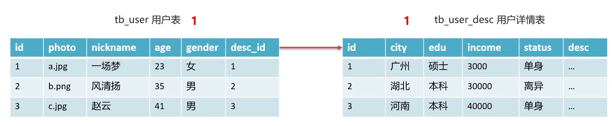

#### 一对多

**实现方式** 在`多`的一方建立外键，指向`一`的一方的主键

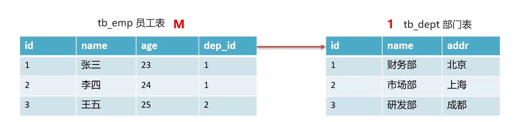

#### 多对多

**实现方式** 建立第三张`中间表`，中间表至少包含`两个外键`，分别关联两方的`主键`。


### 多表查询

**多表查询**

- 笛卡尔积：取A、B集合的组合
- 多表查询：从多张查询数据
  - 连接查询
    - 内连接：查询A、B交集数据
    - 外连接：
      - 左外连接：查询A表所有数据和交集部分数据
      - 右外连接：查询B表所有数据和交集部分数据
    - 子查询：查询中嵌套查询
- 

#### 笛卡尔积

- 笛卡尔积：有A、B两集合，取A、B两集合所有的组合

- 若A表有4条数据，B表有8条数据，笛卡尔积就有32条数据。

```sql
select * from tableA,tableB;
```

#### 内连接

```sql
-- 写法1：隐式内连接
select * from tableA,tableB where tableA.id = tableB.id;
select tableA.id,tableA.name,tableA.id,tableA.name from tableA,tableB where tableA.id = tableB.id; -- 防止字段名冲突
select A.id,A.name,B.id,B.name from tableA as A,tableB as B where A.id = B.id; -- 给表起别名

-- 写法2：显式内连接
select * from tableA inner join tableB on tableA.id = tableB.id;
select * from tableA join tableB on tableA.id = tableB.id; -- inner可省略
```

#### 外连接

```sql
--- 左外连接:  tableA的所有数据 + tableA和tableB的交集数据
select * from tableA left outer join tableB on tableA.id = tableB.id;
select * from tableA left join tableB on tableA.id = tableB.id; -- outer 可省略

--- 右外连接： tableB的所有数据 + tableA和tableB的交集数据
select * from tableA right join tableB on tableA.id = tableB.id;
select * from tableA right join tableB on tableA.id = tableB.id; -- outer 可省略
```

#### 子查询

**概念**： 查询中嵌套查询，称嵌套查询为子查询

**分类**：**根据子查询的结果不同，作用不同**

- 子查询结果为**单行单列**：（使用`=` `!=` `>` `<`等进行条件判断）

  ```sql
  select 字段列表 from 表 where 字段名 = (子查询);
  select 字段列表,(子查询) as 字段别名  from 表;
  ```

- 子查询结果为**单行多列**：（使用 `in` 等关键字进行条件判断）

  ```sql
  select 字段列表 from 表 where 字段名 in (子查询);
  ```

- 子查询结果为**多行多列**,：（作为**虚拟表**）

   ```sql
   select 字段列表 from (子查询) where 条件;
   ```

#### 案例：子查询

**数据准备**

```sql
drop database if exists db2;
create database db2;
use db2;
DROP TABLE IF EXISTS emp;
DROP TABLE IF EXISTS dept;
DROP TABLE IF EXISTS job;
DROP TABLE IF EXISTS salarygrade;


-- 部门表
CREATE TABLE dept (
  id INT PRIMARY KEY PRIMARY KEY, -- 部门id
  dname VARCHAR(50), -- 部门名称
  loc VARCHAR(50) -- 部门所在地
);


-- 职务表，职务名称，职务描述
CREATE TABLE job (
  id INT PRIMARY KEY,
  jname VARCHAR(20),
  description VARCHAR(50)
);

-- 员工表
CREATE TABLE emp (
  id INT PRIMARY KEY, -- 员工id
  ename VARCHAR(50), -- 员工姓名
  job_id INT, -- 职务id
  mgr INT , -- 上级领导
  joindate DATE, -- 入职日期
  salary DECIMAL(7,2), -- 工资
  bonus DECIMAL(7,2), -- 奖金
  dept_id INT, -- 所在部门编号
  CONSTRAINT emp_jobid_ref_job_id_fk FOREIGN KEY (job_id) REFERENCES job (id),
  CONSTRAINT emp_deptid_ref_dept_id_fk FOREIGN KEY (dept_id) REFERENCES dept (id)
);
-- 工资等级表
CREATE TABLE salarygrade (
  grade INT PRIMARY KEY,   -- 级别
  losalary INT,  -- 最低工资
  hisalary INT -- 最高工资
);
    
-- 添加4个部门
INSERT INTO dept(id,dname,loc) VALUES 
(10,'教研部','北京'),
(20,'学工部','上海'),
(30,'销售部','广州'),
(40,'财务部','深圳');

-- 添加4个职务
INSERT INTO job (id, jname, description) VALUES
(1, '董事长', '管理整个公司，接单'),
(2, '经理', '管理部门员工'),
(3, '销售员', '向客人推销产品'),
(4, '文员', '使用办公软件');


-- 添加员工
INSERT INTO emp(id,ename,job_id,mgr,joindate,salary,bonus,dept_id) VALUES 
(1001,'孙悟空',4,1004,'2000-12-17','8000.00',NULL,20),
(1002,'卢俊义',3,1006,'2001-02-20','16000.00','3000.00',30),
(1003,'林冲',3,1006,'2001-02-22','12500.00','5000.00',30),
(1004,'唐僧',2,1009,'2001-04-02','29750.00',NULL,20),
(1005,'李逵',4,1006,'2001-09-28','12500.00','14000.00',30),
(1006,'宋江',2,1009,'2001-05-01','28500.00',NULL,30),
(1007,'刘备',2,1009,'2001-09-01','24500.00',NULL,10),
(1008,'猪八戒',4,1004,'2007-04-19','30000.00',NULL,20),
(1009,'罗贯中',1,NULL,'2001-11-17','50000.00',NULL,10),
(1010,'吴用',3,1006,'2001-09-08','15000.00','0.00',30),
(1011,'沙僧',4,1004,'2007-05-23','11000.00',NULL,20),
(1012,'李逵',4,1006,'2001-12-03','9500.00',NULL,30),
(1013,'小白龙',4,1004,'2001-12-03','30000.00',NULL,20),
(1014,'关羽',4,1007,'2002-01-23','13000.00',NULL,10);


-- 添加5个工资等级
INSERT INTO salarygrade(grade,losalary,hisalary) VALUES 
(1,7000,12000),
(2,12010,14000),
(3,14010,20000),
(4,20010,30000),
(5,30010,99990);

```

**题目 1.查询所有员工信息。查询员工编号，员工姓名，工资，职务名称，职务描述**

```sql
-- ----写法一：隐式内连接
use db2;
select 
   emp.id,
   emp.ename,
   emp.salary,
   job.jname,
   job.description
from 
   emp,job
where
   emp.job_id = job.id;

-- ----写法二：显式内连接
use db2;
select 
   emp.id,
   emp.ename,
   emp.salary,
   job.jname,
   job.description
from 
   emp
inner join
   job
on
   emp.job_id = job.id;
```

**结果**
| id   | ename  | salary | jname  | description        |
| ---- | ------ | ------ | ------ | ------------------ |
| 1009 | 罗贯？ | 50000  | 董事？ | 管理整个公司，接？ |
| 1004 | 唐僧   | 29750  | 经理   | 管理部门员工       |
| 1006 | 宋江   | 28500  | 经理   | 管理部门员工       |
| 1007 | 刘备   | 24500  | 经理   | 管理部门员工       |
| 1002 | 卢俊？ | 16000  | 销售员 | 向客人推销产品     |
| 1003 | 林冲   | 12500  | 销售员 | 向客人推销产品     |
| 1010 | 吴用   | 15000  | 销售员 | 向客人推销产品     |
| 1001 | 孙悟？ | 8000   | 文员   | 使用办公软件       |
| 1005 | 李？   | 12500  | 文员   | 使用办公软件       |
| 1008 | 猪八？ | 30000  | 文员   | 使用办公软件       |
| 1011 | 沙僧   | 11000  | 文员   | 使用办公软件       |
| 1012 | 李？   | 9500   | 文员   | 使用办公软件       |
| 1013 | 小白？ | 30000  | 文员   | 使用办公软件       |
| 1014 | 关羽   | 13000  | 文员   | 使用办公软件       |

**题目 2.查询员工编号，员工姓名，工资，职务名称，职务描述，部门名称，部门位置**

```sql
-- ----写法一：隐式内连接
use db2;
select 
   emp.id,
   emp.ename,
   emp.salary,
   job.jname,
   job.description,
   dept.dname,
   dept.loc
from 
   emp,job,dept
where
   emp.job_id = job.id and emp.dept_id = dept.id;

-- ----写法二：显式内连接
use db2;
select 
   emp.id,
   emp.ename,
   emp.salary,
   job.jname,
   job.description,
   dept.dname,
   dept.loc
from 
   emp
inner join job on emp.job_id = job.id
inner join dept on emp.dept_id = dept.id;
```

**结果**
| id   | ename  | salary | jname  | description        | dname  | loc  |
| ---- | ------ | ------ | ------ | ------------------ | ------ | ---- |
| 1009 | 罗贯？ | 50000  | 董事？ | 管理整个公司，接？ | 教研？ | 北京 |
| 1007 | 刘备   | 24500  | 经理   | 管理部门员工       | 教研？ | 北京 |
| 1014 | 关羽   | 13000  | 文员   | 使用办公软件       | 教研？ | 北京 |
| 1004 | 唐僧   | 29750  | 经理   | 管理部门员工       | 学工？ | 上海 |
| 1001 | 孙悟？ | 8000   | 文员   | 使用办公软件       | 学工？ | 上海 |
| 1008 | 猪八？ | 30000  | 文员   | 使用办公软件       | 学工？ | 上海 |
| 1011 | 沙僧   | 11000  | 文员   | 使用办公软件       | 学工？ | 上海 |
| 1013 | 小白？ | 30000  | 文员   | 使用办公软件       | 学工？ | 上海 |
| 1006 | 宋江   | 28500  | 经理   | 管理部门员工       | 销售部 | 广州 |
| 1002 | 卢俊？ | 16000  | 销售员 | 向客人推销产品     | 销售部 | 广州 |
| 1003 | 林冲   | 12500  | 销售员 | 向客人推销产品     | 销售部 | 广州 |
| 1010 | 吴用   | 15000  | 销售员 | 向客人推销产品     | 销售部 | 广州 |
| 1005 | 李？   | 12500  | 文员   | 使用办公软件       | 销售部 | 广州 |
| 1012 | 李？   | 9500   | 文员   | 使用办公软件       | 销售部 | 广州 |

**题目 3.查询员工姓名，工资，工资等级**

```sql
-- 写法1：子查询
use db2;
select 
   emp.ename,
   emp.salary,
   (select grade from salarygrade where emp.salary between salarygrade.losalary and salarygrade.hisalary ) as salarygrade
from
   emp;

-- 写法2：隐式内连接
use db2;
select 
   emp.ename,
   emp.salary,
   salarygrade.grade
from 
   emp,
   salarygrade
where
   emp.salary between  salarygrade.losalary and salarygrade.hisalary 
;
-- 写法3：显式内连接
use db2;
select 
   emp.ename,
   emp.salary,
   salarygrade.grade
from 
   emp
inner join
   salarygrade
on
   emp.salary between  salarygrade.losalary and salarygrade.hisalary 
;
```

| ename  | salary | grade |
| ------ | ------ | ----- |
| 孙悟？ | 8000   | 1     |
| 卢俊？ | 16000  | 3     |
| 林冲   | 12500  | 2     |
| 唐僧   | 29750  | 4     |
| 李？   | 12500  | 2     |
| 宋江   | 28500  | 4     |
| 刘备   | 24500  | 4     |
| 猪八？ | 30000  | 4     |
| 罗贯？ | 50000  | 5     |
| 吴用   | 15000  | 3     |
| 沙僧   | 11000  | 1     |
| 李？   | 9500   | 1     |
| 小白？ | 30000  | 4     |
| 关羽   | 13000  | 2     |

**题目 4.查询员工姓名，工资，职务名称，职务描述，部门名称，部门位置，工资等级**

```sql
-- 写法1：显式内连接
use db2;
select 
   emp.ename,
   emp.salary,
   job.jname,
   job.description,
   dept.dname,
   dept.loc,
   salarygrade.grade
from 
   emp
inner join job on emp.job_id = job.id
inner join dept on emp.dept_id = dept.id
inner join salarygrade on emp.salary between salarygrade.losalary and salarygrade.hisalary
;

-- 写法2：子查询
use db2;
select 
   emp.ename,
   emp.salary,
   emp.dept_id,
   (select grade from salarygrade where emp.salary between salarygrade.losalary and salarygrade.hisalary ) as salarygrade ,
   (select job.jname from job where emp.job_id = job.id) as jname,
   (select job.description from job where emp.job_id = job.id) as jdescription,
   (select dept.dname from dept where emp.dept_id = dept.id) as dname,
   (select dept.loc from dept where emp.dept_id = dept.id) as dloc
from 
   emp
;
```

**查询结果**
| ename | salary | jname  | description       | dname  | loc  | grade |
| ----- | ------ | ------ | ----------------- | ------ | ---- | ----- |
| 孙悟? | 8000   | 文员   | 使用办公软件      | 学工?  | 上海 | 1     |
| 卢俊? | 16000  | 销售员 | 向客人推销产品    | 销售部 | 广州 | 3     |
| 林冲  | 12500  | 销售员 | 向客人推销产品    | 销售部 | 广州 | 2     |
| 唐僧  | 29750  | 经理   | 管理部门员工      | 学工?  | 上海 | 4     |
| 李?   | 12500  | 文员   | 使用办公软件      | 销售部 | 广州 | 2     |
| 宋江  | 28500  | 经理   | 管理部门员工      | 销售部 | 广州 | 4     |
| 刘备  | 24500  | 经理   | 管理部门员工      | 教研?  | 北京 | 4     |
| 猪八? | 30000  | 文员   | 使用办公软件      | 学工?  | 上海 | 4     |
| 罗贯? | 50000  | 董事?  | 管理整个公司，接? | 教研?  | 北京 | 5     |
| 吴用  | 15000  | 销售员 | 向客人推销产品    | 销售部 | 广州 | 3     |
| 沙僧  | 11000  | 文员   | 使用办公软件      | 学工?  | 上海 | 1     |
| 李?   | 9500   | 文员   | 使用办公软件      | 销售部 | 广州 | 1     |
| 小白? | 30000  | 文员   | 使用办公软件      | 学工?  | 上海 | 4     |
| 关羽  | 13000  | 文员   | 使用办公软件      | 教研?  | 北京 | 2     |

**题目 5.查询出部门编号、部门名称、部门位置、部门人数**

```sql
-- 方法1： 子查询
use db2;
select
   dept.id as 部门编号 ,
   dept.dname as 部门名称 ,
   dept.loc as 部门位置 ,
   (select count(emp.id) from emp where dept.id = emp.dept_id) as 部门人数
from
   dept
;
```

| 部门编号 | 部门名称 | 部门位置 | 部门人数 |
| -------- | -------- | -------- | -------- |
| 10       | 教研?    | 北京     | 3        |
| 20       | 学工?    | 上海     | 5        |
| 30       | 销售部   | 广州     | 6        |
| 40       | 财务?    | 深圳     | 0        |

### 事务

**概念**

- 简单理解，事务是一组操作命令，当一组中的一条操作执行出错，则这一组的操作将全部被撤销（回滚）。
- 事务（Transaction）是一种机制一个操作序列，包含了一组数据库操作命令
- 事务把所有命令作为整体一起提交操作请求，这一组数据库命令要么同时成功，要么同时失败。
- 事务是一个不可分割的工作逻辑单元。

**特性ACID**

- **原子性**(Atomicity):事务是不可分割的最小操作单位，要么同时成功，要么同时失败
- **一致性**(Consistency):事务完成时，必须使所有的数据都保持一致状态
- **隔离性**(lsolation) :多个事务之间，操作的可见性
- **持久性**(Durability):事务一旦提交或回滚，它对数据库中的数据的改变就是永久的

**语法**

 ```sql
 -- 开启事务
 start transaction;
 -- 开启事务
 begin;
 普通sql语句1
 普通sql语句2
 普通sql语句3
 普通sql语句......

 -- 提交事务
 commit;
 --回滚事务
 rollback;
 ```

mysql默认提交事务规则

```sql
select @@autocommit; -- 输出1表示事务默认自动提交
sql语句; -- 该语句将自动提交

set @@autocommit = 0; -- 修改事务默认提交方式
select @@autocommit; -- 输出0表示需要手动提交

sql语句; -- 该语句将不会自动提交
commit; -- 手动提交
```

## JDBC

**概念**

- 全称：JDBC(Java DataBase Connectivity)Java数据库连接
- 操作关系型数据库的一套API，也就是一个接口类
- 各个数据库厂商会去实现这套接口，提供数据库驱动jar包
- 通过JDBC接口可以不改变sql语句，操作不同的数据库：mysql oracle DB2
- 

**测试JDBC：基本写法**

```sql
show databases;
drop database if exists db1;
create database db1;
use db1;
create table student(
   id int primary key,
   age int
);
insert into student(id,age) values(0,10);
update student set age=15 where id = 0;
```

```java
package test_jdbc;

import java.sql.Connection;
import java.sql.DriverManager;
import java.sql.Statement;

public class Main {
    public static void main(String[] args) throws Exception {
        // 0. 引入mysql-connector-j-8.0.31.jar包
        // 1. 注册驱动
        Class.forName("com.mysql.cj.jdbc.Driver");// 新版本将自动注册，其实不用写
        // 2. 获取连接
        String url = "jdbc:mysql://localhost:3306/db1";
        String username = "root";
        String password = "123456";
        Connection connection = DriverManager.getConnection(url, username, password);
        // 3.定义sql语句
        String sql = "update student set age=15 where id = 0;";
        // 4.获取sql执行器对象Statement
        Statement statement = connection.createStatement();
        // 5.执行sql语句
        int updataCount = statement.executeUpdate(sql);
        // 6.处理结果
        System.out.println(updataCount);
        // 7.释放资源
        statement.close();
        connection.close();
    }
}
```

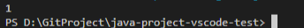

### DriverManager工具类

DriverManager(驱动管理类)**作用**:

1. **注册驱动** (mysql5之后的驱动包将自动注册)
   1. 注册驱动的过程:
      1. `Class.forName("com.mysql.cj.jdbc.Driver");`将`Driver类`的字节码加载到内存中，
      2. `Driver()`类中的**静态代码块**被执行：
      3. 
      4. DriverManager对象通过其自身的静态方法`DriverManager.registerDriver()`接收到`new Driver()`的实例对象
2. **获取数据库连接**
   - `DriverManager.getConnection(url,user,password);`
   - `url`格式：`jdbc:mysql://ip或域名:端口/数据库名称？参数名1=参数值1&参数名2=参数值2`
     - 简写：
       - `localhost:3306` 可简写为
       - `jdbc:mysql:///数据库名称？参数名1=参数值1&参数名2=参数值2`
       - **在xml中的转义字符：**`&`  --> `&amp;`
     - 参数配置：
       - `useSSL=false` 关闭不使用SSL安全连接时的提示
       - `useServerPrepStemts=true` 开启sql语句预编译功能，防止sql注入

```java
String url = "jdbc:mysql://localhost:3306/db1";//完整写法
String url = "jdbc:mysql:///db1";//简写
String url = "jdbc:mysql:///db1?useSSL=false";//关闭不使用SSL安全连接时的提示
String username = "root";
String password = "123456";
Connection connection = DriverManager.getConnection(url, username, password);
```

### Connection数据库连接对象

**作用**

1. **获取sql执行器`Statement`、`PreparedStatement`、`CallableStatement`对象**

   ```java
   //获取普通sql执行器对象
   Statement statement = connection.createStatement();
   ```

   ```java
   //获取预编译sql执行器对象:防止sql注入
   PreparedStatement pstatement = connection.prepareStatement(sql);
   ```

   ```java
   //执行存储过程的对象
   CallableStatement cstatement = connection.prepareCall(sql);
   ```

2. **事务处理**

   ```java
   //开启事务：mysql为自动提交事务，设置为自动提交为false便是开启事务管理
   connection.setAutoCommit(boolean autoCommit);
   ```

   ```java
   //提交事务
   connection.commit();
   ```

   ```java
   //回滚事务
   connection.rollback();
   ```

   **事务处理示例**

   ```java
   try{
      connection.setAutoCommit(false);//开启事务

      Statement statement = connection.createStatement();

      statement.executeUpdate(sql语句1);
      statement.executeUpdate(sql语句2);
      statement.executeUpdate(sql语句3);

      connection.commit();//提交事务
   }catch(Exception e){
      connection.rollback();//捕获到任何异常便回滚数据
      connection.setAutoCommit(false);//关闭事务（如果需要）
   }
   ```

### `Statement` sql执行器对象

**作用**

1. 执行sql语句

   ```java
   // 执行 DML DDL语句
   //    * 返回值：
   //       * DML语句执行成功后影响的行数
   //       * DDL语句执行成功也可能返回0
   int executeUpdate(sql);
   ```

   ```java
   // 执行DQL语句
   //    * 返回值：ResultSet 类型的结果集合对象，表示查询结果
   ResultSet executeQuery(sql);
   ```

### `PreparedStatement` 预编译sql执行器对象:防止sql注入

**概念**

- `PreparedStatement` 继承自 `Statement` 对象

**作用**

- 预编译SQL语句并执行:预防sql注入

**优点**

- 防sql注入
- 高性能

**防sql注入原理**：

- 对敏感字符和关键字进行了转义

**高性能执行原理**

- sql语句提交给mysql服务器要完成一系列操作：
  - **sql语句的语法检查**
  - **将sql语句编译成可执行函数**
  - 
- `PreparedStatement(sql模板字符串)` 调用时，会把sql模板语句发送给sql服务器进行预编译，且多次调用只会预编译一次。
- 程序在后续传入参数值时，不需要在进行预编译操作。直接执行sql的**可执行函数**

**sql注入**

- 通过一定的手段，向程序输入预先编辑好的sql语句，以达到执行sql代码，完成一定的操作，对服务器进行攻击的目的。
- 如：
  - 若后端判断验证用户合法的sql是 `select * from users where username = '输入的用户名' and password = '输入的密码'`;
  - 则在密码框输入`'or '1'='1`
  - sql的语句就变为了 `select * from users where username = '输入的用户名' and password = '' or '1'='1'`;
  - 

**使用**

- 使用？作为占位符，预编译sql语句

```java
String url = "jdbc:mysql://localhost:3306/db1?useServerPrepStemts=true"; // 启用预编译功能，不启用也行，但使用prepareStatement() 不会导致执行效率变高
String username = "root";
String password = "123456";

Connection connection = DriverManager.getConnection(url, username, password);

String username = "admin";
String password = "admin";
// 使用？作为占位符，传入prepareStatement() 函数
String sql = "select * from user where username = ? and password = ? ";
PreparedStatement pstatement = connection.prepareStatement(sql);// 预编译sql语句，多次执行不会导致mysql服务器多次预编译，只会编译一次
pstatement.setString(1,username);//给第1个？设置值
pstatement.setString(2,password);//给第2个？设置值
ResultSet result =  pstatement.executeQuery();//执行sql语句（不要传递参数）

while(result.next()){
   String id = result.getString("id");
   String name = result.getString("name");
   System.out.println(id);
   System.out.println(name);
}


result.close(); // 释放资源
statement.close(); // 释放资源
connection.close(); // 释放资源
```

### ResultSet 结果集合对象

**作用**
0. 该实例对象的内容是sql的查询结果

1. 获取查询结果

   ```java
   // 遍历行
   //    * 游标指针：查询结果是一个二维表，游标指针初始指向表头所在行（数据行的上一行）
   //    * next()函数:该函数会使得游标指针指向下一行
   //    * 返回值: 布尔值，当前行是否是有效行（是否有数据）
   boolean next();
   ```

   ```java
   // 获取某列的数据
   //    * 参数
   //       * int 列编号 从1开始编号
   //       * String 列名
   //    * 返回值
   //       * xxx数据类型的数据
   xxx getXxx(参数);

   String getString("UserName");
   String getString(1);
   ```

**使用案例**

```java
Connection connection = DriverManager.getConnection(url, username, password);
Statement statement = connection.createStatement();
ResultSet result =  statement.executeQuery(sql);

while(result.next()){
   String id = result.getString("id");
   String name = result.getString("name");
   System.out.println(id);
   System.out.println(name);
}
result.close(); // 释放资源
statement.close(); // 释放资源
connection.close(); // 释放资源
```

### 数据库连接池

**数据库连接池简介**

- 概念类似于线程池，数据连接的建立要耗费时间和计算资源，预先建立一定数量的数据库连接，按需分配，
- 数据库连接池是个容器，负责分配、管理数据库连接(Connection)

数据库连接池的标准接口及常用实现类

- **接口**： `DataSource`

  ```java
  //接口方法：
  Connection getConnection();//获取池内的连接
  ```

- **实现类**： `DBCP` `C3P0` `Druid`

#### Druid德鲁伊数据库连接池

Druid德鲁伊

- 阿里巴巴开源数据库连接池
- 功能强大、性能优秀

**Druid基本使用**

```java
package test_for_druid;
import java.io.FileInputStream;
import java.sql.Connection;
import java.util.Properties;

import javax.sql.DataSource;

//1.导入jar包
import com.alibaba.druid.pool.DruidDataSourceFactory;
//2.编写配置文件


public class Main {
    public static void main(String[] args)throws Exception {
        //3.加载配置文件
        Properties config = new Properties();
        //
        // System.out.println(System.getProperty("user.dir"));//查看当前所在目录
        config.load(new FileInputStream("./src/test_for_druid/druid.properties"));
        System.out.println(config.toString());

        //4.获取连接池对象
        DataSource dataSource =  DruidDataSourceFactory.createDataSource(config);
        
        //5.从连接池中获取连接对象
        Connection connection = dataSource.getConnection();

        System.out.println(connection);
    }
}
```

**Druid配置文件**

```properties
# jdbc驱动类名
driverClassName=com.mysql.jdbc.Driver
url=jdbc:mysql:///db5?useSSL=false&useServerPrepStmts=true
username=root
password=root
# 初始连接数
initialSize=5
# 最大连接数
maxActive=10
# 最大等待时间
maxWait=3000
```

### JDBC练习

#### 查询数据

**数据准备**

```sql
drop database if exists db5;
create database db5;
use db5;
create table tb_brand(
   -- id
   id int primary key auto_increment,
   -- 品牌名
   brand_name varchar(20),
   -- 公司名
   company_name varchar(20),
   -- 排序优先级
   ordered int,
   -- 描述
   description varchar(100),
   -- 状态：1 启用 0 禁用
   status int
);
insert into 
    tb_brand(brand_name,company_name,ordered,description,status) 
    values
        ("三只松鼠","三只松鼠股份有限公司",5,'好吃不上火',0),
        ("华为","华为技术有限公司",1,'华为致力于把数字技术带入每个人、每个家庭、每个组织，构建万物互联的智能世界',1),
        ("小米","小米科技有限公司",4,'Are you ok?',1);

SELECT * from tb_brand;
```

**查询表中所有数据案例**

```java
package test_for_druid;

import java.io.FileInputStream;
import java.sql.Connection;
import java.sql.PreparedStatement;
import java.sql.ResultSet;
import java.util.LinkedList;
import java.util.List;
import java.util.Properties;

import javax.sql.DataSource;

//1.导入jar包
import com.alibaba.druid.pool.DruidDataSourceFactory;
//2.编写配置文件

public class Main {
    public static void main(String[] args)throws Exception {
        //3.加载配置文件
        Properties config = new Properties();
        //
        // System.out.println(System.getProperty("user.dir"));//查看当前所在目录
        config.load(new FileInputStream("./src/test_for_druid/druid.properties"));
        System.out.println(config.toString());

        //4.获取连接池对象
        DataSource dataSource =  DruidDataSourceFactory.createDataSource(config);
        
        //5.从连接池中获取连接对象
        Connection connection = dataSource.getConnection();

        // 定义sql语句
        String sql = "select * from tb_brand";
        // 获取sql预编译对象
        PreparedStatement preparedStatement =  connection.prepareStatement(sql);
        //执行查询
        ResultSet resultSet = preparedStatement.executeQuery();
        List<Banner> banners = new LinkedList<>();
        //遍历结果并存入数组
        while(resultSet.next()){
            banners.add(new Banner(
                resultSet.getInt("id"),
                resultSet.getString("brand_name"),
                resultSet.getString("company_name"),
                resultSet.getInt("ordered"),
                resultSet.getString("description"),
                resultSet.getInt("status")
                ));
        }
        System.out.println(banners);
        //释放资源
        preparedStatement.close();
        connection.close();
    }
}
class Banner{
    // id
    private Integer id;
    // 品牌名
    private String brand_name;
    // 公司名
    private String company_name;
    // 排序优先级
    private Integer ordered;
    // 描述
    private String description;
    // 状态：1 启用 0 禁用
    private Integer status;
    public Banner(Integer id, String brand_name, String company_name, Integer ordered, String description,
            Integer status) {
        this.id = id;
        this.brand_name = brand_name;
        this.company_name = company_name;
        this.ordered = ordered;
        this.description = description;
        this.status = status;
    }
    @Override
    public String toString() {
        return "\nBanner [id=" + id + ", brand_name=" + brand_name + ", company_name=" + company_name + ", ordered="
                + ordered + ", description=" + description + ", status=" + status + "]";
    }
}
```

#### 插入数据

```java
package test_for_druid;

import java.io.FileInputStream;
import java.sql.Connection;
import java.sql.PreparedStatement;
import java.sql.ResultSet;
import java.util.LinkedList;
import java.util.List;
import java.util.Properties;

import javax.sql.DataSource;

//1.导入jar包
import com.alibaba.druid.pool.DruidDataSourceFactory;
//2.编写配置文件

public class Main {
    public static void main(String[] args)throws Exception {
        //3.加载配置文件
        Properties config = new Properties();
        //
        // System.out.println(System.getProperty("user.dir"));//查看当前所在目录
        config.load(new FileInputStream("./src/test_for_druid/druid.properties"));
        System.out.println(config.toString());

        //4.获取连接池对象
        DataSource dataSource =  DruidDataSourceFactory.createDataSource(config);
        
        //5.从连接池中获取连接对象
        Connection connection = dataSource.getConnection();

        // Banner 获取数据
        Banner banner = new Banner("生命有限", "生命有限公司", 2, "当了程序员，寿命减十年", 0);
        // 定义sql语句
        String sql = "insert tb_brand(brand_name,company_name,ordered,description,status) values(?,?,?,?,?)";
        // 获取sql预编译对象
        PreparedStatement preparedStatement =  connection.prepareStatement(sql);
        // 设置值
        preparedStatement.setString(1, banner.getBrand_name());
        preparedStatement.setString(2, banner.getCompany_name());
        preparedStatement.setInt(3, banner.getOrdered());
        preparedStatement.setString(4, banner.getDescription());
        preparedStatement.setInt(5, banner.getStatus());
        //执行查询
        int result = preparedStatement.executeUpdate();
        if(result>0)
            System.out.println("更新成功");
        else
            System.out.println("更新失败");
        //释放资源
        preparedStatement.close();
        connection.close();
    }
}
class Banner{
    // id
    private Integer id;
    // 品牌名
    private String brand_name;
    // 公司名
    private String company_name;
    // 排序优先级
    private Integer ordered;
    // 描述
    private String description;
    // 状态：1 启用 0 禁用
    private Integer status;
    public Banner(Integer id, String brand_name, String company_name, Integer ordered, String description,
            Integer status) {
        this.id = id;
        this.brand_name = brand_name;
        this.company_name = company_name;
        this.ordered = ordered;
        this.description = description;
        this.status = status;
    }
    public Banner(String brand_name, String company_name, Integer ordered, String description,
            Integer status) {
        this.brand_name = brand_name;
        this.company_name = company_name;
        this.ordered = ordered;
        this.description = description;
        this.status = status;
    }
    @Override
    public String toString() {
        return "\nBanner [id=" + id + ", brand_name=" + brand_name + ", company_name=" + company_name + ", ordered="
                + ordered + ", description=" + description + ", status=" + status + "]";
    }
    public Integer getId() {
        return id;
    }
    public String getBrand_name() {
        return brand_name;
    }
    public String getCompany_name() {
        return company_name;
    }
    public Integer getOrdered() {
        return ordered;
    }
    public String getDescription() {
        return description;
    }
    public Integer getStatus() {
        return status;
    }
    
}
```

#### 更新数据

```java
package test_for_druid;

import java.io.FileInputStream;
import java.sql.Connection;
import java.sql.PreparedStatement;
import java.sql.ResultSet;
import java.util.LinkedList;
import java.util.List;
import java.util.Properties;

import javax.sql.DataSource;

//1.导入jar包
import com.alibaba.druid.pool.DruidDataSourceFactory;
//2.编写配置文件

public class Main {
    public static void main(String[] args)throws Exception {
        //3.加载配置文件
        Properties config = new Properties();
        //
        // System.out.println(System.getProperty("user.dir"));//查看当前所在目录
        config.load(new FileInputStream("./src/test_for_druid/druid.properties"));
        System.out.println(config.toString());

        //4.获取连接池对象
        DataSource dataSource =  DruidDataSourceFactory.createDataSource(config);
        
        //5.从连接池中获取连接对象
        Connection connection = dataSource.getConnection();

        // Banner 获取数据
        Banner banner = new Banner(4,"生命有限", "生命有限公司", 9999, "当了程序员，寿命减十年......", 0);
        // 定义sql语句
        String sql = "update tb_brand set brand_name=?, company_name=?, ordered=?, description=?, status=? where id =?";
        // 获取sql预编译对象
        PreparedStatement preparedStatement =  connection.prepareStatement(sql);
        // 设置值
        preparedStatement.setString(1, banner.getBrand_name());
        preparedStatement.setString(2, banner.getCompany_name());
        preparedStatement.setInt(3, banner.getOrdered());
        preparedStatement.setString(4, banner.getDescription());
        preparedStatement.setInt(5, banner.getStatus());
        preparedStatement.setInt(6, banner.getId());

        //执行查询
        int result = preparedStatement.executeUpdate();
        if(result>0)
            System.out.println("更新成功");
        else
            System.out.println("更新失败");

        //释放资源
        preparedStatement.close();
        connection.close();
    }
}
class Banner{
    // id
    private Integer id;
    // 品牌名
    private String brand_name;
    // 公司名
    private String company_name;
    // 排序优先级
    private Integer ordered;
    // 描述
    private String description;
    // 状态：1 启用 0 禁用
    private Integer status;
    public Banner(Integer id, String brand_name, String company_name, Integer ordered, String description,
            Integer status) {
        this.id = id;
        this.brand_name = brand_name;
        this.company_name = company_name;
        this.ordered = ordered;
        this.description = description;
        this.status = status;
    }
    public Banner(String brand_name, String company_name, Integer ordered, String description,
            Integer status) {
        this.brand_name = brand_name;
        this.company_name = company_name;
        this.ordered = ordered;
        this.description = description;
        this.status = status;
    }
    @Override
    public String toString() {
        return "\nBanner [id=" + id + ", brand_name=" + brand_name + ", company_name=" + company_name + ", ordered="
                + ordered + ", description=" + description + ", status=" + status + "]";
    }
    public Integer getId() {
        return id;
    }
    public String getBrand_name() {
        return brand_name;
    }
    public String getCompany_name() {
        return company_name;
    }
    public Integer getOrdered() {
        return ordered;
    }
    public String getDescription() {
        return description;
    }
    public Integer getStatus() {
        return status;
    }
    
}
```

#### 删除数据

```java
package test_for_druid;

import java.io.FileInputStream;
import java.sql.Connection;
import java.sql.PreparedStatement;
import java.sql.ResultSet;
import java.util.LinkedList;
import java.util.List;
import java.util.Properties;

import javax.sql.DataSource;

//1.导入jar包
import com.alibaba.druid.pool.DruidDataSourceFactory;
//2.编写配置文件

public class Main {
    public static void main(String[] args)throws Exception {
        //3.加载配置文件
        Properties config = new Properties();
        //
        // System.out.println(System.getProperty("user.dir"));//查看当前所在目录
        config.load(new FileInputStream("./src/test_for_druid/druid.properties"));
        System.out.println(config.toString());

        //4.获取连接池对象
        DataSource dataSource =  DruidDataSourceFactory.createDataSource(config);
        
        //5.从连接池中获取连接对象
        Connection connection = dataSource.getConnection();

        // Banner 获取数据
        int id = 4;
        // 定义sql语句
        String sql = "delete from tb_brand where id = ?";
        // 获取sql预编译对象
        PreparedStatement preparedStatement =  connection.prepareStatement(sql);
        // 设置值
        preparedStatement.setInt(1,id);

        //执行查询
        int result = preparedStatement.executeUpdate();
        if(result>0)
            System.out.println("更新成功");
        else
            System.out.println("更新失败");
        //释放资源
        preparedStatement.close();
        connection.close();
    }
}
class Banner{
    // id
    private Integer id;
    // 品牌名
    private String brand_name;
    // 公司名
    private String company_name;
    // 排序优先级
    private Integer ordered;
    // 描述
    private String description;
    // 状态：1 启用 0 禁用
    private Integer status;
    public Banner(Integer id, String brand_name, String company_name, Integer ordered, String description,
            Integer status) {
        this.id = id;
        this.brand_name = brand_name;
        this.company_name = company_name;
        this.ordered = ordered;
        this.description = description;
        this.status = status;
    }
    public Banner(String brand_name, String company_name, Integer ordered, String description,
            Integer status) {
        this.brand_name = brand_name;
        this.company_name = company_name;
        this.ordered = ordered;
        this.description = description;
        this.status = status;
    }
    @Override
    public String toString() {
        return "\nBanner [id=" + id + ", brand_name=" + brand_name + ", company_name=" + company_name + ", ordered="
                + ordered + ", description=" + description + ", status=" + status + "]";
    }
    public Integer getId() {
        return id;
    }
    public String getBrand_name() {
        return brand_name;
    }
    public String getCompany_name() {
        return company_name;
    }
    public Integer getOrdered() {
        return ordered;
    }
    public String getDescription() {
        return description;
    }
    public Integer getStatus() {
        return status;
    }
}
```

## Maven

Maven是专门用于管理和构建Java项目的工具，基于项目对象模型（POM）的概念，它的主要功能有:

- 提供了一套标准化的项目结构，通过Maven使得不同IDE创建的项目结构一致
- 提供了一套标准化的构建流程(编译，测试，打包，发布......)
- 提供了一套依赖管理机制

**标准化的项目结构**


**标准化的构建流程**


**依赖管理机制**


**maven模型**

- POM
- dependency
- Plugin
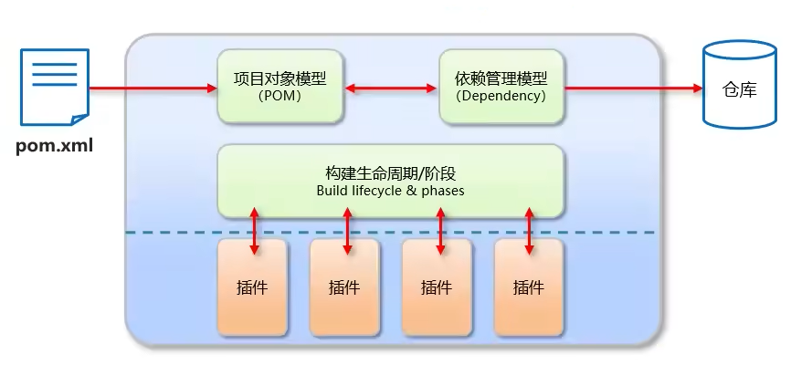

**Maven仓库**

- 本地仓库:自己计算机上的一个目录
- 中央仓库:由Maven团队维护的全球唯─的仓库
  - 地址: <https://repo1.maven.org/maven2/>
- 远程仓库(私服):由公司团队搭建的私有仓库
- jar包的查找顺序
  - 一般引入顺序
    - 项目中使用坐标引入对应依赖jar包，
    - 首先会查找本地仓库中是否有对应的jar包:
    - 如果有，则在项目直接引用;
    - 如果没有，则去中央仓库中下载对应的jar包到本地仓库然后引用。
  - 搭建远程仓库(私服)后，jar包的查找顺序
    - 本地仓库→远程仓库→中央仓库


**安装配置**


**配置本地仓库所在路径**`apache-maven-3.6.3\conf\settings.xml`

```xml
<localRepository>D:\Program Files\maven\repository</localRepository>
```

**配置镜像**`apache-maven-3.6.3\conf\settings.xml`

```xml
  <mirrors>
     <mirror>
      <id>aliyunmaven</id>
      <mirrorOf>*</mirrorOf>
      <name>阿里云公共仓库</name>
      <url>https://maven.aliyun.com/repository/public</url>
    </mirror>
  </mirrors>
```

**坐标**

- Maven 中的坐标是资源的唯一标识
- 使用坐标来定义项目或引入项目中需要的依赖
- Maven 坐标主要组成
  - `groupld`: 定义当前Maven项目隶属组织名称（通常是域名反写，例如: com.itheima)
  - `artifactld`: 定义当前Maven项目名称(通常是模块名称，例如order-service、goods-service)
  - `version`: 定义当前项目版本号

**定义项目**


**定义引入项目中需要的依赖项目**


**常用命令**

```bash
# Maven常用命令
cd project_root
mvn compile # 编译
mvn clean # 清理
mvn test # 测试
mvn package # 打包
mvn install # 安装
```

**生命周期**


**依赖管理**

- `scope`可以设置对应jar包的作用范围
- 作用范围
  - 编译环境
  - 测试环境
  - 运行环境

```xml
  <dependencies>
    <dependency>
      <groupId>junit</groupId>
      <artifactId>junit</artifactId>
      <version>4.11</version>
      <scope>test</scope> <!-- scope指定依赖的作用范围 -->
    </dependency>
  </dependencies>
```


## myBatis

- MyBatis是一款优秀的`持久层`**框架**，用于简化`JDBC`开发

- MyBatis 本是 Apache的一个开源项目`iBatis`, 2010年这个项目由apache software foundation迁移到了google code，并且改名为MyBatis。2013年11月迁移到Github
- 官网: <https://mybatis.org/mybatis-3/zh/index.html>

**持久层**

- 负责将数据到保存到数据库的那一层代码
- JavaEE三层架构:
  - 表现层 页面展示
  - 业务层 逻辑处理
  - 持久层

**JDBC缺点**


**maBatis对JDBC的简化**


**简单示例：基本步骤**


### myBatis简单示例

#### 使用示例1:myBatis简单示例

**准备数据**

```sql
use db5;
create table tb_user(
    id int primary key auto_increment,
    name varchar(20),
    password varchar(20),
    gender char(1),
    addr varchar(30)
);
insert into 
tb_user(id,name,password,gender,addr) 
values
    (1,"张三","123","男","北京"),
    (2,"李四","123","男","北京"),
    (3,"王五","123","男","北京")
;
```

**编辑maven项目配置文件`pom.xml`,配置相关依赖**

```xml
    <dependency>
      <!-- mybatis -->
      <groupId>org.mybatis</groupId>
      <artifactId>mybatis</artifactId>
      <version>3.5.5</version>
    </dependency>
    <dependency>
      <!-- mysql的JDBC驱动 -->
      <groupId>mysql</groupId>
      <artifactId>mysql-connector-java</artifactId>
      <version>5.1.46</version>
    </dependency>
```

**编辑mybatis配置文件 `src/main/resources/mybatis-config.xml`**

```xml
<?xml version="1.0" encoding="UTF-8" ?>
<!DOCTYPE configuration
  PUBLIC "-//mybatis.org//DTD Config 3.0//EN"
  "http://mybatis.org/dtd/mybatis-3-config.dtd">
<configuration>
  <environments default="development">
    <environment id="development">
      <transactionManager type="JDBC"/>
      <dataSource type="POOLED">
        <property name="driver" value="com.mysql.jdbc.Driver"/> <!-- 填mysql的驱动的路径 -->
        <property name="url" value="jdbc:mysql:///db5?useSSL=false"/>  <!-- 填mysql数据库的路径 -->
        <property name="username" value="root"/>  <!-- 填数据库的username -->
        <property name="password" value="root"/>   <!-- 填数据库的password -->
      </dataSource>
    </environment>
  </environments>
  <mappers>
    <mapper resource="./UserMapper.xml"/>  <!-- 填sql语句的映射文件路径 -->
  </mappers>
</configuration>
```

**编辑sql语句映射文件`src/main/resources/UserMapper.xml`**

```xml
<?xml version="1.0" encoding="UTF-8" ?>
<!DOCTYPE mapper
  PUBLIC "-//mybatis.org//DTD Mapper 3.0//EN"
  "http://mybatis.org/dtd/mybatis-3-mapper.dtd">
<mapper namespace="namespaceTest1"> <!-- 在程序中需要通过 `命名空间.sql语句id` 执行该命令  -->
   <select id="selectAllUsers" resultType="com.example.pojo.User"> <!-- resultType是User类的类型  -->
      select * from tb_user
   </select>
</mapper>
```

**定义User类`src/main/java/com/example/pojo/User.java`**

```java
package com.example.pojo;

public class User {
    private Integer id;
    private String name;
    private String password;
    private String gender;
    private String addr;
    
    public Integer getId() {
        return id;
    }
    public void setId(Integer id) {
        this.id = id;
    }
    public String getName() {
        return name;
    }
    public void setName(String name) {
        this.name = name;
    }
    public String getPassword() {
        return password;
    }
    public void setPassword(String password) {
        this.password = password;
    }
    public String getGender() {
        return gender;
    }
    public void setGender(String gender) {
        this.gender = gender;
    }
    public String getAddr() {
        return addr;
    }
    public void setAddr(String addr) {
        this.addr = addr;
    }
    @Override
    public String toString() {
        return "User [id=" + id + ", name=" + name + ", password=" + password + ", gender=" + gender + ", addr=" + addr
                + "]";
    }
    
}
```

**执行sql语句**
`src/main/java/com/example/testSelectAll.java`

```java
package com.example;

import java.io.InputStream;
import java.util.List;

import org.apache.ibatis.io.Resources;
import org.apache.ibatis.session.SqlSession;
import org.apache.ibatis.session.SqlSessionFactory;
import org.apache.ibatis.session.SqlSessionFactoryBuilder;

import com.example.pojo.User;

public class testSelectAll {
    public static void main(String[] args) throws Exception{
        // 加载mybatis核心配置文件
        String resource = "mybatis-config.xml";
        InputStream inputStream = Resources.getResourceAsStream(resource);
        SqlSessionFactory sqlSessionFactory = new SqlSessionFactoryBuilder().build(inputStream);

        // 获取SqlSession，用其来执行sql语句
        SqlSession session = sqlSessionFactory.openSession();
         
        //通过 `命名空间.sql语句ID` 执行sql语句，结果会自动封装到`List<User>`中
        List<User> users = session.selectList("namespaceTest1.selectAllUsers"); // 这里依然存在把字符串写到程序中的硬编码问题，需要后续进一步解决

        System.out.println(users);

        // 释放资源
        session.close();
    }
}
```

输出：


#### 使用示例2:使用Mapper代理方式

**目的**：解决前一种方法中存在的硬编码问题


配置过程


0.修改配置

```xml
<?xml version="1.0" encoding="UTF-8" ?>
<!DOCTYPE configuration
  PUBLIC "-//mybatis.org//DTD Config 3.0//EN"
  "http://mybatis.org/dtd/mybatis-3-config.dtd">
<configuration>
  <environments default="development">
    <environment id="development">
      <transactionManager type="JDBC"/>
      <dataSource type="POOLED">
        <!-- 
            use db5;
            create table tb_user(
                id int primary key auto_increment,
                name varchar(20),
                password varchar(20),
                gender char(1),
                addr varchar(30)
            );
            insert into 
            tb_user(id,name,password,gender,addr) 
            values
                (1,"张三","123","男","北京"),
                (2,"李四","123","男","北京"),
                (3,"王五","123","男","北京")
            ;
         -->
        <property name="driver" value="com.mysql.jdbc.Driver"/> <!-- 填mysql的驱动的路径 -->
        <property name="url" value="jdbc:mysql:///db5?useSSL=false"/>  <!-- 填mysql数据库的路径 -->
        <property name="username" value="root"/>  <!-- 填数据库的username -->
        <property name="password" value="root"/>   <!-- 填数据库的password -->
      </dataSource>
    </environment>
  </environments>
  <mappers>
    <!-- <mapper resource="com/example/mapper/UserMapper.xml"/>   --> <!-- 填sql语句的映射文件路径 -->
    <package name="com.example.mapper" /> <!-- 使用这种Mapper代理的方式便可以用这种包扫描的写法 -->
  </mappers>
</configuration>
```

1.定义接口：`src/main/java/com/example/mapper/UserMapper.java`

- 注意存放路径
- 注意接口的函数名、形参列表、返回值都和`UserMapper.xml`中的sql语句有关

```java
package com.example.mapper;

import java.util.List;

import com.example.pojo.User;

public interface UserMapper {
    List<User> selectAll(); // 函数名要和UserMapper.xml中的id名一致
}
```

2.修改：`src/resources/com/example/mapper/UserMapper.xml`

- 注意存放路径，`UserMapper.xml`原本应当存放在和`UserMapper.java`相同的位置，但xml文件应当统一放在resources目录下，且resources目录下的文件打包后将会放到项目根目录，所以存放在`/resources/com/example/mapper/`目录下，打包后也会存放在`UserMapper.java`所在目录

```xml
<?xml version="1.0" encoding="UTF-8" ?>
<!DOCTYPE mapper
  PUBLIC "-//mybatis.org//DTD Mapper 3.0//EN"
  "http://mybatis.org/dtd/mybatis-3-mapper.dtd">
<mapper namespace="com.example.mapper.UserMapper">  <!-- namespace改为接口类 -->
  <select id="selectAll" resultType="com.example.pojo.User">   <!-- id为接口的函数名 -->
    select * from tb_user
  </select>
</mapper>
```

3.获取UserMapper接口的代理对象

- `session.getMapper(UserMapper.class)`的作用就是实现一个接口代理然后提供代理。
  
```java
package com.example;

import java.io.InputStream;
import java.util.List;

import org.apache.ibatis.io.Resources;
import org.apache.ibatis.session.SqlSession;
import org.apache.ibatis.session.SqlSessionFactory;
import org.apache.ibatis.session.SqlSessionFactoryBuilder;

import com.example.mapper.UserMapper;
import com.example.pojo.User;

public class testSelectAll {
    public static void main(String[] args) throws Exception{
        // 加载mybatis核心配置文件
        String resource = "mybatis-config.xml";
        InputStream inputStream = Resources.getResourceAsStream(resource);
        SqlSessionFactory sqlSessionFactory = new SqlSessionFactoryBuilder().build(inputStream);

        // 获取SqlSession，用其来执行sql语句
        SqlSession session = sqlSessionFactory.openSession();
        // 方法一：通过 `命名空间.sql语句ID` 执行sql
        // List<User> users = session.selectList("namespaceTest1.selectAllUsers");

        // 方法二：通过mapper
        // 获取UserMapper接口的代理对象
        UserMapper userMapper = session.getMapper(UserMapper.class);
        List<User> users = userMapper.selectAll();

        System.out.println(users);
    }
}
```

输出：


### 核心配置文件

[文档:https://mybatis.net.cn/](https://mybatis.net.cn/)


**包别名**

- 当这样配置时， `Blog` 可以用在任何使用 全限名 `domain.blog.Blog` 的地方。

```xml
<typeAliases>
  <typeAlias alias="Author" type="domain.blog.Author"/>  <!-- 单独配置 -->
  <package name="domain.blog"/> <!-- 包扫描方式配置 -->
</typeAliases>
```

### 查询数据

#### 多查询selectAll

**数据准备**

```sql
drop database if exists db5;
create database db5;
use db5;
create table tb_brand(
   -- id
   id int primary key auto_increment,
   -- 品牌名
   brand_name varchar(20),
   -- 公司名
   company_name varchar(20),
   -- 排序优先级
   ordered int,
   -- 描述
   description varchar(100),
   -- 状态：1 启用 0 禁用
   status int
);
insert into 
    tb_brand(brand_name,company_name,ordered,description,status) 
    values
        ("三只松鼠","三只松鼠股份有限公司",5,'好吃不上火',0),
        ("华为","华为技术有限公司",1,'华为致力于把数字技术带入每个人、每个家庭、每个组织，构建万物互联的智能世界',1),
        ("小米","小米科技有限公司",4,'Are you ok?',1);

SELECT * from tb_brand;
```

**mybatis配置文件修改**

```xml
<?xml version="1.0" encoding="UTF-8" ?>
<!DOCTYPE configuration
  PUBLIC "-//mybatis.org//DTD Config 3.0//EN"
  "http://mybatis.org/dtd/mybatis-3-config.dtd">
<configuration>
  <environments default="development">
    <environment id="development">
      <transactionManager type="JDBC"/>
      <dataSource type="POOLED">
        <property name="driver" value="com.mysql.jdbc.Driver"/> <!-- 填mysql的驱动的路径 -->
        <property name="url" value="jdbc:mysql:///db5?useSSL=false"/>  <!-- 填mysql数据库的路径 -->
        <property name="username" value="root"/>  <!-- 填数据库的username -->
        <property name="password" value="root"/>   <!-- 填数据库的password -->
      </dataSource>
    </environment>
  </environments>
  <mappers>
    <package name="com.example.mapper" /> <!-- 包扫描方式 -->
  </mappers>
</configuration>
```

**编写`pojo.Brand`类**

```java
package com.example.pojo;

public class Brand {
    Integer id;             // -- id
    String brandName;      // -- 品牌名
    String companyName;    // -- 公司名
    Integer ordered;        // -- 排序优先级
    String description;     // -- 描述
    Integer status;         // -- 状态：1 启用 0 禁用
    public Integer getId() {
        return id;
    }
    public void setId(Integer id) {
        this.id = id;
    }
    public String getBrandName() {
        return brandName;
    }
    public void setBrandName(String brandName) {
        this.brandName = brandName;
    }
    public String getCompanyName() {
        return companyName;
    }
    public void setCompanyName(String companyName) {
        this.companyName = companyName;
    }
    public Integer getOrdered() {
        return ordered;
    }
    public void setOrdered(Integer ordered) {
        this.ordered = ordered;
    }
    public String getDescription() {
        return description;
    }
    public void setDescription(String description) {
        this.description = description;
    }
    public Integer getStatus() {
        return status;
    }
    public void setStatus(Integer status) {
        this.status = status;
    }
    @Override
    public String toString() {
        return "Brand [id=" + id + ", brandName=" + brandName + ", companyName=" + companyName + ", ordered=" + ordered
                + ", description=" + description + ", status=" + status + "]";
    }
}
```

**编写`BrandMapper.java`接口类**

```java
package com.example.mapper;

import java.util.List;

import com.example.pojo.Brand;

public interface BrandMapper {
    List<Brand> selectAll();
}
```

**编写`BrandMapper.xml`**

- 方法一：原始写法，由于数据库中字段名称为 `brand_name` 类中相应字段名称为 `brandName` 两者不一致，在封装数据阶段会出现问题。

  ```xml
  <?xml version="1.0" encoding="UTF-8"?>
  <!DOCTYPE mapper PUBLIC "-//mybatis.org//DTD Mapper 3.0//EN" "http://mybatis.org/dtd/mybatis-3-mapper.dtd">
  <mapper namespace="com.example.mapper.BrandMapper">
    <!-- selectAll --> 
    <select id="selectAll" resultType="com.example.pojo.Brand">
      select * from tb_brand;
    </select>
  </mapper>
  ```

- 方法二：修改sql语句，修改字段别名使其与类中字段名称一致

  ```xml
  <?xml version="1.0" encoding="UTF-8"?>
  <!DOCTYPE mapper PUBLIC "-//mybatis.org//DTD Mapper 3.0//EN" "http://mybatis.org/dtd/mybatis-3-mapper.dtd">
  <mapper namespace="com.example.mapper.BrandMapper">
    <!-- selectAll --> 
    <select id="selectAll" resultType="com.example.pojo.Brand">
      select 
         id,
         brand_name as brandName,
         company_name as companyName,
         ordered,
         description,
         status,
      from tb_brand;
    </select>
  </mapper>
  ```

- 方法三：定义sql片段

  ```xml
  <?xml version="1.0" encoding="UTF-8"?>
  <!DOCTYPE mapper PUBLIC "-//mybatis.org//DTD Mapper 3.0//EN" "http://mybatis.org/dtd/mybatis-3-mapper.dtd">
  <mapper namespace="com.example.mapper.BrandMapper">
  <sql id="brand_colums">  <!-- 定义sql片段 --> 
         id,
         brand_name as brandName,
         company_name as companyName,
         ordered,
         description,
         status,
  </sql>
    <select id="selectAll" resultType="com.example.pojo.Brand">
      select 
         <include refid="brand_colums" /> <!-- 引用sql片段 --> 
      from tb_brand;
    </select>
  </mapper>
  ```

- 方法四：使用resultMap

  ```xml
  <?xml version="1.0" encoding="UTF-8"?>
  <!DOCTYPE mapper PUBLIC "-//mybatis.org//DTD Mapper 3.0//EN" "http://mybatis.org/dtd/mybatis-3-mapper.dtd">
  <mapper namespace="com.example.mapper.BrandMapper">
  <resultMap id="brand_resultMap" type="com.example.pojo.Brand">  <!-- 定义resultMap --> 
         <result column="brand_name" property="brandName" />
         <result column="company_name" property="companyName" />
  </sql>
    <select id="selectAll" resultMap="brand_resultMap"> <!-- resultMap = brand_resultMap --> 
      select * from tb_brand;
    </select>
  </mapper>
  ```

**编写`testBrand.java`测试类**

```java
package com.example;

import java.io.InputStream;
import java.util.List;

import org.apache.ibatis.io.Resources;
import org.apache.ibatis.session.SqlSession;
import org.apache.ibatis.session.SqlSessionFactory;
import org.apache.ibatis.session.SqlSessionFactoryBuilder;
import org.junit.Test;

import com.example.mapper.BrandMapper;
import com.example.pojo.Brand;

public class testBrand {
    @Test
    public void testSelectAllBrand() throws Exception{
        // 加载mybatis核心配置文件
        String resource = "mybatis-config.xml";
        InputStream inputStream = Resources.getResourceAsStream(resource);
        SqlSessionFactory sqlSessionFactory = new SqlSessionFactoryBuilder().build(inputStream);

        // 获取SqlSession，用其来执行sql语句
        SqlSession session = sqlSessionFactory.openSession();
        // 方法一：通过 `命名空间.sql语句ID` 执行sql
        // List<User> users = session.selectList("namespaceTest1.selectAllUsers");

        // 方法二：通过mapper
        // 获取UserMapper接口的代理对象
        BrandMapper brandMapper = session.getMapper(BrandMapper.class);
        List<Brand> brands = brandMapper.selectAll();

        System.out.println(brands);
    }
}
```

#### 单查询selectById

修改`BrandMapper.xml`

**注意点**

- sql语句`参数占位符`
  - `#{}`占位符 等效于 `?` 也是就是`jdbc`里的`PreparedStatement`,有防sql注入的作用
  - `${}`占位符 1以字符串方式拼接字符串，`存在sql注入问题`
    - 可用于动态确定列名或表名
      - `select ${columName1}`
      - `from ${tableName}`
- 返回值
  - `parameterType="int"` 可省略
- **特殊字符的处理**：在xml中编写sql语句的`<`等的特殊字符
  - `转义字符` `<` => `&lt;`
  - `CDATA区` `<![CDATA[ 这里可以填特殊字符 ]]>`

```xml
<?xml version="1.0" encoding="UTF-8"?>
<!DOCTYPE mapper PUBLIC "-//mybatis.org//DTD Mapper 3.0//EN" "http://mybatis.org/dtd/mybatis-3-mapper.dtd">
<mapper namespace="com.example.mapper.BrandMapper">
  <resultMap id="BrandColumMapper" type="com.example.pojo.Brand">
    <result column="brand_name" property="brandName" />
    <result column="company_name" property="companyName" />
  </resultMap>
  <!-- selectAll --> 
  <select id="selectAll" resultMap="BrandColumMapper">
    select * from tb_brand;
  </select>

  <!-- selectById --> 
  <select id="selectById" parameterType="int" resultMap="BrandColumMapper">
    select * from tb_brand where id=#{id};
  </select>
</mapper>
```

修改`BrandMapper.java`

```java
package com.example.mapper;

import java.util.List;

import com.example.pojo.Brand;

public interface BrandMapper {
    List<Brand> selectAll();
    Brand selectById(int id);
}
```

**编写测试类**

```java
package com.example;

import java.io.InputStream;
import java.util.List;

import org.apache.ibatis.io.Resources;
import org.apache.ibatis.session.SqlSession;
import org.apache.ibatis.session.SqlSessionFactory;
import org.apache.ibatis.session.SqlSessionFactoryBuilder;
import org.junit.Test;

import com.example.mapper.BrandMapper;
import com.example.pojo.Brand;

public class testBrand {

    @Test
    public void testSelectBrandById() throws Exception{
        // 加载mybatis核心配置文件
        String resource = "mybatis-config.xml";
        InputStream inputStream = Resources.getResourceAsStream(resource);
        SqlSessionFactory sqlSessionFactory = new SqlSessionFactoryBuilder().build(inputStream);

        // 获取SqlSession，用其来执行sql语句
        SqlSession session = sqlSessionFactory.openSession();
        // 方法一：通过 `命名空间.sql语句ID` 执行sql
        // List<User> users = session.selectList("namespaceTest1.selectAllUsers");

        // 方法二：通过mapper
        // 获取UserMapper接口的代理对象
        BrandMapper brandMapper = session.getMapper(BrandMapper.class);
        Brand brands = brandMapper.selectById(1);

        System.out.println(brands);
    }
}
```

输出结果

```
Brand [id=1, brandName=三只松鼠, companyName=三只松鼠股份有限公司, ordered=5, description=好吃不上火, status=0]
```

#### 多条件查询：散装参数

**多条件查询参数的接收**

1. `散装参数` 要使用注解`@Param("字段名")`和sql的`${字段名}`要一致
2. `对象参数` 要保证`对象属性名`和sql的`${}`要一致
3. `map集合参数` 要保证`map键`和sql的`${}`要一致

`BrandMapper.xml`核心代码

```xml
<mapper namespace="com.example.mapper.BrandMapper">
  <resultMap id="BrandColumMapper" type="com.example.pojo.Brand">
    <result column="brand_name" property="brandName" />
    <result column="company_name" property="companyName" />
  </resultMap>
  <select id="selectByCondition" resultMap="BrandColumMapper">
    select * from tb_brand
    where status = #{status}
      and company_name like #{companyName} <!-- 此处的companyName的命名规则最好是和对象的属性名保持一致，以避免后续产生的问题 --> 
      and brand_name like #{brandName}
      ;
  </select>
</mapper>
```

`BrandMapper.java`核心代码

```java
package com.example.mapper;

import java.util.List;

import org.apache.ibatis.annotations.Param;

import com.example.pojo.Brand;

public interface BrandMapper {
    List<Brand> selectAll();
    Brand selectById(int id);
    
    List<Brand> selectByCondition(
        @Param("status")        int     status,
        @Param("companyName")   String  companyName,
        @Param("brandName")     String  brandName
    );
}
```

`testBrand.java`测试代码

```java
@Test
public void testSelectByCondition() throws Exception{
    // 模拟获取到查询数据
    int status = 1;
    String companyName = "华为";
    String brandName = "华为";

    // 对数据处理
    companyName = "%"+companyName+"%";
    brandName = "%"+brandName+"%";


    // 加载mybatis核心配置文件
    String resource = "mybatis-config.xml";
    InputStream inputStream = Resources.getResourceAsStream(resource);
    SqlSessionFactory sqlSessionFactory = new SqlSessionFactoryBuilder().build(inputStream);

    // 获取SqlSession，用其来执行sql语句
    SqlSession session = sqlSessionFactory.openSession();

    // 获取UserMapper接口的代理对象
    BrandMapper brandMapper = session.getMapper(BrandMapper.class);
    List<Brand> brands = brandMapper.selectByCondition(status,companyName,brandName);

    System.out.println(brands);
}
```

#### 多条件查询：对象参数

`BrandMapper.xml`核心代码

```xml
<mapper namespace="com.example.mapper.BrandMapper">
  <resultMap id="BrandColumMapper" type="com.example.pojo.Brand">
    <result column="brand_name" property="brandName" />
    <result column="company_name" property="companyName" />
  </resultMap>
  <select id="selectByCondition" resultMap="BrandColumMapper">
    select * from tb_brand
    where status = #{status}
      and company_name like #{companyName} <!-- 此处的companyName的命名规则最好是和对象的属性名保持一致，以避免后续产生的问题 --> 
      and brand_name like #{brandName}
      ;
  </select>
</mapper>
```

`BrandMapper.java`核心代码

```java
package com.example.mapper;

import java.util.List;

import org.apache.ibatis.annotations.Param;

import com.example.pojo.Brand;

public interface BrandMapper {
    List<Brand> selectAll();
    Brand selectById(int id);
    
    List<Brand> selectByCondition(
        @Param("status")        int     status,
        @Param("companyName")   String  companyName,
        @Param("brandName")     String  brandName
    );

//-----------------------------------------------------------------------------
    List<Brand> selectByCondition(Brand brand);
//-----------------------------------------------------------------------------

}
```

`testBrand.java`测试代码

```java
    @Test
    public void testSelectByCondition() throws Exception{
        // 模拟获取到查询数据
        int status = 1;
        String companyName = "华为";
        String brandName = "华为";

        // 对数据处理
        companyName = "%"+companyName+"%";
        brandName = "%"+brandName+"%";


//-----------------------------------------------------------------------------
        Brand searchBrand = new Brand();
        searchBrand.setStatus(status);
        searchBrand.setCompanyName(companyName);
        searchBrand.setBrandName(brandName);
//-----------------------------------------------------------------------------


        // 加载mybatis核心配置文件
        String resource = "mybatis-config.xml";
        InputStream inputStream = Resources.getResourceAsStream(resource);
        SqlSessionFactory sqlSessionFactory = new SqlSessionFactoryBuilder().build(inputStream);

        // 获取SqlSession，用其来执行sql语句
        SqlSession session = sqlSessionFactory.openSession();

//-----------------------------------------------------------------------------
        // 获取UserMapper接口的代理对象
        BrandMapper brandMapper = session.getMapper(BrandMapper.class);
        List<Brand> brands = brandMapper.selectByCondition(searchBrand);
//-----------------------------------------------------------------------------

        System.out.println(brands);
    }
```

#### 多条件查询：集合参数

`testBrand.java`测试代码

```java
    @Test
    public void testSelectByCondition() throws Exception{
        // 模拟获取到查询数据
        int status = 1;
        String companyName = "华为";
        String brandName = "华为";

        // 对数据处理
        companyName = "%"+companyName+"%";
        brandName = "%"+brandName+"%";

        Map<String,Object> searchBrand = new HashMap<>();
        searchBrand.put("status",status);
        searchBrand.put("companyName",companyName);
        searchBrand.put("brandName",brandName);


        // 加载mybatis核心配置文件
        String resource = "mybatis-config.xml";
        InputStream inputStream = Resources.getResourceAsStream(resource);
        SqlSessionFactory sqlSessionFactory = new SqlSessionFactoryBuilder().build(inputStream);

        // 获取SqlSession，用其来执行sql语句
        SqlSession session = sqlSessionFactory.openSession();

        // 获取UserMapper接口的代理对象
        BrandMapper brandMapper = session.getMapper(BrandMapper.class);
        List<Brand> brands = brandMapper.selectByCondition(searchBrand);

        System.out.println(brands);
    }
```

#### 多条件-动态条件查询`where标签或1=1恒等式`

- if 条件判断：用于判断传入的参数是否有值
  - test 逻辑表达式

- 存在问题：`status==null`时，第二个`if`中的`and`将导致`sql语法错误`
  - **`1=1`恒等式**解决
  - `where`标签解决

```xml
<?xml version="1.0" encoding="UTF-8"?>
<!DOCTYPE mapper PUBLIC "-//mybatis.org//DTD Mapper 3.0//EN" "http://mybatis.org/dtd/mybatis-3-mapper.dtd">
<mapper namespace="com.example.mapper.BrandMapper">
  <resultMap id="BrandColumMapper" type="com.example.pojo.Brand">
    <result column="brand_name" property="brandName" />
    <result column="company_name" property="companyName" />
  </resultMap>
  <!-- selectAll --> 
  <select id="selectAll" resultMap="BrandColumMapper">
    select * from tb_brand;
  </select>

  <!-- selectById --> 
  <select id="selectById" parameterType="int" resultMap="BrandColumMapper">
    <![CDATA[ 
      select * from tb_brand where id=#{id};
    ]]>
  </select>
  <!-- selectByCondition -->
  <select id="selectByCondition" resultMap="BrandColumMapper">
    select * from tb_brand
    where
    <if test="status!=null">
      status = #{status}
    </if> 
    <if test=" company_name!=null and company_name!='' ">
    and company_name like #{companyName} <!-- 此处的companyName的命名规则最好是和对象的属性名保持一致，以避免后续产生的问题 --> 
    </if> 
    <if test=" brand_name!=null and brand_name!='' ">
      and brand_name like #{brandName}
    </if> 
      ;
  </select>
</mapper>
```

**`1=1`恒等式解决问题**

```xml
<?xml version="1.0" encoding="UTF-8"?>
<!DOCTYPE mapper PUBLIC "-//mybatis.org//DTD Mapper 3.0//EN" "http://mybatis.org/dtd/mybatis-3-mapper.dtd">
<mapper namespace="com.example.mapper.BrandMapper">
  <resultMap id="BrandColumMapper" type="com.example.pojo.Brand">
    <result column="brand_name" property="brandName" />
    <result column="company_name" property="companyName" />
  </resultMap>
  <!-- selectAll --> 
  <select id="selectAll" resultMap="BrandColumMapper">
    select * from tb_brand;
  </select>

  <!-- selectById --> 
  <select id="selectById" parameterType="int" resultMap="BrandColumMapper">
    <![CDATA[ 
      select * from tb_brand where id=#{id};
    ]]>
  </select>
  <!-- selectByCondition -->
  <select id="selectByCondition" resultMap="BrandColumMapper">
    select * from tb_brand
    where
    1=1
    <if test="status!=null">
      and status = #{status}
    </if> 
    <if test=" company_name!=null and company_name!='' ">
    and company_name like #{companyName} <!-- 此处的companyName的命名规则最好是和对象的属性名保持一致，以避免后续产生的问题 --> 
    </if> 
    <if test=" brand_name!=null and brand_name!='' ">
      and brand_name like #{brandName}
    </if> 
      ;
  </select>
</mapper>
```

**`1=1`恒等式解决问题**

```xml
<?xml version="1.0" encoding="UTF-8"?>
<!DOCTYPE mapper PUBLIC "-//mybatis.org//DTD Mapper 3.0//EN" "http://mybatis.org/dtd/mybatis-3-mapper.dtd">
<mapper namespace="com.example.mapper.BrandMapper">
  <resultMap id="BrandColumMapper" type="com.example.pojo.Brand">
    <result column="brand_name" property="brandName" />
    <result column="company_name" property="companyName" />
  </resultMap>
  <!-- selectAll --> 
  <select id="selectAll" resultMap="BrandColumMapper">
    select * from tb_brand;
  </select>

  <!-- selectById --> 
  <select id="selectById" parameterType="int" resultMap="BrandColumMapper">
    <![CDATA[ 
      select * from tb_brand where id=#{id};
    ]]>
  </select>
  <!-- selectByCondition -->
  <select id="selectByCondition" resultMap="BrandColumMapper">
    select * from tb_brand
    where
    1=1
    <if test="status!=null">
      and status = #{status}
    </if> 
    <if test=" company_name!=null and company_name!='' ">
    and company_name like #{companyName} <!-- 此处的companyName的命名规则最好是和对象的属性名保持一致，以避免后续产生的问题 --> 
    </if> 
    <if test=" brand_name!=null and brand_name!='' ">
      and brand_name like #{brandName}
    </if> 
      ;
  </select>
</mapper>
```

**`where`标签解决**
where标签能自动去掉多余的and or

```xml
<?xml version="1.0" encoding="UTF-8"?>
<!DOCTYPE mapper PUBLIC "-//mybatis.org//DTD Mapper 3.0//EN" "http://mybatis.org/dtd/mybatis-3-mapper.dtd">
<mapper namespace="com.example.mapper.BrandMapper">
  <resultMap id="BrandColumMapper" type="com.example.pojo.Brand">
    <result column="brand_name" property="brandName" />
    <result column="company_name" property="companyName" />
  </resultMap>
  <!-- selectAll -->
  <select id="selectAll" resultMap="BrandColumMapper">
    select * from tb_brand;
  </select>

  <!-- selectById -->
  <select id="selectById" parameterType="int" resultMap="BrandColumMapper">
    <![CDATA[ 
      select * from tb_brand where id=#{id};
    ]]>
  </select>
  <select id="selectByCondition" resultMap="BrandColumMapper">
    select * from tb_brand
    <where> <!-- where标签会帮你自动去掉多余的and or 如果没有任何条件会去掉自身 -->
      <if test="status!=null">
        and status = #{status}
      </if>
      <if test=" company_name!=null and company_name!='' ">
        and company_name like #{companyName} <!-- 此处的companyName的命名规则最好是和对象的属性名保持一致，以避免后续产生的问题 -->
      </if>
      <if test=" brand_name!=null and brand_name!='' ">
        and brand_name like #{brandName}
      </if>
    </where>
      ;
  </select>
</mapper>
```

#### 单条件-动态条件查询`:when:choose:otherwise`

```xml
<?xml version="1.0" encoding="UTF-8"?>
<!DOCTYPE mapper PUBLIC "-//mybatis.org//DTD Mapper 3.0//EN" "http://mybatis.org/dtd/mybatis-3-mapper.dtd">
<mapper namespace="com.example.mapper.BrandMapper">
  <resultMap id="BrandColumMapper" type="com.example.pojo.Brand">
    <result column="brand_name" property="brandName" />
    <result column="company_name" property="companyName" />
  </resultMap>

  <select id="selectBySingleCondition" resultMap="BrandColumMapper">
    select * from tb_brand
      <where> <!-- where标签会帮你自动去掉多余的and or 如果没有任何条件会去掉自身 -->
      <choose>
        <when test="status!=null">
        status = #{status}
      </when>
        <when test="companyName!=null and companyName!=''">
          company_name like #{companyName}
          <!-- 此处的companyName的命名规则最好是和对象的属性名保持一致，以避免后续产生的问题 -->
        </when>
        <when test=" brandName!=null and brandName!='' ">
          brand_name like #{brandName}
        </when>
        <otherwise>
          1=1
        </otherwise>
      </choose>
    </where>
    ;
  </select>
</mapper>
```

`BrandMapper.java`

```java
package com.example.mapper;

import java.util.List;
import java.util.Map;

import org.apache.ibatis.annotations.Param;

import com.example.pojo.Brand;

public interface BrandMapper {
    List<Brand> selectAll();

    Brand selectById(int id);
    
    List<Brand> selectByCondition(
        @Param("status")        int     status,
        @Param("companyName")   String  companyName,
        @Param("brandName")     String  brandName
    );

    List<Brand> selectByCondition(Brand brand);

    List<Brand> selectByCondition(Map<String,Object> brand);
//-------------------------------------------------------------
    List<Brand> selectBySingleCondition(Map<String,Object> brand);
//-------------------------------------------------------------
}
```

**测试**

```java
package com.example;

import java.io.InputStream;
import java.util.HashMap;
import java.util.List;
import java.util.Map;

import org.apache.ibatis.io.Resources;
import org.apache.ibatis.session.SqlSession;
import org.apache.ibatis.session.SqlSessionFactory;
import org.apache.ibatis.session.SqlSessionFactoryBuilder;
import org.junit.Test;

import com.example.mapper.BrandMapper;
import com.example.pojo.Brand;

public class testBrand {
    @Test
    public void testSelectByCondition() throws Exception{
        // 模拟获取到查询数据
        int status = 1;
        String companyName = "华为";
        String brandName = "华为";

        // 对数据处理
        companyName = "%"+companyName+"%";
        brandName = "%"+brandName+"%";

        Map<String,Object> searchBrand = new HashMap<>();
        // searchBrand.put("status",status);
        searchBrand.put("companyName",companyName);
        // searchBrand.put("brandName",brandName);


        // 加载mybatis核心配置文件
        String resource = "mybatis-config.xml";
        InputStream inputStream = Resources.getResourceAsStream(resource);
        SqlSessionFactory sqlSessionFactory = new SqlSessionFactoryBuilder().build(inputStream);

        // 获取SqlSession，用其来执行sql语句
        SqlSession session = sqlSessionFactory.openSession();

        // 获取UserMapper接口的代理对象
        BrandMapper brandMapper = session.getMapper(BrandMapper.class);
        List<Brand> brands = brandMapper.selectBySingleCondition(searchBrand);

        System.out.println(brands);
    }
}
```

### 增添数据

#### 插入单条数据

`BrandMapper.xml`

```xml
  <insert id="add">
    insert into tb_brand(brand_name,company_name,ordered,description,status) 
    values(#{brandName},#{companyName},#{ordered},#{description},#{status});
  </insert>
```

`BrandMapper.java`

```java
void add(Brand brand);
```

**测试类**

```java
    @Test
    public void testAdd() throws Exception {
        // 模拟获取到查询数据

        // 封装数据
        Brand brand = new Brand();
        brand.setBrandName("三星");
        brand.setCompanyName("三星公司");
        brand.setDescription("我们有全世界最好用的电池");
        brand.setOrdered(5);
        brand.setStatus(1);


        // 加载mybatis核心配置文件
        String resource = "mybatis-config.xml";
        InputStream inputStream = Resources.getResourceAsStream(resource);
        SqlSessionFactory sqlSessionFactory = new SqlSessionFactoryBuilder().build(inputStream);

        // 获取SqlSession，用其来执行sql语句
        SqlSession session = sqlSessionFactory.openSession(false);// 第一个参数为autoCommit 默认为false 也就是默认开启事务

        // 获取UserMapper接口的代理对象
        BrandMapper brandMapper = session.getMapper(BrandMapper.class);

        try {
            // jdbc默认为手动提交事务
            brandMapper.add(brand);
            session.commit();//手动提交
            System.out.println("添加成功");

        } catch (Exception e) {
            session.rollback();//回滚
        }
    }
```

#### 插入单条数据：返回主键

```xml
  <!-- 
      useGeneratedKeys="true"  keyProperty="id" 
      useGeneratedKeys 表示返回生成的主键，
      keyProperty 指定要封装到对象的什么字段中
   -->
  <insert id="add" useGeneratedKeys="true"  keyProperty="id">
    insert into tb_brand(brand_name,company_name,ordered,description,status) 
    values(#{brandName},#{companyName},#{ordered},#{description},#{status});
  </insert>
```

```java
@Test
    public void testAdd() throws Exception {
        // 模拟获取到查询数据

        // 封装数据
        Brand brand = new Brand();
        brand.setBrandName("三星");
        brand.setCompanyName("三星公司");
        brand.setDescription("我们有全世界最好用的电池");
        brand.setOrdered(5);
        brand.setStatus(1);


        // 加载mybatis核心配置文件
        String resource = "mybatis-config.xml";
        InputStream inputStream = Resources.getResourceAsStream(resource);
        SqlSessionFactory sqlSessionFactory = new SqlSessionFactoryBuilder().build(inputStream);

        // 获取SqlSession，用其来执行sql语句
        SqlSession session = sqlSessionFactory.openSession(false);// 第一个参数为autoCommit 默认为false 也就是默认开启事务

        // 获取UserMapper接口的代理对象
        BrandMapper brandMapper = session.getMapper(BrandMapper.class);

        try {
            // jdbc默认为手动提交事务
            brandMapper.add(brand);
            session.commit();//手动提交
            System.out.println(brand.getId()); // 输出id
            System.out.println("添加成功");

        } catch (Exception e) {
            session.rollback();//回滚
        }
    }
```

### 修改数据

#### 修改全部字段

`BrandMapper.xml`

```xml
  <update id="update">
    update 
      tb_brand
    set
      brand_name=#{brandName},
      company_name=#{companyName},
      ordered=#{ordered},
      description=#{description},
      status=#{status}
    where
      id = #{id}
    ;
  </update>
```

`BrandMapper.java`

```java
    int update(Brand brand);// 返回值可为void 也可为int，为int时，返回影响的行数
```

`测试类`

```java
    @Test
    public void testUpdate() throws Exception {
        // 模拟获取到查询数据

        // 封装数据
        Brand brand = new Brand();
        brand.setBrandName("三星");
        brand.setCompanyName("三星公司");
        brand.setDescription("我们不生产电池，我们只是炸弹的搬运工");
        brand.setOrdered(5);
        brand.setStatus(1);
        brand.setId(9);


        // 加载mybatis核心配置文件
        String resource = "mybatis-config.xml";
        InputStream inputStream = Resources.getResourceAsStream(resource);
        SqlSessionFactory sqlSessionFactory = new SqlSessionFactoryBuilder().build(inputStream);

        // 获取SqlSession，用其来执行sql语句
        SqlSession session = sqlSessionFactory.openSession(false);// 第一个参数为autoCommit 默认为false 也就是默认开启事务

        // 获取UserMapper接口的代理对象
        BrandMapper brandMapper = session.getMapper(BrandMapper.class);

        try {// jdbc默认为手动提交事务
            int affectedRows = brandMapper.update(brand);
            session.commit();//手动提交
            System.out.println("更新成功,影响的行数："+affectedRows);

        } catch (Exception e) {
            session.rollback();//回滚
        }
    }
```

#### 修改任意字段`set:if`

```xml
  <update id="update">
    update 
      tb_brand
    <set>  <!-- 用set标签来避免由if产生的逗号问题 --> 
      <if test=" brandName!=null and brandName!='' ">
        brand_name=#{brandName},
      </if>
      <if test=" companyName!=null and companyName!='' ">
        company_name=#{companyName},
      </if>
      <if test=" ordered!=null ">
        ordered=#{ordered},
      </if>
      <if test=" description!=null and description!='' ">
        description=#{description},
      </if>
      <if test=" status!=null ">
        status=#{status}
      </if>
    </set>
    where
      id = #{id}
    ;
  </update>
```

### 删除数据

#### 删除单个deleteById

```xml
  <!-- deleteById --> 
  <delete id="deleteById">
    delete 
      from 
        tb_brand
      where 
        id = #{id}
    ;
  </delete>
```

```java
    int deleteById(int id);
```

```java
    @Test
    public void testdeleteById() throws Exception {

        // 加载mybatis核心配置文件
        String resource = "mybatis-config.xml";
        InputStream inputStream = Resources.getResourceAsStream(resource);
        SqlSessionFactory sqlSessionFactory = new SqlSessionFactoryBuilder().build(inputStream);

        // 获取SqlSession，用其来执行sql语句
        SqlSession session = sqlSessionFactory.openSession();

        // 获取UserMapper接口的代理对象
        BrandMapper brandMapper = session.getMapper(BrandMapper.class);

        int affectedRows = brandMapper.deleteById(9);
        System.out.println("删除成功,影响的行数："+affectedRows);

    }
```

#### 删除多个`deleteById`:`不使用注解版`

```java
    int deleteByIds(int[] ids);// 删除多个
```

```xml
  <!-- deleteByIds --> 
  <delete id="deleteByIds">
  delete 
    from 
      tb_brand
    where 
      id in 
        <foreach collection="array" item="id" separator="," open="(" close=")"><!-- mybaties会将数组的参数封装为map集合，其key为array，value为数组 --> 
          ${id}
        </foreach>
  ;    
  </delete>
```

```java
    @Test
    public void testdeleteByIds() throws Exception {
        int[] ids = {1,3,5};

        // 加载mybatis核心配置文件
        String resource = "mybatis-config.xml";
        InputStream inputStream = Resources.getResourceAsStream(resource);
        SqlSessionFactory sqlSessionFactory = new SqlSessionFactoryBuilder().build(inputStream);

        // 获取SqlSession，用其来执行sql语句
        SqlSession session = sqlSessionFactory.openSession(false);// 第一个参数为autoCommit 默认为false 也就是默认开启事务

        // 获取UserMapper接口的代理对象
        BrandMapper brandMapper = session.getMapper(BrandMapper.class);

        int affectedRows = brandMapper.deleteByIds(ids);
        System.out.println("删除成功,影响的行数："+affectedRows);
    }
```

#### 删除多个`deleteById`:`使用注解版`

```java
/* 
   mybaties会将数组的参数封装为map集合，
      默认其key为array，value为数组
      使用@Param("ids")，可将key改为ids
*/
```

```java
    int deleteByIds(@Param("ids")  int[] ids);// 删除多个
```

```xml
  <!-- deleteByIds --> 
  <delete id="deleteByIds">
  delete 
    from 
      tb_brand
    where 
      id in 
        <foreach collection="ids" item="id" separator="," open="(" close=")"><!-- collection指定键名 --> 
          ${id}
        </foreach>
  ;    
  </delete>
```

### myBatis对参数的封装

MyBatis 接口方法中可以接收各种各样的参数，MyBatis底层对于这些参数进行不同的封装处理方式

**对于单个参数**

- 基本类型：
  - 直接使用，`形参名` 和 `sql参数占位符` 可任意，
- POJO类型：直接使用，`对象的属性名`需和`sql参数占位符`名称 一致
- Map集合：直接使用，`键名`需和`sql参数占位符`名称 一致
- Collection： 内部自动封装为map集合
  - `map.put("arg0",connection)`  使用注解`@Param("修改默认的arg键名")`
  - `map.put("connection",connection)`
- list: 内部自动封装为map集合
  - `map.put("arg0",原lsit集合)` 使用注解`@Param("修改默认的arg键名")`
  - `map.put("connection",原lsit集合)`
  - `map.put("list",原lsit集合)`
- array：内部自动封装为map集合
  - `map.put("arg0",原array数组)` 使用注解`@Param("修改默认的arg键名")`
  - `map.put("array",原array数组)`
**对于多个参数**
- 多个参数会封装为map集合
  - `map.put("arg0",形式参数0)` 使用注解`@Param("修改默认的arg键名")`
  - `map.put("param0",形式参数0)`
  - `map.put("arg1",形式参数1)`
  - `map.put("param1",形式参数1)`

**题目**


```
应该为：
user.userName
user.password
```

### 使用注解完成简单sql操作

```java
package com.example.mapper;

import java.util.List;
import java.util.Map;

import org.apache.ibatis.annotations.Param;
import org.apache.ibatis.annotations.Select;

import com.example.pojo.Brand;

public interface BrandMapper {
    @Select("select *,brand_name as brandName,company_name as companyName from tb_brand;")
    List<Brand> selectAll();

    @Select("select *,brand_name as brandName,company_name as companyName from tb_brand where id = #{id};")
    Brand selectById(int id);
}
```

## Tomcat

- Tomcat 是一个轻量级的Web服务器，

- 支持Servlet/JSP少量JavaEE规范，
- 也称为Web容器，Servlet容器

**解压后目录结构**


**启动与关闭**


**配置**


**部署**


`xml`

```xml

```

**javaWeb项目目录结构**


**在idea中通过本地tomCat启动javaWeb项目**
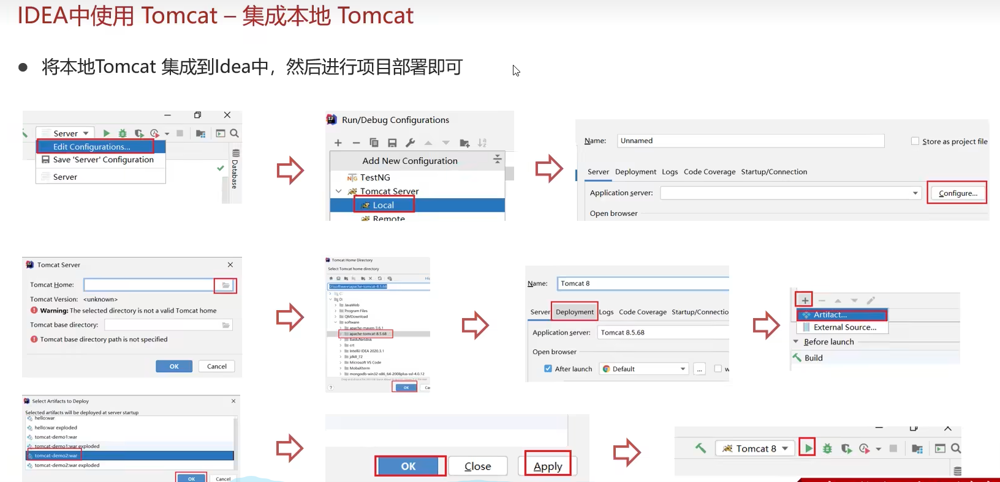

**在javaWeb项目中集成tomCat**


```xml

  <build>
    <finalName>web</finalName>
    <plugins>
      <plugin>
        <groupId>org.apache.tomcat.maven</groupId>
        <artifactId>tomcat7-maven-plugin</artifactId>
        <version>2.2</version>
        <configuration>
          <port>8088</port>
          <path>/</path>
        </configuration>
      </plugin>
      <plugin>
        <groupId>org.apache.tomcat.maven</groupId>
        <artifactId>tomcat6-maven-plugin</artifactId>
        <version>2.3-SNAPSHOT</version>
      </plugin>
    </plugins>
  </build>

```


## Servlet

- Servlet已经是一个非常非常古老的技术了，

- 而且在实际开发中几乎不会用到，
- 在面试中也几乎不会问到Servlet相关的知识。
- `但Struts2和SpringMVC框架，底层都是跟Servlet有关`

### 什么是Servlet
>
> servlet程序是由servlet容器（即tomcat服务器）进行管理的  
> 即：由servlet容器（tomcat）完成servlet的实例化、初始化、服务、销毁

Servlet（Server Applet）是Java Servlet的简称，  
是用Java编写的服务器端程序，  
主要功能在于交互式地浏览和修改数据，生成**动态Web内容**。  
简单来说 `Servlet本质就是处理请求做出响应的实现类`

- 客户端发送请求至Web服务器端。
- 服务器将请求信息发送至Servlet
- Servlet 根据请求内容生成响应内容并将其传给服务器。
- 服务器将响应返回给客户端。
- 

> **服务器的三大组件：**
>
> - servlet：用于处理请求和响应
> - filter：用于过滤请求和响应
> - listener：用于监听服务器的状态

### 实现最简Servlet程序

**流程**

- 用`maven`创建`javaWeb`项目，在`pom.xml`配置文件中导入`Servlet`依赖

  ```xml
    <dependencies>
    <dependency>
      <groupId>javax.servlet</groupId>
      <artifactId>javax.servlet-api</artifactId>
      <version>3.1.0</version>
      <scope>provided</scope> <!-- provided表示该依赖仅在编译和测试环境有效，因为该包在其运行环境（tomcat）中有,如果不这么写会导致冲突 -->
    </dependency>
  </dependencies>
  ```

- 编写一个类，实现`HttpServlet`类 或 继承`GenericServlet`类 或 实现`Servlet`接口类

- `重写` 或 `实现` 相应的方法
- 在类上使用注解`@WebServlet("/demo1")`,配置其访问路径
- 访问`http://localhost:8080/demo1`

**实现Servlet接口版**

```java
import java.io.IOException;

import javax.servlet.Servlet;
import javax.servlet.ServletConfig;
import javax.servlet.ServletException;
import javax.servlet.ServletRequest;
import javax.servlet.ServletResponse;
import javax.servlet.annotation.WebServlet;

@WebServlet("/demo1")
public class MyServlet implements Servlet {
    @Override
    public void init(ServletConfig arg0) throws ServletException {
        // TODO Auto-generated method stub
    }
    @Override
    public void service(ServletRequest request, ServletResponse response) throws ServletException, IOException {
        System.out.println("收到一个请求");
    }
    @Override
    public void destroy() {
        // TODO Auto-generated method stub
    }
    // 获取ServletConfig对象
    @Override
    public ServletConfig getServletConfig() {
        // TODO Auto-generated method stub
        return null;
    }
    // 获取Servlet信息
    @Override
    public String getServletInfo() {
        // TODO Auto-generated method stub
        return null;
    }
}
```

**继承HttpServlet版**

```java
public class MyServlet extends HttpServlet {
    @Override
    protected void doGet(HttpServletRequest req, HttpServletResponse resp) throws ServletException, IOException {
        System.out.println("收到一个get请求");
    }

    @Override
    protected void doPost(HttpServletRequest req, HttpServletResponse resp) throws ServletException, IOException {
        System.out.println("收到一个post请求");
    }
}
```

**继承GenericServlet版**

```java
public class MyServlet extends GenericServlet {

}
```

### servlet生命周期


```java
@WebServlet(urlPatterens="/demo1",loadOnStartUp=1)
public class MyServlet implements Servlet {
    /**
     * 调用时机：默认情况下在该servlet被第一次访问时,由容器来调用init()方法，只会被调用一次
     *  * 修改调用时机： loadOnStartUp 
     *      * 默认值为-1 表示在该url被访问后再初始化
     *      * 可修改为1 表示在服务器启动后便初始化
     * 调用次数：1次
     */
    @Override 
    public void init(ServletConfig arg0) throws ServletException {
        System.out.println("url被第一次访问...");
    }
}
```

```java
@WebServlet(urlPatterens="/demo1",loadOnStartUp=1)
public class MyServlet implements Servlet {
    /**
     * 调用时机：url每次被访问时调用一次
     * 调用次数：每当被访问就调用
     */
    @Override
    public void service(ServletRequest request, ServletResponse response) throws ServletException, IOException {
        System.out.println("收到一个请求");
    }
}
```

```java
@WebServlet(urlPatterens="/demo1",loadOnStartUp=1)
public class MyServlet implements Servlet {
    /**
     * 调用时机：Servlet被销毁时（内存释放时，服务进程被正常关闭时），由容器来销毁
     * 调用次数：1次
     */
    @Override
    public void destroy() {
        // TODO Auto-generated method stub
    }
}
```

### HTTPServlet

**一般直接继承HTTPServlet**

- HttpServlet是指能够处理HTTP协议请求的Servlet，
- 它在原有Servlet接口上添加了一些与HTTP协议处理方法，
- 它比Servlet接口的功能更为强大。
- HttpServlet在实现Servlet接口时，覆写了service方法，
  - 该方法体内的代码会自动判断用户的请求方式，
  - 如为GET请求，则调用HttpServlet的doGet方法，
  - 如为Post请求，则调用doPost方法。


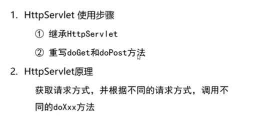

**继承HttpServlet版**

```java
@WebServlet(urlPatterns="/api/1")
public class MyHttpServlet extends HttpServlet {
    @Override
    protected void doGet(HttpServletRequest req, HttpServletResponse resp) throws ServletException, IOException {
        System.out.println("收到一个get请求");
    }

    @Override
    protected void doPost(HttpServletRequest req, HttpServletResponse resp) throws ServletException, IOException {
        System.out.println("收到一个post请求");
    }
}
```

### urlPattern配置

**一个urlPattern可以配置多个访问路径配置**

```java
@WebServlet(urlPatterns={"/api/1","/api/2"})
public class MyHttpServlet extends HttpServlet {
}
```

**urlPattern配置规则**

- 精确匹配

  ```java
  @WebServlet(urlPatterns={"/api/1","/api/2"}) // 若一个url同时满足精确匹配和目录匹配，则精确匹配优先级更高
  ```

- 目录匹配

  ```java
  @WebServlet(urlPatterns={"/api/1/*","/api/2/*"})
  ```

- 扩展名匹配

  ```java
  @WebServlet(urlPatterns={"*.do1","*.do2"}) // 不能写 "/*.do1"
  ```

- 任意匹配

  ```java
  @WebServlet(urlPatterns={"/","/*"})
  ```

**`/`和`/*`区别:**

- 当项目中的Servlet配置了`/`则会覆盖掉tomcat中DefaultServlet（他会处理项目中静态页面的访问，如index.html），当其他的url-pattern都匹配不上时都会走这个Servlet
- 当项目中配置了`/*`，意味着匹配任意访问路径

**优先级**


### xml方式配置Servlet


### Request对象

#### Request继承体系


#### Request常用方法


#### 通用的获取参数的方法

**由于不同的请求方式（get,post）需要使用不同的方法来获取参数，这造成了一定的不方便**


**`通用的`  获取请求数据的 方式**


**测试代码**


```bash
收到一个get请求
userName:[2449695354@qq.com]
password:[123123]
readMe:[true]
autoLogin:[true]
hobby:[1, 2, 3]
```

```html
<!DOCTYPE html>
<html lang="en">
<head>
    <meta charset="UTF-8">
    <meta http-equiv="X-UA-Compatible" content="IE=edge">
    <meta name="viewport" content="width=device-width, initial-scale=1.0">
    <title>Document</title>
</head>
<body>
<h2>Hello World!</h2>
<form action="/api" method="get">
    userName:<input type="text" name="userName"><br>
    password:<input type="password" name="password"><br>
    <input type="checkbox" name="readMe" value="true">readMe <br>
    <input type="checkbox" name="autoLogin" value="true">autoLogin <br>
    <input type="checkbox" name="hobby" value="1">熬夜 <br>
    <input type="checkbox" name="hobby" value="2">敲代码 <br>
    <input type="checkbox" name="hobby" value="3">掉头发 <br>
    <input type="submit">
</form>
</body>
</html>
```

```java
import java.io.IOException;
import java.util.Arrays;
import java.util.Map;

import javax.servlet.ServletException;
import javax.servlet.annotation.WebServlet;
import javax.servlet.http.HttpServlet;
import javax.servlet.http.HttpServletRequest;
import javax.servlet.http.HttpServletResponse;

@WebServlet("/api")
public class MyServlet extends HttpServlet {

    @Override
    protected void doGet(HttpServletRequest req, HttpServletResponse resp) throws ServletException, IOException {
        System.out.println("收到一个get请求");
        Map<String,String[]> paramMap = req.getParameterMap();
        for(String key : paramMap.keySet()){
            System.out.println(key+":"+Arrays.toString(paramMap.get(key)));
        }
    }

    @Override
    protected void doPost(HttpServletRequest req, HttpServletResponse resp) throws ServletException, IOException {
        // （如果要实现一个接口支持两种请求方式）
        // 由于统一了获取请求参数的格式，故可将post请求转交给doget函数
        this.doGet(req, resp);
    }
}
```

#### 解决Request输入流中文乱码的问题

> 注：新版tomcat8.0之后已将get请求乱码问题解决，解码方式为UTF-8

**POST方式乱码的解决**

由于POST方式的数据是以原始格式放在请求体中的，到达服务端后，底层是通过getReader()方式获取到的,默认会以`ISO-8859-1`解码，所以可以通过设置获取流的编码方式来解决该问题

```java
req.setCharacterEncoding("UTF-8");// 设置输入流编码
Map<String,String[]> paramMap = req.getParameterMap(); // 然后就能获得正常的数据了
```

**GET方式乱码的解决：原理解释起来比较困难**  
> 这种方式也能解决post的乱码

- GET方式的请求数据是放在URL中的，但URL是不支持中文的，  
- 浏览器会将中文以`UTF-8`格式进行`URL编码`
  - 
- TomCat收到后会以`ISO-8859-1`格式进行`URL解码`  
  - 
- 问题在于无法修改这个`ISO-8859-1`格式为`UTF-8`  
- 所以需要将得到的数据重新以`ISO-8859-1`格式`解码`获取字节码
- 然后再将得到的字节码以以`UTF-8`格式解析为字符串

**URL编码**

1. 将字符串按照编码方式转为二进制
2. 每个字节转为2个16进制数并在前边加上%

```java
import java.net.URLDecoder;
import java.net.URLEncoder;
import java.nio.charset.StandardCharsets;

public class Test {
    public static void main(String[] args) {
        String userName = "张三";

        // 浏览器做的事
        // 以 ISO_8859_1 编码 URL
        String userName_Browser = URLEncoder.encode(userName,StandardCharsets.UTF_8);
        System.out.println(userName_Browser); // 输出： %E5%BC%A0%E4%B8%89

        // TomCat做的事，
        // 以 ISO_8859_1 解码 URL
        String userName_TomCat = URLDecoder.decode(userName_Browser, StandardCharsets.ISO_8859_1);
        System.out.println(userName_TomCat); // 输出： ??????

        // 作为Servlet开发人员要做的事，
        // 以 ISO_8859_1 解码 `乱码字符串` 获取 `字节数组` ， 然后以UTF_8字符集编码解析 `字节数组` 获取 `字符串` 
        String userName_Servlet = new String(userName_TomCat.getBytes(StandardCharsets.ISO_8859_1),StandardCharsets.UTF_8);
        System.out.println(userName_Servlet); // 输出： 张三
    }
}
```

### Request内部请求转发转发流转给jsp页面Forward


>

**方法**

```java
req.getRequestDispatcher("/api/2").forward(req, resp);
```

**传递数据的一些方法**
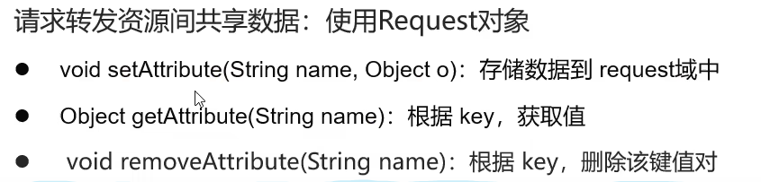

**终端输出**

```bash
/api1 被访问
/api/2 被访问
test的数据为: test的数据
```

```java
import java.io.IOException;

import javax.servlet.ServletException;
import javax.servlet.annotation.WebServlet;
import javax.servlet.http.HttpServlet;
import javax.servlet.http.HttpServletRequest;
import javax.servlet.http.HttpServletResponse;

@WebServlet("/api/1")
public class MyServlet1 extends HttpServlet { // 该类需为public

    @Override
    protected void doGet(HttpServletRequest req, HttpServletResponse resp) throws ServletException, IOException {
        System.out.println("/api/1 被访问");

        req.setAttribute("test", "test的数据");
        
        // 转发给 "/api/2" 的处理函数
        req.getRequestDispatcher("/api/2").forward(req, resp);
    }

    @Override
    protected void doPost(HttpServletRequest req, HttpServletResponse resp) throws ServletException, IOException {
        this.doGet(req, resp);
    }
}
```

```java
import java.io.IOException;

import javax.servlet.ServletException;
import javax.servlet.annotation.WebServlet;
import javax.servlet.http.HttpServlet;
import javax.servlet.http.HttpServletRequest;
import javax.servlet.http.HttpServletResponse;

@WebServlet("/api/2")
public class MyServlet2 extends HttpServlet { // 注意 该类需为public

    @Override
    protected void doGet(HttpServletRequest req, HttpServletResponse resp) throws ServletException, IOException {
        System.out.println("/api/2 被访问");
        System.out.println( "test的数据为: "+req.getAttribute("test") );
    }

    @Override
    protected void doPost(HttpServletRequest req, HttpServletResponse resp) throws ServletException, IOException {
        this.doGet(req, resp);
    }
}
```

### Response对象

**实现关系**


#### Response设置响应数据功能介绍


#### Response完成重定向


```java
@WebServlet("/api/1")
public class MyServlet1 extends HttpServlet {

    @Override
    protected void doGet(HttpServletRequest req, HttpServletResponse resp) throws ServletException, IOException {
        System.out.println("/api/1 被访问");

        // 设置响应行
        resp.setStatus(302);
        // 设置相应头
        resp.setHeader("location", "/api/2");

        // 等效的简化写法
        // resp.sendRedirect("api/2");
    }

    @Override
    protected void doPost(HttpServletRequest req, HttpServletResponse resp) throws ServletException, IOException {
        this.doGet(req, resp);
    }
}
```

#### Response响应字符数据

```java
response.setContentType("text/html;charset=utf-8");
PrintWriter wr = response.getWriter();
wr.write("<h1>测试</h1>");
```

```java
@WebServlet("/a")
public class MyServlet0 extends HttpServlet {

    @Override
    protected void doGet(HttpServletRequest req, HttpServletResponse response) throws ServletException, IOException {
        response.setContentType("text/html;charset=utf-8"); // 使其支持中文 ，因为，response获取到的输出流默认为IOS-8859-1
        PrintWriter wr = response.getWriter(); // 注意PrintWriter会随着resp的关闭而自动销毁
        wr.write("<h1>测试</h1>");
    }
    @Override
    protected void doPost(HttpServletRequest req, HttpServletResponse resp) throws ServletException, IOException {
        this.doGet(req, resp);
    }
}
```

#### Response响应字节数据

```java
OutputStream os = response.getOutputStream();
```

```java
import java.io.IOException;
import java.io.InputStream;
import java.io.OutputStream;

import javax.servlet.ServletException;
import javax.servlet.annotation.WebServlet;
import javax.servlet.http.HttpServlet;
import javax.servlet.http.HttpServletRequest;
import javax.servlet.http.HttpServletResponse;

import org.apache.commons.io.IOUtils; //commons-io IOUtils是流的工具库

@WebServlet("/a")
public class MyServlet0 extends HttpServlet {

    @Override
    protected void doGet(HttpServletRequest req, HttpServletResponse response) throws ServletException, IOException {
        InputStream is = this.getClass().getResourceAsStream("./123.txt");
        OutputStream os = response.getOutputStream();
        IOUtils.copy(is, os);// 拷贝
        System.out.println("拷贝完毕");
    }
    @Override
    protected void doPost(HttpServletRequest req, HttpServletResponse resp) throws ServletException, IOException {
        this.doGet(req, resp);
    }
}
```

### 案例：实现登录注册案例

**注册**  


**注册**  


**数据准备**

```sql
CREATE DATABASE IF NOT EXISTS db6;

CREATE TABLE IF NOT EXISTS tb_user(
    id INT AUTO_INCREMENT PRIMARY KEY,
    username VARCHAR(20) UNIQUE NOT NULL,
    password VARCHAR(20) NOT NULL
);

INSERT INTO 
    tb_user(username,password)
VALUES
    ("张三","123456"),
    ("王五","123456")
;
```

**项目目录结构**


**pom.xml**

```xml
<?xml version="1.0" encoding="UTF-8"?>

<project xmlns="http://maven.apache.org/POM/4.0.0" xmlns:xsi="http://www.w3.org/2001/XMLSchema-instance"
  xsi:schemaLocation="http://maven.apache.org/POM/4.0.0 http://maven.apache.org/xsd/maven-4.0.0.xsd">
  <modelVersion>4.0.0</modelVersion>

  <groupId>com.webapptest</groupId>
  <artifactId>webapptest</artifactId>
  <version>1.1-SNAPSHOT</version>
  <packaging>war</packaging>
  

  <name>web Maven Webapp</name>
  <!-- FIXME change it to the project's website -->
  <url>http://www.example.com</url>

  <properties>
    <project.build.sourceEncoding>UTF-8</project.build.sourceEncoding>
    <maven.compiler.source>1.7</maven.compiler.source>
    <maven.compiler.target>1.7</maven.compiler.target>
  </properties>

  <dependencies>

    <dependency>
    <groupId>javax.servlet</groupId>
    <artifactId>javax.servlet-api</artifactId>
    <version>3.1.0</version>
    <scope>provided</scope>
  </dependency>


    <dependency>
      <groupId>org.mybatis</groupId>
      <artifactId>mybatis</artifactId>
      <version>3.5.11</version>
    </dependency>


    <dependency>
      <groupId>mysql</groupId>
      <artifactId>mysql-connector-java</artifactId>
      <version>8.0.31</version>
    </dependency>


    <dependency>
      <groupId>org.apache.tomcat</groupId>
      <artifactId>tomcat</artifactId>
      <version>10.1.2</version>
      <type>pom</type>
    </dependency>

    <dependency>
      <groupId>junit</groupId>
      <artifactId>junit</artifactId>
      <version>4.11</version>
      <scope>test</scope>
    </dependency>
    
  </dependencies>

  <build>
    <finalName>web</finalName>
    <plugins>
      <plugin>
        <groupId>org.apache.tomcat.maven</groupId>
        <artifactId>tomcat7-maven-plugin</artifactId>
        <version>2.2</version>
        <configuration>
          <port>8080</port>
          <path>/</path>
        </configuration>
      </plugin>
    </plugins>
    
    <pluginManagement><!-- lock down plugins versions to avoid using Maven defaults (may be moved to parent pom) -->
      <plugins>
        <plugin>
          <artifactId>maven-clean-plugin</artifactId>
          <version>3.1.0</version>
        </plugin>
        <!-- see http://maven.apache.org/ref/current/maven-core/default-bindings.html#Plugin_bindings_for_war_packaging -->
        <plugin>
          <artifactId>maven-resources-plugin</artifactId>
          <version>3.0.2</version>
        </plugin>
        <plugin>
          <artifactId>maven-compiler-plugin</artifactId>
          <version>3.8.0</version>
        </plugin>
        <plugin>
          <artifactId>maven-surefire-plugin</artifactId>
          <version>2.22.1</version>
        </plugin>
        <plugin>
          <artifactId>maven-war-plugin</artifactId>
          <version>3.2.2</version>
        </plugin>
        <plugin>
          <artifactId>maven-install-plugin</artifactId>
          <version>2.5.2</version>
        </plugin>
        <plugin>
          <artifactId>maven-deploy-plugin</artifactId>
          <version>2.8.2</version>
        </plugin>
      </plugins>
    </pluginManagement>
  </build>
</project>
```

**mybatis-config.xml**

```xml
<?xml version="1.0" encoding="UTF-8" ?>
<!DOCTYPE configuration
  PUBLIC "-//mybatis.org//DTD Config 3.0//EN"
  "http://mybatis.org/dtd/mybatis-3-config.dtd">
<configuration>
  <environments default="development">
    <environment id="development">
      <transactionManager type="JDBC"/>
      <dataSource type="POOLED">
        <property name="driver" value="com.mysql.cj.jdbc.Driver"/> <!-- 填mysql的驱动的路径 -->
        <property name="url" value="jdbc:mysql:///db6?useSSL=false&amp;useServerPrepStemts=true"/>  <!-- 填mysql数据库的路径 -->
        <property name="username" value="root"/>  <!-- 填数据库的username -->
        <property name="password" value="root"/>   <!-- 填数据库的password -->
      </dataSource>
    </environment>
  </environments>
  <mappers>
    <package name="com.webapptest.mapper" /> <!-- 使用这种Mapper代理的方式便可以用这种包扫描的写法 -->
  </mappers>
</configuration>
```

`UserMapper.java`

```java
package com.webapptest.mapper;
import java.util.List;

import org.apache.ibatis.annotations.Insert;
import org.apache.ibatis.annotations.Param;
// import org.apache.ibatis.annotations.Select;
import org.apache.ibatis.annotations.Select;

import com.webapptest.pojo.User;

public interface UserMapper {

    List<User> selectAll();
    
    User selectUserById(int id);

    @Select("select * from tb_user where username = #{username} and password = #{password};")
    User selectUserByUsernameAndPassword(
        @Param("username") String username,
        @Param("password") String password
    );

    @Insert("INSERT INTO tb_user(id,username,password) values(null,#{username},#{password});")
    int addUser(User user);
}
```

`UserMapper.xml`

```xml
<?xml version="1.0" encoding="UTF-8" ?>
<!DOCTYPE mapper
  PUBLIC "-//mybatis.org//DTD Mapper 3.0//EN"
  "http://mybatis.org/dtd/mybatis-3-mapper.dtd">
<mapper namespace="com.webapptest.mapper.UserMapper">  <!-- namespace改为接口类 -->
  <select id="selectAll" resultType="com.webapptest.pojo.User">   <!-- id为接口的函数名 -->
    select * from tb_user;
  </select>
  <!-- selectUserById --> 
  <select id="selectUserById" resultType="com.webapptest.pojo.User">
    select * from tb_user where id = #{id};
  </select>
</mapper>
```

`pojo/User.java`

```java
package com.webapptest.pojo;

public class User {
    Integer id; 
    String username; 
    String password;
    public Integer getId() {
        return id;
    }
    public void setId(Integer id) {
        this.id = id;
    }
    public String getUsername() {
        return username;
    }
    public void setUsername(String username) {
        this.username = username;
    }
    public String getPassword() {
        return password;
    }
    public void setPassword(String password) {
        this.password = password;
    }
    @Override
    public String toString() {
        return "User [id=" + id + ", username=" + username + ", password=" + password + "]";
    }
}
```

`Login.java`

- 踩坑记录，WebServlet的实现类需放到`/src/main/java/`目录下

```java
import java.io.IOException;
import java.io.InputStream;

import javax.servlet.ServletException;
import javax.servlet.http.HttpServlet;
import javax.servlet.http.HttpServletRequest;
import javax.servlet.http.HttpServletResponse;

import org.apache.ibatis.io.Resources;

import javax.servlet.annotation.WebServlet;

import org.apache.ibatis.session.SqlSession;
import org.apache.ibatis.session.SqlSessionFactory;
import org.apache.ibatis.session.SqlSessionFactoryBuilder;

import com.webapptest.mapper.UserMapper;
import com.webapptest.pojo.User;

@WebServlet(urlPatterns = "/api/login")
public class Login extends HttpServlet {
    @Override
    public void doGet(HttpServletRequest request, HttpServletResponse response) throws ServletException, IOException {
        request.setCharacterEncoding("UTF-8");
        response.setCharacterEncoding("UTF-8");
        
        String username = request.getParameter("username");
        String password = request.getParameter("password");
        
        System.out.println(username);
        System.out.println(password);

        // 加载mybatis核心配置文件
        String resource = "mybatis-config.xml";
        InputStream inputStream = Resources.getResourceAsStream(resource);
        SqlSessionFactory sqlSessionFactory = new SqlSessionFactoryBuilder().build(inputStream);

        // 获取SqlSession，用其来执行sql语句
        SqlSession session = sqlSessionFactory.openSession(true);

        // 获取UserMapper接口的代理对象
        UserMapper userMapper = session.getMapper(UserMapper.class);
        User user = userMapper.selectUserByUsernameAndPassword(username,password);
        if(user!=null)
            response.getWriter().println("登录成功!");
        else
            response.getWriter().println("登录失败!");
        
        response.setContentType("text/html;charset=utf-8");

        session.close();
    }

    @Override
    public void doPost(HttpServletRequest req, HttpServletResponse resp) throws ServletException, IOException {
        this.doGet(req, resp);
    }
}
```

`Register.java`

```java
import java.io.IOException;
import java.io.InputStream;

import javax.servlet.ServletException;
import javax.servlet.http.HttpServlet;
import javax.servlet.http.HttpServletRequest;
import javax.servlet.http.HttpServletResponse;

import org.apache.ibatis.io.Resources;

import javax.servlet.annotation.WebServlet;

import org.apache.ibatis.session.SqlSession;
import org.apache.ibatis.session.SqlSessionFactory;
import org.apache.ibatis.session.SqlSessionFactoryBuilder;

import com.webapptest.mapper.UserMapper;
import com.webapptest.pojo.User;

@WebServlet(urlPatterns = "/api/register")
public class Register extends HttpServlet {
    @Override
    public void doGet(HttpServletRequest request, HttpServletResponse response) throws ServletException, IOException {
        request.setCharacterEncoding("UTF-8");
        response.setCharacterEncoding("UTF-8");
        
        String username = request.getParameter("username");
        String password = request.getParameter("password");

        User user = new User();
        user.setUsername(username);
        user.setPassword(password);
        
        System.out.println(username);
        System.out.println(password);

        // 加载mybatis核心配置文件
        String resource = "mybatis-config.xml";
        InputStream inputStream = Resources.getResourceAsStream(resource);
        SqlSessionFactory sqlSessionFactory = new SqlSessionFactoryBuilder().build(inputStream);

        // 获取SqlSession，用其来执行sql语句
        SqlSession session = sqlSessionFactory.openSession(true);
        
        // 获取UserMapper接口的代理对象
        UserMapper userMapper = session.getMapper(UserMapper.class);

        int affectedRows=0;

        try {
            // 因为用户名是unique 插入出错则直接提示注册失败
            affectedRows = userMapper.addUser(user);
            response.getWriter().println("注册成功!"+ affectedRows);

        } catch (Exception e) {
            System.out.println(e);
            response.getWriter().println("注册失败!" + affectedRows);
        }
        response.setContentType("text/html;charset=utf-8");
        session.close();
    }

    @Override
    public void doPost(HttpServletRequest req, HttpServletResponse resp) throws ServletException, IOException {
        this.doGet(req, resp);
    }
}
```

`login.html`

```html
<!DOCTYPE html>
<html lang="en">
<head>
    <meta charset="UTF-8">
    <meta http-equiv="X-UA-Compatible" content="IE=edge">
    <meta name="viewport" content="width=device-width, initial-scale=1.0">
    <title>Document</title>
</head>
<body>
    <h2>登录</h2>
    <form action="/api/login" method="post">
        userName:<input type="text" name="username"> <br>
        password:<input type="password" name="password"> <br>
        <input type="submit" value="登录">
    </form>
</body>
</html>
```

`register.html`

```html
<!DOCTYPE html>
<html lang="en">
<head>
    <meta charset="UTF-8">
    <meta http-equiv="X-UA-Compatible" content="IE=edge">
    <meta name="viewport" content="width=device-width, initial-scale=1.0">
    <title>Document</title>
</head>
<body>
    <h2>注册</h2>
    <form action="/api/register" method="post">
        userName: <input type="text" name="username"> <br>
        password: <input type="password" name="password"> <br>
        <input type="submit" value="注册">
    </form>
</body>
</html>
```

### 优化：把SqlSessionFactory优化为工具类

```java
package com.webapptest.datebase;
import java.io.IOException;
import java.io.InputStream;

import org.apache.ibatis.io.Resources;
import org.apache.ibatis.session.SqlSession;
import org.apache.ibatis.session.SqlSessionFactory;
import org.apache.ibatis.session.SqlSessionFactoryBuilder;

public class DBSessionPool {// 数据库连接池
    public static SqlSessionFactory sqlSessionFactory=null;
    public static SqlSession getSession(Boolean isAutoCommit) throws IOException {
        if(DBSessionPool.sqlSessionFactory==null){
            // 加载mybatis核心配置文件
            String resource = "mybatis-config.xml";
            InputStream inputStream = Resources.getResourceAsStream(resource);
            DBSessionPool.sqlSessionFactory = new SqlSessionFactoryBuilder().build(inputStream);
        }
        // 获取SqlSession，用其来执行sql语句
        return DBSessionPool.sqlSessionFactory.openSession(isAutoCommit);
    }
}
```

**从数据库连接池 获取 sqlSession**

```java
import java.io.IOException;
import javax.servlet.ServletException;
import javax.servlet.http.HttpServlet;
import javax.servlet.http.HttpServletRequest;
import javax.servlet.http.HttpServletResponse;


import javax.servlet.annotation.WebServlet;

import org.apache.ibatis.session.SqlSession;

import com.webapptest.datebase.DBSessionPool;
import com.webapptest.mapper.UserMapper;
import com.webapptest.pojo.User;

@WebServlet(urlPatterns = "/api/login")
public class Login extends HttpServlet {
    @Override
    public void doGet(HttpServletRequest request, HttpServletResponse response) throws ServletException, IOException {
        request.setCharacterEncoding("UTF-8");
        response.setCharacterEncoding("UTF-8");
        
        String username = request.getParameter("username");
        String password = request.getParameter("password");
        
        System.out.println(username);
        System.out.println(password);


         //从数据库连接池 获取 sqlSession
        SqlSession session = DBSessionPool.getSession(true);

        // 获取UserMapper接口的代理对象
        UserMapper userMapper = session.getMapper(UserMapper.class);
        User user = userMapper.selectUserByUsernameAndPassword(username,password);
        if(user!=null)
            response.getWriter().println("登录成功!");
        else
            response.getWriter().println("登录失败!");
        
        response.setContentType("text/html;charset=utf-8");

        session.close();
    }

    @Override
    public void doPost(HttpServletRequest req, HttpServletResponse resp) throws ServletException, IOException {
        this.doGet(req, resp);
    }
}
```

## JSP(Java Server Pages)Java服务端页面
>
> 简单了解即可，JSP已经逐渐退出历史舞台了。
> JSP本质和PHP类似
> JSP已经逐渐被AJAX技术取代了  

> JSP=HTML+JAVA


`{{ProjectRoot}}/src/main/webapp/index.jsp`

```jsp
<%@ page contentType="text/html;charset=UTF-8" language="java" %>
<html>
  <body>
  <h2>Hello World!</h2>
  <%
    <!-- System.out.println("Hello JSP..."); -->
      out.println("Hello JSP...");
  %>
  </body>
</html>
```

**编译后大概的样子**


`pom.xml`

```xml
    <dependency>
      <groupId>javax.servlet.jsp</groupId>
      <artifactId>jsp-api</artifactId>
      <version>2.2.1-b03</version>
      <scope>provided</scope>
    </dependency>
```

> JSP本质就是一个Servlet
>
> JSP在被访问时，由JSP容器(Tomcat)将其转换为Java文件(Servlet)，在由JSP容器(Tomcat)将其编译，最终对外提供服务的其实就是这个字节码文件


JSP脚本标记分类


**缺点**


### servlet+jsp

> 这种方式的主要解决java代码和html代码混在一起难以阅读的问题，  
> 核心原理是，
>
> - 将需要的数据在servlet中封装好，
>   - `req.setAttribute("test", "test的数据");`
> - 然后通过通过内部转发流转给jsp页面
>   - `req.getRequestDispatcher("/api/2").forward(req, resp);`
> - jsp页面通过 `EL表达式语言` 读取封装好的数据

**EL表达式**
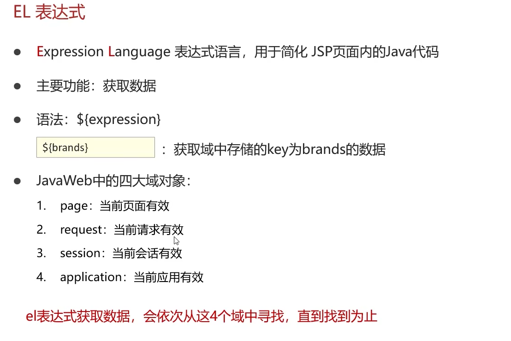


**基本的书写格式**


### JSTF标签
>
> 该技术主要是解决了过去java的if和for循环不得不写在jsp代码中的问题  
> 其实就是以html标签的方式写java的某些语句


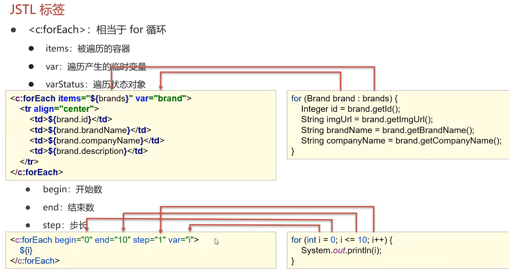

**使用JSTF标签的预备步骤**


## MVC模式与三层架构

### MVC模式

MVC是一种分层开发的模式，其中:

- M: Model，业务模型，处理业务
- V: View，视图，界面展示
- C: Controller，控制器，处理请求，调用模型和视图

**MVC好处**

- 职责单一
- 互不影响有利于分工协作
- 有利于组件重用


### 三层架构

- 数据访问层:对数据库的CRUD基本操作
- 业务逻辑层:对业务逻辑进行封装，组合数据访问层层中基本功能，形成复杂的业务逻辑功能
- 表现层:接收请求，封装数据，调用业务逻辑层，响应数据

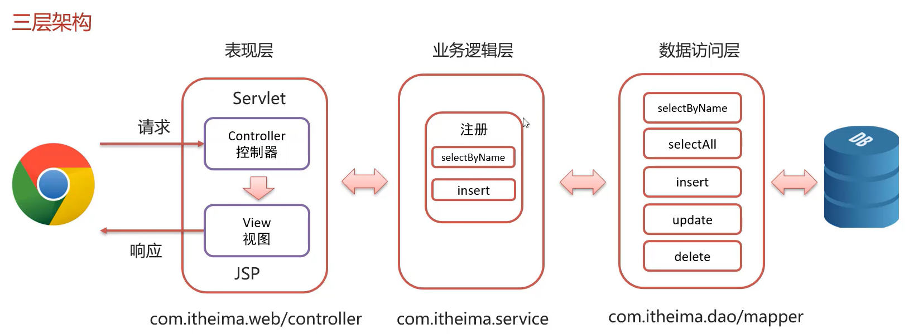

**三层架构项目结构**

依次分别为：

- 数据访问层
- 业务逻辑层
- 表现层（控制器+视图）


### SSM三大框架


### MVC三层模式与三层架构的区别

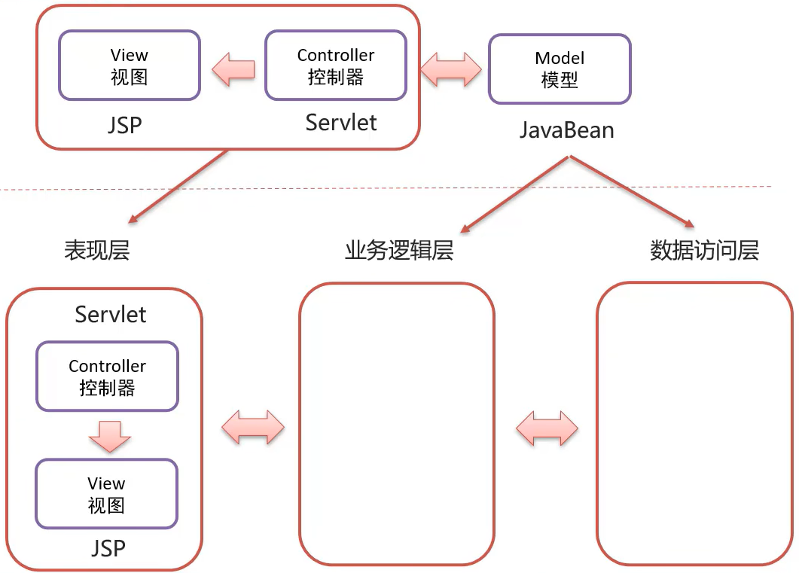

### 案例业务逻辑


## 使用`三层架构`重写登录注册案例

### 项目目录结构

- database 数据访问层
  - `mybatis-config.xml`
  - `mapper`
  - `pojo`
  - `DBSessionPool.java` 单例模式的数据库池

- `service` 业务逻辑层
- `web` 表现层（控制器+视图）


### database数据访问层

`database/DBSessionPool.java`

```java
package com.webapptest.database;
import java.io.IOException;
import java.io.InputStream;
import org.apache.ibatis.io.Resources;
import org.apache.ibatis.session.SqlSessionFactory;
import org.apache.ibatis.session.SqlSessionFactoryBuilder;

public class DBSessionPool {// 数据库连接池
    public static SqlSessionFactory sqlSessionFactory=null;
    public static SqlSessionFactory getSqlSessionFactory() {
        if(DBSessionPool.sqlSessionFactory==null){
            // 加载mybatis核心配置文件
            try {
                String resource = "mybatis-config.xml";
                InputStream inputStream;
                inputStream = Resources.getResourceAsStream(resource);
                DBSessionPool.sqlSessionFactory = new SqlSessionFactoryBuilder().build(inputStream);
            } catch (IOException e) {
                e.printStackTrace();
            }
        }
        return DBSessionPool.sqlSessionFactory;
    }
}

```

`database/mapper/UserMapper.java`

```java
package com.webapptest.database.mapper;
import java.util.List;

import org.apache.ibatis.annotations.Insert;
import org.apache.ibatis.annotations.Param;
import org.apache.ibatis.annotations.Select;

import com.webapptest.database.pojo.User;

public interface UserMapper {

    List<User> selectAll();
    
    User selectUserById(int id);

    @Select("select * from tb_user where username = #{username} and password = #{password};")
    User selectUserByUsernameAndPassword(
        @Param("username") String username,
        @Param("password") String password
    );

    @Insert("INSERT INTO tb_user(id,username,password) values(null,#{username},#{password});")
    int addUser(User user);
}
```

`database/mapper/UserMapper.xml`

```xml
<?xml version="1.0" encoding="UTF-8" ?>
<!DOCTYPE mapper
  PUBLIC "-//mybatis.org//DTD Mapper 3.0//EN"
  "http://mybatis.org/dtd/mybatis-3-mapper.dtd">
<mapper namespace="com.webapptest.database.mapper.UserMapper">  <!-- namespace改为接口类 -->
  <select id="selectAll" resultType="com.webapptest.database.pojo.User">   <!-- id为接口的函数名 -->
    select * from tb_user;
  </select>
  <!-- selectUserById --> 
  <select id="selectUserById" resultType="com.webapptest.database.pojo.User">
    select * from tb_user where id = #{id};
  </select>
</mapper>
```

`../resources/mybatis-config.xml`

```xml
<?xml version="1.0" encoding="UTF-8" ?>
<!DOCTYPE configuration
  PUBLIC "-//mybatis.org//DTD Config 3.0//EN"
  "http://mybatis.org/dtd/mybatis-3-config.dtd">
<configuration>
  <environments default="development">
    <environment id="development">
      <transactionManager type="JDBC"/>
      <dataSource type="POOLED">
        <property name="driver" value="com.mysql.cj.jdbc.Driver"/> <!-- 填mysql的驱动的路径 -->
        <property name="url" value="jdbc:mysql:///db6?useSSL=false&amp;useServerPrepStemts=true"/>  <!-- 填mysql数据库的路径 -->
        <property name="username" value="root"/>  <!-- 填数据库的username -->
        <property name="password" value="root"/>   <!-- 填数据库的password -->
      </dataSource>
    </environment>
  </environments>
  <mappers>
    <package name="com.webapptest.database.mapper" /> <!-- 使用这种Mapper代理的方式便可以用这种包扫描的写法 -->
  </mappers>
</configuration>
```

### service业务逻辑层

`service/UserService.java`

```java
package com.webapptest.service;
import org.apache.ibatis.session.SqlSession;
import com.webapptest.database.DBSessionPool;
import com.webapptest.database.mapper.UserMapper;
import com.webapptest.database.pojo.User;

public class UserService {
    SqlSession session = DBSessionPool.getSqlSessionFactory().openSession(false); // 获取sqlSession

    // 添加用户
    public boolean addUser(User user){
        UserMapper userMapper = session.getMapper(UserMapper.class);
        int affectedRows=0;
        try {
            affectedRows = userMapper.addUser(user);
            if(affectedRows == 1) {
                session.commit(); // 提交事务
                return true;
            }else{
                session.rollback();// 回滚事务
                return false;
            }
        } catch (Exception e) {
            session.rollback();// 回滚事务
            return false;
        } finally {
            session.close();
        }
    }
    public User checkUserExist(String username,String password){// 检查用户是否存在
        UserMapper userMapper = session.getMapper(UserMapper.class);
        return userMapper.selectUserByUsernameAndPassword(username,password);
    }
}
```

### web表现层（控制器+视图）

`web/Login.java`

```java
package com.webapptest.web;


import java.io.IOException;
import javax.servlet.ServletException;
import javax.servlet.http.HttpServlet;
import javax.servlet.http.HttpServletRequest;
import javax.servlet.http.HttpServletResponse;


import javax.servlet.annotation.WebServlet;

import com.webapptest.database.pojo.User;
import com.webapptest.service.UserService;


@WebServlet(urlPatterns = "/api/login")
public class Login extends HttpServlet {

    UserService userService = new UserService(); // 服务层

    @Override
    public void doGet(HttpServletRequest request, HttpServletResponse response) throws ServletException, IOException {
        request.setCharacterEncoding("UTF-8");
        response.setCharacterEncoding("UTF-8");
        
        String username = request.getParameter("username");
        String password = request.getParameter("password");
     
        // 调用服务层，检查用户存在
        User user = userService.checkUserExist(username, password);

        if(user!=null)
            response.getWriter().println("登录成功!");
        else
            response.getWriter().println("登录失败!");
        
        response.setContentType("text/html;charset=utf-8");
    }

    @Override
    public void doPost(HttpServletRequest req, HttpServletResponse resp) throws ServletException, IOException {
        this.doGet(req, resp);
    }
}

```

`web/Register.java`

```java
package com.webapptest.web;
import java.io.IOException;

import javax.servlet.ServletException;
import javax.servlet.http.HttpServlet;
import javax.servlet.http.HttpServletRequest;
import javax.servlet.http.HttpServletResponse;


import javax.servlet.annotation.WebServlet;

import com.webapptest.database.pojo.User;
import com.webapptest.service.UserService;

@WebServlet(urlPatterns = "/api/register")
public class Register extends HttpServlet {
    UserService userService = new UserService();
    @Override
    public void doGet(HttpServletRequest request, HttpServletResponse response) throws ServletException, IOException {
        request.setCharacterEncoding("UTF-8");
        response.setCharacterEncoding("UTF-8");
        response.setContentType("text/html;charset=utf-8");

        
        String username = request.getParameter("username");
        String password = request.getParameter("password");

        User user = new User();
        user.setUsername(username);
        user.setPassword(password);

        Boolean result = userService.addUser(user);

        if(result)
            response.getWriter().println("注册成功!");
        else
            response.getWriter().println("注册失败!");
    }

    @Override
    public void doPost(HttpServletRequest req, HttpServletResponse resp) throws ServletException, IOException {
        this.doGet(req, resp);
    }
}
```

### maven配置

`pom.xml`

```xml
<?xml version="1.0" encoding="UTF-8"?>

<project xmlns="http://maven.apache.org/POM/4.0.0" xmlns:xsi="http://www.w3.org/2001/XMLSchema-instance"
  xsi:schemaLocation="http://maven.apache.org/POM/4.0.0 http://maven.apache.org/xsd/maven-4.0.0.xsd">
  <modelVersion>4.0.0</modelVersion>

  <groupId>com.webapptest</groupId>
  <artifactId>webapptest</artifactId>
  <version>1.1-SNAPSHOT</version>
  <packaging>war</packaging>
  

  <name>web Maven Webapp</name>
  <!-- FIXME change it to the project's website -->
  <url>http://www.example.com</url>

  <properties>
    <project.build.sourceEncoding>UTF-8</project.build.sourceEncoding>
    <maven.compiler.source>1.7</maven.compiler.source>
    <maven.compiler.target>1.7</maven.compiler.target>
  </properties>

  <dependencies>

    <dependency>
      <groupId>javax.servlet.jsp</groupId>
      <artifactId>jsp-api</artifactId>
      <version>2.2.1-b03</version>
      <scope>provided</scope>
    </dependency>


    <dependency>
    <groupId>javax.servlet</groupId>
    <artifactId>javax.servlet-api</artifactId>
    <version>3.1.0</version>
    <scope>provided</scope>
  </dependency>


    <dependency>
      <groupId>org.mybatis</groupId>
      <artifactId>mybatis</artifactId>
      <version>3.5.11</version>
    </dependency>


    <dependency>
      <groupId>mysql</groupId>
      <artifactId>mysql-connector-java</artifactId>
      <version>8.0.31</version>
    </dependency>


    <dependency>
      <groupId>org.apache.tomcat</groupId>
      <artifactId>tomcat</artifactId>
      <version>10.1.2</version>
      <type>pom</type>
    </dependency>

    <dependency>
      <groupId>junit</groupId>
      <artifactId>junit</artifactId>
      <version>4.11</version>
      <scope>test</scope>
    </dependency>
    
  </dependencies>

  <build>
    <finalName>web</finalName>
    <plugins>
      <plugin>
        <groupId>org.apache.tomcat.maven</groupId>
        <artifactId>tomcat7-maven-plugin</artifactId>
        <version>2.2</version>
        <configuration>
          <port>8080</port>
          <path>/</path>
        </configuration>
      </plugin>
    </plugins>
    
    <pluginManagement><!-- lock down plugins versions to avoid using Maven defaults (may be moved to parent pom) -->
      <plugins>
        <plugin>
          <artifactId>maven-clean-plugin</artifactId>
          <version>3.1.0</version>
        </plugin>
        <!-- see http://maven.apache.org/ref/current/maven-core/default-bindings.html#Plugin_bindings_for_war_packaging -->
        <plugin>
          <artifactId>maven-resources-plugin</artifactId>
          <version>3.0.2</version>
        </plugin>
        <plugin>
          <artifactId>maven-compiler-plugin</artifactId>
          <version>3.8.0</version>
        </plugin>
        <plugin>
          <artifactId>maven-surefire-plugin</artifactId>
          <version>2.22.1</version>
        </plugin>
        <plugin>
          <artifactId>maven-war-plugin</artifactId>
          <version>3.2.2</version>
        </plugin>
        <plugin>
          <artifactId>maven-install-plugin</artifactId>
          <version>2.5.2</version>
        </plugin>
        <plugin>
          <artifactId>maven-deploy-plugin</artifactId>
          <version>2.8.2</version>
        </plugin>
      </plugins>
    </pluginManagement>
  </build>
</project>
```

### <green>结合反射对web表现层的进一步优化并实现验证码和JSON响应</green>

**完整代码：**
[webapp_三层架构模板并实现登录注册验证码](./resource/webapp.zip)

> 如果任何一个方法都写一个Servelet实现类，代码会变的很臃肿  
>
> 在Web表现层根据请求的URL直接调用service业务逻辑层的方法  
> 自定义BaseServlet，根据浏览器请求的URL路径完成处理函数的调用

**优化后目录结构**  


**优化后登录界面及响应结果JSON结果**  
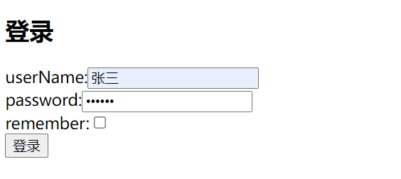


**优化后注册界面及响应结果JSON结果**  

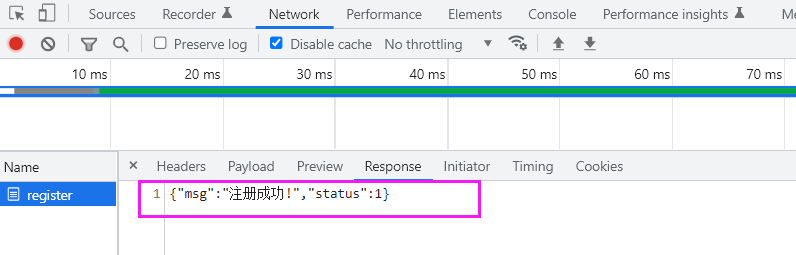

`login.html`

```html
<!DOCTYPE html>
<html lang="en">
<head>
    <meta charset="UTF-8">
    <meta http-equiv="X-UA-Compatible" content="IE=edge">
    <meta name="viewport" content="width=device-width, initial-scale=1.0">
    <title>Document</title>
</head>
<body>
    <h2>登录</h2>
    <form action="/api/user/login" method="post">
        userName:<input type="text" name="username"> <br>
        password:<input type="password" name="password"> <br>
        remember:<input type="checkbox" name="remember" value="true"> <br>
        <input type="submit" value="登录">
    </form>
</body>
</html>
```

`register.html`

```html
<!DOCTYPE html>
<html lang="en">
<head>
    <meta charset="UTF-8">
    <meta http-equiv="X-UA-Compatible" content="IE=edge">
    <meta name="viewport" content="width=device-width, initial-scale=1.0">
    <title>Document</title>
</head>
<body>
    <h2>注册</h2>
    <form action="/api/user/register" method="post">
        userName: <input type="text" name="username"> <br>
        password: <input type="password" name="password"> <br>
        VarifyCode: <input type="text" name="VarifyCode" > <br>
         <br>
        <input type="submit" value="注册">
    </form>
</body>
</html>
```

`BaseServlet.java`

```java
package com.webapptest.web;

import java.io.IOException;
import java.lang.reflect.Method;

import javax.servlet.ServletException;
import javax.servlet.http.HttpServlet;
import javax.servlet.http.HttpServletRequest;
import javax.servlet.http.HttpServletResponse;

public class BaseServlet extends HttpServlet {
    @Override
    protected void service(HttpServletRequest req, HttpServletResponse resp) {
        String uriString = req.getRequestURI(); // 获取URI: /user/login
        int supliceIndex = uriString.lastIndexOf("/"); // 找到最后一个/符号的位置
        String methodName = uriString.substring(supliceIndex+1); //获取方法名: login

        try {// 通过反射获取这个方法,并执行这个方法
            Method method = this.getClass().getDeclaredMethod(methodName,HttpServletRequest.class,HttpServletResponse.class);
            method.invoke(this, req,resp);
        } catch (Exception e) {
            e.printStackTrace();
        }
        System.out.println("BaseServlet的service被调用了");
    }
}
```

`UserServlet.java`

```java
package com.webapptest.web;

import java.io.IOException;

import javax.servlet.annotation.WebServlet;
import javax.servlet.http.HttpServletRequest;
import javax.servlet.http.HttpServletResponse;

import com.alibaba.fastjson.JSON;
import com.webapptest.database.pojo.User;
import com.webapptest.service.UserService;
import com.webapptest.utils.CheckCodeUtil;

// 当浏览器访问 /api/user/login 时，
// 会由 BaseServlet 的 service 函数 找到子类的 login 这个函数,然后执行他
@WebServlet("/api/user/*")
public class UserServlet extends BaseServlet{
    UserService userService = new UserService(); // 服务层
    public void login(HttpServletRequest request,HttpServletResponse response ) throws IOException{

        request.setCharacterEncoding("UTF-8");
        response.setCharacterEncoding("UTF-8");
        response.setContentType("text/html;charset=utf-8");
        
        String username = request.getParameter("username");
        String password = request.getParameter("password");
     
        // 调用服务层，检查用户存在
        User user = userService.checkUserExist(username, password);

        ResponseData responseData = new ResponseData();
        if(user!=null){
            responseData.setStatus(1);
            responseData.setMsg("登录成功!");
            user.setPassword(null);// 清除密码信息
            responseData.setData(user);// 把user对象传递过去
        }
        else{
            responseData.setStatus(0);
            responseData.setMsg("登录失败!");
        }
        response.getWriter().write(JSON.toJSONString(responseData));// 响应数据

        System.out.println("UserServlet的login被调用了");
    }
    // 获取注册用户时需要的验证码图片
    public void getVerifytImage(HttpServletRequest request,HttpServletResponse response) throws IOException{
        // 生成5位的随机验证码，并保存到session中
        String VarifyCode = CheckCodeUtil.generateVerifyCode(5);
        request.getSession().setAttribute("VarifyCode", VarifyCode);
        // 生成图片返回给浏览器
        CheckCodeUtil.outputImage(200, 50, response.getOutputStream(), VarifyCode);
        System.out.println("UserServlet的getVerifytImage被调用了");
    }
    // 注册用户
    public void register(HttpServletRequest request,HttpServletResponse response) throws IOException{
        request.setCharacterEncoding("UTF-8");
        response.setCharacterEncoding("UTF-8");
        response.setContentType("text/html;charset=utf-8");
        
        String username = request.getParameter("username");
        String password = request.getParameter("password");
        String VarifyCode = request.getParameter("VarifyCode"); // 从浏览器得到的VarifyCode
        String VarifyCode_inSession = (String) request.getSession().getAttribute("VarifyCode");// 从session中获得的VarifyCode

        User user = new User();
        user.setUsername(username);
        user.setPassword(password);

        ResponseData responseData = new ResponseData();

        if( VarifyCode.equalsIgnoreCase(VarifyCode_inSession) == false) // 忽略大小写的比对
        {
            responseData.setStatus(1);
            responseData.setMsg("注册失败!,验证码错误。");
            response.getWriter().write(JSON.toJSONString(responseData));
            return;
        }

        Boolean result = userService.addUser(user);

        if(result){
            responseData.setStatus(1);
            responseData.setMsg("注册成功!");
        }
        else{
            responseData.setStatus(0);
            responseData.setMsg("注册失败!");
        }
        response.getWriter().write(JSON.toJSONString(responseData));
    
        System.out.println("UserServlet的register被调用了");
    }
    private class ResponseData{
        int status;
        String msg;
        Object data;
        public int getStatus() {
            return status;
        }
        public void setStatus(int status) {
            this.status = status;
        }
        public String getMsg() {
            return msg;
        }
        public void setMsg(String msg) {
            this.msg = msg;
        }
        public Object getData() {
            return data;
        }
        public void setData(Object data) {
            this.data = data;
        }
        
    } 
}
```

## Fastjson：JSON 数据和 Java 对象转换

Fastjson是阿里巴巴提供的一个Java语言编写的高性能功能完善的JSON库，是目前Java语言中最快的JSON库，可以实现Java对象和JSON字符串的相互转换。

```xml
<dependency>
  <groupld>com.alibaba</groupld>
  <artifactld>fastjson</artifactld>
  <version>1.2.62</version>
</dependency>
```

```java
User user = new User();
user.setUsername("admin");
user.setPassword("123456");

// 将java对象 转 json字符串
String jsonStr = JSON.toJSONString(obj);

// 将json字符串 转 java对象
User user = JSON.parseObject(jsonStr,User.class);
```

## Cookie、Session会话跟踪技术

> 简单来说，就是用来解决http协议无状态性的，  
> 用来让服务端与客户端能在多次请求间共享数据  
> 可以让服务端能够识别两次不同的请求是否为同一身份的用户  
> 可用来做身份验证  

**实现方式**:

1. 客户端会话跟踪技术:Cookie
2. 服务端会话跟踪技术:Session

### Cookie

#### Cookie基本使用和原理

**在服务端`发送`cookie**

> 服务端发送 cookie 给浏览器 基于http协议，  
> 保存在响应头的setCookie字段中
> 浏览器会自动保存cookie
> 
> 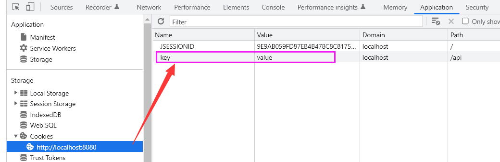

```java
package com.webapptest.web;

import java.io.IOException;

import javax.servlet.ServletException;
import javax.servlet.annotation.WebServlet;
import javax.servlet.http.Cookie;
import javax.servlet.http.HttpServlet;
import javax.servlet.http.HttpServletRequest;
import javax.servlet.http.HttpServletResponse;

@WebServlet("/api/getCookie")
public class GetCookie extends HttpServlet{
    @Override
    protected void doGet(HttpServletRequest req, HttpServletResponse resp) throws ServletException, IOException {
        // 发送cookie 
        resp.addCookie(new Cookie("key", "value"));
    }
}
```

**在客户端`发送`所有收到的cookie**

> 浏览器发送 cookie 给服务器 基于http协议，  
> 保存在请求头的Cookie字段中
> 浏览器会自动发送所有cookie
> 
> 

```java
package com.webapptest.web;

import java.io.IOException;

import javax.servlet.ServletException;
import javax.servlet.annotation.WebServlet;
import javax.servlet.http.Cookie;
import javax.servlet.http.HttpServlet;
import javax.servlet.http.HttpServletRequest;
import javax.servlet.http.HttpServletResponse;

@WebServlet("/api/sendCookie")
public class SendCookie extends HttpServlet{
    @Override
    protected void doGet(HttpServletRequest req, HttpServletResponse resp) throws ServletException, IOException {
        Cookie[] cookies = req.getCookies();
        for (Cookie cookie : cookies) {
            System.out.println(cookie.getName()+":"+cookie.getValue());
        }
    }
}
```

#### Cookie存活时间

**`cookie`存活时间**

- 默认情况下，服务端发来的cookie，浏览器会保存在内存中，浏览器关闭后cookie销毁
- 服务端可以通过`setMaxAge(int seconds)`设置发送的cookie的存活时间
  - 正数：将cookie存入浏览器所在电脑`硬盘`，持久化存储，`过期自动销毁`
  - 0：`即刻删除`浏览器所在电脑中对应字段的值
  - 负数：默认值，存入浏览器所在电脑的`内存`，`关闭浏览器后自动销毁`

**Cookie默认不支持存储中文**

- 但可在发送是使用URL来编码，收到后再编码会中文

#### Cookie发送中文

**发送中文**


```java
package com.webapptest.web;

import java.io.IOException;
import java.net.URLEncoder;
import java.nio.charset.StandardCharsets;

import javax.servlet.ServletException;
import javax.servlet.annotation.WebServlet;
import javax.servlet.http.Cookie;
import javax.servlet.http.HttpServlet;
import javax.servlet.http.HttpServletRequest;
import javax.servlet.http.HttpServletResponse;

@WebServlet("/api/getCookie")
public class GetCookie extends HttpServlet{

    @Override
    protected void doGet(HttpServletRequest req, HttpServletResponse resp) throws ServletException, IOException {
        // 发送cookie 
        Cookie cookie = new Cookie("key", URLEncoder.encode("中文", StandardCharsets.UTF_8));
        cookie.setMaxAge(3600);// 设置过期时间
        resp.addCookie(cookie);
    }
}
```

**接收中文**

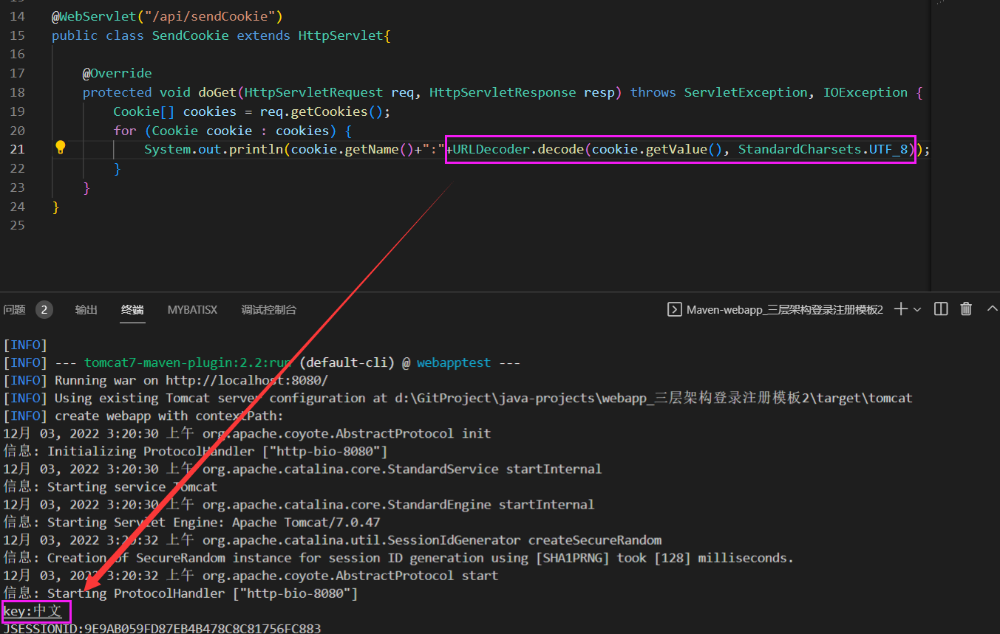

```java
package com.webapptest.web;

import java.io.IOException;
import java.net.URLDecoder;
import java.nio.charset.StandardCharsets;

import javax.servlet.ServletException;
import javax.servlet.annotation.WebServlet;
import javax.servlet.http.Cookie;
import javax.servlet.http.HttpServlet;
import javax.servlet.http.HttpServletRequest;
import javax.servlet.http.HttpServletResponse;

@WebServlet("/api/sendCookie")
public class SendCookie extends HttpServlet{

    @Override
    protected void doGet(HttpServletRequest req, HttpServletResponse resp) throws ServletException, IOException {
        Cookie[] cookies = req.getCookies();
        for (Cookie cookie : cookies) {
            System.out.println(cookie.getName()+":"+URLDecoder.decode(cookie.getValue(), StandardCharsets.UTF_8));
        }
    }
}
```

### Session
>
> Session 是基于 Cookie 实现的
>
> 原理理解：浏览器第一次访问服务器后，服务器会为这个会话创建一个Session对象，存放在内存中，在这个Session对象中能够存储键值对信息，而后，服务器响应浏览器，并在响应头的Cookie中附带这个SessionID,浏览器第二次访问服务器时，会在响应头的Cookie字段中自动携带这个SessionID，服务器通过这个SessionID去内存中寻找这个Session，就能获取到上一次在Session中存储的信息
> 

> 浏览器第一次访问服务器时，服务器自动创建Session对象并在响应头中携带该Session的ID


```java
package com.webapptest.web;

import java.io.IOException;
import java.net.URLEncoder;
import java.nio.charset.StandardCharsets;

import javax.servlet.ServletException;
import javax.servlet.annotation.WebServlet;
import javax.servlet.http.Cookie;
import javax.servlet.http.HttpServlet;
import javax.servlet.http.HttpServletRequest;
import javax.servlet.http.HttpServletResponse;
import javax.servlet.http.HttpSession;

@WebServlet("/api/GetSession")
public class GetSession extends HttpServlet{

    @Override
    protected void doGet(HttpServletRequest req, HttpServletResponse resp) throws ServletException, IOException {
        HttpSession session = req.getSession();
        System.out.println(session.getAttribute("测试"));
    }
}
```

> 浏览器第二次访问服务器时，浏览器自动通过Cookie携带Session的ID，服务器根据该SessionID从内存中找出该Session


```java
package com.webapptest.web;

import java.io.IOException;

import javax.servlet.ServletException;
import javax.servlet.annotation.WebServlet;
import javax.servlet.http.HttpServlet;
import javax.servlet.http.HttpServletRequest;
import javax.servlet.http.HttpServletResponse;
import javax.servlet.http.HttpSession;


@WebServlet("/api/SendSession")
public class SendSession extends HttpServlet{

    @Override
    protected void doGet(HttpServletRequest req, HttpServletResponse resp) throws ServletException, IOException {
        HttpSession session = req.getSession();
        session.setAttribute("测试", "Session测试");
    }
}
```

#### Session的钝化与活化

服务器重启后，Session中的数据是否还在?

- 钝化:在服务器`正常关闭`后，Tomcat会自动将Session数据写入硬盘的文件中(对象序列化)
- 活化:再次启动服务器后，从文件中加载数据到Session中,然后文件会被删除

#### Session在浏览器的生命周期
>
> - 默认为关闭浏览器窗口便自动销毁。  
> - 若生命周期有延长，需在服务端指定

#### Session在服务端的生命周期
>
> 默认为30分钟，可在web.xml 或tomcat的默认配置文件中修改

```java
<!DOCTYPE web-app PUBLIC "-//Sun Microsystems, Inc.//DTD Web Application 2.3//EN" 
"http://java.sun.com/dtd/web-app_2_3.dtd">

<web-app>
  <display-name>Archetype Created Web Application</display-name>
  <session-config>
    <session-timeout>30</session-timeout>
  </session-config>
</web-app>
```

> **手动销毁**

```java
package com.webapptest.web;

import java.io.IOException;
import java.net.URLEncoder;
import java.nio.charset.StandardCharsets;

import javax.servlet.ServletException;
import javax.servlet.annotation.WebServlet;
import javax.servlet.http.Cookie;
import javax.servlet.http.HttpServlet;
import javax.servlet.http.HttpServletRequest;
import javax.servlet.http.HttpServletResponse;
import javax.servlet.http.HttpSession;

@WebServlet("/api/GetSession")
public class GetSession extends HttpServlet{

    @Override
    protected void doGet(HttpServletRequest req, HttpServletResponse resp) throws ServletException, IOException {
        HttpSession session = req.getSession();
        session.invalidate();// 销毁该session
        System.out.println(session.getAttribute("测试"));
    }
}
```

### 实现登录记住我功能:通过Cookie实现

> 在页面中提供记住我remember选项

```html
<!DOCTYPE html>
<html lang="en">
<head>
    <meta charset="UTF-8">
    <meta http-equiv="X-UA-Compatible" content="IE=edge">
    <meta name="viewport" content="width=device-width, initial-scale=1.0">
    <title>Document</title>
</head>
<body>
    <h2>登录</h2>
    <form action="/api/login" method="post">
        userName:<input type="text" name="username"> <br>
        password:<input type="password" name="password"> <br>
        remember:<input type="checkbox" name="remember" value="true"> <br>
        <input type="submit" value="登录">
    </form>
</body>
</html>
```

> 处理登录业务，同时处理remember业务逻辑，打钩则生成cookie，发送给客户端

```java
package com.webapptest.web;


import java.io.IOException;
import java.net.URLEncoder;
import java.nio.charset.StandardCharsets;

import javax.servlet.ServletException;
import javax.servlet.http.Cookie;
import javax.servlet.http.HttpServlet;
import javax.servlet.http.HttpServletRequest;
import javax.servlet.http.HttpServletResponse;


import javax.servlet.annotation.WebServlet;

import com.webapptest.database.pojo.User;
import com.webapptest.service.UserService;


@WebServlet(urlPatterns = "/api/login")
public class Login extends HttpServlet {

    UserService userService = new UserService(); // 服务层

    @Override
    public void doGet(HttpServletRequest request, HttpServletResponse response) throws ServletException, IOException {
        request.setCharacterEncoding("UTF-8");
        response.setCharacterEncoding("UTF-8");
        response.setContentType("text/html;charset=utf-8");
        
        String username = request.getParameter("username");
        String password = request.getParameter("password");
        String remember = request.getParameter("remember");
     
        // 调用服务层，检查用户存在
        User user = userService.checkUserExist(username, password);

//---------------------------------------------------------------------------------
        if(user!=null){
            response.getWriter().println("登录成功!");
            if("true".equals(remember)){ // 如果需要记住客户端，
                Cookie cusername = new Cookie("username",URLEncoder.encode(username,StandardCharsets.UTF_8));  // 用户名密码，统一URL编码
                Cookie cpassword = new Cookie("password",URLEncoder.encode(password,StandardCharsets.UTF_8));  // 用户名密码，统一URL编码
                cusername.setMaxAge(60*60*24);
                cpassword.setMaxAge(60*60*24);
                cusername.setPath("/"); // 作用域
                cpassword.setPath("/"); // 作用域
                response.addCookie(cusername);
                response.addCookie(cpassword);
            }
        }
//---------------------------------------------------------------------------------
        else
            response.getWriter().println("登录失败!");
    }

    @Override
    public void doPost(HttpServletRequest req, HttpServletResponse resp) throws ServletException, IOException {
        this.doGet(req, resp);
    }
}
```

> 后续的登录逻辑，用户访问`/login`如果能从用户的cookie中找到用户名密码，直接登录，否则内部跳转到`/login.html`页面

```java
package com.webapptest.web;


import java.io.IOException;
import java.net.URLDecoder;
import java.nio.charset.StandardCharsets;

import javax.servlet.ServletException;
import javax.servlet.http.Cookie;
import javax.servlet.http.HttpServlet;
import javax.servlet.http.HttpServletRequest;
import javax.servlet.http.HttpServletResponse;


import javax.servlet.annotation.WebServlet;

import com.webapptest.database.pojo.User;
import com.webapptest.service.UserService;


@WebServlet(urlPatterns = "/login")
public class Login_Rdirector extends HttpServlet {

    UserService userService = new UserService(); // 服务层

    @Override
    public void doGet(HttpServletRequest request, HttpServletResponse response) throws ServletException, IOException {
        request.setCharacterEncoding("UTF-8");
        response.setCharacterEncoding("UTF-8");
        response.setContentType("text/html;charset=utf-8");

        String username=null;
        String password=null;

//---------------------------------------------------------------------------------
        Cookie[] cookies = request.getCookies(); // 从客户端cookie中提取用户名和密码信息
        for (Cookie cookie : cookies) {
            if(cookie.getName().equals("username"))
                username = URLDecoder.decode(cookie.getValue(), StandardCharsets.UTF_8); // 解码URL用户名
            if(cookie.getName().equals("password"))
                password = URLDecoder.decode(cookie.getValue(), StandardCharsets.UTF_8); // 解码URL密码
        }
//---------------------------------------------------------------------------------

        System.out.println(username);
        System.out.println(password);

        // 调用服务层，检查用户存在
        User user = userService.checkUserExist(username, password);

        if(user!=null)
            response.getWriter().println("登录成功!"); // 如果存在，直接回复登陆成功
        else
            request.getRequestDispatcher("/login.html").forward(request, response);  // 如果不存在，内部流转到登录页面   
    }

    @Override
    public void doPost(HttpServletRequest req, HttpServletResponse resp) throws ServletException, IOException {
        this.doGet(req, resp);
    }
}
```

### 实现登录记住我功能:通过Session实现

```java
package com.webapptest.web;


import java.io.IOException;
import java.net.URLDecoder;
import java.nio.charset.StandardCharsets;

import javax.servlet.ServletException;
import javax.servlet.http.Cookie;
import javax.servlet.http.HttpServlet;
import javax.servlet.http.HttpServletRequest;
import javax.servlet.http.HttpServletResponse;
import javax.servlet.http.HttpSession;
import javax.servlet.annotation.WebServlet;

import com.webapptest.database.pojo.User;
import com.webapptest.service.UserService;


@WebServlet(urlPatterns = "/login")
public class Login_Rdirector extends HttpServlet {

    UserService userService = new UserService(); // 服务层

    @Override
    public void doGet(HttpServletRequest request, HttpServletResponse response) throws ServletException, IOException {
        request.setCharacterEncoding("UTF-8");
        response.setCharacterEncoding("UTF-8");
        response.setContentType("text/html;charset=utf-8");

//---------------------------------------------------------------------------------
        HttpSession httpSession = request.getSession();
        String username=( String ) httpSession.getAttribute("username");
        String password=( String ) httpSession.getAttribute("password");
//---------------------------------------------------------------------------------

        System.out.println(username);
        System.out.println(password);

        // 调用服务层，检查用户存在
        User user = userService.checkUserExist(username, password);

        if(user!=null)
            response.getWriter().println("登录成功!"); // 如果存在，直接回复登陆成功
        else
            request.getRequestDispatcher("/login.html").forward(request, response);  // 如果不存在，内部流转到登录页面   
    }

    @Override
    public void doPost(HttpServletRequest req, HttpServletResponse resp) throws ServletException, IOException {
        this.doGet(req, resp);
    }
}
```

```java
package com.webapptest.web;


import java.io.IOException;
import java.net.URLDecoder;
import java.nio.charset.StandardCharsets;

import javax.servlet.ServletException;
import javax.servlet.http.Cookie;
import javax.servlet.http.HttpServlet;
import javax.servlet.http.HttpServletRequest;
import javax.servlet.http.HttpServletResponse;
import javax.servlet.http.HttpSession;
import javax.servlet.annotation.WebServlet;

import com.webapptest.database.pojo.User;
import com.webapptest.service.UserService;


@WebServlet(urlPatterns = "/login")
public class Login_Rdirector extends HttpServlet {

    UserService userService = new UserService(); // 服务层

    @Override
    public void doGet(HttpServletRequest request, HttpServletResponse response) throws ServletException, IOException {
        request.setCharacterEncoding("UTF-8");
        response.setCharacterEncoding("UTF-8");
        response.setContentType("text/html;charset=utf-8");

//---------------------------------------------------------------------------------
        HttpSession httpSession = request.getSession();
        String username=( String ) httpSession.getAttribute("username");
        String password=( String ) httpSession.getAttribute("password");
//---------------------------------------------------------------------------------

        System.out.println(username);
        System.out.println(password);

        // 调用服务层，检查用户存在
        User user = userService.checkUserExist(username, password);

        if(user!=null)
            response.getWriter().println("登录成功!"); // 如果存在，直接回复登陆成功
        else
            request.getRequestDispatcher("/login.html").forward(request, response);  // 如果不存在，内部流转到登录页面   
    }
    @Override
    public void doPost(HttpServletRequest req, HttpServletResponse resp) throws ServletException, IOException {
        this.doGet(req, resp);
    }
}
```

### 实现注册用户验证码的案例


**登录界面**

```html
<!DOCTYPE html>
<html lang="en">
<head>
    <meta charset="UTF-8">
    <meta http-equiv="X-UA-Compatible" content="IE=edge">
    <meta name="viewport" content="width=device-width, initial-scale=1.0">
    <title>Document</title>
</head>
<body>
    <h2>注册</h2>
    <form action="/api/register" method="post">
        userName: <input type="text" name="username"> <br>
        password: <input type="password" name="password"> <br>
        <!-- --------------------------------------------------------------------- -->
        VarifyCode: <input type="text" name="VarifyCode" > 
        
        <!-- --------------------------------------------------------------------- -->
        <input type="submit" value="注册">
    </form>
</body>
</html>
```

**获取验证码图片**

> 核心操作生成验证码图片返回给服务端  
> 并且要把验证码存取在服务端的session中

```java
package com.webapptest.web;

import java.io.IOException;

import javax.servlet.ServletException;
import javax.servlet.annotation.WebServlet;
import javax.servlet.http.HttpServlet;
import javax.servlet.http.HttpServletRequest;
import javax.servlet.http.HttpServletResponse;

import com.webapptest.utils.CheckCodeUtil;

@WebServlet("/api/GetVarifyCodeImg")
public class GetVarifyCodeImg extends HttpServlet{
    @Override
    protected void doGet(HttpServletRequest req, HttpServletResponse resp) throws ServletException, IOException {
        // 生成5位的随机验证码，并保存到session中
        String VarifyCode = CheckCodeUtil.generateVerifyCode(5);
        req.getSession().setAttribute("VarifyCode", VarifyCode);
        // 生成200x50的图片，通过输出流返回给浏览器
        CheckCodeUtil.outputImage(200, 50, resp.getOutputStream(), VarifyCode);
    }
}
```

重写`/api/register.java`

> 要将session中的验证码和客户端收到的验证码进行比对

```java
package com.webapptest.web;
import java.io.IOException;

import javax.servlet.ServletException;
import javax.servlet.http.HttpServlet;
import javax.servlet.http.HttpServletRequest;
import javax.servlet.http.HttpServletResponse;

import javax.servlet.annotation.WebServlet;

import com.webapptest.database.pojo.User;
import com.webapptest.service.UserService;

@WebServlet(urlPatterns = "/api/register")
public class Register extends HttpServlet {
    UserService userService = new UserService();
    @Override
    public void doGet(HttpServletRequest request, HttpServletResponse response) throws ServletException, IOException {
        request.setCharacterEncoding("UTF-8");
        response.setCharacterEncoding("UTF-8");
        response.setContentType("text/html;charset=utf-8");

        
        String username = request.getParameter("username");
        String password = request.getParameter("password");
        String VarifyCode = request.getParameter("VarifyCode"); // 从浏览器得到的VarifyCode

        // 从session中获得的VarifyCode
        String VarifyCode_inSession = (String) request.getSession().getAttribute("VarifyCode");

         // 忽略大小写的比对
        if( VarifyCode.equalsIgnoreCase(VarifyCode_inSession) == false)
        {
            response.getWriter().println("注册失败!,验证码错误。");
            return;
        }

        User user = new User();
        user.setUsername(username);
        user.setPassword(password);

        Boolean result = userService.addUser(user);

        if(result)
            response.getWriter().println("注册成功!");
        else
            response.getWriter().println("注册失败!");
    }

    @Override
    public void doPost(HttpServletRequest req, HttpServletResponse resp) throws ServletException, IOException {
        this.doGet(req, resp);
    }
}
```

**生成验证码图片的工具类**

> [CheckCodeUtil.java](./Utils/CheckCodeUtil.java)

## Filter

**概念**  
Filter表示过滤器，是JavaWeb三大组件(Servlet、Filter、Listener)之一。

**拦截资源路径**  

- `Filter`拦截资源路径`@WebFilter("/*")`
- 具体资源: `/index.jsp`:只有访问`index.jsp`时才会被拦截。
- 目录拦截:`/user/*`:访问`/user`下的所有资源，都会被拦截
- 后缀名: `*jsp`:访问`后缀名为jsp`的资源，都会被拦截
- 拦截所有:`/*`:访问`所有`资源，都会被拦截

**注解的优先级**  
注解配置的Filter，优先级按照过滤器类名(字符串)的排序

> 过滤器链执行流程
> 
> 

```java
package com.webapptest.web.filter;

import java.io.IOException;
import javax.servlet.Filter;
import javax.servlet.FilterChain;
import javax.servlet.FilterConfig;
import javax.servlet.ServletException;
import javax.servlet.ServletRequest;
import javax.servlet.ServletResponse;
import javax.servlet.annotation.WebFilter;
import javax.servlet.http.HttpServletRequest;
import javax.servlet.http.HttpServletResponse;

@WebFilter("/login")
public class GolbleFilter implements Filter {
    @Override
    public void doFilter(ServletRequest request, ServletResponse response, FilterChain chain)
    throws IOException, ServletException
    {
        HttpServletRequest httpServletRequest = (HttpServletRequest)request;

        // 1.放行前，对request中的数据进行预处理
        // 此处可对 httpServletRequest 处理

        // 2. 放行，转交给下一个过滤器，如果已经是最后一个过滤器，则交给实际的Servlet的处理函数
        chain.doFilter(request, response);

        HttpServletResponse httpServletResponse = (HttpServletResponse)response;
        // 3. 此时拿到的 response 是经过 过滤器和实际Servlet处理函数处理过的response
        // 此处可对 httpServletResponse 处理
    }
    @Override
    public void destroy() {
    }
    @Override
    public void init(FilterConfig filterConfig) throws ServletException {
    }
}
```

## Listener

**概念**  
Listener表示监听器，是JavaWeb三大组件(Servlet、Filter、Listener)之一

> 监听器可以监听就是在`application`,`session`,`request`三个对象创建、销毁或者往其中添加修改删除属性时自动执行代码的功能组件

**Listener分类**  
JavaWeb中提供了8个监听器


**基本使用**

```java
package com.webapptest.web.filter.listener;

import javax.servlet.ServletContextEvent;
import javax.servlet.ServletContextListener;
import javax.servlet.annotation.WebListener;

@WebListener // 记得加注解
public class ServeletAppListener implements ServletContextListener { // 类名任意，关键是要实现接口，添加注解
    @Override
    public void contextInitialized(ServletContextEvent sce) {
        System.out.println("ServeletApp启动了......");
    }
    @Override
    public void contextDestroyed(ServletContextEvent sce) {
        System.out.println("ServeletApp关闭了......");
    }
}
```

## 补充：文件上传

**前端写法**


**上传单个文件**


**上传多个文件**

> 写法上应该可以:

```html
<input type="file" name="images">
<input type="file" name="images">
<input type="file" name="file2">
<input type="file" name="file3">

```

```java
@PostMapping
public Result upload(MultipartFile[] images,MultipartFile file2,MultipartFile file3){

}
```

### 本地存储
>
> ideals：  
> 存储在本地磁盘上，比如 `./public` 下,  
> 可以尝试存储文件名用uuid.后缀名，然后用一个file表来记录文件的：主键id,外键,原始文件名,存储文件名  
> 给一篇文章上传附件，就是插入一条数据，insert 外键=文章id  
> 获取一篇文章的所有附件，就是查询file表，where articleId=?  
> 通过访问 `localhost/public/存储文件名` 来获取原始文件


### 远程存储

> 直接看阿里云的OSS存储相关文档


## 补充：HttpClient


<style>
    gold{
        color:black;
        background-color:gold;
    }
    green{
        color:white;
        background-color:green;
    }
    warn{
        color:white;
        background-color:red;
    }
</style>
