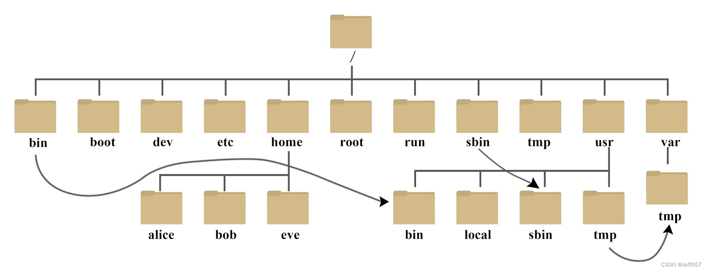

# Linux复习笔记


## 路径




### 绝对路径

以根目录为起点，描述路径的写法，路径以`/`开头

**举例**

```bash
/home/root/
```

### 相对路径

以当前目录为起点，描述路径的写法，路径不以`/`开头

**举例**

```bash
~/.ssh/
./test
../test
```


## 命令

**格式**
```bash
command [-options] [parameter]

command 命令
[-options] 可选选项
[parameter] 可选参数
```

**举例**

```bash
ls -al /home/root/ 
```


### ls命令

**语法格式**
```bash
ls [-a -l -h] [path]
```

**选项说明**
- 默认**平铺形式**列出目录下内容
- `-a` 列出所有内容（包含隐藏文件）
- `-l` 以列表形式列出
- `-h` 以易阅读的形式展示文件大小（KB、MB、GB）

**参数说明**
- 默认列出**当前工作目录**下内容
- path 指定目录
 
**案例**

```bash
root@iZj6cin9q6x5p5bh4ofx79Z:~# ls -alh /home/root/
total 25M
drwx------ 10 root root 4.0K Apr 10  2024 .
drwxr-xr-x 19 root root 4.0K Apr 10  2024 ..
-rw-------  1 root root  12K Sep 13 22:57 .bash_history
-rw-r--r--  1 root root 3.1K Dec  5  2019 .bashrc
drwx------  3 root root 4.0K Sep 14  2020 .cache
drwx------  4 root root 4.0K Apr 10  2024 .config
-rw-r--r--  1 root root   50 Nov 17  2023 .gitconfig
-rw-r--r--  1 root root  25M Nov 22  2023 node-v20.10.0-linux-x64.tar.xz
drwxr-xr-x  5 root root 4.0K Dec  4  2023 .npm
drwxr-xr-x  2 root root 4.0K Sep 14  2020 .pip
-rw-r--r--  1 root root  161 Dec  5  2019 .profile
-rw-r--r--  1 root root  206 Oct 29  2023 .pydistutils.cfg
drwx------  3 root root 4.0K Apr 10  2024 snap
drwx------  2 root root 4.0K Nov 17  2023 .ssh
drwxr-xr-x  2 root root 4.0K Nov 17  2023 temp
drwxr-xr-x  2 root root 4.0K Dec  4  2023 .vim
-rw-------  1 root root  15K Apr 10  2024 .viminfo
-rw-r--r--  1 root root  165 Dec  4  2023 .wget-hsts
```

###　cd命令

> cd (Change Directory) 切换工作目录

**语法格式**

```bash
cd [path]
```
**选项说明**
- 无

**参数说明**
- 默认切换到用户HOME目录
- path 切换到工作目录

**案例**

```bash
root@iZj6cin9q6x5p5bh4ofx79Z:~# cd /home/
root@iZj6cin9q6x5p5bh4ofx79Z:/home# 
```

### pwd命令

> pwd(Print Work Directory) 查看当前所在的工作目录

**语法格式**
```bash
pwd
```

**选项说明**
- 无
**参数说明**
- 无


**案例**

```bash
root@iZj6cin9q6x5p5bh4ofx79Z:/home# pwd
/home
```


### mkdir命令

> mkdir(Make Directory) 创建目录

**语法格式**
```bash
mkdir [-p] path
```

**选项说明**
- `-p` 自动创建父目录(parent directory)，递归创建

**参数说明**
- path 文件夹路径


**案例**
```bash
root@iZj6cin9q6x5p5bh4ofx79Z:~# mkdir temp1/temp2/temp3 -p
root@iZj6cin9q6x5p5bh4ofx79Z:~# tree temp1
temp1
└── temp2
    └── temp3

2 directories, 0 files
```


###　touch命令

> - 更新每个文件的访问时间或修改时间为当前时间
> - 文件参数(访问时间修改时间)不存在时,文件被创建,除非提供`-c`或`-h`选项

**语法格式**
```bash
touch path
```

**选项说明**
- 无

**参数说明**
- path 文件路径


**案例**
```bash
root@iZj6cin9q6x5p5bh4ofx79Z:~# touch main.txt
root@iZj6cin9q6x5p5bh4ofx79Z:~# ls
main.txt  node-v20.10.0-linux-x64.tar.xz  snap  temp  temp1
```


### cat命令

> 拼接文件到标准输出

**语法格式**
```bash
 cat [options] files
```

**选项说明**
- `-n` 显示行数

**参数说明**
- file 文件

**案例**
```bash
root@iZj6cin9q6x5p5bh4ofx79Z:~# cat >> main.txt
123
root@iZj6cin9q6x5p5bh4ofx79Z:~# cat main.txt 
123
```


### more命令

> 支持翻页查看内容


**语法格式**
```bash
more [options] file
```

**选项说明**
- `-<number>`  每屏显示行数
- `+<number>`   从第几行开始显示
- `+/<string>`  从搜索到字符串开始显示

**参数说明**
- file 文件

**命令说明**
- 空格翻页
- q退出


**案例**
```bash
root@iZj6cin9q6x5p5bh4ofx79Z:~# more -5 +/rsa   /etc/ssh/ssh_config

...skipping
#   ConnectTimeout 0
#   StrictHostKeyChecking ask
#   IdentityFile ~/.ssh/id_rsa
#   IdentityFile ~/.ssh/id_dsa
#   IdentityFile ~/.ssh/id_ecdsa
```


### cp命令

> cp (copy)拷贝命令

**语法格式**
```bash
cp [-r] file1 file2
```

**选项说明**
- `-r` 递归拷贝

**参数说明**
- 一个或多个源文件,一个目标文件

**案例**
```bash
root@iZj6cin9q6x5p5bh4ofx79Z:~# cp -r node* temp1 temp
root@iZj6cin9q6x5p5bh4ofx79Z:~# ls
main.txt  node-v20.10.0-linux-x64.tar.xz  snap  temp  temp1
root@iZj6cin9q6x5p5bh4ofx79Z:~# tree temp
temp
├── node-v20.10.0-linux-x64.tar.xz
└── temp1
    └── temp2
        └── temp3
```

### mv命令

> 移动文件、文件夹

**语法格式**
```bash
mv  file1 file2
```

**选项说明**
－无

**参数说明**
- 一个或多个源文件,一个目标文件

**案例**
```bash
root@iZj6cin9q6x5p5bh4ofx79Z:~# rm temp/* -rf
root@iZj6cin9q6x5p5bh4ofx79Z:~# ls
main.txt  node-v20.10.0-linux-x64.tar.xz  snap  temp  temp1
root@iZj6cin9q6x5p5bh4ofx79Z:~# mv node-v20.10.0-linux-x64.tar.xz  temp1 temp
root@iZj6cin9q6x5p5bh4ofx79Z:~# ls
main.txt  snap  temp
root@iZj6cin9q6x5p5bh4ofx79Z:~# tree temp/
temp/
├── node-v20.10.0-linux-x64.tar.xz
└── temp1
    └── temp2
        └── temp3

3 directories, 1 file
```


### rm命令

> rm(remove) 删除文件、文件夹


**语法格式**
```bash
rm [-rf] [path]...
```

**选项说明**
－ `-r` 递归删除文件夹及其内容
- `-f` 强制删除，不显示提示信息

**参数说明**
- 一个或多个文件


**示例**
```bash
root@iZj6cin9q6x5p5bh4ofx79Z:~# ls
main.txt  snap  temp
root@iZj6cin9q6x5p5bh4ofx79Z:~# rm ./temp/
rm: cannot remove './temp/': Is a directory
root@iZj6cin9q6x5p5bh4ofx79Z:~# rm ./temp/ -r
```