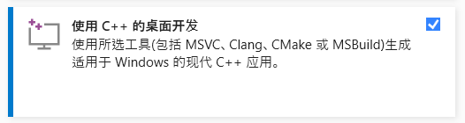
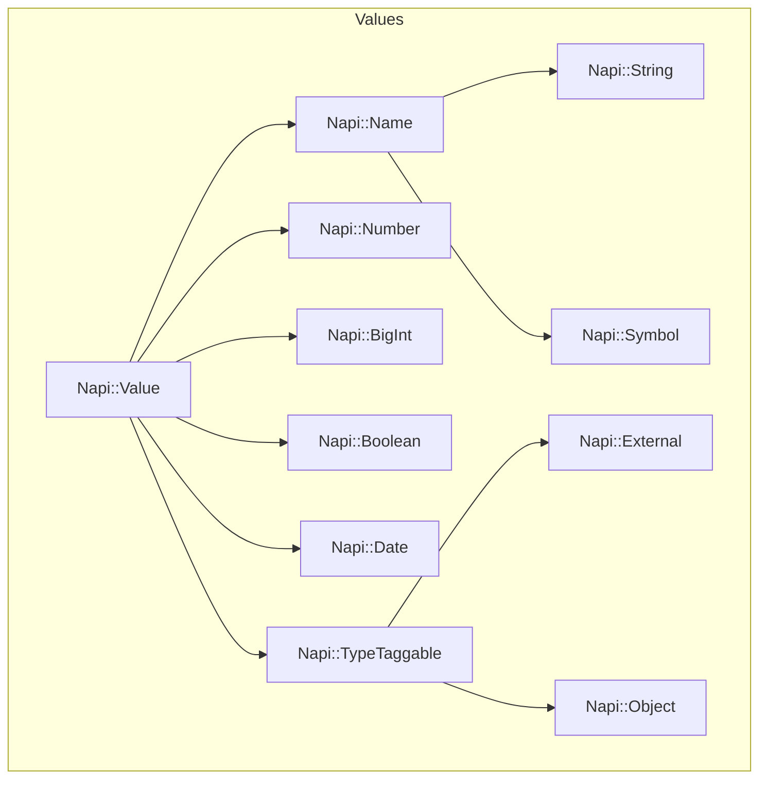
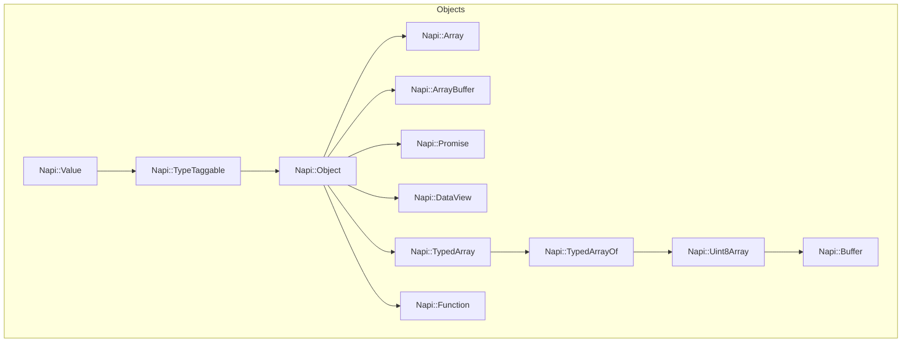
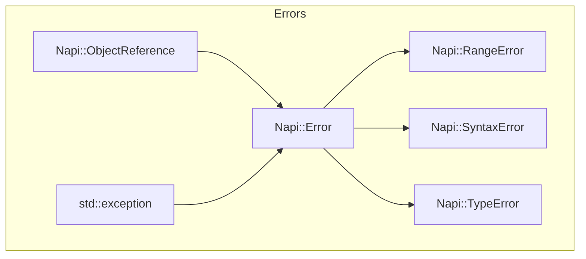
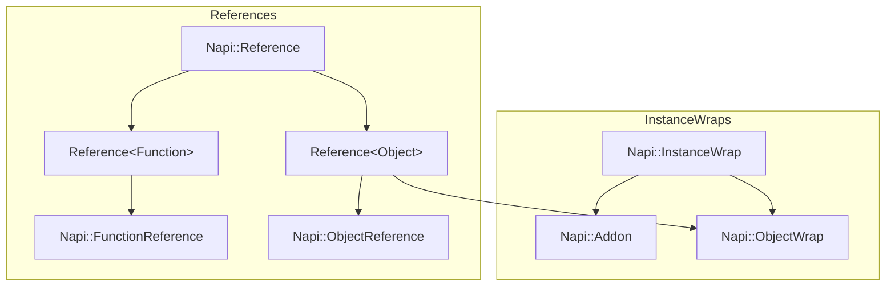
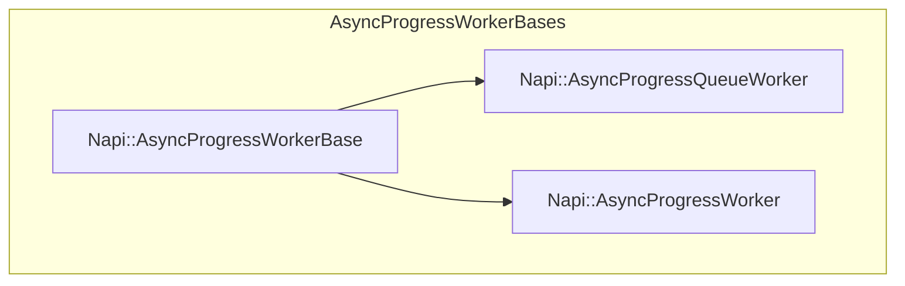
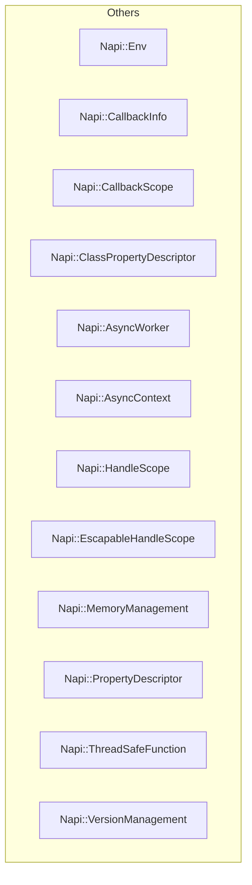

# Node-Addons学习笔记

## 目录

- [Node-Addons学习笔记](#node-addons学习笔记)
  - [目录](#目录)
  - [C++ addons](#c-addons)
  - [Node-API](#node-api)
  - [node-addon-api](#node-addon-api)
  - [getting-started](#getting-started)
    - [安装依赖](#安装依赖)
    - [编写binding.gyp文件](#编写bindinggyp文件)
    - [编写插件](#编写插件)
    - [编写build脚本](#编写build脚本)
    - [安装编译环境](#安装编译环境)
    - [配置vscode实现代码提示](#配置vscode实现代码提示)
    - [编译插件](#编译插件)
    - [编写index.js](#编写indexjs)
    - [测试](#测试)
    - [预构建](#预构建)
  - [对象继承关系图](#对象继承关系图)
  - [addon插件类](#addon插件类)
  - [function函数](#function函数)
    - [示例](#示例)
    - [类型定义](#类型定义)
      - [Napi::Function::VoidCallback](#napifunctionvoidcallback)
      - [Napi::Function::Callback](#napifunctioncallback)
    - [构造函数](#构造函数)
    - [构造函数](#构造函数-1)
    - [New](#new)
    - [New（参数最多的重载）](#new参数最多的重载)
    - [Call](#call)
    - [Call](#call-1)
    - [MakeCallback异步回调执行函数](#makecallback异步回调执行函数)
    - [operator操作符重载](#operator操作符重载)
    - [案例：function\_example](#案例function_example)
    - [案例：function\_arguments函数参数](#案例function_arguments函数参数)
    - [案例：callback\_函数回调](#案例callback_函数回调)
    - [案例：Factory\_Of\_function](#案例factory_of_function)
  - [Object对象](#object对象)
    - [示例](#示例-1)
    - [方法](#方法)
      - [空构造函数](#空构造函数)
      - [构造函数](#构造函数-2)
      - [New()](#new-1)
      - [Set()](#set)
      - [Delete()](#delete)
      - [Get()](#get)
      - [Has()](#has)
      - [InstanceOf()](#instanceof)
      - [AddFinalizer()](#addfinalizer)
      - [AddFinalizer()](#addfinalizer-1)
      - [GetPropertyNames()](#getpropertynames)
      - [HasOwnProperty()](#hasownproperty)
      - [DefineProperty()](#defineproperty)
      - [DefineProperties()](#defineproperties)
      - [Freeze()](#freeze)
      - [Seal()](#seal)
      - [operator](#operator)
      - [begin()](#begin)
      - [end()](#end)
    - [迭代器](#迭代器)
    - [常量迭代器](#常量迭代器)
      - [`operator++()`](#operator-1)
      - [`operator==`](#operator-2)
      - [`operator!=`](#operator-3)
      - [`operator*()`](#operator-4)
      - [示例](#示例-2)
    - [非常量迭代器](#非常量迭代器)
      - [`operator++()`](#operator-5)
      - [`operator==`](#operator-6)
      - [`operator!=`](#operator-7)
      - [`operator*()`](#operator-8)
      - [示例](#示例-3)
    - [案例：Factory\_Of\_Object](#案例factory_of_object)
  - [ObjectWrap](#objectwrap)
    - [案例：objectWrap](#案例objectwrap)
    - [案例：factory\_of\_objectWrap](#案例factory_of_objectwrap)
    - [案例：passing\_wrapped\_obj\_to\_native](#案例passing_wrapped_obj_to_native)
  - [ArrayBuffer](#arraybuffer)
    - [`New(字节长度)`](#new字节长度)
    - [`New(外部数据)`](#new外部数据)
    - [`New（带析构回调）`](#new带析构回调)
    - [`New（带析构回调和提示）`](#new带析构回调和提示)
    - [`构造函数()`](#构造函数-3)
    - [`构造函数(env,arrayBuffer)`](#构造函数envarraybuffer)
    - [`ByteLength()`](#bytelength)
    - [`void* Data()`](#void-data)
    - [`void Detach()`](#void-detach)
    - [`bool IsDetached()`](#bool-isdetached)
    - [案例：passing\_array\_buffer\_to\_native](#案例passing_array_buffer_to_native)
  - [TypedArray](#typedarray)
    - [`构造函数()`](#构造函数-4)
    - [`构造函数(env,typedArray)`](#构造函数envtypedarray)
    - [`napi_typedarray_type TypedArrayType()`](#napi_typedarray_type-typedarraytype)
    - [`ArrayBuffer()`](#arraybuffer-1)
    - [`uint8_t ElementSize()`](#uint8_t-elementsize)
    - [`size_t ElementLength()`](#size_t-elementlength)
    - [`size_t ByteOffset()`](#size_t-byteoffset)
    - [`size_t ByteLength()`](#size_t-bytelength)
    - [案例：passing\_typed\_array\_to\_native](#案例passing_typed_array_to_native)
  - [Reference](#reference)
    - [FunctionReference](#functionreference)
      - [案例：function\_reference](#案例function_reference)
  - [AsyncWorker](#asyncworker)
    - [作用](#作用)
    - [使用场景](#使用场景)
    - [`Queue` 方法](#queue-方法)
    - [`Execute` 和 `OnOK` 的重写](#execute-和-onok-的重写)
    - [线程执行环境](#线程执行环境)
    - [如何安全调用 JavaScript 函数](#如何安全调用-javascript-函数)
    - [工作线程池](#工作线程池)
    - [为什么 `Execute` 方法不会互相阻塞](#为什么-execute-方法不会互相阻塞)
    - [案例：my\_async\_worker](#案例my_async_worker)
    - [案例：async\_worker\_call\_js\_function](#案例async_worker_call_js_function)
    - [案例：async\_worker\_promise](#案例async_worker_promise)
  - [线程安全函数threadsafe\_function](#线程安全函数threadsafe_function)
    - [`构造函数()`](#构造函数-5)
    - [`构造函数(tsfn)`](#构造函数tsfn)
    - [`New(...)`](#new-2)
    - [`napi_status Acquire()`](#napi_status-acquire)
    - [`napi_status Release()`](#napi_status-release)
    - [`napi_status Abort()`](#napi_status-abort)
    - [`napi_status BlockingCall()/NonBlockingCall()`](#napi_status-blockingcallnonblockingcall)
    - [案例：thread\_safe\_function\_demo](#案例thread_safe_function_demo)

## C++ addons

**C++插件(C++ addons)**

- `C++插件(C++ addons)`是用C++写的动态链接库。
- 可以使用`require()`函数，像加载普通`nodejs modules`一样可以加载`C++插件`.
- 插件(Addons)提供了JavaScript 和 C/C++ 之间的接口.

**插件（addons）的三种实现方式**

- `Node-API`(推荐的方式)
- `nan`（旧接口）
- 直接使用内部 V8、libuv 和 `Node.js libraries`

## Node-API

**Node-API简介**

- 以前称为 `N-API`
- 是一个用于构建nodejs原生插件的接口（an API for building native Addons.）
- 独立于底层 JavaScript 运行时（例如 V8），并作为 Node.js 本身的一部分进行维护。
- 该 API 将在 Node.js 版本之间保持稳定
  - 插件与底层 JavaScript 引擎的更改隔离开来
  - 允许为一个主要版本编译的模块可以在 Node.js 的更高主要版本上运行，而无需重新编译。

**Node-API特点**

- `Node-API` 公开的 API 通常用于**创建和操作 JavaScript 值**。
- 所有 `Node-API` 调用都会**返回类型为napi_status的状态码**。表示调用成功或失败。
- API 的**返回值**通过**传递输出参数获取**
- 所有 JavaScript 值都被抽象为名为`napi_value`的不透明类型。
- 如果出现错误状态代码，可以使用`napi_get_last_error_info()`获取附加信息。

## node-addon-api

**`node-addon-api`和`Node-API`的关联**

- `Node-API` 是一种 `C API`，可确保跨不同`Node.js`版本和不同编译器级别的 ABI(应用程序二进制接口) 稳定性。
- `node-addon-api` 是 `Node-API` 的`C++`封装（wrapper module） 因为`C++`API更容易使用。
- `node-addon-api` 是编写调用 `Node-API` 的代码的更有效方法。
- 该封装提供了**可内联**的 C++ API
  - **可内联(inlinable)**: 内联展开是编译器的一个优化技术，其中函数体被直接插入到每一个调用该函数的地方，而不是进行常规的函数调用。这样做可以消除函数调用的开销，并可能改善执行速度，特别是当函数体很小并且频繁被调用时。
  使用 `node-addon-api` 编译构建二进制文件将取决于 Node.js 导出的基于 Node-API C 的函数的符号。

**`node-addon-api`和`Node-API`的案例代码**

使用`node-addon-api`（c++接口）创建对象

```cpp
Object obj = Object::New(env);
obj["foo"] = String::New(env, "bar");
```

使用`Node-API`（c接口）创建对象

```c
napi_status status;
napi_value object, string;
status = napi_create_object(env, &object);
if (status != napi_ok) {
  napi_throw_error(env, ...);
  return;
}

status = napi_create_string_utf8(env, "bar", NAPI_AUTO_LENGTH, &string);
if (status != napi_ok) {
  napi_throw_error(env, ...);
  return;
}

status = napi_set_named_property(env, object, "foo", string);
if (status != napi_ok) {
  napi_throw_error(env, ...);
  return;
}
```

## getting-started

### 安装依赖

```bash
# 初始化项目
npm init -y
# 安装
npm i node-addon-api bindings
# 全局安装构建工具
npm i node-gyp -g
```

### 编写binding.gyp文件

- node-gyp是编写Node.js插件的默认标准构建工具。
- 基于Google的gyp构建工具，该工具抽象了许多与跨平台构建相关的繁琐问题。
- node-gyp使用一个名为`binding.gyp`的文件，该文件位于插件项目的根目录下。
- `binding.gyp`文件包含所有构建配置，使用类似JSON的语法进行组织。
- 如何编写？
  - 指定源文件
    - target_name 必须设置为与插件初始化代码中的值相同
    - sources 源文件
  - 将node-addon-api作为依赖项引用，有三种写法
    1. `node_addon_api`关闭 C++ 异常处理功能
    2. `node_addon_api_except`启用 C++ 异常处理功能
    3. `node_addon_api_maybe` 不启用C++异常处理功能，但启用node-addon-api的安全API类型保护，以确保正确的异常处理模式
    - 说明：
      - 底层的ABI稳定的C-API 并不抛出或处理 C++ 异常，
      - 但 Node-API 的 C++ 包装器类可以选择性地集成 C++ 和 JavaScript 异常处理。

```json
// binding.gyp
{
  "targets": [
    {
      "target_name": "hello_world",
      "sources": ["src/hello_world.cc"],
      "include_dirs": [
        // 可以不写
        // "<!@(node -p \"require('node-addon-api').include\")"
      ],
      "dependencies": [
       // 关闭 C++ 异常处理功能
       "<!(node -p \"require('node-addon-api').targets\"):node_addon_api",
       // 或 启用 C++ 异常处理功能
       "<!(node -p \"require('node-addon-api').targets\"):node_addon_api_except",
       // 或 不启用 C++ 异常,但启用 node-addon-api 的安全 API 类型守卫，以确保正确的异常处理模式。
       "<!(node -p \"require('node-addon-api').targets\"):node_addon_api_maybe"
     ]
    }
  ],

}
```

上面，`node -p "require('node-addon-api').targets"` 是一个 Node.js 命令行表达式，用于从 node-addon-api 模块中获取正确的目标依赖名称。

```bash
# 执行:
$ node -p "require('node-addon-api').targets"
# 输出：
node_modules\node-addon-api\node_addon_api.gyp
```

**对macOS（OSX）支持**

```gyp
'conditions': [
  ['OS=="mac"', {
      'cflags+': ['-fvisibility=hidden'],
      'xcode_settings': {
        'GCC_SYMBOLS_PRIVATE_EXTERN': 'YES', # -fvisibility=hidden
      }
  }]
]
```

### 编写插件

1. 包含`napi.h`
   - 在原生模块代码中包含 `napi.h` 是使用 `Node-API` 的关键步骤。
   - 为了确保仅使用 ABI（应用程序二进制接口）稳定的 API，您不应包含 `node.h`、`nan.h` 或 `v8.h`，
   - 因为这些头文件可能包含非稳定的 V8 或 Node.js 特定 API。
2. 编写入口
   - 编写**代码入口点**（entry-point）
   - 定义**插件入口点**（defines the entry-point for the Node addon）

`src/hello_world.cc`

```cpp
#include <napi.h>

// 定义函数
// function hello(){ return "world" }
Napi::String hello(const Napi::CallbackInfo &info)
{
  return Napi::String::New(info.Env(), "world");
}


/**
  代码入口点。
  这里接收两个参数，
    + 第一个是表示 JavaScript 运行时的一个独立实例的环境，
    + 第二个参数是导出对象，和js文件中的module.exports作用相同。
        + 可以向传入的exports对象添加属性，或者创建你自己的exports对象。
        + 无论哪种情况，你都必须返回这个对象，这样当从Init函数返回时，这个对象将被用作模块的导出。
*/
Napi::Object Init(Napi::Env env, Napi::Object exports) {
  // exports['hello'] = hello
  exports.Set(Napi::String::New(env, "hello"), Napi::Function::New(env, hello));
  return exports;
}

/**
  Node插件入口点，告诉Node一旦库被加载到活动内存中后应该去哪里。

  第一个参数必须与我们在binding.gyp中定义的“target”相一致。
    + 使用`NODE_GYP_MODULE_NAME`可以确保参数正确，
    + 只要模块是使用node-gyp构建的（这是构建模块的常用方式）。
  第二个参数指向要调用的函数。这个函数不能是命名空间内的。
*/
NODE_API_MODULE(NODE_GYP_MODULE_NAME, Init)
```

### 编写build脚本

```json
// package.json
{
  "main": "index.js",
  "scripts": {
    "build": "node-gyp configure && node-gyp build"
  },
  "dependencies": {
    "bindings": "^1.5.0",
    "node-addon-api": "*"
  }
}
```

### 安装编译环境

**安装Python**

```bash
# 1.解压安装miniConda
# 2.然后在bash中执行：
$ /d/app/miniconda3/Scripts/conda init bash
```

**安装VS**

- 
- 

```bash
# 否则报错
gyp ERR! find VS **************************************************************
gyp ERR! find VS You need to install the latest version of Visual Studio
gyp ERR! find VS including the "Desktop development with C++" workload.
gyp ERR! find VS For more information consult the documentation at:
gyp ERR! find VS https://github.com/nodejs/node-gyp#on-windows
gyp ERR! find VS **************************************************************
```

### 配置vscode实现代码提示

1. 安装`c\c++`插件
2. 编写`.vscode/c_cpp_properties.json`，为了在vscode支持代码提示

```json
"configurations": [
  {
   "name": "Win32",
   "includePath": [
      // for source code
      "${workspaceFolder}/src/**",
      // for napi.h
      "${workspaceFolder}/node_modules/node-addon-api/**",
      // for node_api.h
      "${HOME}/AppData/Local/node-gyp/**"
   ],
  }
]
```

### 编译插件

```bash
npm run build
```

### 编写index.js

```js
let addon = require('bindings')('hello_world');

console.log(addon.hello()); // 'world'
```

### 测试

```bash
$ node index.js
world
```

### 预构建

预构建工具

- 原生插件的分发与其实现同样重要。
- 为了安装一个原生插件，确保所有必要的依赖项都已安装并配置正确至关重要。
- 当终端用户通过 npm install 命令安装插件时，他们需要编译这个插件，而这在某些情况下可能会导致问题。
- 为了避免编译过程，可以为不同的平台和架构分发预构建的原生插件。
- 预构建工具可以帮助创建和分发原生插件的预构建形式。

以下列出了与 Node-API 兼容的已知工具：

- node-pre-gyp
- prebuild
- prebuildify

这些工具允许开发者为多种平台和架构预先构建他们的原生插件，并将它们与 npm 包一起分发。
这样，终端用户在安装插件时就不需要编译，可以直接使用预构建的二进制文件。
这对于简化插件的分发和安装过程非常有用，尤其是对于那些没有编译环境或不想处理编译问题的用户。

## 对象继承关系图

> <https://github.com/nodejs/node-addon-api/blob/main/doc/hierarchy.md>

| Class                            | Parent Class(es)                                      |
| -------------------------------- | ----------------------------------------------------- |
| `Napi::Addon`                    | `Napi::InstanceWrap`                                  |
| `Napi::Array`                    | `Napi::Object`                                        |
| `Napi::ArrayBuffer`              | `Napi::Object`                                        |
| `Napi::AsyncContext`             |                                                       |
| `Napi::AsyncProgressQueueWorker` | `Napi::AsyncProgressWorkerBase`                       |
| `Napi::AsyncProgressWorker`      | `Napi::AsyncProgressWorkerBase`                       |
| `Napi::AsyncWorker`              |                                                       |
| `Napi::BigInt`                   | `Napi::Value`                                         |
| `Napi::Boolean`                  | `Napi::Value`                                         |
| `Napi::Buffer`                   | `Napi::Uint8Array`                                    |
| `Napi::CallbackInfo`             |                                                       |
| `Napi::CallbackScope`            |                                                       |
| `Napi::ClassPropertyDescriptor`  |                                                       |
| `Napi::DataView`                 | `Napi::Object`                                        |
| `Napi::Date`                     | `Napi::Value`                                         |
| `Napi::Env`                      |                                                       |
| `Napi::Error`                    | `Napi::ObjectReference`, `std::exception`             |
| `Napi::EscapableHandleScope`     |                                                       |
| `Napi::External`                 | `Napi::TypeTaggable`                                  |
| `Napi::Function`                 | `Napi::Object`                                        |
| `Napi::FunctionReference`        | `Napi::Reference<Napi::Function>`                     |
| `Napi::HandleScope`              |                                                       |
| `Napi::InstanceWrap`             |                                                       |
| `Napi::MemoryManagement`         |                                                       |
| `Napi::Name`                     | `Napi::Value`                                         |
| `Napi::Number`                   | `Napi::Value`                                         |
| `Napi::Object`                   | `Napi::TypeTaggable`                                  |
| `Napi::ObjectReference`          | `Napi::Reference<Napi::Object>`                       |
| `Napi::ObjectWrap`               | `Napi::InstanceWrap`, `Napi::Reference<Napi::Object>` |
| `Napi::Promise`                  | `Napi::Object`                                        |
| `Napi::PropertyDescriptor`       |                                                       |
| `Napi::RangeError`               | `Napi::Error`                                         |
| `Napi::Reference`                |                                                       |
| `Napi::String`                   | `Napi::Name`                                          |
| `Napi::Symbol`                   | `Napi::Name`                                          |
| `Napi::SyntaxError`              | `Napi::Error`                                         |
| `Napi::ThreadSafeFunction`       |                                                       |
| `Napi::TypeTaggable`             | `Napi::Value`                                         |
| `Napi::TypeError`                | `Napi::Error`                                         |
| `Napi::TypedArray`               | `Napi::Object`                                        |
| `Napi::TypedArrayOf`             | `Napi::TypedArray`                                    |
| `Napi::Value`                    |                                                       |
| `Napi::VersionManagement`        |                                                       |













## addon插件类

**线程安全问题**

- 全局数据存储在c++静态变量中并不安全
- 因为这样做没有考虑到插件可能会加载到多个线程中，
- 也没有考虑到插件可能会多次加载到单个线程中。

`Napi::Addon<T>`的作用

- 可以用于定义整个插件。
- 其子类由 Node.js 安全地存储在其**各个线程**上并存储到其**各个上下文**中。

`Napi::Addon<T>::InstanceMethod`和`Napi::Addon<T>::DefineAddon`

- 可以将`Napi::Addon`子类的实例方法暴露给JavaScript
- 被暴露给JavaScript的这些实例方法可以访问存储在实例上的数据（线程安全）

```cpp
class ExampleAddon : public Napi::Addon<ExampleAddon> {
 public:
  ExampleAddon(Napi::Env env, Napi::Object exports) {
    DefineAddon(exports, {
      // 将插件的实例方法暴露给js
      InstanceMethod("increment", &ExampleAddon::Increment)
    })
  }
}
```

`Napi::Addon<T>::DefineProperties`

- 可用于将`Napi::Addon<T>`子类的实例方法附加到另一个对象上。

```cpp
class ExampleAddon : public Napi::Addon<ExampleAddon> {
 public:
  ExampleAddon(Napi::Env env, Napi::Object exports) {
    DefineAddon(
      exports, {
      // 将一个对象暴露到exports上，并把插件实例方法作为该对象的属性
      InstanceValue(
        "subObject", 
        DefineProperties(
          Napi::Object::New(env),
          {
            InstanceMethod("decrement", &ExampleAddon::Decrement)
          }
        ),
        napi_enumerable
      )
    });
  }
}
```

`NODE_API_ADDON()`或`NODE_API_NAMED_ADDON()`

- 可以用来定义插件

```cpp
NODE_API_ADDON(ExampleAddon)
// NODE_API_NAMED_ADDON(NODE_GYP_MODULE_NAME,ExampleAddon)
```

案例

:::code-tabs

@tab `src/hello_world.cc`
@[code cpp](./projects/00.addon/src/hello_world.cc)

@tab `index.js`
@[code cpp](./projects/00.addon/index.js)

:::

## function函数

`Napi::Function` 类提供了一系列方法，用于在原生代码中创建函数对象，这些函数稍后可从JavaScript调用。所创建的函数并不会自动对JavaScript可见，而是需要作为插件模块的导出内容或由模块的导出函数返回。

此外，`Napi::Function` 类还提供了可用于调用在JavaScript中创建并传递给原生插件的函数的方法。

`Napi::Function` 类继承了 `Napi::Object` 类的行为

> 对于将在非JavaScript线程中通过异步事件调用的回调，请参考`Napi::ThreadSafeFunction`

### 示例

```cpp
#include <napi.h>

using namespace Napi;

Value Fn(const CallbackInfo& info) {
  Env env = info.Env();
  // ...
  return String::New(env, "Hello World");
}

Object Init(Env env, Object exports) {
  exports.Set(String::New(env, "fn"), Function::New<Fn>(env));
  return exports;
}

NODE_API_MODULE(NODE_GYP_MODULE_NAME, Init)
```

上述代码可从JavaScript这样使用：

```js
const addon = require('./addon');
addon.fn();
```

使用 `Napi::Function` 类，可以在原生插件中以两种不同的方法调用JavaScript函数对象：`Call` 和 `MakeCallback`。这两个方法的API非常相似，但它们适用于不同的场景。`MakeCallback` 方法用于在从`[异步操作](async_operations.md)`返回后，或通常在没有现有JavaScript函数在调用栈上时，从原生代码回调到JavaScript。而 `Call` 方法则在已经有JavaScript函数在调用栈上时使用（例如，在从JavaScript调用的原生方法执行期间）。

### 类型定义

#### Napi::Function::VoidCallback

描述一个从JavaScript调用、返回`void`的回调函数类型。

```cpp
using VoidCallback = void (*)(const Napi::CallbackInfo& info);
```

#### Napi::Function::Callback

描述一个从JavaScript调用、返回值的回调函数类型。

```cpp
using Callback = Value (*)(const Napi::CallbackInfo& info);
```

### 构造函数

创建一个新的空 `Napi::Function` 实例。

```cpp
Napi::Function::Function();
```

### 构造函数

创建一个新的 `Napi::Function` 对象实例。

```cpp
Napi::Function::Function(napi_env env, napi_value value);
```

- `[in] env`: 构造 `Napi::Function` 对象的 `napi_env` 环境。
- `[in] value`: 表示JavaScript函数的 `napi_value`句柄。

返回一个非空的 `Napi::Function` 实例。

### New

创建 `Napi::Function` 对象的实例。

```cpp
template <Napi::VoidCallback cb>
static Napi::Function New(napi_env env,
                          const char* utf8name = nullptr,
                          void* data = nullptr);
```

- `[in] env`: 用于构建 `Napi::Function` 对象的 `napi_env` 环境。
- `[in] utf8name`: 用作函数名称的字符串。
- `[in] data`: 用户提供的数据上下文。当后续调用函数时，此数据会被传回。
返回一个 `Napi::Function` 对象的实例。

### New（参数最多的重载）

```cpp
template <typename Callable>
static Napi::Function Napi::Function::New(napi_env env, Callable cb, const std::string& utf8name, void* data = nullptr);
```

- `[in] env`: 用于构建 `Napi::Function` 对象的 `napi_env` 环境。
- `[in] cb`: 实现 `Callable` 接口的对象。
- `[in] utf8name`: 用作函数名称的字符串。
- `[in] data`: 用户提供的数据上下文。当后续调用函数时，此数据会被传回。

返回一个 `Napi::Function` 对象的实例。

### Call

从原生扩展调用JavaScript函数。

```cpp
Napi::Value Napi::Function::Call(const std::vector<napi_value>& args) const;
```

- `[in] args`: 作为 `napi_value` 的JavaScript值向量，表示函数的参数。

返回一个 `Napi::Value`，代表函数返回的JavaScript值。

### Call

从原生扩展调用JavaScript函数，指定接收者对象。

```cpp
Napi::Value Napi::Function::Call(napi_value recv, const std::vector<napi_value>& args) const;
```

- `[in] recv`: 传递给被调用函数的 `this` 对象。
- `[in] args`: 作为 `napi_value` 的JavaScript值向量，表示函数的参数。

返回一个 `Napi::Value`，代表函数返回的JavaScript值。

### MakeCallback异步回调执行函数

在异步操作后，从原生扩展调用JavaScript函数。

```cpp
Napi::Value Napi::Function::MakeCallback(napi_value recv, const std::vector<napi_value>& args, napi_async_context context = nullptr) const;
```

- `[in] recv`: 传递给被调用函数的 `this` 对象。
- `[in] args`: 作为函数参数的 `napi_value` 形式的JavaScript值列表。
- `[in] context`: 触发回调的异步操作的上下文。通常应为之前从`[Napi::AsyncContext](async_context.md)`获取的值。允许使用`nullptr`，这表示使用当前异步上下文（如果有的话）来执行回调。

返回代表函数返回的JavaScript值的 `Napi::Value`。

### operator操作符重载

```cpp
Napi::Value Napi::Function::operator()(const std::initializer_list<napi_value>& args) const;
```

- `[in] args`: 作为 `napi_value` 的初始化器列表，表示JavaScript值。

返回代表函数返回的JavaScript值的 `Napi::Value`。

### 案例：function_example

:::code-tabs

@tab `src/hello_world.cc`
@[code cpp](./projects/01.function/src/hello_world.cc)

@tab `index.js`
@[code cpp](./projects/01.function/index.js)

:::

### 案例：function_arguments函数参数

:::code-tabs

@tab `src/hello_world.cc`
@[code cpp](./projects/02.function_arguments/src/hello_world.cc)

@tab `index.js`
@[code cpp](./projects/02.function_arguments/index.js)

:::

### 案例：callback_函数回调

:::code-tabs

@tab `src/hello_world.cc`
@[code cpp](./projects/03.callback/src/hello_world.cc)

@tab `index.js`
@[code cpp](./projects/03.callback/index.js)

:::

### 案例：Factory_Of_function

:::code-tabs

@tab `src/hello_world.cc`
@[code cpp](./projects/05.factory_of_function/src/hello_world.cc)

@tab `index.js`
@[code cpp](./projects/05.factory_of_function/index.js)

:::

## Object对象

> <https://github.com/nodejs/node-addon-api/blob/main/doc/object.md>

`Napi::Object` 类继承自类 [`Napi::TypeTaggable`][]。

`Napi::Object` 类对应于一个JavaScript对象。当处理更具体类型时，该类被以下node-addon-api类扩展，你可能会在开发中使用它们：

- [Napi::Array]
- [Napi::ArrayBuffer]
- [Napi::Buffer<T>]
- [Napi::Function]
- [Napi::TypedArray]

此类提供了许多便利方法，主要用于在JavaScript对象上设置或获取属性。例如，Set() 和 Get() 方法。

### 示例

```cpp
#include <napi.h>

using namespace Napi;

void Init(Env env) {
  // 创建一个新的对象实例
  Object obj = Object::New(env);

  // 分配属性值
  obj.Set("hello", "world");
  obj.Set(uint32_t(42), "生命、宇宙及一切的答案");
  obj.Set("道格拉斯·亚当斯", true);

  // 获取属性
  Value val1 = obj.Get("hello");
  Value val2 = obj.Get(uint32_t(42));
  Value val3 = obj.Get("道格拉斯·亚当斯");

  // 检查对象是否有指定属性
  bool hasHello = obj.Has("hello"); // true
  bool hasWorld = obj.Has("world"); // false
}
```

### 方法

#### 空构造函数

```cpp
Napi::Object::Object();
```

创建一个新的空 `Object` 实例。

#### 构造函数

```cpp
Napi::Object::Object(napi_env env, napi_value value);
```

- `[in] env`: 构造 `Value` 对象的 `napi_env` 环境。
- `[in] value`: 表示JavaScript对象的 `napi_value`。

创建一个非空的 `Napi::Object` 实例。

#### New()

```cpp
Napi::Object Napi::Object::New(napi_env env);
```

- `[in] env`: 用于构造 `Napi::Value` 对象的 `napi_env` 环境。

创建一个新的 `Napi::Object` 值。

#### Set()

```cpp
bool Napi::Object::Set(____ key, ____ value) const;
```

- `[in] key`: 被赋值属性的名称。
- `[in] value`: 被赋予属性的值。

向对象添加指定键和值的属性。

键可以是以下类型之一：

- `napi_value`
- [`Napi::Value`]
- `const char*`
- `const std::string&`
- `uint32_t`

`value` 可以是任何被 [`Napi::Value::From`][] 接受的类型。

#### Delete()

```cpp
bool Napi::Object::Delete(____ key) const;
```

- `[in] key`: 要删除的属性的名称。

删除与给定键关联的属性。如果属性被删除，则返回 `true`。

`key` 可以是以下类型之一：

- `napi_value`
- [`Napi::Value`]
- `const char *`
- `const std::string &`
- `uint32_t`

#### Get()

```cpp
Napi::Value Napi::Object::Get(____ key);
```

- `[in] key`: 要检索其值的属性的名称。

返回与键属性关联的 【Napi::Value】。如果键不存在，则返回值“未定义”。

`key` 可以是以下类型之一：

- `napi_value`
- [`Napi::Value`]
- `const char *`
- `const std::string &`
- `uint32_t`

#### Has()

```cpp
bool Napi::Object::Has(____ key) const;
```

- `[in] key`: 要检查的属性名称。

如果对象有名为 `key` 的属性则返回 `true`，否则返回 `false`。

#### InstanceOf()

```cpp
bool Napi::Object::InstanceOf(const Function& constructor) const;
```

- `[in] constructor`: 用于比较对象的构造函数【Napi::Function】。

如果 `Napi::Object` 是由 `constructor` 创建的实例，则返回 `true`，否则返回 `false`。

注意：这等同于JavaScript中的 `instanceof` 运算符。

#### AddFinalizer()

```cpp
template <typename Finalizer, typename T>
inline void AddFinalizer(Finalizer finalizeCallback, T* data) const;
```

- `[in] finalizeCallback`: 当对象被垃圾回收时调用的函数。
- `[in] data`: 与对象关联的数据。

将 `data` 与对象关联，并在对象被垃圾回收时调用 `finalizeCallback`。`finalizeCallback` 的签名如下：

```cpp
void finalizeCallback(Napi::Env env, T* data);
```

其中 `data` 是传递给 `AddFinalizer()` 调用的指针。

#### AddFinalizer()

```cpp
template <typename Finalizer, typename T, typename Hint>
inline void AddFinalizer(Finalizer finalizeCallback,
                         T* data,
                         Hint* finalizeHint) const;
```

- `[in] data`: 与对象关联的数据。
- `[in] finalizeCallback`: 当对象被垃圾回收时调用的函数。

将 `data` 与对象关联，并在对象被垃圾回收时调用 `finalizeCallback`。可以提供一个额外的提示，也会传递给 `finalizeCallback`，其签名如下：

```cpp
void finalizeCallback(Napi::Env env, T* data, Hint* hint);
```

其中 `data` 和 `hint` 是传递给 `AddFinalizer()` 调用的指针。

#### GetPropertyNames()

```cpp
Napi::Array Napi::Object::GetPropertyNames() const;
```

返回对象可枚举属性的名称作为字符串的【Napi::Array】数组。以 `Symbol` 为键的属性不会被包含在内。

#### HasOwnProperty()

```cpp
bool Napi::Object::HasOwnProperty(____ key) const;
```

- `[in] key`: 要检查的属性名称。

如果对象有一个名为 `key` 的自有属性，则返回 `true`，否则返回 `false`。

#### DefineProperty()

```cpp
bool Napi::Object::DefineProperty(const Napi::PropertyDescriptor& property) const;
```

- `[in] property`: 一个 【Napi::PropertyDescriptor】。

在对象上定义一个属性。

#### DefineProperties()

```cpp
bool Napi::Object::DefineProperties(____ properties) const;
```

- `[in] properties`: 一个【Napi::PropertyDescriptor】列表。可以是以下类型之一：
  - const std::initializer_list<Napi::PropertyDescriptor>&
  - const std::vector<Napi::PropertyDescriptor>&

在对象上定义属性。

#### Freeze()

```cpp
void Napi::Object::Freeze() const;
```

`Napi::Object::Freeze()` 方法冻结一个对象。冻结后的对象不能再被更改。冻结对象会阻止新属性被添加，现有属性被删除，阻止现有属性的可枚举性、可配置性和可写性被改变，同时也阻止现有属性的值被改变。此外，冻结对象还会阻止其原型被改变。

#### Seal()

```cpp
void Napi::Object::Seal() const;
```

`Napi::Object::Seal()` 方法密封一个对象，阻止新属性被添加，并标记所有现有属性为不可配置。现有属性的值只要可写仍然可以被更改。

#### operator[]()

```cpp
Napi::PropertyLValue<std::string> Napi::Object::operator[](const char* utf8name) const;
```

- `[in] utf8name`: UTF-8编码的属性名称的空终止符。

返回作为命名属性的【Napi::Object::PropertyLValue】或设置命名属性。

```cpp
Napi::PropertyLValue<std::string> Napi::Object::operator[](const std::string& utf8name) const;
```

- `[in] utf8name`: UTF-8编码的属性名称。

返回作为命名属性的【Napi::Object::PropertyLValue】或设置命名属性。

```cpp
Napi::PropertyLValue<uint32_t> Napi::Object::operator[](uint32_t index) const;
```

- `[in] index`: 元素索引。

返回作为索引属性或数组元素的【Napi::Object::PropertyLValue】或设置索引属性或数组元素。

#### begin()

```cpp
Napi::Object::iterator Napi::Object::begin() const;
```

返回对象常量迭代器的起始位置。

```cpp
Napi::Object::iterator Napi::Object::begin();
```

返回对象非常量迭代器的起始位置。

#### end()

```cpp
Napi::Object::iterator Napi::Object::end() const;
```

返回对象常量迭代器的结束位置。

```cpp
Napi::Object::iterator Napi::Object::end();
```

返回对象非常量迭代器的结束位置。

### 迭代器

迭代器暴露一个 `std::pair<...>`，其中 `first` 属性是一个持有当前迭代键的 【Napi::Value】，而 `second` 属性是一个持有当前迭代值的 【Napi::Object::PropertyLValue】。迭代器仅在启用C++异常（通过构建时定义 `NAPI_CPP_EXCEPTIONS`）时可用。

### 常量迭代器

在常量迭代器中，迭代的值是不可变的。

#### `operator++()`

```cpp
inline Napi::Object::const_iterator& Napi::Object::const_iterator::operator++();
```

使迭代器向前移动一位，即遍历到下一个属性。

#### `operator==`

```cpp
inline bool Napi::Object::const_iterator::operator==(const Napi::Object::const_iterator& other) const;
```

- `[in] other`: 另一个要与此迭代器进行比较的迭代器。

如果两个迭代器指向相同的索引位置，则返回 `true`。

#### `operator!=`

```cpp
inline bool Napi::Object::const_iterator::operator!=(const Napi::Object::const_iterator& other) const;
```

- `[in] other`: 另一个要与此迭代器进行比较的迭代器。

如果两个迭代器指向不同的索引位置，则返回 `true`。

#### `operator*()`

```cpp
inline const std::pair<Napi::Value, Napi::Object::PropertyLValue<Napi::Value>> Napi::Object::const_iterator::operator*() const;
```

返回当前迭代的属性键值对，键为 `Napi::Value` 类型，值为不可修改的 `Napi::Object::PropertyLValue` 对象。

#### 示例

```cpp
Value Sum(const CallbackInfo& info) {
  Object object = info[0].As<Object>();
  int64_t sum = 0;

  for (const auto& e : object) {
    sum += static_cast<Value>(e.second).As<Number>().Int64Value();
  }

  return Number::New(info.Env(), sum);
}
```

### 非常量迭代器

在非常量迭代器中，迭代的值是可以修改的。

#### `operator++()`

```cpp
inline Napi::Object::iterator& Napi::Object::iterator::operator++();
```

使迭代器向前移动一位，进行下一项属性的迭代。

#### `operator==`

```cpp
inline bool Napi::Object::iterator::operator==(const Napi::Object::iterator& other) const;
```

- `[in] other`: 用于与当前迭代器进行比较的另一个迭代器。

如果两个迭代器位于同一索引，则返回 `true`。

#### `operator!=`

```cpp
inline bool Napi::Object::iterator::operator!=(const Napi::Object::iterator& other) const;
```

- `[in] other`: 用于与当前迭代器进行比较的另一个迭代器。

如果两个迭代器位于不同索引，则返回 `true`。

#### `operator*()`

```cpp
inline std::pair<Napi::Value, Napi::Object::PropertyLValue<Napi::Value>> Napi::Object::iterator::operator*();
```

返回当前迭代的属性键值对，键为 `Napi::Value` 类型，值为可修改的 `Napi::Object::PropertyLValue` 对象。

#### 示例

```cpp
void Increment(const CallbackInfo& info) {
  Env env = info.Env();
  Object object = info[0].As<Object>();

  for (auto e : object) {
    int64_t value = static_cast<Value>(e.second).As<Number>().Int64Value();
    ++value;
    e.second = Napi::Number::New(env, value);
  }
}
```

### 案例：Factory_Of_Object

:::code-tabs

@tab `src/hello_world.cc`
@[code cpp](./projects/04.factory_of_object/src/hello_world.cc)

@tab `index.js`
@[code cpp](./projects/04.factory_of_object/index.js)

:::

## ObjectWrap

**ObjectWrap简介**

- `Napi::ObjectWrap<T>`继承自`Napi::InstanceWrap<T>`
- ObjectWrap类用于将c++代码的生命周期绑定到js上
- 绑定后，
  - 当js对象创建时，则c++代码的对象实例也将被创建
  - 当js对象上的方法（通过InstanceMethod定义的），则c++对象上的实例方法也将被调用
  - 当js对象被垃圾收集后，c++的析构函数会在之后一段时间被调用。

### 案例：objectWrap

:::code-tabs

@tab `ddon.cc`
@[code cpp](./projects/06.objectWrap/src/addon.cc)

@tab `src/MyObject.cc`
@[code cpp](./projects/06.objectWrap/src/MyObject.cc)

@tab `src/MyObject.hh`
@[code cpp](./projects/06.objectWrap/src/MyObject.hh)

@tab `index.js`
@[code cpp](./projects/06.objectWrap/index.js)

:::

### 案例：factory_of_objectWrap

:::code-tabs

@tab `src/MyObject.hh`
@[code cpp](./projects/07.factory_of_objectWrap/src/MyObject.hh)

@tab `src/MyObject.cc`
@[code cpp](./projects/07.factory_of_objectWrap/src/MyObject.cc)

@tab `ddon.cc`
@[code cpp](./projects/07.factory_of_objectWrap/src/addon.cc)

@tab `index.js`
@[code cpp](./projects/07.factory_of_objectWrap/index.js)

:::

### 案例：passing_wrapped_obj_to_native

:::code-tabs

@tab `src/MyObject.hh`
**把value改成公开属性**
@[code cpp](./projects/08.passing_wrapped_obj_to_native/src/MyObject.hh)

@tab `src/MyObject.cc`
**把GetVal方法导出**
@[code cpp](./projects/08.passing_wrapped_obj_to_native/src/MyObject.cc)

@tab `ddon.cc`
编写`addMyObj方法并导出`
@[code cpp](./projects/08.passing_wrapped_obj_to_native/src/addon.cc)

@tab `index.js`
**测试addMyObj方法**
@[code cpp](./projects/08.passing_wrapped_obj_to_native/index.js)

:::

## ArrayBuffer

> <https://github.com/nodejs/node-addon-api/blob/main/doc/array_buffer.md>

`Napi::ArrayBuffer` 类继承自类 `Napi::Object`, 对应于 JavaScript 中的 [ArrayBuffer](https://developer.mozilla.org/zh-CN/docs/Web/JavaScript/Reference/Global_Objects/ArrayBuffer) 类。

### `New(字节长度)`

分配一个具有指定长度的新 `Napi::ArrayBuffer` 实例。

```cpp
static Napi::ArrayBuffer Napi::ArrayBuffer::New(napi_env env, size_t byteLength);
```

- `[in] env`: 创建 `Napi::ArrayBuffer` 实例的环境。
- `[in] byteLength`: 分配的字节长度。

返回一个新的 `Napi::ArrayBuffer` 实例。

### `New(外部数据)`

> 当定义了 `NODE_API_NO_EXTERNAL_BUFFERS_ALLOWED` 时，此方法不可用。

将提供的外部数据封装进一个新的 `Napi::ArrayBuffer` 实例中。

- `Napi::ArrayBuffer` 实例并不拥有这些数据，且期望数据在其生命周期内保持有效。
- 由于 `Napi::ArrayBuffer` 可能被垃圾回收，此重载仅适用于静态数据，这些数据永远不需要释放。
- 此工厂方法不会提供机会让调用者在 `Napi::ArrayBuffer` 被垃圾回收时释放数据。
- 如果你需要释放 `Napi::ArrayBuffer` 对象保留的数据，请使用接受 `Napi::Finalizer` 的 `Napi::ArrayBuffer::New` 工厂方法的其他变体，这是一个在 `Napi::ArrayBuffer` 对象被销毁时将被调用的函数。

```cpp
static Napi::ArrayBuffer Napi::ArrayBuffer::New(napi_env env, void* externalData, size_t byteLength);
```

- `[in] env`: 创建 `Napi::ArrayBuffer` 实例的环境。
- `[in] externalData`: 要封装的外部数据的指针。
- `[in] byteLength`: `externalData` 的长度，单位为字节。

返回一个新的 `Napi::ArrayBuffer` 实例。

### `New（带析构回调）`

> 当定义了 `NODE_API_NO_EXTERNAL_BUFFERS_ALLOWED` 时，此方法不可用。

将提供的外部数据封装进一个新的 `Napi::ArrayBuffer` 实例，并允许提供析构回调。

`Napi::ArrayBuffer` 实例不拥有数据，但期望数据在其生存期内有效。数据只有在 `finalizeCallback` 被调用时才能被释放，这表明 `Napi::ArrayBuffer` 已经被释放。

```cpp
template <typename Finalizer>
static Napi::ArrayBuffer Napi::ArrayBuffer::New(napi_env env,
                       void* externalData,
                       size_t byteLength,
                       Finalizer finalizeCallback);
```

- `[in] env`: 创建 `Napi::ArrayBuffer` 实例的环境。
- `[in] externalData`: 要封装的外部数据的指针。
- `[in] byteLength`: `externalData` 的长度，单位为字节。
- `[in] finalizeCallback`: 当 `Napi::ArrayBuffer` 被销毁时调用的函数。它必须实现 `operator()`，接受一个 `Napi::Env`、一个 `void*`（即 `externalData` 指针）并返回 `void`。

返回一个新的 `Napi::ArrayBuffer` 实例。

### `New（带析构回调和提示）`

> 当定义了 `NODE_API_NO_EXTERNAL_BUFFERS_ALLOWED` 时，此方法不可用。

同上，但允许提供一个额外的提示参数给析构回调。

```cpp
template <typename Finalizer, typename Hint>
static Napi::ArrayBuffer Napi::ArrayBuffer::New(napi_env env,
                       void* externalData,
                       size_t byteLength,
                       Finalizer finalizeCallback,
                       Hint* finalizeHint);
```

- `[in] env`: 创建 `Napi::ArrayBuffer` 实例的环境。
- `[in] externalData`: 要封装的外部数据的指针。
- `[in] byteLength`: `externalData` 的长度，单位为字节。
- `[in] finalizeCallback`: 当 `Napi::ArrayBuffer` 被销毁时调用的函数。
  - 它必须实现 `operator()`，接受一个 `Napi::Env`、一个 `void*`（即 `externalData` 指针）和一个 `Hint*`，并返回 `void`。
- `[in] finalizeHint`: 作为析构回调第二个参数传递的提示。

返回一个新的 `Napi::ArrayBuffer` 实例。

### `构造函数()`

初始化一个空的 `Napi::ArrayBuffer` 类实例。

```cpp
Napi::ArrayBuffer::ArrayBuffer();
```

### `构造函数(env,arrayBuffer)`

初始化一个现有 `Napi::ArrayBuffer` 对象的包装实例。

```cpp
Napi::ArrayBuffer::ArrayBuffer(napi_env env, napi_value value);
```

- `[in] env`: 创建 `Napi::ArrayBuffer` 实例的环境。
- `[in] value`: 要封装的 `Napi::ArrayBuffer` 引用。

### `ByteLength()`

返回封装数据的长度，单位为字节。

```cpp
size_t Napi::ArrayBuffer::ByteLength() const;
```

### `void* Data()`

返回指向封装数据的指针。

```cpp
void* Napi::ArrayBuffer::Data() const;
```

### `void Detach()`

在可分离的 `ArrayBuffer` 上调用 `ArrayBuffer` 分离操作。

```cpp
void Napi::ArrayBuffer::Detach();
```

### `bool IsDetached()`

如果此 `ArrayBuffer` 已经分离，则返回 `true`。

```cpp
bool Napi::ArrayBuffer::IsDetached() const;
```

### 案例：passing_array_buffer_to_native

:::code-tabs

@tab `src/MyObject.hh`
**编写readArrayBuffer和processArrayBuffer并导出**
@[code cpp](./projects/09.passing_array_buffer_to_native/src/addon.cc)

@tab `index.js`
**编写测试代码**
@[code cpp](./projects/09.passing_array_buffer_to_native/index.js)

:::

## TypedArray

`Napi::TypedArray` 类是从类 [`Napi::Object`][] 继承的。

这个 `Napi::TypedArray` 类对应于 JavaScript 中的 [TypedArray](https://developer.mozilla.org/zh-CN/docs/Web/JavaScript/Reference/Global_Objects/TypedArray) 类。

### `构造函数()`

初始化一个空的 `Napi::TypedArray` 类实例。

```cpp
Napi::TypedArray::TypedArray();
```

### `构造函数(env,typedArray)`

根据现有的 `Napi::TypedArray` 实例初始化一个包装器实例。

```cpp
Napi::TypedArray::TypedArray(napi_env env, napi_value value);
```

- `[in] env`：用于创建 `Napi::TypedArray` 实例的环境。
- `[in] value`：要封装的 `Napi::TypedArray` 引用。

### `napi_typedarray_type TypedArrayType()`

返回此实例的类型。

```cpp
napi_typedarray_type Napi::TypedArray::TypedArrayType() const;
```

### `ArrayBuffer()`

返回支持此 `TypedArray` 的 `Napi::ArrayBuffer`。

```cpp
Napi::ArrayBuffer Napi::TypedArray::ArrayBuffer() const;
```

### `uint8_t ElementSize()`

返回单个元素的大小，单位为字节。

```cpp
uint8_t Napi::TypedArray::ElementSize() const;
```

### `size_t ElementLength()`

返回元素的数量。

```cpp
size_t Napi::TypedArray::ElementLength() const;
```

### `size_t ByteOffset()`

返回数组在 `Napi::ArrayBuffer` 中起始的偏移量，单位为字节。

```cpp
size_t Napi::TypedArray::ByteOffset() const;
```

### `size_t ByteLength()`

返回数组的总长度，单位为字节。

```cpp
size_t Napi::TypedArray::ByteLength() const;
```

**注：**

TypedArray 实际上是对底层 ArrayBuffer 的一个视图，这意味着它可以指向 ArrayBuffer 内存中的任意位置，而不一定从头开始。

```cpp
// 假设我们已经有了一个 ArrayBuffer，大小为 20 字节
Napi::ArrayBuffer buffer = Napi::ArrayBuffer::New(env, 20);
// 创建一个从第4字节开始的Float32Array，假设每个浮点数占用4字节
Napi::Float32Array typedArray = Napi::Float32Array::New(env, buffer, 4 /* byteOffset */, 3 /* length */);
```

### 案例：passing_typed_array_to_native

:::code-tabs

@tab `src/MyObject.hh`
**编写readTypedArray和processUint16Array函数**
@[code cpp](./projects/10.passing_typed_array_to_native/src/addon.cc)

@tab `index.js`
**编写测试代码**
@[code cpp](./projects/10.passing_typed_array_to_native/index.js)

:::

## Reference

- 保存对 `Napi::Value` 对象的计数引用；
- 除非另有说明，否则最初是弱引用，可以通过调整引用计数将其更改为强引用。
- 当引用计数为零时，引用的“Napi::Value”不会立即销毁； 如果没有其他对“Napi::Value”的引用，那么它才有资格进行垃圾收集。
- 在静态空间中分配的“Napi::Reference”对象（例如全局静态实例）必须调用“SuppressDestruct”方法，以防止在程序关闭时运行的析构函数在环境不再有效时尝试重置引用。如果可能的话，避免使用这个。

### FunctionReference

- `Napi::FunctionReference` 是 `Napi::Reference` 的子类，并且相当于 `Napi::Reference<Napi::Function>` 的实例。
- 这意味着`Napi::FunctionReference` 包含一个 `Napi::Function` 和一个对“Napi::Function”的引用次数的计数。
- 当计数为大于 0，`Napi::FunctionReference` 不符合垃圾回收条件。
- 这确保了“Function”仍然可以访问，即使原始的不再提供对其的引用。
- `Napi::FunctionReference` 允许引用的 JavaScript 函数对象使用两种不同的方法从本机附加组件调用：“Call”和“MakeCallback”。
- `Napi::FunctionReference` 类继承了 `Napi::Reference` 的行为

#### 案例：function_reference

:::code-tabs

@tab `src/addon.cc`
@[code cpp](./projects/15.function_reference/src/addon.cc)

@tab `index.js`
@[code cpp](./projects/15.function_reference/index.js)

:::

## AsyncWorker

`Napi::AsyncWorker` 是 `node-addon-api` 提供的一个用于处理异步任务的抽象类。以下是关于它的详细说明：

### 作用

`Napi::AsyncWorker` 旨在帮助开发者执行以下操作：

- **执行异步操作**：处理那些不应该在 Node.js 主线程上执行的耗时或计算密集型任务。
- **线程间数据传递**：在工作线程和主线程之间安全地移动数据。
- **线程间通信**：允许工作线程通过回调与主线程上的 JavaScript 代码交互。

### 使用场景

典型的使用场景包括：

- 执行长时间运行的任务，如文件 I/O、网络请求或数据库操作。
- 执行 CPU 密集型计算，以避免阻塞主线程的事件循环。

### `Queue` 方法

通过调用 `Napi::AsyncWorker` 实例的 `Queue` 方法，你可以将异步工作项添加到工作队列中。libuv 的工作线程池将异步地执行这些工作项。

### `Execute` 和 `OnOK` 的重写

在子类中，你需要重写以下方法：

- **`Execute()`**：在工作线程上执行实际的异步任务。不应在此方法中直接调用 JavaScript 函数或 Node.js 的 C++ API，因为这可能导致线程安全问题。
- **`OnOK()`**：如果 `Execute` 成功完成，该方法将被调用。它用于处理执行结果，并通常在主线程上执行，以便与 JavaScript 代码交互。

### 线程执行环境

- `Execute()` 在 libuv 工作线程池中的一个线程上执行。
- `OnOK()` 和其他回调方法（如 `OnError()`）在 Node.js 的主线程上执行。

**为什么不能在 `Execute` 中直接调用 JavaScript 函数**

在 `Execute()` 中直接调用 JavaScript 函数是不安全的，因为：

- **线程安全**：Node.js 和其 V8 引擎主要设计为单线程执行，直接在工作线程上调用 JavaScript 函数可能导致线程安全问题。
- **事件循环阻塞**：这可能导致 Node.js 的事件循环被阻塞，影响应用的响应性。

### 如何安全调用 JavaScript 函数

为了安全地从工作线程调用 JavaScript 函数，可以使用 `Napi::ThreadSafeFunction`：

1. 通过 `BlockingCall` 或 `NonBlockingCall` 方法在工作线程中安排回调。
2. 这些方法将请求排队，由主线程上的事件循环异步处理。

### 工作线程池

Node.js 使用 libuv 库，后者维护了一个工作线程池来执行异步任务。线程池的大小可以通过设置环境变量（如 `UV_THREADPOOL_SIZE`）来控制。

### 为什么 `Execute` 方法不会互相阻塞

- **独立执行**：每个 `Execute()` 调用在独立的工作线程上运行，因此不会直接影响其他 `Execute()` 调用的执行。
- **异步处理**：尽管 `BlockingCall` 在工作线程上同步执行 Lambda 表达式，但它内部安排的 JavaScript 回调是异步执行的，由事件循环管理，因此不会阻塞工作线程。

通过这种方式，`Napi::AsyncWorker` 允许开发者利用多线程来提高性能，同时确保与 Node.js 的异步事件驱动模型兼容。

### 案例：my_async_worker

:::code-tabs

@tab `index.js`
@[code js](./projects/12.my_async_worker/index.js)

@tab `src/MyAsyncWorker.cc`
@[code cpp](./projects/12.my_async_worker/src/MyAsyncWorker.cc)

@tab `src/MyAsyncWorker.hh`
@[code cpp](./projects/12.my_async_worker/src/MyAsyncWorker.hh)

@tab `src/addon.cc`
@[code cpp](./projects/12.my_async_worker/src/addon.cc)

@tab `binding.gyp`
@[code gyp](./projects/12.my_async_worker/binding.gyp)

:::

### 案例：async_worker_call_js_function

:::code-tabs

@tab `index.js`
@[code cpp](./projects/13.async_worker_call_js_function/index.js)

@tab `src/MyAsyncWorker.cc`
@[code cpp](./projects/13.async_worker_call_js_function/src/MyDispatcher.cc)

@tab `src/MyAsyncWorker.hh`
@[code cpp](./projects/13.async_worker_call_js_function/src/MyDispatcher.hh)

@tab `src/addon.cc`
@[code cpp](./projects/13.async_worker_call_js_function/src/addon.cc)

:::

### 案例：async_worker_promise

:::code-tabs

@tab `index.js`
@[code cpp](./projects/14.async_worker_promise//index.js)

@tab `src/MyPromiseAsyncWorker.cc`
@[code cpp](./projects/14.async_worker_promise/src/MyPromiseAsyncWorker.cc)

@tab `src/MyPromiseAsyncWorker.hh`
@[code cpp](./projects/14.async_worker_promise/src/MyPromiseAsyncWorker.hh)

@tab `src/addon.cc`
@[code cpp](./projects/14.async_worker_promise/src/addon.cc)
:::

## 线程安全函数threadsafe_function

- `Napi::ThreadSafeFunction` 类型提供了线程间通信的接口，
- 使得其他线程能够通过主线程间接调用JavaScript函数。

### `构造函数()`

创建一个新的空`Napi::ThreadSafeFunction`实例。

```cpp
Napi::Function::ThreadSafeFunction();
```

### `构造函数(tsfn)`

创建一个新的`Napi::ThreadSafeFunction`对象实例。

```cpp
Napi::ThreadSafeFunction::ThreadSafeFunction(napi_threadsafe_function tsfn);
```

- `tsfn`: 已存在的线程安全函数的句柄`napi_threadsafe_function`。

> 返回一个非空的`Napi::ThreadSafeFunction`实例。使用此构造函数时，仅应使用`Blocking(void*)` / `NonBlocking(void*)`重载方法；不应使用`Callback`和模板化的`data*`重载。详情见下文。

### `New(...)`

创建一个新的`Napi::ThreadSafeFunction`对象实例。`New`函数有多个重载版本，针对各种可选参数：不使用特定重载的可选参数则跳过。

```cpp
New(napi_env env,
    const Function& callback,
    const Object& resource,
    ResourceString resourceName,
    size_t maxQueueSize,
    size_t initialThreadCount,
    ContextType* context,
    Finalizer finalizeCallback,
    FinalizerDataType* data);
```

- `env`: 用于构造`Napi::ThreadSafeFunction`对象的`napi_env`环境。
- `callback`: 从其他线程调用的`Function`。
- `[可选] resource`: 与异步工作关联的对象，将传递给可能的async_hooks初始化钩子。
- `resourceName`: 用于诊断信息的JavaScript字符串，由async_hooks API暴露，标识所提供资源的种类。
- `maxQueueSize`: 队列的最大大小。`0`表示无限制。
- `initialThreadCount`: 最初使用此函数的线程数量，包括主线程。
- `[可选] context`: 附加到生成的`ThreadSafeFunction`上的数据，可以通过调用`GetContext()`检索。
- `[可选] finalizeCallback`: 当`ThreadSafeFunction`即将销毁时调用的函数。此回调将在主线程上调用。它接收上下文和构造期间给出的最终化数据（如果给出），并提供清理线程后工作的机会，例如通过调用`uv_thread_join()`。重要的是，在最终化回调完成之后，除了主循环线程外，不应有其他线程继续使用线程安全函数。必须实现`void operator()(Env env, DataType* data, ContextType* hint)`，如果没有提供`data`或`hint`则忽略。可以通过`GetContext()`检索。
- `[可选] data`: 传递给`finalizeCallback`的数据。

> 返回一个非空的`Napi::ThreadSafeFunction`实例。
>
### `napi_status Acquire()`

向此线程安全函数对象添加一个线程，表明新线程将开始使用线程安全函数。

```cpp
napi_status Napi::ThreadSafeFunction::Acquire() const
```

返回值：

- `napi_ok`: 线程已成功获取线程安全函数供其使用。
- `napi_closing`: 线程安全函数已被先前调用的`Abort()`标记为关闭。

### `napi_status Release()`

表示现有线程将停止使用线程安全函数。当线程不再使用此线程安全函数时，应调用此API。在调用此API后，使用任何线程安全API在当前线程中会产生未定义的结果，因为线程安全函数可能已经被销毁。

```cpp
napi_status Napi::ThreadSafeFunction::Release() const
```

返回值：

- `napi_ok`: 线程安全函数已成功释放。
- `napi_invalid_arg`: 线程安全函数的线程计数为零。
- `napi_generic_failure`: 尝试释放线程安全函数时发生一般错误。

### `napi_status Abort()`

“中止”线程安全函数。这将导致线程安全函数的所有后续API调用（除`Release()`外）在引用计数达到零之前返回`napi_closing`，从而通知线程不再可能对线程安全函数进行异步调用。这可以作为终止线程的一个标准。当从线程安全函数调用中收到`napi_closing`返回值时，线程不得再使用线程安全函数，因为它不再保证被分配。

```cpp
napi_status Napi::ThreadSafeFunction::Abort() const
```

返回值：

- `napi_ok`: 线程安全函数已成功中止。
- `napi_invalid_arg`: 线程安全函数的线程计数为零。
- `napi_generic_failure`: 尝试中止线程安全函数时发生一般错误。

### `napi_status BlockingCall()/NonBlockingCall()`

以阻塞或非阻塞方式调用JavaScript函数。

- `BlockingCall()`：API会阻塞直到队列中有可用空间。如果线程安全函数创建时最大队列大小为`0`，则永远不会阻塞。
- `NonBlockingCall()`：如果队列已满，则返回`napi_queue_full`，阻止数据成功加入队列。

`BlockingCall()`和`NonBlockingCall()`有几个针对可选参数的重载实现：对于特定重载，不使用可选参数则跳过。

> 这些特定函数重载仅应用于通过`ThreadSafeFunction::New`创建的`ThreadSafeFunction`。

```cpp
napi_status Napi::ThreadSafeFunction::BlockingCall(DataType* data, Callback callback) const
napi_status Napi::ThreadSafeFunction::NonBlockingCall(DataType* data, Callback callback) const
```

- `[可选] data`: 传递给`callback`的数据。
- `[可选] callback`: 在主线程上被调用的C++函数。回调接收线程安全函数的JavaScript回调函数作为`Napi::Function`参数，以及`DataType*`数据指针（如果提供）。必须实现`void operator()(Napi::Env env, Function jsCallback, DataType* data)`，如果没有提供`data`则忽略。无需通过`MakeCallback()`调用JavaScript，因为Node-API在适合回调的上下文中运行`callback`。

> 这些特定函数重载仅应用于通过`napi_threadsafe_function`创建的`ThreadSafeFunction`。

```cpp
napi_status Napi::ThreadSafeFunction::BlockingCall(void* data) const

napi_status Napi::ThreadSafeFunction::NonBlockingCall(void* data) const
```

- `data`: 传递给`call_js_cb`的数据，后者是在创建线程安全函数时指定的。

返回值：

- `napi_ok`: 调用已成功添加到队列中。
- `napi_queue_full`: 尝试非阻塞方式调用时队列已满。
- `napi_closing`: 线程安全函数已中止，无法接受更多调用。
- `napi_invalid_arg`: 线程安全函数已关闭。
- `napi_generic_failure`: 尝试添加到队列时发生一般错误。

### 案例：thread_safe_function_demo

**示例**

以下代码示例展示了如何使用`ThreadSafeFunction`在原生线程中定期调用JavaScript回调函数，并传递数据。

:::code-tabs
@tab `src/addon.cc`
@[code cpp](./projects/16.thread_safe_function_demo/src/addon.cc)

@tab `index.js`
@[code cpp](./projects/16.thread_safe_function_demo/index.js)
:::
