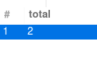

# SQL学习笔记

## 目录

- [SQL学习笔记](#sql学习笔记)
  - [目录](#目录)
  - [概念](#概念)
  - [数据类型和字段特殊标识](#数据类型和字段特殊标识)
  - [SQL语法](#sql语法)
    - [注释](#注释)
    - [数据库相关](#数据库相关)
    - [表相关](#表相关)
    - [SELECT 查询](#select-查询)
    - [INSERT 插入](#insert-插入)
    - [UPDATE 更新](#update-更新)
    - [DELETE 删除](#delete-删除)
    - [WHERE 子句](#where-子句)
    - [WHERE 子句 的 AND 和 OR](#where-子句-的-and-和-or)
    - [ORDER BY 子句 排序](#order-by-子句-排序)
    - [ORDER BY 子句 `多重排序`](#order-by-子句-多重排序)
    - [COUNT(\*)函数](#count函数)
    - [AS 为列设置列名](#as-为列设置列名)
  - [2022\_09\_22课堂笔记](#2022_09_22课堂笔记)
    - [基本概念](#基本概念)
    - [数据模型](#数据模型)
  - [2022\_10\_10课堂笔记](#2022_10_10课堂笔记)
    - [SQL](#sql)
    - [定义模式](#定义模式)
    - [创建表](#创建表)
    - [插入数据](#插入数据)
    - [修改表](#修改表)
  - [数据查询](#数据查询)
    - [where子句 between关键字](#where子句-between关键字)
    - [where子句 in关键字](#where子句-in关键字)
    - [where子句 字符串匹配](#where子句-字符串匹配)
    - [where子句 `is null` 空值查询](#where子句-is-null-空值查询)
    - [order by 子句](#order-by-子句)

## 概念

**常见数据库**

- `MySQL` 使用最广泛最流行的数据库,开源,分为社区版(免费)和企业版
  - `MySQL WorkBench`为其配套的连接和管理数据库的图像化界面
- `Oracle` 收费
- `SQL Server` 收费(由微软开发)
- `MongoDB` 分为社区版(免费)和企业版

**区分**

- 关系型数据库,SQL数据库
  - MySQL
  - Oracle
  - SQL Server
- 非关系型数据库,NoSQL数据库
  - MongoDB

**关系型数据库组织结构的组成**

- 数据库database : 一般每个项目都有一个单独的数据库
- 数据表table : 不同的数据存入不同的表 如:student表 class表
- 数据行row : 表中一行就是一条具体的数据
- 字段field : 决定能够存储数据的类型,数据的名称,如id name age

## 数据类型和字段特殊标识

**数据类型**

- INT 整数
- varchar(len) 长度不超过len的字符串
- TinyInt(1) 布尔值

**字段特殊标识**

- PK(Primary Key) 主键
- NN(Not NULL) 不允许为空
- UQ(Unique) 唯一
- B(Binary)
- UN(Unsigned) 无符号
- ZF(Zero Fill)
- G(Generated)
- AI(Auto Increment) 值自动增长
- default 默认值


**创建表**

```sql
CREATE TABLE `my_db_01`.`users` (
  `id` INT NOT NULL AUTO_INCREMENT COMMENT '主键',
  `username` VARCHAR(45) NOT NULL COMMENT '用户登陆名',
  `password` VARCHAR(45) NOT NULL COMMENT '用户登陆密码',
  `status` TINYINT(1) NOT NULL DEFAULT 0 COMMENT '0 用户状态正常\n1 用户被禁用',
  PRIMARY KEY (`id`),
  UNIQUE INDEX `id_UNIQUE` (`id` ASC) VISIBLE,
  UNIQUE INDEX `username_UNIQUE` (`username` ASC) VISIBLE);

```

**插入数据**

```sql
INSERT INTO `my_db_01`.`users` (`username`, `password`) VALUES ('DingYigui', '123');
```

## SQL语法

### 注释

```sql
-- 这是注释
```

### 数据库相关

```sql
-- 查看所有的数据
SHOW DATABASES; 

-- 创建数据库
CREATE DATABASE db_01;

-- 删除数据库
DROP DATABASE db_01;

-- 使用数据库
USE db_01;

```

### 表相关

```sql

-- 查看当前数据库中所有的表
SHOW TABLES;

-- 创建表
CREATE TABLE 表名称
(
列名称1     数据类型    约束规则,
列名称2     数据类型    约束规则,
列名称3     数据类型    约束规则,
)
--- 创建user表
CREATE TABLE users(
  id INT auto_increment PRIMARY KEY,
  name VARCHAR(255) NOT NULL,
  age INT ,
  gender VARCHAR(4),
  content VARCHAR(255)
);

-- 删除表
DROP TABLE users;
```

### SELECT 查询

```sql
-- SELECT语法格式
SELECT 列名 FROM 表名 ;

-- 选中该表的所有列
SELECT * FROM 表名 ;

-- 模糊查询 %表示通配 _ 表示单字符
SELECT * from user where name LIKE '丁%'

-- in语句
SELECT * from user where name in ('DYG', 'dyg')

-- limit分页
SELECT * from user ORDER BY id desc limit 3
SELECT * from user ORDER BY id desc limit 3,3


-- 选中表中的username,password
SELECT username,password FROM users ;
```

### INSERT 插入

```sql
--- 
-- INSERT语法格式
INSERT INTO 表名 (列名1,列名2,...) VALUES (列值1,列值2,...) ;
INSERT INTO 表名 SET 列名1 = 列值1 ,列名2 = 列值2 ,列名3 = 列值3 ;
INSERT INTO 表名 VALUES (列值1, 列值2, 列值3, 列值4, 列值5) --若省略列名则列值位置需一一对应

-- 插入一条数据
INSERT INTO users (username,password) VALUES ("DYG","321") ;
```

### UPDATE 更新

```sql
--- UPDATE语法格式
UPDATE 表名 SET 列名1 = 新的列值1  WHERE 列名 = 列值 ;
UPDATE 表名 SET 列名1 = 新的列值1 , 列名2 = 新的列值2  WHERE 列名 = 列值 ;

--- 将id为2的用户密码修改为222
UPDATE users SET password = 222 WHERE id = 2 ;
UPDATE users SET username = "admin" , password = "admin" WHERE id = 1 ;

--- 注意: 不加 WHERE 会修改所有用户的密码 
```

### DELETE 删除

```sql
---DELETE 语法
DELETE FROM 表名 --删除所有用户数据
DELETE FROM 表名 WHERE 列名 = 列值 ; --删除指定数据

--- 删除id为3的用户
DELETE FROM users WHERE id = 3 ;

--- 注意: 不加 WHERE 会删除所有用户 
```

### WHERE 子句

`WHERE` 子句用于**限定选择的标准**  

`WHERE` 子句在 `SELECT` `UPDATE` `DELETE` 中皆可使用

```sql
--- 查询语句中的WHERE
SELECT 列名 FROM 表名
    WHERE 列名 = 列值 ;

--- 更新语句中的WHERE
UPDATE 表名 SET 列名 = 新的列值
    WHERE 列名 = 列值 ;

--- 删除语句中的WHERE
DELETE FROM 表名
    WHERE 列名 = 列值 ;
```

**WHERE子句的运算符**  
|  操作符  |     描述     |
| :------: | :----------: |
|    =     |     等于     |
| <> 或 != |    不等于    |
|    >     |     大于     |
|    <     |     小于     |
|    >=    |   大于等于   |
|    <=    |   小于等于   |
| BETWEEN  | 在某个范围内 |
|   LIKE   | 搜索某种模式 |

```sql
--- 删除除admin以外的所有用户
DELETE FROM 表名
    WHERE username != "admin" ;
```

### WHERE 子句 的 AND 和 OR

```sql
--- AND 和 OR 的语法格式
SELECT 列名 FROM 表名
    WHERE 条件1 AND 条件2;

SELECT 列名 FROM 表名
    WHERE 条件1 OR 条件2;
```

### ORDER BY 子句 排序

```sql
--- ORDER BY语法格式;默认升序排序
SELECT 列名 FROM 表名
    ORDER BY 列名;

--- ORDER BY语法格式;ASC为升序排序
SELECT 列名 FROM 表名
    ORDER BY 列名 ASC;

--- ORDER BY语法格式;DESC为降序排序
SELECT 列名 FROM 表名
    ORDER BY 列名 DESC;
```

### ORDER BY 子句 `多重排序`

```sql
--- ORDER BY多重排序 语法格式:
SELECT 列名 FROM 表名
    ORDER BY 列名1 ASC,列名2 DESC; ---先按列名1升序排序 再按列名2降序排序
```

### COUNT(*)函数

返回`SELECT`查询结果的总条数

```sql
--- COUNT(*)语法
SELECT COUNT(*) FROM 表名;
```

**示例**

```sql
--- 示例: 统计users表中status为1的用户数
SELECT COUNT(*) FROM users
    WHERE status=1;
```

  

### AS 为列设置列名

```sql
--- AS语法
SELECT 旧列名1 AS 新列名1 , 旧列名2 AS 新列名2 FROM 表名;
SELECT COUNT(*) AS total FROM 表名;
```

**示例1**

```sql
-- 查询user表的id和username字段,并为user字段起别名uname,为id字段起别名uid
SELECT id AS uid , username AS uname FROM users;
```

  

**示例2**

```sql
-- 统计表中所有数据,并为字段取名为total
SELECT COUNT(*) as total FROM users;
```

  

## 2022_09_22课堂笔记

### 基本概念

- **四个概念**: DATA数据 DB数据库 DBS数据库系统 DBMS数据库管理系统
- **三个阶段**: 人工管理阶段 文件系统阶段 数据库系统届阶段
- **两个独立性**: 物理独立性 逻辑独立性
- **无法解决的问题**: 无法做到零冗余

### 数据模型

- **两类数据模型**: 概念模型 逻辑物理模型
- **常用概念模型**: 实体-联系模型(E-R模型)
  - E-R模型三要素: 实体(集) 属性 联系:[一对一(1:1) 一对多(1:n) 多对多(m:n)]
- **主要逻辑模型**
  - 层次模型
  - 网状模型
  - **关系模型**
- 面向对象模型

## 2022_10_10课堂笔记

### SQL

- 数据查询 SELECT
- 数据定义 CREATE DROP ALER
- 数据操作 INSERT UPDATE DELEE
- 数据控制 GRANT REVOKE

### 定义模式

```sql
create schema '模式名' authorization 用户名
```

### 创建表

```sql
create table 表名 (
  列名 数据类型 约束条件,
  列名 INT primary key,
  列名 CHAR(20) unique,
  列名 NUMERIC(10,3),
  列名 DECIMAL(5,2)
);
```

### 插入数据

```sql
insert into 表名(Sno,Sname,Ssex,Sdep,Sage) 
      values('20121521','张三'，'男'，'cs','20');
```

### 修改表

**删除列**

```sql
alter table 表名
    drop column 列名
```

**增加列**

```sql
alter table 表名
    add 列名 类型 数据约束
```

**修改列的数据类型**

```sql
alter table 表名
    alter 列名 类型 数据约束
```

**删除表**

```sql
drop table 表名 restrict;--有限制的删除表
drop table 表名 cascade;--无限制的删除表
```

## 数据查询

```sql
select [all|distinct] 目标列表达式 -- distinct用于去重
from 表名或视图名 
as 别名
where 条件表达式_
group by 列名_sex having 表达式
order by 列名_age asc｜desc ---desc降序

```

### where子句 between关键字

```sql
select * from student where Sage between 18 and 20; ---相当于 sage >= 18 && sage <= 20
```

### where子句 in关键字

```sql
select * from student where Sdep in("CS","MA","IS"); --- 相当于 sdep == CS ｜｜ sdep == MA ｜｜ sdep == IS
```

### where子句 字符串匹配

```sql
select * from student where Sname like "李_浩"; -- 匹配单个字符
select * from student where Sname like "李__"; --匹配两个单个单字符
select * from student where Sname like "李%"; --匹配0个或多个字符
```

### where子句 `is null` 空值查询

```sql
;
```

### order by 子句

- `asc`升序【默认】
- `desc`降序
- 对于空值，排序顺序由系统决定

```sql
select * from student order by Sage desc;
```
