# SSM 框架学习笔记


**什么是 SSM 框架**

SSM（Spring+SpringMVC+MyBatis）框架集由 Spring、MyBatis 两个开源框架整合而成（SpringMVC 是 Spring 中的部分内容），常作为数据源较简单的 web 项目的框架。

## 目录

- [SSM 框架学习笔记](#ssm-框架学习笔记)
  - [目录](#目录)
  - [主要内容](#主要内容)
    - [Spring](#spring)
- [Spring Framework](#spring-framework)
  - [基本概念、核心容器、依赖注入以及基于配置的开发](#基本概念核心容器依赖注入以及基于配置的开发)
    - [核心概念 IoC 和 DI](#核心概念-ioc-和-di)
      - [\_01\_IOC入门案例：测试 Spring 中的 IoC 容器](#_01_ioc入门案例测试-spring-中的-ioc-容器)
      - [\_02\_DI入门案例：测试 Spring 中的 DI 依赖注入](#_02_di入门案例测试-spring-中的-di-依赖注入)
      - [beans的配置](#beans的配置)
        - [beans的基本配置](#beans的基本配置)
        - [bean的别名配置](#bean的别名配置)
        - [单例实例化模式和原型实例化模式](#单例实例化模式和原型实例化模式)
    - [Bean的实例化过程](#bean的实例化过程)
      - [无参构造器创造Bean(常用)](#无参构造器创造bean常用)
      - [静态工厂模式(了解)](#静态工厂模式了解)
      - [实例工厂模式(了解)](#实例工厂模式了解)
      - [工厂Bean模式(实用)](#工厂bean模式实用)
    - [Bean生命周期](#bean生命周期)
      - [Bean在IOC容器初始化和销毁阶段的生命周期](#bean在ioc容器初始化和销毁阶段的生命周期)
      - [生命周期控制\_xml配置方式](#生命周期控制_xml配置方式)
      - [\_07\_Bean的生命周期控制\_实现Spring接口方式](#_07_bean的生命周期控制_实现spring接口方式)
    - [DI依赖注入](#di依赖注入)
      - [setter注入基本数据类型和引用数据类型](#setter注入基本数据类型和引用数据类型)
      - [contructor注入基本数据类型和引用数据类型](#contructor注入基本数据类型和引用数据类型)
      - [解决使用xml配置通过contructor注入基本数据类型和引用数据类型时高耦合的问题](#解决使用xml配置通过contructor注入基本数据类型和引用数据类型时高耦合的问题)
        - [标准写法](#标准写法)
        - [通过形参顺序赋值写法](#通过形参顺序赋值写法)
        - [通过形参类型赋值写法](#通过形参类型赋值写法)
      - [依赖注入方式的选择](#依赖注入方式的选择)
      - [自动依赖注入/自动装配](#自动依赖注入自动装配)
      - [DI集合的注入](#di集合的注入)
      - [案例\_对Druid数据源对象进行依赖注入](#案例_对druid数据源对象进行依赖注入)
      - [加载properties配置文件](#加载properties配置文件)
    - [核心容器](#核心容器)
      - [创建容器](#创建容器)
      - [获取Bean](#获取bean)
      - [BeanFactory和ApplicationContext的关系和区别](#beanfactory和applicationcontext的关系和区别)
        - [BeanFactory的懒惰加载](#beanfactory的懒惰加载)
        - [ApplicationContext的立即加载](#applicationcontext的立即加载)
        - [ApplicationContext的懒惰加载](#applicationcontext的懒惰加载)
    - [核心容器、Bean、依赖注入相关总结](#核心容器bean依赖注入相关总结)
  - [基于注解的开发](#基于注解的开发)
    - [注解开发定义Bean](#注解开发定义bean)
    - [纯注解开发:用java类代替xml配置文件](#纯注解开发用java类代替xml配置文件)
    - [注解开发Bean的实例化模式和声明周期控制](#注解开发bean的实例化模式和声明周期控制)
    - [注解开发Bean的依赖注入](#注解开发bean的依赖注入)
      - [引用数据类型的依赖注入](#引用数据类型的依赖注入)
      - [基本数据类型的依赖注入以及加载外部配置文件](#基本数据类型的依赖注入以及加载外部配置文件)
    - [用注解管理配置第三方库类](#用注解管理配置第三方库类)
      - [基本写法](#基本写法)
      - [抽取配置到单独的配置类，然后导入到spring配置类](#抽取配置到单独的配置类然后导入到spring配置类)
    - [对第三方库进行依赖注入](#对第三方库进行依赖注入)
    - [xml配置和注解开发的对比](#xml配置和注解开发的对比)
  - [Spring结合myBatis](#spring结合mybatis)
    - [myBatis复习](#mybatis复习)
    - [Spring结合mybatis的使用](#spring结合mybatis的使用)
  - [Spring结合JUnit](#spring结合junit)
  - [Spring的AOP 面向切面编程](#spring的aop-面向切面编程)
    - [SpringAOP入门案例](#springaop入门案例)
    - [SpringAOP执行流程](#springaop执行流程)
    - [AOP切入点表达式](#aop切入点表达式)
  - [Spring事务](#spring事务)
    - [事务管理案例：银行转账](#事务管理案例银行转账)
    - [Spring事务角色](#spring事务角色)
    - [spring的事务控制](#spring的事务控制)
    - [rollbackFor属性](#rollbackfor属性)
    - [propagation传播属性](#propagation传播属性)
  - [SpringMVC](#springmvc)
    - [入门案例](#入门案例)
    - [入门案例：执行流程](#入门案例执行流程)
    - [注意：SpringMVC只管理表现层Bean，Spring只管理业务层Bean和数据访问层Bean](#注意springmvc只管理表现层beanspring只管理业务层bean和数据访问层bean)
    - [进一步简化的ServeletContainerInitConfig写法](#进一步简化的serveletcontainerinitconfig写法)
    - [请求](#请求)
      - [请求映射路径](#请求映射路径)
      - [POST和Get请求](#post和get请求)
      - [POST请求参数中文乱码的解决](#post请求参数中文乱码的解决)
      - [请求参数和函数形式参数不一致的解决](#请求参数和函数形式参数不一致的解决)
      - [五种类型参数的传递](#五种类型参数的传递)
        - [普通参数](#普通参数)
        - [实体类属性自动装配](#实体类属性自动装配)
        - [嵌套实体类属性的自动装配](#嵌套实体类属性的自动装配)
        - [数组类型传参](#数组类型传参)
        - [集合类型的传参](#集合类型的传参)
      - [JSON数据的传递](#json数据的传递)
        - [基础配置](#基础配置)
      - [@RequestBody和@RequestParam的区别](#requestbody和requestparam的区别)
      - [不同格式的日期参数的接收](#不同格式的日期参数的接收)
    - [响应](#响应)
      - [响应页面](#响应页面)
      - [响应数据](#响应数据)
      - [响应JSON格式的对象数据](#响应json格式的对象数据)
      - [响应JSON格式的集合数据](#响应json格式的集合数据)
      - [`@ResponseBody`注解转换JSON格式的过程](#responsebody注解转换json格式的过程)
    - [REST风格](#rest风格)
      - [Restful入门案例](#restful入门案例)
      - [Restful入门案例的简化](#restful入门案例的简化)
    - [设置对静态资源的访问放行](#设置对静态资源的访问放行)
  - [SSM整合总结](#ssm整合总结)
    - [Spring整合MyBatis](#spring整合mybatis)
    - [Spring整合SpringMVC](#spring整合springmvc)
    - [表现层返回格式的统一](#表现层返回格式的统一)
    - [SSM综合案例实现和测试](#ssm综合案例实现和测试)
    - [SSM异常处理器](#ssm异常处理器)
    - [异常的分类和处理](#异常的分类和处理)
      - [自定义异常](#自定义异常)
      - [异常的编码](#异常的编码)
      - [异常的抛出](#异常的抛出)
      - [异常的分类处理](#异常的分类处理)
    - [静态资源访问放行](#静态资源访问放行)
    - [前端发送请求和处理响应数据](#前端发送请求和处理响应数据)
    - [SpringMVC拦截器](#springmvc拦截器)
      - [概念](#概念)
      - [入门案例](#入门案例-1)
      - [单拦截器执行流程](#单拦截器执行流程)
      - [拦截器的形式参数](#拦截器的形式参数)
      - [多拦截器简单案例](#多拦截器简单案例)
      - [多拦截器\_拦截器链的执行顺序](#多拦截器_拦截器链的执行顺序)
  - [Maven进阶](#maven进阶)
    - [分模块开发](#分模块开发)
    - [分模块或模块拆分的步骤](#分模块或模块拆分的步骤)
    - [依赖传递](#依赖传递)
    - [聚合](#聚合)
    - [继承](#继承)
    - [聚合与继承](#聚合与继承)
    - [属性](#属性)
    - [资源文件引用](#资源文件引用)
    - [坐标命名规范](#坐标命名规范)
    - [多环境开发](#多环境开发)
    - [跳过测试](#跳过测试)
    - [私有仓库服务器](#私有仓库服务器)
  - [SpringBoot](#springboot)
    - [quickstart入门案例](#quickstart入门案例)
    - [简介](#简介)
    - [替换Tomcat服务器为jetty](#替换tomcat服务器为jetty)
    - [端口配置](#端口配置)
    - [yaml](#yaml)
      - [基本写法](#基本写法-1)
    - [基础配置](#基础配置-1)
      - [数据读取](#数据读取)
      - [多环境配置写法](#多环境配置写法)
      - [Maven和SpringBoot配置兼容设置](#maven和springboot配置兼容设置)
      - [config目录下的配置优先级更高](#config目录下的配置优先级更高)
    - [springboot整合junit](#springboot整合junit)
    - [SpringBoot 整合Mybatis](#springboot-整合mybatis)
  - [myBatisPlus](#mybatisplus)
    - [概述](#概述)
    - [入门案例](#入门案例-2)
    - [特性](#特性)
    - [标准CURD](#标准curd)
    - [lombok](#lombok)
    - [分页功能](#分页功能)
    - [DQL编程控制](#dql编程控制)
      - [条件查询](#条件查询)
      - [非空判断](#非空判断)
      - [投影查询](#投影查询)
      - [条件查询](#条件查询-1)
    - [`字段<->表名`映射](#字段-表名映射)
      - [问题1:表字段与java对象属性不同名](#问题1表字段与java对象属性不同名)
      - [问题2：java对象中存在一个属性但其在表中不存在](#问题2java对象中存在一个属性但其在表中不存在)
      - [问题3：select \* 会查询出敏感字段](#问题3select--会查询出敏感字段)
      - [问题4：表名和java类名不一致](#问题4表名和java类名不一致)
    - [主键生成策略](#主键生成策略)
    - [DML编程控制](#dml编程控制)
      - [多记录操作](#多记录操作)
    - [逻辑删除](#逻辑删除)
    - [乐观锁](#乐观锁)
  - [代码生成器](#代码生成器)

## 主要内容

**笔记主要内容**

- Spring
  - Spring MVC
- Maven 高级
- SpringBoot
- MyBatisPlus

**学习必要性**

- 市场占有率高
  - 是微服务架构的基础
  - 是传统开发主流应用技术
  - Spring 的企业开发技术选型命中率达 90%
- 非常重要
- 是 Java 开发者写程序必备技能

### Spring

**Spring 优势**

- 简化开发，降低企业级开发复杂性
- 框架整合，高效整合其他技术

**学什么**

- 简化开发
  - IoC
  - AoP
    - 事务处理
- 框架整合
  - MyBatis、MyBatis-Plus
  - Struts、Struts2
  - Hibernate

**怎么学**

- 学 Spring 框架设计思想
- 学基础操作使用，思考基础操作使用和框架设计思想的联系
- 学习若干案例，练习敲代码，提高熟练度，体会框架设计思想

**Spring 是一套技术**


**Spring 发展史**

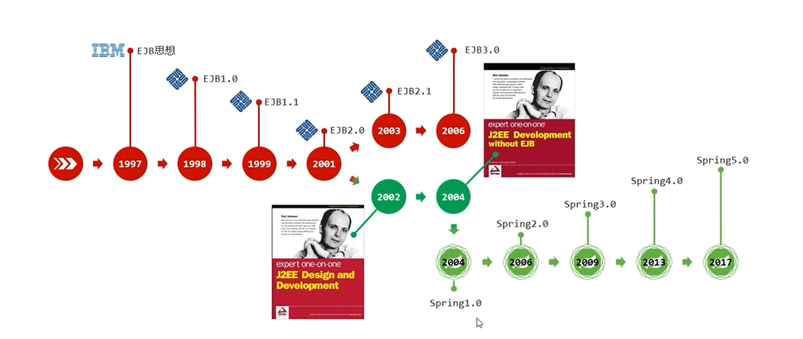

# Spring Framework

Spring Framework 是 Spring 生态圈中最基础的项目，是其他项目的根基

**Sping FrameWork 架构图**

- spring5 的架构图官网未提供，应该基本和 4 一致

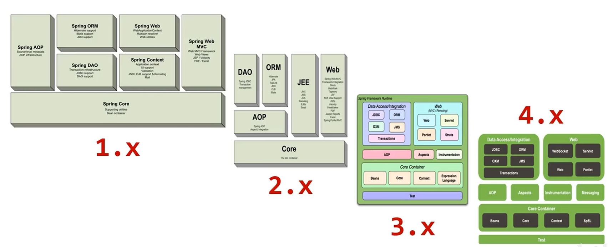


**学习顺序**


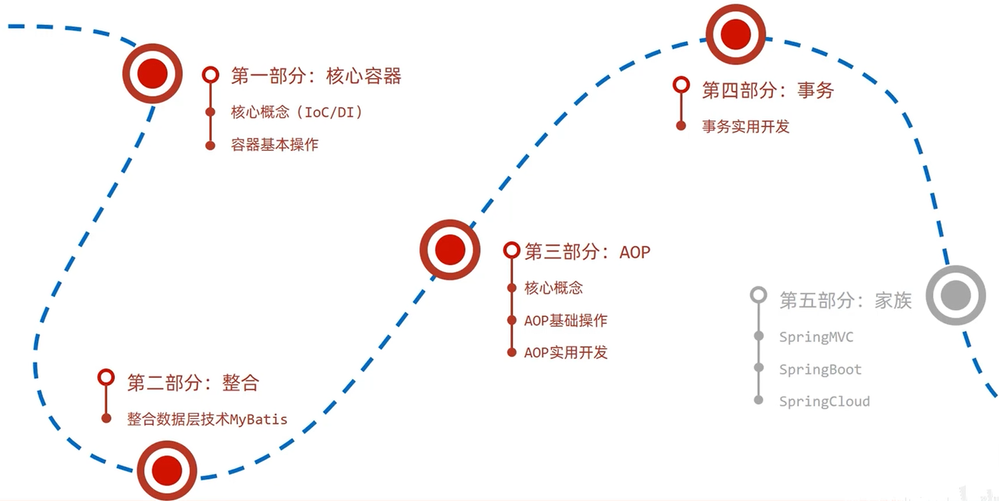

## 基本概念、核心容器、依赖注入以及基于配置的开发

### 核心概念 IoC 和 DI

**IoC：思想**

- IoC（Inversion of Control）控制反转
- 就是对象的创建的控制权转移到程序的外部

**IOC：要解决的问题**

- 当数据层实现代码要修改时，业务层的代码也需要修改
- 这就导致了业务层的实现代码也需要修改
- 这就导致、重新编译、重新测试、重新发布...
- 原因就是耦合度太高。
- 

**IOC：如何解决问题**

- 使用对象时，不要在程序中主动的使用 new 创建对象
- 而是由外部提供对象

**IoC：Spring 中对 IoC 思想的实现**

- Spring 对 IoC 思想进行了实现
- Spring 提供了 Core Container 核心容器，称为 IoC 容器
- IoC 容器可以负责一切对象的创建初始化的工作，被创建和管理的对象称为 Bean
- 
- **DI（Dependency Injection）：依赖注入**
  - 在 IoC 容器中建立 Bean 与 Bean 之间依赖关系的过程称为依赖注入
  - 

#### _01_IOC入门案例：测试 Spring 中的 IoC 容器

`src\main\java\com\example\App2WithSpring.java`

```java
package com.example;

import org.springframework.context.ApplicationContext;
import org.springframework.context.support.ClassPathXmlApplicationContext;

import com.example.dao.BookDao;
import com.example.service.Service;

public class App2WithSpring {
    public static void main(String[] args) {
        // 第一步，把spring-context包写入 pom.xml
        // 第二步，编写"applicationContext.xml" 容器配置文件
        // 第三步，使用 ClassPathXmlApplicationContext 实例化IOC容器
        ApplicationContext ctx = new ClassPathXmlApplicationContext("applicationContext.xml");
        // 第四步，从容器根据Bean Id获取实例对象
        BookDao bookDao = (BookDao) ctx.getBean("myBookDao_id1");
        Service service = (Service) ctx.getBean("myService_id2");
        bookDao.save();// 输出一行
        service.save();// 输出两行
    }
}
```

`src/main/resources/applicationContext.xml`

```xml
<?xml version="1.0" encoding="UTF-8"?>
<beans xmlns="http://www.springframework.org/schema/beans"
    xmlns:xsi="http://www.w3.org/2001/XMLSchema-instance"
    xsi:schemaLocation="http://www.springframework.org/schema/beans http://www.springframework.org/schema/beans/spring-beans.xsd"
>
    <!-- id指定实例化后的对象名，class指定被实例化的类所在位置（包名） -->
    <bean id="myBookDao_id1" class="com.example.dao.impl.BookDaoImpl"/>
    <bean id="myService_id2" class="com.example.service.impl.ServiceImp"/>
</beans>
```

**关于xml文件的一些知识**
> 如果本着拿来主义的精神,这些知识不必了解，网上百度然后copy一份xml文件即可，
>
> 这里主要是因为不太明白，所以记录一下

```xml
<!-- 第一行是xml文档声明 -->
<?xml version="1.0" encoding="UTF-8"?>
```

```xml
<beans xmlns="http://www.springframework.org/schema/beans">
<!-- 
    **命名空间:**
    xmlns:前缀="命名空间名【不必是URL】" 当前标签及其子标签都要用前缀开头,格式：<前缀:标签名></前缀:标签名>
    xmlns="默认命名空间名【不必是URL】" 不用写前缀
    
    示例1：
        <h:table xmlns:h="http://www.w3.org/TR/html4/">
           <h:tr>
           <h:td>Apples</h:td>
           <h:td>Bananas</h:td>
           </h:tr>
        </h:table>

    示例2：
        <tttt:table xmlns:tttt="http://www.w3.org/TR/html4/tttt">
           <tttt:tr>
           <tttt:td>Apples</tttt:td>
           <tttt:td>Bananas</tttt:td>
           </tttt:tr>
        </tttt:table>
-->
```

```xml

<beans xmlns:xsi="http://www.w3.org/2001/XMLSchema-instance">
<!-- 
    xsi 意思是 xml schema instance
    这本质就是声明一个名为 xsi 的命名空间，其值为一个标准的命名空间
    xsi 已经成为了一个业界默认的用于 XSD(（XML Schema Definition) 文件的命名空间。 
    而 XSD 文件（也常常称为 Schema 文件）是用来定义 xml 文档结构的。
     XML 解析器可以根据 一个 XSD 文件的内容来解析另一个 XML 文件， 
     判断该文件的结构是否和 XSD 文件中定义的一致。 XSD 文件 可以理解为 XML 文档可以自定义的语法或格式检查器。
-->
```

```xml
<beans xsi:schemaLocation="
                          http://www.springframework.org/schema/beans 
                          http://www.springframework.org/schema/beans/spring-beans.xsd">

<!-- 
  xsi:schemaLocation = "键" “值” 
  此为 xsi 命名空间中定义的一个属性，用于通知 xml 处理器 xml 文档与 xsd 文件的关联关系。
  “键” 是命名空间 值
  “值” 指向了一个XSD文件，可以是URL也可以是一个相对路径，必须是可访问的 用于校验xml格式合法性
-->
```

`src\main\java\com\example\dao\impl\BookDaoImpl.java`

```java
package com.example.dao.impl;

import com.example.dao.BookDao;

public class BookDaoImpl implements BookDao {

    @Override
    public void save() {
        System.out.println("BookDaoImpl: saving book...");
    }
}
```

`src\main\java\com\example\service\impl\ServiceImp.java`

```java
package com.example.service.impl;

import com.example.dao.BookDao;
import com.example.dao.impl.BookDaoImpl;
import com.example.service.Service;

public class ServiceImp implements Service {
    BookDao bookDao = new BookDaoImpl();

    @Override
    public void save() {
        System.out.println("ServiceImp: saving book...");
        bookDao.save();
    }
}
```

#### _02_DI入门案例：测试 Spring 中的 DI 依赖注入

```java
package com.example;

import org.springframework.context.ApplicationContext;
import org.springframework.context.support.ClassPathXmlApplicationContext;

import com.example.service.Service;

public class App2WithSpring {
    public static void main(String[] args) {
        // 依赖注入：
        // 第一步 修改将被依赖注入的类，让其不要自己创建所要依赖的对象
        // 第二步 为其编写setBookDan() 方法，使外部创建的对象可以通过这个方法注入进去
        // 第三步 修改applicationcontext.xml文件，指定两对象的依赖关系
        ApplicationContext ctx = new ClassPathXmlApplicationContext("applicationContext.xml");
        Service service = (Service) ctx.getBean("myService_id2");
        service.save();// 输出两行
    }
}
```

```java
package com.example.service.impl;

import com.example.dao.BookDao;
import com.example.dao.impl.BookDaoImpl;
import com.example.service.Service;

public class ServiceImp implements Service {
    BookDao bookDao;// 注释掉 = new BookDaoImpl();
    @Override
    public void save() {
        System.out.println("ServiceImp: saving book...");
        bookDao.save();
    }
    public void setBookDao(BookDao bookDao) {
        this.bookDao = bookDao;
    }
}
```

```xml
<?xml version="1.0" encoding="UTF-8"?>

<beans xmlns="http://www.springframework.org/schema/beans"
    xmlns:xsi="http://www.w3.org/2001/XMLSchema-instance"
    xsi:schemaLocation="http://www.springframework.org/schema/beans spring-beans.xsd"
>
    <!-- id指定实例化后的对象名，class指定被实例化的类所在位置（包名） -->
    <bean id="myBookDao_id1" class="com.example.dao.impl.BookDaoImpl" />
    <bean id="myService_id2" class="com.example.service.impl.ServiceImp">
        <!-- property表示要对myService_id2进行依赖注入 -->
        <!-- name 是被注入到的属性名 -->
        <!-- ref表示被注入的对象名 -->
        <property name="bookDao" ref="myBookDao_id1"></property>

    </bean>
</beans>
```

#### beans的配置

##### beans的基本配置


```xml
<?xml version="1.0" encoding="UTF-8"?>

<beans xmlns="http://www.springframework.org/schema/beans"
    xmlns:xsi="http://www.w3.org/2001/XMLSchema-instance"
    xsi:schemaLocation="http://www.springframework.org/schema/beans spring-beans.xsd"
>
    <!-- id指定实例化后的对象名，name指定别名，可用逗号分号空格分割多个别名 class指定被实例化的类所在位置（包名） -->
    <bean id="myBookDao_id1" name="service,serviceBook;Bookservice serviceDao" class="com.example.dao.impl.BookDaoImpl" />
    <bean id="myService_id2" class="com.example.service.impl.ServiceImp">
        <!-- property表示要对myService_id2进行依赖注入 -->
        <!-- name 是被注入到的属性名 -->
        <!-- ref表示被注入的对象名 -->
        <property name="bookDao" ref="myBookDao_id1"></property>

    </bean>
</beans>
```

##### bean的别名配置


```xml
<?xml version="1.0" encoding="UTF-8"?>

<beans xmlns="http://www.springframework.org/schema/beans"
    xmlns:xsi="http://www.w3.org/2001/XMLSchema-instance"
    xsi:schemaLocation="http://www.springframework.org/schema/beans spring-beans.xsd"
>
    <!-- bean的name用于指定别名 -->
    <bean id="myBookDao_id1" name="book_alies1 book_alies2,book_alies3;book_alies4" class="com.example.dao.impl.BookDaoImpl" />
    <bean id="myService_id2" name="server_alies1 server_alies2,server_alies3;server_alies4" class="com.example.service.impl.ServiceImp">
        <!-- 在ref处可以使用这个别名 -->
        <property name="bookDao" ref="book_alies4"></property>
    </bean>
</beans>
```

```java
package com.example;

import org.springframework.context.ApplicationContext;
import org.springframework.context.support.ClassPathXmlApplicationContext;

import com.example.service.Service;

public class App {
    public static void main(String[] args) {
        ApplicationContext ctx = new ClassPathXmlApplicationContext("applicationContext.xml");
        Service service1 = (Service) ctx.getBean("server_alies1");
        Service service2 = (Service) ctx.getBean("server_alies2");
        Service service3 = (Service) ctx.getBean("server_alies3");
        Service service4 = (Service) ctx.getBean("server_alies4");
        System.out.println(service1);// 地址相同
        System.out.println(service2);// 地址相同
        System.out.println(service3);// 地址相同
        System.out.println(service4);// 地址相同
        service4.save();// 输出两行
    }
}
```

##### 单例实例化模式和原型实例化模式


```java
package com.example;

import org.springframework.context.ApplicationContext;
import org.springframework.context.support.ClassPathXmlApplicationContext;

import com.example.service.impl.ServiceImp;

public class App {
    public static void main(String[] args) {
        ApplicationContext ctx = new ClassPathXmlApplicationContext("applicationContext.xml");
        ServiceImp service1 = (ServiceImp) ctx.getBean("myService_id2");
        ServiceImp service2 = (ServiceImp) ctx.getBean("myService_id2");
        ServiceImp service3 = (ServiceImp) ctx.getBean("myService_id2");
        ServiceImp service4 = (ServiceImp) ctx.getBean("myService_id2");
        System.out.println(service1);// 地址不相同,因为scope="prototype"
        System.out.println(service2);// 地址不相同,因为scope="prototype"
        System.out.println(service3);// 地址不相同,因为scope="prototype"
        System.out.println(service4);// 地址不相同,因为scope="prototype"
        System.out.println(service1.getBookDao());// 地址相同,因为scope="singleton"
        System.out.println(service2.getBookDao());// 地址相同,因为scope="singleton"
        System.out.println(service3.getBookDao());// 地址相同,因为scope="singleton"
        System.out.println(service4.getBookDao());// 地址相同,因为scope="singleton"
        service4.save();// 输出两行
    }
}
```

```xml
<?xml version="1.0" encoding="UTF-8"?>

<beans xmlns="http://www.springframework.org/schema/beans"
    xmlns:xsi="http://www.w3.org/2001/XMLSchema-instance"
    xsi:schemaLocation="http://www.springframework.org/schema/beans spring-beans.xsd"
>
    <!-- scope="singleton"实例化为单例模式 -->
    <bean 
        id="myBookDao_id1" 
        name="book_alies1 book_alies2,book_alies3;book_alies4" 
        class="com.example.dao.impl.BookDaoImpl"  
        scope="singleton"
    />
    <!-- scope="singleton"实例化为原型模式 -->
    <bean 
        id="myService_id2" 
        name="server_alies1 server_alies2,server_alies3;server_alies4" 
        class="com.example.service.impl.ServiceImp" 
        scope="prototype" 
    >
        <property name="bookDao" ref="book_alies4" ></property>
    </bean>
</beans>
```

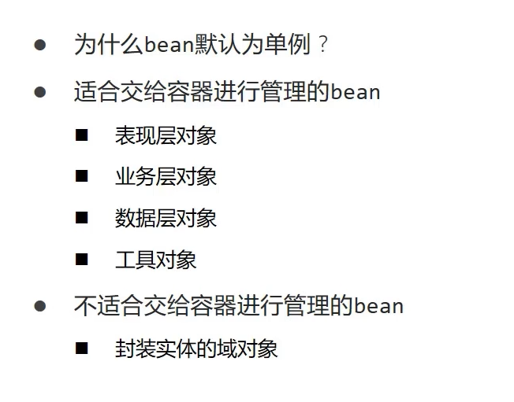

### Bean的实例化过程

#### 无参构造器创造Bean(常用)


```java
package com.example;

import org.springframework.context.ApplicationContext;
import org.springframework.context.support.ClassPathXmlApplicationContext;

import com.example.service.Service;

public class App {
    public static void main(String[] args) {
        ApplicationContext ctx = new ClassPathXmlApplicationContext("applicationContext.xml");
        Service service1 = (Service) ctx.getBean("myService_id2");
        service1.save();
        // 输出四行:
        /*
         * BookDaoImpl的私有无参构造器被调用......
         * ServiceImp的私有无参构造器被调用......
         * ServiceImp: saving book...
         * BookDaoImpl: saving book...
         * 
         */
    }
}
```

#### 静态工厂模式(了解)


```java
package com.example;

import org.springframework.context.ApplicationContext;
import org.springframework.context.support.ClassPathXmlApplicationContext;

import com.example.service.Service;

public class App {
    public static void main(String[] args) {
        ApplicationContext ctx = new ClassPathXmlApplicationContext("applicationContext.xml");
        Service service1 = (Service) ctx.getBean("myService_id2");
        service1.save();
        // 输出五行:
        /*
         * BookDaoFactory的getBookDao方法被调用......
         * BookDaoImpl的无参构造器被调用......
         * ServiceImp的无参构造器被调用......
         * ServiceImp: saving book...
         * BookDaoImpl: saving book...
         * 
         */
    }
}
```

**静态工厂**

```java
package com.example.factory;

import com.example.dao.BookDao;
import com.example.dao.impl.BookDaoImpl;

public class BookDaoFactory {
    static BookDao getBookDao(){
        System.out.println("BookDaoFactory的getBookDao方法被调用......");
        return new BookDaoImpl();
    }
}

```

```java
package com.example.dao.impl;

import com.example.dao.BookDao;

public class BookDaoImpl implements BookDao {
    public BookDaoImpl(){
        System.out.println("BookDaoImpl的无参构造器被调用......");
    }
    @Override
    public void save() {
        System.out.println("BookDaoImpl: saving book...");
    }
}

```

`applicationContext.xml`

```xml
<?xml version="1.0" encoding="UTF-8"?>

<beans xmlns="http://www.springframework.org/schema/beans"
    xmlns:xsi="http://www.w3.org/2001/XMLSchema-instance"
    xsi:schemaLocation="http://www.springframework.org/schema/beans spring-beans.xsd"
>
    <!--  使用静态工厂实例化Bean，class填静态工厂的类名，factory-method填静态方法名 -->
    <bean id="myBookDao_id1" class="com.example.factory.BookDaoFactory" factory-method="getBookDao" />
    <bean id="myService_id2" class="com.example.service.impl.ServiceImp">
        <property name="bookDao" ref="myBookDao_id1"></property>
    </bean>
</beans>
```

#### 实例工厂模式(了解)


```java
package com.example;

import org.springframework.context.ApplicationContext;
import org.springframework.context.support.ClassPathXmlApplicationContext;

import com.example.service.Service;

public class App {
    public static void main(String[] args) {
        ApplicationContext ctx = new ClassPathXmlApplicationContext("applicationContext.xml");
        Service service1 = (Service) ctx.getBean("myService_id2");
        service1.save();
        // 输出6行:
        /*
         * BookDaoFactory被实例化了......
         * BookDaoFactory的getBookDao方法被调用......
         * BookDaoImpl的无参构造器被调用......
         * ServiceImp的无参构造器被调用......
         * ServiceImp: saving book...
         * BookDaoImpl: saving book...
         * 
         */
    }
}
```

```xml
<?xml version="1.0" encoding="UTF-8"?>

<beans xmlns="http://www.springframework.org/schema/beans"
    xmlns:xsi="http://www.w3.org/2001/XMLSchema-instance"
    xsi:schemaLocation="http://www.springframework.org/schema/beans spring-beans.xsd"
>
    <!--  使用实例化工厂实例化Bean，现要实例化这个工厂 -->
    <bean id="myBookDaoFactory_id0" class="com.example.factory.BookDaoFactory"></bean>

    <!-- 实例化工厂工厂来实例化BookDao，factory-bean填这个工厂实例 factory-method填创建BookDao实例的方法  -->
    <bean id="myBookDao_id1" factory-bean="myBookDaoFactory_id0" factory-method="getBookDao" />
    <bean id="myService_id2" class="com.example.service.impl.ServiceImp">
        <property name="bookDao" ref="myBookDao_id1"></property>
    </bean>
</beans>
```

```java
package com.example.factory;

import com.example.dao.BookDao;
import com.example.dao.impl.BookDaoImpl;

public class BookDaoFactory {
    BookDaoFactory() {
        System.out.println("BookDaoFactory被实例化了......");
    }

    BookDao getBookDao() {
        System.out.println("BookDaoFactory的getBookDao方法被调用......");
        return new BookDaoImpl();
    }
}
```

实例化工厂模式的弊端：

- 实例化工厂类实际上是被实例化对象的附属品，每次都要写
- 实例化方法的方法名没有标准化

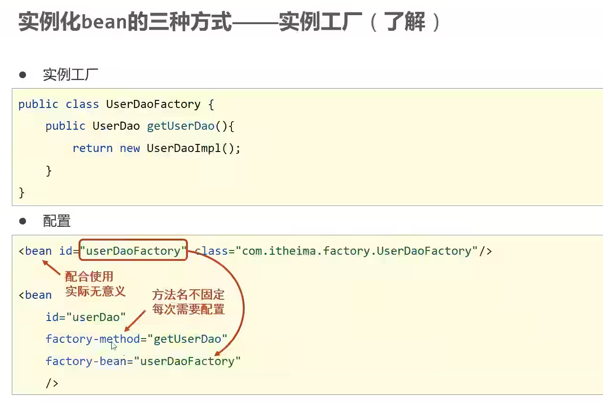

#### 工厂Bean模式(实用)


```java
package com.example;

import org.springframework.context.ApplicationContext;
import org.springframework.context.support.ClassPathXmlApplicationContext;

import com.example.service.Service;

public class App {
    public static void main(String[] args) {
        ApplicationContext ctx = new ClassPathXmlApplicationContext("applicationContext.xml");
        Service service1 = (Service) ctx.getBean("myService_id2");
        service1.save();
        // 输出6行:
        /*
         * BookDaoFactoryBean的无参构造器被调用了......
         * ServiceImp的无参构造器被调用......
         * BookDaoFactoryBean 的 getObject方法被调用......
         * BookDaoImpl的无参构造器被调用......
         * ServiceImp: saving book...
         * BookDaoImpl: saving book...
         * 
         */
    }
}
```

`BookDaoFactoryBean.java`

```java
package com.example.factory;

import org.springframework.beans.factory.FactoryBean;
import org.springframework.lang.Nullable;

import com.example.dao.BookDao;
import com.example.dao.impl.BookDaoImpl;

// 注意这里实现的接口是FactoryBean<BookDao>
public class BookDaoFactoryBean implements FactoryBean<BookDao> {
    BookDaoFactoryBean() {
        System.out.println("BookDaoFactoryBean的无参构造器被调用了......");
    }

    @Override
    @Nullable
    public BookDao getObject() throws Exception {
        System.out.println("BookDaoFactoryBean 的 getObject方法被调用......");
        return new BookDaoImpl();
    }

    @Override
    @Nullable
    public Class<?> getObjectType() {
        return BookDao.class;// 这里写的是接口类
    }
}
```

`applicationContext.xml`

```xml
<?xml version="1.0" encoding="UTF-8"?>

<beans xmlns="http://www.springframework.org/schema/beans"
    xmlns:xsi="http://www.w3.org/2001/XMLSchema-instance"
    xsi:schemaLocation="http://www.springframework.org/schema/beans spring-beans.xsd"
>
    <!-- 使用FacotryBean来实例化BookDao class填这个Bean工厂即可  -->
    <bean id="myBookDao_id1" class="com.example.factory.BookDaoFactoryBean" />
    <bean id="myService_id2" class="com.example.service.impl.ServiceImp">
        <property name="bookDao" ref="myBookDao_id1"></property>
    </bean>
</beans>
```

### Bean生命周期

#### Bean在IOC容器初始化和销毁阶段的生命周期

- 生命周期:从创建到消亡的完整过程
- bean生命周期: bean从创建到销毁的整体过程
- bean生命周期控制︰在bean创建后到销毁前做一些事情

**IOC容器初始化**

- `new ClassPathXmlApplicationContext("applicationContext.xml")`
- 实例化对象(内存分配)
- 执行构造方法(contructor)
- 执行属性注入( set操作)
- 执行bean初始化方法使用bean(init-method afterPropertiesSetHook)

**使用Bean**

- `ctx.getBean("myService_id2")`
- 执行业务操作

**关闭销毁IOC容器**

- `ctx.close()`
- 执行bean销毁方法(destroy-method destroyHook)

#### 生命周期控制_xml配置方式

```java
package com.example;

import org.springframework.context.ConfigurableApplicationContext;
import org.springframework.context.support.ClassPathXmlApplicationContext;

import com.example.service.Service;

public class App {
    public static void main(String[] args) {
        // 从 ConfigurableApplicationContext 才开始有close方法； ApplicationContext没有close方法
        ConfigurableApplicationContext ctx = new ClassPathXmlApplicationContext("applicationContext.xml");
        Service service1 = (Service) ctx.getBean("myService_id2");
        service1.save();
        // 输出8行:
        /*
         * BookDaoImpl的私有无参构造器被调用......
         * BookDaoImpl的实例对象: com.example.dao.impl.BookDaoImpl@1810399e.init()被调用......
         * BookDaoImpl的实例对象: com.example.dao.impl.BookDaoImpl@1810399e即将被初始化....
         * ServiceImp的私有无参构造器被调用......
         * ServiceImp: saving book...
         * BookDaoImpl: saving book...
         * BookDaoImpl的实例对象:
         * com.example.dao.impl.BookDaoImpl@1810399e.destory()被调用......
         * BookDaoImpl的实例对象: com.example.dao.impl.BookDaoImpl@1810399e即将被销毁....
         * 
         */
        // 关闭容器才会执行bean的销毁操作
        ctx.registerShutdownHook();// 注册钩子，在java虚拟机关闭前执行关闭容器的操作，可以写在任意位置
        // ctx.close();// 直接关闭容器，一般写在最后
    }
}
```

```xml
<?xml version="1.0" encoding="UTF-8"?>

<beans xmlns="http://www.springframework.org/schema/beans"
    xmlns:xsi="http://www.w3.org/2001/XMLSchema-instance"
    xsi:schemaLocation="http://www.springframework.org/schema/beans spring-beans.xsd"
>
    <!--init-method填初始化方法名，可以理解为afterCreateHook  -->
    <!--destroy-method填销毁方法名，可以理解为beforeDestoryHook  -->
    <bean id="myBookDao_id1" class="com.example.dao.impl.BookDaoImpl" init-method="init"
        destroy-method="destory" />
    <bean id="myService_id2" class="com.example.service.impl.ServiceImp">
        <property name="bookDao" ref="myBookDao_id1"></property>
    </bean>
</beans>
```

```java
package com.example.dao.impl;

import com.example.dao.BookDao;

public class BookDaoImpl implements BookDao {
    private BookDaoImpl() {
        System.out.println("BookDaoImpl的私有无参构造器被调用......");
    }

    @Override
    public void save() {
        System.out.println("BookDaoImpl: saving book...");
    }

    void init() {
        System.out.println("BookDaoImpl的实例对象: " + this + ".init()被调用......");
        System.out.println("BookDaoImpl的实例对象: " + this + "即将被初始化....");
    }

    void destory() {
        System.out.println("BookDaoImpl的实例对象: " + this + ".destory()被调用......");
        System.out.println("BookDaoImpl的实例对象: " + this + "即将被销毁....");
    }
}
```

#### _07_Bean的生命周期控制_实现Spring接口方式

```java
package com.example;

import org.springframework.context.ConfigurableApplicationContext;
import org.springframework.context.support.ClassPathXmlApplicationContext;

import com.example.service.Service;

public class App {
    public static void main(String[] args) {
        // 从 ConfigurableApplicationContext 才开始有close方法； ApplicationContext没有close方法
        ConfigurableApplicationContext ctx = new ClassPathXmlApplicationContext("applicationContext.xml");
        Service service1 = (Service) ctx.getBean("myService_id2");
        service1.save();
        // 输出9行:
        /*
         * BookDaoImpl的私有无参构造器被调用......
         * ServiceImp的私有无参构造器被调用......
         * setBookDao()被调用......
         * BookDaoImpl的实例对象:
         * com.example.service.impl.ServiceImp@39c0f4a.afterPropertiesSet()被调用......
         * BookDaoImpl的实例对象: com.example.service.impl.ServiceImp@39c0f4a即将被初始化....
         * ServiceImp: saving book...
         * BookDaoImpl: saving book...
         * BookDaoImpl的实例对象:
         * com.example.service.impl.ServiceImp@39c0f4a.destory()被调用......
         * BookDaoImpl的实例对象: com.example.service.impl.ServiceImp@39c0f4a即将被销毁....
         * 
         */
        // 关闭容器才会执行bean的销毁操作
        ctx.registerShutdownHook();// 注册钩子，在java虚拟机关闭前执行关闭容器的操作，可以写在任意位置
        // ctx.close();// 直接关闭容器，一般写在最后
    }
}

```

```xml
<?xml version="1.0" encoding="UTF-8"?>

<beans xmlns="http://www.springframework.org/schema/beans"
    xmlns:xsi="http://www.w3.org/2001/XMLSchema-instance"
    xsi:schemaLocation="http://www.springframework.org/schema/beans spring-beans.xsd"
>
    <!-- 使用实现Spring接口的方式实现对Bean生命周期的控制则不需要写init-method和destroy-method属性 -->
    <bean id="myBookDao_id1" class="com.example.dao.impl.BookDaoImpl" />
    <bean id="myService_id2" class="com.example.service.impl.ServiceImp">
        <property name="bookDao" ref="myBookDao_id1"></property>
    </bean>
</beans>
```

```java
package com.example.service.impl;

import org.springframework.beans.factory.DisposableBean;
import org.springframework.beans.factory.InitializingBean;

import com.example.dao.BookDao;
import com.example.service.Service;

public class ServiceImp implements Service, InitializingBean, DisposableBean {
    BookDao bookDao;// 注释掉 = new BookDaoImpl();

    private ServiceImp() {
        System.out.println("ServiceImp的私有无参构造器被调用......");
    }

    @Override
    public void save() {
        System.out.println("ServiceImp: saving book...");
        bookDao.save();
    }

    public void setBookDao(BookDao bookDao) {
        System.out.println("setBookDao()被调用......");
        this.bookDao = bookDao;
    }

    @Override
    public void afterPropertiesSet() {
        // 这会在setter方法之后被调用
        System.out.println("BookDaoImpl的实例对象: " + this + ".afterPropertiesSet()被调用......");
        System.out.println("BookDaoImpl的实例对象: " + this + "即将被初始化....");
    }

    @Override
    public void destroy() {
        System.out.println("BookDaoImpl的实例对象: " + this + ".destory()被调用......");
        System.out.println("BookDaoImpl的实例对象: " + this + "即将被销毁....");
    }
}

```

### DI依赖注入

**分类**

- 使用普通方法注入依赖(setter)
  - 基本数据类型的注入
  - 引用数据类型的注入
- 使用构造方法注入依赖(contructor)
  - 基本数据类型的注入
  - 引用数据类型的注入

#### setter注入基本数据类型和引用数据类型

```java
package com.example;

import org.springframework.context.ApplicationContext;
import org.springframework.context.support.ClassPathXmlApplicationContext;

import com.example.service.Service;

public class App {
    public static void main(String[] args) {
        ApplicationContext ctx = new ClassPathXmlApplicationContext("applicationContext.xml");
        Service service1 = (Service) ctx.getBean("myService_id");
        service1.save();
        // 输出很多行:
        /*
         * BookDaoImpl的私有[无参]构造器被调用......
         * 基本数据类型dbName被注入
         * 基本数据类型maxConnections被注入
         * UserDaoImpl的私有[无参]构造器被调用......
         * 基本数据类型dbName被注入
         * 基本数据类型maxConnections被注入
         * ServiceImp的私有[无参]构造器被调用......
         * 引用数据类型BookDao被注入
         * 引用数据类型UserDao被注入
         * ServiceImp: saving...
         * dbName: mysql_db_books
         * maxConnections: 50
         * BookDaoImpl: saving book...
         * dbName: mysql_db_users
         * maxConnections: 1000
         * UserDaoImpl: saving user...
         * 
         */
    }
}
```

```xml
<?xml version="1.0" encoding="UTF-8"?>

<beans xmlns="http://www.springframework.org/schema/beans"
    xmlns:xsi="http://www.w3.org/2001/XMLSchema-instance"
    xsi:schemaLocation="http://www.springframework.org/schema/beans spring-beans.xsd"
>
    <!-- 使用property标签指定为setter传递参数 -->
    <bean id="myBookDao_id" class="com.example.dao.impl.BookDaoImpl">
        <!-- 使用name指定字段名称，使用value指定基本数据类型 -->
        <property name="dbName" value="mysql_db_books" />
        <property name="maxConnections" value="50" />
    </bean>
    <bean id="myUserDao_id" class="com.example.dao.impl.UserDaoImpl">
        <property name="dbName" value="mysql_db_users" />
        <property name="maxConnections" value="1000" />
    </bean>
    <bean id="myService_id" class="com.example.service.impl.ServiceImp">
        <!-- 使用name指定字段名称，使用ref指定引用数据类型 -->
        <property name="bookDao" ref="myBookDao_id" />
        <property name="userDao" ref="myUserDao_id" />
    </bean>
</beans>
```

```java
package com.example.dao.impl;

import com.example.dao.BookDao;

public class BookDaoImpl implements BookDao {

    String dbName;// 基本数据类型（算是吧？）
    int maxConnections;// 基本数据类型

    private BookDaoImpl() {
        System.out.println("BookDaoImpl的私有[无参]构造器被调用......");
    }

    @Override
    public void save() {
        System.out.println("dbName: "+dbName);
        System.out.println("maxConnections: "+maxConnections);
        System.out.println("BookDaoImpl: saving book...");
    }

    public void setDbName(String dbName) {
        System.out.println("基本数据类型dbName被注入");
        this.dbName = dbName;
    }

    public void setMaxConnections(int maxConnections) {
        System.out.println("基本数据类型maxConnections被注入");
        this.maxConnections = maxConnections;
    }
}
```

#### contructor注入基本数据类型和引用数据类型

```java
package com.example;

import org.springframework.context.ApplicationContext;
import org.springframework.context.support.ClassPathXmlApplicationContext;

import com.example.service.Service;

public class App {
    public static void main(String[] args) {
        ApplicationContext ctx = new ClassPathXmlApplicationContext("applicationContext.xml");
        Service service1 = (Service) ctx.getBean("myService_id");
        service1.save();
        // 输出10行:
        /*
         * BookDaoImpl的私有[有参]构造器被调用......
         * UserDaoImpl的私有[有参]构造器被调用......
         * ServiceImp的私有[有参]构造器被调用......
         * ServiceImp: saving...
         * dbName: mysql_db_books
         * maxConnections: 50
         * BookDaoImpl: saving book...
         * dbName: mysql_db_users
         * maxConnections: 1000
         * UserDaoImpl: saving user...
         * 
         */
    }
}
```

```xml
<?xml version="1.0" encoding="UTF-8"?>

<beans xmlns="http://www.springframework.org/schema/beans"
    xmlns:xsi="http://www.w3.org/2001/XMLSchema-instance"
    xsi:schemaLocation="http://www.springframework.org/schema/beans spring-beans.xsd"
>
    <!-- 使用constructor-arg标签指定为构造器传递参数 -->
    <bean id="myBookDao_id" class="com.example.dao.impl.BookDaoImpl">
        <!-- 标准写法，耦合度高的写法：根据[形式参数的参数名]传递给构造函数 -->
        <!-- 使用name指定形式参数的参数名，使用value指定基本数据类型 -->
        <constructor-arg name="dbName" value="mysql_db_books" />
        <constructor-arg name="maxConnections" value="50" />
    </bean>
    <bean id="myUserDao_id" class="com.example.dao.impl.UserDaoImpl">
        <!-- 解耦合的写法：根据形式参数的位置传递给构造函数 -->
        <!-- 使用index指定形式参数的位置，使用value指定基本数据类型 -->
        <constructor-arg index="0" value="mysql_db_users" />
        <constructor-arg index="1" value="1000" />
    </bean>
    <bean id="myService_id" class="com.example.service.impl.ServiceImp">
        <!-- 解耦合的写法：根据形式参数的类型传递给构造函数 -->
        <!-- 使用type指定形式参数的类型，使用ref指定引用数据类型 -->
        <constructor-arg type="com.example.dao.BookDao" ref="myBookDao_id" />
        <constructor-arg type="com.example.dao.UserDao" ref="myUserDao_id" />
    </bean>
</beans>
```

```java
package com.example.service.impl;

import com.example.dao.BookDao;
import com.example.dao.UserDao;
import com.example.service.Service;

public class ServiceImp implements Service {
    BookDao bookDao;// 引用数据类型
    UserDao userDao;// 引用数据类型
   
    public ServiceImp(BookDao bookDao, UserDao userDao) {
        System.out.println("ServiceImp的私有[有参]构造器被调用......");
        this.bookDao = bookDao;
        this.userDao = userDao;
    }

    @Override
    public void save() {
        System.out.println("ServiceImp: saving...");
        bookDao.save();
        userDao.save();
    }
}
```

```java
package com.example.dao.impl;

import com.example.dao.BookDao;

public class BookDaoImpl implements BookDao {

    String dbName;// 基本数据类型（算是吧？）
    int maxConnections;// 基本数据类型

    public BookDaoImpl(String dbName, int maxConnections) {
        System.out.println("BookDaoImpl的私有[有参]构造器被调用......");
        this.dbName = dbName;
        this.maxConnections = maxConnections;
    }

    @Override
    public void save() {
        System.out.println("dbName: "+dbName);
        System.out.println("maxConnections: "+maxConnections);
        System.out.println("BookDaoImpl: saving book...");
    }
}
```

#### 解决使用xml配置通过contructor注入基本数据类型和引用数据类型时高耦合的问题

##### 标准写法

- 高耦合写法
- name中必须和形参名一致
- ref 写引用数据类型的id
- value 写基本数据类型

```xml
    <!-- 使用constructor-arg标签指定为构造器传递参数 -->
    <bean id="myBookDao_id" class="com.example.dao.impl.BookDaoImpl">
        <!-- 标准写法，耦合度高的写法：根据[形式参数的参数名]传递给构造函数 -->
        <!-- 使用name指定形式参数的参数名，使用value指定基本数据类型 -->
        <constructor-arg name="dbName" value="mysql_db_books" />
        <constructor-arg name="maxConnections" value="50" />
    </bean>
```

##### 通过形参顺序赋值写法

```xml
    <bean id="myUserDao_id" class="com.example.dao.impl.UserDaoImpl">
        <!-- 解耦合的写法：根据形式参数的位置传递给构造函数 -->
        <!-- 使用index指定形式参数的位置，使用value指定基本数据类型 -->
        <constructor-arg index="0" value="mysql_db_users" />
        <constructor-arg index="1" value="1000" />
    </bean>
```

##### 通过形参类型赋值写法

```xml
    <bean id="myService_id" class="com.example.service.impl.ServiceImp">
        <!-- 解耦合的写法：根据形式参数的类型传递给构造函数 -->
        <!-- 使用type指定形式参数的类型，使用ref指定引用数据类型 -->
        <constructor-arg type="com.example.dao.BookDao" ref="myBookDao_id" />
        <constructor-arg type="com.example.dao.UserDao" ref="myUserDao_id" />
    </bean>
```

#### 依赖注入方式的选择

- **必备依赖**使用构造器注入
- **可选依赖**使用setter注入
- Spring本身及其框架推荐使用构造器注入
- 自己开发的模块推荐使用setter方式注入
- 两种方式可以结合使用，具体情况具体分析

#### 自动依赖注入/自动装配

IoC容器根据bean所依赖的资源在容器中自动查找并注入到bean中的过程称为自动装配

自动装配方式

- 按类型(常用)
- 按名称
- 按构造方法
- 不启用自动装配

> 自动装配的优先级低于setter注入和构造器注入

```xml
<?xml version="1.0" encoding="UTF-8"?>

<beans xmlns="http://www.springframework.org/schema/beans"
    xmlns:xsi="http://www.w3.org/2001/XMLSchema-instance"
    xsi:schemaLocation="http://www.springframework.org/schema/beans spring-beans.xsd"
>
    <bean id="bookDao_ofService" class="com.example.dao.impl.BookDaoImpl">
        <property name="dbName" value="mysql_db_books" />
        <property name="maxConnections" value="50" />
    </bean>
    <bean id="userDao_ofService" class="com.example.dao.impl.UserDaoImpl">
        <property name="dbName" value="mysql_db_users" />
        <property name="maxConnections" value="1000" />
    </bean>

    <!-- 
        根据类型自动装配
            + ServiceImp需要有setter方法，有setter方法的字段才能被自动装配
            + BookDaoImpl只能有一个Bean，如果不唯一，则spring不知道装配哪一个
            + UserDaoImpl只能有一个Bean，如果不唯一，则spring不知道装配哪一个
    -->
    <bean id="myService_id1" class="com.example.service.impl.ServiceImp" autowire="byType" />


    <!-- 
        根据名称自动装配
            + ServiceImp的属性名必须和被装配对象的Bean的id名一致
            + 耦合度较高，若修改被注入对象的属性名，则xml也需要修改id名
            + ServiceImp有属性bookDao_ofService 则 BookDaoImpl的Bean的ID必须为bookDao_ofService，才能完成装配
    -->
    <bean id="myService_id2" class="com.example.service.impl.ServiceImp" autowire="byName" />
</beans>
```

```java
package com.example;

import org.springframework.context.ApplicationContext;
import org.springframework.context.support.ClassPathXmlApplicationContext;

import com.example.service.Service;

public class App {
    public static void main(String[] args) {
        ApplicationContext ctx = new ClassPathXmlApplicationContext("applicationContext.xml");
        Service service1 = (Service) ctx.getBean("myService_id1");
        Service service2 = (Service) ctx.getBean("myService_id2");
        System.out.println(service1);
        System.out.println(service2);
        // 输出很多行:
        /*
         * BookDaoImpl的私有[无参]构造器被调用......
         * 基本数据类型dbName被注入
         * 基本数据类型maxConnections被注入
         * UserDaoImpl的私有[无参]构造器被调用......
         * 基本数据类型dbName被注入
         * 基本数据类型maxConnections被注入
         * ServiceImp的私有[无参]构造器被调用......
         * 引用数据类型BookDao被注入
         * 引用数据类型UserDao被注入
         * ServiceImp的私有[无参]构造器被调用......
         * 引用数据类型BookDao被注入
         * 引用数据类型UserDao被注入
         * com.example.service.impl.ServiceImp@67784306
         * com.example.service.impl.ServiceImp@335eadca
         * 
         */
    }
}
```

#### DI集合的注入

- array和list可以混用
- 引用数据类型使用`<ref bean="beanID">`

```xml
    <bean id="test" class="com.example.Demo">
        <property name="myArray">
            <!-- 数组的注入 -->
            <array>
                <value>123</value>
                <value>456</value>
                <value>789</value>
            </array>
        </property>
        <property name="myList">
            <!-- 列表的注入 -->
            <list>
                <value>123</value>
                <value>456</value>
                <value>789</value>
            </list>
        </property>
        <property name="mySet">
            <!-- 集合的注入 -->
            <set>
                <value>123</value>
                <value>456</value>
                <value>789</value>
            </set>
        </property>
        <property name="myMap">
            <!-- Map的注入 -->
            <map>
                <entry key="name" value="YiguiDing"></entry>
                <entry key="age" value="22"></entry>
            </map>
        </property>
        <property name="myProperties">
            <!-- 配置属性的注入 -->
            <props>
                <prop key="name">YiguiDing</prop>
                <prop key="age">22</prop>
            </props>
        </property>
    </bean>
```

```java
package com.example;

import java.util.Arrays;
import java.util.List;
import java.util.Map;
import java.util.Properties;
import java.util.Set;

public class Demo {
    int[] myArray;
    List<String> myList;
    Set<String> mySet;
    Map<String, String> myMap;
    Properties myProperties;
    public void setMyArray(int[] array) {
        this.myArray = array;
    }
    public void setMyList(List<String> list) {
        this.myList = list;
    }
    public void setMySet(Set<String> set) {
        this.mySet = set;
    }
    public void setMyMap(Map<String, String> map) {
        this.myMap = map;
    }
    public void setMyProperties(Properties properties) {
        this.myProperties = properties;
    }
    @Override
    public String toString() {
        return "Demo [myArray=" + Arrays.toString(myArray) + ", myList=" + myList + ", mySet=" + mySet + ", myMap="
                + myMap + ", myProperties=" + myProperties + "]";
    }
}
```

```java
package com.example;

import org.springframework.context.ApplicationContext;
import org.springframework.context.support.ClassPathXmlApplicationContext;

public class App {
    public static void main(String[] args) {
        ApplicationContext ctx = new ClassPathXmlApplicationContext("applicationContext.xml");
        Demo test = (Demo) ctx.getBean("test");
        System.out.println(test);
        // 输出:
        /*
         * Demo [myArray=[123, 456, 789], myList=[123, 456, 789], mySet=[123, 456, 789],
         * myMap={name=YiguiDing, age=22}, myProperties={age=22, name=YiguiDing}]
         */
    }
}
```

#### 案例_对Druid数据源对象进行依赖注入

> **补充**
>
> xml 特殊字符
>
> 在 XML 中，有 5 个预定义的实体引用：
> |          |       |                  |      |
> | :------: | :---: | :--------------: | ---- |
> |  `&lt;`  |  `<`  |  `l`ess `t`han   | 小于 |
> |  `&gt;`  |  `>`  | `g`reater `t`han | 大于 |
> | `&amp;`  |  `&`  |   `amp`ersand    | and |
> | `&apos;` |  `'`  |   `apos`trophe   |  |
> | `&quot;` |  `"`  | `quot`ation mark |  |
>
> maven仓库查询 `https://mvnrepository.com/`

`pom.xml`

```xml
  <dependencies>
    <dependency>
      <groupId>org.springframework</groupId>
      <artifactId>spring-context</artifactId>
      <version>5.2.10.RELEASE</version>
    </dependency>

    <dependency>
      <groupId>com.alibaba</groupId>
      <artifactId>druid</artifactId>
      <version>1.1.16</version>
    </dependency>

    <dependency>
      <groupId>mysql</groupId>
      <artifactId>mysql-connector-java</artifactId>
      <version>5.1.46</version>
    </dependency>

    <dependency>
      <groupId>junit</groupId>
      <artifactId>junit</artifactId>
      <version>4.11</version>
      <scope>test</scope>
    </dependency>
  </dependencies>
```

```xml
    <bean id="myGruid" class="com.alibaba.druid.pool.DruidDataSource">
        <property name="driverClassName" value="com.mysql.jdbc.Driver"/>
        <property name="url" value="jdbc:mysql:///db5?useSSL=false&amp;useServerPrepStmts=true"/>
        <property name="username" value="root"></property>
        <property name="password" value="root"></property>
    </bean>
```

```java
package com.example;

import javax.sql.DataSource;

import org.springframework.context.ConfigurableApplicationContext;
import org.springframework.context.support.ClassPathXmlApplicationContext;

/**
 * Hello world!
 *
 */
public class App {
    public static void main(String[] args) {
        ConfigurableApplicationContext context = new ClassPathXmlApplicationContext("applicationContext.xml");
        System.out.println(context);
        DataSource dds = (DataSource) context.getBean("myGruid");
        System.out.println(dds);
        context.close();
        /*
         * 输出
         * org.springframework.context.support.ClassPathXmlApplicationContext@179d3b25,
         * started on Mon Apr 10 13:51:12 CST 2023
         * {
         * CreateTime:"2023-04-10 13:51:13",
         * ActiveCount:0,
         * PoolingCount:0,
         * CreateCount:0,
         * DestroyCount:0,
         * CloseCount:0,
         * ConnectCount:0,
         * Connections:[
         * ]
         * }
         * 四月 10, 2023 1:51:13 下午
         * com.alibaba.druid.support.logging.JakartaCommonsLoggingImpl info
         * 信息: {dataSource-0} closing ...
         */
    }
}
```

#### 加载properties配置文件

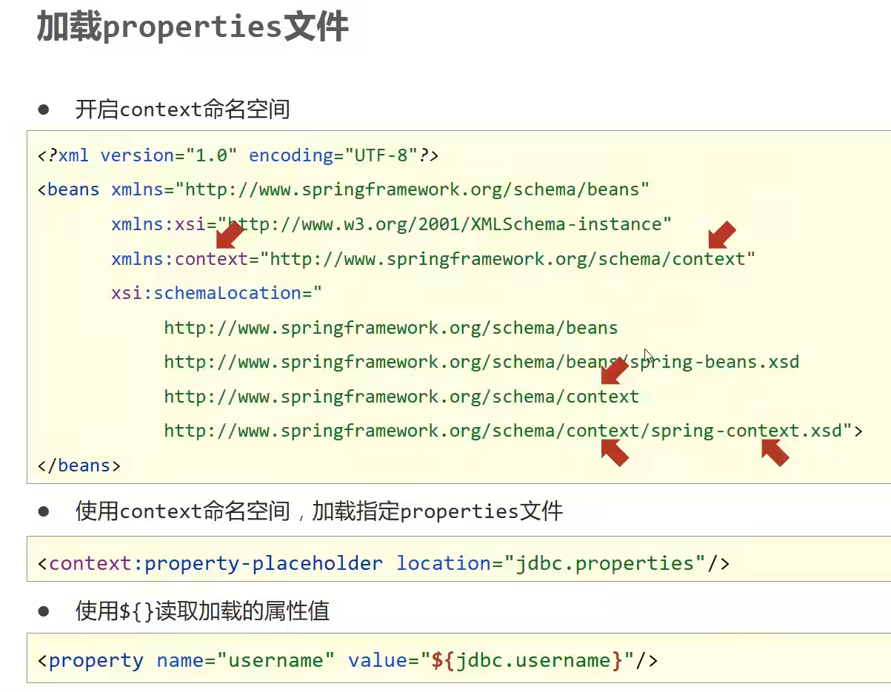
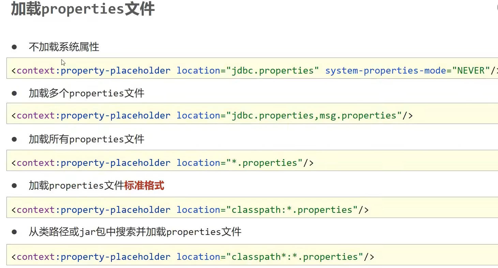

```xml
<?xml version="1.0" encoding="UTF-8"?>

<beans  xmlns="http://www.springframework.org/schema/beans"
        xmlns:xsi="http://www.w3.org/2001/XMLSchema-instance"
        xmlns:context="http://www.springframework.org/schema/context"
        xsi:schemaLocation="
        http://www.springframework.org/schema/beans ./spring-beans.xsd
        http://www.springframework.org/schema/context ./spring-context.xsd
        "
>
    <!-- 
        1.添加xml命名空间和schemaLocation  
            - xmlns:context="http://www.springframework.org/schema/context" 
            - xsi:schemaLocation="http://www.springframework.org/schema/context http://www.springframework.org/schema/context/spring-context.xsd"
    -->
    <!-- 2.在命名空间中写配置文件的路径
        - 写法1,单配置文件： <context:property-placeholder location="jdbcConfig.properties" />
        - 写法2,多配置文件： <context:property-placeholder location="./A.prop,./B.prop" />
        - 写法3,通配符匹配： <context:property-placeholder location="*.properties" />
        - 写法3,专业写法：加载classpath路径下的配置： <context:property-placeholder location="classpath:*.properties" />
        - 写法4,加载classpath和jar包中的配置： <context:property-placeholder location="classpath*:*.properties" />
    -->
    <!-- 3.将bean的property标签的value属性写成模板字符串：${jdbcConfig.driverClassName} -->
    <!-- 4.注意，
            - 多个配置文件会互相覆盖，
                比如
                    文件 A.properties 中写 name=1 
                    文件 B.properties 中写 name=2 
                    则后加载的文件会覆盖先加载的配置文件，
                    所以一般使用配置文件的文件名作为命名空间，如
                        A.name = 1
                        B.name = 2
            - 另外，所有的属性默认会被系统的环境变量覆盖，如username=电脑操作系统的用户名
                - 解决方法，不加载系统环境配置：
                    - `<context:property-placeholder location="jdbcConfig.properties" system-properties-mode="NEVER"/>`
     -->
    <context:property-placeholder location="jdbcConfig.properties" />

    <bean id="myGruid" class="com.alibaba.druid.pool.DruidDataSource">
        <property name="driverClassName" value="${jdbcConfig.driverClassName}" />
        <property name="url" value="${jdbcConfig.url}" />
        <property name="username" value="${jdbcConfig.username}"></property>
        <property name="password" value="${jdbcConfig.password}"></property>
    </bean>
    <bean id="MyJDBCforTest" class="com.example.MyJDBC">
        <property name="driverClassName" value="${jdbcConfig.driverClassName}" />
    </bean>
</beans>
```

```java
package com.example;

import javax.sql.DataSource;

import org.springframework.context.ConfigurableApplicationContext;
import org.springframework.context.support.ClassPathXmlApplicationContext;

public class App {
    public static void main(String[] args) {
        ConfigurableApplicationContext context = new ClassPathXmlApplicationContext("applicationContext.xml");
        System.out.println(context);
        DataSource dds = (DataSource) context.getBean("myGruid");
        MyJDBC myJdbc = (MyJDBC) context.getBean("MyJDBCforTest");
        System.out.println(dds);
        System.out.println(myJdbc);
        context.close();
        /*
         * output:
         * [driverClassName]属性被注入，内容：com.mysql.jdbc.Driver
         * org.springframework.context.support.ClassPathXmlApplicationContext@179d3b25,
         * started on Mon Apr 10 15:21:22 CST 2023
         * {
         * CreateTime:"2023-04-10 15:21:22",
         * ActiveCount:0,
         * PoolingCount:0,
         * CreateCount:0,
         * DestroyCount:0,
         * CloseCount:0,
         * ConnectCount:0,
         * Connections:[
         * ]
         * }
         * com.example.MyJDBC@7e2d773b
         * 四月 10, 2023 3:21:22 下午
         * com.alibaba.druid.support.logging.JakartaCommonsLoggingImpl info
         * 信息: {dataSource-0} closing ...
         */

    }
}
```

```java
package com.example;

public class MyJDBC {
    String driverClassName;
    public void setDriverClassName(String driverClassName) {
        System.out.println("[driverClassName]属性被注入，内容：" + driverClassName);
        this.driverClassName = driverClassName;
    }
}
```

### 核心容器

#### 创建容器

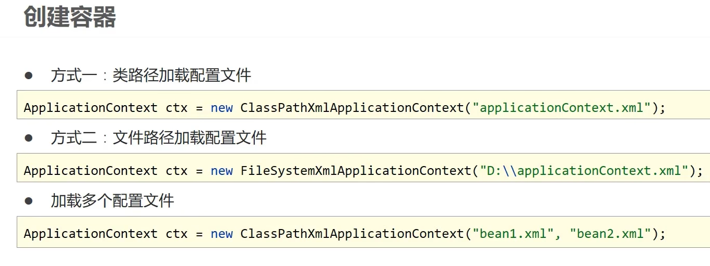

#### 获取Bean

- 方法3只能获取单例Bean

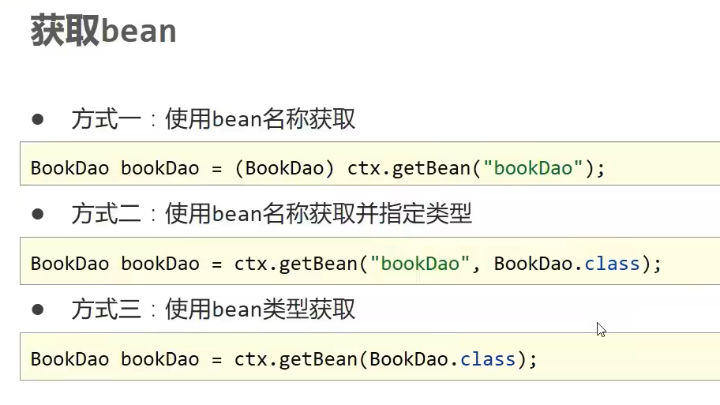

#### BeanFactory和ApplicationContext的关系和区别

**关系**

BeanFactory是ApplicationContext的顶层接口

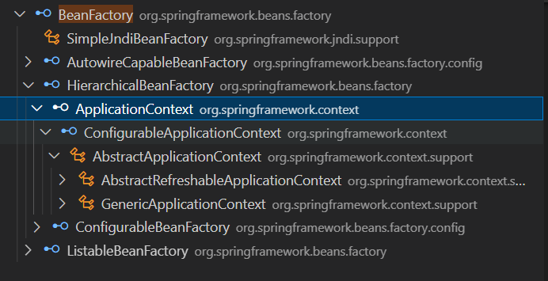


**区别**

- BeanFactory是懒惰加载
- ApplicationContext是立即加载

##### BeanFactory的懒惰加载

```java
package com.example;

import org.springframework.beans.factory.BeanFactory;
import org.springframework.beans.factory.xml.XmlBeanFactory;
import org.springframework.core.io.ClassPathResource;

import com.example.service.Service;

public class App {
    public static void main(String[] args) {
        BeanFactory ctx = new XmlBeanFactory(new ClassPathResource("applicationContext.xml"));
        /*
         * output:
         * 没有任何输出，因为懒惰加载，beans没有被初始化
         */
        Service myService = (Service) ctx.getBean("myService");
        /*
         * 获取bean实例，此时会调用bean的构造方法
         * output:
         * ServiceImp的私有无参构造器被调用......
         * BookDaoImpl的私有无参构造器被调用......
         */
        myService.save();
        /*
         * output：
         * ServiceImp: saving book...
         * BookDaoImpl: saving book...
         */
    }
}
```

##### ApplicationContext的立即加载

```java
package com.example;

import org.springframework.beans.factory.BeanFactory;
import org.springframework.beans.factory.xml.XmlBeanFactory;
import org.springframework.context.ApplicationContext;
import org.springframework.context.support.ClassPathXmlApplicationContext;
import org.springframework.core.io.ClassPathResource;

import com.example.service.Service;

public class App2 {
    public static void main(String[] args) {
        ApplicationContext ctx = new ClassPathXmlApplicationContext("applicationContext.xml");
        /*
         * 有输出，ApplicationContext是立即加载初始化说有bean
         * output:
         * ServiceImp的私有无参构造器被调用......
         * BookDaoImpl的私有无参构造器被调用......
         * setBookDao()被调用
         */
        Service myService = (Service) ctx.getBean("myService");
        /*
         * output:
         * 没有输出
         */
        myService.save();
        /*
         * output：
         * ServiceImp: saving book...
         * BookDaoImpl: saving book...
         */
    }
}
```

##### ApplicationContext的懒惰加载

`lazy-init="true"`

```xml
<?xml version="1.0" encoding="UTF-8"?>

<beans xmlns="http://www.springframework.org/schema/beans"
    xmlns:xsi="http://www.w3.org/2001/XMLSchema-instance"
    xsi:schemaLocation="http://www.springframework.org/schema/beans spring-beans.xsd"
>
    <bean id="myBookDao" class="com.example.dao.impl.BookDaoImpl" lazy-init="false"/>
    <bean id="myService" class="com.example.service.impl.ServiceImp" lazy-init="true">
        <property name="bookDao" ref="myBookDao"></property>
    </bean>
</beans>
```

```java
package com.example;

import org.springframework.beans.factory.BeanFactory;
import org.springframework.beans.factory.xml.XmlBeanFactory;
import org.springframework.context.ApplicationContext;
import org.springframework.context.support.ClassPathXmlApplicationContext;
import org.springframework.core.io.ClassPathResource;

import com.example.service.Service;

public class App3_test_lazy_init {
    public static void main(String[] args) {
        ApplicationContext ctx = new ClassPathXmlApplicationContext("applicationContext-lazy-init.xml");
        /*
         * 有输出，BookDaoImpl被配置为立即加载，myService被配置为懒惰加载
         * output:
         * BookDaoImpl的私有无参构造器被调用......
         */
        Service myService = (Service) ctx.getBean("myService");
        /*
         * 有输出，myService被配置为懒惰加载，所以会在调用getbean是被初始化和注入属性值
         * output:
         * ServiceImp的私有无参构造器被调用......
         * setBookDao()被调用
         */
        myService.save();
        /*
         * output：
         * ServiceImp: saving book...
         * BookDaoImpl: saving book...
         */
    }
}

```

### 核心容器、Bean、依赖注入相关总结


## 基于注解的开发

### 注解开发定义Bean

从Spring2.0开始 spring逐步提供了各种各样的注解，到2.5版本，注解逐渐完善

使用注解定义Bean


扩展注解，只是名字不一样，实际功能完全一样

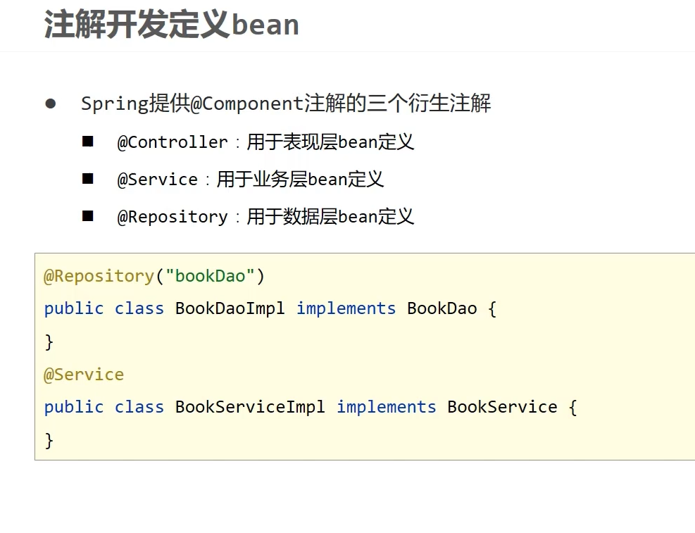

```java
package com.example.dao.impl;

import org.springframework.stereotype.Component;

import com.example.dao.BookDao;

// Component表示该类是一个Bean，括号中的字符串就是bean的id，
@Component("myBookDao")
public class BookDaoImpl implements BookDao {
    private BookDaoImpl(){
        System.out.println("BookDaoImpl的私有无参构造器被调用......");
    }
    @Override
    public void save() {
        System.out.println("BookDaoImpl: saving book...");
    }
}
```

```java
package com.example.service.impl;

import org.springframework.stereotype.Component;

import com.example.dao.BookDao;
import com.example.service.Service;

// 不填id的component只能通过类的class访问
@Component
public class ServiceImp implements Service {
    BookDao bookDao;// 注释掉 = new BookDaoImpl();
    private ServiceImp(){
        System.out.println("ServiceImp的私有无参构造器被调用......");
    }
    @Override
    public void save() {
        System.out.println("ServiceImp: saving book...");
        bookDao.save();
    }
    public void setBookDao(BookDao bookDao) {
        System.out.println("setBookDao()被调用");
        this.bookDao = bookDao;
    }
}
```

```java
package com.example;

import org.springframework.context.ApplicationContext;
import org.springframework.context.support.ClassPathXmlApplicationContext;

import com.example.dao.BookDao;
import com.example.service.Service;

public class App {
    public static void main(String[] args) {
        ApplicationContext ctx = new ClassPathXmlApplicationContext("applicationContext.xml");
        BookDao myBookDao = (BookDao) ctx.getBean("myBookDao");// 通过id获取
        Service myService = (Service) ctx.getBean(Service.class);// 通过类名获取
        System.out.println(myBookDao);
        System.out.println(myService);
    }
}
```

```xml
<?xml version="1.0" encoding="UTF-8"?>

<beans
    xmlns="http://www.springframework.org/schema/beans"
    xmlns:context="http://www.springframework.org/schema/context"
    xmlns:xsi="http://www.w3.org/2001/XMLSchema-instance"
    xsi:schemaLocation="http://www.springframework.org/schema/beans spring-beans.xsd
                        http://www.springframework.org/schema/context spring-context.xsd
                        "
>
    <!-- 
        注意component-scan标签在context的命名空间,
        base-package填扫描路径，可以写的更具体，也可以更宽泛
     -->
    <context:component-scan base-package="com.example" />
</beans>
```

### 纯注解开发:用java类代替xml配置文件

spring3.0升级了纯注解开发模式，使用java类替代配置文件

**用java类代替xml配置文件**


```java
package com.example.config;

import org.springframework.context.annotation.ComponentScan;
import org.springframework.context.annotation.Configuration;

@Configuration
@ComponentScan("com.example") // 包扫描
// @ComponentScan({"com.example.dao","com.example.service"}) // 扫描多个包
public class SpringConfig {}
```

```java
package com.example;

import org.springframework.context.ApplicationContext;
import org.springframework.context.annotation.AnnotationConfigApplicationContext;

import com.example.config.SpringConfig;
import com.example.dao.BookDao;
import com.example.service.Service;

public class App {
    public static void main(String[] args) {
        ApplicationContext ctx = new AnnotationConfigApplicationContext(SpringConfig.class);
        BookDao myBookDao = (BookDao) ctx.getBean("myBookDao");// 通过id获取
        Service myService = (Service) ctx.getBean(Service.class);// 通过类名获取
        System.out.println(myBookDao);
        System.out.println(myService);
        /*
         * output:
         * BookDaoImpl的私有无参构造器被调用......
         * ServiceImp的私有无参构造器被调用......
         * com.example.dao.impl.BookDaoImpl@345965f2
         * com.example.service.impl.ServiceImp@429bd883
         */
    }
}

```

### 注解开发Bean的实例化模式和声明周期控制


```java
package com.example.service.impl;

import javax.annotation.PostConstruct;
import javax.annotation.PreDestroy;

import org.springframework.context.annotation.Scope;
import org.springframework.stereotype.Component;

import com.example.dao.BookDao;
import com.example.service.Service;

// 不填id的component只能通过类的class访问
@Component
@Scope("prototype") // 原型模式，默认为单例模式
public class ServiceImp implements Service {
    BookDao bookDao;

    private ServiceImp() {
        System.out.println("ServiceImp的私有无参构造器被调用......");
    }

    @Override
    public void save() {
        System.out.println("ServiceImp: saving book...");
        bookDao.save();
    }

    public void setBookDao(BookDao bookDao) {
        System.out.println("setBookDao()被调用");
        this.bookDao = bookDao;
    }

    // 生命周期控制
    // 在setter方法执行后执行
    @PostConstruct
    public void afterInit() {
        System.out.println("afterInit() Method executed......");
    }

    // 生命周期控制
    // 销毁实例所要前执行的函数
    @PreDestroy
    public void beforeDestory() {
        System.out.println("beforeDestory() Method executed......");
    }
}
```

```java
package com.example;

import org.springframework.context.annotation.AnnotationConfigApplicationContext;

import com.example.config.SpringConfig;
import com.example.service.Service;

public class App {
    public static void main(String[] args) {
        AnnotationConfigApplicationContext ctx = new AnnotationConfigApplicationContext(SpringConfig.class);
        Service myService1 = (Service) ctx.getBean(Service.class);// 通过类名获取
        Service myService2 = (Service) ctx.getBean(Service.class);// 通过类名获取
        System.out.println(myService1);
        System.out.println(myService2);
        /*
         * output:
         * BookDaoImpl的私有无参构造器被调用......
         * ServiceImp的私有无参构造器被调用......
         * afterInit() Method executed......
         * ServiceImp的私有无参构造器被调用......
         * afterInit() Method executed......
         * com.example.service.impl.ServiceImp@971d0d8
         * com.example.service.impl.ServiceImp@51931956
         */
        ctx.close();
    }
}
```

### 注解开发Bean的依赖注入

#### 引用数据类型的依赖注入

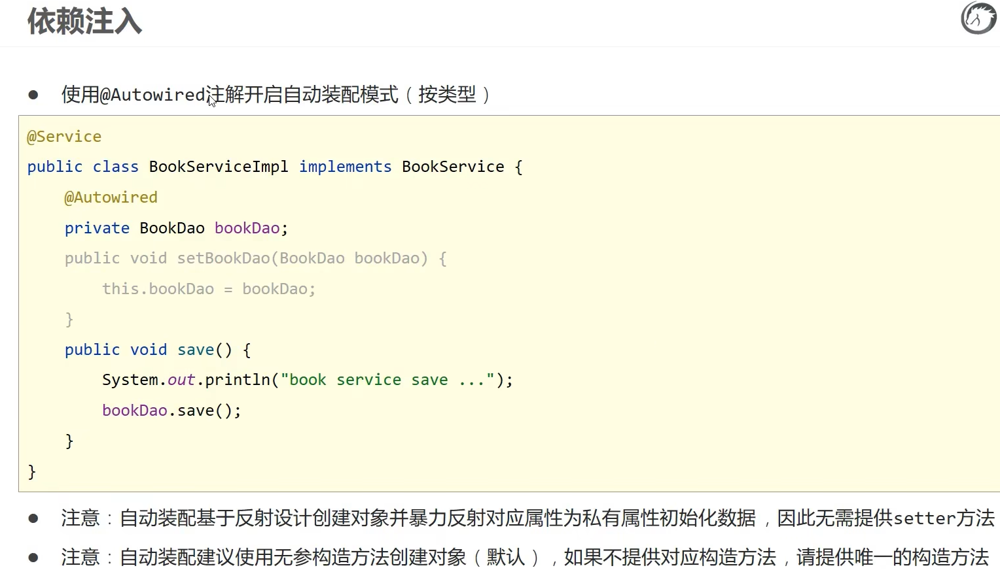

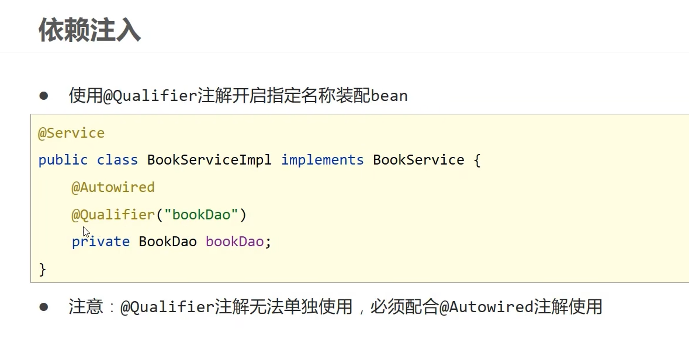

```java
package com.example.service.impl;

import javax.annotation.PostConstruct;
import javax.annotation.PreDestroy;

import org.springframework.beans.factory.annotation.Autowired;
import org.springframework.beans.factory.annotation.Qualifier;
import org.springframework.context.annotation.Scope;
import org.springframework.stereotype.Component;

import com.example.dao.BookDao;
import com.example.service.Service;

// 不填id的component只能通过类的class访问
@Component
@Scope("prototype") // 原型模式，默认为单例模式
public class ServiceImp implements Service {
    // 如果容器中只有一个`BookDao`实例，无论属性名和id是否一致，都会被注入
    // 如果容器中含有多个`BookDao`实例，bookDao的id需和此处的属性名一致
    // 自动装配,写在此处会利用反射暴力注入，不会调用setter方法
    @Autowired
    @Qualifier("bookDao1") // 如果容器中含有多个`BookDao`实例,用`@Qualifier`注解来指定具体注入的bean的id
    BookDao bookDao;

    private ServiceImp() {
        System.out.println("ServiceImp的私有无参构造器被调用......");
    }

    @Override
    public void save() {
        System.out.println("ServiceImp: saving book...");
        bookDao.save();
    }

    // 如果容器中只有一个`BookDao`实例，无论属性名和id是否一致，都会被注入
    // 如果容器中含有多个`BookDao`实例，bookDao的id需和此处的属性名一致
    // 自动装配，写在此处会执行setter方法
    // @Autowired
    public void setBookDao(BookDao bookDao) {
        System.out.println("setBookDao()被调用");
        this.bookDao = bookDao;
    }

    // 生命周期控制
    // 在setter方法执行后执行
    @PostConstruct
    public void afterInit() {
        System.out.println("afterInit() Method executed......");
    }

    // 生命周期控制
    // 销毁实例所要前执行的函数
    @PreDestroy
    public void beforeDestory() {
        System.out.println("beforeDestory() Method executed......");
    }
}

```

```java
package com.example.dao.impl;

import org.springframework.stereotype.Component;

import com.example.dao.BookDao;

// Component表示该类是一个Bean，括号中的字符串就是bean的id，
@Component("bookDao1")
public class BookDaoImpl implements BookDao {
    private BookDaoImpl(){
        System.out.println("BookDaoImpl的私有无参构造器被调用......");
    }
    @Override
    public void save() {
        System.out.println("BookDaoImpl: saving book...");
    }
}

```

```java
package com.example;

import org.springframework.context.annotation.AnnotationConfigApplicationContext;

import com.example.config.SpringConfig;
import com.example.service.Service;

public class App {
    public static void main(String[] args) {
        AnnotationConfigApplicationContext ctx = new AnnotationConfigApplicationContext(SpringConfig.class);
        Service myService = (Service) ctx.getBean(Service.class);// 通过类名获取
        myService.save();
        /*
         * output:
         * BookDaoImpl的私有无参构造器被调用......
         * ServiceImp的私有无参构造器被调用......
         * afterInit() Method executed......
         * ServiceImp: saving book...
         * BookDaoImpl: saving book...
         */
        ctx.close();
    }
}
```

#### 基本数据类型的依赖注入以及加载外部配置文件

配置`PropertySource`引入外部配置

```java
package com.example.config;

import org.springframework.context.annotation.ComponentScan;
import org.springframework.context.annotation.Configuration;
import org.springframework.context.annotation.PropertySource;

@Configuration
@ComponentScan("com.example")
@PropertySource("serverConfig.properties") // 不支持使用通配符，但支持classpath:filename.ext
public class SpringConfig {

}

```

`serverConfig.properties`配置文件

```properties
serverConfig.maxConnections = 1000
```

`@Value注解的使用`

```java
package com.example.service.impl;

import javax.annotation.PostConstruct;
import javax.annotation.PreDestroy;

import org.springframework.beans.factory.annotation.Autowired;
import org.springframework.beans.factory.annotation.Qualifier;
import org.springframework.beans.factory.annotation.Value;
import org.springframework.context.annotation.Scope;
import org.springframework.stereotype.Component;

import com.example.dao.BookDao;
import com.example.service.Service;

@Component
@Scope("prototype")
public class ServiceImp implements Service {
    @Value("DDDserver") // 字面量注入
    String serverName;
    @Value("${serverConfig.maxConnections}") // 通过外部配置文件注入
    int maxConnections;

    @Autowired
    @Qualifier("bookDao1")
    BookDao bookDao;

    private ServiceImp() {
        System.out.println("ServiceImp的私有无参构造器被调用......");
    }

    @Override
    public void save() {
        System.out.println("----------------->serverName: " + serverName);
        System.out.println("----------------->maxConnections: " + maxConnections);
        System.out.println("ServiceImp: saving book...");
        bookDao.save();
    }

    public void setBookDao(BookDao bookDao) {
        System.out.println("setBookDao()被调用");
        this.bookDao = bookDao;
    }

    @PostConstruct
    public void afterInit() {
        System.out.println("afterInit() Method executed......");
    }

    @PreDestroy
    public void beforeDestory() {
        System.out.println("beforeDestory() Method executed......");
    }
}
```

```java
package com.example;

import org.springframework.context.annotation.AnnotationConfigApplicationContext;

import com.example.config.SpringConfig;
import com.example.service.Service;

public class App {
    public static void main(String[] args) {
        AnnotationConfigApplicationContext ctx = new AnnotationConfigApplicationContext(SpringConfig.class);
        Service myService = (Service) ctx.getBean(Service.class);// 通过类名获取
        myService.save();
        /*
         * output:
         * BookDaoImpl的私有无参构造器被调用......
         * ServiceImp的私有无参构造器被调用......
         * afterInit() Method executed......
         * ----------------->serverName: DDDserver
         * ----------------->maxConnections: 1000
         * ServiceImp: saving book...
         * BookDaoImpl: saving book...
         */
        ctx.close();
    }
}

```

### 用注解管理配置第三方库类


#### 基本写法

```java
package com.example.config;

import javax.sql.DataSource;

import org.springframework.context.annotation.Bean;
import org.springframework.context.annotation.Configuration;

import com.alibaba.druid.pool.DruidDataSource;

@Configuration
public class SpringConfig {

    @Bean // 表示把其返回值当做bean管理
    // @Bean("druid_id1") // 指定id
    // @Bean({"druid_id1","druid_id2"}) // 指定多个id
    public DataSource myDruidDataSource() {
        DruidDataSource dds = new DruidDataSource();
        dds.setDriverClassName("com.mysql.jdbc.Driver");
        dds.setUrl("jdbc:///db5");
        dds.setUsername("root");
        dds.setPassword("root");
        return dds;
    }
}
```

```java
package com.example;

import javax.sql.DataSource;

import org.springframework.context.annotation.AnnotationConfigApplicationContext;

import com.alibaba.druid.pool.DruidDataSource;
import com.example.config.SpringConfig;

public class App {
    public static void main(String[] args) {
        AnnotationConfigApplicationContext ctx = new AnnotationConfigApplicationContext(SpringConfig.class);
        DataSource ds = ctx.getBean(DruidDataSource.class);
        System.out.println(ds);
        ctx.close();
        /*
         * {
         * CreateTime:"2023-04-10 23:07:44",
         * ActiveCount:0,
         * PoolingCount:0,
         * CreateCount:0,
         * DestroyCount:0,
         * CloseCount:0,
         * ConnectCount:0,
         * Connections:[
         * ]
         * }
         * 四月 10, 2023 11:07:45 下午
         * com.alibaba.druid.support.logging.JakartaCommonsLoggingImpl info
         * 信息: {dataSource-0} closing ...
         */
    }
}
```

#### 抽取配置到单独的配置类，然后导入到spring配置类

抽取jdbc配置类到单独的文件:

`src\main\java\com\example\config\jdbcConfig.java`

```java
package com.example.config;

import javax.sql.DataSource;

import org.springframework.context.annotation.Bean;
import org.springframework.context.annotation.Configuration;
import com.alibaba.druid.pool.DruidDataSource;

@Configuration
public class jdbcConfig {
    @Bean // 表示把其返回值当做bean管理
    // @Bean("druid_id1") // 指定id
    // @Bean({"druid_id1","druid_id2"}) // 指定多个id
    public DataSource myDruidDataSource() {
        DruidDataSource dds = new DruidDataSource();
        dds.setDriverClassName("com.mysql.jdbc.Driver");
        dds.setUrl("jdbc:///db5");
        dds.setUsername("root");
        dds.setPassword("root");
        return dds;
    }
}
```

在spring配置类中导入jdbc配置类

`src\main\java\com\example\config\SpringConfig.java`

```java
package com.example.config;

import org.springframework.context.annotation.ComponentScan;
import org.springframework.context.annotation.Configuration;
import org.springframework.context.annotation.Import;

@Configuration
// 写法1 使用import注解，导入class
@Import(jdbcConfig.class) // 导入单个外部配置类 Import注解只能存在一个
// @Import({AConfig.class,BConfig.class,CConfig.class}) //导入多个外部配置类

// 写法2 使用ComponentScan注解，指定扫描包名，这种写法不推荐，因为存在字符串，代码重构时无法自动更新
// @ComponentScan({"com.example.config"})
public class SpringConfig {}
```

### 对第三方库进行依赖注入

第三方Bean管理

- @Bean

第三方依赖注入

- 基本数据类型：配置类的成员变量
- 引用数据列席：方法的形式参数

```java
package com.example.config;

import javax.sql.DataSource;

import org.springframework.beans.factory.annotation.Value;
import org.springframework.context.annotation.Bean;
import org.springframework.context.annotation.Configuration;
import org.springframework.context.annotation.PropertySource;

import com.alibaba.druid.pool.DruidDataSource;
import com.example.dao.BookDao;

@Configuration
@PropertySource("classpath:jdbcConfig.prop") // 导入外部配置文件
public class jdbcConfig {
    // 基本数据类型的注入
    @Value("${jdbcConfig.driverClass}") // 通过配置文件注入基本数据类型
    String driverClass;
    @Value("${jdbcConfig.url}")
    String url;
    @Value("${jdbcConfig.username}")
    String username;
    @Value("${jdbcConfig.password}")
    String password;

    @Bean // 表示这里生成一个Bean
    public DataSource myDruidDataSource(BookDao bookDao /* 引用数据类型的注入需要通过形参来实现 */) {
        System.out.println(bookDao);// 假设这里是在注入引用数据类型
        DruidDataSource dds = new DruidDataSource();
        dds.setDriverClassName(driverClass);// 基本数据类型的注入：通过配置类的属性来传入值
        dds.setUrl(url);
        dds.setUsername(username);
        dds.setPassword(password);
        return dds;
    }
}
```

```config
jdbcConfig.driverClass = com.mysql.jdbc.driver
jdbcConfig.url = jdbc:///db5
jdbcConfig.username = root
jdbcConfig.password = root
```

```java
package com.example.config;

import org.springframework.context.annotation.ComponentScan;
import org.springframework.context.annotation.Configuration;
import org.springframework.context.annotation.Import;

@Configuration // 声明配置类
@Import(jdbcConfig.class) // 导入外部配置
@ComponentScan({"com.example.dao"})// 包扫描，管理Bean
public class SpringConfig {}
```

```java
package com.example.dao.impl;

import org.springframework.stereotype.Component;

import com.example.dao.BookDao;

@Component
public class BookDaoImpl implements BookDao {
    private BookDaoImpl(){
        System.out.println("BookDaoImpl的私有无参构造器被调用......");
    }
    @Override
    public void save() {
        System.out.println("BookDaoImpl: saving book...");
    }
}

```

```java
package com.example;

import javax.sql.DataSource;

import org.springframework.context.annotation.AnnotationConfigApplicationContext;

import com.alibaba.druid.pool.DruidDataSource;
import com.example.config.SpringConfig;

public class App {
    public static void main(String[] args) {
        AnnotationConfigApplicationContext ctx = new AnnotationConfigApplicationContext(SpringConfig.class);
        DataSource ds = ctx.getBean(DruidDataSource.class);
        System.out.println(ds);
        ctx.close();
        /*
         * {
         * CreateTime:"2023-04-10 23:07:44",
         * ActiveCount:0,
         * PoolingCount:0,
         * CreateCount:0,
         * DestroyCount:0,
         * CloseCount:0,
         * ConnectCount:0,
         * Connections:[
         * ]
         * }
         * 四月 10, 2023 11:07:45 下午
         * com.alibaba.druid.support.logging.JakartaCommonsLoggingImpl info
         * 信息: {dataSource-0} closing ...
         */
    }
}
```

### xml配置和注解开发的对比


## Spring结合myBatis

### myBatis复习

`pom.xml`

```xml
    <dependency>
      <groupId>org.mybatis</groupId>
      <artifactId>mybatis</artifactId>
      <version>3.5.13</version>
    </dependency>
    <dependency>
      <groupId>mysql</groupId>
      <artifactId>mysql-connector-java</artifactId>
      <version>8.0.32</version>
    </dependency>
```

`src\main\resources\myBaties.xml`

```xml
<?xml version="1.0" encoding="UTF-8"?>
<!DOCTYPE configuration PUBLIC "-//mybatis.org//DTD Config 3.0//EN" "https://mybatis.org/dtd/mybatis-3-config.dtd">
<configuration>
    <properties resource="jdbc.properties"/>
    <environments default="development">
        <environment id="development">
            <transactionManager type="JDBC" />
            <dataSource type="POOLED">
                <property name="driver" value="${jdbc.driverClassName}" />
                <property name="url" value="${jdbc.url}" />
                <property name="username" value="${jdbc.username}" />
                <property name="password" value="${jdbc.password}" />
            </dataSource>
        </environment>
    </environments>
    <mappers>
        <!-- 包扫描 -->
        <package name="com.example.mapper"/>
    </mappers>
</configuration>
```

`src\main\resources\jdbc.properties`

```
jdbc.driverClassName=com.mysql.cj.jdbc.Driver
jdbc.url=jdbc:mysql:///db7?useSSL=false&useServerPrepStmts=true
jdbc.username=root
jdbc.password=root
```

`src\main\java\com\example\mapper\UserMapper.java`

```java
package com.example.mapper;

import java.util.List;

import org.apache.ibatis.annotations.Insert;
import org.apache.ibatis.annotations.Select;
import org.apache.ibatis.annotations.Update;

/*
    drop database if exists db7;
    create database db7;
    use db7;
    create table user( uid int primary key auto_increment,uname varchar(10),passwd varchar(10));
    
    drop table user;
 */
public interface UserMapper {
    @Insert("insert into user(uname,passwd) values(#{uname},#{passwd});")
    void createUser(User user);

    @Update("update user set uname=#{uname}, passwd=#{passwd} where uid = #{uid};")
    void alterUser(User user);

    @Select("select * from user where uid=#{uid};")
    User getUserById(int uid);

    @Select("select * from user;")
    List<User> selectAll();
}

```

`src\main\java\com\example\App.java`

```java
package com.example;

import com.example.mapper.User;
import com.example.mapper.UserMapper;

import org.apache.ibatis.io.Resources;
import org.apache.ibatis.session.SqlSession;
import org.apache.ibatis.session.SqlSessionFactory;
import org.apache.ibatis.session.SqlSessionFactoryBuilder;

public class App {

    public static void main(String[] args) throws Exception {
        SqlSessionFactory sqlSessionFactory = new SqlSessionFactoryBuilder()
                .build(Resources.getResourceAsStream("myBaties.xml"));// 加载配置文件实例化sessionFactory

        SqlSession sqlSession = sqlSessionFactory.openSession();// 创建连接

        UserMapper uMapper = sqlSession.getMapper(UserMapper.class);// 代理方式获取mapper
        System.out.println(uMapper);

        uMapper.createUser(new User("admin", "admin"));// 创建用户
        System.out.println(uMapper.getUserById(3));// 查询用户
        uMapper.alterUser(new User(3, "test", "test"));// 修改用户
        System.out.println(uMapper.selectAll());// 查询所用用户

        sqlSession.commit();// 提交事务,因为默认不提交
        sqlSession.close();// 关闭session

        // output
        // org.apache.ibatis.binding.MapperProxy@61a485d2
        // User [uid=3, uname=admin, passwd=admin]
        // [User [uid=1, uname=admin, passwd=admin], User [uid=2, uname=admin, passwd=admin], User [uid=3, uname=test, passwd=test], User [uid=4, uname=admin, passwd=admin]]
    }
}
```

`src\main\java\com\example\mapper\User.java`

```java
package com.example.mapper;

public class User {
    int uid;
    String uname;
    String passwd;

    public int getUid() {
        return uid;
    }

    public User(String uname, String passwd) {
        this.uname = uname;
        this.passwd = passwd;
    }
    

    public User(int uid, String uname, String passwd) {
        this.uid = uid;
        this.uname = uname;
        this.passwd = passwd;
    }

    public void setUid(int id) {
        this.uid = id;
    }

    public String getUname() {
        return uname;
    }

    public void setUname(String uname) {
        this.uname = uname;
    }

    public String getPasswd() {
        return passwd;
    }

    public void setPasswd(String passwd) {
        this.passwd = passwd;
    }

    @Override
    public String toString() {
        return "User [uid=" + uid + ", uname=" + uname + ", passwd=" + passwd + "]";
    }
}
```

### Spring结合mybatis的使用

`mybatis-spring`包提供了`SqlSessionFactoryBean`类用于通过Spring配置的方式配置myBatis

**sqlSessionFactory实例化及数据源配置**


**mapper扫描配置**


`demo\src\main\java\com\example\config\SpringConfig.java`

```java
package com.example.config;

import org.springframework.context.annotation.ComponentScan;
import org.springframework.context.annotation.Configuration;

@Configuration
@ComponentScan("com.example.config") // // 引入其他配置文件
@ComponentScan("com.example.service") // 扫描包路径,管理bean
public class SpringConfig {
}
```

`demo\src\main\java\com\example\config\DruidConfig.java`

```java
package com.example.config;

import javax.sql.DataSource;

import org.springframework.beans.factory.annotation.Value;
import org.springframework.context.annotation.Bean;
import org.springframework.context.annotation.Configuration;
import org.springframework.context.annotation.PropertySource;

import com.alibaba.druid.pool.DruidDataSource;

@Configuration
@PropertySource("jdbc.prop")
public class DruidConfig {
    
    @Value("${jdbc.driverClassName}")
    String driverClassName;
    @Value("${jdbc.url}")
    String url;
    @Value("${jdbc.username}")
    String username;
    @Value("${jdbc.password}")
    String password;

    @Bean
    public DataSource dataSource() {
        DruidDataSource dds = new DruidDataSource();
        dds.setDriverClassName(driverClassName);
        dds.setUrl(url);
        dds.setUsername(username);
        dds.setPassword(password);
        return dds;
    }
}
```

```java
package com.example.config;

import org.springframework.context.annotation.Bean;
import org.springframework.context.annotation.Configuration;

import javax.sql.DataSource;

import org.mybatis.spring.SqlSessionFactoryBean;
import org.mybatis.spring.mapper.MapperScannerConfigurer;
import org.apache.ibatis.session.SqlSessionFactory;

@Configuration
public class MyBatiesConfig {
 @Bean
 public SqlSessionFactory sqlSessionFactory(DataSource dataSource) throws Exception {
  SqlSessionFactoryBean ssfb = new SqlSessionFactoryBean();// 固定写法
  ssfb.setDataSource(dataSource);
  ssfb.setTypeAliasesPackage("com.example.domain");// 类型别名，好像不写也行
  return ssfb.getObject();
 }

 @Bean
 public MapperScannerConfigurer mapperScannerConfigurer() {
  MapperScannerConfigurer mscf = new MapperScannerConfigurer();// 固定写法
  mscf.setBasePackage("com.example.dao");// Mapper接口类的搜索路径
  return mscf;
 }
}
```

`demo\src\main\java\com\example\dao\UserDao.java`

```java
package com.example.dao;

import java.util.List;

import org.apache.ibatis.annotations.Insert;
import org.apache.ibatis.annotations.Select;
import org.apache.ibatis.annotations.Update;

import com.example.domain.User;

/*
    drop database if exists db7;
    create database db7;
    use db7;
    create table user( uid int primary key auto_increment,uname varchar(10),passwd varchar(10));
    
    drop table user;
 */

public interface UserDao {
    @Insert("insert into user(uname,passwd) values(#{uname},#{passwd});")
    void createUser(User user);

    @Update("update user set uname=#{uname}, passwd=#{passwd} where uid = #{uid};")
    void alterUser(User user);

    @Select("select * from user where uid=#{uid};")
    User getUserById(int uid);

    @Select("select * from user;")
    List<User> selectAll();
}

```

`demo\src\main\java\com\example\domain\User.java`

```java
package com.example.domain;

public class User {
    int uid;
    String uname;
    String passwd;

    public int getUid() {
        return uid;
    }

    public User(String uname, String passwd) {
        this.uname = uname;
        this.passwd = passwd;
    }
    

    public User(int uid, String uname, String passwd) {
        this.uid = uid;
        this.uname = uname;
        this.passwd = passwd;
    }

    public void setUid(int id) {
        this.uid = id;
    }

    public String getUname() {
        return uname;
    }

    public void setUname(String uname) {
        this.uname = uname;
    }

    public String getPasswd() {
        return passwd;
    }

    public void setPasswd(String passwd) {
        this.passwd = passwd;
    }

    @Override
    public String toString() {
        return "User [uid=" + uid + ", uname=" + uname + ", passwd=" + passwd + "]";
    }
}

```

`demo\src\main\java\com\example\service\impl\UserServiceImpl.java`

```java
package com.example.service.impl;

import java.util.List;

import org.springframework.beans.factory.annotation.Autowired;
import org.springframework.stereotype.Component;

import com.example.dao.UserDao;
import com.example.domain.User;
import com.example.service.UserService;

@Component
public class UserServiceImpl implements UserService {
    @Autowired
    public UserDao userDao;

    @Override
    public void add(User user) {
        userDao.createUser(user);
    }

    @Override
    public User getById(int uid) {
        return userDao.getUserById(uid);
    }

    @Override
    public void update(User user) {
        userDao.alterUser(user);
    }

    @Override
    public List<User> getAll() {
        return userDao.selectAll();
    }
}

```

`demo\src\main\java\App.java`

```java


import org.springframework.context.ConfigurableApplicationContext;
import org.springframework.context.annotation.AnnotationConfigApplicationContext;

import com.example.config.SpringConfig;
import com.example.domain.User;
import com.example.service.UserService;

public class App {
    public static void main(String[] args) {
        ConfigurableApplicationContext ctx = new AnnotationConfigApplicationContext(SpringConfig.class);
        UserService userService = ctx.getBean(UserService.class);
        userService.add(new User("test01", "test01"));
        userService.update(new User(1, "kkk","bbb"));
        System.out.println(userService.getById(1));
        System.out.println(userService.getAll());
        // User [uid=1, uname=kkk, passwd=bbb]
        //[User [uid=1, uname=kkk, passwd=bbb], User [uid=2, uname=admin, passwd=admin], User [uid=3, uname=test, passwd=test], User [uid=4, uname=admin, passwd=admin], User [uid=5, uname=test01, passwd=test01]]
        ctx.close();
    }
}

```

`demo\src\main\resources\jdbc.prop`

```conf
jdbc.driverClassName=com.mysql.cj.jdbc.Driver
jdbc.url=jdbc:mysql:///db7?useSSL=false&useServerPrepStmts=true
jdbc.username=root
jdbc.password=root
```

`pom.xml`

```xml
<dependency>
      <groupId>org.springframework</groupId>
      <artifactId>spring-context</artifactId>
      <version>5.2.10.RELEASE</version>
    </dependency>
    <dependency>
      <groupId>org.springframework</groupId>
      <artifactId>spring-jdbc</artifactId>
      <version>5.2.10.RELEASE</version>
    </dependency>
    <dependency>
      <groupId>mysql</groupId>
      <artifactId>mysql-connector-java</artifactId>
      <version>8.0.32</version>
    </dependency>
    <dependency>
      <groupId>com.alibaba</groupId>
      <artifactId>druid</artifactId>
      <version>1.1.16</version>
    </dependency>
    <dependency>
      <groupId>org.mybatis</groupId>
      <artifactId>mybatis</artifactId>
      <version>3.5.6</version>
    </dependency>
    <dependency>
      <groupId>org.mybatis</groupId>
      <artifactId>mybatis-spring</artifactId>
      <version>1.3.0</version>
    </dependency>
    <dependency>
```

## Spring结合JUnit

```xml
    <dependency>
      <groupId>org.springframework</groupId>
      <artifactId>spring-test</artifactId>
      <version>5.2.10.RELEASE</version>
    </dependency>
    <dependency>
      <groupId>junit</groupId>
      <artifactId>junit</artifactId>
      <version>4.12</version>
      <scope>test</scope>
    </dependency>
```

`demo\src\test\java\com\example\service\UserServiceTest.java`

```java
package com.example.service;

import org.junit.Test;
import org.junit.runner.RunWith;
import org.springframework.beans.factory.annotation.Autowired;
import org.springframework.test.context.ContextConfiguration;
import org.springframework.test.context.junit4.SpringJUnit4ClassRunner;

import com.example.config.SpringConfig;

@RunWith(SpringJUnit4ClassRunner.class) // 设置JUnit的类运行器为Spring的SpringJUnit4ClassRunner类运行器
@ContextConfiguration(classes = SpringConfig.class) // 设置Spring容器的配置类
public class UserServiceTest {

    @Autowired // 自动装载
    private UserService userService;

    @Test
    public void TestGetAll(){
        System.out.println(userService.getAll());
    }
}
```

## Spring的AOP 面向切面编程

> **AOP是一种编程范式**
>
> - AOP: Aspect Oriented Programming 面向切面编程
> - OOP Aspect Object Programming 面向对象编程

**作用**

- 在**不改变原始设计**的基础上为其进行功能增强
- 实现非入侵式编程

**一些概念：**

- 连接点(JoinPoint):所有方法
- 切入点(PointCut):复合某个条件的一系列方法
- 切面(Advice):负责将通知和切入键关联起来
- 通知(Aspect):需要附加到切入点的某些操作
- 通知类:一系列的通知方法


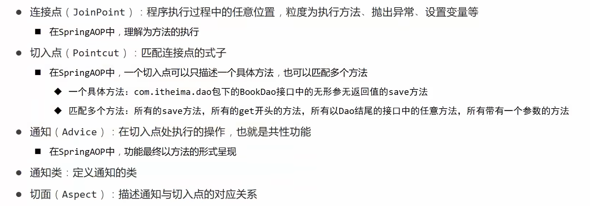

### SpringAOP入门案例

`pox.xml`

```xml
    <dependency>
      <groupId>org.springframework</groupId>
      <artifactId>spring-context</artifactId>
      <version>5.2.10.RELEASE</version>
    </dependency>
    <dependency>
      <groupId>org.aspectj</groupId>
      <artifactId>aspectjweaver</artifactId>
      <version>1.9.4</version>
    </dependency>
```

`src\main\java\com\example\advice\ServiceAdvice.java`

```java
package com.example.advice;

import org.aspectj.lang.annotation.Aspect;
import org.aspectj.lang.annotation.Before;
import org.aspectj.lang.annotation.Pointcut;
import org.springframework.stereotype.Component;

@Component // 交给SpringIOC容器管理
@Aspect // 告知Spring这是一个AOP
public class ServiceAdvice {

    @Pointcut("execution(public void com.example.service.*.*.method*(..))")// *表示通配符，匹配methodA methodB methodC 三个方法
    private void pointCut_A(/* 空方法，用于定义切入点 */) {
    }

    @Before("pointCut_A()") // 在切入点A之前执行
    public void newFun/* 新方法 */() {
        System.out.println("[ start time ] " + System.currentTimeMillis());
    }
}
```

`src\main\java\com\example\config\SpringConfig.java`

```java
package com.example.config;

import org.springframework.context.annotation.ComponentScan;
import org.springframework.context.annotation.Configuration;
import org.springframework.context.annotation.EnableAspectJAutoProxy;

@Configuration
@ComponentScan("com.example")
@EnableAspectJAutoProxy // 告知Spring启用AOP面向切面编程
public class SpringConfig {

}

```

`src\main\java\com\example\service\impl\MyServiceImpl.java`

```java
package com.example.service.impl;

import org.springframework.stereotype.Component;

import com.example.service.MyService;

@Component
public class MyServiceImpl implements MyService {
    @Override
    public void methodA() {
        System.out.println(0);
    }

    @Override
    public void methodB(int arg1) {
        System.out.println(arg1);
    }

    @Override
    public void methodC(int arg1, int arg2) {
        System.out.println(arg1 + arg2);
    }
}

```

`src\main\java\com\example\App.java`

```java
package com.example;

import org.springframework.context.ConfigurableApplicationContext;
import org.springframework.context.annotation.AnnotationConfigApplicationContext;

import com.example.config.SpringConfig;
import com.example.service.MyService;

public final class App {
    public static void main(String[] args) {
        ConfigurableApplicationContext ctx = new AnnotationConfigApplicationContext(SpringConfig.class);
        MyService service = ctx.getBean(MyService.class);
        service.methodA();
        service.methodB(1);
        service.methodC(1, 2);
    }
}
```

### SpringAOP执行流程

> SpringAOP的本质：代理模式

1. 启动IOC容器
2. 读取通知函数上的切入点配置中的切入点
3. 初始化Bean，判断对应的类中的方法是否匹配到任意切入点
   1. 匹配失败，创建对象
   2. 匹配成功，创建**目标对象**的**代理对象**
    - > 如果调用代理对象的toString方法，默认返回的是其原对象（目标对象）的toString()方法，也就是被重写为了`super.toString();`,
    - > 但如果调用`getClass()`方法,则会返回一个目标对象的代理类
4. 获取bean的执行方法
   1. 获取bean，调用方法并执行，完成操作

### AOP切入点表达式

- 切入点：要被增强功能的方法
- 切入点表达式：描述这个切入点的表达式

描述方式1：描述接口类的方法

```java
execution(public void com.test.demo.server.BookServer.find(int))
```

描述方式2：描述实现类的方法

```java
execution(public void com.test.demo.server.impl.BookServerImpl.find(int))
```

**切入点表达式格式**

- 案例：`execution(public void com.test.demo.server.BookServer.find(int)`
- 动作关键字，描述切入点的行为动作
  - 如：execution表示执行
- 访问关键字：public、private等 可省略
- 返回值
- 包名
- 类名或接口名
- 方法名()
- 参数
- 异常名，可省略

**通配符描述**

- `*`匹配单个独立的任意符号，可以独立出现，可以作为前缀或后缀匹配符出现

    ```java
    execution(public * com.example.demo.dao.*Dao.find*(*))
    // 匹配数据访问层一切find()方法
    ```

- `..` 0个或多个连续的任意符号，可以独立出现，长用于简化包名和参数的书写

    ```java
    execution(public * com.example..*Service.findBy*(..))
    // 匹配数据访问层一切find()方法
    ```

- `+`专用于匹配子类类型

    ```java
    execution(* *..*Service+.*())
    // 任意业务层接口
    ```

**书写技巧**


AOP获取通知数据


**AOP获取形参、返回值、异常信息**

```java
package com.example.advice;

import org.aspectj.lang.JoinPoint;
import org.aspectj.lang.ProceedingJoinPoint;
import org.aspectj.lang.Signature;
import org.aspectj.lang.annotation.After;
import org.aspectj.lang.annotation.AfterReturning;
import org.aspectj.lang.annotation.AfterThrowing;
import org.aspectj.lang.annotation.Around;
import org.aspectj.lang.annotation.Aspect;
import org.aspectj.lang.annotation.Before;
import org.aspectj.lang.annotation.Pointcut;
import org.springframework.stereotype.Component;

@Component // 交给SpringIOC容器管理
@Aspect // 告知Spring这是一个AOP
public class ServiceAdvice {

    @Pointcut("execution(public void com.example.service.*.*.method*(..))") // *表示通配符，匹配methodA methodB methodC 三个方法
    private void pointCut_A(/* 空方法，用于定义切入点 */) {
    }

    @Before("pointCut_A()") // 在切入点A之前执行
    public void newFun1(JoinPoint jp) {
        System.out.println("[ Before ] ");
    }

    @AfterReturning(value = "pointCut_A()", returning = "ret"/* 指定返回值传递给谁 */)
    public void newFun4(JoinPoint jp/* 必须是第一个参数 */, Object ret) {
        System.out.println("[ AfterReturning ] [ return: ] " + ret);
    }

    @AfterThrowing(value = "pointCut_A()", throwing = "exception"/* 指定异常传递给谁 */)
    public void newFun5(JoinPoint jp, Throwable exception) {
        System.out.println("[ AfterThrowing ] [exception:]" + exception);
    }

    @After("pointCut_A()")
    public void newFun2(JoinPoint jp) {
        System.out.println("[ After ] ");
    }

    @Around("pointCut_A()")
    public Object newFun3(ProceedingJoinPoint pjp) throws Throwable {
        Signature signature = pjp.getSignature();
        System.out.println("正在执行的方法是: " + signature);
        System.out.println("[ Around:atart ] ");
        Object[] args = pjp.getArgs();
        // args[0] = 修改参数，可以对传入的值预处理
        Object res = pjp.proceed(args/* 不传递也可以，因为默认自动传递 */);
        System.out.println("[ Around:ended ] ");
        return res;// 如果原始方法有返回值，则必须在此处返回一个值,如果原方法返回void 则proceed返回null
    }
}
```

```java
package com.example;

import org.springframework.context.ConfigurableApplicationContext;
import org.springframework.context.annotation.AnnotationConfigApplicationContext;

import com.example.config.SpringConfig;
import com.example.service.MyService;

public final class App {
    public static void main(String[] args) {
        ConfigurableApplicationContext ctx = new AnnotationConfigApplicationContext(SpringConfig.class);
        MyService service = ctx.getBean(MyService.class);
        // service.methodA();
        // service.methodB(1);
        service.methodC(1, 2);
        /*
         * [ Around:atart ]
         * [ Before ]
         * 3
         * [ AfterReturning ] [ return: ] null
         * [ After ]
         * [ Around:ended ]
         */
    }
}
```

## Spring事务

### 事务管理案例：银行转账

```java
package com.example.config;

import javax.sql.DataSource;

import org.springframework.beans.factory.annotation.Value;
import org.springframework.context.annotation.Bean;
import org.springframework.context.annotation.Configuration;
import org.springframework.context.annotation.PropertySource;
import org.springframework.jdbc.datasource.DataSourceTransactionManager;
import org.springframework.transaction.PlatformTransactionManager;
import org.springframework.transaction.annotation.EnableTransactionManagement;

import com.alibaba.druid.pool.DruidDataSource;

@Configuration
@PropertySource("jdbc.prop")
@EnableTransactionManagement // 启用事务管理
public class JDBC_Config {

    @Value("${jdbc.driverClassName}")
    String driverClassName;
    @Value("${jdbc.url}")
    String url;
    @Value("${jdbc.username}")
    String username;
    @Value("${jdbc.password}")
    String password;

    @Bean
    public DataSource dataSource() {
        DruidDataSource dds = new DruidDataSource();
        dds.setDriverClassName(driverClassName);
        dds.setUrl(url);
        dds.setUsername(username);
        dds.setPassword(password);
        return dds;
    }

    @Bean // PlatformTransactionManager是spring提供的事务管理的接口，DataSourceTransactionManager是其实现类，基于JDBC
    public PlatformTransactionManager transactionManager(DataSource dataSource) {
        DataSourceTransactionManager dstm = new DataSourceTransactionManager();
        dstm.setDataSource(dataSource);
        return dstm;
    }
}
```

```java
package com.example.service;

import java.util.List;

import org.springframework.transaction.annotation.Transactional;

import com.example.domain.Account;

@Transactional // 对该业务层的所有接口开启事务
public interface AccountService {
    // 转账
    void transfer(int fromId, int toId, double money) ;
    // 存钱
    void save(int uid,double money);

    void add(Account user);

    void deleteById(int uid);

    void update(Account user);

    Account getById(int uid);

    List<Account> getAll();
}
```

```java
package com.example.service.impl;

import java.util.List;

import org.springframework.beans.factory.annotation.Autowired;
import org.springframework.stereotype.Component;

import com.example.dao.AccountDao;
import com.example.domain.Account;
import com.example.service.AccountService;

@Component
public class AccountServiceImpl implements AccountService {
    @Autowired
    public AccountDao accountDao;

    // 转账
    @Override
    public void transfer(int fromId, int toId, double money){
        accountDao.addMoneyById(fromId, -money);
        accountDao.addMoneyById(toId, money);
        Account accountA = accountDao.getAccountById(fromId);
        Account accountB = accountDao.getAccountById(fromId);
        if(accountA.getMoney()<0||accountB.getMoney()<0) 
            throw new Error("余额不足");// 抛出异常，使得事务回滚
    }

    @Override
    public void save(int uid, double money) {
        accountDao.addMoneyById(uid, money);
    }

    @Override
    public void add(Account user) {
        accountDao.createAccount(user);
    }

    @Override
    public Account getById(int uid) {
        return accountDao.getAccountById(uid);
    }

    @Override
    public void update(Account user) {
        accountDao.alterAccount(user);
    }

    @Override
    public List<Account> getAll() {
        return accountDao.selectAll();
    }

    @Override
    public void deleteById(int uid) {
        accountDao.deleteAccountById(uid);
    }

}

```

```java

import org.springframework.context.ConfigurableApplicationContext;
import org.springframework.context.annotation.AnnotationConfigApplicationContext;

import com.example.config.SpringConfig;
import com.example.service.AccountService;

public class App {
    public static void main(String[] args) {
        ConfigurableApplicationContext ctx = new AnnotationConfigApplicationContext(SpringConfig.class);
        AccountService accountService = ctx.getBean(AccountService.class);
        // accountService.add(new Account("userA", "123"));
        // accountService.add(new Account("userB", "123"));
        // accountService.save(1, 1000);
        // accountService.save(2, 1000);

        System.out.println(accountService.getAll());
        accountService.transfer(1, 2, 500);
        System.out.println(accountService.getAll());
        ctx.close();
    }
}
```

### Spring事务角色

> **开启Spring事务前**
>
> 事务T1和事务T2都是独立的事务，事务T2中执行出错，不会导致事务T1中已经执行的操作回滚  
> 同样的原因，如果事务T1和事务T2都执行正确，但是在业务层Transfer()中的后续部分执行出现异常，也不会导致T1、T2回滚。  
> 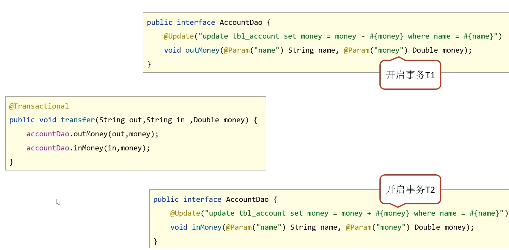

> **开始Spring事务后**  
> 注解表示开启Spring的事务T,
> 数据访问层的两个事务就会加入事务T,  
> 这样，业务层出现异常，数据访问层的事务也会回滚。
>
> - 事务管理员：Spring事务控制发起方
> - 事务协调员：Spring事务控制加入方
> 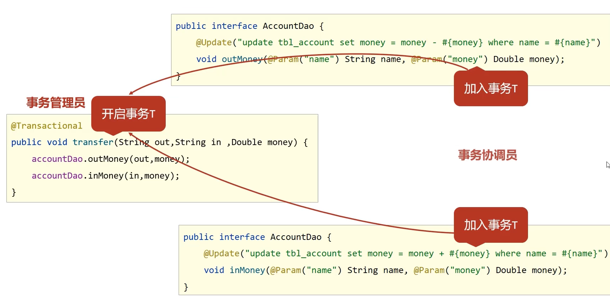

**注意**

注入给事务管理器的数据源对象和注入给myBatis的数据源对象必须是同一个对象


### spring的事务控制


### rollbackFor属性

- 设置事务回滚异常
- 因为spring的事务并不是对出现的所有异常都执行回滚操作
- 默认只对如下异常做回滚
  - Error异常
  - RuntimeException异常

```java
// Sping事务默认会对Error异常和RuntimeException异常执行回滚，对于其他异常则不会执行回滚
@Transactional(rollbackFor = { Exception.class /*这样可让非RunTimeException异常被抛出时，事务也回滚 */})
public interface AccountService {
}
public class AccountServiceImpl implements AccountService {
    // 转账
    @Override
    public void transfer(int fromId, int toId, double money) throws Exception{
        accountDao.addMoneyById(fromId, -money);
        // 默认情况下，这里抛出异常后，上面一行的操作是不会回滚的
        if(true) throw new Exception("自定义异常"); 
        accountDao.addMoneyById(toId, money);
        Account accountA = accountDao.getAccountById(fromId);
        Account accountB = accountDao.getAccountById(fromId);
        if(accountA.getMoney()<0||accountB.getMoney()<0) throw new Error("余额不足");
    }
}
```

### propagation传播属性

`Propagation`枚举类的所有属性

- `REQUIRED` 需要事务，有事务管理员，则加入其事务，没有则新建
- `REQUIRES_NEW` 需要新事务，无论有无事务管理员，都新建事务
- `SUPPORTS` 支持事务，有事务管理员则加入，没有则不加入也不新建
- `NOT_SUPPORTED` 不支持事务，无论有无事务管理员，不加入也不新建
- `MANDATORY` 必须有事务，没有则报错
- `NEVER` 必须没有事务，有则报错


> 案例：完成转账日志记录，转账失败要对转账金额回滚，但无论转账是否成功失败都要记录转账日志。

```java
package com.example.service;

import org.springframework.transaction.annotation.Propagation;
import org.springframework.transaction.annotation.Transactional;

@Transactional(propagation = Propagation.REQUIRES_NEW/*
                                                      * 创建新事务，独立于事务管理者之外单独创建一个新事务，事务管理者管理下的事务出现异常，不会导致此处的事务回滚
                                                      */)
public interface LogService {
    public void log(int uid_from, int uid_to, double money);
}

```

```java
package com.example.service.impl;

import org.springframework.beans.factory.annotation.Autowired;
import org.springframework.stereotype.Component;

import com.example.dao.LogDao;
import com.example.service.LogService;

@Component
public class LogServiceImpl implements LogService {
    @Autowired
    LogDao logDao;

    @Override
    public void log(int uid_from, int uid_to, double money) {
        logDao.log(String.format("用户:%d向用户:%d发起转账请求,转账金额：%f元", uid_from, uid_to, money));
    }
}
```

```java
package com.example.dao;

import org.apache.ibatis.annotations.Insert;
import org.apache.ibatis.annotations.Param;

/*
    create table log(
        info TEXT,
        time DATE
    );
 */
public interface LogDao {
    @Insert("insert into log(info,time) values(#{info},now());")
    public void log(@Param("info") String info);
}
```

```java
package com.example.service.impl;

import java.util.List;

import org.springframework.beans.factory.annotation.Autowired;
import org.springframework.stereotype.Component;

import com.example.dao.AccountDao;
import com.example.domain.Account;
import com.example.service.AccountService;
import com.example.service.LogService;

@Component
public class AccountServiceImpl implements AccountService {
    @Autowired
    AccountDao accountDao;
    @Autowired
    LogService logService;

    // 转账
    @Override
    public void transfer(int fromId, int toId, double money) throws Exception {

        logService.log(fromId, toId, money); // 此处设置了propagation，不会回滚
        accountDao.addMoneyById(fromId, -money); // 此处会回滚
        if (true){
            throw new Error("模拟异常中断，数据回滚，但希望日志仍然写入");
        }
        accountDao.addMoneyById(toId, money);

        Account accountA = accountDao.getAccountById(fromId);
        Account accountB = accountDao.getAccountById(fromId);

        if (accountA.getMoney() >= 0 && accountB.getMoney() >= 0) {
            throw new Error("余额不足，转账失败，数据回滚");
        }
    }
}
```

## SpringMVC

> - SpringMVC 和 servlet 技术类似，均属于 web 表现层开发技术，但比Servlet更简便
> - SpringMVC是基于java实现MVC模型的轻量级web框架

### 入门案例

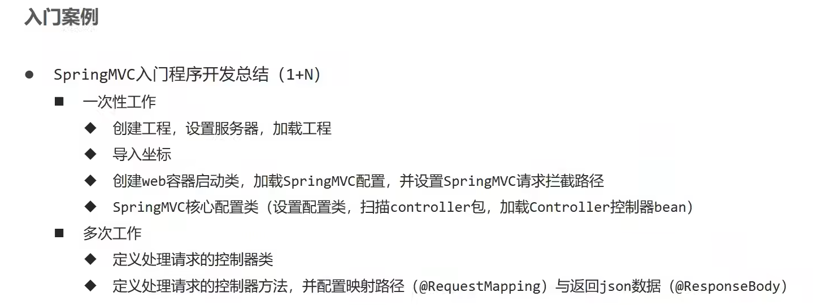


导入必备的坐标

```xml
  <dependencies>
    <dependency>
      <!-- 导入Servlet依赖 -->
      <groupId>javax.servlet</groupId>
      <artifactId>javax.servlet-api</artifactId>
      <version>3.1.0</version>
      <scope>provided</scope> <!-- provided表示该依赖仅在编译和测试环境有效，因为该包在其运行环境（tomcat）中有,如果不这么写会导致冲突 -->
    </dependency>
    <dependency>
      <groupId>org.springframework</groupId>
      <artifactId>spring-webmvc</artifactId>
      <!-- 这个包中包含了基础的springframework-context等的包 -->
      <version>5.2.10.RELEASE</version>
    </dependency>
    <dependency>
      <groupId>junit</groupId>
      <artifactId>junit</artifactId>
      <version>4.11</version>
      <scope>test</scope>
    </dependency>
  </dependencies>
  <build>
    <plugins>
      <plugin>
        <!-- 快速启动Tomcat的插件，否则需要使用maven-war-plugin插件，手动打包成war然后复制到tomcat的webapps目录 -->
        <groupId>org.apache.tomcat.maven</groupId>
        <artifactId>tomcat7-maven-plugin</artifactId>
        <version>2.2</version>
        <configuration>
          <port>80</port>
          <path>/</path>
        </configuration>
      </plugin>
    </plugins>
  </build>
```

编写springConfig配置类

```java
package com.example.config;

import org.springframework.context.annotation.ComponentScan;
import org.springframework.context.annotation.Configuration;

@Configuration // 声明这是一个Spring配置
@ComponentScan("com.example.controller") // 设置Spring加载对应的Bean
public class SpringMvcConfig {
    
}
```

编写Servlet初始化配置类

```java
package com.example.config;

import org.springframework.web.context.WebApplicationContext;
import org.springframework.web.context.support.AnnotationConfigWebApplicationContext;
import org.springframework.web.servlet.support.AbstractDispatcherServletInitializer;

// 定义Servlet容器启动配置类，在里面加载Spring的配置
public class ServeletContainerInitConfig extends AbstractDispatcherServletInitializer {

    @Override
    protected WebApplicationContext createServletApplicationContext() {
        // 固定写法，注意这里是WebApp容器
        AnnotationConfigWebApplicationContext ctx = new AnnotationConfigWebApplicationContext();
        ctx.register(SpringMvcConfig.class);// 注册其配置
        return ctx;
    }

    @Override
    protected String[] getServletMappings() {
        return new String[] { "/" };// 映射到根路径上
    }

    @Override
    protected WebApplicationContext createRootApplicationContext() {
        // 固定写法，注意这里是WebApp容器
        AnnotationConfigWebApplicationContext ctx = new AnnotationConfigWebApplicationContext();
        ctx.register(SpringConfig.class);// 注册Spring的容器
        return ctx;
    }
}
```

编写控制器

```java
package com.example.controller;

import org.springframework.stereotype.Controller;
import org.springframework.web.bind.annotation.RequestMapping;
import org.springframework.web.bind.annotation.ResponseBody;

@Controller // 声明告知Spring这是一个控制器，实际上，这是一个`@Component`的别名
public class UserController {
    @RequestMapping("/save") // url映射
    @ResponseBody // 将返回值作为响应体
    public String save() {
        System.out.println("req save methad.");
        return "{'msg':'req save methad.'}";
    }
}

```

### 入门案例：执行流程


**DispatcherServletInitializer为什么能被加载？**

```
解析
DispatcherServletInitializer 配置类能够被加载的核心是 Java 的 SPI 服务发现机制。

SPI 服务发现机制
服务接口 的定义： 某一个框架定义了某种服务的 接口 ，我们在使用这个框架的时候可以使用不同的服务提供商提供的接口的实现。
注册 服务接口 的实现： 在 classpath:META-INF/services/目录下创建一个以 服务接口 全类名命名的文件，内容为实现类的全类名。
服务加载 定义了 服务接口 的框架在启动时会到 SPI 规范指定的 classpath:META-INF/services/目录下寻找并加载此框架所需服务。
Spring MVC 遵循 SPI 规范，作为Servlet容器的服务提供商向其注册服务
对应于SPI 服务发现机制的三点

服务接口 的定义 Servlet 规范定义了服务接口 javax-servlet-api-xxx.jar/javax.servlet.ServletContainerInitializer
注册 服务接口 的实现： Spring MVC 注册服务。在 spring-web-xxx.jar 包下 有 META-INF/services/javax.servlet.ServletContainerInitializer 文件，内容为 org.springframework.web.SpringServletContainerInitializer
服务加载 Spri
————————————————
版权声明：本文为CSDN博主「Nishkata」的原创文章，遵循CC 4.0 BY-SA版权协议，转载请附上原文出处链接及本声明。
原文链接：https://blog.csdn.net/Nishkata/article/details/125432352
```

### 注意：SpringMVC只管理表现层Bean，Spring只管理业务层Bean和数据访问层Bean


**使用精确匹配的方法**

```java
// 使用精确匹配，只扫描service和dao，不扫描controller
@ComponentScan({ "com.demo.service", "com.demo.dao" }) 

public class SpringConfig {

}
```

```java
@Configuration // 声明这是一个Spring配置
@ComponentScan("com.example.controller") // 设置SpringMVC加载对应的Bean
public class SpringMvcConfig {
}
```

**使用过滤器排除**

```java
@Configuration
// 使用过滤器排除表现层Bean
@ComponentScan(
    value = "com.demo", 
    excludeFilters = {
        // 按注解排除掉控制器
        @Filter(type = FilterType.ANNOTATION, classes = Controller.class)
    }
)
public class SpringConfig {

}
```


### 进一步简化的ServeletContainerInitConfig写法

```java
package com.example.config;

import org.springframework.web.servlet.support.AbstractAnnotationConfigDispatcherServletInitializer;

// 进一步简化的写法
public class ServeletContainerInitConfigSimplify extends AbstractAnnotationConfigDispatcherServletInitializer {
    @Override
    protected Class<?>[] getRootConfigClasses() {
        return new Class[]{SpringConfig.class};
    }

    @Override
    protected Class<?>[] getServletConfigClasses() {
        return new Class[]{SpringMvcConfig.class};
    }

    @Override
    protected String[] getServletMappings() {
        return new String[]{"/"};
    }
}
```

### 请求

#### 请求映射路径


```java
package com.example.controller;

import org.springframework.stereotype.Controller;
import org.springframework.web.bind.annotation.RequestMapping;
import org.springframework.web.bind.annotation.ResponseBody;

@Controller // 声明告知Spring这是一个控制器，实际上，这是一个`@Component`的别名
@RequestMapping("/user") // 访问前缀
public class UserController {
    @RequestMapping("/save") // url映射
    @ResponseBody // 将返回值作为响应体
    public String save() {
        System.out.println("req save methad.");
        return "{'msg':'req /user/save methad.'}";
    }

    @RequestMapping("/delete")
    @ResponseBody
    public String delete() {
        System.out.println("req save methad.");
        return "{'msg':'req /user/delete methad.'}";
    }
}
```

#### POST和Get请求

**Get请求传递普通参数**


**Post请求传递普通参数**


> 这种方式可以通用于 post 和 get 方法的urlencoded格式的数据
>
> 但不能用于form-data格式的数据

```java
package com.example.controller;

import org.springframework.stereotype.Controller;
import org.springframework.web.bind.annotation.RequestMapping;
import org.springframework.web.bind.annotation.ResponseBody;

@Controller
@RequestMapping("/parms")
public class TestReveiceParms {
    @RequestMapping("/show")
    @ResponseBody
    // 通用于 post 和 get 方法的urlencoded格式的数据 
    String fun(String name, int age) {
        System.out.println(name);
        System.out.println(age);
        return "" + name + age;
    }
}
```

#### POST请求参数中文乱码的解决

**使用过滤器解决POST请求参数中中文乱码的问题**
> 这种方式只能解决Post中文乱码的问题

```java
package com.example.config;

import java.nio.charset.Charset;

import javax.servlet.Filter;

import org.springframework.web.filter.CharacterEncodingFilter;
import org.springframework.web.servlet.support.AbstractAnnotationConfigDispatcherServletInitializer;

public class ServeletContainerInitConfigSimplify extends AbstractAnnotationConfigDispatcherServletInitializer {
    @Override
    protected Class<?>[] getRootConfigClasses() {
        return new Class[] { SpringConfig.class };
    }

    @Override
    protected Class<?>[] getServletConfigClasses() {
        return new Class[] { SpringMvcConfig.class };
    }

    @Override
    protected String[] getServletMappings() {
        return new String[] { "/" };
    }

    // 解决params参数中中文字符乱码的问题
    @Override
    protected Filter[] getServletFilters() {
        CharacterEncodingFilter cFilter = new CharacterEncodingFilter("UTF-8");
        return new Filter[] { cFilter };
    }
}
```

#### 请求参数和函数形式参数不一致的解决

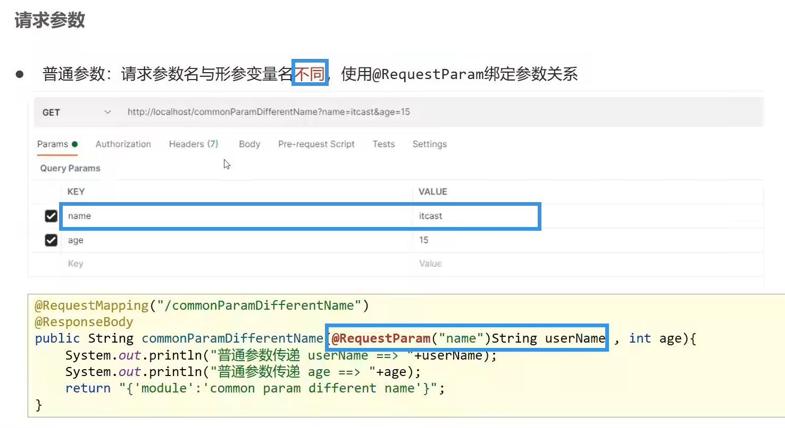


#### 五种类型参数的传递

##### 普通参数


##### 实体类属性自动装配


##### 嵌套实体类属性的自动装配


**注意事项**
> 最好保证pojo类有无参构造器，和所有属性的setter和getter方法

```java
package com.example.pojo;

public class User {
    String name;
    int age;
    Address address;

    User() {
        System.out.println("User.User()");
        // 最好保证至少有无参构造函数
    }

    public User(String name, int age) {
        // 如果前端参数提供name和age属性，则会调用此处的构造函数，不会报错，
        // 但是如果前端只提供name参数，
        // 则应该保证至少有无参构造函数+setName方法
        // 或者应该保证有一个User User(String name)构造方法
        this.name = name;
        this.age = age;
        System.out.println("User.User(String name, int age)");
    }
    @Override
    public String toString() {
        return "User [name=" + name + ", age=" + age + ", address=" + address + "]";
    }

    public String getName() {
        return name;
    }

    public int getAge() {
        return age;
    }

    public void setAddress(Address address) {
        this.address = address;
    }

    public Address getAddress() {
        // 这个方法必须要有，在获取到 address.country=china时，
        // 会调用这个方法，如果该方法返回null,则调用无参构造方法创建
        // 然后调用address.setCountry()方法，然后会调用setAddress()方法
        // 在读取到address.city=?? 时，又会接着调用这里的getAddress方法，获取address对象，然后给address注入city
        return address;
    }
}
```

```java
package com.example.pojo;

public class Address {
    String country;
    String city;

    Address(){
        // 最好至少保证有无参构造方法
        System.out.println("Address.Address()");
    }
    public void setCountry(String country) {
        this.country = country;
    }
    public void setCity(String city) {
        this.city = city;
    }
    @Override
    public String toString() {
        return "Address [country=" + country + ", city=" + city + "]";
    }
}
```

##### 数组类型传参


##### 集合类型的传参


#### JSON数据的传递

##### 基础配置

**依赖**


```xml
    <dependency>
      <groupId>com.fasterxml.jackson.core</groupId>
      <!-- 处理JSON的包 -->
      <artifactId>jackson-databind</artifactId>
      <version>2.9.0</version>
    </dependency>
```


**配置SpringMvcConfig**

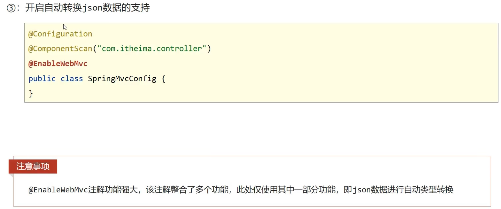
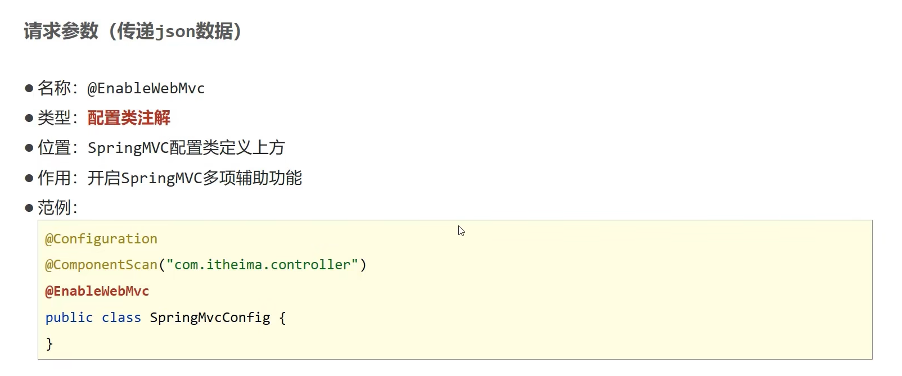

```java
@Configuration
@ComponentScan("com.example.controller")
@EnableWebMvc // 开启一系列功能，包括自动将请求体中的JSON数据自动装配到处理函数的形参中
public class SpringMvcConfig {
    
}
```

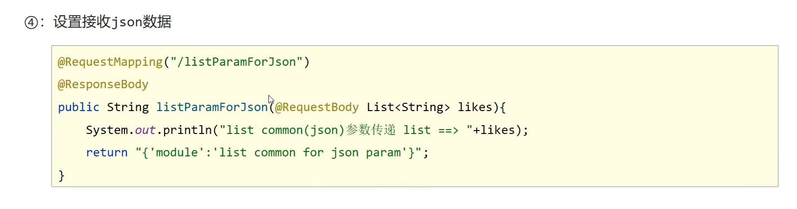
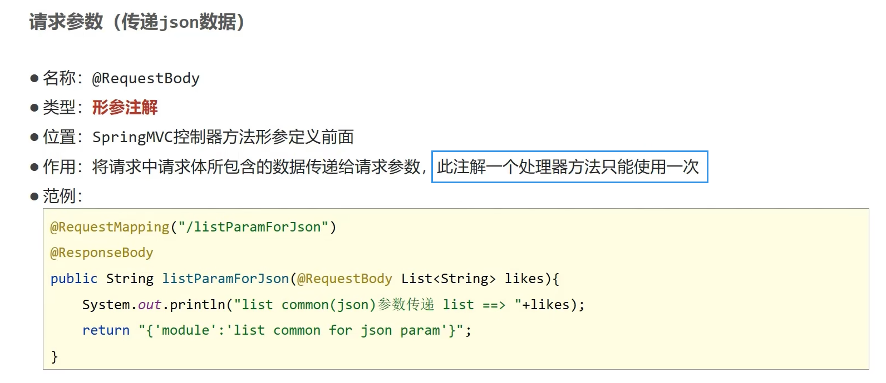

```java
@Controller
@RequestMapping("/testjson")
public class TestReviceJson {
    // 请求：localhost/testjson/array
    // 数据：["123","456"]
    // 返回：[123, 456]
    @ResponseBody
    @RequestMapping("/array")
    String array(@RequestBody /* json在body中 */ String[] array) {
        return Arrays.toString(array);
    }
}
```

#### @RequestBody和@RequestParam的区别


#### 不同格式的日期参数的接收

```java
package com.example.controller;

import java.util.Date;

import org.springframework.format.annotation.DateTimeFormat;
import org.springframework.stereotype.Controller;
import org.springframework.web.bind.annotation.RequestMapping;
import org.springframework.web.bind.annotation.ResponseBody;

@Controller
@RequestMapping("/testdate")
public class TestReviceDate {
    // 请求：localhost/testdate/dates?date1=2023/12/12 23:59:59&date2=2023-12-12&date3=2023/10/12 08:59:59
    // 数据：
    // 返回：
    /*
     * 输出：
     * Tue Dec 12 23:59:59 CST 2023
     * yyyy-MM-dd => Tue Dec 12 00:00:00 CST 2023
     * yyyy/MM/dd HH:mm:ss => Thu Oct 12 08:59:59 CST 2023
     */
    @RequestMapping("/dates")
    @ResponseBody
    String dates(
            Date date1,// 默认按照Date(String s)的方式解析时间，该构造函数可以接收的格式多种多样
            /*DateTimeFormat指定按何种格式解析时间*/
            @DateTimeFormat(pattern = "yyyy-MM-dd") Date date2, 
            @DateTimeFormat(pattern = "yyyy/MM/dd HH:mm:ss") Date date3) {
        System.out.println("date1:" + date1);
        System.out.println("date2:yyyy-MM-dd => " + date2);
        System.out.println("date3:yyyy/MM/dd HH:mm:ss => " + date3);
        return "";
    }
}
```

**底层原理：Spring核心的类型转换器接口**

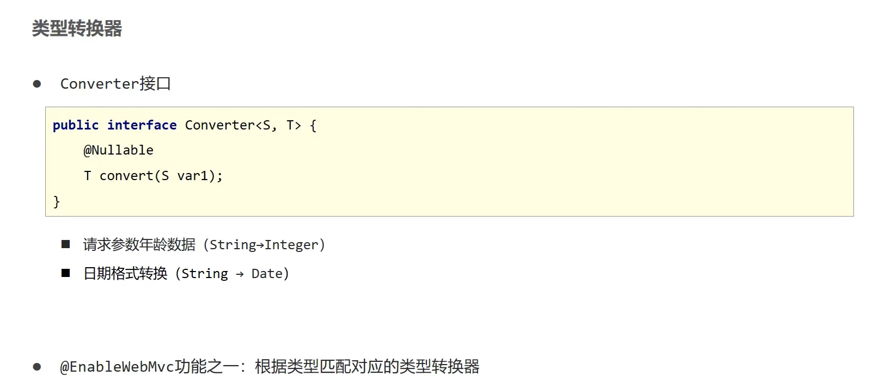

### 响应

> - 响应页面
> - 响应数据
>   - 文本数据
>   - JSON数据

**测试案例实现**
> 需要注意的是，对象转JSON，需要有getter方法

```java
package com.example.controller;

import java.util.HashSet;
import java.util.LinkedList;
import java.util.List;
import java.util.Set;

import org.springframework.stereotype.Controller;
import org.springframework.web.bind.annotation.RequestMapping;
import org.springframework.web.bind.annotation.ResponseBody;

import com.example.pojo.User;

@Controller
@RequestMapping("/TestResponse")
public class TestResponse {
    // 请求：localhost/TestResponse/idx
    // 参数：
    // 返回： <html><body><h2>Hello World!</h2></body></html>
    // @ResponseBody 这句话不要加
    @RequestMapping("/idx")
    String idx() {
        return "/index.jsp";
    }

    // 请求：localhost/TestResponse/str
    // 参数：
    // 返回：this is a string.
    @ResponseBody
    @RequestMapping("/str")
    String str() {
        return "this is a string.";
    }

    // 请求：localhost/TestResponse/obj
    // 参数：
    // 返回：{"name": "dyg","age": 16 }
    @ResponseBody
    @RequestMapping("/obj")
    User obj() {
        return new User("dyg", 16);
    }

    // 请求：localhost/TestResponse/list
    // 参数：
    // 返回：[ { "name": "dyg1", "age": 10 }, { "name": "dyg2", "age": 11 }]
    @ResponseBody
    @RequestMapping("/list")
    List<User> list() {
        List<User> list = new LinkedList<>();
        list.add(new User("dyg1", 10));
        list.add(new User("dyg2", 11));
        return list;
    }

    // 请求：localhost/TestResponse/set
    // 参数：
    // 返回：[ { "name": "dyg1", "age": 10 }, { "name": "dyg2", "age": 11 }]
    @ResponseBody
    @RequestMapping("/set")
    Set<User> set() {
        Set<User> set = new HashSet<>();
        set.add(new User("dyg1", 10));
        set.add(new User("dyg2", 11));
        return set;
    }
}
```

#### 响应页面

不写`@ResponseBody`注解就是默认把返回值的字符串当成页面文件名。
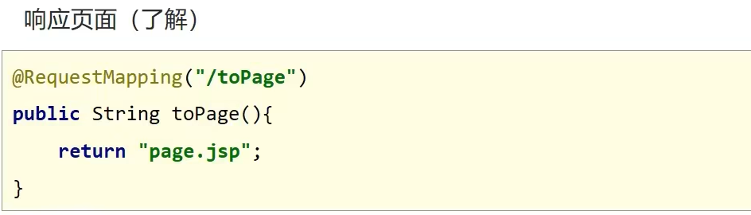

#### 响应数据

使用`@ResponseBody`注解，把返回的字符串直接作为响应体


#### 响应JSON格式的对象数据

使用`@ResponseBody`注解,并且需要使用`jackson-databind`这个包，函数返回值为对象

> Jackson是springMVC默认的MessageConverter（消息序列化工具）


#### 响应JSON格式的集合数据


#### `@ResponseBody`注解转换JSON格式的过程

- @ResponseBody注解的作用是设置当前控制器返回值作为响应体
    
- 当返回一个对象时，默认使用的是HTTPMessageConverter来做数据格式的转换
    
- 而HTTPMessageConverter的实现类使用了jackson来做json格式的数据转换
    

### REST风格


#### Restful入门案例

```java
package com.example.controller;

import org.springframework.stereotype.Controller;
import org.springframework.web.bind.annotation.*;

import com.example.pojo.User;

@Controller
public class UserController {
    // 请求：localhost/users/5
    // 参数：
    // 返回：get:5
    @ResponseBody
    @RequestMapping(value = "/users/{id}", method = RequestMethod.GET)
    String get(@PathVariable int id) {
        return "get:" + id;
    }

    // 请求：localhost/users
    // 参数：
    // 返回：save:User [name=dyg, age=10]
    @ResponseBody
    @RequestMapping(value = "/users", method = RequestMethod.POST)
    String save(User user) {
        return "save:" + user;
    }

    // 请求：localhost/users?name=dyg&age=18
    // 参数：
    // 返回：update:User [name=dyg, age=18]
    @ResponseBody
    @RequestMapping(value = "/users", method = RequestMethod.PUT)
    String update( User user) {
        return "update:" + user;
    }

    // 请求：localhost/users/5
    // 参数：
    // 返回：delete:5
    @ResponseBody
    @RequestMapping(value = "/users/{id}", method = RequestMethod.DELETE)
    String delete(@PathVariable int id) {
        return "delete:" + id;
    }
}
```

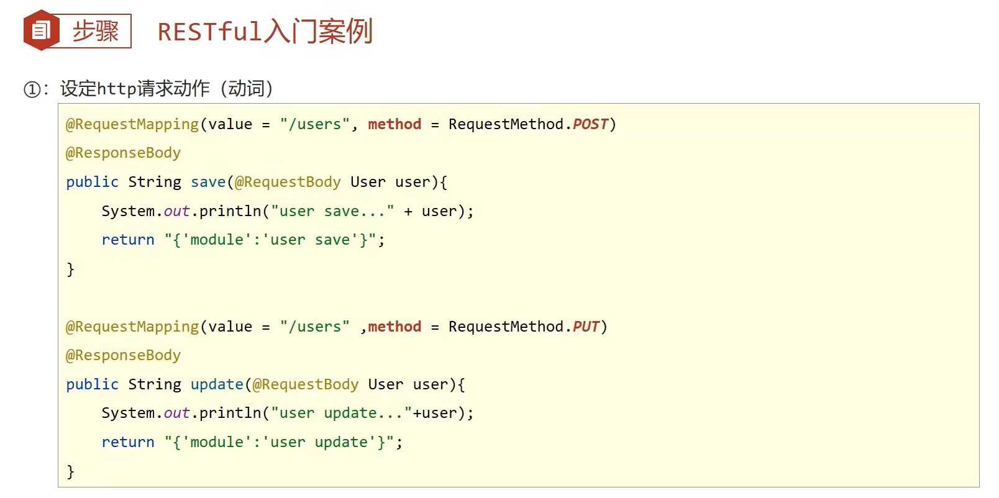


#### Restful入门案例的简化

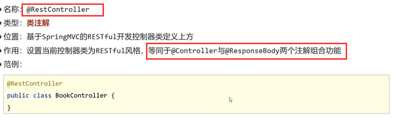


```java
package com.example.controller;

import org.springframework.web.bind.annotation.*;

import com.example.pojo.User;

// @Controller
// @ResponseBody
@RestController() // 代替上面两句话
@RequestMapping("/users")
public class UserController {
    // 请求：localhost/users/5
    // 参数：
    // 返回：get:5
    // @RequestMapping(value = "/{id}", method = RequestMethod.GET)
    @GetMapping("/{id}") // 代替上面一句话
    String get(@PathVariable int id) {
        return "get:" + id;
    }

    // 请求：localhost/users
    // 参数：
    // 返回：save:User [name=dyg, age=10]
    // @RequestMapping(method = RequestMethod.POST)
    @PostMapping // 代替上面一句话
    String save(User user) {
        return "save:" + user;
    }

    // 请求：localhost/users?name=dyg&age=18
    // 参数：
    // 返回：update:User [name=dyg, age=18]
    // @RequestMapping(method = RequestMethod.PUT)
    @PutMapping // 代替上面一句话
    String update(User user) {
        return "update:" + user;
    }

    // 请求：localhost/users/5
    // 参数：
    // 返回：delete:5
    // @RequestMapping(value = "/{id}", method = RequestMethod.DELETE)
    @DeleteMapping("/{id}") // 代替上面一句话
    String delete(@PathVariable int id) {
        return "delete:" + id;
    }
}
```

### 设置对静态资源的访问放行


```java
package com.example.config;

import org.springframework.context.annotation.Configuration;
import org.springframework.web.servlet.config.annotation.ResourceHandlerRegistry;
import org.springframework.web.servlet.config.annotation.WebMvcConfigurationSupport;

@Configuration
public class SpringMvcConfigSUpport extends WebMvcConfigurationSupport {
    @Override
    protected void addResourceHandlers(ResourceHandlerRegistry registry) {
        // 请求dist目录时，相应dist目录的资源
        registry.addResourceHandler("/dist/**").addResourceLocations("/dist/");
    }
}
```

```java
@Configuration // 声明这是一个Spring配置
@ComponentScan("com.example.controller") // 设置SpringMVC加载对应的Bean
@Import(SpringMvcConfigSUpport.class)// 导入springMvc配置支持
@EnableWebMvc // 开启一系列功能，包括自动将请求体中的JSON数据自动装配到处理函数的形参中
public class SpringMvcConfig {
}
```

## SSM整合总结

`S`pringFramework + `S`pringMCV + `M`yBatis


### Spring整合MyBatis


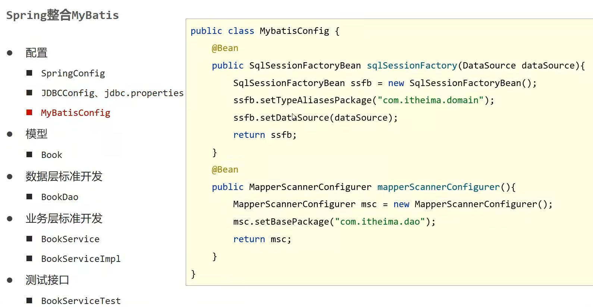

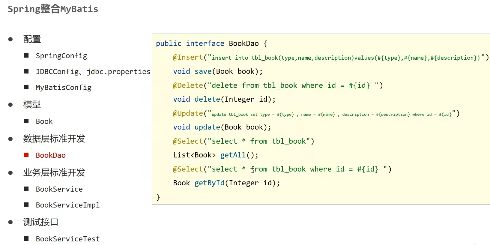


### Spring整合SpringMVC


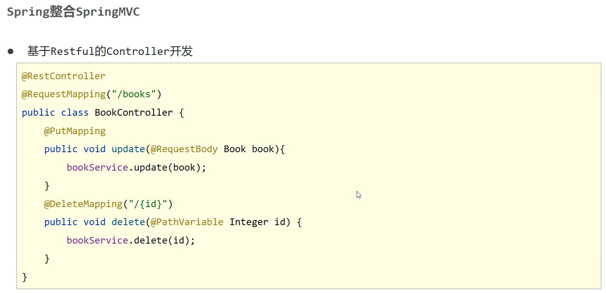


### 表现层返回格式的统一

**表现层返回值格式存在很多问题**


优化1：把数据封装到json的date属性


优化2：为区分不同操作的相同返回值


优化3：查不存在的数据，最后一位是1表示查询成功，是0表示查询失败


优化4：显示查询失败的信息


**表现层统一的数据格式**
> 并不固定唯一


```java
public class Result {
    Integer code;
    Object data;
    String msg;
}
```

```java
package com.demo.controller;

public class Code {
    final static int BOOK_SAVE_OK = 20001;// Book保存成功
    final static int BOOK_DELE_OK = 20011;// Book删除成功
    final static int BOOK_UPDT_OK = 20021;// Book更新成功
    final static int BOOK_FIND_OK = 20031;// Book查找成功
    
    final static int BOOK_SAVE_ER = 20000;// Book保存失败
    final static int BOOK_DELE_ER = 20010;// Book删除失败
    final static int BOOK_UPDT_ER = 20020;// Book更新失败
    final static int BOOK_FIND_ER = 20030;// Book查找失败
}
```

```java
package com.demo.controller;
public class Msg {
    final static String BOOK_SAVE_OK = "Book保存成功";
    final static String BOOK_DELE_OK = "Book删除成功";
    final static String BOOK_UPDT_OK = "Book更新成功";
    final static String BOOK_FIND_OK = "Book查找成功";
    final static String BOOK_SAVE_ER = "Book保存失败";
    final static String BOOK_DELE_ER = "Book删除失败";
    final static String BOOK_UPDT_ER = "Book更新失败";
    final static String BOOK_FIND_ER = "Book查找失败";
}

```

### SSM综合案例实现和测试

```java
@Controller
@ResponseBody
@RequestMapping("/books")
public class BookController {
    @Autowired
    BookService bookService;

    // 请求：localhost/books
    // 方式：POST
    // 参数：{ "name":"post-tes1t", "author":"me", "description":"des"}
    // 响应：{ "code": 20001, "data": true, "msg": "Book保存成功"}
    @PostMapping
    Result add(@RequestBody Book book) {
        boolean flag = bookService.add(book);
        return new Result(
                flag ? Code.BOOK_SAVE_OK : Code.BOOK_SAVE_ER,
                flag,
                flag ? Msg.BOOK_SAVE_OK : Msg.BOOK_SAVE_ER);
    }

    // 请求：localhost/books/1
    // 方式：Delete
    // 参数：
    // 响应：{ "code": 20011, "data": true, "msg": "Book删除成功"}
    @DeleteMapping("/{id}")
    Result delete(@PathVariable Integer id) {
        boolean flag = bookService.deleteById(id);
        return new Result(
                flag ? Code.BOOK_DELE_OK : Code.BOOK_DELE_ER,
                flag,
                flag ? Msg.BOOK_DELE_OK : Msg.BOOK_DELE_ER);
    }

    // 请求：localhost/books/1
    // 方式：Put
    // 参数：{ "id":1, "name":"post-test1", "author":"dyg", "description":"descrip"}
    // 响应：{ "code": 20021, "data": true, "msg": "Book更新成功"}
    @PutMapping
    Result update(@RequestBody Book book) {
        boolean flag = bookService.update(book);
        return new Result(
                flag ? Code.BOOK_UPDT_OK : Code.BOOK_UPDT_ER,
                flag,
                flag ? Msg.BOOK_UPDT_OK : Msg.BOOK_UPDT_ER);
    }

    // 请求：localhost/books/8
    // 方式：Get
    // 参数：
    // 响应：{ "code": 20031, "data": { "id": 8, "name": "post-tes1t", "author": "me",
    // "description": "des" }, "msg": "Book查找成功"}
    @GetMapping("/{id}")
    Result getById(@PathVariable Integer id) {
        Book res = bookService.getById(id);
        return new Result(
                res != null ? Code.BOOK_FIND_OK : Code.BOOK_FIND_ER,
                res,
                res != null ? Msg.BOOK_FIND_OK : Msg.BOOK_FIND_ER);

    }

    // 请求：localhost/books/
    // 方式：Get
    // 参数：
    // 响应： { "code": 20031, "data": [ { "id": 8, "name": "post-tes1t",
    // "author":"me", "description": "des" } ], "msg": "Book查找成功" }
    @GetMapping
    Result selectAll() {
        List<Book> res = bookService.selectAll();
        return new Result(
                res != null ? Code.BOOK_FIND_OK : Code.BOOK_FIND_ER,
                res,
                res != null ? Msg.BOOK_FIND_OK : Msg.BOOK_FIND_ER);
    }
}
```

### SSM异常处理器


```java
package com.demo.controller;

import org.springframework.web.bind.annotation.ControllerAdvice;
import org.springframework.web.bind.annotation.ExceptionHandler;
import org.springframework.web.bind.annotation.ResponseBody;

@ControllerAdvice
@ResponseBody
public class ExceptionProcessor {

    @ExceptionHandler(Throwable.class)// 捕捉一切异常
    public Result processException(Throwable e) {
        return new Result(
            Code.SERVER_INTERNAL_ERR, // 服务器内部错误
            null,
            Msg.SERVER_INTERNAL_ERR
        );
    }
}
```

### 异常的分类和处理


**分类**
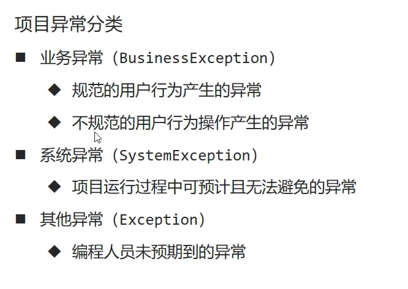

**处理**


#### 自定义异常

```java
package com.demo.exception;

// 业务级异常
public class BusinessException extends RuntimeException {
    int code;

    public BusinessException(int code) {
        this.code = code;
    }

    public BusinessException(String message, int code) {
        super(message);
        this.code = code;
    }

    public BusinessException(String message, Throwable cause, int code) {
        super(message, cause);
        this.code = code;
    }
    public int getCode() {
        return code;
    }
}
```

```java
package com.demo.exception;

// 系统级异常
public class SystemException extends RuntimeException {
    int code;
    

    public SystemException(int code) {
        this.code = code;
    }

    public SystemException(String message, int code) {
        super(message);
        this.code = code;
    }
    public SystemException(String message, Throwable cause, int code) {
        super(message, cause);
        this.code = code;
    }

    public int getCode() {
        return code;
    }
}
```

#### 异常的编码

```java
public class Msg {
    final static String SYSTEM_INTERNAL_ERR = "服务器内部异常";
    final static String BUSINESS_INTERNAL_ERR = "业务级别异常";
    final static String UNKNOWN_ERR = "未知异常";
}
public class Code {
    final static int SYSTEM_INTERNAL_ERR = 50000;// 服务器内部异常
    final static int BUSINESS_INTERNAL_ERR = 60000; // 业务级别异常
    final static int UNKNOWN_ERR = 70000;// 未知异常
}
```

#### 异常的抛出

```java
@Controller
@ResponseBody
@RequestMapping("/books")
public class BookController {
    @Autowired
    BookService bookService;

    // 请求：localhost/books
    // 方式：POST
    // 参数：{ "name":"post-tes1t", "author":"me", "description":"des"}
    // 响应：{ "code": 20001, "data": true, "msg": "Book保存成功"}
    @PostMapping
    Result add(@RequestBody Book book) {
        // 模拟业务级异常
        if (book.getName().length() == 0) {
            // 请求：localhost/books
            // 方式：POST
            // 参数：{ "name":"", "author":"me", "description":"des"}
            // 响应：{ "code": 60000, "data": null, "msg": "业务级别异常"}
            throw new BusinessException(Msg.BUSINESS_INTERNAL_ERR, Code.BUSINESS_INTERNAL_ERR);
        }
        // 模拟系统级异常
        try {
            // 请求：localhost/books
            // 方式：POST
            // 参数：{ "name":"", "author":"me", "description":"des"}
            // 响应：{ "code": 50000, "data": null, "msg": "服务器内部异常"}
            int i = 1 / book.getId();
        } catch (Exception exception) {
            throw new SystemException(Msg.SYSTEM_INTERNAL_ERR, exception, Code.SYSTEM_INTERNAL_ERR);
        }

        // 请求：localhost/books
        // 方式：POST
        // 参数：{ "id":1, "name":"123", "author":"me","description":"很长很长很长很长很长很长的描述"}
        // 响应：{ "code": 70000, "data": null, "msg": "未知异常"}

        boolean flag = bookService.add(book);
        return new Result(
                flag ? Code.BOOK_SAVE_OK : Code.BOOK_SAVE_ER,
                flag,
                flag ? Msg.BOOK_SAVE_OK : Msg.BOOK_SAVE_ER//
        );
    }
}
```

#### 异常的分类处理

```java
package com.demo.controller;

import org.springframework.web.bind.annotation.ControllerAdvice;
import org.springframework.web.bind.annotation.ExceptionHandler;
import org.springframework.web.bind.annotation.ResponseBody;

import com.demo.exception.BusinessException;
import com.demo.exception.SystemException;

@ControllerAdvice
@ResponseBody
public class ExceptionProcessor {
    @ExceptionHandler(SystemException.class) // 捕捉自定义的系统级异常
    public Result processSystemException(SystemException err) {
        // 1.记录日志
        // 2.发消息给运维
        // 3.发邮件给开发者
        // 4.响应给请求
        return new Result(
                err.getCode(), // 错误代码
                null,
                err.getMessage()// 错误消息
        );
    }

    @ExceptionHandler(BusinessException.class) // 捕捉自定义的业务级异常
    public Result processBusinessException(BusinessException err) {
        // 1.响应给请求
        return new Result(
                err.getCode(), // 错误代码
                null,
                err.getMessage()// 错误消息
        );
    }

    @ExceptionHandler(Throwable.class) // 捕捉一切异常
    public Result processException(Throwable e) {
        return new Result(
                Code.UNKNOWN_ERR, // 未知异常
                null,
                Msg.UNKNOWN_ERR // 未知异常
        );
    }
}
```

### 静态资源访问放行

```java
public class SpringMvcSupportConfig  extends WebMvcConfigurationSupport{

    @Override
    protected void addResourceHandlers(ResourceHandlerRegistry registry) {
        // 使所有静态资源访问被放行
        registry.addResourceHandler("/**").addResourceLocations("/");
    }
}
```

```java
@Configuration
@EnableWebMvc
@ComponentScan("com.demo.controller")
@Import(SpringMvcSupportConfig.class) // 记得导入配置，但最好不要写包扫描com.demo.config,不然会把spring的容器也扫描到
public class SpringMvcConfig {
    
}
```

### 前端发送请求和处理响应数据


### SpringMVC拦截器

#### 概念


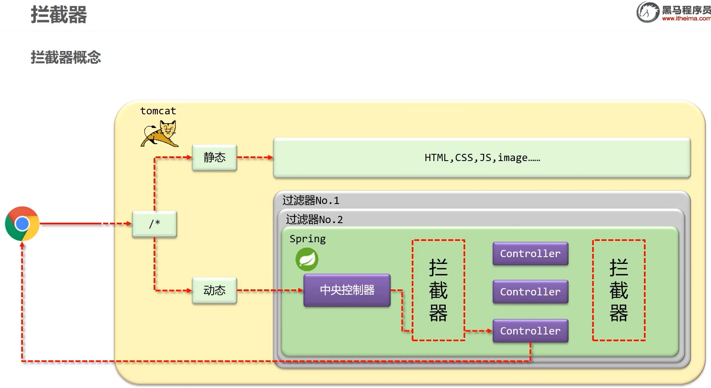

**拦截器和过滤器区别**


#### 入门案例

**拦截器入门案例**
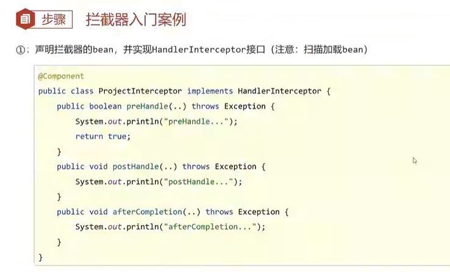


上图的简化写法。


**拦截器**

```java
package com.demo.controller.interceptors;

import javax.servlet.http.HttpServletRequest;
import javax.servlet.http.HttpServletResponse;

import org.springframework.stereotype.Component;
import org.springframework.web.servlet.HandlerInterceptor;
import org.springframework.web.servlet.ModelAndView;

@Component
public class ProjectInterceptor implements HandlerInterceptor {
    @Override
    public boolean preHandle(HttpServletRequest request, HttpServletResponse response, Object handler)
            throws Exception {
                System.out.println("1.preHandle");
        return true;
    }
    @Override
    public void postHandle(HttpServletRequest request, HttpServletResponse response, Object handler,
            ModelAndView modelAndView) throws Exception {
                System.out.println("2.postHandle");
    }

    @Override
    public void afterCompletion(HttpServletRequest request, HttpServletResponse response, Object handler, Exception ex)
            throws Exception {
                System.out.println("3.afterCompletion");
    }

}
```

**拦截器配置**

```java
package com.demo.config.mvc;

import org.springframework.beans.factory.annotation.Autowired;
import org.springframework.context.annotation.Configuration;
import org.springframework.web.servlet.config.annotation.InterceptorRegistry;
import org.springframework.web.servlet.config.annotation.ResourceHandlerRegistry;
import org.springframework.web.servlet.config.annotation.WebMvcConfigurationSupport;

import com.demo.controller.interceptors.ProjectInterceptor;

@Configuration
public class SpringMvcSupportConfig extends WebMvcConfigurationSupport {

    @Autowired // 依赖注入
    ProjectInterceptor projectInterceptor;// 拦截器

    @Override
    protected void addResourceHandlers(ResourceHandlerRegistry registry) {
        // 使所有静态资源访问被放行
        registry.addResourceHandler("/**").addResourceLocations("/");
    }

    @Override
    protected void addInterceptors(InterceptorRegistry registry) {
        // 给books url 添加拦截器
        registry.addInterceptor(projectInterceptor).addPathPatterns("/books", "/books/*", "/books/**");
    }
}

```

**包扫描写法**

```java
@Configuration
@EnableWebMvc
@ComponentScan({
    "com.demo.controller",
    "com.demo.config.mvc" // 这个东西还是得用扫描的方式导入，因为这个里面有属性需要被依赖注入
})
// @Import(SpringMvcSupportConfig.class) // 这么写，拦截器无法加载，类里面的属性无法被依赖注入
public class SpringMvcConfig {
    
}
```

#### 单拦截器执行流程

**执行流程**
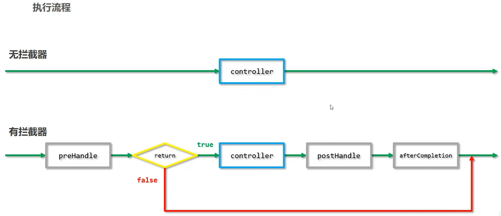

#### 拦截器的形式参数


```java
package com.demo.controller.interceptors;

import javax.servlet.http.Cookie;
import javax.servlet.http.HttpServletRequest;
import javax.servlet.http.HttpServletResponse;
import javax.servlet.http.HttpSession;

import org.springframework.stereotype.Component;
import org.springframework.web.method.HandlerMethod;
import org.springframework.web.servlet.HandlerInterceptor;
import org.springframework.web.servlet.ModelAndView;

@Component
public class ProjectInterceptor implements HandlerInterceptor {
    @Override
    public boolean preHandle(HttpServletRequest request, HttpServletResponse response, Object handler)
            throws Exception {
        Cookie[] cookies = request.getCookies();// 查看是否登录，鉴权
        HttpSession session = request.getSession();// 查看是否登录，鉴权
        System.out.println(cookies);// 输出：[Ljavax.servlet.http.Cookie;@5575d4bc
        System.out.println(session);// 输出：org.apache.catalina.session.StandardSessionFacade@3757f045
        System.out.println(handler); // 输出：com.demo.controller.BookController#add(Book)
        System.out.println(handler.getClass()); // 输出： class org.springframework.web.method.HandlerMethod
        HandlerMethod handlerMethod = (HandlerMethod) handler;
        // handlerMethod.getMethod().invoke();// 反射，直接调用方法
        System.out.println("1.preHandle");
        return true;
    }

    @Override
    public void postHandle(HttpServletRequest request, HttpServletResponse response, Object handler,
            ModelAndView modelAndView) throws Exception {
        // modelAndView 对象可以做页面跳转
        System.out.println("2.postHandle");
    }

    @Override
    public void afterCompletion(HttpServletRequest request, HttpServletResponse response, Object handler, Exception ex)
            throws Exception {
                // ex 是程序中出现的原始的异常
        System.out.println("3.afterCompletion");
    }

}
```

#### 多拦截器简单案例

```java
package com.demo.controller.interceptors;

import javax.servlet.http.HttpServletRequest;
import javax.servlet.http.HttpServletResponse;

import org.springframework.stereotype.Component;
import org.springframework.web.servlet.HandlerInterceptor;
import org.springframework.web.servlet.ModelAndView;

@Component
public class ProjectInterceptor1 implements HandlerInterceptor {
    @Override
    public boolean preHandle(HttpServletRequest request, HttpServletResponse response, Object handler)
            throws Exception {
        System.out.println("1.1.preHandle");
        return true;
    }

    @Override
    public void postHandle(HttpServletRequest request, HttpServletResponse response, Object handler,
            ModelAndView modelAndView) throws Exception {
        // modelAndView 对象可以做页面跳转
        System.out.println("1.2.postHandle");
    }

    @Override
    public void afterCompletion(HttpServletRequest request, HttpServletResponse response, Object handler, Exception ex)
            throws Exception {
                // ex 是程序中出现的原始的异常
        System.out.println("1.3.afterCompletion");
    }
}

```

```java
package com.demo.controller.interceptors;

import javax.servlet.http.HttpServletRequest;
import javax.servlet.http.HttpServletResponse;

import org.springframework.stereotype.Component;
import org.springframework.web.servlet.HandlerInterceptor;
import org.springframework.web.servlet.ModelAndView;

@Component
public class ProjectInterceptor2 implements HandlerInterceptor {
    @Override
    public boolean preHandle(HttpServletRequest request, HttpServletResponse response, Object handler)
            throws Exception {
        System.out.println("2.1.preHandle");
        return true;
    }

    @Override
    public void postHandle(HttpServletRequest request, HttpServletResponse response, Object handler,
            ModelAndView modelAndView) throws Exception {
        // modelAndView 对象可以做页面跳转
        System.out.println("2.2.postHandle");
    }

    @Override
    public void afterCompletion(HttpServletRequest request, HttpServletResponse response, Object handler, Exception ex)
            throws Exception {
                // ex 是程序中出现的原始的异常
        System.out.println("2.3.afterCompletion");
    }
}
```

```java
package com.demo.config.mvc;

import org.springframework.beans.factory.annotation.Autowired;
import org.springframework.context.annotation.Configuration;
import org.springframework.web.servlet.config.annotation.InterceptorRegistry;
import org.springframework.web.servlet.config.annotation.ResourceHandlerRegistry;
import org.springframework.web.servlet.config.annotation.WebMvcConfigurationSupport;

import com.demo.controller.interceptors.ProjectInterceptor1;
import com.demo.controller.interceptors.ProjectInterceptor2;

@Configuration
public class SpringMvcSupportConfig extends WebMvcConfigurationSupport {

    @Autowired // 依赖注入
    ProjectInterceptor1 projectInterceptor1;// 拦截器1
    @Autowired // 依赖注入
    ProjectInterceptor2 projectInterceptor2;// 拦截器2

    @Override
    protected void addResourceHandlers(ResourceHandlerRegistry registry) {
        // 使所有静态资源访问被放行
        registry.addResourceHandler("/**").addResourceLocations("/");
    }

    @Override
    protected void addInterceptors(InterceptorRegistry registry) {
        // 给books url 添加拦截器
        registry.addInterceptor(projectInterceptor1).addPathPatterns("/books", "/books/*", "/books/**");
        registry.addInterceptor(projectInterceptor2).addPathPatterns("/books", "/books/*", "/books/**");
        // 运行顺序和注册顺序相一致
        /*
         * 执行顺序
         * 1.1.preHandle
         *      2.1.preHandle
         *      2.2.postHandle
         * 1.2.postHandle
         *      2.3.afterCompletion
         * 1.3.afterCompletion
         */
    }
}

```

#### 多拦截器_拦截器链的执行顺序

**执行顺序**


## Maven进阶

### 分模块开发


### 分模块或模块拆分的步骤

> 简单来说，模块A依赖模块B、C，  
> 则先把模块B、C通过maven的install命令安装到本地或者发布到私有maven仓库  
> 然后在模块A中引入模块B、C或者说导入其坐标
>


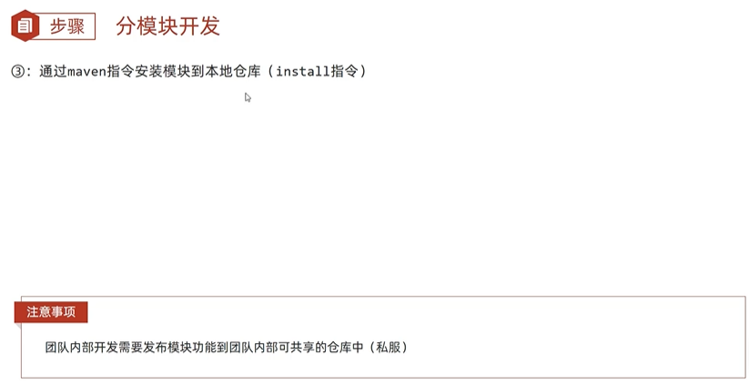

### 依赖传递

- 依赖传递
- 可选依赖
- 排除依赖

**依赖传递**

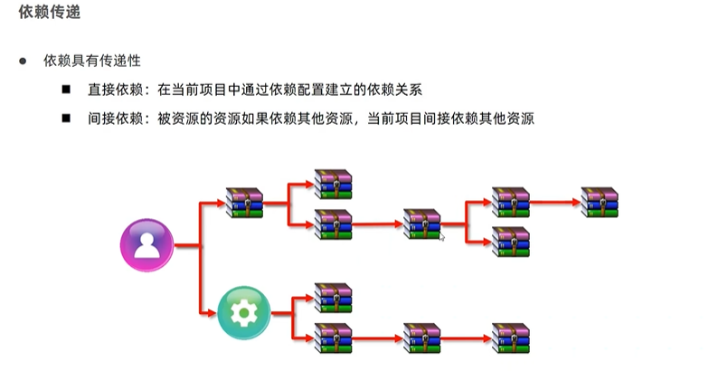

**依赖传递导致的依赖冲突**

- 层叠性：xml的dependencies中写的坐标相同但版本不同的依赖，后写的覆盖先写的。
- 路径优先：层级越深，优先级越低。
- 声明优先：在相同的层级中，配置顺序靠前的，覆盖配置顺序靠后的。

**可选依赖**

> 阻止依赖传递
>
> 就是A->B->C 如果B不想让别知道自己用了C,就需要使用排除依赖，

```xml
    <dependency>
      <groupId>com.demo</groupId>
      <artifactId>demo_pojo</artifactId>
      <version>1.0-SNAPSHOT</version>
      <optional>true</optional>
    </dependency>
```


**排除依赖**
> 就是 A->B->C
>
> 由于依赖传递性，A也能使用C,排除依赖可以使得A无法使用C

```xml
    <dependency>
      <groupId>com.demo</groupId>
      <artifactId>demo_pojo</artifactId>
      <version>1.0-SNAPSHOT</version>
      <exclusions>
          <!-- 在当前项目中排除掉demo_pojo中的某项技术 -->
        <exclusion>
          <groupId>??</groupId>
          <artifactId>??</artifactId>
          <!-- 不用写版本 -->
        </exclusion>
      </exclusions>
    </dependency>
```

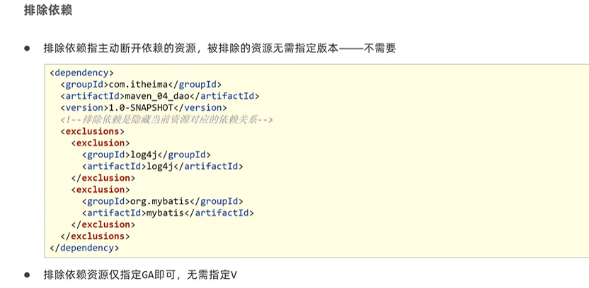

### 聚合

> 对pojo中的某个实体类修改，可能会导致其他包中的代码无法执行


**聚合**


### 继承


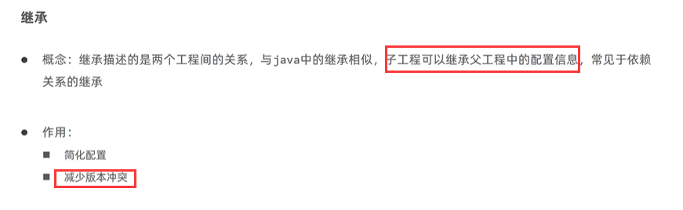


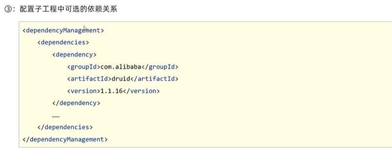
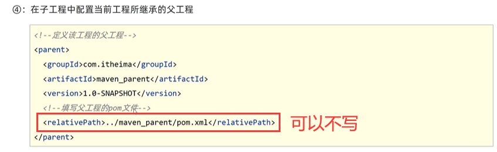


### 聚合与继承


### 属性


```bash
# mvn命令：查看一些系统级的属性
mvn help:system
```


**自定义属性**


**配置**


```xml
  <properties>
      <spring-version>5.2.10.RELEASE</spring-version>
    <project.build.sourceEncoding>UTF-8</project.build.sourceEncoding>
    <maven.compiler.source>1.8</maven.compiler.source>
    <maven.compiler.target>1.8</maven.compiler.target>
  </properties>
  <dependencies>
    <dependency>
      <groupId>org.springframework</groupId>
      <artifactId>spring-webmvc</artifactId>
      <!-- 这个包中包含了基础的springframework-context等的包 -->
      <version>${spring-version}</version>
    </dependency>
    <dependency>
      <groupId>org.springframework</groupId>
      <artifactId>spring-jdbc</artifactId>
      <version>${spring-version}</version>
    </dependency>
  <dependencies>

```

### 资源文件引用


### 坐标命名规范

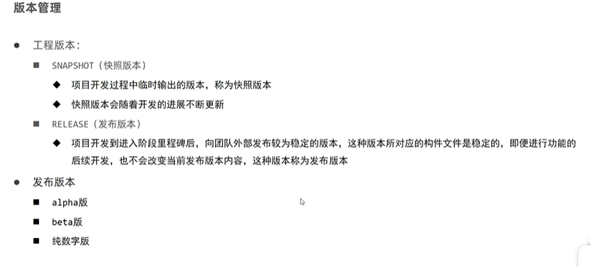

### 多环境开发


```bash
# 命令格式
mvn [指令名称] -P [Profile环境id]

# 示例：
mvn install -P env_test
```

```xml
<profiles>
    <profile>
      <!-- 定义配置名称 -->
      <id>env_dev</id>
      <!-- 定义环境中的属性 -->
      <properties>
        <jdbc.url>开发环境的jdbcURL</jdbc.url>
      </properties>
      <!-- 默认激活 -->
      <activation><activeByDefault>true</activeByDefault></activation>
    </profile>
    <profile>
      <id>env_test</id>
      <properties>
        <jdbc.url>测试环境的jdbcURL</jdbc.url>
      </properties>
    </profile>
    <profile>
      <id>env_prod</id>
      <properties>
        <jdbc.url>生产环境的jdbcURL</jdbc.url>
      </properties>
    </profile>
  </profiles>
  
```

### 跳过测试

命令方式

```bash
mvn [命令] -D skipTests

# 示例
mvn package -D skipTests
```

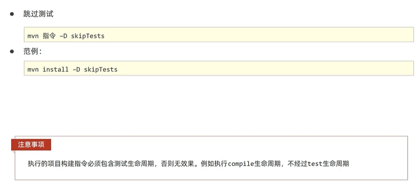

配置方式

```xml
      <plugin>
        <groupId>org.apache.maven.plugins</groupId>
        <artifactId>maven-surefire-plugin</artifactId>
        <version>2.12.4</version>
        <configuration>
          <skepTests>true</skepTests>
        </configuration>
      </plugin>
```

排除配置

```xml
      <plugin>
        <groupId>org.apache.maven.plugins</groupId>
        <artifactId>maven-surefire-plugin</artifactId>
        <version>2.12.4</version>
        <configuration>
          <!-- 整体不测试 -->
          <skepTests>false</skepTests>
          <!-- 排除掉的部分需要测试 -->
          <excludes>
            <!-- 排除项 -->
            <exclude>**/BookServiceTest.java</exclude>
          </excludes>
        </configuration>
      </plugin>
```


### 私有仓库服务器

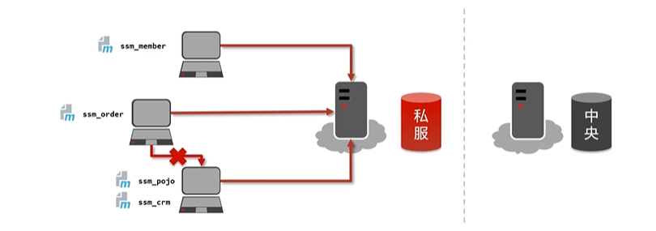


**配置Nuxus**


**修改maven的配置文件**


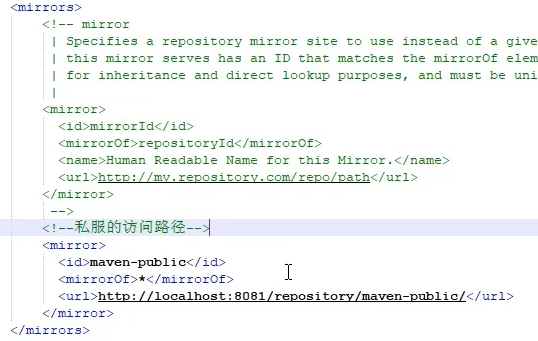

配置项目的pom.xml**


## SpringBoot

SpringBoot是由Pivotal团队提供的全新框架，其设计目的是用来简化Spring应用的初始搭建以及开发过程

### quickstart入门案例

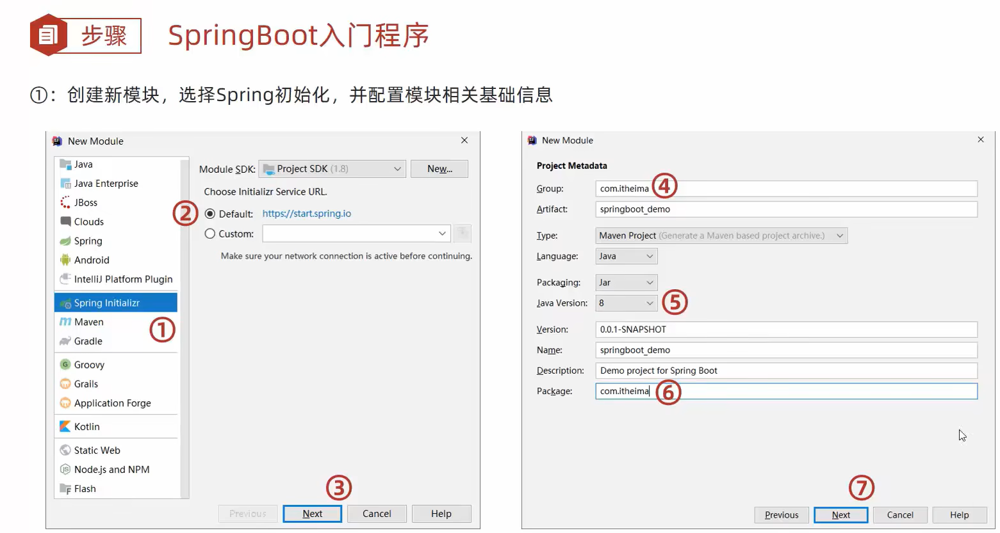

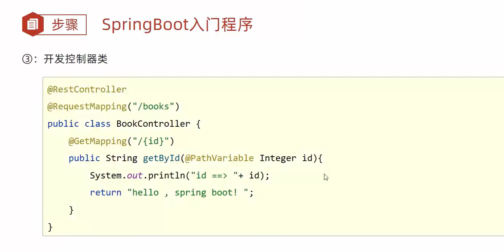
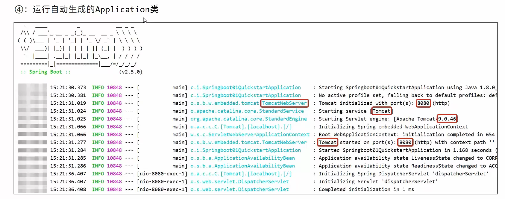

```xml
 <parent>
  <groupId>org.springframework.boot</groupId>
  <artifactId>spring-boot-starter-parent</artifactId>
  <version>2.7.10</version>
  <relativePath/> <!-- lookup parent from repository -->
 </parent>
 <groupId>com.demo</groupId>
 <artifactId>demo</artifactId>
 <version>0.0.1-SNAPSHOT</version>
 <name>demo</name>
 <description>Demo project for Spring Boot</description>
 <properties>
  <java.version>1.8</java.version>
 </properties>
 <dependencies>
  <dependency>
   <groupId>org.springframework.boot</groupId>
   <artifactId>spring-boot-starter-web</artifactId>
  </dependency>

  <dependency>
   <groupId>org.springframework.boot</groupId>
   <artifactId>spring-boot-starter-test</artifactId>
   <scope>test</scope>
  </dependency>
 </dependencies>
```

```java
package com.demo.controller;

import org.springframework.web.bind.annotation.GetMapping;
import org.springframework.web.bind.annotation.RequestMapping;
import org.springframework.web.bind.annotation.RestController;

@RestController
@RequestMapping("/test")
public class TestController {
    @GetMapping
    String get() {
        return "hello spring boot 2.7!!!";
    }
}
```

```java
package com.demo;

import org.springframework.boot.SpringApplication;
import org.springframework.boot.autoconfigure.SpringBootApplication;

@SpringBootApplication
public class DemoApplication {
 public static void main(String[] args) {
  SpringApplication.run(DemoApplication.class, args);
 }
}
```

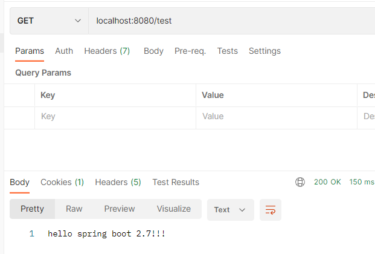

### 简介

SpringBoot优点：快速启动

package打包后可快速启动
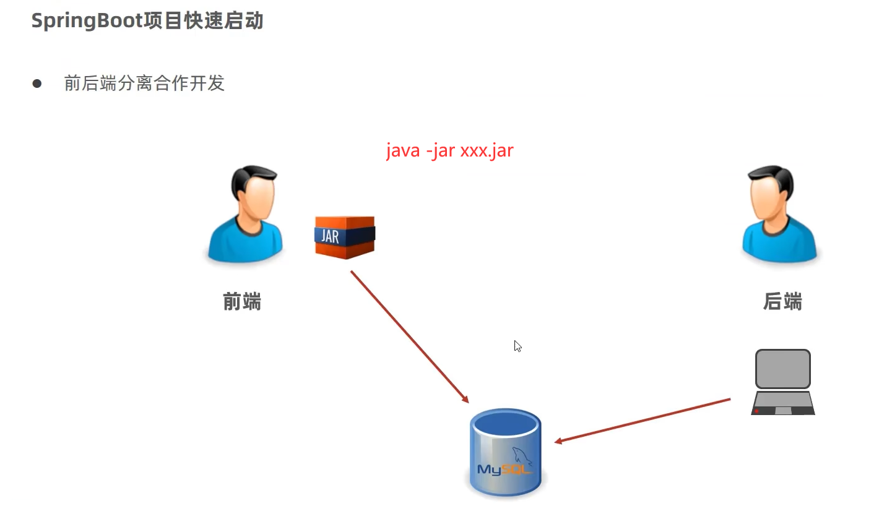

必须要有该插件，它会把项目的所有依赖打包到一个文件，并且会自动找到springboot的main方法，也就是入口。


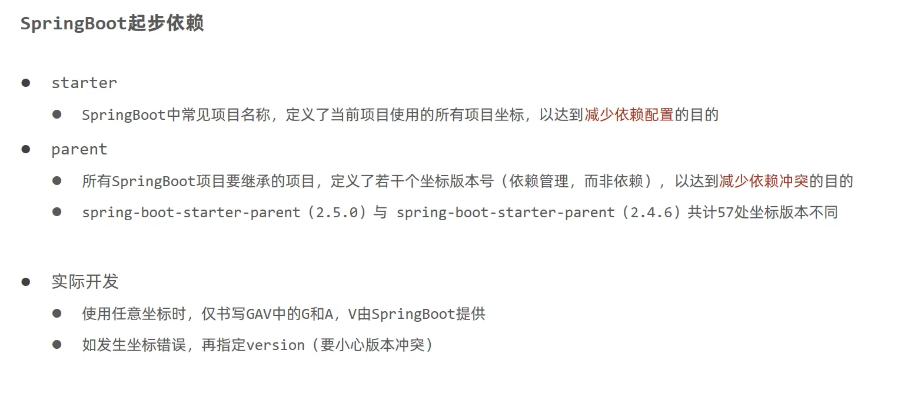

### 替换Tomcat服务器为jetty


### 端口配置

**三种配置文件**


**优先级关系**

> application.properties > application.yml > application.yaml

### yaml

#### 基本写法

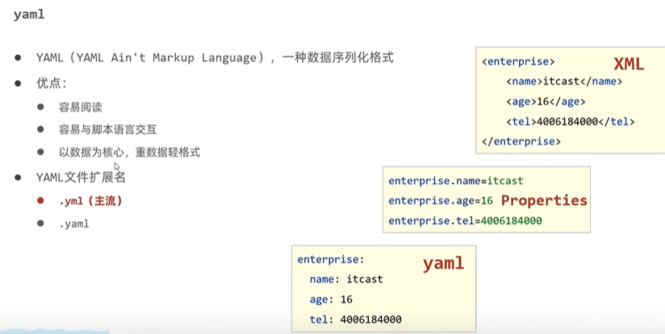


**数组格式**


### 基础配置

#### 数据读取

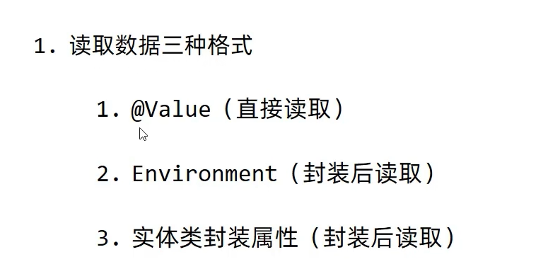

写法一


写法二
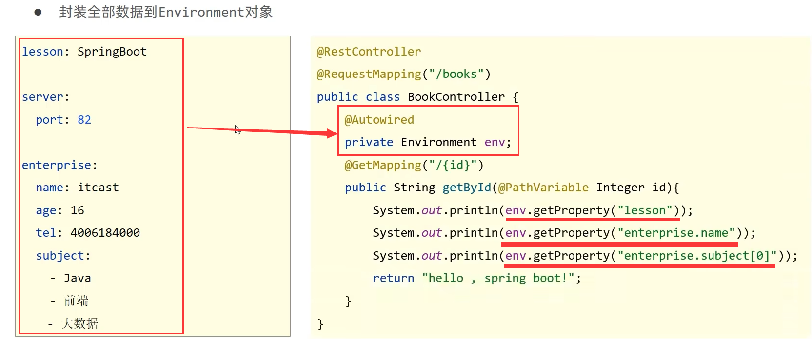

写法三


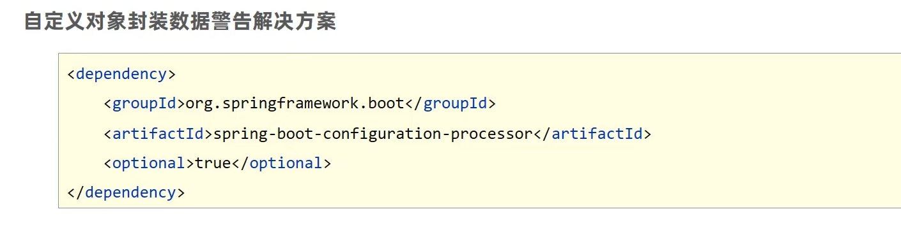

#### 多环境配置写法

**多环境配置写法yaml**


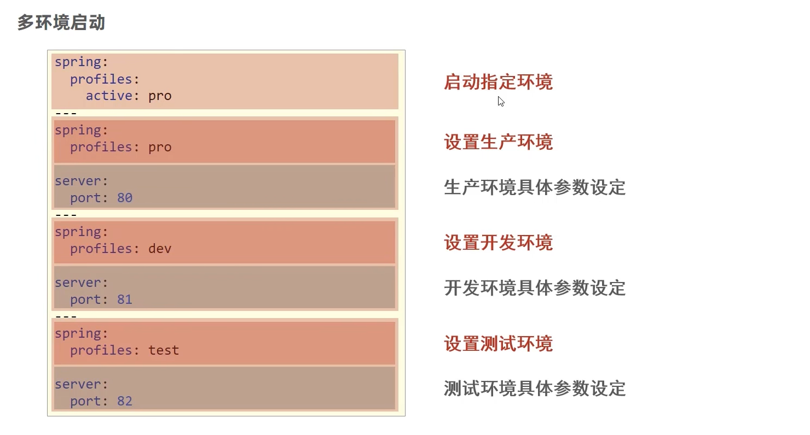


**多环境命令启动**


#### Maven和SpringBoot配置兼容设置


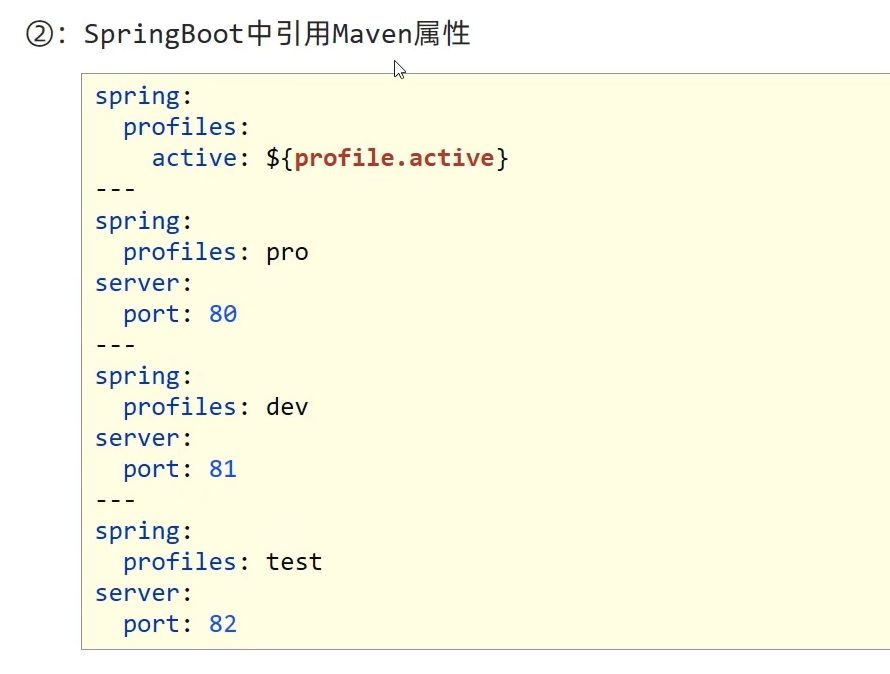
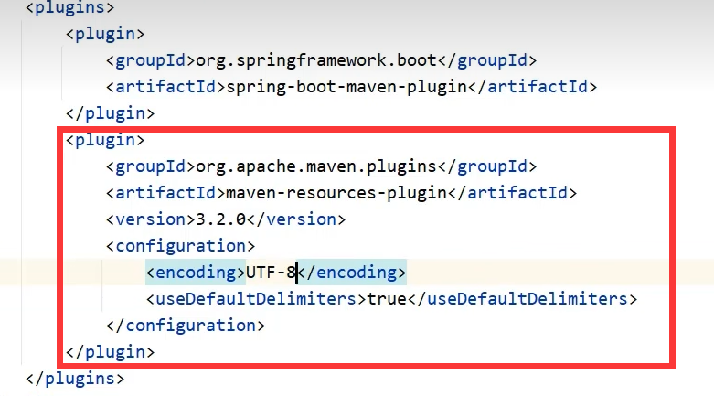

#### config目录下的配置优先级更高


### springboot整合junit


### SpringBoot 整合Mybatis

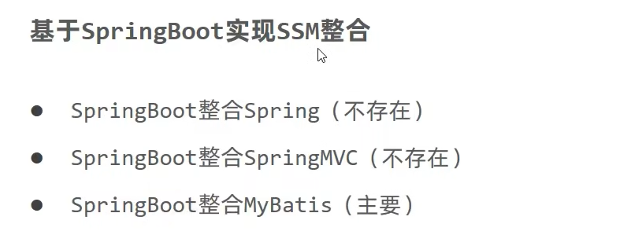


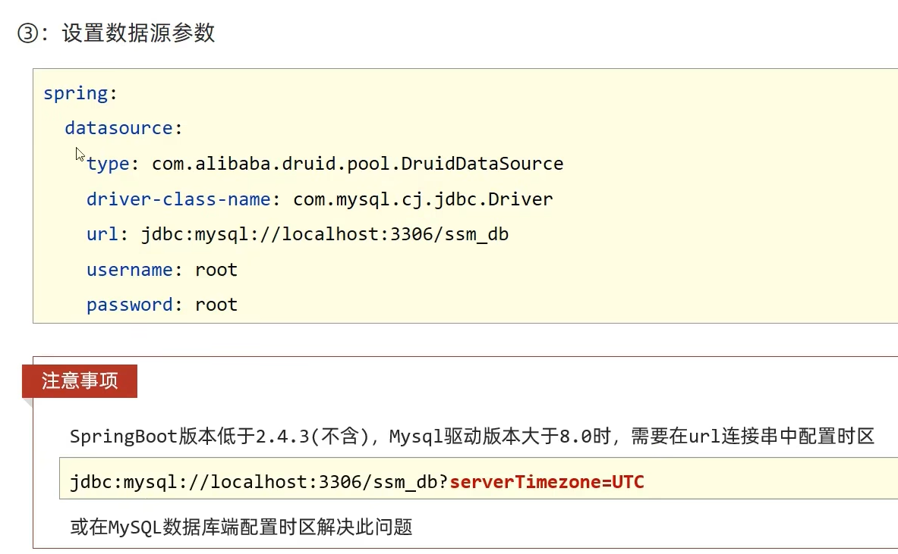


## myBatisPlus

> 学习目标：基于MyBatisPlus完成Dao标准开发

### 概述

是一个用于**简化**MyBatis开发的增强型工具

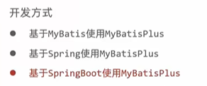


### 入门案例


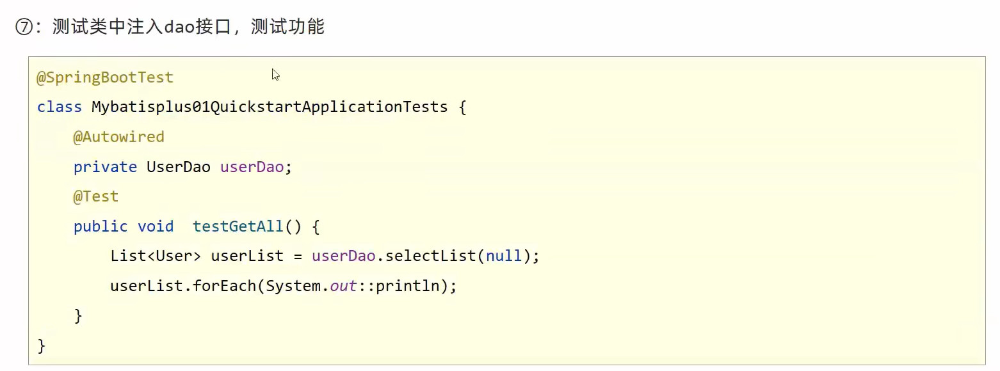

### 特性

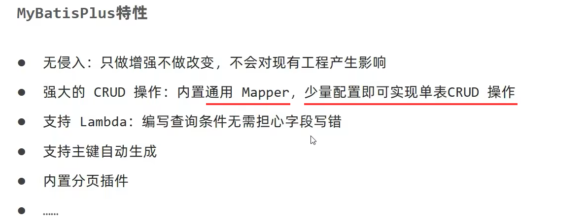

### 标准CURD


### lombok

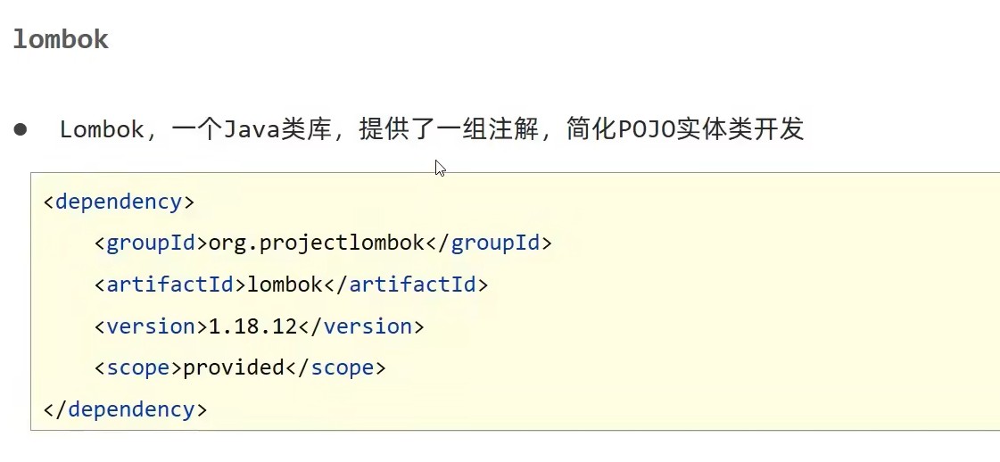

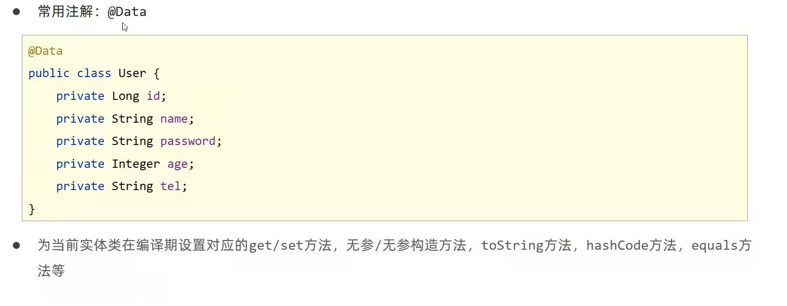

### 分页功能

配置拦截器

```java
package com.demo.config;

import org.springframework.context.annotation.Bean;
import org.springframework.context.annotation.Configuration;

import com.baomidou.mybatisplus.extension.plugins.MybatisPlusInterceptor;
import com.baomidou.mybatisplus.extension.plugins.inner.PaginationInnerInterceptor;

@Configuration
public class MybatisPlusConfig {
    @Bean
    public MybatisPlusInterceptor interceptor() {
        MybatisPlusInterceptor mybatisPlusInterceptor = new MybatisPlusInterceptor();
        mybatisPlusInterceptor.addInnerInterceptor(new PaginationInnerInterceptor());
        return mybatisPlusInterceptor;
    }
}
```

```java
// 测试分页功能
    @Test
    public void testPag(){
        Page<Book> selectPage = bookDao.selectPage(new Page<>(2,4), null);
        System.out.println(selectPage.getCountId());
        System.out.println(selectPage.getCurrent());
        System.out.println(selectPage.getPages());
        System.out.println(selectPage.getSize());
        System.out.println(selectPage.getTotal());
        System.out.println(selectPage.getMaxLimit());
        System.out.println(selectPage.getOrders());
        System.out.println(selectPage.getRecords());
    }
```

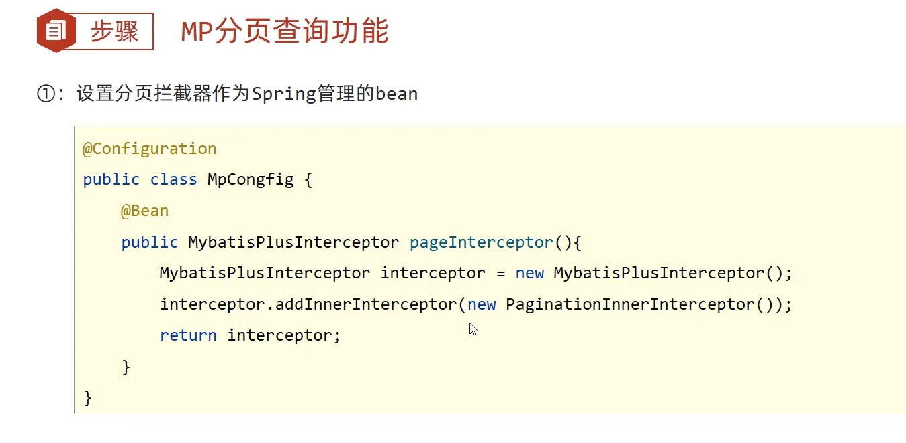


### DQL编程控制

- 条件查询
- 查询投影
- 查询条件设定
- 字段映射与表名映射

#### 条件查询

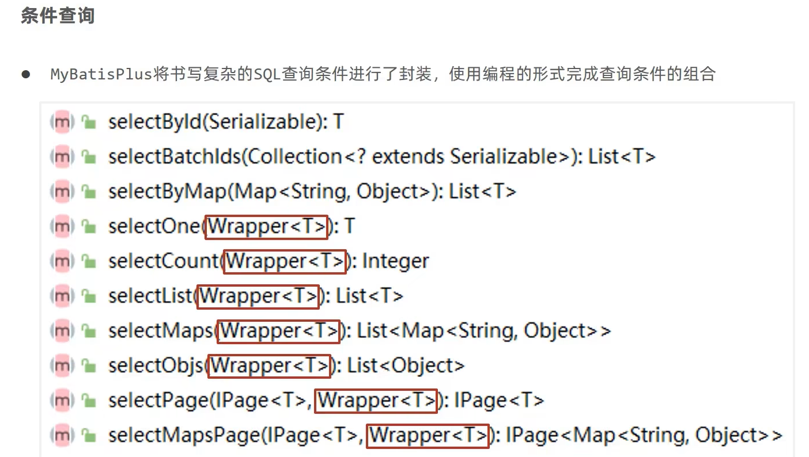

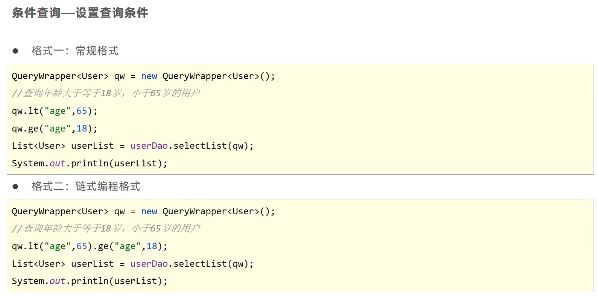

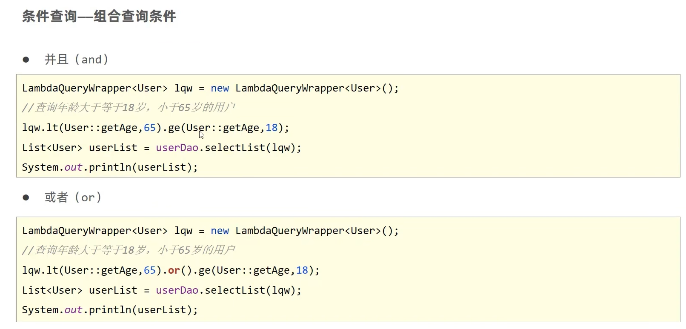

```java
package com.demo.testDao;

import java.util.List;

import org.junit.jupiter.api.Test;
import org.springframework.beans.factory.annotation.Autowired;
import org.springframework.boot.test.context.SpringBootTest;

import com.baomidou.mybatisplus.core.conditions.query.LambdaQueryWrapper;
import com.baomidou.mybatisplus.core.conditions.query.QueryWrapper;
import com.demo.dao.BookDao;
import com.demo.pojo.Book;

@SpringBootTest
public class TestBookDao {
    @Autowired
    BookDao bookDao;

    @Test
    public void testSelectAllWithConditions_1() {
        // 写法1

        QueryWrapper<Book> qwrapper = new QueryWrapper<>();
        // 默认是并且 and & 多条件关系运算

        // 写法1.1
        // qwrapper.ge("id", 5);// id小于5
        // qwrapper.le("id", 10);// id大于100

        // 写法1.2
        // 链式写法
        qwrapper.ge("id", 5).le("id", 10);

        List<Book> selectList = bookDao.selectList(qwrapper);
        System.out.println(selectList);
    }

    @Test
    public void testSelectAllWithConditions_2() {
        // 写法2
        QueryWrapper<Book> qwrapper = new QueryWrapper<>();
        // 默认是并且 and & 多条件关系运算

        // 写法2.1
        // qwrapper.lambda().ge(Book::getId, 5);
        // qwrapper.lambda().le(Book::getId, 10);

        // 写法2.2
        // 链式写法
        qwrapper.lambda().ge(Book::getId, 5).le(Book::getId, 10);

        List<Book> selectList = bookDao.selectList(qwrapper);
        System.out.println(selectList);
    }

    @Test
    public void testSelectAllWithConditions_3() {
        // 写法3
        LambdaQueryWrapper<Book> qwrapper = new LambdaQueryWrapper<>();
        // 默认是并且 and & 多条件关系运算

        // 写法3.1
        // qwrapper.ge(Book::getId, 5);
        // qwrapper.le(Book::getId, 10);

        // 写法3.2
        // 链式写法
        qwrapper.ge(Book::getId, 5).le(Book::getId, 10);

        List<Book> selectList = bookDao.selectList(qwrapper);
        System.out.println(selectList);
    }

    @Test
    public void testSelectAllWithConditions_4() {
        // 多条件
        LambdaQueryWrapper<Book> qwrapper = new LambdaQueryWrapper<>();
        // 默认是并且 and & 多条件关系运算

        // 或运算：
        qwrapper.ge(Book::getId, 5).or().le(Book::getId, 10);

        List<Book> selectList = bookDao.selectList(qwrapper);
        System.out.println(selectList);
    }
}
```

#### 非空判断


```java
package com.demo.testDao;

import java.util.List;

import org.junit.jupiter.api.Test;
import org.springframework.beans.factory.annotation.Autowired;
import org.springframework.boot.test.context.SpringBootTest;

import com.baomidou.mybatisplus.core.conditions.query.LambdaQueryWrapper;
import com.baomidou.mybatisplus.core.conditions.query.QueryWrapper;
import com.demo.dao.BookDao;
import com.demo.dao.BookQuery;
import com.demo.pojo.Book;

@SpringBootTest
public class TestBookDao {
    @Autowired
    BookDao bookDao;

    @Test
    public void test() {
        BookQuery bookQuery = new BookQuery();// 模拟book查询条件
        bookQuery.setId(5L);
        bookQuery.setId_max(10L);

        LambdaQueryWrapper<Book> qlw = new LambdaQueryWrapper<>();
        qlw.ge(bookQuery.getId() != null/* 非空判断 */, Book::getId, bookQuery.getId());
        qlw.le(bookQuery.getId_max() != null, Book::getId, bookQuery.getId_max());

        List<Book> selectList = bookDao.selectList(qlw);
        System.out.println(selectList);
    }
}
```

```java
package com.demo.dao;
import com.demo.pojo.Book;
import lombok.Data;

@Data
public class BookQuery extends Book {// 定义查询条件类
    private Long id_max;// 数值相关的类才需要范围查询
}
```

#### 投影查询


```java
package com.demo.testDao;

import java.util.List;
import java.util.Map;

import org.junit.jupiter.api.Test;
import org.springframework.beans.factory.annotation.Autowired;
import org.springframework.boot.test.context.SpringBootTest;

import com.baomidou.mybatisplus.core.conditions.query.LambdaQueryWrapper;
import com.baomidou.mybatisplus.core.conditions.query.QueryWrapper;
import com.demo.dao.BookDao;
import com.demo.dao.BookQuery;
import com.demo.pojo.Book;

@SpringBootTest
public class TestBookDao {
    @Autowired
    BookDao bookDao;

    @Test
    public void test0() {
        // 方式1
        QueryWrapper<Book> qw = new QueryWrapper<>();
        qw.select("id", "name"); // 指定查询的列名,不查询的列赋值为null

        List<Book> selectList = bookDao.selectList(qw);
        System.out.println(selectList);
    }

    @Test
    public void test1() {
        // 方式2
        LambdaQueryWrapper<Book> qlw = new LambdaQueryWrapper<>();
        qlw.select(Book::getId, Book::getName); // 指定查询的列名,不查询的列赋值为null

        List<Book> selectList = bookDao.selectList(qlw);
        System.out.println(selectList);
    }

    @Test
    public void test2() {
        // 统计列数
        QueryWrapper<Book> qw = new QueryWrapper<>();
        qw.select("count(*)"); // 输出： [{count(*)=34}]

        List<Map<String, Object>> selectList = bookDao.selectMaps(qw);
        System.out.println(selectList);
    }

    @Test
    public void test3() {
        // 分组
        QueryWrapper<Book> qw = new QueryWrapper<>();
        qw.groupBy("name"); // 分组

        List<Map<String, Object>> selectList = bookDao.selectMaps(qw);
        System.out.println(selectList);// 输出：[{author=me, name=1, description=描述, id=16}, {author=me, name=post-tes1t, description=des, id=8}]
    }
    @Test
    public void test4() {
        // 分组
        LambdaQueryWrapper<Book> lqw = new LambdaQueryWrapper<>();
        lqw.groupBy(Book::getName); // 分组
        List<Map<String, Object>> selectList = bookDao.selectMaps(lqw);
        System.out.println(selectList);// 输出：[{author=me, name=1, description=描述, id=16}, {author=me, name=post-tes1t, description=des, id=8}]
    }
    

}

```

#### 条件查询


**equal**

```java
package com.demo.testDao;

import java.util.List;

import org.junit.jupiter.api.Test;
import org.springframework.beans.factory.annotation.Autowired;
import org.springframework.boot.test.context.SpringBootTest;

import com.baomidou.mybatisplus.core.conditions.query.LambdaQueryWrapper;
import com.demo.dao.BookDao;
import com.demo.pojo.Book;

@SpringBootTest
public class TestBookDao {
    @Autowired
    BookDao bookDao;

    @Test
    // 等值判断
    public void equalTest() {
        LambdaQueryWrapper<Book> qwrapper = new LambdaQueryWrapper<>();
        qwrapper.eq(Book::getId, 8);
        Book res = bookDao.selectOne(qwrapper);
        System.out.println(res); //Book [id=8, name=post-tes1t, author=me, description=des]
    }
    @Test
    public void rangeTest(){
        // lt le ==> lessThan小于   lessEqual小于等于
        // gt ge ==> greatThan  greatEqual
        // eq    ==> equal
        // between ==> between
        LambdaQueryWrapper<Book> qwrapper = new LambdaQueryWrapper<>();
        qwrapper.between(Book::getId, 8,10);// v1 <= v2
        List<Book> res = bookDao.selectList(qwrapper);
        System.out.println(res);//[Book [id=8, name=post-tes1t, author=me, description=des], Book [id=9, name=post-tes1t, author=me, description=111], Book [id=10, name=post-tes1t, author=me, description=asb]]
    }
    @Test
    public void likeTest(){
        // 非全文检索匹配
        LambdaQueryWrapper<Book> qwrapper = new LambdaQueryWrapper<>();
        qwrapper.like(Book::getName, "tes");
        // qwrapper.likeLeft(Book::getName, "tes"); // %tes
        // qwrapper.likeRight(Book::getName, "tes"); // tes%
        List<Book> res = bookDao.selectList(qwrapper);
        System.out.println(res);//[Book [id=8, name=post-tes1t, author=me, description=des], Book [id=9, name=post-tes1t, author=me, description=111], Book [id=10, name=post-tes1t, author=me, description=asb], Book [id=11, name=post-tes1t, author=me, description=a1111sb], Book [id=12, name=post-tes1t, author=me, description=a1111111sb], Book [id=13, name=post-tes1t, author=me, description=a1111111sb], Book [id=14, name=post-tes1t, author=me, description=a1111sb], Book [id=15, name=post-tes1t, author=me, description=a1111sb]]

    }
}
```

### `字段<->表名`映射

```java
package com.demo.pojo;

import com.baomidou.mybatisplus.annotation.IdType;
import com.baomidou.mybatisplus.annotation.TableField;
import com.baomidou.mybatisplus.annotation.TableId;
import com.baomidou.mybatisplus.annotation.TableName;

import lombok.Data;

@Data
@TableName(value = "book") // 如果表名和类名不一致，指定表名
public class Book {

    @TableId(type = IdType.AUTO/* id自增 */)
    Long id;
    @TableField(value = "name") // 如果表中的字段名和此处不一致，则可用该注解指定字段名
    String name;
    @TableField(value = "author", select = true) // 如果不想让密码等的字段被查询，可使用select=false
    String author;
    String description;

    @Override
    public String toString() {
        return "Book [id=" + id + ", name=" + name + ", author=" + author + ", description=" + description + "]";
    }
}
```

#### 问题1:表字段与java对象属性不同名


**解决:`@TableField(value="数据库实际字段名")`**


#### 问题2：java对象中存在一个属性但其在表中不存在

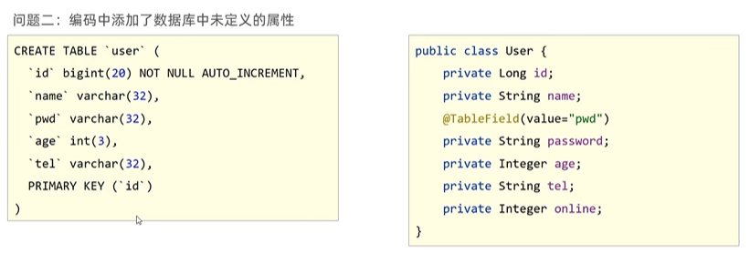

**解决:`@TableField(exist=false)`**


#### 问题3：select * 会查询出敏感字段

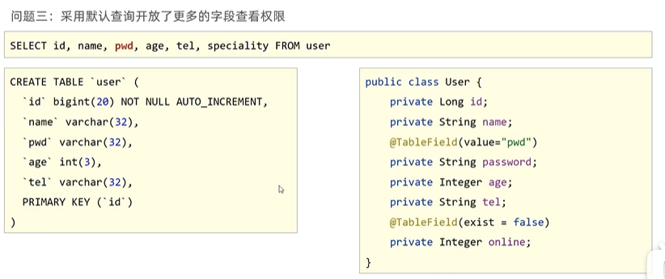

**解决:`@TableField(value="表的字段名",select=false)`**


#### 问题4：表名和java类名不一致


**解决：`@TableName("")`**

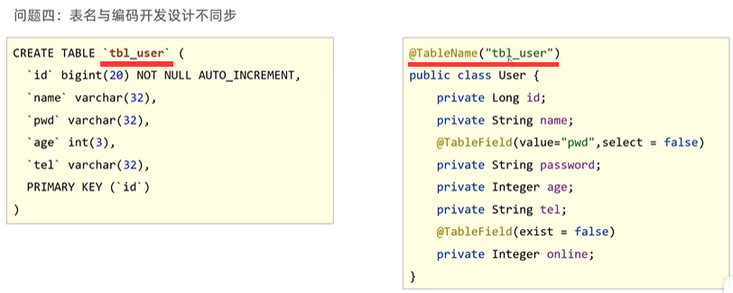

### 主键生成策略


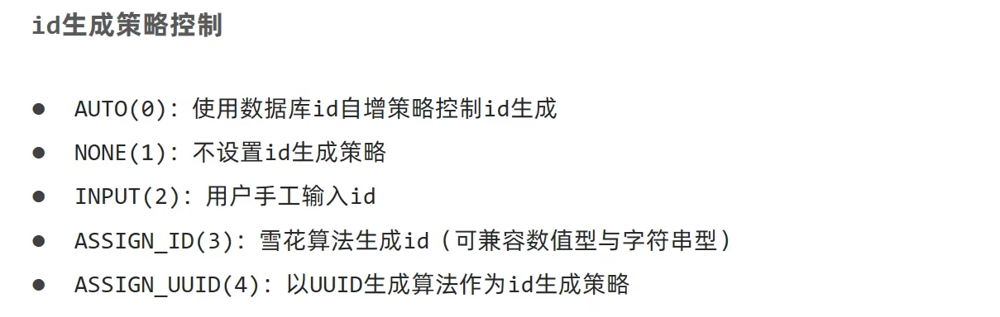

**全局配置**

```yaml
mybatis-plus:
  global-config:
    db-config:
      id-type: assign_id # 全局默认ID分配策略
      table-prefix: tbl_  # 数据库表名为tbl_user 实体类类名如果是User,则需要加前缀tbl_ 在此处的设置是全局设置
```

**实体类配置**

```java
package com.demo.pojo;

import com.baomidou.mybatisplus.annotation.IdType;
import com.baomidou.mybatisplus.annotation.TableField;
import com.baomidou.mybatisplus.annotation.TableId;
import com.baomidou.mybatisplus.annotation.TableName;

import lombok.Data;

@Data
@TableName(value = "book") // 如果表名和类名不一致，指定表名
public class Book {

    @TableId(type = IdType.AUTO/* id自增,数据库该字段必须是自增 */)
    @TableId(type = IdType.ASSIGN_ID/* id手动分配，数据库该字段关闭自增，然后手动指定id */)
    @TableId(type = IdType.ASSIGN_UUID /* 使用雪花算法生成id,也可以手动分配 */)
    Long id;
    @TableField(value = "name") // 如果表中的字段名和此处不一致，则可用该注解指定字段名
    String name;
    @TableField(value = "author", select = true) // 如果不想让密码等的字段被查询，可使用select=false
    String author;
    String description;

    @Override
    public String toString() {
        return "Book [id=" + id + ", name=" + name + ", author=" + author + ", description=" + description + "]";
    }
}
```

> **雪花算法**

### DML编程控制

- insert
- Delete
- Update

#### 多记录操作

**查询**
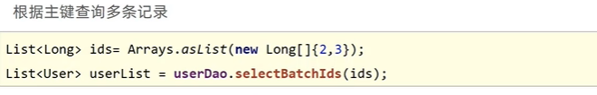

```java
    @Test
    public void testSelects(){
        Collection<Long> ids =new ArrayList<Long>();
        ids.add(17L);
        ids.add(18L);
        System.out.println(bookDao.selectBatchIds(ids)); //[Book [id=17, name=1, author=me, description=描述], Book [id=18, name=1, author=me, description=描述]]
        bookDao.deleteBatchIds(ids);
        System.out.println(bookDao.selectBatchIds(ids)); //[]
    }
```

**删除**


```java
package com.demo.testDao;

import java.util.ArrayList;
import java.util.Collection;

import org.junit.jupiter.api.Test;
import org.springframework.beans.factory.annotation.Autowired;
import org.springframework.boot.test.context.SpringBootTest;

import com.demo.dao.BookDao;

@SpringBootTest
public class TestBookDao {
    @Autowired
    BookDao bookDao;
    @Test
    public void testDeletes(){
        Collection<Long> ids =new ArrayList<Long>();
        ids.add(17L);
        ids.add(18L);
        bookDao.deleteBatchIds(ids);
        System.out.println(bookDao.selectList(null));
    }
}
```

### 逻辑删除

递归删除会导致相关数据全部被丢弃


**逻辑删除**


**在实体类属性上配置**

```java
package com.demo.pojo;
import com.baomidou.mybatisplus.annotation.TableLogic;
@Data
@TableName(value = "book") // 如果表名和类名不一致，指定表名
public class Book {
    // 表示该字段是逻辑删除字段
    @TableLogic(value = "0"/*默认值，不删除 */,delval = "1"/*删除标记值 */)
    Integer exist;// 名称需和表中字段一致

    @Override
    public String toString() {
        return "Book [id=" + id + ", name=" + name + ", author=" + author + ", description=" + description + "]";
    }
}
```

**全局配置**

```yaml
mybatis-plus:
  global-config:
    db-config:
      logic-delete-field: deleted # 全局删除标记字段
      logic-not-delete-value: 0 # 表示不删除的值
      logic-delete-value: 1 # 表示删除的值
```

**数据库表设置**


**局部配置**


**全局配置**


### 乐观锁


**示例分析**


## 代码生成器


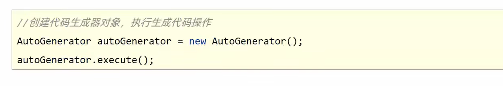


