# SpringBoot2学习笔记


## 目录

- [SpringBoot2学习笔记](#springboot2学习笔记)
  - [目录](#目录)
  - [基础篇](#基础篇)
    - [简介](#简介)
    - [手动创建项目](#手动创建项目)
    - [引导类](#引导类)
    - [内置服务器](#内置服务器)
    - [基础配置](#基础配置)
    - [yaml格式](#yaml格式)
    - [读取配置](#读取配置)
    - [yaml引用变量](#yaml引用变量)
    - [yaml转义字符](#yaml转义字符)
    - [获取配置文件中的全部属性](#获取配置文件中的全部属性)
    - [将配置文件中的属性封装成对象](#将配置文件中的属性封装成对象)
    - [SpringBoot整合Junit](#springboot整合junit)
    - [SpringBoot整合myBatis步骤](#springboot整合mybatis步骤)
    - [Mysql8的一些配置](#mysql8的一些配置)
    - [SpringBoot整合myBatisPlus](#springboot整合mybatisplus)
    - [SpringBoot整合Druid](#springboot整合druid)
    - [SSMP整合案例](#ssmp整合案例)
      - [流程步骤](#流程步骤)
      - [依赖的包](#依赖的包)
      - [数据库创建](#数据库创建)
      - [实体类](#实体类)
      - [基础配置、数据源、mybatis配置](#基础配置数据源mybatis配置)
      - [mybatisPlus分页器配置](#mybatisplus分页器配置)
      - [基本查询、分页查询、条件查询测试](#基本查询分页查询条件查询测试)
      - [业务层](#业务层)
      - [业务层接口](#业务层接口)
      - [业务层初步实现](#业务层初步实现)
      - [业务层测试](#业务层测试)
      - [业务层的快速开发](#业务层的快速开发)
        - [业务层接口继承Iservice接口](#业务层接口继承iservice接口)
        - [业务层实现类继承ServiceImpl实现类](#业务层实现类继承serviceimpl实现类)
        - [测试](#测试)
      - [控制器实现增删改查](#控制器实现增删改查)
      - [统一返回值结果类型](#统一返回值结果类型)
      - [异常处理](#异常处理)
      - [带条件的页面查询](#带条件的页面查询)
      - [整体测试](#整体测试)
  - [运维实用篇](#运维实用篇)
    - [跳过测试](#跳过测试)
    - [使用springboot默认插件打包为可执行jar包](#使用springboot默认插件打包为可执行jar包)
    - [windows中强制杀死进程释放占用的端口](#windows中强制杀死进程释放占用的端口)
    - [linux中启动springboot项目](#linux中启动springboot项目)
    - [高级配置](#高级配置)
      - [命令行临时属性的配置](#命令行临时属性的配置)
      - [配置文件生效的优先级](#配置文件生效的优先级)
      - [配置文件的四个优先级](#配置文件的四个优先级)
      - [指定自定义配置文件](#指定自定义配置文件)
    - [多环境开发](#多环境开发)
      - [Yaml](#yaml)
      - [properties](#properties)
    - [按功能拆分配置文件](#按功能拆分配置文件)
    - [Maven控制boot环境配置](#maven控制boot环境配置)
    - [日志](#日志)
      - [基本写法](#基本写法)
      - [把Logger的初始化过程提取到父类，简化开发过程](#把logger的初始化过程提取到父类简化开发过程)
      - [使用lombok的@Slf4j注解完成上述过程](#使用lombok的slf4j注解完成上述过程)
      - [日志默认格式](#日志默认格式)
      - [自定义日志输出格式](#自定义日志输出格式)
      - [设置日志文件](#设置日志文件)
  - [开发实用篇](#开发实用篇)
    - [热部署](#热部署)
      - [开发环境的热部署](#开发环境的热部署)
      - [禁用热部署](#禁用热部署)
    - [配置高级](#配置高级)
      - [对自定义Bean配置](#对自定义bean配置)
      - [对第三方Bean注入属性](#对第三方bean注入属性)
      - [关于EnableConfigurationProperties](#关于enableconfigurationproperties)
      - [宽松匹配](#宽松匹配)
      - [带单位的时间和存储单位的配置](#带单位的时间和存储单位的配置)
      - [Bean属性校验](#bean属性校验)
    - [测试高级](#测试高级)
      - [使用注解配置测试临时属性](#使用注解配置测试临时属性)
      - [在测试环境中创建Bean](#在测试环境中创建bean)
      - [测试接口](#测试接口)
      - [回滚测试时对数据库的操作](#回滚测试时对数据库的操作)
      - [测试用例数据的随机生成](#测试用例数据的随机生成)
    - [数据层解决方案](#数据层解决方案)
      - [默认数据源对象](#默认数据源对象)
      - [默认持久层对象:JdbcTemplate](#默认持久层对象jdbctemplate)
      - [默认支持的数据库](#默认支持的数据库)
      - [使用默认数据库h2、默认数据源kikari、默认持久层框架jdbcTemplate测试](#使用默认数据库h2默认数据源kikari默认持久层框架jdbctemplate测试)
    - [NoSQL：Redis](#nosqlredis)
      - [Redis安装和使用](#redis安装和使用)
      - [springBoot整合redis](#springboot整合redis)
      - [切换客户端](#切换客户端)
    - [NoSQL：Mongo](#nosqlmongo)
    - [NoSQL：ES——(ElasticSearch分布式全文搜索引擎)](#nosqleselasticsearch分布式全文搜索引擎)
    - [缓存](#缓存)
      - [简易缓存](#简易缓存)
      - [springBoot提供的缓存](#springboot提供的缓存)
      - [手机验证码案例](#手机验证码案例)
      - [更换缓存实现类ehcache2：手机验证码案例](#更换缓存实现类ehcache2手机验证码案例)
      - [更换缓存实现类redis：手机验证码案例](#更换缓存实现类redis手机验证码案例)
      - [更换缓存实现类xmemcache：手机验证码案例](#更换缓存实现类xmemcache手机验证码案例)
      - [替换springCache为jetcache](#替换springcache为jetcache)
        - [配置远程缓存radis](#配置远程缓存radis)
        - [配置本地缓存linkedhashmap](#配置本地缓存linkedhashmap)
      - [Jetcache配置方法缓存](#jetcache配置方法缓存)
      - [支持多级缓存的缓存框架j2cache](#支持多级缓存的缓存框架j2cache)
    - [任务](#任务)
      - [原生java的定时任务](#原生java的定时任务)
      - [spring整合Quartz](#spring整合quartz)
      - [springTask](#springtask)
    - [邮件：整合javaMail](#邮件整合javamail)
      - [发送简单邮件](#发送简单邮件)
      - [发送发送含附件含html内容的邮件](#发送发送含附件含html内容的邮件)
    - [消息](#消息)
      - [整合ActiveMQ（通过jsm技术）](#整合activemq通过jsm技术)
      - [整合RabbitMQ（通过amqp技术）](#整合rabbitmq通过amqp技术)
        - [安装启动](#安装启动)
        - [springboot整合](#springboot整合)
          - [Direct模式交换机](#direct模式交换机)
          - [Topic模式交换机](#topic模式交换机)
      - [RocketMQ](#rocketmq)
      - [kafka](#kafka)
      - [spring-boot-admin监控](#spring-boot-admin监控)
        - [使用](#使用)
        - [监控原理](#监控原理)
        - [info端点指标控制](#info端点指标控制)
        - [简单文本info信息](#简单文本info信息)
        - [编程展示info信息](#编程展示info信息)
        - [health端点指标控制](#health端点指标控制)
        - [metrics端点指标控制](#metrics端点指标控制)
        - [自定义端点](#自定义端点)
  - [原理篇](#原理篇)
    - [自动配置](#自动配置)
      - [bean加载方式（springFramework知识复习）](#bean加载方式springframework知识复习)
        - [**加载方式1：xml文件配置`<bean/>`**](#加载方式1xml文件配置bean)
        - [**加载方式2：xml文件配置`<content:扫描路径>`+对要注册为Bean的类添加@Compoment等的注解**](#加载方式2xml文件配置content扫描路径对要注册为bean的类添加compoment等的注解)
        - [**加载方式3：Spring配置类+CompomentScan("扫描位置")注解+对要注册为Bean的类添加@Compoment等的注解**](#加载方式3spring配置类compomentscan扫描位置注解对要注册为bean的类添加compoment等的注解)
        - [**加载方式4：Spring配置类+Import({xxx.class})注解**](#加载方式4spring配置类importxxxclass注解)
        - [**加载方式5：Spring配置类+Import({xxx.class,导入选择器.class})注解**](#加载方式5spring配置类importxxxclass导入选择器class注解)
        - [**加载方式6：Spring配置类+Import({xxx.class,导入选择器.class,导入Bean定义注册器.class})注解**](#加载方式6spring配置类importxxxclass导入选择器class导入bean定义注册器class注解)
        - [**加载方式7：Spring配置类+Import({xxx.class,导入选择器.class,导入Bean定义注册器.class,后导入Bean定义注册器.class})注解**](#加载方式7spring配置类importxxxclass导入选择器class导入bean定义注册器class后导入bean定义注册器class注解)
        - [**加载方式8：加载完容器后ctx.Register(xxx.class)**](#加载方式8加载完容器后ctxregisterxxxclass)
      - [bean加载控制](#bean加载控制)
      - [bean依赖属性配置](#bean依赖属性配置)
      - [自动配置原理](#自动配置原理)
      - [变更自动配置](#变更自动配置)
    - [自定义starter](#自定义starter)
    - [核心原理](#核心原理)

## 基础篇

### 简介


### 手动创建项目


入门案例解析：parent

略

入门案例解析：starter

略

### 引导类

> SpringApplication.run()的返回值是容器

```java
package com.example.demo;

import org.springframework.boot.SpringApplication;
import org.springframework.boot.autoconfigure.SpringBootApplication;
import org.springframework.context.ConfigurableApplicationContext;

import com.example.demo.controller.TestController;

@SpringBootApplication /*重要注解 */
public class DemoApplication/*引导类 */ {

 public static void main(String[] args) {
  ConfigurableApplicationContext ctx = 
  
  // SpringApplication.run()的返回值是容器
  SpringApplication.run(DemoApplication.class, args);

  TestController bean = ctx.getBean(TestController.class);
  System.out.println(bean);
 }

}
```

### 内置服务器

内嵌的Tomcat

> SpringBootWeb中包含了tomcat核心
>
> - pom.xml
>   - spring-boot-starter-web
>     - spring-boot-starter-tomcat
>       - tomcat-embed-core

替换Tomcat为jetty

```xml
<dependency>
 <groupId>org.springframework.boot</groupId>
 <artifactId>spring-boot-starter-web</artifactId>
 <exclusions>
          <!--  排除依赖tomcat -->
  <exclusion>
   <groupId>org.springframework.boot</groupId>
   <artifactId>spring-boot-starter-tomcat</artifactId>
  </exclusion>
 </exclusions>
</dependency>
<dependency>
      <!-- 引入依赖jetty -->
 <groupId>org.springframework.boot</groupId>
 <artifactId>spring-boot-starter-jetty</artifactId>
</dependency>
```


### 基础配置

```yaml
# ip:port设置
server.port=80
server.address=0.0.0.0

# 关闭spring标志
spring.main.banner-mode = false 

# 自定义banner
# spring.banner.location= xxx.img

# 日志
# 根的log级别
logging.level.root=info 
# 指定包下的log级别
logging.level.com.example.demo.controller = debug
```

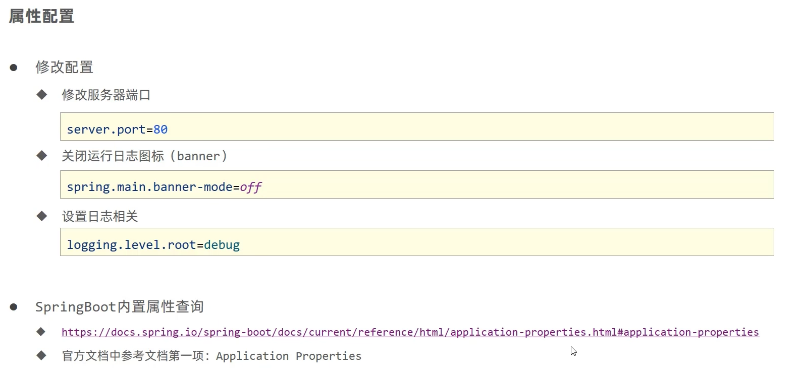

**三种配置文件**


**优先级**


**叠加和覆盖**
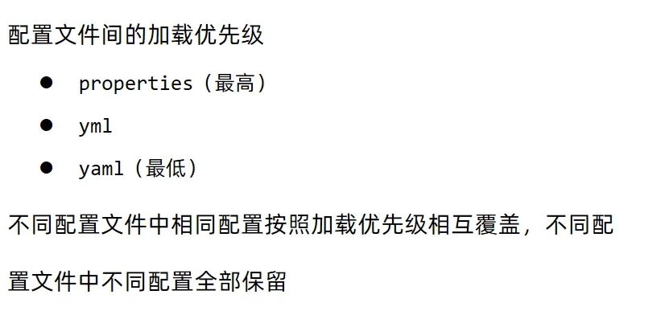

### yaml格式

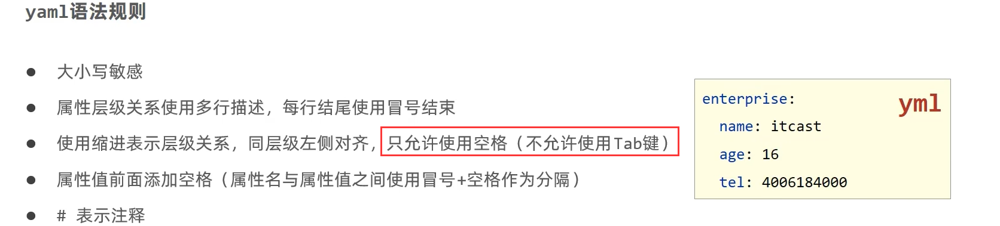

**数组格式的书写**


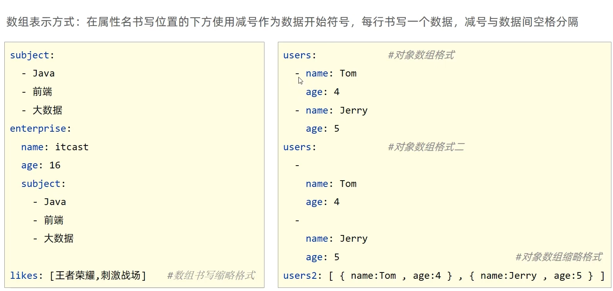

**字面值的表示**


### 读取配置

```
myconfig:
    info: this is a config defind by me
    likes:
        - 唱
        - 跳
        - rap
```

```java
package com.example.demo.controller;

@RestController
@RequestMapping("/test")
public class TestController {
    @Value("${myconfig.info}")
    String info;

    @GetMapping
    String getTest() {
        System.out.println(info);
        return info;
    }
}
```

### yaml引用变量

```yaml
myconfig:
    baseDir: /home
    tempDir: ${myconfig.baseDir}/temp
```

```java
    @Value("${myconfig.tempDir}")
    String tempDir;
    @GetMapping("/b")
    String test2(){
        System.out.println(tempDir);
        return tempDir; // output: /home/temp
    }
```


### yaml转义字符

```yaml
myconfig:
    anotherTest1: 这是反斜杠和t \t
    anotherTest2: "这是制表符  \t_\t_\t_" 
```

```java
    @Value("${myconfig.anotherTest1}")
    String anotherTest1;
    @GetMapping("/c")
    String test3(){
        System.out.println(anotherTest1);
        return anotherTest1; // output: 这是反斜杠和t \t
    }
    @Value("${myconfig.anotherTest2}")
    String anotherTest2;
    @GetMapping("/d")
    String test4(){
        System.out.println(anotherTest2);
        return anotherTest2; // output: 这是制表符      _       _       _
    }
```

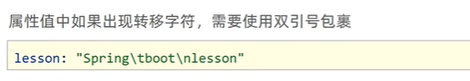

### 获取配置文件中的全部属性

```yaml
server:
  port: 80

myconfig:
    info: this is a config defind by me
    likes:
        - 唱
        - 跳
        - rap
    baseDir: /home
    tempDir: ${myconfig.baseDir}/temp
    anotherTest1: 这是反斜杠和t \t
    anotherTest2: "这是制表符  \t_\t_\t_" 
```

```java
    @Autowired
    Environment env;
    @GetMapping("/e")
    String test5(){
        System.out.println(env.getProperty("server.port")); // 80
        System.out.println(env.getProperty("username")); // Administrator
        System.out.println(env.getProperty("myconfig")); // null
        System.out.println(env.getProperty("myconfig.info")); // this is a config defind by me
        return env.getProperty("server.port");
    }
```

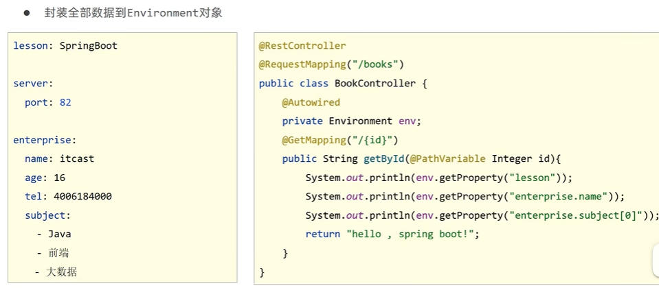

### 将配置文件中的属性封装成对象

```yaml
# key似乎不能大写
mydatasource:
    driver: com.mysql.??.Driver
    url: jdbc:mysql:///db1
    username: root
    passwd: root
```

```java
package com.example.demo.jdbc;

import org.springframework.boot.context.properties.ConfigurationProperties;
import org.springframework.stereotype.Component;

import lombok.Data;

@Data
@Component
@ConfigurationProperties(prefix = "mydatasource")
public class MyDataSource {
    String driver;
    String url;
    String username;
    String passwd;
}

```

```java
@SpringBootTest
class AppTest {
    @Autowired
    MyDataSource myDataSource;
 @Test
    public void test6(){
  System.out.println(myDataSource);
        //MyDataSource(driver=com.mysql.??.Driver, url=jdbc:mysql:///db1, username=root, passwd=root)
 }
}
```


### SpringBoot整合Junit

```java
package com.example.demo;//当前的测试类所在位置


// 引导类携带SpringConfiguration注解，通过该注解修饰过的类可以用于创建容器，测试类需要该容器。
// 引导类所在位置：
import com.example.demo.App;

import org.junit.jupiter.api.Test;
import org.springframework.boot.test.context.SpringBootTest;


@SpringBootTest(classes = App.class/*如果测试类和引导类在同一个包中，则不需要指定classes */)
// @ContextConfiguration(classes = App.class/*也可以用这行来代替上面的指定class的语句 */)
class AppTest {
    @Test
    void test(){
        System.out.println("hello test");
    }
}
```

```xml
  <dependency>
   <groupId>org.springframework.boot</groupId>
   <artifactId>spring-boot-starter-test</artifactId>
   <scope>test</scope>
  </dependency>
```


### SpringBoot整合myBatis步骤


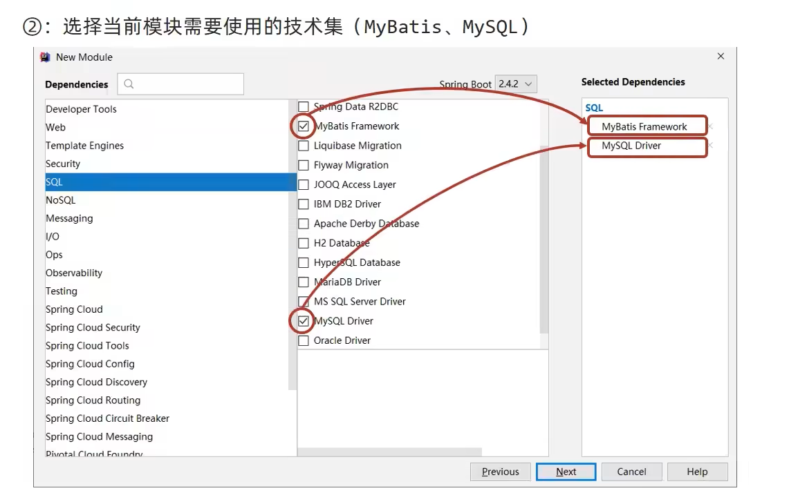


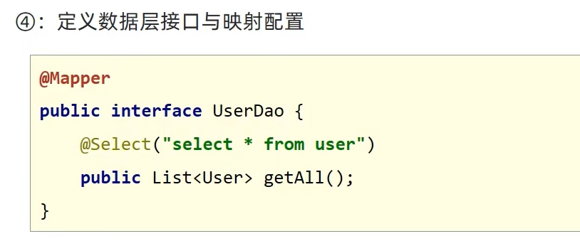


### Mysql8的一些配置


### SpringBoot整合myBatisPlus

> 生成springboot工程：勾选  web + mysqlDriver
>
> 在mvnrepository上查mybatis-plus-boot-starter的坐标
>
> 粘贴到pom中
>
> 因为，springboot没有默认收录mybatis-plus，所以需要写版本
>
> mybatis-plus-boot-starter中包含有：mybaitsPlus 和 mybaits
>


### SpringBoot整合Druid

方式1：通用写法

- 导入Druid坐标
- 配置type


方式2：专用写法

- 导入druid-spring-boot-starter
- 配置spring.datasource.druid


### SSMP整合案例

#### 流程步骤

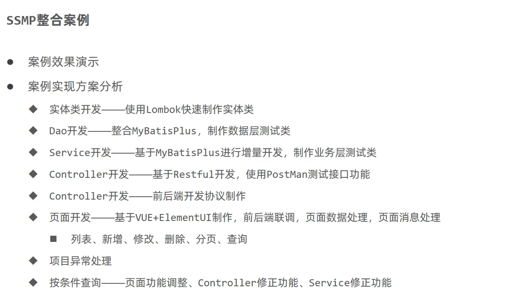

#### 依赖的包

```xml
 <parent>
  <groupId>org.springframework.boot</groupId>
  <artifactId>spring-boot-starter-parent</artifactId>
  <version>2.7.10</version>
  <relativePath />
 </parent>
 <dependencies>
  <dependency>
   <!-- for test -->
   <groupId>org.springframework.boot</groupId>
   <artifactId>spring-boot-starter-test</artifactId>
   <scope>test</scope>
  </dependency>
  <dependency>
   <!-- web -->
   <groupId>org.springframework.boot</groupId>
   <artifactId>spring-boot-starter-web</artifactId>
  </dependency>
  <dependency>
   <!-- mysqlDriver -->
   <groupId>com.mysql</groupId>
   <artifactId>mysql-connector-j</artifactId>
   <scope>runtime</scope>
  </dependency>
  <dependency>
   <!-- lombok -->
   <groupId>org.projectlombok</groupId>
   <artifactId>lombok</artifactId>
   <optional>true</optional>
  </dependency>
  <dependency>
   <!-- mybatis-plus 包含 mybatis  -->
   <groupId>com.baomidou</groupId>
   <artifactId>mybatis-plus-boot-starter</artifactId>
   <version>3.5.3</version>
  </dependency>
  <dependency>
   <!-- Druid数据源 -->
   <groupId>com.alibaba</groupId>
   <artifactId>druid-spring-boot-starter</artifactId>
   <version>1.2.17</version>
  </dependency>
 </dependencies>
```

#### 数据库创建

```sql
mysql 
create database ssmp_demo1;
use ssmp_demo1;
drop table tbl_book;
create table tbl_book(
    id bigint primary key auto_increment,
    name varchar(40),
    type varchar(20),
    description varchar(100)
);
```

#### 实体类

```java
package com.example.demo.pojo;
import lombok.Data;
@Data
public class Book {
    Long id;
    String name;
    String type;
    String description;
}
```

#### 基础配置、数据源、mybatis配置

```yaml
# 端口配置
server:
  port: 80

# druid数据源配置
spring:
  datasource:
    druid:
      driver-class-name: com.mysql.cj.jdbc.Driver
      url: jdbc:mysql://localhost/ssmp_demo1
      username: root
      password: root

mybatis-plus:
  global-config:
    db-config:
      # id自增规则，表前缀配置
      table-prefix: tbl_
      id-type: auto
  configuration:
    # 使用标准输出打印mybatis-plus运行日志，仅适用于开发环境
    log-impl: org.apache.ibatis.logging.stdout.StdOutImpl
```

#### mybatisPlus分页器配置

```java
package com.example.demo.config;

import org.springframework.context.annotation.Bean;
import org.springframework.context.annotation.Configuration;

import com.baomidou.mybatisplus.extension.plugins.MybatisPlusInterceptor;
import com.baomidou.mybatisplus.extension.plugins.inner.PaginationInnerInterceptor;

@Configuration
public class MyBatisPlusConfig {
    @Bean
    MybatisPlusInterceptor mybatisPlusInterceptor(){
        MybatisPlusInterceptor mybatisPlusInterceptor = new MybatisPlusInterceptor();
        mybatisPlusInterceptor.addInnerInterceptor(new PaginationInnerInterceptor());
        return mybatisPlusInterceptor;
    }
}

```


#### 基本查询、分页查询、条件查询测试


```java
package com.example.demo.dao;
@SpringBootTest
public class BookDaoTest {
    @Autowired
    BookDao bookDao;

    @Test
    public void insert() {
        Book book = new Book();
        for (int i = 0; i < 10; i++) {
            // book.setId(((long)i));
            book.setName("test");
            book.setType("test");
            book.setDescription("test");
            bookDao.insert(book);
        }
        System.out.println(bookDao.selectList(null));
    }

    @Test
    public void delete() {
        bookDao.deleteById(1649315090989301767L);
        bookDao.deleteById(1649315090989301764L);
        System.out.println(bookDao.selectList(null));
    }

    @Test
    public void pageTest() {
        IPage<Book> page = new Page<Book>(1, 5);
        bookDao.selectPage(page, null);
        System.out.println("当前页码->"+page.getCurrent());
        System.out.println("总页码->"+page.getPages());
        System.out.println("每页记录数->"+page.getSize());
        System.out.println("总记录数->"+page.getTotal());
        System.out.println("当前页->"+page.getRecords());
    }
    @Test
    public void selectByCondition(){
        // 执行日志 
        // SELECT id,name,type,description FROM tbl_book WHERE (name LIKE ?)
        // Parameters: %es%(String)
        // 也就是问号会被替换为字符串： %es%
        String name = "es";
        LambdaQueryWrapper<Book> condition = new  LambdaQueryWrapper<>();
        condition.like(name!=null,Book::getName, "es");
        bookDao.selectList(condition);
    }
}

```

#### 业务层

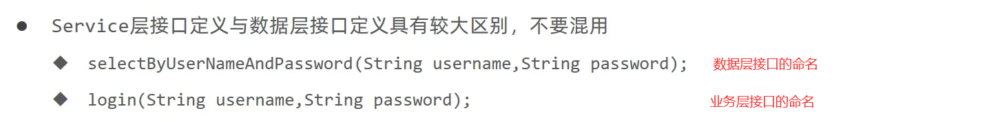

#### 业务层接口

```java
@Component
public interface BookService {
    public Boolean add(Book book);// 增
    public Boolean deleteById(Integer id);// 删
    public Boolean update(Book book);// 改
    public Book getById(Integer id);// 查
    public Page<Book> getByPage(int cur,int pageSize);// 按页查
}
```


#### 业务层初步实现

```java
@Service
public class BookServiceImpl implements BookService {
    @Autowired
    BookDao bookDao;
    @Override
    public Boolean add(Book book) {
        return bookDao.insert(book) > 0;
    }

    @Override
    public Boolean deleteById(Integer id) {
        return bookDao.deleteById(id) > 0;
    }

    @Override
    public Boolean update(Book book) {
        return bookDao.update(book, null) > 0;
    }

    @Override
    public Book getById(Integer id) {
        return bookDao.selectById(id);
    }

    @Override
    public Page<Book> getByPage(int cur, int pageSize) {
        Page<Book> page = new Page<>(cur, pageSize);
        bookDao.selectPage(page, null);
        return page;
    }
}
```


#### 业务层测试

```java
@SpringBootTest
public class BookServiceTest {
    @Autowired
    BookService bookService;
    @Test
    public void testGetById() {
        System.out.println(bookService.getById(5));
        //输出： Book(id=5, name=test, type=test, description=test)
    }
}
```

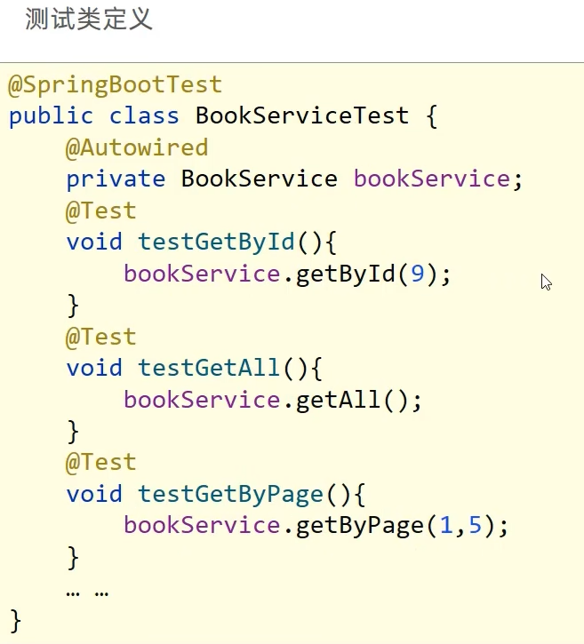

#### 业务层的快速开发


> 业务层有大量重复的相似功能的代码，mybatisPlus已经将其写成接口和实现类，只需继承即可

##### 业务层接口继承Iservice接口

```java
public interface BookServiceQuick extends IService<Book> // 继承mybatisPlus写好的接口
{
    // 1.可以再继续写一些想要的接口

    // 2.可以 @Override重写 或 重载 继承的方法
    // 
}
```

##### 业务层实现类继承ServiceImpl实现类

```java
@Service
public class BookServiceQuickImpl
        extends ServiceImpl<BookDao, Book> // 继承myBatisPlus serviceImpl实现类
        implements BookServiceQuick // 实现bookService接口
{
    // 1.可以再继续写一些想要的方法

    // 2.可以 @Override重写 或 重载 继承的方法
}
```

##### 测试

```java
@SpringBootTest
public class BookServiceQuickTest {
    @Autowired
    BookServiceQuick bookService;

    @Test
    public void testGetById() {
        Page<Book> page = bookService.page(new Page<>(1, 5));
        System.out.println(page.getCurrent());
        System.out.println(page.getPages());
        System.out.println(page.getSize());
        System.out.println(page.getTotal());
        System.out.println(page.getRecords());
    }
}

```


#### 控制器实现增删改查

```java
@RestController
@RequestMapping("/books")
public class BookController {
    @Autowired
    BookServiceQuick bookService;

    // 增
    @PostMapping
    public boolean add(@RequestBody Book book) {
        return bookService.save(book);
    }

    // 删
    @DeleteMapping("/{id}")
    public boolean add(@PathVariable int id) {
        return bookService.removeById(id);
    }

    // 改
    @PutMapping
    public boolean update(@RequestBody Book book) {
        return bookService.update(book, null);
    }

    // 查
    @GetMapping("/{id}")
    public Book get(@PathVariable int id) {
        return bookService.getById(id);
    }

    // 分页查
    @GetMapping("/page/{page}")
    public Page<Book> page(@PathVariable int page) {
        return bookService.page(new Page<Book>(page, 10));
    }
}
```

#### 统一返回值结果类型

```java
@Data
@NoArgsConstructor
@AllArgsConstructor
public class Result {
    Object date;
    Info info;

    @Data
    @AllArgsConstructor
    static class Info {
        int code; // 格式 xxx + 001 + 1或0
        String msg;
    }
    static Info ADD_OK = new Info(2000011, "添加成功");
    static Info ADD_FL = new Info(2000010, "添加失败");
    static Info DEL_OK = new Info(2000021, "删除成功");
    static Info DEL_FL = new Info(2000020, "删除失败");
    static Info UPD_OK = new Info(2000031, "更新成功");
    static Info UPD_FL = new Info(2000030, "更新失败");
    static Info SER_OK = new Info(2000041, "查询成功");
    static Info SER_FL = new Info(2000040, "查询失败");
    static Info PAG_OK = new Info(2000051, "页面查询成功");
    static Info PAG_FL = new Info(2000050, "页面查询失败");
}
```

```java
@RestController
@RequestMapping("/books")
public class BookController {
    @Autowired
    BookServiceQuick bookService;

    // 增
    @PostMapping
    public Result add(@RequestBody Book book) {
        boolean res = bookService.save(book);
        Result result = new Result();
        result.setDate(res);
        result.setInfo(res ? Result.ADD_OK : Result.ADD_FL);
        return result;
    }

    // 删
    @DeleteMapping("/{id}")
    public Result del(@PathVariable int id) {
        boolean res = bookService.removeById(id);
        Result result = new Result();
        result.setDate(res);
        result.setInfo(res ? Result.DEL_OK : Result.DEL_FL);
        return result;
    }

    // 改
    @PutMapping
    public Result update(@RequestBody Book book) {
        boolean res = bookService.update(book, null);
        Result result = new Result();
        result.setDate(res);
        result.setInfo(res ? Result.UPD_OK : Result.UPD_FL);
        return result;
    }

    // 查
    @GetMapping("/{id}")
    public Result get(@PathVariable int id) {
        Book book = bookService.getById(id);
        Result result = new Result();
        result.setDate(book);
        result.setInfo(book != null ? Result.UPD_OK : Result.UPD_FL);
        return result;
    }

    // 分页查
    @GetMapping("/page/{page}")
    public Result page(@PathVariable int page) {
        Page<Book> res = bookService.getPage(page,10);
        Result result = new Result();
        result.setDate(res);
        result.setInfo(res != null ? Result.PAG_OK : Result.PAG_FL);
        return result;
    }
}
```

#### 异常处理


```java
package com.example.demo.controller.utils;

import org.springframework.web.bind.annotation.ExceptionHandler;
import org.springframework.web.bind.annotation.RestControllerAdvice;

@RestControllerAdvice
public class ControllerExceptionProcessor {
    @ExceptionHandler(value = Throwable.class)
    public Result doException(Exception exception) {
        exception.printStackTrace();
        return new Result(null, Result.SER_INR_ERR);
    }
}
```

新增code和msg

```java
@Data
@NoArgsConstructor
@AllArgsConstructor
public class Result {
    Object date;
    Info info;

    @Data
    @AllArgsConstructor
    static class Info {
        int code; // 格式 xxx + 001 + 1或0
        String msg;
    }
    /*
        略
    */
    public static Info SER_INR_ERR = new Info(5000010, "服务器内部异常");
}
```

#### 带条件的页面查询

```java
@Service
public class BookServiceQuickImpl
        extends ServiceImpl<BookDao, Book> // 继承myBatisPlus serviceImpl实现类
        implements BookServiceQuick // 实现bookService接口
{
    public Page<Book> getPageWithCondition(int page, int size, QueryBookCondition condition) {
        LambdaQueryWrapper<Book> wrapper = new LambdaQueryWrapper<Book>();
        if (condition != null) {
            wrapper.eq(condition.getId() != null, Book::getId, condition.getId());
            wrapper.eq(condition.getName() != null, Book::getName, condition.getName());
            wrapper.eq(condition.getType() != null, Book::getType, condition.getType());
        }
        return this.page(new Page<Book>(page, size), wrapper);
    }
}
```

条件查询类

```java
package com.example.demo.pojo;

import lombok.Data;

@Data
public class QueryBookCondition  extends Book{
// 查询条件类，主要是因为不需要按照id范围查找，否则这里可以写maxId,minId等的属性，然后用于判断
}
```

修改后的分页查询功能

```java
@RestController
@RequestMapping("/books")
public class BookController {
    @Autowired
    BookServiceQuick bookService;
    
    // 分页查 + 条件查
    @GetMapping("/page/{page}")
    public Result pageAndCondition(
            @PathVariable int page,
            @RequestBody(required = false) QueryBookCondition condition // 不是必要参数
    ) {
        Page<Book> res = bookService.getPageWithCondition(page, 10, condition);
        Result result = new Result();
        result.setDate(res);
        result.setInfo(res != null ? Result.PAG_OK : Result.PAG_FL);
        return result;
    }
}
```

#### 整体测试


## 运维实用篇

### 跳过测试

maven执行打包操作会预先执行测试代码，测试代码可能会导致对数据库增删改查，可以通过对pom.xml的配置跳过测试。

命令方式

```bash
mvn [命令] -D skipTests

# 示例
mvn package -D skipTests
```

配置方式

```xml
<plugin>
  <groupId>org.apache.maven.plugins</groupId>
  <artifactId>maven-surefire-plugin</artifactId>
  <version>2.12.4</version>
  <configuration>
    <skepTests>true</skepTests>
  </configuration>
</plugin>
```

### 使用springboot默认插件打包为可执行jar包


```xml
 <build>
  <plugins>
   <plugin>
    <groupId>org.springframework.boot</groupId>
    <artifactId>spring-boot-maven-plugin</artifactId>
   </plugin>
  </plugins>
 </build>
```

**两种打包结果的区别**


**jar包描述文件的不同**


### windows中强制杀死进程释放占用的端口


### linux中启动springboot项目

> 注意需要安装mysql然后建数据库和表

**后台启动**
>
> `nohub java -jar xxxx.jar  > server.log  2>&1 &`
>
> `nohub java -jar xxxx.jar  >& server.log &`

> 0表示键盘输入 1表示屏幕输出 2表示错误输出。

> 符号`>&`是一个整体，不可分开，分开后就不是上述含义了。
>
> `>` 是覆写文件而 `>>` 是追加文件
>
> `>&` 后面接文件时，表示将`标准输出和标准错误输出`重定向至文件
>
> `>&` 后面接文件描述符时，表示将前面的`文件描述符`重定向至后面的`文件描述符`

**结束进程**

> ps -aux |grep java
>
> kill -9 [pid_num]


### 高级配置

- 临时属性配置
- 配置文件分类
- 自定义配置文件

#### 命令行临时属性的配置

```bash
# 修改默认端口
java -jar xxx.jar --server.port=8080

# 修改多个属性
java -jar xxx.jar --server.port=8080 --spring.datasource.passwd=123456
```

**原理**

```java
@SpringBootApplication
public class DemoApplication {

 public static void main(String[] args) {
        // 这里的args内容就是["--server.port=8080","--spring.datasource.passwd=123456"]
  SpringApplication.run(DemoApplication.class, args);

        // 配置就是通过args传递给run函数的，run函数还有一个不带args参数的版本。
        // SpringApplication.run(DemoApplication.class);
 }

}
```

#### 配置文件生效的优先级


#### 配置文件的四个优先级

多个配置生效原则：叠加+覆盖，优先级高的覆盖优先级低的。

- resources/application.xxx 开发人员使用
- resources/config/application.xxx 项目经理使用
- xxx.jar 的同级目录下的 application.xxx 运维人员使用
- xxx.jar 的同级目录下的 config/application.xxx 运维经理使用


#### 指定自定义配置文件

```bash
# 指定文件名，生效于上面所说的4级配置文件
java -jar xxx.jar --spring.config.name = 不带扩展的文件名
# 指定路径，指定多个时，后面的叠加覆盖前面的
java -jar xxx.jar --spring.config.location = d:/xxx/xxx.yml,classpath:/xxx.yml

```

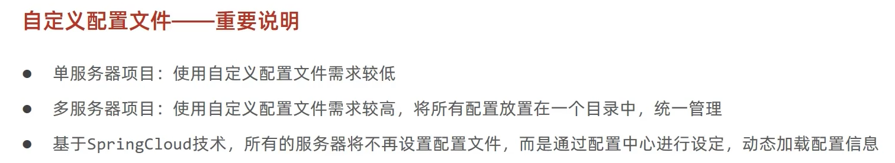

### 多环境开发

#### Yaml

**单文件多环境配置(存在安全隐患)**
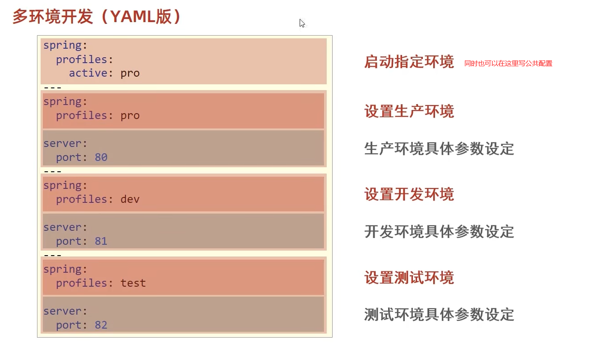


**拆分为多个独立文件写法**


#### properties

```
./resources/
    - application.properties 主配置文件
        - 写配置的公共部分
        - 并通过 `spring.profiles.active=dev` 来指定当前生效环境
    - application-dev.properties 开发环境配置 的独有配置
    - application-test.properties 测试环境配置 的独有配置
    - application-pro.properties 生产环境配置 的独有配置
```

### 按功能拆分配置文件


生效顺序

**写法1**

```yaml
spring:
    profiles:
        active: dev
        include: devDB,devRedis,devMVC
        # 生效顺序：devDB,devRedis,devMVC,dev
```

**写法2**

```yaml
# 从spring2.4开始使用group属性替换include属性
spring:
    profiles:
        active: dev
        group:
            "dev": devDB,devRedis,devMVC
            "pro": proDB,proRedis,proMVC 
            "test": testDB,testRedis,testMVC
        # 生效顺序：dev,devDB,devRedis,devMVC
```

### Maven控制boot环境配置

在`pom.xml`文件中定义环境变量

```xml
    <!-- 配置写环境变量 -->
    <profiles>
  <profile>
   <id>env_dev</id>
   <properties>
    <!-- 
                    key:profile.active	
                    value:dev
                 -->
    <profile.active>dev</profile.active>
   </properties>
   <activation>
    <activeByDefault>true</activeByDefault>
   </activation>
  </profile>
  <profile>
   <id>env_pro</id>
   <properties>
    <profile.active>pro</profile.active>
   </properties>
  </profile>
 </profiles>
```

**在application.yaml中使用定义的环境变量**

```yaml
spring:
  profiles:
    active: @profile.active@
```

使用mvn package 命令打包

- `@profile.active@`将会被替换为`dev`

### 日志

日志的作用：

- 开发期间调试代码
- 运营期间记录信息
  - 

**分类**  


#### 基本写法

在`application.yaml`中设置日志输出级别

```yaml
# 方式1
# debug: true

### 按包和分组控制日志的输出级别
logging:
  group:
    "组名1": 包名1,包名2,包名3
    "组名2": 包名1,包名2,包名3
  level:
    # 方式2
    root: info # 整个应用的日志级别为info
    # 方式3
    "组名1": warn # 设置`组名1`中的包的日志级别为warn
    # 方式4
    "包名4": debug # 设置`包名4`下的代码的日志级别为debug
```


在代码中获取log对象并使用其输出

```java
import org.slf4j.Logger;
import org.slf4j.LoggerFactory;
@RestController
@RequestMapping("/books")
public class BookController {
    // 获取logger对象
    static  Logger logger = LoggerFactory.getLogger(BookController.class);
        @Autowired
    BookServiceImp bookService;
    int MAX_PAGE_SIZE = 25;
    @PostMapping
    Result save(@RequestBody(required = true) Book book) {
        boolean res = bookService.save(book);
        logger.debug("这是debug日志");
        logger.info("这是info日志");
        logger.warn("这是warn日志");
        logger.error("这是error日志");
        if (res) return new Result(res, Result.SAVE_OK);
        else return new Result(res, Result.SAVE_ER);
    }
}
```

#### 把Logger的初始化过程提取到父类，简化开发过程

```java
import org.slf4j.Logger;
import org.slf4j.LoggerFactory;

public class BaseClass {
    public Class<? extends BaseClass> cls;
    public Logger logger;
    public BaseClass() {
        cls =  this.getClass();
        logger = LoggerFactory.getLogger(cls);
    }
}
```

```java
import org.slf4j.Logger;
import org.slf4j.LoggerFactory;
@RestController
@RequestMapping("/books")
public class BookController extends BaseClass {
    @Autowired
    BookServiceImp bookService;
    int MAX_PAGE_SIZE = 25;
    @PostMapping
    Result save(@RequestBody(required = true) Book book) {
        boolean res = bookService.save(book);
        logger.debug("这是debug日志");
        logger.info("这是info日志");
        logger.warn("这是warn日志");
        logger.error("这是error日志");
        if (res) return new Result(res, Result.SAVE_OK);
        else return new Result(res, Result.SAVE_ER);
    }
}
```

#### 使用lombok的@Slf4j注解完成上述过程

```java
@Slf4j
@RestController
@RequestMapping("/books")
public class BookController {
    // public class BookController extends BaseClass {
    // static  Logger logger = LoggerFactory.getLogger(BookController.class);
    @Autowired
    BookServiceImp bookService;
    int MAX_PAGE_SIZE = 25;
    @PostMapping
    Result save(@RequestBody(required = true) Book book) {
        boolean res = bookService.save(book);
        log.debug("这是debug日志");
        log.info("这是info日志");
        log.warn("这是warn日志");
        log.error("这是error日志");
        if (res) return new Result(res, Result.SAVE_OK);
        else return new Result(res, Result.SAVE_ER);
    }
}
```

#### 日志默认格式


#### 自定义日志输出格式


```yaml
logging:
    pattern:
        # console: "%d - %m %d"
        # console: "%d - %m %d"
        console: "%d %clr(%5p) --- [%16t] %clr(%-40.40c){cyan} : %m %n"
        # %d => date 日期
        # %m = %msg = %message => message 消息 
        # %p => priority 优先级
        # %5p 右对齐 占位5位的优先级
        # %-5p 左对齐 占位5位的优先级
        # %t => thread 线程号
        # %c => class 全类名
        # %-40c => class 全类名 占位40位右对齐，小于40位补空格，多余40位原样输出
        # %-40.40c => class 全类名 占位40位右对齐,截取40位，小于40位补空格，多余40位从高位截断
        # %clr() => 带颜色的部分
        # %clr(){cyan} => 青色
        

```

#### 设置日志文件

```yaml
logging:
  level:
    root: info
  file:
    name: server_log
  logback:
    rollingpolicy:
      max-file-size: 10MB # 设置单文件最大大小
      # 设置文件名格式 $d表示日期 %i表示第几个
      file-name-pattern: ${LOG_FILE}.%d{yyyy-MM-dd}.%i.log
      #Default: ${LOG_FILE}.%d{yyyy-MM-dd}.%i.gz
```


## 开发实用篇

### 热部署
>
> 在不关闭服务器、不结束进程的情况下修改代码。

#### 开发环境的热部署

添加必备依赖

```xml
<!-- 添加依赖 -->
  <dependency>
   <groupId>org.springframework.boot</groupId>
   <artifactId>spring-boot-devtools</artifactId>
   <optional>true</optional>
  </dependency>
```

需要热部署时点击重新构建

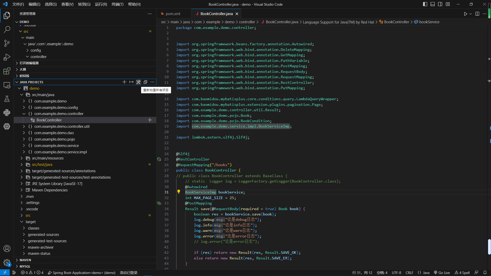

static下的html页面不参与热部署，但对其所做的修改会同步更新

**对不参与热部署的目录和文件设置**

默认情况


自定义


#### 禁用热部署


禁止在生产环境通过配置开启热部署


### 配置高级

#### 对自定义Bean配置

```yaml
my-server:
    ip: 0.0.0.0
    port: 80

```

```java

@Data
@Component
@ConfigurationProperties(prefix = "my-server") //prefix="xxx-xxx"必须是烤肉串命名法 
public class MyServer {
    String ip; // 将从配置文件中读取值来为其初始化
    int port;
}
```

```java

@SpringBootApplication
public class DemoApplication {

 public static void main(String[] args) {
  ConfigurableApplicationContext ctx = SpringApplication.run(DemoApplication.class, args);;
  MyServer myServer = ctx.getBean(MyServer.class);
  System.out.println(myServer); 
        //输出：MyServer(ip=0.0.0.0, port=80)
 }

}
```

#### 对第三方Bean注入属性

```yaml
my-datasource:
    driver-class-name: xxx.xxx
    url: jdbc://?/abc
    username: root
    password: root
    
```

```java

@ConfigurationProperties // 必须写
public class configDruid {
    @Bean
    @ConfigurationProperties(prefix = "my-datasource") // 必须写
    DataSource dataSource() {
        DataSource dataSource = new DruidDataSource();
        return dataSource;// my-datasource下的属性会自动使用setter函数注入到datasource中
    }
}

```

```java
@SpringBootApplication
@EnableConfigurationProperties({MyServer.class,configDruid.class})
public class DemoApplication {

 public static void main(String[] args) {
  ConfigurableApplicationContext ctx = SpringApplication.run(DemoApplication.class, args);;
  MyServer myServer = ctx.getBean(MyServer.class);
  System.out.println(myServer); //输出： MyServer(ip=0.0.0.0, port=80)

  DruidDataSource dataSource = ctx.getBean(DruidDataSource.class);
  System.out.println(dataSource.getDriverClassName()); //输出：xxx.xxx
 }
}
```

#### 关于EnableConfigurationProperties


#### 宽松匹配

```yaml
my-datasource:
    # 以下几种写法都能成功匹配并注入到第三方Bean的字段中
    # 总之就是会忽略大小写，忽略下划线和中划线去匹配
    driver-class-name: xxx.xxx # 烤肉串模式，推荐模式
    driver_class_name: xxx.xxx # underline模式
    driverclassname: xxx.xxx
    driverClassName: xxx.xxx # 驼峰格式
    DriverClassName: xxx.xxx # 
    DRIVERCLASSNAME: xxx.xxx
    DRIVER_CLASS_NAME: xxx.xxx # 常量模式
```


#### 带单位的时间和存储单位的配置

```yaml
my-server:
    ip: 0.0.0.0
    port: 80
    time-out: 10s # 省略s则根据配置的DurationUnit作为单位，也就是天
    size: 10MB
```

```java
@Data
// @Component
@ConfigurationProperties(prefix = "my-server")
public class MyServer {
    String ip;
    int port;
    @DurationUnit(ChronoUnit.DAYS) // 默认单位天
    Duration timeOut;
    @DataSizeUnit(DataUnit.BYTES) // 默认单位字节
    DataSize size;
}
```

```java
@SpringBootApplication
@EnableConfigurationProperties({MyServer.class,configDruid.class})
public class DemoApplication {

 public static void main(String[] args) {
  ConfigurableApplicationContext ctx = SpringApplication.run(DemoApplication.class, args);;
  MyServer myServer = ctx.getBean(MyServer.class);
  System.out.println(myServer); //输出： MyServer(ip=0.0.0.0, port=80, timeOut=10 milliseconds, size=10485760B)
    }
}
```


#### Bean属性校验

```xml
        <!-- 导入JSR303规范接口坐标 -->
        <!-- https://mvnrepository.com/artifact/javax.validation/validation-api -->
  <dependency>
   <groupId>javax.validation</groupId>
   <artifactId>validation-api</artifactId>
   <version>2.0.1.Final</version>
  </dependency>
        <!-- 导入实现类，注意版本 -->
  <!-- https://mvnrepository.com/artifact/org.hibernate/hibernate-validator -->
  <dependency>
   <groupId>org.hibernate</groupId>
   <artifactId>hibernate-validator</artifactId>
   <version>6.2.0.Final</version>
  </dependency>
```

```yaml
my-server:
    ip: 0.0.0.0
    port: 65536 # 故意写错端口
    time-out: 10s
    size: 10MB
```

```java
@Data
@Validated // 使用验证器来验证
@ConfigurationProperties(prefix = "my-server")
public class MyServer {
    String ip;
    @Max(value = 65535,message = "端口号不能超过65535") // 验证上限值
    int port;
    @DurationUnit(ChronoUnit.DAYS)
    Duration timeOut;
    @DataSizeUnit(DataUnit.BYTES)
    DataSize size;
}
```

报错信息：

```bash
Description:

Binding to target org.springframework.boot.context.properties.bind.BindException: Failed to bind properties under 'my-server' to com.example.demo.config.MyServer failed:

    Property: my-server.port
    Value: "65536"
    Origin: class path resource [application.yml] - 3:11
    Reason: 端口号不能超过65535


Action:

Update your application's configuration
```

### 测试高级

#### 使用注解配置测试临时属性

```java
package com.example.demo;

import org.junit.jupiter.api.Test;
import org.springframework.beans.factory.annotation.Value;
import org.springframework.boot.test.context.SpringBootTest;

@SpringBootTest(
 // 在application.yml 中配置有 a:1 c:2 my-datasource.url:xxx.xxx
 args = {"--a=bb","--c=dd","--my-datasource.url=xxx"}, // args 将覆盖上述配置，优先级次之
 properties = {"a=b","c=d",/*"my-datasource.url=????" */} // properties将覆盖上述所有配置，优先级最高 
)
class DemoApplicationTests {
 @Value("${a}")
 String a;
 @Value("${c}")
 String c;
 @Value("${my-datasource.url}")
 String url;
 @Test
 void test() {
  System.out.println("-------------------------------------------");
  System.out.println(a); // 输出b
  System.out.println(c); // 输出d
  System.out.println(url); // 输出xxx
 }

}

```


#### 在测试环境中创建Bean

```java
@Configuration
public class MsgConfig {
    @Bean
    String getMsg(){
        // 假设这里创建了一个第三方的Bean，需要在测试环境中使用
        return "this is a message.";
    }
}
```

```java
@SpringBootTest
@Import({MsgConfig.class})// 导入Bean配置
public class Test1 {
    @Autowired
    String msg; 
    @Test
    void test(){
        System.out.println(msg);// 输出：this is a message.
    }
}
```


#### 测试接口

**开启web环境**


**开启Mock环境**


**匹配状态**

```java
@SpringBootTest( webEnvironment = WebEnvironment.RANDOM_PORT) // 使用随机端口启动web服务器环境
@AutoConfigureMockMvc // 开启web测试环境，使得可以创建并自动装配MockMvc对象
public class BookControllerTest {
    @Autowired
    MockMvc mockMvc;// 用来发虚拟请求的对象
    @Test
    void testStetus() throws Exception{
        RequestBuilder requestBuilder = MockMvcRequestBuilders.get("/books/1");
        ResultActions perform = mockMvc.perform(requestBuilder);
        perform.andExpect(MockMvcResultMatchers.status().is(200)); // 测试状态码是否为200
    }
}
```


**测试字符串内容、测试JSON数据、测试响应头**

```java

@SpringBootTest( webEnvironment = WebEnvironment.RANDOM_PORT) // 使用随机端口启动web服务器环境
@AutoConfigureMockMvc // 开启web测试环境，使得可以创建并自动装配MockMvc对象
public class BookControllerTest {
    @Autowired
    MockMvc mockMvc;// 用来发虚拟请求的对象
    @Test
    void testContents() throws Exception{
        RequestBuilder requestBuilder = MockMvcRequestBuilders.get("/books/1");
        ResultActions perform = mockMvc.perform(requestBuilder);
        // 这里实际存在编码上的问题，暂不考虑
        // 测试字符串是否一致
        perform.andExpect(MockMvcResultMatchers.content().string("{\"data\":\"\u67E5\u8BE2\u6210\u529F,\u4F60\u8BF7\u6C42\u7684ID\u4E3A1\u3002\",\"msg\":{\"state\":100001,\"info\":\"\u67E5\u8BE2\u6210\u529F\"}}"));
    }
    @Test
    void testJson() throws Exception{
        RequestBuilder requestBuilder = MockMvcRequestBuilders.get("/books/1");
        ResultActions perform = mockMvc.perform(requestBuilder);

        // 测试json数据是否一致
        perform.andExpect(MockMvcResultMatchers.content().json("{\"data\":\"\u67E5\u8BE2\u6210\u529F,\u4F60\u8BF7\u6C42\u7684ID\u4E3A1\u3002\",\"msg\":{\"state\":100001,\"info\":\"\u67E5\u8BE2\u6210\u529F\"}}"));
    }
    @Test
    void testCOntentType() throws Exception{
        RequestBuilder requestBuilder = MockMvcRequestBuilders.get("/books/1");
        ResultActions perform = mockMvc.perform(requestBuilder);
        // 测试响应头是否一致
        perform.andExpect(MockMvcResultMatchers.header().string("Content-Type","application/json"));
    }
}
```

#### 回滚测试时对数据库的操作

```xml
<!-- 事务 -->
  <dependency>
   <groupId>org.springframework</groupId>
   <artifactId>org.springframework.transaction</artifactId>
   <version>3.2.2.RELEASE</version>
  </dependency>
```

```java
@SpringBootTest
// @Transactional注解默认在遇到某些异常时回滚，但在经过@SpringBootTest注解修饰后再使用事务注解时，函数无论抛异常与否，均会自动回滚。
@Transactional
@Rollback(true) // 显式声明为自动回滚，实际上不必写
public class BookControllerTest {
    @Test
    void test() throws Exception{
        
    }
    @Rollback(false) // 提交事务（但好像会导致异常也提交）
    @Test
    void test1() throws Exception{
        
    }
}
```


#### 测试用例数据的随机生成

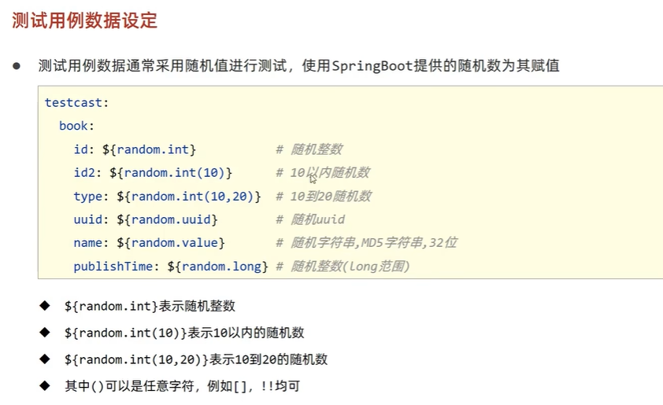


### 数据层解决方案

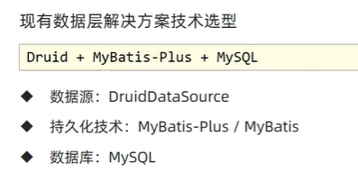

#### 默认数据源对象

SpringBoot提供了三个内嵌数据源

- HikariCP是默认的DataSource数据源对象，轻量级数据源中最快的数据源
- Commons DBCP
- TomCat提供的数据源DBCP2
- 
- 

配置


#### 默认持久层对象:JdbcTemplate


#### 默认支持的数据库


共同特点：

- 这三种数据库都是java写的，所以都可以内嵌到Springboot容器中运行。
- 轻量级，在内存中运行，速度快，适合开发阶段使用

H2的使用

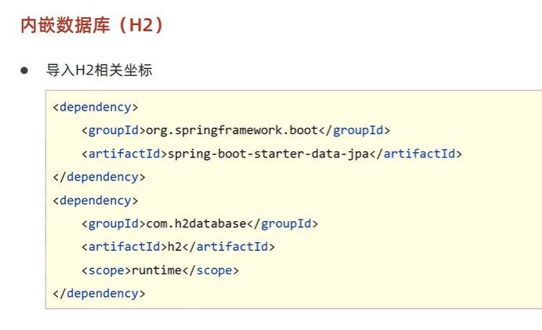


#### 使用默认数据库h2、默认数据源kikari、默认持久层框架jdbcTemplate测试

pom.xml

```xml
    <parent>
  <groupId>org.springframework.boot</groupId>
  <artifactId>spring-boot-starter-parent</artifactId>
  <version>2.7.12</version>
  <relativePath/> <!-- lookup parent from repository -->
 </parent>
    <!-- 数据库 -->
    <dependency>
     <groupId>com.h2database</groupId>
     <artifactId>h2</artifactId>
     <scope>runtime</scope>
    </dependency>
    <!-- jdbc,包含JDBCTemplate -->
    <dependency>
     <groupId>org.springframework.boot</groupId>
     <artifactId>spring-boot-starter-jdbc</artifactId>
    </dependency>
    <!-- 包含TomCat，可能也包含kikari数据源 -->
    <dependency>
     <groupId>org.springframework.boot</groupId>
     <artifactId>spring-boot-starter-web</artifactId>
    </dependency>
    <!-- lombok -->
    <dependency>
     <groupId>org.projectlombok</groupId>
     <artifactId>lombok</artifactId>
     <scope>annotationProcessor</scope>
    </dependency>
```

配置application.yaml

```yaml
server:
  address: 0.0.0.0
  port: 80

spring:
# 配置数据库
  h2:
    console:
      path: /h2
      enabled: true
      settings:
        web-admin-password: 123456
        web-allow-others: false
  # 配置数据源
  datasource:
    driver-class-name: org.h2.Driver
    url: jdbc:h2:~/test
    username: sa
    password: 123456  
    hikari:
      maximum-pool-size: 50
```

启动服务，访问/h2路径的内嵌数据库，创建表，插入一些数据

```sql
create table tbl_book(id integer,name varchar,type varchar,description varchar);
insert into TBL_BOOK(id,name,type,description) values(1,'1','2','3');
insert into TBL_BOOK(id,name,type,description) values(1,'2','2','2');
```

编写实体类

```java
package com.example.demo.pojo;

import java.sql.ResultSet;
import java.sql.SQLException;

import org.springframework.jdbc.core.RowMapper;

import lombok.Data;
/*
 * 
create table tbl_book(id integer,name varchar,type varchar,description varchar)
insert into TBL_BOOK(id,name,type,description) values(1,'1','2','3')

 */
/**
 * Book
 */
@Data
public class Book {
    int id;
    String name;
    String type;
    String description;
    public static String tabName = "tbl_book";
    public static RowMapper<Book> rowMapper = new RowMapper<Book>() {
        @Override
        public Book mapRow(ResultSet rs, int rowNum) throws SQLException {
            Book book = new Book();
            book.setId(rs.getInt("id"));
            book.setName(rs.getString("name"));
            book.setType(rs.getString("type"));
            book.setDescription(rs.getString("description"));
            return book;
        }
    };
}
```

编写持久化层

```java
package com.example.demo.Dao;

import java.sql.SQLException;
import java.util.List;

import org.springframework.beans.factory.annotation.Autowired;
import org.springframework.jdbc.core.JdbcTemplate;
import org.springframework.stereotype.Component;

import com.example.demo.pojo.Book;


@Component
public class BookDao {
    @Autowired
    JdbcTemplate jdbcTemplate;
    public List<Book> selectAll() throws SQLException {
        String sql = "select * from "+Book.tabName;
        List<Book> books = jdbcTemplate.query(sql, Book.rowMapper);
        return books;
    }
}
```

**调用测试**

```java
@SpringBootApplication
public class DemoApplication {
 public static void main(String[] args) throws SQLException {
  ConfigurableApplicationContext ctx = SpringApplication.run(DemoApplication.class, args);
  BookDao bookDao = ctx.getBean(BookDao.class);
  List<Book> books = bookDao.selectAll();
  System.out.println(books);
  //输出：[Book(id=1, name=1, type=2, description=3), Book(id=2, name=2, type=2, description=2)]
 }
}
```

### NoSQL：Redis

#### Redis安装和使用


**基本操作**

```bash
redis-cli # 进入redis客户端
set key1 value1 # 存储键值对key1:value1
get key1 # 获取键值对key1
keys * # 获取所有键
hset tb1 key2 value2 # hash表存储，在表tb1中存键值对 key2:value2
hset tb1 key3 value3 # hash表存储，在表tb1中存键值对 key2:value2
hget tb1 key2 # hash表获取，在表tb1中获取键值对 key2
```

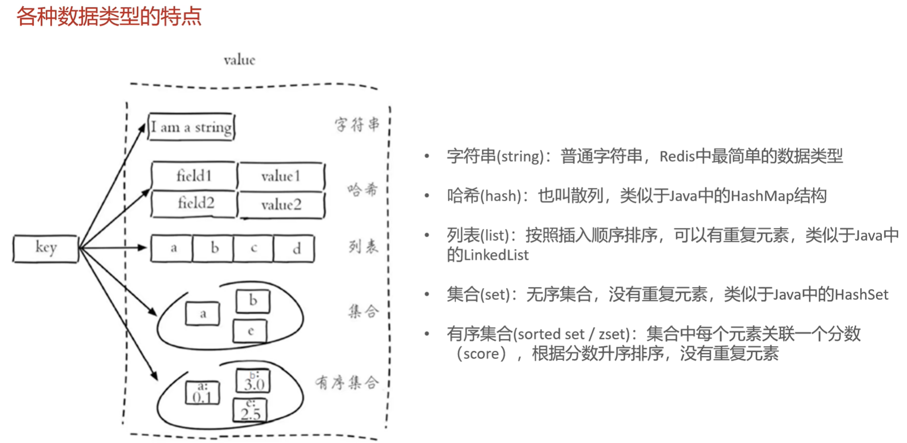

**字符串操作**

```bash
SET key value # 存入数据,键为key,值为value
GET key # 获取数据,键为key
SETEX key seconds value # 存入数据,键为key,过期时间为seconds秒,值为value。应用场景：短信验证码
SETNX key value # 存入数据，仅当key不存在时才存入value 应用场景：分布式锁
```

**hash操作**


**列表操作**


**集合操作**


**有序集合**

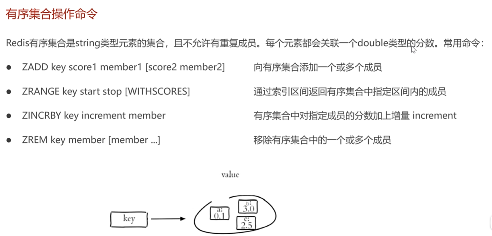

**通用命令**


#### springBoot整合redis


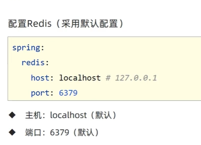

> 编写配置类：设置key的序列化器，这一步似乎不是必须的  
> 


> 五种常用数据类型的操作对象  
> 

```xml
<dependency>
<groupId>org.springframework.boot</groupId>
<artifactId>spring-boot-starter-data-redis</artifactId>
</dependency>
```

```yaml
spring:
  redis:
    host: 172.30.64.71
    port: 6379
```

```java
@SpringBootTest
class DemoApplicationTests {
 // 在这两个对象中存储同样的key:value 存储的形式是不同的
 @Autowired
 RedisTemplate<Object,Object> redisTemplate;
 @Autowired
 StringRedisTemplate stringRedisTemplate;

 @Test
 void test1() {
  ValueOperations<Object,Object> operations = redisTemplate.opsForValue();
  operations.set("name", "dyg");
  Object res = operations.get("name");
  System.out.println(res);
 }
 @Test
 void test2() {
  ValueOperations<String,String> operations = stringRedisTemplate.opsForValue();
  operations.set("name", "dyg");
  String res = operations.get("name");
  System.out.println(res);
 }
}
```

#### 切换客户端


默认是lettuce
切换为jedis步骤：

添加依赖

```xml
  <dependency>
   <groupId>redis.clients</groupId>
   <artifactId>jedis</artifactId>
  </dependency>
```

设置客户端类型

```yaml
spring:
  redis:
    host: 172.30.64.71
    port: 6379
    client-type: jedis # 默认为lettuce
    jedis:
      pool:
        max-active: 16
    lettuce:
      pool:
        max-active: 16
```

### NoSQL：Mongo


linux安装

```bash
# 按照官网的指南安装：https://www.mongodb.com/docs/manual/tutorial/install-mongodb-on-ubuntu/

# 创建目录
mkdir /data/db -p
# 修改默认id
vi /etc/mongod.conf
# 在终端临时启动
mongod
# 启动服务
systemctl start mongod
```

测试基本操作

```js
db = db.getSiblingDB("mydb1");
db.book.find({})
db.book.insert({name:"test1"})
db.book.find({name:"test1"})
db.book.update({name:"test1"},{$set:{name:"test2"}}) // 默认只修改一条
db.book.find({name:"test1"})
db.book.remove({name:"test2"})
db.book.find({name:"test2"})
```


```xml
<dependency>
 <groupId>org.springframework.boot</groupId>
 <artifactId>spring-boot-starter-data-mongodb</artifactId>
</dependency>
```

```yaml
spring:
  data:
    mongodb:
      uri: mongodb://172.30.64.71/mydb1 # wsl 地址

```

```java
@Data
public class Book {
    int id;
    String name;
    String type;
    String desc;
}
```

```java
@SpringBootTest
class DemoApplicationTests {
 @Autowired
 MongoTemplate mongoTemplate;
 @Test
 void add(){
  Book book = new Book();
  book.setId(1);
  book.setName("book1");
  book.setType("book1");
  book.setDesc("book1");
  mongoTemplate.insert(book);
 }
 @Test
 void find(){
  List<Book> books = mongoTemplate.findAll(Book.class);;
  System.out.println(books);
 }
}
```

### NoSQL：ES——(ElasticSearch分布式全文搜索引擎)

> 直接跳过吧，这个东西要先知道ElasticSearch怎么使用，再来说怎么和boot整合，不然整合了也不知道怎么用，能干什么。


**安装ElasticSearch**

```bash
# from 官网教程
wget -qO - https://artifacts.elastic.co/GPG-KEY-elasticsearch | sudo gpg --dearmor -o /usr/share/keyrings/elasticsearch-keyring.gpg
sudo apt-get install apt-transport-https
echo "deb [signed-by=/usr/share/keyrings/elasticsearch-keyring.gpg] https://artifacts.elastic.co/packages/8.x/apt stable main" | sudo tee /etc/apt/sources.list.d/elastic-8.x.list
sudo apt-get update && sudo apt-get install elasticsearch
```

**无法访问的问题的解决**

```bash
# 修改ip为0.0.0.0
vi /etc/elasticsearch/elasticsearch.yml
# 使用以下命令启动服务然后发现无法访问
sudo systemctl start elasticsearch.service
# 于是查看其日志
tail -f /var/log/elasticsearch/elasticsearch.log
# 发现报错：[2023-06-22T14:17:32,670][WARN ][o.e.h.n.Netty4HttpServerTransport] [fz53vd7300] received plaintext http traffic on an https channel, closing connection Netty4HttpChannel{localAddress=/172.30.64.71:9200, remoteAddress=/172.30.64.1:53248}
# 百度后发现是需要关闭安全认证以实现无密码访问
# 修改：
vi /etc/elasticsearch/elasticsearch.yml
************************************************************************
# Enable security features
xpack.security.enabled: false # 将true改为false
xpack.security.enrollment.enabled: true
# Enable encryption for HTTP API client connections, such as Kibana, Logstash, and Agents
xpack.security.http.ssl:
  enabled: false # 将true改为false
  keystore.path: certs/http.p12
************************************************************************
```

**安装elasticsearch-analysis-ik分词器插件**

```bash
cd /usr/share/elasticsearch/plugins/
mkdir elasticsearch-analysis-ik-8.7.0
cd elasticsearch-analysis-ik-8.7.0
# 下载链接拷贝自analysis-ik的github release版本
wget https://github.com/medcl/elasticsearch-analysis-ik/releases/download/v8.7.0/elasticsearch-analysis-ik-8.7.0.zip
unzip elasticsearch-analysis-ik-8.7.0.zip 
rm elasticsearch-analysis-ik-8.7.0.zip
# 重启elasticsearch
systemctl restart elasticsearch.service
# 重启失败查看日志
cat /var/log/elasticsearch/elasticsearch.log
# 发现报错： Plugin [analysis-ik] was built for Elasticsearch version 8.8.0 but version 8.8.1 is running
# 于是根据issue：https://github.com/medcl/elasticsearch-analysis-ik/issues/1008
# 修改
vi elasticsearch/plugins/elasticsearch-analysis-ik-8.7.0/plugin-descriptor.properties
# 修改
elasticsearch.version=8.8.1 # 由 8.7.0 修改为 8.8.1
# 再次重启elasticsearch
systemctl restart elasticsearch.service
```

**基本操作:创建索引**

PUT/GET/DELETE /books


**基本操作:创建索引规则**
POST /books


**基本操作:创建文档**

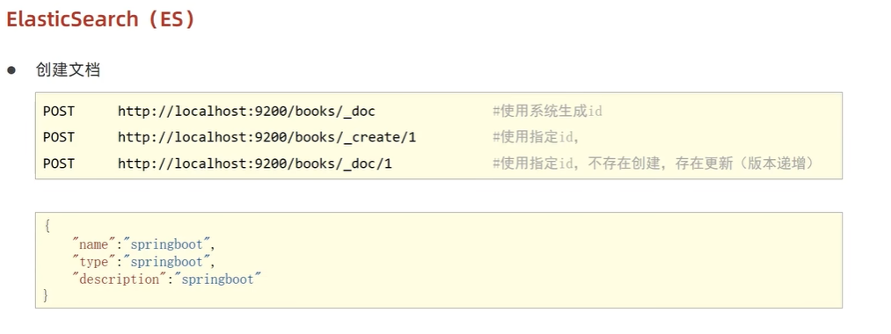
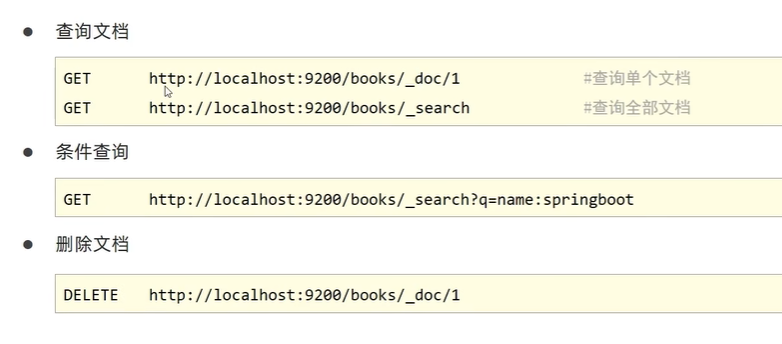


springBoot整合低版本客户端


springBoot手动整合高版本客户端（实际上这个版本已经弃用了）

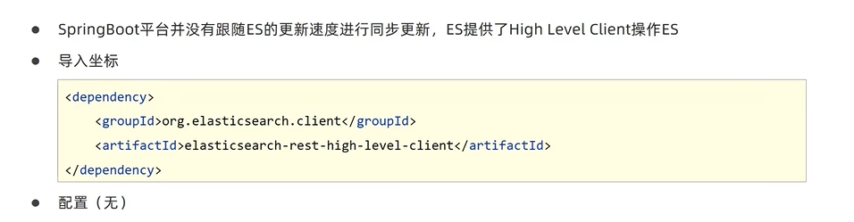


### 缓存

- 缓存是介于数据永久存储介质与数据应用之间的临时存储介质
- 可以有效减少低速数据读取过程的次数，提高系统性能
- 还可以对临时数据提供存储空间

#### 简易缓存

```java
@Service
public class BookServiceImp extends ServiceImpl<BookDao,Book> implements BookSevice{
    @Autowired
    BookDao bookDao;
    HashMap<Integer,Book> cache = new HashMap<>();
    Book getById_withCache(int id){
        Book book = cache.get(id); // 从缓存中取出
        if(book==null) cache.put(id, book=bookDao.selectById(id)); // 缓存中没有 则从数据库中获取,同时存入缓存
        return book;// 返回
    }
}
```

#### springBoot提供的缓存

> `spring-Cache` 缓存技术统一了接口，默认使用的是Simple缓存技术,可以切换为redis、Ehcache、Memcached、Caffenine等的10多种技术
> 
> 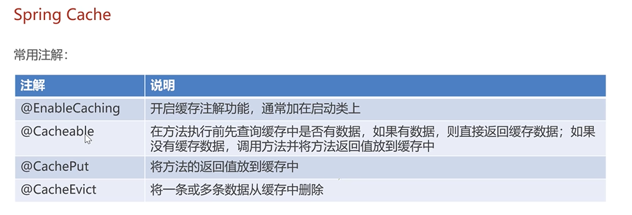

**CachePut**

```java
//CachePut用于把函数的返回值存入缓存中，存入key的格式： `cacheNames::key` 
@CachePut(cacheNames="user",key="abc") 
@CachePut(cacheNames="user",key="#id") // id 和形参名保持一致
@CachePut(cacheNames="user",key="#user.id") // user和形参名保持一致
@CachePut(cacheNames="user",key="#result.id") // result表示函数的返回值
@CachePut(cacheNames="user",key="#p0.id") // p0 表示第一个形参
@CachePut(cacheNames="user",key="#a0.id") // a0 表示第一个形参
@CachePut(cacheNames="user",key="#root.?") // root.method root.target root.caches
```

**Cacheable**

```java
// Cacheable会先到缓存中查询是否存在，如果存在则直接获取缓存中的数据
// 如若不存在则执行函数，并存到缓存中
// 存入key的格式： `cacheNames::key` 并且key不能使用 `#result`
@Cacheable(cacheNames="user",key="abc") 
@Cacheable(cacheNames="user",key="#id")
```

**CacheEvict**

```java
// CacheEvict用于删除一条或多条数据
@CacheEvict(cacheNames="user",key="abc")  // 删除一条数据
@CacheEvict(cacheNames="user",key="#id")  // 删除一条数据
@CacheEvict(cacheNames="user",allEntries=true) // 删除所有数据
```

**导入依赖坐标**

```xml
  <dependency>
   <groupId>org.springframework.boot</groupId>
   <artifactId>spring-boot-starter-cache</artifactId>
            <!-- 默认为Simple缓存技术 -->
  </dependency>
```

**开启缓存**

```java
@SpringBootApplication
@EnableCaching // 启用缓存功能
public class Application {
 public static void main(String[] args) {
  SpringApplication.run(Application.class, args);
 }
}
```

**可缓存注解**

```java
@Service
public class BookServiceImp extends ServiceImpl<BookDao,Book> implements BookSevice{
    @Override
    // 查询结果是可缓存的,value指定存放的命名空间,key指定id
    @Cacheable(value = "cacheSpaceName_Books",key = "#id")
    public Book getById(Serializable id) {
        return super.getById(id);
    }
}
```

#### 手机验证码案例

```java
package com.example.demo.utils;

import org.springframework.cache.annotation.CachePut;
import org.springframework.cache.annotation.Cacheable;
import org.springframework.stereotype.Component;

@Component // 该注解表示将该类交给spring管理，这样缓存才会生效 
public class SIMCodeUtils {
    static String[] prefix = { "000000", "00000", "0000", "000", "00", "0", "" };

    // 生成验证码，同时把结果缓存起来
    // CachePut表示只会把函数返回值存起来，但不会到缓存中去取值 
    @CachePut(value = "simcode", key = "#tel")
    public String GenerateCode(String tel) {
        long hashCode = tel.hashCode();
        hashCode ^= 27489347134820342l;
        hashCode ^= System.currentTimeMillis();
        hashCode %= 1000000; // 0~999,999
        String code = String.valueOf(hashCode);
        return prefix[code.length()] + code;
    }

    // 获取缓存里的验证码
    @Cacheable(value = "simcode", key = "#tel")
    public String GetCode(String tel) {
        return null;
    }
}
```

```java
package com.example.demo.service.impl;

import org.springframework.beans.factory.annotation.Autowired;
import org.springframework.stereotype.Service;

import com.example.demo.service.TelCheckCodeSevice;
import com.example.demo.utils.SIMCodeUtils;

@Service
public class TelCheckCodeSeviceImpl implements TelCheckCodeSevice {
    @Autowired
    SIMCodeUtils simCodeUtils;

    @Override
    public String SendCodeToPhone(String tel) {
        return simCodeUtils.GenerateCode(tel); // 发送验证码到手机
    }

    @Override
    public Boolean CheckCode(String tel, String code) {
        return code.equals(simCodeUtils.GetCode(tel)); // 对比缓存中的验证码
    }
}
```

```java
package com.example.demo.controller;

import org.springframework.beans.factory.annotation.Autowired;
import org.springframework.web.bind.annotation.GetMapping;
import org.springframework.web.bind.annotation.PostMapping;
import org.springframework.web.bind.annotation.RequestMapping;
import org.springframework.web.bind.annotation.RestController;

import com.example.demo.controller.util.Result;
import com.example.demo.service.TelCheckCodeSevice;

@RestController
@RequestMapping("/tel")
public class TelCheckCodeController {
    @Autowired
    TelCheckCodeSevice telCheckCodeSevice;

    @GetMapping
    Result sendCode(String tel) {
        String res = telCheckCodeSevice.SendCodeToPhone(tel);
        return new Result(res, new Result.Message(0, "发送成功"));
    }

    @PostMapping
    Result checkCode(String tel, String code) {
        boolean res= telCheckCodeSevice.CheckCode(tel, code);
        return new Result(res, new Result.Message(0, "校验完毕"));
    }
}
```

#### 更换缓存实现类ehcache2：手机验证码案例

**添加pom坐标**

```xml
  <dependency>
   <groupId>org.springframework.boot</groupId>
   <artifactId>spring-boot-starter-cache</artifactId>
  </dependency>
  <dependency>
   <groupId>net.sf.ehcache</groupId>
   <artifactId>ehcache</artifactId>
    </dependency>
```

**修改application.yaml中的cache配置**

```yaml
spring:
  cache:
    type:
      ehcache
```

**编写`resources/ehcache.xml`配置文件**

```xml
<ehcache
    xmlns:xsi="http://www.w3.org/2001/XMLSchema-instance"
    xsi:noNamespaceSchemaLocation="http://ehcache.org/ehcache.xsd"
    updateCheck="true"
>
    <diskStore path="java.io.tmpdir" />
    <!-- 默认缓存配置 -->
    <defaultCache
        eternal="false" // 是否永久存在
        diskPersistent="false" // 是否磁盘持久化
        maxElementsInMemory="10000" // 最大缓存数量
        overflowToDisk="false" // 超过最大数量是否缓存到磁盘
        timeToIdleSeconds="60" // 最大不活动间隔
        timeToLiveSeconds="60" // 最大存活时间
        memoryStoreEvictionPolicy="LRU" // 缓存清除策略
    />
    <!-- simcode的缓存配置,name字段对应于Cacheable的value属性：@Cacheable(value = "simcode", key = "#tel") -->
    <cache
        name="simcode" // 命名空间
        eternal="false"
        diskPersistent="false"
        maxElementsInMemory="10000"
        overflowToDisk="false"
        timeToIdleSeconds="60"
        timeToLiveSeconds="60"
        memoryStoreEvictionPolicy="LRU"
    />
</ehcache>
```

**LRU 与 LFU**

- LRU 保留最近使用的淘汰最近不使用的
- LFU 保留频繁使用的淘汰最近不频繁的
- 

#### 更换缓存实现类redis：手机验证码案例

依赖坐标

```xml
  <dependency>
   <groupId>org.springframework.boot</groupId>
   <artifactId>spring-boot-starter-cache</artifactId>
  </dependency>
  <dependency>
   <groupId>org.springframework.boot</groupId>
   <artifactId>spring-boot-starter-data-redis</artifactId>
  </dependency>
```

修改配置

```yaml
spring:
  redis:
    host: 172.30.64.71
    port: 6379
  cache:
    type:
      redis
    redis:
      use-key-prefix: true # 是否将key作为前缀
      key-prefix: perfix_ # key前缀的前缀
      cache-null-values: false # Allow caching null values.
      time-to-live: 60s # 存活时间
```

#### 更换缓存实现类xmemcache：手机验证码案例


```xml
  <dependency>
   <groupId>com.googlecode.xmemcached</groupId>
   <artifactId>xmemcached</artifactId>
   <version>2.4.7</version>
  </dependency>
```

**编写配置类**

```java
@Configuration
public class XmemcachedConfig {
    @Autowired
    XmemcachedConfigProps config;

    @Bean
    MemcachedClient getClient() throws IOException{
        XMemcachedClientBuilder builder = new XMemcachedClientBuilder(config.getAddress());
        builder.setConnectionPoolSize(config.getPoolSize());
        builder.setOpTimeout(config.getOpTimeout());
        return builder.build();
    }
}
@Data // 为了有getter方法
@Component // 为了能自动装配
@ConfigurationProperties(prefix = "xmemcached")
class XmemcachedConfigProps {
    String address; // 地址
    int poolSize; // 连接池大小
    long opTimeout; // 操作超时时间
}
```

编写配置

```yaml
xmemcached:
  address: localhost:11211 # 地址
  poolSize: 10 # 连接池大小
  opTimeout: 30000 # 操作超时时间
```

**修改业务代码的缓存逻辑为手动缓存**

```java
@Component // 该注解表示将该类交给spring管理，这样缓存才会生效
public class SIMCodeUtils {
    @Autowired
    MemcachedClient cache; // 自动装配

    static String[] prefix = { "000000", "00000", "0000", "000", "00", "0", "" };

    // 生成验证码，同时把结果缓存起来
    public String GenerateCode(String tel) {
        long hashCode = tel.hashCode();
        hashCode ^= 27489347134820342l;
        hashCode ^= System.currentTimeMillis();
        hashCode %= 1000000; // 0~999,999
        String code = String.valueOf(hashCode);
        String res = prefix[code.length()] + code;
        try {
            // 缓存数据
            cache.set(tel, 60, res);
        } catch (Exception e) {
            e.printStackTrace();
        }
        return res;
    }

    // 获取缓存里的验证码
    public String GetCode(String tel) {
        String res = null;
        try {
            // 从缓存中取出数据
            res = cache.get(tel);
        } catch (Exception e) {
            e.printStackTrace();
        }
        return res;
    }
}
```

#### 替换springCache为jetcache
>
> jetcache是对springCache的封装，在原有功能上扩展实现了多级缓存，缓存统计、自动刷新、异步调用、数据报表等功能
>
> - 

##### 配置远程缓存radis

**导入坐标**

```xml
  <!-- <dependency>
			<groupId>org.springframework.boot</groupId>
			<artifactId>spring-boot-starter-cache</artifactId>
		</dependency> -->
        <!-- 上面的不用了 -->
  <dependency>
        <!-- 2.7开始弃用了一些注解，所以这里用的是2.6的最新版 -->
   <groupId>com.alicp.jetcache</groupId>
   <artifactId>jetcache-starter-redis</artifactId>
   <version>2.6.7</version>
  </dependency>
```

**启用createCache注解**

```java
@SpringBootApplication
@EnableCreateCacheAnnotation  // 启用createCache注解
public class Application {
 public static void main(String[] args) {
  SpringApplication.run(Application.class, args);
 }
}
```

**配置jetcache**

```yaml
jetcache:
  # statIntervalMinutes: 15 
  # areaInCacheName: false # 是否把area名作为key放到缓存中
  # local:
  #   default:
  #     type: linkedhashmap #other choose：caffeine
  #     keyConvertor: fastjson2 #other choose：fastjson/jackson
  #     limit: 100
  remote:
    default:
      type: redis # 必须
      host: 172.30.64.71 # 必须
      port: 6379 # 必须
      poolConfig:
        minIdle: 5
        maxIdle: 20
        maxTotal: 50 # 必须
    simArea: 
      type: redis
      host: 172.30.64.71
      port: 6379
      poolConfig:
        minIdle: 5
        maxIdle: 20
        maxTotal: 50
      # keyConvertor: fastjson2 #other choose：fastjson/jackson
      # broadcastChannel: projectA
      # valueEncoder: java #other choose：kryo/kryo5
      # valueDecoder: java #other choose：kryo/kryo5

```


**使用createCache注解**

```java
@Component // 该注解表示将该类交给spring管理，这样缓存才会生效
public class SIMCodeUtils {
    // 使用createCache注解
    @CreateCache(area = "simArea", name = "sim_", expire = 60, timeUnit = TimeUnit.SECONDS)
    // cache中key将为 simArea_sim_key
    Cache<String, String> jetCache;

    static String[] prefix = { "000000", "00000", "0000", "000", "00", "0", "" };

    // 生成验证码，同时把结果缓存起来
    public String GenerateCode(String tel) {
        long hashCode = tel.hashCode();
        hashCode ^= 27489347134820342l;
        hashCode ^= System.currentTimeMillis();
        hashCode %= 1000000; // 0~999,999
        String code = String.valueOf(hashCode);
        String res = prefix[code.length()] + code;
        // 缓存数据
        jetCache.put(tel, res);
        return res;
    }

    // 获取缓存里的验证码
    public String GetCode(String tel) {
        String res = null;
        // 从缓存中取出数据
        res = jetCache.get(tel);
        return res;
    }
}
```

##### 配置本地缓存linkedhashmap

**配置本地缓存:1修改yaml配置**

```yaml
jetcache:
  # statIntervalMinutes: 15
  # areaInCacheName: false
  local:
    default:
      type: linkedhashmap # 必须  #other choose：caffeine
      keyConvertor: fastjson # 必须 #other choose： fastjson2/fastjson/jackson
  #     limit: 100
```

**配置本地缓存:2修改缓存类型为本地**

```java
@Component // 该注解表示将该类交给spring管理，这样缓存才会生效
public class SIMCodeUtils {
    // 使用createCache注解
    @CreateCache(area = "default", name = "sim", expire = 60, timeUnit = TimeUnit.SECONDS,cacheType = CacheType.LOCAL)
    // cache中key将为 simArea_sim_key
    Cache<String, String> jetCache;

    static String[] prefix = { "000000", "00000", "0000", "000", "00", "0", "" };

    // 生成验证码，同时把结果缓存起来
    public String GenerateCode(String tel) {
        long hashCode = tel.hashCode();
        hashCode ^= 27489347134820342l;
        hashCode ^= System.currentTimeMillis();
        hashCode %= 1000000; // 0~999,999
        String code = String.valueOf(hashCode);
        String res = prefix[code.length()] + code;
        // 缓存数据
        jetCache.put(tel, res);
        return res;
    }

    // 获取缓存里的验证码
    public String GetCode(String tel) {
        String res = null;
        // 从缓存中取出数据
        res = jetCache.get(tel);
        return res;
    }
}
```

#### Jetcache配置方法缓存

**启用方法缓存**

```java
@SpringBootApplication
@EnableCreateCacheAnnotation
@EnableMethodCache(basePackages="com.example.demo.service") // 启用方法缓存
public class Application {
 public static void main(String[] args) {
  SpringApplication.run(Application.class, args);
 }
}
```

**配置jetcache:keyConvertor、valueEncoder、valueDecoder等的关键字段**

```yaml
jetcache:
  # statIntervalMinutes: 15
  # areaInCacheName: false
  local:
    default:
      type: linkedhashmap #other choose：caffeine
      # 存储的key如果是对象的话，必须配置转换规则
      keyConvertor: fastjson #other choose： fastjson2/fastjson/jackson
      # 存储的value如果是对象的话，必须配置转换规则，还要实现对象的序列化接口
      valueEncoder: java #other choose：kryo/kryo5
      valueDecoder: java #other choose：kryo/kryo5
  #     limit: 100
  remote:
    default:
      type: redis
      host: 172.30.64.71
      port: 6379
      poolConfig:
        minIdle: 5
        maxIdle: 20
        maxTotal: 50
      # 存储的key如果是对象的话，必须配置转换规则
      keyConvertor: fastjson #other choose： fastjson2/fastjson/jackson
      # 存储的value如果是对象的话，必须配置转换规则，还要实现对象的序列化接口
      valueEncoder: java #other choose：kryo/kryo5
      valueDecoder: java #other choose：kryo/kryo5
```

**使用`Cached、CacheUpdate、CacheInvalidate`注解**

```java
@Service
public class BookServiceImp extends ServiceImpl<BookDao, Book> implements BookSevice {
    @Autowired
    BookDao bookDao;

    // 数据添加成功则缓存数据
    @CacheUpdate(condition = "#result==true", name = "book_", key = "#book.id",value = "#book")
    @Override
    public boolean save(Book book) {
        return bookDao.insert(book) > 0;
    }

    // 数据库中的数据删除成功后，删除缓存中的对象，使得下一次查询时从数据库查询
    @CacheInvalidate(condition = "#result==true", name = "book_", key = "#book.id")
    @Override
    public boolean removeById(Book book) {
        return bookDao.deleteById(book) > 0;
    }

    // 数据库中的数据更新成功后，删除缓存中的对象，使得下一次查询时从数据库查询
    @CacheInvalidate(condition = "#result==true", name = "book_", key = "#book.id")
    @Override
    public boolean updateById(Book book) {
        return bookDao.updateById(book) > 0;
    }
    // 数据库中的数据查询成功后，更新缓存中的对象
    @Cached(name = "book_", key = "#id", expire = 3600, cacheType = CacheType.LOCAL)
    @Override
    public Book getById(Serializable id) {
        return bookDao.selectById(id);
    }
}
```

**保证需缓存对象的可序列化**

```java
@AllArgsConstructor
@Data
public class Book implements Serializable {
    Long id;
    String name;
    String description;
    Double price;
}
```

#### 支持多级缓存的缓存框架j2cache

**导入坐标**

> - j2cache-starter中包含的radis的坐标
> - radis是外部缓存，用来做二级缓存
> - ehcache是内存级别的缓存，用来做一级缓存


**配置application.yml,指定j2cache配置文件的位置**

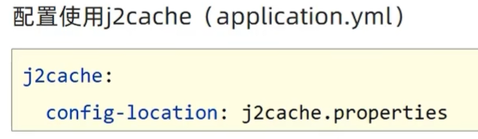

**j2cache配置文件:配置L1缓存、L2缓存、两极缓存的广播方式**


**通过注解使用缓存对象**


### 任务

#### 原生java的定时任务

```java
public final class App {
    public static void main(String[] args) {
        Timer timer = new Timer();
        TimerTask task = new TimerTask() {
            @Override
            public void run() {
                System.out.println("this is a task.");
            }
        };
        timer.schedule(task, 0/* 延迟执行 */, 1000/* 两次执行的间隔 */);
    }
}
```

#### spring整合Quartz


**导入坐标**

```xml
  <dependency>
   <groupId>org.springframework.boot</groupId>
   <artifactId>spring-boot-starter-quartz</artifactId>
  </dependency>
```

**定义任务**

```java
package com.example.demo.jobs;
public class PrintMsgJob extends QuartzJobBean {
    @Override
    protected void executeInternal(JobExecutionContext context) throws JobExecutionException {
        System.out.println("print msg task executed");
    }
}
```

**编写任务的配置类**

```java
package com.example.demo.config;

import org.quartz.CronScheduleBuilder;
import org.quartz.JobBuilder;
import org.quartz.JobDetail;
import org.quartz.Trigger;
import org.quartz.TriggerBuilder;
import org.springframework.context.annotation.Bean;
import org.springframework.context.annotation.Configuration;

import com.example.demo.jobs.PrintMsgJob;

@Configuration
public class QuartzConfig {

    @Bean
    public JobDetail printMsgJobDetail() {
        return JobBuilder
                // 指定job方法
                .newJob(PrintMsgJob.class)
                // 设置job名
                .withIdentity("printMsgJob")
                // 持久化，否则任务不执行就会被丢弃
                .storeDurably()
                .build();
    }

    @Bean
    public Trigger printMsgJobTrigger() {
        return TriggerBuilder
                .newTrigger()
                // 绑定JobDetail
                .forJob("printMsgJob")
                // Schedule可以传入schedule对象也可以传入cron表达式
                // cron表达式格式：
                // 秒 分 时 日 月 周
                // * 代表任意
                // ?代表和前面一致 比如：填写了月日后，星期可以填?
                // ,可以认为表示或
                // a/b表示从a开始每隔b执行
                .withSchedule(CronScheduleBuilder.cronSchedule("0/5 * * * * ?"))
                .build(); 
    }
}
```

#### springTask

**开启任务**

```java
@SpringBootApplication
@EnableScheduling // 开启任务
public class DemoApplication {
 public static void main(String[] args) {
  SpringApplication.run(DemoApplication.class, args);
 }
}
```

**为需要定时执行的任务添加注解**

```java
package com.example.demo.jobs;

import org.springframework.scheduling.annotation.Scheduled;
import org.springframework.stereotype.Component;

@Component
public class PrintMsgJob {
    @Scheduled(cron = "0/5 * * * * ?")
    public void job() {
        System.out.println("print msg task executed");
    }
}
```

**配置yaml(非必要)**

```yaml
spring:
  task:
    scheduling:
      pool:
        size: 10 # 线程池大小
      thread-name-prefix: jobs_ #  线程名的前缀，默认：scheduling-
      shutdown:
        await-termination: true # 关闭线程池前是否等待所有任务执行完毕
        await-termination-period: 10s # 如果等待最多等待多久
```

### 邮件：整合javaMail

>

#### 发送简单邮件

**导入坐标**

```xml
  <dependency>
   <groupId>org.springframework.boot</groupId>
   <artifactId>spring-boot-starter-mail</artifactId>
  </dependency>
```

**编写配置**

```yaml
spring:
  mail:
    host: smtp.qq.com
    username: 2449695354@qq.com
    password: xxxx从smtp服务提供商获得授权码xxxx
```

**编写服务**

```java

@Service
public class SmtpMailServerImpl implements SmtpMailServer {

    @Autowired
    private JavaMailSender mailSender;
    @Value(value = "${spring.mail.username}" + "(xxx官方)")
    private String from; // from 必须和发件人一致

    @Override
    public void SendSimpleMail(String to, String title, String content) {
        SimpleMailMessage msg = new SimpleMailMessage();
        msg.setFrom(from);
        msg.setTo(to);
        msg.setSubject(title);
        msg.setText(content);
        mailSender.send(msg);
    }
}
```

**测试代码**

```java
@SpringBootTest
class DemoApplicationTests {

 @Test
 void contextLoads() {
 }

 @Autowired
 SmtpMailServer sMailServer;

 @Test
 void testSimpleSend() {
  sMailServer.SendSimpleMail("2449695354@qq.com", "test", "content");
 }
}
```

#### 发送发送含附件含html内容的邮件

**编写服务**

```java
@Service
public class SmtpMailServerImpl implements SmtpMailServer {

    @Autowired
    private JavaMailSender mailSender;
    @Value(value = "${spring.mail.username}" + "(xxx官方)")
    private String from; // from 必须和发件人一致

    @Override
    public void SendMail(String to, String title, String htmlContent, File[] attachments) {
        MimeMessage mineMsg = mailSender.createMimeMessage();
        try {
            MimeMessageHelper helper = new MimeMessageHelper(mineMsg, true); // 需要指定multipart=true
            helper.setFrom(from);
            helper.setTo(to);
            helper.setSubject(title);
            helper.setText(htmlContent, true); // 需要指定html=true
            for (File file : attachments) {
                helper.addAttachment(file.getName(), file);
            }
            mailSender.send(mineMsg);
        } catch (Exception e) {
            e.printStackTrace();
        }
    }
}
```

**测试**

```java
 @Test
 void testSend() {
  sMailServer.SendMail(
    "2449695354@qq.com",
    "标题",
    "<h1>标题</h1>" +
    "<a href=\"https://baidu.com\">百度</a>",
    new File[]{new File("D:\\GitProject\\my-projects\\blogWebSites\\blog\\articles\\\u540E\u7AEF\\SpringBoot2\u5B66\u4E60\u7B14\u8BB0\\projects\\_24_springBoot\u6574\u5408javaMail\\demo\\src\\test\\java\\com\\example\\demo\\DemoApplicationTests.java")}
  ); 
 }
```

### 消息

**角色**

- 消息接收方：消费者
- 消息发送方：生产者

**分类**

- 同步消息：必须等其回复（响应）后再执行后续流程
- 异步消息：不管其回复（响应）
- 同步：
- 异步：

**消息的应用：利用消息队列实现负载均衡**


常用消息技术

- ActiveMQ
- RabbitMQ
- RocketMQ
- Kafka：高吞吐量分布式、发布订阅消息系统，提供实时消息功能

**三种广泛使用的异步消息技术**

- JMS接口规范
- AMQP协议
- MQTT协议

**JMS接口规范**

- JMS（java message serveice） 是一个java的消息相关的接口规范，类比与jdbc
- jms消息模型
  - peer-2-peer 点对点模型，消息发送并保存在队列中，只能被一个消费者消费或者超时
  - publish-subscribe 发布订阅模型,消息可以被多个消费者消费
- jms消息种类
  - TextMessage
  - MapMessage
  - **BytesMessage**
  - StreamMessage
  - ObjectMessage
  - Message(只有消息头和属性)
- jms的实现
  - ActiveMQ 早期的
  - Redis
  - HornetMQ
  - RabbitMQ
  - RocketMQ (不完全遵守jms)

**AMQP协议**

- AMQP(advanced message queuing protocol)高级消息队列协议
- 规范了在网络上传输消息的格式
- 用于兼容不同语言平台的消息系统
- 消息模型
  - **direct exchange**
  - fanout exchange
  - **topic exchange**
  - headers exchange
  - system exchange
- 消息种类
  - 只有一种： byte[] 字节流
- AMQP的实现
  - RabbitMQ
  - StormMQ
  - RocketMQ

**MQTT协议**

- MQTT(Message Queueing Telemetry Transport)消息队列遥测传输
- 用于物联网的消息传输协议

#### 整合ActiveMQ（通过jsm技术）

>可以注意到，这里用的是jsm接口技术

**安装并运行**
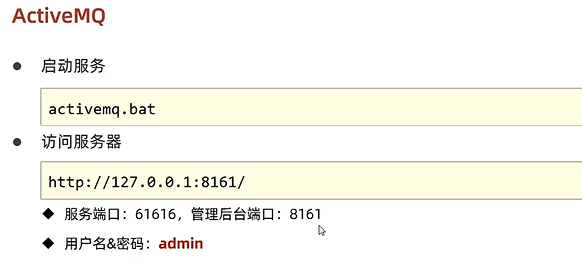

**导入坐标**

```xml
  <dependency>
   <groupId>org.springframework.boot</groupId>
   <artifactId>spring-boot-starter-activemq</artifactId>
  </dependency>
```

**配置**

```yaml
server:
  port: 80

spring:
  activemq:
    broker-url: tcp://127.0.0.1:61616
  jms:
    # 配置使用的模型
    pub-sub-domain: true # 使用发布订阅模型 ,默认是点对点模型
    template:
      default-destination: default_dest_
```

**编写生产者**

```java
package com.example.demo.msg;

import org.springframework.beans.factory.annotation.Autowired;
import org.springframework.jms.core.JmsMessagingTemplate;
import org.springframework.stereotype.Component;

@Component
public class TaskDispacher {
    @Autowired
    JmsMessagingTemplate messageTemplate;
    // 作为消息生产者，向消息队列传递数据
    public void DispachTask(String task){
        messageTemplate.convertAndSend("tasks.queue", task);
    }
}

```

**编写消费者**

```java
package com.example.demo.msg;

import org.springframework.beans.factory.annotation.Autowired;
import org.springframework.jms.annotation.JmsListener;
import org.springframework.jms.core.JmsMessagingTemplate;
import org.springframework.messaging.handler.annotation.SendTo;
import org.springframework.stereotype.Component;

@Component
public class TaskProcessor {
    @Autowired
    JmsMessagingTemplate messageTemplate;

    // 作为消息消费者，主动从消息队列取数据
    public void Processor() {
        System.out.println("取数据...");
        // 如果服务端没有数据，则会阻塞，一直卡在这里，直到取到数据
        String task = messageTemplate.receiveAndConvert("tasks.queue", String.class);
        System.out.println("取到数据");
        System.out.println("processor:" + task);
    }

    // 作为消息消费者，自动取数据
    @JmsListener(destination = "tasks.queue")
    // @SendTo("result.queue") // 可以把方法的返回值(处理结果)转发给另一个消息队列
    public void AutoProcessor(String task) {
        System.out.println("取到数据");
        System.out.println("processor:" + task);
    }

}

```

#### 整合RabbitMQ（通过amqp技术）

##### 安装启动

**安装**

- 安装依赖ERlang
- 配置环境变量ERLANG_HOME
- 安装RabbitMQ
- 

**安装服务**
> `rabbitmq-service.bat install`

**启动服务**
> `rabbitmq-service.bat start`


**启动可视化后台管理服务**

> `rabbitmq-plugins.bat enable rabbitmq_management`


##### springboot整合

**导入坐标**

- spring-boot-starter-amqp默认包含了RabbitMQ所以不用再导入RabbitMQ

```xml
      <dependency>
        <groupId>org.springframework.boot</groupId>
        <artifactId>spring-boot-starter-amqp</artifactId>
      </dependency>
```

**配置yaml**

```yaml
spring:
  rabbitmq:
    host: localhost
    port: 5672
```

###### Direct模式交换机

> 我的理解：直连模式的交换机按照routingkey的值进行等值匹配，将消息路由转发到某个队列中

**直连模式：编写配置类**

```java
package com.example.demo.rabbitmq.directExchange.config;

import org.springframework.amqp.core.Binding;
import org.springframework.amqp.core.BindingBuilder;
import org.springframework.amqp.core.DirectExchange;
import org.springframework.amqp.core.Queue;
import org.springframework.context.annotation.Bean;
import org.springframework.context.annotation.Configuration;

@Configuration
public class DirectExchangeConfig {

    public static final String queueName = "my_queue1";
    public static final String queueName2 = "my_queue2";

    public static final String directExchangeName = "my_direct_exchange1";
    
    public static final String routingKey = "my_directRoutingKey";
    public static final String routingKey2 = "my_directRoutingKey2";

    @Bean
    public Queue getQueue() {
        return new Queue(
                queueName, // 消息队列的名
                false, // 消息服务器是否将消息持久化
                false, // 是否是专用的消息队列，专用消息队列将在连接断开后删除
                false // 是否将消费者和生产者都不使用的消息自动删除
        );
    }

    @Bean
    public Queue getQueue2() {
        return new Queue(
                queueName2, // 消息队列的名
                false, // 消息服务器是否将消息持久化
                false, // 是否是专用的消息队列，专用消息队列将在连接断开后删除
                false // 是否将消费者和生产者都不使用的消息自动删除
        );
    }

    @Bean
    public DirectExchange getDirectExchange() {
        return new DirectExchange(
                directExchangeName, // 直连交换机名
                false, // 消息服务器是否将消息持久化
                false// 是否将消费者和生产者都不使用的消息自动删除
        );
    }

    @Bean
    public Binding bing() {
        // 绑定队列和交换机，并命名
        return BindingBuilder.bind(getQueue()).to(getDirectExchange()).with(routingKey);
    }

    @Bean
    public Binding bing2() {
        // 绑定队列和交换机，并命名
        return BindingBuilder.bind(getQueue2()).to(getDirectExchange()).with(routingKey2);
    }
}
```

**直连模式：在消息生产方编写发送消息代码**

```java
package com.example.demo.rabbitmq.directExchange;

import org.springframework.amqp.core.AmqpTemplate;
import org.springframework.beans.factory.annotation.Autowired;
import org.springframework.stereotype.Component;

import com.example.demo.rabbitmq.directExchange.config.DirectExchangeConfig;

@Component
public class MsgSender {
    @Autowired
    AmqpTemplate amqpTemplate;

    public void sendToQ1(String msg) {
        System.out.println("发送消息给队列1:" + msg);
        // 把消息发送给队列1
        amqpTemplate.convertAndSend(
                DirectExchangeConfig.directExchangeName,
                DirectExchangeConfig.routingKey,
                msg);
    }

    public void sendToQ2(String msg) {
        System.out.println("发送消息给队列2:" + msg);
        // 把消息发送给队列2
        amqpTemplate.convertAndSend(
                DirectExchangeConfig.directExchangeName,
                DirectExchangeConfig.routingKey2,
                msg);
    }
}

```

**直连模式：在消息消费方编写手动接收处理消息代码**

```java
package com.example.demo.rabbitmq.directExchange;

import org.springframework.amqp.core.AmqpTemplate;
import org.springframework.beans.factory.annotation.Autowired;
import org.springframework.stereotype.Component;

import com.example.demo.rabbitmq.directExchange.config.DirectExchangeConfig;

@Component
public class MsgReceiver {
    @Autowired
    AmqpTemplate amqpTemplate;

    // 从队列1获取消息
    public void reveive() {
        System.out.println("从队列1获取消息...");
        String msg = (String) amqpTemplate.receiveAndConvert(DirectExchangeConfig.queueName);
        if (msg == null)
            return;
        System.out.println("处理消息：" + msg);
    }

    // 从队列2获取消息
    public void reveive2() {
        System.out.println("从队列2获取消息...");
        String msg = (String) amqpTemplate.receiveAndConvert(DirectExchangeConfig.queueName2);
        if (msg == null)
            return;
        System.out.println("处理消息：" + msg);
    }
}

```

**直连模式：在消息消费方编写自动接收处理消息代码**

```java
package com.example.demo.rabbitmq.directExchange;

import org.springframework.amqp.core.AmqpTemplate;
import org.springframework.amqp.rabbit.annotation.RabbitListener;
import org.springframework.beans.factory.annotation.Autowired;
import org.springframework.stereotype.Component;

import com.example.demo.rabbitmq.directExchange.config.DirectExchangeConfig;

// @Component
public class MsgAutoReceiver {
    @Autowired
    AmqpTemplate amqpTemplate;

    @RabbitListener(queues = DirectExchangeConfig.queueName)
    public void autoReveive(String msg) {
        System.out.println("自动处理队列1的消息：" + msg);
    }

    @RabbitListener(queues = DirectExchangeConfig.queueName2)
    public void autoReveive2(String msg) {
        System.out.println("自动处理队列2的消息：" + msg);
    }
}
```

###### Topic模式交换机

> 我的理解：Topic交换机按照routingkey的路由转发规则把消息转发到某个或多个队列中

**匹配规则**


**Topic模式:配置交换规则**

```java
package com.example.demo.rabbitmq.topicExchange.config;

import org.springframework.amqp.core.Binding;
import org.springframework.amqp.core.BindingBuilder;
import org.springframework.amqp.core.Queue;
import org.springframework.amqp.core.TopicExchange;
import org.springframework.context.annotation.Bean;
import org.springframework.context.annotation.Configuration;

@Configuration
public class TopicExchangeConfig {

    public static final String queueName = "my_queue1";
    public static final String queueName2 = "my_queue2";

    public static final String topicExchangeName = "my_topic_exchange1";

    public static final String routingKey = "my_topic1.*.id";
    public static final String routingKey2 = "my_topic1.#";

    @Bean
    public Queue getQueue() {
        return new Queue(
                queueName, // 消息队列的名
                false, // 消息服务器是否将消息持久化
                false, // 是否是专用的消息队列，专用消息队列将在连接断开后删除
                false // 是否将消费者和生产者都不使用的消息自动删除
        );
    }

    @Bean
    public Queue getQueue2() {
        return new Queue(
                queueName2, // 消息队列的名
                false, // 消息服务器是否将消息持久化
                false, // 是否是专用的消息队列，专用消息队列将在连接断开后删除
                false // 是否将消费者和生产者都不使用的消息自动删除
        );
    }

    @Bean
    public TopicExchange getTopicExchange() {
        return new TopicExchange(
                topicExchangeName, // 直连交换机名
                false, // 消息服务器是否将消息持久化
                false// 是否将消费者和生产者都不使用的消息自动删除
        );
    }

    @Bean
    public Binding bing() {
        // 绑定队列和交换机，并命名
        return BindingBuilder.bind(getQueue()).to(getTopicExchange()).with(routingKey);
    }

    @Bean
    public Binding bing2() {
        // 绑定队列和交换机，并命名
        return BindingBuilder.bind(getQueue2()).to(getTopicExchange()).with(routingKey2);
    }
}

```

**Topic模式:消息生产者发送消息**

```java
package com.example.demo.rabbitmq.topicExchange;

import org.springframework.amqp.core.AmqpTemplate;
import org.springframework.beans.factory.annotation.Autowired;
import org.springframework.stereotype.Component;

import com.example.demo.rabbitmq.topicExchange.config.TopicExchangeConfig;

@Component
public class MsgSender {
    @Autowired
    AmqpTemplate amqpTemplate;

    public void sendOrder(String orderid) {
        System.out.println("发送消息到路由(my_topic1.orders.id):" + orderid);
        // 交换机会把消息发送给队列1和队列2
        amqpTemplate.convertAndSend(
                TopicExchangeConfig.topicExchangeName,
                "my_topic1.orders.id",
                orderid);
    }

    public void sendUser(String userid) {
        System.out.println("发送消息到路由(my_topic1.users.id):" + userid);
        // 交换机会把消息发送给队列1和队列2
        amqpTemplate.convertAndSend(
                TopicExchangeConfig.topicExchangeName,
                "my_topic1.users.id",
                userid);
    }

    public void sendOther(String other) {
        System.out.println("发送消息到路由(my_topic1.other):" + other);
        // 交换机会把消息发送给队列2
        amqpTemplate.convertAndSend(
                TopicExchangeConfig.topicExchangeName,
                "my_topic1.other",
                other);
    }
}

```

**Topic模式:消息消费者自动处理消息**

```java
package com.example.demo.rabbitmq.topicExchange;

import org.springframework.amqp.core.AmqpTemplate;
import org.springframework.amqp.rabbit.annotation.RabbitListener;
import org.springframework.beans.factory.annotation.Autowired;
import org.springframework.stereotype.Component;

import com.example.demo.rabbitmq.topicExchange.config.TopicExchangeConfig;

@Component
public class MsgAutoReceiver {
    @Autowired
    AmqpTemplate amqpTemplate;

    @RabbitListener(queues = TopicExchangeConfig.queueName)
    public void autoReveive(String msg) {
        System.out.println("自动处理队列1的消息：" + msg);
    }

    @RabbitListener(queues = TopicExchangeConfig.queueName2)
    public void autoReveive2(String msg) {
        System.out.println("自动处理队列2的消息：" + msg);
    }
}
```

**Topic模式:消息消费者从队列手动获取消息**

```java
package com.example.demo.rabbitmq.topicExchange;

import org.springframework.amqp.core.AmqpTemplate;
import org.springframework.beans.factory.annotation.Autowired;
import org.springframework.stereotype.Component;

import com.example.demo.rabbitmq.topicExchange.config.TopicExchangeConfig;

@Component
public class MsgReceiver {
    @Autowired
    AmqpTemplate amqpTemplate;

    // 从队列1获取消息
    public void reveive() {
        System.out.println("从队列1获取消息...");
        String msg = (String) amqpTemplate.receiveAndConvert(TopicExchangeConfig.queueName);
        if (msg == null)
            return;
        System.out.println("处理消息：" + msg);
    }

    // 从队列2获取消息
    public void reveive2() {
        System.out.println("从队列2获取消息...");
        String msg = (String) amqpTemplate.receiveAndConvert(TopicExchangeConfig.queueName2);
        if (msg == null)
            return;
        System.out.println("处理消息：" + msg);
    }
}
```

#### RocketMQ


**NameServer和Broker**

- 
- 

**启动命令**

- 启动broker需要设置环境变量NAMESRV_ADDR=127.0.0.1:9876
- 需要先成功启动mqnamesrv再启动mqbroker
- 

导入坐标

```xml
  <dependency>
   <groupId>org.apache.rocketmq</groupId>
   <artifactId>rocketmq-spring-boot-starter</artifactId>
   <version>2.2.1</version>
  </dependency>
```

配置

```yaml
rocketmq:
  name-server: 0.0.0.0:9876
  producer:
    group: my_group_1 # 必须填写
```

**消息生产者：同步发送消息**

```java
package com.example.demo.rocketmq;

import org.apache.rocketmq.spring.core.RocketMQTemplate;
import org.springframework.beans.factory.annotation.Autowired;
import org.springframework.stereotype.Component;

@Component
public class MySyncSender {
    @Autowired
    RocketMQTemplate rocketMQTemplate;

    public void send(String msg) {
        System.out.println("同步发送消息：" + msg);
        rocketMQTemplate.convertAndSend("my_destination_1", msg);
        System.out.println("同步消息发送完毕......");
    }
}

```

**消息生产者：异步发送消息**

```java
package com.example.demo.rocketmq;

import org.apache.rocketmq.client.producer.SendCallback;
import org.apache.rocketmq.client.producer.SendResult;
import org.apache.rocketmq.spring.core.RocketMQTemplate;
import org.springframework.beans.factory.annotation.Autowired;
import org.springframework.stereotype.Component;

@Component
public class MyAsyncSender {
    @Autowired
    RocketMQTemplate rocketMQTemplate;

    public void send(String msg) {
        System.out.println("异步发送消息：" + msg);
        rocketMQTemplate.asyncSend("my_destination_1", msg, new SendCallback() {
            @Override
            public void onSuccess(SendResult sendResult) {
                System.out.println("异步消息发送成功......");
            }

            @Override
            public void onException(Throwable e) {
                System.out.println("异步消息发送失败......");
            }
        });
    }
}
```

**消息消费者：消息监听器**

```java
package com.example.demo.rocketmq;

import org.apache.rocketmq.spring.annotation.RocketMQMessageListener;
import org.apache.rocketmq.spring.core.RocketMQListener;
import org.springframework.stereotype.Component;

@Component
// topic要和目的地名称一致，消费者组要和生产者组对应
@RocketMQMessageListener(topic = "my_destination_1", consumerGroup = "my_group_1")
public class MyAutoReceiver implements RocketMQListener<String> {
    @Override
    public void onMessage(String message) {
        System.out.println("收到消息：" + message);
    }
}
```

**测试结果**

```java
@SpringBootTest
class DemoApplicationTests {
 @Autowired
 MySyncSender syncSender;
 @Autowired
 MyAsyncSender asyncSender;

 @Test
 void testSend() {
  asyncSender.send("hello msg1");
  syncSender.send("hello msg2");
  /*
   * 异步发送消息：hello msg1
   * 同步发送消息：hello msg2
   * 同步消息发送完毕......
   * 收到消息：hello msg2
   * 异步消息发送成功......
   * 收到消息：hello msg1
   */
 }
}
```

#### kafka

**安装启动**


**预创建topic**


**测试**


**导入坐标**


**配置**


**生产消息**


**消费消息**


#### spring-boot-admin监控

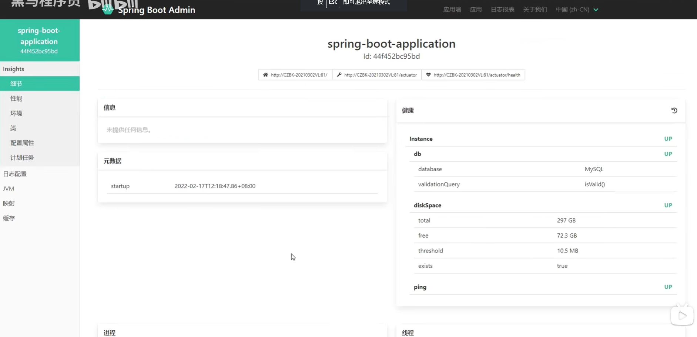

##### 使用

**服务端：导入坐标**
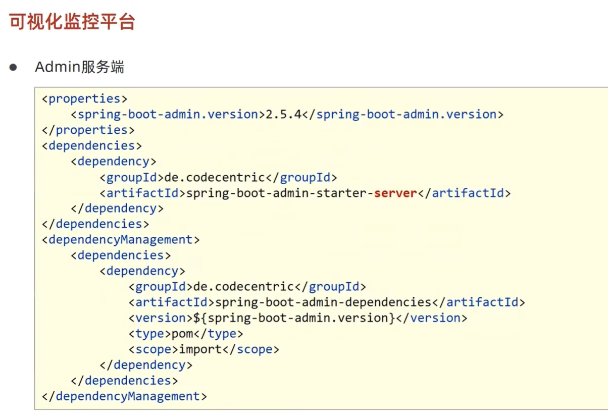

**客户端：导入坐标**


**简化版导入坐标：admin版本一般和springboot版本一致即可**
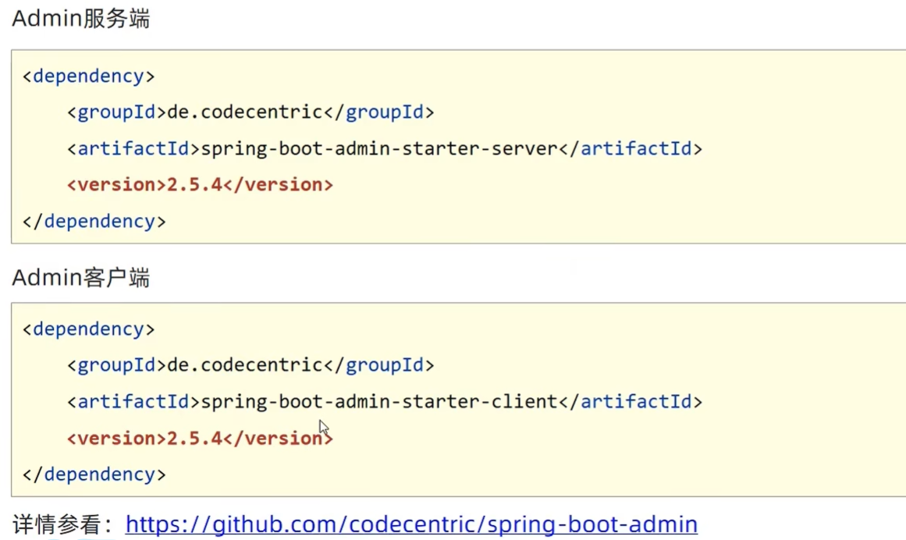

**服务端：配置启动admin的关键信息**


**客户端：配置开放需要被监控的系统属性**

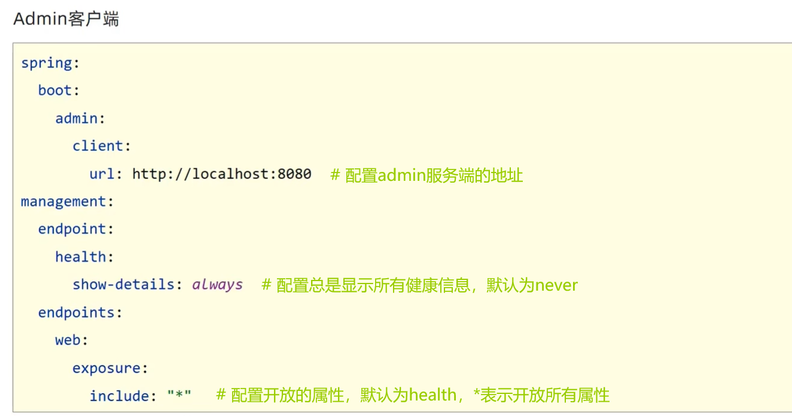

**总结**

- admin服务端
  - 导入spring-boot-admin-starter-server坐标
  - 导入spring-boot-starter-web坐标
  - 配置启动ip和端口
  - 给启动类添加`@EnableAdminServer`注解
- admin客户端
  - 导入spring-boot-admin-starter-client坐标
  - 配置admin服务端地址：http://???:port
  - 配置允许被监控的属性

##### 监控原理

> - `JMX`( Java Management Extension)是java的标准的管理拓展规范 , 日常工作中常用的系统监控,如:内存,cpu使用率,线程数,垃圾回收等监控曲线都可以通过jmx来进行管理;并且可以运行时动态修改配置,
>   - `JConsole`，从Java 5开始，引入了JConsole,其是一个内置 Java 性能分析器，可以从命令行或在 GUI shell 中运行。用于对JVM中内存、线程和类等的监控，是一个基于JMX（java management extensions）的GUI性能监控工具。
>   - `spring-boot-actuator`: 是spring对jmx进行拓展,Actuator是Spring Boot项目的一个扩展模块，它提供了一系列功能用于监控和管理Spring Boot应用程序，包括健康检查、配置信息、度量数据、日志记录等。
>     - `spring-boot-admin` 可以认为是actuator的web端界面


**控制开放端点信息**

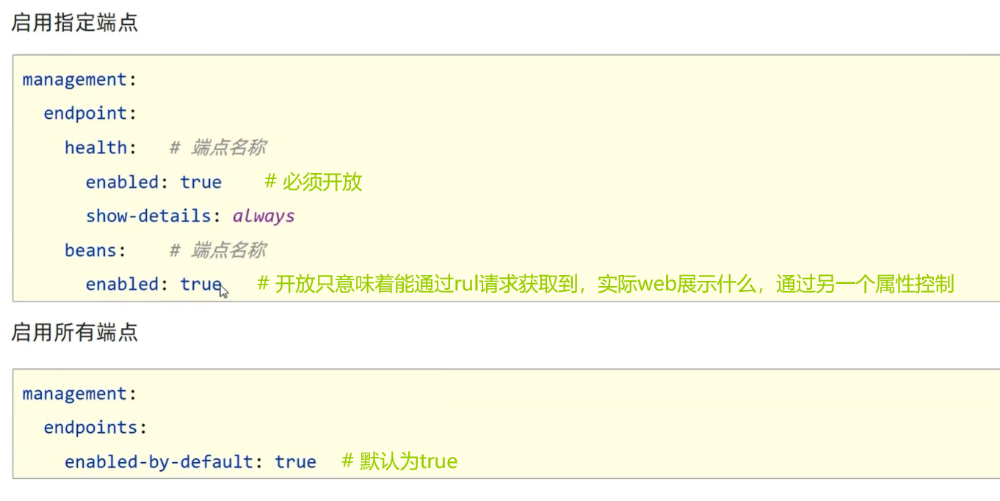

**控制展示端点信息**

- jmx用来控制在jconsole上可以展示哪些**开放的**端点信息
- web用来控制在admin上可以上展示哪些**开放的**端点信息
- 
- 

**展示端点信息控制的默认值**

- 
- 

##### info端点指标控制


##### 简单文本info信息

**配置**


**效果**


##### 编程展示info信息

**编程**

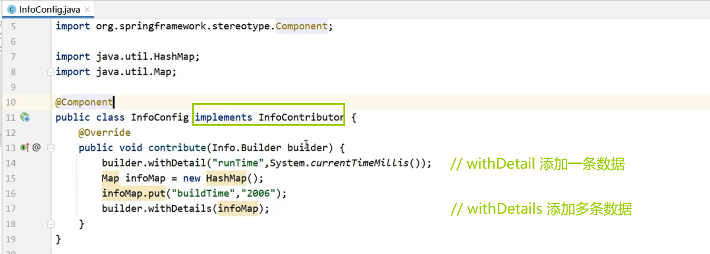

**效果**

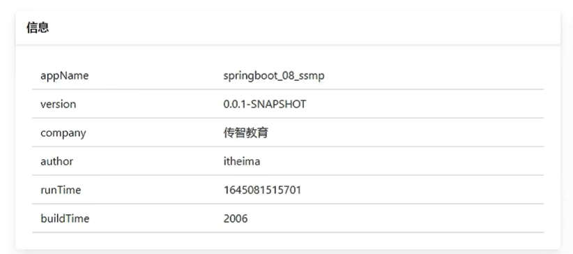

##### health端点指标控制

**一些写法**  

- 
- 

**效果**  

- 

##### metrics端点指标控制

> 可以用来统计某个函数的执行次数

**步骤**

> 案例是统计用户付费操作次数，但实际应该应该用来监控系统性能相关信息，而不是业务信息


**效果**


##### 自定义端点

**步骤**


**效果**

> 访问端点地址时可以得到一些信息，通过这些接口可以再开放一套监控业务的系统，展示这些信息。
>
## 原理篇

### 自动配置

#### bean加载方式（springFramework知识复习）

##### **加载方式1：xml文件配置`<bean/>`**

- 1.在xml文件中声明自定义bean和第三方bean
- 2.加载applicationContext.xml文件
- 
- 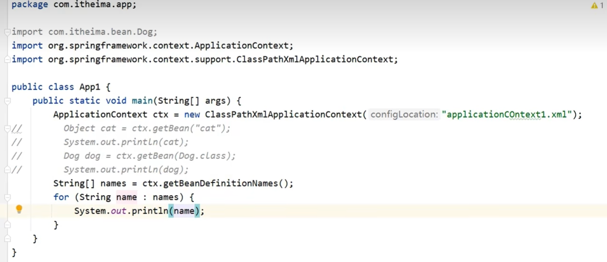

##### **加载方式2：xml文件配置`<content:扫描路径>`+对要注册为Bean的类添加@Compoment等的注解**

- 1.给自定义bean添加@Component注解，给第三方bean的配置类添加@Component或@Configuration注解
- 2.在xml文件中声明扫描包路径，扫描指定路径下的bean
- 3.加载applicationContext.xml文件
- 
- 
- 

##### **加载方式3：Spring配置类+CompomentScan("扫描位置")注解+对要注册为Bean的类添加@Compoment等的注解**

- 1.给自定义bean添加@Component注解，给第三方bean的配置类添加@Component或@Configuration注解
- 2.编写Spring的配置类
  - 使用@ComponentScan注解定义Spring的配置类，在注解中声明扫描路径
  - 使用@ImportResource("旧系统的.xml")注解来加载旧的系统（如果旧系统使用xml文件配置bean）
- 3.加载spring配置类
- 
- 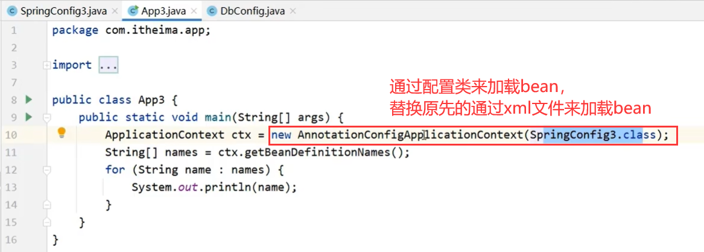
- 
- 补充
  - **@Configuration和@Component注解的区别**
    - 共同点：带有@Configuration注解的类和带有@Component注解的类都会被初始化在容器中
    - 不同点：
      - 带有@Configuration注解的类会被初始化成CGLIB的代理对象
      - 带有@Configuration注解的类不会被初始化代理对象
      - @Configuration的属性proxyBeanMethods=false时，则不会被容器初始化为代理对象
      - 当被初始化为CGLIB代理对象后，当调用其带有@Bean注解的方法时，将始终返回容器中的单例对象，不会创建新的对象
    - 

##### **加载方式4：Spring配置类+Import({xxx.class})注解**

- 不需要使用@Component注解 不需要写配置类然后使用@Bean注解来初始化第三方类
- 不需要使用ApplicationCompoment.xml配置文件
- 只需要编写Spring的配置类，使用@import({xxx.class})注解修饰这个类
  - 
  - 
- 然后通过加载Spring配置类的方式初始化容器即可
  - 
- 
- 也可以使用@import({DataSourceConfig.class})注解导入第三方Bean的配置类，并且DataSourceConfig同样可以不用写@Compoment，不会影响其带有@Bean注解的方法对象的初始化，但是要注意@Compoment注解和@Configuration注解的区别
  - 
  - 

##### **加载方式5：Spring配置类+Import({xxx.class,导入选择器.class})注解**

- 1编写MyImportSelector类，实现ImportSelector导入选择器接口，
  - 可以用来根据环境控制具体导入什么类
- 2编写Spring的配置类，在配置类上使用Import注解，值为`MyImportSelector.class`
- 3通过Spring配置类初始化容器
- 

##### **加载方式6：Spring配置类+Import({xxx.class,导入选择器.class,导入Bean定义注册器.class})注解**

- 1编写MyImportBeanDefinitionRegister类，实现ImportBeanDefinitionRegister导入Bean定义注册器接口，
  - 可以更具环境控制具体导入什么Bean，
  - 并且可以通过BeanDefinition实例控制Bean的一些属性
- 2编写Spring配置类，在配置类使用Import注解，值为MyImportBeanDefinitionRegister.class
- 
- 
- 
- 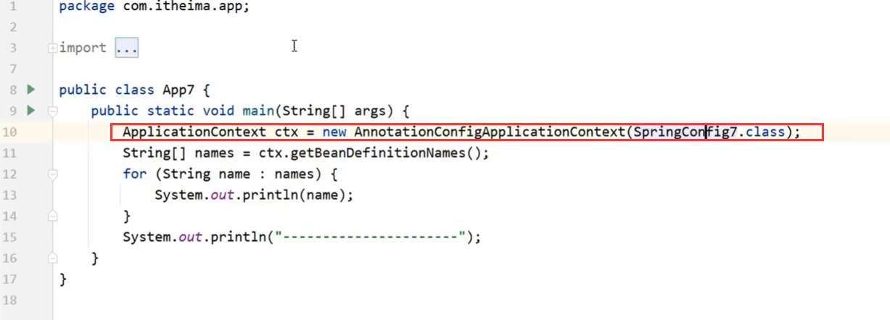

##### **加载方式7：Spring配置类+Import({xxx.class,导入选择器.class,导入Bean定义注册器.class,后导入Bean定义注册器.class})注解**

- 编写类:MyBeanDefinitionRegistryPostProcessor,实现接口BeanDefinitionRegistryPostProcessor
  - 可以对BeanDefinition注册器中注册的BeanDefinition做最后的修改
- 编写Spring配置类 ，使用Import(MyBeanDefinitionRegistryPostProcessor.class)注解
- 通过导入Spring配置类的方式加载容器
- 
- **作用**
  - 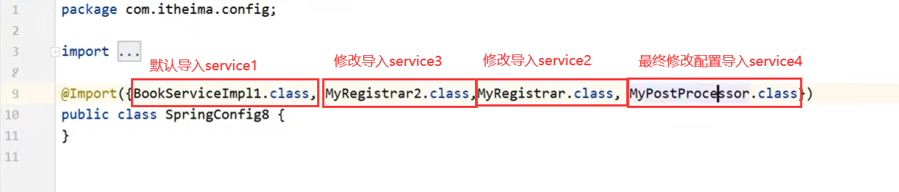
  - 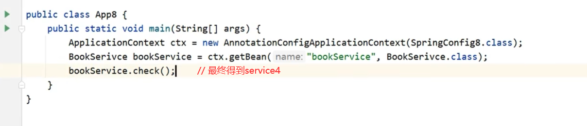
  - 
  - 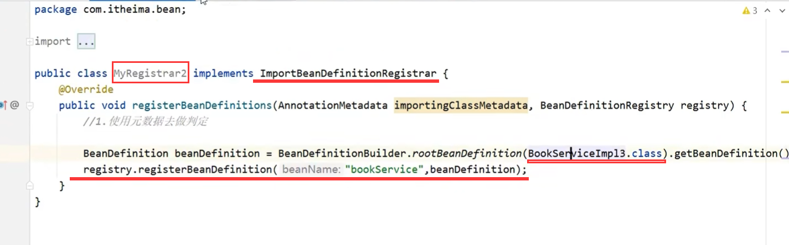
  - 

##### **加载方式8：加载完容器后ctx.Register(xxx.class)**

- 在容器加载完毕后手动注入对象
- 

#### bean加载控制

#### bean依赖属性配置

#### 自动配置原理

#### 变更自动配置

### 自定义starter

### 核心原理
