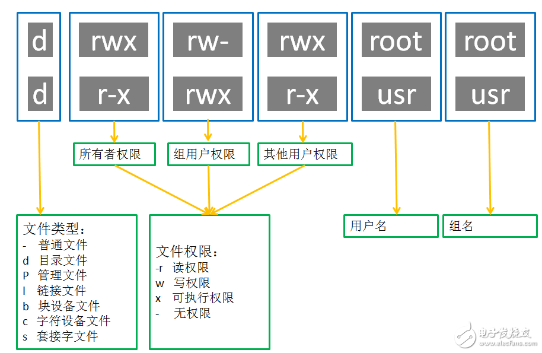

##　用户权限


普通用户权限：限制在其$HOME目录之内,在其他大部分地方只有只读和执行权限.
root用户权限: 拥有文件系统整个根目录的权限


## su命令

**功能简介**
su (switch user) 切换用户

**语法格式**
```bash
su [-] [用户名] # 
exit # 退回到上一个用户,快捷键ctrl+d
```


**选项说明**
- `-` 切换后加载环境变量

**参数说明**

- 用户名

## sudo命令


**功能简介**
为普通命令授权,临时使用root身份执行命令

**语法**
```bash
sudo command
```

**注意事项**

- 不是所有用户都有权利执行sudo命令,**需要为普通用户配置sudo权限**


**为普通用户配置sudo权限**

```bash
# 切换到root用户
su - root
# 执行visudo命令,会自动打开/etc/sudoers
visudo
# 添加内容
dyg ALL=(ALL:ALL) NOPASSWD:ALL
```


`/etc/sudoers`格式说明

```bash
# 语法
# [用户名] [主机]=(用户:用户组) [NOPASSWD:][命令]

# 示例:
# 用户dyg在执行sudo命令时,可获取到user2组的user1的操作权限,在host1上执行command1命令
dyg host1=(user1:user2)  command1

```

`/etc/sudoers`案例
```bash
##该文件允许特定用户像root用户一样使用各种各样的命令，而不需要root用户的密码 
## 在文件的底部提供了很多相关命令的示例以供选择，这些示例都可以被特定用户或  
## ## 用户组所使用  
## 该文件必须使用"visudo"命令编辑

Defaults        env_reset
Defaults        mail_badpass
Defaults        secure_path="/usr/local/sbin:/usr/local/bin:/usr/sbin:/usr/bin:/sbin:/bin:/snap/bin"

#主机别名
## 对于一组服务器，你可能会更喜欢使用主机名（可能是全域名的通配符）
## 或IP地址代替，这时可以配置主机别名
Host_Alias     FILESERVERS = fs1, fs2
Host_Alias     MAILSERVERS = smtp, smtp2

#用户别名
## 这并不很常用，因为你可以通过使用组来代替一组用户的别名  
User_Alias ADMINS = jsmith, mikem
 
## 命令别名
## 指定一系列相互关联的命令（当然可以是一个）的别名，通过赋予该别名sudo权限，  

#网络操作相关命令别名  
Cmnd_Alias NETWORKING = /sbin/route, /sbin/ifconfig, /bin/ping, /sbin/dhclient, /usr/bin/net, /sbin/iptables, /usr/bin/rfcomm, /usr/bin/wvdial, /sbin/iwconfig, /sbin/mii-tool
#软件安装管理相关命令别名  
Cmnd_Alias SOFTWARE = /bin/rpm, /usr/bin/up2date, /usr/bin/yum
#服务相关命令别名 
Cmnd_Alias SERVICES = /sbin/service, /sbin/chkconfig
#本地数据库升级命令别名  
Cmnd_Alias LOCATE = /usr/sbin/updatedb
#磁盘操作相关命令别名
Cmnd_Alias STORAGE = /sbin/fdisk, /sbin/sfdisk, /sbin/parted, /sbin/partprobe, /bin/mount, /bin/umount
#代理权限相关命令别名 
Cmnd_Alias DELEGATING = /usr/sbin/visudo, /bin/chown, /bin/chmod, /bin/chgrp
#进程相关命令别名
Cmnd_Alias PROCESSES = /bin/nice, /bin/kill, /usr/bin/kill, /usr/bin/killall
#驱动命令别名
Cmnd_Alias DRIVERS = /sbin/modprobe

## 下面是规则配置：什么用户在哪台服务器上可以执行哪些命令（sudoers文件可以在多个系统上共享）
##语法
##  用户 登录的主机 =（可以变换的身份） 可以执行的命令  

## 允许root在任何地方运行任何命令
root    ALL=(ALL)       ALL
## 允许“sys”用户组的成员运行 网络、软件、服务管理应用等命令。
%sys ALL = NETWORKING, SOFTWARE, SERVICES, STORAGE, DELEGATING, PROCESSES, LOCATE, DRIVERS
## 允许“wheel”用户组的成员运行所有命令
%wheel  ALL=(ALL)       ALL
## 允许“wheel”用户组的成员运行所有命令，且运行时不需要输入密码
%wheel        ALL=(ALL)       NOPASSWD: ALL
## 允许“users”组的成员运行 挂载、卸载光盘的命令
%users  ALL=/sbin/mount /mnt/cdrom, /sbin/umount /mnt/cdrom
## 允许“users”组的成员在本机运行 /sbin/shutdown -h now 命令
%users  localhost=/sbin/shutdown -h now

## 读取 /etc/sudoers.d 目录下所有文件的内容作为配嵌入到此配置文件(注意，下面的 # 后面并不是注释)
#includedir /etc/sudoers.d
```


## 用户组管理

创建用户组
```bash
sudo groupadd 用户组
```

**删除用户组**

```bash
sudo groupdel 用户组
```


## 用户管理

### 创建用户

**语法格式**
```bash
sudo useradd [-g -d] 用户名
```
**选项说明**
- `-g` 指定用户组(group),不指定则创造同名用户组然后加入
- `-d` 指定用户HOME目录,默认在 `/home/用户名/`

### 删除用户

**语法格式**
```bash
sudo userdel [-r] 用户名
```

**选项说明**
- `-r` 删除用户HOME目录,默认保留

### 查看用户属组

**语法格式**
```bash
id [用户名]
```

**参数说明**
- 用户名,不提供则查看自身的属组


### 修改用户组

> 一个 Linux用户只有一个主组(Primary group)和一个或多个附属组(Secondary groups)

**语法格式**
```bash
# 添加到附属组
usermod -aG 用户组 用户名 # -G是添加附属组(-a表示不需要从其他附属组移除) -g是修改主组
# 从附属组删除
gpasswd -d 用户名 用户组
```


**案例**
```bash
# 创建用户和组
root@iZj6cin9q6x5p5bh4ofx79Z:~# sudo useradd dyg
root@iZj6cin9q6x5p5bh4ofx79Z:~# sudo groupadd gdyg
# 添加dyg到附属组gdyg
root@iZj6cin9q6x5p5bh4ofx79Z:~# usermod -a dyg -G gdyg 
root@iZj6cin9q6x5p5bh4ofx79Z:~# id dyg
uid=1002(dyg) gid=1002(dyg) groups=1002(dyg),1003(gdyg)
# 将dyg从附属组gdyg中删除
root@iZj6cin9q6x5p5bh4ofx79Z:~# sudo gpasswd -d dyg gdyg 
Removing user dyg from group gdyg
root@iZj6cin9q6x5p5bh4ofx79Z:~# id dyg
uid=1002(dyg) gid=1002(dyg) groups=1002(dyg)
```

### 查看系统中的用户和组

**语法**
```
getent passwd
getent group
```

**案例**
```bash
root@iZj6cin9q6x5p5bh4ofx79Z:~# getent passwd 
# 格式
# 用户名root : 密码x : 用户id0 : 主组id0 : 描述信息root : HOME目录/root : 执行终端/bin/bash
root:x:0:0:root:/root:/bin/bash
...略
admin:x:1000:1000::/home/admin:/bin/bash
nginx:x:111:122:nginx user,,,:/nonexistent:/bin/false
git:x:1001:1001:,,,:/home/git:/bin/bash
dyg:x:1002:1002::/home/dyg:/bin/sh
dyg2:x:1003:1004::/home/dyg2:/bin/sh
root:x:0:0:root:/root:/bin/sh
nobody:x:65534:65534:nobody:/:/usr/sbin/nologin
```

**案例**

```bash
root@iZj6cin9q6x5p5bh4ofx79Z:~# getent group
# 格式
# 组名称:组认证:组id:组成员1,组成员2
root:x:0:
...略
nginx:x:122:
git:x:1001:
dyg:x:1002:
gdyg:x:1003:dyg,dyg2
dyg2:x:1004:
root:x:0:
nogroup:x:65534:
```


## 文件权限





###　chmod修改文件"产权权限"

> 修改文件拥有者对文件的权限

**语法**
```bash
chmod [-R] 权限描述 文件或文件夹
```

**选项说明**
- `-R` 递归文件夹内所有内容修改权限


**参数说明**
- 权限描述
  - 示例1: `u=rwx,g=rx,o=x`
  - 示例2: `751`
  - 示例3: `u+x` user添加执行权限
  - 示例4: `u-x` user移除执行权限
  - 示例3: `g+w` 用户组添加写入权限
  - 示例4: `g-w` 用户组移除写入权限
  - 示例5: `+x` all添加执行权限
  - 示例6: `a+x` all添加执行权限

**示例**

```bash
root@iZj6cin9q6x5p5bh4ofx79Z:~# chmod u=rwx,g=rx,o=x log.txt 
root@iZj6cin9q6x5p5bh4ofx79Z:~# ls -l log.txt 
-rwxr-x--x 1 root root 18 Nov 23 19:03 log.txt

root@iZj6cin9q6x5p5bh4ofx79Z:~# chmod 700 log.txt 
root@iZj6cin9q6x5p5bh4ofx79Z:~# ls -l log.txt 
-rwx------ 1 root root 18 Nov 23 19:03 log.txt

root@iZj6cin9q6x5p5bh4ofx79Z:~# chmod a+x log.txt 
root@iZj6cin9q6x5p5bh4ofx79Z:~# ls -l log.txt 
-rwx--x--x 1 root root 18 Nov 23 19:03 log.txt
```


###　chown修改文件"产权人"

> 修改文件的拥有者

**语法**
```bash
chown [-R] [用户][:用户组] 文件或文件夹
```
**选项说明**
- `-R` 递归文件夹内所有内容修改权限


**示例**

```bash
root@iZj6cin9q6x5p5bh4ofx79Z:~# chown dyg:dyg2 log.txt 
root@iZj6cin9q6x5p5bh4ofx79Z:~# ls -l log.txt 
-rwx--x--x 1 dyg dyg2 18 Nov 23 19:03 log.txt
```