# java学习笔记


<details>
<summary>显示/隐藏

## 目录

</summary>

- [java学习笔记](#java学习笔记)
  - [目录](#目录)
  - [学习及笔记更新日志](#学习及笔记更新日志)
  - [概述](#概述)
  - [基础语法](#基础语法)
    - [注释](#注释)
    - [字面量](#字面量)
    - [基本数据类型](#基本数据类型)
    - [标识符命名要求](#标识符命名要求)
  - [类型转换](#类型转换)
    - [自动类型转换](#自动类型转换)
    - [强制类型转换](#强制类型转换)
  - [运算符](#运算符)
    - [算数运算符](#算数运算符)
    - [字符串连接运算符](#字符串连接运算符)
    - [自增自减运算符](#自增自减运算符)
    - [赋值运算符](#赋值运算符)
    - [关系运算符(条件运算符)](#关系运算符条件运算符)
    - [逻辑运算符](#逻辑运算符)
    - [三元运算符](#三元运算符)
    - [运算符优先级](#运算符优先级)
  - [键盘录入API](#键盘录入api)
  - [流程控制](#流程控制)
    - [分支](#分支)
    - [循环](#循环)
  - [随机数](#随机数)
  - [引用数据类型](#引用数据类型)
    - [数组](#数组)
    - [在内存中的占用情况](#在内存中的占用情况)
  - [方法](#方法)
    - [定义、调用](#定义调用)
    - [方法在内存中的调用流程](#方法在内存中的调用流程)
    - [方法参数传递机制](#方法参数传递机制)
    - [方法重载](#方法重载)
  - [基础知识巩固练习案例](#基础知识巩固练习案例)
    - [买飞机票算票价](#买飞机票算票价)
    - [找素数](#找素数)
    - [生成验证码](#生成验证码)
    - [数字加密](#数字加密)
    - [双色球系统案例](#双色球系统案例)
  - [面向对象](#面向对象)
    - [类](#类)
    - [构造器](#构造器)
    - [this关键字](#this关键字)
    - [封装](#封装)
    - [标准javaBean实体类](#标准javabean实体类)
    - [成员变量和局部变量的区别](#成员变量和局部变量的区别)
    - [对象数组在内存中的占用情况](#对象数组在内存中的占用情况)
  - [String字符串类及其常用API](#string字符串类及其常用api)
    - [相关概念](#相关概念)
    - [APis](#apis)
      - [构造器](#构造器-1)
      - [常用成员方法](#常用成员方法)
    - [案例](#案例)
  - [ArraryList集合容器类及其常用API](#arrarylist集合容器类及其常用api)
    - [相关概念](#相关概念-1)
    - [APIs](#apis-1)
      - [构造器](#构造器-2)
      - [常用成员方法](#常用成员方法-1)
    - [一些案例](#一些案例)
  - [面向对象高级](#面向对象高级)
    - [static关键字](#static关键字)
    - [代码块](#代码块)
    - [继承extends](#继承extends)
    - [继承后的方法重写](#继承后的方法重写)
    - [继承后子类构造器的特点](#继承后子类构造器的特点)
    - [this和super的使用](#this和super的使用)
  - [单例设计模式](#单例设计模式)
    - [设计模式](#设计模式)
    - [饿汉单例](#饿汉单例)
    - [懒汉单例模式](#懒汉单例模式)
  - [包Package](#包package)
  - [权限修饰符](#权限修饰符)
  - [final修饰符](#final修饰符)
  - [常量](#常量)
  - [枚举](#枚举)
  - [抽象类、抽象方法](#抽象类抽象方法)
    - [final和abstract关系](#final和abstract关系)
  - [接口](#接口)
  - [多态](#多态)
    - [抽象类的多态实现测试](#抽象类的多态实现测试)
  - [内部类](#内部类)
    - [静态内部类](#静态内部类)
    - [成员内部类](#成员内部类)
    - [局部内部类](#局部内部类)
    - [匿名内部类【重点】](#匿名内部类重点)
  - [Object类及其常用APIs](#object类及其常用apis)
    - [toString()](#tostring)
    - [equals(Object)](#equalsobject)
  - [Objects类及其常用APIs](#objects类及其常用apis)
    - [Objects.equals](#objectsequals)
    - [Objects.inNull](#objectsinnull)
  - [StringBuilder类及其常用APIs](#stringbuilder类及其常用apis)
    - [StringBuilder()构造器](#stringbuilder构造器)
    - [append(任意类型)](#append任意类型)
    - [reverse()](#reverse)
    - [length()](#length)
    - [toString()](#tostring-1)
    - [测试](#测试)
  - [Math类及其常用APIs](#math类及其常用apis)
    - [常用APIs](#常用apis)
  - [System类及其常用APIs](#system类及其常用apis)
    - [常用APIs](#常用apis-1)
  - [BigDecimal类及其常用APIs](#bigdecimal类及其常用apis)
    - [BigDecimal构造函数](#bigdecimal构造函数)
    - [常用APIs](#常用apis-2)
    - [精度问题](#精度问题)
    - [二次封装](#二次封装)
  - [Date日期对象及常用APIs](#date日期对象及常用apis)
    - [构造器](#构造器-3)
    - [常用方法](#常用方法)
  - [SimpleDateFormat 日期对象及常用APIs](#simpledateformat-日期对象及常用apis)
    - [构造器](#构造器-4)
    - [常用方法](#常用方法-1)
  - [Calendar 日历对象及常用APIs](#calendar-日历对象及常用apis)
    - [APIs](#apis-2)
  - [JDK8新增时间类](#jdk8新增时间类)
    - [`LocalDate`、`LocalTime`、`LocalDateTime`类及其APIs](#localdatelocaltimelocaldatetime类及其apis)
      - [构造函数](#构造函数)
      - [常用成员函数APIs](#常用成员函数apis)
    - [`Instant`类及APIs](#instant类及apis)
      - [Instant创建实例对象](#instant创建实例对象)
      - [一些方法](#一些方法)
    - [`Instant`类及APIs](#instant类及apis-1)
      - [实例化](#实例化)
      - [方法](#方法-1)
    - [Period类](#period类)
    - [Duration类](#duration类)
    - [ChronoUnit类](#chronounit类)
  - [包装类](#包装类)
  - [正则表达式](#正则表达式)
    - [API](#api)
    - [正则语法](#正则语法)
    - [案例测试](#案例测试)
  - [Arrays数组的工具类](#arrays数组的工具类)
    - [tostring](#tostring-2)
    - [sort](#sort)
    - [自定义sort排序](#自定义sort排序)
    - [binarySearch二分查找](#binarysearch二分查找)
  - [Lambda表达式](#lambda表达式)
  - [Collection集合](#collection集合)
    - [Collection集合概念](#collection集合概念)
    - [Collection集合常用API](#collection集合常用api)
    - [Collection集合遍历](#collection集合遍历)
      - [迭代器](#迭代器)
      - [加强版for循环](#加强版for循环)
      - [结合forEach方法和lambda表达式](#结合foreach方法和lambda表达式)
    - [List系列的集合](#list系列的集合)
      - [ArrayList](#arraylist)
      - [LinkedList](#linkedlist)
      - [迭代时删除元素的问题](#迭代时删除元素的问题)
    - [Set系列集合](#set系列集合)
      - [HashSet](#hashset)
      - [LinkedHashSet](#linkedhashset)
      - [TreeSet](#treeset)
  - [可变参数](#可变参数)
  - [集合的工具类：Collections类](#集合的工具类collections类)
  - [扑克牌洗牌分牌](#扑克牌洗牌分牌)
  - [泛型](#泛型)
    - [自定义泛型类](#自定义泛型类)
    - [自定义泛型方法](#自定义泛型方法)
    - [自定义泛型接口](#自定义泛型接口)
    - [泛型通配符](#泛型通配符)
  - [Map集合](#map集合)
    - [概念](#概念)
    - [API](#api-1)
    - [特点](#特点)
    - [遍历](#遍历)
    - [案例](#案例-1)
    - [集合和Map的嵌套](#集合和map的嵌套)
  - [不可变集合](#不可变集合)
  - [Stream流](#stream流)
    - [概念](#概念-1)
    - [获取Stream流](#获取stream流)
    - [Stream的常用中间方法](#stream的常用中间方法)
    - [Stream的常用终极方法](#stream的常用终极方法)
    - [Stream流的收集](#stream流的收集)
    - [案例](#案例-2)
  - [异常处理](#异常处理)
    - [概念](#概念-2)
    - [常见异常](#常见异常)
    - [默认异常处理机制](#默认异常处理机制)
    - [处理异常](#处理异常)
    - [自定义异常](#自定义异常)
    - [案例](#案例-3)
  - [日志框架](#日志框架)
    - [概念](#概念-3)
    - [日志框架体系结构](#日志框架体系结构)
  - [Logback日志框架](#logback日志框架)
    - [概念](#概念-4)
    - [使用与配置](#使用与配置)
  - [电影商城实现](#电影商城实现)
  - [字符集编码解码](#字符集编码解码)
  - [File文件](#file文件)
    - [构造器](#构造器-5)
    - [常用方法](#常用方法-2)
  - [流](#流)
    - [基础IO流](#基础io流)
      - [FileInputStream](#fileinputstream)
      - [FileOutputStream](#fileoutputstream)
      - [FileReader](#filereader)
      - [FileWriter](#filewriter)
    - [缓冲IO流](#缓冲io流)
      - [缓冲文件流 BufferedOutputStream BufferedInputStream](#缓冲文件流-bufferedoutputstream-bufferedinputstream)
      - [缓冲字符流 BufferedReader BufferedWriter](#缓冲字符流-bufferedreader-bufferedwriter)
      - [字符输入/输出转换流](#字符输入输出转换流)
    - [对象序列化(对象字节输出流)](#对象序列化对象字节输出流)
    - [打印流](#打印流)
    - [Properties属性集对象](#properties属性集对象)
    - [IO框架：commons-io](#io框架commons-io)
  - [中文进制转十进制](#中文进制转十进制)
  - [多线程](#多线程)
    - [方法1: **继承**`Thread类`](#方法1-继承thread类)
    - [**方法2**：**实现**`Runnable接口`](#方法2实现runnable接口)
    - [方法3：实现`Callable接口`](#方法3实现callable接口)
    - [Thread类](#thread类)
  - [线程安全问题](#线程安全问题)
    - [synchronized同步](#synchronized同步)
      - [synchronized同步代码块](#synchronized同步代码块)
      - [synchronized同步方法](#synchronized同步方法)
    - [Lock锁](#lock锁)
    - [线程通信](#线程通信)
  - [线程池](#线程池)
    - [概念](#概念-5)
    - [实现类ThreadPoolExecutor](#实现类threadpoolexecutor)
    - [Executors工具类创建线程池](#executors工具类创建线程池)
  - [定时器](#定时器)
    - [Timer定时器](#timer定时器)
    - [ScheduledExecutorService定时器](#scheduledexecutorservice定时器)
  - [并发与并行](#并发与并行)
    - [Thread线程生命周期6种状态](#thread线程生命周期6种状态)
  - [网络编程](#网络编程)
    - [InetAddress的使用](#inetaddress的使用)
    - [UDP数据包](#udp数据包)
    - [DatagramSocket通信接口对象](#datagramsocket通信接口对象)
    - [UDP的单播、组播、广播](#udp的单播组播广播)
    - [TCP](#tcp)
      - [Socket类](#socket类)
      - [ServerSocket类](#serversocket类)
      - [TCP通信测试：连接的建立与通信](#tcp通信测试连接的建立与通信)
      - [TCP通信测试：服务端通过临时创建子线程服务多个客户端](#tcp通信测试服务端通过临时创建子线程服务多个客户端)
    - [TCP通信测试：服务端通过线程池服务多个客户端](#tcp通信测试服务端通过线程池服务多个客户端)
    - [TCP通信测试：实现简易群聊](#tcp通信测试实现简易群聊)
    - [TCP通信测试：简易BS架构原理测试](#tcp通信测试简易bs架构原理测试)
  - [单元测试：Junit单元测试框架](#单元测试junit单元测试框架)
  - [反射](#反射)
    - [获取Class对象](#获取class对象)
    - [获取Class对象的构造器函数](#获取class对象的构造器函数)
    - [使用获取到的构造函数创建对象](#使用获取到的构造函数创建对象)
    - [获取Class类的属性对象](#获取class类的属性对象)
    - [使用获取到的属性对象修改实例对象的属性值](#使用获取到的属性对象修改实例对象的属性值)
    - [获取Class类的方法](#获取class类的方法)
    - [通过获取到的类的方法来执行实例对象的方法](#通过获取到的类的方法来执行实例对象的方法)
    - [应用：存储任意对象的属性值到文件](#应用存储任意对象的属性值到文件)
  - [注解](#注解)
    - [自定义注解](#自定义注解)
    - [元注解](#元注解)
    - [注解的解析](#注解的解析)
  - [结合`反射`和`注解`实现简易`junit框架`](#结合反射和注解实现简易junit框架)
  - [对象的动态代理](#对象的动态代理)
  - [XML](#xml)
    - [概述](#概述-1)
    - [解析](#解析)
      - [Dom4J](#dom4j)
    - [检索:xPath](#检索xpath)
  - [工厂设计模式](#工厂设计模式)
  - [装饰设计模式](#装饰设计模式)

</details>

<details>
<summary>显示/隐藏

## 学习及笔记更新日志

</summary>

- 10月22日 73/200集 73集 概述 环境搭建 执行原理 注释 字面量 变量 数据类型 关键字 标识符 自动及强制类型转换 运算符 键盘录入 顺序分支循环 数组 方法 方法内存原理 方法值传递机制 方法重载 案例
- 10月23日 100/200集 27集 面向对象 面向对象内存机制 构造器 this ArrayList String常量与变量 ArrayList遍历 ATM系统项目实现 修饰符 工具类 代码块 static 单例模式
- 10月24日 110/200集 10集 继承 包 权限修饰符 final 常量 枚举 抽象类 接口 多态 内部类 匿名内部类
- 10月25日 117/200集 7集 Objets工具类 StringBuilder Math System BigDecimal Date SimpleDateFormate Calendar JDK8新增日期API
- 10月26日 124/200集 7集 正则表达式 Arrays 选择排序 二分查找 Lambda表达式 集合Collection 集合遍历
- 10月27日 131/200集 7集 List 泛型 自定义泛型 泛型通配符 泛型上下限 Set集合 可变参数 集合操作工具类Collections
- 10月28日 136/200集 5集 洗牌发牌系统案例 Map集合 MapAPI Map遍历 Map其他实现类 集合嵌套 不可变集合 Stream流 异常分类 异常处理机制 自定义异常  
- 10月29日 147/200集 11集 Logback日志框架 电影商城项目
- 10月30日 152/200集 5集  文件 方法递归 文件搜索 IO流 文件字节输入流
- 10月31日 157/200集 5集 文件字节输出流 缓冲流 字节缓冲流
- 11月1日  166/200集 9集 对象序列化 反序列化 打印流 Properties commons-io 线程三种创建方式 线程方法 线程安全问题 线程同步 同步代码块 同步方法 同步锁 线程通信 线程池  
- 11月2日  175/200集 9集  线程池处理Runnable任务 线程池处理Callable任务 Executors工具类构建线程池对象 定时器 线程并发 并行 线程生命周期6种状态 网络通信 UDP单播广播组播 TCP通信结合线程池 TCP即时通讯案例 BS架构模拟
- 11月3日  187/200集 12集 Junit框架单元测试 反射获取类对象 反射获取类属性 反射获取类方法 反射获取类构造器 反射修改类属性 反射调用类方法 反射执行类构造器
- 11月4日  200/200集 13集 注解 自定义注解 元注解 注解解析 使用注解和反射实现junit框架 动态代理 XML XML文档约束 Dom4J XPath 工厂设计模式 装饰设计模式

</details>

## 概述


## 基础语法

### 注释

```java
// 单行注释
/*
    多行注释
    多行注释
    多行注释
    多行注释
 */
/**
    文档注释
    @param 说明一个方法的参数，一般用于方法注释 @param parameter-name explanation
    @return 说明返回值类型，一般用于方法注释，不能出现再构造方法中 @return explanation
    @author 标识一个类的作者，一般用于类注释
    @version 指定类的版本，一般用于类注释 @version info
 */
```

### 字面量

- 数值 `123` `-321`
  - 二进制 `0B11111111` => `255` `0B11111111111111111111111111111111` => `-1`
  - 八进制 `0777` `0001`
  - 十六进制 `0xff` `0X01`

- 浮点数 `1.23`
- 字符 `'a'` =>97 `'A'` =>65 `'0'` =>48  `'\n'` `'\t'` `'汉'`
- 字符串 `"123"` `"ABC"`
- 布尔值 `true` `false`
- 空值 `null`

### 基本数据类型

- **整型** byte(1B) short(2B) int(4B,默认) long(8B)

- **浮点型** float(4B) double(8B,默认)
- **字符** <gold>char(2B)</gold>
- **布尔** boolean(1B)

- 注意点
  - 变量先声明后使用
  - 变量声明可无初值，**使用时必须有初值**
  - 变量不能存储和声明类型不一致的数据
  - <green>同一作用域及其 **子作用域** **不能有两同名变量**</green>

### 标识符命名要求

- 组成：字母+数字+**下划线**+**美元符**

- 不能以数字开头，不能是关键字
- 命名规范
  - 变量名：小驼峰命名法
  - 类名：大驼峰命名法

## 类型转换

### 自动类型转换

- **赋值时的自动类型转换：根据所占存储空间小转大：**
  - byte -> short -> int -> long -> float -> double
  - <green>char -> int</green>
  - <warn>char -x-> float</warn>

- 在表达式运算过程中的自动类型转换
  - byte、short、char =(直接)=> int -> long -> float -> double

```java
    byte a = 1 , b = 2;
    byte c = a + b; //报错
    int d = a + b; //不报错
```

### 强制类型转换

- 整型间强转：**截取低位字节**直接赋值，可能导致数据丢失

- 浮点型间强转：丢掉小数部分，保留整数部分然后按**整型间强转**赋值 99.5 -> 99
-


## 运算符

### 算数运算符

- 加 +

- 减 -
- 乘 *
- 除 / 整型间相除结果仍是整型
- 余 %

### 字符串连接运算符

```java
System.out.println("hhhh"+"xx") //结果: "hhhhxx"
System.out.println("hhhh"+'x')  //结果: "hhhhx"
System.out.println("hhhh"+ 5 )  //结果: "hhhh5"
```

### 自增自减运算符

```java
int c = 10;
int d = 5;
int result = c++ + ++c - --d - ++d + 1 + c--;
System.out.println(result);
//c 10 11 12    13
//d 5        4
//r = 10 + 12 - 4 + 1 + 12 = 26
```

### 赋值运算符

**基本赋值运算符**

```java
a = 1;
```

**扩展运算符**：<gold>自带强制转换功能</gold>

```java
a += 1; // 等价于 a = a(a的数据类型) + 1
a -= 1; // 等价于 a = a(a的数据类型) - 1
a *= 1; // 等价于 a = a(a的数据类型) * 1
a /= 1; // 等价于 a = a(a的数据类型) / 1
a %= 1; // 等价于 a = a(a的数据类型) % 1
```

```java
byte result = 1 ;
byte step = 1 ;
result =  result + step ; //报错，右侧结果为int类型，左侧变量为byte类型
result = (byte) ( result + step );//不报错
result += step;//不报错，和上面等效
```

### 关系运算符(条件运算符)

```java
/*
    a == b
    a != b
    a >= b
    a <= b
    a >  b
    a <  b
*/
```

### 逻辑运算符

```java
/*
    & 逻辑 与       左右两边都会执行
    | 逻辑 或       左右两边都会执行
    ! 逻辑 非       左右两边都会执行
    ^ 逻辑 异或     左右两边都会执行

    && 逻辑 与      左边false则不执行右边(短路)
    || 逻辑 或      左边true 则不执行右边(短路)
*/
```

### 三元运算符

```java
boolean result = (条件表达式)? 表达式1 : 表达式2 ;
```

### 运算符优先级


## 键盘录入API

```java
package com.yiguiding.package1;

import java.util.Scanner;//导入包


public class HelloWorld {
    public static void main(String[] args) {
        Scanner sc = new Scanner(System.in);//创建scanner实例

        System.out.println("请输入年龄");
        int age = sc.nextInt();//调用相关函数

        System.out.println("请输入姓名");
        String name = sc.next();

        System.out.println("你的姓名是：" + name);
        System.out.println("你的年龄是：" + age);
    }
}
```

## 流程控制

- 顺序：默认

- 分支(选择)： `if` `switch`
- 循环：`for(;;){}` `while(){}` `do{}while();`

### 分支

**if**

```java
if(){

}else if(){

}else{

}
```

**switch**

- `switch(表达式)` 表达式只能是byte char short int 枚举(jdk5) string(jdk7)
- `switch(表达式)` 表达式不能是long float double
- `case 值:` 中的值只能是字面量

```java
switch(表达式){//表达式只能是byte char short int 枚举(jdk5) string(jdk7) 不能是：long float double
    case 字面量://只能是字面量
        语句;
        break;//跳出switch执行
    default:
        语句;
        break;
}
```

```java
package com.yiguiding.package1;
import java.util.Scanner;
public class HelloWorld {
    public static void main(String[] args) {
        Scanner sc = new Scanner(System.in);
        int month =  sc.nextInt();
        switch (month) {
            case 1:
            case 3:
            case 5:
            case 7:
            case 8:
            case 10:
            case 12:
                System.out.println("32天");
                break;
            case 4:
            case 6:
            case 9:
            case 11:
                System.out.println("30天");
                break;
            case 2:
                System.out.println("瑞年29天，非瑞年28天");
                break;
            default:
                System.out.println("输入月份不正确");
        }
    }
}
```

### 循环

for

```java
for(int i = 0; i<100 ;i++){

}
```

while

```java
while(){

}
```

do...while();

```java
do{

}while();
```

break;continue;

```java
continue;//跳出本次循环，进入下一次循环
break;//跳出并结束本次循环
```

## 随机数

```java
package com.yiguiding.package1;

import java.util.Random;//导包

public class HelloWorld {
    public static void main(String[] args) {
        Random random = new Random();//实例化
        System.out.println(random.nextInt(5,11));//获取5-10的随机数
        System.out.println(random.nextInt(11));//获取0-10的随机数
        System.out.println(random.nextInt(10)+1);//获取1-10的随机数
    }
}
```

## 引用数据类型

### 数组

数组是引用数据类型，数组变量名存的是数组在内存中的地址。


**静态初始化：数组长度固定**

```java
// 完整写法
    int[] scores = new int[]{123,456,789,101,102,103};//等效写法
    int scores[] = new int[]{123,456,789,101,102,103};//等效写法
// 简化写法
    int[] scores = {123,456,789,101,102,103};//等效写法
    int scores[] = {123,456,789,101,102,103};//等效写法
```

**动态初始化：数组长度可在程序中指定**

```java
// 完整写法
    int[] empty = new int[10];
    int empty[] = new int[10];
// 简化写法：没有简化写法！！！
    int[10] score;//错误写法
    int score[10];//错误写法
```

**数组静态初始化和动态初始化写法相互独立不可混用**

```java
int[] score = new int[10]{123,456,789,101,102,103};//错误写法
```

**动态初始化数组元素的初始值**：

- 数值型初始值： `0`
- 浮点型初始值： `0.0`
- `boolean`初始值： `false`
- 引用类型初始值： `null`


**访问数组元素**

```java
package com.yiguiding.package1;
import java.util.Random;
public class HelloWorld {
    public static void main(String[] args) {
        Random random = new Random();
        int[] score = new int[10];
        for (int i = 0; i < score.length; i++) {
            score[i] = random.nextInt(10);
        }
        for (int i = 0; i < score.length; i++) {
            System.out.println(score[i]);
        }
    }
}
```

**案例:输入一组数，按随机顺序输出这组数**
方法1：

```java
package com.yiguiding.package1;

import java.util.Random;
import java.util.Scanner;

public class HelloWorld {
    public static void main(String[] args) {
        //案例：输入一组数，按随机顺序输出这组数
        Scanner sc = new Scanner(System.in);
        Random random = new Random();//实例化
        int[] arr= new int[5];
        for (int i = 0; i < arr.length; i++) {
            System.out.println("请输入第"+i+1+"位员工的工号：");
            arr[i] = sc.nextInt();
        }
        System.out.println("员工上台演讲的顺序为：");
        for (int i = 0; i < arr.length; i++) {
            while (true){
                int index = random.nextInt(arr.length);
                if (arr[index]!=-1){
                    System.out.println(arr[index]);
                    arr[index] = -1;
                    break;
                }
            }
        }
    }
}
```

方法2：

```java
package com.yiguiding.package1;

import java.util.Random;
import java.util.Scanner;

public class HelloWorld {
    public static void main(String[] args) {
        //案例：输入一组数，按随机顺序输出这组数
        Scanner sc = new Scanner(System.in);
        Random random = new Random();//实例化
        int[] arr= new int[5];
        for (int i = 0; i < arr.length; i++) {
            System.out.println("请输入第"+i+1+"位员工的工号：");
            arr[i] = sc.nextInt();
        }

        for (int i = 0; i < arr.length; i++) {
            //获取随机两个下标
            int indexA = random.nextInt(arr.length);
            int indexB = random.nextInt(arr.length);
            //交换
            int temp = arr[indexA];
            arr[indexA] = arr[indexB];
            arr[indexB] = temp;
        }
        System.out.println("员工上台演讲的顺序为：");
        for (int i = 0; i < arr.length; i++) {
            System.out.println(arr[i]);
        }
    }
}
```

### 在内存中的占用情况

**内存区域**

- 栈内存：正在执行的函数、变量
- 堆内存：动态分配内存时所使用的内存区域，`new object[100]`
- 方法区：程序运行时，编译后的字节码文件被加载到的区域
- 本地方法区:
- 寄存器:

**栈、堆、方法区在程序运行过程中的使用情况**


**两个数组指向同一个数组对象**

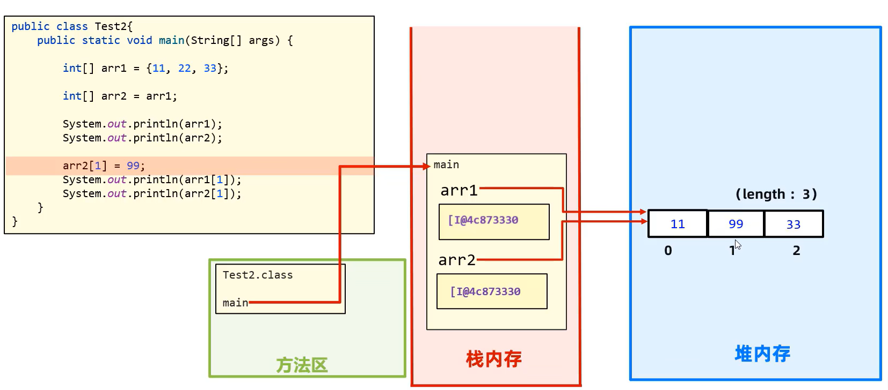

## 方法

### 定义、调用

- 形参列表可有可无

- 方法需严格按照形参类型传入值
- 方法不需要返回值则返回类型可为void，此时则不能使用return语句;
- 方法的定义顺序无所谓
- 方法不能嵌套定义

```java
/* 格式
修饰符 返回值类型 方法名(形参列表){
    // 代码
    return 返回值;
}
*/
public class HelloWorld {
    public static void main(String[] args) {
        System.out.println(sum(1,5));
    }
    public static int sum(int a,int b) {
        return a + b;
    }
}
```

### 方法在内存中的调用流程


### 方法参数传递机制

形式参数传递机制：值传递

- 基本数据类型：传递值
- 引用数据类型：传递地址

```java
public class HelloWorld {
    public static void main(String[] args) {
        int[] arr1 = {111,222,333,444};
        int[] arr2 = {111,222,333,444};
        System.out.println(compareArrList(arr1,arr2));
    }
    public static boolean compareArrList(int[] arr1,int[] arr2){
        if(arr1==null || arr2==null)//任意一个是空值都判断为不等
            return false;
        if (arr1 == arr2)//比较地址是否相同
            return true;
        if (arr1.length == arr2.length){
            for (int i = 0; i < arr1.length; i++) {
                if (arr1[i] != arr2[i])
                    return false;
            }
            return true;
        } else {
            return false;
        }
    }
}
```

### 方法重载

方法名称相同形参列表不同


## 基础知识巩固练习案例

### 买飞机票算票价


```java
import java.util.Scanner;

public class HelloWorld {
    public static void main(String[] args) {
        Scanner scanner = new Scanner(System.in);
        double price=0.0;
        int month=1;
        int type=2;
        double result = 0.0;
        do {
            System.out.println("请输入机票原价格：");
            price = scanner.nextDouble();
            System.out.println("请输入当前月份：(1-12)");
            month = scanner.nextInt();
            System.out.println("请输入仓位类型：1.头等舱；2.经济舱：(1-2)");
            type = scanner.nextInt();
        }while (price<=0 || month< 1 || month >12 || !( type==1 || type==2) );

        if (5 <= month && month <= 10){//旺季
            if (type == 1)//头等舱
                result = 0.9 * price;
            else //经济舱
                result = 0.85 * price;
        } else {//淡季
            if (type == 1)//头等舱
                result = 0.7 * price;
            else //经济舱
                result = 0.65 * price;
        }
        System.out.println("你的机票价格为："+result);
    }
}
```

### 找素数


```java
public class HelloWorld {
    public static void main(String[] args) {
//        Scanner scanner = new Scanner(System.in);
        int count = 0;
        for (int i = 101; i <= 200; i++) {
            if (isPrime(i)){
                System.out.print(i + "\t");
                count++;
            }
        }
        System.out.println("\n共有素数" + count + "个");
    }
    public static boolean isPrime(int num){
        if (num <= 2)
            return false;
        int sqrt = (int)Math.sqrt(num);
        for (int i = 2; i <= sqrt; i++) {
            if (num%i == 0)
                return false;
        }
        return true;
    }
}
```

结果


### 生成验证码

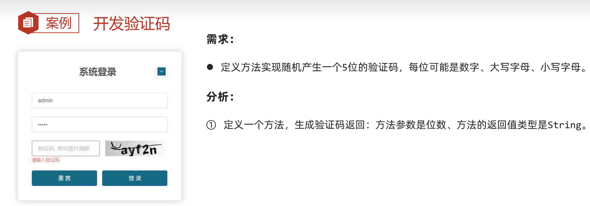

```java
package com.yiguiding.package1;

import java.util.Random;
import java.util.Scanner;

public class HelloWorld {
    public static void main(String[] args) {
        System.out.println(creatCode(5));
    }
    public static String creatCode(int length){
        String code = "";
        Random rd = new Random();
        for (int i = 0; i < length; i++) {
            switch (rd.nextInt(3)){//随机0-2
                case 0:
                    code+=(char)(rd.nextInt('A','Z') + 1);//随机获取一个大写字母并拼接给code
                    break;
                case 1:
                    code+=(char)(rd.nextInt('a','z') + 1);//随机获取一个小写字母并拼接给code
                    break;
                case 2:
                    code+=(char)(rd.nextInt('0','9') + 1);
                    break;
            }
        }
        return code;
    }
}

```

### 数字加密


```java
package com.yiguiding.package1;

import java.util.Random;
import java.util.Scanner;

public class HelloWorld {
    public static void main(String[] args) {
        int[] arr = {1,9,8,3};
        printArrList(arr);//输出
        enCode(arr);//加密
        printArrList(arr);//输出
        enCode(arr);//再次加密就是解密
        printArrList(arr);//输出

    }
    public static int[] enCode(int[] arrList){
        for (int i = 0; i < arrList.length; i++) {
            arrList[i] = (arrList[i] + 5) % 10 ;
        }
        return reverse(arrList);
    }
    public static int[] reverse(int[] arrList){//翻转
        for (int i = 0,j=arrList.length-1; i < arrList.length/2; i++,j--) {
            int temp = arrList[i];
            arrList[i] = arrList[j];
            arrList[j] = temp;
        }
        return arrList;
    }
    public static void printArrList(int[] arrList){
        System.out.print('[');
        if (arrList != null && arrList.length != 0){
            for (int i = 0; i < arrList.length; i++) {
                System.out.print( (i == arrList.length-1)? arrList[i] : arrList[i]+",");
            }
        }
        System.out.println(']');
    }
}

```

输出


### 双色球系统案例


```java
package com.yiguiding.package1;

import java.util.Random;
import java.util.Scanner;

public class HelloWorld {
    public static void main(String[] args) {
        int count = 0;
        int[] users = createLuckNumbers();//守号
        while (true){
            count++;
            int[] gen = createLuckNumbers();//开奖
            System.out.println("开奖号码：");
            printArrList( gen );//输出
            System.out.println("你的号码：");
            printArrList( users );//输出
            int result = luckType(gen,users);//返回是几等奖
            if (result<=2){//若中了1或2等奖则输出
                System.out.println("连续购买"+ count +"次,恭喜获得"+result+"等奖");
                break;
            }
        }
    }
    public static int[] createLuckNumbers(){
        int[] luckNumbers = new int[6+1];//用于存放6个红球1个蓝球的空间
        int[] reds = {1,2,3,4,5,6,7,8,9,10,11,12,13,14,15,16,17,18,19,20,21,22,23,24,25,26,27,28,29,30,31,32,33};//红球33个
        int[] blues = {1,2,3,4,5,6,7,8,9,10,11,12,13,14,15,16};//蓝球16个
        Random rd = new Random();
        for (int i = 0; i < luckNumbers.length-1; i++) {//随机选六个红球
            while (true){
                int index = rd.nextInt(reds.length);
                if (reds[index]!=-1){//判断是否已经被拿出
                    luckNumbers[i] = reds[index];//拿出红球
                    reds[index] = -1;//标记为已经拿出
                    break;
                }
            }
        }
        while (true){//随机选一个个篮球
            int index = rd.nextInt(blues.length);
            if (blues[index]!=-1){//判断是否已经被拿出
                luckNumbers[luckNumbers.length-1] = blues[index];//拿出蓝球,放到最后一个位置
                reds[index] = -1;//标记为已经拿出
                break;
            }
        }
        return luckNumbers;
    }
    public static int luckType(int[] luckNumsTarget,int[] luckNumsUsers){
        int countRed = 0;//记录红球一致个数
        int countBlue = 0;//记录蓝球一致个数
        for (int i = 0; i < luckNumsUsers.length-1; i++) {
            for (int j = 0; j < luckNumsTarget.length-1; j++) {
                if (luckNumsUsers[i] == luckNumsTarget[j])
                    countRed++;
            }
        }
        if (luckNumsUsers[luckNumsUsers.length-1] == luckNumsTarget[luckNumsTarget.length-1]){//判断最后一个球是不是一致
            countBlue ++;
        }
        if (countRed == 6 && countBlue == 1)
            return  1;//一等奖

        if (countRed == 6 && countBlue == 0)
            return 2;//二等奖

        if (countRed == 5 && countBlue == 1)
            return 3;//三等奖

        if (countRed == 5 && countBlue == 0)
            return 4;//四等奖
        if (countRed == 4 && countBlue == 1)
            return 4;//四等奖

        if (countRed == 4 && countBlue == 0)
            return 5;//五等奖
        if (countRed == 3 && countBlue == 1)
            return 5;//五等奖
        if (countRed == 2 && countBlue == 1)
            return 5;//五等奖

        if (countRed == 1 && countBlue == 1)
            return 6;//六等奖
        if (countRed == 0 && countBlue == 1)
            return 6;//六等奖
        else
            return 7;//未中奖
    }
    public static void printArrList(int[] arrList){
        System.out.print('[');
        if (arrList != null && arrList.length != 0){
            for (int i = 0; i < arrList.length; i++) {
                System.out.print( (i == arrList.length-1)? arrList[i] : arrList[i]+",");
            }
        }
        System.out.println(']');
    }
}
```


## 面向对象

### 类

- **类是对象的设计图**

- **对象是根据设计图创建出的实体**
- **注意**：
  - <green>一个java文件中可以定义多个类，但只能有一个public类</green>
  - <green>public修饰的类名必须为java的文件名</green>
  - <green>一般不用为成员变量赋初始值</green>
  - java存在自动垃圾回收器,会定期清理堆内存中没有被引用的对象

**类的语法构成**

```java
public class 类名{
    1.成员变量，名词
        语法格式：修饰符 变量类型 变量名 = 初始值(可不指定初始值);
    2.成员方法，动词
    3.构造器
    4.代码块
    5.内部类
}
```

**类的尝试编写**

```java
public class HelloWorld {
    public static void main(String[] args) {
        Person p1 = new Person("DYG",22);
        p1.sayHi();
    }
}
 class Person{
    String name;//车名
    int age;//年龄
    Person(String name,int age){//构造函数
        this.name = name;
        this.age = age;
    }
    public void sayHi(){
        System.out.println("你好，我的名字是"+name+"。");
    }
}
```

**对象在内存中的执行机制**


**购物车案例实现**

```java
package com.yiguiding.package1;

import java.util.Random;
import java.util.Scanner;

public class HelloWorld {
    public static void main(String[] args) {
        GoodsShopCar shopCar = new GoodsShopCar(1024);
        Scanner sc = new Scanner(System.in);
        while (true){
            System.out.println("------------------------请输入操作类型------------------------");
            System.out.println("添加商品（add）");
            System.out.println("查看商品（shw）");
            System.out.println("删除商品（del）");
            System.out.println("修改数量（upd）");
            System.out.println("计算金额（pay）");
            System.out.println("退出程序（ext）");
            switch (sc.next()){
                case "add":
                    shopCar.add_(sc);
                    break;
                case "shw":
                    shopCar.show_();
                    break;
                case "del":
                    shopCar.delete_(sc);
                    break;
                case "upd":
                    shopCar.update_(sc);
                    break;
                case "pay":
                    shopCar.pay_();
                    break;
                case "ext":
                    return;
                default:
                    System.out.println("未知操作类型，请重新输入");
                    continue;
            }
        }
    }
}
class Goods{
    int id;
    String name;
    double price;
    int buyNum;
    Goods(int id,String name,double price,int buyNum){
        this.id = id;
        this.name = name;
        this.price = price;
        this.buyNum = buyNum;
    }
    public void changeNum(int num){
        this.buyNum = num;
    }
}
class GoodsShopCar{
    Goods[] buyList;
    GoodsShopCar(int size){
        this.buyList = new Goods[size];
    }
    public void add_(Scanner sc){
        System.out.println("请输入要添加的商品信息......");
        System.out.println("请输入商品id");
        int id = sc.nextInt();
        System.out.println("请输入商品name");
        String name = sc.next();
        System.out.println("请输入商品price");
        double price = sc.nextDouble();
        System.out.println("请输入商品number");
        int num = sc.nextInt();
        if(this.addGoods(new Goods(id,name,price,num)) == "OK"){
            System.out.println("添加商品成功");
        } else {
            System.out.println("添加商品成功");
        }
    }
    private String addGoods(Goods goods) {
        for (int i = 0; i < buyList.length; i++) {
            if (buyList[i] == null) {
                buyList[i] = goods;
                return "OK";
            }
        }
        return "ERROR";
    }
    public void delete_(Scanner sc){
        System.out.println("请输入要删除的商品id");

        if (this.deleteById(sc.nextInt()) == "OK") {
            System.out.println("删除成功");
        }else{
            System.out.println("删除失败");
        }
    }
    private String deleteById(int id){
        for (int i = 0; i < buyList.length; i++) {
            Goods item = buyList[i];
            if (item.id == id){
                buyList[i] = null;
                return "OK";
            }
        }
        return "ERROR";
    }
    public void update_(Scanner sc){
        while(true) {
            System.out.println("请输入要执行的操作：");
            System.out.println("0.返回上一级");
            System.out.println("1.更新商品数量");
            switch (sc.nextInt()){
                case 0:
                    return;
                case 1:
                    System.out.println("请输入要更新的商品的id");
                    int id = sc.nextInt();
                    System.out.println("请输入要更新的数量");
                    int num = sc.nextInt();
                    if (this.updateNumById(id,num) == "OK"){
                        System.out.println("更新成功");
                        return;
                    }else{
                        System.out.println("更新失败,请重新输入");
                        break;
                    }
                default:
                    System.out.println("未知操作类型,请重新输入");
            }
        }
    }
    private String updateNumById(int id,int num){
        for (int i = 0; i < buyList.length; i++) {
            Goods item = buyList[i];
            if (item!=null && item.id == id){
                item.changeNum(num);
                return "OK";
            }
        }
        return "ERROR";
    }
    public void show_(){
        System.out.println("id\t\tname\t\tprice\t\tnumber\t\t");
        for (int i = 0; i < buyList.length; i++) {
            Goods item = buyList[i];
            if (item != null){
                System.out.println(item.id+"\t\t"+item.name+"\t\t"+item.price+"\t\t"+item.buyNum);
            }
        }
    }
    public void pay_(){
        System.out.println("购物车总价为："+this.getSumPrice()+"元");
    }
    private double getSumPrice(){
        double sumPrice = 0.0;
        for (int i = 0; i < buyList.length; i++) {
            Goods item = buyList[i];
            if (item!=null)
                sumPrice += item.price * item.buyNum;
        }
        return sumPrice;
    }
}
```

```text
------------------------请输入操作类型------------------------
添加商品（add）
查看商品（shw）
删除商品（del）
修改数量（upd）
计算金额（pay）
退出程序（ext）
add
请输入要添加的商品信息......
请输入商品id
111
请输入商品name
泡面
请输入商品price
4.5
请输入商品number
10
添加商品成功
------------------------请输入操作类型------------------------
添加商品（add）
查看商品（shw）
删除商品（del）
修改数量（upd）
计算金额（pay）
退出程序（ext）
add
请输入要添加的商品信息......
请输入商品id
222
请输入商品name
火腿肠
请输入商品price
1
请输入商品number
10
添加商品成功
------------------------请输入操作类型------------------------
添加商品（add）
查看商品（shw）
删除商品（del）
修改数量（upd）
计算金额（pay）
退出程序（ext）
add
请输入要添加的商品信息......
请输入商品id
333
请输入商品name
辣条
请输入商品price
0.5
请输入商品number
10
添加商品成功
------------------------请输入操作类型------------------------
添加商品（add）
查看商品（shw）
删除商品（del）
修改数量（upd）
计算金额（pay）
退出程序（ext）
shw
id  name  price  number  
111  泡面  4.5  10
222  火腿肠  1.0  10
333  辣条  0.5  10
------------------------请输入操作类型------------------------
添加商品（add）
查看商品（shw）
删除商品（del）
修改数量（upd）
计算金额（pay）
退出程序（ext）
del
请输入要删除的商品id
222
删除成功
------------------------请输入操作类型------------------------
添加商品（add）
查看商品（shw）
删除商品（del）
修改数量（upd）
计算金额（pay）
退出程序（ext）
upd
请输入要执行的操作：
0.返回上一级
1.更新商品数量
1
请输入要更新的商品的id
333
请输入要更新的数量
5
更新成功
------------------------请输入操作类型------------------------
添加商品（add）
查看商品（shw）
删除商品（del）
修改数量（upd）
计算金额（pay）
退出程序（ext）
shw
id  name  price  number  
111  泡面  4.5  10
333  辣条  0.5  5
------------------------请输入操作类型------------------------
添加商品（add）
查看商品（shw）
删除商品（del）
修改数量（upd）
计算金额（pay）
退出程序（ext）
pay
购物车总价为：47.5元
------------------------请输入操作类型------------------------
添加商品（add）
查看商品（shw）
删除商品（del）
修改数量（upd）
计算金额（pay）
退出程序（ext）
ext

Process finished with exit code 0
```

### 构造器

- 作用: 初始化对象，返回实例化对象的地址

- 分类
  - 有参构造器
  - 无参构造器
- 任何类在定义时 **默认拥有一个无参构造器**
- <green>一旦定义了有参构造器，默认的无参构造器就会消失，若任要使用无参构造器，需自己定义</green>

**语法格式**

```java
class 类名{
    public 类名(参数列表){//有参构造器
    }
    public 类名(){//无参构造器
    }
}
```

**调用构造器**

```java
类名 变量名 = new 构造器(参数列表);
类名 变量名 = new 构造器();
```

### this关键字

- this表示当前实例对象的地址

- this的值和`new 构造器()`的返回值一致
- 通过this可以访问到当前实例对象的属性和方法

```java
class Person{
    private String name;
    private int age;
    public Person(String name,int age){
        this.name = name;
        this.age = age;
    }
}
```

### 封装

**面向对象的三大特征**

- 封装：按一定原则设计对象的属性和方法
- 继承
- 多态

**封装原则**

- 对象代表什么，就封装对应的数据并提供数据对应的行为
- 案例：人对象 圆对象 门对象
  - 人画圆 draw()方法应当封装到圆对象中，因为画圆需要得知圆半径，而该属性在圆对象中
  - 人开门 open()方法应当封装到门对象中，

**更安全的封装对象**

- 把成员变量用private属性修饰，使得外部不能直接访问
- 提供getter setter方法向外暴露接口

```java
class Person{
    private String name;//私有属性
    private int age;//私有属性
    public setAge(int age){//修改属性值
        if(0<=age && age<= 200){//判断属性值是否合法
            this.age = age;//赋值
        }else{//报错
            System.out.print("ERROR")
        }
    }
    public getAge(){//获取属性值
        return this.age;
    }
}
```

### 标准javaBean实体类

**书写要求**

- **必须**有一个无参构造器
- **应当**使用private修饰成员变量
- **应当**提供成员变量对应的setXXX() getXXX()方法

```java
class Person{
    private String name;//私有属性
    private int age;//私有属性
    Person(){
        //必须有一个无参构造器
    }
    public setAge(int age){//修改属性值
        if(0<=age && age<= 200){//判断属性值是否合法
            this.age = age;//赋值
        }else{//报错
            System.out.print("ERROR")
        }
    }
    public getAge(){//获取属性值
        return this.age;
    }
    public setName(int name){//修改属性值
        this.name = name;//赋值
    }
    public getName(){//获取属性值
        return this.name;
    }
}
```

### 成员变量和局部变量的区别


### 对象数组在内存中的占用情况

<green>数组中存储的不是对象而是对象的地址</green>


## String字符串类及其常用API

### 相关概念

**`"常量字符串"`与`new String()`的区别**

- <green>String类也称不可变字符串类型，在对象创建后不能修改</green>
- 以`"这是一个字符串常量"`形式出现的字符串常量对象存储在**堆内存**的**字符串常量池**中
- 字符串的链接操作实际是在堆中开辟了新的空间
- 字符串间的`==`运算 比较的是内存地址
- 相同的字符串常量的地址相同 `==运算` 结果为true
- 以`String s1 = new String(chars);`方式创建的相同的字符串其地址不同 `==运算` 结果为false

**字符串的链接操作实际是在堆中开辟了新的空间**


**相同的字符串常量的地址相同**


**以`String s1 = new String(chars);`方式创建的相同的字符串其地址不同**


### APis

#### 构造器

**几种使用`new String()`构造方式创建字符串对象的方法**

```java
String str = "abc"
char[] chars = {'中','国'};
byte[] bytes = {97,98};

String s1 = new String();//s1 => ""
String s2 = new String(str);//s1 => "abc"
String s3 = new String(chars);//s1 => "中国"
String s4 = new String(bytes);//s1 => "ab"
```

**面试题**
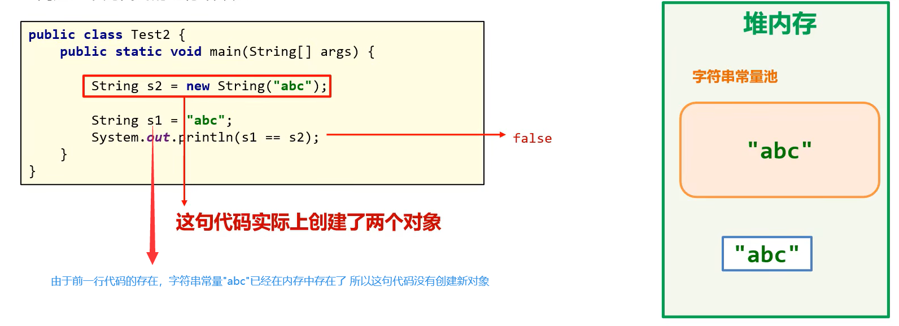


#### 常用成员方法

**常用方法**

```java
String strObj1 = "测试字符串"
boolean bo = strObj1.equals(strObj2);             //比较字符串内容是否相等
boolean bo = strObj1.equalsIgnoreCase(strObj2);   //比较字符串内容是否相等（忽略大小写）

int length = strObj1.length();//获取字符串长度

char ch = strObj1.charAt(0);//获取第0个字符

char[] chars = strObj1.toCharArray();//字符串转char类型数组

String subStr1 = strObj1.substring(beginIndex,endIndex)//截取内容，index包括前不包括后
String subStr2 = strObj1.substring(beginIndex)//截取内容，从一个下标一直截取到末尾


String repStr1 = strObj1.replace(charSequence target,charSequence replacement)//子串替换 不会影响原值
String repStr1 = strObj1.replace("金三胖","***")//敏感词替换

boolean bo = strObj1.contains("金三胖");//子串包含检测

boolean bo = strObj1.startsWith("金三胖");//检测是否以某段字符串开头

String name = "姓名1,姓名2,姓名3";
String[] names = name.split(",");//根据标点符号分割数组
```


**遍历字符串**

```java
for(int i = 0;i<str.length();i++ ){
    char ch = charAt(i);
}
```

### 案例

**生成验证码**

```java
import java.util.Random;
import java.util.Scanner;

public class HelloWorld {
    public static void main(String[] args) {
        System.out.println(genCode(10));
    }
    public static String genCode(int length){
        String chars = "qwertyuiopasdfghjklzxcvbnmQWERTYUIOPASDFGHJKLZXCVBNM0123456789";
        String code = "";
        Random rd = new Random();
        for (int i = 0; i < length; i++) {
            code += chars.charAt( rd.nextInt( chars.length() ) );
        }
        return code;
    }
}
```


**屏蔽手机号中间四位**

```java
public class HelloWorld {
    public static void main(String[] args) {
        System.out.println(encodeTel("17600001729"));
    }
    public static String encodeTel(String telNum){
        String result = "";
        //手机号11位
        result += telNum.substring(0,3);//保留前3位
        result += "****";//屏蔽中间4位
        result += telNum.substring(7);//保留最后4位
        return result;
    }
}
```


## ArraryList集合容器类及其常用API

### 相关概念

- ArraryList是一个支持索引的集合类，和数组类似

- ArraryList集合的类型不固定，大小可变
- ArraryList集合支持增删改查
- ArraryList集合支持泛型
- 集合（及泛型）中只能存储引用数据类型，不能存基本数据类型
  - int是基本数据类型 Integer是int的引用数据类型
- <green>但集合类的大小是不固定的(优点)</green>

### APIs

#### 构造器

```java
new ArrayList();
new ArrayList(容量大小);
new ArrayList(泛型);
```

**添加元素**

```java
obj.add(element);//添加元素到末尾,返回boolean
obj.add(index,element);//添加元素到指定位置
```

**测试案例**

```java
import java.util.ArrayList;
import java.util.Random;
import java.util.Scanner;

public class HelloWorld {
    public static void main(String[] args) {
        ArrayList list = new ArrayList();
        list.add("字符串");
        list.add('汉');
        list.add(123);
        list.add(0.125);
        list.add(new ArrayList());
        list.add(2,"新插入的元素");
        System.out.println(list);
    }
}
```


**支持泛型**

```java
ArrayList list1 = new ArrayList();//默认的泛型，支持所有类型
ArrayList<Object> list1 = new ArrayList<Object>();//默认的泛型，支持所有类型 Object所有的类型都继承自Object
ArrayList<String> list1 = new ArrayList<String>();//仅支持字符串类型的泛型
ArrayList<String> list2 = new ArrayList<>();//jdk1.7开始的可以省略后部分泛型类型声明
ArrayList<Integer> list3 = new ArrayList<>();//ArrayList存储的是引用数据类型
// ArrayList<int> list4 = new ArrayList<>();//ArrayList不能存储基本数据类型，报错

list.add("只能添加字符串类型");
```

#### 常用成员方法

- `add(element)`//在末尾添加元素,返回true/false

- `add(index,element)`//插入元素到指定位置
- `get(index)`
- `size()`
- `E remove(index)` //返回被删除的对象
- `Boolean remove(obj)` //直接删除对象(默认删第一个)，返回true/false
- `E set(index,element)` //修改某位置的值，返回原数值

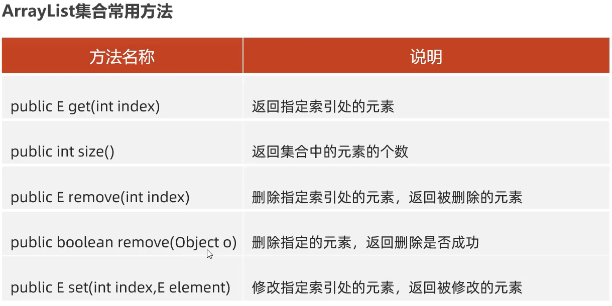

**遍历ArraryList集合**

```java
for(int i = 0 ; arr.size();i++){
    list.get(i);
}
```

### 一些案例


```java
package com.yiguiding.package1;
import java.util.ArrayList;
import java.util.Random;

public class HelloWorld {
    public static void main(String[] args) {
        Random rd = new Random();
        ArrayList<Integer> scores = new ArrayList<>();
        for (int i = 0; i < 40; i++) {//40个学生
            scores.add(rd.nextInt(101));//随机赋值0-100的分数
        }
        System.out.println("全班分数为：");
        System.out.println(scores);//输出
        for (int i = scores.size()-1; i >= 0; i--) {
            //若采用从前往后的遍历方式，删除当前所在位置的元素后，下一个元素的下标将变成本次删除元素的下标，同时下标会自增，这将导致有一个元素没有判断到。要避免这样的问题应当从后往前遍历
            if (scores.get(i)<80) {
                scores.remove(i);
            }
        }
        System.out.println("筛选结果为：");
        System.out.println(scores);//输出
    }
}
```


**ArrayList存取、遍历自定义对象**

```java
package com.yiguiding.package1;

import java.util.ArrayList;
import java.util.Random;
import java.util.Scanner;

public class HelloWorld {
    public static void main(String[] args) {
        ArrayList<Student> students = new ArrayList<>();

        students.add(new Student(001,"张三",20));
        students.add(new Student(002,"李四",20));
        students.add(new Student(003,"王五",20));

        System.out.println("id\t\tname\t\tage");
        for (int i = 0; i < students.size(); i++) {
            Student stu = students.get(i);
            System.out.println(stu.getId()+"\t\t"+stu.getName()+"\t\t"+stu.getAge());
        }
    }
}

class Student{
    private int id;
    private String name;
    private int age;

    public Student() {
    }

    public Student(int id, String name, int age) {
        this.id = id;
        this.name = name;
        this.age = age;
    }

    public int getId() {
        return id;
    }

    public void setId(int id) {
        this.id = id;
    }

    public String getName() {
        return name;
    }

    public void setName(String name) {
        this.name = name;
    }

    public int getAge() {
        return age;
    }

    public void setAge(int age) {
        this.age = age;
    }
}
```

## 面向对象高级

### static关键字

**static静态修饰符的作用**

- 用于修饰`成员变量`和`成员方法`
- <green>静态成员变量表示该成员只在内存中存储一份，可以被共享的访问和修改</green>

**成员变量的分类**

- 静态成员变量：由static修饰，属于类，加载一次，可被共享
  - **建议**用`类名.静态成员变量名`访问，
  - 也能通过`实例对象名.静态成员变量`访问
- 实例成员变量：无static修饰，属于对象，
  - **只能**用`实例对象名.静态成员变量名`访问

**成员方法的分类**

- **静态成员方法**:由static修饰，**归属于类**，
  - **建议**用`类名.方法名()`访问，
  - 也能通过`实例对象名.方法名()`访问
- **实例成员方法**:**无**static修饰，**归属于实例对象**，
  - **只能**用`实例对象名.方法名()`访问

<warn>**注意事项**</warn>

- 静态成员方法 **只能** 访问`静态成员方法`和`静态成员变量`
- 实例方法可以访问静态成员、静态方法
- 静态方法内部不存在`this`

**定义和使用**

```java
public class HelloWorld {
    public static void main(String[] args) {

        //通过类名访问静态变量和方法（推荐）
        System.out.println(Person.count);
        System.out.println(Person.getTotal());

        //通过实例化对象访问静态变量和方法（不推荐）
        Person person = new Person();
        System.out.println(person.count);
        System.out.println(person.getTotal());
    }
}
class Person{
    public static int count=1;//向外暴露的静态变量，外部可直接访问，属于类的成员不属于实例对象的成员
    private static int total=2;//私有的静态变量
    public static int getTotal(){///向外暴露的静态方法，属于原型类，可以通过`类名.方法名()`调用 也可以通过 `实例对象.方法名()`
        return total;//访问同一个类中的静态成员变量可以省略类名
//        return Person.total;//完整写法
//        return this.total;//错误写法:this无法访问到经static修饰的变量,因为静态变量属于原型类不属于实例对象
    }
}
```

**静态成员变量的内存机制**


**静态成员函数的内存机制**


**应用:工具类静态方法**

```java
class Util{
    static void 函数名(){//复用的静态方法
        //方法
    }
    private Util(){//高级用法：由于工具类无需闯将对象，所以将其构造函数私有化，使其失去创建对象的能力
    }
}
```

### 代码块

代码块的分类

- 静态代码块 static修饰 属于类 与类一起优先加载 自动触发执行
  - 作用：用于初始化静态资源
- (实例)构造代码块，每次调用构造器函数前都会执行的代码块
  - 作用：初始化实例资源

```java
class Person{
    private String name;
    private int age;
    static int PersonCount;
    static{
        System.out.print("------------1.静态代码块被执行-------------");
        PersonCount = 0 ;//初始化personCount
    }
    {
        System.out.print("------------ 2.(实例)构造代码块被执行-------------");
        PersonCount++ ;//自增
    }
    Person(){
        System.out.print("------------ 3.构造器被执行-------------");
        //构造器
    }
}
```

### 继承extends

使用该关键字可以让一个类和另一个类建立父子关系，子类继承父类的成员变量和方法

**基本语法**

```java
public class Student extends People{}
Student 称为 子类 或 派生类
People 称为 父类 或 基类 或 超类
```

**设计规范**
子类们的相同的属性和方法可以放到父类中定义，子类独有的属性和方法定义在子类中。

**继承的特点**

- <green>子类可以继承父类的属性和行为</green>
- <green>子类可以继承父类的私有属性和方法，但不能直接访问(可以暴力访问)</green>
  - (是否属于继承是有争议的)
- <green>子类可以访问到父类的静态属性和方法（父类共享给了子类）</green>
  - （是否属于继承是有争议的，因为父类的静态属性和方法任然属于父类，子类只是能够访问它）
- <green>子类不能继承父类的构造器</green>
- 继承遵循**单继承模式** **一个类只能继承一个直接父类**，
  - 因为如果能继承多个父类且父类中有同名的方法，子类就不知道该继承哪一个
- 不支持一次继承多个类，但支持**多层继承**
- java的所有类都是`Object`类的子类
  - 要么默认继承 `public class Student{}`
  - 要么直接继承 `public class Student extends Object{}`
  - 要么间接继承 `public class newStudent extends Student{}`

**继承的内存分配机制**


**继承后成员的访问特点**

- 就近原则
- 访问顺序： `局部变量名、局部函数名` => `子类成员变量名、子类成员函数名` => `父类成员变量名、父类成员函数名`

**测试案例**

```java
public class HelloWorld {
    public static void main(String[] args) {
        Student std = new Student();
        std.getName();
    }
}
class Person{
    String name = "personName";
}
class Student extends Person{
    String name = "studentName";
    public String getName(){
        String name = "reagenName";
        System.out.println(name);//局部变量
        System.out.println(this.name);//子类成员变量
        System.out.println(super.name);//父类成员变量
        return this.name;
    }
}
```


### 继承后的方法重写

- 重写的方法名称、形参列表必须和被重写的方法一致

- 一般在重写方法时，**声明不变，重新实现**
- <green>父类的私有方法不能被重写</green>
- 子类重写父类方法时，访问权限必须大于等于父类
  - 访问权限( `默认` < `protected` < `public` )
- 子类不能重写父类的静态方法

```java
public class HelloWorld {
    public static void main(String[] args) {
        Student std = new Student();
        std.test();
    }
}
class Person{
    String name = "personName";
    public void sayHi(){
        System.out.println("Hi,my name is "+name);
    }
}
class Student extends Person{
    String name = "studentName";
    @Override
    //@Override是重写校验注解，java建议程序员在重新的方法上加上注解，加上注解后若函数没有被以重写的方式编译，编译器会报错
    //提高代码可读性
public void sayHi(){//方法重写
        System.out.println("Hi,my name is "+name);
    }
    public void test(){
        sayHi();//默认调用子类成员方法
        this.sayHi();//显式调用子类成员方法
        super.sayHi();//显式调用父类成员方法
    }
}
```

### 继承后子类构造器的特点

- 子类的任何构造器(有参/无参)被调用时，默认会先调用父类的无参构造器(若父类没有无参构造器则会报错)

    ```java
    //原理
    class Person{

    }
    class Student extends Person{
        Student(){
            super();//写不写都有的语句，子类构造器中会默认调用父类的无参构造器
        }
    }
    ```

- 可以重新指定调用父类的有参构造器

    ```java
    class Person{
        String name;
        int age;
        
        Person(String name,int age){
            this.name = name;
            this.age = age;
        }
    }
    class Student extends Person{
        Student(String name,int age){
            super(name,age);//显式调用父类构造器
        }
    }
    ```

### this和super的使用


**注意事项**

- this()和super()都只能放在第一行，所以两者不能共同存在于一个构造器

```java
class Person{
    String name;
    int age;

    Person(String name,int age){
        this.name = name;
        this.age = age;
    }
}
class Student extends Person{
    Student(String name){
        this(name,18);//默认18岁
    }
    Student(String name,int age){
        super(name,age);//显式调用父类构造器
    }
}
```

## 单例设计模式

### 设计模式

- 开发中遇到的一些问题这些问题每个都有n种解决方案，但只有一种最优解，这些解法的总结就是设计模式

- 设计模式有20种，对应20多种软件开发过程中遇到的问题
- 学设计模式主要学两点
  - 该模式是解决什么问题？
  - 该模式是如何解决的该问题？ 该模式怎么写的？

**单例模式**

- 保证系统中应用该模式的这个类永远只有一个实例，也就是一个类只能实例化一个对象
- 单例模式的实现方式
  - 饿汉单例模式
  - 懒汉...

### 饿汉单例

- 私有化构造器

- 定义一个公开的静态成员变量，初始化为一个实例对象

```java
public class HelloWorld {
    public static void main(String[] args) {

        singleInstance s1 = singleInstance.instance;
        singleInstance s2 = singleInstance.instance;
        System.out.println(s1==s2);//true
    }
}
//饿汉单例：在用户获取对象前，对象已经准备好的
class singleInstance{
public static singleInstance instance = new singleInstance(); // 由于静态成员变量只会在类加载时初始化一次，所以当通过`类名.静态属性名`访问变量时，该变量早已初始化好了
    private singleInstance(){//私有化构造器后只有类自己能调用构造器,否则用户可通过构造器创建很多地址不同的对象
    }
}
```

### 懒汉单例模式

- 私有化构造器

- 定义一个用于保存单例对象的**私有化静态成员变量**
- 公开一个静态成员方法用于获取（在第一次调用时创建）实例对象

```java
public class HelloWorld {
    public static void main(String[] args) {
        singleInstance s1 = singleInstance.getInstance();
        singleInstance s2 = singleInstance.getInstance();
        System.out.println(s1==s2);//true
    }
}
//饿汉单例：在用户第一次获取时，创建实例对象
class singleInstance{
    private static singleInstance instance;//私有化
    private singleInstance(){//私有化构造器后只有类自己能调用构造器,否则用户可通过构造器创建很多地址不同的对象
    }
    public static singleInstance getInstance(){
        if (instance==null){
            instance = new singleInstance();
        }
        return instance;
    }
}
```

## 包Package

**概念、作用**

- 用于分类管理不同的`类`,利于程序的管理和维护

**建包**

- 建议的建包语法格式：倒写公司域名.模块名称
- 建议的键包命名规范：小写英文，有意义

```java
package com.huawei.school;
public class Student{
}
```

**导包**

- 相同包下的类可以直接访问
- 不同包下的类必须导包才能使用
- 导包格式：`import 包名.类名;`
- 若要引入两个同名的类，第二个导入的类只能使用完整包名访问类

```java
import java.util.Scanner;

package com.yiguiding.package1.Student;
Student stu1 = new Student();

package com.yiguiding.package2.Student;
com.yiguiding.package2.Student stu2 =new com.yiguiding.package2.Student();
```

## 权限修饰符

**概念**

- 用于修饰成员属性，成员方法,构造器,内部类，不同的修饰符代表不同的访问权限。
- 权限修饰符作用范围：（ `private` -> `默认` -> `protected` -> `public` ）
- 总结

| 权限修饰符名 | 同类的作用域可访问 | 同包不同类的作用域可访问 | 不同包但为其父类的作用域可访问 | 不同包不同类的作用域可访问 |
| :----------: | :----------------: | :----------------------: | :----------------------------: | :------------------------: |
|   private    |         √          |                          |                                |                            |
|   default    |         √          |            √             |                                |                            |
|  protected   |         √          |            √             |               √                |                            |
|    public    |         √          |            √             |               √                |             √              |

## final修饰符

- final是关键字，

- 意为最终
- 可修饰 **类** **方法** **变量**
- 作用：
  - 修饰类： 类不能被继承
  - 修饰方法：方法不能被重写
  - 修饰变量：变量被第一次赋值后不能被修改
    - 若修饰的是基本数据类型，变量存储的**数据**值不能改变
    - 若修饰的是引用数据类型，变量存储的**地址**值不能改变，但地址指向的对象内容可变
  
**实例**

```java
class Person{
    final public void sayHi(){//不能被子类重写的方法
        System.out.println("Hi~~");
    }
}
final class  Student extends Person{//不能被继承的对象
    final int id;//不能被修改的变量，只能在第一次赋值
    Student(int id){
        this.id = id;
    }
}
```

## 常量

- 常量是由`public static final`修饰的变量

- 常量会在编译阶段做宏替换，程序中使用常量的地方都会被替换为字面量
- 好处是执行性能和直接使用字面量一致
- 命名规范是推荐单词全大写多个单词用下划线分隔

```java
public static final String USER_NAME = "admin"
```

## 枚举

```java
修饰符 enum 枚举名称{
    名称1,名称2,名称3,名称4,名称5;
}

enum Season{
    SPRING,SUMMER,AUTUMN,WINTER;
}
```

```java
public class HelloWorld {
    public static void main(String[] args) {
        Season temp = Season.AUTUMN;
        if (temp == Season.AUTUMN){
            //do something
        }
        switch (temp){//switch中可省略`Season.AUTUMN`的访问方式
            case AUTUMN:
                //do something
                break;
            case SPRING:
                //do something
                break;
        }
    }
}
enum Season{
    SPRING,SUMMER,AUTUMN,WINTER;
}
```

根据编译再反编译的结果可知：

- 枚举是一个类，
- 枚举是最终类，不能被继承
- 枚举类继承自枚举类型`java.lang.Enum`
- 构造器的构造器都是私有的，对外不能创建对象
- 枚举类的第一行默认是罗列枚举对象的名称
- 枚举类相当于是**多例模式**


## 抽象类、抽象方法

- 在java中abstract是抽象的意思，可以修饰类、成员方法。

- abstract修饰的**类**称为**抽象类**。
- abstract修饰的**方法**称为**抽象方法**。
- <green>抽象方法表示这个方法的具体功能由子类来实现</green>
- <green>含有抽象方法的类必须也声明为抽象类</green>
- 抽象类中可以没有抽象方法，**但有抽象方法的类必为抽象类**
- <warn>一个类继承了抽象类，则该类必须重写该类的所以抽象方法,否则该类必须也是抽象类</warn>
- 抽象类不能修饰构造函数、代码块、成员变量
- 抽象类中可以有静态方法，但不能有静态抽象方法
- **抽象类没有实例化对象的能力（不能创建对象）**
  - 面试题，为什么？
  - 因为：假如抽象类可以创建对象，当用其执行`实例对象.抽象方法名()`，将执行一个没有函数体的方法，这是不合理的

案例

```java
abstract class Person{//抽象类
    abstract public void sayHi();//抽象方法：不用写方法体
}
class Student extends Person{
    @Override
    public void sayHi(){//重写方法
        System.out.println("你好，我是学生");
    }
}
class Teacher extends Person{
    @Override
    public void sayHi(){//重写方法
        System.out.println("你好，我是老师");
    }
}
```

### final和abstract关系

- final和abstract为互斥关系

- final修饰的类不能被继承，abstract修饰的类需要被继承
- final修饰的方法不能被重写，abstract修饰的方法需要被重写
- final修饰的变量不能被修改，abstract不能修饰变量

## 接口

- 接口是一种规范

- **接口是定义来让类实现的，**
- 规范一定是公开的（默认由public修饰）
- <green>实现接口的类称为**实现（implements）类**</green>
- <green>**实现类**可认为是**子类**，接口可认为是实现类的**父类**</green>
- <green>实现类应当重写所有接口的方法，否则实现类就应当是一个抽象类</green>
- <green>接口可以**多实现**：一个实现类可以实现多个接口</green>
- <green>接口可以**多继承**：一个接口可以继承多个接口</green>

**jdk1.8之后的新特性**

- 接口中可以定义**实例方法**，
  - 必须显式由 `default` 修饰 同时默认还将被`public`修饰
  - 当其被`实现类`继承时，通过`实现类`的`实例对象.实例方法名()`调用
- 接口中可以定义**静态方法**，
  - 必须显式由 `static` 修饰 同时默认还将被`public`修饰
  - 只能通过`接口名.静态方法名()`调用,**不能**通过`实现类`调用，不能通过`实例对象`调用

**jdk1.9之后的新特性**

- 接口中可以定义**私有方法**，
  - 实际上相当于是一个`私有的`**实例方法**
  - 必须显式由 `private` 修饰 同时默认**不会**被`public`修饰
  - 只能在接口内部通过`方法名()`调用

**<warn>注意事项(极端语法知识、面试题)</warn>**

- 接口不能创建对象（常识，接口没有构造方法）
- 一个类实现多个接口，被实现的多个接口中的同名**静态方法**不会冲突（因为实现类不会继承接口的静态方法）。
- 一个类实现多个接口，被实现的对各接口中的同名**默认方法**不会冲突，默认也不会继承，子类需要重写该方法
- 一个类继承了父类,同时又实现了一个接口，父类方法名和接口方法名重名时，不会产生冲突，子类会默认继承父类的方法
  - `修饰符 class 实现类 extends 被继承的类名 implements 接口1,接口2,接口3{}`
- 一个接口继承多个接口时，一般是没问题的，但若被继承的接口中存在声明不一致（返回值，形参列表）的同名方法时，会报错

**接口定义的语法格式**

```java
//接口格式
public interface 接口名{
    //1.常量        jdk1.8之前 默认由 `public static final` 修饰
    //2.抽象方法    jdk1.8之前 默认由 `public abstract` 修饰
    //3.实例方法    jdk1.8之后新增的方法 必须显式由 default 修饰，默认 还将 被public修饰
    //4.静态方法    jdk1.8之后新增的方法 必须显式由 static  修饰，默认 还将 被public修饰
    //4.静态方法    jdk1.9之后新增的方法 必须显式由 private 修饰，默认_不会_被public修饰

    public static final String USER_NAME = "admin";//public 和 final都是接口默认自动添加的 可以省略不写
    public abstract void getUuserName(); //public abstract 是接口默认自动添加的 可以省略不写
    default void sayHi(){
        System.out.println("在抽象方法中直接新增的实例方法，必须由default修饰" +
                "当其被`实现类`继承时，通过`实现类`的`实例对象.实例方法名()`调用");
    }
}
//接口的实现（或多实现）
修饰符 class 实现类 implements 接口1,接口2,接口3{
    @Override
    // 重写接口的所有方法
}
//接口的多继承
public interface 接口名 extends 其他接口1,其他接口2,其他接口3,其他接口4 {
    // 新的常量
    // 新的方法
}
```

**接口的实现**

```java
interface School{
    void goToSchool();
    void study();
}

class Student implements Person,School{
    @Override
    public void run(){
        System.out.println("run....");
    }
    @Override
    public void say(){
        System.out.println("say.....");
    }
    @Override
    public void goToSchool(){
        System.out.println("goToSchool.....");
    }
    @Override
    public void study(){
        System.out.println("study.....");
    }
}
```

## 多态
>
>同类型的对象，调用同一个方法，表现出不同的行为

**多态的前提**

- 有继承/实现关系
- 有父类引用指向子类引用
- 有方法重写

**使用形式**

```java
父类类型 对象名称 = new 子类构造器名();
接口 对象名称  =  new 实现类构造器();
```

**多态的成员访问特点**

- 访问成员变量,根据对象的类型访问
- 访问成员方法,根据构造器返回的地址访问<green>(多态侧重于行为)</green>

**多态的优势**

- 在多态形式下，子类对象可以实现解耦合，便于扩展和维护

    ```java
    Animal cat = new Cat();
    Animal tiger = new Tiger();
    cat.run();//若cat的run方法的实现需要修改，只需要修改Cat类中的方法，不需要改Tiger的run方法
    tiger.run();
    ```

- 定义方式时，函数的形参用父类型作为参数类型，便可以接收该父类的所有子类

    ```java
    void run(Animal animal){
        //do something...
    }
    run(cat);
    run(tiger);
    ```

**多态的缺点**

- 多态时，不能访问子类独有的方法

    ```java
    Animal cat = new Cat();
    Animal tiger = new Tiger();
    cat.run();
    tiger.run();
    cat.miaoMiao();//无法调用
    ```

- 若要访问需要进行强制类型转换(强制转换前可用 `instalceof` 判断真实类型)

    ```java
    Animal cat = new Cat();
    Animal tiger = new Tiger();
    cat.run();
    tiger.run();
    if(cat instanceof Cat)//可用 `instalceof` 判断真实类型
      ((Cat)cat).sayMiaoMiao();//强制转换后调用
    ```

### 抽象类的多态实现测试

```java
public class HelloWorld {
    public static void main(String[] args) {
        Animal dog = new Dog();
        Animal cat = new Cat();

        //多态调用，调用子类属性
        dog.run();
        cat.run();
        //强制转换，调用子类方法
        ((Dog)dog).sayWangWangWang();
        ((Cat)cat).sayMiaoMiaoMiao();

        //多态调用，调用父类属性
        System.out.println(dog.name+"在跑...");
        System.out.println(cat.name+"在跑...");

        //强制转换，调用子类属性
        System.out.println(((Dog)dog).name+"在跑...");
        System.out.println(((Cat)cat).name+"在跑...");

    }
}
abstract class Animal{
    public String name = "Animal";
    abstract public void run();
}
class Dog extends Animal{
    public String name = "Dog";
    public void run(){
        System.out.println(name+"在跑...");
    }
    public void sayWangWangWang(){
        System.out.println("汪汪汪....");
    }
}
class Cat extends Animal{
    public String name = "Cat";
    public void run(){
        System.out.println(name+"在跑...");
    }
    public void sayMiaoMiaoMiao(){
        System.out.println("喵喵喵....");
    }
}
```

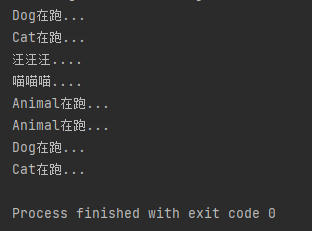

## 内部类

**内部类就是在一个类的内部又定义了一个类**

**作用**

- 当一个类的内部,有一部分需要一个完成的结构来描述，且这个完整的结构又只为外部事务提供服务，那么这整个内部的完整结构可以使用内部类来设计。
内部类可以方便
- 内部类可以方便的访问外部类的成员，甚至是私有成员
- 内部类提供了更好的封装性，内部类本身可以使用private protected来修饰

**一般语法格式**

```java
public class People{
    public class Heart{

    }
}
```

**分类**

- 静态内部类【了解】
- 成员内部类(非静态)【了解】
- 局部内部类【了解】
- 匿名内部类【重点】

### 静态内部类

**特点**

- 经static修饰
- 属于外部类本身
- 特点和普通类的特点完全一致
- 在静态内部类中能够访问外部类的静态属性和静态方法，但不能访问外部类的实例属性和方法。

**使用示例**

```java
public class HelloWorld {
    public static void main(String[] args) {
        Person.Heart ht = new Person.Heart();

        ht.getBeatRate();
        ht.setBeatRate(123);

        ht.getPersonHeight();
        ht.setPersonHeight(321);
    }
}
class Person{
    public static int height = 170;//外部类的静态属性
    public static void setHeight(int height){//外部类的静态方法
        Person.height = height;
    }
    public static class Heart{
        private int beatRate = 60;

        public int getBeatRate() {
            return beatRate;
        }

        public void setBeatRate(int beatRate) {
            this.beatRate = beatRate;
        }
        public int getPersonHeight(){
//            return Person.height; //完整写法
            return height;//省略写法
        }
        public void setPersonHeight(int height_){
//            Person.height = height; //完整写法
            height = height_; //省略写法
        }
    }
}
```

### 成员内部类

- 未经static修饰

- 属于外部类的对象
- jdk16之前`成员内部类`不能定义静态成员，之后就可以了
- 在成员内部类中可以访问外部类的静态属性静态方法，也能访问成员属性和成员方法。

```java

public class HelloWorld {
    public static void main(String[] args) {
        Person.Heart ht = new Person().new Heart();

        ht.getBeatRate();
        ht.setBeatRate(123);

        ht.getPersonHeight();
        ht.setPersonHeight(321);

        ht.getPersonWeight();
        ht.setPersonWeight(111);
        
        Person ps = ht.getThisPerson();
    }
}
class Person{
    public static int height = 170;//外部类的静态属性
    public int weight = 90;//外部类的实例属性
    public static void setHeight(int height){//外部类的静态方法
        Person.height = height;
    }
    public void setWeight(int weight){
        this.weight = weight;
    }
    public class Heart{
        private int beatRate = 60;
        private static  int size = 100;//jdk 16之后开始支持在成员内部类中定义静态成员

        public int getBeatRate() {
            return beatRate;
        }

        public void setBeatRate(int beatRate) {
            this.beatRate = beatRate;
        }
        public int getPersonHeight(){
            return height;//省略写法
        }
        public void setPersonHeight(int height_){
            height = height_; //省略写法
        }
        public int getPersonWeight(){
            return weight;//可以访问外部类的实例属性
        }
        public void setPersonWeight(int weight_){
            setWeight(weight_);//可以访问外部实例方法
        }
        public Person getThisPerson(){
            return People.this;
        }
    }
}
```

**面试题**


### 局部内部类

在局部（局部作用域，函数，代码块）定义的类

**实例**

```java
public class HelloWorld {
    public static void main(String[] args) {
        class Position{
            public int x;
            public int y;
            Position(int x,int y){
                this.x = x;
                this.y = y;
            }
        }
        
        Position p1 = new Position(123,456);
        Position p2 = new Position(321,654);

        System.out.println(p1.x);
        System.out.println(p2.y);
    }
}
```

### 匿名内部类【重点】

- 本质上，匿名内部类是一个没有名字的局部内部类

- 方便创建子类对象，目的是简化代码编写
- 匿名内部类相当于写了一个没有名字子类继承自一个父类，同时返回了这个子类的实例对象

```java
public class HelloWorld {
    public static void main(String[] args) {
        Animal cat = new Animal() {
            @Override
            void say() {
                System.out.println("喵喵喵.....");
            }
        };
        cat.say();
    }
}
abstract class Animal{
    abstract void say();
}
```

**匿名内部类的测试案例**

```java
import javax.swing.*;
import java.awt.event.ActionEvent;
import java.awt.event.ActionListener;

public class HelloWorld {
    public static void main(String[] args) {
        // 创建窗口
        JFrame window = new JFrame("测试匿名内部类的窗口");
        // 创建面板
        JPanel panel = new JPanel();
        // 创建按钮
        JButton btn = new JButton("测试按钮");

        //把按钮添加到面板
        panel.add(btn);
        //把面板添加到窗口
        window.add(panel);

        //设置窗口
        window.setSize(400,500);
        window.setLocationRelativeTo(null);//居中显示窗口
        window.setVisible(true);//显示窗口

//        该函数要求提供一个ActionListener类型的方法，并重写actionPerformed()方法
//        btn.addActionListener(new ActionListener() { // 匿名内部类
//            @Override
//            public void actionPerformed(ActionEvent e) {
//                JOptionPane.showMessageDialog(window,"按钮的点击事件发生了，且触发了事件回调函数");
//            }
//        });

        //简化版
        btn.addActionListener( e -> JOptionPane.showMessageDialog(window,"按钮的点击事件发生了，且触发了事件回调函数") );

    }
}
```

**运行效果**


## Object类及其常用APIs

Object类是所有类的祖宗类

### toString()

- **默认**返回该对象在堆内存中的地址

- 一般用法是让子类对其重写

**默认toString**

```java
public class HelloWorld {
    public static void main(String[] args) {
        Person p1 = new Person();
        System.out.println(p1.toString());//toString返回地址
        System.out.println(p1);//默认调用toString()
    }
}
class Person{
    public String name = "name...";
    public int age = 22;
}
```

**结果**


**重写toString**

```java
public class HelloWorld {
    public static void main(String[] args) {
        Person p1 = new Person();
        System.out.println(p1.toString());//toString返回地址
        System.out.println(p1);//默认调用toString()
    }
}
class Person{
    public String name = "name...";
    public int age = 22;

    @Override
    public String toString() {
        return "Person{" +
                "name='" + name + '\'' +
                ", age=" + age +
                '}';
    }
}
```

**结果**


### equals(Object)

- **默认**比较两地址是否相同

- 可让子类对其重写使其比较两对象成员属性是否相同

**默认equals**

```java
public class HelloWorld {
    public static void main(String[] args) {
        Person p1 = new Person("Dyg",22);
        Person p2 = new Person("Dyg",22);
        System.out.println(p1.equals(p2));//equals()判断对象的所有元素是否相同
        System.out.println(p1==p2);//判断其地址是否相同
    }
}
class Person{
    public String name;
    public int age;

    Person(String name,int age){
        this.name = name;
        this.age = age;
    }
}
```

**结果**


**重写equals**

```java

public class HelloWorld {
    public static void main(String[] args) {
        Person p1 = new Person("Dyg",22);
        Person p2 = new Person("Dyg",22);
        System.out.println(p1.equals(p2));//equals()判断对象的所有元素是否相同
        System.out.println(p1==p2);//判断其地址是否相同
    }
}
class Person{
    public String name;
    public int age;

    Person(String name,int age){
        this.name = name;
        this.age = age;
    }

    @Override
    public boolean equals(Object o) {
        if (this == o) return true;//若地址相等则直接返回true
        if (o == null || getClass() != o.getClass()) return false;//若o地址为空，或两者类型不相同 返回false
        Person person = (Person) o;//强制类型转换
        return age == person.age && Objects.equals(name,person.name);//返回他们所有属性是否相同的条件表达式

    }

    @Override
    public int hashCode() {
        return Objects.hash(name, age);
    }
}
```

**结果**


## Objects类及其常用APIs

### Objects.equals

一种更安全的比较两对象是否相等的方法
防止在调用`A.equals(B)`时 `A`为`null`产生报错

**源码**

```java
public static boolean equals(Object a, Object b) {
    return (a == b) || (a != null && a.equals(b));
}
```

### Objects.inNull

判断一个对象是否为空

**源码**

```java
    public static boolean isNull(Object obj) {
        return obj == null;
    }
```

## StringBuilder类及其常用APIs

- String类创建的对象是一个不可变字符串

- `StringBuilder类`创建的对象是一个**可变字符串**
- **`StringBuilder类`创建的对象在字符串的拼接、修改操作上效率很高**

### StringBuilder()构造器

```java
//两种常用构造器
StringBuilder sb1 = new StringBuilder();
StringBuilder sb2 = new StringBuilder("测试字符串");
System.out.println(sb1);
System.out.println(sb2);
```

### append(任意类型)

**特点**

- append(形参支持任何类型)
- 返回值为this，支持链式编程

```java
sb1.append("测试");
sb1.append(123);
sb1.append(123.5).append(true).append(new Object());//链式编程：因为append返回this
System.out.println(sb1);
System.out.println(sb2);
```

### reverse()

**特点**

- 反转字符串
- 返回this，支持链式

```java
//reverse()反转字符串，支持链式
sb1.reverse().reverse();
sb2.reverse();
System.out.println(sb1);
System.out.println(sb2);
```

### length()

**特点**

- 返回字符串长度

```java
//length()返回字符串长度
System.out.println(sb1.length());
System.out.println(sb2.length());
```

### toString()

**特点**

- 返回String字符串对象

```java
//toString()已被其重写，将返回字符串
System.out.println(sb1.toString());//调用println则默认会调用toString()
System.out.println(sb2.toString());
```

### 测试

**输出任意数组值**

```java
import java.util.Objects;

public class HelloWorld {
    public static void main(String[] args) {
        System.out.println(intArrtoString(new int[]{1,2,3,4,5,6}));
    }
    public static String intArrtoString(int[] arr){
        if (Objects.isNull(arr)) return null;
        StringBuilder sb = new StringBuilder();
        sb.append('[');
        for (int i = 0; i < arr.length; i++) {
            sb.append(arr[i]).append(i==arr.length-1? "":',');
        }
        sb.append(']');
        return sb.toString();//返回string
    }
}
```

**结果**


**综合测试**

```java
public class HelloWorld {
    public static void main(String[] args) {
        //两种常用构造器
        StringBuilder sb1 = new StringBuilder();
        StringBuilder sb2 = new StringBuilder("测试字符串");
        System.out.println(sb1);
        System.out.println(sb2);

        //append(形参支持任何类型) 返回值为this，支持链式编程
        sb1.append("测试");
        sb1.append(123);
        sb1.append(123.5).append(true).append(new Object());//链式编程：因为append返回this
        System.out.println(sb1);
        System.out.println(sb2);

        //reverse()反转字符串，支持链式
        sb1.reverse().reverse();
        sb2.reverse();
        System.out.println(sb1);
        System.out.println(sb2);

        //toString()已被其重写，将返回字符串
        System.out.println(sb1.toString());//调用println则默认会调用toString()
        System.out.println(sb2.toString());

        //length()返回字符串长度
        System.out.println(sb1.length());
        System.out.println(sb2.length());
    }
}
```

**结果**


## Math类及其常用APIs

- Math是一个工具类

- Math类没有向外提供构造函数，不能创建对象
- **Math向外提供的成员属性和成员变量全部是静态的**
- 使用方式
  - `Math.属性名`
  - `Math.方法名()`

### 常用APIs

| 方法名                                       | 说明                                  |
| -------------------------------------------- | ------------------------------------- |
| public static int abs(int a)                 | 获取参数绝对值                        |
| public static double ceil(double a)          | 向上取整                              |
| public static double floor( double a)        | 向下取整                              |
| public static int round(float a)             | 四舍五入                              |
| public static int max(int a,int b)           | 获取两个int值中的较大值               |
| public static double pow( double a,double b) | 返回a的b次幂的值                      |
| public static double random()                | 返回值为double的随机值，范围[0.0,1.0) |

## System类及其常用APIs

- System类没有向外提供构造函数，不能创建对象

### 常用APIs

| 方法名                                                                         | 说明                                       |
| ------------------------------------------------------------------------------ | ------------------------------------------ |
| public static void exit(int status)                                            | 终止当前运行的Java虚拟机，非零表示异常终止 |
| public static long currentTimeMillis()                                         | 返回当前系统的时间毫秒值形式               |
| public static void arraycopy(数据源数组,起始索引,目的地数组,起始索引,拷贝个数) | 数组拷贝                                   |

**测试**

```java
public class HelloWorld {
    public static void main(String[] args) {
        //代码性能测试
        long startTime = System.currentTimeMillis();
        for (int i = 0; i < 100000; i++) {
            System.out.println(i);
        }
        long endedTime = System.currentTimeMillis();
        long gap = endedTime - startTime;
        System.out.println("耗时"+gap/1000.0+"s");

        //数组拷贝
        int[] arr1 = {111,222,333,444,555};
        int[] arr2 = new int[20];// [0,0,0,0,0,0,0,0,......]
        System.arraycopy(arr1,0,arr2,10,5);
        System.out.println(intArrtoString(arr2));

        //提前结束java虚拟机
        System.exit(123);
        System.out.println("？？？");
    }
    public static String intArrtoString(int[] arr){
        if (Objects.isNull(arr)) return null;
        StringBuilder sb = new StringBuilder();
        sb.append('[');
        for (int i = 0; i < arr.length; i++) {
            sb.append(arr[i]).append(i==arr.length-1? "":',');
        }
        sb.append(']');
        return sb.toString();//返回string
    }
}
```

**运行结果**

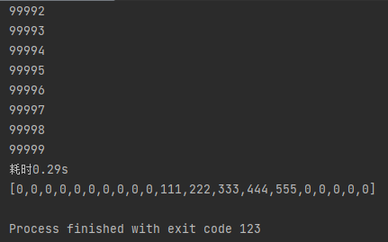

## BigDecimal类及其常用APIs

**用于解决浮点数运算精度失真的问题:**

```java
System.out.println(0.09+0.01);
```

**失真的输出结果：**

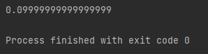

### BigDecimal构造函数

- **BigDecimal提供了多个构造函数**

- **BigDecimal构造函数使用<warn>注意事项</warn>**
  - BigDecimal提供了`BigDecimal(double)`的构造函数,**通过这种方式传递浮点数仍然存在浮点数的精度问题**
  - 应当使用的创建BigDecimal对象的方式
    - `BigDecimal(String)`
    - `BigDecimal.valueOf(double)` 该方法内部使用了Double.toString方法，此方法按照double实际能表示的精度对尾数进行了截取

```java
//实际推荐的用法
BigDecimal b1 = new BigDecimal("0.135");
BigDecimal b1 = new BigDecimal(0.135.toString());
BigDecimal b1 = BigDecimal.valueOf(0.135);
```

### 常用APIs

 | 方法名                                                                   | 说明         |
 | ------------------------------------------------------------------------ | ------------ |
 | public BigDecimal add(BigDecimal b)                                      | 加法         |
 | public BigDecimal subtract(BigDecimal b)                                 | 减法         |
 | public BigDecimal multiply(BigDecimal b)                                 | 乘法         |
 | public BigDecimal divide(BigDecimal b)                                   | 除法         |
 | public Double doubleValue()                                              | 获取double值 |
 | BigDecimal.valueOf(money).setScale(2,RoundingMode.HALF_UP).doubleValue() | 四舍五入     |

**add()方法使用测试**

```java
import java.math.BigDecimal;

public class HelloWorld {
    public static void main(String[] args) {
        BigDecimal b1 = BigDecimal.valueOf(0.123);
        BigDecimal b2 = BigDecimal.valueOf(0.123);

        BigDecimal result = b1.add(b2);
        Double result_db = result.doubleValue();

        System.out.println(result);
        System.out.println(result_db);
    }
}
```

### 精度问题

BigDecimal只能处理**有限小数**

**BigDecimal无法处理无限小数**

```java
BigDecimal b1 = BigDecimal.valueOf(10.0);
BigDecimal b2 = BigDecimal.valueOf(3.0);

BigDecimal result = b1.divide(b2);//    10.0/3.0 == 0.333333333333333 报错
Double result_db = result.doubleValue();

System.out.println(result);
System.out.println(result_db);
```


**正确写法:**

```java
BigDecimal b1 = BigDecimal.valueOf(10.0);
BigDecimal b2 = BigDecimal.valueOf(3.0);

BigDecimal result = b1.divide(b2,3, RoundingMode.CEILING);//    指定保留的小数位数和最后一位小数的进位模式（四舍五入、向上取整，向下取整......）
Double result_db = result.doubleValue();

System.out.println(result);
System.out.println(result_db);
```


### 二次封装

```java
public class HelloWorld {
    public static void main(String[] args) {
        System.out.println(0.09+0.01);
        System.out.println(add(0.09,0.01));
    }
    public static double add(double a,double b){
        return BigDecimal.valueOf(a).add(BigDecimal.valueOf(b)).doubleValue();
    }
}
```

**输出结果**

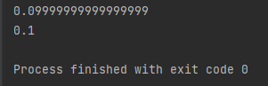

## Date日期对象及常用APIs

### 构造器

| 构造器名称      | 描述                             |
| --------------- | -------------------------------- |
| Date()          | 返回一个代表当前时间Date对象     |
| Date(long date) | 根据传入的毫秒数返回一个Date对象 |

```java
Date d1 = new Date();
System.out.println(d1);//输出值不是对象的地址，表示其toString方法被重写了
```


### 常用方法

| API名称          | 描述             |
| ---------------- | ---------------- |
| getTime()        | 获取毫秒值       |
| setTime()        | 设置毫秒值       |
| a.before(Date b) | 判断是否a在b之前 |
| a.after(Date b)  | 判断是否a在b之后 |

```java
Date d1 = new Date();
System.out.println(d1.getTime());
```


## SimpleDateFormat 日期对象及常用APIs

### 构造器

| 构造器名称                       | 描述     |
| -------------------------------- | -------- |
| SimpleDateFormat()               | 默认格式 |
| SimpleDateFormat(String pattern) | 指定格式 |

格式
| 年  | 月  | 日  | 时  | 分  | 秒  |
| --- | --- | --- | --- | --- | --- |
| y   | M   | d   | H   | m   | s   |

**案例**

```java
SimpleDateFormat sfm1 = new SimpleDateFormat();//按默认格式化
SimpleDateFormat sfm2 = new SimpleDateFormat("yyyy年MM月dd日 HH:mm:ss EEE a");//按指定形式格式化
```

### 常用方法

| API名称                   | 描述                      |
| ------------------------- | ------------------------- |
| setTime(Object time)      | 将毫秒数格式化            |
| String format(Data data)  | 将日期对象格式化          |
| Data parse(String source) | e解析日期字符串为Data对象 |

**测试format的案例**

```java
SimpleDateFormat sfm1 = new SimpleDateFormat();//按默认格式化
SimpleDateFormat sfm2 = new SimpleDateFormat("yyyy年MM月dd日 HH:mm:ss EEE a");//按指定形式格式化
System.out.println(sfm1.format(new Date()));//按默认格式化输出
System.out.println(sfm2.format(new Date()));//按指定形式格式化输出
```

**输出结果**


**测试parse解析日期字符串的案例（面试题）**


```java
import java.text.ParseException;
import java.text.SimpleDateFormat;
import java.util.Date;

public class HelloWorld {
    public static void main(String[] args) throws ParseException {
        String source = "2021年08月06日11点11分11秒";
        String result = "";

        System.out.println("原时间：" + source);

        SimpleDateFormat sfm3 = new SimpleDateFormat("yyyy年MM月dd日HH点mm分ss秒");//按指定形式格式化
        Date d1 = sfm3.parse(source);
        System.out.println( "时间解析完毕：" + d1);

        //定义一些基本单位
        int s = 1000;
        int m = 60*s;
        int h = 60*m;
        int d = 24*h;
        long newTime = d1.getTime() + 2 * d + 14 * h +  49 * m + 6 * s;//2天 14小时 49分 6秒 后
        result = sfm3.format(new Date(newTime));

        System.out.println("2天 14小时 49分 6秒 后的新时间为：");
        System.out.println(result);
    }
}

```

**运行结果为：**  


## Calendar 日历对象及常用APIs

- Calendar是一个抽象类，无法直接实例化对象

### APIs

| API名称                               | 描述                            |
| ------------------------------------- | ------------------------------- |
| static Calendar getInstance()         | 获取实例化对象（默认当前时间）  |
| public int get(int field)             | 获取日期中的某个字段信息。      |
| public void set(int field,int value)  | 修改日历的某个字段信息。        |
| public void add(int field,int amount) | 为某个字段**增加/减少**指定的值 |
| public final Date getTime()           | **拿到此刻日期对象。**          |
| setTime(Date)                         | **设置日历为某日期对象**        |
| public long getTimeInMillis()         | 拿到此刻时间毫秒值              |

**测试**

```java
import java.util.Calendar;

public class HelloWorld {
    public static void main(String[] args)  {
        //获取实例化对象
        Calendar ca = Calendar.getInstance();
        //输出实例化对象
        System.out.println(ca);

        //获取日期中的某个字段信息。
        System.out.println(ca.get(Calendar.YEAR));
        System.out.println(ca.get(Calendar.MONTH));
        System.out.println(ca.get(Calendar.DAY_OF_MONTH));

        //修改日历的某个字段信息。
        ca.set(Calendar.YEAR,2023);
        ca.set(Calendar.MONTH,2);
        ca.set(Calendar.DAY_OF_MONTH,2);

        //为某个字段**增加/减少**指定的值
        ca.add(Calendar.YEAR,2);
        ca.add(Calendar.MONTH,2);
        ca.add(Calendar.DAY_OF_MONTH,2);

        //拿到此刻日期对象。
        System.out.println(ca.getTime());
        //修改日历时间
//      ca.setTime(new Date());

        //拿到此刻时间毫秒值
        System.out.println(ca.getTimeInMillis());

        //再次输出实例化对象
        System.out.println(ca);
    }
}

```

输出结果

```
java.util.GregorianCalendar[time=1666769236461,areFieldsSet=true,areAllFieldsSet=true,lenient=true,zone=sun.util.calendar.ZoneInfo[id="Asia/Shanghai",offset=28800000,dstSavings=0,useDaylight=false,transitions=31,lastRule=null],firstDayOfWeek=1,minimalDaysInFirstWeek=1,ERA=1,YEAR=2022,MONTH=9,WEEK_OF_YEAR=44,WEEK_OF_MONTH=5,DAY_OF_MONTH=26,DAY_OF_YEAR=299,DAY_OF_WEEK=4,DAY_OF_WEEK_IN_MONTH=4,AM_PM=1,HOUR=3,HOUR_OF_DAY=15,MINUTE=27,SECOND=16,MILLISECOND=461,ZONE_OFFSET=28800000,DST_OFFSET=0]
2022
9
26
Sun May 04 15:27:16 CST 2025
1746343636461
java.util.GregorianCalendar[time=1746343636461,areFieldsSet=true,areAllFieldsSet=true,lenient=true,zone=sun.util.calendar.ZoneInfo[id="Asia/Shanghai",offset=28800000,dstSavings=0,useDaylight=false,transitions=31,lastRule=null],firstDayOfWeek=1,minimalDaysInFirstWeek=1,ERA=1,YEAR=2025,MONTH=4,WEEK_OF_YEAR=19,WEEK_OF_MONTH=2,DAY_OF_MONTH=4,DAY_OF_YEAR=124,DAY_OF_WEEK=1,DAY_OF_WEEK_IN_MONTH=1,AM_PM=1,HOUR=3,HOUR_OF_DAY=15,MINUTE=27,SECOND=16,MILLISECOND=461,ZONE_OFFSET=28800000,DST_OFFSET=0]

Process finished with exit code 0
```

## JDK8新增时间类

### `LocalDate`、`LocalTime`、`LocalDateTime`类及其APIs

**新API特点**

- 严格区分了 `日期` 、 `时间` 、 `日期及时间` 对象
- 对日期和时间的运算更方便
- 新API的类型几乎是不变的，不必担心被修改

**新增的日期类**
| 类名              | 描述                       |
| ----------------- | -------------------------- |
| **LocalDate**     | 不包含具体时间的日期。     |
| **LocalTime**     | 不含日期的时间。           |
| **LocalDateTime** | 包含了日期及时间。         |
| Instant           | 代表的是时间戳。           |
| DateTimeFormatter | 用于做时间的格式化和解析的 |
| Duration          | 用于计算两个“时间”间隔     |
| Period            | 用于计算两个“日期”间隔     |

#### 构造函数

| 方法名 | 描述                 |
| ------ | -------------------- |
| now()  | 根据当前时间创建对象 |
| of()   | 根据指定时间创建对象 |

**使用测试**

```java
import java.time.LocalDate;
import java.time.LocalDateTime;
import java.time.LocalTime;

public class HelloWorld {
    public static void main(String[] args)  {
        LocalDate localDate = LocalDate.now();
        LocalTime localTime = LocalTime.now();
        LocalDateTime localDateTime = LocalDateTime.now();

        System.out.println(localDate);
        System.out.println(localTime);
        System.out.println(localDateTime);

        LocalDate localDate1 = LocalDate.of(2022,11,11);
        LocalTime localTime1 = LocalTime.of(11,11,11);
        LocalDateTime localDateTime1 = LocalDateTime.of(2020,10,6,13,23,43);

        System.out.println(localDate1);
        System.out.println(localTime1);
        System.out.println(localDateTime1);
    }
}
```

**输出结果**


#### 常用成员函数APIs

 | 方法名                          | 说明               |
 | ------------------------------- | ------------------ |
 | public int geYear()             | 获取年             |
 | public int getMonthValue()      | 获取月份（1-12)    |
 | Public int getDayOfMonth()      | 获取月中第几天乘法 |
 | Public int getDayOfYear()       | 获取年中第几天     |
 | Public DayOfWeek getDayofweek() | 获取星期           |

**成员函数调用测试**

```java
import java.time.LocalDateTime;

public class HelloWorld {
    public static void main(String[] args)  {
        LocalDateTime localDateTime = LocalDateTime.now();
        System.out.println(localDateTime.getYear());
        System.out.println(localDateTime.getMonthValue());
        System.out.println(localDateTime.getDayOfMonth());
        System.out.println(localDateTime.getHour());
        System.out.println(localDateTime.getMinute());
        System.out.println(localDateTime.getSecond());
    }
}
```

**输出结果**


**`LocalDate` `LocalTime` `LocalDateTime`之间的类型转换**
| 方法名                         | 说明                    |
| ------------------------------ | ----------------------- |
| public LocalDate toLocalDate() | 转换成一个LocalDate对象 |
| public LocalTime toLocalTime() | 转换成一个LocalTime对象 |


**类型转换函数测试**

```java
import java.time.LocalDate;
import java.time.LocalDateTime;
import java.time.LocalTime;

public class HelloWorld {
    public static void main(String[] args)  {
        LocalDateTime ldt = LocalDateTime.now();
        LocalDate ld = ldt.toLocalDate();
        LocalTime lt = ldt.toLocalTime();

        System.out.println(ldt);
        System.out.println(ld);
        System.out.println(lt);
    }
}
```

**输出结果**


**时间修改的方法**

- **这些方法不会修改原对象的内容**
- **方法会返回一个新对象**

| 方法名                                             | 说明                                                                  |
| -------------------------------------------------- | --------------------------------------------------------------------- |
| plusDays, plusweeks, plusMonths, plusYears         | 向当前LocalDate对象添加几天、几周、几个月、几年                       |
| minusDays, minusWeeks, minusMonths, minusYears     | 从当前LocalDate 对象减去几天、几周、几个月、几年                      |
| withDayOfMonth, withDayOfYear, withMonth, withYear | 将月份天数、年份天数、月份、年份修改为指定的值并返回新的LocalDate对象 |
| isBefore, isAfter                                  | 比较两个LocalDate                                                     |
| equals                                             | 相等判断                                                              |

**plus...()测试**

```java
import java.time.LocalDateTime;

public class HelloWorld {
    public static void main(String[] args)  {
        LocalDateTime ldt = LocalDateTime.now();

        System.out.println(ldt);
        System.out.println(ldt.plusYears(1));
        System.out.println(ldt.plusMonths(1));
        System.out.println(ldt.plusDays(1));
        System.out.println(ldt.plusHours(1));
        System.out.println(ldt.plusMinutes(1));
        System.out.println(ldt.plusSeconds(1));
        System.out.println(ldt.plusNanos(1));
    }
}
```

**输出结果**

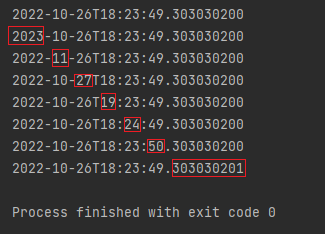

**isBefore()、isAfter()测试**

```java
import java.time.LocalDateTime;

public class HelloWorld {
    public static void main(String[] args)  {
        LocalDateTime ldt1 = LocalDateTime.now();
        LocalDateTime ldt2 = LocalDateTime.now();
        
        ldt1 = ldt1.minusDays(1);
        ldt2 = ldt2.plusDays(1);
        
        System.out.println(ldt1);
        System.out.println(ldt2);

        System.out.println(ldt1.isBefore(ldt2));
        System.out.println(ldt2.isAfter(ldt1));

    }
}
```


### `Instant`类及APIs

**新API特点**

- 新API的类型几乎是不变的，不必担心被修改

**新增的日期类**
| 类名              | 描述                       |
| ----------------- | -------------------------- |
| LocalDate         | 不包含具体时间的日期。     |
| LocalTime         | 不含日期的时间。           |
| LocalDateTime     | 包含了日期及时间。         |
| **Instant**       | 代表的是时间戳。           |
| DateTimeFormatter | 用于做时间的格式化和解析的 |
| Duration          | 用于计算两个“时间”间隔     |
| Period            | 用于计算两个“日期”间隔     |

#### Instant创建实例对象

**Instant创建实例对象测试**

```java
import java.time.Instant;
import java.time.ZoneId;
import java.time.ZonedDateTime;

public class HelloWorld {
    public static void main(String[] args)  {
        Instant instant = Instant.now();//获取世界标准时间
        System.out.println(instant);

        ZonedDateTime zdt = instant.atZone(ZoneId.systemDefault());//获取系统默认所在地区时间
        System.out.println(zdt);
    }
}
```

**输出结果**


#### 一些方法
>
> 事实上，instant就是jdk8之前的Date
**Date 和 Instant 互相转换**

```java
import java.time.Instant;
import java.util.Date;

public class HelloWorld {
    public static void main(String[] args)  {
        Instant instant = Instant.now();//获取世界标准时间

        System.out.println(instant);

        //Date 和 Instant 互相转换
        Date date = Date.from(instant);
        instant = date.toInstant();

        System.out.println(instant);
        
    }
}
```

**输出**


### `Instant`类及APIs

**新API特点**

- 新API的类型几乎是不变的，不必担心被修改

**新增的日期类**
| 类名                  | 描述                       |
| --------------------- | -------------------------- |
| LocalDate             | 不包含具体时间的日期。     |
| LocalTime             | 不含日期的时间。           |
| LocalDateTime         | 包含了日期及时间。         |
| Instant               | 代表的是时间戳。           |
| **DateTimeFormatter** | 用于做时间的格式化和解析的 |
| Duration              | 用于计算两个“时间”间隔     |
| Period                | 用于计算两个“日期”间隔     |

#### 实例化

```java
DateTimeFormatter dateTimeFormatter = DateTimeFormatter.ofPattern("yyyy-MM-dd HH:mm:ss");
```

#### 方法

**format()方法**

```java
import java.time.LocalDateTime;
import java.time.format.DateTimeFormatter;

public class HelloWorld {
    public static void main(String[] args)  {
        LocalDateTime localDateTime = LocalDateTime.now();
        DateTimeFormatter dateTimeFormatter = DateTimeFormatter.ofPattern("yyyy-MM-dd HH:mm:ss");

        System.out.println(dateTimeFormatter.format(localDateTime));//正反都能调用
        System.out.println(localDateTime.format(dateTimeFormatter));//正反都能调用
    }
}
```


**解析时间字符串**

```java
import java.time.LocalDateTime;
import java.time.format.DateTimeFormatter;

public class HelloWorld {
    public static void main(String[] args)  {
        DateTimeFormatter dateTimeFormatter = DateTimeFormatter.ofPattern("yyyy-MM-dd HH:mm:ss");
        LocalDateTime time = LocalDateTime.parse("2011-11-11 11:11:11",dateTimeFormatter);
        System.out.println(time);
        System.out.println(time.getYear());//解析后可以很方便的获取年 月 日
        System.out.println(time.getMonthValue());
    }
}
```


### Period类

**基本作用**

- <green>**用于计算日期间隔**</green>
- 提供的方法主要有`getYears() getMonths() getDays()`,**只能精确到天**
- 用于`LocalDate`对象之间的计算

```java
import java.time.LocalDate;
import java.time.Period;

public class HelloWorld {

    public static void main(String[] args)  {
        LocalDate now = LocalDate.now();
        LocalDate birth = LocalDate.of(2001,9,16);
        Period period = Period.between(birth,now);

        System.out.println("你的年龄：" + period.getYears());
    }
}
```


### Duration类

**基本作用**

- <green>**用于计算时间间隔**</green>
- 用于LocalDateTime之间的比较
- 用于Instant之间的比较

**测试**

```java
import java.time.Duration;
import java.time.LocalDateTime;

public class HelloWorld {

    public static void main(String[] args)  {
        LocalDateTime now = LocalDateTime.now();
        LocalDateTime birth = LocalDateTime.of(2001,9,16,0,0,0);
        Duration duration = Duration.between(birth,now);

        System.out.println("你至今已活天数：" + duration.toDays());
        System.out.println("你至今已活小时数：" + duration.toHours());
        System.out.println("你至今已活分钟数：" + duration.toMinutes());
        System.out.println("你至今已活秒数：" + duration.toSeconds());
    }
}
```

**结果**


### ChronoUnit类

**可用于比较所有单位**

```java
import java.time.LocalDateTime;
import java.time.temporal.ChronoUnit;
public class HelloWorld {
    public static void main(String[] args)  {
        LocalDateTime today = LocalDateTime.now( ) ;
        System.out.println(today);
        LocalDateTime birthDate = LocalDateTime.of(1921,1,1,1,1,1);
        System.out.println(birthDate);
        System.out.println("相差的年数:" + ChronoUnit.YEARS.between(birthDate,today));
        System.out.println("相差的月数:"+ChronoUnit.MONTHS.between(birthDate,today));
        System.out.println("相差的周数:" +ChronoUnit.WEEKS.between(birthDate,today));
        System.out. println("相差的天数:" +ChronoUnit.DAYS.between(birthDate,today));
        System.out. println("相差的时数:"+ChronoUnit.HOURS.between(birthDate,today));
        System.out.println("相差的分数:"+ChronoUnit.MINUTES.between(birthDate, today));
        System.out.println("相差的秒数:"+ChronoUnit.SECONDS.between(birthDate,today));
        System.out.println("相差的毫秒数:" +ChronoUnit.MILLIS.between(birthDate,today));
        System.out.println("相差的微秒数:"+ChronoUnit.NANOS.between(birthDate,today));
        System.out.println("相差的纳秒数:" + ChronoUnit.NANOS.between(birthDate,today));
        System.out.println("相差的半天数:"+ChronoUnit.HALF_DAYS.between(birthDate,today));
        System.out.println("相差的十年数:" +ChronoUnit.DECADES.between(birthDate,today));
        System.out.println("相差的世纪（百年）数: " +ChronoUnit.CENTURIES.between(birthDate,today));
        System.out.println("相差的千年数:" +ChronoUnit.MILLENNIA.between(birthDate,today));
        System.out.println("相差的纪元数:" +ChronoUnit.ERAS.between(birthDate,today));
    }
}
```

## 包装类

**概念**

- **包装类就是8中基本类型的引用类型**
- java为实现一切皆对象，将基本数据类型进行了包装，抽象成了类
- 集合与泛型只支持包装类型，不支持基本数据类型

**包装类的特点**

- 自动装包：基本数据类型可直接赋值给包装数据类型
- 自动解包：包装数据类型可直接赋值给基本数据类型
- 包装类的默认值可为null，**容错率更高**
- 可以字符串转包装类(有用)
  - `Integer.parseInt("123")`
  - `Double.parseDouble("12.3")`
  - `Integer.valueOf("123")`
  - `Double.valueOf("12.3")`
- 可以包装类转字符串
  - `obj.toString()`
  - `包装类名.toString()`

| 基本数据类型 | 引用数据类型 |
| ------------ | ------------ |
| byte         | Byte         |
| short        | Short        |
| int          | Integer      |
| long         | Long         |
| char         | Character    |
| float        | Float        |
| double       | Double       |
| boolean      | Boolean      |

**基本使用测试**

```java
        int a = 10;
        Integer aa = 10;
//        Integer aa = new Integer(10);//写法自9起弃用
        System.out.println(a);
        System.out.println(aa);
```

## 正则表达式

### API

**字符串提供的匹配正则表达式的方法**
| API                                                     | 描述                                                                   |
| ------------------------------------------------------- | ---------------------------------------------------------------------- |
| `public Boolean matches(String regex);`                 | 匹配正则成功返回true                                                   |
| `public String replaceAll(String regex,String newStr);` | 对匹配到的内容替换并返回                                               |
| `public String[] split(String regex);`                  | 将匹配到的内容看做分隔符，把被分割符分割的部分提取放到一个字符串数组中 |

### 正则语法

**单字符匹配**
| 正则写法        | 意义                                               |
| --------------- | -------------------------------------------------- |
| `[abc]`         | 只能是a, b,或c                                     |
| `[^abc]`        | 除了a, b, c之外的任何字符                          |
| `[a-zA-Z]`      | (可理解为是：`[[a-z]+[A-Z]]`) a到zA到Z，           |
| `[a-d[m-p]]`    | (可理解为是： `[[a-d]\|\|[m-p]]` ) a到d，或m通过p: |
| `[a-z&&[def]]`  | (可理解为是：`[[a-z]&&[def]]`) d,e,或f             |
| `[a-z&&[^bc]]`  | (可理解为是：`[[a-z]&&[^bc]]`) a到z，除了b和c:     |
| `[a-z&&[Am-p]]` | (可理解为是：`[[a-z]&&[Am-p]]`) a到z，除了m到p:    |

**预定义单字符匹配**
| 正则写法 | 意义                            |
| -------- | ------------------------------- |
| `.`      | 任意字符                        |
| `\t`     | 水平制表符                      |
| `\x0b`   | 垂直制表符                      |
| `\b`     | backspace退格                   |
| `\f`     | 换页符                          |
| `\r`     | 回车CR(carriage return)0x0D     |
| `\n`     | 换行LF(Line Feed)0x0A           |
| `\d`     | 数字`[0-9]`                     |
| `\D`     | 非数字`[^0-9]`                  |
| `\s`     | 空白字符`[\t\x0b\f\b\r\n]`      |
| `\S`     | 非空白字符`[^\t\x0b\f\b\r\n]`   |
| `\w`     | 英文数字下划线`[_a-zA-Z0-9]`    |
| `\W`     | 非英文数字下划线`[^_a-zA-Z0-9]` |

**关于回车换行**

- **回车**是传统英文打字机的打字小车回到本行开头但不换行
- **换行**是传统英文打字机的打字小车换到当前位置的下一行
- windows下enter是 `\r\n`;
- linux/unix下enter是`\n`;
- mac下enter是`\r`

**贪婪匹配**
| 正则写法 | 意义               |
| -------- | ------------------ |
| `X?`     | X 0次或1次         |
| `X*`     | X 0次或多次        |
| `X+`     | X 1次或多次        |
| `X{n}`   | X 正好n次          |
| `X{n,}`  | X 至少n次          |
| `X{n,m}` | X 至少n次不超过m次 |

### 案例测试

**基本使用**

```java
public class HelloWorld {
    public static void main(String[] args)  {
        System.out.println("2122312311".matches("[\\d]{5,20}"));//匹配qq号
        System.out.println("21223_1ajewor212311".matches("[\\w]{6,}"));//匹配密码：数字字母下换线至少6位
        System.out.println("12_1".matches("[0-9a-zA-Z]{4}"));//匹配验证码：数字+字母，必须四位
        System.out.println("12k1".matches("[\\w&&[^_]]{4}"));//匹配验证码：数字+字母，必须四位
    }
}
```

**结果**


**匹配手机号、匹配邮箱、座机号码、校验金额**

```java
public class HelloWorld {

    public static void main(String[] args)  {
        //匹配手机号
        System.out.println("13345678901".matches("[1][3-9][\\d]{9}"));//第一位是1 第二位是3~9 剩下9位数字
        //匹配邮箱
        System.out.println("176251@qq.com".matches("[\\w]{1,}[@][\\w]{2,}([\\.][\\w]{2,}){1,}"));// 至少一个字符的用户名 + @ + 至少两个字符的域名 + ( 点 + 一级/二级域名 ){至少1次, }
        System.out.println("176251@qq.com.cn".matches("[\\w]{1,}[@][\\w]{2,}([\\.][\\w]{2,}){1,}"));
        //匹配座机号码
        System.out.println("012-111111111".matches("[0][0-9]{2,5}[-]?[\\d]{5,}"));//0开头 + 2~5位区号 + 可有可无的-符号 + 至少5位的数字

        //校验金额
        System.out.println("12.32".matches("[\\d]{1,}([\\.][\\d]{1,2})?")); //至少一位数 + 可有可无的(一个小数点 + 至少一个最多两个的数字)
        System.out.println("12123123".matches("[\\d]{1,}([\\.][\\d]{1,2})?")); //至少一位数 + 可有可无的(一个小数点 + 至少一个最多两个的数字)
    }
}
```


**splice测试**

```java
public class HelloWorld {

    public static void main(String[] args)  {
        String res = "测试文字一jie0wfj03290测试文字二fjwf2rwdf0测试文字三";
        String[] tests = res.split("\\w+");
        for (int i = 0; i < tests.length; i++) {
            System.out.println(tests[i]);
        }
    }
}
```

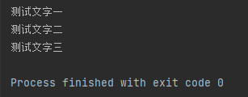

**replaceAll测试**

```java
public class HelloWorld {
    public static void main(String[] args)  {
        String res = "测试文字一jie0wfj03290测试文字二fjwf2rwdf0测试文字三".replaceAll("\\w+","\t");
        System.out.println(res);
    }
}
```


**爬取手机号邮箱号电话号**

```java
import java.util.regex.Matcher;
import java.util.regex.Pattern;
public class HelloWorld {
    public static void main(String[] args)  {
        //内容
        String context = "电话020-43422424邮箱176251@qq.com电话17625191722,17625191721";
        
        //定义正则表达式
        String regex = "([1][3-9][\\d]{9})|" +//匹配手机号
                "([\\w]{1,}[@][\\w]{2,}([\\.][\\w]{2,}){1,})|" +//匹配邮箱
                "([0][0-9]{2,5}[-]?[\\d]{5,})";//匹配座机号码
        
        //将正则表达式编译为匹配规则
        Pattern pattern = Pattern.compile(regex);
        
        //根据匹配规则和待匹配的文本得到一个匹配器对象
        Matcher matcher = pattern.matcher(context);
        
        //匹配
        while (matcher.find()){//匹配到
            String finded = matcher.group();//提取
            System.out.println(finded);//输出
        }
    }
}
```


## Arrays数组的工具类

用于操作数组的工具类，

| 方法名                                                          | 说明                                                                                 |
| --------------------------------------------------------------- | ------------------------------------------------------------------------------------ |
| `public static String tostring(类型[] a)`                       | 将数组转换成字符串                                                                   |
| `public static void sort(类型[]a)`                          | 对数组进行排序，默认升序排序                                                         |
| `public static <T> void sort(类型[]a, Comparator<? super T> c)` | 使用比较器对象自定义排序                                                             |
| `public static int binarySearch(int[]a, int key)`               | 二分搜索数组中的数据，存在返回索引，不存在返回负数（表示应当插入位置的坐标的负数-1） |

### tostring

**Arrays.tostring测试**

```java
import java.util.Arrays;
public class HelloWorld {
    public static void main(String[] args)  {
        int[] arr1 = {1,2,3,4,5,6,7,8,9,10};
        System.out.println(arr1);
        System.out.println(Arrays.toString(arr1));
    }
}
```


### sort

**Arrays.sort测试**

```java
import java.util.Arrays;
public class HelloWorld {
    public static void main(String[] args)  {
        int[] arr1 = {10,9,8,7,6,5,4,3,2,1,0};
        Arrays.sort(arr1);
        System.out.println(Arrays.toString(arr1));
    }
}
```


### 自定义sort排序

**Arrays.sort的自定义排序测试**

```java
import java.util.Arrays;
import java.util.Comparator;

public class HelloWorld {
    public static void main(String[] args)  {
        Integer[] arr1 = {0,1,2,3,4,5,6,7,8,9,10};//Comparator仅支持引用数据类型
        Arrays.sort(arr1, new Comparator<Integer>() {//Comparator仅支持引用数据类型
            @Override //实际这里是实现了一个接口，重写了接口的compare方法，new了一个匿名的比较器类对象，sort使用了这个比较器对象compare()方法
            public int compare(Integer o1, Integer o2) {
                //return o1-o2;//默认的排序方式 升序排序
                return -(o1-o2);//自定义的 降序排序
            }
        });
        System.out.println(Arrays.toString(arr1));
    }
}
```


**对学生数组根据年龄排序**

使用Arrays.sort()通过实现Comparator接口类并重写compare()函数实现根据学生年龄排序学生对象数组的测试

```java
import java.util.Arrays;
import java.util.Comparator;
import java.util.Random;
public class HelloWorld {
    public static void main(String[] args)  {
        Random rd = new Random();
        Student[] students = new Student[5];
        for (int i = 0; i < students.length; i++) {
            students[i] = new Student("随便写的名字", rd.nextInt(1,50));
        }
        System.out.println(Arrays.toString(students));

        Arrays.sort(students, new Comparator<Student>() {
            @Override
            public int compare(Student o1, Student o2) {
                //return o1.getAge() - o2.getAge();//按年龄升序排序
                //return -(o1.getAge() - o2.getAge());//按年龄降序排序
                //return -Integer.compare(o1.getAge(),o2.getAge());//按年龄降序排序
                return Integer.compare(o1.getAge(),o2.getAge());//按年龄升序排序
            }
        });
        System.out.println(Arrays.toString(students));
    }
}
class Student{
    private int age;
    private String name;

    public Student(String name, int age) {
        this.name = name;
        this.age = age;
    }

    @Override
    public String toString() {
        return "Student{" +
                "age=" + age +
                ", name='" + name + '\'' +
                '}';
    }

    public int getAge() {
        return age;
    }

    public void setAge(int age) {
        this.age = age;
    }

    public String getName() {
        return name;
    }

    public void setName(String name) {
        this.name = name;
    }
}
```


### binarySearch二分查找

**Arrays.binarySearch()测试**

```java
import java.util.Arrays;
public class HelloWorld {
    public static void main(String[] args)  {
        int[] arr1 = {100,99,88,77,66,55,44,33,33,11,0};
        int index;
        Arrays.sort(arr1);
        System.out.println(Arrays.toString(arr1));

        index = Arrays.binarySearch(arr1,99);
        System.out.println(index);

        index = Arrays.binarySearch(arr1,55);
        System.out.println(index);
    }
}
```


## Lambda表达式

- Lambda表达式为jdk8开始的新语法特效

- 作用：简化函数式接口匿名内部类的代码写法
- 注意：
  - 只能简化函数式接口的匿名内部类的写法
  - 函数式接口：有且只有一个抽象方法的接口

Lambda表达式格式

```java
(匿名内部类要重写方法的形参列表)->{
    被重写方法的方法体
}

单个形参 -> 单条语句同时作为函数返回值
```

**用法测试**

```java
public class HelloWorld {
    public static void main(String[] args)  {
        Animal cat = () -> {//Lambda表达式
            System.out.println("喵喵喵");
        };
        Animal dog = new Animal() {//完整写法
            @Override
            public void say() {
                System.out.println("汪汪汪");
            }
        };
        cat.say();
        dog.say();
    }
}
@FunctionalInterface //函数式接口
interface Animal{
    void say();
}
```


**简化测试**

```java
Integer[] arr1 = {0,1,2,3,4,5,6,7,8,9,10};

//原始写法
Arrays.sort(arr1, new Comparator<Integer>() {
    @Override
    public int compare(Integer o1, Integer o2) {
        return -(o1-o2);
    }
});

//Lambda表达式写法
Arrays.sort((Integer o1, Integer o2)->{
        return -(o1-o2);
    }
);

//Lambda表达式的进一步简化写法
Arrays.sort(    (o1,o2)-> -(o1-o2)  );
```

## Collection集合

### Collection集合概念

**概念**

- **集合是用于存储对象的容器**
- **集合大小不固定，适合做元素的增删改查**
- 集合只能存储引用数据类型的数据，不能存储基本数据类型，但可以存储基本数据类型的包装类

**两种集合体系**

- Collection单列集合，每个元素只包含一个值
- Map双列集合，每个元素包含两个值（键值对）


**Collection集合体系**

- `Collection` 是一个接口类
- `List` `Set` 也是接口类, **继承** 自 `Collection` 接口
- `ArrayList` 等类 是实现类
- 集合的实现类**支持泛型**
- 图中是一些**常见**的子接口和实现类


**Collection集合特点**

**List集合特点：**

- `ArrayList` 添加的元素**有序**、**可重复**、**有索引**
- `LinkedList` 添加的元素**有序**、**可重复**、**有索引**

**Set集合特点：**

- `HashSet`添加的元素**无序**、**不重复**、**无索引**
- `LinkedHashSet`添加的元素`有序`、**不重复**、**无索引**
- `TreeSet`添加的元素`默认按大小升序排序`、**不重复**、**无索引**

**ArrayList集合特点测试**

- 有序
- 可重复
- 有索引

```java
import java.util.ArrayList;

public class HelloWorld {
    public static void main(String[] args)  {
        ArrayList al = new ArrayList<String>();
        al.add("字符串");
        al.add("字符串");
        al.add("字符串");
        al.add("1111");
        al.add("2222");
        al.add("3333");
        al.add("1111");
        System.out.println(al);//可重复
        System.out.println(al.get(5));//有索引，有顺序
    }
}
```


**HashSet集合特点测试**

- 无序
- 不可重复
- 无索引

```java
import java.util.HashSet;

public class HelloWorld {
    public static void main(String[] args)  {
        HashSet al = new HashSet<String>();
        al.add("字符串");
        al.add("字符串");
        al.add("字符串");
        al.add("1111");
        al.add("2222");
        al.add("3333");
        al.add("1111");
        System.out.println(al);//不可重复，无序
        //System.out.println(al.get(5));//无索引，无法调用
    }
}
```

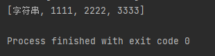

### Collection集合常用API

Collection接口类是单列集合的祖宗类，其中定义的抽象函数，其子接口和子类都会对这些抽象函数重写

于是，学习Collection接口类中提供的抽象函数，就是在学习其子类们所共有的成员方法。

**Collection常用API**
| 方法名称                              | 说明                             |
| ------------------------------------- | -------------------------------- |
| `public boolean add(E e)`             | 把给定的对象添加到当前集合中     |
| `public void clear()`                 | 清空集合中所有的元素             |
| `public boolean remove(E e)`          | 把给定的对象在当前集合中删除     |
| `public boolean contains(Object obj)` | 判断当前集合中是否包含给定的对象 |
| `public boolean isEmpty()`            | 判断当前集合是否为空             |
| `public int size()`                   | 返回集合中元素的个数。           |
| `public Object[] toArray()`           | 把集合中的元素，存储到数组中     |

### Collection集合遍历

**三种常用遍历集合的方式**

- 迭代器
- 利用加强版`for(ElementType item:obj){}`语法特性
- 结合`集合的forEach方法`和`lambda表达式`

**原理**

- 三种方式的**本质原理**都是`Collection的子类`**实现了**`Iterable接口`
- 三种方式的依赖关系为 **对Iterable接口的实现** <- **获取Iterator迭代器** <- **使用加强版for(ElementType item:obj){}** <- **使用集合的forEach()方法**

#### 迭代器

- **迭代器是集合专用遍历方式**

- 迭代器是指`Iterator`对象
- `Iterable`本身是一个接口类，该接口类中定义了`iterator()`方法,该方法返回一个`Iterator`迭代器对象
- `Collection`也是一个接口类，实现该接口类的类实现了这个`Iterable`接口类
- 通过`Collection的实例对象`的`iterator()`方法可以得到一个`Iterator`迭代器实例

**Collection实例对象创建Iterator的函数**
| 函数名              | 描述                                   |
| ------------------- | -------------------------------------- |
| Iterator iterator() | 返回一个调用者（集合对象）的迭代器对象 |

**Iterator的方法**
| 函数名                                       | 描述                                                                                                                           |
| -------------------------------------------- | ------------------------------------------------------------------------------------------------------------------------------ |
| forEachRemaining(Consumer<? super E> action) | Performs the given action for each remaining element until all elements have been processed or the action throws an exception. |
| boolean hasNext()                            | Returns true if the iteration has more elements.                                                                               |
| E next()                                     | Returns the next element in the iteration.                                                                                     |

**迭代器使用测试**

```java
import java.util.ArrayList;
import java.util.Iterator;

public class HelloWorld {
    public static void main(String[] args)  {
        ArrayList<String> al = new ArrayList<String>();
        al.add("字符串");
        al.add("字符串");
        al.add("字符串");
        al.add("1111");
        al.add("2222");
        al.add("3333");
        al.add("1111");

        Iterator<String> iterator = al.iterator(); //创建`Iterator`对象
        while (iterator.hasNext()){//判断是否遍历完成`.hasNext()` 
            System.out.println(iterator.next());//获取元素`.next()`
        }
    }
}
```


#### 加强版for循环

**加强版for循环**

- 实现了`iterable`接口的类才能使用`加强版for循环`，而Collection是继承自`iterable`的
- `加强版for循环`**可以遍历集合**，**也能遍历数组**
- 内部原理依然是迭代器对象
  - **猜测应该是**for循环隐式调用了这一系列方法：
    - 1.创建`Iterator`对象`obj.iterator()`
    - 2.判断是否遍历完成`.hasNext()`
    - 3.获取元素`.next()`
- 该语法特性出现于jdk5

**for新特性语法格式**

```java
for(ElementType item:obj){
    System.out.println(item);
}
```

**`加强版for循环`语法特性测试**

```java
import java.util.ArrayList;

public class HelloWorld {
    public static void main(String[] args)  {
        ArrayList<String> al = new ArrayList<String>();
        al.add("字符串");
        al.add("字符串");
        al.add("字符串");
        al.add("1111");
        al.add("2222");
        al.add("3333");
        al.add("1111");

        for (String item : al) {
            System.out.println(item);
        }
    }
}
```


#### 结合forEach方法和lambda表达式

**关于forEach方法**

- `Iterable接口类`中定义了`forEach方法`,
- 而`Collection接口类`继承自`Iterable接口类`,
- 所以实现了`Collection接口类`的类中也实现了`forEach方法`
- 该方法接收一个**实现函数式接口类**的`匿名对象`
- forEach方法的本质是利用了for的新语法特性

**测试Collection集合的forEach方法**

```java
import java.util.ArrayList;
import java.util.function.Consumer;

public class HelloWorld {
    public static void main(String[] args)  {
        Collection<String> al = new ArrayList<String>();
        al.add("字符串");
        al.add("字符串");
        al.add("字符串");
        al.add("1111");
        al.add("2222");
        al.add("3333");
        al.add("1111");

        al.forEach(new Consumer<String>() {
            @Override
            public void accept(String s) {
                System.out.println(s);
            }
        });
    }
}
```

**测试结合Collection集合的forEach方法和lambda表达式**

```java
import java.util.ArrayList;
import java.util.Collection;

public class HelloWorld {
    public static void main(String[] args)  {
        Collection<String> al = new ArrayList<String>();
        al.add("字符串");
        al.add("字符串");
        al.add("字符串");
        al.add("1111");
        al.add("2222");
        al.add("3333");
        al.add("1111");

        al.forEach( s -> {
                System.out.println(s);
        });
    }
}
```

**几种遍历集合方式的总结**

```java
        List<String> list = new LinkedList<>();
        list.add("Java");
        list.add("JavaScript");
        list.add("css");
        list.add("html");
        list.add("jquery");
//1.使用迭代器遍历集合
    //1.1使用迭代器+while循环遍历集合
        //遍历一个集合的最原始做法就是通过集合类实现的Iterator对象来遍历
        Iterator<String> iterator = list.iterator();
        while (iterator.hasNext()){
            String item = iterator.next();
            System.out.println(item);
        }
    //1.2使用迭代器+for循环遍历集合，和原理上述while循环等效
        for (Iterator<String> iterator2 = list.iterator(); iterator2.hasNext();  ) {
            String item = iterator2.next();
            System.out.println(item);
        }
//2.使用增强for遍历集合
        //使用这种方式要求被遍历的集合必须是可迭代的
        //其实实际就是上述 for循环+迭代器 的简化版
        for (String item : list) {
            System.out.println(item);
        }
//3.使用 forEach 遍历集合
        //根据源代码，forEach的本质实际上是使用了 增强版的for的语法
        //所以 使用forEach遍历集合 = 使用增强for遍历集合
        list.forEach(item->{
            System.out.println(item);
        });
//4.使用 for + index下标 + get() 遍历集合，
        // 效率低，且只能遍历有序集合
        for (int index=0 ;index<list.size();index++){
            String item = list.get(index);
            System.out.println(item);
        }
```

### List系列的集合


**List系列特点：**

- **有序**: 存和取元素的顺序一致
- **可重复**: 存储的元素可以重复
- **有索引**: 可以通过索引操作元素

**List系列的集合共有方法**
| 方法名称                      | 说明                                   |
| ----------------------------- | -------------------------------------- |
| void add(int index,E element) | 在此集合中的指定位置插入指定的元素     |
| E remove(int index)           | 删除指定索引处的元素，返回被删除的元素 |
| E set(int index,E element)    | 修改指定索引处的元素，返回被修改的元素 |
| E get(int index)              | 返回指定索引处的元素                   |

**List类共有方法测试**

```java
import java.util.ArrayList;
import java.util.List;

public class HelloWorld {
    public static void main(String[] args)  {
        List<String> list = new ArrayList<>();
        list.add("Java");
        list.add("JavaScript");
        list.add("css");
        list.add("html");
        list.add("jquery");//add
        System.out.println(list);
        System.out.println(list.get(3));//get
        list.set(4,"jQuery");//set
        System.out.println(list);
        list.remove(1);//romove
        System.out.println(list);
    }
}
```


#### ArrayList

**ArrayList特点**

- 底层基于数组实现
- 根据索引定位元素快、增删慢
- 初始容量为10，之后按1.5倍扩容

#### LinkedList

**LinkedList特点**

- 底层基于双链表实现
- 查询慢，首尾操作速度快，增删块
- 能当做栈和队列来用
- 有一些特有的首尾操作API
  - addFirst addLast  push offerFirst
  - romoveFirst removeLast pop offerLast
  - getFirst getLast

**LinkedList特有的首尾操作API测试**

```java
import java.util.LinkedList;

public class HelloWorld {
    public static void main(String[] args)  {
        //栈
        LinkedList<String> stack = new LinkedList<>();
        stack.push("111");
        stack.push("222");
        stack.push("333");
        System.out.println(stack);
        System.out.println(stack.pop());
        System.out.println(stack.pop());
        System.out.println(stack.pop());
        System.out.println(stack);

        //队列
        LinkedList<String> queue = new LinkedList<>();
        queue.add("111");
        queue.add("222");
        queue.add("333");
        System.out.println(queue);
        System.out.println(queue.poll());
        System.out.println(queue.poll());
        System.out.println(queue.poll());
        System.out.println(queue);
    }
}
```


#### 迭代时删除元素的问题

不能在迭代的过程中直接删除元素，需要利用迭代器的romove方法

```java
import java.util.Iterator;
import java.util.LinkedList;
import java.util.List;

public class HelloWorld {
    public static void main(String[] args)  {
        List<String> list = new LinkedList<>();
        list.add("111");
        list.add("222");
        list.add("222");
        list.add("333");
        System.out.println(list);

        Iterator<String> iterator = list.iterator();
        while (iterator.hasNext()){
            String item = iterator.next();
            System.out.println(item);
            if (item.equals("222")){
                //list.remove(item);//错误写法，会使得数组中元素前移，导致迭代器获取下一个元素时错过一个元素
                iterator.remove();//正确写法，移除当前元素
            }
        }
        System.out.println(list);
    }
}
```


### Set系列集合

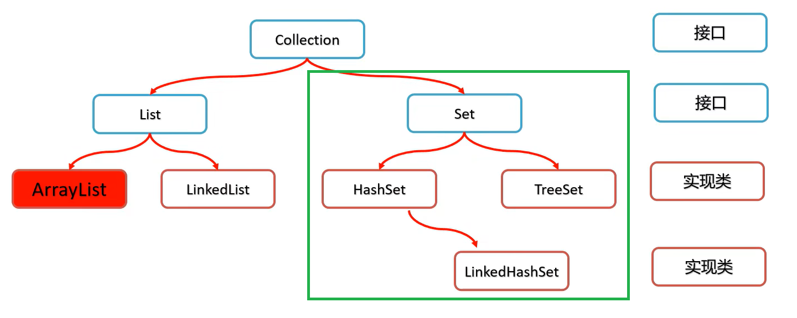

**Set集合特点：**

- 无序：存取顺序不一致
- 不重复：可以去除重复
- 无索引：<green>不能通过索引访问,没有`get(index)`方法</green>，只能通过迭代器遍历

**三种集合实现类特点**
| 实现类类名    | 存储顺序                                           | 重复   | 索引   |
| ------------- | -------------------------------------------------- | ------ | ------ |
| HashSet       | 无序：和输入顺序无关                               | 不重复 | 无索引 |
| LinkedHashSet | **有序：和输入顺序有关**                           | 不重复 | 无索引 |
| TreeSet       | **有序：默认按内容升序排序** <green>可排序</green> | 不重复 | 无索引 |

#### HashSet

**底层原理**

- jdk8之前，**数组**+**链表**(没有最大长度限制)
    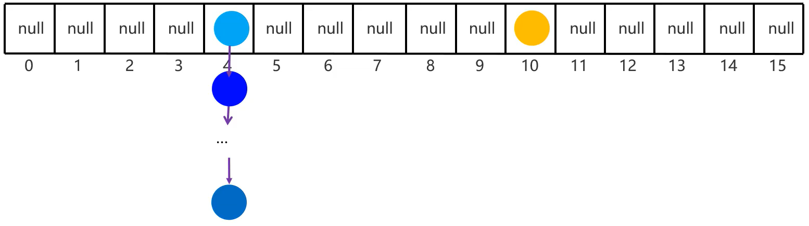
- jdk8开始，**数组**+**链表**(允许最大长度为8)/**红黑树**(根据hash按大小排序)
    
- 数组初始长度为16，名为table，即hash表,
- 元素的在hash表中的存储位置根据hashCode函数计算，
- hash冲突时按链式存储，存储过程会调用equals()判断是否重复
- 数组的加载因子为0.75，即当数组存满到16*0.75=12时，自动扩容，扩容两倍

**哈希值**

- JDK根据对象的**地址**，按某种规则生成的整型数值
- Object类的API：`public int hashCode();`返回对象的hash值，多次调用，值一致

**<warn>注意</warn>**  
若希望Set集合认为2个内容一样的自定义对象是重复的，则

- <warn>必须重写`hashCode()`</warn>
- <warn>必须重写`equals()`</warn>

**HashSet特点测试**

```java
import java.util.HashSet;
import java.util.Set;

public class HelloWorld {
    public static void main(String[] args)  {
        Set set  = new HashSet(); //无序：和输入顺序无关
        set.add("java");
        set.add("java");
        set.add("HTML");
        set.add("js");
        set.add("css");
        set.add("css");
        System.out.println(set);
    }
}
```


**测试将自定义类（`不重写`hashCode、equals）存入hashset，**

- **无法**实现对内容相同的元素去重

```java
import java.util.*;

public class HelloWorld {
    public static void main(String[] args)  {
        Set set  = new HashSet();
        Student student1 = new Student(123,"DYG",21,'男');
        Student student2 = new Student(123,"DYG",21,'男');
        Student student3 = new Student(123,"DYG",21,'男');
        Student student4 = new Student(124,"DYG",21,'男');

        set.add(student1);
        set.add(student2);
        set.add(student3);
        set.add(student4);

        System.out.println(set);
    }
}
class Student{
    int id;
    String name;
    int age;
    char sex;

    public Student(int id, String name, int age, char sex) {
        this.id = id;
        this.name = name;
        this.age = age;
        this.sex = sex;
    }

    @Override
    public String toString() {
        return "\nStudent{" +
                "id=" + id +
                ", name='" + name + '\'' +
                ", age=" + age +
                ", sex=" + sex +
                '}';
    }
}
```


**测试将自定义类（`重写`hashCode、equals）存入hashset，**

- **能够**实现对内容相同的元素去重

```java
import java.util.*;

public class HelloWorld {
    public static void main(String[] args)  {
        Set set  = new HashSet();
        Student student1 = new Student(123,"DYG",21,'男');
        Student student2 = new Student(123,"DYG",21,'男');
        Student student3 = new Student(123,"DYG",21,'男');
        Student student4 = new Student(124,"DYG",21,'男');

        set.add(student1);
        set.add(student2);
        set.add(student3);
        set.add(student4);

        System.out.println(set);
    }
}
class Student{
    int id;
    String name;
    int age;
    char sex;

    public Student(int id, String name, int age, char sex) {
        this.id = id;
        this.name = name;
        this.age = age;
        this.sex = sex;
    }

    @Override
    public String toString() {
        return "\nStudent{" +
                "id=" + id +
                ", name='" + name + '\'' +
                ", age=" + age +
                ", sex=" + sex +
                '}';
    }

    @Override
    public boolean equals(Object o) {
        if (this == o) return true;
        if (o == null || getClass() != o.getClass()) return false;
        Student student = (Student) o;
        return id == student.id && age == student.age && sex == student.sex && Objects.equals(name, student.name);
    }

    @Override
    public int hashCode() {
        return Objects.hash(id, name, age, sex);
    }
}
```


#### LinkedHashSet

**底层原理**

- hash表+链表+双链表
- 使用双链表记录添加和删除的顺序
    

**LinkedHashSet特点测试**

```java
import java.util.LinkedHashSet;
import java.util.Set;

public class HelloWorld {
    public static void main(String[] args)  {
        Set set  = new LinkedHashSet(); //有序：和输入顺序有关
        set.add("java");
        set.add("java");
        set.add("HTML");
        set.add("js");
        set.add("css");
        set.add("css");
        System.out.println(set);
    }
}
```


#### TreeSet

**底层原理**

- 红黑树
- 增删改查性能好

**注意**

- 红黑树默认支持排序
- 对于Integer Double,字符串，默认按升序排序
- <warn>对于自定义数据类型，默认无法排序，必须提供自定义排序规则</warn>
- 默认按升序排序，也可按指定规则排序

**自定义比较规则**

- 方法一：使 **自定义类** 实现Comparable接口

  ```java
    class Student implements Comparable<Student>{
        int id;
        String name;
        int age;
        char sex;
        @Override
        public int compareTo(Student o) {//重写Comparable的compareTo方法
            //return this.id - o.id;
            return Integer.compare(this.id,o.id);//对于集合来说，此处返回0则表示重复，于是便会丢弃该元素
        }
    }
    ```

- 方法二：通过传入**TreeSet()构造器**一个**比较器对象**实现

    ```java
    Set set  = new TreeSet<Student>(new Comparator<Student>() {
        @Override
        public int compare(Student o1, Student o2) {
            return Integer.compare(o1.id,o2.id);
        }
    });

    Set set  = new TreeSet<Student>((o1,o2)->Integer.compare(o1.id, o2.id));

    Set set  = new TreeSet<Student>(Comparator.comparingInt(o -> o.id));
    ```

- <warn>注意</warn>：方法一和方法二同时被实现时，程序优先使用**TreeSet()构造器**得到的**比较器对象**

**TreeSet特点测试**

```java
import java.util.Set;
import java.util.TreeSet;

public class HelloWorld {
    public static void main(String[] args)  {
        Set set  = new TreeSet(); //有序：默认按内容升序排序
        set.add("java");
        set.add("java");
        set.add("HTML");
        set.add("js");
        set.add("css");
        set.add("css");
        System.out.println(set);
    }
}
```


**自定义比较规则方法一测试**

```java
import java.util.*;

public class HelloWorld {
    public static void main(String[] args)  {
        Set set  = new TreeSet();
        Student student1 = new Student(123,"DYG",21,'男');
        Student student2 = new Student(123,"DYG",21,'男');
        Student student3 = new Student(123,"DYG",21,'男');
        Student student4 = new Student(124,"DYG",21,'男');

        set.add(student1);
        set.add(student2);
        set.add(student3);
        set.add(student4);

        System.out.println(set);
    }
}
class Student implements Comparable<Student>{
    int id;
    String name;
    int age;
    char sex;

    public Student(int id, String name, int age, char sex) {
        this.id = id;
        this.name = name;
        this.age = age;
        this.sex = sex;
    }

    @Override
    public String toString() {
        return "\nStudent{" +
                "id=" + id +
                ", name='" + name + '\'' +
                ", age=" + age +
                ", sex=" + sex +
                '}';
    }

    @Override
    public int compareTo(Student o) {
        //return this.id - o.id;
        return Integer.compare(this.id,o.id);
    }
}
```


**自定义比较规则方法二测试**

```java
import java.util.*;

public class HelloWorld {
    public static void main(String[] args)  {
        Set set  = new TreeSet<Student>((o1,o2)->Integer.compare(o1.id, o2.id));
        Student student1 = new Student(123,"DYG",21,'男');
        Student student2 = new Student(123,"DYG",21,'男');
        Student student3 = new Student(123,"DYG",21,'男');
        Student student4 = new Student(124,"DYG",21,'男');

        set.add(student1);
        set.add(student2);
        set.add(student3);
        set.add(student4);

        System.out.println(set);
    }
}
class Student{
    int id;
    String name;
    int age;
    char sex;

    public Student(int id, String name, int age, char sex) {
        this.id = id;
        this.name = name;
        this.age = age;
        this.sex = sex;
    }

    @Override
    public String toString() {
        return "\nStudent{" +
                "id=" + id +
                ", name='" + name + '\'' +
                ", age=" + age +
                ", sex=" + sex +
                '}';
    }
}
```


## 可变参数

**概念**

- 用于接收任意`[0-n]`个函数参数
- 在函数内部，可变参数本质为一个数组

**注意事项**

- 一个函数的形参列表只能有一个可变参数
- 可变参数必须是函数形参列表的最后一个参数

**语法格式**  

```java
修饰符 返回值 函数名(其他形参的数据类型 其他形参的形参名,可变参数的数据类型...可变参数的参数名称){

}
public static void funName(int other,String...strings){

}
```

**测试**

```java
public class HelloWorld {
    public static void main(String[] args)  {
        println();//不传递参数
        println("123");//传入一个
        println("123","1234");//传入两个
        println(new String[]{"123","456","789"});//传入一个字符串数组，携带三个元素
    }
    public static void println(String...strings){//strings本质为一个数组
        for (String item:strings) {
            System.out.print(item);
        }
        System.out.print('\n');
    }
}
```

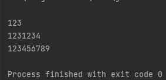

## 集合的工具类：Collections类

**概念**

- 所在位置：java.utils.Collections
- `Collections类`不属于`Collection类`，
- `Collections类`是用来操作`Collection类`的**工具类**

**常用API**
| 函数名                                                                     | 解释                                                       |
| -------------------------------------------------------------------------- | ---------------------------------------------------------- |
| `public static <T> boolean addAll(Collection<? super T> c，T... elements)` | 给Collection集合对象批量添加元素                           |
| `public static void shuffle(List<?> list)`                                 | 打乱List集合顺序。                                         |
| `public static<T> void sort(List<T> list)`                                 | 将List集合中元素(实现了Comparable接口的)按照默认规则排序。 |
| `public static<T> void sort(List<T> list，Comparator<? super T> c)`        | 将List集合中元素按照指定规则排序。                         |

**常用API测试**

```java
import java.util.*;

public class HelloWorld {
    public static void main(String[] args)  {
        List<String> names = new LinkedList<>();
        Collections.addAll(names,"DYG1","DYG22","DYG333","LRH","CYX");
        System.out.println("批量添加元素后："+names);

        Collections.shuffle(names);
        System.out.println("随机打乱后："+names);

        Collections.sort(names);
        System.out.println("按默认规则排序后："+names);

        Collections.sort(names, ((o1, o2) -> o1.length()-o2.length()));
        System.out.println("按自定规则(长度)排序后："+names);
    }
}
```

## 扑克牌洗牌分牌

```java
package com.yiguiding.package1;

import java.util.*;

public class HelloWorld {
    public static void main(String[] args)  {
        ASetOfCards aSetOfCards = new ASetOfCards();
        aSetOfCards.wash();//洗牌
        List Cars = aSetOfCards.getCars();
        Cars.forEach(item->{
            System.out.println(item);
        });
    }
}

enum CARD_TYPE{//扑克牌花色：Spade黑桃♠、Heart红心♥、Diamond方块♦、Club梅花♣,JOKER_minor小王,JOKER_major大王
    Spade("♠",0),Heart("♥",1),Diamond("♦",2),Club("♣",3),JOKER_minor("小王\uD83C\uDCCF",4),JOKER_major("大王\uD83C\uDCCF",5);
    String name;
    int value;
    private CARD_TYPE(String name,int value){
        this.name = name;
        this.value = value;
    }

    public int getValue() {
        return this.value;
    }

    @Override
    public String toString() {
        return  this.name;
    }
}
enum CARD_NUM {//花色
    A("A",12),Two("2",13),Three("3",1),Four("4",2),Five("5",3),Six("6",4),Seven("7",5),Eight("8",6),Nine("9",7),Ten("10",8),J("J",9),Q("Q",10),K("K",11);
    String name;
    int value;
    CARD_NUM(String name,int value){
        this.name = name;
        this.value = value;
    }
    public int getValue(){
        return this.value;
    }
    @Override
    public String toString() {
        return  this.name;
    }
}
class Card implements Comparable<Card>{//一张牌
    CARD_TYPE type;
    CARD_NUM num;
    public Card(CARD_TYPE type, CARD_NUM num) {
        this.type = type;
        this.num = num;
    }
    @Override
    public String toString() {
        if (num!=null){
            return num.toString() + type.toString();
        }else{
            return type.toString();
        }
    }

    @Override
    public int compareTo(Card o) {
        if (this.type!=CARD_TYPE.JOKER_minor && this.type!=CARD_TYPE.JOKER_major &&
                o.type!=CARD_TYPE.JOKER_minor && o.type!=CARD_TYPE.JOKER_major
        ){//不是大小王则根据牌面值排序
            return -Integer.compare(this.num.getValue(),o.num.getValue());
        }else{//是大小王则根据牌类型排序
            return -Integer.compare(this.type.getValue(),o.type.getValue());
        }
    }
}
class ASetOfCards{//一副牌
    List cards;//存放所有牌
    ASetOfCards(){
        cards = new LinkedList();
        for(CARD_TYPE type:CARD_TYPE.values()){
            if (type!=CARD_TYPE.JOKER_minor && type!=CARD_TYPE.JOKER_major){
                for (CARD_NUM num:CARD_NUM.values()){
                    cards.add(new Card(type,num));
                }
            }else{
                cards.add(new Card(type,null));
            }
        }
    }
    void wash(){//洗牌
        Collections.shuffle(cards);
    }
    public List getCars(){

        List result = new LinkedList();

        List player1 = cards.subList(0,17);
        List player2 = cards.subList(17,34);
        List player3 = cards.subList(34,51);
        List player4 = cards.subList(51,54);//地主的三张牌

        Collections.sort(player1);//排序
        Collections.sort(player2);//排序
        Collections.sort(player3);//排序

        Collections.addAll(result,player1,player2,player3,player4);

        return result;
    }

    @Override
    public String toString() {
        return cards.toString();
    }
}
```


## 泛型

**泛型概述**

- 泛型:是JDK5中引入的特性，可以在编译阶段约束操作的数据类型，并进行检查。
- 泛型的格式:<数据类型>;注意:泛型只能支持引用数据类型。
- 集合体系的全部接口和实现类都是支持泛型的使用的。

### 自定义泛型类

**泛型类语法格式**

```java
class 类名<范式类型T>{

}
```

**使用泛型自定义的线性栈的案例**

- 能自动扩容

```java
public class HelloWorld {
    public static void main(String[] args)  {
        myArrayStack<Object> stack = new myArrayStack<Object>();
        stack.push(1);
        stack.push(2);
        stack.push(3);
        stack.push(4);
        stack.push(5);
        stack.push(6);
        stack.push(7);
        stack.push(8);
        stack.push(9);
        stack.push(10);
        stack.push(11);
        stack.push(12);
        stack.push(13);
        System.out.println(stack);
        System.out.println(stack.pop());
        System.out.println(stack.pop());
        System.out.println(stack.pop());
        System.out.println(stack.pop());
        System.out.println(stack.pop());
        System.out.println(stack);
    }
}
class myArrayStack<T>{
    int capacity;
    int position;
    int length;
    T[] stack;
    myArrayStack(){
        capacity=10;
        position=0;
        length = 0;
        stack = (T[]) new Object[capacity];
    }
    void getNewStack(){
        capacity = (int)(capacity*1.5);//1.5倍扩容
        T[] newStack =  (T[]) new Object[capacity];//1.5倍扩容
        for (int i = 0; i < length; i++) {//拷贝
            newStack[i] = stack[i];
        }
        stack = newStack;
    }
    void push(T E){
        if (length!=capacity) {//判断栈满
            length++;
            stack[position++] = E;
        }else{
            getNewStack();//1.5倍扩容,并赋值
            push(E);//重新压入栈
        }
    }
    T pop(){
        if (length!=0){//栈中没有元素了
            length--;
            return stack[--position];
        }
        return null;
    }

    @Override
    public String toString() {
        String result="";
        result+='[';
        for (int i = 0; i < length; i++) {
            result+= i==length-1? stack[i]:(stack[i]+",");
        }
        result+=']';
        return result;
    }
}
```


### 自定义泛型方法

**泛型方法语法格式**

```java
函数修饰符 <范式类型> 返回类型 函数名(形式参数列表){

}
```

**自定义泛型测试**

```java
import java.util.ArrayList;

public class HelloWorld {
    public static void main(String[] args)  {
        ArrayList names = new ArrayList<>();
        names.add("000");
        names.add("111");
        names.add("222");
        names.add("333");
        names.add("444");
        names.add("555");

        System.out.println(toString(names.toArray()));
    }
     public static  <T> String toString(T[] res){
         String result="";
         result+='[';
         for (int i = 0; i < res.length; i++) {
             result+= i==res.length-1? res[i].toString():(res[i]+",");
         }
         result+=']';
         return result;
    }
}
```


### 自定义泛型接口

泛型接口可以让实现类选择当前功能需要操作的数据类型

**泛型接口语法格式**

```java
修饰符 interface 接口名 <范式类型>{

}
```

**使用案例测试**

```java
interface Data<T>{
    void insert(T E);
    void remove(T E);
    void querry(T E);
    void updata(T E);
}

class List implements Data<String>{

    @Override
    public void insert(String E) {
        
    }

    @Override
    public void remove(String E) {

    }

    @Override
    public void querry(String E) {

    }

    @Override
    public void updata(String E) {

    }
}
```

### 泛型通配符

**概念**

- ?表示任意泛型
- ?extends Car表示泛型的上限（祖宗类）
- ?super Car表示泛型的下限（子类）

**应用测试**

案例中，`carGo`的形式参数应当能够允许接收`ArrayList<BWM>`类和`ArrayList<Benz>`类，但是`carGo`的形式参数不能填`ArrayList<Car>`类，因为这三种类型没有任何关系，即`ArrayList<Car>`类，不是`ArrayList<BWM>`类和`ArrayList<Benz>`类的子类。

`carGo`的形式参数也不能填`ArrayList<?>`类,因为这意味着,`ArrayList<Dog>`也能被传入`carGo`，这意味着 动物类 也能够参与 汽车类 的处理函数，所以还应当指定**泛型通配符的上限**，即形参应当写`ArrayList<? extends Car>`

```java
import java.util.ArrayList;

public class HelloWorld {
    public static void main(String[] args)  {
        ArrayList<BWM> bwms = new ArrayList<>();
        bwms.add(new BWM());
        bwms.add(new BWM());
        bwms.add(new BWM());
        carGo(bwms);

        ArrayList<Benz> benzs = new ArrayList<>();
        benzs.add(new Benz());
        benzs.add(new Benz());
        benzs.add(new Benz());
        carGo(benzs);
    }
    public static void carGo(ArrayList<? extends Car> cars){
        cars.forEach(e->{
            e.go();
        });
    }
}
abstract class Car{
    abstract void go();
}
class BWM extends Car{
    @Override
    void go(){
        System.out.println("BWM go......");
    }
}
class Benz extends Car{
    @Override
    void go(){
        System.out.println("Benz go......");
    }
}
abstract class Animal{
    abstract void go();
}
class Dog extends Animal {
    @Override
    void go(){
        System.out.println("Dog go.......");
    }
}
```

## Map集合

### 概念

- Map集合是<green>键值对集合</green>

- Map集合独立于Collection集合
- 两种集合区别
  - `Map{key1:value1,key2:value2,key3:value3}`
  - `Collection{value1,value2,value3}`

**使用场景**

```java
// 购物车内的商品信息
Map{商品id1:商品数量,商品id2:商品数量,商品id3:商品数量}
```

**Map集合体系**

- 
- 重点为
  - HashMap
  - LinkedHashMap
  - TreeMap

### API

**Map集合的共有API**
| 方法名称                            | 说明                                 |
| ----------------------------------- | ------------------------------------ |
| v put(K key,v value)                | 添加元素                             |
| v putAll(K key,v value)             | 添加另一个集合中的所有元素           |
| v get(K key)                        | 获取元素，返回元素value或null        |
| V remove(object key)                | 根据键删除键值对元素                 |
| int size()                          | 集合的长度，也就是集合中键值对的个数 |
| void clear()                        | 移除所有的键值对元素                 |
| boolean isEmpty()                   | 判断集合是否为空                     |
| boolean containsKey(object key)     | 判断集合是否包含指定的键             |
| boolean containsValue(0bject value) | 判断集合是否包含指定的值             |
| `public Set<K> keySet()`            | 获取键的集合（不重复）               |
| `public Collection<V> values()`     | 获取值的集合（重复）                 |

### 特点

**Map集合特点**：

- 由键决定
- 键是无序，不重复，无索引，值不作要求
- 键值可为null

**实现类特点**
| 类名          | 存储顺序           | 重复   | 索引   | 值         | 底层原理                                                                                                               | 特有方法 |
| ------------- | ------------------ | ------ | ------ | ---------- | ---------------------------------------------------------------------------------------------------------------------- | -------- |
| HashMap       | 无序               | 不重复 | 无索引 | 值不做要求 | hash表+链表，（HashSet的底层原理就是这里的HashMap）,依赖**键对象**重写的hashCode()和equals()来判断是否唯一             | 无       |
| LinkedHashMap | **和存入顺序有关** | 不重复 | 无索引 | 值不做要求 | hash表+链表+双链表（LinkedHashSet的底层原理就是这里的LinkedHashMap） |          |
| TreeMap       | **自排序**         | 不重复 | 无索引 | 值不做要求 | 红黑树  需要`继承comparable`并重写的**compareTo**方法 **或** 需在排序时传入一个`Comparator`比较器对象                  |          |

### 遍历

**Map集合的遍历**

- **方法1**:通过`keySet()`获取的**键的集合**,来找**值**
- **方法2**:通过`entrySet()`将Map转Set，再用Set的**Iterator迭代器**遍历
  - 原理是把`Map`中的**一组键值对**转换成一个包含键值的**Entry对象**`Entry{key,value}`,然后把这些对象放到Set集合中，然后通过**Iterator迭代器**遍历这个集合
- **<green>方法3</green>**:直接使用jdk8提供的`forEach((key,value)->{})`方法
  - 根据源码，原理实际上就是对`方法2`进行了封装

**方法1测试**

```java
import java.util.*;

public class HelloWorld {
    public static void main(String[] args)  {
        Map<String,Integer> map = new HashMap<>();
        map.put("java书",1);
        map.put("java书",4);
        map.put("c++",3);
        map.put("html",2);
        map.put("css",1);
        map.put(null,null);

        for(String key:map.keySet()){
            Integer value = map.get(key);
            System.out.println(key + "--->" + value);
        }

        System.out.println("-------------------------------------");

        map.keySet().forEach(key->{
            Integer value = map.get(key);
            System.out.println(key + "--->" + value);
        });
    }
}
```


**方法2测试**

```java
import java.util.*;

public class HelloWorld {
    public static void main(String[] args)  {
        Map<String,Integer> map = new HashMap<>();
        map.put("java书",1);
        map.put("java书",4);
        map.put("c++",3);
        map.put("html",2);
        map.put("css",1);
        map.put(null,null);

// entrySet + Iterator + while
        Set< Map.Entry<String,Integer> > entrys = map.entrySet();//map<key,value> =转换=> entrys<map元素对象{key,value}>
        Iterator<Map.Entry<String,Integer>> iterator = entrys.iterator();//迭代器<map元素对象{key,value}>
        while ( iterator.hasNext() ){
            Map.Entry<String,Integer> item = iterator.next();//获取 map元素对象{key,value}
            String key = item.getKey();
            Integer value = item.getValue();
            System.out.println(key + "--->" + value);
        }

        System.out.println("-------------------------------------");

//entrySet + 增强for
        for(Map.Entry<String,Integer> item : map.entrySet()){//此处是对上述while循环的简化版
            String key = item.getKey();
            Integer value = item.getValue();
            System.out.println(key + "--->" + value);
        }

        System.out.println("-------------------------------------");

//entrySet + forEach
        map.entrySet().forEach(item->{//此处是对上述for循环的简化版
            String key = item.getKey();
            Integer value = item.getValue();
            System.out.println(key + "--->" + value);
        });
    }
}
```


**方法3测试**

```java
import java.util.*;

public class HelloWorld {
    public static void main(String[] args)  {
        Map<String,Integer> map = new HashMap<>();
        map.put("java书",1);
        map.put("java书",4);
        map.put("c++",3);
        map.put("html",2);
        map.put("css",1);
        map.put(null,null);

        map.forEach((key,value)->{
            System.out.println(key + "--->" + value);
        });
    }
}
```


### 案例

**统计班级内80个人选择旅游景点ABCD的情况**

```java
import java.util.*;

public class HelloWorld {
    public static void main(String[] args)  {
        Random rd = new Random();
        String[] select = {"A","B","C","D"};
        StringBuilder selectData = new StringBuilder();
        for (int i = 0; i < 80; i++) {
            selectData.append(select[rd.nextInt(select.length)]);
        }
        System.out.println(selectData);

        Map<Character,Integer> map = new HashMap<>();
        for (int i = 0; i < selectData.length(); i++) {
            char key = selectData.charAt(i);
            map.put(key,map.get(key)==null? 1: map.get(key)+1);
        }
        System.out.println(map);
    }
}
```


### 集合和Map的嵌套

**统计班级内80个人选择旅游景点ABCD的情况**

```java
import java.util.*;

public class HelloWorld {
    public static void main(String[] args)  {
        Map<String,List<Character>> data = new HashMap<>();//数据格式：[{姓名1=['A','B','C']},{姓名2=['A','B','C']},{姓名3=['A','B','C']}]

        List<Character> select1 = new ArrayList<>();//数据格式：['A','B','C']
        Collections.addAll(select1,'A','B','C');
        data.put("人名1",select1);

        List<Character> select2 = new ArrayList<>();//数据格式：['A','B','C']
        Collections.addAll(select2,'A','B');
        data.put("人名2",select2);

        List<Character> select3 = new ArrayList<>();//数据格式：['A','B','C']
        Collections.addAll(select3,'A');
        data.put("人名3",select3);

        System.out.println("投票结果:"+data);

        Map<Character,Integer> result = new HashMap<>();//数据格式：[A=123,B=123,C=123]
        data.forEach((name,select)->{//遍历 投票结果
            select.forEach(selectedItem->{//遍历 选项
                if (result.containsKey(selectedItem)){//统计情况各选项
                    result.put(selectedItem,result.get(selectedItem)+1);
                }else {
                    result.put(selectedItem,1);
                }
            });
        });
        System.out.println("统计结果:"+result);
    }
}
```


## 不可变集合

**概念**

- 不可变集合就是不可以被修改的集合
- 集合的数据项在创建的时候被预先提供，并在整个生命周期不可变，否则报错
- 通过`List、Set、Map的构造器`提供的`of(E...elements)方法`可以创建不可变集合

| 方法名称                                 | 说明                               |
| ---------------------------------------- | ---------------------------------- |
| `static <E> List<E> of(E...elements)`    | 创建一个具有指定元素的List集合对象 |
| `static<E> Set<E> of(E...elements)`      | 创建一个具有指定元素的Set集合对象  |
| `static <K,V> Map<K，V>of(E...elements)` | 创建一个具有指定元素的Map集合对象  |

**List不可变集合创建、初始化、修改测试**

```java
import java.util.*;

public class HelloWorld {
    public static void main(String[] args)  {
        List<Integer> list = List.of(111,222,333,444);
        System.out.println(list);

        list.add(555);//报错
        System.out.println(list);
    }
}
```


**Set不可变集合创建、初始化、修改测试**

```java
import java.util.*;

public class HelloWorld {
    public static void main(String[] args)  {
        Set<Integer> set = Set.of(111,222,333,444);
        System.out.println(set);

        set.add(555);//报错
        System.out.println(set);
    }
}
```


**Map不可变集合创建、初始化、修改测试**

```java
import java.util.*;

public class HelloWorld {
    public static void main(String[] args)  {
        Map<String,Integer> map = Map.of("人名1",18,"人名2",20,"人名3",22,"人名4",14);
        System.out.println(map);

        map.put("人名5",17);//报错
        System.out.println(map);
    }
}
```


## Stream流

### 概念

- 用于简化集合和数组操作的一系列API

- Stream流的三类方法
  - **获取Stream流**:相当于创建一条流水线，并把元素依次放到流水线上
  - **中间方法**：对流水线上的元素进行操作
  - **终极方法**：流水线的最后操作，一个Stream流只能有一个终极方法
- **注意**：在流中无法直接修改原集合、Map、数组中的元素
- **流的收集**：把Stream流操作后的结果收集到集合、Map、数组中

### 获取Stream流

**几种获取Stream流的方式**

- 集合获取Stream流：调用实例对象的`.stream()`方法
- Map获取Stream流：调用实例对象的`.entrySet().stream()`方法
- 数组获取Stream流
    | 名称                                             | 所属类 | 说明                                    |
    | ------------------------------------------------ | ------ | --------------------------------------- |
    | `public static <T> Stream<T> stream(T[ ] array)` | Arrays | 获取当前数组的Stream流                  |
    | `public static<T> Stream<T> of(T... values)`     | Stream | 获取当前**数组**/**可变数据**的Stream流 |

**获取Stream流测试**

```java
import java.util.*;
import java.util.stream.Stream;

public class HelloWorld {
    public static void main(String[] args)  {
        /*----------------------------集合获取Stream流----------------------------*/
        Collection<String> collection_names = new LinkedList<>();
        Collections.addAll(collection_names,"李四","张三","王五","张三丰","张麻子");
        Stream<String>collection_names_stream = collection_names.stream();

        /*----------------------------Map获取Stream流----------------------------*/
        Map<String,Integer> map_names = new HashMap<>();
        map_names.put("李四",22);
        map_names.put("张三",18);
        map_names.put("王五",35);
        map_names.put("张三丰",16);
        map_names.put("张麻子",14);
        map_names.put("李四",15);
        Stream<Map.Entry<String,Integer>> map_names_stream = map_names.entrySet().stream();

        /*----------------------------数组获取Stream流----------------------------*/
        String[] arrary_names = {"李四","张三","王五","张三丰","张麻子"};
        Stream<String> arrary_names_stream1 = Arrays.stream(arrary_names);//利用数组对象的静态方法stream()
        Stream<String> arrary_names_stream2 = Stream.of(arrary_names);////利用Stream对象的静态方法of()
    }
}
```

### Stream的常用中间方法

| 名称                                                | 说明                                                              |
| --------------------------------------------------- | ----------------------------------------------------------------- |
| `Stream<T> filter(Predicate<? super T> predicate)`  | 用于对流中的数据进行**过滤**。                                    |
| `Stream<T> limit( long maxSize)`                   | **获取**前几个元素                                                |
| `Stream<T> skip( long n)`                           | **跳过**前几个元素                                                |
| `Stream<T> distinct()`                              | **去除流中重复**的元素。<green>依赖(hashCode和equals方法)</green> |
| **static**`<T> Stream<T> concat(Stream a,Stream b)` | **合并**a和b两个流为一个流                                        |
| `map()`                                             | <green>加工方法</green>                                           |
| `max(比较器对象)`                                   | 将获取到最大值                                                    |
| `sorted(比较器对象)`                                | 排序                                                              |

**Stream的常用中间方法测试**

```java
import java.util.*;
import java.util.stream.Stream;

public class HelloWorld {
    public static void main(String[] args)  {
        Collection<String> collection_names = new LinkedList<>();
        Collections.addAll(collection_names,"李四","张三","王五","张三丰","张麻子","张麻子");
        System.out.println("/*----------------------------collection_names----------------------------*/");
        System.out.println(collection_names);

        System.out.println("/*----------------------------filter测试----------------------------*/");
        collection_names.stream().filter(name->name.startsWith("张")&&name.length()==3).forEach(name->{
            System.out.println(name);
        });

        System.out.println("/*----------------------------limit测试----------------------------*/");
        collection_names.stream().limit(2).forEach(name->{
            System.out.println(name);
        });

        System.out.println("/*----------------------------skip测试----------------------------*/");
        collection_names.stream().skip(3).forEach(System.out::println);//方法引用

        System.out.println("/*----------------------------distinct测试----------------------------*/");
        collection_names.stream().distinct().forEach(name->{
            System.out.println(name);
        });
        System.out.println("/*----------------------------map测试----------------------------*/");
        collection_names.stream().map(name->{
            return "爱新觉罗 * " + name;
        }).map(name->{
            return new Person(name);
        }).forEach(name->{
            System.out.println(name);
        });

        System.out.println("/*----------------------------static Stream concat测试----------------------------*/");
        Stream.concat(
                collection_names.stream().limit(2),
                collection_names.stream().skip(2)
        ).distinct().forEach(name->{
            System.out.println(name);
        });
    }
}
class Person{
    String name;

    public Person(String name) {
        this.name = name;
    }

    @Override
    public String toString() {
        return "Person{" +
                "name='" + name + '\'' +
                '}';
    }
}
```


### Stream的常用终极方法

| 名称                          | 说明                                 |
| ----------------------------- | ------------------------------------ |
| void forEach(Consumer action) | 对此流的每个元素执行遍历操作         |
| long count()                  | 返回此流中的元素数                   |
| E get()                       | 当前一级使用了max()时这里可以使用get |

### Stream流的收集

**作用**  
把Stream流操作后的结果收集到集合、Map、数组中

**注意**  
<warn>流只能使用一次</warn>

**Stream流的收集方法**
| 名称                             | 说明                         |
| -------------------------------- | ---------------------------- |
| `R collect(collector collector)` | 开始收集Stream流，指定收集器 |
| `Object[] toArray()`             | 转成数组                     |

**Collectors工具类提供了具体的收集方式**
| 名称                                                                       | 说明                   |
| -------------------------------------------------------------------------- | ---------------------- |
| `public static <T> collector toList()`                                     | 把元素收集到List集合中 |
| `public static <T> collector toSet()`                                      | 把元素收集到Set集合中  |
| `public static collector toMap(Function keyMapper , Function valueMapper)` | 把元素收集到Map集合中  |

**具体使用步骤**

```java
import java.util.*;
import java.util.stream.Collectors;
import java.util.stream.Stream;

public class HelloWorld {
    public static void main(String[] args)  {
        List<String> names = new ArrayList<>();
        Collections.addAll(names,"李四","张三","王五","张三丰","张麻子","张麻子");
//将Stream流收集为List集合
        Stream<String> stream1_names_zhang = names.stream().filter(n->n.startsWith("张")&&n.length()==3);
        List<String> list_names_zhang = stream1_names_zhang.collect(Collectors.toList());//转List集合
        System.out.println(list_names_zhang);

//将Stream流收集为Set集合
        Stream<String> stream2_names_zhang = names.stream().filter(n->n.startsWith("张")&&n.length()==3);//流只能使用一次，所以要再创建一次
        Set<String> set_names_zhang = stream2_names_zhang.collect(Collectors.toSet());//转Set集合
        System.out.println(set_names_zhang);

//将Stream流收集为Array数组
        Stream<String> stream3_names_zhang = names.stream().filter(n->n.startsWith("张")&&n.length()==3);
        Object[] arraryName_names_zhang = stream3_names_zhang.toArray();//转Array数组
        System.out.println(Arrays.toString(arraryName_names_zhang));

//将Stream流收集为Map集合
        Map<String,Integer> persons = new HashMap<>();
        persons.put("李四",17);
        persons.put("张三",13);
        persons.put("王五",14);
        persons.put("张三丰",15);
        persons.put("张麻子",17);
        persons.put("张麻子",18);
        Stream<Map.Entry<String,Integer>> stream4_persons_zhang = persons.entrySet().stream().filter(entry->entry.getKey().startsWith("张")&&entry.getKey().length()==3);
        Map<String,Integer> mapPersons_zhang = stream4_persons_zhang.collect( Collectors.toMap(person->person.getKey(),person->person.getValue()) );
        System.out.println(mapPersons_zhang);
    }
}
```

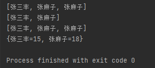

### 案例

**输出姓张且名字长度为3的人名**

```java
import java.util.*;

public class HelloWorld {
    public static void main(String[] args)  {
        Set<String> names = new HashSet();
        Collections.addAll(names,"张三","李四","王五","张三丰","张麻子");
        System.out.println(names);

        System.out.println("------------------------------------");
//使用集合的API获取姓张且名字长度为3的人名
        names.forEach(name->{
            if (name.startsWith("张")&&name.length()==3){
                System.out.println(name);
            }
        });
//stream流式编程：filter支持链式编程
        System.out.println("------------------------------------");
        names.stream().filter(name->name.startsWith("张")).filter(name->name.length()==3).forEach(name->{
            System.out.println(name);
        });

//stream流式编程：filter精简版
        System.out.println("------------------------------------");
        names.stream().filter(name->name.startsWith("张") && name.length()==3).forEach(name->{
            System.out.println(name);
        });
    }
}
```

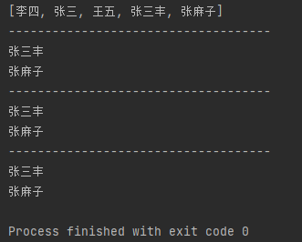

**部门员工工资数据分析**


```java
package com.yiguiding.package1;
import java.math.BigDecimal;
import java.math.RoundingMode;
import java.util.*;
import java.util.stream.Stream;

public class HelloWorld {
    public static void main(String[] args)  {
        List<Employee> department1 = new LinkedList<>();
        department1.add(new Employee("猪八戒",'男',30000,25000,null));
        department1.add(new Employee("孙悟空",'男',25000,1000,"顶撞上司"));
        department1.add(new Employee("沙僧",'男',20000,20000,null));
        department1.add(new Employee("小白龙",'男',20000,25000,null));

        List<Employee> department2 = new LinkedList<>();
        department2.add(new Employee("武松",'男',15000,9000,null));
        department2.add(new Employee("李逵",'男',20000,10000,null));
        department2.add(new Employee("西门庆",'男',50000,100000,"被打"));
        department2.add(new Employee("潘金莲",'女',3500,1000,"被打"));
        department2.add(new Employee("武大郎",'男',20000,0,"下毒"));

//1.分别筛选两部门的最高工资的员工信息
        Employee dep1_max_salary = department1
                .stream()
                .max((o1, o2) -> Double.compare(o1.getSalary()+o1.getBonus(),o2.getSalary()+o2.getBonus()))
                .get();
        System.out.println("部门1最高工资的员工信息："+dep1_max_salary);
        Employee dep2_max_salary = department2
                .stream()
                .max((o1, o2) -> Double.compare(o1.getSalary()+o1.getBonus(),o2.getSalary()+o2.getBonus()))
                .get();
        System.out.println("部门2最高工资的员工信息："+dep2_max_salary);

//2.分别统计两部门的平局工资，要求过滤最高和最低工资
        List<Double> dep1_salarys = new LinkedList();
        double dep1_salary_average = 0;
        department1
                .stream()
                .sorted((o1, o2) -> Double.compare(o1.getSalary()+o1.getBonus(),o2.getSalary()+o2.getBonus()))
                .skip(1)//排序后去除第一个
                .sorted((o1, o2) -> -Double.compare(o1.getSalary()+o1.getBonus(),o2.getSalary()+o2.getBonus()))
                .skip(1)//反排序后去再掉第一个，实现去除最高和最低工资
                .forEach(employee -> {
                    dep1_salarys.add(employee.getBonus()+employee.getSalary());
                });
        for (double salary : dep1_salarys){
            dep1_salary_average+=salary;
        }
        BigDecimal a = BigDecimal.valueOf(dep1_salary_average);
        BigDecimal b = BigDecimal.valueOf(dep1_salarys.size());
        BigDecimal c ;
        if (dep1_salarys.size()!=0)
            c = a.divide(b,2, RoundingMode.HALF_UP);//计算平均值
        else
            c = a;
        System.out.println("部门1的平局工资为："+c);


        List<Double> dep2_salarys = new LinkedList();
        double dep2_salary_average = 0;
        department2
                .stream()
                .sorted((o1, o2) -> Double.compare(o1.getSalary()+o1.getBonus(),o2.getSalary()+o2.getBonus()))
                .skip(1)//排序后去除第一个
                .sorted((o1, o2) -> -Double.compare(o1.getSalary()+o1.getBonus(),o2.getSalary()+o2.getBonus()))
                .skip(1)//反排序后去再掉第一个，实现去除最高和最低工资
                .forEach(employee -> {
                    dep2_salarys.add(employee.getBonus()+employee.getSalary());
                });
        for (double salary : dep2_salarys){
            dep2_salary_average+=salary;
        }
         a = BigDecimal.valueOf(dep2_salary_average);
         b = BigDecimal.valueOf(dep2_salarys.size());
        if (dep2_salarys.size()!=0)
            c = a.divide(b,2, RoundingMode.HALF_UP);//计算平均值
        else
            c = a;
        System.out.println("部门2的平局工资为："+c);

//3.统计两个部门的平均工资，要求过滤最高和最低工资
        List<Double> dep1_2_salarys = new LinkedList();
        double dep1_2_salary_average = 0;
        Stream<Employee> dep1_stream = department1.stream();
        Stream<Employee> dep2_stream = department2.stream();
        Stream.concat(dep1_stream,dep2_stream)
                .sorted((o1, o2) -> Double.compare(o1.getSalary()+o1.getBonus(),o2.getSalary()+o2.getBonus()))
                .skip(1)
                .sorted((o1, o2) -> -Double.compare(o1.getSalary()+o1.getBonus(),o2.getSalary()+o2.getBonus()))
                .skip(1)
                .forEach(employee->{
                    dep1_2_salarys.add(employee.getSalary()+employee.getBonus());
                });
        for (double salary : dep1_2_salarys){
            dep1_2_salary_average+=salary;
        }
        a = BigDecimal.valueOf(dep1_2_salary_average);
        b = BigDecimal.valueOf(dep1_2_salarys.size());
        if (dep1_2_salarys.size()!=0)
            c = a.divide(b,2, RoundingMode.HALF_UP);//计算平均值
        else
            c = a;
        System.out.println("两部门的平局工资为："+c);
    }
}
class Employee{
    String name;
    char sex;
    double salary;
    double bonus;
    String punish;
    public Employee(String name, char sex, double salary, double bonus, String punish) {
        this.name = name;
        this.sex = sex;
        this.salary = salary;
        this.bonus = bonus;
        this.punish = punish;
    }

    public String getName() {
        return name;
    }

    public void setName(String name) {
        this.name = name;
    }

    public char getSex() {
        return sex;
    }

    public void setSex(char sex) {
        this.sex = sex;
    }

    public double getSalary() {
        return salary;
    }

    public void setSalary(double salary) {
        this.salary = salary;
    }

    public double getBonus() {
        return bonus;
    }

    public void setBonus(double bonus) {
        this.bonus = bonus;
    }

    public String getPunish() {
        return punish;
    }

    public void setPunish(String punish) {
        this.punish = punish;
    }

    @Override
    public String toString() {
        return "Employee{" +
                "name='" + name + '\'' +
                ", sex=" + sex +
                ", salary=" + salary +
                ", bonus=" + bonus +
                ", punish='" + punish + '\'' +
                '}';
    }
}
```


## 异常处理

### 概念

- 异常程序在**编译**或**执行阶段**可能出现的问题

- **语法错误不是异常**
- 如：数组索引越界、空指针异常、日期格式化异常......
- **若异常出现但不处理，程序会退出JVM虚拟机**
- 研究异常、避免异常、提前处理异常、保证程序的安全健壮

**异常体系**

- `Throwable`是所有异常的**祖宗类**
- `Error`是**系统级别的异常**，JVM退出等，<green>**程序无法干预控制**</green>
- `Exception`，在java.lang包下，称为异常类，<green>**程序可以干预的异常**</green>
  - `RuntimeExpection及其子类`：<green>**运行时异常**</green>，编译阶段不会报错
  - `是Exception的子类但不是RuntimeExpection的子类的异常`：<green>**编译时异常**</green>，编译期必须处理的异常，否则程序不能通过编译，一般用于提醒程序员这里很容易出错


### 常见异常

**常见运行时异常**

- `ArrayIndexOutOfBoundsException` 数组访问越界异常 `arr[99999]`
- `NullPointerException` 空指针访问异常 `null.getValue()`
- `ClassCastException` 类型转换异常 `String a = (String) (Object) 123;`
- `ArithmeticException` 数学操作异常 `a = 123/0`
- `NumberFormatException` 数学转换异常 `Double.valueOf("abcd123.123")`

**常见编译阶段异常**

```java
String data = "2021-12.25 12:24:11";
SimpleDateFormat sdf = new SimpleDateFormat("yyyy-MM-dd hh:mm:ss");
Date dt = sdf.parse(data);//无论写的对不对，parse会抛出编译时异常
System.out.println(dt);
```

### 默认异常处理机制

**默认编译时异常处理机制**

- **不会自动向外抛出异常**
- 必须手动处理

**默认运行时异常处理机制**

- 在出现异常的地方创建异常对象
- **在这个地方抛出异常返回给调用者，层层抛出，直到抛出给JVM虚拟机**(默认会自动抛出异常)
- 虚拟机输出异常的栈信息
- 直接在异常点结束虚拟机

`try{}cache(){}`的使用

```java
try{
    return;

}cache(Expection e){
    return -1;
}cache(Expection e){
    System.exit(0);//退出jvm虚拟机
    return -1;
}finally{//无论是否有异常（除非jvm虚拟机退出）,即使程序提前return，一定会执行的代码块，用于资源释放
    //这里写return -1，则程序的结果永远是-1
}
```

`try(resource){}cache(){}`的使用

```java
//jdk9语法
try(
    // 资源
    文件流 io = new 文件流;// 无论程序是否出现异常，程序会把此处的定义的资源（实现了[auto]Closeable接口的类）释放掉
    文件流 io = new 文件流;
){
    操作
}cache(Expection e){

}
```

### 处理异常

**对编译时异常的处理**

- 通过`throws`**显式**抛给调用者
- 自己捕获并处理异常`try{}cache(){}`

```java
import java.text.ParseException;
import java.text.SimpleDateFormat;
import java.util.*;

public class HelloWorld {
    public static void main(String[] args)  throws ParseException //需要在这里 `显式` 抛出编译时异常
    {
        String data = "2021-12.25 12:24:11";
        SimpleDateFormat sdf = new SimpleDateFormat("yyyy-MM-dd hh:mm:ss");
        Date dt = sdf.parse(data);//无论写的对不对，parse会抛出编译时异常
        System.out.println(dt);
    }
}
```

**对编译时异常的处理**

- 出现异常直接抛给调用者，调用者也继续向外抛 **(默认自动抛出)**
- 自己捕获并处理异常`try{}cache(){}`
- 结合前两者，**被调者**抛出异常，**调用者**捕获**被调者**抛出的异常并**处理异常**
- **异常处理的案例**

    ```java
    public class HelloWorld {
        public static void main(String[] args)
        {
            try{
                divide(123,0);
            }catch (Exception e){//捕获异常
                e.printStackTrace();//打印栈信息
                System.out.println("捕获了异常");//处理异常
            }
        }
        public static int divide(int a ,int b) //抛出数学异常
        {
            return a/b;
        }
    }
    ```

### 自定义异常

- 自定义编译时异常可以提醒程序员某处容易出错

- 自定义异常可以通过`printStackTrace`打印栈信息，快速定位错误出现在第几行

**自定义编译时异常**

- 定义一个异常类，继承<green>Exception</green>
- 重写构造器
- 在出现异常的地方用`throw new 自定义异常构造器(参数);`抛出异常
- 必须在函数声明处通过`throws 自定义异常名`手动抛出给调用者

```java
public class HelloWorld {
    public static void main(String[] args) throws AgeError{ //编译时异常必须手动处理
    
        checkAge(-100);
    }
    public static void  checkAge(int age) throws AgeError{//编译时异常必须手动处理
        if (age>200||age<0){
            throw new AgeError(age);
        }
        System.out.println("年龄校验成功");
    }
}

class AgeError extends Exception{//继承Exception
    public AgeError() {
    }

    public AgeError(int age) {
        super("年龄： " + age + " 取值范围不合理！！！");
    }
}
```


**自定义运行时异常**

- 定义一个异常类，继承 <green>RuntimeException</green>
- 重写构造器
- 在出现异常的地方用`throw new 自定义异常构造器(参数);`抛出异常
- 无需手动使用`throws 自定义异常名`抛出异常给调用者

```java
public class HelloWorld {
    public static void main(String[] args) //运行时异常将被自动抛出
    {
        checkAge(-100);
    }
    public static void  checkAge(int age){//运行时异常将被自动抛出
        if (age>200||age<0){
            throw new AgeRuntimeError(age);
        }
        System.out.println("年龄校验成功");
    }
}

class AgeRuntimeError extends RuntimeException{//继承运行时异常
    public AgeRuntimeError() {
    }

    public AgeRuntimeError(int age) {
        super("年龄： " + age + " 取值范围不合理！！！");
    }
}
```


### 案例

**通过异常处理使程序更稳健的案例**

```java
import java.util.Scanner;

public class HelloWorld {
    public static void main(String[] args)
    {
        Scanner sc = new Scanner(System.in);
        while (true){
            try {
                System.out.println("请输入一个合理的价格：");
                Double price = Double.valueOf(sc.nextLine());
                if (price<0){
                    System.out.println("价格不能为负数，请重新输入");
                }else {
                    System.out.println("定价成功：价格为："+price);
                    break;
                }
            }catch (Exception e){
                e.printStackTrace();
                System.out.println("请输入合法数据！！！");
            }
        }
    }
}
```


## 日志框架

### 概念

- 系统在开发阶段或者上线后，一旦业务出现问题，需要有信息去定位，如何记录程序的运行信息?

- 日志框架相当于飞机的黑匣子，记录程序中出现的问题

**日志技术具备的优势**

- 可以将系统执行的信息选择性的记录到指定的位置（控制台、文件中、数据库中）。
- 可以随时以开关的形式控制是否记录日志，无需修改源代码。

**日志框架和输出语句相比的具体优势**
| 项目     | 输出语句                       | 日志框架                             |
| -------- | ------------------------------ | ------------------------------------ |
| 输出位置 | 只能是控制台                   | 可以将日志信息写入到文件或者数据库中 |
| 关闭日志 | 需要修改代码，灵活性比较差     | 不需要修改代码，灵活性比较好         |
| 多线程   | 性能较差，会拖累程序的业务逻辑 | 性能较好                             |

### 日志框架体系结构

**日志规范接口:** 一些接口，提供给日志的实现框架设计的标准。

- JUL (Commons Logging)
- slf4j (simple Logging Facade for java)

**日志实现框架:** 牛人或者第三方公司已经做好的日志记录实现代码，后来者直接可以拿去使用。

- Log4j
- JCL (java.util.Logging)
- **Logback**
- 其他实现

**发展历程**

- 接口规范: Commons Logging -> slf4j
- 实现框架: Log4j -> Logback

## Logback日志框架

### 概念

- Logback是由Log4j创始人设计的另一个开源日志框架，性能更好。

- 基于slf4j规范结构

**Logback主要分为三个技术模块**:

- **logback-core**: logback-core模块为其他两个模块奠定了基础，必须有。
- **logback-classic**:它是log4j的一个改良版本，同时它完整实现了 slf4j-API.
- logback-access模块与Tomcat和Jetty 等Servlet容器集成，以提供HTTP访问日志功能

**使用Logback需要的模块**

- **slf4j-api**: 日志规范
- logback-core
- logback-classic

### 使用与配置

- 项目下新建lib文件夹，

- 导入`slf4j-api.jar`、`logback-core.jar`、`logback-classic.jar`三个文件
- 添加到项目依赖库 
- 将Logback的核心配置文件`logback.xml`直接拷贝到src目录下（必须是src)
- 在代码中获取日志的对象

    ```java
    import org.slf4j.Logger;
    import org.slf4j.LoggerFactory;
    public class Main {
        public static final Logger LOGGER = LoggerFactory.getLogger(Main.class);
        public static void main(String[] args) {
            LOGGER.debug("哈哈哈哈");
        }
    }
    ```

- 将`logback.xml`配置文件放到`src`或`合适的目录`

**logback.xml**

```xml
<?xml version="1.0" encoding="UTF-8"?>
<configuration>
    <!--
        CONSOLE ：表示当前的日志信息是可以输出到控制台的。
    -->
    <appender name="CONSOLE" class="ch.qos.logback.core.ConsoleAppender">
        <!--输出流对象 默认 System.out 可改为 System.err-->
        <target>System.out</target>
        <encoder>
            <!--
                格式化输出：
                    %d表示日期，
                    %thread表示线程名，
                    %-5level：级别从左显示5个字符宽度
                    %msg：日志消息，
                    %n是换行符
            -->
            <pattern>%d{yyyy-MM-dd HH:mm:ss.SSS} [%-5level]  %c [%thread] : %msg%n</pattern>
        </encoder>
    </appender>
    <!-- File是输出的方向通向文件的 -->
    <appender name="FILE" class="ch.qos.logback.core.rolling.RollingFileAppender">
        <encoder>
            <pattern>%d{yyyy-MM-dd HH:mm:ss.SSS} [%thread] %-5level %logger{36} - %msg%n</pattern>
            <charset>utf-8</charset>
        </encoder>
        <!--日志输出路径-->
        <file>D:/code/data.log</file>
        <!--指定日志文件拆分和压缩规则-->
        <rollingPolicy
                class="ch.qos.logback.core.rolling.SizeAndTimeBasedRollingPolicy">
            <!--通过指定压缩文件名称，来确定分割文件方式-->
            <fileNamePattern>D:/code/data2-%d{yyyy-MM-dd}.log%i.gz</fileNamePattern>
            <!--文件拆分大小-->
            <maxFileSize>1MB</maxFileSize>
        </rollingPolicy>
    </appender>
    <!--
    level:用来设置打印级别，大小写无关：TRACE, DEBUG, INFO, WARN, ERROR, ALL 和 OFF
   ， 默认debug
    <root>可以包含零个或多个<appender-ref>元素，标识这个输出位置将会被本日志级别控制。
    -->
    <root level="ALL">
        <appender-ref ref="CONSOLE"/>
        <appender-ref ref="FILE" />
    </root>
</configuration>
```

## 电影商城实现

**核心功能**

- 用户注册:商家注册，客户注册
- 用户登录:商家登录，客户登录
- 商家发布，下架，修改，电影票信息
- 客户浏览，下单，支付，电影票
- 客户打分，给已下单的影片打分

<details>
<summary> <strong>源代码</strong> </summary>

```java
import java.math.BigDecimal;
import java.math.MathContext;
import java.math.RoundingMode;
import java.text.SimpleDateFormat;
import java.time.Instant;
import java.util.*;
import java.util.stream.Collectors;
import java.util.stream.Stream;
import org.slf4j.Logger;//日志系统，可以删除
import org.slf4j.LoggerFactory;//日志系统，可以删除

public class Main {

  public static final Logger LOGGER = LoggerFactory.getLogger(Main.class);
  public static final Map<String, List<Movie>> MOVIESINFO_DB = new HashMap<>(); // 电影信息数据库
  public static final Map<String, User> USERS_DB = new HashMap<>(); // 用户信息数据库
  public static final Scanner SCANNER = new Scanner(System.in);
  public static final SimpleDateFormat sdf = new SimpleDateFormat(
    "yyyy-MM-dd HH:mm"
  );

  public static void main(String[] args) {
    USERS_DB.put(
      "123",
      new Business(
        "123",
        "DDYYGG",
        '女',
        "123",
        "110",
        0,
        "好看影视公司",
        "北京新工业园区创业路1号"
      )
    );
    USERS_DB.put(
      "1234",
      new Customer("1234", "DingYigui", '男', "1234", "110", 1000000)
    );
    MOVIESINFO_DB.put("123", new LinkedList<>());

    while (true) {
      try {
        System.out.println(
          "----------------------------重光电影院----------------------------"
        );
        System.out.println("1.登录用户。");
        System.out.println("2.注册用户。");
        System.out.println("0.退出。");
        System.out.println("请输入操作类型：");
        String operator = SCANNER.nextLine();
        switch (operator) {
          case "1":
            login();
            break;
          case "2":
            register();
            break;
          case "0":
            return;
          default:
            printLine();
            System.out.println("未知操作符，请重新输入");
            break;
        }
      } catch (Exception e) {
        printLine();
        System.out.println("操作异常，请重试！！！");
        LOGGER.warn(e.toString());
      }
    }
  }

  public static void register() {
    while (true) {
      System.out.println(
        "----------------------------用户注册----------------------------"
      );
      System.out.println("1.注册商家。");
      System.out.println("2.注册顾客。");
      System.out.println("0.退出。");
      System.out.println("请输入操作类型：");
      String operator = SCANNER.nextLine();
      switch (operator) {
        case "1":
          regUser(true);
          return;
        case "2":
          regUser(false);
          return;
        case "0":
          return;
        default:
          printLine();
          System.out.println("未知操作符，请重新输入。");
          break;
      }
    }
  }

  public static void login() {
    System.out.println(
      "----------------------------登录----------------------------"
    );
    System.out.println("请输入用户名：");
    String userName = SCANNER.nextLine();
    System.out.println("请输入密码：");
    String passwd = SCANNER.nextLine();
    User user = USERS_DB.get(userName);

    printLine();
    if (user != null && user.getPasswd().equals(passwd)) {
      System.out.println("登录成功！！！");
      UserMenu(user);
    } else {
      System.out.println("登录失败...");
    }
  }

  public static void UserMenu(User user) {
    System.out.println(
      "----------------------------欢迎----------------------------"
    );
    System.out.println("欢迎你, " + user.getName() + " ,别来无恙。");
    System.out.println("账户余额：" + user.getMoney() + "元");

    if (user instanceof Customer) {
      customerMenu((Customer) user);
    } else if (user instanceof Business) {
      businessMenu((Business) user);
    }
  }

  public static void businessMenu(Business business) {
    while (true) {
      System.out.println(
        "----------------------------商家菜单页----------------------------"
      );
      System.out.println("1.用户信息。");
      System.out.println("2.上架影片。");
      System.out.println("3.修改影片。");
      System.out.println("4.下架影片。");
      System.out.println("5.影片信息。");
      System.out.println("6.订单信息。");
      System.out.println("0.返回菜单。");
      String operator = SCANNER.nextLine();
      switch (operator) {
        case "1":
          showBusinessInfo(business);
          break;
        case "2":
          addFilm(business);
          break;
        case "3":
          updateFilmInfo(business);
          break;
        case "4":
          delFilm(business);
          break;
        case "5":
          showMoviesInfo(MOVIESINFO_DB.get(business.getUserName()));
          break;
        case "6":
          showOrderInfo(business.getOrders());
          break;
        case "0":
          return;
        default:
          printLine();
          System.out.println("未知操作符，请重新输入。");
          break;
      }
    }
  }

  public static void updateFilmInfo(Movie movie) {
    while (true) {
      System.out.println(
        "----------------------影片信息修改----------------------------"
      );
      System.out.println("1.修改影片名称");
      System.out.println("2.修改主演名称");
      System.out.println("3.修改影片时长");
      System.out.println("4.修改影片票价");
      System.out.println("5.修改影片总票数");
      System.out.println("0.退出");
      System.out.println("请输入要修改的字段：");
      String operator = SCANNER.nextLine();
      switch (operator) {
        case "1":
          movie.setMovieName(Movie.genMovieName(SCANNER));
          break;
        case "2":
          movie.setActors(Movie.genActors(SCANNER));
          break;
        case "3":
          movie.setTimeLong(Movie.genTimeLong(SCANNER));
          break;
        case "4":
          movie.setPrice(Movie.genPrice(SCANNER));
          break;
        case "5":
          movie.setTotalTicket(Movie.genTotalTicket(SCANNER));
          break;
        case "0":
          return;
        default:
          printLine();
          System.out.println("未知操作符，请重新输入。");
          continue;
      }
      printLine();
      System.out.println("修改成功");
    }
  }

  public static void updateFilmInfo(Business business) {
    List<Movie> movies = MOVIESINFO_DB.get(business.getUserName());
    if (movies.size() == 0) {
      printLine();
      System.out.println("没有已上架电影的信息。");
      return;
    }
    showMoviesInfo(movies);
    int index;
    while (true) {
      try {
        printLine();
        System.out.println("请输入要修改的影片的序号：");
        index = Integer.valueOf(SCANNER.nextLine());
        if (0 <= index && index < movies.size()) {
          break;
        }
      } catch (Exception e) {
        printLine();
        System.out.println("异常,请重新输入。");
      }
    }
    Movie movie = movies.get(index);
    printLine();
    if (movie == null) {
      System.out.println("获取影片实例失败。");
    } else {
      System.out.println("获取影片实例成功。");
      updateFilmInfo(movie);
    }
  }

  public static void printLine() {
    System.out.println(
      "-----------------------------操作结果----------------------------------"
    );
  }

  public static void printLineWithTitle(String title) {
    System.out.println(
      "----------------------------" + title + "----------------------------"
    );
  }

  public static void addFilm(Business business) {
    MOVIESINFO_DB
      .get(business.getUserName())
      .add(
        new Movie(
          Movie.genMovieName(SCANNER),
          Movie.genActors(SCANNER),
          Movie.genTimeLong(SCANNER),
          Movie.genPrice(SCANNER),
          Movie.genTotalTicket(SCANNER),
          Movie.genBeOn(SCANNER),
          business.getUserName()
        )
      );
    printLine();
    System.out.println("电影上架成功！");
  }

  public static void delFilm(Business business) {
    List movies = MOVIESINFO_DB.get(business.getUserName());
    if (movies.size() == 0) {
      printLine();
      System.out.println("没有已上架电影的信息。");
      return;
    }
    showMoviesInfo(movies);
    int index;
    while (true) {
      try {
        printLine();
        System.out.println("请输入要下架影片的序号：");
        index = Integer.valueOf(SCANNER.nextLine());
        if (0 <= index && index < movies.size()) {
          break;
        }
      } catch (Exception e) {
        printLine();
        System.out.println("异常,请重新输入。");
      }
    }
    printLine();
    if (movies.remove(index) == null) {
      System.out.println("影片下架失败");
    } else {
      System.out.println("影片下架成功");
    }
  }

  public static void showMoviesInfo(List<Movie> movies) {
    if (movies == null || movies.size() == 0) {
      printLine();
      System.out.println("\t无影片信息");
      return;
    }
    String leftAlignFormat =
      "| %-5s | %-20s | %-20s | %-10s | %-10s | %-10s | %-10s | %-10s | %-15s |%n";
    System.out.format(
      "+-------+----------------------+----------------------+------------+------------+------------+------------+------------+-----------------+%n"
    );
    System.out.format(
      "|  序号  |       影片名称        |          主演         |     评分    |     时长    |    票价    |     余票    |     总票    |       上映       |%n"
    );
    System.out.format(
      "+-------+----------------------+----------------------+------------+------------+------------+------------+------------+-----------------+%n"
    );

    int index = 0;
    for (Movie movie : movies) {
      System.out.format(
        leftAlignFormat,
        index++,
        movie.getMovieName(),
        movie.getActorsToStr(),
        movie.getScore(),
        movie.getTimeLong(),
        movie.getPrice(),
        movie.getRestTicket(),
        movie.getTotalTicket(),
        sdf.format(movie.getBeOn())
      );
    }
    System.out.format(
      "+-------+----------------------+----------------------+------------+------------+------------+------------+------------+-----------------+%n"
    );
  }

  public static void showBusinessInfo(Business business) {
    printLineWithTitle("商家信息");
    System.out.println("用户名：" + business.getUserName());
    System.out.println("账户余额：" + business.getMoney());
    System.out.println("姓名：" + business.getName());
    System.out.println("性别：" + business.getSex());
    System.out.println("手机号：" + business.getTelNum());
    System.out.println("公司名称：" + business.getCompanyName());
    System.out.println("公司地址：" + business.getCompanyAddress());
  }

  public static void showCustomInfo(Customer customer) {
    printLineWithTitle("客户信息");
    System.out.println("用户名：" + customer.getUserName());
    System.out.println("账户余额：" + customer.getMoney());
    System.out.println("姓名：" + customer.getName());
    System.out.println("性别：" + customer.getSex());
    System.out.println("手机号：" + customer.getTelNum());
  }

  public static void showOrderInfo(List<Order> orders) {
    if (orders == null || orders.size() == 0) {
      printLine();
      System.out.println("\t无订单信息");
      return;
    }
    String leftAlignFormat =
      "| %-5s | %-20s | %-20s | %-20s | %-10s | %-10s | %-15s |%n";
    System.out.format(
      "+-------+----------------------+----------------------+----------------------+------------+------------+-----------------+%n"
    );
    System.out.format(
      "|  序号  |        电影名         |       商家用户名       |       客户用户名       |    票价     |    票数    |       订单总额    |%n"
    );
    System.out.format(
      "+-------+----------------------+----------------------+----------------------+------------+------------+-----------------+%n"
    );
    int index = 0;
    for (Order order : orders) {
      System.out.format(
        leftAlignFormat,
        index++,
        order.getMovieName(),
        order.getBusinessUserName(),
        order.getCustomUserName(),
        order.getTicketPrice(),
        order.getTicketNum(),
        order.getTotalPrice()
      );
    }
    System.out.format(
      "+-------+----------------------+----------------------+----------------------+------------+------------+-----------------+%n"
    );
  }

  public static void customerMenu(Customer custom) {
    while (true) {
      System.out.println(
        "----------------------------客户菜单页----------------------------"
      );
      System.out.println("1.用户信息。");
      System.out.println("2.买电影票。");
      System.out.println("3.查看订单。");
      System.out.println("4.影片评分。");
      System.out.println("5.余额充值。");
      System.out.println("0.退出。");
      String operator = SCANNER.nextLine();
      switch (operator) {
        case "1":
          showCustomInfo(custom);
          break;
        case "2":
          buyTicket(custom);
          break;
        case "3":
          showOrderInfo(custom.getOrders());
          break;
        case "4":
          evaluateMovie(custom);
          break;
        case "5":
          addMoney(custom);
          break;
        case "0":
          return;
        default:
          System.out.println("未知操作符，请重新输入。");
          break;
      }
    }
  }

  public static void addMoney(Customer customer) {
    while (true) {
      try {
        System.out.println("请输入充值金额：");
        Double addMoney = Double.valueOf(SCANNER.nextLine());
        if (addMoney < 0) {
          System.out.println("输入金额不能为负数。");
          continue;
        }
        customer.setMoney(customer.getMoney() + addMoney);
        printLine();
        System.out.println("充值成功。");
        System.out.println("当前余额：" + customer.getMoney());
        break;
      } catch (Exception e) {
        System.out.println("异常，请重新输入。");
      }
    }
  }

  public static List<Movie> getMoviesInOrders(List<Order> orders) {
    Stream<Movie> movieStream = orders
      .stream()
      .map(targetOrder -> {
        for (Movie movie : MOVIESINFO_DB.get(
          targetOrder.getBusinessUserName()
        )) {
          if (
            movie.getMovieBirthHash_id() == targetOrder.getMovieId()
          ) return movie;
        }
        return null;
      })
      .filter(movie -> movie != null);
    return movieStream.collect(Collectors.toList());
  }

  public static void evaluateMovie(Movie movie) {
    while (true) {
      try {
        System.out.println(
          "请输入你评分（0.0 - 10.0 ）,低于0分判定为0，高于10分判定为10："
        );
        movie.evaluateScore(Double.valueOf(SCANNER.nextLine()));
        printLine();
        System.out.println("评分成功");
        return;
      } catch (Exception e) {
        System.out.println("非法字符，请重新输入。");
      }
    }
  }

  public static void evaluateMovie(Customer customer) {
    List<Order> customOrders = customer.getOrders();

    if (customOrders.size() == 0) {
      printLine();
      System.out.println("订单为空，无观看影片信息。");
      return;
    }
    List<Movie> moviesInOrders = getMoviesInOrders(customOrders);
    showMoviesInfo(moviesInOrders);

    int index;
    while (true) {
      try {
        printLine();
        System.out.println("请输入要评分的影片的序号：");
        index = Integer.valueOf(SCANNER.nextLine());
        if (0 <= index && index < moviesInOrders.size()) {
          break;
        }
      } catch (Exception e) {
        printLine();
        System.out.println("异常,请重新输入。");
      }
    }
    Movie movie = moviesInOrders.get(index);
    printLine();
    if (movie == null) {
      System.out.println("获取影片实例失败。");
    } else {
      System.out.println("获取影片实例成功。");
      evaluateMovie(movie);
    }
  }

  public static List<Movie> getAllMovies() {
    List<Movie> list_movie = new LinkedList<>();
    MOVIESINFO_DB
      .values()
      .forEach(movies -> {
        list_movie.addAll(movies);
      });
    return list_movie;
  }

  public static void buyTicket(Customer customer) {
    List<Movie> allMovies = getAllMovies();
    while (true) {
      try {
        printLineWithTitle("购票子系统");
        if (allMovies.size() == 0) {
          System.out.println("无法购票");
          return;
        }
        showMoviesInfo(allMovies);

        Movie selectMovie;

        int index;
        while (true) {
          try {
            System.out.println("请输入要购买的影片序号：");
            index = Integer.valueOf(SCANNER.nextLine());
            if (0 <= index && index < allMovies.size()) {
              selectMovie = allMovies.get(index);
              break;
            }
          } catch (Exception e) {
            System.out.println("输入数字不合法，请重试");
          }
        }

        int ticketNum;
        System.out.println("请输入要购买的张数：");
        while (true) {
          ticketNum = Integer.valueOf(SCANNER.nextLine());
          if (0 < ticketNum && index <= selectMovie.getRestTicket()) {
            break;
          }
        }

        // 创建订单
        Order order = new Order(
          customer.getUserName(),
          selectMovie.getPiblisherUserName(),
          selectMovie.getMovieBirthHash_id(),
          selectMovie.getMovieName(),
          ticketNum,
          selectMovie.getPrice()
        );
        printLineWithTitle("订单信息");
        System.out.println("影片名称：" + order.getMovieName());
        System.out.println("票价：" + order.getTicketPrice());
        System.out.println("购票数量：" + order.getTicketNum());
        System.out.println("购票总价：" + order.getTotalPrice());
        System.out.println("购票方用户名：" + order.getCustomUserName());
        System.out.println("账户余额：" + customer.getMoney());

        System.out.println("是否确认订单(y/n)：");
        String operator = SCANNER.nextLine();

        printLine();

        if (operator == "n") {
          System.out.println("订单取消成功");
          break;
        }
        if (customer.getMoney() < order.getTotalPrice()) {
          System.out.println("购票失败,账户余额不足。");
          break;
        }
        if (selectMovie.getRestTicket() < order.getTicketNum()) {
          System.out.println("购票失败,余票不足。");
          break;
        }

        User business = USERS_DB.get(order.getBusinessUserName());
        business.getOrders().add(order);
        business.setMoney(business.getMoney() + order.getTotalPrice());

        customer.getOrders().add(order);
        customer.setMoney(customer.getMoney() - order.getTotalPrice());

        selectMovie.setSaledTicket(
          selectMovie.getSaledTicket() + order.getTicketNum()
        );

        System.out.println("购票成功!");
        break;
      } catch (Exception e) {
        System.out.println("输入字段不合法，请重新输入。");
      }
    }
  }

  public static void regUser(boolean isBusiness) {
    while (true) {
      try {
        if (isBusiness) {
          System.out.println(
            "----------------------------商家注册----------------------------"
          );
        } else {
          System.out.println(
            "----------------------------顾客注册----------------------------"
          );
        }

        String userName = "";
        while (true) {
          System.out.println("请输入用户名:");
          userName = SCANNER.nextLine();
          if (userName.length() < 4) {
            System.out.println("用户名过短,请重新输入！！！");
          } else if (isRegistered(userName)) { // 检查用户名是否已被注册
            System.out.println("用户名已被注册,请重新输入！！！");
          } else {
            break;
          }
        }

        String passwd = "";
        String checkpasswd = "";
        while (true) {
          System.out.println("请输入密码:");
          passwd = SCANNER.nextLine();
          System.out.println("请输入确认密码:");
          checkpasswd = SCANNER.nextLine();
          if (!passwd.equals(checkpasswd)) {
            System.out.println("两次输入密码不一致，请重新输入。");
            continue;
          }
          if (passwd.length() < 6) {
            System.out.println("密码不得小于6位，请重新输入。");
            continue;
          }
          break;
        }

        String name = "";
        while (true) {
          printLine();
          System.out.println("请输入真实姓名:");
          name = SCANNER.nextLine();
          if (name.length() == 0) {
            System.out.println("姓名不得为空，请重新输入.");
          } else {
            break;
          }
        }

        char sex = '男';
        while (true) {
          printLine();
          System.out.println("请输入性别:");
          String sex_str = SCANNER.nextLine();
          if ((sex_str != "男" && sex_str != "女")) {
            System.out.println("性别字段不合法,请重新输入！！！");
          } else {
            sex = sex_str.charAt(0);
            break;
          }
        }

        String telNum = "";
        while (true) {
          printLine();
          System.out.println("请输入手机号:");
          telNum = SCANNER.nextLine();
          if (!telNum.matches("[\\d]{5,15}")) {
            System.out.println("请输入合法手机号。");
          } else {
            break;
          }
        }

        // System.out.println("请输入账户余额:");
        double money = 0;

        if (isBusiness) { // 商家注册
          String companyName = "";
          while (true) {
            printLine();
            System.out.println("请输入公司名称:");
            companyName = SCANNER.nextLine();
            if (companyName.length() == 0) {
              System.out.println("公司名称不能为空，请重新输入。");
            } else {
              break;
            }
          }
          String companyAddress = "";
          while (true) {
            printLine();
            System.out.println("请输入公司地址:");
            companyAddress = SCANNER.nextLine();
            if (companyAddress.length() == 0) {
              System.out.println("公司地址不能为空，请重新输入。");
            } else {
              break;
            }
          }
          USERS_DB.put(
            userName,
            new Business(
              userName,
              name,
              sex,
              passwd,
              telNum,
              money,
              companyName,
              companyAddress
            )
          );
          MOVIESINFO_DB.put(userName, new LinkedList());
        } else { // 顾客注册
          USERS_DB.put(
            userName,
            new Customer(userName, name, sex, passwd, telNum, money)
          );
        }
        printLine();
        System.out.println("注册成功！！！");
        break;
      } catch (Exception e) {
        printLine();
        System.out.println("检测到不合法输入，请重新输入。");
      }
    }
  }

  public static boolean isRegistered(String userName) { // 检测用户名是否已注册
    return USERS_DB.containsKey(userName);
  }
}

class User {

  String userName;
  String passwd;
  String name; // 真实姓名
  char sex;
  String telNum; // 手机号
  double money; // 账户余额
  List<Order> orders = new LinkedList<>();

  public User(
    String userName,
    String name,
    char sex,
    String passwd,
    String telNum,
    double money
  ) {
    this.userName = userName;
    this.name = name;
    this.sex = sex;
    this.passwd = passwd;
    this.telNum = telNum;
    this.money = money;
  }

  @Override
  public boolean equals(Object o) { // 根据用户名判断是否为同一用户
    if (this == o) return true;
    if (o == null || !(o instanceof User)) return false; // o不能为空，o需为User类或其子类
    User user = (User) o;
    return Objects.equals(userName, user.userName);
  }

  @Override
  public int hashCode() { // 根据用户名计算hash
    return Objects.hash(userName);
  }

  public List<Order> getOrders() {
    return orders;
  }

  public String getUserName() {
    return userName;
  }

  public void setUserName(String userName) {
    this.userName = userName;
  }

  public String getName() {
    return name;
  }

  public void setName(String name) {
    this.name = name;
  }

  public char getSex() {
    return sex;
  }

  public void setSex(char sex) {
    this.sex = sex;
  }

  public String getPasswd() {
    return passwd;
  }

  public void setPasswd(String passwd) {
    this.passwd = passwd;
  }

  public String getTelNum() {
    return telNum;
  }

  public void setTelNum(String telNum) {
    this.telNum = telNum;
  }

  public double getMoney() {
    return BigDecimal
      .valueOf(money)
      .setScale(2, RoundingMode.HALF_UP)
      .doubleValue();
  }

  public void setMoney(double money) {
    this.money =
      BigDecimal.valueOf(money).setScale(2, RoundingMode.HALF_UP).doubleValue();
  }
}

class Business extends User {

  String companyName; // 公司名
  String companyAddress; // 公司地址

  Business(
    String userName,
    String name,
    char sex,
    String passwd,
    String telNum,
    double money,
    String companyName,
    String companyAddress
  ) {
    super(userName, name, sex, passwd, telNum, money);
    this.companyName = companyName;
    this.companyAddress = companyAddress;
  }

  public String getCompanyName() {
    return companyName;
  }

  public void setCompanyName(String companyName) {
    this.companyName = companyName;
  }

  public String getCompanyAddress() {
    return companyAddress;
  }

  public void setCompanyAddress(String companyAddress) {
    this.companyAddress = companyAddress;
  }

  @Override
  public String toString() {
    return (
      "Business{" +
      "companyName='" +
      companyName +
      '\'' +
      ", companyAddress='" +
      companyAddress +
      '\'' +
      ", userName='" +
      userName +
      '\'' +
      ", passwd='" +
      passwd +
      '\'' +
      ", name='" +
      name +
      '\'' +
      ", sex=" +
      sex +
      ", telNum='" +
      telNum +
      '\'' +
      ", money=" +
      money +
      '}'
    );
  }
}

class Customer extends User {

  public Customer(
    String userName,
    String name,
    char sex,
    String passwd,
    String telNum,
    double money
  ) {
    super(userName, name, sex, passwd, telNum, money);
  }

  @Override
  public String toString() {
    return (
      "Customer{" +
      "userName='" +
      userName +
      '\'' +
      ", passwd='" +
      passwd +
      '\'' +
      ", name='" +
      name +
      '\'' +
      ", sex=" +
      sex +
      ", telNum='" +
      telNum +
      '\'' +
      ", money=" +
      money +
      '}'
    );
  }
}

class Movie {

  String movieName;
  String[] actors;
  double score = 5.0;
  int timeLong; // 时长
  double price; // 价格
  int totalTicket; // 总票数
  int saledTicket = 0; // 卖出票数
  Date beOn;
  String piblisherUserName; //发布者用户名

  String movieBirthHash;

  {
    movieBirthHash = Integer.toString(Objects.hash(Instant.now().toString()));
  }

  public Movie(
    String movieName,
    String[] actors,
    int timeLong,
    double price,
    int totalTicket,
    Date beOn,
    String piblisherUserName
  ) {
    this.movieName = movieName;
    this.actors = actors;
    this.timeLong = timeLong;
    this.price = price;
    this.totalTicket = totalTicket;
    this.beOn = beOn;
    this.piblisherUserName = piblisherUserName;
  }

  public String getMovieBirthHash_id() {
    return movieBirthHash;
  }

  public int getRestTicket() {
    return totalTicket - saledTicket;
  }

  public String getPiblisherUserName() {
    return piblisherUserName;
  }

  public int getSaledTicket() {
    return saledTicket;
  }

  public void setSaledTicket(int saledTicket) {
    this.saledTicket = saledTicket;
  }

  public Date getBeOn() {
    return beOn;
  }

  public void setBeOn(Date beOn) {
    this.beOn = beOn;
  }

  public String getMovieName() {
    return movieName;
  }

  public void setMovieName(String movieName) {
    this.movieName = movieName;
  }

  public String[] getActors() {
    return actors;
  }

  public String getActorsToStr() {
    StringBuilder sb = new StringBuilder();
    for (String name : actors) {
      sb.append(name);
      sb.append(" ");
    }
    return sb.toString();
  }

  public void setActors(String[] actors) {
    this.actors = actors;
  }

  public double getScore() {
    return BigDecimal
      .valueOf(score)
      .round(new MathContext(3, RoundingMode.HALF_UP))
      .doubleValue();
  }

  public void setScore(double score) {
    this.score = normalizScore(score);
  }

  private double normalizScore(double score) {
    return score >= 10 ? 10 : score <= 0 ? 0 : score;
  }

  public void evaluateScore(double customScore) {
    customScore = normalizScore(customScore);
    double newScore = score + (customScore - score) * 0.001;
    setScore(newScore);
  }

  public int getTimeLong() {
    return timeLong;
  }

  public void setTimeLong(int timeLong) {
    this.timeLong = timeLong;
  }

  public double getPrice() {
    return price;
  }

  public void setPrice(double price) {
    this.price = price;
  }

  public int getTotalTicket() {
    return totalTicket;
  }

  public void setTotalTicket(int totalTicket) {
    this.totalTicket = totalTicket;
  }

  public static String genMovieName(Scanner SCANNER) {
    String movieName;
    while (true) {
      System.out.println("请输入影片名：");
      movieName = SCANNER.nextLine();
      if (movieName.length() == 0) {
        System.out.println("影片名不能为空,请重新输入。");
      } else {
        return movieName;
      }
    }
  }

  public static String[] genActors(Scanner SCANNER) {
    String[] actors;
    while (true) {
      System.out.println("请输入主演名并以空格分隔");
      String names_str = SCANNER.nextLine();
      if (names_str.length() == 0) {
        System.out.println("主演名称不能为空，请重新输入。");
      } else {
        actors = names_str.split("[\\s]");
        return actors;
      }
    }
  }

  public static int genTimeLong(Scanner SCANNER) {
    int timeLong;
    while (true) {
      try {
        System.out.println("请输入电影时长（分钟）:");
        timeLong = Integer.valueOf(SCANNER.nextLine());
        if (timeLong < 0) {
          System.out.println("时长不能为负，请重新输入。");
        } else {
          return timeLong;
        }
      } catch (Exception e) {
        System.out.println("输入数据有误，请重新输入。");
      }
    }
  }

  public static double genPrice(Scanner SCANNER) {
    double price;
    while (true) {
      try {
        System.out.println("请输入电影票价:");
        price = Double.valueOf(SCANNER.nextLine());
        if (price < 0) {
          System.out.println("票价不能为负，请重新输入。");
        } else {
          return price;
        }
      } catch (Exception e) {
        System.out.println("输入数据有误，请重新输入。");
      }
    }
  }

  public static int genTotalTicket(Scanner SCANNER) {
    int totalTicket;
    while (true) {
      try {
        System.out.println("请输入电影票总票数");
        totalTicket = Integer.valueOf(SCANNER.nextLine());
        if (totalTicket <= 0) {
          System.out.println("票数不能为负.不能为0，请重新输入。");
        } else {
          return totalTicket;
        }
      } catch (Exception e) {
        System.out.println("输入数据有误，请重新输入。");
      }
    }
  }

  public static Date genBeOn(Scanner SCANNER) {
    Date beOn;
    while (true) {
      try {
        System.out.println("请输入上映日期（格式：2022-12-15 23:30）：");
        beOn =
          new SimpleDateFormat("yyyy-MM-dd hh:mm").parse(SCANNER.nextLine());
        return beOn;
      } catch (Exception e) {
        System.out.println("输入日期格式有误，请重新输入。");
      }
    }
  }
}

class Order {

  String customUserName;
  String businessUserName;
  String movieId;
  String movieName;
  int ticketNum;
  double ticketPrice;

  public Order(
    String customUserName,
    String businessUserName,
    String movieId,
    String movieName,
    int ticketNum,
    double ticketPrice
  ) {
    this.customUserName = customUserName;
    this.businessUserName = businessUserName;
    this.movieId = movieId;
    this.movieName = movieName;
    this.ticketNum = ticketNum;
    this.ticketPrice = ticketPrice;
  }

  public double getTotalPrice() {
    return BigDecimal
      .valueOf(
        BigDecimal
          .valueOf(ticketPrice)
          .multiply(BigDecimal.valueOf(ticketNum))
          .doubleValue()
      )
      .doubleValue();
  }

  public void setCustomUserName(String customUserName) {
    this.customUserName = customUserName;
  }

  public String getCustomUserName() {
    return customUserName;
  }

  public String getBusinessUserName() {
    return businessUserName;
  }

  public void setBusinessUserName(String businessUserName) {
    this.businessUserName = businessUserName;
  }

  public String getMovieId() {
    return movieId;
  }

  public void setMovieId(String movieId) {
    this.movieId = movieId;
  }

  public String getMovieName() {
    return movieName;
  }

  public void setMovieName(String movieName) {
    this.movieName = movieName;
  }

  public int getTicketNum() {
    return ticketNum;
  }

  public void setTicketNum(int ticketNum) {
    this.ticketNum = ticketNum;
  }

  public double getTicketPrice() {
    return ticketPrice;
  }

  public void setTicketPrice(double ticketPrice) {
    this.ticketPrice = ticketPrice;
  }
}
```

</details>

**使用测试**

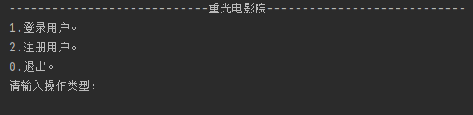


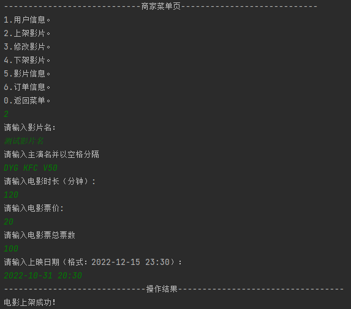

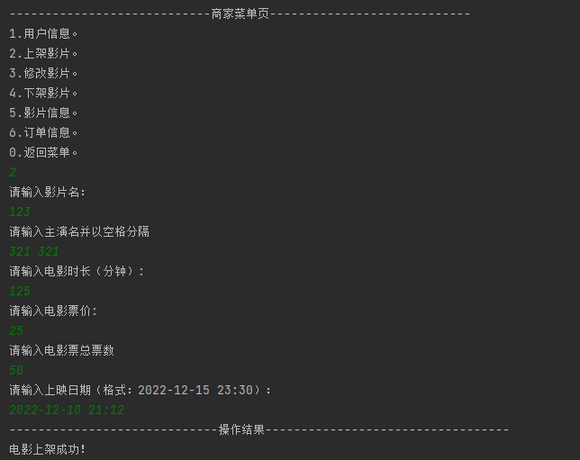


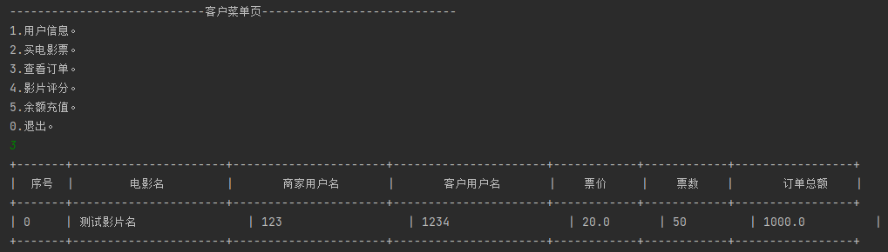


[源代码](./upload/javaDemo_movie.java)

## 字符集编码解码

**String编码**
| 方法名称                            | 说明                                                                    |
| ----------------------------------- | ----------------------------------------------------------------------- |
| byte[] getBytes()                   | 使用平台的默认字符集将该String编码为一系列字节， 将结果存储到新的字节数 | 组中 |
| byte[] getBytes(String charsetName) | 使用指定的字符集将该String编码为一系列字节， 将结果存储到新的字节数组中 |

**String解码**
| String的构造器                                  | 说明                                                       |
| ----------------------------------------------- | ---------------------------------------------------------- |
| String(byte[] bytes)                            | 通过使用平台的默认字符集解码指定的字节数组来构造新的String |
| String String(byte[] bytes, String charsetName) | 通过指定的字符集解码指定的字节数组来构造新的String         |

**编解码测试**

```java
import java.util.Arrays;

public class File_test {
    public static void main(String[] args) throws Exception {
        //编码
        String str = "123abc中文";
        byte[] default_encode_str = str.getBytes();//以平台默认的字符集编码
        byte[] GBK_encode_str = str.getBytes("GBK");//以GBK编码

        System.out.println(default_encode_str.length);// 10
        System.out.println(Arrays.toString(default_encode_str));//[49, 50, 51, 97, 98, 99, -42, -48, -50, -60]
        System.out.println(GBK_encode_str.length);// 10
        System.out.println(Arrays.toString(GBK_encode_str));//[49, 50, 51, 97, 98, 99, -42, -48, -50, -60]

        //解码
        String defString = new String(default_encode_str);//以平台默认的字符集解码
        String gBKString = new String(GBK_encode_str,"GBK");//以GBK解码

        System.out.println(defString);// 123abc中文
        System.out.println(gBKString);// 123abc中文
    }
}
```

## File文件

**概述**

- File类用于根据文件的**绝对路径**或**相对路径**打开文件
- **File类不能读写文件内容**
- **读写文件需要使用IO流**

### 构造器

| 函数名                               | 使用案例                                                 |
| ------------------------------------ | -------------------------------------------------------- |
| File(File parent, String "相对路径") | File(new File("父文件夹路径"), String "相对路径")        |
| File(String pathname)                | `File(".\\images\\123.jpg")`  `File("./images/123.jpg")` |
| File(String parent, String child)    |
| File(URI uri)                        |

**注意**：

- **File可以是文件可以是文件夹**
- **传入的路径可以不存在，可以用exists()判断是否存在**

### 常用方法

| 方法名称                        | 说明                                       |
| ------------------------------- | ------------------------------------------ |
| public boolean isDirectory( )   | 测试此抽象路径名表示的File是否为文件夹     |
| public boolean isFile()         | 测试此抽象路径名表示的File是否为文件       |
| public boolean exists()         | 测试此抽象路径名表示的File是否存在         |
| public String getAbsolutePath() | 返回此抽象路径名的绝对路径名字符串         |
| public String getPath()         | 将此抽象路径名转换为路径名字符串           |
| public String getName()         | 返回由此抽象路径名表示的文件或文件夹的名称 |
| public long lastModified()      | 返回文件最后修改的时间毫秒值               |

**File类创建文件的功能**
| 方法名称                        | 说明                 |
| ------------------------------- | -------------------- |
| public boolean createNewFile( ) | 创建一个新的空的文件 |
| public boolean mkdir( )         | 只能创建一级文件夹   |
| public boolean mkdirs()         | 可以创建多级文件夹   |

**File类删除文件的功能**
| 方法名称                | 说明                                         |
| ----------------------- | -------------------------------------------- |
| public boolean delete() | 删除由此抽象路径名表示的文件或空文件夹(默认) |

**File类的遍历功能**
| 方法名称                        | 说明                                                                                                                                     |
| ------------------------------- | ---------------------------------------------------------------------------------------------------------------------------------------- |
| public String[] list()          | 获取当前目录下所有的"一级文件名称"到一个字符串数组中去返回。                                                                             |
| public File[] listFiles()(常用) | 获取当前目录下所有的"一级文件对象"到一个文件对象数组中去返回(重点,若调用者不存在或者是文件则函数返回null，调用者是空文件夹则返回长度为0) |

**递归遍历查找指定文件夹下的文件名**

```java
public class File_test {
    public static void main(String[] args) {
        searchFireName(new File("./com"),"Student");
    }
    public static void searchFireName(File father,String fileName){
        if(father==null || father.isFile())
            return;
        for (File file : father.listFiles()) {
            if(file.isFile() && file.getName().contains(fileName))
                System.out.println(file.getAbsolutePath());
            if(file.isDirectory())
                searchFireName(file, fileName);
        }
    }
}
```

## 流

流的种类

- 基础IO流
- 缓冲流
- 转换流
- 打印流

### 基础IO流

**IO流的概念**

- I: input,输入，将数据读取到内存
- O: output,输出，将数据写入到磁盘

**IO流分类**

- 按流的方向
  - 输入流
  - 输出流
- 按流的内容
  - 字节流，读写数据，图片，视频，音乐
  - 字符流，读写文本
- 按读写性能
  - 基础流
  - 缓冲流

**IO流体系图**


#### FileInputStream

| 构造器                                  | 说明                               |
| --------------------------------------- | ---------------------------------- |
| public FileInputStream(File file)       | 创建字节输入流管道与源文件对象接通 |
| public FilelnputStream(String pathname) | 创建字节输入流管道与源文件路径接通 |

| 方法名称                       | 说明                                                                       |
| ------------------------------ | -------------------------------------------------------------------------- |
| public int read()              | 每次读取一个字节,返回读取到的字节的值，如果字节已经没有可读的返回-1        |
| public int read(byte[] buffer) | 每次读取一个字节数组，返回读取到的字节的长度，如果字节已经没有可读的返回-1 |

```java
import java.io.File;
import java.io.FileInputStream;
import java.io.InputStream;

public class File_test {
    public static void main(String[] args) throws Exception {
        // 创建输入流
        InputStream inStream = new FileInputStream(new File("./File_test.java"));

        //一次读取1字节
        byte bt;
        while((bt = (byte)inStream.read())!=-1){ // 如果用来读取字符文件，无法避免中文乱码
            System.out.print((char)bt);
        }

        byte[] buffer = new byte[1024];//一次读取1kB     
        int length;
        while((length = inStream.read(buffer))!=-1){// 如果用来读取字符文件，无法避免中文乱码
            System.out.print(new String(buffer,0,length));
        }

        byte[] buffer =inStream.readAllBytes();//一次读取全部（实际调用了 readNBytes(Integer.MAX_VALUE) 只能读取Integer.MAX_VALUE个字节）
        System.out.println(new String(buffer,"UTF-8"));
    }
}
```

#### FileOutputStream

| 构造器                                                   | 说明                                               |
| -------------------------------------------------------- | -------------------------------------------------- |
| public FileOutputStream(File file)                       | 创建字节输出流管道与源文件对象接通                 |
| public FileOutputStream(File file, boolean append)       | 创建字节输出流管道与源文件对象接通，可**追加**数据 |
| public FileOutputStream(String filepath)                 | 创建字节输出流管道与源文件路径接通                 |
| public FileOutputStream(String filepath, boolean append) | 创建字节输出流管道与源文件路径接通，可**追加**数据 |

| 方法名称                                            | 说明                         |
| --------------------------------------------------- | ---------------------------- |
| public void write(int a)                            | 写一个字节出去               |
| public void write(byte[] buffer)                    | 写一个字节数组出去           |
| public void write(byte[] buffer ，int pos，int len) | 写一个字节数组的一部分出去。 |
| flush()                                             | 写入                         |
| close()                                             | 关闭                         |

**构造器、方法测试**

```java
import java.io.File;
import java.io.FileOutputStream;
import java.io.OutputStream;

public class Main {
    public static void main(String[] args) throws Exception {
        // 创建输入流
        OutputStream os = new FileOutputStream(new File("./123.java"));
        os.write('a');
        os.write('b');
        os.write('c');
        os.write("中文字符串".getBytes("UTF-8"));//写入 byte[] :  "中文字符串"
        os.write("\r\n".getBytes());//换行
        os.write("中文字符串".getBytes("UTF-8"),3,6);//写入 byte[] 的部分 : "文字"
        os.flush();//写入
        os.close();//关闭流（包含flush）
    }
}
```

**文件拷贝**

```java
import java.io.File;
import java.io.FileInputStream;
import java.io.FileOutputStream;
import java.io.InputStream;
import java.io.OutputStream;

public class Main {
    public static void main(String[] args) throws Exception {
        OutputStream os = new FileOutputStream(new File("./123.java"));//文件输出流
        InputStream is = new FileInputStream(new File("./Main.java"));//文件输出流

        byte[] buffer = new byte[1024];
        int length = 0 ;//用于记录每次读取的字节长度
        while((length = is.read(buffer))!=-1){
            os.write(buffer,0,length);
        }
        os.close();
        is.close();
    }
}
```

#### FileReader

| 构造器                             | 说明                               |
| ---------------------------------- | ---------------------------------- |
| public FileReader(File file)       | 创建字符输入流管道与源文件对象接通 |
| public FileReader(String pathname) | 创建字符输入流管道与源文件路径接通 |

| 方法名称                      | 说明                                                                   |
| ----------------------------- | ---------------------------------------------------------------------- |
| public int read()             | 每次读取一个字符返回，如果字符已经没有可读的返回-1                     |
| public int read(char[ buffer) | 每次读取一个字符数组，返回读取的字符个数，如果字符已经没有可读的返回-1 |

**测试**

```java
import java.io.FileReader;
import java.io.Reader;

public class Main {
    public static void main(String[] args) throws Exception {
        Reader  read = new FileReader("./Main.java");
        int ch;
        while((ch=read.read())!=-1){
            System.out.print((char)ch);//一次获取一个字符，无论其实际在文件中到底占几个字节
        }
        read.close();
    }
}
```

#### FileWriter

| 构造器                             | 说明                               |
| public FileWriter(String filepath, boolean append) | 道与源文件路径接通，可追加数据 |

| 方法名称                                  | 说明                 |
| ----------------------------------------- | -------------------- |
| void write(int c)                         | 写一个字符           |
| void write(char[] cbuf)                   | 写入一个字符数组     |
| void write(char[] cbuf, int off, int len) | 写入字符数组的一部分 |
| void write(String str)                    | 写一个字符串         |
| void write("\r\n")                        | 写一个字符           |
| void write(String str, int off, int len)  | 写一个字符串的一部分 |
| void write(int c)                         | 写一个字符           |
| flush()                                   | 写入                 |
| close()                                   | 关闭                 |

### 缓冲IO流

- 缓冲流也称高效流，高级流

- 缓冲流就是将基础流包装了一层
- 缓冲流**自带缓冲区（长度8192，8kB,2000H），可以提高原始字节流、字符流读写数据的性能**

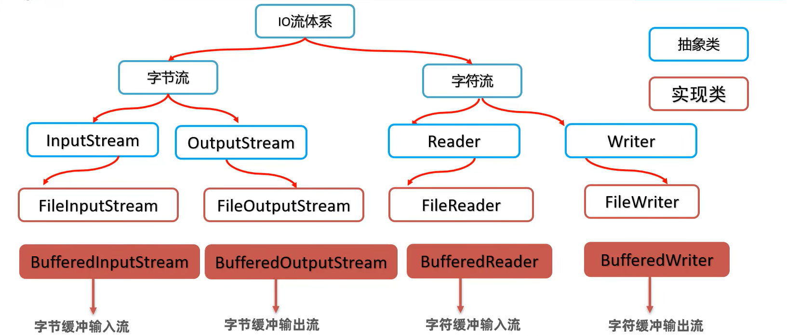

#### 缓冲文件流 BufferedOutputStream BufferedInputStream

**复制文件**

```java
import java.io.BufferedInputStream;
import java.io.BufferedOutputStream;
import java.io.File;
import java.io.FileInputStream;
import java.io.FileOutputStream;
import java.io.InputStream;
import java.io.OutputStream;

public class Main {
    public static void main(String[] args) throws Exception {
        OutputStream os = new FileOutputStream(new File("./123.java"));//文件输出流
        InputStream is = new FileInputStream(new File("./Main.java"));//文件输出流

        OutputStream fuffered_os = new BufferedOutputStream(os);//文件输出流
        InputStream buffered_is = new BufferedInputStream(is);//文件输出流

        byte[] buffer = new byte[1024];
        int length = 0 ;//用于记录每次读取的字节长度
        while((length = buffered_is.read(buffer))!=-1){
            fuffered_os.write(buffer,0,length);
        }
        fuffered_os.close();
        buffered_is.close();
    }
}
```

#### 缓冲字符流 BufferedReader BufferedWriter

**BufferedReader**
| BufferedReader构造器           | 说明                                                                                       |
| ------------------------------ | ------------------------------------------------------------------------------------------ |
| public String BufferedReader() | 可以把低级的字符读取流包装成-一个高级的缓 冲字符读取流管道，从而提高字符读取流写数据的性能 |

| BufferedReader方法         | 说明                  |
| -------------------------- | --------------------- |
| `public String readLine()` | Reads a line of text. |

**BufferedWriter**
| BufferedWriter构造器            | 说明                                                                                       |
| ------------------------------- | ------------------------------------------------------------------------------------------ |
| public BufferedWriter(Writer w) | 可以把低级的字符输出流包装成-一个高级的缓 冲字符输出流管道，从而提高字符输出流写数据的性能 |

| BufferedWriter方法      | 说明     |
| ----------------------- | -------- |
| `public void newline()` | 换行操作 |

**测试**

```java
import java.io.BufferedReader;
import java.io.FileReader;
import java.io.Reader;

public class Main {
    public static void main(String[] args) throws Exception {
        Reader  read = new FileReader("./Main.java",java.nio.charset.Charset.forName("UTF-8"));
        Reader  read_bf = new BufferedReader(read);

        char[] buffer = new char[1024];
        int length = 0 ;//用于记录每次读取的字节长度
        while((length = read_bf.read(buffer))!=-1){
            System.out.println(String.copyValueOf(buffer, 0, length));
        }
        read_bf.close();
    }
}
```

**独有方法测试**

```java
import java.io.BufferedReader;
import java.io.FileReader;
import java.io.Reader;

public class Main {
    public static void main(String[] args) throws Exception {
        Reader  read = new FileReader("./Main.java",java.nio.charset.Charset.forName("UTF-8"));
        BufferedReader  read_bf = new BufferedReader(read);

        String line;
        while((line = read_bf.readLine())!=null){// 独有方法，读取一行
            System.out.println(line);
        }
        read_bf.close();
    }
}
```

#### 字符输入/输出转换流


| 构造器                                                     | 说明                                                                                   |
| ---------------------------------------------------------- | -------------------------------------------------------------------------------------- |
| public InputStreamReader(InputStream is)                   | 可以把原始的字节流按照代码默认编码转换成字符输入流。几乎不用，与默认的FileReader一样。 |
| `public InputStreamReader(InputStream is，String charset)` | 可以把原始的字节流**按照指定编码转换成字符输入流**，这样字符流中的字符就不乱码了(重点) |

| 构造器                                                       | 说明                                                               |
| ------------------------------------------------------------ | ------------------------------------------------------------------ |
| public OutputStreamWriter(OutputStream os)                   | 可以把原始的字节输出流按照代码默认编码转换成字符输出流。几乎不用。 |
| `public OutputStreamWriter(OutputStream os, String charset)` | 可以把原始的字节输出流**按照指定编码转换成字符输出流**(重点)       |

**综合案例：用指定编码读写文件**

```java
import java.io.BufferedInputStream;
import java.io.BufferedOutputStream;
import java.io.FileInputStream;
import java.io.FileOutputStream;
import java.io.InputStreamReader;
import java.io.OutputStreamWriter;
import java.io.Reader;
import java.io.Writer;

public class Main {
    public static void main(String[] args) throws Exception {
        // 用UTF-8编码读取并解析文件
        // 用GBK编码写入文件
        Reader file1 = new InputStreamReader(new BufferedInputStream(new FileInputStream("./Main.java")),"UTF-8");
        Writer file2 = new OutputStreamWriter(new BufferedOutputStream(new FileOutputStream("./123.txt")),"GBK");

        char[] buffer = new char[1024];
        int length = 0;
        while((length = file1.read(buffer)) != -1){
            file2.write(buffer, 0, length);
        }

        file1.close();
        file2.close();
    }
}
```

### 对象序列化(对象字节输出流)

- 简单来说，就是把java中的通过关键字 `new` 创建的对象保存到硬盘上。

- 作用:以内存为基准，把内存中的对象存储到磁盘文件中去,称为对象序列化。
- 使用到的流是对象字节输出流: ObjectOutputStream
- <green> 把一个对象写入到文件中，该对象必须实现了序列化接口`Serializable` </green>
  - 其中实现类中`static final long serialVersionUID`用于指定在反序列化是的版本标记

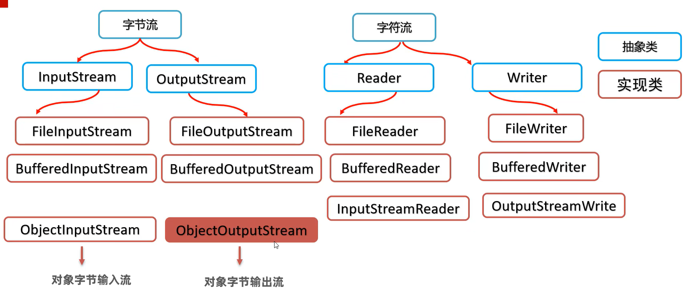

**测试**

```java
import java.io.BufferedInputStream;
import java.io.BufferedOutputStream;
import java.io.FileInputStream;
import java.io.FileOutputStream;
import java.io.InputStream;
import java.io.ObjectInputStream;
import java.io.ObjectOutputStream;
import java.util.LinkedList;

public class Main {
    public static void main(String[] args) throws Exception {
        // 创建一个java对象，写入到文件
        ObjectOutputStream file1 = new ObjectOutputStream(new BufferedOutputStream(new FileOutputStream("./123.temp")));
        file1.writeObject(new LinkedList<>());;
        file1.close();

        //从文件读取写入的java对象
        ObjectInputStream  file2 = new ObjectInputStream(new BufferedInputStream(new FileInputStream("./123.temp")));
        LinkedList  list =  (LinkedList)file2.readObject();
        file2.close();

        System.out.println(list.size());
    }
}
```

### 打印流

打印流

- 作用:打印流可以实现方便、高效的打印数据到文件中去。打印流一般是指: PrintStream, PrintWriter两个类。
- 可以实现打印什么数据就是什么数据，例如打印整数97写出去就是97,打印boolean的true，写出去就是true。


**`PrintStream`和`PrintWriter`的区别**

- 打印数据功能上是一模一样的，都是使用方便，性能高效(核心优势)
- PrintStream继承自字节输出流OutputStream, 支持写**字节数据**的方法。
- PrintWriter继承自字符输出流Writer, 支持写**字符数据**出去。

**PrintStream**
| 构造器                                     | 说明                                 |
| ------------------------------------------ | ------------------------------------ |
| public PrintStream( OutputStream os)       | 打印流直接通向字节输出流管道         |
| public PrintStream(File f)                 | 打印流直接通向文件对象               |
| public PrintStream(File f,Charset charset) | 打印流直接通向文件对象(以指定字符集) |
| public PrintStream(String filepath)        | 打印流直接通向文件路径               |
  
| 方法                      | 说明                   |
| ------------------------- | ---------------------- |
| public void print(Xxx xx) | 打印任意类型的数据出去 |

**PrintWriter**
| 构造器                               | 说明                         |
| ------------------------------------ | ---------------------------- |
| public PrintWriter(OutputStream os ) | 打印流直接通向字节输出流管道 |
| public PrintWriter (Writer w)        | 打印流直接通向字符输出流管道 |
| public PrintWriter (File f)          | 打印流直接通向文件对象       |
| public PrintWriter (String filepath) | 打印流直接通向文件路径       |

| 方法                      | 说明                   |
| ------------------------- | ---------------------- |
| public void print(Xxx xX) | 打印任意类型的数据出去 |

**两种打印流的使用**

```java
import java.io.File;
import java.io.PrintStream;
import java.io.PrintWriter;
import java.nio.charset.Charset;

public class Main {
    public static void main(String[] args) throws Exception {
        PrintStream pStream = new PrintStream(new File("./123.txt"),Charset.forName("GBK"));
        pStream.print(123);
        pStream.print(123.123);
        pStream.print(true);
        pStream.print("1231212312312中文");
        pStream.print(new Object());
        pStream.write("1231221312332".getBytes());      //打印字节流的write只能写字节
        pStream.close();

        PrintWriter pWriter = new PrintWriter(new File("./123.txt"),Charset.forName("GBK"));
        pWriter.print(123);
        pWriter.print(123.123);
        pWriter.print(true);
        pWriter.print("1231212312312中文");
        pWriter.print(new Object());
        pWriter.write("1231221312332");         //打印字符流的write能写字节也能写字符
        pWriter.close();
    }
}
```

**重定向控制台输出到打印流**

```java
import java.io.File;
import java.io.PrintStream;
import java.nio.charset.Charset;

public class Main {
    public static void main(String[] args) throws Exception {
        PrintStream pStream = new PrintStream(new File("./123.txt"),Charset.forName("GBK"));
        System.setOut(pStream);//重定向控制台输出到打印流

        System.out.println("12312123");
    }
}
```

### Properties属性集对象

**作用**

- **Properties本质为一个Map集合，但其实际常用于配置文件的读取、写入操作**
- Properties对象表示一个属性文件
- 用于存储对象中的键值对信息到一个属性文件中
- 属性文件：后缀为`.properties` 内容为`key=value`,用于做系统配置

| 方法                                                | 说明                                                                                                |
| --------------------------------------------------- | --------------------------------------------------------------------------------------------------- |
| void load(InputStream inStream)                     | 从输入字节流读取属性列表(键和元素对)                                                                |
| **void load(Reader reader)**                        | 从输入字符流读取属性列表(键和元素对)、                                                              |
| void store(OutputStream out, String comments)       | 将此属性列表(键和元素对)写入此Properties表中，以适合于使用load(InputStream)方法的格式写入输出字节流 |
| **void store(Writer writer, String comments )**     | 将此属性列表(键和元素对)写入此Properties表中，以适合使用load(Reader)方法的格式写入输出字符流        |
| public object setProperty(String key, String value) | 保存键值对(put)                                                                                     |
| public String getProperty(String key)               | 使用此属性列表中指定的键搜索属性值(get)                                                             |
| `public Set<String> stringPropertyNames()`          | 所有键的名称的集合(keySet())                                                                        |

使用测试

```java
import java.io.BufferedWriter;
import java.io.FileInputStream;
import java.io.FileReader;
import java.io.FileWriter;
import java.io.OutputStreamWriter;
import java.nio.charset.Charset;
import java.util.*;

public class Main {
    public static void main(String[] args) throws Exception {
        // 创建
        Properties properties = new Properties();
        System.out.println(properties);

        //写入
        properties.setProperty("用户名", "admin");
        properties.setProperty("密码", "admin");
        properties.store(new FileWriter("./123.properties",Charset.forName("UTF-8")), "注释");

        //加载
        properties.load(new FileReader("./123.properties",Charset.forName("UTF-8")));
        System.out.println(properties);
        System.out.println(properties.getProperty("用户名"));
    }
}
```

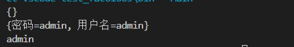

### IO框架：commons-io

**概述**

- commons-io是apache开源基金组织提供的一组有关I0操作的类库，可以提高I0功能开发的效率。
- commons-io工具包提供了很多有关io操作的类。有两个主要的类 `FileUtils` , `lOUtils`
-

FileUtils主要方法:
| 方法名                                                   | 说明                         |
| -------------------------------------------------------- | ---------------------------- |
| String readFileToString(File file, String encoding)      | 读取文件中的数据，返回字符串 |
| void copyFile(File srcFile, File destFile)               | 复制文件。                   |
| void copyDirectoryToDirectory(File srcDir, File destDir) | 复制文件夹。                 |

**测试**

```java
import java.io.File;
import java.util.*;

import org.apache.commons.io.FileUtils;

public class Main {
    public static void main(String[] args) throws Exception {
        //读取文件内容
        String str = FileUtils.readFileToString(new File("./123.txt"), "UTF-8");
        System.out.println(str);
    }
}
```

## 中文进制转十进制

<details>
<summary> <strong> 源代码 </strong> </summary>

```java
import java.io.BufferedReader;
import java.io.FileReader;
import java.io.Reader;
import java.util.HashMap;
import java.util.Map;

public class Main {
    public static void main(String[] args) throws Exception {
        String str = "一千万零四十五";
        System.out.println(str);
        System.out.println(HanToNum(str));
    }

    public static final Map<Character,Integer> HanNum_charset = new HashMap();
    static{
        HanNum_charset.put('零',0);
        HanNum_charset.put('一',1);
        HanNum_charset.put('二',2);
        HanNum_charset.put('三',3);
        HanNum_charset.put('四',4);
        HanNum_charset.put('五',5);
        HanNum_charset.put('六',6);
        HanNum_charset.put('七',7);
        HanNum_charset.put('八',8);
        HanNum_charset.put('九',9);
        HanNum_charset.put('十',10);

        HanNum_charset.put('壹',1);
        HanNum_charset.put('贰',2);
        HanNum_charset.put('叁',3);
        HanNum_charset.put('肆',4);
        HanNum_charset.put('伍',5);
        HanNum_charset.put('陆',6);
        HanNum_charset.put('柒',7);
        HanNum_charset.put('捌',8);
        HanNum_charset.put('玖',9);
        HanNum_charset.put('拾',10);
    }
    public static final Map<Character,Integer> HanNum_unit = new HashMap();
    static{
        HanNum_unit.put('十',10);
        HanNum_unit.put('拾',10);

        HanNum_unit.put('百',100);
        HanNum_unit.put('佰',100);
        HanNum_unit.put('陌',100);

        HanNum_unit.put('千',1000);
        HanNum_unit.put('仟',1000);
        HanNum_unit.put('阡',1000);

        HanNum_unit.put('万',10000);
        HanNum_unit.put('亿',100000000);
    }
    public static int HanToNum(String Han_num){// 一千五百 零 四 万亿 零 五千 零 八百
        int result = 0 ;
        int stackNum = 0;
        for (int i = 0; i < Han_num.length(); i++) {
            char ch = Han_num.charAt(i);
            Integer value =  HanNum_charset.get(ch);
            Integer unit =  HanNum_unit.get(ch);

            if(unit!=null && unit==10 && stackNum==0){
                stackNum = 10;
                continue;
            }
            if(unit!=null && unit==10 && stackNum!=0){
                stackNum *= 10;
                continue;
            }

            if(unit!=null && value!=null && value==0){
                result+=value;
                value=0;
                continue;
            }

            if(value!=null){
                stackNum+=value;
                continue;
            }
            if(unit!=null){
                stackNum*=unit;
                continue;
            }
            
        }
        result+=stackNum;
        return result;
    }
}
```

</details>

**实现效果**


## 多线程

| 方式             | 优点                                                                 | 缺点                                                             |
| ---------------- | -------------------------------------------------------------------- | ---------------------------------------------------------------- |
| 继承Thread类     | 编程比较简单，可以直接使用Thread                                     | 扩展性较差，不能再继承其他的类，不能返回类中的方法线程执行的结果 |
| 实现Runnable接口 | 扩展性强，实现该接口的同时还可以继承其他的类。                       | 编程相对复杂，不能返回线程执行的结果                             |
| 实现Callable接口 | 扩展性强，实现该接口的同时还可以继承其他的类。可以得到线程执行的结果 | 编程相对复杂                                                     |

### 方法1: **继承**`Thread类`

- 步骤
  - **继承**`Thread类`
  - 重写`run()方法`
  - 创建`实例对象`
  - 调用`start()类`,内部会创建线程，并在线程中调用重写的`run()方法`

- 缺点：由于一个类只能继承一个父类，无法继承其他类，不利于扩展

```java
import java.util.*;

public class Main {
    public static void main(String[] args) throws Exception {
        Thread myThread1 = new MyThread();
        myThread1.start();

        for (int i = 0; i < 10; i++) {
            System.out.println("\t主线程输出："+i);
        }
    }
}
class MyThread extends Thread{

    @Override
    public void run() {
        for (int i = 0; i < 10; i++) {
            System.out.println("子线程输出："+i);
        }
    }
}
```


### **方法2**：**实现**`Runnable接口`

- 步骤
  - **实现**`Runnable接口`
  - **实现**`run()方法`
  - 创建实例对象，丢给Thread的构造函数
  - 调用`start()方法`

- 优点，**可以继承其他类**
- 缺点，**线程的执行结果不能直接返回**

**写法一：实现`Runnable接口`**

```java
import java.util.*;

public class Main {
    public static void main(String[] args) throws Exception {
        Thread myThread1 = new Thread(new MyThread());
        myThread1.start();

        for (int i = 0; i < 10; i++) {
            System.out.println("\t主线程输出："+i);
        }
    }
}
class MyThread implements Runnable{

    @Override
    public void run() {
        for (int i = 0; i < 10; i++) {
            System.out.println("子线程输出："+i);
        }
    }
}
```

**写法二：匿名类**

```java
import java.util.*;

public class Main {
    public static void main(String[] args) throws Exception {
        
        Thread myThread1 = new Thread(new Runnable() {
            @Override
            public void run() {
                for (int i = 0; i < 10; i++) {
                    System.out.println("子线程输出："+i);
                }
            }
        }
        );

        myThread1.start();

        for (int i = 0; i < 10; i++) {
            System.out.println("\t主线程输出："+i);
        }
    }
}
```

**写法三：Lambda表达式写法**

```java
import java.util.*;

public class Main {
    public static void main(String[] args) throws Exception {
        
        Thread myThread1 = new Thread(()->{
            for (int i = 0; i < 10; i++) {
                System.out.println("子线程输出："+i);
            }
        });

        myThread1.start();

        for (int i = 0; i < 10; i++) {
            System.out.println("\t主线程输出："+i);
        }
    }
}
```

***写法四：最简写法**

```java
new Thread(()->{
    for (int i = 0; i < 10; i++) {
        System.out.println("子线程输出："+i);
    }
}).start();
```

### 方法3：实现`Callable接口`

- 步骤
  - 实现`Callable接口`
  - 重写`call()方法`
  - 用FutrueTask把Callable对象封装成**线程任务对象**
  - 把**线程任务对象**丢给`Thread的构造器`
  - 调用`Thread`的`start方法`
  - 主线程中调用`FutureTask`的`get方法`等待并获取`call方法`的**返回结果**
- 优点
  - 可继承一个实现类
  - 可获取方法的返回值
- **FutureTask**方法
    | 方法名称                           | 说明                                 |
    | ---------------------------------- | ------------------------------------ |
    | public FutureTask<>(Callable call) | 把Callable对象封装成FutureTask对象。 |
    | public V get() throws Exception    | 获取线程执行call方法返回的结果。     |

**写法**

```java
import java.util.*;
import java.util.concurrent.Callable;
import java.util.concurrent.FutureTask;

public class Main {
    public static void main(String[] args) throws Exception {
        MyCallable myCallable = new MyCallable();
        FutureTask<String> ft = new FutureTask<>(myCallable);
        Thread mytThread = new Thread(ft);
        
        mytThread.start();

        String result = ft.get();//get也会抛出线程的异常

        System.out.println("result: "+result);
    }
}
class MyCallable implements Callable<String>{

    @Override
    public String call() throws Exception {
        for (int i = 0; i < 1000; i++) {
            System.out.println("子线程执行..."+i);
        }
        return "子线程执行完毕";
    }
}
```

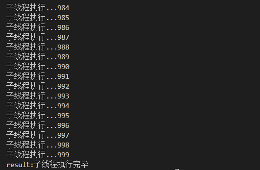

### Thread类

**Thread的构造器**
| 方法名称                                      | 说明                                         |
| --------------------------------------------- | -------------------------------------------- |
| public Thread(String name)                    | 可以为当前线程指定名称                       |
| public Thread(Runnable target)                | 封装Runnable对象成为线程对象                 |
| public Thread( Runnable target ,String name ) | 封装Runnable对象成为线程对象，并指定线程名称 |

**Thread的主要方法**
| 方法名称            | 说明         |
| ------------------- | ------------ |
| public void run( )  | 线程任务方法 |
| public void start() | 线程启动方法 |

**Thread获取和设置线程名称**
| 方法名称                   | 说明                                                         |
| -------------------------- | ------------------------------------------------------------ |
| String getName()           | 获取当前线程的名称，默认线程名称是Thread-索引                |
| void setName(String name ) | 将此线程的名称更改为指定的名称，通过构造器也可以设置线程名称 |

**Thread类获得当前线程的对象**
| 方法名称                             | 说明                               |
| ------------------------------------ | ---------------------------------- |
| public static Thread currentThread() | 返回对当前正在执行的线程对象的引用 |

**Thread类的线程休眠方法**
| 方法名称                            | 说明                                               |
| ----------------------------------- | -------------------------------------------------- |
| public static void sleep(long time) | 让当前线程休眠指定的时间后再继续执行，单位为毫秒。 |

Thread常用API说明

- **区分线程**：获取线程名称getName()、 设置名称setName()、获取当前线程对象currentThread()（**静态**）
- **其他方法**：至于Thread类 提供的诸如: yield、join、interrupt、 不推荐的方法stop、守护线程、线程优先级等线程的控制方法，

**区分线程**

```java
import java.util.*;
import java.util.concurrent.Callable;
import java.util.concurrent.FutureTask;

public class Main {
    public static void main(String[] args) throws Exception {
       Thread thread1 = new Thread(()->{
        Thread self = Thread.currentThread();
        for(int i =0 ;i<5;i++)
            System.out.println(self.getName() +  "子线程执行..."+i);
       });
       thread1.setName("thread1:");
       
       Thread thread2 = new Thread(()->{
        Thread self = Thread.currentThread();
        for(int i =0 ;i<5;i++)
            System.out.println(self.getName() +  "子线程执行..."+i);
       });
       thread2.setName("thread2:");

       thread1.start();
       thread2.start();

        Thread self = Thread.currentThread();
        for(int i =0 ;i<5;i++)
            System.out.println(self.getName() +  "主线程执行..."+i);
    }
}
```


## 线程安全问题

**出现原因**

- 并发线程
- 同时访问共享的资源
- 同时修改共享的资源

**线程安全问题演示:**

`public_resource`的值被修改成了负数

```java
import java.util.*;

public class Main {
    public static double public_resource = 100.0;// 公共资源

    public static void changeResource(double newVal) {

        if (public_resource > 0) {// 只准在public_resource大于0的时候操作数值
            public_resource -= newVal;

            String threadName = Thread.currentThread().getName();
            System.out.println(threadName + "线程改变了内容");
            System.out.println("public_resource" + "的值变为" + public_resource);
        }

    }

    public static void main(String[] args) throws Exception {

        Thread thread1 = new Thread(() -> {
            while (true) {
                Main.changeResource(100);
            }
        });

        Thread thread2 = new Thread(() -> {
            while (true) {
                Main.changeResource(100);
            }
        });

        thread1.start();
        thread2.start();

    }
}
```


### synchronized同步

#### synchronized同步代码块

- 作用：把出现线程安全问题的核心代码上锁

- 原理：每次只允许一个线程进入，执行完毕后自动解锁，解锁后其他线程才能进入
- 对于实例方法，同步代码块建议使用`this`作为锁的对象
- 对于静态方法，同步代码块建议使用`类名.class`作为锁对象

```java
synchronized(同步锁对象){//锁住一个共享资源对象，当不同的线程同时访问时，只有一个能访问，其他的要等待
    操作共享资源的代码
}
```

**使用同步代码块来锁定公共资源**

```java
import java.util.*;

public class Main {
    public static Double public_resource = 100.0;//公共资源
    public static void changeResource(double newVal){
        synchronized(public_resource){// 同步代码块：锁住 public_resource ，只允许一个线程来操作,等一个线程操作完毕后，其他线程才能访问
            if(public_resource>0){// 只准在public_resource大于0的时候操作数值
                public_resource-=newVal;
    
                String threadName = Thread.currentThread().getName();
                System.out.println(threadName + "线程改变了内容");
                System.out.println("public_resource"+"的值变为"+public_resource);
            }
        }
    }

    public static void main(String[] args) throws Exception {

        new Thread(()->{
            while(true){
                Main.changeResource(100);
            }
        }).start();

        new Thread(()->{
            while(true){
                Main.changeResource(100);
            }
        }).start();
    }
}
```

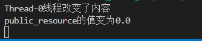

#### synchronized同步方法

- 每次只能一个线程进入方法，执行完毕后自动解锁
- 作用：把出现线程问题的核心**方法**上锁。
- 原理：每次只能一个线程进入，进入就上锁，执行完毕后自动解锁，解锁后其他线程才能进入。
- 底层原理是有一个隐式的锁（锁的对象），锁的范围是整个方法的代码
- 对于实例方法，同步方法默认用`this`作为**锁的对象**
- 对于静态方法，同步方法默认用`类名.class`作为**锁的对象**

```java
修饰符 synchronized 返回值类型 方法名称(形参){
    操作共享资源的代码
}
```

```java
import java.util.*;

public class Main {
    public static Double public_resource = 100.0;//公共资源
    public synchronized static void changeResource(double newVal){ // 同步方法：锁住了整个方法的代码 ，只允许一个线程来操作,等一个线程操作完毕后，其他线程才能访问
        if(public_resource>0){// 只准在public_resource大于0的时候操作数值
            public_resource-=newVal;

            String threadName = Thread.currentThread().getName();
            System.out.println(threadName + "线程改变了内容");
            System.out.println("public_resource"+"的值变为"+public_resource);
        }
    }

    public static void main(String[] args) throws Exception {

        new Thread(()->{
            while(true){
                Main.changeResource(100);
            }
        }).start();

        new Thread(()->{
            while(true){
                Main.changeResource(100);
            }
        }).start();
    }
}
```


### Lock锁

- 为了更清晰的表达如何加锁和释放锁，JDK5以后提供了新的锁对象Lock
- **Lock是接口类不是实现类**
- Lock的实现类为`ReentrantLock`

| 构造器名称             | 说明                   |
| ---------------------- | ---------------------- |
| public ReentrantLock() | 获得Lock锁的实例类对象 |

| 方法名        | 说明   |
| ------------- | ------ |
| void lock()   | 获得锁 |
| void unlock() | 释放锁 |

**官方文档推荐用法**

```java
 class X {
   private final ReentrantLock lock = new ReentrantLock();//防止被修改，被撬锁
   // ...

   public void m() {
     lock.lock();  // 上锁
     try {
       // ... method body
     } finally {
        //finally可以保证即使方法异常，也会解锁
       lock.unlock();//解锁
     }
   }
 }
```

**测试**

```java
import java.util.*;
import java.util.concurrent.locks.Lock;
import java.util.concurrent.locks.ReentrantLock;

public class Main {
   private static final ReentrantLock lock = new ReentrantLock();//定义一个锁，用final修饰防止被修改，被撬锁
    public static Double public_resource = 100.0;//公共资源

    public static void changeResource(double newVal){
        lock.lock();  //上锁 // 只允许一个线程来操作,等一个线程操作完毕后，其他线程才能访问
        try{

            if(public_resource>0){// 只准在public_resource大于0的时候操作数值
                public_resource-=newVal;
                String threadName = Thread.currentThread().getName();
                System.out.println(threadName + "线程改变了内容");
                System.out.println("public_resource"+"的值变为"+public_resource);
            }

        }catch(Exception e){
            e.printStackTrace();
        }finally{
            lock.unlock();//放在finally中，保证函数一定被解锁
        }
    }

    public static void main(String[] args) throws Exception {

        new Thread(()->{
            while(true){
                Main.changeResource(100);
            }
        }).start();

        new Thread(()->{
            while(true){
                Main.changeResource(100);
            }
        }).start();
    }
}
```


### 线程通信

**Object类的等待和唤醒方法**:

**这些方法应当使用当前`同步锁对象`调用**

- 实例方法的**锁对象**是`this`
- 静态方法的**锁对象**是`类名.class`
- 只有锁对象知道有哪些线程在排队

| 方法名称         | 说明                                                                         |
| ---------------- | ---------------------------------------------------------------------------- |
| void wait()      | 让当前线程等待并释放所占锁，直到另一个线程调用notify( )方法或notifyAll()方法 |
| void notify()    | 唤醒正在等待的单个线程                                                       |
| void notifyAll() | 唤醒正在等待的所有线程                                                       |

```java
import java.util.*;

public class Main {
    public static Double public_resource = 100.0;// 公共资源

    public synchronized static void getResource(double newVal){ // 获取资源
        try{
            Object locker = Main.class;//当前的锁是 Main.class
            if(public_resource > newVal){// 只准在资源足够的时候获取资源
                public_resource-=newVal;
    
                String threadName = Thread.currentThread().getName();
                System.out.println("" + threadName + "线程改变了内容," + "public_resource"+"资源被获取"+public_resource);
    
                //唤醒其他线程，告知资源已经操作完毕
                locker.notifyAll();
                //自身线程进入等待状态,等待被其他线程唤醒
                locker.wait();
            }else{
                //唤醒其他线程，告知其他线程来补充资源
                locker.notifyAll();
                //自身线程进入等待状态,等待被其他线程唤醒
                locker.wait();
            }
        }catch(Exception exception){
            exception.fillInStackTrace();
        }
    }

    public synchronized static void addResource(double newVal){ // 获取资源

        try{
            Object locker = Main.class;//当前的锁是 Main.class

            if(public_resource < 1000){// 只在资源快将耗尽的时候补充资源
                public_resource+=newVal;

                String threadName = Thread.currentThread().getName();
                System.out.println("\t" + threadName + "线程改变了内容," + "public_resource"+"资源被补充"+public_resource);

                //唤醒其他线程，告知资源已经补充完毕
                locker.notifyAll();
                //自身线程进入等待状态,等待被其他线程唤醒
                locker.wait();
            }else{
                //唤醒其他线程，告知其他线程来获取资源
                locker.notifyAll();
                //自身线程进入等待状态,等待被其他线程唤醒
                locker.wait();
            }
        }catch(Exception exception){
            exception.fillInStackTrace();
        }
    }

    public static void main(String[] args) throws Exception {

        new Thread(() -> {
            while (true) {
                Main.getResource(100);
            }
        }).start();

        new Thread(() -> {
            while (true) {
                Main.addResource(1000);
            }
        }).start();
    }
}
```


## 线程池

### 概念

- **一种线程的复用技术，因为线程的创建开销很大。**

- JDK5.0起，`ExecutorService接口类`代表线程池

**线程池工作原理**


**线程池的创建**

- 方式一:使用`ExecutorService接口类`的`实现类ThreadPoolExecutor`创建线程池对象
- 方式二:使用`Executors线程池工具类`调用方法返回不同特点的线程池对象

### 实现类ThreadPoolExecutor

**ExecutorService的常用方法**
| 方法名称                             | 说明                                                               |
| ------------------------------------ | ------------------------------------------------------------------ |
| `void execute( Runnable command)`    | 执行任务/命令，没有返回值，一般用来执行Runnable 任务               |
| `Future<T> submit(Cal1ab1e<T> task)` | 执行任务，返回未来任务对象获取线程结果，一般拿来执行 Callable 任务 |
| `void shutdown()`                    | 等任务执行完毕后关闭线程池                                         |
| `List<Runnab1e> shutdownNow()`       | 立刻关闭，停止正在执行的任务，并返回队列中未执行的任务             |

**新任务拒绝策略**
| 策略                                   | 详解                                                             |
| -------------------------------------- | ---------------------------------------------------------------- |
| ThreadPoolExecutor.AbortPolicy         | 丢弃任务并抛出`RejectedExecutionException`异常。**是默认的策略** |
| ThreadPoolExecutor.DiscardPolicy:      | 丢弃任务，但是不抛出异常这是不推荐的做法                         |
| ThreadPoolExecutor.Discard0ldestPolicy | 抛弃队列中等待最久的任务然后把当前任务加入队列中                 |
| ThreadPoolExecutor.CallerRunsPolicy    | 由主线程负责调用任务的run()方法从而绕过线程池直接执行            |

**实现类ThreadPoolExecutor的构造器**

```java
public ThreadPoolExecutor(int corePoolSize,//核心线程数，固定线程数
                          int maximumPoolSize,//最大线程数，动态线程数
                          long keepAliveTime,//动态线程的生命期
                          TimeUnit unit,//生命期单位，秒，分，时，天
                          BlockingQueue<Runnable> workQueue,//任务队列
                          ThreadFactory threadFactory,//创建线程的工厂
                          RejectedExecutionHandler handler//指定线程忙，任务队列慢的回调
                          ) 
                          {
}
```

**线程池常见面试题**

- 临时线程什么时候创建啊?
- 新任务提交时发现核心线程都在忙,**任务队列也满了**，并且还可以创建临时线程，此时才会创建临时线程。
- 什么时候会开始拒绝任务?
- 核心线程和临时线程都在忙,任务队列也满了，新的任务过来的时候才会开始任务拒绝。

**ThreadPoolExecutor测试:处理Runnable对象**

```java
import java.util.*;
import java.util.concurrent.ArrayBlockingQueue;
import java.util.concurrent.ThreadPoolExecutor;
import java.util.concurrent.TimeUnit;

public class Main {
    public static void main(String[] args) throws Exception {
        // 创建线程池
        ThreadPoolExecutor threads = new ThreadPoolExecutor(
            3,//核心线程数，固定线程数
         6,//总线程数（核心+临时线程）
         10,TimeUnit.SECONDS, //临时线程的生命周期，及单位
         new ArrayBlockingQueue<>(5),// 任务队列
         new ThreadPoolExecutor.AbortPolicy()// 拒绝策略（默认）
         );

         //创建一个可执行的任务
        Runnable runnable1 = new Runnable() {
            @Override
            public void run() {
                for (int i = 0; i < 1; i++) {
                    System.out.println(Thread.currentThread().getName() + "执行了HelloWord X " + i + "次");
                }    
            }
        };
        Runnable runnable2 = new Runnable() {
            @Override
            public void run() {
                for (int i = 0; i < 1; i++) {
                    System.out.println(Thread.currentThread().getName() + "执行了HelloWord X " + i + "次");
                }
                try{
                    System.out.println(Thread.currentThread().getName() + "该线程即将被休眠......");
                    Thread.sleep(1000000000);//休眠线程
                }catch(Exception e){
                    e.printStackTrace();
                }
            }
        };

        //把可执行的任务丢入线程池的任务队列处理
        threads.execute(runnable1);//核心线程将被占用一个，但任务执行完毕后，线程将会交给其他任务
        threads.execute(runnable1);//核心线程将被占用一个，但任务执行完毕后，线程将会交给其他任务
        threads.execute(runnable1);//核心线程将被占用一个，但任务执行完毕后，线程将会交给其他任务

        threads.execute(runnable2);//核心线程将被占用一个，线程将被休眠 任务队列共有5个空位，当前占用1个位置
        threads.execute(runnable2);//核心线程将被占用一个，线程将被休眠 任务队列共有5个空位，当前占用2个位置
        threads.execute(runnable2);//核心线程将被占用一个，线程将被休眠 任务队列共有5个空位，当前占用3个位置

        threads.execute(runnable2);//三个核心线程都被占用了，但任务队列共有5个空位，当前占用4个位置，未满，不会创建临时线程，该任务不会执行
        threads.execute(runnable2);//三个核心线程都被占用了，但任务队列共有5个空位，当前占用5个位置，未满，不会创建临时线程，该任务不会执行
        threads.execute(runnable2);//三个核心线程都被占用了，任务队列的5个位置已满，将创建临时线程，该任务不会执行，但会执行任务队列中第一个任务。

        // threads.shutdown();//待任务队列中的任务执行完毕后再关闭线程池
        // threads.shutdownNow();//立即关闭线程池
    }
}
```

**ThreadPoolExecutor测试:处理Runnable对象**

```java
import java.util.*;
import java.util.concurrent.ArrayBlockingQueue;
import java.util.concurrent.Callable;
import java.util.concurrent.Future;
import java.util.concurrent.ThreadPoolExecutor;
import java.util.concurrent.TimeUnit;

public class Main {
    public static void main(String[] args) throws Exception {
        // 创建线程池
        ThreadPoolExecutor threads = new ThreadPoolExecutor(
            3,//核心线程数，固定线程数
         6,//总线程数（核心+临时线程）
         10,TimeUnit.SECONDS, //临时线程的生命周期，及单位
         new ArrayBlockingQueue<>(5),// 任务队列
         new ThreadPoolExecutor.AbortPolicy()// 拒绝策略（默认）
         );

         //创建一个可执行的任务
         Callable<String>  callable1 = new Callable<String>() {
            @Override
            public String call() {
                for (int i = 0; i < 5; i++) {
                    System.out.println(Thread.currentThread().getName() + "执行了HelloWord X " + i + "次");
                }
                return Thread.currentThread().getName() + "线程执行完毕";  
            }
        };
        
        //把可执行的任务丢入线程池的任务队列处理
        Future<String> future1 = threads.submit(callable1);
        Future<String> future2 = threads.submit(callable1);
        Future<String> future3 = threads.submit(callable1);
        Future<String> future4 = threads.submit(callable1);
        Future<String> future5 = threads.submit(callable1);
        Future<String> future6 = threads.submit(callable1);
        Future<String> future7 = threads.submit(callable1);

        System.out.println(future1.get());
        System.out.println(future2.get());
        System.out.println(future3.get());
        System.out.println(future4.get());
        System.out.println(future5.get());
        System.out.println(future6.get());
        System.out.println(future7.get());

        // threads.shutdown();//待任务队列中的任务执行完毕后再关闭线程池
        // threads.shutdownNow();//立即关闭线程池
    }
}
```


### Executors工具类创建线程池

- Executors: 线程池的工具类通过调用方法返回不同类型的线程池对象。

- 注意: Executors的底层其实也是`基于线程池的实现类ThreadPoolExecutor`创建线程池对象的。
- <green>这种方式创建线程在大型并发项目中存在多种弊端，被阿里巴巴公约禁止，建议使用原始方式</green>

**Executors得到线程池对象的常用方法**
| 方法名称                                                                        | 说明                                                                                            |
| ------------------------------------------------------------------------------- | ----------------------------------------------------------------------------------------------- |
| public static ExecutorService newCachedThreadPool()                             | 线程数量随着任务增加而增加，如果线程任务执行完毕且空闲了一段时间则会被回收掉。                  |
| public static ExecutorService newF ixedThreadPool( int nThreads )               | 创建有固定线程数量的线程池，如果某个线程因为执行异常而结束，那么线程池会补充一个 新线程替代它。 |
| public static ExecutorService newSingleThreadExecutor ()                        | 创建只有一个线程的线程池对象， 如果该线程出现异常而结束，那么线程池会补充一个新线程。           |
| public static ScheduledExecutorService newScheduledThreadPool(int corePoolSize) | 创建一个线程池， 可以实现在给定的延迟后运行任务，或者定期执行任务。                             |

**在大型并发项目中使用Executors所存在的问题**


## 定时器

### Timer定时器

Timer定时器的特点和存在的问题

- 1、Timer是**单线程**，处理多个任务按照**顺序执行**，存在延时与设置定时器的时间有出入。
- 2、<green>可能因为其中的某个任务的异常使Timer线程死掉，从而影响后续任务执行</green>

| 构造器         | 说明                |
| -------------- | ------------------- |
| public Timer() | 创建Timer定时器对象 |

| 方法                                                          | 说明                                      |
| ------------------------------------------------------------- | ----------------------------------------- |
| public void schedule(TimerTask task, long delay)              | 开启一个定时器，按照计划处理TimerTask任务 |
| public void schedule(TimerTask task, long delay, long period) | 开启一个定时器，按照计划处理TimerTask任务 |

**测试代码**

```java
import java.util.Timer;
import java.util.TimerTask;

public class Main {
    public static void main(String[] args) throws Exception {
        Timer timer = new Timer();//定时器是一个单线程任务,处理多个任务按顺序执行
        Runnable task1 = new TimerTask() {
            @Override
            public void run() {
                System.out.println(Thread.currentThread().getName() + "执行了.");    
                try {
                    Thread.sleep(2000);//某条任务的执行时间过长会导致任务队列中的其余任务持续等待。
                } catch (InterruptedException e) {
                    e.printStackTrace();
                }            
            }
        };
        timer.schedule( (TimerTask) task1, 500, 500);
    }
}
```

### ScheduledExecutorService定时器

- ScheduledExecutorService是一个线程池

-

| Executors工具类的方法                                                           | 说明           |
| ------------------------------------------------------------------------------- | -------------- |
| public static ScheduledExecutorService newScheduledThreadPoo1(int corePoolSize) | 得到线程池对象 |

| ScheduledExecutorService的方法                                                                                 | 说明                                                                           |
| -------------------------------------------------------------------------------------------------------------- | ------------------------------------------------------------------------------ |
| public ScheduledFuture<?> scheduleAtFixedRate( Runnable command, long initialDelay, long period,TimeUnit unit) | 周期调度方法，循环执行：先延迟initialDelay时间，而后以period时间为周期循环执行 |
| public ScheduledFuture<?> schedule(Runnable command,long delay, TimeUnit unit);                                | 只执行一次：先延迟后执行                                                       |

```java
import java.util.Timer;
import java.util.TimerTask;
import java.util.concurrent.Executor;
import java.util.concurrent.Executors;
import java.util.concurrent.ScheduledExecutorService;
import java.util.concurrent.TimeUnit;

public class Main {
    public static void main(String[] args) throws Exception {
        ScheduledExecutorService newScheduledThreadPool = Executors.newScheduledThreadPool(10);
        Runnable task1 =  new Runnable() {
            @Override
            public void run() {
                System.out.println(Thread.currentThread().getName()+"线程执行了该任务1...");
                try {
                    System.out.println(Thread.currentThread().getName()+"线程被休眠5秒....");
                    Thread.sleep(5000);
                } catch (InterruptedException e) {
                    e.printStackTrace();
                }//
            }
        };
        Runnable task2 =  new Runnable() {
            @Override
            public void run() {
                System.out.println(Thread.currentThread().getName()+"线程执行了该任务2...");
            }
        };
        // newScheduledThreadPool.schedule(task1, 2, TimeUnit.SECONDS);//只执行一次：先延迟后执行
        newScheduledThreadPool.scheduleAtFixedRate(task1, 0, 1, TimeUnit.SECONDS);// 循环执行：先延迟2秒，而后以4秒为周期循环执行
        newScheduledThreadPool.scheduleAtFixedRate(task2, 0, 1, TimeUnit.SECONDS);// 循环执行：先延迟2秒，而后以4秒为周期循环执行
    }
}
```


## 并发与并行

**并发**: CPU的单个核心，计算资源有限，**分时**轮询为多个线程提供服务，称为并发。
**并行**: 多核CPU,计算资源富余，一个核心负责一个线程，多个核心上执行的线程为**同时**执行，称为并行。

### Thread线程生命周期6种状态

- java线程有6种状态

- 6种状态都定义在Thread类的n内部枚举类中

  ```java
  public enum Thread.State {
        NEW,//新建状态
        RUNNABLE,//可运行状态
        BLOCKED,//阻塞状态（被锁住） 
        WAITING,//无限等待状态
        TIMED_WAITING,//计时状态
        TERMINATED;//被终止状态
    }
  ```

- 

| 线程状态                | 描述                                                                                                                             |
| ----------------------- | -------------------------------------------------------------------------------------------------------------------------------- |
| NEW(新建)               | 线程刚被创建，但是并未启动。                                                                                                     |
| Runnable(可运行)        | 线程已经调用了start()等待CPU调度                                                                                                 |
| Blocked(锁阻塞)         | 线程在执行的时候未竞争到锁对象，则该线程进入Blocked状态;。                                                                       |
| Waiting(无限等待)       | 一个线程进入Waiting状态，另一个线程调用notify或者notifyAll方法才能够唤醒                                                         |
| Timed Waiting(计时等待) | 同waiting状态，有几个方法有超时参数,调用他们将进入Timed Waiting状态。带有超时参数的常用方法有Thread.sleep(num)、Object.wait(num) |
| Teminated(被终止)       | 因为run方法正常退出而死亡，或者因为没有捕获的异常终止了run方法而死亡。                                                           |

## 网络编程

### InetAddress的使用

- 此类表示Internet协议 (IP) 地址。
**InetAddress API如下**

| 名称                                              | 说明                                             |
| ------------------------------------------------- | ------------------------------------------------ |
| public static InetAddress getLocalHost()          | 返回本主机的地址对象                             |
| public static InetAddress getByName(String host ) | 得到指定主机的IP地址对象，参数是域名或者IP地址   |
| public String getHostName()                       | 获取此IP地址的主机名                             |
| public String getHostAddress()                    | 返回IP地址字符串                                 |
| public boolean isReachable(int timeout )          | 在指定毫秒内连通该IP地址对应的主机，连通返回true |

**测试**

```java
import java.net.InetAddress;

public class Main {
    public static void main(String[] args) throws Exception {
        //获取InetAddress
        InetAddress localHost_host = InetAddress.getLocalHost();
        InetAddress localHost_baidu = InetAddress.getByName("baidu.com");//填域名或ip

        System.out.println(localHost_host);
        System.out.println(localHost_baidu);

        //获取域名
        System.out.println(localHost_host.getHostName());
        System.out.println(localHost_baidu.getHostName());

        //获取IP地址
        System.out.println(localHost_host.getHostAddress());
        System.out.println(localHost_baidu.getHostAddress());

        //测试连通性
        System.out.println(localHost_host.isReachable(1000));
        System.out.println(localHost_baidu.isReachable(1000));

    }
}
```


### UDP数据包

| DatagramPacket数据包对象构造器                                               | 说明                                                                                                                     |
| ---------------------------------------------------------------------------- | ------------------------------------------------------------------------------------------------------------------------ |
| public DatagramPacket(byte[] buf, int length, InetAddress address, int port) | 创建发送端数据包对象buf:要发送的内容，字节数组 length:要发送内容的字节长度 address:接收端的IP地址对象port:接收端的端口号 |
| public DatagramPacket(byte[] buf, int length)                                | 创建接收端的数据包对象buf:用来存储接收的内容 length:能够接收内容的长度                                                   |

**DatagramPacket常用方法**
| 方法                          | 说明                                  |
| ----------------------------- | ------------------------------------- |
| public int getLength()        | 获得实际接收到的字节个数              |
| public int getSocketAddress() | 获得实际接收到的数据包中的InetAddress |

### DatagramSocket通信接口对象

**DatagramSocket(UDP通信接口对象)**
| DatagramSocket构造器                              | 说明                                                               |
| ------------------------------------------------- | ------------------------------------------------------------------ |
| public DatagramSocket()                           | 创建发送端的Socket对象，系统会随机分配一个端口号。                 |
| public DatagramSocket(int port)                   | 创建接收端的Socket对象并指定端口号                                 |
| public DatagramSocket(int port,InetAddress laddr) | **简单来说就是要说明数据从哪一个端口出去，从哪一个ip网卡接口出去** |

**DatagramSocket类成员方法**
| 方法                                  | 说明       |
| ------------------------------------- | ---------- |
| public void send(DatagramPacket dp)   | 发送数据包 |
| public void receive(DatagramPacket p) | 接收数据包 |

使用多线程模拟服务端和客户端的UDP的通信

```java
import java.io.IOException;
import java.net.DatagramPacket;
import java.net.DatagramSocket;
import java.net.InetAddress;
import java.time.LocalTime;

public class Main {
    public static void main(String[] args) throws Exception {

        // 接收端
        new Thread(() -> {
            try (DatagramSocket socket = new DatagramSocket(9999, InetAddress.getLocalHost())) {
                byte[] buffer = new byte[64 * 1024];// UDP包最大64KB
                DatagramPacket packet = new DatagramPacket(
                        buffer,
                        0, buffer.length// buffer
                );

                while (true) {
                    socket.receive(packet);

                    String context = new String(buffer, 0, packet.getLength());
                    System.out.println("接收到来自"+packet.getSocketAddress()+"的数据：" + context);
                }
            } catch (IOException e) {
                e.printStackTrace();
            }
        }).start();

        // 发送端
        new Thread(() -> {
            try (// 创建UDP数据报的发送接口
            DatagramSocket socket = new DatagramSocket(8888, InetAddress.getLocalHost())) {
                // 发送数据包
                while (true) {
                    String message =  "当前时间为:" + LocalTime.now().toString();
                    byte[] buffer = message.getBytes();

                    //// 封装数据包: 数据，数据长度，目标地址，目标端口
                    socket.send(new DatagramPacket(buffer,buffer.length,
                        InetAddress.getByName("255.255.255.255"),9999//向局域网所有主机的9999端口广播
                        ));
                    
                    Thread.sleep(1000);//延迟
                }
            } catch (IOException | InterruptedException e) {
                e.printStackTrace();
            }
        }).start();
    }
}
```

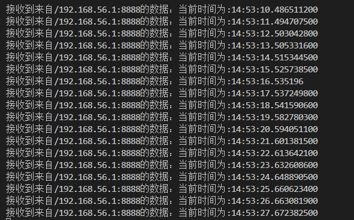

### UDP的单播、组播、广播

**总结**
| 类型 | 概念                                       | 目的ip地址，                                                                  | 目的端口地址                                 |
| ---- | ------------------------------------------ | ----------------------------------------------------------------------------- | -------------------------------------------- |
| 单播 | 一台主机向另**一台**主机发送数据包         | 目的地址为目标主机地址                                                        | 端口一致（目的端口为对方主机程序的监听端口） |
| 组播 | 一台主机向另**一组**主机发送数据包         | **目的地址**为**目标主机**所**绑定**的**组播地址**`224.0.0.0-239.255.255.255` | 端口一致                                     |
| 广播 | 一台主机向**所在网络的所有主机**发送数据包 | 目的地址为广播地址`255.255.255.255`                                           | 端口一致                                     |


**组播通信测试**

```java
import java.io.IOException;
import java.net.DatagramPacket;
import java.net.DatagramSocket;
import java.net.InetAddress;
import java.net.InetSocketAddress;
import java.net.MulticastSocket;
import java.net.NetworkInterface;
import java.time.LocalTime;

public class Main {
    public static void main(String[] args) throws Exception {

        // 接收端1
        new Thread(() -> {

            try (
                MulticastSocket socket = new MulticastSocket(9999);

                ) {
                // 把当前socket加入到组播地址，网段为当前所在网段
                socket.joinGroup(
                    new InetSocketAddress(InetAddress.getByName("224.0.0.1"), 0), 
                    NetworkInterface.getByInetAddress(InetAddress.getLocalHost())//网段为本机网段
                );

                byte[] buffer = new byte[64 * 1024];// UDP包最大64KB
                DatagramPacket packet = new DatagramPacket(
                        buffer,
                        0, buffer.length// buffer
                );

                while (true) {
                    socket.receive(packet);

                    String context = new String(buffer, 0, packet.getLength());
                    System.out.println( Thread.currentThread().getName() + "线程 " + "接收到来自"+packet.getSocketAddress()+"的数据：" + context);
                }
            } catch (IOException e) {
                e.printStackTrace();
            }
        }).start();


        // 发送端
        new Thread(() -> {
            try (// 创建UDP数据报的发送接口
            DatagramSocket socket = new DatagramSocket(8888, InetAddress.getLocalHost())) {
                // 发送数据包
                while (true) {
                    String message =  "当前时间为:" + LocalTime.now().toString();
                    byte[] buffer = message.getBytes();

                    //// 封装数据包: 数据，数据长度，目标地址，目标端口
                    socket.send(new DatagramPacket(buffer,buffer.length,
                        InetAddress.getByName("224.0.0.1"),9999         //向局域网的一个组播地址发送数据
                        ));
                    Thread.sleep(1000);//延迟
                }
            } catch (IOException | InterruptedException e) {
                e.printStackTrace();
            }
        }).start();
    }
}
```


### TCP

#### Socket类

| Socket构造器                         | 说明                                                             |
| ------------------------------------ | ---------------------------------------------------------------- |
| public Socket(String host，int port) | 创建发送端的Socket对象与服务端连接，参数为服务端程序的ip和端口。 |

| Socket类成员方法               | 说明               |
| ------------------------------ | ------------------ |
| OutputStream getoutputStream() | 获得字节输出流对象 |
| InputStream getInputStream( )  | 获得字节输入流对象 |

#### ServerSocket类

| ServerSocket类构造器          | 说明           |
| ----------------------------- | -------------- |
| public ServerSocket(int port) | 注册服务端端口 |

| ServerSocket类方法     | 说明                                                                       |
| ---------------------- | -------------------------------------------------------------------------- |
| public Socket accept() | 等待接收客户端的Socket通信连接连接成功返回Socket对象与客户端建立端到端通信 |

#### TCP通信测试：连接的建立与通信

```java
import java.io.BufferedReader;
import java.io.BufferedWriter;
import java.io.IOException;
import java.io.InputStream;
import java.io.InputStreamReader;
import java.io.OutputStream;
import java.io.OutputStreamWriter;
import java.net.ServerSocket;
import java.net.Socket;
import java.time.LocalDateTime;

public class Main {
    public static void main(String[] args) throws Exception {

        // 服务端
        new Thread(() -> {
            try {
                System.out.println("服务端启动");
                ServerSocket server = new ServerSocket(8888);//创建一个TCP服务器

                //等待并获取一个TCP请求
                Socket socket = server.accept();

                //获取字节流数据
                OutputStream os = socket.getOutputStream();
                InputStream is = socket.getInputStream();

                //包装成字符流
                BufferedReader request_Reader = new BufferedReader(new InputStreamReader(is, "UTF-8"));
                BufferedWriter reponse_Writer = new BufferedWriter(new OutputStreamWriter(os, "UTF-8"));

                String message_req;
                while ((message_req = request_Reader.readLine()) != null) {
                    System.out.println("服务端收到客户端发来的数据：\" " + message_req + " \" ");

                    reponse_Writer.write("你发来的数据是："+message_req);//响应
                    reponse_Writer.newLine();
                    reponse_Writer.flush();
                }

            } catch (IOException e) {
                e.printStackTrace();
            }

        }).start();

        // 客户端
        new Thread(() -> {
            try {

                Thread.sleep(1000);
                System.out.println("客户端启动");

                Socket socket = new Socket("127.0.0.1", 8888);

                OutputStream os = socket.getOutputStream();
                InputStream is = socket.getInputStream();

                BufferedReader rsponse_Reader = new BufferedReader(new InputStreamReader(is, "UTF-8"));
                BufferedWriter request_Writer = new BufferedWriter(new OutputStreamWriter(os, "UTF-8"));

                new Thread(()->{//获取服务端的响应
                    try {
                        String message_req;
                        while ((message_req = rsponse_Reader.readLine()) != null) {
                            System.out.println("\t客户端收到服务端发来的数据：\" " + message_req + " \" ");
                        }
                    } catch (IOException e) {
                        e.printStackTrace();
                    }
                }).start();

                while(true){
                    request_Writer.write("helloWorld " + LocalDateTime.now() );//请求
                    request_Writer.newLine();
                    request_Writer.flush();
                    Thread.sleep(1000);
                }

            } catch (IOException | InterruptedException e) {
                e.printStackTrace();
            }

        }).start();
    }
}
```


#### TCP通信测试：服务端通过临时创建子线程服务多个客户端

`Server.java`

```java
import java.io.BufferedReader;
import java.io.BufferedWriter;
import java.io.IOException;
import java.io.InputStream;
import java.io.InputStreamReader;
import java.io.OutputStream;
import java.io.OutputStreamWriter;
import java.net.ServerSocket;
import java.net.Socket;

public class Server {
    public static void main(String[] args) {
        try {
            System.out.println("服务端启动");
            ServerSocket server = new ServerSocket(8888);
            while (true) {
                Socket socket = server.accept();//获取到一个链接就创建一个子线程来处理
                System.out.println("新连接已建立...\n交由子线程处理...");
                new Thread(() -> {
                    try {
                        OutputStream os = socket.getOutputStream();
                        InputStream is = socket.getInputStream();

                        BufferedReader request_Reader = new BufferedReader(new InputStreamReader(is, "UTF-8"));
                        BufferedWriter reponse_Writer = new BufferedWriter(new OutputStreamWriter(os, "UTF-8"));

                        String message_req;
                        while ((message_req = request_Reader.readLine()) != null) {
                            System.out.println("服务端收到客户端发来的数据：\" " + message_req + " \" ");

                            reponse_Writer.write("你发来的数据是：" + message_req);// 响应
                            reponse_Writer.newLine();
                            reponse_Writer.flush();
                        }
                    } catch (Exception e) {
                        e.printStackTrace();
                    }

                }).start();
            }
        } catch (Exception e) {
            e.printStackTrace();
        }
    }
}
```

`Client.java`

```java
import java.io.BufferedReader;
import java.io.BufferedWriter;
import java.io.IOException;
import java.io.InputStream;
import java.io.InputStreamReader;
import java.io.OutputStream;
import java.io.OutputStreamWriter;
import java.net.Socket;
import java.time.LocalDateTime;
import java.util.Scanner;

public class Client {
    public static void main(String[] args) {
        Scanner sc = new Scanner(System.in);
        try {
            Thread.sleep(1000);
            System.out.println("客户端启动");

            Socket socket = new Socket("127.0.0.1", 8888);

            OutputStream os = socket.getOutputStream();
            InputStream is = socket.getInputStream();

            BufferedReader rsponse_Reader = new BufferedReader(new InputStreamReader(is, "UTF-8"));
            BufferedWriter request_Writer = new BufferedWriter(new OutputStreamWriter(os, "UTF-8"));

            new Thread(()->{//获取服务端的响应
                try {
                    String message_req;
                    while ((message_req = rsponse_Reader.readLine()) != null) {
                        System.out.println("\t客户端收到服务端发来的数据：\" " + message_req + " \" ");
                    }
                } catch (IOException e) {
                    e.printStackTrace();
                }
            }).start();

            while(true){
                System.out.println("请输入要发送的数据：");
                request_Writer.write( sc.nextLine() + LocalDateTime.now() );//请求
                request_Writer.newLine();
                request_Writer.flush();
            }

        } catch (IOException | InterruptedException e) {
            e.printStackTrace();
        }
    }
}
```

**服务端**


**客户端1**


**客户端2**


### TCP通信测试：服务端通过线程池服务多个客户端

`Server.java`

```java
import java.io.BufferedReader;
import java.io.BufferedWriter;
import java.io.IOException;
import java.io.InputStream;
import java.io.InputStreamReader;
import java.io.OutputStream;
import java.io.OutputStreamWriter;
import java.net.ServerSocket;
import java.net.Socket;
import java.util.concurrent.ArrayBlockingQueue;
import java.util.concurrent.BlockingQueue;
import java.util.concurrent.ThreadPoolExecutor;
import java.util.concurrent.TimeUnit;

public class Server {
    public static void main(String[] args) {
        try {
            ServerSocket server = new ServerSocket(8888);
            ThreadPoolExecutor Pool = new ThreadPoolExecutor(//创建线程池
                10, 20,//核心线程数，最大线程数量
                 10, TimeUnit.SECONDS,//空闲时间
                 new ArrayBlockingQueue<>(20),//任务队列大小
                 new ThreadPoolExecutor.AbortPolicy()//任务队列满后又有新任务时的策略
                 );
            System.out.println("服务端启动了");
            while (true) {
                Socket socket = server.accept();//获取到一个链接就创建一个子线程来处理
                System.out.println("新连接已建立...\n交由线程池处理...");

                //把任务交给线程池
                Pool.execute(()->{
                    try {
                        OutputStream os = socket.getOutputStream();
                        InputStream is = socket.getInputStream();

                        BufferedReader request_Reader = new BufferedReader(new InputStreamReader(is, "UTF-8"));
                        BufferedWriter reponse_Writer = new BufferedWriter(new OutputStreamWriter(os, "UTF-8"));

                        String message_req;
                        while ((message_req = request_Reader.readLine()) != null) {
                            System.out.println("服务端收到客户端发来的数据：\" " + message_req + " \" ");

                            reponse_Writer.write("你发来的数据是：" + message_req);// 响应
                            reponse_Writer.newLine();
                            reponse_Writer.flush();
                            if(message_req.equals("exit")){
                                reponse_Writer.write(message_req);// 响应
                                reponse_Writer.newLine();
                                reponse_Writer.flush();
                                break;
                            }
                        }
                        System.out.println("线程资源被释放...");
                    } catch (Exception e) {
                        e.printStackTrace();
                    }
                });
            }
        } catch (Exception e) {
            e.printStackTrace();
        }
    }
}
```

`Client.java`

```java
import java.io.BufferedReader;
import java.io.BufferedWriter;
import java.io.IOException;
import java.io.InputStream;
import java.io.InputStreamReader;
import java.io.OutputStream;
import java.io.OutputStreamWriter;
import java.net.Socket;
import java.time.LocalDateTime;
import java.util.Scanner;

public class Client {
    public static void main(String[] args) {
        Scanner sc = new Scanner(System.in);
        try {
            Thread.sleep(1000);
            System.out.println("客户端启动");

            Socket socket = new Socket("127.0.0.1", 8888);

            OutputStream os = socket.getOutputStream();
            InputStream is = socket.getInputStream();

            BufferedReader rsponse_Reader = new BufferedReader(new InputStreamReader(is, "UTF-8"));
            BufferedWriter request_Writer = new BufferedWriter(new OutputStreamWriter(os, "UTF-8"));

            new Thread(()->{//获取服务端的响应
                try {
                    String message_req;
                    while ((message_req = rsponse_Reader.readLine()) != null) {
                        System.out.println("\t客户端收到服务端发来的数据：\" " + message_req + " \" ");
                        if(message_req.equals("exit"))
                            break;
                    }
                } catch (IOException e) {
                    e.printStackTrace();
                }
            }).start();

            while(true){
                System.out.println("请输入要发送的数据：");
                String messageString = sc.nextLine();
                request_Writer.write( messageString );//请求
                request_Writer.newLine();
                request_Writer.flush();
                if(messageString.equals("exit"))
                    break;
            }

        } catch (IOException | InterruptedException e) {
            e.printStackTrace();
        }
    }
}
```


### TCP通信测试：实现简易群聊

`Server.java`

```java
import java.io.BufferedReader;
import java.io.BufferedWriter;
import java.io.IOException;
import java.io.InputStream;
import java.io.InputStreamReader;
import java.io.OutputStream;
import java.io.OutputStreamWriter;
import java.net.ServerSocket;
import java.net.Socket;
import java.util.HashMap;
import java.util.HashSet;
import java.util.Map;
import java.util.Set;
import java.util.concurrent.ArrayBlockingQueue;
import java.util.concurrent.BlockingQueue;
import java.util.concurrent.ThreadPoolExecutor;
import java.util.concurrent.TimeUnit;

public class Server {
    public static Set<Socket> ALL_ONLINE_USERS = new HashSet<>();
    public static void main(String[] args) {
        try {
            ServerSocket server = new ServerSocket(8888);
            ThreadPoolExecutor Pool = new ThreadPoolExecutor(//创建线程池
                10, 20,//核心线程数，最大线程数量
                 10, TimeUnit.SECONDS,//空闲时间
                 new ArrayBlockingQueue<>(20),//任务队列大小
                 new ThreadPoolExecutor.AbortPolicy()//任务队列满后又有新任务时的策略
                 );
            System.out.println("服务端启动了");
            while (true) {
                Socket socket = server.accept();//获取到一个链接就创建一个子线程来处理
                System.out.println("新连接已建立...\n交由线程池处理...");
                
                //把任务交给线程池执行
                Pool.execute(()->{
                    try {
                        ALL_ONLINE_USERS.add(socket);//保存线程
                        OutputStream os = socket.getOutputStream();
                        InputStream is = socket.getInputStream();

                        BufferedReader request_Reader = new BufferedReader(new InputStreamReader(is, "UTF-8"));
                        BufferedWriter reponse_Writer = new BufferedWriter(new OutputStreamWriter(os, "UTF-8"));

                        String message_req;
                        while ((message_req = request_Reader.readLine()) != null) {
                            System.out.println("收到客户端的消息："+ message_req);
                            if(message_req.equals("exit")){
                                ALL_ONLINE_USERS.remove(socket);//移除socket
                                socket.close();//关闭连接
                                System.out.println("线程资源被释放...");
                                break;
                            }
                            
                            reponse_Writer.write("已收到你的消息，开始群发");
                            reponse_Writer.newLine();
                            reponse_Writer.flush();
                            sendMsgToAll(message_req);
                            
                        }
                    } catch (Exception e) {
                        e.printStackTrace();
                    }
                });
            }
        } catch (Exception e) {
            e.printStackTrace();
        }
    }
    public static void sendMsgToAll(String msg) throws Exception{
        for(Socket socket:ALL_ONLINE_USERS){
            BufferedWriter reponse_Writer = new BufferedWriter(new OutputStreamWriter(socket.getOutputStream(), "UTF-8"));
            reponse_Writer.write(msg);
            reponse_Writer.newLine();
            reponse_Writer.flush();
        }
    }
}
```

`Client.java`

```java
import java.io.BufferedReader;
import java.io.BufferedWriter;
import java.io.IOException;
import java.io.InputStream;
import java.io.InputStreamReader;
import java.io.OutputStream;
import java.io.OutputStreamWriter;
import java.net.Socket;
import java.time.LocalDateTime;
import java.util.Scanner;

public class Client {
    public static void main(String[] args) {
        Scanner sc = new Scanner(System.in);
        try {
            Thread.sleep(1000);
            System.out.println("客户端启动");

            Socket socket = new Socket("127.0.0.1", 8888);

            OutputStream os = socket.getOutputStream();
            InputStream is = socket.getInputStream();

            BufferedReader rsponse_Reader = new BufferedReader(new InputStreamReader(is, "UTF-8"));
            BufferedWriter request_Writer = new BufferedWriter(new OutputStreamWriter(os, "UTF-8"));

            new Thread(()->{//获取服务端的响应
                try {
                    String message_req;
                    while ((message_req = rsponse_Reader.readLine()) != null) {
                        System.out.println("\t客户端收到服务端发来的数据：\" " + message_req + " \" ");
                    }
                } catch (IOException e) {
                    System.out.println("你已退出群聊。");
                    e.printStackTrace();
                }
            }).start();

            while(true){
                System.out.println("请输入要群发的数据：");
                String messageString = sc.nextLine();
                request_Writer.write( messageString );//请求
                request_Writer.newLine();
                request_Writer.flush();
                if(messageString.equals("exit"))
                    break;
            }

        } catch (IOException | InterruptedException e) {
            e.printStackTrace();
        }
    }
}
```

**服务端**


**客户端1**


**客户端2**


**客户端3**


### TCP通信测试：简易BS架构原理测试

```java
import java.io.BufferedReader;
import java.io.BufferedWriter;
import java.io.InputStreamReader;
import java.io.OutputStreamWriter;
import java.net.ServerSocket;
import java.net.Socket;
import java.util.HashSet;
import java.util.Set;
import java.util.concurrent.ArrayBlockingQueue;
import java.util.concurrent.ThreadPoolExecutor;
import java.util.concurrent.TimeUnit;

public class Server {
    public static Set<Socket> ALL_ONLINE_USERS = new HashSet<>();
    public static void main(String[] args) {
        try {
            ServerSocket server = new ServerSocket(8888);
            ThreadPoolExecutor Pool = new ThreadPoolExecutor(10, 20,10, TimeUnit.SECONDS,new ArrayBlockingQueue<>(20),new ThreadPoolExecutor.AbortPolicy());
            System.out.println("服务端启动了......");
            while (true) {
                Socket socket = server.accept();//获取到一个链接就创建一个子线程来处理
                System.out.println("新连接已建立...\n交由线程池处理...");
                Pool.execute(socketHandle(socket));//把任务交给线程池执行
            }
        } catch (Exception e) {
            e.printStackTrace();
        }
    }
    public static Runnable socketHandle(Socket socket){
        return ()->{
            try{
                BufferedReader request_Reader = new BufferedReader(new InputStreamReader(socket.getInputStream(), "UTF-8"));
                BufferedWriter reponse_Writer = new BufferedWriter(new OutputStreamWriter(socket.getOutputStream(), "UTF-8"));

                reponse_Writer.write("HTTP/1.1 200 OK");
                reponse_Writer.newLine();//换行
                reponse_Writer.write("Content-Type:text/html;charset=UTF-8");
                reponse_Writer.newLine();//换行
                reponse_Writer.newLine();//空行

                reponse_Writer.write("<h1>Hello B/S </h1>");
                reponse_Writer.newLine();//换行

                reponse_Writer.flush();//发送
                reponse_Writer.close();//关闭
                socket.close();//关闭连接
                System.out.println("执行完毕，线程释放");
            }catch(Exception e){
            }
        };
    }
}
```


## 单元测试：Junit单元测试框架

- Java程序的最小单元是函数，单元测试就是测试这些函数

- Junit单元测试框架是开源框架，用java编写的

测试案例

`FunctionA.java`

```java
package functiona;

public class FunctionA {
    public String getUserNameById(int userId){
        if(userId==0)
            return "admin";
        else
        return "DingYigui";
    }
    public int devide(int a,int b){
        return a/b;
    }
}
```

`TestFunctionA.java`

```java
package functiona;

import org.junit.Assert;
import org.junit.Test;

public class TestFunctionA{
    // 测试方法必须是public void
    // 测试方法必须导入Test，然后用@Test修饰,表示这是一个测试方法

    @Test 
    public void testGetUserNameById(){
        FunctionA funA = new FunctionA();
        Assert.assertEquals("admin", funA.getUserNameById(0));
        Assert.assertEquals("DingYigui", funA.getUserNameById(1));
    }

    @Test
    public void testDevide(){
        FunctionA funA = new FunctionA();
        Assert.assertEquals(5, funA.devide(10,2));
        Assert.assertEquals(0, funA.devide(1,0));//异常
    }
}
```

**测试效果**
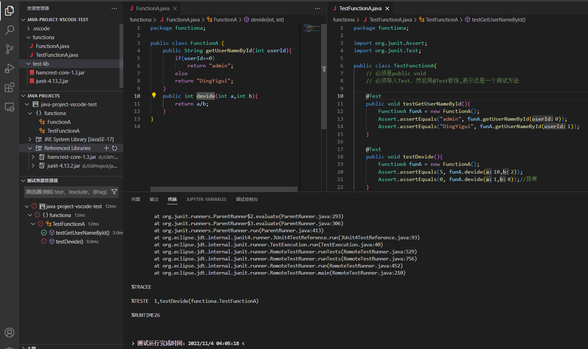

**Junit常用注解Uunit 4.xxxx版本)**
| 注解         | 说明                                                         |
| ------------ | ------------------------------------------------------------ |
| @Test        | 测试方法                                                     |
| @Before      | 用来修饰实例方法，该方法会在每一个测试方法执行之前执行一次。 |
| @After       | 用来修饰实例方法，该方法会在每一个测试方法执行之后执行一次。 |
| @BeforeClass | 用来静态修饰方法，该方法会在所有测试方法之前只执行一次。     |
| @AfterClass  | 用来静态修饰方法，该方法会在所有测试方法之后只执行一次。     |

**Junit常用注解Uunit 5.xxxx版本)**
| 注解        | 说明                                                          |
| ----------- | ------------------------------------------------------------- |
| @Test       | 测试方法                                                      |
| @BeforeEach | 用来修饰实例方法，该方法会在每一个测试方法执行之前执行一次。  |
| @AfterEach  | 用来修饰实例方法，该方法会在每一一个测试方法执行之后执行 次。 |
| @BeforeAll  | 用来静态修饰方法，该方法会在所有测试方法之前只执行一次。      |
| @AfterAll   | 用来静态修饰方法，该方法会在所有测试方法之后只执行一次。      |

## 反射

通过反射可以在程序的运行的过程中,通过类的Class字节码文件对象，获取到一个类的全部**属性Field**、**构造器Constructor**、**方法Method**的对象，无论是私有的还是公开的。

通过反射可以获取任意一个实例对象的所有属性，所有方法，所有构造函数，并且可以查看、设置、调用他们，无论他们是否是私有的。

反射的最主要应用是做企业通用框架

### 获取Class对象

**获取Class对象的三种方式**

- 通过 `Class类` 的`forName()方法`,`形参className`填 `包名.类名`
  - tips: `Class.forName("xx.xxx.xxx")`的另一个作用是要求JVM查找并加载指定的类，也就是说JVM会执行该类的静态代码段。
- 通过 `Student抽象类` 的 `Class属性`获取
- 通过 `Student实例对象` 的 `getClass方法` 获取

```java
import java.lang.Class;
public class Main {
    public static void main(String[] args) throws Exception {
        //获取Class对象的三种方式
        Class class1 = Class.forName("Student");//1.通过 Class类 的forName()方法,形参className填 包名.类名
        Class class2 = Student.class;//通过 Student抽象类 的Class属性获取
        Class class3 = new Student().getClass();//通过 Student实例对象 的getClass方法
        System.out.println(class1);
        System.out.println(class2);
        System.out.println(class3);
    }
}
class Student{
    String name;
    int age;
    char sex;
}

```

### 获取Class对象的构造器函数

| 方法                                                                | 说明                                         |
| ------------------------------------------------------------------- | -------------------------------------------- |
| Constructor<?>[] getConstructors( )                                 | 返回**所有**构造器对象的数组(只能拿public的) |
| Constructor<?>[] getDeclaredConstructors()                          | 返回**所有**构造器对象的数组(能拿私有的)     |
| `Constructor<T> getConstructor(Class<?>... parameterTypes)`         | 返回单个构造器对象(只能拿public的)           |
| `Constructor<T> getDeclaredConstructor(Class<?>... parameterTypes)` | 返回单个构造器对象(能拿私有的)               |

**测试**

```java
import java.lang.Class;
import java.lang.reflect.Constructor;
import java.util.Arrays;
public class Main {
    public static void main(String[] args) throws Exception {
        Class class1 = Student.class;//通过 Student抽象类 的Class属性获取

        //获取所有公开的构造函数
        Constructor[] constructors1 =  class1.getConstructors();
        System.out.println(Arrays.toString(constructors1));
        // 输出：   [public Student(java.lang.String,int,char)]

        //获取所有构造函数（包括私有）
        Constructor[] constructors2 =  class1.getDeclaredConstructors();
        System.out.println(Arrays.toString(constructors2));
        //输出：    [private Student(java.lang.String,int), public Student(java.lang.String,int,char)]

        //根据形式参数类型获取单个公开的构造函数
        Constructor constructor1 = class1.getConstructor(String.class,int.class,char.class);//形式参数必须完全匹配
        System.out.println(constructor1);
        //输出：    public Student(java.lang.String,int,char)

        //根据形式参数类型获取单个构造函数（包括私有）
        Constructor constructor2 = class1.getDeclaredConstructor(String.class,int.class);//形式参数必须完全匹配
        System.out.println(constructor2);
        //输出：    private Student(java.lang.String,int)
    }
}
class Student{
    String name;
    int age;
    char sex;
    private Student(String name, int age) {
        this.name = name;
        this.sex = sex;
    }
    public Student(String name, int age, char sex) {
        this.name = name;
        this.age = age;
        this.sex = sex;
    }
    
}
```


### 使用获取到的构造函数创建对象

**Constructor实例对象的用于创建对象的方法**
| 符号                                    | 说明                                           |
| --------------------------------------- | ---------------------------------------------- |
| T newInstance(Object... initargs)       | 根据指定的构造器创建对象                       |
| public void setAccessible(boolean flag) | 设置为true,表示取消访问检查进行暴力反射,也就是 |

**测试**

```java
import java.lang.Class;
import java.lang.reflect.Constructor;
import java.util.Arrays;
public class Main {
    public static void main(String[] args) throws Exception {
        //通过 Student抽象类 的Class属性获取
        Class class1 = Student.class;

        //根据形式参数类型获取单个构造函数（包括私有）
        Constructor constructor = class1.getDeclaredConstructor(String.class,int.class,char.class);//形式参数必须完全匹配
        constructor.setAccessible(true);//设置允许强制访问私有构造器
        Student student = (Student) constructor.newInstance("DYG",20,'男');
        System.out.println(student);// 输出 Student [name=DYG, age=20, sex=男]
    }
}
class Student{
    String name;
    int age;
    char sex;
    private Student(String name, int age) {
        this.name = name;
        this.sex = sex;
    }
    public Student(String name, int age, char sex) {
        this.name = name;
        this.age = age;
        this.sex = sex;
    }
    @Override
    public String toString() {
        return "Student [name=" + name + ", age=" + age + ", sex=" + sex + "]";
    }
    
}
```


### 获取Class类的属性对象

| 函数名                              | 描述                                       |
| ----------------------------------- | ------------------------------------------ |
| Field[] getFields()                 | 返回所有成员变量对象的数组(只能拿public的) |
| Field[ getDeclaredFields()          | 返回所有成员变量对象的数组，存在就能拿到   |
| Field getField(String name)         | 返回单个成员变量对象(只能拿public的)       |
| Field getDeclaredField(String name) | 返回单个成员变量对象，存在就能拿到         |

```java
import java.io.ObjectInputStream.GetField;
import java.lang.Class;
import java.lang.reflect.Constructor;
import java.lang.reflect.Field;
import java.util.Arrays;
public class Main {
    public static void main(String[] args) throws Exception {
        //通过 Student抽象类 的Class属性获取
        Class class1 = Student.class;

        Field[] stu_Fields = class1.getFields();
        Field[] stu_Fields_all = class1.getDeclaredFields();

        System.out.println(Arrays.toString(stu_Fields));        // [public java.lang.String Student.name]
        System.out.println(Arrays.toString(stu_Fields_all));    // [public java.lang.String Student.name, int Student.age, char Student.sex]

        Field student_namField =  class1.getField("name");          
        Field student_ageField =  class1.getDeclaredField("age");   

        System.out.println(student_namField);   //public java.lang.String Student.name
        System.out.println(student_ageField);   //int Student.age

    }
}
class Student{
    public String name;
    int age;
    char sex;
    private Student(String name, int age) {
        this.name = name;
        this.sex = sex;
    }
    public Student(String name, int age, char sex) {
        this.name = name;
        this.age = age;
        this.sex = sex;
    }
    @Override
    public String toString() {
        return "Student [name=" + name + ", age=" + age + ", sex=" + sex + "]";
    }
    
}
```

### 使用获取到的属性对象修改实例对象的属性值

```java
import java.lang.Class;
import java.lang.reflect.Field;
public class Main {
    public static void main(String[] args) throws Exception {
        //通过 Student抽象类 的Class属性获取
        Class class1 = Student.class;

        Student student =new Student("DYG",20,'男');
        System.out.println(student);// 输出 Student [name=DYG, age=20, sex=男]

        Field student_namField =  class1.getField("name");
        Field student_ageField =  class1.getDeclaredField("age");
        Field student_sexField =  class1.getDeclaredField("sex");
        
        System.out.println((String)student_namField.get(student));// DYG
        System.out.println((int)student_ageField.get(student));//20
        student_sexField.setAccessible(true);//允许强制访问
        System.out.println((char)student_sexField.get(student));//'男'

        student_namField.set(student, "DingYigui");
        student_ageField.set(student, 20);
        student_sexField.setAccessible(true);//允许强制访问
        student_sexField.set(student, '女');

        System.out.println(student);// Student [name=DingYigui, age=20, sex=女]
    }
}

class Student{
    public String name;
    int age;
    private char sex;
    private Student(String name, int age) {
        this.name = name;
        this.sex = sex;
    }
    public Student(String name, int age, char sex) {
        this.name = name;
        this.age = age;
        this.sex = sex;
    }
    @Override
    public String toString() {
        return "Student [name=" + name + ", age=" + age + ", sex=" + sex + "]";
    }
    
}
```

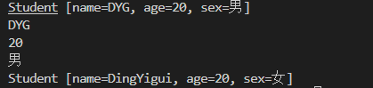

### 获取Class类的方法

| 方法                                                              | 说明                                       |
| ----------------------------------------------------------------- | ------------------------------------------ |
| Method[] getMethods()                                             | 返回所有成员方法对象的数组(只能拿public的) |
| Method[] getDeclaredMethods()                                     | 返回所有成员方法对象的数组，存在就能拿到   |
| Method getMethod(String name, Class<?>... parameterTypes )        | 返回单个成员方法对象(只能拿public的)       |
| Method getDeclaredMethod(String name, Class<?>... parameterTypes) | 返回单个成员方法对象，存在就能拿到         |

### 通过获取到的类的方法来执行实例对象的方法

| 函数名                                    | 说明                         | 运行方法                                                                                                   |
| ----------------------------------------- | ---------------------------- | ---------------------------------------------------------------------------------------------------------- |
| object invoke(Object obj, object... args) | Method类中用于触发执行的方法 | 参数一:用obj对象调用该方法 参数二:调用方法的传递的参数(如果没有就不写) 返回值:方法的返回值(如果没有就不写) |

```java
import java.lang.Class;
import java.lang.reflect.Field;
import java.lang.reflect.Method;
import java.util.Arrays;
public class Main {
    public static void main(String[] args) throws Exception {
        //通过 Student抽象类 的Class属性获取
        Class class1 = Student.class;

        Student student =new Student("DYG",20,'男');
        System.out.println(student);// 输出 Student [name=DYG, age=20, sex=男]

        Method toStrMethod = class1.getMethod("toString",null);
        System.out.println(toStrMethod.getName());
        System.out.println(toStrMethod.getReturnType());
        System.out.println(Arrays.toString(toStrMethod.getParameterTypes()));
        System.out.println(Arrays.toString(toStrMethod.getParameters()));

        System.out.println( toStrMethod.invoke(student, null));// 输出 Student [name=DYG, age=20, sex=男]
    }
}

class Student{
    public String name;
    int age;
    private char sex;
    private Student(String name, int age) {
        this.name = name;
        this.sex = sex;
    }
    public Student(String name, int age, char sex) {
        this.name = name;
        this.age = age;
        this.sex = sex;
    }
    @Override
    public String toString() {
        return "Student [name=" + name + ", age=" + age + ", sex=" + sex + "]";
    }
    
}
```

### 应用：存储任意对象的属性值到文件

```java
import java.io.BufferedOutputStream;
import java.io.File;
import java.io.FileNotFoundException;
import java.io.FileOutputStream;
import java.io.PrintStream;
import java.io.UnsupportedEncodingException;
import java.lang.reflect.Field;
public class Main {
    public static void main(String[] args) throws Exception {

        Student student =new Student("DYG",20,'男',"110","银河系太阳系地球");
        saveObjAttrToFile(student,new File("./123.txt"));
    }
    static void saveObjAttrToFile(Object obj,File file) throws UnsupportedEncodingException, FileNotFoundException, IllegalArgumentException, IllegalAccessException{
        PrintStream ps = new PrintStream(new BufferedOutputStream(new FileOutputStream(file)),true,"UTF-8");
        for(Field field:obj.getClass().getDeclaredFields())
        {
            field.setAccessible(true);
            ps.println(field.getName() + "=" + field.get(obj).toString());
            ps.flush();
        }
        ps.close();
    }
}

class Student{
    private String name;
    private int age;
    private char sex;
    private String tel;
    private String add;
    public Student(String name, int age, char sex, String tel, String add) {
        this.name = name;
        this.age = age;
        this.sex = sex;
        this.tel = tel;
        this.add = add;
    }
}
```


## 注解

- Java注解Annotation,也叫Java标注，

- JDK5.0之后的标准
- 类、构造器、属性、方法、成员变量、参数、都可以加注解
- 作用：对标记的部分做特殊处理
- 如：`@Override`标记的函数表示重写。编译阶段将检测是否正确重写

### 自定义注解

```java
public @interface 注解名称{
    public 属性类型 属性名() default 默认值;
}

@注解名称(属性名1=123,属性名2="123",属性名3={"123","123"},属性名4={1,2,3})
@注解名称(属性名=123)
@注解名称(123)
public void main(){
}
```

**使用测试**

```java
public class Main {
    @MyNote(tittle = "测试0")
    public static void main(String[] args) throws Exception {

        @MyNote(tittle = "输出",context = "测试输出语句")
        String str = "12312";
        System.out.println(123213123);
    }
    @MyNote(tittle = "测试1")
    public static void test(){

    }
}
@interface MyNote{
    public String tittle() default "none";
    public String context() default "none";
}
```

### 元注解

元注解是注解的注解

元注解有两：
*`@Target` 约束自定义注解只能在哪些地方使用
*`@Retention` 约束自定义注解的存活范围

**写法**

```java
@Target
@Target({ElementType.????,ElementType.????}) //Target使得MyNote只能注解什么类型
@Retention(RetentionPolicy.????)//指定注解作用在什么阶段
public @interface 注解名称{
    public 属性类型 属性名() default 默认值;
}

@Target({ElementType.METHOD,ElementType.FIELD}) //Target使得MyNote只能注解方法METHOD、成员属性FIELD
@Retention(RetentionPolicy.RUNTIME)//指定注解作用在运行阶段
public @interface 注解名称{
    public 属性类型 属性名() default 默认值;
}
```

`@Target`中可使用的值定义在`ElementType枚举类`中，常用值如下

- `TYPE`,类,接口
- `FIELD`,成员变量
- `METHOD`,成员方法
- `PARAMETER`,方法参数
- `CONSTRUCTOR`,构造器
- `LOCAL_VARIABLE`,局部变量

`@Retention`中可使用的值定义在`RetentionPolicy枚举类`中，常用值如下

- `SOURCE` : 注解只作用在**源码阶段**，生成的字节码文件中不存在
- `CLASS` : 注解作用在**源码阶段**，**字节码文件阶段**,运行阶段不存在，默认值.
- `RUNTIME` : 注解作用在**源码阶段**,**字节码文件阶段**,**运行阶段**(开发常用)

### 注解的解析

注解的操作中经常需要进行解析，**注解的解析就是判断是否存在注解**，**存在注解就解析出内容**。

**Annotation接口**

- Annotation: 注解的顶级接口，
- 注解都是Annotation类型的对象

**AnnotatedElement接口**

- 定义了与注解解析相关的**解析方法**

**反射与注解**

所有的**反射**的**类的成分** `Class`, `Method` , `Field` , `Constructor`, 都实现了`AnnotatedElement接口`他们都拥**有解析注解的能力**

| 方法                                                               | 说明                                                                 |
| ------------------------------------------------------------------ | -------------------------------------------------------------------- |
| `Annotation[] getDeclaredAnnotations()`                            | 获得当前对象上使用的**所有注解**，返回注解数组。                     |
| `T getDeclaredAnnotation(Class <T> annotationClass)`               | 根据**注解类型**获得对应注解对象                                     |
| `boolean isAnnotationPresent(Class < Annotation> annotationClass)` | **判断**当前对象是否使用了指定的注解，如果使用了则返回true,否则false |
  
**解析类和方法上的注解测试**

```java
import java.lang.annotation.Annotation;
import java.lang.annotation.ElementType;
import java.lang.annotation.Retention;
import java.lang.annotation.RetentionPolicy;
import java.lang.annotation.Target;
import java.lang.reflect.Method;
import java.util.Arrays;

public class Main  {
    static{
        //解析类上的MyNote注解
        Class stu = Student.class;
        if (stu.isAnnotationPresent(MyNote.class)) {//判断是否存在指定注解
            MyNote myNote = (MyNote) stu.getDeclaredAnnotation(MyNote.class);//获取指定注解
            System.out.println("类上的注解属性: " + myNote.tittle());
            System.out.println("类上的注解属性: " + myNote.context());
        }

        //解析方法上的MyNote注解
        Method[] stuMethods = Student.class.getDeclaredMethods();//获取类的所有方法
        for(Method sMethod:stuMethods){//遍历方法
            if(sMethod.isAnnotationPresent(MyNote.class)){//判断是否存在指定注解
                MyNote myNote = (MyNote) sMethod.getDeclaredAnnotation(MyNote.class);//获取指定注解
                System.out.println("方法上的注解属性: " + myNote.tittle());
                System.out.println("方法上的注解属性: " + myNote.context());
            }
        }
    }

    public static void main(String[] args) throws Exception {

    }

}

@Target({ElementType.TYPE,ElementType.METHOD}) //Target使得MyNote只能注解类和方法 
@Retention(RetentionPolicy.RUNTIME)//指定注解作用在运行阶段
@interface MyNote{
    public String tittle() default "none";
    public String context() default "none";
}

@MyNote(tittle = "名称",context = "内容")
class Student{
    String name;
    int age;
    char sex;
    String tel;

    public Student(String name, int age, char sex, String tel) {
        this.name = name;
        this.age = age;
        this.sex = sex;
        this.tel = tel;
    }

    @MyNote(tittle = "名称",context = "内容")
    public String getName() {
        return name;
    }

    public void setName(String name) {
        this.name = name;
    }

    public int getAge() {
        return age;
    }

    public void setAge(int age) {
        this.age = age;
    }

    public char getSex() {
        return sex;
    }

    public void setSex(char sex) {
        this.sex = sex;
    }

    public String getTel() {
        return tel;
    }

    public void setTel(String tel) {
        this.tel = tel;
    }
    
}
```


## 结合`反射`和`注解`实现简易`junit框架`

```java
import java.lang.annotation.ElementType;
import java.lang.annotation.Retention;
import java.lang.annotation.RetentionPolicy;
import java.lang.annotation.Target;
import java.lang.reflect.Method;


public class Test{

    @MyTest
    public void test1(){
        System.out.println("测试代码块1");
    }

    public void test2(){
        System.out.println("测试代码块2");
    }

    @MyTest
    public void test3(){
        System.out.println("测试代码块3");
    }

    public void test4(){
        System.out.println("测试代码块4");
    }

    @MyTest
    public void test5(){
        System.out.println("测试代码块5");
        System.out.println(100/0);//计算除0
    }

    public static void main(String[] args) throws Exception{
        //解析方法上的MyNote注解
        Method[] testMethods = Test.class.getMethods();//获取类的所有公开方法
        for(Method testMethod:testMethods){//遍历方法
            if(testMethod.isAnnotationPresent(MyTest.class)){//判断是否存在指定注解
                try {
                    testMethod.invoke(new Test(), (Object[])null);//执行方法
                    System.out.println(testMethod.getName() + "测试通过!!!");
                } catch (Exception e) {
                    System.out.println(testMethod.getName() + "捕获到下列异常,测试未通过!!!");
                    e.printStackTrace();
                }
            }
        }
    }
}
@Target({ElementType.METHOD}) //使得 MyTest 只能注解方法 
@Retention(RetentionPolicy.RUNTIME)//指定注解作用在运行阶段
@interface MyTest{
    
}
```


## 对象的动态代理

代理就是一个**对象**，用来为**被代理对象**的**行为**做一些辅助工作。

**实现步骤**

- 把要对外公开的功能**定义接口类**
- 被代理对象要**实现接口**
- 使用 `Proxy.newProxyInstance(被代理对象的加载器,要向外公开的接口,代理的处理函数)` 来获取代理对象的实例
- 可以使用泛型或直接使用Object来作为返回值和形参列表使得代理支持任意类型的被代理对象

**应用场景**


```java
import java.lang.reflect.InvocationHandler;
import java.lang.reflect.Method;
import java.lang.reflect.Proxy;

public class Main {
    public static void main(String[] args) {
        Programmer programmer = new Programmer("DYG", 20, '男');//程序员
        ProgrammerActions programmerActionsProxy = ProgrammerActionsProxy.getProxy(programmer);//程序员的行为的代理

        System.out.println("我是需求方，我需要做一个项目...");
        String result = (String) programmerActionsProxy.coding();//调用代理的coding
        System.out.println("我是需求方，我拿到了项目的源代码...:" + result);
    }
}
interface ProgrammerActions{//Programmer程序员对象的行为
    Object coding();//敲代码
}
class Programmer implements ProgrammerActions{//Programmer程序员对象
    String name;
    int age;
    char sex;
    public Programmer(String name, int age, char sex) {
        this.name = name;
        this.age = age;
        this.sex = sex;
    }
    @Override
    public Object coding() {
        System.out.println("我是程序员，我负责敲代码...");
        System.out.println("我是程序员，代码敲完了...");
        return "{Hello,World}";
    }
    private void eat() {//私有方法 吃饭
        System.out.println("吃饭...");        
    }
    private void sleep() {//私有方法 睡觉
        System.out.println("睡觉...");        
    }
}
class ProgrammerActionsProxy{//Programmer程序员行为的代理对象
    public static ProgrammerActions getProxy(Programmer programmer){
        return (ProgrammerActions) Proxy.newProxyInstance(//获取代理实例对象
            programmer.getClass().getClassLoader(),//获取程序员对象的加载器
            programmer.getClass().getInterfaces(),//获取程序员对象的行为的接口
            new InvocationHandler() {//代理对程序员行为的处理函数
                @Override
                public Object invoke(Object proxy, Method method, Object[] args) throws Throwable {
                    System.out.println("我是代理，我负责接项目...");//预处理
                    Object result = method.invoke(programmer, args);//处理
                    System.out.println("我是代理，我负责项目的交付...");//收尾工作
                    return result;//返回结果
                }
        });
    }
}
```

## XML

### 概述

- 纯文本，默认UTF-8

- Extensiable Markup Language 可扩展标记语言
- 是一种数据表示格式 可描述非常复杂的数据结构 常用于传输和存储数据 网络消息传输 配置文件

**基本语法**

```xml
<?xml version="1.0" encoding="UTF-8"   ?>
<!-- 文档声明必须第一行 -->

<root comment="必须包含一个根标签，有且只能有一个" >

    <!-- 这个是注释 -->
    <important>version必须存在</important>

    <name>标签必须成对出现</name>

    <br>特殊标签可以不成对</br>
    <br/>
    <br/>

    <attr id="标签中可有属性,属性值必须引号包裹" name='男'>测试</attr>
    
    <test1>
        <span> 特殊符号 </span>
        <span> &lt; 小于</span>
        <span> &gt;  大于</span>
        <span> &amp; and号</span>
        <span> &apos; 单引号</span>
        <span> &quot; 双引号</span>
    </test1>

    <![CDATA[
            特殊字符: > < & ' "  
    ]]>

</root>
```

**DTD文档约束**

- 可以约束XML的标签
- 不能约束XML标签的内容

```DTD
<!ELEMENT 书架 (书+)>
<!ELEMENT 书 (书名,作者,价格)>
<!ELEMENT 书名 (#PCDATA)>
<!ELEMENT 作者 (#PCDATA)>
<!ELEMENT 价格 (#PCDATA)>
```

```xml
<?xml version="1.0" encoding="UTF-8"?>
<!DOCTYPE 书架 SYSTEM "test.dtd"> <!-- 引入DTD约束文件 -->
<书架>
    <书>
        <书名>123</书名>
        <作者>123</作者>
        <价格>不能约束数据类型</价格>
    </书>
    <书>
        <书名>123</书名>
        <作者>123</作者>
        <价格>不能约束数据类型</价格>
    </书>
    <书>
        <书名>123</书名>
        <作者>123</作者>
        <价格>不能约束数据类型</价格>
    </书>
    <书>
        <书名>123</书名>
        <作者>123</作者>
        <价格>不能约束数据类型</价格>
    </书>
</书架>
```

**schema约束**

- schema用来约束其他xml文件的数据类型
- schema本身是一个xml文件,schema能被其他文件约束

```xml
<?xml version="1.0" encoding="UTF-8" ?>
<书架 xmlns="http://www.itcast.cn"
    xmlns:xsi="http://www.w3.org/2001/XMLSchema-instance"
    xsi:schemaLocation="http://www.itcast.cn data.xsd">
    <!-- xmlns="http://www.itcast.cn"  基本位置
         xsi:schemaLocation="http://www.itcast.cn books02.xsd" 具体的位置 -->
    <书>
        <书名>神雕侠侣</书名>
        <作者>金庸</作者>
        <售价>399.9</售价>
    </书>
    <书>
        <书名>神雕侠侣</书名>
        <作者>金庸</作者>
        <售价>19.5</售价>
    </书>

</书架>
```

`data.xsd`

```xsd
<?xml version="1.0" encoding="UTF-8" ?>
<schema xmlns="http://www.w3.org/2001/XMLSchema"
        targetNamespace="http://www.itcast.cn"
        elementFormDefault="qualified" >
    <!-- targetNamespace:申明约束文档的地址（命名空间）-->
    <element name='书架'>
        <!-- 写子元素 -->
        <complexType>
            <!-- maxOccurs='unbounded': 书架下的子元素可以有任意多个！-->
            <sequence maxOccurs='unbounded'>
                <element name='书'>
                    <!-- 写子元素 -->
                    <complexType>
                        <sequence>
                            <element name='书名' type='string'/>
                            <element name='作者' type='string'/>
                            <element name='售价' type='double'/>
                        </sequence>
                    </complexType>
                </element>
            </sequence>
        </complexType>
    </element>
</schema>
```

### 解析

**常见解析工具**

| 解析工具  | 描述                                                                                                                                                                           |
| --------- | ------------------------------------------------------------------------------------------------------------------------------------------------------------------------------ |
| JAXP      | SUN公司提供的一套XML的解析的API                                                                                                                                                |
| JDOM      | JDOM是一个开源项目，它基于树型结构，利用纯JAVA的技术对XML文档实现解析、生成、序列化以及多种操作。                                                                              |
| **dom4j** | 是JDOM的升级品，用来读写XML文件的。具有性能优异、功能强大和极其易使用的特点，它的性能超过sun公司官方的dom技术，同时它也是一个开放源代码的软件，Hibernate也用它来读写配置文件。 |
| jsoup     | 功能强大DOM方式的XML解析开发包，尤其对HTML解析更加方便                                                                                                                         |

**两种解析方式**

- SAX解析 一行一行解析
- DOM解析 整个文件读入内存解析

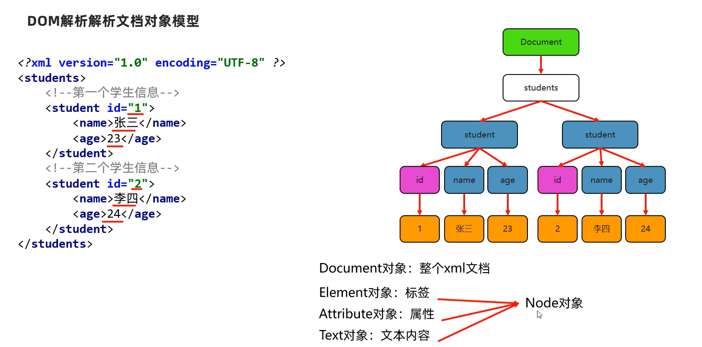

#### Dom4J


**dom4j解析xml文档**

```java
import java.io.InputStream;
import org.dom4j.Document;
import org.dom4j.Element;
import org.dom4j.io.SAXReader;

public class Main {
    public static void main(String[] args)throws Exception {
        SAXReader saxReader = new SAXReader();
        InputStream is = Main.class.getResourceAsStream("/test.xml");//当前目录下搜索
        Document document = saxReader.read(is);//读取文档

        Element root = document.getRootElement();//获取根标签
        System.out.println(root);
    }
}
```


### 检索:xPath


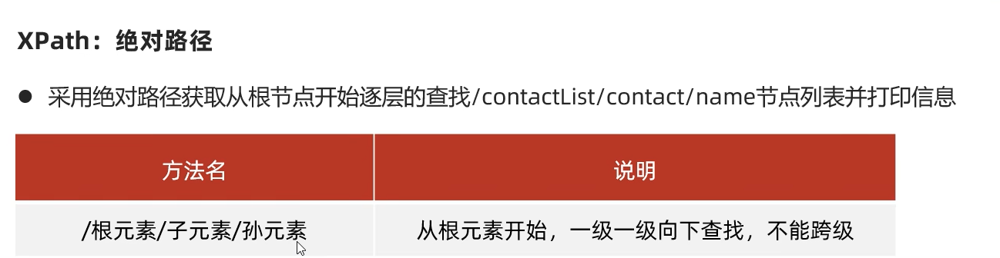

**xPath**

- 检索XML文件中的信息
- 绝对路径: `/根元素/子元素/孙元素`
- 相对路径: `./子元素/孙元素`
- 全文检索: `//contact`
- 属性查找: `//@属性名`、`//元素[@属性名]`、`//元素//[@属性名='值']`

**绝对路径检索**


**绝对路径检索**


**全文检索检索**


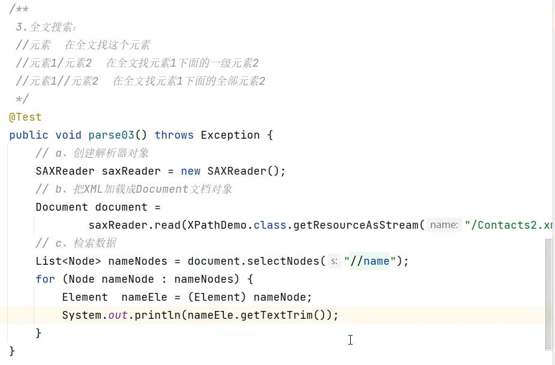

**属性查找检索**


## 工厂设计模式

**概念**

- 工厂模式(Factory Pattern) 是Java中最常用的设计模式之一 ，这种类型的设计模式属于创建型模式，它提供了一种获取对象的方式。
- 工厂的方法可以封装对象的创建细节，比如:为该对象进行加工和数据注入。
- 可以实现类与类之间的解耦操作(核心思想)

**工厂设计模式：封装对象的创建细节**

```java
import java.util.Objects;

public class Main {
    public static void main(String[] args)throws Exception {
        Computer mac = ComputerFactory.gComputer("Mac");
        Computer huawei = ComputerFactory.gComputer("HuaWei");
    }
}

class ComputerFactory{
    public static Computer gComputer(String brand) {//工厂模式
        if(Objects.equals(brand,"Mac")){
            return new Mac("Mac", 9000, 18, 40, 50);
        }else
        if(Objects.equals(brand,"HuaWei")){
            return new Mac("HuaWei", 5000, 20, 30, 45);
        }
        return null;
    }
}
class Computer{
    String brand;//品牌
    double price;//价格
    int size;//尺寸
    int length;//长度
    int width;//宽度
    public Computer(String brand, double price, int size, int length, int width) {
        this.brand = brand;
        this.price = price;
        this.size = size;
        this.length = length;
        this.width = width;
    }
}
class Mac extends Computer{
    public Mac(String brand, double price, int size, int length, int width){
        super(brand,price,size,length,width);
    }
}

class HuaWei extends Computer{
    public HuaWei(String brand, double price, int size, int length, int width){
        super(brand,price,size,length,width);
    }
}
```

## 装饰设计模式

什么是装饰设计模式?

- **创建一个新类**，**包装原始类**,从而在新类中提升原来类的功能。
- 装饰模式指的是在**不改变原类的基础**.上,动态地扩展-个类的功能

**装饰设计模式的作用**:

- 装饰模式指的是在不改变原类的基础上,动态地扩展-个类的功能。

> InputStream (抽象父类)
> FileInputStream (实现子类，但读写性能较差)
> BufferedInputStream (实现子类，装饰类，读写性能高)

**创建步骤**

- 定义父类。
- 定义原始类,继承父类,定义功能。
- 定义装饰类,继承父类,包装原始类,增强功能! !

<style>
    gold{
        color:black;
        background-color:gold;
    }
    green{
        color:white;
        background-color:green;
    }
    warn{
        color:white;
        background-color:red;
    }
</style>
