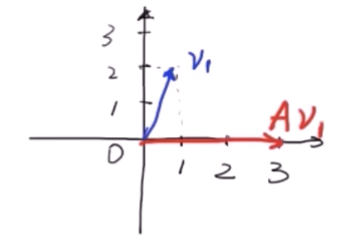
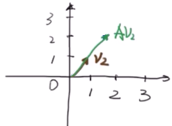
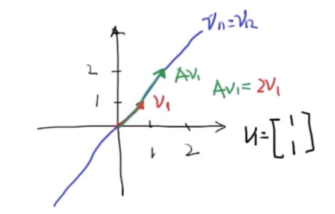

## 《高级控制理论——数学基础》学习笔记

### 1_特征值与特征向量

> [《【工程数学基础】1_特征值与特征向量》王天威（网名DR_CAN），博士](https://www.bilibili.com/video/BV1fx41137Zm)

#### 1.1 概念和定义

在线性代数中，对于一个线性变换 A，如果存在非零向量 v，使得变换后的向量 Av 与原向量 v 保持在同一条直线上（仅长度改变，方向不变或反向），则称 v 为 A 的**特征向量**，对应的缩放比例为**特征值** λ。

数学表达式为：

$$
Av = \lambda v
$$

其中：A 为方阵，v 为非零向量，λ 为标量（特征值）。

---

**直观理解：**

通过两个例子对比理解：

**案例 1：非特征向量**
$$
A=\begin{bmatrix} 1 & 1 \\ 4 & -2 \end{bmatrix}, \quad v_1=\begin{bmatrix} 1 \\ 2 \end{bmatrix}
$$
$$
Av_1 = \begin{bmatrix} 1 & 1 \\ 4 & -2 \end{bmatrix}\begin{bmatrix} 1 \\ 2 \end{bmatrix} = \begin{bmatrix} 3 \\ 0 \end{bmatrix}
$$

$Av_1$ 的大小和方向都发生改变，故 $v_1$ 不是特征向量。

**案例 2：特征向量**
$$
v_2=\begin{bmatrix} 1 \\ 1 \end{bmatrix}
$$
$$
Av_2 = \begin{bmatrix} 1 & 1 \\ 4 & -2 \end{bmatrix}\begin{bmatrix} 1 \\ 1 \end{bmatrix} = \begin{bmatrix} 2 \\ 2 \end{bmatrix} = 2\begin{bmatrix} 1 \\ 1 \end{bmatrix} = 2v_2
$$

$Av_2$ 方向不变，大小变为原来的 2 倍，故 $v_2$ 是特征向量，λ = 2 是特征值。

#### 1.2 求解方法

##### 1.2.1 理论推导

由定义 $Av = \lambda v$ 出发：

$$
\begin{aligned}
Av &= \lambda v \\
Av - \lambda v &= 0 \\
(A - \lambda I)v &= 0
\end{aligned}
$$

其中 I 为 n 阶单位矩阵。

要使上述齐次线性方程组有**非零解**，系数矩阵的行列式必须为零：

$$
|A - \lambda I| = 0
$$

此方程称为**特征方程**，展开后是关于 λ 的多项式方程，其根即为特征值。

---

##### 1.2.2 计算实例

**给定矩阵：**
$$
A = \begin{bmatrix} 1 & 1 \\ 4 & -2 \end{bmatrix}
$$

**步骤 1：求特征值**

$$
\begin{aligned}
|A - \lambda I| &= \left|\begin{bmatrix} 1-\lambda & 1 \\ 4 & -2-\lambda \end{bmatrix}\right| = 0 \\
(1-\lambda)(-2-\lambda) - 4 &= 0 \\
\lambda^2 + \lambda - 6 &= 0 \\
(\lambda - 2)(\lambda + 3) &= 0
\end{aligned}
$$

解得：$\lambda_1 = 2$，$\lambda_2 = -3$

**步骤 2：求特征向量**

当 $\lambda_1 = 2$ 时，代入 $(A - \lambda I)v = 0$：

$$
\begin{aligned}
(A - 2I)v_1 &= \begin{bmatrix} -1 & 1 \\ 4 & -4 \end{bmatrix}\begin{bmatrix} v_{11} \\ v_{12} \end{bmatrix} = \begin{bmatrix} 0 \\ 0 \end{bmatrix}
\end{aligned}
$$

解得：$-v_{11} + v_{12} = 0$，即 $v_{11} = v_{12}$

取 $v_{11} = 1$，则特征向量为：
$$
v_1 = \begin{bmatrix} 1 \\ 1 \end{bmatrix}
$$

当 $\lambda_2 = -3$ 时：

$$
\begin{aligned}
(A + 3I)v_2 &= \begin{bmatrix} 4 & 1 \\ 4 & 1 \end{bmatrix}\begin{bmatrix} v_{21} \\ v_{22} \end{bmatrix} = \begin{bmatrix} 0 \\ 0 \end{bmatrix}
\end{aligned}
$$

解得：$4v_{21} + v_{22} = 0$，即 $v_{22} = -4v_{21}$

取 $v_{21} = 1$，则特征向量为：
$$
v_2 = \begin{bmatrix} 1 \\ -4 \end{bmatrix}
$$

---

**总结：**

|     | 特征值           | 特征向量                                      |
| --- | ---------------- | --------------------------------------------- |
| 1   | $\lambda_1 = 2$  | $v_1 = \begin{bmatrix} 1 \\ 1 \end{bmatrix}$  |
| 2   | $\lambda_2 = -3$ | $v_2 = \begin{bmatrix} 1 \\ -4 \end{bmatrix}$ |

#### 1.3 对角化与解耦

##### 1.3.1 对角化原理

设 $P = [v_1, v_2]$ 为特征向量构成的矩阵（称为过渡矩阵或相似变换矩阵），其中 $v_1$ 和 $v_2$ 是矩阵 A 的两个线性无关的特征向量。

$$
\begin{aligned}
AP &= A[v_1, v_2] = \begin{bmatrix} Av_1 & Av_2 \end{bmatrix} \\
&= \begin{bmatrix} \lambda_1 v_1 & \lambda_2 v_2 \end{bmatrix} \quad \text{（利用 } Av_i = \lambda_i v_i \text{）} \\
&= \begin{bmatrix} v_{11} & v_{21} \\ v_{12} & v_{22} \end{bmatrix}
   \begin{bmatrix} \lambda_1 & 0 \\ 0 & \lambda_2 \end{bmatrix} \\
&= P \Lambda
\end{aligned}
$$

其中 $\Lambda = \begin{bmatrix} \lambda_1 & 0 \\ 0 & \lambda_2 \end{bmatrix}$ 称为**对角矩阵**。

于是得到：

$$
AP = P\Lambda
$$

两边左乘 $P^{-1}$：

$$
P^{-1}AP = \Lambda
$$

**这是一个核心结论：通过相似变换，将矩阵 A 对角化。**

---

##### 1.3.2 解微分方程组

考虑状态空间方程（控制理论中的常用形式）：

$$
\begin{aligned}
\frac{d}{dt}x_1 &= x_1 + x_2 \\
\frac{d}{dt}x_2 &= 4x_1 - 2x_2
\end{aligned}
$$

写成矩阵形式：

$$
\frac{d}{dt}\begin{bmatrix} x_1 \\ x_2 \end{bmatrix} = \begin{bmatrix} 1 & 1 \\ 4 & -2 \end{bmatrix}\begin{bmatrix} x_1 \\ x_2 \end{bmatrix}
$$

一般形式为：

$$
\dot{x} = Ax
$$

**求解过程：**

令 $x = Py$，则 $\dot{x} = P\dot{y}$，代入重写原方程：

$$
P\dot{y} = APy
$$

两边左乘 $P^{-1}$：

$$
\dot{y} = P^{-1}APy = \Lambda y
$$

其中：

$$
\Lambda = \begin{bmatrix} 2 & 0 \\ 0 & -3 \end{bmatrix}
$$

展开得到：

$$
\begin{aligned}
\dot{y} &= \begin{bmatrix} 2 & 0 \\ 0 & -3 \end{bmatrix}\begin{bmatrix} y_1 \\ y_2 \end{bmatrix} \\
\dot{y}_1 &= 2y_1 + 0y_2 = 2y_1 \\
\dot{y}_2 &= 0y_1 - 3y_2 = -3y_2
\end{aligned}
$$

可以发现方程利用对角矩阵上的 $0$ 实现了解耦，即:关于$y_1$和$y_2$的两个方程相互独立。

求解这两个独立的微分方程：

$$
y_1 = c_1 e^{2t}, \quad y_2 = c_2 e^{-3t}
$$

最后通过 $x = Py$ 求解原变量：

$$
\begin{aligned}
x &= Py = \begin{bmatrix} 1 & 1 \\ 1 & -4 \end{bmatrix}\begin{bmatrix} y_1 \\ y_2 \end{bmatrix} \\
  &= \begin{bmatrix} 1 & 1 \\ 1 & -4 \end{bmatrix}\begin{bmatrix} c_1 e^{2t} \\ c_2 e^{-3t} \end{bmatrix} \\
  &= \begin{bmatrix} c_1 e^{2t} + c_2 e^{-3t} \\ c_1 e^{2t} - 4c_2 e^{-3t} \end{bmatrix}
\end{aligned}
$$

**工程意义：** 在控制理论中，系统矩阵A的特征值的符号直接决定系统稳定性：
- 所有特征值实部为负 → 系统稳定（本例中特征值 λ₂ = -3 < 0，但 λ₁ = 2 > 0）
- 存在正实部特征值 → 系统不稳定
- 因此常通过特征值分析判断系统性质，无需求解完整方程

#### 1.4 总结

| 要点           | 内容                                                                  |
| -------------- | --------------------------------------------------------------------- |
| **定义**       | $Av = \lambda v$，变换后向量与原向量共线                              |
| **求特征值**   | 解特征方程 $\|A - \lambda I\| = 0$                                    |
| **求特征向量** | 代入 $(A - \lambda_i I)v_i = 0$ 求解                                  |
| **对角化**     | $P^{-1}AP = \Lambda$，其中 P 为特征向量矩阵，Λ 为对角矩阵             |
| **核心应用**   | 解耦微分方程组 $\dot{x} = Ax$，通过坐标变换得到 $\dot{y} = \Lambda y$ |
| **工程意义**   | 特征值的实部符号直接反映系统稳定性分析                                |
