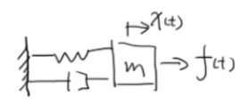
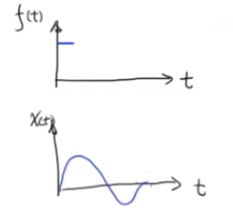
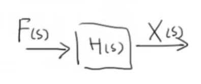
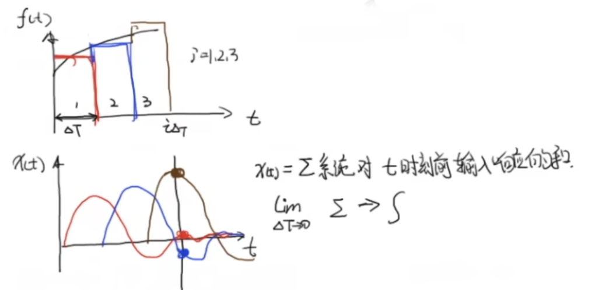
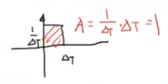
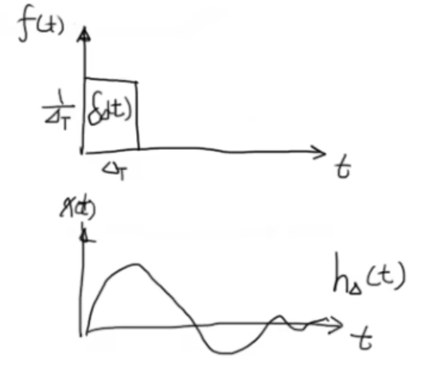
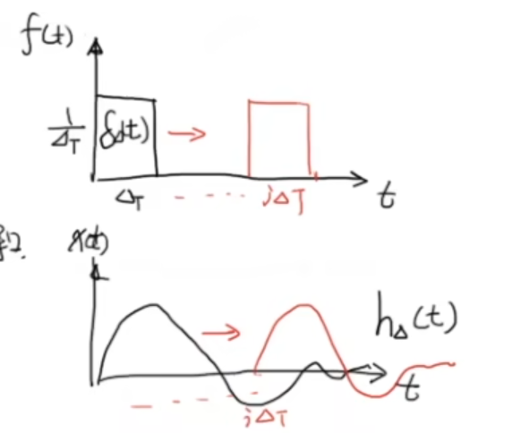
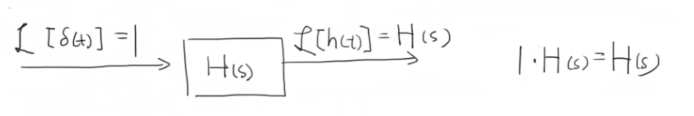

## 《高级控制理论——数学基础》学习笔记

### 3_变声的基础原理_理解卷积的含义_线性时不变系统的冲激响应与卷积

> [《【工程数学基础】3_变声的基础原理_理解卷积的含义_线性时不变系统的冲激响应与卷积》王天威（网名DR_CAN），博士](https://www.bilibili.com/video/BV1cs411W74f)

---

#### 一、线性时不变系统（Linear Time-Invariant System）

##### 1.1 线性性质

引入系统算符 $\mathcal{T}\{\cdot\}$ 表示系统的输入输出关系。对于某系统，若输入为 $f(t)$，输出为 $x(t)$，则记为：

$$\mathcal{T}\{f(t)\} = x(t)$$

系统满足线性性质当且仅当以下两个条件同时成立：

**（1）可加性：**
$$\mathcal{T}\{f_1(t) + f_2(t)\} = \mathcal{T}\{f_1(t)\} + \mathcal{T}\{f_2(t)\} = x_1(t) + x_2(t)$$

**（2）齐次性：**
$$\mathcal{T}\{a f_1(t)\} = a\mathcal{T}\{f_1(t)\} = a x_1(t)$$

将可加性与齐次性结合，得到**叠加原理**：

$$\boxed{\mathcal{T}\{a_1 f_1(t) + a_2 f_2(t)\} = a_1\mathcal{T}\{f_1(t)\} + a_2\mathcal{T}\{f_2(t)\} = a_1 x_1(t) + a_2 x_2(t)}$$

##### 1.2 时不变性质

系统满足时不变性质是指：如果系统对输入 $f(t)$ 的响应为 $x(t)$，即 $\mathcal{T}\{f(t)\} = x(t)$，则对任意时间平移 $\tau$，有：

$$\boxed{\mathcal{T}\{f(t-\tau)\} = x(t-\tau)}$$

**物理意义**：无论在什么时刻对系统施加相同的输入，系统的输出波形保持不变，仅产生相应的时间延迟。

##### 1.3 线性时不变系统示例

**弹簧-阻尼系统**

弹簧振动阻尼系统是典型的线性时不变系统。以欠阻尼系统为例：

系统动力学方程为：

$$m\frac{d^2x}{dt^2} + c\frac{dx}{dt} + kx = f(t)$$

其中：
- $f(t)$：施加的外力（系统输入）
- $x(t)$：质量块的位移（系统输出）
- $m$：质量
- $c$：阻尼系数
- $k$：弹簧刚度

当施加一个短暂冲击力时，系统响应如图所示：

系统表现出振荡衰减特性，最终因阻尼作用趋于零。

##### 1.4 传递函数表示

在频域中，线性时不变系统可用传递函数框图表示：

数学表达式为：

$$X(s) = F(s) \cdot H(s)$$

其中：
- $F(s) = \mathcal{L}\{f(t)\}$：输入的拉普拉斯变换
- $H(s)$：系统的传递函数
- $X(s) = \mathcal{L}\{x(t)\}$：输出的拉普拉斯变换

**传递函数与卷积的关系**

对上述频域方程进行拉普拉斯逆变换：

$$\mathcal{L}^{-1}[X(s)] = \mathcal{L}^{-1}[F(s) \cdot H(s)]$$

根据拉普拉斯变换的**卷积定理**，时域中两函数乘积的逆变换等于原函数的卷积：

$$\boxed{x(t) = f(t) * h(t) = \int_{0}^{t} f(\tau) h(t-\tau) \, d\tau}$$

其中 $h(t) = \mathcal{L}^{-1}[H(s)]$ 为系统的**冲激响应**。此式表明：**线性时不变系统的输出等于输入信号与系统冲激响应的卷积。**

---

#### 二、卷积的直观理解与数学推导

##### 2.1 直观理解：叠加原理的应用

将连续输入信号 $f(t)$ 离散化为若干窄脉冲。为便于理解，将其划分为 $N$ 个时间间隔为 $\Delta T$ 的矩形脉冲。

在第 $i$ 个时间区间 $[i\Delta T, (i+1)\Delta T]$ 内：
- 矩形脉冲高度：$f(i\Delta T)$（代表该时刻外力的大小，单位：N）
- 矩形脉冲宽度：$\Delta T$（力的作用持续时间）
- 矩形脉冲面积（冲量）：$A_i = f(i\Delta T) \cdot \Delta T$（单位：N·s，表示该时间段内力对系统施加的冲量）

根据叠加原理：
- 第 $i$ 个矩形脉冲的独立响应：$x_i(t) = A_i \cdot h_\Delta(t - i\Delta T)$
- 系统在任意时刻 $t$ 的总响应为所有历史脉冲响应的叠加：

$$x(t) = \sum_{i=0}^{\lfloor t/\Delta T \rfloor} \Delta T \cdot f(i\Delta T) \cdot h_\Delta(t - i\Delta T)$$

当 $\Delta T \to 0$ 时，求和转化为积分：

$$\lim_{\Delta T \to 0} \sum_{i} \Delta T \cdot f(i\Delta T) \cdot h_\Delta(t - i\Delta T) = \int_{0}^{t} f(\tau) h(t-\tau) \, d\tau$$

##### 2.2 数学推导：基于狄拉克δ函数

**单位冲激函数的定义**

狄拉克δ函数（Dirac Delta Function）定义为：

$$
\delta(t) = \begin{cases}
0, & t < 0 \\
+\infty, & t = 0 \\
0, & t > 0
\end{cases}
\qquad
\int_{-\infty}^{+\infty} \delta(t) \, dt = 1
$$

δ函数具有宽度为零、面积为1的特性，是广义函数。

**δ函数的构造序列**

定义单位矩形脉冲函数：

$$
\delta_{\Delta}(t) = \begin{cases}
\frac{1}{\Delta T}, & 0 < t < \Delta T \\
0, & \text{其他}
\end{cases}
$$

该函数面积为：

$$\int_{-\infty}^{+\infty} \delta_{\Delta}(t) \, dt = \frac{1}{\Delta T} \cdot \Delta T = 1$$

取极限：

$$\boxed{\lim_{\Delta T \to 0} \delta_{\Delta}(t) = \delta(t)}$$

**系统对δ函数的响应**

定义系统的**冲激响应** $h(t)$ 为系统对单位冲激输入的响应：

$$\mathcal{T}\{\delta(t)\} = h(t)$$

对有限宽脉冲 $\delta_{\Delta}(t)$ 的响应记为 $h_{\Delta}(t)$：

$$\mathcal{T}\{\delta_{\Delta}(t)\} = h_{\Delta}(t)$$

##### 2.3 利用线性时不变性质推导卷积公式

**步骤1：时不变性**

若输入延迟 $i\Delta T$，输出也相应延迟：

$$\mathcal{T}\{\delta_{\Delta}(t - i\Delta T)\} = h_{\Delta}(t - i\Delta T)$$

**步骤2：齐次性（放大）**

将输入放大 $A$ 倍，输出也放大 $A$ 倍：

$$\mathcal{T}\{A \cdot \delta_{\Delta}(t - i\Delta T)\} = A \cdot h_{\Delta}(t - i\Delta T)$$

**步骤3：与连续输入的联系**

令 $A = f(i\Delta T) \cdot \Delta T$（即第 $i$ 个矩形脉冲的冲量），则：

$$\mathcal{T}\{\Delta T \cdot f(i\Delta T) \cdot \delta_{\Delta}(t - i\Delta T)\} = \Delta T \cdot f(i\Delta T) \cdot h_{\Delta}(t - i\Delta T)$$

下表总结了输入-响应对应关系：

| 系统输入 | 系统响应 | 说明 |
|---------|---------|------|
| $\delta_{\Delta}(t)$ | $h_{\Delta}(t)$ | 单位脉冲响应 |
| $\delta_{\Delta}(t-i\Delta T)$ | $h_{\Delta}(t-i\Delta T)$ | 时不变：延迟输入得到延迟响应 |
| $A\delta_{\Delta}(t-i\Delta T)$ | $Ah_{\Delta}(t-i\Delta T)$ | 齐次性：放大输入得到放大响应 |
| $\Delta T \cdot f(i\Delta T)\delta_{\Delta}(t-i\Delta T)$ | $\Delta T \cdot f(i\Delta T)h_{\Delta}(t-i\Delta T)$ | 离散化后第 $i$ 个输入分量及其响应 |

**步骤4：叠加原理求和**

根据可加性，将时刻 $t$ 之前的所有历史响应叠加：

$$x(t) = \sum_{i=0}^{\lfloor t/\Delta T \rfloor} \Delta T \cdot f(i\Delta T) \cdot h_{\Delta}(t - i\Delta T)$$

**步骤5：取极限得到卷积积分**

令 $\Delta T \to 0$，分析每一项的变化：

**（1）时间变量 $i\Delta T \to \tau$**

当时间间隔无限细分时，离散索引 $i$ 与乘积 $i\Delta T$ 的关系满足：
- 在 $\Delta T \to 0$ 过程中，求和上限 $\lfloor t/\Delta T \rfloor \to \infty$
- 每个离散时间点 $i\Delta T$ 填满区间 $[0, t]$
- 引入连续变量 $\tau = i\Delta T$，则 $\tau \in [0, t]$

**（2）微元 $\Delta T \to d\tau$**

从黎曼积分的定义出发：
$$\lim_{\Delta T \to 0} \sum_{i=0}^{\lfloor t/\Delta T \rfloor} g(i\Delta T) \cdot \Delta T = \int_{0}^{t} g(\tau) \, d\tau$$

其中 $\Delta T$ 作为离散求和的微元，在极限下转化为积分的微分 $d\tau$。

**（3）冲激响应的收敛 $h_{\Delta}(t - i\Delta T) \to h(t - \tau)$**

根据 $\delta_{\Delta}(t) \to \delta(t)$ 的构造序列，对应的系统响应满足：
$$\lim_{\Delta T \to 0} h_{\Delta}(t - i\Delta T) = \lim_{\Delta T \to 0} \mathcal{T}\{\delta_{\Delta}(t - i\Delta T)\} = \mathcal{T}\{\delta(t - \tau)\} = h(t - \tau)$$

此处利用了系统算符 $\mathcal{T}$ 的连续性。

**（4）求和向积分的转化**

综合以上分析，离散求和转化为连续积分：

$$
\begin{aligned}
x(t) &= \lim_{\Delta T \to 0} \sum_{i=0}^{\lfloor t/\Delta T \rfloor} \Delta T \cdot f(i\Delta T) \cdot h_{\Delta}(t - i\Delta T) \\
&= \int_{0}^{t} f(\tau) h(t-\tau) \, d\tau \\
&\boxed{= f(t) * h(t)}
\end{aligned}
$$

此即**卷积积分公式**。

##### 2.4 传递函数与冲激响应的关系

线性时不变系统的冲激响应 $h(t)$ 可以完全定义该系统。这是因为：

**（1）从频域验证**

对冲激响应进行拉普拉斯变换：

$$\mathcal{L}\{h(t)\} = \mathcal{L}\{\mathcal{T}\{\delta(t)\}\} = \mathcal{L}\{\delta(t)\} \cdot H(s)$$

由于 $\mathcal{L}\{\delta(t)\} = 1$，故：

$$\boxed{H(s) = \mathcal{L}\{h(t)\}}$$

**（2）物理意义**

- 冲激响应 $h(t)$ 携带了系统的全部动态特性（频率、阻尼、相位等）
- 对于任意输入 $f(t)$，通过 $x(t) = f(t) * h(t)$ 即可求得系统输出
- 这解释了为何传递函数用 $H(s)$ 表示：$H(s)$ 正是冲激响应的频域表示

---

#### 三、应用：变声技术的基础原理

##### 3.1 空间冲激响应

根据上述理论，如果能够获得某空间环境的单位冲激响应，将该冲激响应与任意音频信号卷积，即可得到在该环境中录制该音频的效果。

**物理过程示例：**

在浴室环境中，用饭勺或擀面杖猛烈敲击，产生持续时间极短、能量集中的声音。此声音可近似为δ函数，其在空间中产生的混响效果即该空间的**单位冲激响应** $h_{\text{浴室}}(t)$。

##### 3.2 卷积变声

设干声（原始人声）信号为 $f(t)$，空间的冲激响应为 $h(t)$，则模拟的湿声（带环境音效）为：

$$x(t) = f(t) * h(t)$$

$$\boxed{x_{\text{浴室声音}}(t) = f_{\text{人声}}(t) * h_{\text{浴室冲激响应}}(t)}$$

**技术实现流程：**

1. **采集冲激响应**：录制击掌声、气球爆破声等作为环境的单位冲激响应
2. **录制干声**：在消声室或安静环境中录制原始人声
3. **卷积运算**：通过数字信号处理算法计算两信号的卷积
4. **输出结果**：得到包含空间环境音效的合成音频

此原理广泛应用于：
- 音乐制作（混响效果器）
- 电影音效处理
- 游戏音频设计
- 虚拟现实环境模拟

---

#### 四、总结

| 要点 | 内容 |
|------|------|
| **线性时不变系统** | 满足叠加原理 $\mathcal{T}\{a_1f_1(t)+a_2f_2(t)\}=a_1x_1(t)+a_2x_2(t)$ 和时不变性 $\mathcal{T}\{f(t-\tau)\}=x(t-\tau)$ 的系统 |
| **冲激响应** | 系统对单位冲激输入 $\delta(t)$ 的响应 $h(t)$，通过 $\mathcal{T}\{\delta(t)\}=h(t)$ 定义 |
| **卷积积分** | $x(t)=f(t)*h(t)=\int_0^t f(\tau)h(t-\tau)d\tau$，输出等于输入与冲激响应的卷积 |
| **传递函数** | $H(s)=\mathcal{L}\{h(t)\}$，传递函数是冲激响应的频域表示，$X(s)=F(s)\cdot H(s)$ |
| **物理直观** | 将连续输入分解为若干窄脉冲，利用线性时不变性质叠加各脉冲响应，取极限得到卷积积分 |
| **狄拉克δ函数** | 宽度为零、面积为1的广义函数，$\int_{-\infty}^{+\infty}\delta(t)dt=1$，用于构造冲激响应 |
| **卷积定理** | $\mathcal{L}^{-1}[F(s)\cdot H(s)]=f(t)*h(t)$，频域乘积对应时域卷积 |
| **核心应用** | 变声与混响技术：$x_{\text{湿声}}(t)=f_{\text{干声}}(t)*h_{\text{空间冲激响应}}(t)$，模拟不同声学环境效果 |
| **工程意义** | 冲激响应完全定义线性时不变系统，通过一次测量即可获得系统全部动态特性，用于音频处理、信号滤波等领域 |
