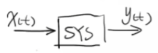
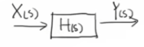
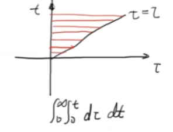
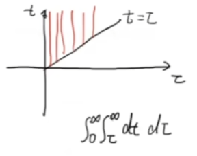

## 《高级控制理论——数学基础》学习笔记

### 4_卷积的拉普拉斯变换 Laplace Transform of Convolution 数学证明

> [《【工程数学基础】4_卷积的拉普拉斯变换 Laplace Transform of Convolution 数学证明》王天威（网名DR_CAN），博士](https://www.bilibili.com/video/BV1fs411p7zD)

#### 意义

卷积的拉普拉斯变换性质是控制理论的核心定理之一，它建立了时域卷积与频域乘积之间的等价关系。该性质揭示了传递函数的物理本质：在频域（S域）上，系统输出等于系统传递函数与输入的乘积；而在时域上，系统输出则是系统冲激响应与输入的卷积。

考虑一个线性时不变系统：

其中

- $x(t)$ 为输入信号，
- $y(t)$ 为输出信号。

在控制理论中，通过拉普拉斯变换将系统转换到频域分析：

其中

- $X(s) = \mathcal{L}\{x(t)\}$ 为输入的拉普拉斯变换，
- $Y(s) = \mathcal{L}\{y(t)\}$ 为输出的拉普拉斯变换，
- $H(s)$ 为系统的传递函数。

三者满足：

$$
Y(s) = H(s) \cdot X(s)
$$

该式表明：**在频域中，系统输出的拉普拉斯变换等于系统传递函数与输入拉普拉斯变换的乘积。**

若对上式进行逆拉普拉斯变换，并利用拉普拉斯变换表可得：

$$
\mathcal{L}^{-1}\{Y(s)\} = \mathcal{L}^{-1}\{H(s) \cdot X(s)\} \\
y(t) = h(t) * x(t)
$$

即系统输出 $y(t)$ 是系统冲激响应 $h(t)$ 与输入 $x(t)$ 的卷积。这一结果将时域分析与频域分析紧密联系在一起。

以下对该性质给出严格的数学证明。

#### 卷积的拉普拉斯变换证明

首先，回顾相关定义：

**拉普拉斯变换**：

$$
X(s) = \mathcal{L}\{x(t)\} = \int_{0}^{\infty} x(t) e^{-st} \, dt
$$

**卷积定义**（针对因果信号）：

$$
x(t) * g(t) = \int_{0}^{t} x(\tau)g(t-\tau) \, d\tau
$$

**待证命题**：

$$
\mathcal{L}\{x(t) * g(t)\} = X(s) \cdot G(s)
$$

---

**证明过程**：

首先对卷积进行拉普拉斯变换：

$$
\mathcal{L}\{x(t) * g(t)\} = \int_{0}^{\infty} \left[ \int_{0}^{t} x(\tau)g(t-\tau) \, d\tau \right] e^{-st} \, dt
$$

这是一个二重积分。原式的积分顺序为：先对 $\tau$ 从 $0$ 到 $t$ 积分，再对 $t$ 从 $0$ 到 $\infty$ 积分，即：

$$
\int_{0}^{\infty} \int_{0}^{t} F(t, \tau) \, d\tau \, dt
$$

为了理解积分顺序的交换，我们先分析积分区域：

**原始积分顺序（先 $\tau$ 后 $t$）的分析：**

- 外层积分 $t \in [0, \infty)$
- 对于每个固定的 $t$，内层积分 $\tau \in [0, t]$

这意味着积分区域中的所有点 $(t, \tau)$ 满足：
$$
0 \leq \tau \leq t < \infty
$$

在 $t-\tau$ 平面上，这是一个以 $t$ 轴为上边界的三角形区域（如下图，$\tau$ 轴为横轴，$t$ 轴为纵轴）。

**交换积分顺序（先 $t$ 后 $\tau$）的分析：**

现在从另一个角度描述这个积分区域：

- 观察 $0 \leq \tau \leq t < \infty$，可以等价地写为两个条件：
  - 条件1：$\tau$ 的取值范围是 $0 \leq \tau < \infty$
  - 条件2：对于固定的 $\tau$，$t$ 必须满足 $\tau \leq t < \infty$

因此，交换积分顺序后：
- 外层积分 $\tau \in [0, \infty)$
- 内层积分 $t \in [\tau, \infty)$

$$
\int_{0}^{\infty} \int_{\tau}^{\infty} F(t, \tau) \, dt \, d\tau
$$

---

**直观理解：**

想象我们用两种方式"扫描"积分区域：

1. **原始方式**：水平扫描。从下往上（$t$ 从 $0 \to \infty$），每条水平线上从左扫到对角线（$\tau$ 从 $0 \to t$）  

2. **交换方式**：垂直扫描。从左到右（$\tau$ 从 $0 \to \infty$），每条竖线上从对角线向上扫到无穷（$t$ 从 $\tau \to \infty$）  

两种扫描方式覆盖的区域完全相同，因此积分值相等。这就是 Fubini 定理的几何直观。

于是原式可改写为：

$$
\mathcal{L}\{x(t) * g(t)\} = \int_{0}^{\infty} \left[ \int_{\tau}^{\infty} x(\tau)g(t-\tau) \, dt \right] e^{-st} \, d\tau
$$

对方括号内关于 $t$ 的积分进行换元。令：

$$
u = t - \tau \quad \Rightarrow \quad t = u + \tau \quad \Rightarrow \quad dt = du + d\tau = du + 0 = du
$$

换元前，积分范围 $t∈[\tau,\infty)$,  
换元后，积分范围 $u=t-\tau,u∈[0,\infty)$。

代入得：

$$
\begin{aligned}
\mathcal{L}\{x(t) * g(t)\} &= \int_{0}^{\infty} \left[ \int_{0}^{\infty} x(\tau)g(u) \, du \right] e^{-s(u+\tau)} \, d\tau \\
&= \int_{0}^{\infty} \left[ \int_{0}^{\infty} x(\tau)g(u) \, du \right] e^{-su} \cdot e^{-s\tau} \, d\tau \\
&= \int_{0}^{\infty} x(\tau) e^{-s\tau} \, d\tau \cdot \int_{0}^{\infty} g(u) e^{-su} \, du \\
&= \mathcal{L}\{x(\tau)\} \cdot \mathcal{L}\{g(u)\} \\
&= X(s) \cdot G(s)
\end{aligned}
$$

---

**结论**：

$$
\boxed{\mathcal{L}\{x(t) * g(t)\} = \mathcal{L}\{x(t)\} \cdot \mathcal{L}\{g(t)\} = X(s) \cdot G(s)}
$$

该证明揭示了：**时域中的卷积运算对应于频域中的乘法运算**。这一性质在控制系统分析、信号处理等领域具有广泛的应用价值。
