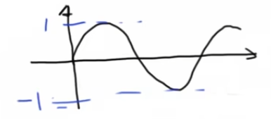
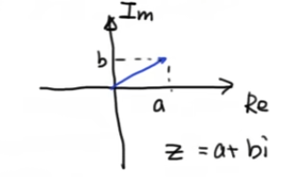
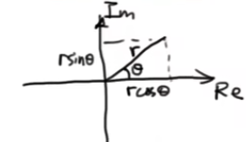

## 《高级控制理论——数学基础》学习笔记

### 6_`SinX=2`？复变函数 欧拉公式

> [《【工程数学基础】6_SinX=2？复变函数 欧拉公式》王天威（网名DR_CAN），博士](https://www.bilibili.com/video/BV1TW411z77n)

> 作者指出："没（什么实际）含义。就是反复运用欧拉公式。巩固记忆。"

## 问题的提出

在实数域中，$\sin x$ 的图像如下所示，其值域为 $[-1,1]$：

这一结论的前提是定义域为实数，即 $x \in \mathbb{R}$。

**问题**：若将定义域扩展到复数域，即 $x \in \mathbb{C}$，是否存在复数解使得 $\sin x = 2$？更一般地，对于 $C > 1$，方程 $\sin z = C$ 是否有解？

## 复数基本知识回顾

### 复数的代数形式

复数可表示为：
$$z = a + bi$$

其中 $i$ 为虚数单位，满足 $i^2 = -1$。在复平面上，横轴为实轴 $\text{Re}$，纵轴为虚轴 $\text{Im}$。

### 复数相等条件

对于两个复数 $Z_1 = a_1 + b_1i$ 和 $Z_2 = a_2 + b_2i$，$Z_1 = Z_2$ 当且仅当：
$$a_1 = a_2 \quad \text{且} \quad b_1 = b_2$$

即：**两个复数相等，当且仅当它们的实部和虚部分别相等**。

### 欧拉公式与复数的指数形式

欧拉公式：
$$e^{i\theta} = \cos\theta + i\sin\theta$$

两边同乘 $r$，得到复数的指数形式：
$$re^{i\theta} = r\cos\theta + ir\sin\theta$$

其中 $r$ 为复数的模，$\theta$ 为辐角。在复平面上，这表示一个长度为 $r$ 的向量，其实部 $a = r\cos\theta$，虚部 $b = r\sin\theta$。

因此，复数有两种等价的表达方式：
- **代数形式**：$Z = a + bi$
- **指数形式**：$Z = re^{i\theta}$

其中：
$$r = \sqrt{a^2 + b^2}, \quad \theta = \arctan\left(\frac{b}{a}\right)$$

## 问题求解

回到原问题：求解方程 $\sin z = C$，其中 $C > 1$ 为实常数。

令复数 $z = a + bi$，其中 $a, b \in \mathbb{R}$。

### 步骤一：导出正弦函数的指数表达式

根据欧拉公式：
$$\begin{aligned}
e^{iz} &= \cos z + i\sin z \qquad \text{①} \\
e^{-iz} &= \cos(-z) + i\sin(-z) = \cos z - i\sin z \qquad \text{②}
\end{aligned}$$

> **注**：$\cos(-z) = \cos z$，$\sin(-z) = -\sin z$ 对任意复数 $z$ 均成立（由欧拉公式可验证）。

①式减去②式：
$$e^{iz} - e^{-iz} = (\cos z + i\sin z) - (\cos z - i\sin z) = 2i\sin z$$

因此，复数正弦函数可表示为：
$$\sin z = \frac{e^{iz} - e^{-iz}}{2i}$$

### 步骤二：代入复数形式

将 $z = a + bi$ 代入方程 $\sin z = C$：
$$\frac{e^{i(a+bi)} - e^{-i(a+bi)}}{2i} = C$$

化简指数部分：
$$\frac{e^{ai}e^{-b} - e^{-ai}e^{b}}{2i} = C$$

再利用欧拉公式展开 $e^{ai}$ 和 $e^{-ai}$：
$$e^{ai} = \cos a + i\sin a, \quad e^{-ai} = \cos a - i\sin a$$

代入得：
$$\frac{(\cos a + i\sin a)e^{-b} - (\cos a - i\sin a)e^{b}}{2i} = C$$

展开并整理分子：
$$\frac{(e^{-b} - e^{b})\cos a + i(e^{-b} + e^{b})\sin a}{2i} = C$$

### 步骤三：分离实部与虚部

分子分母同除以 $i$：
$$\frac{1}{2}(e^{-b} - e^{b})\cos a \cdot (-i) + \frac{1}{2}(e^{-b} + e^{b})\sin a = C$$

整理为标准复数形式：
$$\underbrace{\frac{1}{2}(e^{-b} + e^{b})\sin a}_{\text{实部}} + i\underbrace{\frac{1}{2}(e^{b} - e^{-b})\cos a}_{\text{虚部}} = C + 0i$$

根据复数相等条件，实部和虚部分别相等：
$$\begin{cases}
\displaystyle \frac{e^{-b} + e^{b}}{2}\sin a = C \qquad &\text{--- (实部方程)} \\
\displaystyle \frac{e^{b} - e^{-b}}{2}\cos a = 0 \qquad &\text{--- (虚部方程)}
\end{cases}$$

### 步骤四：解方程组

**首先解虚部方程**：

$$\frac{e^{b} - e^{-b}}{2}\cos a = 0$$

有两种可能：
1. $\cos a = 0$，即 $a = \frac{\pi}{2} + k\pi$，$k \in \mathbb{Z}$
2. $e^{b} - e^{-b} = 0$，即 $e^{b} = e^{-b}$，这意味着 $b = 0$

**接下来解实部方程**：

$$\frac{e^{-b} + e^{b}}{2}\sin a = C$$

- **情形一**：若 $b = 0$

  $$\frac{1 + 1}{2}\sin a = C \Rightarrow \sin a = C$$

  由于 $a \in \mathbb{R}$ 且 $C > 1$，此方程无实数解。

- **情形二**：若 $a = \frac{\pi}{2} + k\pi$

  需要进一步考察 $\sin a$ 的符号：

  - 当 $a = \frac{\pi}{2} + 2k\pi$ 时，$\sin a = 1$
  - 当 $a = \frac{3\pi}{2} + 2k\pi$ 时，$\sin a = -1$

  由于 $C > 1$，必须取 $\sin a = 1$，因此：
  $$a = \frac{\pi}{2} + 2k\pi, \quad k \in \mathbb{Z}$$

  代入实部方程：
  $$\frac{e^{-b} + e^{b}}{2} \cdot 1 = C$$
  $$e^{b} + e^{-b} = 2C$$

  两边同乘 $e^{b}$：
  $$e^{2b} - 2Ce^{b} + 1 = 0$$

  令 $u = e^{b}$（注意 $u > 0$），得：
  $$u^2 - 2Cu + 1 = 0$$

  由求根公式：
  $$u = \frac{2C \pm \sqrt{4C^2 - 4}}{2} = C \pm \sqrt{C^2 - 1}$$

  由于 $C > 1$，两个根均为正数，因此：
  $$e^{b} = C \pm \sqrt{C^2 - 1}$$

  取自然对数：
  $$b = \ln\left(C \pm \sqrt{C^2 - 1}\right)$$

### 步骤五：最终结论

综上所述，对于方程 $\sin z = C$（$C > 1$）：

$$\boxed{z = \frac{\pi}{2} + 2k\pi + i\ln\left(C \pm \sqrt{C^2 - 1}\right), \quad k \in \mathbb{Z}}$$

**特例**：当 $C = 2$ 时，

$$\sin z = 2 \Rightarrow z = \frac{\pi}{2} + 2k\pi + i\ln\left(2 \pm \sqrt{3}\right), \quad k \in \mathbb{Z}$$

## 说明

这个问题的价值在于：
1. 展示了复变函数与实变函数的重要区别：在复数域中，三角函数的值域不再受限于 $[-1, 1]$
2. 通过反复运用欧拉公式，熟练掌握复数与指数形式的相互转换
3. 理解复数方程求解中实部与虚部分离的方法论
