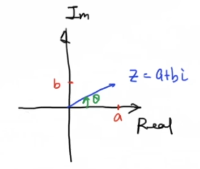

## 《高级控制理论——数学基础》学习笔记

### 7_复数有三种表达，你知道么？

> [《【工程数学基础】7_复数有三种表达，你知道么？》王天威（网名DR_CAN），博士](https://www.bilibili.com/video/BV16b41147Hv)

---

### 复数的引入

为了解决负数开平方的问题，数学家引入了虚数单位 $i = \sqrt{-1}$，从而形成了复数体系。

考虑一元二次方程：
$$
x^2-2x+2=0
$$

根据求根公式：
$$
\begin{aligned}
x &= \frac{-b\pm\sqrt{b^2-4ac}}{2a} \\
&= \frac{2\pm\sqrt{4-8}}{2} \\
&= \frac{2\pm\sqrt{-4}}{2} \\
&= 1 \pm i
\end{aligned}
$$

这个例子说明，当判别式 $b^2-4ac < 0$ 时，实数范围内无解，但在复数范围内有解。

---

### 一、代数形式

#### 定义与表示

复数的代数形式是最直观的表达方式：

$$
Z = a + bi
$$

其中：
- $a$ 称为复数的**实部**，记作 $\text{Re}(Z) = a$
- $b$ 称为复数的**虚部**，记作 $\text{Im}(Z) = b$
- $i$ 是虚数单位，满足 $i^2 = -1$

#### 特例

当 $b = 0$ 时，$Z = a$ 为**实数**
当 $a = 0$ 时，$Z = bi$ 为**纯虚数**

#### 运算规则

**复数加法**：
$$
(a + bi) + (c + di) = (a+c) + (b+d)i
$$

**复数乘法**：
$$
\begin{aligned}
(a + bi)(c + di) &= ac + adi + bci + bdi^2 \\
&= ac + (ad + bc)i + bd(-1) \\
&= (ac - bd) + (ad + bc)i
\end{aligned}
$$

---

### 二、极坐标形式

#### 定义

在复平面上，复数 $Z = a + bi$ 可以表示为一个**模**（长度）和一个**幅角**（方向）。

#### 模的计算

复数的模表示复平面上点到原点的距离：

$$
|Z| = \sqrt{a^2 + b^2}
$$

**示例**：$Z = 3 + 4i$，则 $|Z| = \sqrt{3^2 + 4^2} = 5$

#### 幅角的计算

幅角表示复向量与实轴正方向的夹角：

$$
\theta = \angle Z = \arctan\frac{b}{a}
$$

**注意**：需要根据 $(a, b)$ 所在的象限确定实际角度。

#### 极坐标表示

$$
Z = |Z| \angle \theta
$$

这种形式在进行复数乘除运算时非常方便。

#### 运算规则

**乘法**：模相乘，幅角相加
$$
Z_1 \cdot Z_2 = |Z_1| \angle \theta_1 \cdot |Z_2| \angle \theta_2 = |Z_1||Z_2| \angle (\theta_1 + \theta_2)
$$

**除法**：模相除，幅角相减
$$
\frac{Z_1}{Z_2} = \frac{|Z_1| \angle \theta_1}{|Z_2| \angle \theta_2} = \frac{|Z_1|}{|Z_2|} \angle (\theta_1 - \theta_2)
$$

**乘方**：模的乘方，幅角的倍数
$$
Z^n = (|Z| \angle \theta)^n = |Z|^n \angle n\theta
$$

---

### 三、指数形式

#### 从代数形式到极坐标

将直角坐标与极坐标的关系代入代数形式：

$$
\begin{aligned}
a &= |Z|\cos\theta \\
b &= |Z|\sin\theta
\end{aligned}
$$

根据欧拉公式 $e^{i\theta} = \cos\theta + i\sin\theta$，代入得：

$$
\begin{aligned}
Z &= a + bi \\
&= |Z|\cos\theta + i|Z|\sin\theta \\
&= |Z|(\cos\theta + i\sin\theta) \\
&= |Z|e^{i\theta}
\end{aligned}
$$

这就是复数的**指数形式**，其中：
- $|Z|$ 是模
- $\theta$ 是幅角（单位：弧度）

#### 示例

将 $Z = 1 + i$ 转换为指数形式：

$$
\begin{aligned}
|Z| &= \sqrt{1^2 + 1^2} = \sqrt{2} \\
\theta &= \arctan\frac{1}{1} = \frac{\pi}{4} \\
\therefore Z &= \sqrt{2}e^{i\pi/4}
\end{aligned}
$$

---

### 三种形式的比较

| 形式 | 表示方法 | 适用场景 | 优点 |
|------|---------|---------|------|
| **代数形式** | $Z=a+bi$ | 复数加减运算 | 直观易懂，计算简单 |
| **极坐标形式** | $Z=\|Z\|\angle\theta$ | 幅角、模的分析 | 几何意义明确 |
| **指数形式** | $Z=\|Z\|e^{i\theta}$ | 复数乘除、微分方程 | 运算最为简洁 |

---

### 相互转换示例

**例1**：代数形式 → 指数形式

将 $Z = \sqrt{3} + i$ 转换为指数形式：

$$
\begin{aligned}
|Z| &= \sqrt{(\sqrt{3})^2 + 1^2} = \sqrt{3 + 1} = 2 \\
\theta &= \arctan\frac{1}{\sqrt{3}} = \frac{\pi}{6} \\
\therefore Z &= 2e^{i\pi/6}
\end{aligned}
$$

**例2**：指数形式 → 代数形式

将 $Z = 2e^{i\pi/3}$ 转换为代数形式：

$$
\begin{aligned}
a &= 2\cos\frac{\pi}{3} = 2 \times \frac{1}{2} = 1 \\
b &= 2\sin\frac{\pi}{3} = 2 \times \frac{\sqrt{3}}{2} = \sqrt{3} \\
\therefore Z &= 1 + \sqrt{3}i
\end{aligned}
$$

---

### 复数运算的便利性

不同形式在不同运算中有优势：

**乘法**（指数形式最方便）：
$$
Z_1 \cdot Z_2 = |Z_1|e^{i\theta_1} \cdot |Z_2|e^{i\theta_2} = |Z_1||Z_2|e^{i(\theta_1+\theta_2)}
$$

**除法**（指数形式最方便）：
$$
\frac{Z_1}{Z_2} = \frac{|Z_1|e^{i\theta_1}}{|Z_2|e^{i\theta_2}} = \frac{|Z_1|}{|Z_2|}e^{i(\theta_1-\theta_2)}
$$

**乘方**（指数形式最方便）：
$$
Z^n = (|Z|e^{i\theta})^n = |Z|^n e^{in\theta}
$$

---

### 应用：欧拉恒等式的推导

当 $|Z| = 1$ 且 $\theta = \pi$ 时：

$$
\begin{aligned}
Z &= |Z|e^{i\theta} \\
&= 1 \cdot e^{i\pi} \\
&= \cos\pi + i\sin\pi \\
&= -1 + i \cdot 0 \\
&= -1
\end{aligned}
$$

因此得到著名的**欧拉恒等式**：

$$
e^{i\pi} + 1 = 0
$$

这个公式被誉为"最美的数学公式"，因为它联系了数学中五个最重要的常数：
- $e$：自然对数的底
- $i$：虚数单位
- $\pi$：圆周率
- $1$：乘法单位元
- $0$：加法单位元
