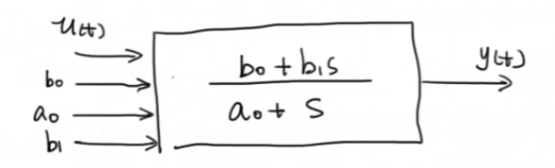
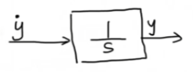
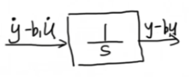
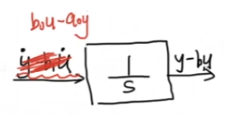
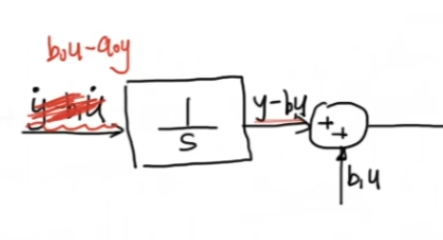
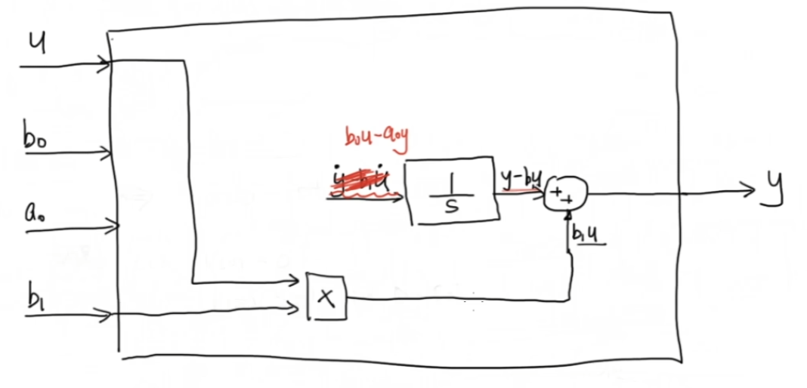
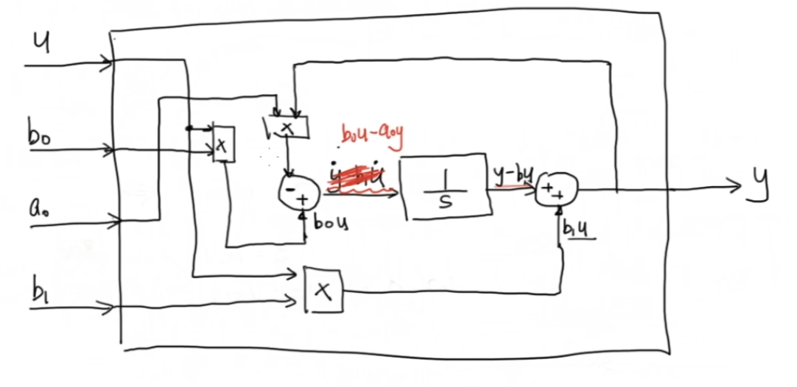
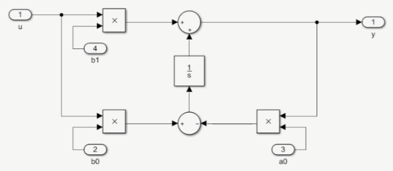
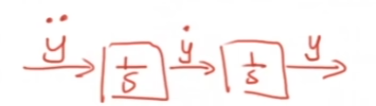

## 《高级控制理论——数学基础》学习笔记

### 8_如何在Matlab Simulink 搭建传递函数？？Transfer Function

> [《【工程数学基础】8_如何在Matlab Simulink 搭建传递函数？？Transfer Function》王天威（网名DR_CAN），博士](https://www.bilibili.com/video/BV1t4411B7UK)

---

给定一阶传递函数的框图：

其中输入为 $u(t)$，输出为 $y(t)$，$a_0, b_0, b_1$ 为系统参数，传递函数为

$$H(s)=\frac{b_0+b_1s}{a_0+s}$$

## 一、微分方程推导

由传递函数定义

$$\frac{Y(s)}{U(s)}=\frac{b_0+b_1s}{a_0+s}$$

交叉相乘得

$$(a_0+s)Y(s)=(b_0+b_1s)U(s)$$

展开整理

$$a_0Y(s)+sY(s)=b_0U(s)+b_1sU(s)$$

利用拉普拉斯逆变换的线性性质 $L^{-1}\{X(s)+Y(s)\}=L^{-1}\{X(s)\}+L^{-1}\{Y(s)\}$ 及微分性质 $L^{-1}\{sX(s)\}=\frac{d}{dt}x(t)$，对等式两边作拉普拉斯逆变换：

$$L^{-1}\{a_0Y(s)+sY(s)\}=L^{-1}\{b_0U(s)+b_1sU(s)\}$$

$$a_0y(t)+\dot{y}(t)=b_0u(t)+b_1\dot{u}(t)$$

移项整理为标准形式

$$\dot{y}(t)-b_1\dot{u}(t)=b_0u(t)-a_0y(t)$$

此即该传递函数对应的时域微分方程。

## 二、Simulink 框图实现

在 Simulink 中，积分模块 $1/s$ 实现积分运算：输入为导数信号时，输出即为原函数。

### 2.1 消除输入导数项

设积分器输入为 $\dot{y}(t)-b_1\dot{u}(t)$，则其输出为

$$\int\left[\dot{y}(t)-b_1\dot{u}(t)\right]dt = y(t)-b_1u(t)$$

根据微分方程 $\dot{y}(t)-b_1\dot{u}(t)=b_0u(t)-a_0y(t)$，可用不含导数的表达式 $b_0u(t)-a_0y(t)$ 作为积分器输入，输出即得 $y(t)-b_1u(t)$。

此方法的本质是将输入导数项通过代数运算消除，避免了直接对输入信号求微分带来的数值稳定性问题。

### 2.2 构建完整框图

为得到最终输出 $y(t)$，需在 $y(t)-b_1u(t)$ 基础上叠加 $b_1u(t)$：

其中 $b_1u(t)$ 通过乘法模块实现：

积分器输入 $b_0u(t)-a_0y(t)$ 通过乘法模块和求和模块构建：

完整的 Simulink 实现框图：

验证可知，此框图与原传递函数等效。

## 三、高阶系统的推广

对于高阶传递函数，可采用串联积分模块的方式实现。以二阶系统为例，最右端为 $\ddot{y}$，经第一个积分器输出 $\dot{y}$，再经第二个积分器输出 $y$：

此方法可推广至任意阶系统，积分器串联数量由系统阶数决定。
