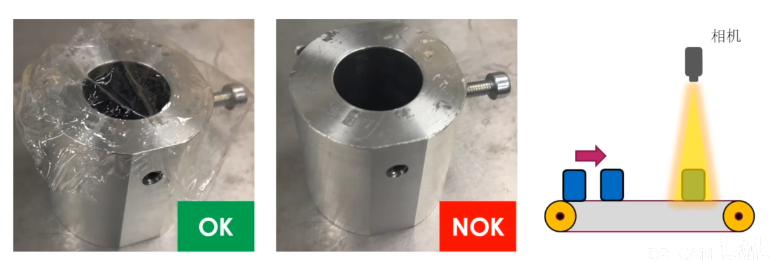
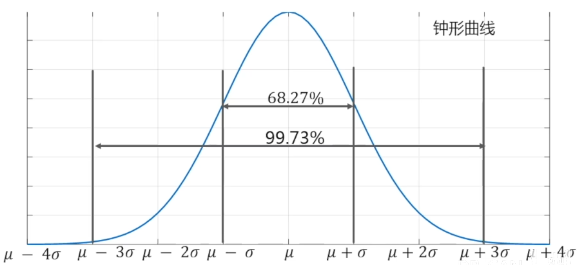
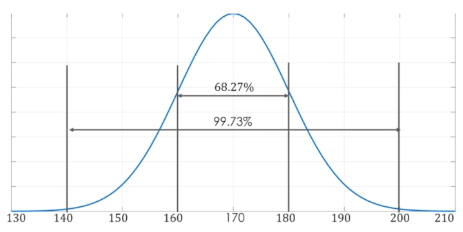
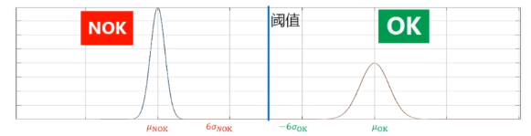
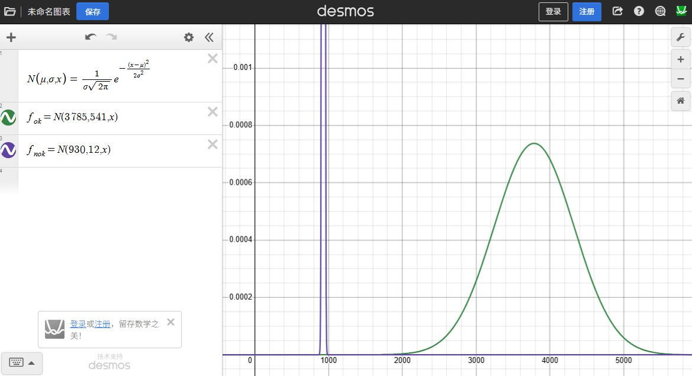

## 《高级控制理论——数学基础》学习笔记

### 9_阈值如何选取？？在机器视觉中应用正态分布和6-Sigma

> [《【工程数学基础】9_阈值如何选取？？在机器视觉中应用正态分布和6-Sigma》王天威（网名DR_CAN），博士](https://www.bilibili.com/video/BV1t4411B7UK)

---


**一、从项目需求说起**

需要在流水线上通过相机拍照判断传送带上的产品是否覆盖有透明塑料膜，有膜为合格品，无膜为不合格品。



**二、实现分类的思路**

观察合格品与不合格品的图像，发现覆盖透明塑料膜的产品有较多明显的反光亮点。

对特征明显的区域放大裁剪，经黑白滤镜处理后，统计图像中的白色像素点数。

统计结果：
- 合格品白色像素点数：3412
- 不合格品白色像素点数：908

可见有塑料膜的产品白色像素点数明显更多，可据此特征区分合格品与不合格品。


**三、阈值的选取**

拍摄10组合格品和不合格品，统计白色像素点数。发现覆盖透明塑料膜的产品的白色像素点数波动范围极大，从两千多到四千多。这是因为环境光源变化及塑料膜褶皱形状差异，导致反光亮点数也差异巨大。

| 测试组 | 合格品 | 不合格品 |
| ------ | ------ | -------- |
| 1      | 3412   | 937      |
| 2      | 4351   | 924      |
| 3      | 4121   | 915      |
| 4      | 3171   | 908      |
| 5      | 3283   | 943      |
| 6      | 2836   | 935      |
| 7      | 4131   | 944      |
| 8      | 4279   | 932      |
| 9      | 4311   | 923      |
| 10     | 3587   | 936      |

直观上，合格品数值均在2000以上，不合格品数值均在1000以下。可设置阈值2000或1000，高于阈值判断为合格品，低于阈值判断为不合格品。

但如何用更科学的手段来确定这个阈值？


**四、概率论知识回顾**

塑料膜在零件上的覆盖状态是随机的，相机本身的误差也是随机的。这些随机变量的概率分布符合正态分布。

$$
X \sim N(\mu, \sigma^2)
$$

其中$\mu$是期望值（平均值），$\sigma^2$是方差。

- 68%的概率落在 $\mu \pm 1\sigma$ 范围内
- 99.7%的概率落在 $\mu \pm 3\sigma$ 范围内




比如统计某城市成年男性的身高，
期望（平均）值为$\mu=170cm$，方差为$\sigma^2=10cm^2=100cm$。

$$
X \sim N(\mu=170, \sigma^2=100)
$$

那么其概率分布就符合正态分布：



其中:
- 68.27%的人的身高在$\mu-\sigma=160cm$和$\mu+\sigma=180cm$之间，
- 95.45%的人的身高在$\mu-2\sigma=150cm$和$\mu+2\sigma=190cm$之间，
- 99.73%的人的身高在$\mu-3\sigma=140cm$和$\mu+3\sigma=200cm$之间。

于是可以大胆预测，若小明是该城市的成年男性，那么其身高99.73%的概率在140cm~200cm之间。


**五、6-Sigma（六西格玛）**

> "六个西格玛是指在正态分布假设下生产的产品中介于六个标准差并且允许制程有1.5个标准差偏移下，有99.99966%的产品是没有质量问题的（每一百万中有3.4个有缺陷）。" ————wikipedia

| $\sigma$ | 良品率    | 次品率   | 每百万残次品数 |
| -------- | --------- | -------- | -------------- |
| 3σ       | 93.3%     | 6.7%     | 66807          |
| 5σ       | 99.977%   | 0.023%   | 233            |
| 6σ       | 99.99966% | 0.00034% | 3.4            |

**注：以上数据均考虑制程1.5σ偏移**


**六、感受6σ下的质量控制**

**快递场景**

| 总包裹量（每天） | 3σ丢失包裹 | 5σ丢失包裹 | 6σ丢失包裹 |
| ---------------- | ---------- | ---------- | ---------- |
| 1亿              | 668万      | 23.3万     | 340        |

- 3σ：1亿包裹 × 6.68% = 668万个丢失
- 6σ：1亿包裹 × 0.00034% = 340个丢失

**生产设备场景**

| 每日生产量 | 3σ出现问题时间 | 5σ出现问题时间 | 6σ出现问题时间 |
| ---------- | -------------- | -------------- | -------------- |
| 200        | 约13次/天      | 约1次/21天     | 约1次/4年      |

- 3σ：200 × 6.68% ≈ 13.4次/天
- 6σ：200 × 0.00034% ≈ 0.00068次/天 → 约1次/4年


**七、回顾分类的需求**

根据测试组的统计数据计算合格品和不合格品的期望值和方差，在同一图中绘制它们的正态分布曲线。

存在两种情况：

**情况一：两曲线6σ位置不重合**

在两曲线的6σ边界之间选取阈值，可实现完美分类。




**情况二：两曲线6σ位置重合**

两类产品的6σ范围存在重叠，无法实现完美分类，需根据业务需求选择策略：

- **False Dismissal（漏检）策略**：以合格品的6σ位置为阈值
  - 优势：不会将不合格品误判为合格品
  - 风险：可能将合格品误判为不合格品

- **False Alarm（假警报）策略**：以不合格品的6σ位置为阈值
  - 优势：不会放过有瑕疵的产品
  - 风险：可能将合格品误判为不合格品


**案例分析**

根据前述测试数据计算期望值和标准差：

| 测试组       | 合格品   | 不合格品 |
| ------------ | -------- | -------- |
| 1            | 3412     | 937      |
| 2            | 4351     | 924      |
| 3            | 4121     | 915      |
| 4            | 3171     | 908      |
| 5            | 3283     | 943      |
| 6            | 2836     | 935      |
| 7            | 4131     | 944      |
| 8            | 4279     | 932      |
| 9            | 4311     | 923      |
| 10           | 3587     | 936      |
| $\mu/\sigma$ | 3785/541 | 930/12   |

**可在Desmos中绘制合格品和不合格品的正态分布曲线**：

```desmos
N\left(\mu,\sigma,x\right)=\frac{1}{\sigma\sqrt{2\pi}}e^{-\frac{(x-\mu)^{2}}{2\sigma^{2}}}
f_{ok}=N(3785,541,x)
f_{nok}=N(930,12,x)
```



**计算6σ范围边界**：

- **合格品**：$\mu \pm 6\sigma = 3785 \pm 6 \times 541 = 3785 \pm 3246$，范围约为 $[539, 7031]$
- **不合格品**：$\mu \pm 6\sigma = 930 \pm 6 \times 12 = 930 \pm 72$，范围约为 $[858, 1002]$

两类产品的6σ范围存在明显重合（重叠区域：$[858, 1002]$），无法通过单一阈值实现完美分类。

**策略选择**

在质量控制场景中，选择 **False Alarm（假警报）策略**更为合理：宁愿将合格品误判为不合格品，也不能漏检放过一个不合格品。

因此，选取阈值 T = 1050（不合格品6σ边界之外的数）。

**误判概率分析**

进一步分析可知，1050在合格品的5σ边界之外：

$$
\mu_{合格} - 5\sigma = 3785 - 5 \times 541 = 1080
$$

根据5σ标准，合格品被误判为不合格品的概率约为 **0.023%**。

若每日生产200个产品，则：

$$
200 \times 0.023\% = 0.046 \text{次/天} \approx \text{1次/21天}
$$

即大约每21天会出现一次将合格品误判为不合格品的情况，这是可以接受的质量控制代价。

**八、自动更新阈值与机器学习思想**

随着测试和生产的不断进行，合格品和不合格品的样本数据持续积累，计算的期望值和方差会越来越准确地反映实际的概率分布，由此推导的阈值也会更加精确。

通过编程实现这一过程：持续收集新数据 → 重新计算期望和方差 → 动态更新阈值。这种基于数据反馈的自动优化机制，本质上体现了人工智能和机器学习的思想。

---

## 本章小结

1. **阈值选取问题**：通过统计特征（如白色像素点数）区分两类产品，需要科学确定分类阈值

2. **正态分布应用**：
   - 随机变量（如产品特征值）服从正态分布：$X \sim N(\mu, \sigma^2)$
   - 68.27%落在 $\mu \pm 1\sigma$，99.73%落在 $\mu \pm 3\sigma$ 范围内

3. **6-Sigma标准**：
   - 6σ良品率达99.99966%，每百万仅3.4个残次品
   - 质量控制随σ标准提高呈指数级改善

4. **分类策略**：
   - 两类6σ范围不重合：在中间位置选取阈值
   - 两类6σ范围重合：根据业务需求选择False Alarm或False Dismissal策略

5. **机器学习思想**：通过持续收集数据更新期望和方差，动态优化阈值，体现数据驱动优化

