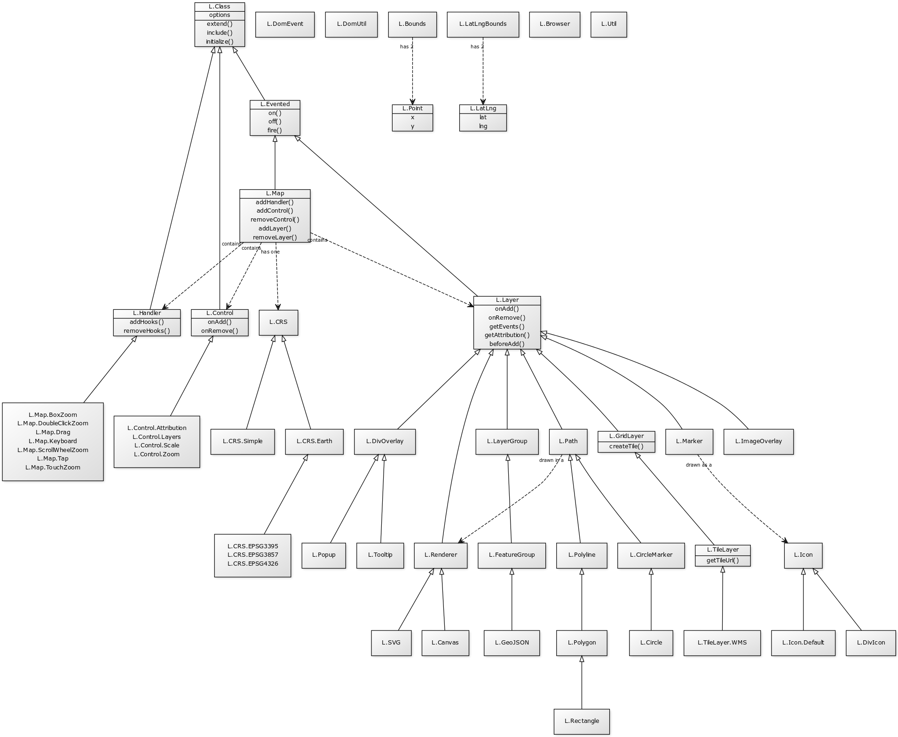

## leafletjs源码阅读笔记

最近写项目用到了leafletjs这个库，官方文档给出的案例代码显示出该库使用到了面向对象的相关概念，使得其易于扩展，已经形成了具有一定规模的插件生态系统，实际编写代码使用该库时也能感受到其架构设计上的优美。该库0依赖，不使用任何其他第三方前端框架，代码量只有42kB，压缩后只有4KB,src目录中只有8,245行代码，并且在文档中找到了一张类图，感觉可以挑战一下。

## 目录

<Catalog />
