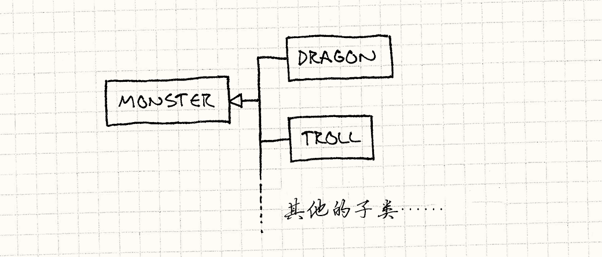
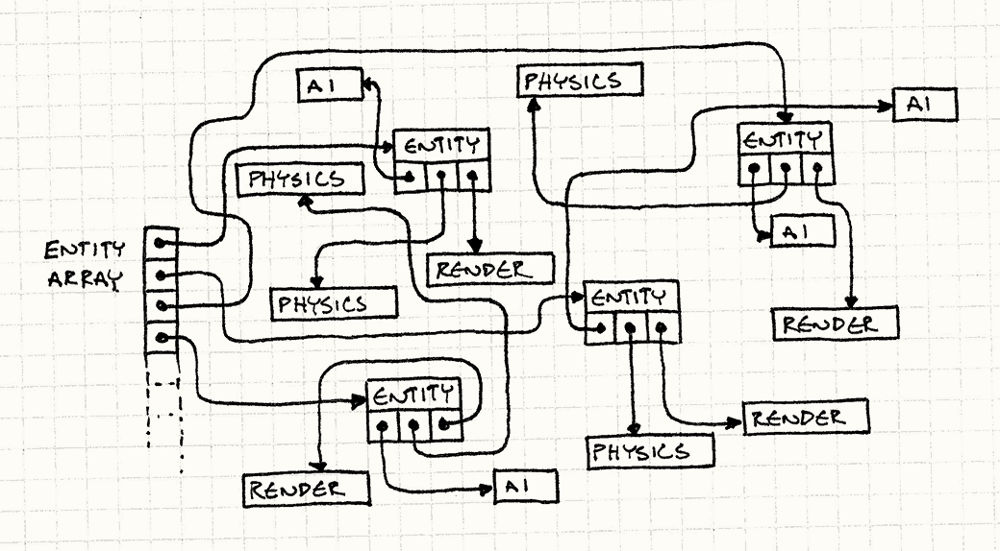

# 《游戏设计模式（game-programming-patterns）》学习笔记


## 目录

- [《游戏设计模式（game-programming-patterns）》学习笔记](#游戏设计模式game-programming-patterns学习笔记)
  - [目录](#目录)
  - [前言：架构，性能和游戏](#前言架构性能和游戏)
  - [重访设计模式](#重访设计模式)
    - [命令模式](#命令模式)
      - [配置输入](#配置输入)
      - [使用命令模式改写优化](#使用命令模式改写优化)
      - [和玩家解耦](#和玩家解耦)
      - [通过命令模式完成撤销操作](#通过命令模式完成撤销操作)
      - [对多重撤销操作的支持](#对多重撤销操作的支持)
      - [闭包函数与命令模式](#闭包函数与命令模式)
    - [享元模式](#享元模式)
      - [使用享元模式来节省内存](#使用享元模式来节省内存)
      - [地形生成](#地形生成)
    - [观察者模式](#观察者模式)
      - [成就解锁](#成就解锁)
    - [原型模式](#原型模式)
      - [怪物生产者](#怪物生产者)
      - [使用原型模式重构](#使用原型模式重构)
    - [单例模式](#单例模式)
    - [状态模式](#状态模式)
      - [为什么要用状态模式？](#为什么要用状态模式)
      - [有限状态机FSMs](#有限状态机fsms)
      - [并发状态机](#并发状态机)
      - [分层状态机](#分层状态机)
  - [序列模式](#序列模式)
    - [双缓冲模式](#双缓冲模式)
  - [行为模式](#行为模式)
    - [类型对象（Type Object）](#类型对象type-object)
      - [从JSON配置中加载并构建物种](#从json配置中加载并构建物种)
  - [解耦模式](#解耦模式)
    - [组件模式](#组件模式)
    - [事件队列](#事件队列)
    - [服务定位器](#服务定位器)
  - [优化模式](#优化模式)
    - [数据局部性](#数据局部性)
      - [什么是数据局部性？](#什么是数据局部性)
      - [不考虑数据局部性导致影响性能的案例](#不考虑数据局部性导致影响性能的案例)
      - [考虑数据局部性的优化方法：使用数组](#考虑数据局部性的优化方法使用数组)
      - [考虑数据局部性的优化方法：打包数据](#考虑数据局部性的优化方法打包数据)
      - [冷热分隔](#冷热分隔)
      - [设计决策](#设计决策)

## 前言：架构，性能和游戏

**关于架构**

- 本书是讨论的是如何组织代码的，或者说是关于架构的
- ==“程序都有一定架构”== ， ==“将所有东西都塞到main()中”== 也是一种架构
- 架构好坏的评判： ==“评价架构设计的好坏就是评价它应对改动有多么轻松。”==

**关于解耦**

- 两块代码是耦合的， 意味着需要阅读理解两块代码
- 如果解耦了它们俩，就可以单独地只阅读理解其中一个部分
- ==“软件架构的关键目标： 最小化在编写代码前需要了解的信息。”==
- 解耦的目标：
  - ==“当一块代码有改动时，不需要修改另一块代码。”== (或者说需要修改的代码很少)
  - ==“耦合程度越小，改动会波及的范围就越小。”==

**追求完美架构的代价**

- 维持好的游戏架构，使其可扩展、可维护、低耦合，需要花费大量精力。
- 无限制的在代码中引入接口、抽象、虚函数，可能最后不仅毫无用处，甚至可能会污染代码，不要提前优化，提前假设某处未来可能会有功能扩展。

**开发的灵活性与运行的高效性**

- ==“ 让代码更灵活的许多模式依靠虚拟调度、 接口、 指针、 消息和其他机制， 它们都会加大运行时开销。”==
- 为了让程序高效的执行，可以 ==“保持代码灵活直到确定设计，再去除抽象层来提高性能。”==

**糟糕代码的优势**

- ==“编写架构良好的代码需要仔细地思考，这会消耗时间。”==
- ==“原型——一坨勉强拼凑在一起，只能完成某个点子的简单代码。”== 可以节约时间。
- 原型代码看上去能工作，但不能被维护，必须重写

**关于平衡**

- 保持代码可读性，需要好的架构。
- 保证代码执行效率,需要好的优化。
- 需要快速将需求实现
- 这些目标至少是部分对立的:
  - 好的架构长期来看提高了生产力， 也意味着每个改动都需要消耗更多努力保持代码整洁。
  - 高度优化的代码不灵活，很难改动。
  - 如果尽可能快地实现特性， 代码库就会充满黑魔法，漏洞和混乱，阻碍未来的产出。
- 没有简单的答案，只有权衡。

## 重访设计模式

> 这里部分主要讨论《设计模式：可复用面向对象软件的基础》中某些设计模式在游戏中的具体应用

### 命令模式

#### 配置输入

一个用命令模式优化的案例


```ts
// 这个函数通常在游戏循环中每帧调用一次
function handleInput() {
  if (isPressed(BUTTON_X)) jump();
  else if (isPressed(BUTTON_Y)) fireGun();
  else if (isPressed(BUTTON_A)) swapWeapon();
  else if (isPressed(BUTTON_B)) lurchIneffectively();
}
```

:::tip 缺点

- 用户的输入和程序行为硬编码在一起了,
- 这导致无法让玩家自定义按键的功能。
  :::

#### 使用命令模式改写优化

> **为了支持玩家配置按键的功能**，可以使用命令模式，  
> 将这些对jump()和fireGun()的直接调用转化为==可替换==的东西。

:::tabs

@tab 定义Command

```ts
// 定义基类代表可触发的游戏行为
interface Command {
  void execute();
}
```

@tab 定义Command子类

然后我们为不同的游戏行为定义相应的子类：

```ts
class JumpCommand implements Command {
    void execute() {
        jump();
    }
};

class FireCommand implements Command {
    void execute() {
        fireGun();
    }
};
```

@tab:active 重写输入处理

在代码的输入处理部分，为每个按键存储一个命令。

```ts
class InputHandler {
  // 绑定命令的方法……
   buttonX_ = new JumpCommand();
   buttonY_ = new FireCommand();
   buttonA_ = new swapWeaponCommand();
   buttonB_ = new lurchIneffectivelyCommand();
  void handleInput(){
    // 现在输入处理部分这样处理：
    if (isPressed(BUTTON_X)) buttonX_.execute();
    else if (isPressed(BUTTON_Y)) buttonY_.execute();
    else if (isPressed(BUTTON_A)) buttonA_.execute();
    else if (isPressed(BUTTON_B)) buttonB_.execute();
  };
};
```

这样，相比于之前的硬编码导致每个输入直接调用函数，现在可以修改按键实际所执行的操作：


:::

#### 和玩家解耦

> 之前的写法其实是假设在execute()函数能够直接操作玩家  
> 现在要进一步解耦，使得命令可以操作除玩家自己之外的角色

```ts
interface Command {
  void execute(Player player);
}
```

现在，可以使用这个类让游戏中的任何角色跳来跳去了。

```ts
class JumpCommand implements Command {
    void execute(Player player) {
        player.jump();
    }
};
```

修改handleInput()，让它可以返回命令：

```ts
class InputHandler {
  // 绑定命令的方法……
  buttonX_ = new JumpCommand();
  buttonY_ = new FireCommand();
  buttonA_ = new swapWeaponCommand();
  buttonB_ = new lurchIneffectivelyCommand();
  handleInput(): Command {
    if (isPressed(BUTTON_X)) return buttonX_;
    if (isPressed(BUTTON_Y)) return buttonY_;
    if (isPressed(BUTTON_A)) return buttonA_;
    if (isPressed(BUTTON_B)) return buttonB_;
    // 没有按下任何按键，就什么也不做
    return NULL;
  }
}
```

可以让玩家控制游戏中的任何角色，只需向命令传入不同的角色。

```ts
Command cmd = inputHandler.handleInput();
cmd && cmd.execute(this);
```

现在玩家和AI可以使用相同的命令；AI代码只需生成Command对象。

```ts
class Player{
    update(dt:number){
        Command cmd = inputHandler.handleInput();
        cmd && cmd.execute(this);
    }
}
class AI{
    update(dt:number){
        Command cmd = getNextCommand();
        cmd && cmd.execute(this);
    }
}
```

通过命令流，解耦消费者和生产者。

- 控制器或者AI，产生一系列命令放入流中
- 调度器或者角色自身，调用并消耗命令


#### 通过命令模式完成撤销操作

一个可以实现撤销操作的案例代码

```ts
class MoveUnitCommand implements Command
{
  Unit unit_;
  int x_, y_,xBefore_,yBefore_;
  constructor(Unit unit, int x, int y){
    // 记录被操作的对象
    unit_ = unit;
    // 记录目标位置
    x_ = x;
    y_ = y;
    // 记录当前位置
    xBefore_ = unit_.x;
    yBefore_ = unit_.y;
  };
  void execute(){
    unit_.moveTo(x_, y_);
  }
  void undo(){
    // 撤销操作
    unit_.moveTo(xBefore_, yBefore_);
  }
};
```

```ts
Command handleInput()
{
  Unit unit = getSelectedUnit();
  if (isPressed(BUTTON_UP)) {
    // 向上移动单位
    int destY = unit.y - 1;
    return new MoveUnitCommand(unit, unit.x, destY);
  }
  if (isPressed(BUTTON_DOWN)) {
    // 向下移动单位
    int destY = unit.y + 1;
    return new MoveUnitCommand(unit, unit.x, destY);
  }
  // 其他的移动……
  return NULL;
}

Command cmd = handleInput()
cmd.execute()
cmd.undo()
```

#### 对多重撤销操作的支持

> 可以用于游戏地图、关卡编辑器

支持多重的撤销也不太难。 我们不单单记录最后一条指令，还要记录指令列表，然后用一个引用指向 “当前” 的那个。 当玩家执行一条命令，我们将其添加到列表，然后将代表 “当前” 的指针指向它。


#### 闭包函数与命令模式

> 在某种程度上说，命令模式是为一些没有闭包的语言模拟闭包。

```ts
function makeMoveUnitCommand(unit, x, y) {
  var xBefore, yBefore;
  // 这里返回的就是一个命令对象
  return {
    execute: function () {
      xBefore = unit.x();
      yBefore = unit.y();
      unit.moveTo(x, y);
    },
    undo: function () {
      unit.moveTo(xBefore, yBefore);
    },
  };
}
```

```ts
Command handleInput()
{
  Unit unit = getSelectedUnit();
  if (isPressed(BUTTON_UP)) {
    // 向上移动单位
    int destY = unit.y - 1;
    return makeMoveUnitCommand(unit, unit.x, destY);
  }
  return NULL;
}
Command cmd = handleInput()
cmd.execute()
cmd.undo()
```

### 享元模式

> 这个部分的内容，个人感觉，总结成一句话，就是要把游戏中的某些相同的对象的共有的不变的属性抽取出来，在内存中共用一份，节省内存。

#### 使用享元模式来节省内存

:::tabs

@tab **一种表示树的方式**

```cpp
class Tree {
  private:
    Mesh mesh_;
    Texture bark_;
    Texture leaves_;

    Vector position_;
    double height_;
    double thickness_;
    Color barkTint_;
    Color leafTint_;
};
```


@tab **另一种表示方式**

> 把共有的部分抽取出来，只在内存中保留一份

```cpp
class TreeModel {
  private:
    Mesh mesh_;
    Texture bark_;
    Texture leaves_;
};

class Tree {
  private:
    TreeModel* model_;

    Vector position_;
    double height_;
    double thickness_;
    Color barkTint_;
    Color leafTint_;
};
```


:::

#### 地形生成

**定义地形**

```ts
enum Terrain {
  TERRAIN_GRASS,
  TERRAIN_HILL,
  TERRAIN_RIVER,
  // ......
}
```

**定义地图**

```ts
class World {
  Terrain tiles_[WIDTH][HEIGHT];
}
```

**一种获取移动成本和判断是否是水地的算法**

```ts
class World {
  int getMovementCost(int x, int y) {
    switch (tiles_[x][y])
    {
      case TERRAIN_GRASS: return 1;
      case TERRAIN_HILL:  return 3;
      case TERRAIN_RIVER: return 2;
        // 其他地形……
    }
  }

  bool isWater(int x, int y) {
    switch (tiles_[x][y])
    {
      case TERRAIN_GRASS: return false;
      case TERRAIN_HILL:  return false;
      case TERRAIN_RIVER: return true;
        // 其他地形……
    }
  }
};
```

**优化：定义实际的地形类，使得可以方便的获取移动成本**

```ts
class Terrain
{
  int movementCost_;
  bool isWater_;
  Texture texture_;
  Terrain(int movementCost,bool isWater,Texture texture){
    movementCost_=movementCost;
    isWater_=isWater;
    texture_=texture;
  }
  int getMovementCost() const { return movementCost_; }
  bool isWater() const { return isWater_; }
  Texture getTexture() const { return texture_; }
};
```

一种简单的地形生成算法

```ts
// 也可以把这个枚举定义成World的属性,使其生命周期和world保持一致
enum Terrain
{
  TERRAIN_GRASS = new GRASS(1, false, GRASS_TEXTURE),
  TERRAIN_HILL = new HILL(3, false, HILL_TEXTURE),
  TERRAIN_RIVER = new RIVER(2, false, RIVER_TEXTURE)
  // ......
};

class World {
  Terrain tiles_[WIDTH][HEIGHT];
  // 生成地形
  void generateTerrain() {
    for (int x = 0; x < WIDTH; x++) {
      for (int y = 0; y < HEIGHT; y++) {
        if (random(10) == 0) {
          // 加入一些丘陵
          tiles_[x][y] = Terrain.TERRAIN_HILL;
        } else {
          // 将地面填满草皮.
          tiles_[x][y] = Terrain.TERRAIN_GRASS;
        }
      }
    }
    // 放置河流
    int x = random(WIDTH);
    for (int y = 0; y < HEIGHT; y++) {
      tiles_[x][y] = Terrain.TERRAIN_RIVER;
    }
  }
}
```

用这种方式，World不再与各种地形的细节耦合。

```ts
class World {
  Terrain tiles_[WIDTH][HEIGHT];
  // 获取某个位置的地形
  void getTile(int x, int y) {
    return tiles_[x][y];
  }
}
```

**获取经过某地的成本**

```ts
// 获取经过某地的成本
int cost = world.getTile(2, 3).getMovementCost();
```

### 观察者模式

#### 成就解锁

实现一个成就系统，可能需要在触发一些事件后去判断是否可以解锁某些成就，比如在物理引擎的地方判断玩家是否落水，但把解锁某些成就的代码直接夹杂在这些地方可能会导致代码的高耦合不可维护，解决办法就是使用观察者模式来解耦，以下是作者提供的一个案例。

::: tabs

@tab:active Physics.ts

```ts
class Physics extends Subject{
  void updateEntity(Entity& entity){
    bool wasOnSurface = entity.isOnSurface();
    entity.accelerate(GRAVITY);
    entity.update();
    bool isOnSurface = entity.isOnSurface();
    // 说明有物体从地表坠入深渊
    if (wasOnSurface && !isOnSurface) {
      notify(entity, EVENT_START_FALL);
    }
  }
}
```

@tab Subject.ts

```ts
class Subject{
  observers = []
  void addObserver(observer){ observers.push(observer); }
  void delObserver(observer){ observers.remove(observer); }
  void notify(Entity entity, Event event){
    observers.forEach(
      item => item.onNotify(entity,event)
    );
  }
}
```

@tab Achievements.ts

```ts
class Achievements implements Observer{
  bool heroIsOnBridge_;
  void onNotify(Entity entity, Event event) {
    switch (event) {
      case EVENT_ENTITY_FELL:
        if (entity.isHero() && heroIsOnBridge_)
          unlock(ACHIEVEMENT_FELL_OFF_BRIDGE);
        break;
      case XXX:
        // 处理其他事件，更新heroIsOnBridge_变量……
    }
  }
  void unlock(Achievement achievement) {
    // 如果还没有解锁，那就解锁成就……
  }
}
```

@tab Observer.ts

```ts
interface Observer{
  void onNotify(Entity entity, Event event);
}
```

:::

**总的来说**，就是在物理引擎检测到发生了什么事件之后，调用notify()函数，遍历所有观察者，通知所有观察者这个事件发生了。


**优点**

- 不存在比如“事件”，“消息”的概念，没有使用队列，或者为每个通知动态分配内存。
- 发送通知只需简单地遍历列表，调用方法。

**缺点**

- 观察者模式是同步的。 被观察者直接调用了观察者上的方法，这意味着直到所有观察者的通知方法返回后， 被观察者才会继续自己的工作。==观察者会阻塞被观察者的运行==。
- 当你有耗时的操作要执行时，应当将这些操作推到另一个线程或工作队列中去。
- 需要小心地在观察者中混合线程和锁。
  - 如果观察者试图获得被观察者拥有的锁，游戏就进入死锁了。
  - 在多线程引擎中，你最好使用事件队列来做异步通信。

**“它做了太多动态分配”**

> 观察者列表随着观察者的添加和删除而动态地增长和缩短。 这种内存的分配吓坏了一些人，觉得：“它做了太多动态分配”。  
> 实际上，需要注意的事情是只在观察者加入时分配内存。 发送通知无需内存分配——只需一个方法调用。 如果你在游戏一开始就加入观察者而不乱动它们，分配的总量是很小的。  
> 下面是一种无需任何动态分配的方式来增加和删除观察者的方法。

**链式观察者**

单链表结构的链式观察者


单链表结构的链式观察者
::: tabs

@tab Subject.ts

```ts
class Subject {
  head = null;
  // 附加观察者
  addObserver(Observer observer) {
    observer.next = head;
    head = observer;
  }
  // 删除观察者
  delObserver(Observer observer) {
    // 删头节点
    if(observer==head){
      head = observer.next
      observer.next = null
      return;
    }
    // 删非头节点
    Observer cur = head;
    while(cur) {
      if(cur.next == observer) {
        cur.next = observer.next
        observer.next = null
        break;
      }
      cur = cur.next
    }
  }
  // 通知
  notify() {
    Observer cur = head;
    while(cur) {
      cur.onNotify();
      cur = cur.next;
    }
  }
}
```

@tab Observer.ts

```ts
class Observer {
  next = null;
  onNotify();
}
```

:::

双链表结构的链式观察者

::: tabs

@tab Subject.ts

```ts
class Subject{
  head = null;
  // 附加观察者
  addObserver(Observer observer){
    if(head!=null) head.prev = observer
    observer.next = head;
    head = observer;
  }
  // 删除观察者
  delObserver(Observer observer){
    // 调整前后两节点的指针
    if(observer.prev) observer.prev.next = observer.next
    if(observer.next) observer.next.prev = observer.prev
    // 处理删除头节点的特殊情况
    if(observer==head) head = observer.next
  }
  // 通知
  notify(){
    Observer cur = head;
    while(cur){
      cur.onNotify();
      cur = cur.next;
    }
  }
}
```

@tab Observer.ts

```ts
// 双链表结构
class Observer {
  prev = null;
  next = null;
  onNotify();
}
```

:::

::: tip 链式观察者的缺点

由于观察者的后继指针是观察者的一个属性，这意味着一个观察者同时只能存在于一条链中，也就是说一个观察者只能观察一个被观察者。

:::

**链表节点池**

> 为了解决上述问题，链式观察者的实现方式会使得一个观察者只能观察一个对象，这里的解决方案就是，定义一个链表节点对象，让其指针域指向真正的观察者，这样一个观察者可以被多个节点对象所指，那他就可以在多条链上，就可以观察多个对象。  
> 这样,避免频繁动态分配就变得简单了，现在每个链表节点的大小就是固定的了，可以预先在对象池中分配它们。以便重用、随用随取


**销毁被观察者或观察者对另一半的影响**

- 使用delete删除观察者后，
  - 被观察者想通知观察者时，观察者的地址已经悬空了。
- 使用delete删除被观察者，
  - 观察者可能不保存被观察者的引用，所以影响不大。
  - 观察者如果仍然保存被观察者的引用，则该地址也悬空了。
  - 观察者可能不知情，仍然期待收到通知

对于第一种情况，解决的办法就是，观察者在被销毁时，需要把自己从观察者列表中删除。

对于第二种情况，解决的办法就是，在被观察者销毁时，向所有观察者发送“死亡通知”。

- 更安全的方案是在每个被观察者销毁时，让观察者自动取消注册。可以在观察者基类中实现了这个逻辑。这需要在观察者中维护一个被观察者的列表。

这样就做到了：

- 观察者在被销毁时，被观察者要在其所维护的观察者列表中删除它。
- 被观察者在被销毁时，观察者要在其所维护的被观察者列表中删除它。

**失效监听者问题**

开发者可能认为自己所使用的语言有垃圾回收机制就不用关心上述问题，实际上，这里原书作者给了一个案例，场景类中有一个UI类，UI类是一个观察者，玩家类是一个被观察者，玩家进入场景，UI类被注册成为玩家类的观察者，玩家受到攻击后，通知UI类更新血量。这看起来没什么问题。
但是如果玩家离开场景，进入新的场景的话，UI类没有取消注册为观察者，那么玩家类就始终保留着上一个场景UI类的引用，那么这些失效的UI类将始终不会被垃圾回收机制清理，玩家的任何状态变化将会发送给这些UI类上。

### 原型模式

#### 怪物生产者

假设我们游戏中每种怪物都有不同的类——Ghost，Demon，Sorcerer，每种敌人有不同的生产者。

以下是一种暴力实现方式

:::tabs

@tab 怪物

```ts
class Monster {}

class Ghost extends Monster {}

class Demon extends Monster {}

class Sorcerer extends Monster {}
```

@tab 怪物产卵者

```ts
class Spawner {
  spawnMonster(): Spawner;
}

class Ghost_Spawner extends Spawner {
  spawnMonster() {
    return new Ghost();
  }
}

class Demon_Spawner extends Spawner {
  spawnMonster() {
    return new Demon();
  }
}

class Sorcerer_Spawner extends Spawner {
  spawnMonster() {
    return new Sorcerer();
  }
}
```

:::

:::info 这种写法所存在的问题

众多类，众多引用，众多冗余，众多副本，众多重复自我……

:::

#### 使用原型模式重构


:::tabs

@tab 怪物

```ts
interface Monster {
  clone(): Monster;
}
```

@tab Ghost.ts

```ts
class Ghost implements Monster {
  health;
  speed;
  Ghost clone(){
    return new Ghost(health,speed);
  };
};
```

@tab:active 怪物产卵者

```ts
class Spawner {
  self: Monster;
  constructor(self: Monster) {
    this.self = self;
  }
  spawnMonster() {
    return this.self.clone();
  }
}
```

@tab 创建各种生产者

> 这种模式就意味着可以创建一个生产者，生产快速鬼魂，虚弱鬼魂，慢速鬼魂，而只需创建一个合适的原型鬼魂。

```ts
Spawner ghostSpawner = new Spawner(new Ghost(15, 3));
```

:::

**编写clone()的痛苦**

这种优化方式虽然不需要为每个怪物创建单独的生产者类了。
但确需要在每个怪物类中实现clone()。 这和使用生产者方法比起来也没节约多少代码量。

原书作者对这种模式提到了三个问题：

- 深拷贝和浅拷贝的问题
- 使用这个模式需要以每个怪物拥有独立的类作为前提
- 使用庞杂的类层次来组织游戏非常痛苦

原书内容：

> 当你坐下来试着写一个正确的clone()，会遇见令人不快的语义漏洞。 做深层拷贝还是浅层拷贝呢？换言之，如果恶魔拿着叉子，克隆恶魔也要克隆叉子吗？
>
> 同时，这看上去没减少已存问题上的代码， 事实上还增添了些人为的问题。 我们需要将每个怪物有独立的类作为前提条件。 这绝对不是当今大多数游戏引擎运作的方法。
>
> 我们中大部分痛苦地学到，这样庞杂的类层次管理起来很痛苦， 那就是我们为什么用组件模式和类型对象为不同的实体建模，这样无需一一建构自己的类。

**生产函数的写法**

> 这种写法实际上和上面的差不多

:::tabs

@tab spawnGhost

```ts
function spawnGhost() {
  return new Ghost();
}
```

@tab Spawner

```ts
class Spawner {
  constructor(private func:Function){}
  Monster spawnMonster(){
    return func();
  }
}
```

@tab 构建生产者

```ts
Spawner ghostSpawner = new Spawner(spawnGhost);
```

:::

**原型语言范式**

- “面向对象编程”和“类”不是同义词
- 面向对象的特性是它将状态和行为紧紧地绑在一起。
- 但基于类的语言实际将状态和行为割裂开来。

**基于类的面向对象**

基于类的面向对象实际上是把实例对象的状态和方法分来存储的


**Self语言**

> 从定义上来说，这是一种比基于类的语言更加面向对象的语言。

Self语言将一个对象的状态和方法绑定在了一起


Self中通过委托来实现继承，一个对象获取一个属性或方法，先在对象内部找，找不到就去父级找，直到没有父对象为止。


**Self语言的优点**

- 创建新的实例的方式是使用克隆。
- 每个对象都自动支持原型设计模式。
- 无需自己实现clone()；就实现了原型模式，原型被内建在系统中。

**在Self语言中创建对象**

> 在Self语言中，就好像每个对象都自动支持原型设计模式。 任何对象都能被克隆。为了获得一堆相似的对象，你：
>
> - 将对象塑造成你想要的状态。你可以直接克隆系统内建的基本Object，然后向其中添加字段和方法。
> - 克隆它来产出……额……随你想要多少就克隆多少个对象。

```ts
// 根据上述论述，我猜写法大概是这样的。
function creatMyObj() {
  let obj = {};
  obj.xxx = 123;
  obj.say = function () {
    console.log("say....");
  };
  return obj;
}
let obj1 = creatMyObj();
let obj2 = obj1.clone();
let obj3 = obj1.clone();
let obj4 = obj1.clone();
```

**JavaScript**

> Brendan Eich，JavaScript的缔造者， 从Self语言中直接汲取灵感，很多JavaScript的语义都是基于原型的。

- js是有原型的函数，但是没有clone()方法
- 每个对象都有属性的集合,这些属性可以是字段也可以是方法
- 但实践中，JavaScript更像是基于类的而不是基于原型的语言。
- 因为它除去了基于原型语言的核心操作“克隆”。

在JavaScript中定义类和创建对象的经典方法：

```ts
// 构造器函数
function Weapon(range, damage) {
  this.range = range;
  this.damage = damage;
}
// 在其原型对象上定义方法
Weapon.prototype.attack = function (target) {
  if (distanceTo(target) > this.range) {
    console.log("Out of range!");
  } else {
    target.health -= this.damage;
  }
};
let sword = new Weapon(10, 16);
```


**new 操作所作的事**

```ts
// new 操作所作的事
function myNew(constructor, ...args) {
  // 创建一个空对象
  let obj = {};
  // 链接原型链
  obj.__proto__ = constructor.prototype;
  // 绑定this
  let result = constructor.apply(obj, args);
  return result;
}
```

**为数据模型构建原型**

- 早期的游戏在程序中生成几乎所有东西
- 今日的游戏中代码只是驱动游戏的“引擎”，游戏是完全由数据定义的。
- 游戏数据达到一定规模时，可以使用原型和委托来重用数据。
  - 可以使用JSON定义数据模型
  - 可以为对象添加"prototype"字段，记录委托对象的名字。 如果在此对象内没找到一个字段，那就去委托对象中查找。

```json
{
  "name": "goblin grunt",
  "minHealth": 20,
  "maxHealth": 30,
  "resists": ["cold", "poison"],
  "weaknesses": ["fire", "light"]
}
{
  "name": "goblin wizard",
  "prototype": "goblin grunt", // 原型
  "spells": ["fire ball", "lightning bolt"]
}
{
  "name": "goblin archer",
  "prototype": "goblin grunt", // 原型
  "attacks": ["short bow"]
}
```

### 单例模式

> 这一章作者主要介绍了为什么要避免使用单例模式。

**缺点**

- 单例模式实际上是全局变量，
  - 全局变量使得理解代码更加困难
  - 促进了耦合的发生，比如要完成需求：“岩石撞击地面时播放声音”，新入行的游戏开发者可能会直接在物理引擎中引入Audio单例播放声音，这使得两个不相关的部分耦合了。
  - 单例全局变量在多线程的环境下可能导致死锁的发生。
- 惰性加载的单例剥夺了你对游戏性能的控制权：如果初始化一个音频需要几百毫秒，那么这在游戏中造成的延迟会降低玩家的游戏体验。

**有时候你可能不需要名为管理类的各种单例**

> 管理器类有时是有用的，但通常它们只是反映出作者对OOP的不熟悉。

:::tabs

@tab 常见的管理类写法

```cpp
class Bullet
{
  public:
    int getX() const { return x_; }
    int getY() const { return y_; }

    void setX(int x) { x_ = x; }
    void setY(int y) { y_ = y; }

  private:
    int x_, y_;
};

class BulletManager
{
  public:
    Bullet* create(int x, int y)
    {
      Bullet* bullet = new Bullet();
      bullet->setX(x);
      bullet->setY(y);

      return bullet;
    }

    bool isOnScreen(Bullet& bullet)
    {
      return bullet.getX() >= 0 &&
             bullet.getX() < SCREEN_WIDTH &&
             bullet.getY() >= 0 &&
             bullet.getY() < SCREEN_HEIGHT;
    }

    void move(Bullet& bullet)
    {
      bullet.setX(bullet.getX() + 5);
    }
};
```

@tab 管理类完全可以被优化掉

```cpp
class Bullet
{
  public:
    Bullet(int x, int y) : x_(x), y_(y) {}

    bool isOnScreen()
    {
      return x_ >= 0 && x_ < SCREEN_WIDTH &&
             y_ >= 0 && y_ < SCREEN_HEIGHT;
    }

    void move() { x_ += 5; }

  private:
    int x_, y_;
};
```

:::

**将类限制为单一的实例**

- 上面讨论了单例模式的特性全局访问的缺点。
- 下面这种方式通过保证类只被初始化一次来创建单例避免了全局访问，甚至可以是私有的。
- 缺点是只在运行时检测

```ts
class FileSystem {
  static bool instantiated_ = false;
  constructor(){
    if(instantiated_) throw new Error("该类只能被初始化一次")
    instantiated_ = true;
  }
  destory(){
    instantiated_ = false;
  }
};
```

**单例模式其他替代选项**

> 便利的访问是使用单例的一个主要原因。但便利的代价是，在不想要的地方也能轻易使用。

1. **作为参数传进来**，大概意思就是 `something.update(game,player,ctx);`
2. **把单例放在基类中**

   - 这可以保证其是单例
   - 还可以实现所有派生类都可以方便的访问到
   - 还可以保证类之外无法访问

   ```ts
    class GameObject {
      private static Log log_;
      protected Log getLog() { return log_; }
    }
    class Enemy extends GameObject {
      void doSomething() {
        getLog().write("I can log!");
      }
    };
   ```

3. **直接从全局获取**

   - 完全移除所有全局变量并不显示
   - 游戏中总有一些东西是全局可见的。
   - 可以让现有的全局对象捎带需要的东西，来减少全局变量类的数目。

   ```ts
   class Game {
    static Game instance_;
    Log         *log_;
    FileSystem  *fileSystem_;
    AudioPlayer *audioPlayer_;
    // game是全局可见的单例
    static Game& instance() { return instance_; }
    // log是非全局可见的单例
    Log&         getLog()         { return *log_; }
    FileSystem&  getFileSystem()  { return *fileSystem_; }
    AudioPlayer& getAudioPlayer() { return *audioPlayer_; }
   };
   ```

   ```ts
   // 只有Game是全局可见的。 函数可以通过它访问其他系统。
   Game::instance().getAudioPlayer().play(VERY_LOUD_BANG);
   ```

4. **从服务定位器中获得。**
   - 另一种选项是定义一个类，存在的唯一目标就是为对象提供全局访问。 这种常见的模式被称为服务定位器模式

### 状态模式

#### 为什么要用状态模式？

> 先看一段冗长的代码
>
> - 这种代码比较难维护，需要判断各种特殊情况.
> - 添加新功能非常困难，修改代码需要理清所有分支的关系来防止bug发生。

```ts
class Heroine{
   void handleInput(Input input){
    // 按下B
     if (input == PRESS_B){
      // 不处于跳跃和卧倒状态（特殊情况判断）
       if (!isJumping_ && !isDucking_){
          isJumping_ = true;// 标记为跳跃状态
         setGraphics(IMAGE_JUMP);
         jump();
       }
     }
    //  按下卧倒键
     else if (input == PRESS_DOWN){
      // 判断保证不处于跳跃状态（特殊情况判断）
       if (!isJumping_){
         isDucking_ = true;// 标记为卧倒状态
         setGraphics(IMAGE_DUCK);
         duck();
       } else {
        // 如果处于跳跃状态则切换到下落状态
         isJumping_ = false;
         setGraphics(IMAGE_DIVE);
         falling();
       }
     }
    //  如果松开卧倒键
     else if (input == RELEASE_DOWN){
      // 则从卧倒切换到站立状态（特殊情况判断）
       if (isDucking_){
        // 站立……
        setGraphics(IMAGE_STAND);
        stand();
       }
     }
   }
}
```

#### 有限状态机FSMs

如何画流程图

给英雄每件能做的事情都画了一个盒子：站立，跳跃，俯卧，跳斩。 当角色在能响应按键的状态时，你从那个盒子画出一个箭头，标记上按键，然后连接到她变到的状态。


**状态机的要点**

- 定义状态机所有可能状态。
- 状态机同时只能在一个状态。
- 状态机将处理输入。
- 根据不同的输入和当前的状态，状态将发生转移。

**枚举和分支**

上面一个案例的错误之处在于把if和各种标识符混在一起了，实际上,结合枚举状态和Switch分支就能改成状态模式,

这是实现状态机最简单的方法:

**简易状态模式**

```ts
enum State {
  STATE_STANDING,
  STATE_JUMPING,
  STATE_DUCKING,
  STATE_DIVING
};

class Heroine{

  // 当前状态
  state_ = State.STATE_STANDING;

  void handleInput(Input input){
    switch (state_) {
      // 当前处于站立状态
      case STATE_STANDING:
        // 处理输入
        if (input == PRESS_B) {
          // 切换状态
          state_ = STATE_JUMPING;
          // 进入状态
          yVelocity_ = JUMP_VELOCITY;
          setGraphics(IMAGE_JUMP);
        }
        // 处理输入
        else if (input == PRESS_DOWN) {
          // 切换状态
          state_ = STATE_DUCKING;
          // 进入状态
          setGraphics(IMAGE_DUCK);
        }
        break;

      case STATE_JUMPING:
        if (input == PRESS_DOWN) {
          state_ = STATE_DIVING;
          setGraphics(IMAGE_DIVE);
        }
        break;

      case STATE_DUCKING:
        if (input == RELEASE_DOWN) {
          state_ = STATE_STANDING;
          setGraphics(IMAGE_STAND);
        }
        break;
      }
   }
}
```

**上述写法的不完美之处**

> 考虑一个新的需求，玩家可以在俯卧时充能。

**这需要：**

1. 添加一个字段记录充能的时长
2. 在进入俯卧状态时将字段清空
3. 在俯卧状态时将字段自增
4. 在充能完毕后释放技能

总之，为了增加这个充能攻击的新特性，需要修改添加一个字段，需要修改两个状态的相关代码。

```ts
class Heroine{

  // 当前状态
  state_ = State.STATE_STANDING;
  // 1.添加一个字段记录充能的时长
  chargeTime = 0;

  void handleInput(Input input){
    switch (state_) {
      // 处于站立状态
      case STATE_STANDING:
        if (input == PRESS_DOWN) {
          // 切换到俯卧状态
          state_ = STATE_DUCKING;
          // 进入俯卧状态
          setGraphics(IMAGE_DUCK);
          // 2. 在进入俯卧状态时将字段清空
          chargeTime = 0;
        }
        break;
      // 处于俯卧状态
      case STATE_DUCKING:
        // 3. 在俯卧状态时将字段自增
        chargeTime++;
        if (chargeTime_ > MAX_CHARGE) {
          // 4. 在充能完毕后释放技能
          superBomb();
        }
        if (input == RELEASE_DOWN) {
          state_ = STATE_STANDING;
          setGraphics(IMAGE_STAND);
        }
        break;
      }
   }
}
```

**面向对象的状态设计模式**

:::tabs

@tab 定义状态接口

```ts
interface PlayerState {
  void handleInput(Player player, Input input);
  void update(Player player);
};
```

@tab 为每个状态编写类

```ts
class DuckingState extends PlayerState{
  // 将chargeTime放到了DuckingState类中
  chargeTime = 0;
  void handleInput(Player player, Input input) {
  }
  void update(Player player) {
    chargeTime_++;
    if (chargeTime_ > MAX_CHARGE) {
      player.superBomb();
    }
  }
}
```

@tab 状态委托

```ts
// 由于只有一个玩家，所以可以写成玩家的全局静态，
// 如果有多个玩家，且状态中保存着玩家独有的状态信息，则应当写成玩家类的实例属性,
// 否则两个玩家会共享同一个状态信息
enum PlayerState{
  STATE_STANDING = new standingState(),
  STATE_JUMPING = new jumping_state(),
  STATE_DUCKING = new ducking_state(),
  STATE_DIVING = new diving_state()
}
class Player{
  PlayerState state_ = PlayerState.STATE_STANDING;

  void handleInput(Input input) {
    // 状态委托：把输入交个状态处理
    state_.handleInput(this, input);
  }

  void update() {
    // 状态委托：把更新交个状态来处理
    state_.update(this);
  }
}
```

@tab 切换状态

> 如果状态是静态的，可以直接由状态自己切换

```ts
class DuckingState extends PlayerState{
  // 将chargeTime放到了DuckingState类中
  chargeTime = 0;
  void handleInput(Player player, Input input) {
    if (input == PRESS_B) {
      // 切换贴图
      player.setGraphics(IMAGE_STAND);
      // 直接切换状态
     player.state_ = PlayerState.STATE_JUMPING;
   }
  }
  void update(Player player) {
  }
}
```

> 如果状态是实例对象的，则需要由Player删除状态，因为状态不能删除自己

```ts
class DuckingState extends PlayerState{
  // 将chargeTime放到了DuckingState类中
  chargeTime = 0;
  PlayerState handleInput(Player player, Input input) {
    if (input == PRESS_B) {
      // 切换贴图
      player.setGraphics(IMAGE_STAND);
      // 返回要切换到的状态
      return new standingState();
   }
   return null;
  }
  void update(Player player) {
  }
}
class Player{
  PlayerState state_ = PlayerState.STATE_STANDING;

  void handleInput(Input input) {
    // 状态委托：把输入交个状态处理
    let newState = state_.handleInput(this, input);
    if(newState!=null) {
      delete state_; // 删除之前的状态
      state_ = newState; // 切换到新的状态
    }
  }

  void update() {
  }
}
```

@tab 进入和离开状态

状态模式的目标是将状态的行为和数据封装到单一类中。

现在，当玩家改变状态时，其实也改变他的贴图。但贴图的切换是由前一个状态来完成的，这可以认为是进入该状态所需要完成的一些初始化工作，应当由状态本身来完成，否则如果有多个状态可以切换到同一个状态，那么进入这个状态就所要完成的初始化操作就将散落在别处。

**原先的写法**

```ts
class DuckingState extends PlayerState{
  void handleInput(Player player, Input input) {
    if (input == PRESS_B) {
      // 切换贴图
      player.setGraphics(IMAGE_STAND);
      // 返回要切换到的状态
      return new standingState();
   }
   return null;
  }
  void update(Player player) {
  }
}
```

**改进**

```ts
class StandingState extends PLayerState
{
  // 初始化由状态类来完成
  void enter(Player player) {
    player.setGraphics(IMAGE_STAND);
  }
  void leave(){

  }
};

class Player{
  PlayerState state_ = PlayerState.STATE_STANDING;
  void handleInput(Input input) {
    let newState = state_.handleInput(this, input);
    if(newState!=null) {
      state_.leave(this);// 离开状态 (也许有用吧)
      delete state_;
      state_ = newState;
      state_.enter(this); // 进入状态
    }
  }

  void update() {
  }
}
```

:::

#### 并发状态机

> 没有什么是一个状态机解决不了的问题，如果有，那就用两个。

对于每个现有状态，我们需要另一个她持枪状态：站立，持枪站立，跳跃，持枪跳跃，多加几种武器，状态就会指数爆炸。不但增加了大量的状态，也增加了大量的冗余： 持枪和不持枪的状态是完全一样的，只是多了一点负责射击的代码。解决的办法非常简单，再加一个状态。

```ts
class Player {
  state_: PlayerState;
  equipment_: PlayerState;
  handleInput(input: Input) {
    state_.handleInput(this, input);
    equipment_.handleInput(this, input);
  }
}
```

:::tip 多个状态机之间的交互

状态有时需要交互。 举个例子，也许她在跳跃时不能开火，或者她在持枪时不能跳斩攻击。 为了完成这个，你可以在状态的代码中做一些粗糙的if测试其他状态来协同，虽然不够优雅，但一定有效。

:::

#### 分层状态机

分层状态机简单来说就是有父类的状态机，比如说，在地上跑，在地上跳，他们都有一个共同的状态就是在地上，而在地上需要做的更新操作可能包括:玩家受到重力的影响，受到摩擦力的影响而减速。另外可能在地上可以根据输入转换到跳起的状态。这里提到的更新操作和对输入的响应相关的代码应该只有一份而不是多份。而通过继承就可以实现这种代码的复用。

```ts {22,27}
class OnGroundState {
  handleInput(input) {
    if (input == PRESS_A) {
      return new JumpState();
    } else if (input == PRESS_B) {
      return new SpeedUpState();
    } else {
      return null;
    }
  }
  update() {
    gravity(); // 重力影响
  }
}

class RunningOnGround extends OnGroundState {
  handleInput() {
    if (input == XXX) {
      return new SomeState();
    } else {
      // 子类无法响应的输入事件派发给父类完成
      return super.handleInput(input);
    }
  }
  update() {
    doSomething();
    super.update(); // 交给父类做其所需的更新
  }
}
```

:::tip

不一定要使用继承，使用栈也可以实现这种效果，大概来说就是，栈顶元素是当前状态，栈的下层元素就是其直接父类，子类无法处理的输入事件需要派发给父类处理，可能和上面一样，父类也需要做状态更新。

根据我的理解，暂时可以想到这几种情况状态切换的情况：

- 下一个状态和当前状态没有血缘关系，则弹出栈顶元素，将新状态入栈；
- 下一个状态是当前状态子状态，则当前状态保持不变，新状态入栈；
- 下一个状态是当前状态兄弟状态，则弹出当前元素，将兄弟状态入栈；
- 接收到了一个输入，该输入子类不能处理，派发给父级处理，父级状态根据该输入将转换到另一个状态，则将该栈中当前状态和其上所有状态全部弹出，压入新状态。

:::

**下推自动机**

> 这是另一种使用的栈的状态机，这和上面要解决的问题完全不同。下推自动机是为了记住之前的状态，比如玩家原本的状态是站立、奔跑、跳跃、跳斩，然后切换切换到开火状态，然后松开按键，然后玩家应当回到最初的状态。

**解决办法**

- 笨的办法就是创建大量在状态：站立开火，奔跑开火，跳跃开火，松开按键后回到原先状态
- 更高效的办法是，将新状态压入栈，栈顶为当前状态，弹出栈顶为销毁状态，然后就回到了原先的状态。


:::tip 状态机的局限性和使用场景

状态机的作用仍然是有限的，今日游戏AI可能会使用行为树和规划系统等更加高级的技术。

有限状态机在以下情况有用：

- 你有个实体，它的行为基于一些内在状态。
- 状态可以被严格地分割为相对较少的不相干项目。
- 实体响应一系列输入或事件。

:::

:::tip 状态机其他用处

在游戏中，状态机因在AI中使用而闻名。

但状态机也常用于其他领域， 比如**处理玩家输入**，**导航菜单界面**，**分析文字**，网络协议以及其他异步行为。

:::

## 序列模式

### 双缓冲模式

这一部分作者用了两个例子来说明双缓冲的作用，其中一个例子是关于计算机渲染和显示图像的，另一个例子是说在一个游戏一帧的更新之内，对象的更新可能会导致相互影响。

**计算机渲染和显示图像**

计算机显示图像的过程实际上是往显存中按字节填入RGB数据，但是显卡不会等你填完数据才把数据显示出来，显卡会按自己的节奏周期性的将显存中的数据显示到显示器上。这就导致可能你才往显存中写了一半的数据，显卡就已经把图像显示出来了。解决的办法就是使用两片显存区域。就像舞台一样，一块是前台，一块是后台。场景在后台被布置，布置好了之后把幕布拉开就成了前台，然后工作人员继续在后台工作，场景布置完毕，再次拉开幕布。这样观众就永远不会看到后台的布置过程。

**游戏中的角色在一帧之内相互影响**

其实关于这一点，在之前写的《元胞自动机----生命游戏》中遇到过同样的问题。游戏场景是在一个二维数组中，数组中的一个位置代表一个细胞，他有两个状态，生或死，此外它还有一些更新策略，如果一个细胞周围的细胞过多，那么该细胞为因资源枯竭而死，如果过少，会因无法繁殖而死，如果一个空位周围恰好有指定数量的活细胞，则该空位会诞生一个活细胞。这些规则中所描述的状态的变化其实实际上都是基于上一帧的状态而发生的。如果采用原地更新策略更新了一个细胞的状态，那么去更新下一个细胞的状态时，就会受到上一层更新所造成的影响。举例来说，第二个细胞周围细胞很多，它在下一帧中应当因资源枯竭而死去，但是在更新第一个细胞时发现，第一个细胞周围的活细胞太少了，第一个细胞因孤单而死去，更新完第一个，接着更新第二个时，发现由于因第一个细胞的死去，第二个细胞周围的活细胞个数恰到好处，第二个细胞活下来了。

## 行为模式

### 类型对象（Type Object）

**存粹通过继承来实现游戏中物种多样性存在的问题**

- 每定义一个新物种就要编写一个新类，如果需要成百上千个物种就要编写成百上千个类。
- 即使你可以通过继承一个功能完备的基类来省去大量代码的编写，你仍然要编写这个类。
- 修改成本很高，某物种的某属性值需要改变，你不得不重新编译整个游戏。

**通过继承来实现物种多样性的具体案例：**

:::::: tabs

@tab 继承关系图

::: warning

- 当你需要的物种越多，需要定义的类就越多。
- 当你需要修改某参数，须重新编译整个游戏。

:::

::: tip 虽然不完美，但足够简单

其实我感觉，如果你的游戏足够简单，完全不用担心这些，这种写法足够了。

:::



@tab Monster.cpp

```cpp
class Monster
{
public:
  virtual ~Monster() {}
  virtual const char* getAttack() = 0;

protected:
  Monster(int startingHealth)
  : health_(startingHealth)
  {}

private:
  int health_; // 当前血值
};
```

@tab 物种s.cpp

```cpp
class Dragon : public Monster
{
public:
  Dragon() : Monster(230) {}

  virtual const char* getAttack()
  {
    return "The dragon breathes fire!";
  }
};

class Troll : public Monster
{
public:
  Troll() : Monster(48) {}

  virtual const char* getAttack()
  {
    return "The troll clubs you!";
  }
};
```

::::::

**为类型建类（A class for a class）**

> 为了解决上述提到的问题，这里作者给了一种方案，我简单总结为：
>
> - 创建一个怪物类，让其拥有大量属性和方法；
> - 创建一个物种类，用于加载配置文件；配置的参数不同，代表的物种就不同。
> - 怪物类需要通过物种类来初始化其参数，使用不同的物种类，就能得到不同物种的怪物。
> - 这样就仅通过两个类实现了不同物种的怪物。

:::tabs

@tab 类图


@tab 简易实现

```ts
// 物种（类型对象）
class Species {
  constructor(health: number, attack: AttackType) {
    this.health = health;
    this.attack = attack;
  }
  getHealth() {
    return this.health;
  }
  getAttack() {
    return this.attack;
  }
}
// 怪物
class Monster {
  species: Species;
  constructor(species: Species) {
    this.health = species.getHealth();
    this.species = species;
  }
  getAttack() {
    return this.species.getAttack();
  }
}
```

@tab 使用

```ts
// 现在这样使用
Monster monster = new Monster(someBreed);
```

@tab 私有构造器

```ts
class Breed {
  // 作者称：`That’s our “constructor” factory method.`
  newMonster() {
    return new Monster(this);
  }

  // 其实我感觉物种类不需要实例对象，他应该只负责加载物种配置文件，
  // 把参数存到静态变量上，所以方法也应该写成静态的：
  static newMonster() {
    return new Monster(Breed);
  }
  // 不对，这样加载第二个配置文件不就把第一个给覆盖了吗？
}
```

```cpp
// 这里其实是用了c++的概念，难以翻译成ts,作者其实就是想让Monster只能被Breed类实例化。
class Monster {
  // 表示Breed是Monster的友元。
  friend: class Breed;
  // 私有化构造器，使得只有友元能调用构造器。
  private: Monster(Breed breed){}
  private: Breed breed;
}
```

其实没太理解这部分，似乎Monster可以直接舍弃掉？直接由Breed加载配置，然后实例化？

不对，这样每实例化一个Breed就都要加载一次配置文件啊！

@tab 使用

```ts
// 现在只有某个物种的实例对象能创建Monster
Monster monster = someBreed.newMonster();
```

:::

:::tip 优点

如果你的游戏需要支持资料包，而资料包有新的怪物品种，这种模式可以很好的支持

- 可能有未知的类型将在后续添加
- 不必改变代码并重新编译

:::

:::tip 缺点

- 现在游戏中只有Monster的实例对象，在开发中若想则必须手动追踪一个物种。
- 更难为每个物种定义行为，
  - 因为你写到配置文件中的只能字符串，只能预定义一些行为，然后填写行为的id。
  - 如果需要让不同的物种行为是不同的AI,也只能预定义一些AI,然后填写其编号。
  - 否则考虑行为模式中的解释器和字节码模式。

:::

**两种实现继承的方法**

:::tabs

@tab 方法一：动态地从父类上获取

> 这种方式使得运行过程中，父类物种发生了改变，子类中也会同步的改变。缺点显然就是效率会低一些。

```ts
class Species {
  constructor(parent: Species, health: number, attack: AttackType) {
    this.parent = parent;
    this.health = health;
    this.attack = attack;
  }
  // 下面的两种写法其实是一个意思。
  getHealth() {
    // 自己没有该属性，但有父类，就问父类要
    if (this.health == undefined && this.parent) return this.parent.getHealth();
    else return this.health;
  }
  getAttack() {
    // 没有父类，或者拥有该属性，就用自己的
    if (!this.parent || this.attack) return this.attack;
    else return this.parent.getAttack();
  }
}
```

@tab 方法二：在初始化时从父类获取

> 这种方式使得配置文件中没有为子类定义的属性，子类会在初始化时就自动的去从父类中寻找值来初始化，且只会寻找一次。

```ts
class Species {
  constructor(parent: Species, health: number, attack: AttackType) {
    // 优先用传给自己的值，否则到父级上去获取。
    this.health = health || parent?.getHealth();
    this.attack = attack || parent?.getAttack();
    // 现在不再需要给父品种字段了,因为已经拷贝了它的所有属性。
    // this.parent = parent;
  }
  getHealth() {
    return this.health;
  }
  getAttack() {
    return this.attack;
  }
}
```

:::

#### 从JSON配置中加载并构建物种

假设游戏引擎从品种的JSON文件加载设置然后创建类型。它看上去是这样的：

这描述三个物种之间的继承关系，由于派生类的血量为0，所以其血量会从父类继承，这也意味这改变父类的血量将影响到所有子类的血量，这就非常完美。

```json
{
  "Troll": {
    "health": 25,
    "attack": "The troll hits you!"
  },
  "Troll Archer": {
    "parent": "Troll",
    "health": 0,
    "attack": "The troll archer fires an arrow!"
  },
  "Troll Wizard": {
    "parent": "Troll", // 这表示父类是谁
    "health": 0, // 这表示该字段的值将从父类继承
    "attack": "The troll wizard casts a spell on you!"
  }
}
```

**尝试实现**

> 以下是我尝试在ts中实现的根据JSON字符串自动构建物种实例的案例，实现了:
>
> - 通过SpeciesFactory来加载配置文件
> - 通过SpeciesFactory来构建物种
> - 构建物种时如果需要继承某个父类，则需要预先构建其父类。

:::code-tabs
@tab config.ts
@[code ts](./demos/TypeObject/src/config.ts)
@tab Species.ts
@[code ts](./demos/TypeObject/src/Species.ts)
@tab SpeciesFactory.ts
@[code ts](./demos/TypeObject/src/SpeciesFactory.ts)
@tab Monster.ts
@[code ts](./demos/TypeObject/src/Monster.ts)
@tab index.ts
@[code ts](./demos/TypeObject/src/index.ts)
@tab output.txt
@[code sh](./demos/TypeObject/output.txt)
:::

## 解耦模式

### 组件模式

这里的组件模式，我简单总结为：

为了避免一个函数中太多不相关的部分（物理、渲染、声音等）交织在一起，可以将这些部分拆分为组件，分别管理。

**比如**

```ts
class Hero {
  update() {
    // 物理，渲染，声音....在此处产生了耦合
    // 这使得理解代码变得困难
    // 也使得某些函数的实现不能轻易修改
    if (collidingWithFloor() && getRenderState() != INVISIBLE) {
      playSound(HIT_FLOOR);
    }
  }
}
```

**组件模式**

- 优点
  - 组件现在可以复用到其他的类中，
  - 组件甚至可以通过继承来实现更强大的功能。
- 组合优于继承。
  - 考虑一个案例：
  - 装饰：玩家可见，不可交互的部分。灌木 ，杂物。`渲染组件`
  - 区域：看不见，但可互动。`物理组件`
  - 道具：可见，可交互。箱子，树木。`渲染组件 + 物理组件`

```ts
// GameObject基类，包含位置和方向之类的通用部分。
class GameObject {
  pos: Vector2D;
  input: InputComponent | null;
  sounds: SoundsComponent | null;
  physics: PhysicsComponent | null;
  graphics: GraphicsComponent | null;
}
// 物理组件
class PhysicsComponent {
  update(obj: GameObject) {}
}
// 渲染组件
class GraphicsComponent {
  update(obj: GameObject) {}
}
// 音效组件
class SoundsComponent {
  update(obj: GameObject) {}
}
// 输入组件
class InputComponent {
  update(obj: GameObject) {}
}
```

::: warning 复杂度的提升和性能的降低

- 对象的实例化变复杂了，组件间的沟通变得复杂了
- 对于大型游戏，为了解耦和重用，这种付出是值得的
- 使用这种模式导致多了一层函数调用，这将导致性能降低
- 要防止过度设计，要考虑是否真的需要这种模式

:::

**伪代码案例**

```ts
class Hero extends GameObject {
  pos: Vendor2d; // 位置
  dir: Vendor2d; // 方向
  vel: Vendor2d; // 速度
  // 面向接口编程
  input: InputComponent;
  physics = new PhysicsComponent();
  graphics = new GraphicsComponent();
  comstructor(input: InputComponent) {
    // 这使得双人游戏、演示模式可以很好的实现
    this.input = input;
  }
  update(world: World, graphics: Graphics, dt: number) {
    // 这样就防止了不同部分的代码全部挤在这里的update方法里。
    input.update(this);
    physics.update(this, world, dt);
    graphics.update(this, graphics);
  }
}
class HeroPhysicsComponent extends PhysicsComponent {
  volume: number;
  update(hero: Hero, world: World, dt: number) {
    // 获取当前位置的速度衰减系数
    let k = world.getDecFactor(hero.pos);
    // 速度衰减 v(t) = v(t0) * e^(-kt)
    this.vel.mul(Math.pow(Math.E, -1 * k * dt));
    // 计算位移
    hero.pos.add(hero.vel.mut(dt));
    // 处理碰撞
    world.resolveCollision(volume, hero.pos, hero.velocity);
  }
}
class HeroGraphicsComponent extends GraphicsComponent {
  sprites = [spriteStand, spriteWalkLeft, spriteWalkRight];
  update(hero: Hero, ctx: Graphics) {
    let sprite = sprites[0];
    if (hero.vel.len() < 0) {
      sprite = sprites[1];
    } else if (hero.vel.len() > 0) {
      sprite = sprites[2];
    }
    ctx.draw(sprite, hero.pos);
  }
}
class HeroInputComponent extends InputComponent {
  WALK_ACCELERATION = 1;
  update(hero: Hero) {
    switch (Controller.getJoystickDirection()) {
      case DIR_LEFT:
        hero.vel.add(-WALK_ACCELERATION);
        break;
      case DIR_RIGHT:
        hero.vel.add(+WALK_ACCELERATION);
        break;
    }
  }
}
```

**演示模式**

```ts
// 玩家操作
hero = new Hero(new HeroInputComponent());
// 演示模式
hero = new Hero(new DemoInputComponent());
```

**删掉Hero**

上述写法显然使得Hero类成了一个空壳子，这使得移除这个类成为可能。

另外，就像在上一章“类型对象”中说讨论的那样，移除类有很多优点，可以使得游戏从由代码驱动转变为由数据驱动。

```ts
class GameObject {
  pos: Vendor2d; // 位置
  dir: Vendor2d; // 方向
  vel: Vendor2d; // 速度
  input: InputComponent;
  physics: PhysicsComponent;
  graphics: GraphicsComponent;
  private comstructor(
    input: InputComponent,
    physics: PhysicsComponent,
    graphics: GraphicsComponent,
  ) {
    this.input = input;
    this.physics = physics;
    this.graphics = graphics;
  }
  update(world: World, graphics: Graphics, dt: number) {
    input.update(this);
    physics.update(this, world, dt);
    graphics.update(this, graphics);
  }
}

class GameObject {
  // 这样只要传入相应的组件，就能创建游戏对象。
  static creat(
    input: InputComponent,
    physics: PhysicsComponent,
    graphics: GraphicsComponent,
  ) {
    return new GameObject(input, physics, graphics);
  }
}
```

**组件初始化的时机**

- 一旦选择将单个对象拆分成多个分离的组件，就需要考虑什么时候来初始化组件的问题。
- 有类自己初始化自己所需的组件。
  - 这保证了类一定能拿到自己所需的组件
  - 但如果要替换其中的组件需要做额外的操作。
- 由外部初始化类的组件
  - 这使得对象更灵活，可以通过多种不同的组合方式得到不同特性的对象。
  - 对象和具体的类型解耦了，因为此时对象的组件一定是面向接口编程的。

**几种组件间的通信方式**

> 拆分组件前，这些组件属于一个整体，就已经说明了他们可能需要互相协作。

1. 共享容器对象的状态。
   - 比如：输入处理组件修改角色的速度，物理组件根据速度重新计算位置。
   - 优点：**保持了组件之间的解耦**，输入组件和物理组件都不知道互相的存在。
   - 缺点：
     - **浪费内存空间**：因为这使得只要任何两组件间需要交流，就需要在父组件中新定义一个状态，如果组件是可以替换的话，甚至有可能使得存在一个状态但却不被任何组件使用的情况。
     - **依赖执行顺序**：假设类中存在一个组件去修改某个状态，称之为状态生产者，有两个组件读取该状态，称为状态消耗者。在一帧之内的更新中，如果消耗状态组件的更新函数在生产状态的之后调用，那么在这一帧之内，如果第一个状态消耗组件在消耗状态后初始化状态，那么第二个状态消耗组件就不能接收到这条消息。
   - 使用场景：对于容器中本身就必然存在的状态就可以使用这种方式，比如位置，速度，方向。
2. **让组件互相引用**
   - 比如，渲染组件在更新时需要询问物理组件玩家是否在地面，那就在渲染组件初始化时，直接把物理组件传给他（有时不用传，如果物理组件在容器对象上，组件可以获取到容器对象。），然后直接调用物理组件上的方法来询问。
   - 优点，简单，高效
   - 缺点，使得组件之间产生了耦合。
   - 使用场景：对于动画和渲染，输入和AI,物理和粒子，这些组件虽然被拆分为单独的部分，但联系仍然紧密，互相引用会比较方便。
3. **发送消息**
   - 在容器类中建小的消息系统，允许组件相互发送消息。
   - 优点：
     - 同级组件解耦：这里所谓的解耦是相对于上面说的"让组件相互引用"的方法。
     - 使得容器类简洁：所谓的简洁，也是相对于上面所说的"共享容器对象的状态"的方法
   - 使用场景：对于不重要的通信很有用，比如物理组件、输入组件通知音效组件播放音效。

**发送消息**

```ts
// class GameObject{
class ContainerObject {
  components = new Array<Component>();
  // 像所有组件发送消息
  boadcast(msg: Message | number) {
    this.components.forEach((comp) => comp.receive(msg));
  }
}
interface Component {
  void receive(msg: Message | number);
}
```

**我猜应该这么使用：**

```ts
class Hero extends ContainerObject {
  components = [new HeroPhysicsComponent(), new HeroGraphicsComponent()];
  update(ctx: Context) {
    this.components.forEach((comp) => comp.update(this, ctx));
  }
}
class HeroPhysicsComponent {
  update(hero: Hero, physics: PhysicsEngin) {
    if (physics.collision(hero)) {
      // 通知组件，发生了碰撞
      hero.boadcast(COLLISION);
    }
  }
}
class HeroGraphicsComponent {
  update(){
    // ...
  }
  void receive(msg: Message | number){
    switch(msg){
      // 收到消息发生了碰撞
      case COLLISION:
        // 切换动画
        sprite = COLLISION_SPRITE;
        break;
    }
  }
}
```

### 事件队列

:::tip 总结

- 其本质为观察者模式的异步实现。类似与go语言中的“channel通信”
- 实现方式：添加一个队列
- 要点：不要让程序的其他部分直接操作队列
- 优点：
  - 可以方便的拆分到单独的线程
  - 解决了同步函数阻塞游戏循环的问题。

:::

**为什么需要事件队列？**

> 或者说，直接调用函数播放声音有什么问题？

- **同步阻塞和波形叠加：**
  - 如果播放音频的操作是同步的（就是说播放完毕前函数不会返回），则会导致阻塞，使得游戏卡住
  - 如果播放音频不是同步的，这也存在两个声音在一帧之内同时播放导致波形叠加，声音刺耳的问题。
- **线程安全问题：**
  - 一般来说游戏引擎在多核处理器上运行时会存在渲染线程、物理线程等的多个线程，
  - 这些线程可能同时调用该函数，但该函数是没有锁的，无法保证执行顺序，可能造成潜在的问题；
  - 但如果单独为声音分配一个线程，这又可能导致，在其他线程都忙于处理各种任务时，音频线程可能会无所作为，无法充分利用多核机器的优势。
- **立即执行在多线程环境中存在的问题：**
  - 调用者准备好调用声音播放函数了，但是被调用者可能没有准备好。
  - 比如说正在被另一个线程所调用。如果有锁，则当前线程需要等待，如果没锁，则会造成线程安全问题。

**不使用事件队列，直接调用函数播放声音的案例**

```ts
class Audio {
  static PlaySound(id: SoundId, volume: number) {
    let resource: ResourceId = loadSound(id);
    let channel: number = findOpenChannel();
    if (channel == -1) return;
    startSound(resource, channel, volume);
  }
}

class Menu {
  onSelect(index: number) {
    Audio.playSound(SOUND_BLOOP, VOL_MAX);
    // ......
    // ...
  }
  update() {
    if (鼠标移入选项框) {
      this.onSelect();
    }
  }
}
```

**事件队列示例代码**

- 原文中使用固定长度数组实现了一个循环消息队列，这个不难；
- 但我这里直接使用js的列表了，因为方便和清晰明了。

```ts
class Audio {
  queue = new Array<PlayMessage>();
  playSound(id: SoundId, volume: int) {
    queue.enQueue({ id, volume }); // 入队
  }
  update() {
    if (queue.length == 0) return;
    let playMessage = queue.deQueue(); // 出队
    // 播放
    play(playMessage.id);
  }
}
```

**合并请求:防止声音波形叠加**

- 注意这里是在请求入队时合并，而不是处理时。
  - 在入队时判断则只需要判断入队消息是否和其他重复，时间复杂度O(N)
  - 在处理时判断，需要判断所有消息是否两两不重复，时间复杂度O(N^2)

```ts
class Audio {
  queue = new Array<PlayMessage>();
  playSound(id: SoundId, volume: int) {
    // 根据id去重，防止声音波形叠加
    // 当有两个请求播放同一音频时，将它们合并成只保留声音最大的请求。
    for (let idx = 0; i < queue.lenght; idx++) {
      let item = queue[idx];
      if (item.id == id) {
        item.volume = max(item.volume, volume);
        return;
      }
    }
    queue.enQueue({ id, volume }); // 入队
  }
}
```

:::warning 注意

- 如果队列很长，入队操作会因合并操作导致耗时较长，
  - 解决方法：
    - 可能在update中合并较为合理
    - 可以通过其他数据结构，比如hashMap来优化，或者双链表+Map来优化。
- 另外：
  - 队列长度、请求的处理速度，会影响合并的频率，
  - 因为请求速度慢就会导致消息堆积在队列中，队列过长就允许了过多的消息，就有更多的合并机会，更高的合并频率。
  - 所以这个参数可能需要合理的设置

:::

**中心事件队列**

- 就是一个全局的消息队列
- 好处是，游戏中所有对象都能收到消息
- 坏处是，尽管队列被作为一个属性封装在一个类中，但它仍然是全局可访问的，全局对象存在各种问题，比如线程安全。

**事件队列中的状态可能是滞后的**

- **事件消息中应该包含足够多的信息**
- 如果游戏中事件发生的非常频繁，这就可能导致事件的积压；当被积压的消息被处理时，游戏中各种状态可能已经改变了，这使得消息是滞后于实际游戏状态的。
- 事件消息中应该尽可能提供多的信息，比如怪物被击杀时，消息中应包含怪物的各种属性，以便在"计算处理经验加成的系统"收到消息时可以直接根据这些属性来计算，否则就需要再从新去找到那个怪物单位，但是由于消息的滞后性，处理消息时怪物可能已经消失了。

**消息闭环**

- 如果A发生消息给B,B处理消息后又发送消息给A,A收到消息后又向B响应，这就会导致消息闭环。
- 如果消息是同步的，这会造成栈溢出。
- 如果消息是异步的，游戏仍然能运行。
- 避免消息闭环的发生，就要避免在处理消息时发送消息。

**将音频处理拆分到单独的线程**

- 当前消息的发送者和消息的接受处理者在同一个线程，如果播放音频的API是同步的，这将导致游戏主循环阻塞卡顿。
- 所以，也是一般来说，音频处理会被拆分到一个单独的线程。
- 目前，在这种事件队列的设计模式下，可以比较轻松的完成。因为：
  1. **请求播放音频的代码和实际执行播放音频的代码是分离的。** A线程调用请求播放音频不用担心被阻塞，因为播放音频的代码在B线程被执行。
  2. **队列充当了缓冲区**，队列的存在帮助管理并发问题，确保请求的有序处理。
  3. **队列是和程序的其他部分隔离的**
- 唯一需要做的操作可能就是：**给队列加锁**，因为可能有多个线程同时调用请求播放音频的代码，这会操作队列，音频线程也可能在这时去读取队列,这就需要保证线程安全。

### 服务定位器

**为什么需要服务定位器？**

> 传统方式访问服务点的缺点?

考虑音频作为例子。 它要接触一大堆游戏系统。

- 滚石撞击地面（物理）。
- NPC开枪（AI）。
- 用户选择菜单项时的反馈（UI）。

每处都需要用像下面这样的东西调用音频系统：

```c++
// 使用静态函数
AudioSystem::playSound(VERY_LOUD_BANG);
// 使用单例
AudioSystem::instance()->playSound(VERY_LOUD_BANG);
```

每个调用音频系统的游戏部分直接引用了具体的AudioSystem类，和依赖访问它的机制(静态类or单例?)。

需要耦合到某些东西上来播放声音， 但是**直接接触到具体的音频实现，就好像给了一百个陌生人你家的地址，只是为了让他们在门口放一封信。 这不仅仅是隐私问题，在你搬家后，需要告诉每个人新地址是个更加痛苦的问题。**

**模式**

- 服务 类定义了一堆操作的抽象接口。
- 具体的服务提供者实现这个接口。
- 分离的服务定位器提供了通过查询获取服务的方法，同时隐藏了服务提供者的具体细节和定位它的过程。

**案例代码**

```ts
interface Audio {
  playSound(soundID: int);
  stopSound(soundID: int);
  stopAllSounds();
}
class NullAudio implements Audio {
  playSound(soundID: int) {
    /* 什么也不做 */
  }
  stopSound(soundID: int) {
    /* 什么也不做 */
  }
  stopAllSounds() {
    /* 什么也不做 */
  }
}
class ConsoleAudio implements Audio {
  playSound(soundID: int) {
    // 使用主机音频API播放声音……
  }
  stopSound(soundID: int) {
    // 使用主机音频API停止声音……
  }
  stopAllSounds() {
    // 使用主机音频API停止所有声音……
  }
}
```

```ts
class Locator {
  static service = new NullAudio();
  static getAudio() {
    return service;
  }
  static provide(service: Audio) {
    // 防止service为空
    this.service = service || new NullAudio();
  }
}
```

```ts
class Game{
  init(){
    if(isDevMode){
      Locator::provide(new ConsoleAudio());
    }else{
      Locator::provide(new RealAudio());
    }
    Locator::getAudio().playSound(GAME_INIT_DONE);
  }
}
```

## 优化模式

### 数据局部性

- **目的：** 加速内存读取
- **方法：** 通过合理组织数据，充分利用CPU缓存
- **原因：** 芯片速度递增，但RAM读取速度增长缓慢，导致数据获取成为性能瓶颈。

**CPU和RAM性能极度不匹配的问题：**

- 从1980年到2010年，CPU速度迅速增长，而RAM速度增长相对缓慢。
- 硬件巨头未强调数据获取速度的不足，导致软件无法充分利用硬件性能提升。
- 

**CPU缓存：**

- **缓存工作原理：**
  - 芯片内部有小块高速存储器（缓存），比RAM读取速度更快。
  - 缓存分为多层，每一层更大但速度更慢。
  - 缓存通过加载一整块内存（cache line）提高效率。
- **缓存不命中：**
  - 缓存不命中会导致CPU等待几百个周期直到从RAM获取数据。
  - CPU在缓存不命中时空转，影响性能。

#### 什么是数据局部性？

- 数据局部性是指在程序执行过程中，对同一块内存区域的重复访问。
- 数据局部性的概念是为了更有效地利用计算机内存层次结构中的缓存系统而提出的。
  - 计算机的缓存系统通常按照块（cache line）的方式工作，即一次性加载一块内存数据到缓存中
- 在设计程序时考虑并利用数据局部性，可以减少缓存未命中的发生，进而提高程序的执行效率和性能。
- 在许多算法和数据结构的设计中，都考虑了数据局部性以优化内存访问模式。
- 有两种主要的数据局部性：
  - **时间局部性（Temporal Locality）：** 如果一个数据在最近的过去被访问过，那么在短期内它很可能会再次被访问。这种情况下，程序倾向于多次使用相同的数据。时间局部性是指程序在时间维度上对同一数据的重复访问。
  - **空间局部性（Spatial Locality）：** 如果一个数据被访问，那么与该数据相邻的数据也很可能会被访问。在空间局部性中，程序倾向于访问相邻的数据，即使这些数据不是直接相关的。空间局部性是指程序在空间维度上对相邻数据的重复访问。

**数据的组织方式直接影响性能：**

- 因为芯片总是获取一整块cache line，如果数据的组织方式不合理，就会导致缓存不命中，就会导致CPU缓存不命中，影响性能。
- 所以在组织数据的存储方式的时候，应当使即将被处理的数据紧密相邻，以提高读取速度。

**在单线程和多线程环境下如何组织数据？**

- 在单线程环境下，应当使得数据使其在同一cache line上紧密排列。
- 在多线程环境中，可能需要考虑让相邻数据在多个cache line上，以避免线程争夺同一cache line的问题。

#### 不考虑数据局部性导致影响性能的案例

**完全不考虑数据局部性,导致缓存频繁不命中的案例：**

:::code-tabs

@tab **游戏主循环**

```cpp
while (!gameOver) {
  // 处理AI
  for (int i = 0; i < numEntities; i++) {
    entities[i]->ai()->update();
  }
  // 更新物理
  for (int i = 0; i < numEntities; i++) {
    entities[i]->physics()->update();
  }
  // 绘制屏幕
  for (int i = 0; i < numEntities; i++) {
    entities[i]->render()->render();
  }
  // 其他和时间有关的游戏循环机制……
}
```

@tab **游戏实体**

```cpp
class GameEntity {
public:
  GameEntity(AIComponent* ai,
             PhysicsComponent* physics,
             RenderComponent* render):
          ai_(ai),
          physics_(physics),
          render_(render)
  {}
  AIComponent* ai() { return ai_; }
  PhysicsComponent* physics() { return physics_; }
  RenderComponent* render() { return render_; }
private:
  AIComponent* ai_;
  PhysicsComponent* physics_;
  RenderComponent* render_;
};
```

@tab **接口定义**

```cpp
class AIComponent {
public:
  void update() { /* 处理并修改状态…… */ }
private:
  // 目标，情绪，等等……
};

class PhysicsComponent {
public:
  void update() { /* 处理并修改状态…… */ }
private:
  // 刚体，速度，质量，等等……
};

class RenderComponent {
public:
  void render() { /* 处理并修改状态…… */ }
private:
  // 网格，纹理，着色器，等等……
};
```

:::

这张图反映了上面的代码的实质：**过多的指针运算**



上面的案例中，缓存不命中频繁发生，导致性能降低

- 缓存不命中的主要原因是因为程序在频繁对指针执行**解引用运算符（dereference operator）运算**
- 在游戏主循环中，由于遍历的实体数组实际上是实体的指针，要获取实体，就要对指针做解引用运算，也就是从内存中去加载这个游戏实体，这导致缓存不命中，CPU空转。
- 当得到了游戏实体对象后，需要执行游戏实体上的组件的更新函数，但由于这些组件也是指针，于是又要到内存去加载他们，缓存不命中，CPU空转。
- 然后来到第二个游戏实体的指针，上述步骤循环......
- 随着实体在内存中的分布变得混乱，缓存不命中的几率将会加剧
  - 实体和组件在内存中的分布是随机的，随着实体的分配和释放，堆的组织会变乱。
  - 一堆杂乱的对象散布在内存的各处，使用指针彼此相连。

#### 考虑数据局部性的优化方法：使用数组

> 直接遍历组件的数组，而不是组件的指针的数组


:::code-tabs

@tab **定义组件的数组**

```cpp
// 使用组件数组，而不是组件的指针的数组
AIComponent aiComponents[] = new AIComponent[MAX_ENTITIES];
PhysicsComponent physicsComponents[] = new PhysicsComponent[MAX_ENTITIES];
RenderComponent renderComponents[] = new RenderComponent[MAX_ENTITIES];
```

@tab **游戏主循环**

```cpp
while (!gameOver) {
  // 处理AI
  for (int i = 0; i < numEntities; i++) {
    aiComponents[i].update();
  }
  // 更新物理
  for (int i = 0; i < numEntities; i++) {
    physicsComponents[i]->physics()->update();
  }
  // 绘制屏幕
  for (int i = 0; i < numEntities; i++) {
    renderComponents[i].update();
  }
  // 其他和时间有关的游戏循环机制……
}
```

@tab **游戏实体**

```cpp
// 游戏实体依然可以保持良好的封装

class GameEntity {
public:
  GameEntity(AIComponent* ai,
             PhysicsComponent* physics,
             RenderComponent* render){}
private:
  AIComponent* ai_;
  PhysicsComponent* physics_;
  RenderComponent* render_;
};
```

:::

#### 考虑数据局部性的优化方法：打包数据

:::code-tabs

@tab **ParticleSystem类**

```ts
class Particle {
  update() {}
}

class ParticleSystem {
  static MAX_PARTICLES = 100000;
  particles = new Particle[MAX_PARTICLES]();
  numParticles = 0;

  // 写法1：基本的写法
  update_base() {
    for (let i = 0; i < numParticles; i++) {
      particles_[i].update();
    }
  }
  // 写法2：部分更新的写法
  update_v2() {
    for (let i = 0; i < numParticles; i++) {
      // 但是这样写的缺点就在于仍然可能导致大量不需要被更新的数据被加载到缓存
      if (particles_[i].isActive()) {
        particles_[i].update();
      }
    }
  }
  // 写法3：让整个数组有序，活跃的粒子始终靠前
  update_v3() {
    for (let i = 0; i < numActive; i++) {
      particles_[i].update();
    }
  }
  // 保持数组有序：激活一个粒子
  activateParticle(index: number) {
    // 将它和第一个未激活的粒子交换
    let temp = particles_[numActive_];
    particles_[numActive_] = particles_[index];
    particles_[index] = temp;
    // 现在多了一个激活粒子
    numActive_++;
  }
  // 保持数组有序：反激活一个粒子
  deactivateParticle(index: number) {
    // 现在少了一个激活粒子
    numActive_--;
    // 将它和最后一个激活粒子交换
    let temp = particles_[numActive_];
    particles_[numActive_] = particles_[index];
    particles_[index] = temp;
  }
}
```

@tab **游戏主循环**

```ts
let particleSystem = new ParticleSystem();
while (true) {
  particleSystem.update();
}
```

:::


**缺点：**

上述写法放弃了一定的面向对象思想，Particle类的实例对象不能激活或反激活自己。

#### 冷热分隔

总结成一句话，就是可能某个游戏实体的组件中存在一些属性，而这些属性在游戏主循环中并不常用，那么可以将这些属性封装到一个结构体中，并且只存储一个指针，这样可以防止大量不必要的数据被加载到cpu缓存中，提高cpu缓存的利用率。比如说玩家死亡后掉落什么物品，这些数据就可以做冷热分割。


#### 设计决策

如何处理多态？

- 多态是有用工具，但多态的动态调用总会带来一些代价。
- 最简单的解决方案：**不使用多态**
  - 优点
    - 简洁，安全。所有类在内存中占用的字节数是相同的。
    - 更快。多态的动态调用意味着在跳转表中寻找方法，然后跟着指针寻找特定的代码，这种消耗在不同硬件上区别很大，但动态调用总会带来一些代价。
  - 缺点
    - 不灵活
- 使用多态，但把他们**按类型放在独自的数组中**。`ChildClassA[] childs`
  - 优点
    - 仍然可以保证同类型的对象在内存中紧密排列
    - 静态调度。这种方式就是已经知道了对象的类型，不必再使用多态：`ChildClassA a=childs[idx]; a.update();`
  - 缺点：
    - 麻烦，需要为子类分别管理独立的数组。
    - 必须关注每个子类单独的集合，无法解耦他们。多态原本的优点就是可以这样写：`Parent child[]`
- **使用指针的集合**，只用指针类型的数组，指向基类或接口就获得了想要的多态。
  - 优点: 灵活，可以支持任何子类或者接口的实现。
  - 缺点：对缓存不友好，因为存在频繁的指针跳转。

如何定义组织游戏实体？

- 当在游戏中使用这种模式，即把游戏组件实体类放入连续数组的做法，这将使得游戏实体类变得看起来可有可无。
- 但实际上，游戏代码的其他部分可能仍然期待获得一个游戏实体，所以仍然需要一个概念上的实体。
- 第一种：让游戏实体拥有组件的地址
  - 优点：
    - 可以将游戏实体存放到连续数组中。
    - 