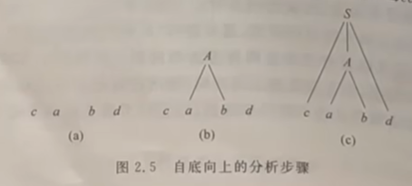
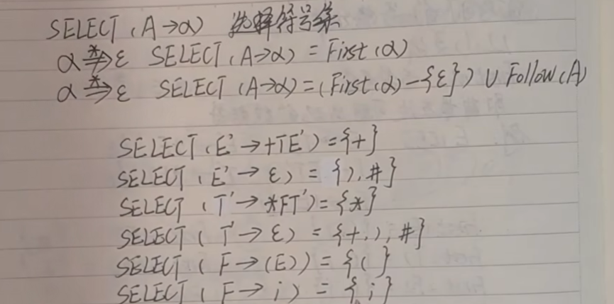
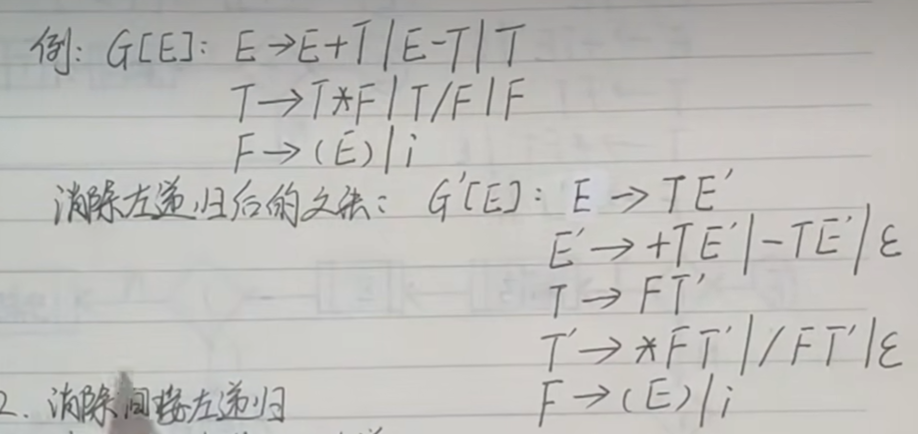

# 【编译原理】重写笔记

## 目录

- [【编译原理】重写笔记](#编译原理重写笔记)
  - [目录](#目录)
  - [词法分析](#词法分析)
    - [基本概念](#基本概念)
    - [文法和语言](#文法和语言)
    - [正规式和有穷自动机](#正规式和有穷自动机)
  - [语法分析](#语法分析)
    - [自顶向下的语法分析](#自顶向下的语法分析)

## 词法分析

### 基本概念

编译程序是一种翻译程序，将源语言翻译成目标语言

**基本步骤**

1. 词法分析
1. 语法分析
1. 语义分析
1. 中间代码生成（优化）
1. 目标代码生成（优化）

**几个概念**

**字母表:** `Σ = {a,b,c}`

**符号串:** 字母表`Σ= {a,b,c}`中任意元素的任意组合：`a,ab,aac`

**空串:** 空的符号串，`ε`

**子串:** 对于符号串`x=abc`,`a,ab,abc`都是其子串，`ba,ε`都不是

**符号串长度:** `|ab|=2` `|ε|=0`

**符号串的头尾**

- 对于符号串`z=xy`，
  - 看成两部分组成
  - 如果x是z的头，那么y是z的尾
  - 若x非空（头非空），则y为固有尾
  - 若y非空（尾非空），则x为固有头
- 对于符号串`z=abc`,
  - 头：`ε,a,ab,abc`,
  - 尾: `ε,c,bc,abc`
  - 如果把`abc`看做头，那么尾就是`ε`,所以`abc`就不是固有头（因为上面说了，尾是非空，头才能是固有头）,固有头应当是`ε,a,ab`,
  - 如果把`abc`看做尾，那么头就是`ε`,所以`abc`就不是固有尾,固有尾应当是`ε,b,ab`,
- 省略写法：
  - 省略不感兴趣的部分
  - `z=...x...`
  - `z=x...`

:::tip 我的总结
上面这段是把书上的说法结构化之后又添加了点解释，但还是太废话了，总的来说，

应该就是可以把符号串看成两部分，前一部分可以称作头，后一部分可以称作尾，

但是只有当头为非空时，尾才能称之为固有尾，只有当尾为非空时，头才能被称为固有头
:::

**符号串的连接**

- 设有符号串`x=ST y=abu`
- 则他们的连接为：`xy=STabu`
- 显然：
  - `εx=xε=x`
  - `|x|=2 |y|=3 |xy|=5`

**符号串的方幂**

- $x^0=ε$
- $x^1=x$
- $x^2=xx$
- $x^3=xxx$
- $x^n=xx^{(n-1)}=x^{(n-1)}x,\qquad{(n>=1)}$

**符号串的集合**

- 集合`A`由符号串组成，且这些符号串全部由同一个字母表`Σ`组成。
  - `A = {1,12,123} Σ={1,2,3}`
- 表示法：
  - 枚举表示法：`A = {1,11,111}`
  - 省略表示法：`B = {1,11,111,...}` (如果有规律的话)
  - 概述表示法：
    - `C = { X | X满足条件C }`
    - `A = { X | X是字母表Σ={1}上的符号串，且1<=|X|<=3 }`
- 空符号串集：`A= {} = ∅`，没有任何符号串，连空串也没有的符号串的集合
- 两符号串集合的乘积：
  - 就是将两集合的符号串连接起来。
  - $AB=\{xy|x∈A,y∈B\}$
    - `AB`表示的是**符号串集合的乘积**
    - `xy`表示的是**符号串的连接**
  - 案例
    - `A={12,34} B={45,67}`
    - `AB={1245,1267,3445,3467}`

字母表的闭包运算 $Σ^{*}$

- `Σ*`表示字母表`Σ`上一切长度为`n(n>=0)`的字符串所组成的集合
- $Σ^{*}=Σ^{0} ∪ Σ^{1} ∪ Σ^{2} ∪ ... ∪ Σ^{n}$
- 案例

```json
Σ={1,2,3}
Σ*={
    ε,
    1,2,3
    11,12,13,21,22,23,31,32,33,
    ...
    }
```

字母表的正闭包$Σ^{+}$

- `Σ*`表示字母表`Σ`上一切长度为`n(n>0)`的字符串所组成的集合
- $Σ^{+}= Σ^{1} ∪ Σ^{2} ∪ ... ∪ Σ^{n}$
- 显然：
  - 他和闭包运算相差了一个零次幂：$Σ^{*} = Σ^{0} ∪ Σ^{+}$
  - 他的每一项的系数和闭包运算相差了一个Σ：$Σ^{+} = Σ ∪ Σ^{n} = Σ^{n} ∪ Σ$

### 文法和语言

**产生式（重写规则）**

- 元语言符号
  - `->`和`::=`都表示**定义为**
  - `|`,表示**或者**
- 左部，`->` 和 `::=` 左侧的部分
  - 统统都是非终结符
- 右部，`->` 和 `::=` 右侧的部分
  - 可能是非终结符，也可能是终结符

**上下文无关的文法**

- 标准定义是一个四元组
- $\text{文法}G=(\text{非终结符集合}V_N,\text{终结符集合}V_T,\text{重写规则集合}P,\text{识别符号}S|S∈V_N)$
- 非终结符集合 $V_N$ : 所有产生式的左部就是非终结符的集合
- 终结符集合 $V_T$ : 只在产生式左部出现且未在有部出现的集合
- 重写规则集合 $P$ : 所有重写规则组成的集合
- 识别符号 $S$ : 一般默认第一条产生式的左部为识别符号，必定是一个非终结符。
- 字汇表: $V = V_N ∪ V_T$
- 显然
  - 非终极符和终结符的交集为空集 $V_N ∪ V_T = ∅$

**完整写法案例**

```
有
    文法G = (V_N,V_T,P,S)

其中
  非终结符集合 V_N = {a,b,c,...,z,0,1,2,...,9}
  终结符集合 V_T = {<标识符>,<字母>,<数字>}
  重写规则集合 P = {
                  <标识符> -> <字母>
                  <标识符> -> <标识符><数字>
                  <字母> -> a|b|c|...|z
                  <数字> -> 0|1|2|...|9
  }
  识别符号 S = <标识符>
```

**简化写法案例**

- 很多时候只需要写出文法的产生式，不需要写出完整的四元组。
- 一般约定第一条产生式的左部为识别符
- 尖括号为非终结符，否则为终结符
- 或者大写字母表示非终结符，小写字母为非终结符
- 另外,也可以把`G`写成`G[识别符]`

```
文法G[<标识符>]:
    <标识符> -> <字母>
    <标识符> -> <标识符><数字>
    <字母> -> a|b|c|...|z
    <数字> -> 0|1|2|...|9
```

**推导和规约**

- 若
  - `v=123<字母>321`
  - `<字母>:=a`
  - `w=123a321`
- 则称：
  - v直接推导(产生出)w 记作$v \rArr w$
  - w直接规约到v 记作$w \underset{\triangle}{\rArr} v$
- 注意区分规约符号$\rArr$ 和 产生式的定义符号 $\rightarrow$

**推导长度**

- $v \underset{\triangle}{\rArr} w_0$ 推导长度`1` **通过直接推导出一个新的字符串**
- $v = w_0$ 推导长度`0` **通过直接推导，推导出本身**
- 多步推导: $v \stackrel{+}{\rArr} w_0 \quad{(n>=0)}$
- 广义推导: $v \stackrel{*}{\rArr} w_0 \quad{(n>=1)}$

**文法描述的语言**

- 若有 `文法G[开始符号Z] 字汇表V`
- 如果: $Z \stackrel{*}{\rArr} x$，且$x∈V^{*}$ 则称x为句型
  - （由开始符号，经过广义推导，推导出x,且x属于字汇表上的闭包，则称x是句型，由非终结符和终结符组成）
- 如果: $Z \stackrel{*}{\rArr} x$，且$x∈V_{T}^{*}$ 则称x为句子
  - （由开始符号，经过广义推导，推导出x,且x属于字汇表终结符闭包，则称x是句子，由终结符组成）
- 显然，根据定义，句型包含句子，句子是一种特殊的句型。

**文法表述的语言**

- 文法表述的语言L，是该文法一切句子的集合。
- $L(G[S])=\{x|S\stackrel{*}{\rArr}x,\text{且} x ∈ V_{T}^{*}\}$

**递归规则**

- 文法产生式的右部出现在了左部
- 左递归：文法产生式的右部出现在左部，且出现在右部的开头
  - `<标识符> -> <标识符><数字>`
- 左递归：文法产生式的右部出现在左部，且出现在右部的结尾
  - `<标识符> -> <数字><标识符>`
- 普通的递归规则，既不出现在右部的开头也不出现在左部结尾

文法与语言

> 一个文法只能唯一描述一中语言，但一个语言可以用多种文法来描述。

如果两个文法描述了同一种语言$L(G_1)==L(G_2)$，则称两个文法等价

**乔姆斯基语言分类法**

- **0型文法(1型文法)** ： 上下文有关文法，（产生式的左部参杂着终结符）
- **2型文法** ： 上下文无关文法，（产生式的左部只有非终结符）
- **3型文法** ： 正规文法
  - 每个规则只能具有下面两种形式，并且正规文法中只能出现其中一种
    - 第一种(终结符+非终结符)
      - `A::=a`
      - `A::=aB` (右线性文法)
    - 第二种(非终结符+终结符)
      - `A::=a`
      - `A::=Ba` (左线性文法)

**语法分析树（推导树）**

- 语法树上的每一个节点都是终结符或非终结符
- 树根是文法的开始符
- 分支，
  - 有分支的一定是非终结符，
  - 没有分支的，无法判定
  - 一个节点有分支，一定能找到一条规则
    - B节点有两个子节点，则文法中一定有一条规则： `B->bd`
- 子树：某节点的子树就是该节点及其向下的部分，
- 层数：比如下面的案例，S有3层，A有2层，B有1层。
- 简单子树：只含有单层分支的子树（层数为1的子树），如B
- 最左推导：每一步的推导总是替换掉最左边的非终结符
- 最右推导（规范推导）：（反过来）
- 规约序列：
  - 最左规约为规范规约。
  - 从句子通过一次次规约，规约到文法开始符号，就可以证明该句子是该文法所定义的语言中的一个句子。
  - 最左规约和最有推导互为逆过程
- 规范句型（右句型）
  - 通过规范推导得出的句型都叫规范句型。

**案例**

```
G[S]:
  S->aAB
  A->Ba|a
  B->bd

最左推导过程：

S => aAB => a(Ba|a)B => a((bd)a|a)B => a((bd)a|a)(bd)

最右推导过程（规范推导）：

S => aAB => aA(bd) => a(Ba|a)((Ba|a)) => a((bd)a|a)(bd)

上面的 aAB aAbd 都是规范句型，最后一个是句子，但句子也是特殊的句型，所以最后一个也是规范句型。

最左规约（规范规约）序列：
abdabd =△> aBabd =△> aAbd =△> aAB =△> S


推导树：

S
|____
| | |
a A B
  | |__
  | | |
  | b d
  |__
  | |
  B a
  |__
  | |
  b d
```

**二义性**

- 如果一个文法存在某个句子对应两颗完全不同语法树，则说这个文法是二义性的,这个句子是二义性句子
  - 或者说一个文法中只要有某个句子，他的左推导和右推导是不同的，则这个文法是二义性的文法，这个句子是二义性的句子
- 句型：一个句型可以有多课语法树，最左推导和最右推导可以不同
- 句子: 一个句子只能有一颗语法树，最左推导和最右推导必须相同，否则就是具有二义性
- 注意：文法的二义性和语言的二义性概念不同
- 如果一个语言的所有文法都是二义性文法，则称该语言是先天性二义性语言

```
这个文法就是二义性文法，因为左推导和右推导将推出完全不同的推导树。
G[E]: E -> E+E -> E*E -> (E) | i
左推导：E => E+E => E*E+E => i*i+i
右推导：E => E+E => E+E*E => i+i*i

由于之前写过编译器和解释器，这里尝试着消除二义性：

G[AddExpression]:
  AddExpression
    := MutExpression
    |  AddExpression + MutExpression
    ;
  MutExpression
    := FactorExpression
    |  MutExpression * FactorExpression
    ;
  FactorExpression
  := BracketedExpression
  |  i
  ;
  BracketedExpression
  := (  AddExpression  )
  ;
```

**句型的分析**

- 语法树是句型推导的几何表示（上下文无关文法）
- 语法树是句型分析的好工具
- 句型分析就是识别符号串是否为某文法的句型
- 这也是为什么语法树也被叫做分析树、语法分析树
- 完成句型分析的程序成为分析程序、识别程序
- 分析算法又称为识别算法

**分析算法**

- 从左到右的分析算法
  - 自顶向下分析法
    - 从文法的开始符号出发，反复用各种产生式，寻找和输入字符串匹配的推导。
    - 
  - 自底向上分析法
    - 从输入符号串开始，逐步进行规约，直至规约到文法的开始符号
    - 
- 从右到左的分析算法

**自底向上分析法**

- 短语：在一个子树中，末端节点是子树树根的短语。
- 简单短语(直接短语)：在一个简单子树中，由末端节点所组成的符号串就是简单子树树根的简单短语。
- 句柄：最左简单子树的末端节点组成的符号串是句柄。
  - 句柄只适用于规范句型，规范句型只在规范推导中出现，
  - 规范推导就是最右推导，最右推导又对应着最左规约。

```
G[S]:
  S->aAB
  A->Ba|a
  B->bd

最左推导过程：
S => aAB => a(Ba|a)B => a((bd)a|a)B => a((bd)a|a)(bd) => abdabd | aabd

推导树：
S
|____
| | |
a A B
  | |__
  | | |
  | b d
  |__
  | |
  B a
  |__
  | |
  b d

求句型abdabd的短语、简单短语、句柄。

短语
abdabd是该句型相对于S的短语
bda是该句型相对于A的短语
bd是该句型相对于B的短语

简单短语（找出短语之后，找出哪些只有一层的子树）：
bd是该句型相对于B的简单短语

句柄(找出所有简单短语中最左边的)：
bd
```

### 正规式和有穷自动机

- 正规式：将**符号表**`Σ`上的字母用 `*` `.` `|`连接组成的表达式
  - `()` 括号的优先级最高, 然后依次为：
  - `*` 字符的闭包运算，
  - `.` 字符的乘积运算，这个符号有时候可以省略
  - `|` 字符的加法运算，读作或，也可以写成 `+`
- 正规集：由**正规式所描述的符号串**所组成的集合
- 正规式与正规集的案例
  - 

```
正规式描述标识符：

(a|b|c|....|z)(a|..|z|0|...0)*

文法描述：

G[<标识符>]:
            <标识符> -> <字母>
            <标识符> -> <标识符><数字>
            <字母> -> a|b|c|...|z
            <数字> -> 0|1|2|...|9
```

**DFA的构造**

- 乘积运算可以在状态图的中间加一个状态来实现
- 或运算可以用两条箭头来实现
- 闭包运算是一个自循环,前后两个空字符串
- 开始状态一个圈，结束状态两个圈
  - 
  - 

**根据文法构建状态机**

- 

**五元组定义DFA**

```
D_1 = (
  状态的集合K,
  状态机可接受的终结符Σ,
  转换函数M,
  有穷状态机初态S,
  终止状态的集合F
)

K = {S,A,B,Z}
Σ = {a,b}
M:
  M(S,a)=A   M(S,b)=B
  M(A,a)=Z   M(A,b)=B
  M(B,b)=Z   M(B,a)=A
  M(Z,a)=Z
S = S
F = {Z}
```

**NFA的确定化**

- NFA：不确定的有穷自动机
- DFA: 确定的有穷自动机
- 方法：
  - 子集法（可处理`ε`规则）
  - 简化的子集法（不能处理ε规则）

例题

- 

解

- 先画出其状态转换表

| K\Σ |  0  |  1  |
| :-: | :-: | :-: |
|  S  | V,Q | Q,U |
|  V  |  Z  |     |
|  Q  |  V  | Q,U |
|  U  |     |  Z  |
|  Z  |  Z  |  Z  |

- 然后构造新的等价的`DFA(K',Σ,M',S',F')`
- 这张表中就包含了`K'` 和 `M'`

| `K'`\ Σ |   0   |    1    |
| :-----: | :---: | :-----: |
|   [S]   | [V,Q] |  [Q,U]  |
|  [V,Q]  | [V,Z] |  [Q,U]  |
|  [Q,U]  |  [V]  | [Q,U,Z] |
|  [V,Z]  |  [Z]  |   [Z]   |
| [Q,U,Z] | [V,Z] | [Q,U,Z] |
|   [V]   |  [Z]  |         |
|   [Q]   |  [V]  |  [Q,U]  |
|   [U]   |       |   [Z]   |
|   [Z]   |  [Z]  |   [Z]   |

- `S' = [S]`
  新的开始状态
- `F' = { [V,Z] , [Q,U,Z] , [Z] }`
  - 新的终止状态状态，是所有状态中，包含旧的终止状态的集合

## 语法分析

### 自顶向下的语法分析

**LL(1)文法**

- 第一个L，表示从左向右扫描
- 第二个L，表示最左推导
- 1 表示向前看1个字符

**首符号集`First(α)`**

- 找到`α`最左边可能出现的终结符
- 技巧，向左看
- 

**后跟符号集Follow(A)**

- 表示的是非终结符A后面可以跟的所有终结符的集合(A属于V_N)
- 求解步骤
  1. `#∈Follow(S)` S为识别符号
     - 意思是先把`#`放入集合中
     - `G[识别符号]:`
  2. 若存在规则`T->XWY`则 `First(y)-{ε}∈Follow(W)`
     - Y可能是终结符也可能是非终结符
     - 这里就是说，W的后跟符号集，一定包含Y的首符号集减去空串。
  3. 若存在规则`T->XW` 或(`T->XWY`,其中`Y =*=> ε`),则`Follow(T)∈Follow(W)`
     - 就是说T的后更符号集一定也是W的后跟符号集
     - 比如aTb，使用T—>XW规则，就变成了aXWb。这样，原来T后面的b自然就变成了W后面的了
- 技巧，向右看


```
Follow(E) = {#} ∪ {)} = {#,)}
Follow(T) = (First(E')-{ε}) ∪ Follow(E') = {+,#,)}
Follow(E') = Follow(E) = {#,)}
Follow(T') = Follow(T) = {+,#,)}
Follow(F) = (First(T')-{ε}) ∪ Follow(T)  ∪ Follow(T') = {*,+,#,)}
```

**选择符号集合：SELECT(A->α)**

- 如果`α`不能广义推导出`ε` 则 `SELECT(A->α) = First(α)`
- 如果`α`能广义推导出`ε` 则 `(SELECT(A->α)-{ε}) ∪ Follow(A)`

- 

**LL(1)文法**

- 自顶向下的分析技术
- 对于每个非终极符A的任意两个产生式`A->α A->β`
- 满足：
  - `Select(A->α) ∩ Select(A->β) = ∅`
  - `α`和`β`至多只能有一个能推导出`ε`
- 判定：
  - 含相同左部的产生式的可选集交集均为空集，则该文法是LL(1)文法。
    - 其实说的就是上面的表达式。
  - 就是去看它的文法定义，找出所有左部相同的产生式,然后证明：
    - `Select(A->B) ∩ Select(A->B) ∩ Select(A->C) = ∅`

**将非LL(1)文法等价变化为LL(1)文法**

- 提取左公因子
  - 
  - 
- 消除左递归
  - 
  - 
- 消除间接左递归
  - 略
- 消除文法中的一切左递归
  - 略

**LL(1)文法分析的实现**

- 递归下降法
- 表驱动
