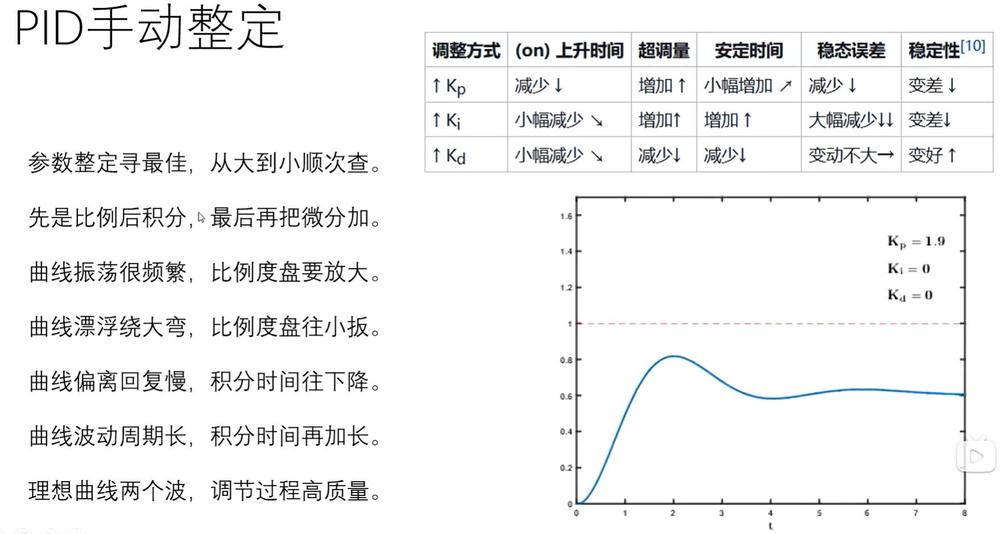

# 在canvas中实现并测试PID控制算法

## 实现效果

<!-- <Demo2App /> -->

## PID算法

**PID算法**

- 即比例（Proportional）-积分（Integral）-微分（Derivative）控制算法，
- PID算法通过比例、积分和微分控制的组合，实现了对系统的精确控制。
- 通过调整Kp、Ki、Kd这三个参数，可以实现对不同系统的灵活控制，满足各种工业控制需求。
- 是一种广泛应用于工业控制领域的反馈控制策略。
- 它通过计算并结合误差的比例、积分和微分，从而输出控制量，对被控对象进行控制。
- PID算法的基本公式为：$u(t) = Kp * e(t) + Ki * ∫e(t)dt + Kd * de(t)/dt$ 。其中，
  - u(t) 为控制器的输出值，
  - e(t)为当前的误差值，
  - Kp、Ki、Kd分别为比例、积分、微分参数，
  - ∫e(t)dt为误差的积分值，
  - de(t)/dt为误差的微分值。

**PID算法中的比例控制、积分控制和微分控制：**

- 比例控制（P）：
  - 比例控制的作用是根据偏差的大小直接调整输出值，从而纠正偏差。
  - 其计算公式为：P = Kp \* e(t)，其中Kp为比例参数。
  - 比例作用的大小直接影响系统的响应速度和调节精度。
  - 增大比例系数可以加快调节速度，减小稳态误差，但过大的比例系数可能导致系统不稳定。
- 积分控制（I）：
  - 积分控制主要用于消除系统稳态误差。
  - 其计算公式为：I = Ki \* ∫e(t)dt，其中Ki为积分参数。
  - 积分作用会随着时间的推移而累积误差，从而调整输出值以消除稳态误差。
  - 但过强的积分作用可能导致系统超调或产生振荡。
- 微分控制（D）：
  - 微分控制根据偏差的变化速度来调整输出值，具有超前调节的作用。
  - 其计算公式为：D = Kd \* de(t)/dt，其中Kd为微分参数。
  - 微分作用可以帮助系统预测误差的变化趋势，从而提前做出调整，减少超调和振荡。
  - 但微分作用过强也可能导致系统不稳定。

在PID算法中，Kp、Ki、Kd这三个参数的选择至关重要。它们需要根据具体的控制对象和控制要求进行调整和优化，以实现良好的控制效果。

## PID参数调节

## 算法代码

@[code vue](./assets/projects/demo2/App.vue)
