# ffmpeg音视频开发学习笔记

## 目录

- [ffmpeg音视频开发学习笔记](#ffmpeg音视频开发学习笔记)
  - [目录](#目录)
  - [ffmpeg简介](#ffmpeg简介)
  - [开发环境搭建](#开发环境搭建)
  - [日志系统](#日志系统)
  - [编译命令](#编译命令)
  - [打开输入](#打开输入)
  - [解封装提取AAC音频](#解封装提取aac音频)
  - [解封装提取H264视频](#解封装提取h264视频)
  - [转封装——mp4-to-flv](#转封装mp4-to-flv)
  - [时间基、时间戳、时长](#时间基时间戳时长)
  - [截取封装](#截取封装)
  - [RGB、YUV](#rgbyuv)
    - [RGB](#rgb)
    - [YUV](#yuv)
  - [视频解码](#视频解码)
  - [修改分辨率](#修改分辨率)
  - [修改格式为RGB24](#修改格式为rgb24)
  - [保存raw格式图像](#保存raw格式图像)
  - [YUV\_to\_H264视频编码](#yuv_to_h264视频编码)
  - [音频解码AAC\_PCM](#音频解码aac_pcm)
  - [音频编码PCM\_to\_AAC](#音频编码pcm_to_aac)
  - [音视频采集](#音视频采集)
    - [视频采集](#视频采集)
    - [音频采集](#音频采集)
    - [同时采集视频和音频](#同时采集视频和音频)
  - [音视频播放与显示](#音视频播放与显示)
    - [SDL](#sdl)

## ffmpeg简介

**组成**

- ffmpeg音视频转码、编解码工具
- ffprobe多媒体分析器
- ffplay音视频播放器
- ffserver多媒体实时广播流服务器

**模块**

- **AVCodec编解码模块**
- **AVFormat封装模块**
- AVFilter滤镜模块
- AVUtil基本工具模块
- AVDevice采集与渲染（输入与输出）模块
- swcacle视频图像转换模块
- swresample音频转换计算模块

**应用**

- **开发音视频播放器（ffmpeg+SDL/QT）**
- 开发流媒体服务器/在线直播 (ffmpeg + Live555/libRTMP)
- **提取可移植的codec算法 (音频、视频)**
- 开发编解码、转码器 (ffmpeg + libx264/libx265)
- 视频会议 (ffmpeg+ webrtc)
- 辅助工具，后处理(postproc + libavutils)
- **CV训练工具 (ffmpeg+opencv)**

## 开发环境搭建

- 根据 <https://ffmpeg.org/download.html>页面提示，
- 可从[Windows builds from gyan.dev](https://www.gyan.dev/ffmpeg/builds/)下载windows预编译版，
- 下载发行版（full-shared）[release builds-ffmpeg-release-full-shared.7z](https://www.gyan.dev/ffmpeg/builds/ffmpeg-release-full-shared.7z)

**目录结构**

```bash
$ cd ffmpeg-6.1.1-full_build-shared
$ ls
bin/  doc/  include/  lib/  LICENSE  presets/  README.txt
```

配置PKG_CONFIG_PATH

```bash
# 可能也不是必要的
export PKG_CONFIG_PATH=$PKG_CONFIG_PATH:/path/to/ffmpeg-6.1.1/lib/pkgconfig/
```

## 日志系统

```c
#include <stddef.h>
#include <libavutil/log.h> // ffmpeg的日志系统

int main(int argc, char **argv)
{
    // 设置日志级别
    av_log_set_level(AV_LOG_INFO);
    av_log(NULL, AV_LOG_INFO, "this is a info log.\n");
    av_log(NULL, AV_LOG_ERROR, "this is a error log.\n");
    av_log(NULL, AV_LOG_DEBUG, "this is a debug log.\n");
    av_log(NULL, AV_LOG_FATAL, "this is a fatal log.\n");
    return 0;
}
```

## 编译命令

**最简写法**

```makefile
#######################################
# simple test
#######################################
# 编译
# gcc -c src/main.c -o ./out.o -I D:/app/ffmpeg-6.1.1-full_build-shared/include
# 链接
# gcc ./out.o -o ./out.exe -L D:/app/ffmpeg-6.1.1-full_build-shared/lib  -l avutil -l avformat -l avcodec
#######################################
# OUTPUT
#######################################
TARGET = main.exe
BUILD_DIR = build
OUTPUT_DIR = output
#######################################
# SOURCES
#######################################
C_CPP_DEFS =

C_SOURCES =  \
 src/main.c
vpath %.c $(sort $(dir $(C_SOURCES)))

CPP_SOURCES = \
 $(wildcard src/lib/*.cpp) \
 # src/main.cpp
vpath %.cpp $(sort $(dir $(CPP_SOURCES)))

C_CPP_INCLUDES =  \
 -I D:/app/ffmpeg-6.1.1-full_build-shared/include \
 -I src/lib/

LIBDIR = \
 -L D:/app/ffmpeg-6.1.1-full_build-shared/lib  -l avutil -l avformat -l avcodec

DLL_SOURCES = \
 $(wildcard D:/app/ffmpeg-6.1.1-full_build-shared/bin/*.dll)
#######################################
# COMMAND
#######################################
CC = gcc
XX = g++
#######################################
# OBJECTS
#######################################
C_CPP_FLAGS =  $(C_CPP_DEFS) $(C_CPP_INCLUDES)

$(BUILD_DIR):
 mkdir $@

C_OBJECTS = $(addprefix $(BUILD_DIR)/,$(notdir $(C_SOURCES:.c=.o)))
vpath %.o $(sort $(dir $(C_OBJECTS)))

$(BUILD_DIR)/%.o: %.c | $(BUILD_DIR)
 $(CC) -c $(C_CPP_FLAGS) $< -o $@

CPP_OBJECTS = $(addprefix $(BUILD_DIR)/,$(notdir $(CPP_SOURCES:.cpp=.o)))
vpath %.o $(sort $(dir $(CPP_OBJECTS)))

$(BUILD_DIR)/%.o: %.cpp | $(BUILD_DIR)
 $(XX) -c $(C_CPP_FLAGS) $< -o $@

#######################################
# LINK
#######################################
LD_FLAGS = $(LIBDIR)

$(OUTPUT_DIR):
 mkdir $@
 cp ${DLL_SOURCES} $@

$(OUTPUT_DIR)/$(TARGET): $(C_OBJECTS) $(CPP_OBJECTS) | $(OUTPUT_DIR)
 $(CC)  $(C_OBJECTS) $(CPP_OBJECTS) -o $@ $(LD_FLAGS)

#######################################
# COMMAND
#######################################
all: $(OUTPUT_DIR)/$(TARGET)

clean:
 -rm -fR $(BUILD_DIR)
 -rm -fR $(OUTPUT_DIR)

```

## 打开输入

```c
#include <stddef.h>
#include <libavutil/log.h> // ffmpeg的日志系统
#include <libavformat/avformat.h>

int err;
int main(int argc, char **argv)
{
    // 设置日志级别
    av_log_set_level(AV_LOG_INFO);

    // 提示用法
    if (argc < 2)
    {
        av_log(NULL, AV_LOG_ERROR, "usage %s media.mp4_or_url", argv[0]);
        return -1;
    }

    const char *url = argv[1];
    AVFormatContext *formatCtx = NULL;
    // 打开流
    err = avformat_open_input(&formatCtx, url, NULL, NULL);
    if (err)
    {
        av_log(NULL, AV_LOG_FATAL, "open url %s fail: %s;", url, av_err2str(err));
        return err;
    }
    // 输出流信息
    av_dump_format(formatCtx, 0, url, 0);
    // 关闭流
    avformat_close_input(&formatCtx);
    return 0;
}
```

**输出**

```bash
mime type is not rfc8216 compliant
[hls @ 000002a673c8a8c0] Opening 'http://devimages.apple.com/iphone/samples/bipbop/gear1/fileSequence0.ts' for reading
[hls @ 000002a673c8a8c0] Opening 'http://devimages.apple.com/iphone/samples/bipbop/gear1/fileSequence1.ts' for reading
Input #0, hls, from 'http://devimages.apple.com/iphone/samples/bipbop/gear1/prog_index.m3u8':
  Duration: 00:30:01.00, bitrate: N/A
  Program 0
    Metadata:
      variant_bitrate : 0
  Stream #0:0: Audio: aac ([15][0][0][0] / 0x000F), 0 channels
    Metadata:
      variant_bitrate : 0
  Stream #0:1: Video: h264 ([27][0][0][0] / 0x001B), none, 90k tbn
    Metadata:
      variant_bitrate : 0
```

## 解封装提取AAC音频

**AAC**

- AAC只是数据编码格式
- 码流组织格式有：
  - ADIF(Audio Data Interchange Format)
  - ADTS (Audio Data Transport Stream)
- ADIF编码信息存在一个固定的地方,所以ADIF主要用于磁盘存储文件，
- ADTS编码信息是每一个包中都有,ADTS主要用于渐进式传输的网络流

**ADTS 流格式**

- ADTS流格式为ADTS头部加AAC裸数据。
- `[ADTS头](AAC数据) | [ADTS头](AAC数据) | ...`
- ADTS Header为固定的7字节长度，格式可以用下面字母序列来表示，一个字母表示一种字段，数量表示比特长度。
- `AAAAAAAA AAAABCCD EEFFFFGH HHIJKLMM MMMMMMMM MMMOOOOO OOOOOOPP (QQQQQQQQ QQQQQQQQ)`
- 其中A-J称为ADTS固定头部，K-Q称为可变头部。

| 标志 | 比特 | 描述                                                                                                  |
| :--- | :--- | :---------------------------------------------------------------------------------------------------- |
| A    | 12   | 同步字段，全1                                                                                         |
| B    | 1    | MPEG版本: 0 for MPEG-4, 1 for MPEG-2，mp4是0                                                          |
| C    | 2    | Layer: 全0                                                                                            |
| D    | 1    | 保护缺失标识ProtectionAbsent , 1 表示无 CRC ，0 表示有 CRC                                            |
| E    | 2    | AAC编码级别, MPEG-4 Audio Object Type减1。0: Main Profile, 1:LC, 2: SSR，3:保留。常用低复杂度编码LC。 |
| F    | 4    | MPEG-4 采样率表序号，注意这里是序号，不是采样率值，参考采样率表。                                     |
| G    | 1    | 私有位，设为0，解码时忽略                                                                             |
| H    | 3    | 声道数，取值范围1-7。                                                                                 |
| I    | 1    | 源标识, 编码设为0，解码忽略                                                                           |
| J    | 1    | home, 编码设为0，解码忽略                                                                             |
| K    | 1    | 版权标志位，编码设为0，解码忽略                                                                       |
| L    | 1    | 版权标志开始位，编码设为0，解码忽略                                                                   |
| M    | 13   | 帧长度，为AAC原始数据长度+ADTS头长度（ProtectionAbsent == 1 ? 7 : 9）                                 |
| O    | 11   | Buffer fullness， 0x7FF 说明是码率可变的码流                                                          |
| P    | 2    | AAC帧数量减1值，有1个帧时此值为0                                                                      |
| Q    | 16   | 如果保护缺失标识ProtectionAbsent为0，标识有2字节CRC校验字段                                           |

**固定头**
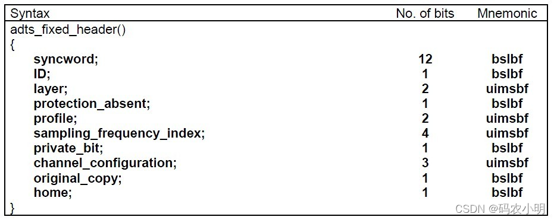

**可变头**
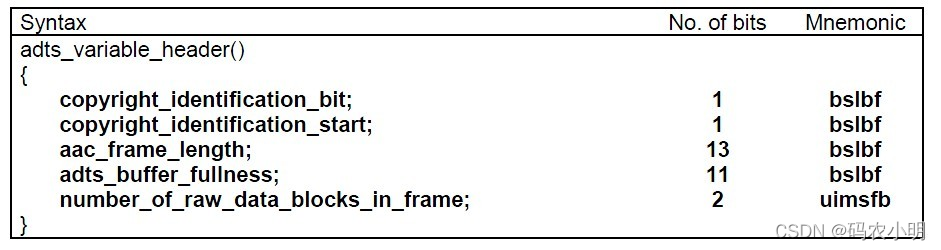

**采样率对照表**


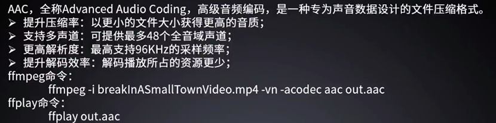
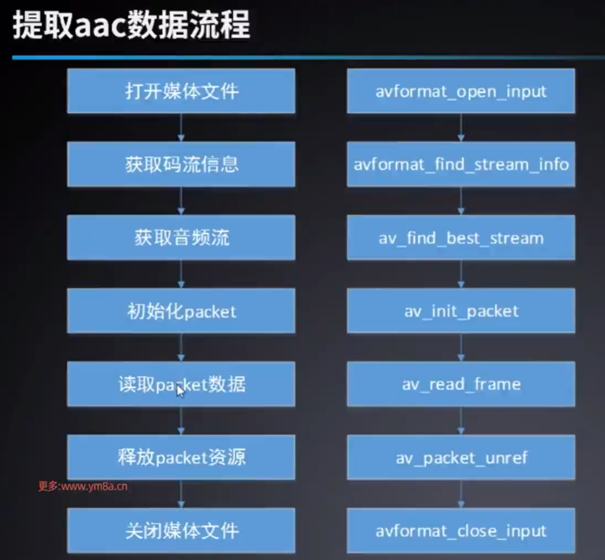

**提取视频中的AAC音频**

> 如果ffplay不能播放，是因为aac格式不是adts

```c
#include <stddef.h>
#include <libavutil/avutil.h>     // for log
#include <libavformat/avformat.h> // for avformat
#include <libavcodec/avcodec.h>   // for packet
#include "./lib/adts.h"           // for adts 音频头
int err;
int main(int argc, char **argv)
{
  // 设置日志级别
  av_log_set_level(AV_LOG_INFO);

  // 提示用法
  if (argc < 2)
  {
    av_log(NULL, AV_LOG_ERROR, "usage: %s input.mp4 output.aac\n", argv[0]);
    return -1;
  }

  const char *input = argv[1];
  const char *output = argv[2];

  // 打开流
  AVFormatContext *format_ctx = NULL;
  err = avformat_open_input(&format_ctx, input, NULL, NULL);
  if (err < 0)
  {
    av_log(NULL, AV_LOG_ERROR, "open input %s fail: %s;\n", input, av_err2str(err));
    return err;
  }
  av_dump_format(format_ctx, 0, input, 0);
  // 获取码流信息，实际是去对formatCtx中stream相关的参数赋值，因为后面需要用
  // Read packets of a media file to get stream information.
  err = avformat_find_stream_info(format_ctx, NULL);
  if (err < 0)
  {
    av_log(NULL, AV_LOG_ERROR, "find stream info failed:%s\n", av_err2str(err));
    return err;
  }
  // 获取音频流
  int audio_idx = av_find_best_stream(format_ctx, AVMEDIA_TYPE_AUDIO, -1, -1, NULL, 0);
  if (audio_idx < 0)
  {
    av_log(NULL, AV_LOG_ERROR, "find best audio stream index failed; index: %d\n", audio_idx);
  }
  else
  {
    av_log(NULL, AV_LOG_INFO, "find best audio stream index is %d\n", audio_idx);
  }

  // 创建文件
  FILE *dest_fp = fopen(output, "wb");
  if (dest_fp == NULL)
  {
    av_log(NULL, AV_LOG_ERROR, "make file failed.");
    return -1;
  }

  // 初始化packet
  AVPacket *packet = av_packet_alloc();

  // 读取packet
  while (av_read_frame(format_ctx, packet) == 0)
  {
    // 找到音频流
    if (packet->stream_index == audio_idx)
    {
      // 写入ADTS_Header
      uint8_t adts_header[7] = {0};
      set_ADTS_Header(
          adts_header,
          packet->size,
          format_ctx->streams[audio_idx]->codecpar->profile,
          format_ctx->streams[audio_idx]->codecpar->sample_rate,
          format_ctx->streams[audio_idx]->codecpar->channels //
      );
      if (fwrite(adts_header, 1, sizeof(adts_header), dest_fp) != sizeof(adts_header))
      {
        av_log(NULL, AV_LOG_ERROR, "write ADTS_Header failed.\n");
        return -1;
      }
      // 写入文件（data是原始数据）
      if (fwrite(packet->data, 1, packet->size, dest_fp) != packet->size)
      {
        av_log(NULL, AV_LOG_ERROR, "write file failed.\n");
        return -1;
      }
    }
    // 释放packet中的data
    av_packet_unref(packet);
  }
  // 释放packet
  av_packet_free(&packet);

  // 关闭流
  if (format_ctx)
    avformat_close_input(&format_ctx);

  // 关闭文件
  if (dest_fp)
  {
    fclose(dest_fp);
  }
  return 0;
}
```

**adts.h**

```c
#ifndef _ADTSHEADER_H
#define _ADTSHEADER_H
#include <stdio.h>
#include <stdint.h>

#define ADTS_HEADER_LEN 7;

const int sampling_frequencies[] = {
    96000, // 0x0
    88200, // 0x1
    64000, // 0x2
    48000, // 0x3
    44100, // 0x4
    32000, // 0x5
    24000, // 0x6
    22050, // 0x7
    16000, // 0x8
    12000, // 0x9
    11025, // 0xa
    8000   // 0xb
    // 0xc d e f是保留的
};

void set_ADTS_Header(char data[7],
                int data_length,
                int profile,
                int samplerate,
                int channels)
{

    int sampling_frequency_index = 3; // 默认使用48000hz
    int adtsLen = data_length + 7;
    // ADTS不是单纯的data，是hearder+data的，所以加7这个头部hearder的长度，这里7是因为后面protection absent位设为1，不做校验，所以直接加7，如果做校验，可能会是9

    int frequencies_size = sizeof(sampling_frequencies) / sizeof(sampling_frequencies[0]);
    int i = 0;
    for (i = 0; i < frequencies_size; i++) // 查找采样率
    {
        if (sampling_frequencies[i] == samplerate)
        {
            sampling_frequency_index = i;
            break;
        }
    }
    if (i >= frequencies_size)
    {
        printf("unsupport samplerate:%d\n", samplerate);
    }

    data[0] = 0xff;                                    // syncword:0xfff                          高8bits
    data[1] = 0xf0;                                    // syncword:0xfff                          低4bits
    data[1] |= (0 << 3);                               // MPEG Version:0 for MPEG-4,1 for MPEG-2  1bit
    data[1] |= (0 << 1);                               // Layer:0                                 2bits
    data[1] |= 1;                                      // protection absent:1                     1bit
    data[2] = (profile) << 6;                          // profile:profile               2bits
    data[2] |= (sampling_frequency_index & 0x0f) << 2; // sampling frequency index:sampling_frequency_index  4bits
    data[2] |= (0 << 1);                               // private bit:0                   1bit
    data[2] |= (channels & 0x04) >> 2;                 // channel configuration:channels  高1bit
    data[3] = (channels & 0x03) << 6;                  // channel configuration:channels 低2bits
    data[3] |= (0 << 5);                               // original：0                1bit
    data[3] |= (0 << 4);                               // home：0                    1bit
    data[3] |= (0 << 3);                               // copyright id bit：0        1bit
    data[3] |= (0 << 2);                               // copyright id start：0      1bit
    data[3] |= ((adtsLen & 0x1800) >> 11);             // frame length：value    高2bits
    data[4] = (uint8_t)((adtsLen & 0x7f8) >> 3);       // frame length: value    中间8bits
    data[5] = (uint8_t)((adtsLen & 0x7) << 5);         // frame length: value    低3bits
    data[5] |= 0x1f;                                   // buffer fullness:0x7ff 高5bits
    data[6] = 0xfc;                                    // 11111100       //buffer fullness:0x7ff 低6bits
    // number_of_raw_data_blocks_in_frame：  //    表示ADTS帧中有number_of_raw_data_blocks_in_frame + 1个AAC原始帧。
}

#endif // _ADTSHEADER_H
```

**AAC音频格式**

- 
- ADIF-头信息仅在开头，适用于文件传输
- ADTS-头信息在任意帧，适用于流媒体
  - 7~9个字节的头信息
  - 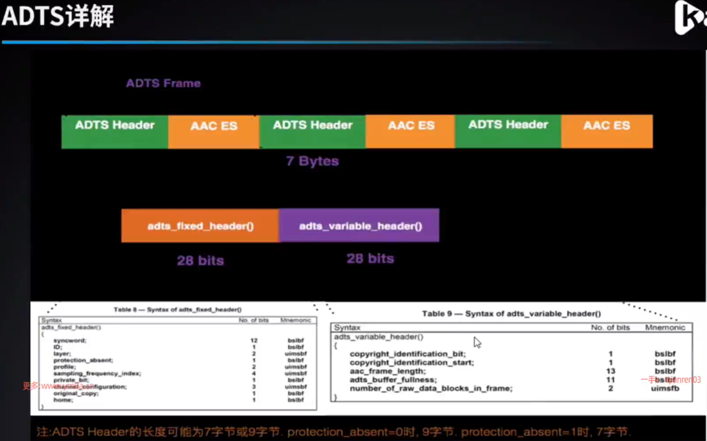
  - 
  - 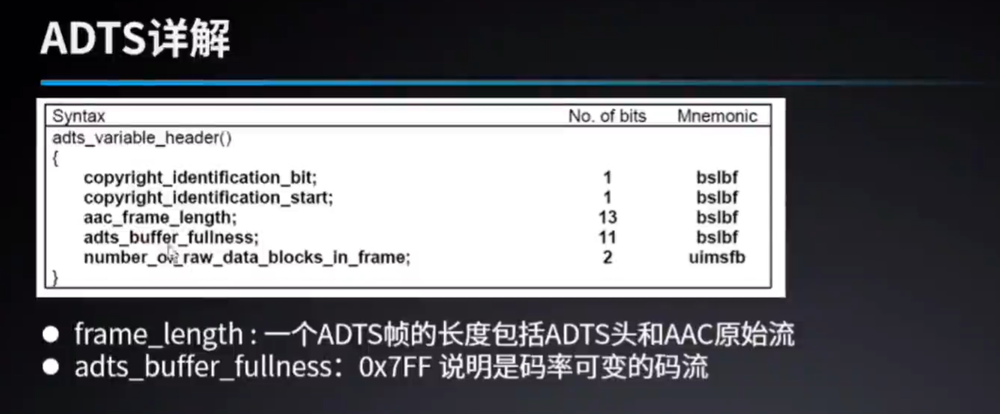

## 解封装提取H264视频

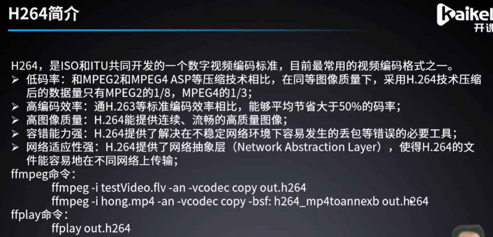
**264封装格式**

- AnnexB 每一帧数据都由`startCode`+`NALU`数据组成，适合于流媒体实时传输的封装格式
- AVCC 整个文件由NALU长度+NALU数据组成， 适合存储
  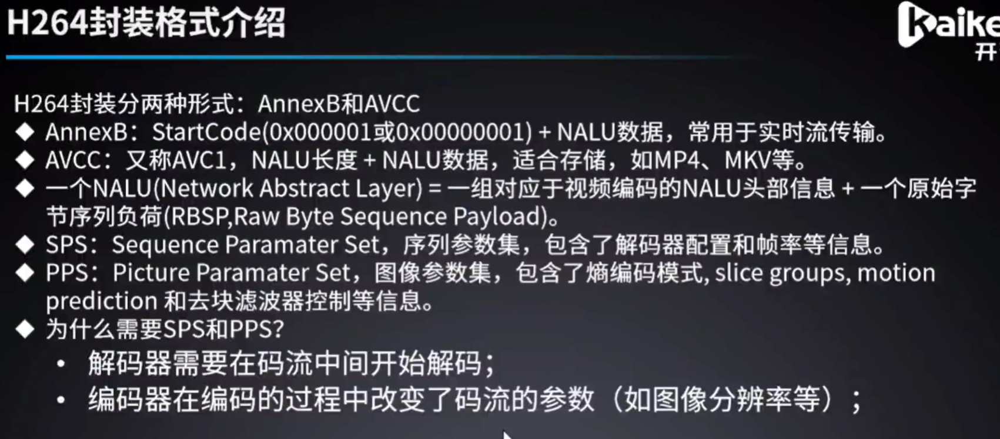

**字节流过滤器：AVCC转AnnexB**

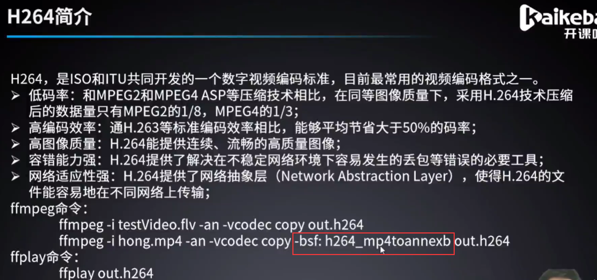

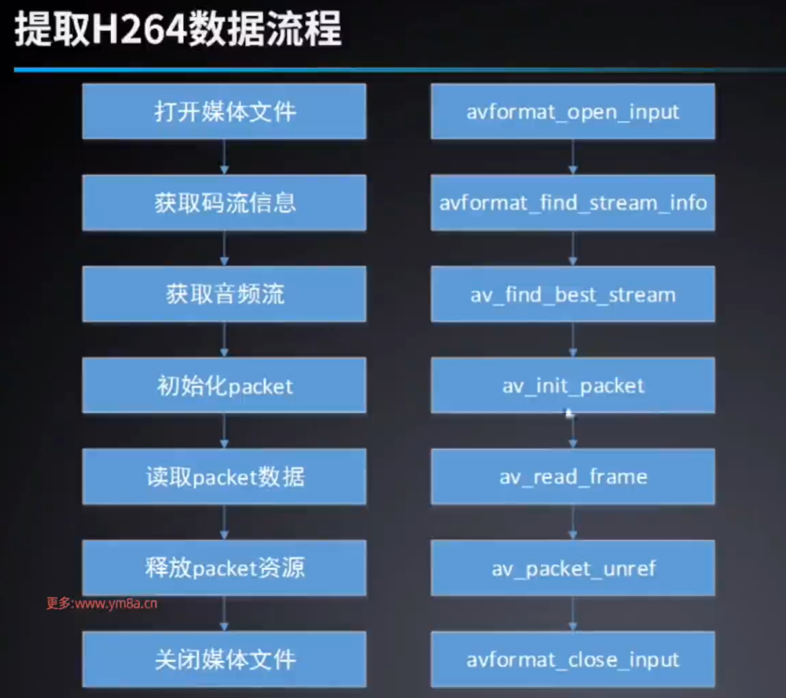
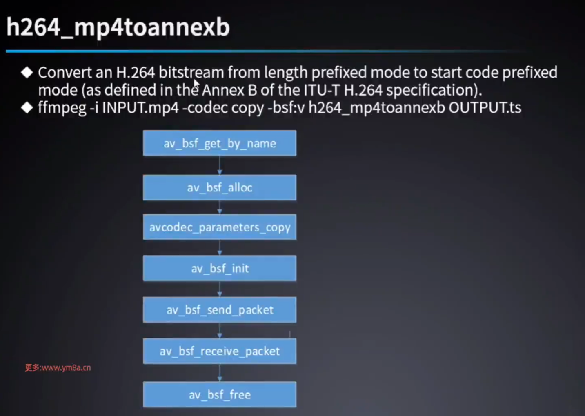

代码和提取音频几乎没有区别

```c
#include <stddef.h>
#include <libavutil/avutil.h>     // for log
#include <libavformat/avformat.h> // for avformat
#include <libavcodec/avcodec.h>   // for packet
#include <libavcodec/bsf.h>       // for bsf

int err;
int main(int argc, char **argv)
{
  // 设置日志级别
  av_log_set_level(AV_LOG_INFO);

  // 提示用法
  if (argc < 2)
  {
    av_log(NULL, AV_LOG_ERROR, "usage: %s input.mp4 output.h264\n", argv[0]);
    return -1;
  }

  const char *input = argv[1];
  const char *output = argv[2];

  // 打开流
  AVFormatContext *format_ctx = NULL;
  err = avformat_open_input(&format_ctx, input, NULL, NULL);
  if (err < 0)
  {
    av_log(NULL, AV_LOG_ERROR, "open input %s fail: %s;\n", input, av_err2str(err));
    return err;
  }
  av_dump_format(format_ctx, 0, input, 0);

  // 获取码流信息，实际是去对formatCtx中stream相关的参数赋值，因为后面需要用
  // Read packets of a media file to get stream information.
  err = avformat_find_stream_info(format_ctx, NULL);
  if (err < 0)
  {
    av_log(NULL, AV_LOG_ERROR, "find stream info failed:%s\n", av_err2str(err));
    return err;
  }
  // 获取视频流
  int video_idx = av_find_best_stream(format_ctx, AVMEDIA_TYPE_VIDEO, -1, -1, NULL, 0);
  if (video_idx < 0)
  {
    av_log(NULL, AV_LOG_ERROR, "find best video stream index failed; index: %d\n", video_idx);
  }
  else
  {
    av_log(NULL, AV_LOG_INFO, "find best video stream index is %d\n", video_idx);
  }

  // 创建文件
  FILE *dest_fp = fopen(output, "wb");
  if (dest_fp == NULL)
  {
    av_log(NULL, AV_LOG_ERROR, "make file failed.");
    return -1;
  }

  // 获取比特流过滤器
  // mp4 to annexb
  // Convert an H.264 bitstream from `length prefixed mode` to `start code prefixed mode`
  //  this filter is auto-inserted for MPEG-TS (muxer mpegts) and raw H.264 (muxer h264) output formats.
  // ffmpeg -i INPUT.mp4 -codec copy -bsf:v h264_mp4toannexb OUTPUT.ts
  const AVBitStreamFilter *bsf = av_bsf_get_by_name("h264_mp4toannexb");
  if (bsf == NULL)
  {
    av_log(NULL, AV_LOG_ERROR, "creat AVBitStreamFilter: h264_mp4toannexb  failed.");
    return -1;
  }
  // Allocate a context for a given bitstream filter.
  // 创建bsf上下文
  AVBSFContext *bsf_ctx = NULL;
  av_bsf_alloc(bsf, &bsf_ctx);

  // 复制编码参数
  // 提取h264,不需要改变编码参数
  avcodec_parameters_copy(bsf_ctx->par_in, format_ctx->streams[video_idx]->codecpar);

  // 初始化bsf
  // Prepare the filter for use
  av_bsf_init(bsf_ctx);

  // 初始化packet
  AVPacket *packet = av_packet_alloc();

  // 读取packet
  while (av_read_frame(format_ctx, packet) == 0)
  {
    // 找到视频流
    if (packet->stream_index == video_idx)
    {
      // 发送到bsf
      if (av_bsf_send_packet(bsf_ctx, packet) == 0)
      {
        // 从bsf接收数据
        while (av_bsf_receive_packet(bsf_ctx, packet)==0)
        {
          // 写入文件
          if (fwrite(packet->data, 1, packet->size, dest_fp) != packet->size)
          {
            av_log(NULL, AV_LOG_ERROR, "write file failed.\n");
            return -1;
          }
        }
      }
      else
      {
        av_log(NULL, AV_LOG_ERROR, "send packet to bsf failed.\n");
        return -1;
      }
    }
    // 释放packet中的data
    av_packet_unref(packet);
  }
  // 释放packet
  av_packet_free(&packet);

  // 关闭流
  if (format_ctx)
    avformat_close_input(&format_ctx);
  // 清除bsf
  if (bsf_ctx)
    av_bsf_free(&bsf_ctx);
  // 关闭文件
  if (dest_fp)
    fclose(dest_fp);
  return 0;
}
```

## 转封装——mp4-to-flv

**I、P、B帧**

- I帧，关键帧，GOP的第一帧，轻度压缩，
- P帧，前向预测编码帧。
- B帧，双向预测内插编码帧。
- 

**解码和显示顺序**

- B帧解码依赖I帧和P帧，B帧太多，则解码需要缓存更多数据
- B帧又是体机最小的帧，B帧多，可以降低带宽。
  

**PTS和DTS**


**转封装流程**

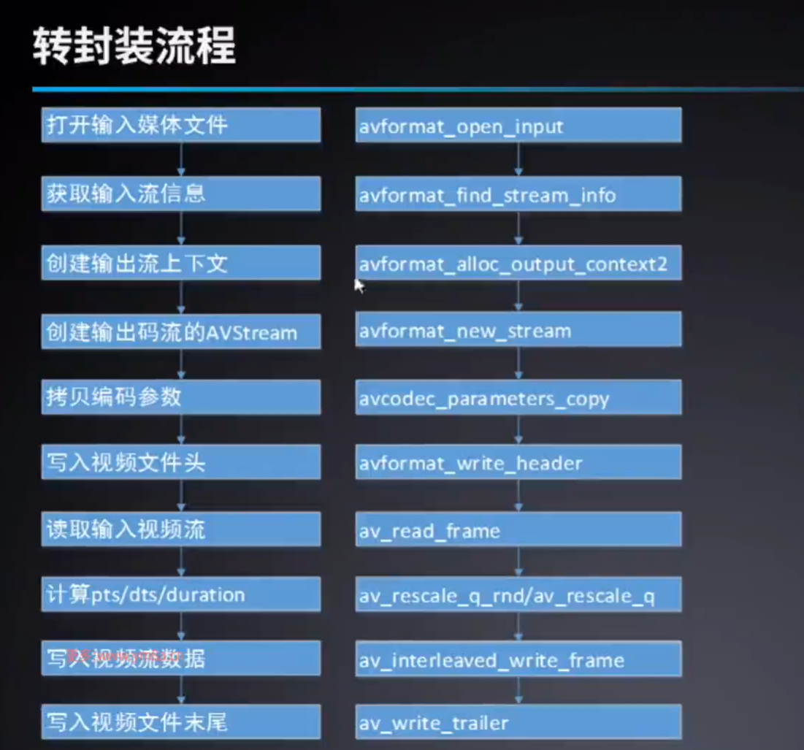

```c
#include <stdint.h>
#include <libavutil/avutil.h>     // for log
#include <libavformat/avformat.h> // for avformat
#include <libavcodec/avcodec.h>   // for packet
#include <libavcodec/bsf.h>       // for bsf

int main(int argc, char **argv)
{
  // 设置日志级别
  av_log_set_level(AV_LOG_INFO);

  // 提示用法
  if (argc < 2)
  {
    av_log(NULL, AV_LOG_ERROR, "usage: %s input.mp4 output.flv\n", argv[0]);
    return -1;
  }

  const char *input = argv[1];
  const char *output = argv[2];

  // 打开输入上下文
  AVFormatContext *in_format_ctx = NULL;
  int ret = avformat_open_input(&in_format_ctx, input, NULL, NULL);
  if (ret < 0)
  {
    av_log(NULL, AV_LOG_ERROR, "open input %s fail;\n", input);
    return -1;
  }

  // 显示输入的详细信息
  // Print detailed information about the input or output format
  av_dump_format(in_format_ctx, 0, input, 0);

  // 获取输入码流信息，实际是去对formatCtx中stream相关的参数赋值，因为后面需要用
  // Read packets of a media file to get stream information.
  ret = avformat_find_stream_info(in_format_ctx, NULL);
  if (ret < 0)
  {
    av_log(NULL, AV_LOG_ERROR, "find stream info failed\n");
    return -1;
  }

  // 创建输出上下文
  AVFormatContext *out_format_ctx = NULL;
  ret = avformat_alloc_output_context2(&out_format_ctx, NULL, NULL, output);
  if (ret < 0)
  {
    av_log(NULL, AV_LOG_ERROR, "alloc output format failed\n");
    return -1;
  }

  // 对输出流计数
  int out_stream_idx = 0;
  // 记录输入流和输出流的对应关系
  int io_stream_idx_map[in_format_ctx->nb_streams];
  memset(io_stream_idx_map, -1, sizeof(io_stream_idx_map));
  // 收集(挑选)视频流、音频流、字幕流
  for (uint8_t in_stream_idx = 0; in_stream_idx < in_format_ctx->nb_streams; in_stream_idx++)
  {
    AVStream *in_stream = in_format_ctx->streams[in_stream_idx];
    if (in_stream->codecpar->codec_type == AVMEDIA_TYPE_AUDIO ||
        in_stream->codecpar->codec_type == AVMEDIA_TYPE_VIDEO ||
        in_stream->codecpar->codec_type == AVMEDIA_TYPE_SUBTITLE)
    {
      // 创建输出的视频流、音频流、字幕流
      // Add a new stream to a media file. When demuxing
      AVStream *out_stream = avformat_new_stream(out_format_ctx, NULL);
      if (out_stream == NULL)
      {
        av_log(NULL, AV_LOG_ERROR, "creat media stream failed.\n");
        return -1;
      }
      // 拷贝流的编码参数
      // Copy the contents of src to dst.
      avcodec_parameters_copy(out_stream->codecpar, in_stream->codecpar);
      // Additional information about the codec
      out_stream->codecpar->codec_tag = 0; // codec_tag不需要拷贝

      // 记录对应关系
      io_stream_idx_map[in_stream_idx] = out_stream_idx++;
    }
  }

  if (out_format_ctx->oformat->flags & AVFMT_NOFILE)
  {
    // AVFMT_NOFILE cant be write
    av_log(NULL, AV_LOG_ERROR, "AVFMT_NOFILE cant be write.\n");
    return -1;
  }
  // Create and initialize a AVIOContext for accessing the resource indicated by url.
  // 输出文件
  // I/O context
  ret = avio_open(&out_format_ctx->pb, output, AVIO_FLAG_WRITE);
  if (ret < 0)
  {
    av_log(NULL, AV_LOG_ERROR, "open %s file failed.\n", output);
    return -1;
  }

  // 写入文件头
  ret = avformat_write_header(out_format_ctx, NULL);
  if (ret < 0)
  {
    av_log(NULL, AV_LOG_ERROR, "write stream header to output media file failed.\n");
    return -1;
  }

  // 读取流
  AVPacket *packet = av_packet_alloc();
  while (av_read_frame(in_format_ctx, packet) == 0)
  {
    // 如果找到
    if (io_stream_idx_map[packet->stream_index] >= 0)
    {
      // 获取输入流和输出流
      AVStream *inStream = in_format_ctx->streams[packet->stream_index];
      AVStream *outStream = out_format_ctx->streams[io_stream_idx_map[packet->stream_index]];

      // 修改stream_index
      packet->stream_index = io_stream_idx_map[packet->stream_index];

      // 重新计算pts(显示时间戳) : arg1 * arg2 / arg3
      packet->pts = av_rescale_q(packet->pts, inStream->time_base, outStream->time_base);
      // 重新计算dts(解码时间戳)
      packet->dts = av_rescale_q(packet->dts, inStream->time_base, outStream->time_base);
      // 重新计算duration
      packet->duration = av_rescale_q(packet->duration, inStream->time_base, outStream->time_base);

      // byte position in stream, -1 if unknown
      packet->pos = -1;

      // 写入packet
      // Write a packet to an output media file ensuring correct interleaving.
      if (av_interleaved_write_frame(out_format_ctx, packet) < 0)
      {
        av_log(NULL, AV_LOG_ERROR, "Write packet to output media file failed.\n");
        return -1;
      }
    }
    // 清除buffer
    av_packet_unref(packet);
  }
  av_packet_free(&packet);

  // 写入文件尾
  av_write_trailer(out_format_ctx);

  // 关闭输入上下文
  if (in_format_ctx)
    avformat_close_input(&in_format_ctx);

  // 关闭I/O context.
  if (out_format_ctx && out_format_ctx->pb && !(out_format_ctx->flags & AVFMT_NOFILE))
  {
    avio_closep(&out_format_ctx->pb);
  }
  // 关闭输出上下文
  if (out_format_ctx)
    avformat_free_context(out_format_ctx);

  return 0;
}
```

## 时间基、时间戳、时长

**总结**

> - 时间基可以理解为砖块的厚度，
> - 时间戳可以理解为砖块的数量
> - 时间（墙的高度）=时间基(砖块厚度) \* 时间戳(砖块数量)

在 FFmpeg 中，有几个关键的时间基概念以及它们的作用：

1. **时间基（Time Base）**：在 FFmpeg 中，时间基是用于衡量时间的基本单位，通常表示每秒的帧数或样本数。默认的时间基是 1 秒等于 1000000 微秒（AV_TIME_BASE）。时间基在视频和音频编解码过程中起着重要作用，用于同步和计时。

2. **封装格式（Container Format）**：封装格式是用于封装音频、视频、字幕等多种数据流的容器。常见的封装格式有 MP4、AVI、MKV 等。封装格式中包含了媒体数据的描述信息以及时间基等元数据。

3. **TBR 帧率（Time Base Rate Frame Rate）**：TBR 帧率指的是视频流中实际的帧率，即每秒显示的帧数。TBR 帧率是根据时间基和时长计算得出的，确保视频流的播放速度。

4. **TBN 流的时间基（Time Base Numerator）**：TBN 是视频流的时间基的分子部分，用于确定每个时间单位的大小。TBN 指定了视频流中时间单位的数量。

5. **TBC 解码时间基（Time Base Denominator）**：TBC 是视频流的时间基的分母部分，用于指定视频解码器的时间单位。TBC 指定了视频解码器使用的时间单位。

这些概念之间的关系是：

- 时间基为其他时间相关参数提供了基础单位，比如 TBR 帧率、TBN 流的时间基和 TBC 解码时间基。
- 封装格式中通常包含了媒体数据流的时间基信息，确保播放器能够正确解释和同步音视频数据。
- TBR 帧率是根据时间基计算得出的实际帧率，用于确保视频流的播放速度。
- TBN 流的时间基和 TBC 解码时间基是视频流的时间基的分子和分母部分，分别指定了视频流中时间单位的大小和解码器的时间单位。

综上所述，时间基、封装格式、TBR 帧率、TBN 流的时间基和 TBC 解码时间基之间密切相关，共同确保了媒体文件的正确解析、同步和播放。

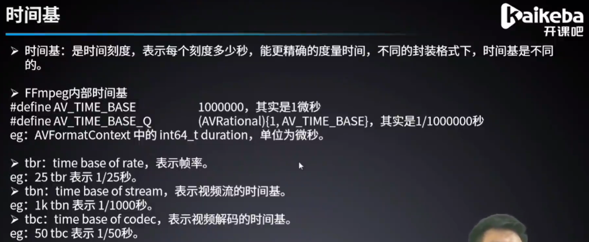

在FFmpeg中，时间基（Time Base）和时间戳（Timestamp）是用于描述媒体数据时间信息的重要概念。

1. **时间基（Time Base）**：时间基表示媒体数据中时间单位的大小，通常以分数的形式表示。它描述了时间的刻度，即每个时间单位的大小。例如，一个时间基为 1/1000 秒，则表示每个时间单位是毫秒级别的。时间基定义了媒体数据的时间分辨率。

2. **时间戳（Timestamp）**：时间戳表示特定媒体数据帧或样本的时间信息。它是一个以时间基为单位的整数值，用于表示特定帧或样本在时间轴上的位置。时间戳可以是相对时间，也可以是绝对时间。在视频中，时间戳通常表示每个视频帧的呈现时间；在音频中，时间戳表示每个音频样本的呈现时间。

为什么说时间基表示时间刻度，而时间戳表示有多少个时间刻度，相乘就是时长呢？

- **时间基表示时间刻度**：时间基描述了每个时间单位的大小，它是时间的刻度。就像一把尺子上的刻度一样，它告诉我们时间的单位大小是多少，但不提供任何特定时间点的信息。

- **时间戳表示有多少个时间刻度**：时间戳是特定帧或样本的时间信息，它表示了从媒体开始到该帧或样本的时间距离。这个距离是以时间基为单位的整数值。因此，如果我们将时间基乘以时间戳的值，就可以得到从媒体开始到该帧或样本的时长。例如，时间基为 1/1000 秒，时间戳为 500，则表示该帧或样本距离媒体开始的时间是 500 \* (1/1000) = 0.5 秒。

综上所述，时间基和时间戳在描述媒体数据时间信息时起到了不同的作用，时间基表示时间的刻度，而时间戳表示具体的时间距离，通过与时间基相乘可以得到时间的时长。

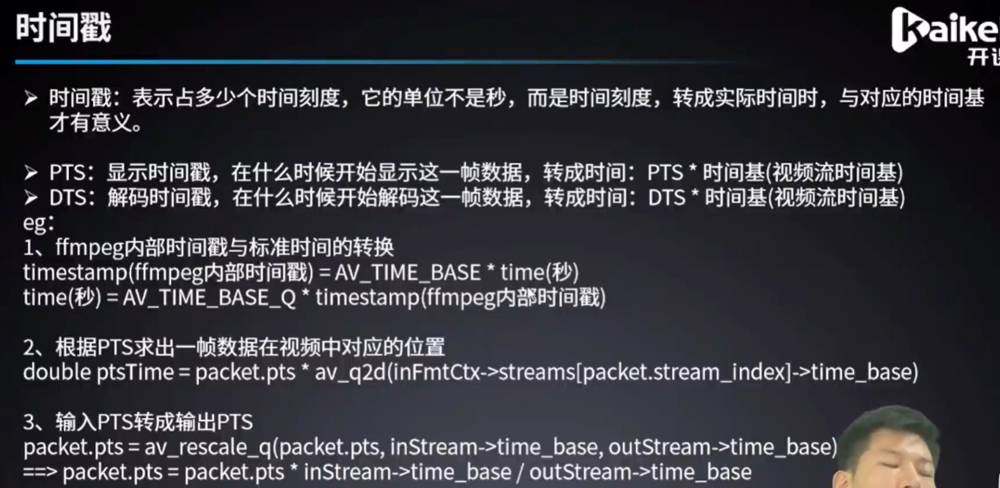

`时间 = 时间戳 \* 时间基`

```c
#include "libavutil/avutil.h"     // 工具函数
#include "libavformat/avformat.h" // 封装
#include "libavcodec/avcodec.h"   // 编解码器

int main(int argc, char **argv)
{

  av_log_set_level(AV_LOG_DEBUG);
  if (argc < 2)
  {
    av_log(NULL, AV_LOG_ERROR, "usage: %s <filename.mp4>\n", argv[0]);
  }

  char *inFileName = argv[1];

  // 打开输入
  // Open an input stream and read the header.
  AVFormatContext *format_ctx = NULL;
  avformat_open_input(&format_ctx, inFileName, NULL, NULL);

  // 获取流信息
  // Read packets of a media file to get stream information.
  avformat_find_stream_info(format_ctx, NULL);

  // 输出封装的input的详细信息
  // Print detailed information about the input or output format
  av_dump_format(format_ctx, 0, inFileName, 0);

  //  ffmpeg 内部时间基
  av_log(NULL, AV_LOG_INFO, "ffmpeg internal time base: %d / %d\n", AV_TIME_BASE_Q.num, AV_TIME_BASE_Q.den); // AV_TIME_BASE_Q 表示的是时间基,值为 1/1000000 秒

  // 时间基x时间戳=时间
  av_log(NULL, AV_LOG_INFO, "input format duration(timestamp):%lld\n", format_ctx->duration);                 // duration表征的是时间戳
  av_log(NULL, AV_LOG_INFO, "input format duration(s):%lf\n", format_ctx->duration * av_q2d(AV_TIME_BASE_Q)); // av_q2d将分数转换成小数

  for (uint8_t idx = 0; idx < format_ctx->nb_streams; idx++)
  {
    AVStream *stream = format_ctx->streams[idx];
    if (stream->codecpar->codec_type == AVMEDIA_TYPE_VIDEO)
    {
      // 视频流的时间基
      AVRational videoTimeBase = stream->time_base;
      av_log(NULL, AV_LOG_INFO, "video stream time base: %d / %d\n", videoTimeBase.num, videoTimeBase.den);
    }
    if (stream->codecpar->codec_type == AVMEDIA_TYPE_AUDIO)
    {
      // 音频流的时间基
      AVRational audioTimeBase = stream->time_base;
      av_log(NULL, AV_LOG_INFO, "audio stream time base: %d / %d\n", audioTimeBase.num, audioTimeBase.den);
    }
  }

  AVPacket *packet = av_packet_alloc();
  while (av_read_frame(format_ctx, packet) == 0)
  {
    AVStream *mediaStream = format_ctx->streams[packet->stream_index];
    AVRational streamTimeBase = mediaStream->time_base;

    av_log(NULL, AV_LOG_INFO, "stream index: %d\n", packet->stream_index);
    av_log(NULL, AV_LOG_INFO, "\t stream time base: %d / %d\n", streamTimeBase.num, streamTimeBase.den);

    av_log(NULL, AV_LOG_INFO, "\t packet pts渲染时间戳: %lld\n", packet->pts);
    av_log(NULL, AV_LOG_INFO, "\t packet ptsTime渲染时间: %lf\n", packet->pts * av_q2d(streamTimeBase));

    av_log(NULL, AV_LOG_INFO, "\t packet dts解码时间戳: %lld\n", packet->dts);
    av_log(NULL, AV_LOG_INFO, "\t packet ptsTime解码时间: %lf\n", packet->dts * av_q2d(streamTimeBase));

    av_log(NULL, AV_LOG_INFO, "\t packet duration时间戳: %lld\n", packet->duration);
    av_log(NULL, AV_LOG_INFO, "\t packet duration时间: %lf\n", packet->duration * av_q2d(streamTimeBase));


    // 释放buffer内存
    av_packet_unref(packet);
  }
  av_packet_free(&packet);

  return 0;
}

```

## 截取封装

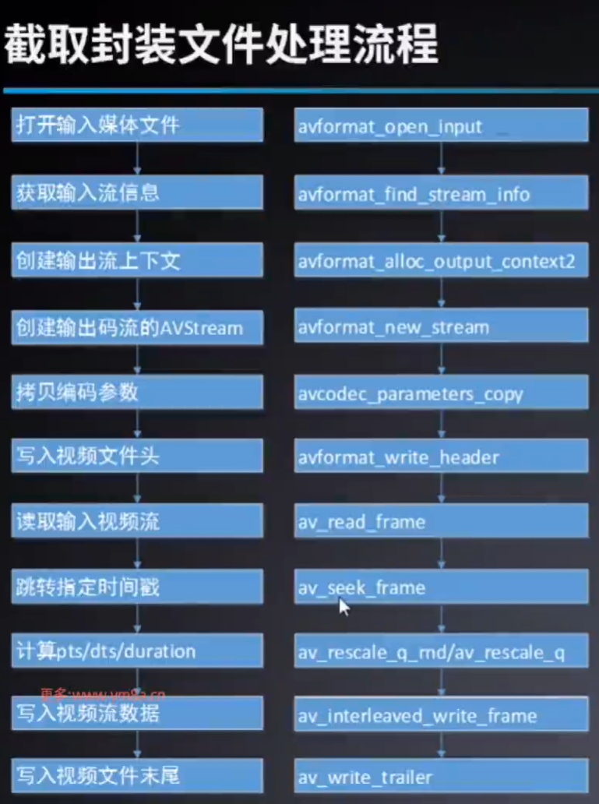

```c
#include "libavutil/avutil.h"     // 工具函数
#include "libavformat/avformat.h" // 封装
#include "libavcodec/avcodec.h"   // 编解码器

int main(int argc, char **argv)
{

  // 设置log级别
  av_log_set_level(AV_LOG_DEBUG);

  // 判断参数个数
  if (argc < 5)
  {
    av_log(NULL, AV_LOG_ERROR, "usage: %s <in_filename.mp4> <start_time_s> <end_time_s> <out_filename.mp4>\n", argv[0]);
    return -1;
  }

  char *inFileName = argv[1];
  char *outFileName = argv[4];
  int startTimeS = atoi(argv[2]);
  int endTimeS = atoi(argv[3]);

  // 打开输入流并读取头
  AVFormatContext *inFmtCtx = NULL;
  // Open an input stream and read the header.
  int ret = avformat_open_input(&inFmtCtx, inFileName, NULL, NULL);
  if (ret < 0)
  {
    av_log(NULL, AV_LOG_ERROR, "avformat_open_input failed.\n");
    return -1;
  }

  // 读取流的头信息
  // Read packets of a media file to get stream information.
  ret = avformat_find_stream_info(inFmtCtx, NULL);
  if (ret < 0)
  {
    av_log(NULL, AV_LOG_ERROR, "avformat_find_stream_info failed.\n");
    return -1;
  }

  // Allocate an AVFormatContext for an output format
  AVFormatContext *outFmtCtx = NULL;
  ret = avformat_alloc_output_context2(&outFmtCtx, NULL, NULL, outFileName);
  if (ret < 0)
  {
    av_log(NULL, AV_LOG_ERROR, "avformat_alloc_output_context2 failed.\n");
    return -1;
  }

  // 创建流到输出文件
  for (uint8_t idx = 0; idx < inFmtCtx->nb_streams; idx++)
  {
    AVStream *inStream = inFmtCtx->streams[idx];
    AVStream *outStream = avformat_new_stream(outFmtCtx, NULL); //  Add a new stream to a media file.
    // Copy the contents of src to dst.
    ret = avcodec_parameters_copy(outStream->codecpar, inStream->codecpar);
    if (ret < 0)
    {
      av_log(NULL, AV_LOG_ERROR, "avcodec_parameters_copy failed.\n");
      return -1;
    }
    outStream->codecpar->codec_tag = 0;
  }

  // 检测标志位
  if (outFmtCtx->flags & AVFMT_NOFILE)
  {
    av_log(NULL, AV_LOG_ERROR, "AVFMT_NOFILE flag is set in iformat/oformat.flags. In this a case, the (de)muxer will handle I/O in some other way and this field(outFmtCtx->pb) will be NULL.\n");
    return -1;
  }

  // 打开输入（创建输入输出环境AVIOContext）
  ret = avio_open(&outFmtCtx->pb, outFileName, AVIO_FLAG_WRITE);
  if (ret < 0)
  {
    av_log(NULL, AV_LOG_ERROR, "avio_open failed.\n");
    return -1;
  }
  // 写入文件头
  ret = avformat_write_header(outFmtCtx, NULL);
  if (ret < 0)
  {
    av_log(NULL, AV_LOG_ERROR, "avformat_write_header failed.\n");
    return -1;
  }

  // 定位到关键帧
  // Seek to the keyframe at timestamp
  ret = av_seek_frame(
      inFmtCtx,                  // media file handle
      -1,                        //  流的id,-1为默认流
      startTimeS * AV_TIME_BASE, // 时间戳，如果指定了具体流，则填基于流时间基的时间戳；如果未指定具体流（-1），则填基于AV_TIME_BASE时间基的时间戳
      AVSEEK_FLAG_ANY            // seek to any frame, even non-keyframes
  );
  if (ret < 0)
  {
    av_log(NULL, AV_LOG_ERROR, "av_seek_frame failed.\n");
    return -1;
  }

  // 记录流的开始时间戳
  int firstPTS[inFmtCtx->nb_streams];
  int firstDTS[inFmtCtx->nb_streams];
  memset(firstPTS, -1, sizeof(firstPTS));
  memset(firstDTS, -1, sizeof(firstDTS));

  AVPacket *packet = av_packet_alloc();
  while (av_read_frame(inFmtCtx, packet) == 0)
  {
    AVStream *inStream = inFmtCtx->streams[packet->stream_index];
    AVStream *outStream = outFmtCtx->streams[packet->stream_index];
    // pts渲染时间戳 x 流的时间基 = 播放时间
    int curTimeS = packet->pts * av_q2d(inStream->time_base);
    if (curTimeS > endTimeS)
      break;

    // 记录流的开始时间戳
    if (firstPTS[packet->stream_index] == -1)
      firstPTS[packet->stream_index] = packet->pts;
    if (firstDTS[packet->stream_index] == -1)
      firstDTS[packet->stream_index] = packet->dts;

    // 重新计算渲染时间戳
    packet->pts = av_rescale_q(packet->pts - firstPTS[packet->stream_index], inStream->time_base, outStream->time_base);
    if (packet->pts < 0)
      packet->pts = 0;
    // 重新计算解码时间戳
    packet->dts = av_rescale_q(packet->dts - firstDTS[packet->stream_index], inStream->time_base, outStream->time_base);
    if (packet->dts < 0)
      packet->dts = 0;
    // 重新计算时长
    packet->duration = av_rescale_q(packet->duration, inStream->time_base, outStream->time_base);
    // 位置位置
    packet->pos = -1;

    // 由于I P B 三个帧的存在，pts和dts的值可能不一样，这里根据时间范围暴力截取packet时，可能导致pts<dts的情况发生，那么后续的校验会不通过
    if (packet->pts < packet->dts)
    {
      continue;
    }

    // 写入封装
    // av_interleaved_write_frame 相比于 write_packet 前者会对pts、dts、stream_index做校验，且前者依赖于后者
    ret = av_interleaved_write_frame(outFmtCtx, packet);
    if (ret < 0)
    {
      av_log(NULL, AV_LOG_ERROR, "av_interleaved_write_frame failed.\n");
      return -1;
    }
    // 释放packet中buffer内存
    av_packet_unref(packet);
  }
  // 释放packet内存
  av_packet_free(&packet);

  // 写文件尾
  // Write the stream trailer to an output media file and free the file private data
  av_write_trailer(outFmtCtx);

  // 释放内存
  if (inFmtCtx)
  {
    avformat_close_input(&inFmtCtx);
  }
  if (outFmtCtx)
  {
    avio_close(outFmtCtx->pb);
    avformat_close_input(&outFmtCtx);
  }
  return 0;
}
```

## RGB、YUV

三原色: 红绿蓝三种色光无法被分解，故称为三原色光，等量的三原色光相加会变为白光，即白光中含有等量的红光 (R) 、绿光 (G) 、蓝光 (B)。

显示器: 使用RGB三种颜色的发光体作为基本发光单元，通过控制它们发光强度从而得到不同色彩。

分辨率含义: 手机屏幕分辩是1280x720，说明水平方向有720个像素点，垂直方向有1280个像素点，所以整个手机屏幕就有1280X720个像素点。

如图，每个像素点都由三个子像素点组成，计算机使用数字的方式表达R G B的发光强度数值，这就是RGB格式。


### RGB

调色板: 通过编号映射到颜色的一张二维表，如01索引，表示红色。

**索引格式:**

- RGB1:每个像素用1bit表示，可表示颜色范围为双色，即黑和白，需要用到调色板
- RGB4:每个像素用4bit表示，索引范围为0-16，共16个，表示16种颜色，需要用到调色板。
- RGB8:每个像素用8bit表示，索引范围为0-255，共256个，表示256种颜色，需要用到调色板。

总结:图像质量不高，但占存储空间少，格式较老，无法满足高标准的视觉体验需求。

**像素格式：**

- 存储的是每一个像素点的RGB值
- RGB565
  - 每个像素用16bit表示，2字节，RGB分别用5 6 5个bit表示。
  - 
- RGB555:
  - 每个像素用16bit表示，2字节，RGB 分别用5 5 5个bit表示，最高位不用。
  - 
- RGB24:
  - 每个像素用24bit表示，3字节，RGB分别用8 8 8个bit表示。
  - **注意RGB24格式按BGR的方式存储**
  - 
- RGB32：
  - 每个像素用32bit表示，4个字节，R，G，B分量分别用8 8 8个bit表示，存储顺序为B，G，R，最后8个字节保留。
- ARGB32
  - 每个像素用32bit表示，4个字节，R，G，B分量分别用8 8 8个bit表示，存储顺序为B，G，R，最后8个字节是A(alpha)通道，表示透明度。
  - 

**ffmpeg命令将图片转rgb数据:**

> ffmpeg -i 200x200.png -s 200x200 -pix_fmt rgb24 rgb24.rgb

**ffplay播放:**

> ffplay -s 200\*200 -pix_fmt rgb24 rgb24.rgb

**大小计算:**
以RGB24为例: 200*200*3=120000 byte

### YUV

**YUV概念**

- YUV（也称YCbCr）是电视系统所采用的一种颜色编码方法。
- 其中"Y”表示明亮度(Luminance)，也称灰阶值，它是基础信号;
- 而U和V表示的则是色度(Chrominance),它们的作用是描述影像的色彩及饱和度，用于指定像素的颜色；
- 亮度和色度都是被正交调制的。
- **亮度Y**是通过RGB输入信号来建立的，方法是将 RGB信号的特定部分叠加到一起。
- **色度UV**则定义了颜色的色调与饱和度，分别用Cr和Cb来表示。
  - 其中，Cr反映了RGB输入信号红色部分与RGB信号亮度值之间的差异，
  - 而Cb反映的则是RGB输入信号蓝色部分与RGB信号亮度值之间的差异。
- 与RGB类型，一幅图像的每个像素点由YUV三个分量构成。
- **UV平面（Y=0.5）：**
- 
- **采样格式**
  - 4:4:4表示完全取样。
  - 4:2:2表示2:1的水平取样，垂直完全采样。
  - 4:2:0表示2:1的水平取样，垂直2:1采样。
- **存储格式**
  - planner(平面)格式:先连续存储所有像素点的Y分量，紧接着存储所有像素点的U分量，最后是所有像素点的V分量。
  - packed(打包)格式:每个像素点的Y、U、V是连续交替存储的。
  - YUV420P中的Y、U、V分量都是平面格式
  - 
  - YUV420SP中的Y分量为平面格式，UV分量为打包格式，即U和V分量交错排列。
  - 

把亮度和色度分离，没有色度信息仍能显示完整的图像，只不过是黑白的，解决了彩色电视跟黑白电视的兼容问题。
与RGB视频信号传输相比，它最大的优点在于只需要占用极少的频宽(RGB要求3个独立的颜色分量同时传输)。

**RGB到YCbCr的转换过程：**

- 摄像机从图像传感器接收光线生成RGB图像。
- RGB图像被编码成YCbCr信号，这是记录和传输到观看设备的信号。
- 显示设备（电脑、电视机或显示器）对YCbCr信号进行解码，并将其转换为RGB信号以进行显示。
  由于原始图像数据和显示的图像都使用RGB格式，通常我们不需要过多关注YCbCr信号。

**编码RGB“4:2:2”和“4:2:0”：**

- 色度的子采样和数据压缩对于人类来说，亮度的变化比颜色的差异更为显而易见。
- 色度（颜色）子采样是一种方法，通过将RGB文件转换为YCbCr信号，可以减少颜色信息，从而缩小数据文件。
- 4:2:2和4:2:0指的是色度子采样的不同方法。

**其如何运作？**

- 色彩采样在4×2个阵列中每8个像素发生一次。
- 4列像素的亮度（Y）通道被记录下来，因此第一个数字是4。
- 第二个数字表示从第一行像素记录的色差信号（CbCr）数量。
- 第三个数字表示从第二行像素记录的色差信号（CbCr）数量。

**未压缩的YCbCr 4:4:4**

- 
- 当所有像素的CbCr信息都被记录下来时（无未采样的像素），色度子采样即可被标示为4:4:4（无子采样）。这可提供最高品质 - RAW文件等同4:4:4。然而，其也可能导致文件大小增加。
- 文件尺寸较小时，我们可能会损耗一些颜色信息，才能压缩文件。一种方法是利用子采样，即不记录某些像素的信息。

**压缩的YUV**

- 
- `YCbCr 4:2:2` 子采样:在每个像素行中，只有两个像素的CbCr信号被记录下来。
- `YCbCr 4:2:0` 子采样:针对最上面一行，只记录两个像素的CbCr信号。第二行像素并未记录CbCr信号。
- **解码** 当信号被解码成RGB以便显示在显示器上时，没有CbCr记录的像素左边、左上方和/或上方的CbCr信息被复制到该像素。
- 由于人类对颜色差异的视觉感知能力相对较差，因此大多数人通常不会注意到未记录的像素信息所导致的图像质量下降问题。缩减所要记录的信息，有助于缩减数据量。

**4:2:0和4:2:2之间有何区别？**

正如上方插图所示，4:2:2比4:2:0记录更多色彩信息。

目前，电视机、DVD/蓝光格式，以及其他大多数视听和图像显示装置都使用YCbCr 4:2:0信号。正常观看画面时，我们可能不会觉得4:2:0信号的图像质量较差。

然而，在影片的制作过程中，我们仍须确保影片尽可能达到高品质。当然，由于记录包含各个像素的YCbCr数据，因此4:4:4提供了最高的品质 - 这就是RAW数据的特点。但这样做的缺点却是文件体积增大，这在某些制作情况下是不可行的。

这正是子采样可以发挥作用之处。4:2:0的子采样提供了最轻巧的文件，但色彩信息减少却给后期编辑提供了较少的余地。同时，4:2:2缩减了文件大小，同时储存了更多的色彩信息。这不仅让编辑有更多的弹性，更能在调色后保持图像极高的品质。

**YUV4:4:4**

- YUV三个信道的抽样率相同，在生成的图像中，每个像素占用3字节，每一个Y分量都对应一组UV分量。
- 这种格式，色度信号的分辨率和亮度信号的分辨率是相同的。这种格式主要应用在视频处理设备内部，避免画面质量在处理过程中降低。
- 空心圆表示所采样颜色的UV分量，黑点表示所采样颜色的Y分量。
- 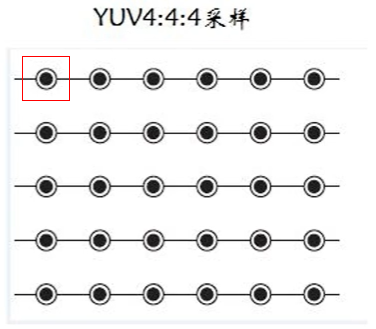
- YUV444是色度信号分辨率最高的格式，444意思是每1点 Y 采样相对应的1个 U 采样和1个 V 采样。
- 
- 公式(NTSC标准):
  - 
  - 

**YUV4:2:2**

- 每个UV信道的抽样率是Y的一半，在生成的图像中，每个由两个水平方向相邻的像素组成的宏像素占用4字节。每两个Y分量共用一组UV分量。
- 

**YUV4:2:0**

- 每个色度分量，**水平方向和竖直方向的抽样率都是2:1，色度的抽样率为4:1**，即每隔一个像素采样一次。同时，水平方向上色度分量的抽样率为1/4，即每隔四个像素采样一次。每个由2x2个2行2列相邻的像素组成的宏像素需要占用6字节内存，每四个Y分量共用一组UV分量。
- 
- 420表示每4点 Y 采样相对应的1个 U 采样和1个 V 采样，具体情况如下图所示：
- 

**大小计算**

- RGB24:一张4x4像素的RGB图像大小为4x4x3=48字节。
- YUV444:一张4x4像素的YUV444图像大小为4x4x3=48字节，跟RGB一样大。Y、UV三个分量的大小都是4x4=16字节。
- YUV422:一张4x4像素的YUV422图像大小为4x4x2=32字节，Y分量为全采样，即4x4=16字节，U分量和V分量只有Y分量的一半，即U分量为4x4/2=8字节，V分量也是4x4/2=8字节。
- YUV420:一张4x4像素的YUV420图像大小为4x4x(3/2)=24字节，Y分量为全采样即4x4=16字节，U分量和V分量只有Y分量的四分之一，即U分量和V分量的大小均为4x4/4=4字节。

**ffmpeg命令将图片转yuv数据:**

ffmpeg -i 200x200.png -s 200x200 -pix_fmt yuv420p yuv420p.yuv

**YUV Player 播放器播放:**

大小计算:

以YUV420P为例:200*200*3/2=60000byte

## 视频解码


```c
#include <libavformat\avformat.h> // 解封装
#include <libavutil\avutil.h>     // 日志
#include <libavcodec\avcodec.h>   // 编解码

int ret = 0;
AVFormatContext *inputFmtCtx = NULL;
FILE *destFile = NULL;
AVCodecContext *decoderCtx = NULL;

int cleanUp()
{
    if (inputFmtCtx)
        avformat_close_input(&inputFmtCtx);
    if (destFile)
    {
        fclose(destFile);
    }
    if (decoderCtx)
        avcodec_free_context(&decoderCtx);
    return ret;
}

int main(int avc, char *argv[])
{

    // 设置日志级别
    av_log_set_level(AV_LOG_INFO);

    // 打印用法
    if (avc < 3)
    {
        av_log(NULL, AV_LOG_INFO, "usage:%s <inFileName.mp4> <outFileName.yuv>", argv[0]);
        return -1;
    }

    char *inFileName = argv[1];
    char *outFileName = argv[2];

    // 打开输入
    if ((ret = avformat_open_input(&inputFmtCtx, inFileName, NULL, NULL)) < 0)
    {
        av_log(NULL, AV_LOG_ERROR, "avformat_open_input failed");
        return cleanUp();
    }

    // 创建输出文件
    destFile = fopen(outFileName, "wb");
    if (destFile == NULL)
    {
        av_log(NULL, AV_LOG_ERROR, "fopene failed.");
        return cleanUp();
    }

    // 探测流信息
    if ((ret = avformat_find_stream_info(inputFmtCtx, NULL)) < 0)
    {
        av_log(NULL, AV_LOG_ERROR, "avformat_find_stream_info failed");
        return cleanUp();
    }

    // 得到视频流
    int videoIdx = av_find_best_stream(inputFmtCtx, AVMEDIA_TYPE_VIDEO, -1, -1, NULL, 0);
    if (videoIdx < 0)
    {
        av_log(NULL, AV_LOG_ERROR, "av_find_best_stream failed");
        return cleanUp();
    }

    // 得到编解码上下文
    if ((decoderCtx = avcodec_alloc_context3(NULL)) == NULL)
    {
        av_log(NULL, AV_LOG_ERROR, "avcodec_alloc_context3 failed");
        return cleanUp();
    }

    // 将视频流编解码器信息拷贝到编解码上下文
    if ((ret = avcodec_parameters_to_context(decoderCtx, inputFmtCtx->streams[videoIdx]->codecpar)) < 0)
    {
        av_log(NULL, AV_LOG_ERROR, "avcodec_parameters_to_context failed");
        return cleanUp();
    }

    // 根据编解码器id获取解码器
    const AVCodec *videoDecoder = avcodec_find_decoder(decoderCtx->codec_id);
    if (videoDecoder == NULL)
    {
        av_log(NULL, AV_LOG_ERROR, "avcodec_find_decoder failed");
        return cleanUp();
    }

    // 使用 编解码器 初始化 编解码器的上下文
    if ((ret = avcodec_open2(decoderCtx, videoDecoder, NULL)) < 0)
    {
        av_log(NULL, AV_LOG_ERROR, "avcodec_open2 failed");
        return cleanUp();
    }

    // 读取流
    AVPacket *packet = av_packet_alloc();
    AVFrame *frame = av_frame_alloc();
    int render_process(AVCodecContext * decoderCtx, AVPacket * packet, AVFrame * frame, FILE * destFile);
    while (av_read_frame(inputFmtCtx, packet) == 0)
    {
        // 如果是视频流
        if (packet->stream_index == videoIdx)
        {
            // 把packet发送给解码器得到YUV帧
            if (render_process(decoderCtx, packet, frame, destFile) < 0)
            {
                av_log(NULL, AV_LOG_ERROR, "render_process failed");
                return cleanUp();
            }
        }
        av_packet_unref(packet);
    }
    // 再次把packet发送给解码器得到YUV帧
    // （这里是为了防止pts和dts的原因导致解码器中还有YUV帧没有取出，所以发送packet=NULL,然后再读Frame）
    // 如果不这么做，可能导致最后少几帧
    if (render_process(decoderCtx, NULL, frame, destFile) < 0)
    {
        av_log(NULL, AV_LOG_ERROR, "render_process failed");
        return cleanUp();
    }
    av_packet_free(&packet);
    av_frame_free(&frame);

    return 0;
}
int render_process(AVCodecContext *decoderCtx, AVPacket *packet, AVFrame *frame, FILE *destFile)
{
    /**
     * avcodec_send_packet:
     *
     * packet can be NULL (or an AVPacket with data set to NULL and
     * size set to 0); in this case, it is considered a flush
     * packet, which signals the end of the stream.
     */

    // 将数据发送给解码器
    if ((ret = avcodec_send_packet(decoderCtx, packet)) < 0)
    {
        av_log(NULL, AV_LOG_ERROR, "avcodec_send_packet failed");
        return -1;
    }
    // 接收解码器解码后的数据frame
    while (avcodec_receive_frame(decoderCtx, frame) == 0)
    {
        // YUV420
        // Y
        // 【Y Y Y Y】
        // 【Y Y Y Y】
        // U
        // 【U 0 U 0】
        // 【0 0 0 0】
        // V
        // 【V 0 V 0】
        // 【0 0 0 0】

        // 写法1：
        // data[0]表示Y数据，通过 decoderCtx->width * decoderCtx->height 计算数据的长度
        // 这里的问题在于解码器和CPU可能会优化，导致frame->data[0]数据的宽度和decoderCtx->width不一致，有多余的无用数据，使得无法正常播放
        // fwrite(frame->data[0], 1, decoderCtx->width * decoderCtx->height, destFile);
        // fwrite(frame->data[1], 1, decoderCtx->width * decoderCtx->height / 4, destFile);
        // fwrite(frame->data[2], 1, decoderCtx->width * decoderCtx->height / 4, destFile);

        // 写法2:
        // data[0]表示Y数据，通过 frame->linesize[0] * decoderCtx->height 计算数据的长度
        // 这里的问题在于解码器和CPU可能会优化，frame->linesize[0]比实际宽度大、data中也有多余的无用数据，如果不能正确指定宽高，视频将无法正常播放
        fwrite(frame->data[0], 1, frame->linesize[0] * decoderCtx->height, destFile); // Y
        fwrite(frame->data[1], 1, frame->linesize[1] * decoderCtx->height/2, destFile); // U
        fwrite(frame->data[2], 1, frame->linesize[2] * decoderCtx->height/2, destFile); // V

        // 输出实际宽高
        av_log(NULL, AV_LOG_INFO, "w:%d,h:%d.\n", frame->width, frame->height);       // 480x270
        av_log(NULL, AV_LOG_INFO, "w:%d,h:%d.\n", frame->linesize[0], frame->height); // 512x270

        // 播放时要指定宽度为：512x270 而不是实际宽度480x270,否则不能正常播放
        // $ ffplay -f rawvideo -video_size 512x270 -pixel_format yuv420p file.yuv

        av_frame_unref(frame);
    }
    return 0;
}
```

**存在问题**

- 解码器和CPU可能会优化
- 导致frame->data[0]数据的宽度和decoderCtx->width不一致，有多余的无用数据，使得无法正常播放
- 实际宽度480x270的视频被优化成了512x270
- 

## 修改分辨率

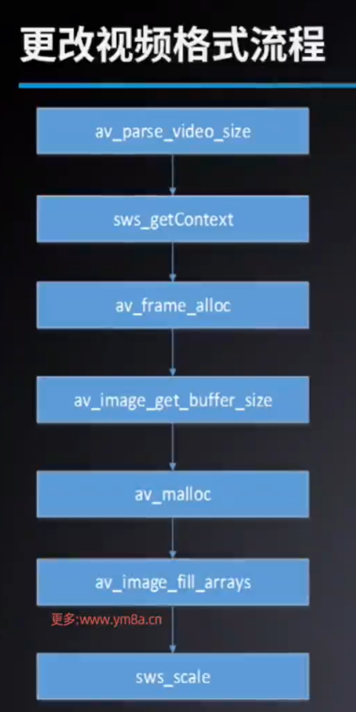


```c
#include <libavformat\avformat.h> // 解封装
#include <libavutil\avutil.h>     // 日志
#include <libavutil\parseutils.h> // 解析字符串
#include <libavutil\imgutils.h>   // 计算视频大小
#include <libavcodec\avcodec.h>   // 编解码
#include <libswscale\swscale.h>   // 视频缩放

int ret = 0;
AVFormatContext *inputFmtCtx = NULL;
FILE *destFile = NULL;
AVCodecContext *decoderCtx = NULL;

int cleanUp()
{
    if (inputFmtCtx)
        avformat_close_input(&inputFmtCtx);
    if (destFile)
    {
        fclose(destFile);
    }
    if (decoderCtx)
        avcodec_free_context(&decoderCtx);
    return ret;
}

int main(int avc, char *argv[])
{

    // 设置日志级别
    av_log_set_level(AV_LOG_INFO);

    // 打印用法
    if (avc < 4)
    {
        av_log(NULL, AV_LOG_INFO, "usage:%s <inFileName.mp4> <outFileName.yuv> <widthxheight>", argv[0]);
        return -1;
    }

    char *inFileName = argv[1];
    char *outFileName = argv[2];
    char *resolution = argv[3];
    int destWidth = 0, destHeight = 0;

    // 解析宽高
    if ((ret = av_parse_video_size(&destWidth, &destHeight, resolution)) < 0)
    {
        av_log(NULL, AV_LOG_ERROR, "av_parse_video_size failed");
        return cleanUp();
    }

    // 打开输入
    if ((ret = avformat_open_input(&inputFmtCtx, inFileName, NULL, NULL)) < 0)
    {
        av_log(NULL, AV_LOG_ERROR, "avformat_open_input failed");
        return cleanUp();
    }

    // 创建输出文件
    destFile = fopen(outFileName, "wb");
    if (destFile == NULL)
    {
        av_log(NULL, AV_LOG_ERROR, "fopene failed.");
        return cleanUp();
    }

    // 探测流信息
    if ((ret = avformat_find_stream_info(inputFmtCtx, NULL)) < 0)
    {
        av_log(NULL, AV_LOG_ERROR, "avformat_find_stream_info failed");
        return cleanUp();
    }

    // 得到视频流
    int videoIdx = av_find_best_stream(inputFmtCtx, AVMEDIA_TYPE_VIDEO, -1, -1, NULL, 0);
    if (videoIdx < 0)
    {
        av_log(NULL, AV_LOG_ERROR, "av_find_best_stream failed");
        return cleanUp();
    }

    // 得到编解码上下文
    if ((decoderCtx = avcodec_alloc_context3(NULL)) == NULL)
    {
        av_log(NULL, AV_LOG_ERROR, "avcodec_alloc_context3 failed");
        return cleanUp();
    }

    // 将视频流编解码器信息拷贝到编解码上下文
    if ((ret = avcodec_parameters_to_context(decoderCtx, inputFmtCtx->streams[videoIdx]->codecpar)) < 0)
    {
        av_log(NULL, AV_LOG_ERROR, "avcodec_parameters_to_context failed");
        return cleanUp();
    }

    // 根据编解码器id获取解码器
    const AVCodec *videoDecoder = avcodec_find_decoder(decoderCtx->codec_id);
    if (videoDecoder == NULL)
    {
        av_log(NULL, AV_LOG_ERROR, "avcodec_find_decoder failed");
        return cleanUp();
    }

    // 使用 编解码器 初始化 编解码器的上下文
    if ((ret = avcodec_open2(decoderCtx, videoDecoder, NULL)) < 0)
    {
        av_log(NULL, AV_LOG_ERROR, "avcodec_open2 failed");
        return cleanUp();
    }

    // 获取源颜色空间
    enum AVPixelFormat srcPixFmt = decoderCtx->pix_fmt;
    enum AVPixelFormat destPixFmt = srcPixFmt; // AV_PIX_FMT_YUV420P

    // 获取swscale上下文
    struct SwsContext *swsCtx = sws_getContext(
        decoderCtx->width, decoderCtx->height, srcPixFmt, // 源分辨率 源图像空间
        destWidth, destHeight, destPixFmt,                // 目标分辨率 目标图像空间
        SWS_FAST_BILINEAR,                                // 缩放算法
        NULL,                                             // 源图像过滤器（前后图像滤波处理）
        NULL,                                             // 目标图像滤波器
        NULL                                              // 参数
    );

    if (swsCtx == NULL)
    {
        av_log(NULL, AV_LOG_ERROR, "sws_getContext failed");
        return cleanUp();
    }
    // 创建destFrame
    AVFrame *destFrame = av_frame_alloc();
    // 为destFrame的data分配内存
    uint8_t *destBuffer = av_malloc(av_image_get_buffer_size(destPixFmt, destWidth, destHeight, 1));
    // 把所分配内存的地址，通过计算，分别设置到Y:data[0] U:data[1] V:data[2] 中
    av_image_fill_arrays(destFrame->data, destFrame->linesize, destBuffer, destPixFmt, destWidth, destHeight, 1);
    // 读取流
    AVPacket *packet = av_packet_alloc();
    AVFrame *srcFrame = av_frame_alloc();
    int render_process(AVCodecContext * decoderCtx, AVPacket * packet, struct SwsContext * swsCtx, AVFrame * srcFrame, AVFrame * destFrame, int destWidht, int destHeight, FILE *destFile);
    while (av_read_frame(inputFmtCtx, packet) == 0)
    {
        // 如果是视频流
        if (packet->stream_index == videoIdx)
        {
            // 把packet发送给解码器得到YUV帧
            if (render_process(decoderCtx, packet, swsCtx, srcFrame, destFrame, destWidth, destHeight, destFile) < 0)
            {
                av_log(NULL, AV_LOG_ERROR, "render_process failed");
                return cleanUp();
            }
        }
        av_packet_unref(packet);
    }
    // 再次把packet发送给解码器得到YUV帧
    // （这里是为了防止pts和dts的原因导致解码器中还有YUV帧没有取出，所以发送packet=NULL,然后再读Frame）
    // 如果不这么做，可能导致最后少几帧
    if (render_process(decoderCtx, NULL, swsCtx, srcFrame, destFrame, destWidth, destHeight, destFile) < 0)
    {
        av_log(NULL, AV_LOG_ERROR, "render_process failed");
        return cleanUp();
    }
    av_packet_free(&packet);
    av_frame_free(&srcFrame);

    return 0;
}
int render_process(AVCodecContext *decoderCtx, AVPacket *packet, struct SwsContext *swsCtx, AVFrame *srcFrame, AVFrame *destFrame, int destWidht, int destHeight, FILE *destFile)
{
    /**
     * avcodec_send_packet:
     *
     * packet can be NULL (or an AVPacket with data set to NULL and
     * size set to 0); in this case, it is considered a flush
     * packet, which signals the end of the stream.
     */

    // 将数据发送给解码器
    if ((ret = avcodec_send_packet(decoderCtx, packet)) < 0)
    {
        av_log(NULL, AV_LOG_ERROR, "avcodec_send_packet failed");
        return -1;
    }
    // 接收解码器解码后的数据frame
    while (avcodec_receive_frame(decoderCtx, srcFrame) == 0)
    {
        // YUV420
        // Y
        // 【Y Y Y Y】
        // 【Y Y Y Y】
        // U
        // 【U 0 U 0】
        // 【0 0 0 0】
        // V
        // 【V 0 V 0】
        // 【0 0 0 0】

        // 写法1：
        // data[0]表示Y数据，通过 decoderCtx->width * decoderCtx->height 计算数据的长度
        // 这里的问题在于解码器和CPU可能会优化，导致frame->data[0]数据的宽度和decoderCtx->width不一致，有多余的无用数据，使得无法正常播放
        // fwrite(frame->data[0], 1, decoderCtx->width * decoderCtx->height, destFile);
        // fwrite(frame->data[1], 1, decoderCtx->width * decoderCtx->height / 4, destFile);
        // fwrite(frame->data[2], 1, decoderCtx->width * decoderCtx->height / 4, destFile);

        // 写法2:
        // data[0]表示Y数据，通过 frame->linesize[0] * decoderCtx->height 计算数据的长度
        // 这里的问题在于解码器和CPU可能会优化，frame->linesize[0]比实际宽度大、data中也有多余的无用数据，如果不能正确指定宽高，视频将无法正常播放
        // fwrite(srcFrame->data[0], 1, srcFrame->linesize[0] * decoderCtx->height, destFile); // Y
        // fwrite(srcFrame->data[1], 1, srcFrame->linesize[1] * decoderCtx->height, destFile); // U
        // fwrite(srcFrame->data[2], 1, srcFrame->linesize[2] * decoderCtx->height, destFile); // V
        // // 输出实际宽高
        // av_log(NULL, AV_LOG_INFO, "w:%d,h:%d.\n", srcFrame->width, srcFrame->height);       // 480x270
        // av_log(NULL, AV_LOG_INFO, "w:%d,h:%d.\n", srcFrame->linesize[0], srcFrame->height); // 512x270
        // av_log(NULL, AV_LOG_INFO, "w:%d,h:%d.\n", srcFrame->linesize[1], srcFrame->height); // 512x270
        // av_log(NULL, AV_LOG_INFO, "w:%d,h:%d.\n", srcFrame->linesize[2], srcFrame->height); // 512x270
        // 播放时要指定宽度为：512x270 而不是实际宽度480x270,否则不能正常播放
        // $ ffplay -f rawvideo -video_size 512x270 -pixel_format yuv420p file.yuv

        // 写法3：
        // 利用swscale裁剪
        // 此时destFrame中没有多余的数据，但是destFrame->height为0,destFrame->width有正确值
        if (
            (ret = sws_scale(swsCtx,                                                                            // swscale上下文
                             (const uint8_t *const *)srcFrame->data, srcFrame->linesize, 0, decoderCtx->height, // 源Frame数据 源Frame宽度 起始位置 原始图片高度
                             destFrame->data, destFrame->linesize                                               // 目标Frame数据 目标Frame宽度
                             )) < 0)
        {
            av_log(NULL, AV_LOG_ERROR, "sws_scale failed");
            return -1;
        }

        fwrite(destFrame->data[0], 1, destWidht * destHeight, destFile);     // Y
        fwrite(destFrame->data[1], 1, destWidht * destHeight / 4, destFile); // U
        fwrite(destFrame->data[2], 1, destWidht * destHeight / 4, destFile); // V
        av_frame_unref(srcFrame);
    }
    return 0;
}
```

## 修改格式为RGB24

只需要在之前代码的基础上修改，只需要修改传递给swscale的参数即可

**修改目标格式**

```c
// enum AVPixelFormat destPixFmt = AV_PIX_FMT_YUV420P; // AV_PIX_FMT_YUV420P
enum AVPixelFormat destPixFmt = AV_PIX_FMT_RGB24; // AV_PIX_FMT_RGB24
```

**修改输出方式**

```c
// YUV420 是planer数据 三个分量分开存放
// fwrite(destFrame->data[0], 1, destWidht * destHeight, destFile);     // Y
// fwrite(destFrame->data[1], 1, destWidht * destHeight / 4, destFile); // U
// fwrite(destFrame->data[2], 1, destWidht * destHeight / 4, destFile); // V

// RGB24是packed数据，三个分量打包存放
fwrite(destFrame->data[0], 1, destWidht * destHeight * 3, destFile); // RGB23
```

播放

```bash
# 转换
./output/main ./bigbuckbunny_h264_aac.mp4 resize.rgb24 720x576
# 播放
ffplay -f rawvideo -video_size 720x576 -pixel_format rgb24 resize.rgb24
```

## 保存raw格式图像

**BMP**

- BMP文件格式，又称为Bitmap (位图)或是DIB(Device-lndependent Device，设备无关位图)，
- 是Windows系统中广泛使用的图像文件格式。
- 由于它可以不作任何变换地保存图像像素域的数据，因此成为我们取得RAW数据的重要来源。
- **扫描方式:**从左到右、从下到上
- 文件组成:
  - 位图文件头(bmp file header): 提供文件的格式、大小等信息。
  - 位图信息头(bitmap information): 提供图像数据的尺寸、位平面数、压缩方式、颜色索引等信息.
  - 调色板(color palette): 可选，如使用索引来表示图像，调色板就是索引与其对应的颜色的映射表。
  - 位图数据(bitmap data): 图像数据区。

```c
#include <stdint.h>
#include <libavformat\avformat.h> // 解封装
#include <libavutil\avutil.h>     // 日志
#include <libavutil\parseutils.h> // 解析字符串
#include <libavutil\imgutils.h>   // 计算视频大小
#include <libavcodec\avcodec.h>   // 编解码
#include <libswscale\swscale.h>   // 视频缩放

/**
 * win32 类型
 */
typedef uint16_t WORD;
typedef uint32_t DWORD;
typedef int32_t LONG;

// 设置按1字节对齐，防止编译器对结构体做字节对齐
#pragma pack(1)

// 位图文件文件头
typedef struct
{
    WORD bfType;      // 文件类型 固定为0x4d42 表示BM(BitMap)
    DWORD bfSize;     // 整个文件大小
    WORD bfReserved1; // 保留字
    WORD bfReserved2; // 保留字
    DWORD bfOffBits;  // 实际位图数据的偏移字节数（相对于整个文件）
} BitMapFileHeader;

// 位图文件信息头
typedef struct
{
    DWORD biSize;         // 表示当前结构体的长度，设置为40 不要用sizeof因为不准确，除非关闭字节对齐
    LONG biWidth;         // 图片宽度
    LONG biHeight;        // 图片高度，高度字段的正负值表示位图的上下方向。当高度为正时，图像是从上到下绘制的；当高度为负时，图像是从下到上绘制的。
    WORD biPlanes;        // 图片平面数 设置为1
    WORD biBitCount;      // 颜色位数 1(黑白)、8、16、24、32位图
    DWORD biCompression;  // 压缩属性，位图是不压缩的，所以设置0
    DWORD biSizeImage;    // 位图数据实际占用的字节数（不压缩就不用填）
    LONG biXPelsPerMeter; // X方向分辨率,可省略
    LONG biYPelsPerMeter; // Y方向分辨率,可省略
    DWORD biClrUsed;      // 使用了多少个颜色索引表，0表示使用默认值：2^(biBitCount颜色位数)
    DWORD biClrImportant; // 重要颜色数，0表示所有颜色都是重要的
} BitMapFileInfoHeader;
#pragma endregion

// 写入bitmap文件
int writeBitMap(const char *bmpFileName, uint8_t *rgb24Data, int width, int height)
{
    BitMapFileHeader fileHeader = {0};
    BitMapFileInfoHeader infoHeader = {0};

    fileHeader.bfType = 0x4d42;
    fileHeader.bfSize = sizeof(BitMapFileHeader) + sizeof(BitMapFileInfoHeader) + width * height * 3;
    fileHeader.bfOffBits = sizeof(BitMapFileHeader) + sizeof(BitMapFileInfoHeader);

    infoHeader.biSize = sizeof(BitMapFileInfoHeader);
    infoHeader.biWidth = width;
    infoHeader.biHeight = -1 * height;
    infoHeader.biPlanes = 1;
    infoHeader.biBitCount = 24;

    FILE *file = fopen(bmpFileName, "wb");
    if (file == NULL)
    {
        av_log(NULL, AV_LOG_ERROR, "fopen failed\n");
        return -1;
    }

    fwrite(&fileHeader, 1, sizeof(BitMapFileHeader), file);
    fwrite(&infoHeader, 1, sizeof(BitMapFileInfoHeader), file);
    fwrite(rgb24Data, 1, width * height * 3, file);

    fclose(file);

    return 0;
}

int ret = 0;
AVFormatContext *inputFmtCtx = NULL;
AVCodecContext *decoderCtx = NULL;

int cleanUp()
{
    if (inputFmtCtx)
        avformat_close_input(&inputFmtCtx);
    if (decoderCtx)
        avcodec_free_context(&decoderCtx);
    return ret;
}

int main(int avc, char *argv[])
{

    // 设置日志级别
    av_log_set_level(AV_LOG_INFO);

    // 打印用法
    if (avc < 2)
    {
        av_log(NULL, AV_LOG_INFO, "usage:%s <inFileName.mp4>", argv[0]);
        return -1;
    }

    char *inFileName = argv[1];

    // 打开输入
    if ((ret = avformat_open_input(&inputFmtCtx, inFileName, NULL, NULL)) < 0)
    {
        av_log(NULL, AV_LOG_ERROR, "avformat_open_input failed");
        return cleanUp();
    }

    // 探测流信息
    if ((ret = avformat_find_stream_info(inputFmtCtx, NULL)) < 0)
    {
        av_log(NULL, AV_LOG_ERROR, "avformat_find_stream_info failed");
        return cleanUp();
    }

    // 得到视频流
    int videoIdx = av_find_best_stream(inputFmtCtx, AVMEDIA_TYPE_VIDEO, -1, -1, NULL, 0);
    if (videoIdx < 0)
    {
        av_log(NULL, AV_LOG_ERROR, "av_find_best_stream failed");
        return cleanUp();
    }

    // 得到编解码上下文
    if ((decoderCtx = avcodec_alloc_context3(NULL)) == NULL)
    {
        av_log(NULL, AV_LOG_ERROR, "avcodec_alloc_context3 failed");
        return cleanUp();
    }

    // 将视频流编解码器信息拷贝到编解码上下文
    if ((ret = avcodec_parameters_to_context(decoderCtx, inputFmtCtx->streams[videoIdx]->codecpar)) < 0)
    {
        av_log(NULL, AV_LOG_ERROR, "avcodec_parameters_to_context failed");
        return cleanUp();
    }

    // 根据编解码器id获取解码器
    const AVCodec *videoDecoder = avcodec_find_decoder(decoderCtx->codec_id);
    if (videoDecoder == NULL)
    {
        av_log(NULL, AV_LOG_ERROR, "avcodec_find_decoder failed");
        return cleanUp();
    }

    // 使用 编解码器 初始化 编解码器的上下文
    if ((ret = avcodec_open2(decoderCtx, videoDecoder, NULL)) < 0)
    {
        av_log(NULL, AV_LOG_ERROR, "avcodec_open2 failed");
        return cleanUp();
    }

    // 获取源颜色空间
    enum AVPixelFormat srcPixFmt = decoderCtx->pix_fmt;
    // 据说：BitMap期望的存储格式为RGB 但是ffmpeg中RGB的存储格式为BGR,所以这里得写BGR,得到的存储格式才能是RGB
    enum AVPixelFormat destPixFmt = AV_PIX_FMT_BGR24;

    // 获取swscale上下文
    struct SwsContext *swsCtx = sws_getContext(
        decoderCtx->width, decoderCtx->height, srcPixFmt,  // 源分辨率 源图像空间
        decoderCtx->width, decoderCtx->height, destPixFmt, // 目标分辨率 目标图像空间
        SWS_FAST_BILINEAR,                                 // 缩放算法
        NULL,                                              // 源图像过滤器（前后图像滤波处理）
        NULL,                                              // 目标图像滤波器
        NULL                                               // 参数
    );

    if (swsCtx == NULL)
    {
        av_log(NULL, AV_LOG_ERROR, "sws_getContext failed");
        return cleanUp();
    }
    // 创建destFrame
    AVFrame *destFrame = av_frame_alloc();
    // 为destFrame的data分配内存
    uint8_t *destBuffer = (uint8_t *)av_malloc(av_image_get_buffer_size(destPixFmt, decoderCtx->width, decoderCtx->height, 1));
    // 把所分配内存的地址，通过计算，分别设置到Y:data[0] U:data[1] V:data[2] 中
    av_image_fill_arrays(destFrame->data, destFrame->linesize, destBuffer, destPixFmt, decoderCtx->width, decoderCtx->height, 1);
    // 读取流
    AVPacket *packet = av_packet_alloc();
    AVFrame *srcFrame = av_frame_alloc();
    int render_process(AVCodecContext * decoderCtx, AVPacket * packet, struct SwsContext * swsCtx, AVFrame * srcFrame, AVFrame * destFrame, int destWidht, int destHeight);
    while (av_read_frame(inputFmtCtx, packet) == 0)
    {
        // 如果是视频流
        if (packet->stream_index == videoIdx)
        {
            // 把packet发送给解码器得到YUV帧
            if (render_process(decoderCtx, packet, swsCtx, srcFrame, destFrame, decoderCtx->width, decoderCtx->height) < 0)
            {
                av_log(NULL, AV_LOG_ERROR, "render_process failed");
                return cleanUp();
            }
        }
        av_packet_unref(packet);
    }
    // 再次把packet发送给解码器得到YUV帧
    // （这里是为了防止pts和dts的原因导致解码器中还有YUV帧没有取出，所以发送packet=NULL,然后再读Frame）
    // 如果不这么做，可能导致最后少几帧
    if (render_process(decoderCtx, NULL, swsCtx, srcFrame, destFrame, decoderCtx->width, decoderCtx->height) < 0)
    {
        av_log(NULL, AV_LOG_ERROR, "render_process failed");
        return cleanUp();
    }
    av_packet_free(&packet);
    av_frame_free(&srcFrame);

    return 0;
}
int render_process(AVCodecContext *decoderCtx, AVPacket *packet, struct SwsContext *swsCtx, AVFrame *srcFrame, AVFrame *destFrame, int destWidht, int destHeight)
{
    /**
     * avcodec_send_packet:
     *
     * packet can be NULL (or an AVPacket with data set to NULL and
     * size set to 0); in this case, it is considered a flush
     * packet, which signals the end of the stream.
     */

    // 将数据发送给解码器
    if ((ret = avcodec_send_packet(decoderCtx, packet)) < 0)
    {
        av_log(NULL, AV_LOG_ERROR, "avcodec_send_packet failed");
        return -1;
    }
    int frameCnt = 0;
    // 接收解码器解码后的数据frame
    while (avcodec_receive_frame(decoderCtx, srcFrame) == 0)
    {
        // 利用swscale裁剪
        // 此时destFrame中没有多余的数据，但是destFrame->height为0,destFrame->width有正确值
        if (
            (ret = sws_scale(swsCtx,                                                                            // swscale上下文
                             (const uint8_t *const *)srcFrame->data, srcFrame->linesize, 0, decoderCtx->height, // 源Frame数据 源Frame宽度 起始位置 原始图片高度
                             destFrame->data, destFrame->linesize                                               // 目标Frame数据 目标Frame宽度
                             )) < 0)
        {
            av_log(NULL, AV_LOG_ERROR, "sws_scale failed");
            return -1;
        }
        // RGB24是packed数据，三个分量打包存放

        char fileName[255] = {0};
        sprintf(fileName, "./pic/%lld-%d.bmp", packet->pos, frameCnt++);
        av_log(NULL, AV_LOG_INFO, "%s\n", fileName);

        writeBitMap(fileName, destFrame->data[0], destWidht, destHeight);

        av_frame_unref(srcFrame);
    }
    return 0;
}
```

## YUV_to_H264视频编码

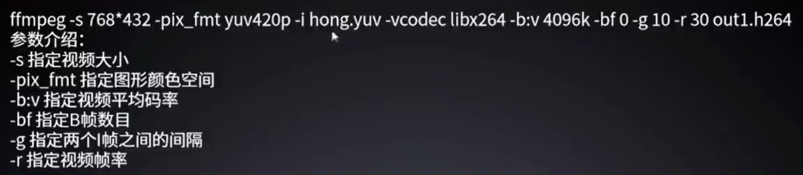


```c
#include <stdint.h>
#include <libavformat\avformat.h> // 解封装
#include <libavutil\avutil.h>     // 日志
#include <libavutil\parseutils.h> // 解析字符串
#include <libavutil\imgutils.h>   // 计算视频大小
#include <libavcodec\avcodec.h>   // 编解码
#include <libswscale\swscale.h>   // 视频缩放

int ret = 0;
int cleanUp()
{
    return 0;
}

int main(int avc, char *argv[])
{

    // 设置日志级别
    av_log_set_level(AV_LOG_DEBUG);

    // 打印用法
    if (avc < 5)
    {
        av_log(NULL, AV_LOG_INFO, "usage:%s <inFileName.yuv> <outFileName.h264> <encoderName> <yuvW x yuvH>", argv[0]);
        return -1;
    }

    // 获取参数
    char *yuvFileName = argv[1];
    char *h264FileName = argv[2];
    char *encoderName = argv[3];
    char *yuvSize = argv[4];
    int yuvFmt = AV_PIX_FMT_YUV420P;
    int yuvW = 0, yuvH = 0;
    av_parse_video_size(&yuvW, &yuvH, yuvSize);

    // 初始化编码器
    const AVCodec *encoder = avcodec_find_encoder_by_name(encoderName); // 获取编码器
    AVCodecContext *encoderCtx = avcodec_alloc_context3(encoder);       // 获取编码器上下文
    encoderCtx->codec_type = AVMEDIA_TYPE_VIDEO;                        // 编码视频
    encoderCtx->pix_fmt = yuvFmt;                                       // 编码视频格式
    encoderCtx->width = yuvW;                                           // 编码视频宽度
    encoderCtx->height = yuvH;                                          // 编码视频高度
    encoderCtx->time_base = (AVRational){1, 30};                        // 编码时间基
    encoderCtx->bit_rate = 4096000;                                     // 比特率
    encoderCtx->max_b_frames = 0;                                       // 没有B帧（B帧需要前后两帧来推测，这会降低解码效率，提高存储效率）
    encoderCtx->gop_size = 10;                                          // 同时决定了I帧（关键帧）的间隔 （可以用ESEyE工具来查看）
    avcodec_open2(encoderCtx, encoder, NULL);                           // 打开编码器

    // 初始化yuvFrame
    AVFrame *yuvFrame = av_frame_alloc();                                                       // 创建Frame
    uint8_t *yuvBuffer = av_malloc(av_image_get_buffer_size(yuvFmt, yuvW, yuvH, 1));            // 为data分配内存
    av_image_fill_arrays(yuvFrame->data, yuvFrame->linesize, yuvBuffer, yuvFmt, yuvW, yuvH, 1); // 将分配的内存赋值到data
    yuvFrame->format = yuvFmt;                                                                  // 必须设置
    yuvFrame->width = yuvW;                                                                     // 必须设置
    yuvFrame->height = yuvH;                                                                    // 必须设置
    yuvFrame->pts = 0;                                                                          // 初始化
    int frameSize = yuvW * yuvH;                                                                // frameSize
    int dataSize = frameSize +                                                                  // Y:4
                   frameSize / 4 +                                                              // U:2
                   frameSize / 4;                                                               // V:0

    // 初始化h264Packet
    AVPacket *h264Packet = av_packet_alloc();

    // 编码、读写文件
    FILE *yuvFile = fopen(yuvFileName, "rb");
    FILE *h264File = fopen(h264FileName, "wb");
    while (fread(yuvBuffer, 1, dataSize, yuvFile) == dataSize) // 读取yuv数据
    {
        // 下面三行等效于：av_image_fill_arrays()
        // yuvFrame->data[0] = yuvBuffer;                 // Y
        // yuvFrame->data[1] = yuvBuffer + frameSize;     // U
        // yuvFrame->data[2] = yuvBuffer + frameSize / 4; // V

        yuvFrame->pts++; // 必须设置

        ret = avcodec_send_frame(encoderCtx, yuvFrame); // 发送给编码器 (可能编码器中还有剩余的帧，需要flush)
        if (ret < 0)
        {
            av_log(NULL, AV_LOG_ERROR, "avcodec_send_frame failed");
            return -1;
        }
        while (avcodec_receive_packet(encoderCtx, h264Packet) == 0) // 读取编码后的数据
        {
            fwrite(h264Packet->data, 1, h264Packet->size, h264File); // 写入文件
            av_packet_unref(h264Packet);                             // 释放h264Packet->data
        }
    }
}
```

## 音频解码AAC_PCM

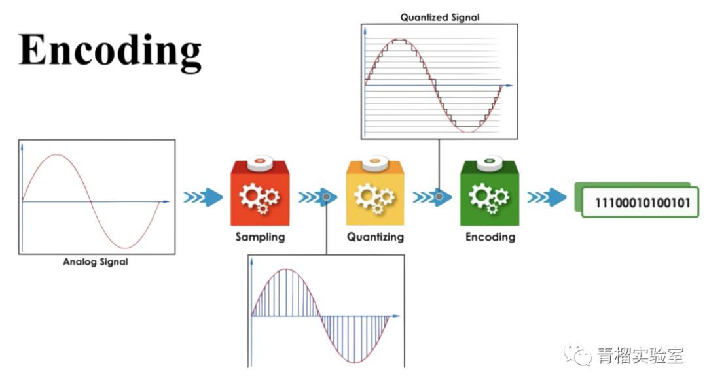

**PCM**

- PCM(Pulse Code Modulation),脉冲编码调制，是一种用数字表示采样模拟信号的方法。
- 核心过程:采样-->量化-->编码
  - **采样：**将连续量离散化的过程，具体来说就是每隔一段时间去采集数据，采集的频率就是采样率，采样率越高，数据越保真。
  - **量化：**指将采样后得到的离散信号映射到一组有限的离散量上的过程，如把0v~3.3v的模拟电压信号重新映射到0~255的范围。
  - **编码：**将采集和量化后的数据保存

- **采样率(sampleRate) :** 每秒中采集样本的个数，如8KHz，表示每秒采样8000次。
  - 奈奎斯特定理: 按比声音最高频率高2倍以上的频率对声音进行采样；
  - 人耳能接受的频率范围为20Hz~20kHz，故采样率一般为44.1KHz较好，
  - 采样率越高，质量越高，但存储空间增大。
- **量化格式 (sampleFormat):**
  - ffmpeg支持的量化格式: `ffmpeg -formats|grep PCM`

```bash
$ ffmpeg -formats | grep PCM
 DE alaw            PCM A-law
 DE f32be           PCM 32-bit floating-point big-endian
 DE f32le           PCM 32-bit floating-point little-endian
 DE f64be           PCM 64-bit floating-point big-endian
 DE f64le           PCM 64-bit floating-point little-endian
 DE mulaw           PCM mu-law
 DE s16be           PCM signed 16-bit big-endian
 DE s16le           PCM signed 16-bit little-endian
 DE s24be           PCM signed 24-bit big-endian
 DE s24le           PCM signed 24-bit little-endian
 DE s32be           PCM signed 32-bit big-endian
 DE s32le           PCM signed 32-bit little-endian
 DE s8              PCM signed 8-bit
 DE u16be           PCM unsigned 16-bit big-endian
 DE u16le           PCM unsigned 16-bit little-endian
 DE u24be           PCM unsigned 24-bit big-endian
 DE u24le           PCM unsigned 24-bit little-endian
 DE u32be           PCM unsigned 32-bit big-endian
 DE u32le           PCM unsigned 32-bit little-endian
 DE u8              PCM unsigned 8-bit
 DE vidc            PCM Archimedes VIDC
```

- **声道数（channel）:**
  - 单声道（mono）
  - 双声道（stereo）

**存储格式:**

- 双声道音频文件
  - 采样数据按LRLR方式存储，存储的时候与字节序有关。
- 单声道音频文件，
  - 采样数据按时间先后依次存入
  - (有时也会用LRLR方式存储，但另一个声道数据为0)

**存储格式**

- Packed和Planner两种，
- 对于双通道音频，Packed为两个声道的数据交错存储;Planner为两个声道数据分开存储:
  - Packed: LRLRLR
  - Planner: LLLRRR

**在ffmpeg中的存储格式**

- PCM数据存储在AVFrame中
- 对于Packed格式的PCM数据，frame.data[0] 或 frame.extened_data[0]包含所有音频数据
- 对于Planar格式的PCM数据，frame.data[i] 或 frame.extened_data[i]表示i声道的数据
- 实际音频文件采用Packed格式，ffmpeg内部处理音频采用Planar格式。

**大小计算:**

- 以CD的音质为例:量化格式为16比特(2字节)，采样率为44100，声道数为2。
- 比特率为:44100*16*2=1378.125kbps
- 1分钟音频大小:1378.125*60/8/1024=10.09MB

**ffmpeg提取pcm数据命令:**

- ffmpeg -i break.aac -ar 48000 -ac 2 -f s16le out.pcm

**ffplay播放pcm数据:**

- ffplay -ar 48000 -ac 2 -fs16le outpcm

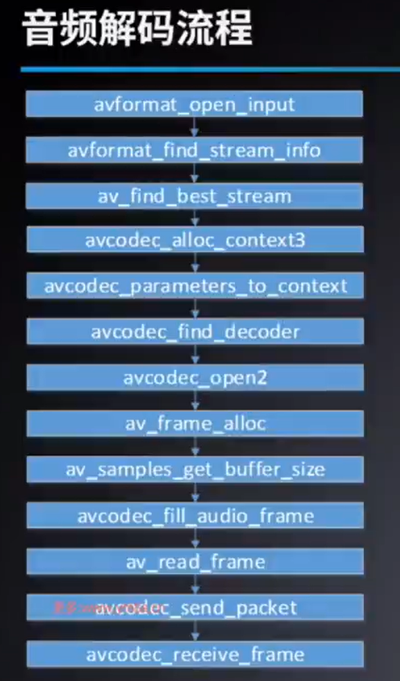

```c
#include <libavutil/avutil.h>     // 工具函数
#include <libavutil/frame.h>      // 工具函数
#include <libavformat/avformat.h> // 解封装
#include <libavcodec/avcodec.h>   // 解码

int ret = 0;
AVFormatContext *inFmtCtx = NULL;
void cleanUp()
{
    if (inFmtCtx)
    {
        avformat_close_input(&inFmtCtx);
    }
}

int main(int argc, char **argv)
{
    // 设置日志级别
    av_log_set_level(AV_LOG_INFO);
    if (argc < 3)
    {
        av_log(NULL, AV_LOG_ERROR, "useage: %s <input.mp4> <output.pcm>", argv[0]);
        return -1;
    }

    char *input = argv[1];
    char *output = argv[2];

    // 打开输入
    ret = avformat_open_input(&inFmtCtx, input, NULL, NULL);
    if (ret < 0)
    {
        av_log(NULL, AV_LOG_ERROR, "avformat_open_input failed");
        cleanUp();
        return -1;
    }
    // 打开输出
    FILE *outFile = fopen(output, "wb+");

    // 找到流信息
    ret = avformat_find_stream_info(inFmtCtx, NULL);
    if (ret < 0)
    {
        av_log(NULL, AV_LOG_ERROR, "avformat_find_stream_info failed");
        cleanUp();
        return -1;
    }

    // 找到音频流
    int audioIdx = av_find_best_stream(inFmtCtx, AVMEDIA_TYPE_AUDIO, -1, -1, NULL, 0);
    if (audioIdx < 0)
    {
        av_log(NULL, AV_LOG_ERROR, "av_find_best_stream failed");
        cleanUp();
        return -1;
    }
    // 创建解码器上下文
    AVCodecContext *audioDecoderCtx = avcodec_alloc_context3(NULL);

    // 拷贝解码器参数到解码器上下文
    ret = avcodec_parameters_to_context(audioDecoderCtx, inFmtCtx->streams[audioIdx]->codecpar);
    if (ret < 0)
    {
        av_log(NULL, AV_LOG_ERROR, "avcodec_parameters_to_context failed");
        cleanUp();
        return -1;
    }
    // 找到解码器
    const AVCodec *audioDecoder = avcodec_find_decoder(audioDecoderCtx->codec_id);

    // 打开解码器
    ret = avcodec_open2(audioDecoderCtx, audioDecoder, NULL);
    if (ret < 0)
    {
        av_log(NULL, AV_LOG_ERROR, "avcodec_open2 failed");
        cleanUp();
        return -1;
    }

    // 创建frame
    AVFrame *audioFrame = av_frame_alloc();
    // 创建buffer
    int bufSize = av_samples_get_buffer_size(NULL, audioDecoderCtx->ch_layout.nb_channels, audioDecoderCtx->sample_rate, audioDecoderCtx->sample_fmt, 1);
    uint8_t *buf = av_malloc(bufSize);
    // 分配buffer到frame->data中
    audioFrame->nb_samples = audioDecoderCtx->sample_rate; // 必须预先设置
    ret = avcodec_fill_audio_frame(audioFrame, audioDecoderCtx->ch_layout.nb_channels, audioDecoderCtx->sample_fmt, buf, bufSize, 1);
    if (ret < 0)
    {
        av_log(NULL, AV_LOG_ERROR, "avcodec_fill_audio_frame failed");
        cleanUp();
        return -1;
    }
    // 单个采样所占字节数
    int bytesPerSample = av_get_bytes_per_sample(audioDecoderCtx->sample_fmt);

    // 读取packet
    AVPacket *packet = av_packet_alloc();
    while (av_read_frame(inFmtCtx, packet) >= 0)
    {
        if (packet->stream_index == audioIdx)
        {
            // 发送个解码器
            avcodec_send_packet(audioDecoderCtx, packet);
            // 从解码器接收数据
            while (avcodec_receive_frame(audioDecoderCtx, audioFrame) == 0)
            {
                /**
                 * 需要把解码后的非交错格式（Planer），写入文件使用交错格式（Packed）
                 *
                 * audioFrame  格式：fltp(float32-le)
                 *
                 * frame->data[ch=0] L L L L
                 * frame->data[ch=1] R R R R
                 *
                 * 写入文件：
                 * L R L R L R L R L R L R
                 */

                for (int sampleIdx = 0; sampleIdx < audioFrame->nb_samples; sampleIdx++)
                {
                    for (int ch = 0; ch < audioFrame->ch_layout.nb_channels; ch++)
                    {
                        fwrite(audioFrame->data[ch] + sampleIdx * bytesPerSample, 1, bytesPerSample, outFile);
                    }
                }
            }
        }
        av_packet_unref(packet);
    }
    /**
    $ ffprobe.exe out.aac
        Input #0, aac, from 'out.aac':
        Duration: 00:00:34.95, bitrate: 122 kb/s
        Stream #0:0: Audio: aac (LC), 44100 Hz, stereo, fltp, 122 kb/s
     */
    /*
    $ ./output/main.exe out.aac aac_to_pcm.pcm
    $ ffplay.exe -i aac_to_pcm.pcm -ac 2 -ar 44100 -f f32le
    */
    return 0;
}
```

## 音频编码PCM_to_AAC

> ffmpeg -ac 2 -ar 48000 -fs16le -i s16le_48000_2_break.pcm -acodec libfdk_aac out1.aac
>
> - ac 音频通道数
> - ar 音频采样率
> - f 格式
> - i 输入
> - acodec音频编码器


> 这里是需要把PCM数据写入Frame，
> 需要把音频的一些参数写入Frame

```c
#include <libavutil/avutil.h>     // 工具函数
#include <libavutil/frame.h>      // 工具函数
#include <libavformat/avformat.h> // 解封装
#include <libavcodec/avcodec.h>   // 解码
#include "./lib/adts.h"           // for adts 音频头

int ret = 0;
AVFrame *frame = NULL;
void cleanUp()
{
    if (frame)
    {
        av_frame_unref(frame);
        av_frame_free(&frame);
    }
}

int main(int argc, char **argv)
{
    // 设置日志级别
    av_log_set_level(AV_LOG_INFO);
    if (argc < 3)
    {
        av_log(NULL, AV_LOG_ERROR, "useage: %s <input.pcm> <output.aac>", argv[0]);
        return -1;
    }

    char *input = argv[1];
    char *output = argv[2];

    // 打开输入
    FILE *srcFile = fopen(input, "rb");
    if (srcFile == NULL)
    {
        av_log(NULL, AV_LOG_ERROR, "fopen srcFile failed");
        return -1;
    }
    // 打开输出
    FILE *destFile = fopen(output, "wb");
    if (destFile == NULL)
    {
        av_log(NULL, AV_LOG_ERROR, "fopen destFile failed");
        return -1;
    }
    // 获取单声道pcm
    // ffmpeg -i bigbuckbunny_h264_aac.mp4 -ar 44100 -ac 1 -f f32le r_44100_c_1_f_f32le.pcm
    // 获取双声道pcm
    // ffmpeg -i bigbuckbunny_h264_aac.mp4 -ar 44100 -ac 2 -f f32le r_44100_c_2_f_f32le.pcm
    // 单声道pcm转换成aac
    // ./output/main.exe r_44100_c_1_f_f32le.pcm pcm_to_aac.aac
    // 双声道pcm转换成aac
    // ./output/main.exe r_44100_c_2_f_f32le.pcm pcm_to_aac.aac
    // 播放
    // ffplay.exe pcm_to_aac.aac

    // 主要的是前三个参数
    AVChannelLayout ch_layout = AV_CHANNEL_LAYOUT_MONO; // 单声道或双声道
    int sample_rate = 44100;                            // 采样率
    int sample_fmt = AV_SAMPLE_FMT_FLTP;                // 采样格式
    int nb_samples = 1024;                              // 每个frame的每个通道含有的采样数

    // 初始化frame
    frame = av_frame_alloc();
    frame->ch_layout = ch_layout;     // av_frame_alloc
    frame->sample_rate = sample_rate; // 采样率
    frame->format = sample_fmt;       /* 对于libfdk_aac编码器，填：AV_SAMPLE_FMT_S16(packet)，因为这是`ff_libfdk_aac_encoder`所支持的格式
                                       * 因为我的ffmpeg是开源社区下载的，没有包含libfdk_aac解码器，需要手动编译才有。
                                       * 
                                       * 对于aac编码器，填，AV_SAMPLE_FMT_FLTP（fltp）（float, planar）FFmpeg内部AAC格式只支持AV_SAMPLE_FMT_FLTP格式的PCM
                                       * 这里播放时提示，AAC RDB per ADTS frame is not implemented，是因为我这里的aac编码器没有实现adts头文件
                                       * 另外，由于fltp是指planar格式，而ffmpeg提取pcm格式文件为packed格式，
                                       * 所以读取文件的时候要做特殊处理，或者仅处理单声道文件
                                       */
    frame->nb_samples = nb_samples;   // 每帧（frame）采样数，如果是`LC profile`默认为1024,如果是`HE profile`则设置为2048

    // 为frame分配buffer空间
    ret = av_frame_get_buffer(frame, 0);
    if (ret < 0)
    {
        av_log(NULL, AV_LOG_ERROR, "av_frame_get_buffer failed");
        cleanUp();
        return -1;
    }

    // 找到编码器
    const AVCodec *encoder = avcodec_find_encoder_by_name("aac");
    if (encoder == NULL)
    {
        av_log(NULL, AV_LOG_ERROR, "avcodec_find_encoder_by_name failed");
        cleanUp();
        return -1;
    }
    // 创建上下文
    AVCodecContext *encoderCtx = avcodec_alloc_context3(encoder);
    if (encoderCtx == NULL)
    {
        av_log(NULL, AV_LOG_ERROR, "avcodec_alloc_context3 failed");
        cleanUp();
        return -1;
    }
    // 填参数
    encoderCtx->ch_layout = ch_layout;
    encoderCtx->sample_rate = sample_rate;
    encoderCtx->sample_fmt = sample_fmt;

    // 打开编码器
    ret = avcodec_open2(encoderCtx, encoder, NULL);
    if (ret < 0)
    {
        av_log(NULL, AV_LOG_ERROR, "avcodec_open2 failed");
        cleanUp();
        return -1;
    }

    // 读取数据
    AVPacket *packet = av_packet_alloc();
    while (fread(frame->data[0], 1, frame->linesize[0], srcFile) > 0)
    {
        // 发送给编码器
        ret = avcodec_send_frame(encoderCtx, frame);
        if (ret < 0)
        {
            av_log(NULL, AV_LOG_ERROR, "avcodec_send_frame failed");
            cleanUp();
            return -1;
        }
        // 从编码器接收数据
        while (avcodec_receive_packet(encoderCtx, packet) == 0)
        {
            // 写入ADTS_Header
            uint8_t adts_header[7] = {0};
            set_ADTS_Header(
                adts_header,
                packet->size,
                1,
                sample_rate,
                ch_layout.nb_channels);
            fwrite(adts_header, 1, sizeof(adts_header), destFile);
            // 写入数据
            fwrite(packet->data, 1, packet->size, destFile);
            av_packet_unref(packet);
        }
    }
    return 0;
}
```

## 音视频采集

### 视频采集

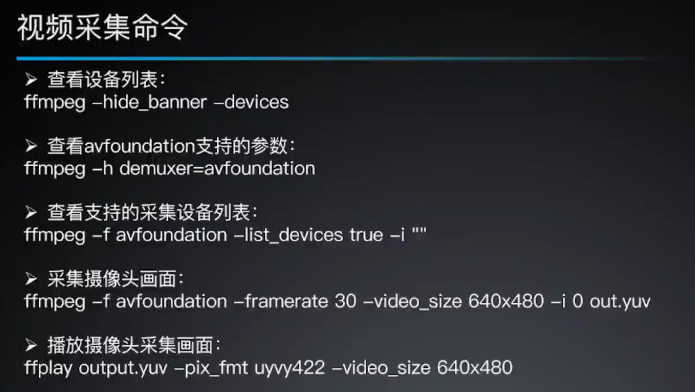

```bash
# 查看设备列表
$ ffmpeg -devices

Devices:
 D. = Demuxing supported
 .E = Muxing supported
 --
  E caca            caca (color ASCII art) output device
 D  dshow           DirectShow capture
 D  gdigrab         GDI API Windows frame grabber
 D  lavfi           Libavfilter virtual input device      #虚拟输入设备
 D  libcdio
  E sdl,sdl2        SDL2 output device                    #输出设备
 D  vfwcap          VfW video capture

```

```bash
# 查看dshow支持的参数
$ ffmpeg -h demuxer=dshow

Demuxer dshow [DirectShow capture]:
dshow indev AVOptions:
  -video_size        <image_size> .D......... set video size given a string such as 640x480 or hd720.
  -pixel_format      <pix_fmt>    .D......... set video pixel format (default none)
  -framerate         <string>     .D......... set video frame rate
  -sample_rate       <int>        .D......... set audio sample rate (from 0 to INT_MAX) (default 0)
  -sample_size       <int>        .D......... set audio sample size (from 0 to 16) (default 0)
  -channels          <int>        .D......... set number of audio channels, such as 1 or 2 (from 0 to INT_MAX) (default 0)
  -audio_buffer_size <int>        .D......... set audio device buffer latency size in milliseconds (default is the device's default) (from 0 to INT_MAX) (default 0)
  -list_devices      <boolean>    .D......... list available devices (default false)
  -list_options      <boolean>    .D......... list available options for specified device (default false)
  -video_device_number <int>        .D......... set video device number for devices with same name (starts at 0) (from 0 to INT_MAX) (default 0)
  -audio_device_number <int>        .D......... set audio device number for devices with same name (starts at 0) (from 0 to INT_MAX) (default 0)
  -crossbar_video_input_pin_number <int>        .D......... set video input pin number for crossbar device (from -1 to INT_MAX) (default -1)
  -crossbar_audio_input_pin_number <int>        .D......... set audio input pin number for crossbar device (from -1 to INT_MAX) (default -1)
  -show_video_device_dialog <boolean>    .D......... display property dialog for video capture device (default false)
  -show_audio_device_dialog <boolean>    .D......... display property dialog for audio capture device (default false)
  -show_video_crossbar_connection_dialog <boolean>    .D......... display property dialog for crossbar connecting pins filter on video device (default false)
  -show_audio_crossbar_connection_dialog <boolean>    .D......... display property dialog for crossbar connecting pins filter on audio device (default false)
  -show_analog_tv_tuner_dialog <boolean>    .D......... display property dialog for analog tuner filter (default false)        
  -show_analog_tv_tuner_audio_dialog <boolean>    .D......... display property dialog for analog tuner audio filter (default false)
  -audio_device_load <string>     .D......... load audio capture filter device (and properties) from file
  -audio_device_save <string>     .D......... save audio capture filter device (and properties) to file
  -video_device_load <string>     .D......... load video capture filter device (and properties) from file
  -video_device_save <string>     .D......... save video capture filter device (and properties) to file
  -use_video_device_timestamps <boolean>    .D......... use device instead of wallclock timestamps for video frames (default true)
```

```bash
# 查看支持的采集设备列表
ffmpeg -f dshow -list_devices true -i dummy

[dshow @ 00000242b296d600] "USB2.0 UVC HD Webcam" (video)
[dshow @ 00000242b296d600]   Alternative name "@device_pnp_\\?\usb#vid_13d3&pid_5654&mi_00#6&3907f7b1&0&0000#{65e8773d-8f56-11d0-a3b9-00a0c9223196}\global"
[dshow @ 00000242b296d600] "麦克风 (Realtek High Definition Audio)" (audio)
[dshow @ 00000242b296d600]   Alternative name "@device_cm_{33D9A762-90C8-11D0-BD43-00A0C911CE86}\wave_{4030643A-CF6B-43BC-99F6-7AB127C53A99}"
```

```bash
# 采集画面
ffmpeg -f dshow -i video='USB2.0 UVC HD Webcam' -framerate 30 -video_size 640x480 -pixel_format yuyv422  out.yuv
# （指定的参数好像没有用
```

```bash
# 播放画面
ffplay -framerate 30 -video_size 640x480 -pixel_format yuyv422 out.yuv
```

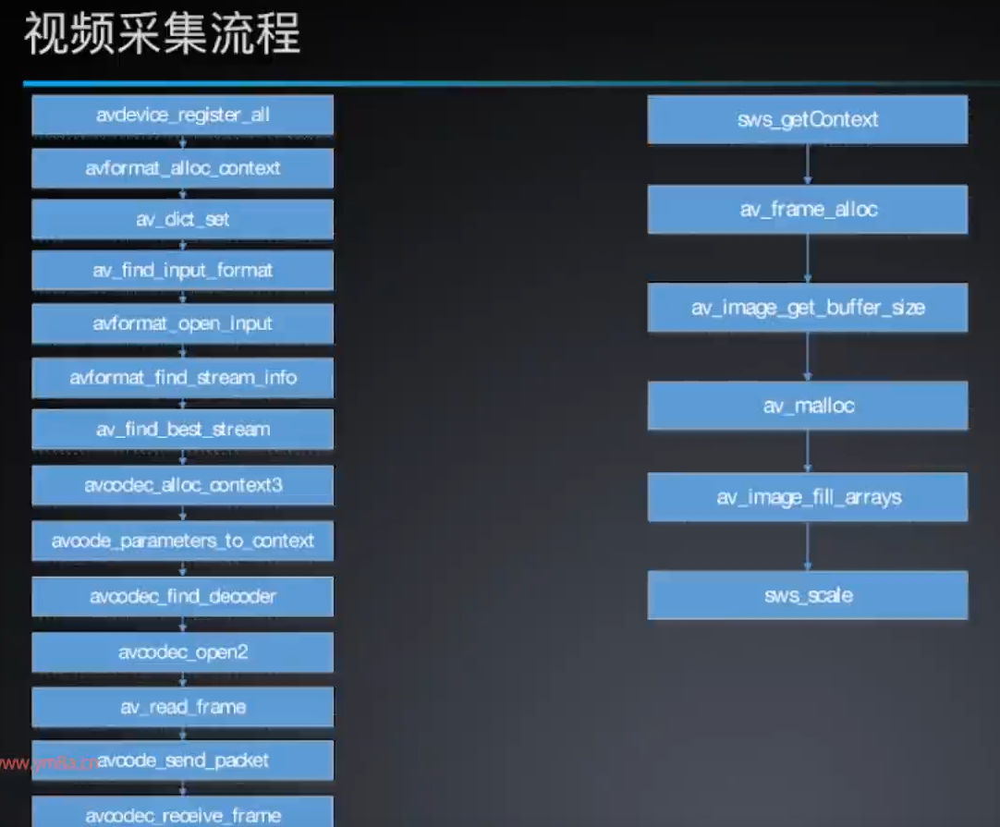

```c
#include <stddef.h>
#include <stdio.h>
#include <libavutil/avutil.h>
#include <libavutil/imgutils.h> // 计算视频大小
#include <libavutil/log.h>      // ffmpeg的日志系统
#include <libavformat/avformat.h>
#include <libavcodec/avcodec.h>
#include <libavdevice/avdevice.h> // 设备
#include <libswscale/swscale.h>   // 视频缩放

int err;
/**
 * 列出当前所连设备
 */
void list_devices()
{
    // ffmpeg -f dshow -list_devices true -i dummy
    const AVInputFormat *inputFmt = av_find_input_format("dshow");
    if (inputFmt == NULL)
    {
        av_log(NULL, AV_LOG_ERROR, "av_find_input_format failed!!!\n");
    }
    AVDictionary *options = NULL;
    av_dict_set(&options, "list_devices", "true", 0);
    AVFormatContext *fmtCtx = avformat_alloc_context();
    err = avformat_open_input(&fmtCtx, "dummy", inputFmt, &options);
    if (err != 0)
    {
        av_log(NULL, AV_LOG_ERROR, "avformat_open_input failed!!!\n");
    }
    /**
        输出：
            [dshow @ 000002572fc93000] "USB2.0 UVC HD Webcam" (video)
            [dshow @ 000002572fc93000]   Alternative name "@device_pnp_\\?\usb#vid_13d3&pid_5654&mi_00#6&3907f7b1&0&0000#{65e8773d-8f56-11d0-a3b9-00a0c9223196}\global"
            [dshow @ 000002572fc93000] "麦克风 (Realtek High Definition Audio)" (audio)
            [dshow @ 000002572fc93000]   Alternative name "@device_cm_{33D9A762-90C8-11D0-BD43-00A0C911CE86}\wave_{4030643A-CF6B-43BC-99F6-7AB127C53A99}"
    */
    if (fmtCtx)
    {
        avformat_close_input(&fmtCtx); // 关闭输入
        avformat_free_context(fmtCtx); // 释放输入
    }
}
void decodeVideoYUV420p(AVCodecContext *decoderCtx, struct SwsContext *swsCtx, AVPacket *packet, AVFrame *destFrame, FILE *dest)
{
    if (avcodec_send_packet(decoderCtx, packet) == 0)
    {
        AVFrame *srcframe = av_frame_alloc();
        while (avcodec_receive_frame(decoderCtx, srcframe) >= 0)
        {
            sws_scale(swsCtx,                                                    // swscale上下文
                      srcframe->data, srcframe->linesize, 0, decoderCtx->height, // 源Frame数据 源Frame宽度 起始位置 原始图片高度
                      destFrame->data, destFrame->linesize                       // 目标Frame数据 目标Frame宽度
            );
            // yuv420p (packed format)
            fwrite(destFrame->data[0], 1, decoderCtx->width * decoderCtx->height, dest);
            fwrite(destFrame->data[1], 1, decoderCtx->width * decoderCtx->height / 4, dest);
            fwrite(destFrame->data[2], 1, decoderCtx->width * decoderCtx->height / 4, dest);
        }
        av_frame_free(&srcframe);
    }
}
void decodeVideo(AVCodecContext *decoderCtx, AVPacket *packet, FILE *dest)
{
    if (avcodec_send_packet(decoderCtx, packet) == 0)
    {
        AVFrame *frame = av_frame_alloc();
        while (avcodec_receive_frame(decoderCtx, frame) >= 0)
        {
            // uyvu422 yuv422 (packed format)
            fwrite(frame->data[0], 1, decoderCtx->width * decoderCtx->height * 2, dest);
        }
        av_frame_free(&frame);
    }
}

int main(int argc, char **argv)
{
    // 设置日志级别
    av_log_set_level(AV_LOG_INFO);
    // 注册所有device
    avdevice_register_all();
    if (argc < 3)
    {
        // 显示所有输入设备
        list_devices();
        // 显示用法
        av_log(NULL, AV_LOG_ERROR, "useage: %s <deviceName> <output.yuv> <yuv420p.yuv>\n", argv[0]);
        return -1;
    }
    // 打开设备
    char *deviceName = argv[1];
    char *outputName1 = argv[2];
    char *outputNmae2 = argv[3];

    // open file
    FILE *dest1 = fopen(outputName1, "wb");
    if (dest1 == NULL)
    {
        av_log(NULL, AV_LOG_ERROR, "fopen failed!!!");
        goto end;
    }
    FILE *dest2 = fopen(outputNmae2, "wb");
    if (dest2 == NULL)
    {
        av_log(NULL, AV_LOG_ERROR, "fopen failed!!!");
        goto end;
    }

    // ffmpeg -f dshow -i video='USB2.0 UVC HD Webcam' -framerate 30 -video_size 640x480 -pixel_format yuyv422  out.yuv
    // ffplay out.yuv -framerate 30 -video_size 640x480 -pixel_format yuyv422

    const AVInputFormat *inputFmt = av_find_input_format("dshow");
    if (inputFmt == NULL)
    {
        av_log(NULL, AV_LOG_ERROR, "av_find_input_format failed!!!");
        goto end;
    }

    AVFormatContext *fmtCtx = avformat_alloc_context();
    char inputName[256] = {0};
    strcat(inputName, "video=");
    strcat(inputName, deviceName);
    av_log(NULL, AV_LOG_INFO, "input: %s\n", inputName);
    AVDictionary *options = NULL;
    // av_dict_set(&options, "framerate", "30", 0);
    // av_dict_set(&options, "pixel_format", "yuyv422", 0);
    // av_dict_set(&options, "video_size", "640x480", 0);
    err = avformat_open_input(&fmtCtx, inputName, inputFmt, &options);
    if (err)
    {
        av_log(NULL, AV_LOG_ERROR, "avformat_open_input failed!!!");
        goto end;
    }
    // 输出流信息
    av_dump_format(fmtCtx, 0, deviceName, 0);
    // 探测流
    // get stream information
    err = avformat_find_stream_info(fmtCtx, NULL);
    if (err < 0)
    {
        av_log(NULL, AV_LOG_ERROR, "av_find_best_stream failed!!!");
        goto end;
    }
    // 找到视频流
    // av_find_best_stream
    int videoIndex = av_find_best_stream(fmtCtx, AVMEDIA_TYPE_VIDEO, -1, -1, NULL, 0);
    if (videoIndex < 0)
    {
        av_log(NULL, AV_LOG_ERROR, "av_find_best_stream failed!!!");
        goto end;
    }
    // 分配编码器上下文
    AVCodecContext *decoderCtx = avcodec_alloc_context3(NULL);
    err = avcodec_parameters_to_context(decoderCtx, fmtCtx->streams[videoIndex]->codecpar);
    if (err < 0)
    {
        av_log(NULL, AV_LOG_ERROR, "avcodec_parameters_to_context failed!!!");
        goto end;
    }
    const AVCodec *decoder = avcodec_find_decoder(decoderCtx->codec_id);

    if (decoder == NULL)
    {
        av_log(NULL, AV_LOG_ERROR, "avcodec_find_decoder failed!!!");
        goto end;
    }
    av_log(NULL, AV_LOG_INFO, "decoder name: %s\n", decoder->name);

    err = avcodec_open2(decoderCtx, decoder, NULL);
    if (err != 0)
    {
        av_log(NULL, AV_LOG_ERROR, "avcodec_open2 failed!!!");
        goto end;
    }

    // 获取源颜色空间
    enum AVPixelFormat srcPixFmt = decoderCtx->pix_fmt;
    enum AVPixelFormat destPixFmt = AV_PIX_FMT_YUV420P; // AV_PIX_FMT_YUV420P

    // 获取swscale上下文
    struct SwsContext *swsCtx = sws_getContext(
        decoderCtx->width, decoderCtx->height, srcPixFmt,  // 源分辨率 源图像空间
        decoderCtx->width, decoderCtx->height, destPixFmt, // 目标分辨率 目标图像空间
        SWS_FAST_BILINEAR,                                 // 缩放算法
        NULL,                                              // 源图像过滤器（前后图像滤波处理）
        NULL,                                              // 目标图像滤波器
        NULL                                               // 参数
    );

    if (swsCtx == NULL)
    {
        av_log(NULL, AV_LOG_ERROR, "sws_getContext failed");
        goto end;
    }
    // 创建destFrame
    AVFrame *destFrame = av_frame_alloc();
    // 为destFrame的data分配内存
    uint8_t *destBuffer = av_malloc(av_image_get_buffer_size(destPixFmt, decoderCtx->width, decoderCtx->height, 1));
    // 把所分配内存的地址，通过计算，分别设置到Y:data[0] U:data[1] V:data[2] 中
    av_image_fill_arrays(destFrame->data, destFrame->linesize, destBuffer, destPixFmt, decoderCtx->width, decoderCtx->height, 1);

    AVPacket *packet = av_packet_alloc();
    while (1)
    {
        if (av_read_frame(fmtCtx, packet) == 0)
        {
            if (packet->stream_index == videoIndex)
            {
                decodeVideo(decoderCtx, packet, dest1);
                decodeVideoYUV420p(decoderCtx, swsCtx, packet, destFrame, dest2);
            }
        }
        av_packet_unref(packet);
    }
    av_packet_free(&packet);
    decodeVideo(decoderCtx, NULL, dest1);
    decodeVideoYUV420p(decoderCtx, swsCtx, NULL, destFrame, dest2);

end:
    if (dest1)
    {
        fclose(dest1);
    }
    if (fmtCtx)
    {
        avformat_close_input(&fmtCtx); // 关闭输入
        avformat_free_context(fmtCtx); // 释放输入
    }
    return 0;
}
```

### 音频采集

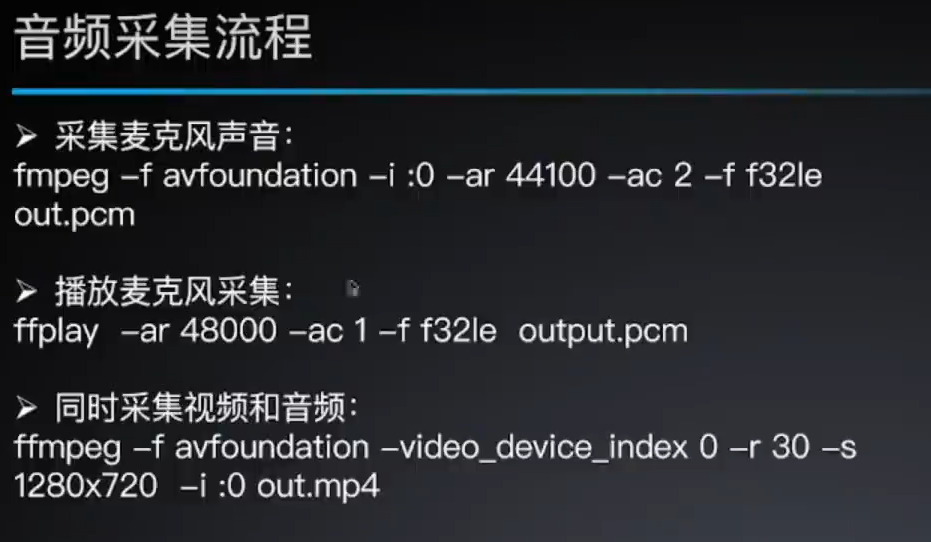

```bash
ffmpeg -f dshow -list_devices true -i dummy
# 
[dshow @ 000001fe0d72d340] "USB2.0 UVC HD Webcam" (video)
[dshow @ 000001fe0d72d340]   Alternative name "@device_pnp_\\?\usb#vid_13d3&pid_5654&mi_00#6&3907f7b1&0&0000#{65e8773d-8f56-11d0-a3b9-00a0c9223196}\global"    
[dshow @ 000001fe0d72d340] "麦克风 (Realtek High Definition Audio)" (audio)
[dshow @ 000001fe0d72d340]   Alternative name "@device_cm_{33D9A762-90C8-11D0-BD43-00A0C911CE86}\wave_{4030643A-CF6B-43BC-99F6-7AB127C53A99}"
```

```bash
# 采集
ffmpeg -f dshow -i audio="麦克风 (Realtek High Definition Audio)" -ar 44100 -ac 1 -f f32le output.pcm
```

```bash
# 播放
ffplay -ar 44100 -ac 1 -f f32le output.pcm
```

```c
#include <stddef.h>
#include <stdio.h>
#include <libavutil/log.h> // ffmpeg的日志系统
#include <libavformat/avformat.h>
#include <libavcodec/avcodec.h>
#include <libavdevice/avdevice.h> // 设备
#include <libswscale/swscale.h>   // 视频缩放

int err;
/**
 * 列出当前所连设备
 */
void list_devices()
{
    // ffmpeg -f dshow -list_devices true -i dummy
    const AVInputFormat *inputFmt = av_find_input_format("dshow");
    if (inputFmt == NULL)
    {
        av_log(NULL, AV_LOG_ERROR, "av_find_input_format failed!!!\n");
    }
    AVDictionary *options = NULL;
    av_dict_set(&options, "list_devices", "true", 0);
    AVFormatContext *fmtCtx = avformat_alloc_context();
    err = avformat_open_input(&fmtCtx, "dummy", inputFmt, &options);
    if (err != 0)
    {
        av_log(NULL, AV_LOG_ERROR, "avformat_open_input failed!!!\n");
    }
    /**
        输出：
            [dshow @ 000002572fc93000] "USB2.0 UVC HD Webcam" (video)
            [dshow @ 000002572fc93000]   Alternative name "@device_pnp_\\?\usb#vid_13d3&pid_5654&mi_00#6&3907f7b1&0&0000#{65e8773d-8f56-11d0-a3b9-00a0c9223196}\global"
            [dshow @ 000002572fc93000] "麦克风 (Realtek High Definition Audio)" (audio)
            [dshow @ 000002572fc93000]   Alternative name "@device_cm_{33D9A762-90C8-11D0-BD43-00A0C911CE86}\wave_{4030643A-CF6B-43BC-99F6-7AB127C53A99}"
    */
    if (fmtCtx)
    {
        avformat_close_input(&fmtCtx); // 关闭输入
        avformat_free_context(fmtCtx); // 释放输入
    }
}
void decodeAudio(AVCodecContext *decoderCtx, AVPacket *packet, FILE *dest)
{
    if (avcodec_send_packet(decoderCtx, packet) == 0)
    {
        AVFrame *frame = av_frame_alloc();
        while (avcodec_receive_frame(decoderCtx, frame) >= 0)
        {
            // f32le packed
            fwrite(frame->data[0], 1, frame->linesize[0], dest);
        }
        av_frame_free(&frame);
    }
}

int main(int argc, char **argv)
{
    // 设置日志级别
    av_log_set_level(AV_LOG_INFO);
    // 注册所有device
    avdevice_register_all();
    if (argc < 3)
    {
        // 显示所有输入设备
        list_devices();
        // 显示用法
        av_log(NULL, AV_LOG_ERROR, "useage: %s <deviceName> <output_f32le.pcm>\n", argv[0]);
        return -1;
    }
    // 打开设备
    char *deviceName = argv[1];
    char *outputName = argv[2];

    // open file
    FILE *dest = fopen(outputName, "wb");
    if (dest == NULL)
    {
        av_log(NULL, AV_LOG_ERROR, "fopen failed!!!");
        goto end;
    }

    // ffmpeg -f dshow -i audio="麦克风 (Realtek High Definition Audio)" -ar 44100 -ac 1 -f s16le output.pcm
    // ffplay -ar 44100 -ac 2 -f s16le output.pcm

    const AVInputFormat *inputFmt = av_find_input_format("dshow");
    if (inputFmt == NULL)
    {
        av_log(NULL, AV_LOG_ERROR, "av_find_input_format failed!!!");
        goto end;
    }

    AVFormatContext *fmtCtx = avformat_alloc_context();
    char inputName[256] = {0};
    strcat(inputName, "audio=");
    strcat(inputName, deviceName);
    av_log(NULL, AV_LOG_INFO, "input: %s\n", inputName);
    AVDictionary *options = NULL;
    av_dict_set(&options, "ar", "44100", 0);
    av_dict_set(&options, "ac", "2", 0);
    av_dict_set(&options, "f", "s16le", 0);
    err = avformat_open_input(&fmtCtx, inputName, inputFmt, &options);
    if (err)
    {
        av_log(NULL, AV_LOG_ERROR, "avformat_open_input failed!!!");
        goto end;
    }
    // 输出流信息
    av_dump_format(fmtCtx, 0, deviceName, 0);
    // 探测流
    // get stream information
    err = avformat_find_stream_info(fmtCtx, NULL);
    if (err < 0)
    {
        av_log(NULL, AV_LOG_ERROR, "av_find_best_stream failed!!!");
        goto end;
    }
    // 找到音频流
    // av_find_best_stream
    int audioIndex = av_find_best_stream(fmtCtx, AVMEDIA_TYPE_AUDIO, -1, -1, NULL, 0);
    if (audioIndex < 0)
    {
        av_log(NULL, AV_LOG_ERROR, "av_find_best_stream failed!!!");
        goto end;
    }
    // 分配编码器上下文
    AVCodecContext *decoderCtx = avcodec_alloc_context3(NULL);
    err = avcodec_parameters_to_context(decoderCtx, fmtCtx->streams[audioIndex]->codecpar);
    if (err < 0)
    {
        av_log(NULL, AV_LOG_ERROR, "avcodec_parameters_to_context failed!!!");
        goto end;
    }
    const AVCodec *decoder = avcodec_find_decoder(decoderCtx->codec_id);

    if (decoder == NULL)
    {
        av_log(NULL, AV_LOG_ERROR, "avcodec_find_decoder failed!!!");
        goto end;
    }
    av_log(NULL, AV_LOG_INFO, "decoder name: %s\n", decoder->name);

    err = avcodec_open2(decoderCtx, decoder, NULL);
    if (err != 0)
    {
        av_log(NULL, AV_LOG_ERROR, "avcodec_open2 failed!!!");
        goto end;
    }

    AVPacket *packet = av_packet_alloc();
    while (1)
    {
        if (av_read_frame(fmtCtx, packet) == 0)
        {
            if (packet->stream_index == audioIndex)
            {
                decodeAudio(decoderCtx, packet, dest);
            }
        }
        av_packet_unref(packet);
    }
    av_packet_free(&packet);
    decodeAudio(decoderCtx, NULL, dest);

end:
    if (dest)
    {
        fclose(dest);
    }
    if (fmtCtx)
    {
        avformat_close_input(&fmtCtx); // 关闭输入
        avformat_free_context(fmtCtx); // 释放输入
    }
    return 0;
}
```

### 同时采集视频和音频

```bash
ffmpeg -f dshow -i video='USB2.0 UVC HD Webcam':audio="麦克风 (Realtek High Definition Audio)" out.mp4
```

```c

```

## 音视频播放与显示

### SDL

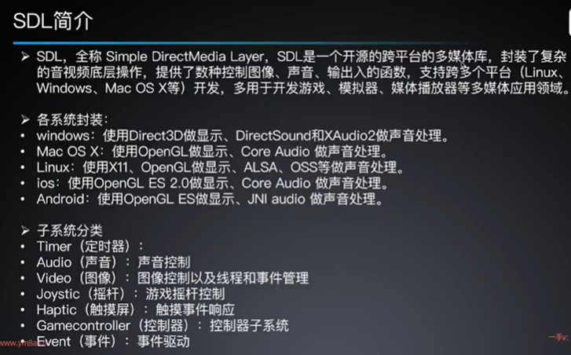
