# 51单片机重学笔记


## 目录

- [51单片机重学笔记](#51单片机重学笔记)
  - [目录](#目录)
  - [基本概念](#基本概念)
    - [丝印含义](#丝印含义)
    - [引脚功能](#引脚功能)
    - [最小系统和复位电路](#最小系统和复位电路)
  - [常用外围器件](#常用外围器件)
    - [六角自锁开关](#六角自锁开关)
    - [轻触开关](#轻触开关)
    - [二极管](#二极管)
    - [三极管](#三极管)
      - [信号放大电路](#信号放大电路)
      - [三极管三种工作状态](#三极管三种工作状态)
      - [场效应管](#场效应管)
      - [数码管](#数码管)
      - [多位数码管](#多位数码管)
  - [灌电流驱动](#灌电流驱动)
  - [时钟周期、机器周期、指令周期](#时钟周期机器周期指令周期)
  - [指令表](#指令表)
  - [delay函数](#delay函数)
    - [delay函数：写法1](#delay函数写法1)
    - [delay函数：写法2](#delay函数写法2)
    - [delay函数：写法3](#delay函数写法3)
  - [c51-RAM分布](#c51-ram分布)
  - [C51-基本数据类型](#c51-基本数据类型)
  - [reg51.h头文件](#reg51h头文件)
    - [sfr关键字](#sfr关键字)
    - [sbit关键字](#sbit关键字)
    - [带注释的REG51.H](#带注释的reg51h)
    - [CY进位寄存器](#cy进位寄存器)
  - [LED流水灯实现](#led流水灯实现)
  - [1位数数码管驱动实现](#1位数数码管驱动实现)
  - [多位数码管驱动实现](#多位数码管驱动实现)
  - [LCD1602(LCM1602)驱动编写](#lcd1602lcm1602驱动编写)
  - [LCD1602驱动调用测试](#lcd1602驱动调用测试)
  - [轻触开关下降沿触发](#轻触开关下降沿触发)
  - [矩阵按键驱动编写](#矩阵按键驱动编写)
    - [使用测试](#使用测试)
  - [`定时器/计数器`电路工作原理](#定时器计数器电路工作原理)
  - [中断系统工作原理](#中断系统工作原理)

## 基本概念

### 丝印含义


### 引脚功能


### 最小系统和复位电路

RST:复位引脚，高电平复位

- 电压高于2.8V视为逻辑1
- 电压低于0.8V视为逻辑0
- 上电时，电容C1上电压为0V,R1上电压为5V,RST高电平，电路复位
- 电容充电完毕后C1上电压为5V,R1上电压为0V


## 常用外围器件

### 六角自锁开关

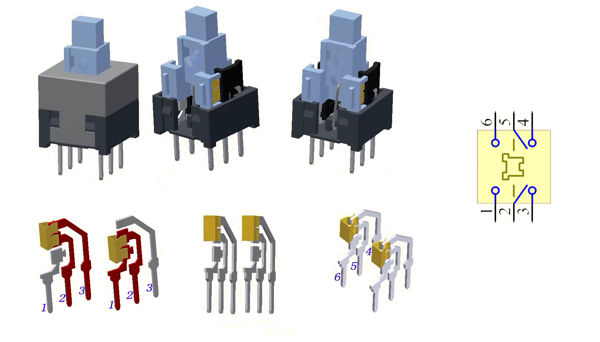

### 轻触开关


### 二极管


### 三极管


#### 信号放大电路


#### 三极管三种工作状态

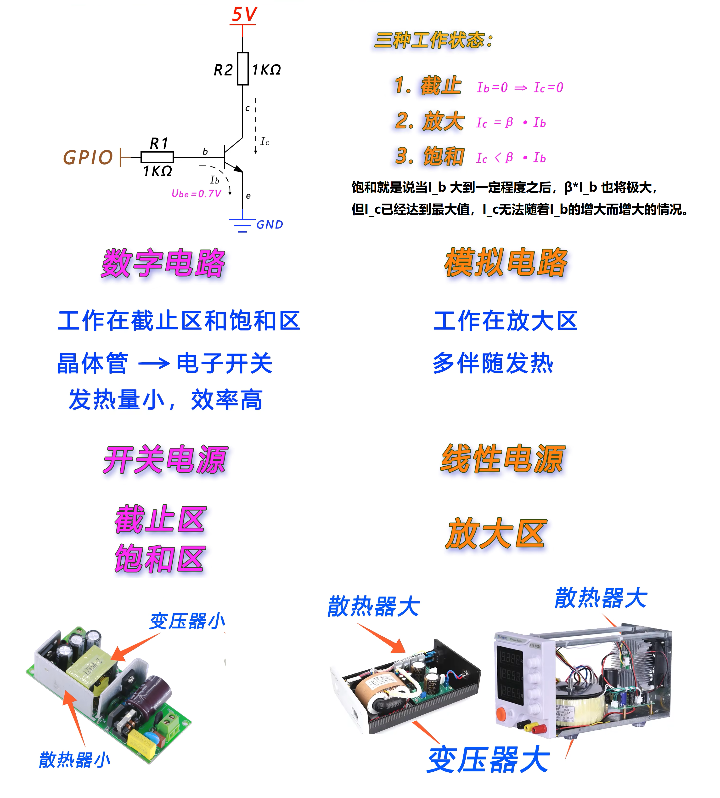

#### 场效应管


#### 数码管

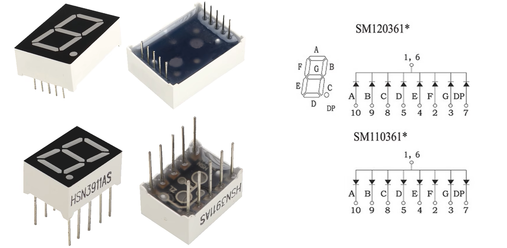
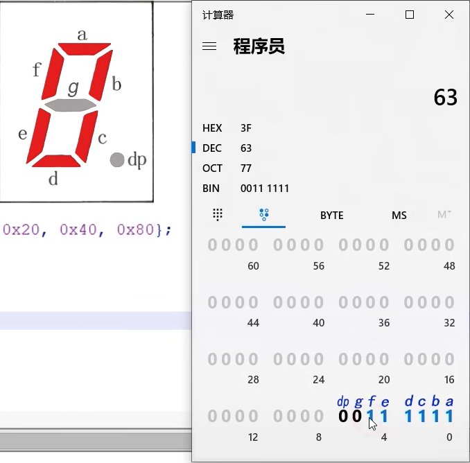
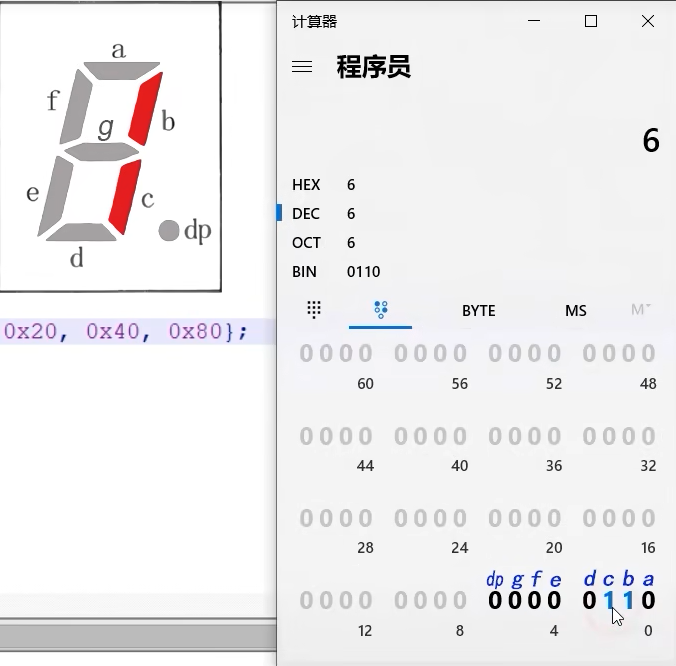


#### 多位数码管

内部原理图

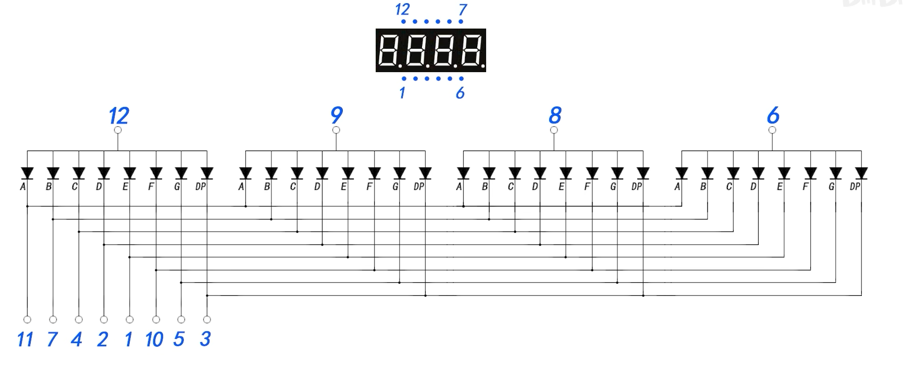

驱动原理图


## 灌电流驱动


## 时钟周期、机器周期、指令周期

**时钟周期/振荡周期**：

- 是时钟频率的倒数
- 是单片机时序的最小单位，
- 51单片机中把1时钟周期定义为1**节拍**（用P表示）,2个节拍定义为**状态周期**（用S表示）
- 时钟频率$f_{osc}=12MHz$，时钟周期为 $\frac{1}{12M}=\frac{1}{12}μs$
- 

**机器周期**

- 定义为完成一项基本操作所需要的时间
- 在51单片机中1个机器周期由6个状态周期组成,也就是12个时钟周期
- 定义机器周期是因为时钟周期时间太短，根本做不了什么。
- 
- 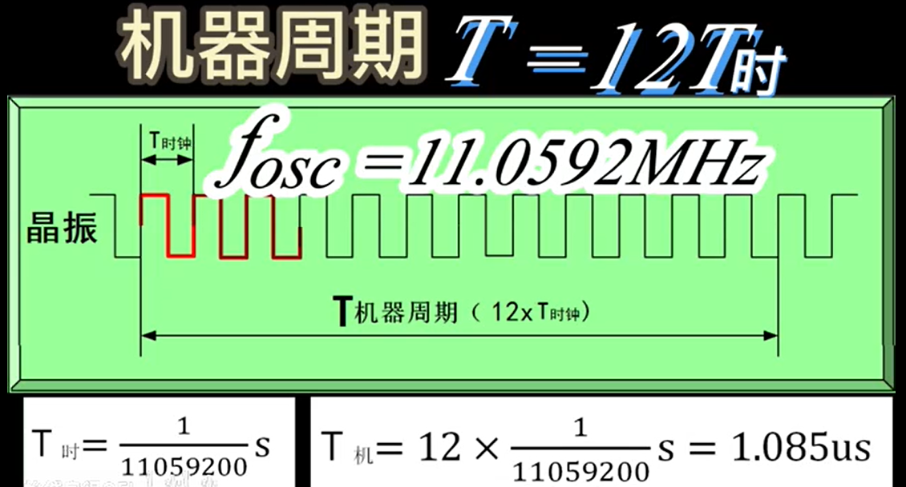

**指令周期**

- 定义为执行一条指令所需的时间。
- 单周期指令: 只有一个机器周期的指令，MOV指令，CLR指令等
- 双周期指令：所有的绝对跳转和条件转移指令，均为2周期指令
- 四周期指令：含四个机器周期的指令，MUL、DIV。

## 指令表


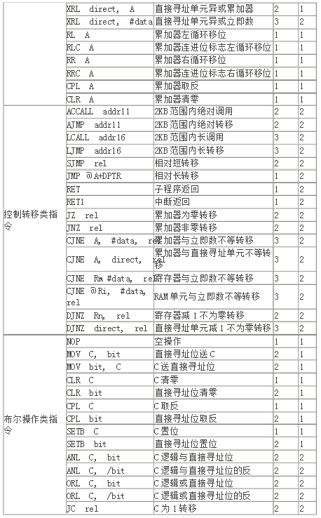


## delay函数

假设单片机时钟频率为12MHz，那么机器周期就为1μs  

### delay函数：写法1

> （实际上char 8bit无法写入333，所以这么写还是有问题）

**c语言编译为汇编后的结果：**

```c
:---------------------------------源代码-------------------------------------:
  33          void delay(void)
  34          {
  35   1          char j;
  36   1          for (j = 1; j <= 110; j++)  // 假设这个循环t次，耗时1000机器周期，则 1+3t=1000,则t=(1000-1)/3=333
  37   1          ;
  38   1      }
:----------------------------------汇编--------------------------------------:
             ; FUNCTION delay (BEGIN)
                                           ; SOURCE LINE # 33
                                           ; SOURCE LINE # 34
                                           ; SOURCE LINE # 36
;---- Variable 'j' assigned to Register 'R7' ----
0000 7F01              MOV     R7,#01H              ; 将0x01送到寄存器R7 1个机器周期
0001
0002         ?C0001:
0002 0F                INC     R7                   ; 自增寄存器R7 1个机器周期
0003 BF6FFC            CJNE    R7,#06FH,?C0001      ; R7中的内容与0x06F=111不等则跳转 2个机器周期
0004                                           ; SOURCE LINE # 38
0005
0006         ?C0004:
0006 22                RET                          ; 子程序返回 2个机器周期
```

for循环赋值指令耗时1个周期、自增耗时1个周期、比较耗时2个周期  
假设循环t次，耗时1000机器周期，则 1+3t=1000,则t=(1000-1)/3=333

所以可以设计这样一个延时函数

```c
void delay(char second)
{
    char j;
    for(;--second;){
        for (j = 1; j <= 333; j++) // 耗时1ms
    }
}
```

### delay函数：写法2

> （实际上char 8bit无法写入500，所以这么写还是有问题）

**更高效的写法:**

```c
:---------------------------------源代码-------------------------------------:
  19          void delay(void)
  20          {
  21   1          char j=333;
  22   1              for (;--j;); // --j操作耗时2个机器周期，总共耗时2j个机器周期
  23   1      }
  :----------------------------------汇编--------------------------------------:
C51 COMPILER V9.01   MAIN                                                                  06/25/2023 12:19:38 PAGE 2   

ASSEMBLY LISTING OF GENERATED OBJECT CODE


             ; FUNCTION delay (BEGIN)
                                           ; SOURCE LINE # 19
                                           ; SOURCE LINE # 20
                                           ; SOURCE LINE # 21
;---- Variable 'j' assigned to Register 'R7' ----
0000 7F4D              MOV     R7,#04DH    ; 0x4d送到R7寄存器 1个机器周期
                                           ; SOURCE LINE # 22
0002         ?C0001:
0002 DFFE              DJNZ    R7,?C0001   ; 寄存器自减，当不为0时跳转到?C0001: 2个机器周期
0004         ?C0002:
                                           ; SOURCE LINE # 23
0004         ?C0003:
0004 22                RET                 ; 子程序返回 2个机器周期
             ; FUNCTION delay (END)
```

for循环赋值指令耗时1个周期、循环耗时2t个周期  
假设循环t次，耗时1000机器周期，则 1+2t=1000,则t=(1000-1)/2=499.5

所以可以设计这样一个delay函数

```c
void delay(char second)
{
    for(;--second;){
        char j=500;
        for (;--j;); // 耗时1ms
    }
}
```

### delay函数：写法3

> 实际上内层循环应该用int，但是用int后的机器周期的计算就没有用char时的那么显而易见了

```c
line level    source

   1          void delay()
   2          {
   3   1              int j = 500;
   4   1              for (; --j;);
   5   1      }
C51 COMPILER V9.01   UTILS                                                                 06/26/2023 03:53:57 PAGE 2   

ASSEMBLY LISTING OF GENERATED OBJECT CODE


             ; FUNCTION delay (BEGIN)
                                           ; SOURCE LINE # 1
                                           ; SOURCE LINE # 2
                                           ; SOURCE LINE # 3
;---- Variable 'j' assigned to Register 'R6/R7' ----
0000 7FF4              MOV     R7,#0F4H    ;初始化低八位
0002 7E01              MOV     R6,#01H     ;初始化高八位
                                           ; SOURCE LINE # 4
0004         ?C0001:
0004 EF                MOV     A,R7        ;低八位复制到ACC寄存器
0005 1F                DEC     R7          ;低八位自减
0006 7001              JNZ     ?C0004      ;ACC不为0说明低八位没减完了，则跳转到 ?C0004 继续减低八位
0008 1E                DEC     R6          ;减完了低八位则去减高八位
0009         ?C0004:
0009 14                DEC     A       ;   ACC再次自减，减去低八位
000A 4E                ORL     A,R6    ;   将累加器A中的数据或上R6中的数据，数据保存在A中
000B 70F7              JNZ     ?C0001  ;   ACC不为0则说明没减完了，循环
000D         ?C0002:
                                           ; SOURCE LINE # 5
000D         ?C0003:
000D 22                RET     
             ; FUNCTION delay (END)
```

**直接给出代码吧**

```c
// 12MHz时实现毫秒级延迟的写法
void delay(unsigned int ms)
{
    unsigned int i, j;
    for (i = ms; i > 0; i--)
        for (j = 123; j > 0; j--)
            ;
}
```

## c51-RAM分布

- `0x00-0x1F` 0x20(32)个通用寄存器
  - 分为0、1、2、3四组
  - 每组有R0~R7八个寄存器
  - 所以4x8=32个寄存器
- `0x20-0x2F` 0x10(16)个支持位寻址的字节数据区
- `0x30-0x7F` 0x50(80)个字节的用户RAM区
  - 同时也是栈区


## C51-基本数据类型


## reg51.h头文件

reg51.h里面主要是一些特殊功能寄存器的地址声明

```c
sfr  P1 = 0x90   //这句话表示：P1口所对应的特殊功能寄存器P1在内存中的地址为0x80，
sbit EA = 0xAF;   //这句话表示EA这一位的地址为0xAF。


```

### sfr关键字

- 特殊功能寄存器(special function register)
- 它并非标准C语言的关键字，而是Keil 为能直接访问80C51中的 SFR 而提供了一个新的关键词，
- 用法:
  - sfr 特殊功能寄存器名=地址值
  - 用户实际上也可以修改的，如P1=0x80，也可改为A1=0x80
  - 但sfr 和地址值则不能更改，否者会编译出错。
- 特殊功能寄存器布局
  - 事实上只有第一列的地址可以位寻址
  - 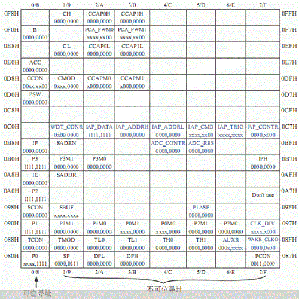

### sbit关键字

- 表示特殊功能寄存器位
- 是非标准C语言的关键字
- 在对寄存器的某一位(必须是可位寻址的特殊功能寄存器才能用)操作时使用
- 如：
  - sbit LED = P1^0;
  - sbit EA = 0xAF;
- 位定义用法有三种：
  - 第一种方法：sbit 位变量名＝ 寄存器位地址值
  - 第二种方法：sbit 位变量名＝SFR 名称^寄存器位值(0-7)
  - 第三种方法：sbit 位变量名＝SFR 地址值^寄存器位值

```c
// sbit 特殊功能寄存器位
// 第一种方法：sbit 位变量名=地址值
// 第二种方法：sbit 位变量名=SFR名称^变量位地址值
// 第三种方法：sbit 位变量名=SFR地址值^变量位地址值
sbit LED = P1 ^ 0;
sbit BUZ = P2 ^ 0;
```

### 带注释的REG51.H

```c
/*--------------------------------------------------------------------------
REG51.H             //REG 就是 Register(寄存器)的意思，对51单片机的操作就是对寄存器的操作
 
Header file for generic 80C51 and 80C31 microcontroller.
Copyright (c) 1988-2002 Keil Elektronik GmbH and Keil Software, Inc.
All rights reserved.
--------------------------------------------------------------------------------------------
 
51单片机是8位地址的，用十六进制来表示就是两位十六进制数，所以下面看到的都是两位十六进制的地址
 
关于位寻址及操作，有个简便方法判断，将字节地址换成10进制后能否被“8”整除，能被“8”整除的就
能进行位操作，不能被“8”整除就不能，如P1地址为90H,10进制为144 144/8=18,能被整除，所以可以位
操作。再如TMOD地址为89H, 10进制为137 137/8=17.125,不能被整除，所以不可以位操作。
 
--------------------------------------------------------------------------------------------*/
 
#ifndef __REG51_H__ //如果没有定义__REG51_H__，那么定义它
#define __REG51_H__
 
/*  BYTE Register  */ 
 
/*  -------------------------------------------------
   sfr 是 special function register，特殊功能寄存器  
    -------------------------------------------------*/
 
sfr P0   = 0x80;    // P0口
sfr P1   = 0x90;    // P1口
sfr P2   = 0xA0;    // P2口
sfr P3   = 0xB0;    // P3口
sfr PSW  = 0xD0;    // Program Status Word，程序状态字
sfr ACC  = 0xE0;    // 累加器
sfr B    = 0xF0;    // 乘除法辅助寄存器
sfr SP   = 0x81;    // Stack Point，堆栈指针
sfr DPL  = 0x82;    // 数据指针(低8位)
sfr DPH  = 0x83;    // 数据指针(高8位)
sfr PCON = 0x87;    // Power Control，电源控制和波特率选择
sfr TCON = 0x88;    // Timer Controller  定时器控制
sfr TMOD = 0x89;    // Timer Mode    定时器方式控制寄存器，不可寻址
sfr TL0  = 0x8A;    // 定时器0低8位
sfr TL1  = 0x8B;    // 定时器1低8位
sfr TH0  = 0x8C;    // 定时器0高8位
sfr TH1  = 0x8D;    // 定时器1高8位
sfr IE   = 0xA8;    // Interrupt Enable  中断使能
sfr IP   = 0xB8;    // Interrupt Priority  中断优先级控制
sfr SCON = 0x98;    // Seriel Controller 串行口控制寄存器，监视和控制51 芯片串行口的工作状态
sfr SBUF = 0x99;    // Serial Buffer，串行数据收/发缓冲器
 
 
/*  BIT Register  */
 
 
/*  PSW     Program Status Word   程序状态字  */
 
/* ---------------------------------------------------------------------------------------------
    sbit定义特殊功能寄存器的位变量,映射到IO口（P1^1这种IO口的“位”）
    bit和int char差不多，只不过char=8位, bit=1位而已。都是变量，编译器在编译过程中分配地址。
    除非指定，否则这个地址是随机分配的。这个地址是整个可寻址空间，RAM+FLASH+扩展空间。bit只
    有0和1两种值，和Windows下VC中的BOOL类似。
   ---------------------------------------------------------------------------------------------*/
 
sbit CY   = 0xD7;   /* PSW.7，carry,进位标志，在执行加减运算指令时，如果运算结果的最高位(D7)
               发生了进位或借位，则CY由硬件自动置1。*/
sbit AC   = 0xD6;   /* PSW.6，assistant carry,半进位标志位，也称为辅助标志位。在执行加减运算指令时，如
               果运算结果的低半字节(D3)发生了向高半字节进位或借位，则AC由硬件自动置1。*/    
sbit F0   = 0xD5;   /* PSW.5，用户标志位。用户可以根据需要对F0、F1赋予一定的含义，由用户置1和清0，作为软件标 
 
               志。 */
sbit RS1  = 0xD4;   /* PSW.4,工作寄存器组选择控制位。通过对这两位设定，可以从4个工作寄存器组中选择一组作为当   
 
                   前工作寄存器。 */
sbit RS0  = 0xD3;   // PSW.3
sbit OV   = 0xD2;   /* PSW.2，overflow,溢出标志位，有两种情况影响该位。一是执行加减运算时，如果D7或
               D6任一位，并且只一位发生了进位或借位，则OV自动置1 */
/* sbit F1 = 0xD1 */    //这个原来的头文件是没有的，自己加上去的，和 F0 作用一样
sbit P    = 0xD0;   /* PSW.1，奇偶标志位。每条指令执行完后，该位都会指示当前累加器A中1的个数。如果A中有奇数       
 
                       个1，则P自动置1。*/
 
/*  TCON    Timer Controller  定时器控制  */
 
sbit TF1  = 0x8F;   // Timer1 Flag，T1中断标志位
sbit TR1  = 0x8E;   // Timer1 Run，T1运行控制位
sbit TF0  = 0x8D;   // Timer0 Flag，T0中断标志位
sbit TR0  = 0x8C;   // Timer0 Run，T0运行控制位
sbit IE1  = 0x8B;   // Interrupt1 Exterior，外部中断1中断标志位
sbit IT1  = 0x8A;   // Interrupt1 Touch，外部中断1 触发方式选择位
sbit IE0  = 0x89;   // Interrupt0 Exterior，外部中断0中断标志位
sbit IT0  = 0x88;   // Interrupt0 Touch，外部中断0触发方式选择位
 
/*  IE      Interrupt Enable  中断使能  */
 
sbit EA   = 0xAF;   // IE.7，Enable All Interrupt，中断总允许位
sbit ES   = 0xAC;   // IE.4，Enable Serial，串行口中断允许位 
sbit ET1  = 0xAB;   // IE.3，Enable Timer 1，T1中断允许位
sbit EX1  = 0xAA;   // IE.2, Enable Exterior 1，外部中断1中断允许位
sbit ET0  = 0xA9;   // IE.1，Enable Timer 0，T0中断允许位
sbit EX0  = 0xA8;   // IE.0，Enable Exterior 0，外部中断0中断允许位
 
/*  IP      Interrupt Priority  中断优先级控制  */ 
 
sbit PS   = 0xBC;   // IP.4，Priority Serial    串口优先级标志位
sbit PT1  = 0xBB;   // IP.3，Priority Timer 1    定时器1优先级标志位
sbit PX1  = 0xBA;   // IP.2，Priority Exterior 1    外部中断1优先级标志位
sbit PT0  = 0xB9;   // IP.1，Priority Timer 0    定时器0优先级标志位
sbit PX0  = 0xB8;   // IP.0，Priority Exterior 0    外部中断0优先级标志位
 
/*  P3  */
 
sbit RD   = 0xB7;   // Read Data，读数据
sbit WR   = 0xB6;   // Write Data，写数据
sbit T1   = 0xB5;   // Timer 1,定时器1，由TMOD的高四位控制
sbit T0   = 0xB4;   // Timer 0，定时器0，由TMOD的低四位控制
sbit INT1 = 0xB3;   // Interrupt 1，中断1
sbit INT0 = 0xB2;   // Interrupt 0，中断0
sbit TXD  = 0xB1;   // Receive Data，串口接收端
sbit RXD  = 0xB0;   // Transmit Data，串口发送端
 
/*  SCON    Seriel Controller 串行口控制  */
 
sbit SM0  = 0x9F;   // SM0和SM1组成4种工作方式，对应有不同特性
sbit SM1  = 0x9E;   //
sbit SM2  = 0x9D;   /* 多机通信控制位。多机通信是工作于方式2和方式3，SM2位主要用于方式2和方式3。
               接收状态，当串行口工作于方式2或3，以及SM2=1时，只有当接收到第9位数据（RB8）
               为1时，才把接收到的前8位数据送入SBUF，且置位RI发出中断申请，否则会将接受
               到的数据放弃。当SM2=0时，就不管第位数据是0还是1，都难得数据送入SBUF，并发
               出中断申请。工作于方式0时，SM2必须为0。*/
sbit REN  = 0x9C;   // Receive Enable，使能接收
sbit TB8  = 0x9B;   // 发送接收数据位8
sbit RB8  = 0x9A;   // 接收数据位8
sbit TI   = 0x99;   // 发送中断标志位
sbit RI   = 0x98;   // 接收中断标志位
 
#endif
```

### CY进位寄存器


`REG51.H`

```
/*--------------------------------------------------------------------------
REG51.H

sbit CY    = PSW^7; // 溢出位
```

## LED流水灯实现


```c
#include <REG51.H>
#include "utils.h"

sfr LED  = 0x90; // P1
sbit BUZ = P2 ^ 0;

unsigned char LED_STATE[] = {
                                1 << 0, //00000001 0x01
                                1 << 1, //00000010 0x02
                                1 << 2, //00000100 0x04
                                1 << 3, //00001000 0x08
                                1 << 4, //00010000 0x10
                                1 << 5, //00100000 0x20
                                1 << 6, //01000000 0x40
                                1 << 7, //10000000 0x80
                                1 << 8, //00000000 0x00
    };
void main()
{
    while (1) {
        char i;
        for (i = 0; i < 8; i++) {
            LED = ~LED_STATE[i];
            BUZ = ~BUZ;
            delay(1000);
        }
    }
}
```

```c
// 12MHz时实现毫秒级延迟的写法
void delay(unsigned int ms)
{
    unsigned int i, j;
    for (i = ms; i > 0; i--)
        for (j = 123; j > 0; j--) ;
}
```

## 1位数数码管驱动实现

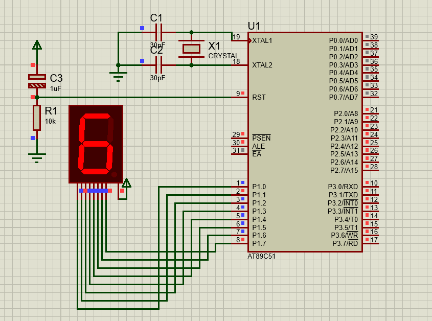

```c
#include "REG52.H"
#include "utils.h"

sfr LED                = 0x90;                                                         // P1口
uint8_t SEG7_CODE_CC[] = {0x3f, 0x06, 0x5b, 0x4f, 0x66, 0x6d, 0x7d, 0x07, 0x7f, 0x6f}; // 共阴极七段数码管0~9数字
void main()
{
    uint8_t num = 1;
    while (1) {
        uint8_t i;
        for (i = 0; i < 10; i++) {
            LED = ~SEG7_CODE_CC[i];
            delay(500);
        }
    }
}
```

```c
#ifndef _UTILS_
#define _UTILS_

typedef unsigned char uint8_t;
typedef unsigned int uint16_t;
typedef unsigned long uint32_t;

typedef signed char int8_t;
typedef signed int int16_t;
typedef signed long int32_t;

#define EXT0_VECTOR  0 /* 0x03 external interrupt 0 */
#define TIM0_VECTOR  1 /* 0x0b timer 0 */
#define EXT1_VECTOR  2 /* 0x13 external interrupt 1 */
#define TIM1_VECTOR  3 /* 0x1b timer 1 */
#define UART0_VECTOR 4 /* 0x23 serial port 0 */

void delay(unsigned int);
#endif
```

## 多位数码管驱动实现


```c
#include "REG52.H"
#include "utils.h"

// 共阴极七段数码管0~9数字段选信号
uint8_t SEG7_CODE_CC[] = {0x3f, 0x06, 0x5b, 0x4f, 0x66, 0x6d, 0x7d, 0x07, 0x7f, 0x6f}; 
uint8_t SEG_MASK[] = {0x01, 0x02, 0x04, 0x08};
uint8_t NUM[]      = {1, 2, 3, 4};
void display()
{
    uint8_t i;
    for (i = 0; i < 4; i++) {
        P0 = ~SEG7_CODE_CC[NUM[i]];
        P2 = ~SEG_MASK[i];
        delay(1);
        P0 = 0xff; // 关闭段选 一定要初始化，否则将导致第n位显示在第n-1位上
        P2 = 0xff; // 关闭位选 一定要初始化
    }
}

void main()
{
    while (1) {
        display();
    }
}
```

```c
#ifndef _UTILS_
#define _UTILS_

typedef unsigned char uint8_t;
typedef unsigned int uint16_t;
typedef unsigned long uint32_t;

typedef signed char int8_t;
typedef signed int int16_t;
typedef signed long int32_t;

// 共阴极七段数码管0~9数字段选信号
uint8_t SEG7_CODE_CC[] = {0x3f, 0x06, 0x5b, 0x4f, 0x66, 0x6d, 0x7d, 0x07, 0x7f, 0x6f}; 
void delay(unsigned int);
#endif
```

## LCD1602(LCM1602)驱动编写


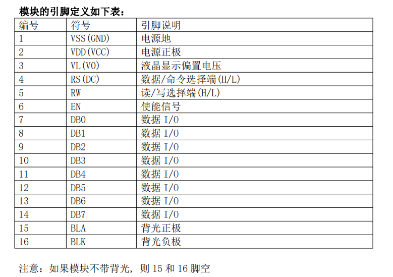

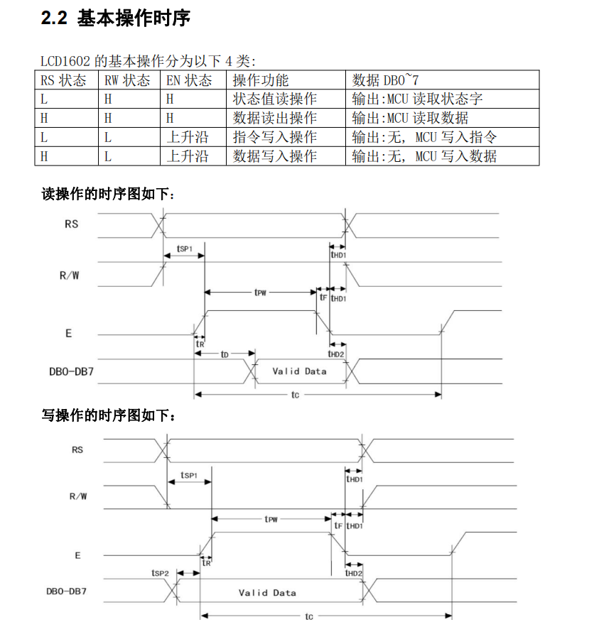


`1602.h`

```c
#ifndef __LCD_1602_H_
#define __LCD_1602_H_
#include "utils.h"

void LCD_Init();

void LCD_Clear();

void LCD_Cusor_Init();
void LCD_Cusor_GoToXY(int8_t _x, int8_t _y);
uint8_t LCD_CGRAM_ADD_GET();

void LCD_DDRAM_ADD_SET(uint8_t _addr);

void LCD_PutChar(uint8_t _char);
void LCD_PutString(uint8_t *_str);
void LCD_PutNumWithSign(int16_t _num);
void LCD_PutHexWith0x(uint16_t _hex);

void LCD_LoadCustomChar(uint8_t _idx_CGRAM, uint8_t _data[8]);
void LCD_ShowCustomChar(uint8_t _idx);

void LCD_Cusor_Show_UnderLine(uint8_t _show);
void LCD_Cusor_Flash(uint8_t _flash);

void LCD_Scroll_Cusor_Step(uint8_t _dir);
void LCD_Scroll_View_Step(uint8_t _dir);

void LCD_View_Auto_Scroll(uint8_t _scrollable);
void LCD_AC_Positive_Increase(uint8_t _increase);

void LCD_Test();
#endif
```

`1602.c`

```c
// 低级接口
#include "utils.h"
#include "REG51.H"

// ----------------------------------------------端口定义----------------------------------------------
#define LCD_DATA P0         // LCD数据8bit端口
sbit LCD_BF = LCD_DATA ^ 7; // 数据位的第七位为读/写允许位，进行读写操作前，要确认该位值为 0 才可进行操作
sbit LCD_RS = P2 ^ 0;       // 数据/命令选择端(H/L)
sbit LCD_RW = P2 ^ 1;       // 读/写选择端(H/L)
sbit LCD_EN = P2 ^ 2;       // 使能信号

// ----------------------------------------------常量定义----------------------------------------------
enum LCD_BF_Enum {
    Lazy = 0,
    Busy = 1
};
enum LCD_RW_Enum {
    Write = 0,
    Read  = 1
};
enum LCD_RS_Enum {
    CMD  = 0,
    DATA = 1
};
enum LCD_EN_Enum {
    Disable = 0,
    Enable  = 1
};
enum LCD_Bool_Enum {
    False = 0,
    True  = 1
};
// ----------------【忙等待、读取、写入】三个基本操作的实现--------------------------------

// 基本操作：等待LCD可以读写数据
// 功能：读取BF状态字、AC地址(最高位为BF状态字，可判断是否忙)
// BF 位为读/写允许位，在 MCU 对 LCD 进行读写操作前，要确认该位值为 0 才可进行操作。
uint8_t LCD_WaitNoBusy()
{
    uint8_t AC_Add;
    LCD_BF = Busy;            // 预先拉高BF信号
    do {                      // 循环、直到BF为低电平
        LCD_EN = Disable;     // 拉低使能信号
        LCD_RW = Read;        // 读取操作
        LCD_RS = CMD;         // 读取命令
        delay_2us(1);         // 延时
        LCD_EN = Enable;      // 拉高使能
        delay_2us(1);         // 延时
    } while (LCD_BF == Busy); // LCD_BF==1 说明忙
    AC_Add = LCD_DATA;        // 获取AC地址；
    LCD_EN = Disable;         // 拉低使能
    return AC_Add;            // 返回AC地址
}

// 基本操作：写操作（数据或命令）
void LCD_Put(uint8_t _CMD_OR_DATA, uint8_t _data) // 传入指令或数据
{
    LCD_WaitNoBusy();
    LCD_EN   = Disable;      // EN低电平
    LCD_RW   = Write;        // 写入操作
    LCD_RS   = _CMD_OR_DATA; // 数据类型：指令？数据？
    LCD_DATA = _data;        // 准备数据
    delay_2us(1);            // 延时
    LCD_EN = Enable;         // 给一个上升沿，让LCD读取数据
    delay_2us(1);            // 延时
    LCD_EN = Disable;
}
// 基本操作：读操作（数据或命令）
uint8_t LCD_Get(uint8_t _CMD_OR_DATA)
{
    uint8_t res;
    LCD_WaitNoBusy();
    LCD_EN = Disable;      // EN低电平
    LCD_RW = Read;         // 读取操作
    LCD_RS = _CMD_OR_DATA; // 数据类型：指令？数据？
    delay_2us(1);          // 延时
    LCD_EN = Enable;       // 给一个高电平使能
    delay_2us(1);          // 延时
    res    = LCD_DATA;     // 读取数据
    LCD_EN = Disable;      // 拉低使能
    return res;            // 返回结果
}

// -------------- ----【写入命令、写入数据、读取命令、读取数据】四个基本操作的宏定义---------------------------
#define LCD_PutCmd(_cmd)  LCD_Put(CMD, _cmd)
#define LCD_PutDat(_data) LCD_Put(DATA, _data)
#define LCD_GetCmd()      LCD_Get(CMD)
#define LCD_GetDat()      LCD_Get(DATA)

// ----------------------------------8条命令的定义（实际上也保存了状态）------------------------------------

uint8_t CMD_CLEAR = 0x01; // 清屏指令 光标复位到地址00H
uint8_t CMD_CLEAC = 0x02; // 光标归位指令   (使AC清零,光标归位
uint8_t CMD_ENTER = 0x04; // 输入方式设置指令   （该指令的功能在于设置显示字符的进入方式，即在对 DDRM 操作数据写入/读出后，AC 数据地址指针的修改方式）
uint8_t CMD_STATE = 0x08; // 显示状态设置指令 （该指令控制着画面、光标和闪烁的开与关）
uint8_t CMD_SCROL = 0x10; // 画面或光标滚动设置指令
uint8_t CMD_RMODE = 0x20; // 工作方式设置指令
uint8_t CMD_CGADR = 0x40; // 设定 CGRAM 地址设置指令
uint8_t CMD_DDADR = 0x80; // 设置 DDRAM 地址设置指令    (也可理解为修改 AC 指针位置

// ------------------------------低级功能接口实现-------------------------------------
// 工作方式设置
void LCD_RunMode()
{
    // 设置控制器与 MCU 的接口形式为数据总线宽度为 8 位，设置显示字符的行数为 2 行字符，设置显示字符的字体为 5X8 点阵字符体
    LCD_PutCmd(CMD_RMODE | 0x18);
}
// 画面显示
void LCD_Open(uint8_t _open)
{
    if (_open)
        CMD_STATE |= 0x04;
    else
        CMD_STATE &= ~0x04;
    LCD_PutCmd(CMD_STATE);
}
// 光标下划线显示
void LCD_Cusor_Show_UnderLine(uint8_t _show)
{
    if (_show)
        CMD_STATE |= 0x02;
    else
        CMD_STATE &= ~0x02;
    LCD_PutCmd(CMD_STATE);
}
// 光标闪烁
void LCD_Cusor_Flash(uint8_t _flash)
{
    if (_flash)
        CMD_STATE |= 0x01;
    else
        CMD_STATE &= ~0x01;
    LCD_PutCmd(CMD_STATE);
}
// 光标滚动一步
void LCD_Scroll_Cusor_Step(uint8_t _dir)
{
    CMD_SCROL &= ~0x08; // 保证第四位是0
    if (_dir == 'R' || _dir == 'r')
        CMD_SCROL |= 0x04;
    else
        CMD_SCROL &= ~0x04;
    LCD_PutCmd(CMD_SCROL);
}
// 画面滚动
void LCD_Scroll_View_Step(uint8_t _dir)
{
    CMD_SCROL |= 0x08;
    if (_dir == 'R' || _dir == 'r')
        CMD_SCROL |= 0x04;
    else
        CMD_SCROL &= ~0x04;
    LCD_PutCmd(CMD_SCROL);
}
//  在对DDRM 操作数据写入/读出后，AC 数据地址指针自增还是自减。
void LCD_AC_Positive_Increase(uint8_t _increase)
{
    if (_increase)
        CMD_ENTER |= 0x02;
    else
        CMD_ENTER &= ~0x02;
    LCD_PutCmd(CMD_ENTER);
}
// 在对 DDRM 写入数据后画面是否同步滚动（显示屏上所有文字是否左移或右移）
void LCD_View_Auto_Scroll(uint8_t _scrollable)
{
    if (_scrollable)
        CMD_ENTER |= 0x01;
    else
        CMD_ENTER &= ~0x01;
    LCD_PutCmd(CMD_ENTER);
}
// 清屏指令,同时光标复位到地址00H
void LCD_Clear()
{
    LCD_PutCmd(CMD_CLEAR);
}
// 光标归位指令
void LCD_Cusor_Init()
{
    LCD_PutCmd(CMD_CLEAC);
}
// 设定 CGRAM 地址设置
void LCD_CGRAM_ADD_SET(uint8_t _col, uint8_t _row)
{
    _col = (_col & 0x07) << 3;
    _row = _row & 0x7;  // 只要最低三位
    CMD_CGADR &= ~0x3f; // 擦除上一次的6bit数据
    CMD_CGADR = CMD_CGADR | _col | _row;
    LCD_PutCmd(CMD_CGADR);
}
// 获取DDRAM(AC)地址
uint8_t LCD_CGRAM_ADD_GET()
{
    return LCD_WaitNoBusy();
}
// 设定 DDRAM(AC) 地址设置
void LCD_DDRAM_ADD_SET(uint8_t _addr)
{
    CMD_DDADR &= ~0x7f; // 擦除上一次的7bit数据
    CMD_DDADR |= _addr;
    LCD_PutCmd(CMD_DDADR);
}
// 向 DDRAM 或 CGRAM 写入数据
void LCD_CGRAM_DDRAM_Put_Data(uint8_t _data)
{
    LCD_PutDat(_data);
}
// 从 DDRAM 或 CGRAM 读回数据
uint8_t LCD_CGRAM_DDRAM_Get_Data()
{
    return LCD_GetDat();
}

// ---------------------------------高级功能接口实现-----------------------------------------------------------
// 初始化
void LCD_Init()
{
    LCD_RunMode();
    LCD_Clear();
    LCD_Cusor_Init();
    LCD_AC_Positive_Increase(True); // 开启写入后自增AC
    LCD_View_Auto_Scroll(False);    // 关闭写入后自动滚动
    LCD_Open(True);                 // 开显示
}
/*------------------------------------------------------
DDRAM
x=     0  1  2  3  4...................0x27
        ____________________________________
y=0    | 00 01 02 03 04 05 06 07 ....... 27 |
y=1    | 40 41 42 43 44 45 46 47 ....... 67 |
------------------------------------------------------*/
// 跳转到指定位置（支持负数反向定位） x∈[0,0x27] y∈[0,1] 可以使用-1表示最后一位，-2表示最后第二位
void LCD_Cusor_GoToXY(int8_t _x, int8_t _y)
{
    uint8_t addr;
    _x   = (_x % 0x28 + 0x28) % 0x28; // 使其可以使用-1定位到最后一个位置
    _y   = (_y % 0x02 + 0x02) % 0x02;
    addr = _y * 0x40 + _x;
    LCD_DDRAM_ADD_SET(addr);
}
// 输出一个字符
void LCD_PutChar(uint8_t _char)
{
    LCD_CGRAM_DDRAM_Put_Data(_char);
}
// 输出字符串
void LCD_PutString(uint8_t *_str)
{
    while (*_str) LCD_PutChar(*_str++);
}
// 递归输出无符号数
void LCD_PutNum(uint16_t _num) reentrant // reentrant 关键字用于保证可以递归
{
    if (_num / 10) LCD_PutNum(_num / 10);
    LCD_PutChar(_num % 10 + '0');
}
// 输出有符号数
void LCD_PutNumWithSign(int16_t _num)
{
    if (_num < 0) {
        _num = -_num;
        LCD_PutChar('-');
    }
    LCD_PutNum(_num);
}
// 输出一位十六进制字符
void LCD_PutOneHex(uint8_t _hex)
{
    uint8_t temp = _hex % 16;
    if (temp < 9) LCD_PutChar(temp + '0');
    else LCD_PutChar(temp - '9' + 'A');
}
// 输出一个十六进制数
void LCD_PutHex(uint16_t _hex) reentrant
{
    if (_hex / 16) LCD_PutHex(_hex / 16);
    LCD_PutOneHex(_hex % 16);
}
// 输出一个十六进制数，带0x格式
void LCD_PutHexWith0x(uint16_t _hex)
{
    LCD_PutString("0x");
    LCD_PutHex(_hex);
}
// 加载自定义字符
void LCD_LoadCustomChar(uint8_t _idx_CGRAM, uint8_t _data[8])
{
    uint8_t _row;
    for (_row = 0; _row < 8; _row++) {
        LCD_CGRAM_ADD_SET(_idx_CGRAM, _row);
        LCD_CGRAM_DDRAM_Put_Data(_data[_row]);
    }
}
// 输出自定义字符
void LCD_ShowCustomChar(uint8_t _idx)
{
    _idx &= 0x0f; // 只要低四位地址
    LCD_CGRAM_DDRAM_Put_Data(_idx);
}
void LCD_Test()
{
    uint8_t i;
    uint8_t ding[] = {0x00, 0x3F, 0x04, 0x04, 0x04, 0x04, 0x0C, 0x00};
    LCD_Cusor_GoToXY(0, 0);
    // 开启测试
    LCD_Open(True);
    // LCD_Open(False);
    LCD_Cusor_Show_UnderLine(True);
    // LCD_Cusor_Show_UnderLine(False);
    LCD_Cusor_Flash(True);
    // LCD_Cusor_Flash(False);
    LCD_AC_Positive_Increase(True); // 写入后自动移动AC位置
    LCD_View_Auto_Scroll(True);     // 写入后自动滚动

    LCD_Scroll_View_Step('R'); // LCD右滚动
    LCD_Scroll_View_Step('R'); // LCD右滚动
    LCD_Scroll_View_Step('R'); // LCD右滚动
    LCD_Scroll_View_Step('R'); // LCD右滚动
    LCD_Scroll_View_Step('R'); // LCD右滚动
    LCD_Scroll_View_Step('R'); // LCD右滚动
    LCD_Scroll_View_Step('R'); // LCD右滚动

    LCD_Cusor_GoToXY(0, 0);
    LCD_PutString("A");
    delay_ms(1000);

    LCD_LoadCustomChar(1, ding);
    LCD_Cusor_GoToXY(1, 0);
    LCD_ShowCustomChar(1);

    delay_ms(1000);
    LCD_PutChar(' ');
    delay_ms(1000);

    LCD_PutNumWithSign(-123);

    LCD_View_Auto_Scroll(False); // 写入时是否允许AC移动
    delay_ms(1000);
    // LCD_OP_DDRM_AC_Increase(False);// 关闭写入后自动移动位置
    LCD_PutChar(' ');
    delay_ms(1000);
    LCD_PutHexWith0x(0x80);
    delay_ms(1000);

    LCD_Cusor_GoToXY(-1, -1); // 负数坐标测试
    LCD_PutChar('E');

    LCD_Cusor_GoToXY(5, 1);
    i = 5;
    while (i--) {
        LCD_Scroll_Cusor_Step('R'); // 光标右移
        LCD_Scroll_View_Step('L');  // LCD左滚动
        delay_ms(500);
    }
    i = 5;
    while (i--) {
        LCD_Scroll_Cusor_Step('L'); // 光标左移
        LCD_Scroll_View_Step('R');  // LCD右滚动
        delay_ms(500);
    }
}
```

`utils.h`

```c
#include "utils.h"
void delay_ms(uint16_t ms) // ms_delay when T=12MHz
{
    uint16_t i, j;
    for (i = ms; i > 0; i--)
        for (j = 123; j > 0; j--) // 耗时1ms
            ;
}
// T=12Mhz 一个机器周期=1us
void delay_2us(uint8_t _2us)
{
    // 耗时2t个机器周期
    while (--_2us);
}
```

## LCD1602驱动调用测试


```c
#include "REG51.H"
#include "utils.h"
#include "lcd1602.h"

code uint8_t ding[] = {0x00, 0x3F, 0x04, 0x04, 0x04, 0x04, 0x0C, 0x00};
void main()
{
    uint8_t i;
    LCD_Init();
    LCD_LoadCustomChar(1, ding);
    LCD_Clear();
    LCD_Cusor_Init();
    LCD_PutString(" Hello LCD1602!! ");
    LCD_Cusor_GoToXY(0, 1);
    LCD_PutChar(' ');
    LCD_PutHexWith0x(0x80);
    LCD_PutString("   ----By ");
    LCD_ShowCustomChar(1);

    LCD_Scroll_View_Step('L');
    while (1) {
        i = 1;
        while (i--) {
            LCD_Scroll_View_Step('R');
            delay_ms(500);
        }
        i = 1;
        while (i--) {
            LCD_Scroll_View_Step('L');
            delay_ms(500);
        }
    }
}
```

## 轻触开关下降沿触发

**写法**

```c
sbit k1 = P2 ^ 3;
sbit k2 = P2 ^ 4;
sbit k3 = P2 ^ 5;
sbit k4 = P2 ^ 6;
sbit k5 = P2 ^ 7;

uint8_t AllKeyUp = true;
uint8_t keyScanf()
{
    k1 = k2 = k3 = k4 = true;   // 向所有端口发送高电平
    if (k1 && k2 && k3 && k4) { // 按键全部抬起
        AllKeyUp = true;
        return 0;
    }
    if (AllKeyUp /*保证下降沿触发*/ && (!k1 || !k2 || !k3 || !k4) /*任一按键按下(其实可以不用写，程序执行到这里必然满足该条件)*/) {
        delay_ms(10); // 防抖动
        if (!k1 || !k2 || !k3 || !k4) {
            AllKeyUp = false; // 标记为有按键按下
            if (!k1) return 1;
            if (!k2) return 2;
            if (!k3) return 3;
            if (!k4) return 4;
        }
    }
    return 0;
}
```

```c
#include "REG51.H"
#include "utils.h"
#include "lcd1602.h"

code uint8_t ding[] = {0x00, 0x3F, 0x04, 0x04, 0x04, 0x04, 0x0C, 0x00};

sbit k1 = P2 ^ 3;
sbit k2 = P2 ^ 4;
sbit k3 = P2 ^ 5;
sbit k4 = P2 ^ 6;
sbit k5 = P2 ^ 7;

uint8_t AllKeyUp = true;
uint8_t keyScanf()
{
    k1 = k2 = k3 = k4 = true;   // 向所有端口发送高电平
    if (k1 && k2 && k3 && k4) { // 按键全部抬起
        AllKeyUp = true;
        return 0;
    } else if (AllKeyUp /*保证下降沿触发*/ && (!k1 || !k2 || !k3 || !k4) /*任一按键按下*/) {
        delay_ms(10); // 防抖动
        if (!k1 || !k2 || !k3 || !k4) {
            AllKeyUp = false; // 标记为有按键按下
            if (!k1) return 1;
            if (!k2) return 2;
            if (!k3) return 3;
            if (!k4) return 4;
        }
    }
    return 0;
}
void LCD_BackSpace()
{
    LCD_Scroll_Cusor_Step('L');
    LCD_PutChar(' ');
    LCD_Scroll_Cusor_Step('L');
}
void main()
{
    uint8_t i;
    LCD_Init();
    LCD_LoadCustomChar(1, ding);
    LCD_Clear();
    LCD_Cusor_Init();
    LCD_PutString(" Hello LCD1602!! ");
    LCD_Cusor_GoToXY(0, 1);
    LCD_PutChar(' ');
    LCD_PutHexWith0x(0x80);
    LCD_PutString(" --By ");
    LCD_ShowCustomChar(1);

    while (1) {
        uint8_t res = keyScanf();
        if (res == 1) LCD_Cusor_Flash(true);
        if (res == 2) LCD_Cusor_Show_UnderLine(true);
        if (res == 3) LCD_BackSpace();
        if (res == 4) LCD_PutNumWithSign(i++);
    }
}
```

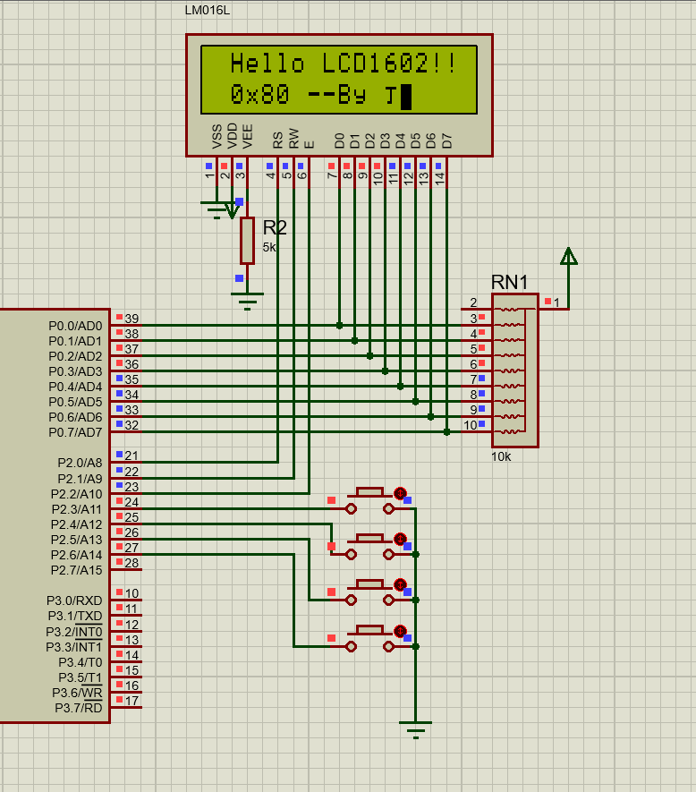

## 矩阵按键驱动编写

> （支持多个按键同时按下）


`MatrixBtns.h`

```c
#ifndef _MatrixBtns_H_
#define _MatrixBtns_H_
#include "REG51.H"
#include "utils.h"
// 端口定义 1~4bit连接列，5~8bit连接行
//     1 2 3 4
// 5 | x x x x |
// 6 | x x x x |
// 7 | x x x x |
// 8 | x x x x |
#define MB_DATA P3
uint8_t MatrixKeyCodeScanf(); // 获取按键代码
uint8_t MatrixCharScanf();    // 获取按下的字符
#endif
```

`MatrixBtns.c`

```c

#include "MatrixBtns.h"
uint8_t KeyRowScanf()
{
    static uint8_t KeyRowUp = 1;
    MB_DATA                 = 0xf0; // 发送行扫描
    if (MB_DATA == 0xf0) {          // 说明没有按键被按下
        KeyRowUp = 1;
    } else if (KeyRowUp) /*保证下降沿触发*/ {
        delay_ms(5);           // 执行到这里必然是有按键被按下，先去除抖动
        if (~MB_DATA & 0xf0) { // 被按下的列为低电平，取反就能找到被按下的列
            KeyRowUp = 0;
            return ~MB_DATA & 0xf0;
            // 如果第一行被按下则返回结果为 0001 0000
            // 如果第二行被按下则返回结果为 0010 0000
            // 如果第一行和第二行被同时按下 0011 0000
        }
    }
    return 0;
}

uint8_t KeyColScanf()
{
    static uint8_t KeyColUp = 1;
    MB_DATA                 = 0x0f;
    if (MB_DATA == 0x0f) {
        KeyColUp = 1;
    } else if (KeyColUp) {
        delay_ms(5);
        if (~MB_DATA & 0x0f) {
            KeyColUp = 0;
            return ~MB_DATA & 0x0f;
            // 如果第一列被按下则返回结果为 0000 0001
            // 如果第二列被按下则返回结果为 0000 0010
            // 如果第一列和第二列被同时按下 0000 0011
        }
    }
    return 0;
}

uint8_t MatrixKeyCodeScanf()
{
    uint8_t row = KeyRowScanf();
    uint8_t col = KeyColScanf();
    // 行和列都不为0
    if (row && col) return row | col;
    else return 0x00;
}
uint8_t MatrixCharScanf()
{
    uint8_t keyCode = MatrixKeyCodeScanf();
    switch (keyCode) {
        case 0x11 :return '1';
        case 0x12 :return '2';
        case 0x14 :return '3';
        case 0x18 :return '4';
        case 0x21 :return '5';
        case 0x22 :return '6';
        case 0x24 :return '7';
        case 0x28 :return '8';
        case 0x41 :return '9';
        case 0x42 :return '0';
        case 0x44 :return '+';
        case 0x48 :return '-';
        case 0x81 :return '*';
        case 0x82 :return '/';
        case 0x84 :return '=';
        case 0x88 :return '\x08';// ascii 退格
        default: return -1;
    }
}
```

### 使用测试

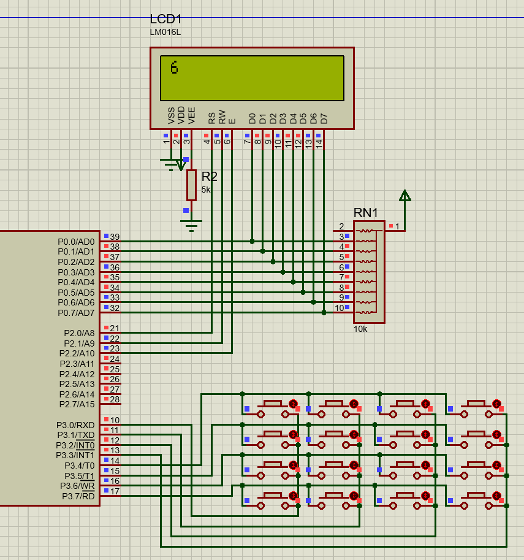

```c
#include "REG51.H"
#include "utils.h"
#include "lcd1602.h"
#include "MatrixBtns.h"

void main()
{
    LCD_Init();
    while (1) {
        uint8_t ch =  MatrixCharScanf();
        if(ch!=-1){
            LCD_Cusor_GoToXY(0,0);
            LCD_PutChar(ch);
        }
    }
}

```

## `定时器/计数器`电路工作原理


## 中断系统工作原理


