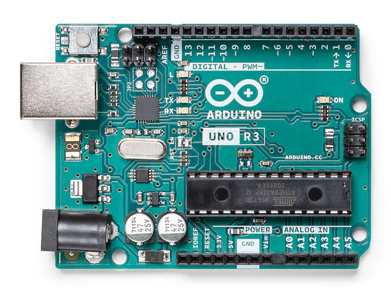

## Arduino Uno

> <https://store.arduino.cc/products/arduino-uno-rev3>

- Arduino Uno是一款基于 ATmega328P（[数据表](http://ww1.microchip.com/downloads/en/DeviceDoc/Atmel-7810-Automotive-Microcontrollers-ATmega328P_Datasheet.pdf)）的微控制器板。
- 它有
  - 14 个数字输入/输出引脚（其中 6 个可用作 PWM 输出）、
  - 6 个模拟输入、
  - 1 个 16 MHz 陶瓷谐振器（CSTCE16M0V53-R0）、
  - 1 个 USB 连接、
  - 1 个电源插孔、
  - 1 个 ICSP 接头和一个重置按钮。
- 它包含支持微控制器所需的一切；

**Uno**

- Uno 在意大利语中意为“一”，被选为 Arduino 软件 (IDE) 1.0 的标志。
- Uno 开发板和 Arduino 软件 (IDE) 1.0 版是 Arduino 的**参考版本**，现已发展到更新的版本。
- Uno 开发板是 USB Arduino 系列开发板中的**第一款**，也是 Arduino 平台的**参考模型**；

## 技术规格

| 指标               | 值                                                 |
| :----------------- | :------------------------------------------------- |
| 微控制器           | ATmega328P                                         |
| 工作电压           | 5伏                                                |
| 输入电压（推荐）   | 7-12伏                                             |
| 输入电压（限制）   | 6-20伏                                             |
| 数字 I/O 引脚      | 14个（其中6个提供PWM输出）                         |
| PWM 数字 I/O 引脚  | 6                                                  |
| 模拟输入引脚       | 6                                                  |
| I/O 引脚的直流电流 | 20 毫安                                            |
| 3.3V 引脚直流电流  | 50 毫安                                            |
| 闪存               | 32 KB (ATmega328P)，其中 0.5 KB 由引导加载程序使用 |
| 静态存储器         | 2KB（ATmega328P）                                  |
| 电可擦除只读存储器 | 1KB（ATmega328P）                                  |
| 时钟速度           | 16 MHz                                             |
| 内置LED            | 13号引脚                                           |
| 长度               | 68.6 毫米                                          |
| 宽度               | 53.4 毫米                                          |
| 重量               | 25 克                                              |

## 引脚分布图

## 供电

Arduino Uno 开发板的两种供电方式。

- （图中橘色）USB连接供电(5V)
- 外部电源供电 6~20V
  - （图中红色）通过 DC电源插孔供电 (7 - 12V)
  - （图中绿色）通过 Vin引脚供电 (7 - 12V)
- 电源会自动选择
- 

**外部电源供电**

- 建议范围为 7 至 12 伏。
- 供电电压低于 7V，5V 引脚可能供电电压低于 5 伏，板可能会变得不稳定。
- 供电电压高于 12V，稳压器可能会过热并损坏板。

电源引脚如下：

- Vin
  - 当使用外部电源时，Arduino 开发板的输入电压。
  - **可以通过此引脚提供电压**，或者，如果通过DC电源插孔提供电压，然后**通过此引脚获取供电电压**。
  - 无法通过此引脚获取到 **5伏USB供电** 或 **电路板稳压器的 5V 供电**
- 5V
  - 此引脚输出来自电路板稳压器的 5V 电压。
  - 通过 5V 或 3.3V 引脚供电会绕过稳压器，并可能损坏电路板。
- 3V3
  - 板载稳压器产生的 3.3 伏电源。
  - 最大电流为 50 mA。
- GND.接地引脚。
- IOREF
  - Arduino 板上的这个引脚提供微控制器运行所需的电压参考。
  - 正确配置的屏蔽可以读取 IOREF 引脚电压并选择适当的电源或启用输出上的电压转换器以使用 5V 或 3.3V。
  - 通过电路图可知该引脚和5V电压直连
  - 该引脚的作用在于提供一个参考电压给扩展板（shield）使其了解Arduino板的IO逻辑电平。

## 存储

- ATmega328 有 32 KB Flash 程序存储器（其中 0.5 KB 由引导加载程序占用）。
- 它还具有 2 KB 的 SRAM 和 1 KB 的 EEPROM（可以使用 EEPROM 库进行读写）。

## 输入输出

### 数字输入输出

- Uno 上的 14 个数字引脚中的每一个都可以用作输入或输出，使用 `pinMode()`、`digitalWrite()` 和 `digitalRead()` 函数。
- 它们以 5 伏特工作。
- 每个引脚可以提供或接收 20 mA 作为推荐工作条件，并且具有 20-50k 欧姆的内部上拉电阻（默认情况下断开）。
- 任何 I/O 引脚的最大电流不得超过 40mA，以免对微控制器造成永久性损坏。

此外，一些引脚具有专门的功能：

- **串行：**
  - 0 (RX) 和 1 (TX)。
  - 用于接收 (RX) 和发送 (TX) TTL 串行数据。
  - 这些引脚连接到 ATmega8U2 USB-to-TTL 串行芯片的相应引脚。
- **外部中断：**
  - 2 和 3。
  - 这些引脚可配置为在`低值`、`上升沿`或`下降沿`或`值发生变化`时**触发中断**。
  - 有关详细信息，请参阅 `attachInterrupt()` 函数。
- **PWM：**
  - 3、5、6、9、10、11。
  - 使用 `analogWrite()` 函数提供 8 位 PWM 输出。
- **SPI：**
  - 10 (SS)、11 (MOSI)、12 (MISO)、13 (SCK)。
  - 这些引脚支持使用 SPI 库进行 SPI 通信。
- **LED：**
  - 13
  - 有一个内置 LED 由数字引脚 13 驱动。
  - 当引脚为高电平值时，LED 亮，当引脚为低电平值时，LED 熄灭。
- **TWI(I2C)：**
  - A4 或 SDA 引脚和 A5 或 SCL 引脚。
  - 使用 Wire 库支持 TWI 通信。

### 模拟输入输出

- Uno 有 6 个模拟输入，
- 标记为 A0 至 A5，每个输入提供 10 位分辨率（即 1024 个不同的值）。
- 默认情况下，它们测量从地到 5 伏的电压，但可以使用 `AREF` 引脚和 `analogReference()` 函数更改其范围的上限。

板上还有其他几个引脚：

- `AREF`。模拟输入的参考电压。与 `analogReference()` 一起使用。
- Reset。将此线拉低以重置微控制器。通常用于在屏蔽板上的重置按钮中添加重置按钮。

## 通信

Arduino Uno 具有多种与计算机、另一个 Arduino 开发板或其他微控制器通信的功能。

**硬件串口通信**

- **ATmega328主控芯片的串口通信能力**
  - ATmega328 提供 UART TTL (5V) 串行通信，可通过数字引脚 0 (RX) 和 1 (TX) 进行连接。
- **USB转串行芯片ATmega16U2**
  - 开发板上的 ATmega16U2 通过 USB 传输此串行通信，并作为虚拟 com 端口出现在计算机上的软件中。
  - 16U2 固件使用标准 USB COM 驱动程序，无需外部驱动程序。
- Arduino 软件 (IDE) 包含一个串行监视器，允许向开发板发送和从开发板接收简单的文本数据。
- 当数据通过 USB 转串行芯片和 USB 连接传输到计算机时，开发板上的 RX 和 TX LED 将闪烁（但引脚 0 和 1 上的串行通信除外）。

**软件串口通信**

- [SoftwareSerial库](https://www.arduino.cc/en/Reference/SoftwareSerial) 允许在 Uno 的任何数字引脚上进行串行通信。

**I2C通信能力**

- ATmega328 还支持 I2C (TWI) 和 SPI 通信。
- Arduino 软件 (IDE) 包含一个 Wire 库，可简化 I2C 总线的使用；

**SPI通信**

- 对于 SPI 通信，请使用 [SPI 库](https://www.arduino.cc/en/Reference/SPI)。
