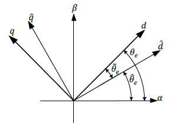
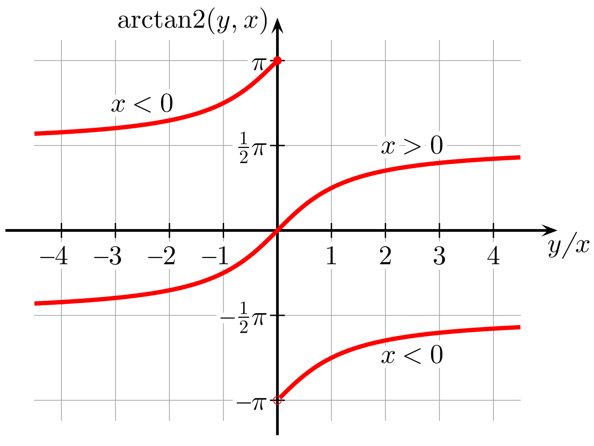

## 高频方波注入提取位置公式推导

- **作用**
  - 可以在电机d轴（或估计的d轴）注入高频方波，
  - 然后通过提取电流响应信号，
  - 来估算电机转子的角度。
- **方法**
  - 把pwm信号的两个周期作为高频方波信号的周期
  - 往电机的D轴注入电压信号
  - 在方波的上半个周期注入正电压，
  - 在方波的下半个周期注入负电压。

**dq轴电压、电流方程**

$$
\begin{align*}
U_d &= RI_d + L_d \frac{d}{dt}I_d - \omega_e L_q I_q \\
U_q &= RI_q + L_q \frac{d}{dt}I_q - \omega_e L_d I_d + \omega_e \psi_f \\
\end{align*}
$$

**简化模型**

- 当注入高频电压时，感抗电压远远大于电阻和磁链的压降，
- 所以电阻和磁链上的电压响应可以忽略不计

$$
U_d =  L_d \frac{d}{dt}I_d  \\
U_q =  L_q \frac{d}{dt}I_q  \\
$$

**写成矩阵形式**

$$
    \begin{bmatrix}
        U_d \\
        U_q \\
    \end{bmatrix}
=
    \begin{bmatrix}
        L_d \frac{d}{dt} & 0\\
        0 & L_q \frac{d}{dt} \\
    \end{bmatrix}
    \begin{bmatrix}
        I_d \\
        I_q \\
    \end{bmatrix}
$$

**写成电流方程**

$$
    \begin{bmatrix}
        I_d \\
        I_q \\
    \end{bmatrix}
=
    \begin{bmatrix}
        L_d \frac{d}{dt} & 0\\
        0 & L_q \frac{d}{dt} \\
    \end{bmatrix}^{-1}
    \begin{bmatrix}
        U_d \\
        U_q \\
    \end{bmatrix}
$$

**旋转到α-β轴（帕克逆变换）**

$$
    \begin{bmatrix}
        I_\alpha \\
        I_\beta \\
    \end{bmatrix}
=
\begin{bmatrix}
    \cos{θ} & \sin{θ} \\
    -\sin{θ} & \cos{θ}
\end{bmatrix}^{-1}
\begin{bmatrix}
    L_d \frac{d}{dt} & 0\\
    0 & L_q \frac{d}{dt} \\
\end{bmatrix}^{-1}
\begin{bmatrix}
    U_d \\
    U_q \\
\end{bmatrix}
$$

**用`估计d-q坐标轴`电压，表示`真实d-q坐标轴`电压** 

- $\hat{d}$ 是估计的d轴
- $θ_e$ 是d轴的实际位置
- $\hat{θ_e}$是d轴的估计位置
- $\tilde{θ_e}=θ_e-\hat{θ_e}$ 是d轴实际位置和估计位置的误差
- 

通过帕克变换，就能使用角度误差 $\tilde{θ_e}$ 和 `估计的d-q轴` 来表示 `真实的d-q轴`。

$$
    \begin{bmatrix}
        U_d \\
        U_q \\
    \end{bmatrix}
=
\begin{bmatrix}
    \cos{\tilde{θ_e}} & \sin{\tilde{θ_e}} \\
    -\sin{\tilde{θ_e}} & \cos{\tilde{θ_e}}
\end{bmatrix}
    \begin{bmatrix}
        \hat{U_d} \\
        \hat{U_q} \\
    \end{bmatrix}
$$

代入之前推导出的关系式，  
就能得到 ==`估计d-q轴高频电压激励` 和 `真实α-β轴的高频电流响应` 的关系式== 。

$$
    \begin{bmatrix}
        I_\alpha \\
        I_\beta \\
    \end{bmatrix}
=
\begin{bmatrix}
    \cos{θ} & \sin{θ} \\
    -\sin{θ} & \cos{θ}
\end{bmatrix}^{-1}
\begin{bmatrix}
    L_d \frac{d}{dt} & 0\\
    0 & L_q \frac{d}{dt} \\
\end{bmatrix}^{-1}
\begin{bmatrix}
    \cos{\tilde{θ_e}} & \sin{\tilde{θ_e}} \\
    -\sin{\tilde{θ_e}} & \cos{\tilde{θ_e}}
\end{bmatrix}
    \begin{bmatrix}
        \hat{U_d} \\
        \hat{U_q} \\
    \end{bmatrix}
$$

**化简：计算逆矩阵**

- 旋转矩阵的逆就是其转置矩阵
- 对角矩阵的逆就是把对角元素取倒数

$$
    \begin{bmatrix}
        I_\alpha \\
        I_\beta \\
    \end{bmatrix}
=
\begin{bmatrix}
  \cos{\theta} & -\sin{\theta} \\
  \sin{\theta} & \cos{\theta}
\end{bmatrix}
    \begin{bmatrix}
        \frac{1}{L_d \frac{d}{dt}} & 0\\
        0 & \frac{1}{L_q \frac{d}{dt}} \\
    \end{bmatrix}
\begin{bmatrix}
    \cos{\tilde{θ_e}} & \sin{\tilde{θ_e}} \\
    -\sin{\tilde{θ_e}} & \cos{\tilde{θ_e}}
\end{bmatrix}
\begin{bmatrix}
    \hat{U_d} \\
    \hat{U_q} \\
\end{bmatrix}
$$

**化简：计算矩阵乘法**

$$
\begin{bmatrix}
    I_\alpha \\
    I_\beta \\
\end{bmatrix}
=
\begin{bmatrix}
    \frac{\cos{\theta}}{L_d \frac{d}{dt}} & \frac{-\sin{\theta}}{L_q \frac{d}{dt}}\\
    \frac{\sin{\theta}}{L_d \frac{d}{dt}} & \frac{\cos{\theta}}{L_q \frac{d}{dt}}\\
\end{bmatrix}
\begin{bmatrix}
    \cos{\tilde{θ_e}} & \sin{\tilde{θ_e}} \\
    -\sin{\tilde{θ_e}} & \cos{\tilde{θ_e}}
\end{bmatrix}
\begin{bmatrix}
    \hat{U_d} \\
    \hat{U_q} \\
\end{bmatrix}
$$

**化简：假设估计的dq轴位置就是实际dq轴的位置**

- 由于估计的dq轴和实际dq轴的误差角度在迭代多次后逐渐逼近0，
- 这将导致旋转矩阵变成单位矩阵
- 也就是假设估计的dq轴位置就是实际dq轴的位置。

$$
\begin{align*}
    \begin{bmatrix}
        I_\alpha \\
        I_\beta \\
    \end{bmatrix}
    &=
    \begin{bmatrix}
        \frac{\cos{\theta}}{L_d \frac{d}{dt}} & \frac{-\sin{\theta}}{L_q \frac{d}{dt}}\\
        \frac{\sin{\theta}}{L_d \frac{d}{dt}} & \frac{\cos{\theta}}{L_q \frac{d}{dt}}\\
    \end{bmatrix}
    \begin{bmatrix}
        \cos{\tilde{θ_e}} & \sin{\tilde{θ_e}} \\
        -\sin{\tilde{θ_e}} & \cos{\tilde{θ_e}}
    \end{bmatrix}
    \begin{bmatrix}
        \hat{U_d} \\
        \hat{U_q} \\
    \end{bmatrix} \\

    &=
    \begin{bmatrix}
        \frac{\cos{\theta}}{L_d \frac{d}{dt}} & \frac{-\sin{\theta}}{L_q \frac{d}{dt}}\\
        \frac{\sin{\theta}}{L_d \frac{d}{dt}} & \frac{\cos{\theta}}{L_q \frac{d}{dt}}\\
    \end{bmatrix}
    \begin{bmatrix}
        1 & 0\\
        0 & 1
    \end{bmatrix}
    \begin{bmatrix}
        \hat{U_d} \\
        \hat{U_q} \\
    \end{bmatrix} \\

    &=
    \begin{bmatrix}
        \frac{\cos{\theta}}{L_d \frac{d}{dt}} & \frac{-\sin{\theta}}{L_q \frac{d}{dt}}\\
        \frac{\sin{\theta}}{L_d \frac{d}{dt}} & \frac{\cos{\theta}}{L_q \frac{d}{dt}}\\
    \end{bmatrix}
    \begin{bmatrix}
        \hat{U_d} \\
        \hat{U_q} \\
    \end{bmatrix}
\end{align*}
$$

**化简：注入q轴的电压为0**

- 由于我们通常只在`估计的d-q轴`的d轴注入高频电压，
- 所以注入q轴的电压为0，

$$
\begin{align*}
    \begin{bmatrix}
        I_\alpha \\
        I_\beta \\
    \end{bmatrix}
    &=
    \begin{bmatrix}
        \frac{\cos{\theta}}{L_d \frac{d}{dt}} & \frac{-\sin{\theta}}{L_q \frac{d}{dt}}\\
        \frac{\sin{\theta}}{L_d \frac{d}{dt}} & \frac{\cos{\theta}}{L_q \frac{d}{dt}}\\
    \end{bmatrix}
    \begin{bmatrix}
        \hat{U_d} \\
        0 \\
    \end{bmatrix}\\
    &=
    \begin{bmatrix}
        \frac{\cos{\theta}}{L_d \frac{d}{dt}}\\
        \frac{\sin{\theta}}{L_d \frac{d}{dt}}\\
    \end{bmatrix}
    \hat{U_d}\\
    &=
    \frac{\hat{U_d}}{L_d \frac{d}{dt}}
    \begin{bmatrix}
        \cos{\theta}\\
        \sin{\theta}\\
    \end{bmatrix}
\end{align*}
$$

**求出角度**

$$
\begin{align*}
\tan\theta &= \frac{\sin\theta}{\cos\theta} = \frac{I_\beta}{I_\alpha} \\
\theta &=  \arctan(\frac{I_\beta}{I_\alpha})
\end{align*}
$$

**改为使用`atan2(a,b)`计算角度**

$$
\theta = \text{atan2}(I_\beta,I_\alpha)
$$

- 因为$\tan(\frac{a}{b})$只能计算出$[-\frac{\pi}{2},\frac{\pi}{2}]$范围的角度,并且无法处理分母为0的情况。  
  - 
- 所以这里需要使用 $\text{atan2}(a,b)$ 其可以计算出 $(-\pi,\pi]$ 范围的角度。
  - 

## 参考

> 无感FOC之高频注入法——永磁同步电机控制 <https://aijishu.com/a/1060000000315769>