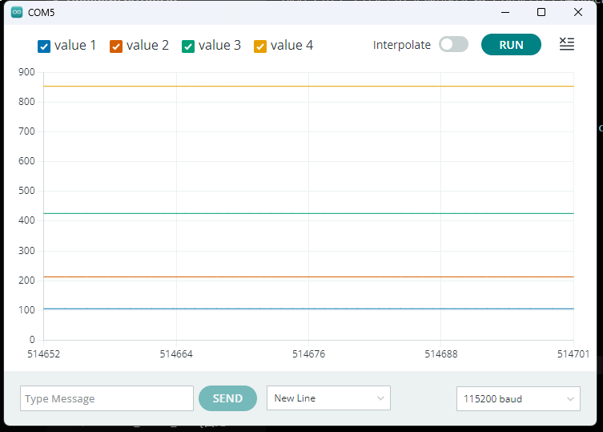

## 04.实现Timer获取调用间隔dt时间

### 具体实现

:::code-tabs
@tab `Timer.cpp`
@[code cpp](./projects/04.timer/Timer.cpp)

@tab `Timer.hpp`
@[code cpp](./projects/04.timer/Timer.hpp)
:::

### 实现效果

`04.timer.ino`

@[code cpp](./projects/04.timer/04.timer.ino)