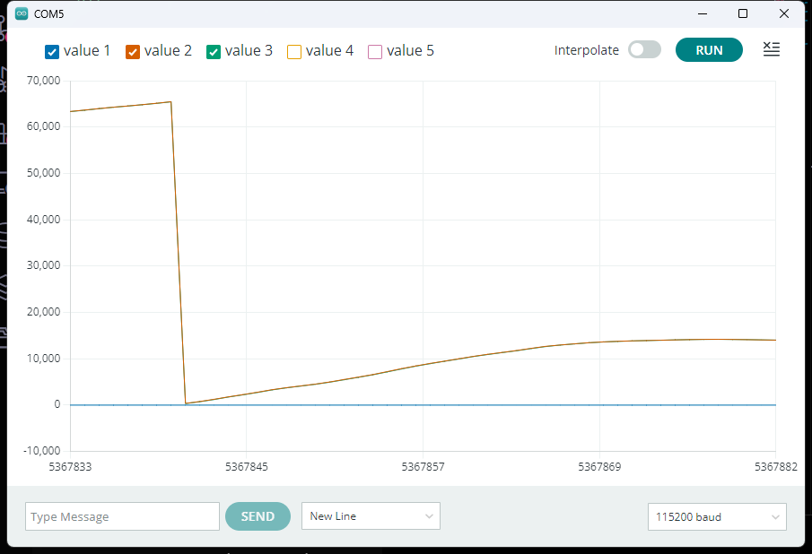
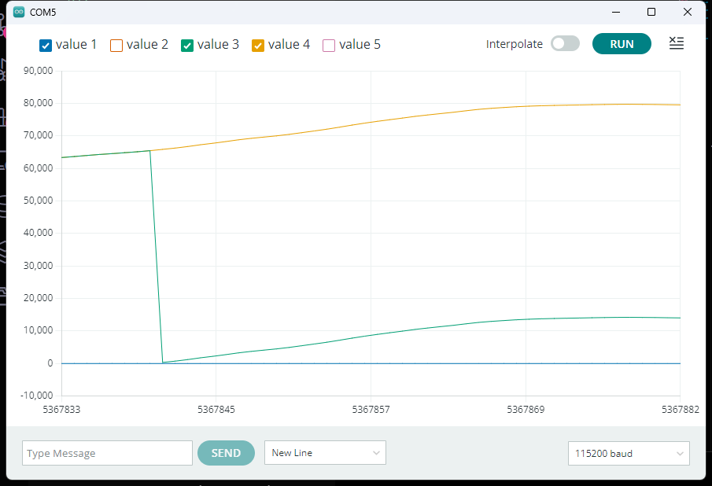

## 05.实现Sensor获取转子位置、速度

### 具体实现

:::code-tabs
@tab `Sensor.cpp`
@[code cpp](./projects/05.sensor/Sensor.cpp)

@tab `Sensor.hpp`
@[code cpp](./projects/05.sensor/Sensor.hpp)
:::

### 实现效果

**位置（不带圈数）**

**位置（带圈数）**

**速度（rad/ms）**

`05.sensor.ino`
@[code cpp](./projects/05.sensor/05.sensor.ino)