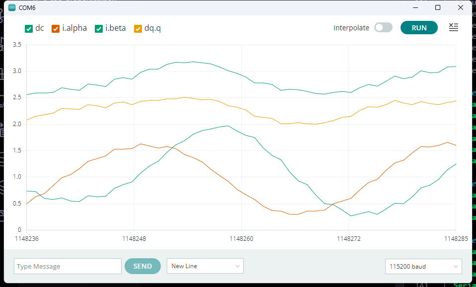
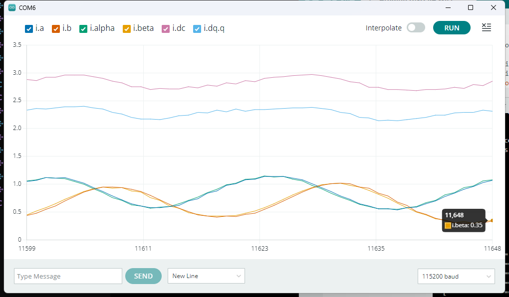

## 08.实现CurrentSensor获取电流

### 具体实现

:::code-tabs
@tab `CurrentSensor.cpp`
@[code cpp](./projects/08.current_sensor/CurrentSensor.cpp)

@tab `CurrentSensor.hpp`
@[code cpp](./projects/08.current_sensor/CurrentSensor.hpp)
:::

### 实现效果

@[code cpp](./projects/08.current_sensor/08.current_sensor.ino)