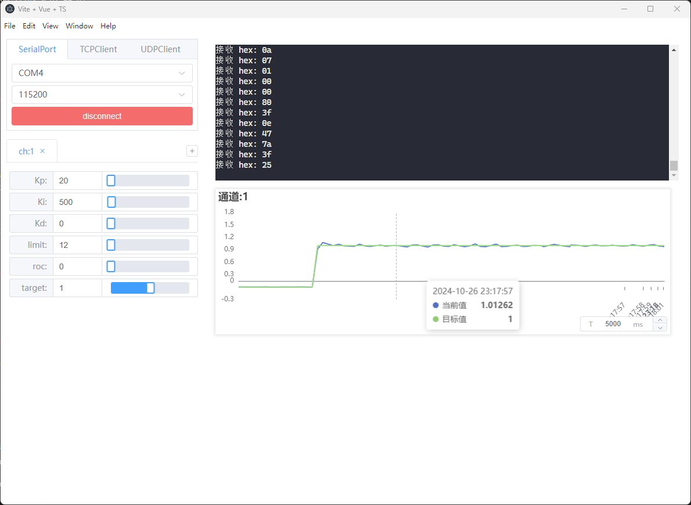
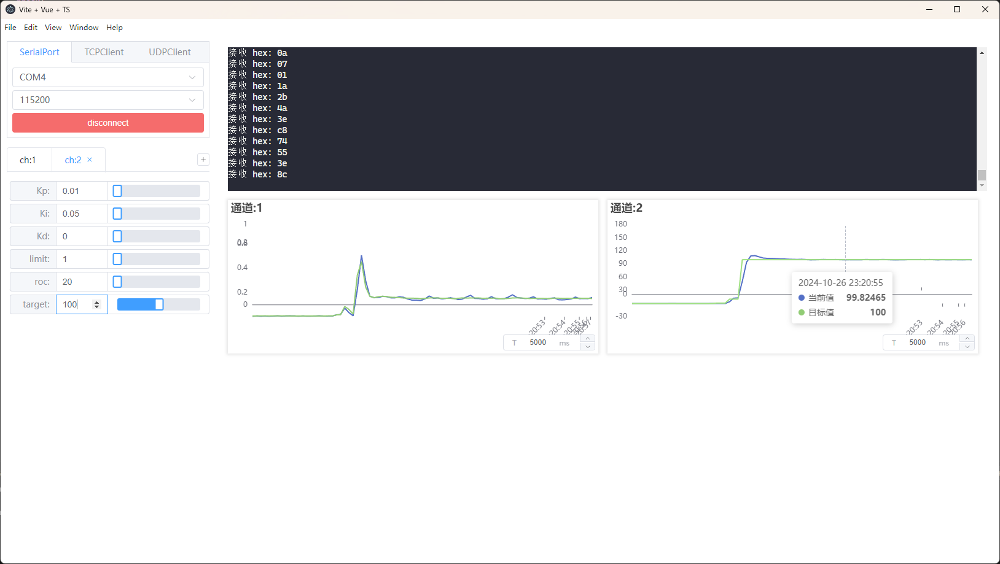

## 10.实现close_loop_velocity_control闭环速度控制

### 具体实现

:::code-tabs
@tab `BLDCMotor.cpp`
@[code cpp](./projects/10.close_loop_velocity_control/BLDCMotor.cpp)

@tab `BLDCMotor.hpp`
@[code cpp](./projects/10.close_loop_velocity_control/BLDCMotor.hpp)

:::

### 实现效果

**电流闭环控制效果**

**速度闭环控制效果**

**代码**

@[code cpp](./projects/10.close_loop_velocity_control/10.close_loop_velocity_control.ino)