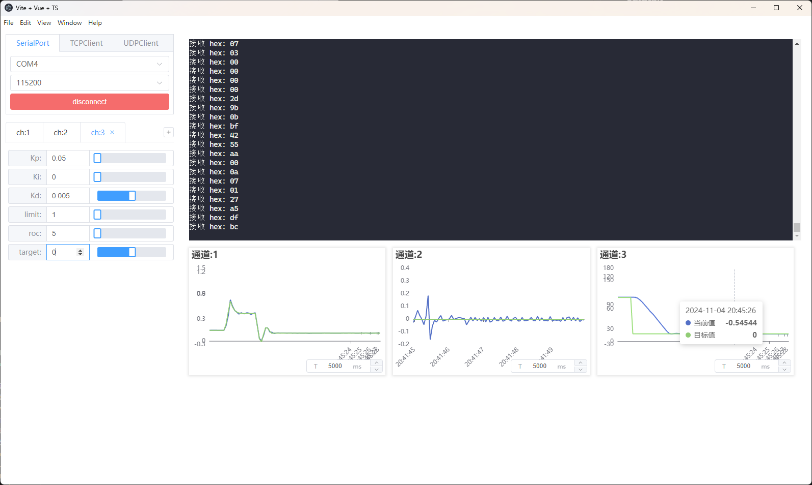

## 11.实现close_loop_position_control闭环位置控制

### 具体实现

:::code-tabs
@tab `BLDCMotor.cpp`
@[code cpp](./projects/11.close_loop_position_control/BLDCMotor.cpp)

@tab `BLDCMotor.hpp`
@[code cpp](./projects/11.close_loop_position_control/BLDCMotor.hpp)

:::

### 实现效果

**位置闭环控制效果**

**代码**

@[code cpp](./projects/10.close_loop_velocity_control/10.close_loop_velocity_control.ino)