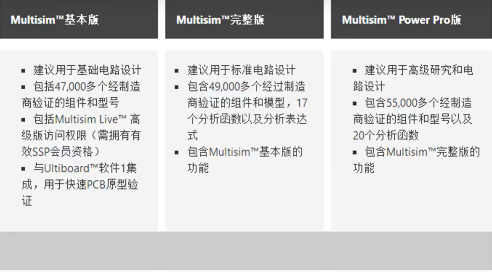
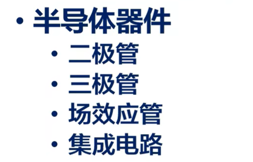
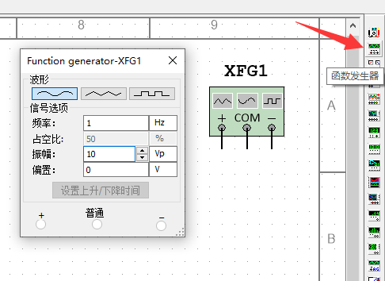
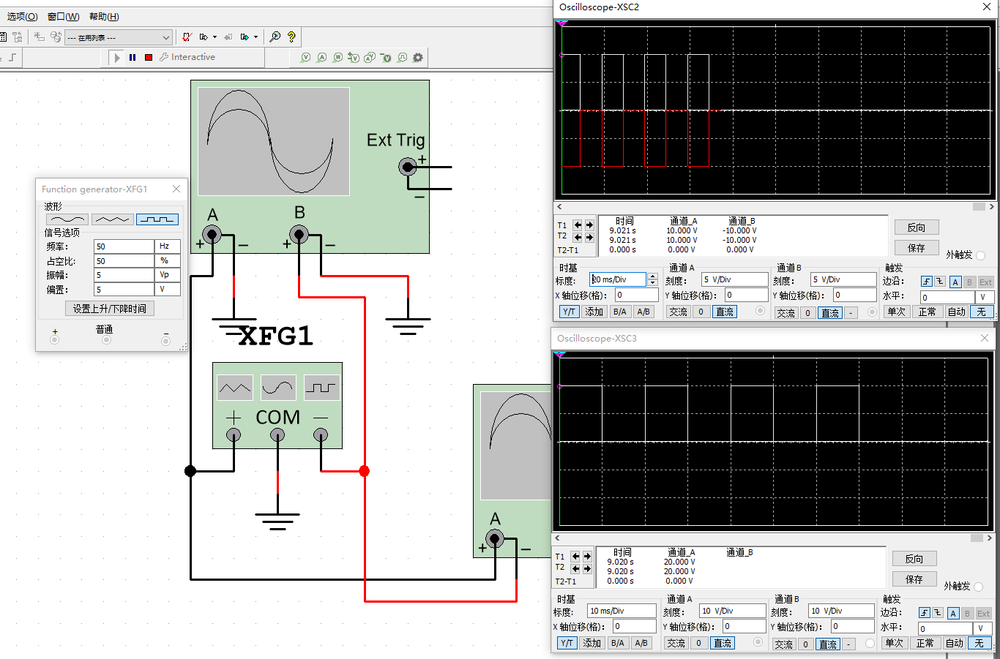

# Multisim笔记

## 目录

- [Multisim笔记](#multisim笔记)
  - [目录](#目录)
  - [版本差异](#版本差异)
  - [快捷键](#快捷键)
  - [搜素元器件](#搜素元器件)
  - [在Multisim中找到常用国产元器件](#在multisim中找到常用国产元器件)
    - [半导体器件命名规则](#半导体器件命名规则)
      - [国产半导体命名规范](#国产半导体命名规范)
      - [日产半导体命名规范](#日产半导体命名规范)
      - [韩国半导体命名规范](#韩国半导体命名规范)
      - [美国半导体命名规范](#美国半导体命名规范)
  - [万用表（multimeter）](#万用表multimeter)
  - [函数信号发生器(function generator)](#函数信号发生器function-generator)
  - [示波器（Oscilloscope）](#示波器oscilloscope)
  - [功率表（wattmeter）](#功率表wattmeter)

## 版本差异

> 版本差异只要体现在库中元器件的数量，常用三段稳压器lm317在学生版中没有，在工业加强版中有

**版本别名**

- 基本版就是学生版
- 完整版就是全功能版
- PowerPro就是工业加强版

## 快捷键

- 旋转：选中元件+ctrl+r
- 垂直翻转：选中元件+alt+x

## 搜素元器件
>
> 可以使用通配符*
>

## 在Multisim中找到常用国产元器件

> Multisim的元件库中主要是日本和欧美的元器件厂商的元器件，没有国产的和韩国的

> - (教材中的)国产二极管2ap9 性能近似 (Multisim中的)1n4001G
> - (教材中的)国产三极管9013或 3dg6 性能近似 (Multisim中的)2n2222a
> - (教材中的)国产运放f007性能近似 (Multisim中的)741
> - (教材中的)国产CF324 性能近似 (Multisim中的)LM324

### 半导体器件命名规则

#### 国产半导体命名规范

国产二极管命名规范

国产三极管命名规范

国产场效管命名规范

#### 日产半导体命名规范

#### 韩国半导体命名规范

#### 美国半导体命名规范

## 万用表（multimeter）

> 不能带电测量电阻  

> 直流档测交流时，显示值为有效值

dB分贝测量(毫瓦功率耗散测量)（0dB=1mW）
> 774.597mV（rms有效值）交流电流过600欧姆负载为1mW为0dB  
> 
> 

## 函数信号发生器(function generator)

 

- Vp 是峰值电压。峰值电压(peak voltage): 电压从零电压到最高点的电压称为峰值电压，也就是最大电压。
- offset偏置可以认为是叠加一个直流信号

>

## 示波器（Oscilloscope）

## 功率表（wattmeter）

