# STM32及标准库学习笔记


## 目录

- [STM32及标准库学习笔记](#stm32及标准库学习笔记)
  - [目录](#目录)
  - [F103C8T6简介](#f103c8t6简介)
  - [F1X片上资源](#f1x片上资源)
  - [系统结构](#系统结构)
  - [引脚定义](#引脚定义)
  - [启动配置](#启动配置)
  - [工程架构](#工程架构)
  - [Hello\_World](#hello_world)
  - [标准外设库](#标准外设库)
  - [RCC](#rcc)
    - [基本介绍](#基本介绍)
    - [RCC时钟树](#rcc时钟树)
    - [标准库函数](#标准库函数)
  - [GPIO](#gpio)
    - [基本介绍](#基本介绍-1)
    - [案例代码：点灯](#案例代码点灯)
  - [中断与NVIC](#中断与nvic)
    - [基本介绍](#基本介绍-2)
    - [STM32的中断](#stm32的中断)
    - [EXTI外部中断](#exti外部中断)
    - [案例代码：光电计数器触发外部中断](#案例代码光电计数器触发外部中断)
  - [TIM定时器](#tim定时器)
    - [概念](#概念)
    - [基本定时器](#基本定时器)
    - [通用定时器](#通用定时器)
    - [高级定时器](#高级定时器)
    - [时基单元](#时基单元)
    - [输出比较](#输出比较)
    - [输入比较](#输入比较)
    - [案例：定时中断](#案例定时中断)
      - [案例：利用内部时钟源实现`setInterval(callback,ms)`](#案例利用内部时钟源实现setintervalcallbackms)
      - [案例：利用外部时钟源实现`setInterval(callback,times)`](#案例利用外部时钟源实现setintervalcallbacktimes)
    - [案例：LED呼吸灯](#案例led呼吸灯)
    - [案例：舵机驱动](#案例舵机驱动)
        - [直流电机与驱动电路](#直流电机与驱动电路)
    - [案例：定时器输出捕获——测量方波](#案例定时器输出捕获测量方波)
    - [编码器接口](#编码器接口)
    - [编码器测位置、测速案例](#编码器测位置测速案例)
  - [ADC模拟/数字转化器](#adc模拟数字转化器)
    - [ADC概念](#adc概念)
    - [ADC原理](#adc原理)
    - [STM32\_ADC原理](#stm32_adc原理)
    - [ADC的标准库函数](#adc的标准库函数)
    - [ADC案例](#adc案例)
  - [DMA](#dma)
    - [DMA简介](#dma简介)
    - [DMA原理](#dma原理)
    - [DMA案例](#dma案例)
  - [USART串口通信](#usart串口通信)
    - [通信](#通信)
    - [串口通信简介](#串口通信简介)
    - [USART外设](#usart外设)
    - [USART标准库函数](#usart标准库函数)
    - [案例：串口收发数据；实现printf](#案例串口收发数据实现printf)
    - [案例：串口中断接收处理数据](#案例串口中断接收处理数据)
    - [案例：实现简易通信协议](#案例实现简易通信协议)
  - [I2C通信软件实现](#i2c通信软件实现)
    - [简介](#简介)
    - [硬件规定](#硬件规定)
    - [时序规定](#时序规定)
    - [I2C通信时序](#i2c通信时序)
    - [I2C通信软件实现](#i2c通信软件实现-1)
  - [I2C通信硬件实现](#i2c通信硬件实现)
    - [简介](#简介-1)
    - [功能框图](#功能框图)
    - [功能简图](#功能简图)
    - [收发时序](#收发时序)
    - [案例代码](#案例代码)
  - [MPU6050](#mpu6050)
    - [简介](#简介-2)
    - [可配置参数](#可配置参数)
    - [芯片框图](#芯片框图)
    - [芯片电器特性](#芯片电器特性)
    - [时钟源的选择](#时钟源的选择)
    - [主要寄存器](#主要寄存器)
    - [主要寄存器详细说明](#主要寄存器详细说明)
    - [基于软件I2C实现MPU6050驱动](#基于软件i2c实现mpu6050驱动)
    - [基于硬件I2C实现MPU6050驱动](#基于硬件i2c实现mpu6050驱动)
  - [SPI通信软件实现](#spi通信软件实现)
    - [简介](#简介-3)
    - [硬件电路](#硬件电路)
    - [移位发送过程](#移位发送过程)
    - [SPI基本通信时序](#spi基本通信时序)
      - [起始条件](#起始条件)
      - [终止条件](#终止条件)
      - [交换字节(模式0)](#交换字节模式0)
      - [交换字节(模式1)](#交换字节模式1)
      - [交换字节(模式2)](#交换字节模式2)
      - [交换字节(模式3)](#交换字节模式3)
    - [SPI通信指令](#spi通信指令)
      - [发送指令](#发送指令)
      - [指定地址写](#指定地址写)
      - [指定地址写](#指定地址写-1)
    - [SPI软件模拟实现](#spi软件模拟实现)
  - [SPI通信硬件实现](#spi通信硬件实现)
    - [简介](#简介-4)
    - [原理框图](#原理框图)
    - [原理简图](#原理简图)
    - [连续传输发送](#连续传输发送)
    - [非连续传输发送](#非连续传输发送)
    - [SPI硬件外设实现](#spi硬件外设实现)
  - [W25Q64存储器](#w25q64存储器)
    - [芯片引脚功能定义](#芯片引脚功能定义)
    - [芯片内部框图](#芯片内部框图)
    - [注意事项](#注意事项)
    - [指令集](#指令集)
    - [基于软件SPI实现](#基于软件spi实现)
    - [基于硬件SPI实现](#基于硬件spi实现)
  - [BKP](#bkp)
    - [注意事项](#注意事项-1)
    - [BKP标准库函数介绍](#bkp标准库函数介绍)
    - [读写BKP](#读写bkp)
    - [原理简图](#原理简图-1)
  - [RTC](#rtc)
    - [原理框图](#原理框图-1)
    - [原理简图](#原理简图-2)
    - [注意事项](#注意事项-2)
    - [标准库函数](#标准库函数-1)
    - [获取RTC毫秒级别时间](#获取rtc毫秒级别时间)
  - [PWR](#pwr)
    - [供电方案框图](#供电方案框图)
    - [上电复位、掉电复位](#上电复位掉电复位)
    - [电压过低检测](#电压过低检测)
    - [三种低功耗模式](#三种低功耗模式)
    - [三种低功耗模式的执行细节](#三种低功耗模式的执行细节)
    - [降低主频](#降低主频)
    - [浅睡眠模式——串口唤醒](#浅睡眠模式串口唤醒)
    - [深度睡眠模式——停机模式——外部中断唤醒](#深度睡眠模式停机模式外部中断唤醒)
    - [深度睡眠模式——待机模式——rtc闹钟唤醒——wakeup唤醒](#深度睡眠模式待机模式rtc闹钟唤醒wakeup唤醒)
  - [WDG看门狗](#wdg看门狗)
    - [原理框图](#原理框图-2)
    - [独立看门狗键寄存器](#独立看门狗键寄存器)
    - [独立看门狗超时时间](#独立看门狗超时时间)
    - [窗口看门狗框图](#窗口看门狗框图)
    - [窗口看门狗时序](#窗口看门狗时序)
    - [窗口看门狗的超时时间](#窗口看门狗的超时时间)
    - [独立看门狗和窗口看门狗的区别](#独立看门狗和窗口看门狗的区别)
    - [IWDG案例代码](#iwdg案例代码)
    - [WWDG案例代码](#wwdg案例代码)
  - [Flash闪存](#flash闪存)
    - [闪存模块组织结构](#闪存模块组织结构)
    - [闪存结构简图](#闪存结构简图)
    - [解锁FLASH](#解锁flash)
    - [使用指针读取存储器](#使用指针读取存储器)
    - [Flash全擦除流程](#flash全擦除流程)
    - [Flash页擦除流程](#flash页擦除流程)
    - [Flash半字（16bit）写入流程](#flash半字16bit写入流程)
    - [选项字节](#选项字节)
      - [选项字节的擦除流程](#选项字节的擦除流程)
      - [选项字节的写入流程](#选项字节的写入流程)
    - [器件电子签名](#器件电子签名)
    - [主闪存编程](#主闪存编程)
    - [标准库Flash外设](#标准库flash外设)
    - [FLash擦除和写入](#flash擦除和写入)
    - [FLashStore存储](#flashstore存储)
    - [读取芯片容量和ID](#读取芯片容量和id)

## F103C8T6简介

- 系列：主流系列STM32F1
- 内核：ARM Cortex-M3
- 主频：72MHz
- RAM：20K（SRAM）
- ROM：64K（Flash）
- 供电：2.0~3.6V（标准3.3V）
- 封装：LQFP48
- 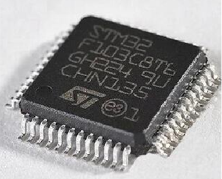

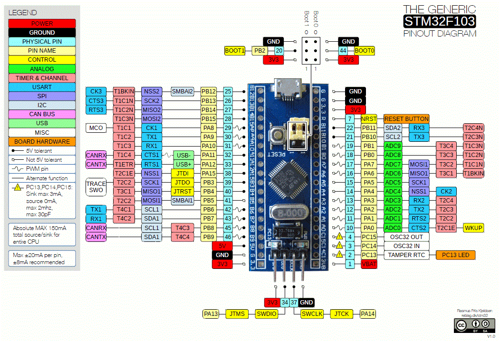

## F1X片上资源

| 英文缩写 |        名称        |                       笔记                        |
| :------: | :----------------: | :-----------------------------------------------: |
|   NVIC   | 嵌套向量中断控制器 | 系统外设，内核中管理中断的设备，如配置中断优先级  |
| SysTick  |   系统滴答定时器   |   系统外设，内核定时器，给操作系统提供定时服务    |
|   RCC    |   复位和时钟控制   |    用于对系统时钟进行配置、开启其他模块的时钟     |
|   GPIO   |      通用IO口      |            通用IO口，可点灯，读取按键             |
|   AFIO   |      复用IO口      |   复用IO口，可实现复用端口重定义和中断端口配置    |
|   EXTI   |      外部中断      |         配置好外部中断后，可用于触发中断          |
|   TIM    |       定时器       | 可用于实现定时中断、测频率、生成PWM、配置成编码器 |
|   ADC    |     模数转换器     |    内置12位模数转换器 ,可直接读取IO口模拟电压     |
|   DMA    |    直接内存访问    |       配置好后，可替代CPU完成搬运数据的工作       |
|  USART   | 同步/异步串口通信  |        UART是同步串口 USART是同步/异步串口        |
|   I2C    |      I2C通信       |    内置控制器，实现了直接使用硬件输出时序波形     |
|   SPI    |      SPI通信       |                       同上                        |
|   CAN    |      CAN通信       |                       同上                        |
|   USB    |      USB通信       |                  USB从机模式接口                  |
|   RTC    |      实时时钟      |   实现年月日时分秒的计时功能，可接外部配用电池    |
|   CRC    |      CRC校验       |           直接通过硬件电路完成数据校验            |
|   PWR    |      电源控制      |                可让芯片睡眠，省电                 |
|   BKP    |     备份寄存器     |      在断电时通过备用电池完成保持数据的操作       |
|   IWDG   |     独立看门狗     |       在程序卡死一定的时间后，自动复位芯片        |
|   WWDG   |     窗口看门狗     |                       同上                        |
|   DAC    |     数模转换器     |             可在IO口直接输出模拟电压              |
|   SDIO   |      SD卡接口      |                     读写SD卡                      |
|   FSMC   | 可变静态存储控制器 |                     扩展内存                      |
| USB OTG  |    USB主机接口     |        USB主机模式接口，可读写其他USB设备         |

## 系统结构

**几个重要总线**

- `ICode总线` 连接Flash闪存 主要用来加载指令（Instruction）如：程序
- `DCode总线` 连接Flash闪存 主要用来加载数据（Data）如：常量、调试参数
- `System总线` 系统总线，通过总线矩阵连接到其他部分，如：SRAM(内存) FSMC
- `AHB系统总线` AHB(先进高性能)总线，挂载其他最基本的外设和高性能外设 如：复位、时钟控制、SDIO
  - `APB2` APB(先进外设)总线 连接一般外设 `频率一般72Mhz` `连接重要的外设` 如：高级定时器，GPIO，ADC
  - `APB1` APB(先进外设)总线 连接一般外设 `频率一般36Mhz` `连接次要的外设` 如：普通定时器，USB
- `DMA总线` DMA(直接内存访问)总线 DMA外设可以通过该总线代替CPU完成数据搬运工作，如：从ADC模数转换外设中的读取数值复制到内存中
- 

## 引脚定义

**特殊端口笔记**

|  引脚号  | 名称             | 默认功能    | 笔记                                               |
| :------: | :--------------- | :---------- | :------------------------------------------------- |
| **电源** |
|    1     | VBAT             | VBAT        | 可接3v备用电池给RTC时钟和备份寄存器供电            |
|   8-9    | VSSA VDDA        | VSSA VDDA   | 内部模拟电路供电                                   |
|  23-24   | VSS_1 VDD_1      | VSS_1 VDD_1 | 主电源                                             |
|  35-36   | VSS_2 VDD_2      | VSS_2 VDD_2 | 主电源                                             |
|  47-48   | VSS_3 VDD_3      | VSS_3 VDD_3 | 主电源                                             |
| **时钟** |
|    3     | PC14-OSC32-IN    | PC14        | 默认为PC14口 可外接32.768kMhz                      |
|    4     | PC15-OSC32-OUT   | PC15        | 默认为PC15口 可外接32.768kMhz                      |
|    5     | OSC_IN           | OSC_IN      | 默认为时钟输入 一般为8M                            |
|    6     | OSC_OUT          | OSC_OUT     | 默认为时钟输入 一般为8M                            |
| **复位** |
|    7     | NRST             | NRST        | 低电平复位 N表示低电平                             |
| **调试** |
|    34    | PA13             | JTMS/SWDIO  | 调试口 JTAG调试线1 / SWD调试线1                    |
|    37    | PA14             | JTCK/SWCLK  | 调试口 JTAG调试线2 / SWD调试线2（共两根线）        |
|    38    | PA15             | JTDI        | 调试口 JTAG调试线3                                 |
|    39    | PB3              | JTDO        | 调试口 JTAG调试线4                                 |
|    40    | PB4              | NJTRST      | 调试口 JTAG调试线5（共五根线）                     |
| **其他** |
|    2     | PC13-TARMPER-RTC | PC13        | 默认为PC13口 另外可以实现侵入检测或输出RTC校准时钟 |
|    10    | PA0-WKUP         | PA0         | 默认PA0 兼具唤醒功能，用于唤醒待机的STM32          |
|    20    | BP2              | BP2/BOOT1   | BOOT1用来配置启动模式，配置成功后退化为BP2         |
|    44    | BOOT0            | BOOT0       | BOOT0用来配置启动模式                              |

**所有引脚**


上图备注：

- 红色：电源
- 蓝色：最小系统相关
- 绿色：IO口 功能口
- 类型：S电源 I输入 O输出
- IO口电平：默认为3.3v；FT表示能够容忍5v电压
- 主功能： 该端口的默认功能
- 默认复用功能：该端口支持的其他功能
- 重定义功能：可将该端口上的功能重新映射到其他端口上

## 启动配置

- `BOOT1=x BOOT0=0` 从主闪存中加载程序并执行
- `BOOT1=0 BOOT0=1` 从系统存储器加载BootLoader程序并执行,该程序把从串口接收的数据写入主闪存，完成程序的烧录
- `BOOT1=1 BOOT0=1` 从内置SRAM启动，用于程序调试
- 

## 工程架构

**工程架构**

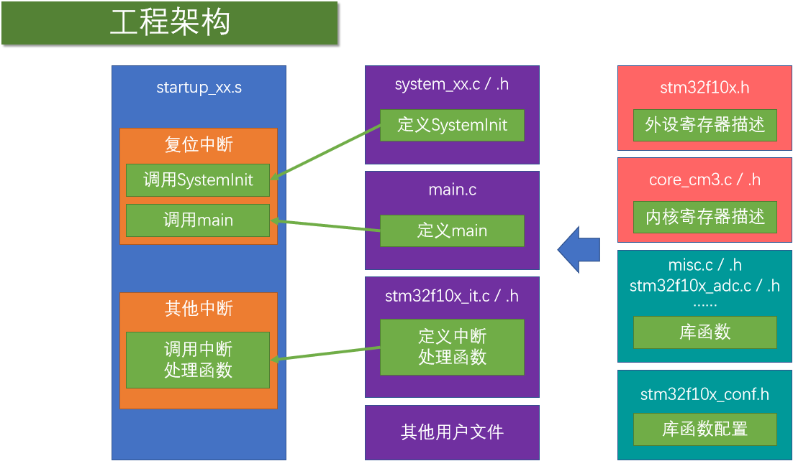

**项目结构**

```bash
.
|---Startup # 启动Stm32所需的最基本的几个文件,这几个文件可以在标准外设库中找到
|   +---startup*stm32f10x*??.s # 汇编启动文件，主要定义复位中断函数，在其中调用SystemInit();main();
|   +---system_stm32f10x.h
|   +---system_stm32f10x.c # 定义了系统初始化函数SystemInit()负责初始化寄存器
|   +---core_cm3.h # 内核寄存器描述
|   +---core_cm3.c # 内核寄存器配置函数
|   \---stm32f10x.h # 外设寄存器描述，当定义USE_STDPERIPH_DRIVER后，将自动包含stm32f10x_conf.h
|
|---StdPeriph_Lib # 标准外设库
|   +---misc.h # 内核中的外设
|   +---misc.c
|   +---stm32f10x_gpio.h # GPIO外设
|   +---stm32f10x_gpio.c
|   \---......略
|
|---User
|   +---main.c # 用户代码
|   +---stm32f10x_conf.h # 外设库配置文件，用来#include<标准外设>
|   +---stm32f10x_it.h
|   \---stm32f10x_it.c # 各种中断函数
```

## Hello_World

**寄存器点灯**

```cpp
#include "stm32f10x.h" // 包含了外设寄存器描述

int main(void)
{
    // 1.通过RCC寄存器 开启GPIO_C的时钟
    RCC->APB2ENR = 0x00000010;
    // 2.通过GOPIO_C_CRH高寄存器 配置13号口的模式 为通用推挽输出模式、最大速度为50Mhz
    GPIOC->CRH = 0x00300000;
    // 3.通过GPIO_C_ODR输出数据寄存器 配置C13口输出低电平
    GPIOC->ODR &= ~0x00002000;
    while (1)
    {
    }
}
```

**标准库点灯**

```cpp
// 定义 USE_STDPERIPH_DRIVER 后
// `stm32f10x.h` 会通过条件编译自动包含 `stm32f10x_conf.h` 文件
// 要在 `stm32f10x_conf.h` 中配置： `#include "stm32f10x_gpio.h"` 还有rcc
#define USE_STDPERIPH_DRIVER
#include "stm32f10x.h" // 包含了外设寄存器描述

int main(void)
{
    // 1. 启用APB2_GPIOC外设时钟
    RCC_APB2PeriphClockCmd(RCC_APB2Periph_GPIOC, ENABLE);
    // 2. 初始化GPIOC_13 为推挽输出、速度50MHz
    GPIO_InitTypeDef GPIO_InitStruct = {GPIO_Pin_13, GPIO_Speed_50MHz, GPIO_Mode_Out_PP};
    GPIO_Init(GPIOC, &GPIO_InitStruct);
    // 3.设置输出低电平
    GPIO_ResetBits(GPIOC, GPIO_Pin_13);
    while (1)
    {
    }
}
```

## 标准外设库

```bash
- STM32F10x_StdPeriph_Lib_V3.5.0
  - Libraries/ `标准库`
    - CMSIS/CM3/ `CMSIS表示：通用微控制器软件接口标准; CM3表示：Cortex-M3`
      - /CoreSupport/ `内核支持`
        - core_cm3.h `内核寄存器描述文件`
        - core_cm3.c `内核寄存器配置函数`
      - DeviceSupport/ `外设支持`
        - ST/STM32F10x/ `ST公司产品系列`
          - startup/ `启动文件,汇编代码,定义了复位中断和其他中断函数，复位中断函数中调用了SystemInit()和main()`
            - arm/ `ARM公司生产的芯片`
              - startup_stm32f10x_ld_vl.s
              - startup_stm32f10x_md_vl.s
              - startup_stm32f10x_hd_vl.s
              - startup_stm32f10x_ld.s
              - startup_stm32f10x_md.s
              - startup_stm32f10x_hd.s
              - startup_stm32f10x_xl.s
              - startup_stm32f10x_cl.s
          - stm32f10x.h `外设寄存器描述文件；当定义了USE_STDPERIPH_DRIVER后，将自动包含stm32f10x_conf.h文件，该文件用于包含标准外设库`
          - system_stm32f10x.c `定义了SystemInit()负责初始化寄存器`
          - system_stm32f10x.h
    - STM32F10x_StdPeriph_Driver/ `标准外设驱动`
      - inc/ `头文件`
        - misc.h `内核中的外设`
        - stm32f10x_dac.h
        - stm32f10x_gpio.h
        - ...略
      - src/ `具体实现`
        - ...略
      - Release_Notes.html
- Project/ `官方提供的工程案例和模板，可以作为使用库函数的参考`
  - STM32F10x_StdPeriph_Examples/ `案例`
  - STM32F10x_StdPeriph_Template/ `模板`
    - RIDE/
    - EWARM/
    - HiTOP/
    - MDK-ARM/
    - TrueSTUDIO/
    - stm32f10x_conf.h `用来配置标准外设库头文件的配置文件，同时包含一个所有库函数都需要的参数检查函数定义`
    - stm32f10x_it.c `用来存放中断函数`
    - stm32f10x_it.h
    - system_stm32f10x.c
    - main.c 主函数
    - Release_Notes.html 发布说明
- Utilities/ `官方用于测评STM32的程序`
- Release_Notes.html `发布说明`
- stm32f10x_stdperiph_lib_um.chm `帮助文档`
```

**启动文件的选择——型号分类及缩写**

| 文件                      | 缩写                  | 释义               | 释义     | 型号              |
| :------------------------ | :-------------------- | ------------------ | -------- | ----------------- |
| startup_stm32f10x_ld_vl.s | LD_VL(Value Line)     | 小容量产品超值系列 | 16~32K   | STM32F100         |
| startup_stm32f10x_md_vl.s | MD_VL(Value Line)     | 中容量产品超值系列 | 64~128K  | STM32F100         |
| startup_stm32f10x_hd_vl.s | HD_VL(Value Line)     | 大容量产品超值系列 | 256~512K | STM32F100         |
| startup_stm32f10x_ld.s    | LD(Low Density)       | 小容量产品         | 16~32K   | STM32F101/102/103 |
| startup_stm32f10x_md.s    | MD(Medium Density)    | 中容量产品         | 64~128K  | STM32F101/102/103 |
| startup_stm32f10x_hd.s    | HD(High Density)      | 大容量产品         | 256~512K | STM32F101/102/103 |
| startup_stm32f10x_xl.s    | XL(Extra Large)       | 加大容量产品       | 大于512K | STM32F101/102/103 |
| startup_stm32f10x_cl.s    | CL(Connectivity Line) | 互联型产品         | -        | STM32F105/107     |

## RCC

### 基本介绍

> RCC复位和时钟控制外设

**在系统结构中的位置**

- 位于AHB系统总线上
- 

**RCC相关寄存器**

- 时钟控制寄存器 `RCC_CR`
- 时钟配置寄存器`RCC_CFGR`
- 时钟中断寄存器 `RCC_CIR`
- APB2 外设复位寄存器 `RCC_APB2RSTR`
- APB1 外设复位寄存器 `RCC_APB1RSTR`
- **AHB 外设时钟使能寄存器** `RCC_AHBENR`
- **APB2 外设时钟使能寄存器** `RCC_APB2ENR`
- **APB1 外设时钟使能寄存器** `RCC_APB1ENR`
- 备份域控制寄存器 `RCC_BDCR`
- 控制/状态寄存器 `RCC_CSR`

### RCC时钟树

**时钟树**

- 时钟树就是STM32内部产生和配置时钟并把配置好的时钟发送到各个外设的系统。
- 时钟是所有外设运行的基础，所以时钟也是最先需要配置的东西
- 在启动文件中,main函数之前，还有一个SystemInit()函数，该函数用于配置时钟树。

**时钟产生流程**

- AHB左侧为时钟产生电路、右侧为时钟分配电路
- 在时钟产生电路，有四个震荡源
  - 内部8Mhz高速RC振荡器（提供系统时钟）
  - 外部4~16Mhz高速石英晶振（提供系统时钟；一般8M）
  - 外部32.768khz低速晶振（给RTC电路提供时钟）
  - 内部40Khz低速RC振荡器（给看门狗提供时钟）
- 高速晶振用于提供系统时钟，AHB、APB1、APB2的时钟来源
- 内外高速时钟的选择
  - 内外的高速晶振都可使用，只是石英振荡器比RC更稳定，
  - 系统简单、不需要精确时钟则可使用内部RC振荡器
- SystemInit()默认配置时钟的流程
  - 时钟产生
    - 启动内部8Mhz
    - 选择内部时钟为系统时钟，暂时以内部8Mhz运行
    - 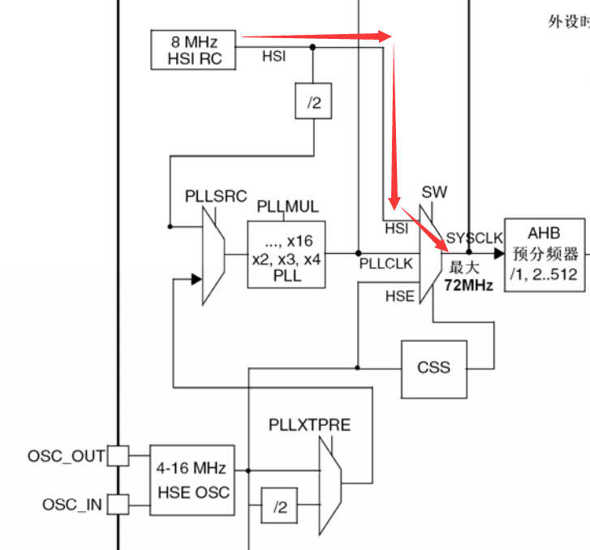
    - 启动外部时钟，
    - 配置外部时钟进入PLLMUL锁相环进行倍频得到8x9=72Mhz时钟
    - 待锁相环输出稳定后，选择锁相环输出为系统时钟。
    - 
    - 这样系统时钟就从8Mhz切换到了72Mhz
  - 时钟分配
    - 系统时钟SYSCLK（72Mhz or 8Mhz）进入AHB总线预分频器
    - 配置的预分频器系数为1，所以AHB得到时钟为SYSCLK/1=72Mhz
    - 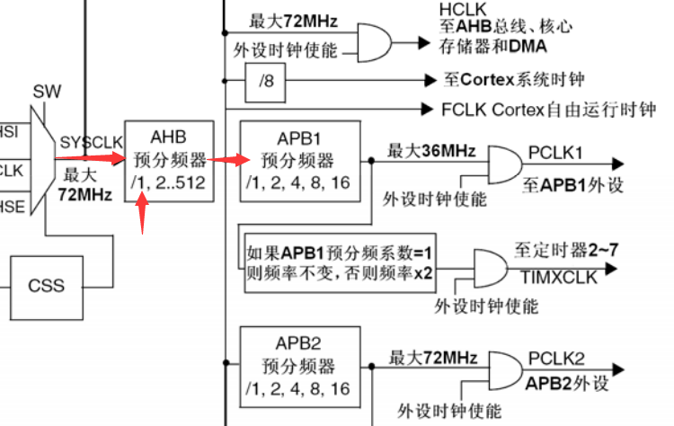
    - AHB得到的时钟再分配给`APB1`总线预分频器
    - 配置的预分频器系数为2，所以APB1得到时钟为SYSCLK/2=36Mhz
    - 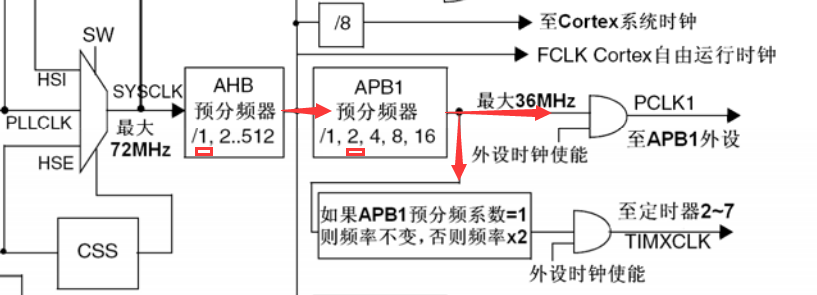
  - 经过APB1预分频器后得到的时钟会再分配给通用定时器和基本定时器（定时器2~7）
    - 分配之前会做判断，
      - APB1预分配系数为1则直接分配，
      - 否则x2再分配`（这里就是这种情况）`
      - 保证定时器得到的系统时钟为72Mhz
    - 
  - AHB得到的时钟再分配给`APB2`总线内部预分频器
  - 配置的预分频器系数为1，所以APB2得到时钟为SYSCLK/1=72Mhz
  - 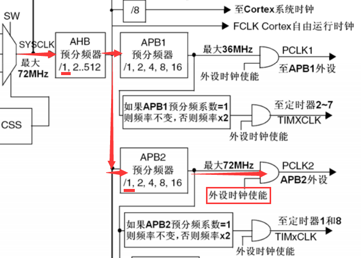
  - 经过APB2预分配器后得到的时钟最终会送至高级定时器定时器1和8
    - 分配之前会做判断，
      - APB2预分配系数为1则直接分配，`（这里就是这种情况）`
      - 否则x2再分配
      - 保证定时器得到的系统时钟为72Mhz
    - 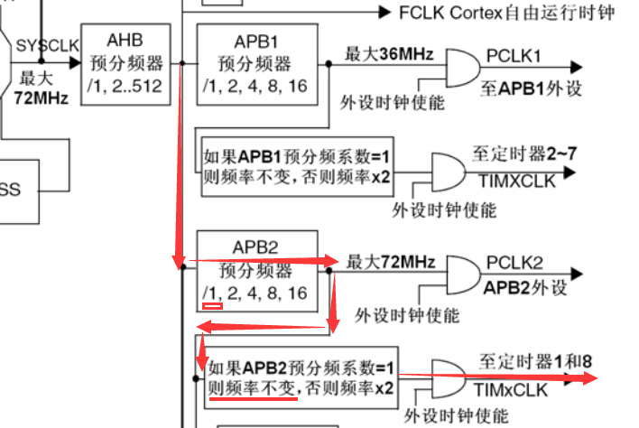

**可能出现的问题**

> 如果外部时钟出现问题，那么系统时钟就无法从8Mhz切换到72Mhz，系统时钟就比预期慢了9倍，定时1秒，实际为9秒。

**CSS(Clock Security System-时钟安全系统)**

- 负责检测外部运行状态，
- 当外部时钟失效，就把外部时钟切换为内部时钟
- 在高级定时器中，
  - 当CSS检测到外部时钟失效时，
  - 将发送一个时钟失效事件给高级定时器的刹车控制电路，
  - 控制输出比较电路控制的电机立即停止，防止出现意外。

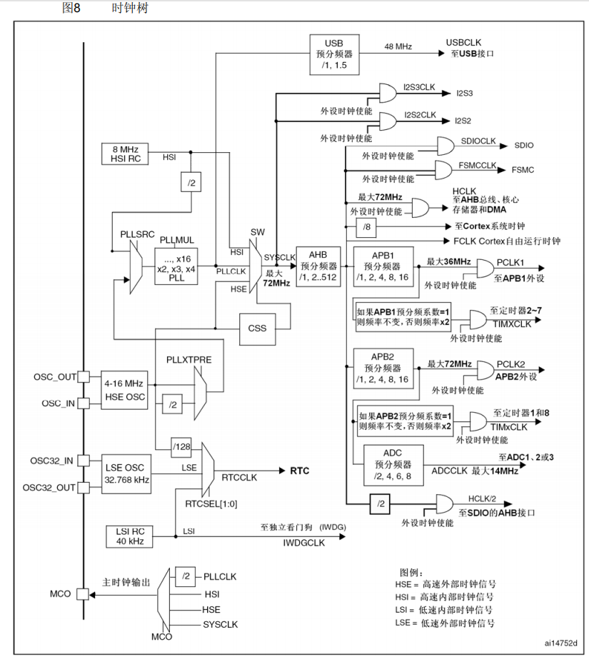

### 标准库函数

**RCC外设所有函数功能描述**

> 感觉大概知道下有哪些功能就行了

| 函数名 (加粗表示常用)         | 描述                                 |
| :---------------------------- | :----------------------------------- |
| RCC_DeInit                    | 将外设 RCC 寄存器重设为缺省值        |
| RCC_HSEConfig                 | 设置外部高速晶振（HSE）              |
| RCC_WaitForHSEStartUp         | 等待 HSE 起振                        |
| RCC_AdjustHSICalibrationValue | 调整内部高速晶振（HSI）校准值        |
| RCC_HSICmd                    | 使能或者失能内部高速晶振（HSI）      |
| RCC_PLLConfig                 | 设置 PLL 时钟源及倍频系数            |
| RCC_PLLCmd                    | 使能或者失能 PLL                     |
| RCC_SYSCLKConfig              | 设置系统时钟（SYSCLK）               |
| RCC_GetSYSCLKSource           | 返回用作系统时钟的时钟源             |
| RCC_HCLKConfig                | 设置 AHB 时钟（HCLK）                |
| RCC_PCLK1Config               | 设置低速 AHB 时钟（PCLK1）           |
| RCC_PCLK2Config               | 设置高速 AHB 时钟（PCLK2）           |
| RCC_ITConfig                  | 使能或者失能指定的 RCC 中断          |
| RCC_USBCLKConfig              | 设置 USB 时钟（USBCLK）              |
| RCC_ADCCLKConfig              | 设置 ADC 时钟（ADCCLK）              |
| RCC_LSEConfig                 | 设置外部低速晶振（LSE）              |
| RCC_LSICmd                    | 使能或者失能内部低速晶振（LSI）      |
| RCC_RTCCLKConfig              | 设置 RTC 时钟（RTCCLK）              |
| RCC_RTCCLKCmd                 | 使能或者失能 RTC 时钟                |
| RCC_GetClocksFreq             | 返回不同片上时钟的频率               |
| **RCC_AHBPeriphClockCmd**     | 使能或者失能 AHB 外设时钟            |
| **RCC_APB2PeriphClockCmd**    | 使能或者失能 APB2 外设时钟           |
| **RCC_APB1PeriphClockCmd**    | 使能或者失能 APB1 外设时钟           |
| RCC_APB2PeriphResetCmd        | 强制或者释放高速 APB（APB2）外设复位 |
| RCC_APB1PeriphResetCmd        | 强制或者释放低速 APB（APB1）外设复位 |
| RCC_BackupResetCmd            | 强制或者释放后备域复位               |
| RCC_ClockSecuritySystemCmd    | 使能或者失能时钟安全系统             |
| RCC_MCOConfig                 | 选择在 MCO 管脚上输出的时钟源        |
| RCC_GetFlagStatus             | 检查指定的 RCC 标志位设置与否        |
| RCC_ClearFlag                 | 清除 RCC 的复位标志位                |
| RCC_GetITStatus               | 检查指定的 RCC 中断发生与否          |
| RCC_ClearITPendingBit         | 清除 RCC 的中断待处理位              |

## GPIO

### 基本介绍

- GPIO（General Purpose Input Output）通用输入输出口
- 可配置为8种输入输出模式
- 引脚电平：0V~3.3V，部分引脚可容忍5V
- 输出模式下可控制端口输出高低电平
- 输入模式下可读取端口的高低电平或电压

**GPIO基本结构**

- 这里的寄存器实际上共有7个
  - 32bit配置寄存器x2 `GPIOx_CRL` `GPIOx_CRH` (4bit x 16 = 64bit)
  - 32bit配置锁定寄存器x1 `GPIOx_LCKR`
  - 32bit数据寄存器x2 `GPIOx_IDR` `GPIOx_ODR` (输入/输出)
  - 32bit置位/复位寄存器x1 `GPIOx_BSRR` (低16bit置位，高16bit复位) (可用于设置某位的同时清除另一位)
  - 16bit复位寄存器x1 `GPIOx_BRR` (低16bit复位)
- 

**GPIO位结构**

- 这里值得注意的一些点：
  - 对`输出数据寄存器`操作会影响16个端口
  - 对`位设置/清除寄存器`操作只影响具体的位
  - 复用功能输入实际上是数字信号
  - GPIO模式决定了上拉电阻和下拉电阻是否启用，以及上下MOS管是否受控。
- 

**八种GPIO模式**

|   模式名称   |     性质     | 特征                                               |
| :----------: | :----------: | :------------------------------------------------- |
|   浮空输入   | **数字输入** | 可读取引脚电平，若引脚悬空，则电平不确定           |
|   上拉输入   | **数字输入** | 可读取引脚电平，内部连接上拉电阻，悬空时默认高电平 |
|   下拉输入   | **数字输入** | 可读取引脚电平，内部连接下拉电阻，悬空时默认低电平 |
|   模拟输入   | **模拟输入** | GPIO无效，引脚直接接入内部ADC                      |
|   开漏输出   |  `数字输出`  | 可输出引脚电平，高电平为高阻态，低电平接VSS        |
|   推挽输出   |  `数字输出`  | 可输出引脚电平，高电平接VDD，低电平接VSS           |
| 复用开漏输出 |  `数字输出`  | 由片上外设控制，高电平为高阻态，低电平接VSS        |
| 复用推挽输出 |  `数字输出`  | 由片上外设控制，高电平接VDD，低电平接VSS           |

**数字输入模式电路**

- 特点
  - 无法输出
  - 浮空输入 上下拉电阻失效 电平不确定
  - 上拉输入 上拉电阻有效 默认高电平
  - 下拉输入 下拉电阻有效 默认低电平
- 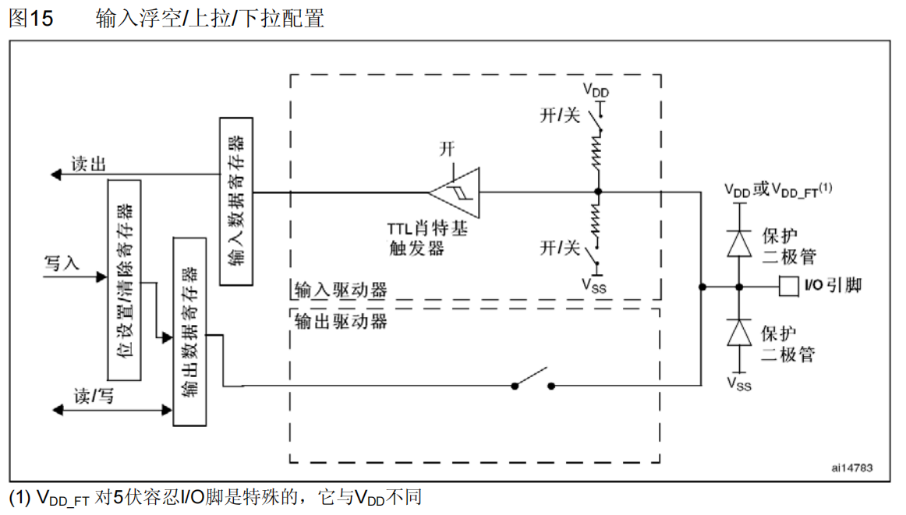

**模拟输入模式电路**

- 特点
  - 肖特基触发器关闭，无法读取数字输入信号
  - 输出电路断开，无法输出信号
  - 引脚信号直接接入ADC
- 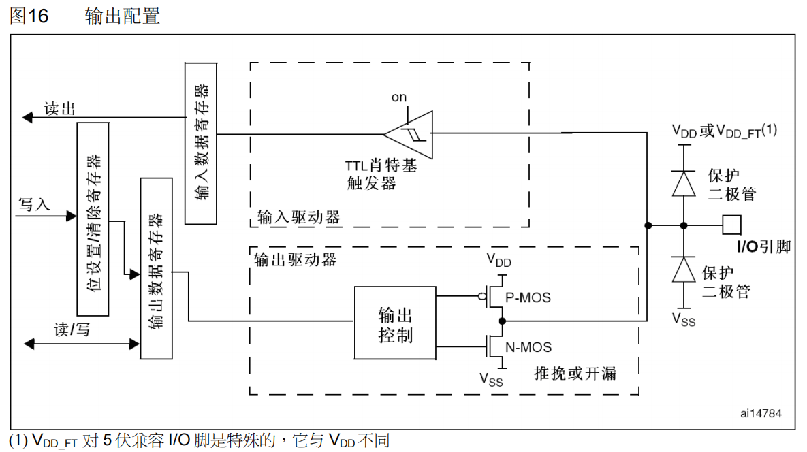

**数字输出模式电路**

- 特点
  - 上管无效为开漏输出
  - 上下管都有效为推挽输出
  - 肖特基触发器开启，可以读取到数字输入
- 

**复用输出模式**

- 特点
  - 输出的控制权转交给片上外设
  - 肖特基触发器开启，仍然能够读取数字输入
- 

### 案例代码：点灯

**步骤**

- 配置RCC外设开启相关端口的时钟
- 配置GPIO口输出模式
- 输出

```cpp
#define USE_STDPERIPH_DRIVER
#include "stm32f10x.h"

int main(void)
{
    // 1.启用APB2_GPIOC外设时钟
    RCC_APB2PeriphClockCmd(RCC_APB2Periph_GPIOC, ENABLE);
    // 2.初始化GPIOC_13 为推挽输出、速度50MHz
    GPIO_InitTypeDef GPIO_InitStruct = {GPIO_Pin_13, GPIO_Speed_50MHz, GPIO_Mode_Out_PP};
    GPIO_Init(GPIOC, &GPIO_InitStruct);
    // 3.设置输出低电平
    GPIO_WriteBit(GPIOC,GPIO_Pin_13,Bit_RESET);
    while (1)
    {
    }
}
```

## 中断与NVIC

### 基本介绍

- **中断：** 在主程序运行过程中，出现了特定的**中断触发条件**（中断源），使得CPU暂停当前正在运行的程序，转而去处理**中断程序**，处理完成后又返回原来被暂停的位置继续运行
- **中断优先级：** 当有多个中断源同时申请中断时，CPU会根据中断源的轻重缓急进行裁决，优先响应更加紧急的中断源
- **中断嵌套：** 当一个中断程序正在运行时，又有新的更高优先级的中断源申请中断，CPU再次暂停当前中断程序，转而去处理新的中断程序，处理完成后依次进行返回

**中断执行流程**

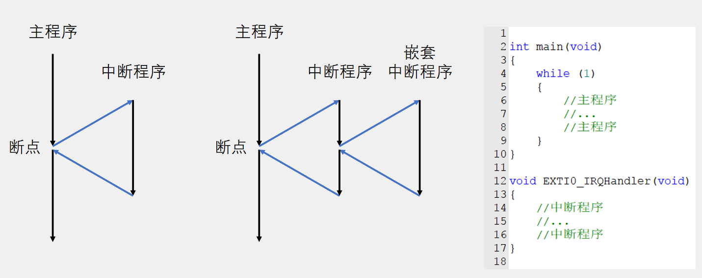

### STM32的中断

**介绍**

- 68个可屏蔽中断通道，包含EXTI、TIM、ADC、USART、SPI、I2C、RTC等多个外设
- 使用**NVIC**统一管理中断，每个中断通道都拥有**16**个可编程的优先等级，可对优先级进行分组，进一步设置抢占优先级和响应优先级

**NVIC-嵌套中断向量控制器**

- 是统一分配中断优先级和管理中断的**内核外设**，
- 负责根据中断的优先级决定中断的先后顺序，
- 以及是否要嵌套处理新的中断。
- 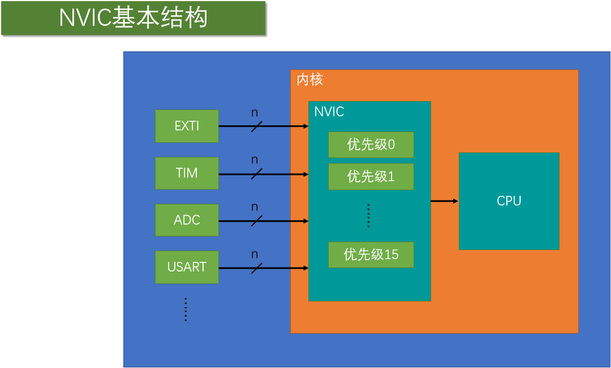

**NVIC优先级分组**

- 分组
  - NVIC的中断优先级由优先级寄存器的4位决定（共16个优先级）
  - 这4位可以进行切分，分为
  - 高n位的**抢占优先级**和
  - 低(4-n)位的**响应优先级**
- 优先级
  - `抢占优先级高的可以中断嵌套，`
  - `响应优先级高的可以优先排队，`
  - `抢占优先级和响应优先级均相同的按中断号排队`

| 分组方式 |   抢占优先级    |   响应优先级    |
| :------: | :-------------: | :-------------: |
|  分组0   |  0位，取值为0   | 4位，取值为0~15 |
|  分组1   | 1位，取值为0~1  | 3位，取值为0~7  |
|  分组2   | 2位，取值为0~3  | 2位，取值为0~3  |
|  分组3   | 3位，取值为0~7  | 1位，取值为0~1  |
|  分组4   | 4位，取值为0~15 |  0位，取值为0   |

**STM32中断向量表**

- 分类
  - 灰色的都是内核的中断，一般用不到。
    - Reset复位中断，当产生复位事件时程序就会自动执行复位中断。
  - 其余部分为外设中断
- 中断地址
  - 外设申请中断时，会跳转到相应的中断地址执行程序
  - 而中断跳转只能跳转到固定的地址
  - 用户定义的中断处理函数在编译器编译后，其地址是不固定的
  - 这就需要在跳转到中断地址后再次跳转到用户定义的中断函数，这部分工作将会由编译器自动完成（定义在了setup汇编文件中）。
- 

### EXTI外部中断

**介绍**

- EXTI（Extern Interrupt）外部中断
- `EXTI可以监测指定GPIO口的电平信号，当其指定的GPIO口产生电平变化时，EXTI将立即向NVIC发出中断申请，经过NVIC裁决后即可中断CPU主程序，使CPU执行EXTI对应的中断程序`
- 支持的触发方式：
  - 上升沿
  - 下降沿
  - 双边沿
  - 软件触发
- 支持的GPIO口：
  - **所有GPIO口**
  - 但**相同的Pin不能同时触发中断**,就是说PA0和PB0不能同时作为中断触发源
- 通道数（**共20个通道**）：
  - 16个GPIO_Pin
  - 外加PVD输出
  - RTC闹钟
  - USB唤醒
  - 以太网唤醒
- 触发响应方式：
  - 中断响应：通道电压变化，申请中断，让CPU执行中断函数
  - 事件响应：通道电压变化，触发事件，触发其他外设的操作
- **EXTI基本结构**
  - 

**EXTI外部中断框图**

- 下图左侧的输入线就是20个外部中断通道
- **边沿检测电路**根据**上升沿触发选择寄存器**和**下降沿触发选择寄存器**的值
- 决定输出到或门的值，然后输出到**请求挂起寄存器**，然后再输出至后续的与门。
- **中断屏蔽寄存器**就相当于是这个与门的开关，决定了中断信号能否发送至后续的NVIC
- 从或门输出的信号还将经过脉冲发生器，用来触发其他外设
- 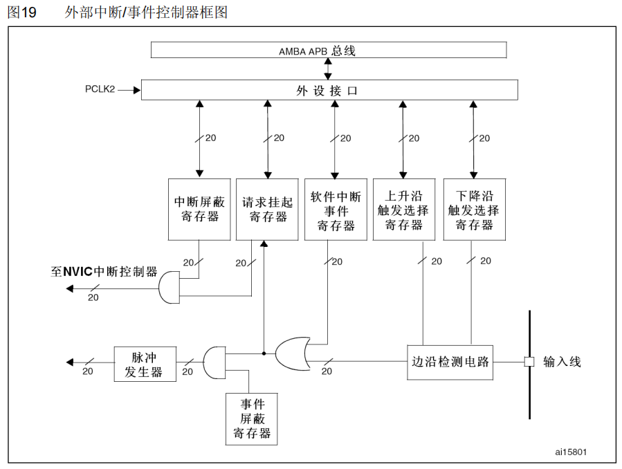

**AFIO中断引脚选择**

- AFIO主要用于引脚复用功能的选择和重定义
- 在STM32中，AFIO主要完成两个任务：
  - 复用功能引脚重映射
  - **中断引脚选择**
- 下图的主要意思就是**EXTIO只能是PA0~PG0中的其中一个**，具体选择哪一个，由AFIO来控制
- 

### 案例代码：光电计数器触发外部中断

**基本步骤**

1. 开启GPIOx时钟
2. 配置GPIOx_Pinx
3. 开启AFIO时钟
4. 配置AFIO，使GPIOx_Pinx通向 EXTIx中断信号
5. 配置EXTI，启用EXTI_Linex
6. 配置NVIC,设置EXTIxx_IRQn中断函数优先级
7. 定义中断函数EXTIxx_IRQn
   - 在中断执行完毕后清除请求挂起寄存器对应的位

**配置GPIO_G_Pin_13口外部中断的示例代码**

```cpp
#include "stm32f10x.h"
#include "stdint.h"
#include "CountSensor.h"

/**
 * @ref 初始化光电计数器
 */
void CountSensor_Init()
{
    /**
     * 配置GPIO
     */
    // 开启APB2_GPIO_C外设时钟
    RCC_APB2PeriphClockCmd(RCC_APB2Periph_GPIOC, ENABLE);
    // 初始化GPIO_C13为上拉输入模式
    GPIO_InitTypeDef GPIO_InitStruct = {GPIO_Pin_13, GPIO_Speed_50MHz, GPIO_Mode_IPU};
    GPIO_Init(GPIOC, &GPIO_InitStruct);

    /**
     * 配置AFIO
     * AFIO用于配置引脚复用功能重映射 中断引脚
     */
    // 开启APB2_AFIO外设时钟
    RCC_APB2PeriphClockCmd(RCC_APB2Periph_AFIO, ENABLE);
    // 配置AFIO的数据选择器联通GPIO_C13到EXTI电路
    GPIO_EXTILineConfig(GPIO_PortSourceGPIOC, GPIO_PinSource13);

    /**
     * 配置EXTI
     */
    // EXTI外设时钟默认开启
    // 配置EXTI
    EXTI_InitTypeDef EXTI_InitStruct = {
        EXTI_Line13,          // 配置EXTI_Line13
        EXTI_Mode_Interrupt,  // 中断模式
        EXTI_Trigger_Falling, // 下降沿触发
        ENABLE,               // 启用
    };
    EXTI_Init(&EXTI_InitStruct);

    /**
     * 配置NVCI
     */
    // NVCI是内核外设，时钟默认开启
    // 通过NVIC寄存器配置优先级分组（先占优先级和从占优先级）
    NVIC_PriorityGroupConfig(NVIC_PriorityGroup_2);
    // 配置EXTI15_10_IRQn中断的优先级
    NVIC_InitTypeDef NVIC_InitStruct = {
        EXTI15_10_IRQn,
        0, // 先占优先级
        0, // 从占优先级
        ENABLE,
    };
    NVIC_Init(&NVIC_InitStruct);
}

uint16_t counter = 0;
uint16_t CountSensor_GetCounter()
{
    return counter;
}
/**
 * @ref 重写中断回调
 */
void EXTI15_10_IRQHandler()
{
    // 获取EXTI状态
    if (EXTI_GetITStatus(EXTI_Line13) == SET)
    {
        counter++;
        // 清除中断请求挂起寄存器相应的位
        EXTI_ClearITPendingBit(EXTI_Line13);
    }
}
```

## TIM定时器

### 概念

- TIM（Timer）定时器
- 定时器可以对**输入的时钟**进行**计数**，并在计数值达到设定值时触发中断
  - **输入时钟可以是系统时钟、外部输入**
  - **对高精度时钟计数，实际就是计时**
    - 对系统时钟72Mhz计数72次，就是1us
- 由**预分频器**、**16位计数器**、**自动重装寄存器**组成的时基单元，在72MHz计数时钟下可以实现最大59.65s的定时
  - **预分频器**，可以对时钟进行分频，
  - **16位计数器**,用来执行计数定时的计数器，每来一个时钟，计数器加1
  - 单个定时器最大定时时长： `(1/72Mhz) * 65536 * 65536 = 59.65232355555556 s`
  - 两个定时器级联最大定时时长：`59.65s * 65536 * 65536 ≈ 8千多年`
  - 三个定时器级联最大定时时长：`8K * 65536 * 65536 ≈ 34万亿年`
- 具备基本的**定时中断功能**，而且还包含**内外时钟源选择**、**输入捕获**、**输出比较**、编码器接口、主从触发模式等多种功能
- 根据复杂度和应用场景分为了**高级定时器**、**通用定时器**、**基本定时器**三种类型

**定时器类型**

> STM32F103C8T6定时器资源：TIM1、TIM2、TIM3、TIM4

| 类型       | 编号                   | 总线 | 功能                                                                                                 |
| :--------- | :--------------------- | :--- | :--------------------------------------------------------------------------------------------------- |
| 高级定时器 | TIM1、TIM8             | APB2 | 拥有通用定时器全部功能，并额外具有重复计数器、死区生成、互补输出、刹车输入等功能                     |
| 通用定时器 | TIM2、TIM3、TIM4、TIM5 | APB1 | 拥有基本定时器全部功能，并额外具有内外时钟源选择、输入捕获、输出比较、编码器接口、主从触发模式等功能 |
| 基本定时器 | TIM6、TIM7             | APB1 | 拥有定时中断、主模式触发DAC的功能                                                                    |

### 基本定时器

**基本定时器框图**

- **`CK_PSC`时钟：** 一般直接使用`CK_INT`（内部时钟72Mhz）作为定时器时钟
- **时基单元：** 预分频器+计数器+自动重装寄存器
  - **预分频器：** 对时钟进行降频
    - 写0 输出 72/1 Mhz （不分频/也叫1分频）
    - 写1 输出 72/2 Mhz （2分频）
    - 写2 输出 72/3 Mhz （3分频）
    - ......
    - 写n 输出 72/(n+1) Mhz （n+1分频）
  - **计数器：** 对预分频器输出的方波上升沿计数，计数就是计数器值+1
    - 对于基本定时器，计数器只有向上计数模式
  - **自动重装寄存器：** 当计数器数值达到自动重装值时，产生中断信号并清零计时器
    - 下图中向上的折现箭头就是中断信号，这种计数值等于重装值的中断一般称为更新中断，该中断信号会通往NVIC，配置好NVIC的定时器通道，那么定时器的更新中断就能得到CPU的响应
    - 向下的折现表示会产生一个事件，这里就是更新事件，不会触发中断，但可用于触发内部其他电路工作，可以实现一种不需要CPU直接参与的自动化任务。
- **主模式触发DAC:** 可以把定时器的更新事件，映射到TRGO（Trigger Oout）触发输出，然后再接到DAC的触发转换引脚上，实现定时触发DAC转换输出模拟量，不需要CPU参与，实现硬件自动化
- 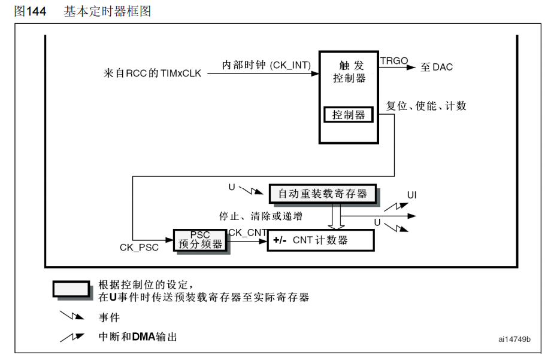

### 通用定时器

**通用定时器框图**

- **时基单元**: 没有改变，和**基本定时器**一样
  - **计数器：**
    - 对于通用寄存器和高级寄存器，计数器支持向上计数、向下计数，中央对齐计数
- `CK_PSC`**时钟**
  - `CK_INT 内部时钟`
    - 可直接使用内部时钟72Mhz作为定时器时钟
  - `CK_PSC 外部时钟模式2`
    - 可以把ETR（TIMx_ETR）外部时钟引脚信号作为定时器时钟；如：TIM2_CH1_ETR引脚
    - 需要配置边沿检测、分配器
    - 可以用来对外部时钟引脚上的信号计数
  - `TRGI 外部时钟模式1`
    - TRGI主要作为触发输入使用，可以触发定时器的从模式
    - 也可以用来作为定时器的外部时钟输入信号
      - `ITRx` 是来自其他定时器的触发输出 用于实现定时器的级联
        - 具体来说，
          - 可以初始化TIM3,主模式，更新事件映射到TRGO;
          - 初始化TIM2,选择ITR2（也就是TIM3的TRGO）,外部时钟模式1，作为定时器的时钟信号。
        - 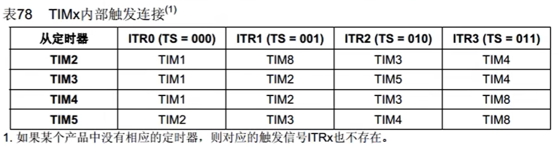
      - `TI1F_ED` 连接的是输入捕获单元的CH1引脚，ED表示边沿触发，上升沿和下降沿均有效
        - 可用于输入捕获，测频率
      - `TI1FP1` CH1引脚的时钟
      - `TI1FP2` CH2引脚的时钟
- 编码器接口：可用于读取正交编码器的输出波形
- `TRGO`触发输出：
  - 可以把定时器内部的一些事件映射到该接口
- `捕获/比较电路`

  - 四个捕获/比较电路寄存器，及其**左侧**的电路称为**输入捕获电路**，可用于**测量方波频率**
  - 四个捕获/比较电路寄存器，及其**右侧**的电路称为**输出比较电路**，可用于**输出PWM波形**
  - 输入捕获电路 和 输出比较电路 **共用引脚和寄存器**，**不能同时使用**

- 

### 高级定时器

**高级定时器框图**

- 对比高级定时器框图，新增的部分为右下角的一圈电路
  - `重复计数器`：实现每隔几个计数周期触发中断和更新事件，相当于对输出的更新信号又做了分频
  - **DTG(Dead Time Generate四驱时间生成)寄存器**，用于控制输出上下互补的PWM波，为了防止输出的互补PWM波驱动MOS管时，在开关切换的瞬间，由于器件的不理想，导致短暂的上下管都导通的情况发生，所以这里添加了死区生成电路，实现在上管完全关闭时，再开启下管。
  - **输出控制**，用于输出两个上下互补的PWM波形，用于控制三相电机，第四路由于用不到，所以只有一根线。
  - `BRK刹车输入功能`：当从外部引脚BKIN得到刹车信号时，或者时钟信号失效事件发生时，控制电路将自动切断电机的输出，防止意外发生。
- 

### 时基单元

**延迟更新的预分频器**

- 一句话总结：修改预分频器参数时，不会立即生效，而是会在计数器达到目标值后，产生更新事件，进入下一轮计数时生效。
- 时序过程
  - `预分频控制寄存器`是供读写的寄存器，不直接决定分频系数，
  - `预分频缓存器`是真正决定预分频参数的寄存器
  - 在一个计数的过程中，用户对`预分频控制寄存器`写入分频系数，写入的分频系数不生效，**计数频率将保持不变**，
  - 直到本轮计数完成，更新事件产生，该系数才会写入`预分频缓存器`，进入下一轮计数时，写入的分频系数生效,**计数频率才会改变**。
  - 
  - `计数器计数频率CK_CN`
  - `= CK_PSC定时器时钟/(PSC预分频器系数 + 1)`
- 这里的预分频缓冲器，是为了防止计数中途更改数值造成错误而设计的。

**更新事件的产生时序**

- 一句话总结：更新事件不是在计数器达到目标时立即产生的，而是在达到目标值后的下一个定时器周期，计数器溢出时产生的。
- 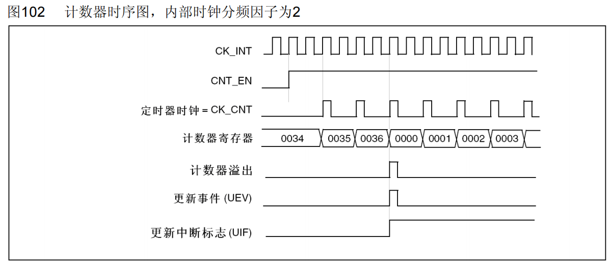
- `计数器溢出频率CK_CNT_OV`
  - `= CK_CNT计数器/(ARR自动重装寄存器+1)`
  - `= [CK_PSC定时器时钟/(PSC预分频器系数+1)]/(ARR自动重装寄存器+1)`
- 更新中断标志置1后，会申请中断，在中断处理函数中需要手动清除该标志位。
- 这里的ARR自动重装寄存器，也有一个缓冲寄存器，或者叫影子寄存器，是否使用是可以设置的。当使用时，会有和预分频器一样延迟生效的作用。
  - 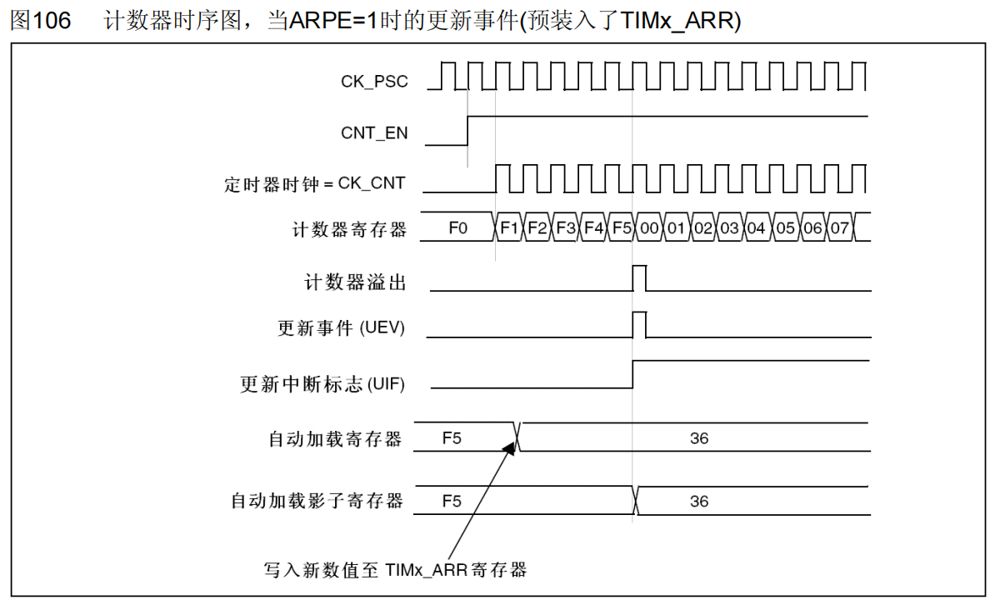

### 输出比较

**OC（Output Compare）输出比较**

- 输出比较可以通过比较`CNT计数器`与`CCR捕获比较寄存器`值的关系，来对输出电平进行置1、置0或翻转的操作，
- 用于输出一定频率和占空比的PWM波形。
- 每个高级定时器和通用定时器都拥有4个输出比较通道
- 高级定时器的前3个通道额外拥有死区生成和互补输出的功能
- 
- tips
  - OC（Output Compare）输出比较
  - IC（Input Compare）输入比较
  - CC (Capture Compare) 输入捕获和输出比较的单元

**PWM**

- PWM（Pulse Width Modulation）脉冲宽度调制
- 在**具有惯性的系统**中，可以通过对一系列脉冲的宽度进行调制，来等效地获得所需要的模拟参量，常应用于电机控速等领域
- PWM参数：
  - 频率 = 1 / TS
    - 一般为几k~几十khz
  - 占空比 = TON / TS
  - 分辨率 = 占空比变化步距
    - 形容的是占空比的精度
      - 比如 1% 2% 3% 分辨率为1%
      - 比如 1.1% 1.2% 1.3% 分辨率为0.1%
- 

**捕获比较通道输出部分**

- `OC1M[2:0]` 负责控制输出模式控制器的输出逻辑
- `CC1P` 用于实现极性选择的控制，用来实现波形的翻转
- `CC1E` 输出使能
- 通用定时器的比较输出通道
  - 
  - 
- 高级定时器的比较输出通道
  - 相比于通用定时器，多了一个互补的输出端口，用于控制上下MOS管的导通与截止。
  - 死区生成电路用来防止上下管同时导通，防止上下管截至时，由于器件的不理想导致不完全截至，而同时另一个管又导通，这将使得上下管同时导通发生短路。
  - 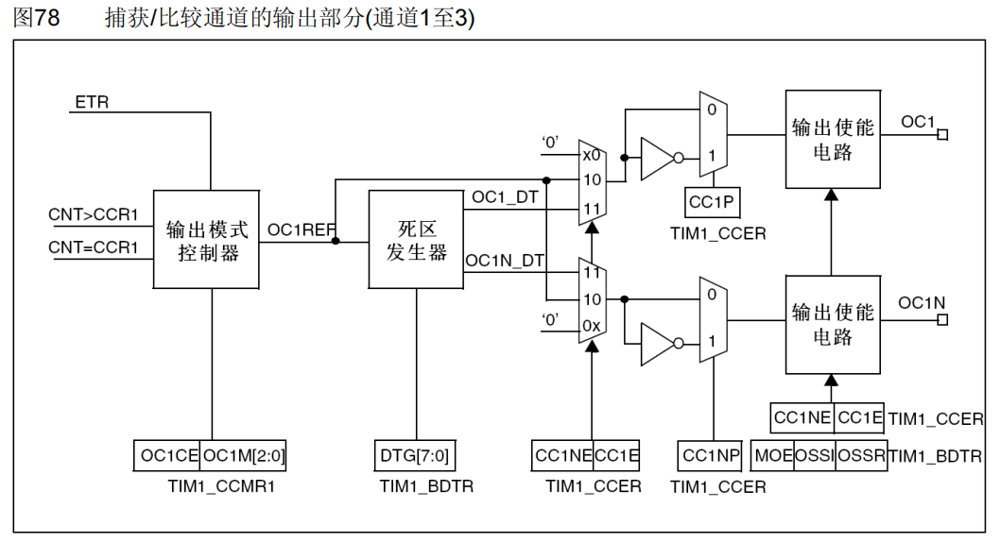

**输出模式控制器的模式选择**

| 模式             | 描述                                                                                                                             | 笔记                                                                             |
| :--------------- | :------------------------------------------------------------------------------------------------------------------------------- | :------------------------------------------------------------------------------- |
| 冻结             | CNT=CCR时，REF保持为原状态                                                                                                       | （输出保持不变）                                                                 |
| 匹配时置有效电平 | CNT=CCR时，REF置有效电平                                                                                                         | （输出保持高电平）                                                               |
| 匹配时置无效电平 | CNT=CCR时，REF置无效电平                                                                                                         | （输出保持低电平）                                                               |
| 匹配时电平翻转   | CNT=CCR时，REF电平翻转                                                                                                           | （输出50%PWM方波，频率为计数频率的一半）  |
| 强制为无效电平   | CNT与CCR无效，REF强制为无效电平                                                                                                  | （强制输出低电平）                                                               |
| 强制为有效电平   | CNT与CCR无效，REF强制为有效电平                                                                                                  | （强制输出高电平）                                                               |
| PWM模式1         | 向上计数：CNT<CCR时，REF置有效电平，CNT≥CCR时，REF置无效电平 <br/> 向下计数：CNT >CCR时，REF置无效电平，CNT≤CCR时，REF置有效电平 |                                           |
| PWM模式2         | 向上计数：CNT<CCR时，REF置无效电平，CNT≥CCR时，REF置有效电平 <br/> 向下计数：CNT >CCR时，REF置有效电平，CNT≤CCR时，REF置无效电平 | PWM模式的取反                                                                    |

**PWM模式1的输出波形**


### 输入比较

**IC（Input Capture）输入捕获**

- 输入捕获模式下，当通道输入引脚出现指定电平跳变时，当前CNT的值将被锁存到CCR中，
- 可用于测量PWM波形的频率、占空比、脉冲间隔、电平持续时间等参数。
- 
- 每个高级定时器和通用定时器都拥有4个输入捕获通道
- 可配置为PWMI模式，同时测量频率和占空比
- 可配合主从触发模式（主模式、从模式），实现硬件全自动测量

**框图详解**

- 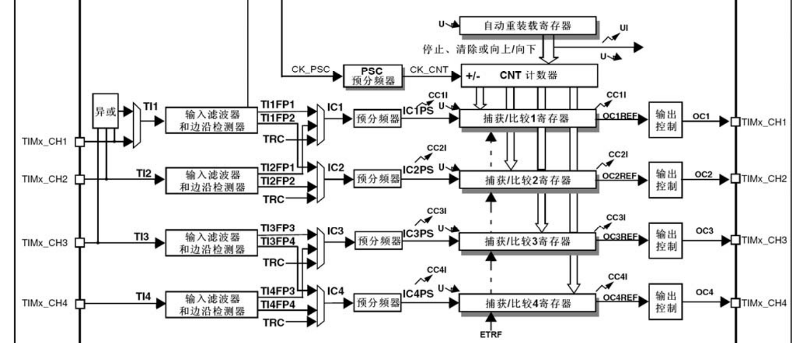
- **异或门**
  - 在当三个输入引脚电平发生翻转时输出引脚产生一次电平翻转，然后可以通过通道选择器，进入通道1
  - 用于连接三相无刷电机的传感器检测转子的位置，根据位置换相。
- **输入滤波器和边沿检测器**
  - 输入滤波器可以对信号进行滤波，避免高频毛刺信号误触发。
  - 边沿检测电路可以选择触发模式，上首页触发，下降沿触发等。
  - 两套相同的电路
    - 实际上有两套相同的电路，
      - 如图，TI1FP1、TI1FP2就是这两套电路的输出，分别传递给IC1和IC2
      - 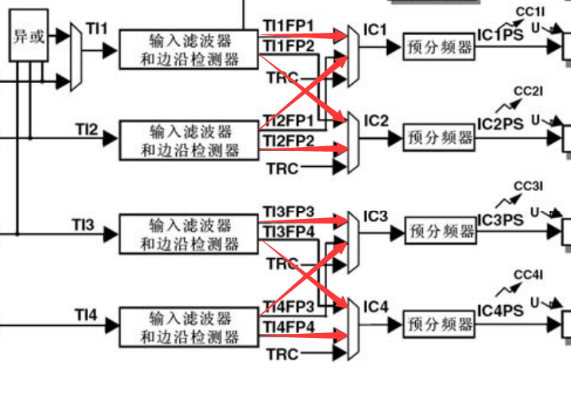
    - 目的：
      - 1.可以灵活切换捕获电路的输入：后续电路配置保持不变，可以将信号输入从ch1切换到ch2
      - 2.可以把一个引脚的输入，同时映射到两个捕获寄存器，
        - PWMI模式
          - 第一个通道使用上升沿触发，用于捕获周期
          - 第二个通道使用下降沿触发，用于捕获占空比
- **预分频器**
  - 每个通道有一个，共四个，可以对前面的信号进行分频，
  - 分频后的触发信号可以触发后续捕获电路工作
- **捕获寄存器**
  - 每从预分频器来一个触发信号,CNT寄存器的值就会向CCR寄存器转运一次。
  - 转运的同时，会发生一个捕获事件，这个事件会在状态寄存器置标志位，同时产生中断。
  - 如有需要，可开启该**捕获中断**。

**捕获/比较通道框图**

- 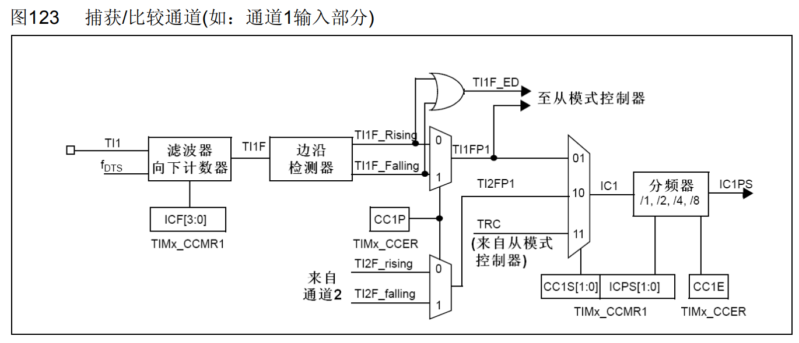
- **滤波器**
  - TI1(也就是CH1引脚)为滤波器的输入，
  - TI1F为滤波器的输出
  - FDTS为滤波器的采样时钟来源
  - CCMR1寄存器的`ICF[3:0]`位可以控制滤波器的参数
  - 滤波器工作原理：
    - 以采样频率对输入信号采样，
    - 当连项N个值都为高电平时输出才为高电平，
    - 当连项N个值都为低电平时输出才为低电平，
    - 如果信号出现高频抖动，导致连续的N个值不完全一样，那么输出就不会发生变化，就达到了滤波的效果。
    - 采样频率越低，采样个数N越大，滤波效果就越好，但失真就越严重。
    - 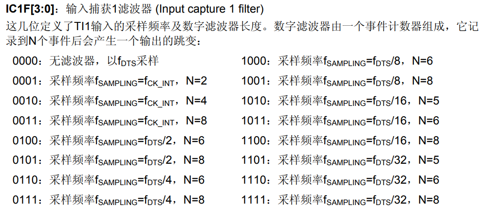
- **边沿检测器**
  - `TI1F`是边沿检测器的输入
  - `TI1F_Rising`是边沿检测器的上升沿检测结果输出
  - `TI1F_Falling`是边沿检测器的下降沿检测结果输出
  - `TI1F_Rising`和`TI1F_Falling`通过数据选择器输出`TI1FP1`信号
  - `CCER寄存器的CC1P位`用来控制数据选择器
- **分频器**
  - `TI1FP1`通过数据选择器进入分频器电路。
    - `CC1S[1:0]`两个位用来控制数据选择器
  - `ICPS[1:0]`可以配置分频器，决定使用1/2/4/8分频
  - `CC1E`位控制输出使能或失能
  - 使能后，`IC1PS`就能让CNT寄存器的值转运的到CCR寄存器中。
- **CNT的清零**
  - `TI1F_ED` 和 `TI1FP1`信号都还通向从模式控制器
  - 在从模式的电路中，就可以完成CNT寄存器的清零工作

**主模式、从模式、触发源选择**

- 
- **主模式**
  - 可以将定时器内部的信号映射到TRGO引脚，用于触发控制其他外设。
- **从模式**
  - 用于接收其他外设或自身外设的信号，用于实现受控于其他信号或外设。
- **触发源选择**
  - 用于选择从模式的触发信号源，可以认为是从模式的一部分。
  - 选择指定的信号联通TRGI,TRGI再去触发从模式，从模式可以从列表中选择一个操作来自动执行。
- 案例：
  - 自动清零CNT寄存器
    - 触发源选择`TI1FP1`,
    - 从模式选择`Reset`，
    - 即可实现自动清零CNT寄存器
  - 定时器的级联
    - 一个定时器使用主模式将更新信号输出到TRGO,
    - 另一个定时器将触发源选择为前一个定时器的输出作为TRGI并将从模式选择为外部时钟模式1，
    - 即可将前一个定时器的输出作为后一个定时器的外部时钟，实现了定时器的级联

### 案例：定时中断

**定时中断基本结构**

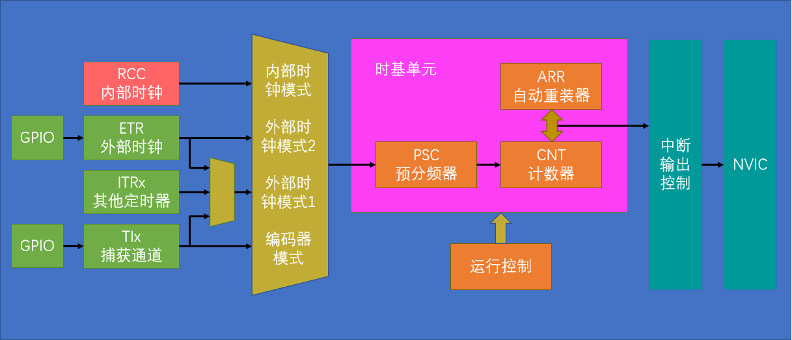

**实现定时中断的基本步骤**

1. 通过 RCC 开启相关外设时钟
2. 为时基单元选择时钟源：内部时钟源、外部时钟模式、编码器模式
3. 配置时基单元：预分频器、自动重装器、计数模式
4. 配置输出中断控制: 允许输出中断到NVIC
5. 配置NVIC: 打开定时中断通道、分配中断优先级
6. 运行控制：使能计数器

#### 案例：利用内部时钟源实现`setInterval(callback,ms)`

setInterval是一个在前端开发中经常使用的函数，这里尝试实现一下

:::code-tabs

@tab `main.cpp`

```c
#include "stm32f10x.h"
#include "OLED.h"
#include "Timer2.h"

uint16_t num = 0;
void update_callback()
{
    num++;
}

int main(void)
{
    OLED_Init();
    Timer2_setInterval(update_callback, 1000);
    while (1)
    {
        OLED_ShowString(1, 1, "Hello World!!!");
        OLED_ShowNum(2, 1, num, 10);
    }
}
```

@tab `Timer2.c`

```c
#include "stm32f10x.h"
#include "Timer2.h"
#include <stddef.h>

void (*callback)() = NULL;

/**
 * @arg _callback 回调函数
 * @arg ms 毫秒 取值范围 [1,0xffff/10+1]
 */
void Timer2_setInterval(void (*_callback)(), uint16_t ms)
{
    // 步骤
    // 1. 通过 RCC 开启相关外设时钟
    // 2. 为时基单元选择时钟源：内部时钟源、外部时钟模式、编码器模式
    // 3. 配置时基单元：预分频器、自动重装器、计数模式
    // 4. 配置输出中断控制: 允许输出中断到NVIC
    // 5. 配置NVIC: 打开定时中断通道、分配中断优先级
    // 6. 运行控制：使能计数器

    // 1开启Tim2外设时钟
    RCC_APB1PeriphClockCmd(RCC_APB1Periph_TIM2, ENABLE);

    // 2为TIM2时基单元选择内部时钟（可不写，默认使用内部时钟）
    TIM_InternalClockConfig(TIM2);

    // 3配置时基单元
    // CK_CNT_OV计数器溢出频率 = CK_CNT定时器时钟/(ARR重装值+1) = CK_PSC内部时钟/(PSC预分频器+1)/(ARR重装值+1)
    // 溢出频率
    //      1s => 72Mhz / 7.2k / 10k => 1s
    //      1ms => 72Mhz / 7.2k / 10  => 1ms
    TIM_TimeBaseInitTypeDef TIM_TimeBaseInitStruct;
    TIM_TimeBaseInitStruct.TIM_ClockDivision = TIM_CKD_DIV1;     // 采样点数，外部时钟信号滤波器的一个参数，这里填一分频，也就是不分频，那么就会以（内部时钟频率/1）的频率对外部时钟信号进行采样，这里用不到，随便写
    TIM_TimeBaseInitStruct.TIM_CounterMode = TIM_CounterMode_Up; // 计数模式，向上计数
    TIM_TimeBaseInitStruct.TIM_Prescaler = 7200 - 1;             // 预分频器
    TIM_TimeBaseInitStruct.TIM_Period = 10 * ms - 1;             // 自动重装器
    TIM_TimeBaseInitStruct.TIM_RepetitionCounter = 0;            // 重复计数器，高级定时器才有
    TIM_TimeBaseInit(TIM2, &TIM_TimeBaseInitStruct);

    // 上面配置时基单元的函数为了让写入预分频器和自动重装器的值立即生效，
    // 手动触发了更新事件，这里要清除一下，否则中断函数也会立即执行一次
    TIM_ClearFlag(TIM2, TIM_FLAG_Update);

    // 4把TIM2的更新中断连接到NVIC
    TIM_ITConfig(TIM2, TIM_IT_Update, ENABLE);

    // 5配置NVIC优先级
    NVIC_PriorityGroupConfig(NVIC_PriorityGroup_2);
    NVIC_InitTypeDef NVIC_InitStruct;
    NVIC_InitStruct.NVIC_IRQChannel = TIM2_IRQn;           // 定时器2中断通道
    NVIC_InitStruct.NVIC_IRQChannelCmd = ENABLE;           // 启用
    NVIC_InitStruct.NVIC_IRQChannelPreemptionPriority = 0; // 抢占优先级
    NVIC_InitStruct.NVIC_IRQChannelSubPriority = 0;        // 响应优先级
    NVIC_Init(&NVIC_InitStruct);

    // 回调
    callback = _callback;
    // 6启动定时器
    TIM_Cmd(TIM2, ENABLE);
}
/**
 * 清除定时器
 */
void Timer2_ClearInterval()
{
    TIM_Cmd(TIM2, DISABLE);
    RCC_APB1PeriphClockCmd(RCC_APB1Periph_TIM2, DISABLE);
    callback = NULL;
}
/**
 * 重写中断函数
 */
void TIM2_IRQHandler()
{
    if (TIM_GetITStatus(TIM2, TIM_IT_Update) == SET)
    {
        if (callback)
            callback();
        // 清除更新中断Pending标志
        TIM_ClearITPendingBit(TIM2, TIM_IT_Update);
    }
}
```

@tab `Timer2.h`

```c
#ifndef __Timer2_H__
#define __Timer2_H__

#ifdef __cplusplus
extern "C" {
#endif

    void Timer2_setInterval(void (*_callback)(), uint16_t ms);
    void Timer2_ClearInterval();

#ifdef __cplusplus
}
#endif

#endif
```

:::

#### 案例：利用外部时钟源实现`setInterval(callback,times)`

:::code-tabs

@tab `main.cpp`

```c
#include "stm32f10x.h"
#include "OLED.h"
#include "Timer2.h"

uint16_t num = 0;
void update_callback()
{
    num++;
}

int main(void)
{
    OLED_Init();
    Timer2_setInterval(update_callback, 2);
    while (1)
    {
        OLED_ShowString(1, 1, "Hello World!!!");
        OLED_ShowNum(2, 1, num, 10);
    }
}

```

@tab `Timer2.c`

```c
#include "stm32f10x.h"
#include "Timer2.h"
#include <stddef.h>

void (*callback)() = NULL;

/**
 * @brief 外部触发times次后执行传入的_callback函数
 * @arg _callback 回调函数
 * @arg times 计数次数 取值范围 [1,0xffff-1]
 */
void Timer2_setInterval(void (*_callback)(), uint16_t times)
{
    // 步骤
    // 1. 通过 RCC 开启相关外设时钟
    // 2. 为时基单元选择时钟源：内部时钟源、外部时钟模式、编码器模式
    // 3. 配置时基单元：预分频器、自动重装器、计数模式
    // 4. 配置输出中断控制: 允许输出中断到NVIC
    // 5. 配置NVIC: 打开定时中断通道、分配中断优先级
    // 6. 运行控制：使能计数器

    // 1开启Tim2外设时钟
    RCC_APB1PeriphClockCmd(RCC_APB1Periph_TIM2, ENABLE);

    // 2为TIM2时基单元选择外部时钟
    // 2.1 PA0默认复用功能是TIM2_CH1_ETR,这里要配置PA0
    RCC_APB2PeriphClockCmd(RCC_APB2Periph_GPIOA, ENABLE);
    GPIO_InitTypeDef GPIO_InitStruct = {GPIO_Pin_0, GPIO_Speed_50MHz, GPIO_Mode_IPU};
    GPIO_Init(GPIOA, &GPIO_InitStruct);
    // 2.2 配置外部时钟2
    TIM_ETRClockMode2Config(
        TIM2,                        // 配置TIM2
        TIM_ExtTRGPSC_OFF,           // 外部时钟分频
        TIM_ExtTRGPolarity_Inverted, // 下降沿触发
        0x00                         // 滤波器配置
    );

    // 3配置时基单元
    TIM_TimeBaseInitTypeDef TIM_TimeBaseInitStruct;
    TIM_TimeBaseInitStruct.TIM_ClockDivision = TIM_CKD_DIV1;     // 采样点数，外部时钟信号滤波器的一个参数，这里填一分频，也就是不分频，那么就会以（内部时钟频率/1）的频率对外部时钟信号进行采样，这里用不到，随便写
    TIM_TimeBaseInitStruct.TIM_CounterMode = TIM_CounterMode_Up; // 计数模式，向上计数
    TIM_TimeBaseInitStruct.TIM_Prescaler = 1 - 1;                // 预分频器
    TIM_TimeBaseInitStruct.TIM_Period = times - 1;               // 自动重装器
    TIM_TimeBaseInitStruct.TIM_RepetitionCounter = 0;            // 重复计数器，高级定时器才有
    TIM_TimeBaseInit(TIM2, &TIM_TimeBaseInitStruct);

    // 上面配置时基单元的函数为了让写入预分频器和自动重装器的值立即生效，
    // 手动触发了更新事件，这里要清除一下，否则中断函数也会立即执行一次
    TIM_ClearFlag(TIM2, TIM_FLAG_Update);

    // 4把TIM2的更新中断连接到NVIC
    TIM_ITConfig(TIM2, TIM_IT_Update, ENABLE);

    // 5配置NVIC优先级
    NVIC_PriorityGroupConfig(NVIC_PriorityGroup_2);
    NVIC_InitTypeDef NVIC_InitStruct;
    NVIC_InitStruct.NVIC_IRQChannel = TIM2_IRQn;           // 定时器2中断通道
    NVIC_InitStruct.NVIC_IRQChannelCmd = ENABLE;           // 启用
    NVIC_InitStruct.NVIC_IRQChannelPreemptionPriority = 0; // 抢占优先级
    NVIC_InitStruct.NVIC_IRQChannelSubPriority = 0;        // 响应优先级
    NVIC_Init(&NVIC_InitStruct);

    // 回调
    callback = _callback;
    // 6启动定时器
    TIM_Cmd(TIM2, ENABLE);
}
/**
 * 清除定时器
 */
void Timer2_ClearInterval()
{
    TIM_Cmd(TIM2, DISABLE);
    RCC_APB1PeriphClockCmd(RCC_APB1Periph_TIM2, DISABLE);
    RCC_APB2PeriphClockCmd(RCC_APB2Periph_GPIOA, DISABLE);
    callback = NULL;
}
/**
 * 重写中断函数
 */
void TIM2_IRQHandler()
{
    if (TIM_GetITStatus(TIM2, TIM_IT_Update) == SET)
    {
        if (callback)
            callback();
        // 清除更新中断Pending标志
        TIM_ClearITPendingBit(TIM2, TIM_IT_Update);
    }
}
```

@tab `Timer2.h`

```c
#ifndef __Timer2_H__
#define __Timer2_H__

#ifdef __cplusplus
extern "C"
{
#endif

    void Timer2_setInterval(void (*_callback)(), uint16_t times);
    void Timer2_ClearInterval();

#ifdef __cplusplus
}
#endif

#endif
```

:::

### 案例：LED呼吸灯

:::code-tabs

@tab `PWM.c`

```cpp
#include "PWM.h"
/**
 * 产生PWM波，精度1% 频率1k 占空比默认50% 可调
 */
void Timer2_PWM_Init()
{
    // 步骤
    // 1. 通过 RCC 开启相关外设时钟
    // 2. 为时基单元选择时钟源：内部时钟源
    // 3. 配置时基单元：预分频器、自动重装器、计数模式
    // 4. 初始化输出比较单元
    // 5. 配置GPIO
    // 6. 运行控制：使能计数器

    // 1开启Tim2外设时钟
    RCC_APB1PeriphClockCmd(RCC_APB1Periph_TIM2, ENABLE);

    // 2为TIM2时基单元选择内部
    TIM_InternalClockConfig(TIM2);

    // 3配置时基单元
    // 72Mhz -> /720 = 100khz  -> /100 -> 1khz
    TIM_TimeBaseInitTypeDef TIM_TimeBaseInitStruct;
    TIM_TimeBaseInitStruct.TIM_ClockDivision = TIM_CKD_DIV1;     // 采样点数，外部时钟信号滤波器的一个参数，这里填一分频，也就是不分频，那么就会以（内部时钟频率/1）的频率对外部时钟信号进行采样，这里用不到，随便写
    TIM_TimeBaseInitStruct.TIM_CounterMode = TIM_CounterMode_Up; // 计数模式，向上计数
    TIM_TimeBaseInitStruct.TIM_Prescaler = 720 - 1;              // 预分频器 PSC
    TIM_TimeBaseInitStruct.TIM_Period = 100 - 1;                 // 自动重装器 ARR
    TIM_TimeBaseInitStruct.TIM_RepetitionCounter = 0;            // 重复计数器，高级定时器才有
    TIM_TimeBaseInit(TIM2, &TIM_TimeBaseInitStruct);

    // 4. 初始化输出比较单元
    TIM_OCInitTypeDef TIM_OCInitStruct;
    // 初始化结构体，赋默认值，因为该结构体中有些属性是生效于高级定时器的，
    // 这里没有为这些属性赋值，又由于这里是局部变量，那么这些属性的值就是不确定的，
    // 这些未赋值的属性可能会对高级定时器的输出造成影响
    TIM_OCStructInit(&TIM_OCInitStruct);

    // 占空比
    TIM_OCInitStruct.TIM_OCMode = TIM_OCMode_PWM1;             // 设置输出比较模式
    TIM_OCInitStruct.TIM_OCPolarity = TIM_OCPolarity_High;     // 设置输出比较极性
    TIM_OCInitStruct.TIM_OutputState = TIM_OutputState_Enable; // 设置输出使能
    TIM_OCInitStruct.TIM_Pulse = 0;                            // 设置CCR捕获比较寄存器的值 [0x0000 and 0xFFFF]
    // OC1 是对ch1通道初始化
    TIM_OC1Init(TIM2, &TIM_OCInitStruct);

    // 5.1 配置AFIO
    // 端口重映射
    // RCC_APB2PeriphClockCmd(RCC_APB2Periph_AFIO, ENABLE);      // 开启AFIO时钟
    // GPIO_PinRemapConfig(GPIO_PartialRemap1_TIM2, ENABLE);     // 配置TIM2重映射1，这样tim2_ch1就用重映射到PA15上
    // GPIO_PinRemapConfig(GPIO_Remap_SWJ_JTAGDisable, ENABLE); // 配置关闭Jtag调试端口重映射，这样PA15 PB3 PB4三个端口就成为了GPIO口

    // 5.2 配置GPIO,
    // 根据手册 Timer2的ch1输出比较通道连接在了GPIO_A0上
    RCC_APB2PeriphClockCmd(RCC_APB2Periph_GPIOA, ENABLE);
    GPIO_InitTypeDef GPIO_InitStruct = {
        GPIO_Pin_0  // Timer2_ch1 ==默认==> GPIO_A0
        // | GPIO_Pin_15 // Timer2_ch1 ==重映射==> GPIO_A15
        ,
        GPIO_Speed_50MHz,
        GPIO_Mode_AF_PP // 必须设置复用推挽输出，引脚的输出控制才会和输出数据寄存器断开，和片上外设复用功能输出连接
    };
    GPIO_Init(GPIOA, &GPIO_InitStruct);

    // 6启动定时器
    TIM_Cmd(TIM2, ENABLE);
}
/**
 * 设置占空比（0~100）
 */
void Timer2_PWM_SetDuty(uint8_t duty)
{
    TIM_SetCompare1(TIM2, duty);
}

```

@tab `PWM.h`

```cpp
#ifndef __PWM_H__
#define __PWM_H__
#include "stm32f10x.h"

#ifdef __cplusplus
extern "C"
{
#endif

    void Timer2_PWM_Init();
    void Timer2_PWM_SetDuty(uint8_t duty);

#ifdef __cplusplus
}
#endif

#endif
```

@tab `main.cpp`

```cpp
#include "stm32f10x.h"
#include "OLED.h"
#include "Delay.h"
#include "PWM.h"

int8_t step = 1;
uint16_t duty = 0;

int main(void)
{
    OLED_Init();
    Timer2_PWM_Init();
    OLED_ShowString(1, 1, "Duty:");
    while (1)
    {
        OLED_ShowNum(1, 6, duty, 3);
        Timer2_PWM_SetDuty(duty);
        Delay_ms(5);
        duty += step;
        if (duty == 0) step = 1;
        if (duty == 100) step = -1;
    }
}
```

:::

### 案例：舵机驱动

- 舵机是一种根据输入PWM信号占空比来控制输出角度的装置
- 执行逻辑：
  - PWM输入到控制板，给控制板一个目标角度
  - 通过点位器检测输出轴的当前角度
  - 大于目标角度，电机反转
  - 小于目标角度，电机正转
- SG90舵机
  - PWM要求：
    - 周期:20ms（50Hz），
    - 高电平宽度为:0.5ms~2.5ms
      - `0.5ms -> -90°` 占空比：0.5/20 -> 2.5%
      - `1.5ms -> 0°` 占空比：1.5/20 -> 7.5%
      - `2.5ms -> +90°` 占空比：2.5/20 -> 12.5%
  - 
  - 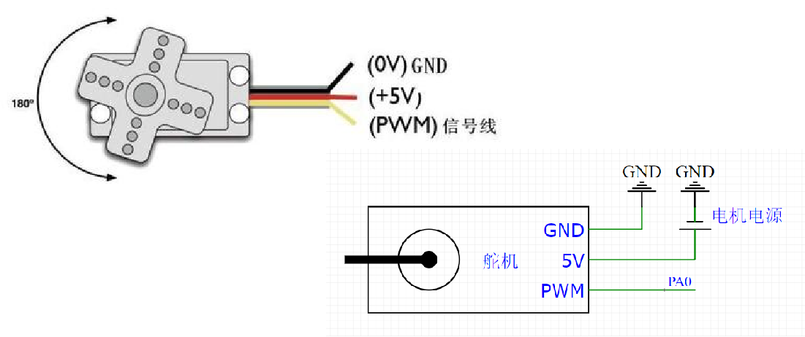

:::code-tabs

@tab `PWM.c`

```cpp
#include "PWM.h"
/**
 * 产生PWM波，精度1% 频率1k 占空比默认50% 可调
 */
void Timer2_PWM_Init()
{
    // 步骤
    // 1. 通过 RCC 开启相关外设时钟
    // 2. 为时基单元选择时钟源：内部时钟源
    // 3. 配置时基单元：预分频器、自动重装器、计数模式
    // 4. 初始化输出比较单元
    // 5. 配置GPIO
    // 6. 运行控制：使能计数器

    // 1开启Tim2外设时钟
    RCC_APB1PeriphClockCmd(RCC_APB1Periph_TIM2, ENABLE);

    // 2为TIM2时基单元选择内部
    TIM_InternalClockConfig(TIM2);

    // 3配置时基单元
    // 72Mhz -> /72 = 1M  -> /20k -> 50hz

    TIM_TimeBaseInitTypeDef TIM_TimeBaseInitStruct;
    TIM_TimeBaseInitStruct.TIM_ClockDivision = TIM_CKD_DIV1;     // 采样点数，外部时钟信号滤波器的一个参数，这里填一分频，也就是不分频，那么就会以（内部时钟频率/1）的频率对外部时钟信号进行采样，这里用不到，随便写
    TIM_TimeBaseInitStruct.TIM_CounterMode = TIM_CounterMode_Up; // 计数模式，向上计数
    TIM_TimeBaseInitStruct.TIM_Prescaler = 72 - 1;               // 预分频器 PSC
    TIM_TimeBaseInitStruct.TIM_Period = 20000 - 1;               // 自动重装器 ARR
    TIM_TimeBaseInitStruct.TIM_RepetitionCounter = 0;            // 重复计数器，高级定时器才有
    TIM_TimeBaseInit(TIM2, &TIM_TimeBaseInitStruct);

    // 4. 初始化输出比较单元
    TIM_OCInitTypeDef TIM_OCInitStruct;
    // 初始化结构体，赋默认值，因为该结构体中有些属性是生效于高级定时器的，
    // 这里没有为这些属性赋值，又由于这里是局部变量，那么这些属性的值就是不确定的，
    // 这些未赋值的属性可能会对高级定时器的输出造成影响
    TIM_OCStructInit(&TIM_OCInitStruct);

    // 占空比
    TIM_OCInitStruct.TIM_OCMode = TIM_OCMode_PWM1;             // 设置输出比较模式
    TIM_OCInitStruct.TIM_OCPolarity = TIM_OCPolarity_High;     // 设置输出比较极性
    TIM_OCInitStruct.TIM_OutputState = TIM_OutputState_Enable; // 设置输出使能
    TIM_OCInitStruct.TIM_Pulse = 0;                            // 设置CCR捕获比较寄存器的值 [0x0000 and 0xFFFF]
    // OC1 是对ch1通道初始化
    TIM_OC1Init(TIM2, &TIM_OCInitStruct);

    // 5 配置GPIO,
    // 根据手册 Timer2的ch1输出比较通道连接在了GPIO_A0上
    RCC_APB2PeriphClockCmd(RCC_APB2Periph_GPIOA, ENABLE);
    GPIO_InitTypeDef GPIO_InitStruct = {
        GPIO_Pin_0 // Timer2_ch1 ==默认==> GPIO_A0
        ,
        GPIO_Speed_50MHz,
        GPIO_Mode_AF_PP // 必须设置复用推挽输出，引脚的输出控制才会和输出数据寄存器断开，和片上外设复用功能输出连接
    };
    GPIO_Init(GPIOA, &GPIO_InitStruct);

    // 6启动定时器
    TIM_Cmd(TIM2, ENABLE);
}
/**
 * 设置角度[0,180]
 */
void Timer2_PWM_SetDegree(float degree)
{
    // 20ms -> 20k
    // 0°：     0.5ms -> 0.5k
    // +90°：   1.5ms -> 1.5k
    // +180°：  2.5ms -> 2.5k

    // 1deg -> 0.5k + 1k/90
    TIM_SetCompare1(TIM2,500+degree*(1000/90.0));
}
```

@tab `PWM.h`

```cpp
#ifndef __PWM_H__
#define __PWM_H__
#include "stm32f10x.h"

#ifdef __cplusplus
extern "C"
{
#endif

    void Timer2_PWM_Init();
    void Timer2_PWM_SetDegree(float degree);

#ifdef __cplusplus
}
#endif

#endif
```

@tab `main.cpp`

```cpp
#include "stm32f10x.h"
#include "OLED.h"
#include "Delay.h"
#include "PWM.h"
#include <math.h>

float degree = 0;

float random(float from,float to){
    float rand_0_1 = (float)rand() / RAND_MAX;
    return rand_0_1 * (to - from) + from;
}

int main(void)
{
    OLED_Init();
    Timer2_PWM_Init();
    OLED_ShowString(1, 1, "Degree:");
    while (1)
    {
        OLED_ShowSignedNum(1, 7, degree, 5);
        Timer2_PWM_SetDegree(degree);
        Delay_ms(1000);
        degree = random(0,180);
    }
}
```

:::

##### 直流电机与驱动电路

- 直流电机是一种将电能转换为机械能的装置，有两个电极，当电极正接时，电机正转，当电极反接时，电机反转
- 直流电机属于大功率器件，GPIO口无法直接驱动，需要配合电机驱动电路来操作

**TB6612**

- TB6612是一款双路H桥型的直流电机驱动芯片，
- 可以驱动两个直流电机并且控制其转速和方向
- 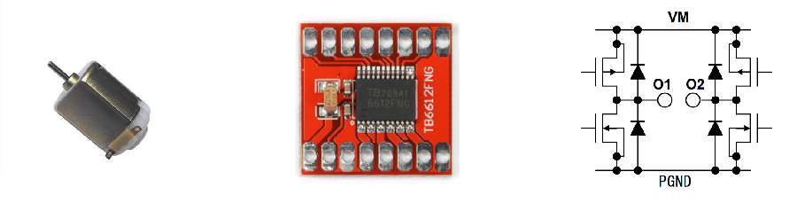
- 
  - MV脚电压功率可以和电机功率保持一致
  - VCC脚电压可以和单片机供电电压保持一致
  - STBY(Stand By)待机控制脚，低电平芯片不工作
- 

`TB6612FNG.pdf`

**Features:**

- Power supply voltage ； VM=15V（Max.）
- Output current ； Iout=1.2A(ave) / 3.2A (peak)
- Output low ON resistor； 0.5Ω (upper＋lower Typ. @VM≧5V)
- Standby (Power save) system
- CW/CCW/short brake/stop function modes
- Built-in thermal shutdown circuit and low voltage detecting circuit
- Small faced package（SSOP24：0.65mm Lead pitch）
- Response to Pb free packaging
- 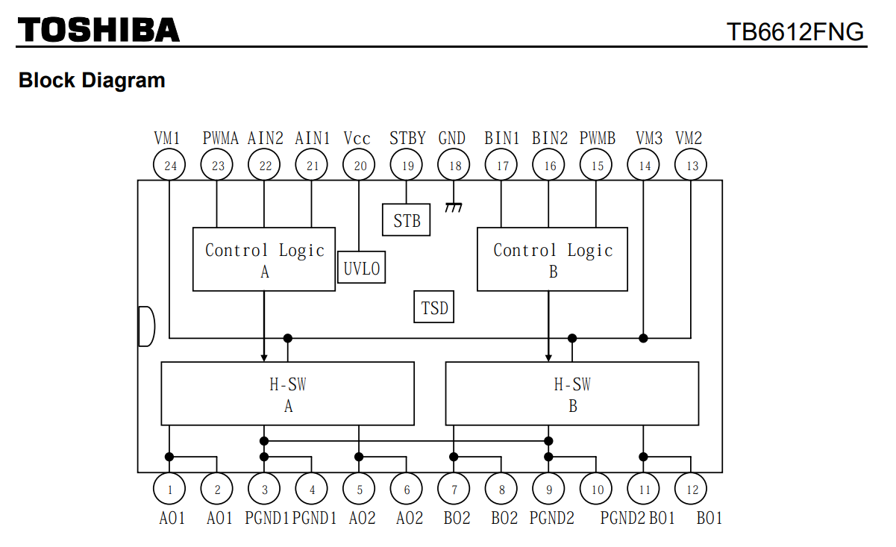

**接线图：**

**示例代码：**

:::code-tabs

@tab `main.cpp`

```c
#include "stm32f10x.h"
#include "OLED.h"
#include "Delay.h"
#include "PWM.h"

int8_t step = 1;
uint16_t duty = 0;

int main(void)
{
    OLED_Init();
    Timer2_PWM_Init();
    OLED_ShowString(1, 1, "Duty:");
    while (1)
    {
        OLED_ShowNum(1, 6, duty, 3);
        Timer2_PWM_SetDuty(duty);
        duty += 5;
        Delay_ms(100);
        duty %= 100;
    }
}
```

:::

### 案例：定时器输出捕获——测量方波

**频率测量**

- 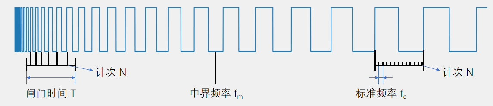
- 测频法：在闸门时间T内，对上升沿计次，得到N，则频率 $f_x=N/T$
- 测周法：两个上升沿内，以标准频率fc计次，得到N ，则频率 $f_x=f_c/N$
- 中界频率：测频法与测周法误差相等的频率点 $f_m=\sqrt{f_c/T}$

**输入捕获基本结构**

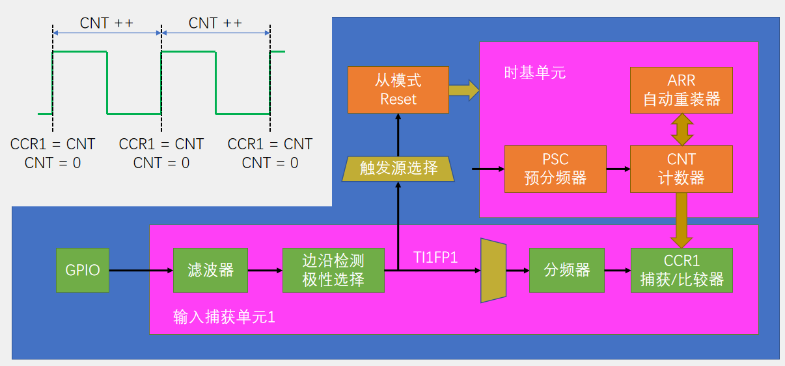

**测频原理/流程**

- 方波信号通过GPIO口进入输入捕获单元1，
- 首先进入滤波器滤波，滤除高频杂波，
- 然后经过边沿检测电路，检测上升沿信号，
- 上升沿信号进入分频器，分频器配置为1分频，
- 输出不分频的方波信号，
- 在上升沿，触发实现将CNT寄存器的值搬运到CCR1寄存器，
- 然后CNT寄存器被从模式Reset清零。
- CNT被清零后重新计数
- 当方波信号的下一个上升沿来到时，
- CNT寄存器的值就代表了被测方波信号一个周期的时长，
- 然后CNT寄存器的值再次被搬运到CCR1寄存器，
- CNT被再次清零重新计数
- 这样只要读取CCR1寄存器的值，就能计算出被测方波信号的频率
- 具体计算方法为测周法的计算公式：被测方波频率=CNT计数频率/CCR1寄存器值

**步骤**

1. 配置GPIO
   1. 通过RCC寄存器开启GPIO时钟
   2. 初始化GPIO：配置为输入模式、上拉或浮空输入
2. 配置AFIO(如果需要重映射的话)
3. 配置定时器
   1. 通过RCC寄存器开启TIM时钟
   2. 配置时基单元（时钟源、预分频器、计数器自增模式、自动重装器）
   3. 配置输入捕获单元（滤波器、边沿检测、通道直连或交叉、分频器）
   4. 配置实现自动清零计数器
      1. 配置从模式触发源（触发源为TI1FP1）
      2. 配置触发操作（触发Reset操作）
4. 开启定时器
5. 获取频率
   - N=CCR寄存器
   - f_c = CNT计数频率
   - Freq = f_c / N

:::code-tabs
@tab `User/main.cpp`
@[code cpp](./projects/stm32-makefile/08-Timer-输入比较-测PWM频率/User/main.cpp)

@tab `/System/InputCompare.h`
@[code cpp](./projects/stm32-makefile/08-Timer-输入比较-测PWM频率/System/InputCompare.h)

@tab `/System/InputCompare.c`
@[code cpp](./projects/stm32-makefile/08-Timer-输入比较-测PWM频率/System/InputCompare.c)

@tab `/System/PWM.h`
@[code cpp](./projects/stm32-makefile/08-Timer-输入比较-测PWM频率/System/PWM.h)

@tab `/System/PWM.c`
@[code cpp](./projects/stm32-makefile/08-Timer-输入比较-测PWM频率/System/PWM.c)
:::

**PWMI模式结构（同时测量频率和占空比）**


**测频原理/流程**

- 通道1用于测频率，和上面说的原理一样
- 通道2用于测占空比，
- 原理是，当第一个上升沿来到是，CNT计数器清零并重新计数，
- TIFP2配置为下降沿触发，那么当遇到方波中下降沿时，
- 通道2的分频器触发实现将CNT的值搬运到CCR2寄存器，
- 这个时候CNT的值记录的就是第一个上升沿到第一个下降沿之间的时常，也就能计算出占空比。
- 当遇到第二个上升沿时，CNT被清零，重新开始计数。

:::code-tabs
@tab `User/main.cpp`
@[code cpp](./projects/stm32-makefile/09-Timer-输入比较-PWMI模式-测PWM频率和脉冲宽度-占空比/User/main.cpp)

@tab `/System/InputCompare.h`
@[code cpp](./projects/stm32-makefile/09-Timer-输入比较-PWMI模式-测PWM频率和脉冲宽度-占空比/System/InputCompare.h)

@tab `/System/InputCompare.c`
@[code cpp](./projects/stm32-makefile/09-Timer-输入比较-PWMI模式-测PWM频率和脉冲宽度-占空比/System/InputCompare.c)

@tab `/System/PWM.h`
@[code cpp](./projects/stm32-makefile/09-Timer-输入比较-PWMI模式-测PWM频率和脉冲宽度-占空比/System/PWM.h)

@tab `/System/PWM.c`
@[code cpp](./projects/stm32-makefile/09-Timer-输入比较-PWMI模式-测PWM频率和脉冲宽度-占空比/System/PWM.c)
:::

### 编码器接口

**EncoderInterface编码器接口**

- 编码器接口可接收增量（正交）编码器的信号，根据编码器旋转产生的正交信号脉冲，自动控制CNT计数寄存器自增或自减，从而指示编码器的位置、旋转方向和旋转速度
- 高级定时器和通用定时器都拥有1个编码器接口
- 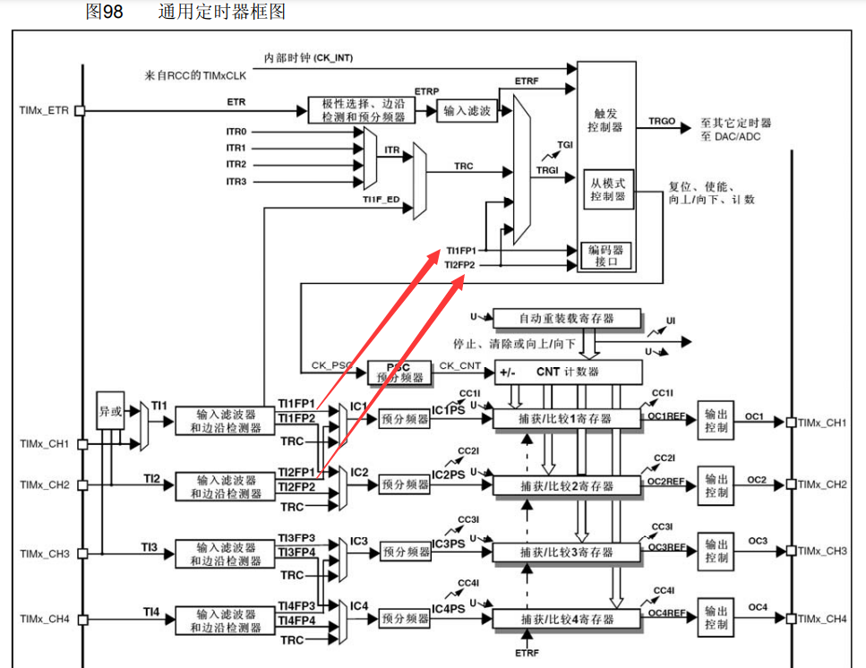

**原理简图**

- 两个输入引脚来自输入捕获的通道1和通道2
- 不需要配置计数时钟和计数方向，因为增或减有编码器决定，
- 可以配置预分频器
- 可以配置ARR自动重装寄存器为0xffff，防止CNT过早溢出
- CNT计数器
  - 编码器读取到正转信号时，CNT自增，值为：0 1 2 3，可用来获取编码器位置
  - 编码器读取到反转信号时，CNT自减：值为：0 0xffff 0xfffe 0xfffd 转换成int16为：0 -1 -2 -3
- 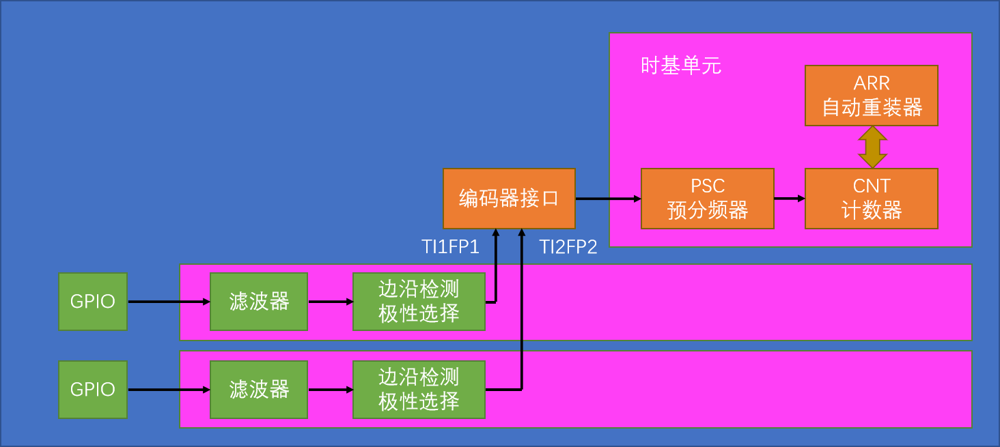

**正交信号波形**

- 规律就是，
  - 正转时，
    - A相上升沿，B相低电平
    - A相下降沿，B相高电平
  - 反转时，
    - A相上升沿，B相高电平
    - A相下升沿，B相低电平
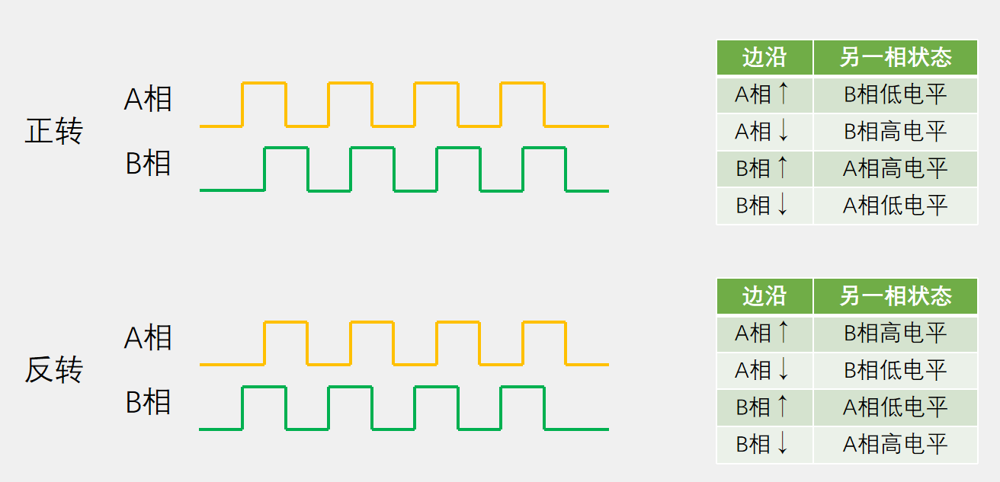

**编码器的三种工作模式**

- 第一种模式就是只对通道1计数
- 第二种模式就是只对通道2计数
- 第三种模式就是对通道1和通道2计数
- 计数的条件就是要看AB两相的波形是否满足条件，比如说，
  - A相上升沿，B相低电平，则判断为编码器正转，计数器自增
  - A相下升沿，B相高电平，则判断为编码器反转，计数器自减
- 

**编码器模式下的计数器**

- 
- 将其中任意一相波形反向，计数器增长方向也将发生改变
- 

### 编码器测位置、测速案例

**步骤**

- 配置GPIO
  - 通过RCC寄存器开启GPIO外设时钟
  - 配置IO口为输入模式，上拉 下拉 或 浮空
- 配置TIM定时器
  - 通过RCC寄存器开启TIM定时器外设时钟
  - 配置时基单元
    - 预分频器可以不分频
    - 自动重装器可以配置为0xffff
  - 配置输入捕获单元
    - 配置滤波器
    - 配置边沿检测(极性选择器)，
    - 配置编码器接口模式
- 启动定时器
- 位置
  - 读取CNT计数器的值，转换成int16，代表了位置
- 速度
  - 方法1
    - 两次读取的位置值的差，比上两次读取的时间间隔，就是速度
    - V = (上一次读取的位置值-当前位置值) / 两次读取的时间间隔
    - = dP/dt
    - 但是这里的dt不能太大，否则会丢失精度，读取频率的周期要大于旋转速度
  - 方法2
    - 以一定的时间间隔t去读取计数器的值p，然后清空计数器
    - V = p/t
    - t不能太大
  - 方法3
    - 定时时间t,中断读取计数器的值p,然后清空计数器
    - V = p/t
    - t不能太大
  - 第一种方法可以同时得到位置信息和速度信息
  - 后两种方法要清空计数器，会丢失位置信息

:::code-tabs

@tab `main.cpp`
@[code cpp](./projects/stm32-makefile/10-Timer-编码器模式-测位置-测速度/User/main.cpp)

@tab `System/EncoderInterface.c`
@[code cpp](./projects/stm32-makefile/10-Timer-编码器模式-测位置-测速度/System/EncoderInterface.c)

@tab `System/EncoderInterface.h`
@[code cpp](./projects/stm32-makefile/10-Timer-编码器模式-测位置-测速度/System/EncoderInterface.h)

:::

## ADC模拟/数字转化器

### ADC概念

**ADC简介**

- ADC（Analog-Digital Converter）模拟-数字转换器
- 可将引脚的模拟电压转换数字量
- 12位逐次逼近型ADC，最快1us转换时间
- 输入电压范围：0~3.3V，转换结果范围：0~4095
- 18个输入通道，可测量16个外部和2个内部信号源
- 规则组和注入组两个转换单元
- 模拟看门狗自动监测输入电压范围

> STM32F103C8T6 ADC资源：ADC1、ADC2，10个外部输入通道

### ADC原理

**ADC原理图：ADC0809芯片框图**

- ADC0809是比较过去比较常用的ADC芯片
- 8位逐次逼近型ADC
- 通道选择
  - IN0~7为8个输入通道
  - ADDA~C为3bit的地址信号，用来选择通道
  - ALE为锁存信号，用来锁定通道。
- 开始转换
  - START为开始转换信号
  - CLOCK为推动逐次比较过程的时钟
- 逐次逼近
  - 电压比较器的两个输入分别来自通道选择器和DAC模拟数字转换器。
  - Vref为DAC的参考电压
    - 当Vref=5v时,0~255对应0~5v
  - SAR寄存器的值给到DAC,DAC输出电压到比较器,通过比较器输出电压的高低来判断SAR寄存器的值是偏大还是偏小，逐渐逼近实际被测电压。
  - 由于二进制的特性，逼近过程可以使用逐位比较（折半查找、二分查找）实现，总共从高到低需要比较8次，转换结束后，SAR寄存器的值就是未知电压的编码。
- 结束转换
  - EOC为结束转换信号（End Of Convert）


### STM32_ADC原理

**ADC原理框图**

- **模拟多路开关**：
  - 用于实现将16路GPIO通道和另外两路通道连接至ADC
  - 可以同时选中最多4路，连接至ADC的注入通道
  - 可以同时选中最多16路，连接至ADC的规则通道
- **模拟至数字转换器**：
  - 用于实现将注入通道和规则通道的模拟量转换成数字量
  - 转换结果存放至**注入通道数据寄存器**或**规则通道数据寄存器**
  - **规则通道**
    - 最多可以同时转换16路通道，
    - 其数据寄存器有1个
  - **注入通道**
    - 最多可以同时转换4路通道，
    - 其数据寄存器有4个
- **规则通道数据寄存器**
  - 1x16位寄存器
  - 最好配合DMA实现，将转换结果转运，否则数据会被覆盖
- **注入通道数据寄存器**
  - 4x16位寄存器
  - 不用担心数据覆盖的问题
- **注入组的开始触发信号**
  - JEXTTRIG，用来实现软件触发开启ADC转换的位
  - JEXTSEL，用来选中触发开启转换的外部事件
  - ADCx_ETRGINJ_REMAP,用来选中外部引脚来实现触发开启转换
- **规则组的开始触发信号**
  - 略
- Vref
  - 模数转换器所需的参考电压
  - 芯片内部已经将Vref+和Vdda连接在一起了
- ADCCLK
  - 来自于ADC预分频器的时钟，用来驱动模数转换器工作
    - 需要参考RCC时钟树框图
  - 最大频率不能超过14Mhz
  - 当主频为72M时，ADC预分频器只能设置6或8，即12M或9Mhz
- 模拟看门狗
  - 可以存一个最大电压和最小电压
  - 然后选择指定通道看门
  - 到通道电压超出设置的电压范围时，将产生**模拟看门中断事件**
- 标志位
  - EOC转换结束信号，当注入通道**或**规则通道转换结束后触发
  - JEOC注入转换结束信号，当注入通道转换结束后触发
  
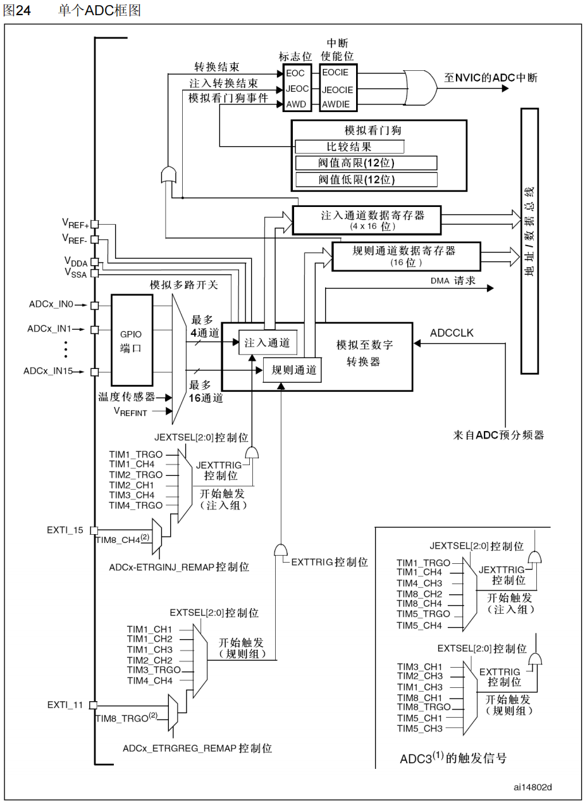

**ADC简化框图**


**18个ADC通道**
> 具体参考引脚功能表

|  通道  |     ADC1     | ADC2  | ADC3  |
| :----: | :----------: | :---: | :---: |
| 通道0  |     PA0      |  PA0  |  PA0  |
| 通道1  |     PA1      |  PA1  |  PA1  |
| 通道2  |     PA2      |  PA2  |  PA2  |
| 通道3  |     PA3      |  PA3  |  PA3  |
| 通道4  |     PA4      |  PA4  |  PF6  |
| 通道5  |     PA5      |  PA5  |  PF7  |
| 通道6  |     PA6      |  PA6  |  PF8  |
| 通道7  |     PA7      |  PA7  |  PF9  |
| 通道8  |     PB0      |  PB0  | PF10  |
| 通道9  |     PB1      |  PB1  |
| 通道10 |     PC0      |  PC0  |  PC0  |
| 通道11 |     PC1      |  PC1  |  PC1  |
| 通道12 |     PC2      |  PC2  |  PC2  |
| 通道13 |     PC3      |  PC3  |  PC3  |
| 通道14 |     PC4      |  PC4  |
| 通道15 |     PC5      |  PC5  |
| 通道16 |  温度传感器  |
| 通道17 | 内部参考电压 |

**四种转换模式**

- 单次转换，非扫描模式
  - 单次，只转换一次，每次转换都需要触发信号
  - 非扫描，只对序列1转换，转换前需要将通道x放到序列1的位置
  - 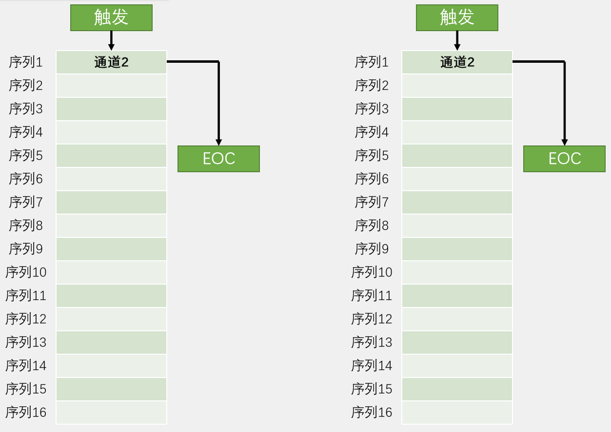
- 连续转换，非扫描模式
  - 连续，第一次转换需要触发信号，然后其转换结束信号会作为下一次转换的触发信号
  - 非扫描，只对序列1转换。
  - 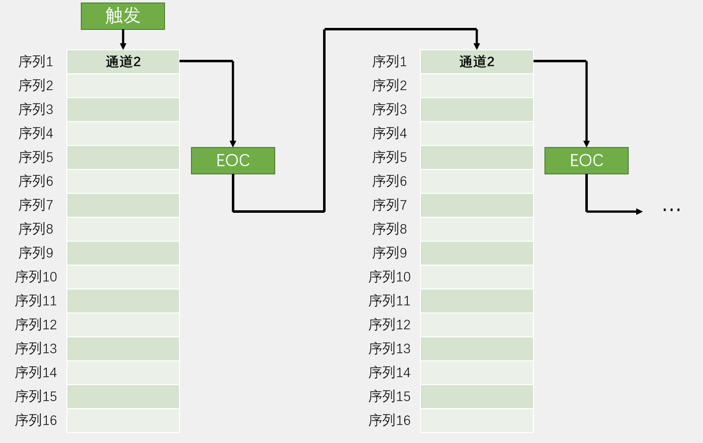
- 单次转换，扫描模式
  - 单次，只转换一次
  - 扫描，对多个序列进行转换，
  - 
- 连续转换，扫描模式
  - 连续，EOF信号作为下一次转换的开始转换信号
  - 扫描，对多个序列接连转换
  - 

**规则通道外部触发**

- 外部引脚/定时器的选择需要配合AFIO来完成
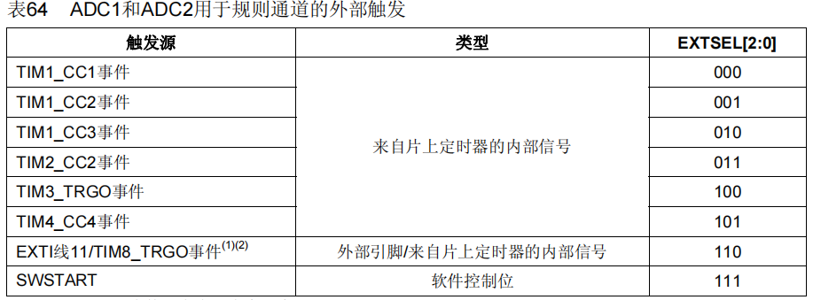

**数据对齐方式**

- 由于ADC是12bit,所以转换结果也是12bit
- 左对齐，然后读取高8bit，可以读取到低精度的单字节数据。
- 

**转换时间**

- AD转换的步骤：采样，保持，量化，编码
  - 采样保持，
    - 用小容量电容来存储待测电压，然后测量电容上的电压
    - 电容开始充电和停止充电的时间间隔就是采样保持的时间
  - 量化编码，
    - 逐次逼近，逐位比较过程所花费的时间
- STM32 ADC的总转换时间为：
  - TCONV = 采样时间 + 12.5个ADC周期
- 例如：当ADCCLK=14MHz，采样时间为1.5个ADC周期
  - TCONV = 1.5 + 12.5 = 14个ADC周期 = 1μs

**校准**

- ADC内置自校准模式。
- 校准可大幅减小因内部电容器组的变化而造成的准精度误差。
- 校准期间，在每个电容器上都会计算出一个误差修正码(数字值)，这个码用于消除在随后的转换中每个电容器上产生的误差
- 建议在每次上电后执行一次校准
- 启动校准前， ADC必须处于关电状态超过至少两个ADC时钟周期

**基本步骤**

- 配置GPIO
  - 通过RCC寄存器开启GPIO外设时钟
- 配置多路开关
  - 把GPIO等的通道接入ADC的规则组或注入组
- 配置ADC
  - 通过RCC寄存器配置ADCCLK预分频器
  - 配置ADC转换模式（单次转换连续转换，扫描模式或非扫描模式，通道数、触发源、数据对齐方向）
- 配置模拟看门狗（如果有需要）
  - 配置阈值
  - 配置监测通道
- 开启中断（如果有需要）
  - ITConfig开启对应的输出
  - NVIC配置中断优先级
- 开启ADC
  - ADC_Cmd
  - 校准ADC

### ADC的标准库函数

**标准库相关函数**

```cpp
// "stm32f10x_rcc.h"

// 配置ADCCLK预分频器系数：2 4 6 8
// 实现对APB2的72Mhz时钟分频后输出到ADCCLK
void RCC_ADCCLKConfig(uint32_t RCC_PCLK2);
```

```cpp
// "stm32f10x_adc.h"

// 恢复默认配置
void ADC_DeInit(ADC_TypeDef* ADCx);
// 初始化ADC
void ADC_Init(ADC_TypeDef* ADCx, ADC_InitTypeDef* ADC_InitStruct);
// 初始化结构体
void ADC_StructInit(ADC_InitTypeDef* ADC_InitStruct);
// ADC开关
void ADC_Cmd(ADC_TypeDef* ADCx, FunctionalState NewState);
// 开启DMA输出信号
void ADC_DMACmd(ADC_TypeDef* ADCx, FunctionalState NewState);
// ADC中断输出控制,用来控制中断信号能否通向NVIC
void ADC_ITConfig(ADC_TypeDef* ADCx, uint16_t ADC_IT, FunctionalState NewState);
// 复位校准
void ADC_ResetCalibration(ADC_TypeDef* ADCx);
// 获取复位校准状态
FlagStatus ADC_GetResetCalibrationStatus(ADC_TypeDef* ADCx);
// 开始校准
void ADC_StartCalibration(ADC_TypeDef* ADCx);
// 获取开始校准状态
FlagStatus ADC_GetCalibrationStatus(ADC_TypeDef* ADCx);
// 软件触发AD转换
void ADC_SoftwareStartConvCmd(ADC_TypeDef* ADCx, FunctionalState NewState);
// 获取软件开始转换状态（SWSTART的状态）（实际上获取不到，
// 具体参考源码，其是通过检查SWSTART位来判断状态，但手册上说，SWSTART被软件置1后会被硬件立即清0）
// 所以其返回值不能反应转换是否结束
FlagStatus ADC_GetSoftwareStartConvStatus(ADC_TypeDef* ADCx);
// 配置间断模式
// 每隔几个通道间断检测
void ADC_DiscModeChannelCountConfig(ADC_TypeDef* ADCx, uint8_t Number);
// 是否启用间断模式
void ADC_DiscModeCmd(ADC_TypeDef* ADCx, FunctionalState NewState);
// 规则组通道配置，如序列1 和 通道2
void ADC_RegularChannelConfig(ADC_TypeDef* ADCx, uint8_t ADC_Channel, uint8_t Rank, uint8_t ADC_SampleTime);
// 是否允许外部触发转换控制
void ADC_ExternalTrigConvCmd(ADC_TypeDef* ADCx, FunctionalState NewState);
// 获取转换结果
uint16_t ADC_GetConversionValue(ADC_TypeDef* ADCx);
// 获取双ADC模式转换结果
uint32_t ADC_GetDualModeConversionValue(void);
// Injected都是注入组相关函数
void ADC_AutoInjectedConvCmd(ADC_TypeDef* ADCx, FunctionalState NewState);
void ADC_InjectedDiscModeCmd(ADC_TypeDef* ADCx, FunctionalState NewState);
void ADC_ExternalTrigInjectedConvConfig(ADC_TypeDef* ADCx, uint32_t ADC_ExternalTrigInjecConv);
void ADC_ExternalTrigInjectedConvCmd(ADC_TypeDef* ADCx, FunctionalState NewState);
void ADC_SoftwareStartInjectedConvCmd(ADC_TypeDef* ADCx, FunctionalState NewState);
FlagStatus ADC_GetSoftwareStartInjectedConvCmdStatus(ADC_TypeDef* ADCx);
void ADC_InjectedChannelConfig(ADC_TypeDef* ADCx, uint8_t ADC_Channel, uint8_t Rank, uint8_t ADC_SampleTime);
void ADC_InjectedSequencerLengthConfig(ADC_TypeDef* ADCx, uint8_t Length);
void ADC_SetInjectedOffset(ADC_TypeDef* ADCx, uint8_t ADC_InjectedChannel, uint16_t Offset);
uint16_t ADC_GetInjectedConversionValue(ADC_TypeDef* ADCx, uint8_t ADC_InjectedChannel);
// 模拟看门狗配置函数
// 是否启动
void ADC_AnalogWatchdogCmd(ADC_TypeDef* ADCx, uint32_t ADC_AnalogWatchdog);
// 配置高低阈值
void ADC_AnalogWatchdogThresholdsConfig(ADC_TypeDef* ADCx, uint16_t HighThreshold, uint16_t LowThreshold);
// 配置看门狗通道
void ADC_AnalogWatchdogSingleChannelConfig(ADC_TypeDef* ADCx, uint8_t ADC_Channel);
// 开启温度传感器/内部参考电压
void ADC_TempSensorVrefintCmd(FunctionalState NewState);
// 获取标志位状态，第二个参数传EOC,可以判断是否转换结束
FlagStatus ADC_GetFlagStatus(ADC_TypeDef* ADCx, uint8_t ADC_FLAG);
// 清除标志位
void ADC_ClearFlag(ADC_TypeDef* ADCx, uint8_t ADC_FLAG);
// 获取中断位
ITStatus ADC_GetITStatus(ADC_TypeDef* ADCx, uint16_t ADC_IT);
// 清除中断挂起位
void ADC_ClearITPendingBit(ADC_TypeDef* ADCx, uint16_t ADC_IT);
```

### ADC案例

**案例：软件触发，单次转换，非扫描模式，**

:::code-tabs

@tab `main.cpp`
@[code cpp](./projects/stm32-makefile/11-ADC-规则组-单次转换-非扫描模式-软件触发/User/main.cpp)

@tab `AD.c`
@[code cpp](./projects/stm32-makefile/11-ADC-规则组-单次转换-非扫描模式-软件触发/System/AD.c)

@tab `AD.h`
@[code cpp](./projects/stm32-makefile/11-ADC-规则组-单次转换-非扫描模式-软件触发/System/AD.h)

:::

**案例：软件触发，读取多通道，单次转换，非扫描模式**

:::code-tabs
@tab `main.cpp`
@[code cpp](./projects/stm32-makefile/12-ADC-规则组-单次转换-非扫描模式-软件触发-读取多通道/User/main.cpp)

@tab `AD.c`
@[code cpp](./projects/stm32-makefile/12-ADC-规则组-单次转换-非扫描模式-软件触发-读取多通道/System/AD.c)

@tab `AD.h`
@[code cpp](./projects/stm32-makefile/12-ADC-规则组-单次转换-非扫描模式-软件触发-读取多通道/System/AD.h)

:::

**案例：软件触发，连续转换，非扫描模式**

:::code-tabs

@tab `main.cpp`
@[code cpp](./projects/stm32-makefile/13-ADC-规则组-连续转换-非扫描模式-软件触发/User/main.cpp)

@tab `AD.c`
@[code cpp](./projects/stm32-makefile/13-ADC-规则组-连续转换-非扫描模式-软件触发/System/AD.c)

:::

## DMA

### DMA简介

- DMA（Direct Memory Access）直接存储器访问
  - 存储器(运行内存SRAM、程序储存器FLASH、外设寄存器)
- DMA可以提供外设（数据寄存器）和存储器（SRAM、FLASH）或者存储器和存储器之间的高速数据传输，无须CPU干预，节省了CPU的资源
- 12个独立可配置的通道：
  - DMA1（7个通道），
  - DMA2（5个通道）
- 每个通道都支持软件触发和特定的硬件触发
  - 外设到存储器的数据转运一般使用硬件触发
  - 存储器到存储器的数据转运一般使用软件触发

> STM32F103C8T6 DMA资源：DMA1（7个通道），没有DMA2

### DMA原理

**存储器映像**

| 类型  |  起始地址  |     存储器      |               用途               |
| :---: | :--------: | :-------------: | :------------------------------: |
|  ROM  | 0x08000000 | 程序存储器Flash |    存储C语言编译后的程序代码     |
|  ROM  | 0x1FFFF000 |   系统存储器    |   存储BootLoader，用于串口下载   |
|  ROM  | 0x1FFFF800 |    选项字节     | 存储一些独立于程序代码的配置参数 |
|  RAM  | 0x20000000 |  运行内存SRAM   |     存储运行过程中的临时变量     |
|  RAM  | 0x40000000 |   外设寄存器    |      存储各个外设的配置参数      |
|  RAM  | 0xE0000000 | 内核外设寄存器  |    存储内核各个外设的配置参数    |

**存储器映像框图**

- 存储器地址范围：`0x0000 0000 ~ 0xffff ffff`,因为CPU是32位，寻址范围最大也是32位，最大可支持4GB内存的寻址。
  - STM32存储器都是KB级别，寻址空间大部分不用，地址使用率不到百分之1。
  - 灰色区域为Reserved区域，即保留区域
- 六片存储区
  - 1.别名区：程序会从`0x0000 0000`地址开始执行，但该地址实际上也没有使用，其会根据BOOT0和BOOT1的配置，把地址空间映射到Flash（程序）存储器执行用户程序，或映射到System（系统）存储器执行BootLoader程序，或映射到SRAM执行程序。
  - 2.Flash区（0x0800 0000）,用于存储程序代码
  - 3.系统存储区和选项字节（0x1fff f000）,存储了BootLoader程序，和一些配置参数
  - 4.SRAM区（0x2000 0000）
  - 5.外设寄存器区（0x4000 0000）,
  - 6.内核外设寄存器区（0xE000 0000）
- 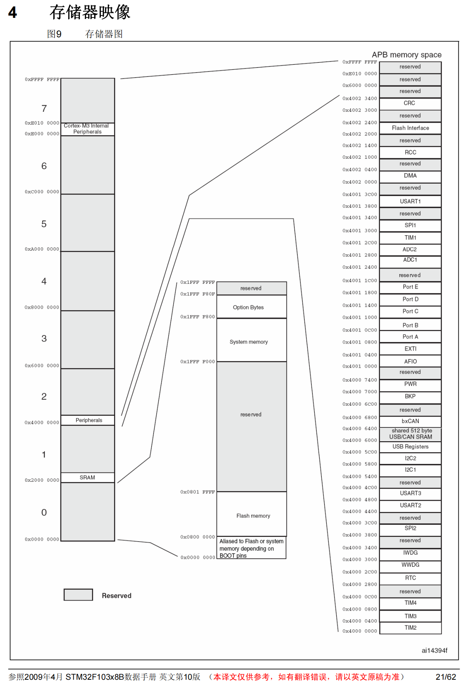

**DMA框图**

- 总线矩阵的左侧是主动单元，拥有右侧存储器的访问权，右边是被动单元，只能被主动单元读写。
- Flash,只读存储器，不能写入
- SRAM,运行内存，可任意读写
- 内核，主动单元，通过Dcode和系统总线访问右边的存储器，Dcode用于专门访问Flash
- DMA,主动单元，通过DMA总线访问右侧存储器
  - DMA仲裁器，DMA总线是分时复用的，产生冲突后，由仲裁器根据通道的优先级决定谁先用。
    - 总线矩阵中也有仲裁器，当CPU和DMA要同时访问一个目标时，DMA会暂停CPU的访问，但会保证CPU得到一半的总线带宽。
  - AHB从设备，DMA外设自身的配置寄存器，连接在总线矩阵的右侧，属于AHB总线的被动单元，CPU可以通过总线矩阵来配置该寄存器
- DMA请求，来自外设的触发信号，如ADC转换完成，串口接收到数据


**DMA基本结构图**

- 数据转运的两大站点
  - 外设（寄存器）站点
  - 存储器（Flash & SRAM）站点
- 站点数据流向
  - `SRAM | 外设 <==> SRAM`
  - `SRAM | 外设 <=== Flash`
  - > Flash 一般为只读存储器
- 站点配置
  - 起始地址：
    - 可以给外设站点写存储器地址
  - 数据宽度：
    - 字节(1B) 半字(2B) 字(4B)，
    - 也决定了地址自增多少
  - 地址是否自增
- 传输计数器
  - 用来指定总共需要转运几次，是一个自减计数器
  - 如果用来搬运数组，则填写数组长度
  - 自减到0后便不在转运，同时站点配置寄存器中自增的地址也恢复成起始地址。
- 自动重装器
  - 用于实现当传输计数器自减到0后将`传输计数器`自动重装为初始值
  - 决定了转运模式，不重装就是单次转运模式，重装就是循环转运模式。
- M2M（Memory To Memory）
  - 1：软件触发，直到传输计数器为0才停止
  - 0：硬件触发，也就是连通ADC等外设的DMA请求信号。
- 开关控制
  - DMA_Cmd(Enable) 使能开启DMA
- DMA工作流程
  - 传输计数器>0
  - 使能DMA
  - 有触发信号，触发一次，转运一次，传输计数器自减一次。
  - 直到传输计数器为0，且没有自动重装时，此时无论是否触发，都不会转运。
  - 此时就必须DMA_Cmd(Disable)
  - 关闭DMA才能重写传输计数器
  - 然后再使能DMA
  - 触发
- 

**DMA请求映射**

- 每个通道的硬件触发源不同。
- ADC_DMACmd() 可以用来将ADC1的DMA请求联通至通道1的硬件触发源
- TIM_DMACmd() TIM2_CH3 => 硬件请求1
- 七个通道会进入仲裁器，根据优先级产生内部DMA1请求
- 通道号越小，优先级越高，也可以在程序中配置。
- 

**数据对齐方式**

- 当PSIZE和MSIZE不相同时，DMA模块按照下表进行数据对齐。
- 简单总结就是
  - `多字节数据 => 单字节数据` 舍弃高位 补上00 保留低位。
  - `单字节数据 => 多字节数据` 舍弃高位 补上00 保留低位。
- 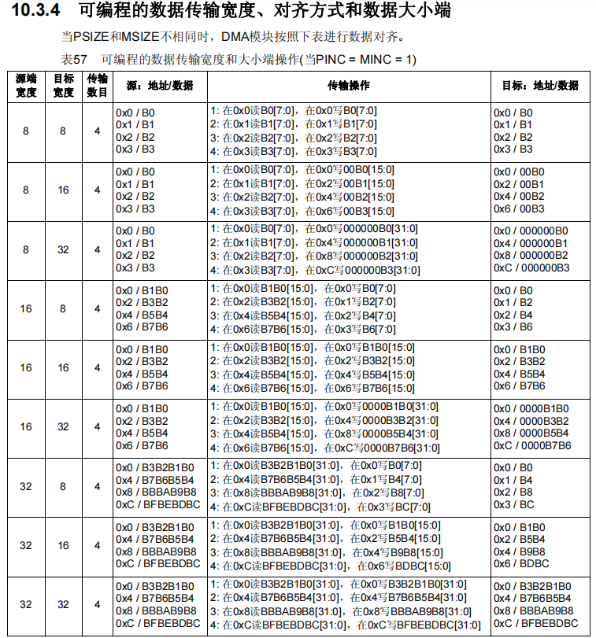

**DMA数组转运**

- 外设站点和存储器站点配置
  - 起始地址：数组A和数组B首地址
  - 数据宽度：单字节
  - 地址自增：是
- 转运方向：外设=>存储器
- 传输计数器(转运次数)：数组A的长度
- 自动重装器(触发模式)：单次触发
- 触发方式(M2M)：软件触发(1)


### DMA案例

**DMA数组转运编程实现**

- 步骤
  - RCC，开启DMA时钟
  - DMA_Init，配置DMA
    - 外设站点和存储器站点配置
    - 转运方向
    - 传输计数器
    - 自动重装器
    - 触发方式
    - 优先级配置
  - ADC_DMACmd，将ADC的中断请求联通值DMA的硬件触发
  - DMA_ITCOnfig配置DMA中断（如果需要）
  - DMA_Cmd，开启DMA
  - 转运完成后重新启动
    - 失能DMA
    - 重写传输计数器
    - 使能DMA

:::code-tabs

@tab `DMA1_Data_Transfer.c`
@[code cpp](./projects/stm32-makefile/14-DMA-数据转运-拷贝数组数据/System/DMA1_Data_Transfer.c)

@tab `DMA1_Data_Transfer.h`
@[code cpp](./projects/stm32-makefile/14-DMA-数据转运-拷贝数组数据/System/DMA1_Data_Transfer.h)

@tab `main.cpp`
@[code cpp](./projects/stm32-makefile/14-DMA-数据转运-拷贝数组数据/User/main.cpp)
:::

**ADC扫描模式+DMA硬件触发**

- ADC配置
  - 规则通道
  - 连续转换，扫描模式
  - **配置将其`DMA请求`通向DMA**
- DMA配置
  - 外设站点配置
    - 起始地址：ADC_DR数据寄存器地址
    - 数据宽度：半字（2字节）
    - 地址自增：否
  - 存储器器站点配置
    - 起始地址：自定义数组地址
    - 数据宽度：半字（2字节）
    - 地址自增：是
  - 传输方向：外设站点 => 存储器站点
  - 传输计数器(转运次数)：ADC转换的通道个数
  - 自动重装器(触发模式)：
    - 如果ADC配置为单次转换，则DMA自动重装器配置为不自动重装（单次触发）
    - 如果ADC配置为连续转换，则DMA自动重装器配置为自动重装，
      - 这样ADC进入下一轮转换时，DMA也进行下一轮的数据搬运。
  - 触发方式
    - 硬件触发
- 

:::code-tabs

@tab `AD_With_DMA.c`
@[code cpp](./projects/stm32-makefile/15-DMA-AD单次转换-DMA硬件触发/System/AD_With_DMA.c)

@tab `AD_With_DMA.h`
@[code cpp](./projects/stm32-makefile/15-DMA-AD单次转换-DMA硬件触发/System/AD_With_DMA.h)

@tab `main.cpp`
@[code cpp](./projects/stm32-makefile/15-DMA-AD单次转换-DMA硬件触发/User/main.cpp)
:::

## USART串口通信

### 通信

- 通信目的：将一个设备的数据传送到另一个设备，扩展硬件系统
  - 比如需要通过读写外部设备的寄存器来操作外部设备
- 通信协议：通信的规则，通信双方按照规则进行数据收发

**STM32支持的通信协议**

- USART(串口)
  - TX(TXD) Transmit Exchange 数据发送
  - RX(RXD) Receive Exchange 数据接收
- USART(串口)
  - SCL(Serial Clock)时钟
  - SDA(Serial Data)数据
- SPI
  - SCLK(Serial Clock),时钟
  - MOSI(Master Output Slave Input) 主机输出，从机输入
  - MISO(Master Input Slave Output) 主机输入，从机输出
  - CS(Chip Select)片选，指定通信对象
- CAN
  - CAN_H
  - CAN_L
  - 两根线为差分信号
- USB
  - DP (D+)(Data Positive)
  - DM (D-)(Data Minus)
  - 两根线为差分信号
- 全双工
  - 通信双方能同时收发数据，
  - 一般都有两根通信线路，一根收，一根发，互相不影响
  - 如：USART,USB,SPI
- 半双工
  - 通信双方同时只能收或发数据
  - 只有一根通信线路
  - 如：I2C,CAN,USB
- 单工
  - 通信双方只能单向通信，如A->B
- 时钟特性
  - 同步：
    - 有时钟线
    - 在时钟信号的指导下采样读取数据
  - 异步：
    - 没有时钟
    - 需要双方约定采样频率，添加帧头，帧尾，实现采样位置对齐。
- 信号特性
  - 单端信号，
    - 信号电平是相对于GND的电压差
    - 需要共地
  - 差分信号
    - 信号电平是依靠两根差分线的电压差来传输信号。
    - 可以不需要地
    - 差分信号抗干扰，传输速度和距离高
- 设备特性
  - 点对点：一对一
  - 多设备：一对多，可以在总线上挂载多个设备

| 名称  |         引脚         |  双工  | 时钟  | 电平  |  设备  |
| :---: | :------------------: | :----: | :---: | :---: | :----: |
| USART |        TX、RX        | 全双工 | 异步  | 单端  | 点对点 |
|  I2C  |       SCL、SDA       | 半双工 | 同步  | 单端  | 多设备 |
|  SPI  | SCLK、MOSI、MISO、CS | 全双工 | 同步  | 单端  | 多设备 |
|  CAN  |     CAN_H、CAN_L     | 半双工 | 异步  | 差分  | 多设备 |
|  USB  |        DP、DM        | 半双工 | 异步  | 差分  | 点对点 |

### 串口通信简介

- 串口是一种应用十分广泛的通讯接口，串口成本低、容易使用、通信线路简单，可实现两个设备的互相通信
- 单片机的串口可以使单片机与单片机、单片机与电脑、单片机与各式各样的模块互相通信，极大地扩展了单片机的应用范围，增强了单片机系统的硬件实力
- 在单片机领域，串口是较简单的通信接口，比I2C SPI简单。一般单片机都有串口硬件外设。
- CH340 USB转TTL电平串口模块

**硬件电路**

- 简单双向串口通信有两根通信线（发送端TX和接收端RX）
  - 复杂串口通信还有时钟、硬件流控制引脚
- TX与RX要交叉连接
- 当只需单向的数据传输时，可以只接一根通信线
- 当电平标准不一致时，需要加电平转换芯片
- 

电平标准

- 电平标准是数据1和数据0的表达方式，
- 是传输线缆中人为规定的电压与数据的对应关系，
- 串口常用的电平标准有如下三种：
  - TTL电平：+3.3V或+5V表示1，0V表示0
  - RS232电平：-3~-15V表示1，+3~+15V表示0（传输几十米）
  - RS485电平：两线压差+2~+6V表示1，-2~-6V表示0（差分信号，可传输上千米）

串口参数及时序

- 波特率：串口通信的速率
- 起始位：标志一个数据帧的开始，固定为低电平
- 数据位：数据帧的有效载荷，1为高电平，0为低电平，低位先行
- 校验位：用于数据验证，根据数据位计算得来
- 停止位：用于数据帧间隔，固定为高电平
- 
  - 空闲时为高电平，起始位为低电平，这么定义是为了产生一个下降沿，告诉对方即将发送数据
  - 停止位为高电平，用来作为数据帧间隔，同时也是是为了恢复到空闲状态，这样在发送下一个字节时，就又要置低起始位。
  - 奇偶校验
    - 奇校验，算上校验位，保持1的个数为奇数
    - 偶校验，算上校验位，保持1的个数为偶数

**实测波形**

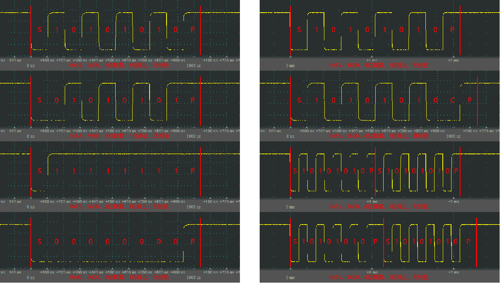

### USART外设

- USART（Universal Synchronous/Asynchronous Receiver/Transmitter）通用同步/异步收发器
  - 同步，
    - 串口一般很少使用同步功能，
    - STM32的同步也只是多了一个时钟输出引脚，不支持时钟输入，主要是为了兼容其他协议而设计
  - 异步，
    - 串口通信主要是异步通信
    - UART,异步收发器
- USART是STM32内部集成的硬件外设，可根据数据寄存器的一个字节数据自动生成数据帧时序，从TX引脚发送出去，也可自动接收RX引脚的数据帧时序，拼接为一个字节数据，存放在数据寄存器里
- 自带波特率发生器，最高达4.5Mbits/s
  - 实际上就是分频器，对72M主频分频后的时钟就是通信波特率
- 可配置数据位长度（8/9）
  - 第9位为停止校验位
- 可配置停止位长度（0.5/1/1.5/2）
  - 决定了帧的间隔，常用1
- 可选校验位（无校验/奇校验/偶校验）
- 支持
  - 同步模式，就是多一个时钟引脚
  - 硬件流控制，多一个引脚，在接收方无法及时处理收到的数据时反馈给发送方实现暂停发送数据防止数据丢失。
  - DMA，如果有大量数据收发，可以使用DMA转运。
  - 智能卡，
  - IrDA，红外发射器和接收器
  - LIN，局域网通信

> STM32F103C8T6 USART资源： USART1（APB2）、 USART2(APB1)、 USART3(APB1)

**原理框图**

- DR数据寄存器
  - 实际上是一个地址，两个寄存器。
  - 写入DR操作是发送数据，实际操作的是TDR(Transmit DR)寄存器
  - 读取DR操作是接收数据，实际操作的是RDR(Receive DR)寄存器
- 发送数据
  - 写入TDR后会检查移位寄存器是否正在移位，是则等待，否则立即把数据转运到发送移位寄存器，然后置标志位TXE（TX Empty）为1，表示TDR发送数据寄存器空，用于程序判断是否可以继续写入。
  - 发送移位寄存器会在发送器控制的驱动下将数据右移发送到TX引脚。
  - 移位完成后立即将TDR的数据转运，保证数据帧之间没有空闲。
- 接收数据
  - 数据从RX引脚通向接收移位寄存器。
  - 在接收控制的驱动下，读取数据放入高位并右移，移动八次接收一个字节。
  - 移位完成后，整个字节数据整体移动到RDR寄存器，
  - 并置标志位RXNE(RX Not Empty)表示接收寄存器非空，用于检测是否有数据可以读取
- 发送寄存器控制：控制发送寄存器工作
- 接收寄存器控制：控制接收寄存器工作
- 硬件数据流控
  - 用于避免：发送端发送的太快，接收设备来不及处理，出现丢弃或覆盖数据的现象
  - nRTS(Request To Send)请求发送数据，输入交
  - nCTS(Clear To Send)清除发送，输入脚，接收对方的请求发送信号。
  - n表示低电平有效。
  - 两线交叉连接。
- SCLK
  - 产生同步的时钟信号，配合发送寄存器工作。
  - 发送寄存器移位一次，同步时钟跳变一个周期。
  - 仅支持输入时钟信号
  - 用于兼容其他协议，如SPI
  - 用于自适应波特率，通过测量时钟来计算波特率
- 唤醒单元
  - 用于实现1对多通信
  - USART地址寄存器可以配置设备的id
- 中断控制
  - 用来实现将状态寄存器的信号通向NVIC
- 波特率发生器
  - 分频系数支持小数点后四位，用于实现精确的分频
  - 除以16后是其实际采样频率
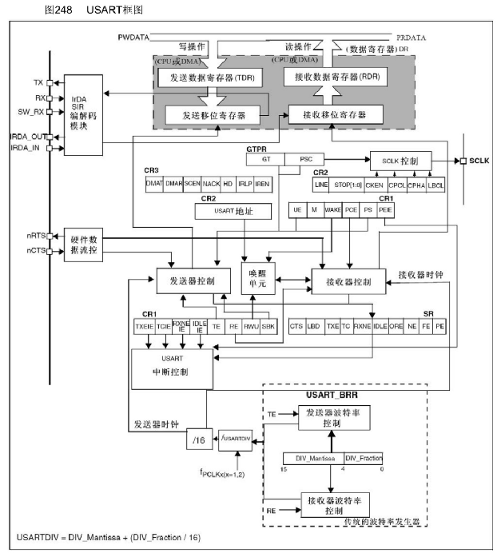

**简化框图**

- 波特率发生器(实际是分频器)用于产生约定速率，时钟来源为PCLK2/1
- 发送控制器和接收控制器，用于控制发送移位和接收移位
- 发送数据寄存器TDR和发送移位寄存器相互配合，将数据移位发出。
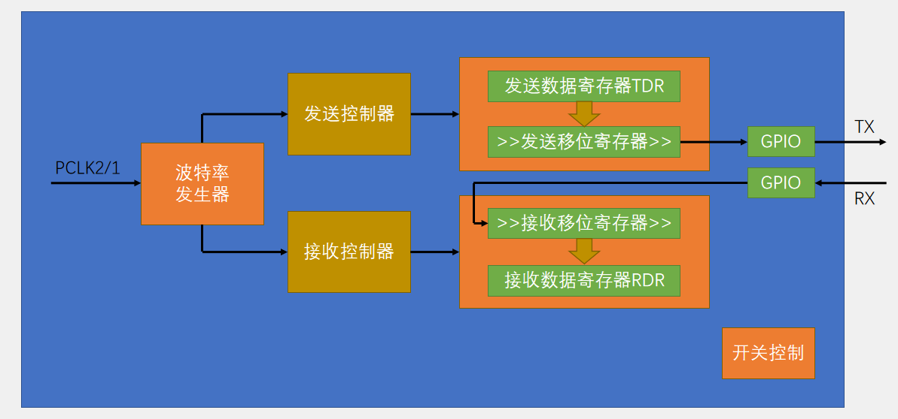

**数据帧格式**

- 9位字长（可以包含1位校验位）
  - 1个起始位
  - 8位数据
  - 1位校验位
  - 1位停止位
  - 共11位。
  - 时钟是同步模式时钟，上升沿位置在数据位中间。
  - LBCL位用于控制最后一位校验位有没有时钟上升沿。
  - 空闲帧和断开帧是局域网通信用的。
- 8位字长（可以包含1位校验位）
- 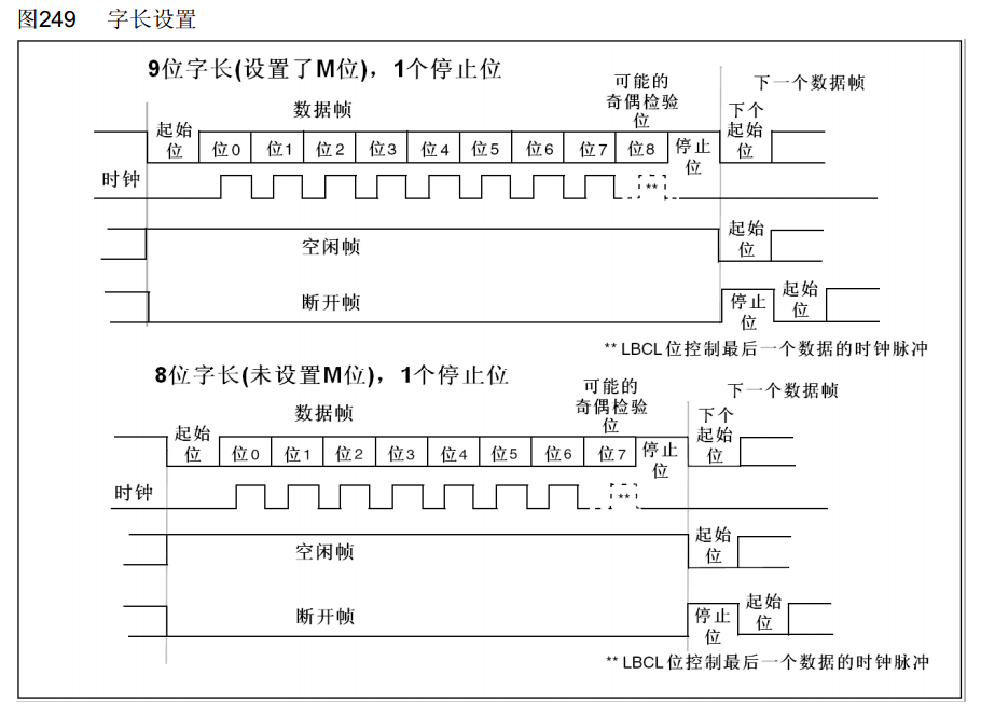

**停止位长度**

- 可选时长：0.5、1、1.5、2


**读取串口输入的策略**

- 输入电路比输入电路复杂，输出电路只需要翻转高低电平，
- 输入电路需要保证输入采样频率和波特率一致，要保证输入采样的位置正好在每一位的正中间，这样才最可靠，还要能判断是否有噪声。
- 起始位检测
  - 采样到1，高电平，空闲状态
  - 采样到0，产生下降沿，
    - 可能噪声，可能是起始位，
    - 需要对之后的3、5、7进行一批采样，对8、9、10次进行一批。
    - 噪声：每三位有两个1
    - 起始位：
      - 这两批采样应当全是0，
      - 或者至少每3位有2个0（有轻微噪声），会给状态寄存器噪声标志位NE(Noise Error)置1。
  - 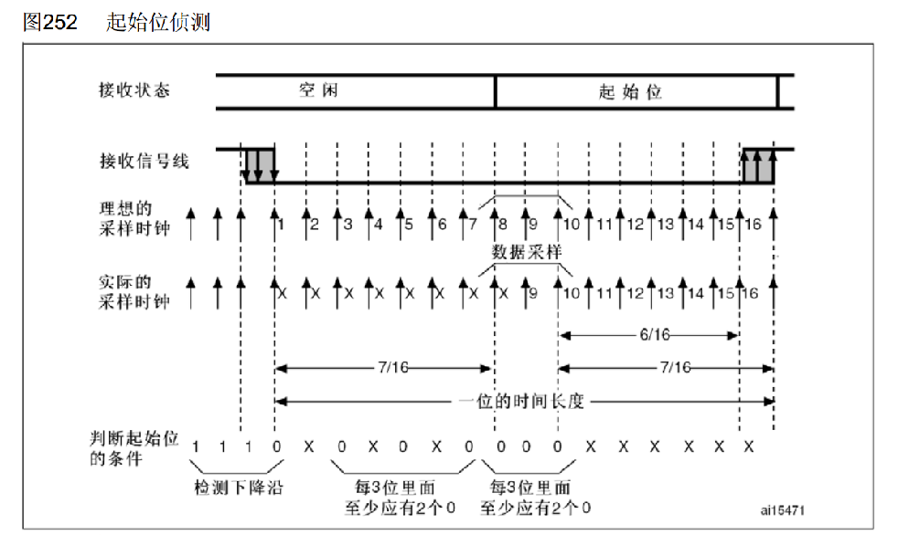
- 采样位对齐：
  - 检测到起始位后，之后的数据位都在8，9，10次进行采样，保证采样位置在位的正中。
  - 全为0则检测到0 全为1则检测到1
  - 2个0 1个1 ，则检测到0，噪声标志位置1
  - 2个1 1个0 ，则检测到1，噪声标志位置1
  - 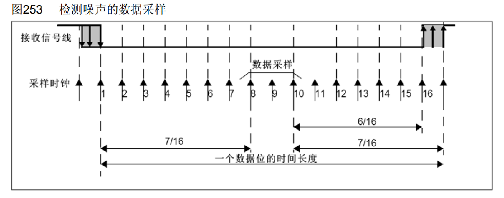

**波特率发生器**

- 发送器和接收器的波特率由波特率寄存器BRR里的DIV确定
- 计算公式：波特率 = fPCLK2或1 / (16 * DIV)
  - 16是因为内部所需的采样频率是波特率的16倍
  - 即输出频率=波特率*16=时钟频率/DIV分频系数
  - 所以：DIV=时钟频率/(波特率*16)
  - 例：
    - 波特率9600，时钟频率72M
    - DIV= 72M/(9600*16) = 468.75 = (1 1101 0100 . 1100)_2
- 

### USART标准库函数

```cpp
// 略
void USART_DeInit(USART_TypeDef* USARTx);
void USART_Init(USART_TypeDef* USARTx, USART_InitTypeDef* USART_InitStruct);
void USART_StructInit(USART_InitTypeDef* USART_InitStruct);

// 配置同步时钟是否输出，相位、极性等
void USART_ClockInit(USART_TypeDef* USARTx, USART_ClockInitTypeDef* USART_ClockInitStruct);
void USART_ClockStructInit(USART_ClockInitTypeDef* USART_ClockInitStruct);

// 略
void USART_Cmd(USART_TypeDef* USARTx, FunctionalState NewState);
void USART_ITConfig(USART_TypeDef* USARTx, uint16_t USART_IT, FunctionalState NewState);

// 开启USART=>DMA触发通道
void USART_DMACmd(USART_TypeDef* USARTx, uint16_t USART_DMAReq, FunctionalState NewState);

// 设置USART地址,用来实现一对多通信的寻址。
void USART_SetAddress(USART_TypeDef* USARTx, uint8_t USART_Address);

// 唤醒
void USART_WakeUpConfig(USART_TypeDef* USARTx, uint16_t USART_WakeUp);
void USART_ReceiverWakeUpCmd(USART_TypeDef* USARTx, FunctionalState NewState);

// LIN
void USART_LINBreakDetectLengthConfig(USART_TypeDef* USARTx, uint16_t USART_LINBreakDetectLength);
void USART_LINCmd(USART_TypeDef* USARTx, FunctionalState NewState);

// 发送数据，写DR寄存器
void USART_SendData(USART_TypeDef* USARTx, uint16_t Data);

// 接收数据，读DR寄存器
uint16_t USART_ReceiveData(USART_TypeDef* USARTx);

// 略
void USART_SendBreak(USART_TypeDef* USARTx);
void USART_SetGuardTime(USART_TypeDef* USARTx, uint8_t USART_GuardTime);
void USART_SetPrescaler(USART_TypeDef* USARTx, uint8_t USART_Prescaler);
void USART_SmartCardCmd(USART_TypeDef* USARTx, FunctionalState NewState);
void USART_SmartCardNACKCmd(USART_TypeDef* USARTx, FunctionalState NewState);
void USART_HalfDuplexCmd(USART_TypeDef* USARTx, FunctionalState NewState);
void USART_OverSampling8Cmd(USART_TypeDef* USARTx, FunctionalState NewState);
void USART_OneBitMethodCmd(USART_TypeDef* USARTx, FunctionalState NewState);
void USART_IrDAConfig(USART_TypeDef* USARTx, uint16_t USART_IrDAMode);
void USART_IrDACmd(USART_TypeDef* USARTx, FunctionalState NewState);

// 标志位读取、设置相关函数
FlagStatus USART_GetFlagStatus(USART_TypeDef* USARTx, uint16_t USART_FLAG);
void USART_ClearFlag(USART_TypeDef* USARTx, uint16_t USART_FLAG);
ITStatus USART_GetITStatus(USART_TypeDef* USARTx, uint16_t USART_IT);
void USART_ClearITPendingBit(USART_TypeDef* USARTx, uint16_t USART_IT);
```

### 案例：串口收发数据；实现printf

> - arm-none-eabi-gcc 默认情况下不会启用 printf 中的浮点支持。
> - 要启用，需添加-u _printf_float到 LDFLAGS
> - 即：`LDFLAGS += -u _printf_float`

**步骤**

- 开启时钟，USART、GPIO
- 配置GPIO,RX数字输入，TX复用推挽输出
- 配置USART
- 如果需要接收数据，可能要配置DMA或中断

:::code-tabs

@tab `Serial.h`
@[code cpp](./projects/stm32-makefile/16-USART串口发送测试/System/Serial.h)
@tab `Serial.c`
@[code cpp](./projects/stm32-makefile/16-USART串口发送测试/System/Serial.c)
@tab `main.cpp`
@[code cpp](./projects/stm32-makefile/16-USART串口发送测试/User/main.cpp)

:::


### 案例：串口中断接收处理数据

:::code-tabs

@tab `Serial.h`
@[code cpp](./projects/stm32-makefile/17-USART串口中断接收测试/System/Serial.h)
@tab `Serial.c`
@[code cpp](./projects/stm32-makefile/17-USART串口中断接收测试/System/Serial.c)
@tab `main.cpp`
@[code cpp](./projects/stm32-makefile/17-USART串口中断接收测试/User/main.cpp)

:::

### 案例：实现简易通信协议

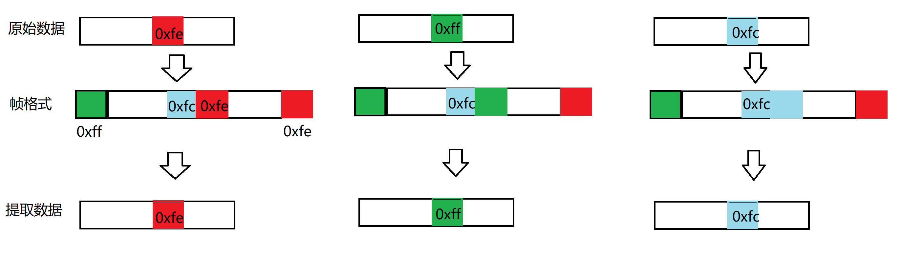

:::code-tabs

@tab `SimpleProtocol.h`
@[code cpp](./projects/stm32-makefile/18-自定义协议/System/SimpleProtocol.h)
@tab `SimpleProtocol.c`
@[code cpp](./projects/stm32-makefile/18-自定义协议/System/SimpleProtocol.c)
@tab `main.h`
@[code cpp](./projects/stm32-makefile/18-自定义协议/User/main.cpp)

:::

## I2C通信软件实现

### 简介

- I²C（Inter-Integrated Circuit）集成电路之间的总线，
- 是I²C Bus简称,
- 中文:集成电路总线
- 两根通信线：
  - SCL（Serial Clock）串行时钟
  - SDA（Serial Data）串行数据
- 同步，半双工
- 带数据应答
- 支持总线挂载多设备
  - 一主多从
  - 多主多从
- 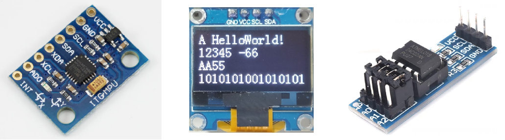
  - MPU6050
  - 0.96 OLED
  - AT24C02

### 硬件规定

- 所有I2C设备，SCL连在一起，SDA连在一起
- 设备的SCL和SDA均要配置成**开漏输出模式**
- SCL和SDA各添加一个上拉电阻，阻值一般为4.7KΩ左右
- 

### 时序规定

**通信的开始**

- SCL高电平期间，SDA从高电平切换到低电平
- 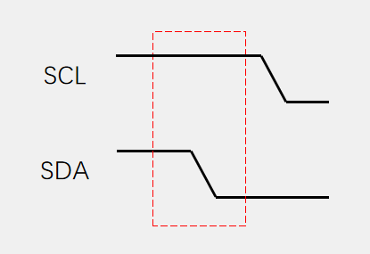

**通信的结束**

- SCL高电平期间，SDA从低电平切换到高电平
- 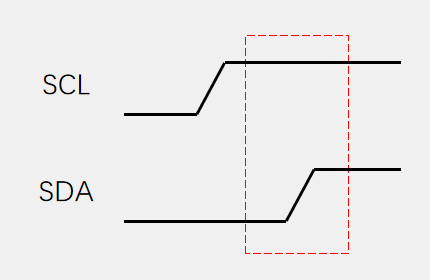

**字节数据的发送**

- SCL低电平期间，
- 主机将数据位放到SDA线上（高位先行），然后释放SCL，
- 从机将在SCL高电平期间读取数据位，
  - 所以SCL高电平期间SDA不允许有数据变化，
- 依次循环上述过程8次，即可发送一个字节
- 

**字节数据的接收**

- SCL低电平期间，
- 从机将数据位放到SDA线上（高位先行），然后释放SCL，
- 主机将在SCL高电平期间读取数据位，
  - 所以SCL高电平期间SDA不允许有数据变化，
- 依次循环上述过程8次，
- 即可接收一个字节（主机在接收之前，需要释放SDA）
- 

**应答信号的发送**

- 主机在接收完一个字节之后，
- 在下一个时钟发送一位数据，
- 数据0表示应答，数据1表示非应答
- 

**应答信号的接收**

- 主机在发送完一个字节之后，
- 在下一个时钟接收一位数据，
- 判断从机是否应答，数据0表示应答，数据1表示非应答（主机在接收之前，需要释放SDA）
- 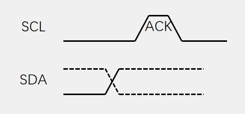

**总结**

- 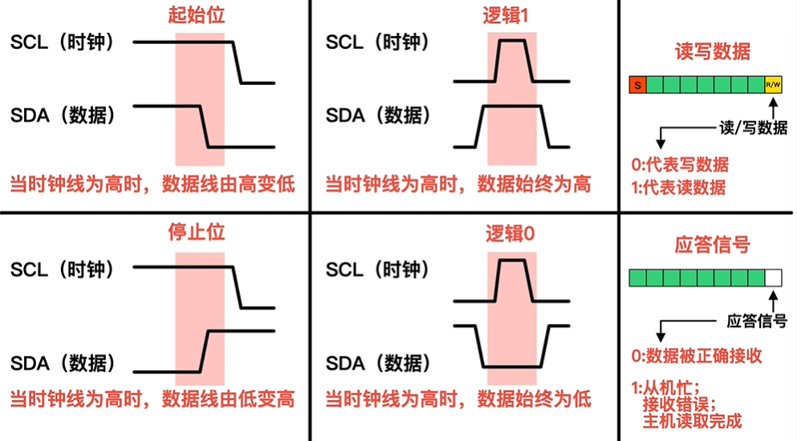

### I2C通信时序

**地址寄存器**

- 从设备中存在一个地址寄存器，
- 该寄存器实际是一个指针，指向另一个寄存器
- 初始值为0，
- 读写从设备的数据，就是在读取指针(地址寄存器)指向的寄存器的数据
- 每次读写从设备后，该寄存器的值都会自增。
- 主设备读写从设备寄存器时，会发送要操作的寄存器地址，这个地址就会写入指针（地址寄存器）中
- > 所以在进行连续多字节读/写时，只需要指定一次地址

**单字节/多字节写入(指定地址)**

- > 写入单字节可以看作是写入多字节的特殊情况
- 主机发送开始通信信号
- 主机发送从机地址和写标志位
  - 7bit地址右移1位，或上1bit的写标志位0，共8bit数据
- 从机发送ACK信号，表示成功接收
- 主机发送要写入寄存器的地址
- 从机发送ACK信号，表示成功接收
- 写入数据(单字节或多字节)
  - 主机发送要写入的8bit数据
  - 从机发送ACK信号，表示成功接收
  - 主机发送要写入的8bit数据
  - 从机发送ACK信号，表示成功接收
  - ......
  - 主机发送要写入的8bit数据
  - 从机发送ACK信号，表示成功接收
- 主机发送结束通信信号
- 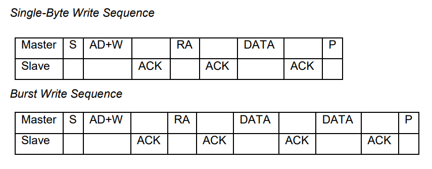
- 

**单字节/多字节读取（不指定地址）**

- 
- 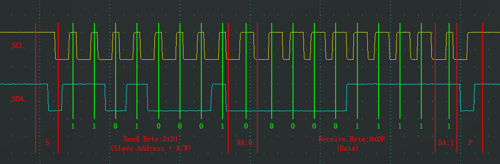

**单字节/多字节读取（指定地址）**

- > 读取单字节可以看作是读取多字节的特殊情况
- 主机发送开始信号
- 主机发送从机地址和写标志位
  - 7bit地址右移1位，或上1bit的写标志位0，共8bit数据
- 从机发送ACK信号，表示成功接收
- 主机发送寄存器地址
- 从机发送ACK信号，表示成功接收
- 主机再次发送开始信号
- 主机发送从机地址和读标志位
  - 7bit地址右移1位，或上1bit的读标志位1，共8bit数据
- 从机发送ACK信号，表示成功接收
- 读取数据(单字节或多字节)
  - 从机发送8bit数据，主机读取
  - 主机发送ACK信号，表示成功接收
  - 从机发送8bit数据，主机读取
  - 主机发送ACK信号，表示成功接收
  - ......
  - 从机发送8bit数据，主机读取
  - 主机发送NACK信号，表示读取完成（重要！！！）
- 主机发送结束信号
- 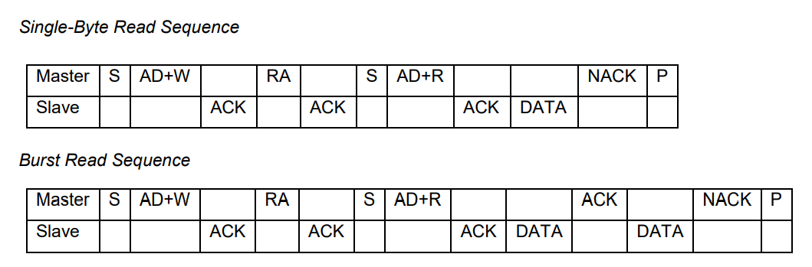
- 

**总结**

- 

### I2C通信软件实现

:::code-tabs
@tab `Soft_I2C.h`
@[code cpp](./projects/stm32-makefile/19-I2C协议软件实现-MPU6050/System/Soft_I2C.h)
@tab `Soft_I2C.c`
@[code cpp](./projects/stm32-makefile/19-I2C协议软件实现-MPU6050/System/Soft_I2C.c)
:::

## I2C通信硬件实现

### 简介

- STM32内部集成了硬件I2C收发电路，
  - 硬件自动生成时钟、
  - 起始终止条件生成、
  - 应答位收发、
  - 数据收发等
- 支持多主机模型
  - 一主多从模型
  - 多主机模型
    - 固定多主机模型
    - 可变多主机模型（stm32）
- 支持7位/10位地址模式
  - 7bit地址：起始 + 7bit地址+1bit读写标志
  - 10bit地址：起始 + 5bit标志位(11110) + 10bit地址 + 1bit读写标志
- 支持不同的通讯速度
  - 标准速度(高达100 kHz)
  - 快速(高达400 kHz)
- 支持DMA
  - 在使用I2C读写多字节数据时可使用DMA提高效率
- 兼容SMBus协议

> STM32F103C8T6 硬件I2C资源：I2C1、I2C2

### 功能框图

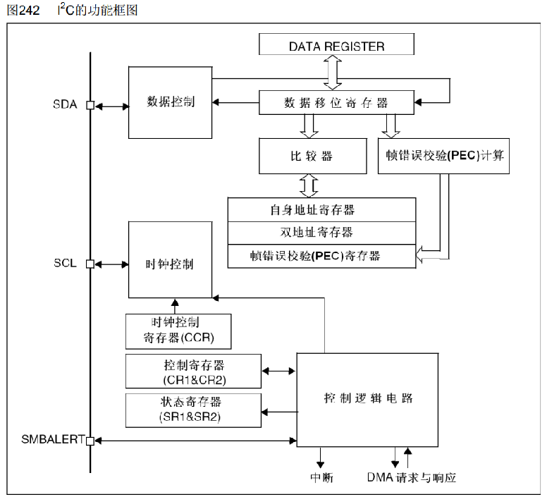

### 功能简图


### 收发时序


### 案例代码

:::code-tabs
@tab `Hard_I2C.h`
@[code cpp](./projects/stm32-makefile/20-I2C协议硬件实现-MPU6050/System/Hard_I2C.h)

@tab `Hard_I2C.c`
@[code cpp](./projects/stm32-makefile/20-I2C协议硬件实现-MPU6050/System/Hard_I2C.c)
:::

## MPU6050

### 简介

- MPU6050是一个6轴姿态传感器，
  - 可以测量芯片自身X、Y、Z轴的**加速度**、**角速度**参数，
  - 通过数据融合，可进一步得到**姿态角**。
- 常应用于平衡车、飞行器等需要检测自身**姿态**的场景
- 3轴加速度计（Accelerometer）：测量X、Y、Z轴的加速度
- 3轴陀螺仪传感器（Gyroscope）：测量X、Y、Z轴的角速度
- 9轴：加速度x3、角速度x3、磁场强度x3
- 10轴：加速度x3、角速度x3、磁场强度x3(方向)、气压计x1(高度)
- 

### 可配置参数

- 16位ADC采集传感器的模拟信号，量化范围：-32768~32767
- 加速度计满量程选择：±2、±4、±8、±16（g）
- 陀螺仪满量程选择： ±250、±500、±1000、±2000（°/sec）
  - 量程越小，精度越高
- 可配置的数字低通滤波器
- 可配置的时钟源
- 可配置的采样分频
- I2C从机地址：
  - 可通过AD0引脚配置地址的最后一位
  - `0x68 => 0110 1000（AD0=0）`
  - `0x69 => 0110 1001（AD0=1）`

### 芯片框图

- 
- 加速度计x3,角速度计x3，温度传感器x1
  - 输出的模拟信号，
  - 通向各自的ADC（16位）进行模数转换
  - 转换完成后放入各自的传感器数据寄存器中。
  - 使用I2C协议读取寄存器，即可得到各自的值。
- 自测单元
  - 启动自测后，
  - 内部会模拟外力施加在传感器上，
  - 这将导致传感器输出一个较大值的模拟信号
  - 自测响应：使能自测前寄存器值-使能自测后寄存器值
  - 自测响应在数据手册给出的范围中，说明芯片正常。
- 电荷泵
  - 升压电路
  - 用于给角速度传感器提供高压支持
  - CPOUT需外接电容
- 中断状态寄存器
  - 可以控制芯片内部的某些事件输出到INT中断引脚
- FIFO
  - 先入先出寄存器
  - 可对数据流缓存
- 配置寄存器
  - 配置芯片内部电路
- 传感器寄存器
  - 各个传感器的数据寄存器
- 工厂校准
  - 用来实现在出厂前对传感器进行校准
- 数字运动处理器（DMP）
  - 芯片内部自带姿态解算硬件算法
  - 需配合官方的DMP库
- FSYNC
  - 帧同步
- 通信部分
  - I2C从机和SPI串行接口
    - 用来实现对I2C和SPI通信的支持
  - I2C主机串行接口
    - 用来实现对I2C从机设备的支持
    - 可以外挂磁力传感器到6脚和7脚
  - 串行接口选择器（Serial Interface Bypass Mux）
    - 一个开关
    - 可以实现将7、6脚并联到23、24脚上
- Bias&LDO
  - 供电部分

### 芯片电器特性

- I2C时钟最大频率400K
- 供电电压[2.375,3.46]

### 时钟源的选择

- 允许的内部时钟
  - 一个内部弛张振荡器 (Relaxation oscillator)
  - XYZ陀螺仪内部的MEMS振荡器时钟(随温度精度变化±1%)
- 允许的外部时钟
  - 32.768Khz方波
  - 19.2Mhz方波

### 主要寄存器

- 配置寄存器
  - SMPLRT_DIV 采样频率分频器
  - CONFIG 配置寄存器
  - GYRO_CONFIG 陀螺仪配置寄存器
  - ACCEL_CONFIG 加速度计配置寄存器
  - 
- 数据寄存器
  - ACCEL加速度计
  - TEMP温度计
  - GYRO陀螺仪
  - _L低8bit
  - _H高8bit
  - 
- 其他
  - PWR_MGMT_1电源管理配置寄存器1
  - PWR_MGMT_2电源管理配置寄存器2
  - WHO_AM_I器件ID(最后一位始终0)
  - 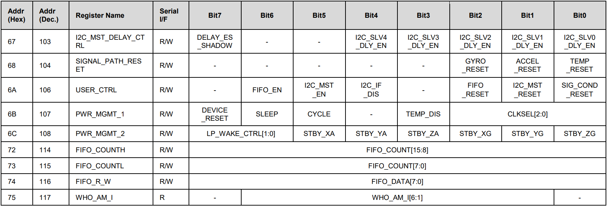

### 主要寄存器详细说明

> 所有寄存器的默认值为0x00，除了：
>
> - 0x75  WHO_AM_I 默认值：0x68 (芯片id)
> - 0x68  PWR_MGMT_1 默认值：0x40 (低功耗模式)

**SMPLRT_DIV采样频率分频器**

- 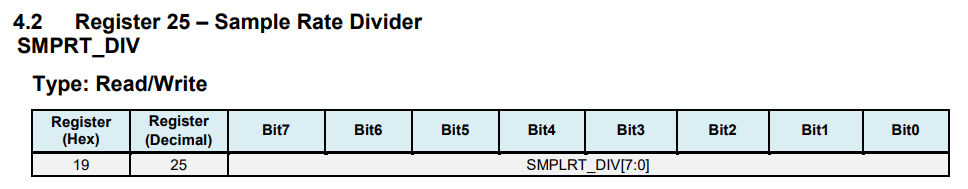
- 采样频率 = 内部时钟频率/(1+SMPLRT_DIV)
- 数据手册推荐将内部陀螺仪时钟作为内部时钟
- 不使用低通滤波器时，陀螺仪时钟为8k,使用后为1k

---

**CONFIG配置寄存器**

- 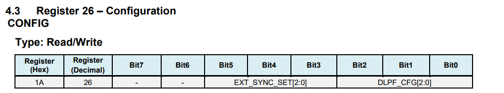
- EXT_SYNC_SET[2:0] 外部同步设置
  - 略
- DLPF_CFG[2:0] 低通滤波器配置
  - 可以让输出数据更平滑
  - 配置为0时，表示不使用滤波器，陀螺仪时钟为8K,否则为1k
  - 配置为1时，使用滤波器，对于加速度计延迟2ms采样，对于陀螺仪计延迟1.9ms采样
  - ......
  - 

---

**GYRO_CONFIG陀螺仪配置寄存器**

- 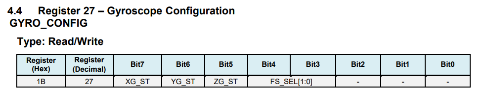
- XG_ST、YG_ST、ZG_ST
  - X、Y、Z轴的自测使能位
  - 自测响应=自测使能开启时传感器输出-自测使能关闭时传感器输出
  - 自测响应范围：
  - 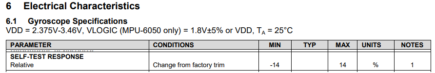
- FS_SEL[1:0] 满量程选择位
  - 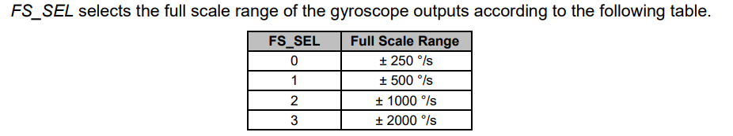

---

**ACCEL_CONFIG 加速度计配置寄存器**

- 
  - XA_ST YA_ST ZA_ST，自测使能
    - 略，同上。
    - 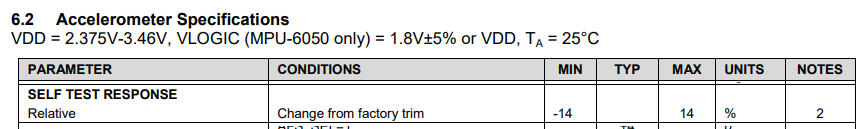
  - AFS_SEL[1:0] 满量程选择位
  - 

---

**ACCEL加速度传感器数据寄存器x3**

- 
- ACCEL_XOUT、ACCEL_YOUT、ACCEL_ZOUT
  - 每个数据为16bit补码形式（16-bit 2’s complement value）

---

**TEMP加速度传感器数据寄存器x1**

- 
- 温度值（℃）的计算
  - 
- 类型
  - 16bit有符号数
  - 

---

**GYRO陀螺仪传感器数据寄存器x3**

- 
- 略

---

**PWR_MGMT_1 电源管理配置寄存器1**

- 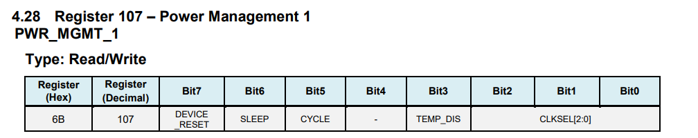
- DEVICE_RESET 设备复位位
  - 写1复位所有寄存器到默认值
- SLEEP 睡眠模式
  - 写1芯片睡眠，进入低功耗模式
- CYCLE 循环模式
  - 设备进入低功耗模式，过一段时间启动一次，启动频率由下一个寄存器的最高两位决定
- TEMP_DIS 温度传感器失能
  - 写1关闭温度传感器
- CLKSEL 时钟来源选择
  - 可选值：
  - 
  - 一般选择内部8M时钟或陀螺仪时钟。
  - 数据手册强烈建议选择陀螺仪时钟或外部时钟来提高稳定性。

---
**PWR_MGMT_2 电源管理配置寄存器2**

- 
- LP_WAKE_CTRL
  - 用来配置循环模式的启动频率
  - 可选值：
  - 
  - 例：
    - 设置PWR_MGMT_1.SLEEP=0(关闭睡眠模式)
    - 设置PWR_MGMT_1.CYCLE=1(开启循环模式)
    - 设置PWR_MGMT_2.LP_WAKE_CTRL=1(配置启动频率为5hz)
- STBY_XA、STBY_YA、STBY_ZA、STBY_XG、STBY_YG、STBY_ZG
  - 6个轴的待机控制位
  - 如果不需要某些轴的数据可以写1实现待机省电。

**WHO_AM_I器件ID**(最后一位始终0)

- 
- 用来验证器件的id
- 存储的是芯片7bit地址的高6位。
- 其实际I2C地址取决于AP0引脚
- 默认值为0x68

### 基于软件I2C实现MPU6050驱动

:::code-tabs

@tab `main.cpp`
@[code cpp](./projects/stm32-makefile/19-I2C协议软件实现-MPU6050/User/main.cpp)

@tab `MPU6050.h`
@[code cpp](./projects/stm32-makefile/19-I2C协议软件实现-MPU6050/System/MPU6050.h)

@tab `MPU6050.c`
@[code cpp](./projects/stm32-makefile/19-I2C协议软件实现-MPU6050/System/MPU6050.c)

@tab `Soft_I2C.h`
@[code cpp](./projects/stm32-makefile/19-I2C协议软件实现-MPU6050/System/Soft_I2C.h)

@tab `OLED_Printf.h`
@[code cpp](./projects/stm32-makefile/19-I2C协议软件实现-MPU6050/Driver/OLED_Printf.h)

@tab `OLED_Printf.c`
@[code cpp](./projects/stm32-makefile/19-I2C协议软件实现-MPU6050/Driver/OLED_Printf.c)

:::

### 基于硬件I2C实现MPU6050驱动

:::code-tabs
@tab `main.cpp`
@[code cpp](./projects/stm32-makefile/20-I2C协议硬件实现-MPU6050/User/main.cpp)

@tab `MPU6050.h`
@[code cpp](./projects/stm32-makefile/20-I2C协议硬件实现-MPU6050/System/MPU6050.h)

@tab `MPU6050.c`
@[code cpp](./projects/stm32-makefile/20-I2C协议硬件实现-MPU6050/System/MPU6050.c)

@tab `Hard_I2C.h`
@[code cpp](./projects/stm32-makefile/20-I2C协议硬件实现-MPU6050/System/Hard_I2C.h)
:::

## SPI通信软件实现

### 简介

- SPI（Serial Peripheral Interface）是由Motorola公司开发的一种通用数据总线
- 四根通信线：
  - SCK（Serial Clock）
  - MOSI（Master Output Slave Input）
  - MISO（Master Input Slave Output）
  - SS（Slave Select）
- 同步，全双工
- 支持总线挂载多设备（一主多从）
- 

### 硬件电路

- 所有SPI设备的SCK、MOSI、MISO分别连在一起
- 主机另外引出多条SS控制线，分别接到各从机的SS引脚
- SPI主机输出引脚配置为**推挽输出**，
- SPI主机输入引脚配置为**浮空或上拉输入**

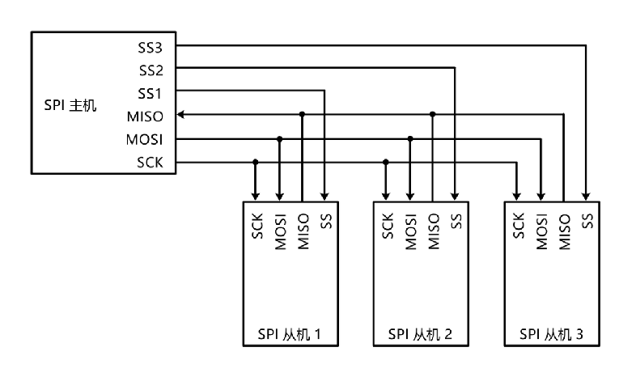

### 移位发送过程


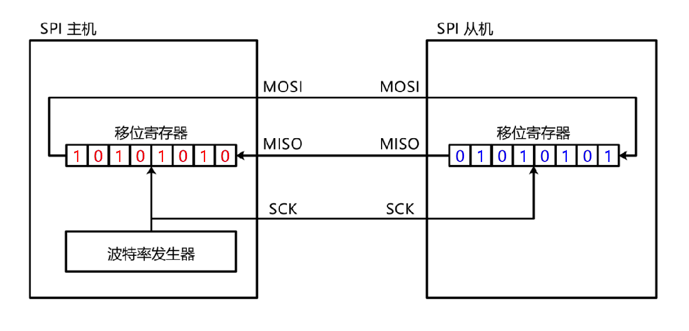


### SPI基本通信时序

#### 起始条件

起始条件：SS从高电平切换到低电平


#### 终止条件

终止条件：SS从低电平切换到高电平


#### 交换字节(模式0)

- CPOL(Clock Polarity时钟极性)=0：表示空闲状态时，SCK为低电平
- CPHA(Clock Phase时钟相位)=0：表示SCK第一个边沿**移入数据**，第二个边沿**移出数据**
- 

#### 交换字节(模式1)

- CPOL=0：空闲状态时，SCK为低电平
- CPHA=1：SCK第一个边沿移出数据，第二个边沿移入数据
- 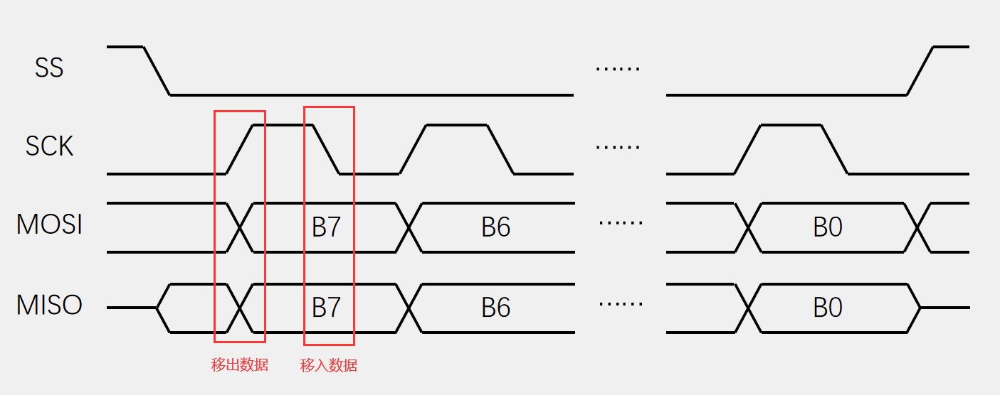

#### 交换字节(模式2)

- CPOL=1：空闲状态时，SCK为高电平
- CPHA=0：SCK第一个边沿移入数据，第二个边沿移出数据
- 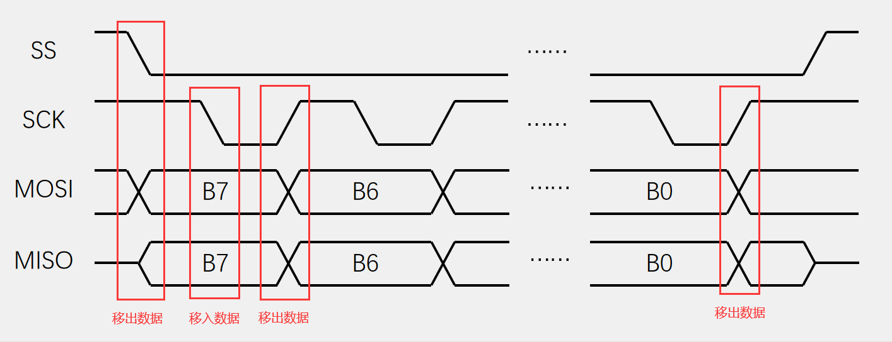

#### 交换字节(模式3)

- CPOL=1：空闲状态时，SCK为高电平
- CPHA=1：SCK第一个边沿移出数据，第二个边沿移入数据
- 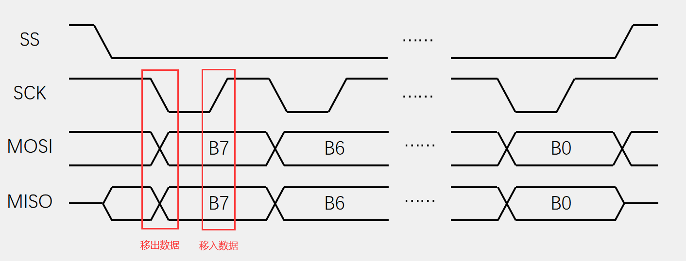

### SPI通信指令

#### 发送指令

- 向SS指定的设备，发送指令（0x06）

时序：

```
| 开始 | 交换字节(0x06) | 停止 |
```

- 
-

#### 指定地址写

- 向SS指定的设备，发送写指令（0x02），
- 随后在指定地址（Address[23:0]）下，写入指定数据（Data）

时序：

```
| 开始 | 交换字节(写指令0x02) | 交换字节(Address[23:0]) | 交换字节(Data) | 停止 |
```

- 

#### 指定地址写

- 向SS指定的设备，发送读指令（0x03），
- 随后在指定地址（Address[23:0]）下，读取从机数据（Data）

时序：

```
| 开始 | 交换字节(读指令0x03) | 交换字节(Address[23:0]) | 交换字节(Data) | 停止 |
```

- 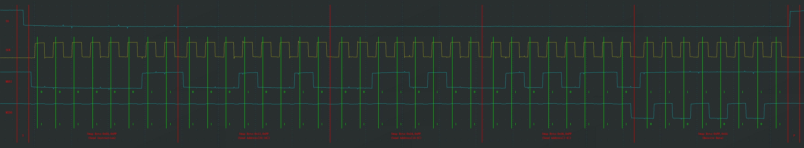

### SPI软件模拟实现

:::code-tabs
@tab `Soft_SPI.h`
@[code cpp](./projects/stm32-makefile/21-SPI协议软件实现-W25Q64/System/Soft_SPI.h)
@tab `Soft_SPI.c`
@[code cpp](./projects/stm32-makefile/21-SPI协议软件实现-W25Q64/System/Soft_SPI.c)
:::

## SPI通信硬件实现

### 简介

- STM32内部集成了硬件SPI收发电路，可以由硬件自动执行时钟生成、数据收发等功能，减轻CPU的负担
- 可配置
  - 8位数据帧/16位数据帧(等于两个8位数据帧)
  - 高位先行/低位先行
- 时钟频率：
  - fPCLK / (2, 4, 8, 16, 32, 64, 128, 256)
  - PCLK(外设时钟)，
  - SPI1=>APB2=72Mhz
  - SPI2=>APB1=>36Mhz
- 支持多主机模型、主或从操作
- 可精简为：
  - 半双工(单数据线分时收发数据)
  - 单工通信(只发送)
- 支持DMA
- 兼容I2S协议（音频传输协议）

> STM32F103C8T6 硬件SPI资源：SPI1、SPI2

### 原理框图

- LSBFIRST位：控制帧格式
  - 1：低位先行（移位寄存器右移）
  - 0：高位先行（移位寄存器左移）
- TXE 发送寄存器空（当发送数据寄存器（TDR）数据整体移入移位寄存器时）
- RXNE 接收寄存器非空（当移位寄存器数据整体移入接收数据寄存器(RDR)时）
- SPI_CR1寄存器的BR[2:0]三个bit控制分频系数
  - 000 2分频
  - 001 4分频
  - 111 256分频
- SPE SPI使能位
- MSTR 主从模式
- CPOL和CPHA共同决定SPI的四种模式
- NSS 从机选择引脚，低电平有效（N）
- 

### 原理简图

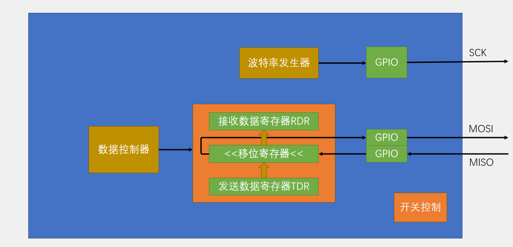

### 连续传输发送

**时序**

- 写入发送寄存器Send_Data[0]
- 等待发送寄存器空标志位
- 写入发送寄存器Send_Data[1]
- while(1)接收数据循环
  - i=0
  - 等待接收寄存器非空标志位
  - 读取接收寄存器Received_Data[0]
  - 等待发送寄存器空标志位
  - 写入发送寄存器Send_Data[2]
  - i=1
    - 等待接收寄存器非空标志位
    - 读取接收寄存器Received_Data[1]
    - 等待发送寄存器空标志位
    - 写入发送寄存器Send_Data[3]
    - 等待接收寄存器非空标志位
  - i=2
    - 等待接收寄存器非空标志位
    - 读取接收寄存器Received_Data[2]
    - 等待发送寄存器空标志位
    - 写入发送寄存器Send_Data[4]
  - ......
- 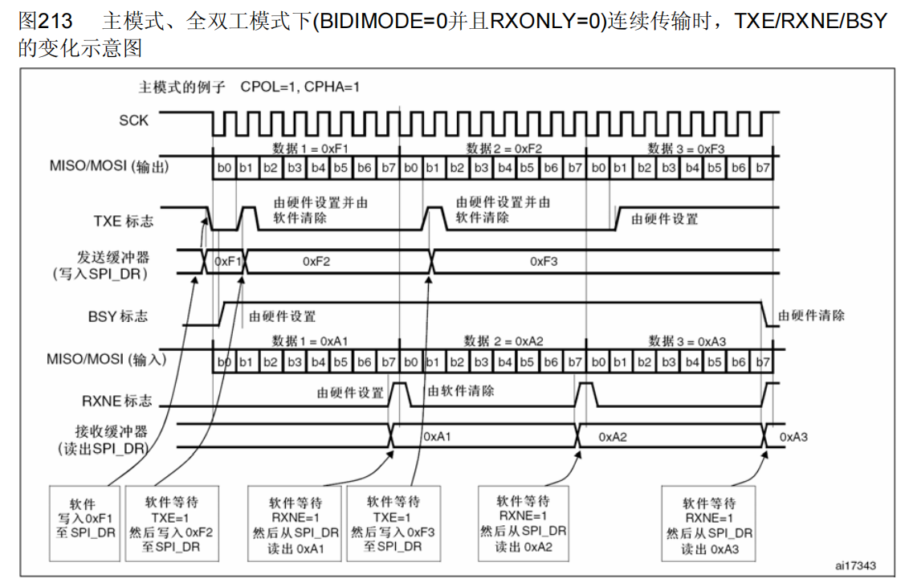

### 非连续传输发送

**时序**

- 等待发送寄存器空标志位
- 写入发送寄存器数据
- 等待接收寄存器非空标志位
- 读取接收寄存器
- 

### SPI硬件外设实现

:::code-tabs
@tab `Hard_SPI.h`
@[code cpp](./projects/stm32-makefile/22-SPI协议硬件实现-W25Q64/System/Hard_SPI.h)
@tab `Hard_SPI.c`
@[code cpp](./projects/stm32-makefile/22-SPI协议硬件实现-W25Q64/System/Hard_SPI.c)
:::

## W25Q64存储器

- W25Qxx系列是一种
  - 低成本、
  - 小型化、
  - 使用简单的
  - 非易失性存储器
- 常应用于
  - 数据存储、
  - 字库存储、
  - 固件程序存储(XIP eXecute in Place就地执行)
  - 等场景
- 存储介质：Nor Flash（闪存）
- 时钟频率：
  - 80MHz（相比于stm32的50Mhz的GPIO非常快）
  - 160MHz (Dual SPI双重SPI模式)
  - 320MHz (Quad SPI四重SPI模式)
- 存储容量（24位地址，16MB寻址空间）：
  - W25Q40:---->4Mbit / 512KByte
  - W25Q80:---->8Mbit / 1MByte
  - W25Q16:---->16Mbit / 2MByte
  - W25Q32:---->32Mbit / 4MByte
  - W25Q64:---->64Mbit / 8MByte
  - W25Q128:---->128Mbit / 16MByte
  - W25Q256:---->256Mbit / 32MByte
    - 后16MB需要使用四字节地址读写模式

### 芯片引脚功能定义

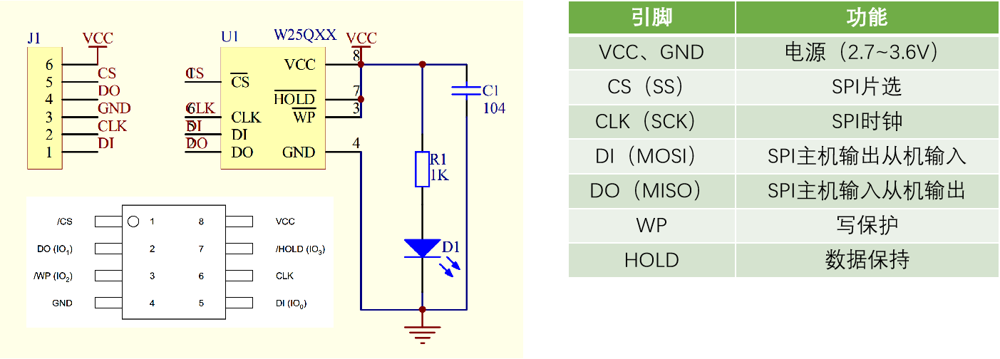

### 芯片内部框图

**存储空间划分**

- 块（Block）: 64KB
- 扇区（Sector）：4KB
- 页（page）:256B


### 注意事项

写入操作时：

- 写入操作前，必须发送写使能指令
- 每个数据位只能由1改写为0，不能由0改写为1
- 写入数据前必须先擦除，擦除后，所有数据位变为1，即0xff
- 擦除必须按最小擦除单元进行
  - 整个芯片擦除
  - 按块擦除
  - 按扇区擦除（4KB）
- 连续写入多字节时，
  - 如果从页起始地址开始写入，最多写入一页(256B)的数据，超过页尾位置的数据，会回到页首覆盖写入
  - 如果从页的中间地址开始写入，写入的位置跨越页地址时，会导致地址错乱。
- 写入操作结束后，芯片进入忙状态，不响应新的读写操作

读取操作时：

- 直接调用读取时序，无需使能，无需额外操作，没有页的限制，读取操作结束后不会进入忙状态，但不能在忙状态时读取

### 指令集


### 基于软件SPI实现

:::code-tabs
@tab `W25Q64.h`
@[code cpp](./projects/stm32-makefile/21-SPI协议软件实现-W25Q64/System/W25Q64.h)
@tab `W25Q64.c`
@[code cpp](./projects/stm32-makefile/21-SPI协议软件实现-W25Q64/System/W25Q64.c)
@tab `Soft_SPI.h`
@[code cpp](./projects/stm32-makefile/21-SPI协议软件实现-W25Q64/System/Soft_SPI.h)
@tab `main.cpp`
@[code cpp](./projects/stm32-makefile/21-SPI协议软件实现-W25Q64/User/main.cpp)
:::

### 基于硬件SPI实现

:::code-tabs
@tab `W25Q64.h`
@[code cpp](./projects/stm32-makefile/22-SPI协议硬件实现-W25Q64/System/W25Q64.h)
@tab `W25Q64.c`
@[code cpp](./projects/stm32-makefile/22-SPI协议硬件实现-W25Q64/System/W25Q64.c)
@tab `Hard_SPI.h`
@[code cpp](./projects/stm32-makefile/22-SPI协议硬件实现-W25Q64/System/Hard_SPI.h)
@tab `main.cpp`
@[code cpp](./projects/stm32-makefile/22-SPI协议硬件实现-W25Q64/User/main.cpp)
:::

## BKP

- BKP（Backup Registers）备份寄存器
- BKP可用于存储用户应用程序数据。
  - 当VDD（2.0~3.6V）芯片供电电源被切断时，BKP可由VBAT（1.8~3.6V）维持工作。
  - 待机模式唤醒、系统复位、电源复位，都不会使得BKP复位。
- BKP可存储RTC时钟校准参数
- BKP的RTC引脚可输出RTC校准时钟、RTC闹钟脉冲或者秒脉冲
- BKP的TAMPER引脚可产生的侵入事件将所有备份寄存器内容清除，并产生中断
  - PC13-TAMPER-RTC共用一个引脚
- 存储容量：
  - 20字节（中容量和小容量）(c8t6中容量)
  - 84字节（大容量和互联型）

### 注意事项

- 实现对BKP和RTC访问的充要条件：
  1. 通过设置RCC_APB1ENR的PWREN和BKPEN，**使能PWR和BKP时钟**
  2. 通过设置PWR_CR的DBP， **使能对BKP和RTC的访问**

### BKP标准库函数介绍

```cpp
// BKP（以及RTC）外设访问控制
void PWR_BackupAccessCmd(FunctionalState NewState);
```

```cpp
// 恢复BKP外设寄存器默认配置，可用于手动清空所有数据寄存器。
void BKP_DeInit(void);
// 侵入检测引脚功能配置,设置侵入检测引脚有效电平（高电平触发或低电平触发）
void BKP_TamperPinLevelConfig(uint16_t BKP_TamperPinLevel); 
// 侵入检查功能开启/关闭
void BKP_TamperPinCmd(FunctionalState NewState);
// 中断配置，是否开启
void BKP_ITConfig(FunctionalState NewState);
// RTC时钟输出配置（输出RTC校准时钟、RTC闹钟、秒脉冲）
void BKP_RTCOutputConfig(uint16_t BKP_RTCOutputSource);
// 设置RTC校准值（写入RTC校准寄存器）。
void BKP_SetRTCCalibrationValue(uint8_t CalibrationValue);
// 写入BKP寄存器
void BKP_WriteBackupRegister(uint16_t BKP_DR, uint16_t Data);
// 读取BKP寄存器
uint16_t BKP_ReadBackupRegister(uint16_t BKP_DR);
// 其他
FlagStatus BKP_GetFlagStatus(void);
void BKP_ClearFlag(void);
ITStatus BKP_GetITStatus(void);
void BKP_ClearITPendingBit(void);
```

### 读写BKP

:::code-tabs
@tab `main.cpp`
@[code cpp](./projects/stm32-makefile/23-BKP-读写数据/User/main.cpp)
:::

### 原理简图

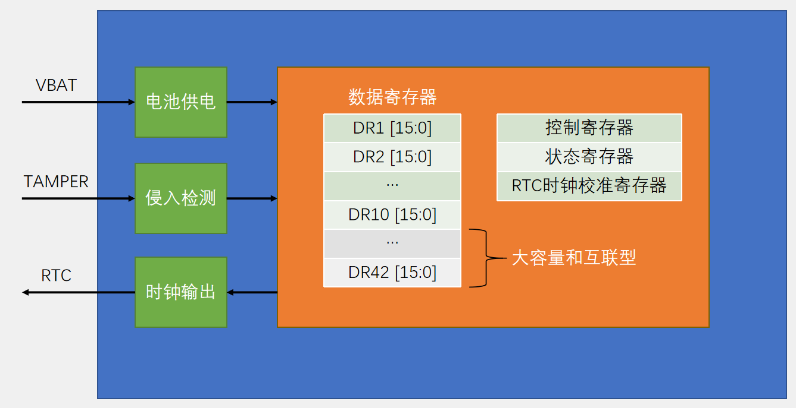

## RTC

- RTC（Real Time Clock）实时时钟
- RTC是一个独立的定时器，可为系统提供时钟和日历的功能
- RTC和时钟配置系统处于后备区域(BKP)
  - 后备区域(BKP)系统复位时数据不清零
  - VDD（2.0~3.6V）断电后可借助VBAT（1.8~3.6V）供电继续走时
- 32位的可编程计数器，可对应Unix时间戳的秒计数器
- 20位的可编程预分频器，可适配不同频率的输入时钟
- 可选择三种RTC时钟源：
  - HSE时钟除以128（通常为8MHz/128）
  - LSE振荡器时钟（通常为32.768KHz）
    - 接入15位计数器，计数器自然溢出的频率就是1Hz
    - 2^15=32768
  - LSI振荡器时钟（40KHz）
  - 三路时钟源，只有32.768Khz时钟能在断电后由VBAT供电工作。

### 原理框图

**分频**

- RTC_PRL:重装寄存器（作用相当于定时器中的ARR自动重装寄存器）
  - 计数目标值，用来配置是几分频
  - 写入0是1分频
  - 写入x是x+1分频
- RTC_DIV:余数寄存器（作用相当于定时器中的CNT计数器）
  - 自减计数器
  - 0值自减将溢出，产生溢出信号，同时自动加载重装值。
- 将32768hz分频到1hz
  - RTC_PRL需写入32768-1
  - RTC_DIV可给0
  - 第0秒
    - 第1个时钟到来时，
      - RTC_DIV自减溢出，产生溢出信号（1hz）
      - RTC_DIV变为重装值32768-1=32767
    - 第2个时钟到来时，
      - RTC_DIV自减，变为=32768-2=32766
    - ......
    - 第32768个时钟到来时，
      - RTC_DIV自减，变为=32768-32768=0
  - 第1秒
    - 第1个时钟到来时，
    - RTC_DIV自减溢出，产生溢出信号（1hz）
    - RTC_DIV变为重装值32768-1=32767

- RTC_ALR:闹钟寄存器
  - 和RTC_CNT等宽的寄存器，
  - 用于设置闹钟值，
  - 可以配置达到设定值后产生中断、退出待机模式。
- RTC_Second:秒中断
  - 来自RTC_CNT寄存器的输入TR_CLK
  - 开启后可以每秒触发一次中断。
- RTC_Overflow：溢出中断
  - CNT计数器溢出中断
  - CNT为无符号数，在2106年溢出


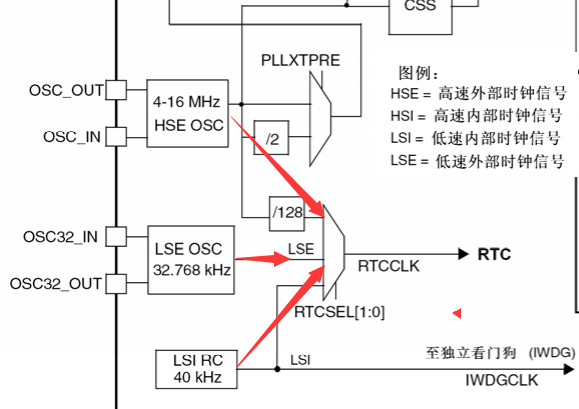

### 原理简图


### 注意事项

- 实现对BKP和RTC访问的充要条件：
  1. 通过设置RCC_APB1ENR的PWREN和BKPEN，**使能PWR和BKP时钟**
  2. 通过设置PWR_CR的DBP， **使能对BKP和RTC的访问**
- 上电复位后首次读取RTC寄存器需等待RTC时钟和APB1时钟完成同步。
  - 若在读取RTC寄存器时，RTC的APB1接口曾经处于禁止状态，
  - 则软件首先必须等待RTC_CRL寄存器中的RSF位（寄存器同步标志）被硬件置1
- RTC配置模式
  - 必须设置RTC_CRL寄存器中的CNF位，使RTC进入配置模式后，才能写入RTC_PRL、RTC_CNT、RTC_ALR寄存器。
    - > 标准库已经自动完成该操作。
  - 写入前需等待上一次写入操作结束
    - > 因为RTC电路的工作频率和APB1总线工作频率不一致。
    - 对RTC任何寄存器的写操作，都必须在前一次写操作结束后进行。
    - 可以通过查询RTC_CR寄存器中的RTOFF状态位，判断RTC寄存器是否处于更新中。
    - 仅当RTOFF状态位是1时，才可以写入RTC寄存器

### 标准库函数

```cpp
void RCC_LSEConfig(uint8_t RCC_LSE);              // L低速E外部时钟：开启/关闭/旁路(从OSE32_IN引脚接入外部时钟)
void RCC_LSICmd(FunctionalState NewState);        // 低速内部时钟：开启/关闭
void RCC_RTCCLKConfig(uint32_t RCC_RTCCLKSource); // 选择RTC时钟源：LSE/LSI/HSE_Div128
void RCC_RTCCLKCmd(FunctionalState NewState);     // RTC时钟：开启/关闭
FlagStatus RCC_GetFlagStatus(uint8_t RCC_FLAG);   // 获取RCC标志位状态：RCC_FLAG_LSIRDY低速外部时钟成功起振标志
```

```cpp
void RTC_EnterConfigMode(void);                 // 进入配置模式，否则无法读写相关寄存器(RTC_PRL、RTC_CNT、RTC_ALR)
void RTC_ExitConfigMode(void);                  // 退出配置模式
uint32_t RTC_GetCounter(void);                  // 获取RTC计数器的值（Unix时间戳）
void RTC_SetCounter(uint32_t CounterValue);     // 设置RTC计数器
void RTC_SetPrescaler(uint32_t PrescalerValue); // 设置分频系数
void RTC_SetAlarm(uint32_t AlarmValue);         // 设置闹钟值
uint32_t  RTC_GetDivider(void);                 // 获取余数寄存器值(得到更精确的时间戳)
void RTC_WaitForLastTask(void);                 // 等待上次操作完成(等待上一次写操作结束),否则无法写入数据
void RTC_WaitForSynchro(void);                  // 等待同步(总线时钟和RTC时钟的同步)
```

### 获取RTC毫秒级别时间

:::code-tabs
@tab `/System/Rtc.c`
@[code cpp](./projects/stm32-makefile/24-RTC-获取毫秒级别系统时间/System/Rtc.c)
@tab `/System/Rtc.h`
@[code cpp](./projects/stm32-makefile/24-RTC-获取毫秒级别系统时间/System/Rtc.h)
@tab `main.cpp`
@[code cpp](./projects/stm32-makefile/24-RTC-获取毫秒级别系统时间/User/main.cpp)
:::

## PWR

- PWR（Power Control）电源控制
- PWR负责管理STM32内部的电源供电部分，
- 可以实现**可编程电压监测器**和**低功耗模式**的功能
  - 可编程电压监测器（PVD）
    - 可以监控VDD电源电压，
    - 当VDD下降到PVD阀值以下或上升到PVD阀值之上时，
    - PVD会触发中断，用于执行紧急关闭任务
  - 低功耗模式：
    - 睡眠模式（Sleep）
    - 停机模式（Stop）
    - 待机模式（Standby）
  - 可在系统空闲时，降低STM32的功耗，延长设备使用时间

### 供电方案框图

- 

### 上电复位、掉电复位

> 当VDD/VDDA电压过低时，内部电路将直接产生复位信号。

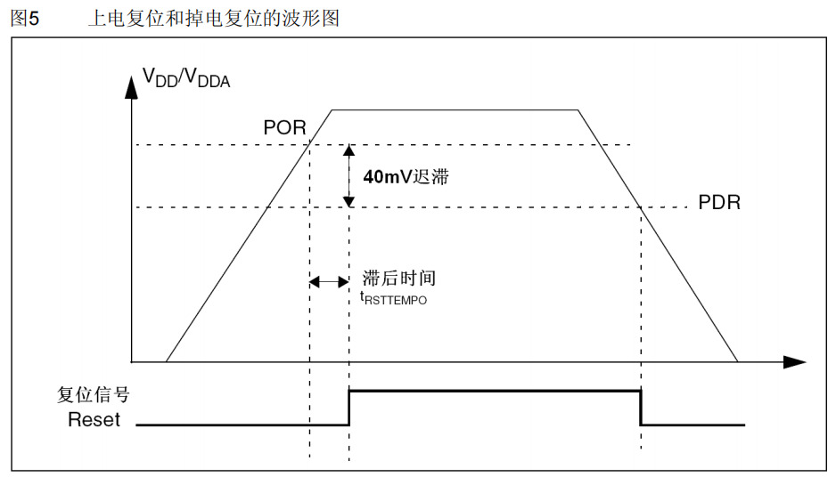

> 大于1.88上电复位，低于1.92掉电复位


### 电压过低检测

> 用于实现对VDD电压的监测，阈值范围可调。


> - PVD 属于外部中断。
> - RTC 本身也有中断，也可以接到外部中断。
> - 接入外部中断的原因是，只有外部中断信号可以唤醒处于停止模式的设备。


### 三种低功耗模式

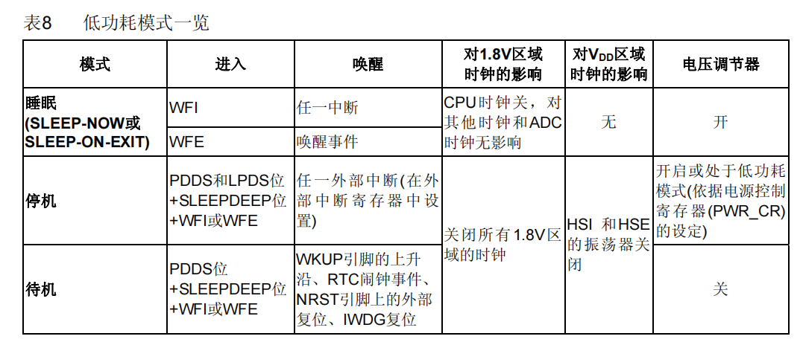

**睡眠模式**

- 如何进入
  - SLEEPONEXIT = 0 则立即进入睡眠模式，否则将等待中断函数执行退出后再进入。
  - 然后调用WFI(Wait For Interrupt等待中断) 或 调用WFE(Wait For Event 等待事件)
    - 实际是两条内核指令
- 如何唤醒
  - WFI，等待任何中断
  - WFE，等待任何事件、或者开启了中断但未配置NVIC
- 对电路的影响
  - 关闭CPU时钟（但没有关闭电源，所以CPU寄存器和存储器数据仍然存在）

**停机模式**

- 如何进入
  - PDDS=0 表示进入停机模式，否则进入待机模式
  - LPDS=0 电压调节器开启（1.8VCPU供电），否则关闭，进入低功耗模式（仍然可维持1.8V区域CPU寄存器和存储器数据）。
  - SLEEPDEEP = 1 表示进入深度睡眠模式
  - 调用WFI或调用WFE
- 如何唤醒
  - 只有外部中断才能唤醒
    - WFI需用外部中断的中断模式唤醒
    - WFE需用外部中断的事件模式唤醒
- 对电路的影响
  - 关闭1.8V区域的所有时钟（CPU时钟、存储器，内置数组外设、定时器、串口）
  - 没有关闭电源，所以CPU寄存器和存储器数据仍然存在。
  - 内部高速时钟、外部高速时钟关闭。
  - 电压调节器根据LPDS位决定是否进入低功耗模式（没有关闭）

**待机模式**

- 如何进入
  - PDDS=1 表示进入待机模式，否则进入停机模式
  - SLEEPDEEP = 1 表示进入深度睡眠模式
  - 调用WFI或调用WFE
- 如何唤醒
  - 任何中断和事件都无法唤醒
  - 只有WKUP引脚、RTC闹钟事件、NRST引脚的外部复位信号、IWDG独立看门狗复位。
- 对电路的影响
  - 1.8V区时钟关闭
  - 两高速时钟关闭
  - 电压调节器关闭（1.8V区域电源关闭，存储器和寄存器数据全部丢失）
  
> 执行WFI（Wait For Interrupt）或者WFE（Wait For Event）指令后，STM32进入低功耗模式

### 三种低功耗模式的执行细节

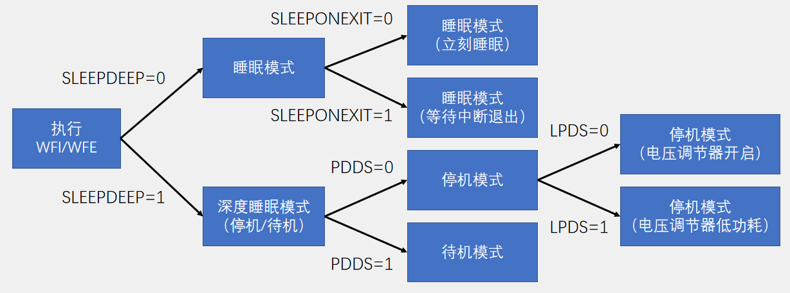

**睡眠模式**

- SLEEPDEEP = 0 表示进入浅睡眠模式
- 执行完WFI/WFE指令后，STM32进入睡眠模式，程序暂停运行，唤醒后程序从暂停的地方继续运行
- SLEEPONEXIT位
  - 决定STM32执行完WFI或WFE后，
  - SLEEPONEXIT=0 立刻进入睡眠，
  - SLEEPONEXIT=1 等STM32从最低优先级的中断处理程序中退出时进入睡眠
- 所有的I/O引脚都保持它们在运行模式时的状态
- 唤醒条件
  - WFI指令进入睡眠模式，可被**任意一个NVIC**响应的中断唤醒
  - WFE指令进入睡眠模式，可被**唤醒事件**唤醒
    - 产生唤醒事件
    - 方法1:
      - 再外设控制寄存器中使能中断（而不是再NVIC中使能）
      - 再Cortex-M3系统控制寄存器中使能SEVONPEND位
      - 被唤醒事件唤醒后需手动清除NVIC中断通道挂起位。
    - 方法2：
      - 配置一个外部或内部EXIT线为事件模式。
      - 被唤醒事件唤醒后无需清除中断挂起位或外设的NVIC中断通道挂起位。

**停止模式**

- `SLEEPDEEP = 1` 表示进入深度睡眠模式
- `PDDS = 0` 表示进入停机模式，否则进入待机模式
- 执行完`WFI/WFE`指令后，STM32进入停止模式，程序暂停运行，唤醒后程序从暂停的地方继续运行
- 1.8V供电区域的所有时钟都被停止，PLL、HSI和`HSE`被禁止，SRAM和寄存器内容被保留下来
- **所有的I/O引脚都保持它们在运行模式时的状态**
- 当一个中断或唤醒事件导致退出停止模式时，**HSI（高速内部8M时钟）被选为系统时钟**
  - 一般需要手动重启`HSE`,并配置主频为`72Mhz`
- 当`LPDS = 1`电压调节器处于低功耗模式下，系统从停止模式退出时，会有一段额外的启动延时
- 唤醒条件
  - WFI指令进入停止模式，可被任意一个**EXTI中断**唤醒
  - WFE指令进入停止模式，可被任意一个**EXTI事件**唤醒

**待机模式**

- `SLEEPDEEP = 1` 表示进入深度睡眠模式
- `PDDS = 1` 表示进入待机模式
- 执行完`WFI/WFE`指令后，STM32进入待机模式，**唤醒后程序从头开始运行**
- 整个1.8V供电区域被断电，PLL、HSI和HSE也被断电，SRAM和寄存器内容丢失，只有备份的寄存器和待机电路维持供电
- **在待机模式下，所有的I/O引脚变为高阻态（浮空输入）**
- 唤醒条件
  - WKUP引脚的上升沿、RTC闹钟事件的上升沿、NRST引脚上外部复位、IWDG复位退出待机模式

### 降低主频

`system_stm32f10x.c`

```cpp
#if defined (STM32F10X_LD_VL) || (defined STM32F10X_MD_VL) || (defined STM32F10X_HD_VL)
/* #define SYSCLK_FREQ_HSE    HSE_VALUE */
 #define SYSCLK_FREQ_24MHz  24000000
#else
// 启用下面一条定义来选择主频。
/* #define SYSCLK_FREQ_HSE    HSE_VALUE */
/* #define SYSCLK_FREQ_24MHz  24000000 */
/* #define SYSCLK_FREQ_36MHz  36000000 */
/* #define SYSCLK_FREQ_48MHz  48000000 */
/* #define SYSCLK_FREQ_56MHz  56000000 */
#define SYSCLK_FREQ_72MHz  72000000
#endif
```

```cpp
#include "stm32f10x.h"
#include "Delay.h"
#include "OLED.h"
#include "OLED_Printf.h"

int main(void)
{
    OLED_Init();
    // 显示系统主频
    OLED_Printf("SystemCoreClock: %d \n", SystemCoreClock);
    while (1)
    {
    }
}
```

### 浅睡眠模式——串口唤醒

:::code-tabs
@tab `User/main.cpp`
@[code cpp](./projects/stm32-makefile/26-PWR-浅睡眠模式-串口唤醒/User/main.cpp)
@tab `/System/Serial.c`
@[code cpp](./projects/stm32-makefile/26-PWR-浅睡眠模式-串口唤醒/System/Serial.c)
:::

### 深度睡眠模式——停机模式——外部中断唤醒

:::code-tabs
@tab `User/main.cpp`
@[code cpp](./projects/stm32-makefile/27-PWR-深度睡眠模式-停机模式-外部中断唤醒/User/main.cpp)
:::

### 深度睡眠模式——待机模式——rtc闹钟唤醒——wakeup唤醒

:::code-tabs
@tab `User/main.cpp`
@[code cpp](./projects/stm32-makefile/28-PWR-深度睡眠模式-待机模式-rtc闹钟唤醒+wakeup唤醒/User/main.cpp)
@tab `System/Rtc.c`
@[code cpp](./projects/stm32-makefile/28-PWR-深度睡眠模式-待机模式-rtc闹钟唤醒+wakeup唤醒/System/Rtc.c)
:::

## WDG看门狗

- WDG（Watchdog）看门狗
- 看门狗可以监控程序的运行状态，当程序因为设计漏洞、硬件故障、电磁干扰等原因，出现卡死或跑飞现象时，看门狗能及时复位程序，避免程序陷入长时间的罢工状态，保证系统的可靠性和安全性
- 看门狗本质上是一个定时器，当指定时间范围内，程序没有执行喂狗（重置计数器）操作时，看门狗硬件电路就自动产生复位信号
- STM32内置两个看门狗
  - 独立看门狗（IWDG）：独立工作，对时间精度要求较低（不能太晚喂狗）
    - 使用专用时钟，LSI内部低速时钟
  - 窗口看门狗（WWDG）：要求看门狗在精确计时窗口起作用（不能太晚喂狗也不能太早喂狗）
    - 使用APB1时钟

### 原理框图

**独立看门狗**

- 递减计数器自减溢出后产生复位信号。
- 程序运行中为了避免复位应当不断重置计数器，避免其归零。
- 预分频器只有8位，最大只能进行256分频。
- 递减计数器为12位， 最大值为：$2^{12-1}=4095$
- 可以在重装寄存器中写入初始值避免复位。
- 在键寄存器写入特定数据，然后重装值将复制到计数器中，自减运行。


### 独立看门狗键寄存器

- 键寄存器本质上是控制寄存器，用于控制硬件电路的工作
- 在可能存在干扰的情况下，一般通过在整个键寄存器写入特定值来代替控制寄存器写入一位的功能，以降低硬件电路受到干扰的概率

|  写入键寄存器的值  |                  作用                  |
| :----------------: | :------------------------------------: |
|       0xCCCC       |             启用独立看门狗             |
|       0xAAAA       | IWDG_RLR中的值重新加载到计数器（喂狗） |
|       0x5555       |     解除IWDG_PR和IWDG_RLR的写保护      |
| 0x5555之外的其他值 |     启用IWDG_PR和IWDG_RLR的写保护      |

### 独立看门狗超时时间

- 超时时间：$T_{IWDG} = T_{LSI} × \text{PR预分频系数} × (RL + 1)$
  - $T_{LSI} = 1/F_{LSI}=0.025ms$
  - $F_{LSI}=40Khz$
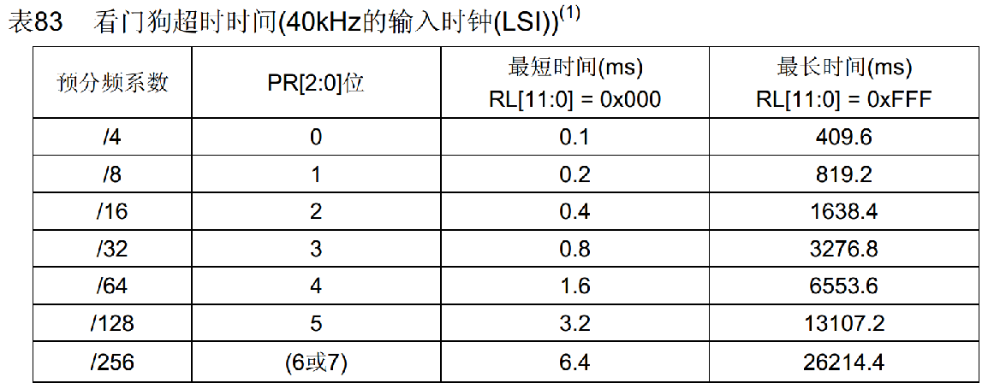

### 窗口看门狗框图

- PCLK1,36M的时钟，其实还经过了一个固定的4096分频才到达看门狗的预分频器。
- WWDG_CR控制寄存器
  - WDGA 启用窗口看门狗的位
  - CNT: 六位的递减计数器
  - T6: 计数器的第七位，用来当计数器的溢出标志位，当其从1变化为0时，输出的就是复位信号。
    - `0x1000000 = 0x40`
- WWDG_CFR配置寄存器，决定了最早时间界限。
  - 当喂狗时（往递减计数去写数时），T6:0>W6:0,表示写入的时机过早，比较器将输出1，导致复位。

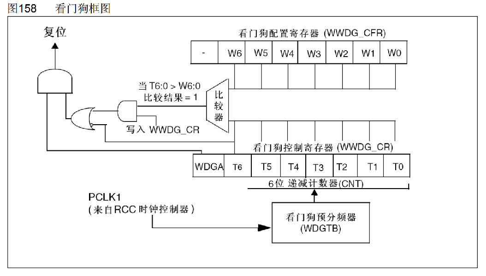

### 窗口看门狗时序

- （没有及时喂狗）递减计数器T[6:0]的值等于0x40-1时，WWDG产生复位
- （过早喂狗）递减计数器T[6:0]在窗口W[6:0]外被重新装载时，WWDG产生复位
- （0溢事件）递减计数器T[6:0]等于0x40时可以产生早期唤醒中断（EWI），用于重装载计数器以避免WWDG复位
- 定期写入WWDG_CR寄存器（喂狗）以避免WWDG复位

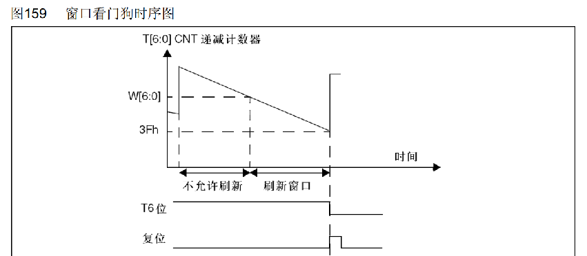

### 窗口看门狗的超时时间

- 超时时间：$T_{WWDG} = T_{PCLK1} × 4096 × 2^{\text{WDGTB预分频系数}} × (T[5:0] + 1)$
- 窗口时间：$T_{WIN} = T_{PCLK1} × 4096 × 2^{\text{WDGTB预分频系数}} × (T[5:0] - W[5:0])$
  - 其中：$T_{PCLK1} = 1 / F_{PCLK1}$


### 独立看门狗和窗口看门狗的区别

|            |        IWDG独立看门狗        |           WWDG窗口看门狗            |
| :--------: | :--------------------------: | :---------------------------------: |
|    复位    |        计数器减到0后         | 计数器T[5:0]减到0后、过早重装计数器 |
|    中断    |              无              |            早期唤醒中断             |
|   时钟源   |         LSI（40KHz）         |           PCLK1（36MHz）            |
| 预分频系数 |    4、8、16、32、64、128、256    |             1、2、4、8              |
|   计数器   |             12位             |           6位（有效计数）           |
|  超时时间  |              0               |    .1ms~26214.4ms 113us~58.25ms     |
|  喂狗方式  | 写入键寄存器，重装固定值RLR  |   直接写入计数器，写多少重装多少    |
|  防误操作  |       键寄存器和写保护       |                 无                  |
|    用途    | 独立工作，对时间精度要求较低 |   要求看门狗在精确计时窗口起作用    |

### IWDG案例代码

:::code-tabs
@tab `User/main.cpp`
@[code cpp](./projects/stm32-makefile/29-IWDG独立看门狗/User/main.cpp)
:::

### WWDG案例代码

:::code-tabs
@tab `User/main.cpp`
@[code cpp](./projects/stm32-makefile/30-WWDG窗口看门狗/User/main.cpp)
:::

## Flash闪存

- STM32F1系列的FLASH包含三个部分
  - 程序存储器
  - 系统存储器
  - 选项字节
- 通过**闪存存储器接口（外设）**可以对**程序存储器**和**选项字节**进行擦除和编程
- 读写FLASH的用途：
  - 利用程序存储器的剩余空间来保存掉电不丢失的用户数据
    - 如：可以在FLASH的最后几页存储想要存储的参数。
  - 通过在程序中编程（IAP），实现程序的自我更新
    - 通过Flash中的程序直接修改程序自己本身。
- 在线编程（In-Circuit Programming – ICP）
  - 用于更新程序存储器的全部内容，它通过JTAG、SWD协议或系统加载程序（Bootloader）下载程序
  - 就是烧录程序最常用的方式，通过串口或或st-link下载程序。
- 在程序中编程（In-Application Programming – IAP）
  - 可以使用微控制器支持的任一种通信接口下载程序
  - 如自己写一个bootloader程序放在flash存储器的最后几页，
  - 需要更新程序时，控制程序跳转到自己写的bootloader，
  - 然后接收任何通信接口的数据写入到Flash。

### 闪存模块组织结构

> STM32F10xxx闪存编程参考手册.pdf

**中容量闪存模块组织结构**

- 主存储器
  - 存放程序代码的。
- 信息块
  - 启动程序代码：系统存储器，存放Bootloader程序，用于串口下载。
  - 用户选择字节：选项字节，存放独立的参数。
- 闪存存储器接口寄存器
  - 实际是一些数据寄存器，存储介质为SRAM，
  - 可以用来控制闪存的**擦除**和**编程（写入）**
- 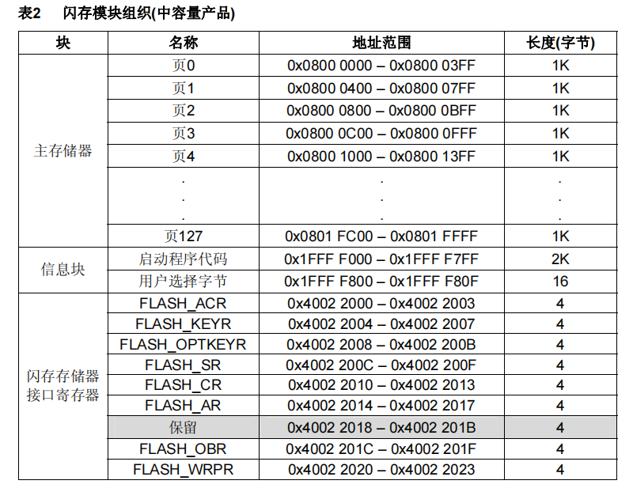

### 闪存结构简图

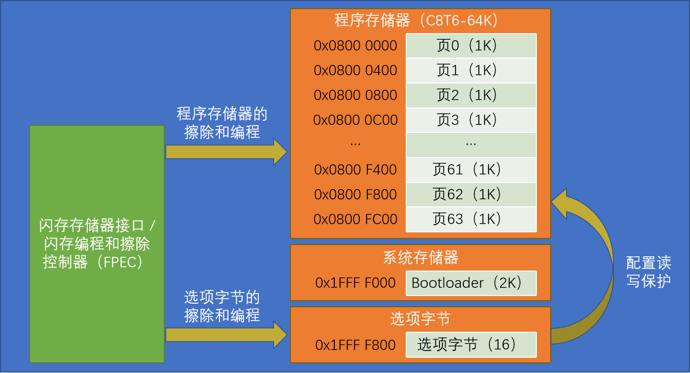

### 解锁FLASH

**FPEC键值**

```cpp
/* FLASH Keys */
#define RDP_Key                  ((uint16_t)0x000000A5) // RDPRT（read protect读保护）
#define FLASH_KEY1               ((uint32_t)0x45670123)
#define FLASH_KEY2               ((uint32_t)0xCDEF89AB)
```

**解锁流程**

- 复位后，闪存存储器接口FPEC被保护，不能写入FLASH_CR
- **在FLASH_KEYR先写入KEY1，再写入KEY2，解锁**
  > 错误的操作序列（如电磁干扰）会锁死`FPEC`和`FLASH_CR`,除非复位。

**加锁流程**

- 设置FLASH_CR.LOCK为1,锁住FPEC和FLASH_CR

### 使用指针读取存储器

```cpp
// 防止编译器优化，告诉编译器该数据是易变的，不需要做缓存优化。
// 缓存优化：编译器通过把要对内存频繁读写的数据备份到高速缓存（工作组寄存器）来加速读写速度，但是有可能程序直接修改了内存的数据（如中断、DMA、ADC数据寄存器），但是高速寄存器中还是原始值，这就需要使用volatile关键字。
#define    __IO    volatile
// 使用指针读指定地址下的存储器：
uint16_t Data = *((__IO uint16_t *)(0x08000000));
// 使用指针写指定地址下的存储器(需要提前解锁Flash，并进行忙等待)：
*((__IO uint16_t *)(0x08000000)) = 0x1234;
```

```cpp
// 读取字节
uint8_t Flash_Read_uint8(uint32_t address){
  return *((__IO uint8_t *)(address));
}
uint16_t Flash_Read_uint16(uint32_t address){
  return *((__IO uint16_t *)(address));
} 
// 读取float
float Flash_Read_float(uint32_t address){
  return *((__IO float *)(address));
} 
double Flash_Read_double(uint32_t address){
  return *((__IO double *)(address));
} 
```

### Flash全擦除流程

- `执行Flash解锁流程`
- `FLASH_CR.MER=1`               （MASS ERASE全擦除）
- `FLASH_CR.STRT=1`              (start 开始干活)
- `while(FLASH_SR.BSY==1);`     (忙等待)


### Flash页擦除流程

- `执行Flash解锁流程`
- `FLASH_CR.PER=1`               （Page Erase页擦除）
- `FLASH_AR=页首地址`
- `FLASH_CR.STRT=1`              (start 开始干活)
- `while(FLASH_SR.BSY==1);`     (忙等待)

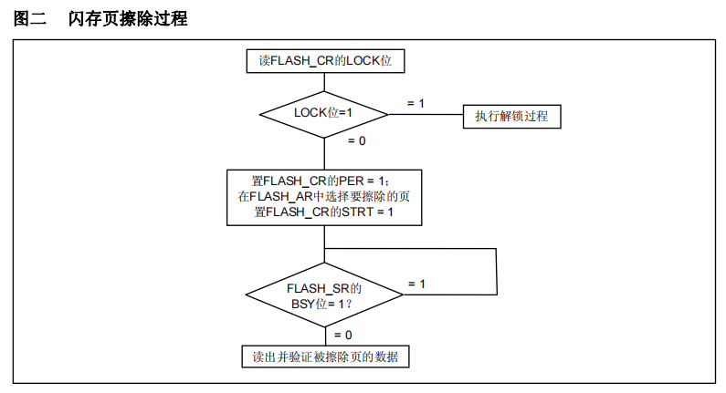

### Flash半字（16bit）写入流程

- `执行Flash解锁流程`
- FLASH_CR.PG=1    (Programming编程写入)
- `*((__IO uint16_t *)(0x08000000)) = 0x1234;`  (写入半字16bit)
- `while(FLASH_SR.BSY==1);`     (忙等待)

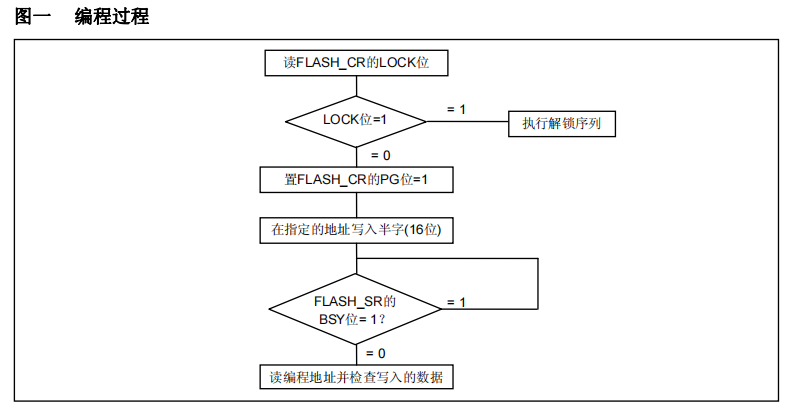

### 选项字节


- `nRDP`
  - 写入RDP的反码
- `RDP`
  - 读出保护选择字节
  - 写入(RDPRT键=0x00A5)后，闪存被开放允许读出访问。
- `USER`
  - 选择看门狗事件：硬件或软件
  - 进入停机(STOP)模式时的复位事件
  - 进入待机模式时的复位事件
- `Data0/1`
  - 用户自定义使用
- `WRP0/1/2/3`
  - 配置写保护
  - 每位保护4页（中容量）
    - 4x8=32位
    - 32x4=128页

#### 选项字节的擦除流程

- `while(FLASH_SR.BSY==1);`     (事前忙等待)
- `执行Flash解锁流程`
- `解锁选项字节解锁流程`
  - 在`FLASH_OPTKEYR`先写入KEY1，再写入KEY2，解锁选项字节
  - 然后硬件会自动将`FLASH_CR.OPTWRE=1`               （Option Write Enable选项写入允许）
- `FLASH_CR.OPTER=1`               （Option Erase选项字节擦除）
- `FLASH_CR.STRT=1`               (start 开始干活)
- `while(FLASH_SR.BSY==1);`     (事后忙等待)
- 擦除完成

#### 选项字节的写入流程

- `while(FLASH_SR.BSY==1);`     (事前忙等待)
- `执行Flash解锁流程`
- `解锁选项字节解锁流程`
- `FLASH_CR.OPTPG=1`               （Option Erase选项字节擦除）
- `*((__IO uint16_t *)(0x08000000)) = 0x1234;`  (写入半字16bit)
- `while(FLASH_SR.BSY==1);`     (事后忙等待)
- 写入完成

### 器件电子签名

- **电子签名**存放在闪存存储器模块的**系统存储区域（Bootloader）**，
- 包含的芯片识别信息在出厂时编写，**不可更改**，
- 使用指针读指定地址下的存储器可获取电子签名
- `F_SIZE` 闪存容量寄存器：
  - 基地址：0x1FFF F7E0
  - 大小：16位
- `U_ID` 产品唯一身份标识寄存器：
  - 基地址： 0x1FFF F7E8
  - 大小：96位

### 主闪存编程

- 对主闪存编程每次可以写入16位。
- 当FLASH_CR寄存器的PG位为’1’时，
- 在一个闪存地址写入一个半字将启动一次编程；
- 写入任何非半字的数据，FPEC都会产生总线错误。
- 在编程过程中(BSY位为’1’)，任何读写闪存的操作都会使CPU暂停，直到此次闪存编程结束。

**关于读写闪存导致CPU暂停**

1. 当CPU执行如 while(FLASH_SR.BSY == 1); 这样的循环时，它实际上是在执行存储在RAM或内部缓存中的指令，而不是直接从闪存读取指令。即使闪存处于忙碌状态，CPU仍然能够从其内部缓存或RAM中执行代码，除非它需要从闪存中读取数据或指令。
2. 对FLASH_SR.BSY的访问实际上是对Flash状态寄存器的访问，而不是对Flash存储器本身的访问。
3. 如果在 BSY 位为1时尝试访问闪存，CPU并不会真正“暂停”，而是会遇到访问延迟，因为闪存控制器会阻止任何访问直到其内部操作完成。这可能会影响程序的执行速度，尤其是在频繁访问闪存的情况下。

### 标准库Flash外设

```cpp
// 三个和内核代码有关的，不需要用户调用
void FLASH_SetLatency(uint32_t FLASH_Latency); // 设置SYSCLK(系统时钟)周期与闪存访问时间的比例
void FLASH_HalfCycleAccessCmd(uint32_t FLASH_HalfCycleAccess);//闪存半周期访问使能
void FLASH_PrefetchBufferCmd(uint32_t FLASH_PrefetchBuffer);//预取缓冲区使能
void FLASH_Unlock(void);// 解锁
void FLASH_Lock(void);// 上锁
FLASH_Status FLASH_ErasePage(uint32_t Page_Address);// 页擦除
FLASH_Status FLASH_EraseAllPages(void);// 全页擦除
FLASH_Status FLASH_EraseOptionBytes(void);// 选项字节擦除
FLASH_Status FLASH_ProgramWord(uint32_t Address, uint32_t Data);// 写入字
FLASH_Status FLASH_ProgramHalfWord(uint32_t Address, uint16_t Data);// 写入半字
FLASH_Status FLASH_ProgramOptionByteData(uint32_t Address, uint8_t Data);// 写入选项字节
FLASH_Status FLASH_EnableWriteProtection(uint32_t FLASH_Pages);// 开启写保护
FLASH_Status FLASH_ReadOutProtection(FunctionalState NewState);// 开启读保护
FLASH_Status FLASH_UserOptionByteConfig(uint16_t OB_IWDG, uint16_t OB_STOP, uint16_t OB_STDBY);// 写入用户选项的三个配置位
uint32_t FLASH_GetUserOptionByte(void);// 读取用户选项
uint32_t FLASH_GetWriteProtectionOptionByte(void);// 获取写保护状态
FlagStatus FLASH_GetReadOutProtectionStatus(void);// 获取读保护状态
FlagStatus FLASH_GetPrefetchBufferStatus(void);// 获取预取缓冲区状态
```

### FLash擦除和写入

:::code-tabs
@tab `User/main.cpp`
@[code cpp](./projects/stm32-makefile/31-FLash-擦除和写入/User/main.cpp)
@tab `System/FlashUtils.h`
@[code cpp](./projects/stm32-makefile/31-FLash-擦除和写入/System/FlashUtils.h)
@tab `System/FlashUtils.c`
@[code cpp](./projects/stm32-makefile/31-FLash-擦除和写入/System/FlashUtils.c)
:::

### FLashStore存储

:::code-tabs
@tab `User/main.cpp`
@[code cpp](./projects/stm32-makefile/32-FLash-Store/User/main.cpp)
@tab `System/FlashStore.h`
@[code cpp](./projects/stm32-makefile/32-FLash-Store/System/FlashStore.h)
@tab `System/FlashStore.c`
@[code cpp](./projects/stm32-makefile/32-FLash-Store/System/FlashStore.c)
:::

### 读取芯片容量和ID

:::code-tabs
@tab `User/main.cpp`
@[code cpp](./projects/stm32-makefile/33-读取芯片Id/User/main.cpp)
:::
