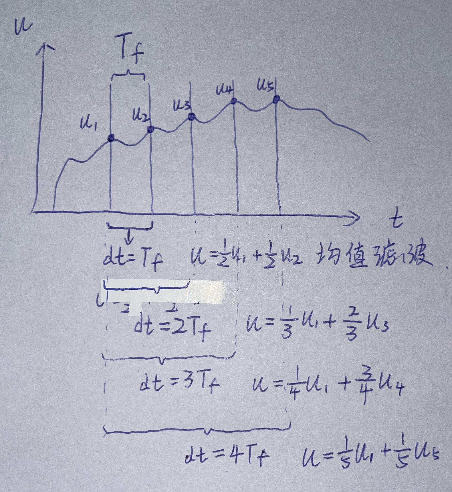

## 原理

**公式**
$$
\begin{align*}
K &= \frac{T_f}{T_f+dt} \\
Y_n &=  K Y_{n-1} + (1-K) X_n
\end{align*}
$$

**含义**

- $T_f$是时间常数
- $dt$是时间间隔
- $X_n$是本次输入
- $Y_{n}$是本次滤波器输出
- $Y_{n-1}$是上次滤波器输出
- K为系数 K∈[0,1]
  - dt越小，$Y_{n}$约接近于$Y_{n-1}$
  - dt越大，$Y_{n}$约接近于$X_n$

**K的实际意义**

假设时间常数$T_f$为1秒,观察dt取[0,9]时K的情况

|  dt   |   $K = \frac{T_f}{T_f+dt}$   |      $Y_n =  K Y_{n-1} + (1-K) X_n$       |
| :---: | :--------------------------: | :---------------------------------------: |
|   0   | $\frac{1}{1+0}=\frac{1}{1}$  | $\frac{1}{1} Y_{n-1} + \frac{0}{1}  X_n$  |
|   1   | $\frac{1}{1+1}=\frac{1}{2}$  | $\frac{1}{2} Y_{n-1} + \frac{1}{2}  X_n$  |
|   2   | $\frac{1}{1+2}=\frac{1}{3}$  | $\frac{1}{3} Y_{n-1} + \frac{2}{3}  X_n$  |
|   3   | $\frac{1}{1+3}=\frac{1}{4}$  | $\frac{1}{4} Y_{n-1} + \frac{3}{4}  X_n$  |
|   4   | $\frac{1}{1+4}=\frac{1}{5}$  | $\frac{1}{5} Y_{n-1} + \frac{4}{5}  X_n$  |
|   5   | $\frac{1}{1+5}=\frac{1}{6}$  | $\frac{1}{6} Y_{n-1} + \frac{5}{6}  X_n$  |
|   6   | $\frac{1}{1+6}=\frac{1}{7}$  | $\frac{1}{7} Y_{n-1} + \frac{6}{7}  X_n$  |
|   7   | $\frac{1}{1+7}=\frac{1}{8}$  | $\frac{1}{8} Y_{n-1} + \frac{7}{8}  X_n$  |
|   8   | $\frac{1}{1+8}=\frac{1}{9}$  | $\frac{1}{9} Y_{n-1} + \frac{8}{9}  X_n$  |
|   9   | $\frac{1}{1+9}=\frac{1}{10}$ | $\frac{1}{10} Y_{n-1} +\frac{9}{10}  X_n$ |

可以发现，

- 当 $dt=0T_f$ 时 $Y_n$ 中含有  $\frac{1}{1} Y_{n-1}$  
- 当 $dt=1T_f$ 时 $Y_n$ 中含有  $\frac{1}{2} Y_{n-1}$  
- 当 $dt=2T_f$ 时 $Y_n$ 中含有  $\frac{1}{3} Y_{n-1}$  
- ...
- 当 $dt=NT_f$ 时 $Y_n$ 中含有  $\frac{1}{1+N} Y_{n-1}$  
- 即：
  - $\lim_{N \to 0}Y_n=Y_{n-1}$
  - $\lim_{N \to \infty}Y_n=0$

并且当 采样频率 dt = 时间常数T_f 时  滤波器表现为均值滤波

**图像理解低通滤波器**



> 所以这里的 T_f 似乎可以理解为过滤的频率


## 最简代码实现

```cpp
class LowPassFilter{
  float Tf,y_prev;
  LowPassFilter(float tf){
      Tf = tf;
      y_prev = 0.0f;
  }
  Filter(float x,float dt){
      float alpha = Tf/(Tf + dt);
      float y = alpha * y_prev + (1.0f - alpha) * x;
      y_prev = y;
  }
}
```


## 源代码实现

```cpp
#include "lowpass_filter.h"

LowPassFilter::LowPassFilter(float time_constant)
    : Tf(time_constant)
    , y_prev(0.0f)
{
    timestamp_prev = _micros();
}


float LowPassFilter::operator() (float x)
{
    unsigned long timestamp = _micros();
    float dt = (timestamp - timestamp_prev)*1e-6f;

    if (dt < 0.0f ) dt = 1e-3f;
    else if(dt > 0.3f) {
        y_prev = x;
        timestamp_prev = timestamp;
        return x;
    }

    float alpha = Tf/(Tf + dt);
    float y = alpha*y_prev + (1.0f - alpha)*x;
    y_prev = y;
    timestamp_prev = timestamp;
    return y;
}
```

```cpp
#ifndef LOWPASS_FILTER_H
#define LOWPASS_FILTER_H


#include "time_utils.h"
#include "foc_utils.h"

/**
 *  Low pass filter class
 */
class LowPassFilter
{
public:
    /**
     * @param Tf - Low pass filter time constant
     */
    LowPassFilter(float Tf);
    ~LowPassFilter() = default;

    float operator() (float x);
    float Tf; //!< Low pass filter time constant

protected:
    unsigned long timestamp_prev;  //!< Last execution timestamp
    float y_prev; //!< filtered value in previous execution step 
};

#endif // LOWPASS_FILTER_H
```