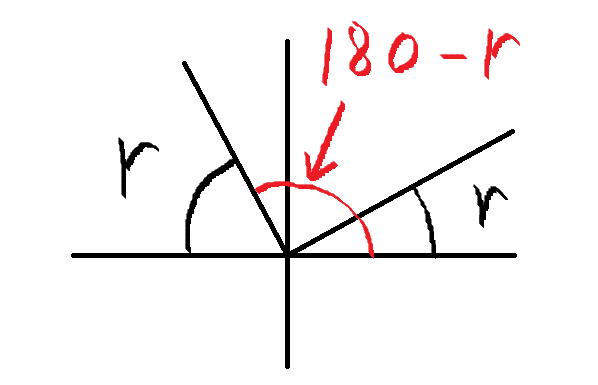

## 原理

这段SimpleFOC的[代码](#源代码)实际来自开源项目ODrive的[`utils.cpp`](https://github.com/odriverobotics/ODrive/blob/master/Firmware/MotorControl/utils.cpp)，  

理论依据来自stackexchange中的一篇[`问答`](https://math.stackexchange.com/a/1105038/81278)，

下面尝试记录对该函数的理解。

---

`arctan2(z)`的计算过程

- 参数化简：计算`a := min (|x|, |y|) / max (|x|, |y|)`，使得`a∈[0,1]`。
- 多项式逼近：使用一个多项式来近似计算 `arctan(a)` 的值。
- 结果调整：根据`x`和`y`的正负性来判断实际所在的象限，计算实际的`arctan2(a)`角度  

---

**计算反正切**

这里使用的是一个多项式计算反正切，该多项式是对`arctan()`函数的一种逼近

泰勒级数展开（Taylor Series Expansion）逼近

- 泰勒级数是一种常用的数学工具，
- 其更多地关注函数在某一点附近的局部函数值
- 随着 $x$ 的增大，泰勒级数的误差可能会增加。
- 对于 $\arctan(x)$ 函数，它的泰勒级数在 $x=0$ 处展开为：
- $\arctan(x) = x - \frac{x^3}{3} + \frac{x^5}{5} - \frac{x^7}{7} + \cdots$

最小最大值逼近（minimax approximation）

- 这种方法的目标是在给定区间（如`[0,1]`）内找到一个多项式，使得该多项式与目标函数之间的最大偏差最小化。这样的多项式函数图像在整体上更接近目标函数图像。
- 对于 $\arctan(x)$ 函数，在给定区间`[0,1]`通过雷米兹（Remez）算法确定的最佳系数为：
- $\arctan(x) = -0.0464964749 x^7 +0.15931422 x^5 - 0.327622764 x^3 + x$


---

**多项式化简**

这里使用**霍纳法则**来对多项式进行化简，目的是减少计算机计算乘法的次数。

原理是拆分多项式，如:  

$y=Ax^4+Bx^3+Cx^2+Dx^1$

该多项式至少需要计算(0+1)+(1+1)+(1+1)+(1+1)=7次乘法

而将其拆分得到：

$y=x(D+x(C+x(B+A(x))))$

该多项式只需要计算4次乘法

**所以**

这里可以把：`-0.0464964749 x^7 +0.15931422 x^5 - 0.327622764 x^3 + x`  

写成：`((-0.0464964749fx^2 + 0.15931422f)x^2 - 0.327622764f)x^3 + x`


```cpp
// s := a * a
float s = a * a;
// r := ((-0.0464964749 * s + 0.15931422) * s - 0.327622764) * s * a + a
float r = ((-0.0464964749f * s + 0.15931422f) * s - 0.327622764f) * s * a + a;
```

---

**根据(x,y)所在象限计算`arctan2`**

下面的`1.57079637f`为90° `3.14159274f`为180° 

如果`abs_y > abs_x`那么上面实际计算的是`arctan(a=x/y)`，
否则，实际计算的是`arctan(a=y/z)`  

根据公式：`arctan(z)=π/2−arctan(1/z)`  
所以`r = 1.57079637f - r`
```cpp
// if |y| > |x| then r := 1.57079637 - r
if (abs_y > abs_x) r = 1.57079637f - r;
```

`x<0` 可以认为是将r从第一或四象限翻转到第二或三象限：



```cpp
// if x < 0 then r := 3.14159274 - r
if (x < 0.0f) r = 3.14159274f - r;
```

`y<0` 可以认为是将r从第一或二象限翻转到第三或四象限：


```cpp
// if y < 0 then r := -r
if (y < 0.0f) r = -r;
```

## 源代码

```cpp
#include "foc_utils.h"
// fast_atan2 based on https://math.stackexchange.com/a/1105038/81278
// Via Odrive project
// https://github.com/odriverobotics/ODrive/blob/master/Firmware/MotorControl/utils.cpp
// This function is MIT licenced, copyright Oskar Weigl/Odrive Robotics
// The origin for Odrive atan2 is public domain. Thanks to Odrive for making
// it easy to borrow.
__attribute__((weak)) float _atan2(float y, float x) {
    // a := min (|x|, |y|) / max (|x|, |y|)
    float abs_y = fabsf(y);
    float abs_x = fabsf(x);
    // inject FLT_MIN in denominator to avoid division by zero
    float a = min(abs_x, abs_y) / (max(abs_x, abs_y));
    // s := a * a
    float s = a * a;
    // r := ((-0.0464964749 * s + 0.15931422) * s - 0.327622764) * s * a + a
    float r =
        ((-0.0464964749f * s + 0.15931422f) * s - 0.327622764f) * s * a + a;
    // if |y| > |x| then r := 1.57079637 - r
    if (abs_y > abs_x) r = 1.57079637f - r;
    // if x < 0 then r := 3.14159274 - r
    if (x < 0.0f) r = 3.14159274f - r;
    // if y < 0 then r := -r
    if (y < 0.0f) r = -r;

    return r;
  }
```