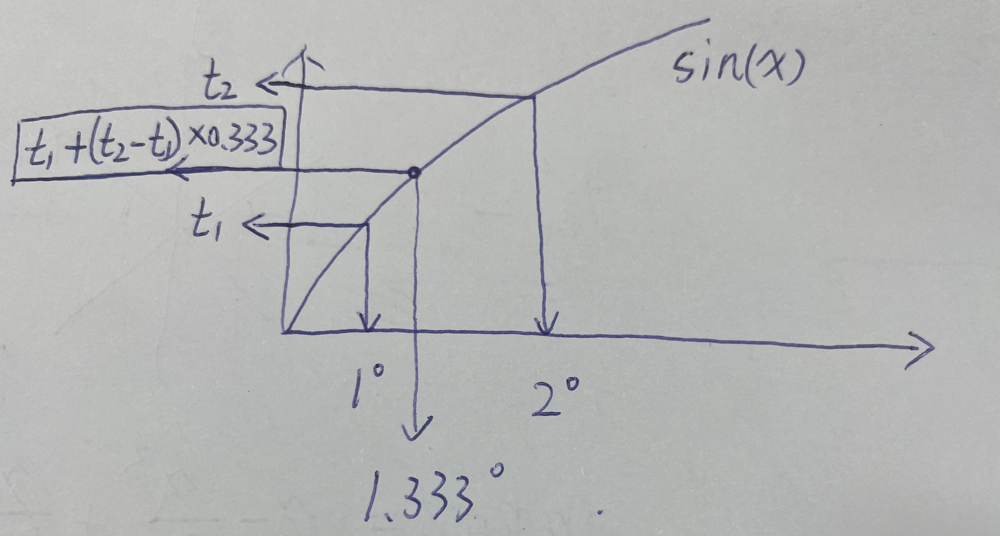

## 作用

源代码中称，使用这种方法计算正弦余弦后，**计算耗时从300us降低到了110us**，性能提升了3倍。

`BLDCMotor.cpp`
```cpp
// Function using sine approximation
// regular sin + cos ~300us    (no memory usage)
// approx  _sin + _cos ~110us  (400Byte)
void BLDCMotor::setPhaseVoltage(float Uq, float Ud, float angle_el) {
  ......
}
```

## 原理


[`foc_utils.c`](#源代码)中的代码实现了一个简化版的正弦函数计算方法，它使用了一个包含65个元素的查找表（lookup table）来进行近似计算，**并通过线性插值来提高精度**。这种方法在资源受限的环境中非常有用，比如在嵌入式系统中，可以节省大量的计算资源。

下面是对代码的一些理解和解释：

---

`sine_array` 是一个16位整数数组，存储了`1/4`个周期内的正弦值。  

剩下`3/4`周期的sin值和前`1/4`周期对称（左右对称、上下对称、原点对称），不需要存储

数组本身的精度应该是`90°/64=1.406°`，经过线性插值精度将会更高。


```cpp
static uint16_t sine_array[65] = {0,804,1608,2411,3212,4011,4808,5602,6393,7180,7962,8740,9512,10279,11039,11793,12540,13279,14010,14733,15447,16151,16846,17531,18205,18868,19520,20160,20788,21403,22006,22595,23170,23732,24279,24812,25330,25833,26320,26791,27246,27684,28106,28511,28899,29269,29622,29957,30274,30572,30853,31114,31357,31581,31786,31972,32138,32286,32413,32522,32610,32679,32729,32758,32768};
```

---
`i = (unsigned int)(a * (64*4*256.0f/_2PI));` 是计算索引，可以拆分两部分
- `i=a*64*4/_2PI` 实现将`a`从`[0,2PI]`映射到`[0,256]`
- `i*=256.0f` 实现将`i`放大`2^8=256`倍，即把二进制小数点往左移动8位。
```cpp
unsigned int i = (unsigned int)(a * (64*4*256.0f/_2PI));
```
---
`frac = i & 0xff` 得到小数部分  
`i = (i >> 8) & 0xff` 得到整数部分
```cpp
int frac = i & 0xff;
i = (i >> 8) & 0xff;
```

---

根据所在的周期计算值

```cpp
if (i < 64) {
  t1 = (int32_t)sine_array[i]; t2 = (int32_t)sine_array[i+1];
}
else if(i < 128) {
  t1 = (int32_t)sine_array[128 - i]; t2 = (int32_t)sine_array[127 - i];
}
else if(i < 192) {
  t1 = -(int32_t)sine_array[-128 + i]; t2 = -(int32_t)sine_array[-127 + i];
}
else {
  t1 = -(int32_t)sine_array[256 - i]; t2 = -(int32_t)sine_array[255 - i];
}
```

---

通过线性插值来提高精度




```cpp
return (1.0f/32768.0f) * (t1 + (((t2 - t1) * frac) >> 8));
```


---


cos函数可用通过sin函数求解，

因为在其图像上，sin向左平移`π/2`就是cos

`sin(π/2 + x) = cos(x)`

唯一可能需要注意的只有定义域的范围，须保证 `a_sin∈[0,2PI]`

```cpp
float _cos(float a){
  float a_sin = a + _PI_2;
  a_sin = a_sin > _2PI ? a_sin - _2PI : a_sin;
  return _sin(a_sin);
}
```


## 源代码

```cpp
#include "foc_utils.h"


// function approximating the sine calculation by using fixed size array
// uses a 65 element lookup table and interpolation
// thanks to @dekutree for his work on optimizing this
__attribute__((weak)) float _sin(float a){
  // 16bit integer array for sine lookup. interpolation is used for better precision
  // 16 bit precision on sine value, 8 bit fractional value for interpolation, 6bit LUT size
  // resulting precision compared to stdlib sine is 0.00006480 (RMS difference in range -PI,PI for 3217 steps)
  static uint16_t sine_array[65] = {0,804,1608,2411,3212,4011,4808,5602,6393,7180,7962,8740,9512,10279,11039,11793,12540,13279,14010,14733,15447,16151,16846,17531,18205,18868,19520,20160,20788,21403,22006,22595,23170,23732,24279,24812,25330,25833,26320,26791,27246,27684,28106,28511,28899,29269,29622,29957,30274,30572,30853,31114,31357,31581,31786,31972,32138,32286,32413,32522,32610,32679,32729,32758,32768};
  int32_t t1, t2;
  unsigned int i = (unsigned int)(a * (64*4*256.0f/_2PI));
  int frac = i & 0xff;
  i = (i >> 8) & 0xff;
  if (i < 64) {
    t1 = (int32_t)sine_array[i]; t2 = (int32_t)sine_array[i+1];
  }
  else if(i < 128) {
    t1 = (int32_t)sine_array[128 - i]; t2 = (int32_t)sine_array[127 - i];
  }
  else if(i < 192) {
    t1 = -(int32_t)sine_array[-128 + i]; t2 = -(int32_t)sine_array[-127 + i];
  }
  else {
    t1 = -(int32_t)sine_array[256 - i]; t2 = -(int32_t)sine_array[255 - i];
  }
  return (1.0f/32768.0f) * (t1 + (((t2 - t1) * frac) >> 8));
}

// function approximating cosine calculation by using fixed size array
// ~55us (float array)
// ~56us (int array)
// precision +-0.005
// it has to receive an angle in between 0 and 2PI
__attribute__((weak)) float _cos(float a){
  float a_sin = a + _PI_2;
  a_sin = a_sin > _2PI ? a_sin - _2PI : a_sin;
  return _sin(a_sin);
}


__attribute__((weak)) void _sincos(float a, float* s, float* c){
  *s = _sin(a);
  *c = _cos(a);
}
```